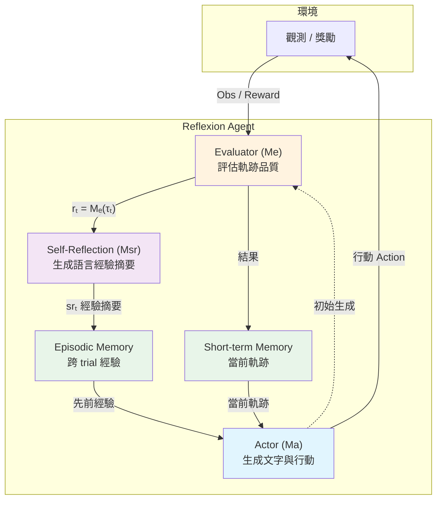
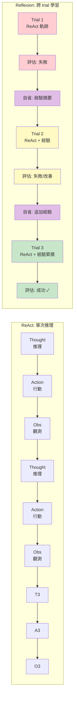
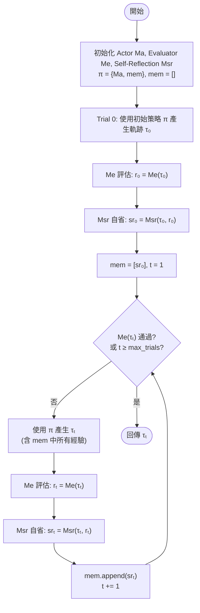

# Reflexion：語言代理的語言強化學習解讀

## TL;DR

Reflexion 提出一個讓 LLM agent 在不更新權重的情況下，透過語言回饋（verbal reinforcement）從 trial-and-error 中學習的框架。核心機制是讓 agent 每次失敗後「自我反思」、將經驗以自然語言摘要存入 episodic memory，並在後續 trial 中利用這些經驗引導決策。以 GPT-4 為基礎的 Reflexion agent 在 HumanEval 上達到 91% pass@1，超越 GPT-4 本身的 80%，在 AlfWorld 決策任務上比純 ReAct 高出 22% 的完成率。

---

## 背景與動機

### LLM 作為自主代理的崛起

隨著大型語言模型（LLM）的發展，越來越多的研究試圖將 LLM 用作自主決策代理的核心。ReAct（Yao et al., 2023）、SayCan（Ahn et al., 2022）、Toolformer（Schick et al., 2023）等工作證明了基於 LLM 構建自主代理的可行性——這些方法讓 LLM 生成文字與「行動」，然後透過 API 呼叫在環境中執行。由於 LLM 擁有龐大的參數量和從網路語料中學習到的世界知識，它們具備在全新環境中進行零樣本（zero-shot）或少樣本（few-shot）推理與決策的潛力。

這個方向的吸引力在於：如果 LLM 能夠自主地與環境互動——查閱文件、執行程式碼、操作 API——那麼它就能夠解決遠超過其訓練資料涵蓋範圍的問題。例如，一個 LLM agent 可以透過搜尋引擎查找最新資訊、透過編譯器測試程式碼正確性、透過 API 操作真實世界中的設備。

### 但 LLM agent 面臨的學習困境

儘管這些方法展示了令人振奮的可能性，它們面臨一個根本性的挑戰：**如何讓 agent 從錯誤中學習？**

傳統的做法有幾條路線：

**第一條路線：In-Context Learning（ICL）**。最直接的方式是在 prompt 中加入正確的範例，讓 LLM 模仿。這種方法的限制很明顯：prompt 的長度有限，無法容納大量範例，而且 LLM 對 prompt 中範例的順序和格式非常敏感。

**第二條路線：Supervised Fine-Tuning（SFT）**。收集大量人工標註的正確行為軌跡來 fine-tune LLM。這種方法雖然有效，但需要大量的標註資料和計算資源。更重要的是，LLM 參數量巨大（GPT-3 有 175B、PaLM 有 540B），每次任務變更都要重新 fine-tune 在實務上不可行。

**第三條路線：傳統強化學習（RL）**。使用 RL 演算法（如 PPO）來優化 LLM 的策略。這種方法在 InstructGPT/ChatGPT 上取得了巨大成功，但同樣需要大量獎勵標註和昂貴的 fine-tuning。此外，傳統 RL 使用的 scalar reward 無法傳遞豐富的語意資訊——一個二元的「成功/失敗」信號無法告訴 agent 「你在第 5 步錯了，因為你誤以為鍋鏟在爐台上」。

### ReAct：推理與行動的協同

在 Reflexion 之前，ReAct 是語言代理領域最具影響力的框架之一。ReAct 的核心洞察很簡單：將 LLM 的行動空間從純粹的行動（action）擴展到語言空間，讓 LLM 可以交錯地生成「思考」（thought）與「行動」（action）。這種設計帶來了關鍵的協同效應：

- **推理引導行動（reason to act）**：思考軌跡幫助模型分解任務目標、追蹤進度、處理例外情況
- **行動支持推理（act to reason）**：與外部環境（如 Wikipedia API）互動可獲取新資訊來支持推理

在 HotPotQA 多跳問答任務中，ReAct 利用 Wikipedia API 進行檢索，解決了 Chain-of-Thought（CoT）推理中的幻覺（hallucination）和錯誤傳播問題。在 AlfWorld 文字遊戲中，ReAct 僅用 1-2 個 in-context examples 就超越了需要 10³–10⁵ 訓練樣本的模仿學習方法。

然而，ReAct 有一個根本限制：**它無法從失敗中學習**。ReAct agent 的每次 trial 都是獨立的——如果它在第一次嘗試中失敗了，下一次嘗試不會從先前的錯誤中獲得任何資訊。論文中觀察到，ReAct-only 的 agent 在 AlfWorld 的 6-7 次 trial 後效能就不再提升，始終有約 22% 的任務因為幻覺而失敗。

### 為什麼傳統 RL 不適合語言代理？

傳統的強化學習（RL）方法需要（a）大量的訓練樣本，（b）昂貴的模型微調（fine-tuning），以及（c）精心設計的獎勵函數。這對 LLM 有幾個挑戰：

1. **LLM 參數量巨大**，完整 fine-tuning 的計算成本極高。以 GPT-3 175B 為例，一次完整 fine-tuning 需要數百個 GPU-hours。
2. **語言空間的獎勵信號稀疏且語意豐富**，scalar reward 無法捕捉「哪裡錯了、應該如何修正」的細粒度資訊。在一個 30 步的 AlfWorld 軌跡中，agent 可能只有前 28 步正確，但最後 2 步因為幻覺而失敗——scalar reward 只告訴你「失敗了」，但不告訴你哪裡失敗。
3. **Credit assignment 困難**——在一個長軌跡中，是哪個行動導致了最終的失敗？如果失敗發生在第 28 步，但前面 27 步都是正確的，scalar reward 無法區分這種情況與「從頭錯到尾」的情況。

為了解決這些問題，Shinn 等人提出了 **Reflexion**，一個全新的「語言強化學習」（Verbal Reinforcement Learning）框架。核心想法是：在不更新權重的前提下，讓 LLM 透過語言來反思自己的錯誤，並將反思結果作為經驗儲存下來，在後續嘗試中利用這些經驗。

人類在學習複雜任務時，很少需要重新連接大腦神經元——我們透過語言來反思自己的失誤、形成新的策略。Reflexion 試圖將這種人類的學習機制引入 LLM agent。

---

## 視覺總覽



*圖 1：Reflexion 三元架構與記憶流示意圖。Actor 與環境互動產生軌跡，Evaluator 評估軌跡品質，Self-Reflection 將評估結果轉譯為語言經驗摘要存入長期記憶，影響下一輪的 Actor 行為。*



*圖 2：ReAct（單次推理）與 Reflexion（跨 trial 學習）的流程對比。ReAct 每次 trial 從零開始，Reflexion 透過 self-reflection 將經驗累積在 episodic memory 中，實現跨 trial 的正向遷移。*



*圖 3：Reflexion 強化演算法流程圖。核心是每次 trial 後的 self-reflection→memory→next trial 循環，直到 Evaluator 判定通過或達到最大 trial 次數。*

## 核心知識點

### 知識點 1：Verbal Reinforcement——語言作為強化信號

Reflexion 最根本的貢獻是引入「語言強化」（verbal reinforcement）的概念。不同於傳統 RL 使用 scalar reward 或 vector reward 來引導策略優化，Reflexion 將環境回饋（binary success/fail、heuristic 分數等）**轉譯成自然語言的經驗摘要**。

這個轉譯過程的關鍵在於「語意梯度」（semantic gradient）的類比。在傳統 RL 中，policy gradient 提供了參數更新的方向和幅度；在 Reflexion 中，語言經驗摘要提供了行為調整的方向和具體建議。例如，與其讓 agent 只收到一個「失敗」的 scalar signal，不如告訴它：

> 「你一開始錯誤地假設鍋鏟在爐台上，但實際上它在抽屜裡。下次應該先檢查抽屜。」

這種語言形式的回饋有幾個優點：
- **資訊豐富**——不只告訴 agent「錯了」，還解釋「哪裡錯」和「該怎麼修正」
- **無需 fine-tuning**——所有學習發生在 prompt 層級
- **可解釋**——human-readable 的經驗可以隨時檢視和干預

### 知識點 2：Actor-Evaluator-Self-Reflection 三元架構

Reflexion 由三個模型協作構成，形成一個閉環學習系統：

```
Agent ──→ Actor ──→ Action ──→ Environment ──→ Obs/Reward ──→ Evaluator
   ↑                                                                  ↓
   └────────── Self-Reflection ←───── 軌跡 + 獎勵 ←──────────────────┘
```

#### Actor（Ma）

Actor 是基於 LLM 的行動生成器，負責根據目前的狀態觀測（包括 short-term 與 long-term memory）產生文字與行動。Actor 可以採用不同的策略，論文中探索了 Chain-of-Thought（CoT）和 ReAct 作為 Actor 的實例化。Actor 的設計類似於傳統 policy-based RL 中的 policy $\pi(a_t|s_t)$——在時間步 $t$ 從當前策略 $\pi$ 中採樣一個行動 $a_t$，接收來自環境的觀測 $o_t$。

#### Evaluator（Me）

Evaluator 負責評估 Actor 產生軌跡的品質。它輸入一條軌跡 $\tau_t$，輸出一個獎勵分數 $r_t = M_e(\tau_t)$。論文中探索了多種 Evaluator 變體：

- **Exact match（EM）**：用於推理任務，檢查輸出是否與標準答案完全一致
- **預定義 heuristic**：用於決策任務，例如「是否在同一個動作上循環超過 3 次」或「行動數是否超過 30」
- **LLM 作為 Evaluator**：用另一個 LLM 實例進行二元分類判斷

Evaluator 的輸出 $r_t$ 只是一個 scalar 獎勵，並不直接用於引導 agent——它是 Self-Reflection 模型的「原料」。

#### Self-Reflection（Msr）

Self-Reflection 模型是 Reflexion 的關鍵創新。它分析軌跡 $\tau_t$ 與獎勵 $r_t$，產生有行動建議的語言經驗摘要 $sr_t$。這個摘要 $sr_t$ 被存入 episodic memory $mem$，在後續 trial 中作為 Actor 的額外上下文。

Self-Reflection 需要解決一個核心挑戰：**credit assignment**——在一條長軌跡中，確定哪個行動是導致失敗的根本原因，並生成具體的改進建議。論文中透過 LLM 的語意理解能力來處理這個問題，例如在 AlfWorld 環境中，agent 可能執行了 20 個正確行動後才做錯一個，Self-Reflection 可以定位到那個錯誤行動並給出修正方向。

### 知識點 3：雙層記憶架構

Reflexion 區分了兩種記憶類型，類似於人類的認知系統：

**Short-term memory（短期記憶）**：目前 trial 的 trajectory history，包含所有行動與環境觀測。提供細粒度的近期細節。

**Long-term episodic memory（長期情節記憶）**：來自先前 trial 的 self-reflection 摘要，以自然語言形式儲存在記憶緩衝區中。提供經過提煉的跨 trial 經驗教訓。

兩種記憶的結合方式是：Actor 在每次生成時，同時接收目前的 trajectory（short-term）和過去的 reflection 摘要（long-term）作為上下文。為了避免超過 LLM 的 context window 限制，long-term memory 採用 sliding window 機制，通常只保留最近 1-3 筆經驗。

### 知識點 4：回饋訊號類型與放大策略

Reflexion 探索了三種回饋訊號，強度從低到高：

**二元環境回饋（Binary）**：最簡單的形式，環境只回傳 success/fail。Self-Reflection 模型需要自行分析 failure 的原因。適用於 AlfWorld 等環境（任務完成時回傳成功，否則持續進行）。

**預定義 Heuristic**：針對常見的失敗模式設計啟發式規則。例如 AlfWorld 中的 heuristic 檢查「是否執行相同動作超過 3 次且收到相同回應」（hallucination 的典型徵兆）或「行動數是否超過 30 步」（規劃效率低落）。

**LLM 自我評估**：最強大的形式。在決策任務中使用 LLM 進行二元分類判斷；在程式碼任務中，agent 自行生成 unit test suite，透過執行結果來判斷程式碼的正確性。這種方式讓 Reflexion agent 可以完全自主運作，無需人類標註。

回饋訊號的「放大」過程可以形式化描述為：

$$r_t = M_e(\tau_t) \quad \rightarrow \quad sr_t = M_{sr}(\tau_t, r_t) \quad \rightarrow \quad mem \leftarrow mem \cup \{sr_t\}$$

scalar 獎勵 $r_t$ 被 $M_{sr}$「放大」為語言摘要 $sr_t$，儲存到記憶中後，在下一 trial 影響 Actor 的行為。

### 知識點 5：Reflexion 強化演算法

論文中的演算法 1 描述了完整的迭代過程。將這個過程與傳統 RL 做對比有助於理解其本質。

**傳統 Policy-based RL** 的更新方式為：

$$\theta_{t+1} = \theta_t + \alpha \nabla_\theta J(\pi_\theta)$$

其中 $\theta$ 是策略網路的權重，$\nabla_\theta J(\pi_\theta)$ 是 policy gradient，透過獎勵信號計算。這個過程需要反向傳播（backpropagation），計算成本極高。

**Reflexion 的「策略更新」** 則完全不同：

$$\pi_{t+1} = \{M_a, mem_{t+1}\}, \quad mem_{t+1} = mem_t \cup \{M_{sr}(\tau_t, r_t)\}$$

策略 $\pi$ 由兩部分組成：固定的 LLM $M_a$ 和可變的記憶 $mem$。每次「更新」不是修改 $M_a$ 的權重，而是向 $mem$ 追加新的語言經驗。$M_{sr}$ 將稀疏的 scalar 獎勵 $r_t$ 轉譯為豐富的語言經驗。

完整的迭代過程如下：

```python
# Reflexion 自我強化演算法（Algorithm 1）
初始化 Actor Ma, Evaluator Me, Self-Reflection Msr
初始化策略 π = {Ma, mem}
產生初始軌跡 τ₀
用 Me 評估 τ₀
用 Msr 產生初始自省摘要 sr₀
設定 mem = [sr₀]
設定 t = 0

while Me 未通過 且 t < max_trials:
    使用 π 產生軌跡 τₜ = [a₀, o₀, ..., aᵢ, oᵢ]
    用 Me 評估 τₜ
    用 Msr 產生自省摘要 srₜ
    將 srₜ 附加到 mem
    t += 1

return τₜ  # 通過評估的軌跡
```

這個過程的核心特徵是：
- 第一次 trial 使用初始策略（沒有先驗經驗）
- 每次 trial 結束後，self-reflection 產生新的經驗摘要
- 經驗累積在 $mem$ 中，$mem$ 的內容會影響 _下一次_ trial 的 Actor 行為
- 直到 Evaluator 判定通過，或達到最大 trial 次數

### 知識點 6：ReAct 的形式化定義

理解 Reflexion 需要先理解 ReAct。ReAct 將 LLM agent 的行動空間從 $A$ 擴展為 $\hat{A} = A \cup L$，其中 $L$ 是語言空間（thought space）。一個 thought $\hat{a}_t \in L$ 不會影響外部環境（沒有觀測回饋），而是透過推理當前上下文 $c_t$ 來組合有用資訊：

$$c_{t+1} = (c_t, \hat{a}_t), \quad \hat{a}_t \sim \pi_{LM}(\cdot|c_t)$$

在決策任務中，thought 只稀疏地出現在軌跡中最相關的位置。論文中使用的 Wikipedia API 包含三種行動類型：

| 行動 | 功能 | 回傳 |
|------|------|------|
| `search[entity]` | 搜尋實體 | 對應頁面前 5 句，或 top-5 相似實體 |
| `lookup[string]` | 在頁面中搜尋字串 | 下一個匹配句子 |
| `finish[answer]` | 結束任務 | 最終答案 |

ReAct 透過交替生成 thought 與 action，形成了 reasoning-acting-observation 的循環。每個循環中，thought 用於檢索策略規劃（「我接下來應該搜尋什麼」）、觀測摘要（「這個段落告訴我……」）、推理合成（「所以答案是……」）。

### 知識點 7：三領域的定量結果詳解

#### AlfWorld（序列決策）

AlfWorld 包含 134 個測試場景、6 種任務類型。Reflexion 使用 ReAct 作為 Actor，搭配 heuristic 評估（檢測重複動作或過長軌跡）進行 self-evaluation。

在各任務類型上的詳細成功率：

| 任務類型 | ReAct-only | ReAct+Reflexion（最佳） |
|----------|:----------:|:----------------------:|
| Pick（拿起物品） | 88% | 96% |
| Clean（清潔物品） | 42% | 86% |
| Heat（加熱物品） | 65% | 78% |
| Cool（冷卻物品） | 39% | 69% |
| Look（搜尋物品） | 92% | 100% |
| Pick 2（拿兩個物品） | 58% | 71% |
| **全部平均** | **45%** | **71%** |

Reflexion 在 12 次 trial 中逐漸學習，從約 50% 的初始成功率上升到接近 100%（134 個任務中完成 130 個）。相對對照組 ReAct-only 的學習曲線在 trial 6-7 後停滯，Reflexion 的曲線則持續上升。

**錯誤類型分析**顯示了 Reflexion 的關鍵優勢：

- ReAct-only 的失敗主因是 **hallucination**（22%）——agent 聲稱做了某事但實際上沒做，然後繼續基於錯誤假設執行更多行動，形成無法挽回的長錯誤軌跡
- Reflexion 使用 self-reflection 將長失敗軌跡提煉為相關經驗，幾乎完全消除了 hallucination 類別的錯誤
- 剩餘的少數失敗主要是 **inefficient planning**——agent 在一系列探索中未系統性地搜尋所有可能位置

#### HotPotQA（推理）

HotPotQA 包含 113k 個需要跨多篇 Wikipedia 文章推理的問答對。Reflexion 使用 CoT 和 ReAct 兩種 Actor 策略，搭配 exact match 評估。

關鍵結果：

- CoT-only 和 ReAct-only 無法跨 trial 改善（高溫採樣 0.7 下，沒有任何失敗案例在後續 trial 中被解決）
- CoT + Reflexion：從約 40% 的初始準確率提升到約 60%（+20%）
- CoT (GT) + Reflexion（提供 ground truth context）：從 61% 提升到 75%（+14%）

ablations 顯示了不同記憶元件的貢獻：
- CoT (GT) only：61%（基線，無法改善）
- CoT (GT) + 單純 episodic memory（不含 self-reflection）：67%（+6%）
- CoT (GT) + Episodic memory + Self-reflection：75%（+14%）

**Self-reflection 超越單純 episodic memory 的 8%** 是論文中最重要的消融發現之一。這表示 agent 不僅需要「過去發生了什麼」的記憶，還需要「從過去經驗中提煉出的語言教訓」才能有效跨 trial 學習。

#### HumanEval（程式碼生成）

Reflexion 在 HumanEval 上達到 91% pass@1，超越 GPT-4 的 80%。這是一個重要的里程碑：pass@1 表示「第一次提交就正確」，而傳統的 debug 方法（如 AlphaCode、Self-Debugging）通常需要訪問 ground truth tests 或進行多次評估。

Reflexion 程式碼生成的獨特之處在於測試機制的設計。與決策任務使用 heuristic 或 LLM 評估不同，程式碼任務使用 **自我生成的 unit test suite**：

1. 使用 CoT prompting 生成多樣化的測試案例（包含自然語言描述）
2. AST 解析過濾語法有效的測試陳述
3. 從生成的測試池中採樣最多 6 個組成測試套件
4. 執行程式碼 → 測試結果 → 失敗 → self-reflection → 修改 → 再執行

這種設計讓 Reflexion 可以在不依賴 ground truth tests 的情況下進行自我評估和自我修正——這是符合 pass@1 定義的關鍵。

### 知識點 8：Reflexion 的消融分析深度解讀

論文在 HumanEval Rust（50 個最難題目）上進行了系統性的消融實驗：

| 實驗條件 | 測試生成 | Self-reflection | pass@1 |
|----------|:--------:|:---------------:|:------:|
| 基線（單次生成） | ✗ | ✗ | 60% |
| 無測試生成 | ✗ | ✓ | 52% |
| 無 Self-reflection | ✓ | ✗ | 60% |
| Reflexion 完整 | ✓ | ✓ | **68%** |

**結果解讀：**

1. **省略測試生成 → 52%（低於基線 60%）**：沒有 unit test 的執行結果，agent 無法判斷當前程式碼是否正確。self-reflection 失去目標，反而可能對正確的程式碼做出有害的修改。

2. **省略 Self-reflection → 60%（等於基線）**：即使有測試執行結果，沒有語言反思來連接「錯誤識別」和「實作改善」，測試結果無法轉化為有效的修復。agent 雖然知道程式碼有問題，但不知道如何修正。

3. **完整 Reflexion → 68%**：測試生成提供錯誤信號，self-reflection 提供修復方向。兩者互補，達到最佳效果。

論文據此提出了一個重要論點：**「盲目的 trial-and-error debug 方法（無 self-reflection）在困難任務上效果有限」**——編譯器可以報告語法錯誤，但錯誤的修正方向需要語言反思來引導。

### 知識點 9：語言強化的優勢與權衡

Reflexion 相較於傳統 RL 的優勢總結：

| 面向 | 傳統 RL | Reflexion（語言強化） |
|------|---------|---------------------|
| 權重更新 | 需要（backprop） | 不需要 |
| 獎勵形式 | Scalar / Vector | 自然語言 |
| 經驗表示 | 隱式（網路權重） | 顯式（文字記憶） |
| 可解釋性 | 低（黑箱策略） | 高（可讀取反思內容） |
| 計算成本 | 高（每次更新需 forward+backward） | 低（只有 forward pass） |
| 跨任務遷移 | 需重新訓練 | 可直接使用（更換 prompt） |
| 記憶容量 | 理論上無限制（網路容量） | 受限於 context window |

主要的權衡是：
- **沒有收斂保證**：傳統 RL 有 policy gradient theorem 等理論保證，語言強化完全依賴 LLM 的 emergent ability
- **模型依賴性**：效能與 LLM 的品質緊密綁定，小模型的 reflection 品質可能不足
- **記憶容量**：context window 限制了可以累積的經驗數量

---

## 方法詳解：從 ReAct 到 Reflexion 的完整演進

### ReAct 的基礎框架

ReAct 的設計思路是將 LLM 的行動空間 $A$ 擴展為 $A \cup L$，其中 $L$ 是語言空間。一個語言行動 $\hat{a}_t \in L$（稱為 thought 或 reasoning trace）不會影響外部環境，也不會產生觀測回饋，而是透過對當前上下文 $c_t$ 進行推理來組合有用資訊，更新上下文 $c_{t+1} = (c_t, \hat{a}_t)$。

在決策任務中，thought 只稀疏地出現在軌跡中最相關的位置，由 LLM 自行決定 thought 與 action 的非同步發生時機。這種設計讓 ReAct 兼具靈活性和效率。

ReAct 在知識密集型推理任務中使用了一個簡單的 Wikipedia API，包含三種行動：
1. `search[entity]`：搜尋實體，回傳前 5 句
2. `lookup[string]`：在頁面中尋找字串
3. `finish[answer]`：結束任務並輸出答案

透過與 Wikipedia API 的互動，ReAct 能夠檢索外部知識來支持推理，同時用推理來引導下一步檢索的方向——形成推理與行動的協同循環。

### ReAct 在知識密集型推理上的表現與失敗模式

ReAct 在 HotPotQA 和 FEVER 上的表現揭示了幾個關鍵洞察。論文使用 PaLM-540B 進行實驗，對比了四種 prompt 方法：Standard（標準）、CoT（純推理）、Act（純行動）、ReAct（推理+行動）。

| 方法 | HotPotQA (EM) | FEVER (Acc) |
|------|:-------------:|:-----------:|
| Standard | 28.7 | 57.1 |
| CoT（Chain-of-Thought） | 29.4 | 56.3 |
| CoT-SC（Self-Consistency, 21 samples） | 33.4 | 60.4 |
| Act-only | 25.7 | 58.9 |
| **ReAct** | **27.4** | **60.9** |
| ReAct → CoT-SC（ReAct 失敗後退到 CoT） | **34.2** | 62.0 |
| CoT-SC → ReAct（低信心時退到 ReAct） | 35.1 | **64.6** |

論文對 200 個隨機樣本進行了人工失敗模式分析，揭示了兩者的本質差異：

| 模式 | 類型 | ReAct | CoT |
|------|------|:----:|:---:|
| **成功 - True Positive** | 正確推理軌跡與事實 | 94% | 86% |
| **成功 - False Positive** | 幻覺推理或事實 → 卻得到正確答案 | 6% | 14% |
| **失敗 - 推理錯誤** | 推理結構錯誤（含重複循環） | 47% | 16% |
| **失敗 - 搜尋結果錯誤** | 搜尋回傳空值或無用資訊 | 23% | — |
| **失敗 - 幻覺** | 幻覺推理軌跡或事實 | 0% | 56% |
| **失敗 - 標籤模糊** | 答案正確但未匹配標準答案格式 | 29% | 28% |

這些數據提供了對兩種方法互補性的深刻理解：

**CoT 的問題是幻覺（56% 的失敗來自幻覺）**。CoT 依賴模型的內部知識進行推理，當內部知識錯誤或過時時，CoT 沒有外部校驗機制。這導致了高 false positive 率（14%）——模型用了錯誤的推理卻偶然得到正確答案。

**ReAct 的問題是推理靈活性不足（47% 的失敗來自推理錯誤）**。ReAct 的結構化約束（thought→action→observation 交錯）讓推理更腳踏實地，但也降低了靈活性。最常見的失敗模式是模型陷入重複相同 thought-action 的循環——由於缺乏 CoT 那樣的自由思考空間，ReAct 有時難以跳出局部困境。

這也是為什麼 **ReAct + CoT-SC 的混合方法**效果最好——在兩種方法之間動態切換，結合了 ReAct 的事實基礎性與 CoT 的推理靈活性。

### ReAct 在決策任務上的表現

在 AlfWorld 中，ReAct 的表現優於所有基線方法。值得注意的是，這是通過 prompting 實現的——沒有 fine-tuning、沒有大量訓練資料。

| 方法 | 平均成功率 |
|------|:----------:|
| BUTLER（模仿學習，10⁵ 軌跡） | 37%（best of 8） |
| Act-only（最佳 trial） | 45% |
| ReAct-IM（Inner Monologue 風格） | 53%（avg） |
| **ReAct（最佳 trial）** | **71%** |

ReAct-IM（Inner Monologue 風格）是論文中一個重要的消融對照。Inner Monologue（Huang et al., 2022b）是第一個使用「內心獨白」（environment feedback 的密集觀察）來引導 embodied agent 的方法。然而，ReAct 的實驗顯示，單純反映外部環境回饋的「密集思考」並不如 ReAct 的「稀疏、多樣化推理」有效。ReAct-IM 在 6 個任務類型中有 5 個落後於標準 ReAct，主要原因是它缺乏高層次的目標分解和常識推理。

在 WebShop 中，ReAct 的一 shot prompting 就與需要 1,012 條人工軌跡的模仿學習方法表現相當，而加上推理後達到 40% 的成功率，超越 IL+RL 方法的 28.7%。

### Reflexion 的三元架構如何運作

回到 Reflexion 的核心設計，其三個模型的協作方式可以進一步形式化。

**Actor $M_a$** 在時間步 $t$ 的策略為：

$$a_t \sim M_a(\cdot | s_t, mem, \tau_{<t})$$

其中 $s_t$ 是當前環境狀態，$mem$ 是長期記憶中的經驗摘要集合，$\tau_{<t}$ 是當前 trial 的歷史軌跡。

**Evaluator $M_e$** 在 trial 結束後評估完整軌跡：

$$r_t = M_e(\tau_t) \in \{0, 1\} \text{ 或 } [0, 1] \text{ 連續值}$$

**Self-Reflection $M_{sr}$** 將軌跡與獎勵轉譯為語言經驗：

$$sr_t = M_{sr}(\tau_t, r_t, mem)$$

$$mem \leftarrow mem \cup \{sr_t\}$$

在實作上，$M_{sr}$ 的 prompt 設計至關重要。論文在不同任務上使用了不同的 self-reflection prompt 模板：

- **決策任務**：「分析這條軌跡，找出哪個行動導致了失敗，下次應該如何調整。」
- **推理任務**：「你的答案錯了。分析你的推理過程，找出錯誤假設，下次應該使用不同的推理策略。」
- **程式碼任務**：「你的程式碼未通過以下測試：[測試結果]。分析錯誤原因，修復程式碼。」

### Reflexion 在實務上的工程考量

#### Prompt 設計要點

有效的 Reflexion 實作需要仔細設計 prompt。以 AlfWorld 為例，論文使用了 2-shot prompting 為 Actor 提供範例，並分別為 Evaluator 和 Self-Reflection 設計了專用 prompt。Evaluate prompt 的設計尤其關鍵——它必須能夠準確判斷任務完成與否，否則會給 Self-Reflection 提供錯誤的訊號。

#### 記憶管理策略

論文中使用了 sliding window 記憶管理，通常保留最近 1-3 筆經驗。這個超參數的選擇需要在「足夠多的經驗累積」和「不超過 context window 限制」之間權衡。在 AlfWorld 中，記憶大小設為 3；在程式碼任務中，由於需要容納程式碼和測試輸出，記憶大小只設為 1。

實作上，記憶的格式是一個自然的文字列表，每個條目前加上「Experience N:」標記。Actor 在生成下一步行動時，會將整個記憶列表作為 system prompt 的一部分：

```
You are an agent in the AlfWorld environment.
Previous experiences:
Experience 1: I tried to pick up the pan from the stove but the pan was not on the stove. Next time I should check the countertop first.
Experience 2: The tomato is likely in the fridge, not on the counter. Check the fridge first.
```

這種直接了當的格式讓記憶可以無縫整合到 LLM 的生成過程中，不需要額外的檢索或排序機制。

#### 計算效率

與傳統 RL 相比，Reflexion 的計算成本主要來自多次 LLM inference（每個 trial 一次），而不是梯度計算。對 GPT-4 這樣的商用模型，這意味著 API 成本的增加而非 GPU 計算時間的增加。在論文報告中，Reflexion 通常需要 3-12 次 trial 來解決一個任務，每次 trial 包含數個 LLM 呼叫。

### Reflexion 如何突破這些限制

Reflexion 在 ReAct 的基礎上增加了兩個關鍵元件：

**1. Self-Reflection 循環**：每次 trial 結束後，Self-Reflection 模型分析失敗軌跡，產生自然語言的經驗摘要。這個摘要不是簡單的「我失敗了」，而是具體的「我在哪裡出錯了，下次該怎麼修正」。

例如，在 AlfWorld 中，一個常見的錯誤是 agent 認為自己持有某個物品但實際上沒有（幻覺）。ReAct-only 的 agent 會繼續基於錯誤的假設執行更多的行動，陷入無法自拔的長軌跡。Reflexion 的 Self-Reflection 可以定位到這個幻覺發生的時刻，並在經驗摘要中記錄「我實際上並沒有拿到鍋鏟，下次應該確認物品確實取得了再繼續」。

**2. Episodic Memory**：自省摘要被存入 episodic memory 中，作為 long-term context 提供給下一 trial 的 Actor。這讓 Reflexion agent 能夠：
- **從早期錯誤中學習**——即使在長軌跡的開頭犯錯，也能被 reflection 捕獲
- **系統性搜尋**——在 AlfWorld 中，如果一個房間有太多櫃子和抽屜，agent 可以透過多個 trial 的 memory 來確保沒有遺漏任何位置

### Reflexion 在三個領域的具體實作

#### 決策任務（AlfWorld）

AlfWorld 是一套基於文字的互動環境，包含 134 個測試場景和 6 種任務類型（尋找隱藏物品、移動物品、操作物品等）。Reflexion 使用 ReAct 作為 Actor，搭配兩種 self-evaluation 技術：

- **Heuristic 評估**：如果 agent 在同一行動上循環超過 3 次，或行動數超過 30 步，觸發 self-reflection
- **LLM 評估**：使用 LLM 進行二元分類判斷任務是否完成

記憶上限設為最近 3 筆經驗。Agent 最多進行 12 次 trial 學習。

#### 推理任務（HotPotQA）

HotPotQA 包含 113k 個需要跨多篇 Wikipedia 文章推理的問答對。Reflexion 使用 CoT 和 ReAct 兩種 Actor 策略，搭配 exact match 評估（EM grading）。

為了測試純推理能力的提升，論文設計了一個控制實驗：提供 ground truth context（Cgt）給 agent，隔離出行動選擇的影響，只測試推理行為。在這種設定下，CoT (GT) 本身有 39% 的錯誤率無法自行修正，而 Reflexion 幫助其在沒有 ground truth answer 的情況下將準確率提升 14%。

#### 程式碼任務（HumanEval、MBPP、LeetcodeHardGym）

程式碼是 Reflexion 最引人注目的應用場景。論文引入了一種獨特的評估機制：agent 自行生成 unit test suite。

測試生成過程：
1. 使用 CoT prompting 生成多樣且詳盡的測試案例
2. 通過 AST（abstract syntax tree）解析過濾語法有效的測試陳述
3. 從生成的測試中採樣最多 6 個組成測試套件 $T = \{t_0, t_1, ..., t_n\}$

然後，agent 進入一個封閉循環：生成程式碼 → 執行測試 → 測試失敗 → self-reflection → 修改程式碼 → 再測試。這個過程可以進行多次，直到所有測試通過。

Reflexion 在 HumanEval 上達到 91% pass@1，超越 GPT-4 的 80%。更重要的是，由於 agent 使用自產測試而非 ground truth tests，Reflexion 的結果可以被視為 pass@1（即「第一次提交就正確」），而傳統的 debug 方法（如 AlphaCode、Self-Debugging）依賴 ground truth test cases，不符合 pass@1 的定義。

---

## 實驗結果

### 決策任務：AlfWorld

AlfWorld 是一套基於文字的互動環境，包含 134 個測試場景和 6 種任務類型。每個任務要求 agent 在模擬的家中完成高層次目標，例如「在書桌燈下檢查紙張」或「將番茄放進冰箱」。一個任務實例可能包含超過 50 個位置，需要超過 50 步才能完成。

| 方法 | 成功率（全部 6 種任務平均） |
|------|:---------------------------:|
| BUTLER（模仿學習，10⁵ 專家軌跡） | 37%（best of 8） |
| Act-only（最佳 trial） | 45% |
| ReAct-IM（Inner Monologue 風格，平均） | 53% |
| ReAct-only（平均） | 41% |
| **ReAct + Reflexion（最佳 trial）** | **71%** |
| **ReAct + Reflexion（平均）** | **55%** |

Reflexion 在 12 次 trial 中逐漸學習，從約 50% 的初始成功率上升到接近 100%（134 個任務中完成 130 個）。相對對照組 ReAct-only 的學習曲線在 trial 6-7 後停滯，Reflexion 的曲線則持續上升。

**錯誤類型分析**顯示了 Reflexion 的關鍵優勢：

- ReAct-only 的失敗主因是 **hallucination**（22%）——agent 聲稱做了某事但實際上沒做，然後繼續基於錯誤假設執行更多行動，形成無法挽回的長錯誤軌跡
- Reflexion 使用 self-reflection 將長失敗軌跡提煉為相關經驗，幾乎完全消除了 hallucination 類別的錯誤（22%→接近 0%）
- 剩餘的少數失敗主要是 **inefficient planning**——agent 在一系列探索中未系統性地搜尋所有可能位置，例如在有多個抽屜的房間中遺漏了某個抽屜

論文中特別提到：學習曲線的特徵是「第一次 trial 後立即**急遽上升**，然後在後續 11 次 trial 中**穩定增長**」。這與人類學習曲線的形狀非常相似——第一次失敗通常能帶來最大的學習效果（因為暴露了最明顯的錯誤模式），後續的改善則來自於 edge cases 的逐步覆蓋。

### 推理任務：HotPotQA

| 方法 | 準確率 |
|------|:------:|
| CoT-only（無法跨 trial 改善） | 基線 |
| ReAct-only（無法跨 trial 改善） | 基線 |
| **CoT + Reflexion** | **基線 + 20%** |
| CoT (GT) + Reflexion | 基線 + 14% |
| CoT (GT) + Episodic Memory only | 基線 + 6% |

消融實驗清楚顯示：**Self-reflection > 單純的 episodic memory**。對照組只加入 episodic memory（最近一次 trajectory）可提升 6%，而加上 self-reflection 後提升到 14%，說明了語言反思的額外價值。

### 程式碼任務

| Benchmark + 語言 | 前 SOTA pass@1 | Reflexion pass@1 |
|------------------|:--------------:|:----------------:|
| HumanEval (Python) | 80.1%（GPT-4） | **91.0%** |
| HumanEval (Rust) | 60.0%（GPT-4） | **68.0%** |
| MBPP (Python) | 80.1%（GPT-4） | 77.1% |
| MBPP (Rust) | 70.9%（GPT-4） | **75.4%** |
| Leetcode Hard (Python) | 7.5%（GPT-4） | **15.0%** |

MBPP Python 是唯一 Reflexion 未超越基線的 benchmark。論文分析發現，MBPP Python 的 false positive 率（測試通過但實作錯誤）高達 16.3%，而 HumanEval Python 只有 1.4%。這是因為 Reflexion 依賴自身生成的測試——如果測試不夠全面，錯誤的實作可能通過測試，agent 便會提前回報成功，錯失修正機會。

### 關鍵消融實驗：程式碼任務

在 HumanEval Rust - 50 個最難題目上的消融實驗揭示了每個元件的貢獻：

| 方法 | 測試生成 | Self-reflection | pass@1 |
|------|:--------:|:---------------:|:------:|
| Base model | ✗ | ✗ | 60% |
| 省略測試生成 | ✓ | ✗ | 52% |
| 省略 Self-reflection | ✓ | ✗ | 60% |
| **Reflexion 完整** | ✓ | ✓ | **68%** |

關鍵發現：

1. **沒有測試生成，Self-reflection 無法改善效能（52% < 60%）**——沒有測試結果，agent 無法判斷當前實作是否正確
2. **沒有 Self-reflection，只有測試生成也無法改善（60% = 基線）**——測試能找到錯誤，但沒有自然語言反思來引導修復方向
3. **兩者結合達到最佳效果（68%）**——測試提供錯誤信號，reflection 提供修復方向

#### 更多定量分析：測試生成品質的影響

論文對測試生成與執行的品質進行了詳細統計。定義四種條件：TP（測試通過且程式正確）、FN（測試失敗但程式正確）、FP（測試通過但程式錯誤）、TN（測試失敗且程式錯誤）。結果：

| 條件 | HumanEval (PY) | MBPP (PY) | HumanEval (RS) | MBPP (RS) |
|------|:--------------:|:---------:|:--------------:|:---------:|
| Base accuracy | 0.80 | 0.80 | 0.60 | 0.71 |
| Reflexion accuracy | **0.91** | 0.77 | **0.68** | **0.75** |
| TP / FP 比 | 99:1 | 84:16 | 87:13 | 84:16 |

HumanEval Python 的 FP 率僅 1.4%，而 MBPP Python 高達 16.3%。這解釋了 Reflexion 在 HumanEval 成功而在 MBPP 失敗的原因：HumanEval 的問題是獨立函數實作，測試容易涵蓋 edge cases；MBPP 的問題更貼近實際應用，行為邊界更模糊。

#### 對比：Reflexion 與其他程式碼生成方法

| 方法 | 需 ground truth tests | pass@1 認定 | 自我改進機制 |
|------|:--------------------:|:-----------:|:------------:|
| AlphaCode | ✓ | 否（排序後提交） | 多樣性採樣 |
| CodeT | ✗（自產測試） | 否（多輪採樣） | 測試過濾 |
| Self-Debugging | ✓ | 否（需 GT tests） | 執行回饋 debug |
| CodeRL | ✓（hidden tests） | 否 | Actor-Critic RL |
| **Reflexion** | **✗（自產測試）** | **是（pass@1）** | **Self-reflection** |

Reflexion 獨特的定位在於同時滿足 **(1) 不依賴 ground truth tests** 和 **(2) 可報告 pass@1** 兩個條件。

#### ReAct 的 Fine-tuning 可擴展性實驗

ReAct 論文中一個經常被忽略但非常重要的實驗是 fine-tuning 的可擴展性。使用 3,000 條由 ReAct 自動生成的軌跡進行 fine-tuning 後：

- PaLM-8B（80 億參數）fine-tuned ReAct 超越了所有 PaLM-62B（620 億參數）的 prompting 方法
- PaLM-62B fine-tuned ReAct 超越了所有 PaLM-540B（5,400 億參數）的 prompting 方法
- 對比之下，fine-tune Standard prompting 或 CoT 的效果顯著較差

這個結果的意義在於：**ReAct 不僅是一種 inference-time 的 prompting 技術，更是一種訓練資料的生成機制**。ReAct 生成的推理+行動軌跡教會了模型如何「推理來引導行動、行動來支持推理」——這是一種跨任務可遷移的技能，而不是死記硬背的知識。在 ReAct 軌跡上 fine-tune 的模型獲得了「如何與環境互動解決問題」的通用能力，而 Standard 或 CoT 軌跡只教會了模型「特定問題的特定答案」。

---

## 延伸閱讀

### Reflexion 的局限與批評

#### 語言策略優化的理論基礎薄弱

Reflexion 最根本的局限在於其缺乏正式的理論保證。傳統 RL 有 policy gradient theorem（策略梯度定理）、TRPO/PPO 的單調改進保證（monotonic improvement guarantee）等紮實的數學基礎。而 Reflexion 的「經驗累積」本質上是一個由 LLM 驅動的啟發式搜索過程——它可能改善，也可能不改善，完全取決於 LLM 的推理品質。

論文中也承認：「Reflexion 是一個優化技術，使用自然語言進行策略優化……但仍可能收斂到非最優的局部解。」（Policy optimization is a powerful approach to improve action choice through experience, but it may still succumb to non-optimal local minima solutions.）

#### 對 LLM 能力的強烈依賴

Reflexion 的有效性高度依賴於 LLM 的自我評估與反思能力。論文的附錄實驗（Appendix A）顯示：

- 使用較弱模型（如 smaller GPT-3 variants）時，Reflexion 的改善幅度顯著降低
- 自我反思是「較強、較大模型的新興能力」（emergent quality of stronger, larger models）
- 較小的模型不僅 reflection 品質較差，在 credit assignment 上也更容易出錯——它們可能將失敗歸因於錯誤的行動，從而給出錯誤的修正方向

這意味著 Reflexion 可能不適用於資源受限的場景（如邊緣設備、小型開源模型），或至少效果會大打折扣。

#### 記憶容量與長期學習的限制

目前的 Reflexion 使用 sliding window 記憶（最多 3 筆經驗），這在需要大量 trial 的任務中會造成「遺忘」問題。例如，如果一個任務需要 20 次 trial 來學習，第 20 次 trial 時 agent 只記得最近 3 次的經驗——前 17 次 trial 中學到的經驗可能已經被遺忘。

論文建議未來使用向量資料庫或傳統 SQL 資料庫來管理經驗，但這帶來了新的挑戰：如何從大量經驗中檢索最相關的少數經驗？這本身就是一個開放的研究問題。

#### 程式碼任務中的測試品質問題

這是論文中最實務的限制。Reflexion 程式碼 agent 的表現完全受到其生成測試品質的制約。論文識別了兩種典型的失敗模式：

**False positive（假陽性）**：生成的測試不夠全面或設計不當，導致錯誤的程式碼通過測試。agent 因此提前報告成功，錯失了修正程式碼的機會。這在 MBPP Python 上尤其嚴重——false positive 率高達 16.3%，導致 Reflexion（77.1%）低於 GPT-4 基線（80.1%）。

**False negative（假陰性）**：測試錯誤地失敗在正確的程式碼上，可能是因為測試假設了特定的實作細節（如變數命名）或使用了不穩定的斷言。

論文的立場是 false negative 比 false positive 更可接受，因為 reflection 可以讓 agent 識別出「是測試有問題」而保持實作不變。但在實務中，區分「測試有問題」和「程式碼有問題」本身就需要一定的推理能力——如果連 credit assignment 都有困難，這個區分就更加困難了。

#### LeetcodeHardGym 的貢獻與局限

論文引入的 LeetcodeHardGym 是一個包含 40 道 Leetcode 困難題目的程式碼生成 RL 環境，支援 19 種程式語言。這些題目的發布日期都在 GPT-4 的訓練資料截止日期（2022 年 10 月 8 日）之後，確保了不會有資料汙染（data contamination）的疑慮。

在這個愈發困難的 benchmark 上，GPT-4 的基線只有 7.5% pass@1，Reflexion 將其提升到 15.0%。雖然改善幅度顯著（100% 的相對提升），但絕對值仍然很低，說明了當前方法在非常困難的程式設計問題上的局限性。

### 對後續研究的影響與延伸

#### Reflexion 的學術影響

Reflexion 發表後，語言代理的「反思」與「自我改進」成為了一個重要的研究方向。後續工作沿著多條線發展：

**更複雜的反思結構**——一些研究探索了多層次的反思（先反思行動策略，再反思反思本身）、與外部工具的整合（compiler/debugger 輸出作為反思原料）、以及將反思結果用於訓練資料的生成（self-play + reflection 的迭代訓練）。

**與傳統 RL 的結合**——論文原作者展望了將 Reflexion 與傳統 RL 技術結合的可能性，如 value learning in natural language（語言空間的價值學習）和 off-policy exploration techniques。在後續的 Agentic RL 研究中，這些想法得到了部分實作。

**記憶結構的改進**——從 sliding window 發展到結構化記憶系統，包括向量資料庫檢索、圖結構記憶、以及動態經驗壓縮。這些方法試圖解決 Reflexion 的「遺忘」問題。

#### ReAct 的深遠影響

ReAct 在 ICLR 2023 發表後，迅速成為 LLM agent 領域的標準範式。它對後續研究的影響體現在多個層面：

**框架層面**——現代 agent 框架（如 LangChain 的 Agent 實作、AutoGPT、BabyAGI）普遍採用了 reasoning + acting 的交錯設計。ReAct 揭示了語言不僅是 LLM 的輸出媒介，也是 LLM 的思考空間和行動介面。

**方法論層面**——ReAct 示範了如何在不修改模型權重的情況下，透過 prompt 設計來賦予 LLM 複雜的行為能力。這為 ICL、prompt engineering 等領域提供了重要的設計原則。

**Scalability 層面**——論文的 fine-tuning 實驗（Section 3.3）顯示，使用 3,000 條 ReAct 生成的軌跡進行 fine-tuning 後，PaLM-8B（80 億參數）就可以超越所有 PaLM-540B 的 prompting 方法。這意味著 ReAct 不僅是一種 inference-time 技術，也可以用來生成高品質的訓練資料。

### Reflexion 與語言代理的未來

從 Reflexion 的視角看，語言代理的學習範式可以分為三個層次：

**第一層：無學習（No Learning）**——如標準 ReAct。每次推理獨立進行，無跨 trial 資訊傳遞。適用於簡單、一次性任務。

**第二層：經驗學習（Experience Learning）**——如 Reflexion。透過語言反思和 episodic memory 實現跨 trial 的經驗傳遞。適用於中等複雜度、需要數次嘗試的任務。Reflexion 的經驗是**顯式的、可編輯的**——人類可以直接讀取和修改 agent 的記憶，這在安全攸關的場景（如自動駕駛、醫療診斷）中可能是一個重要的優勢。

**第三層：技能學習（Skill Learning）**——未來方向。將反思中發現的通用技能提煉為可重複使用的工具或 prompt 模板。一個 agent 學會了「在搜尋前先確認物品類別」後，可以將這個技能應用到所有需要檢索的任務上。這類似於人類從「昨天煮壞了義大利麵」的具體經驗中提煉出「煮麵前必須確認水已經沸騰」的通用技能。

Reflexion 的最大貢獻或許不在於它達成了 91% HumanEval pass@1，而在於它證明了一個原則：**語言本身就是一個足夠強大的強化學習信號**。當 LLM 的能力持續提升時，基於語言的學習範式會自然地變得更加有效——這是一個隨著模型進步而自動放大的正反饋循環。

反觀傳統 RL 在 LLM 上的應用，每次模型升級都意味著需要重新做 RL 訓練。而 Reflexion 這類方法可以「無縫繼承」更強模型的進步——換一個更好的基礎模型，reflection 的品質馬上提升，效果自然更好。

這種「模型進步 → 方法效果自動提升」的 scaling property，或許是語言強化學習最值得關注的長期優勢。

