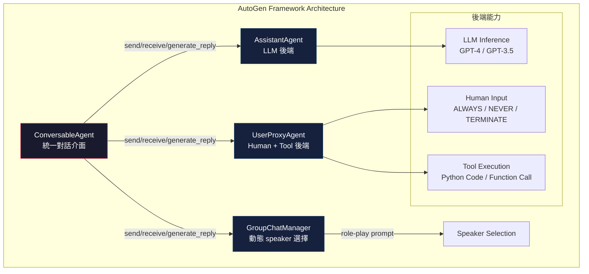
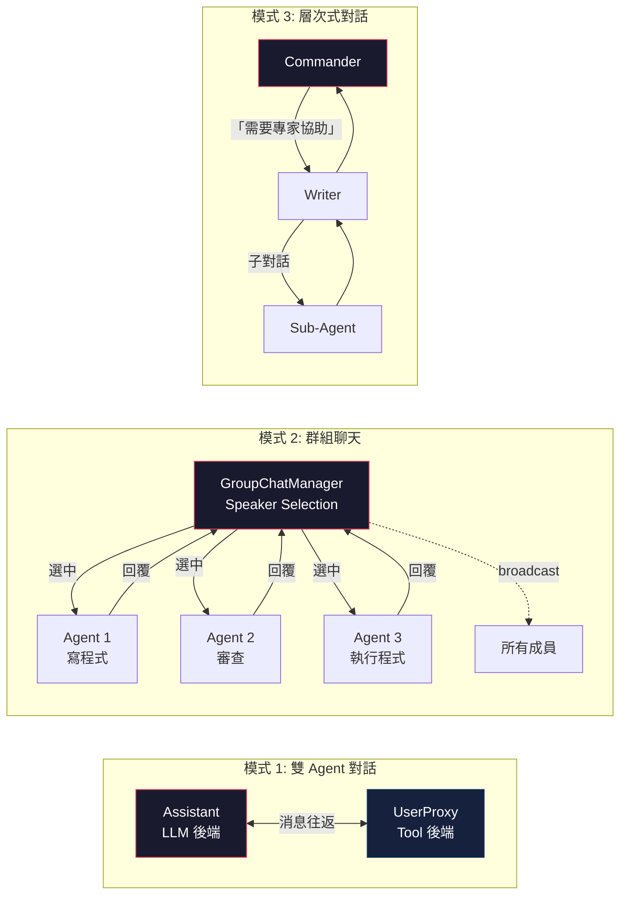

# AutoGen: 多智能體對話框架論文導讀

> **種子論文**: [AutoGen: Enabling Next-Gen LLM Applications via Multi-Agent Conversation](https://arxiv.org/abs/2308.08155) (2023-08)
> **作者**: Qingyun Wu, Gagan Bansal, Jieyu Zhang, et al.
> **機構**: Microsoft Research, Penn State University, University of Washington

---

## TL;DR

LLM 應用日趨複雜，單一 agent 的規劃與工具使用能力已不足以應付真實世界的多步驟任務。AutoGen 提出「可對話的智能體」（conversable agents）與「對話編程」（conversation programming）兩個概念，讓開發者可以透過自然語言與程式碼的融合來定義多個 LLM agent 之間的對話協作模式。在數學解題、檢索增強生成、互動式決策與編碼安全等六個應用場景中，AutoGen 以更少的開發工作量達到甚至超越當時的 SOTA 方法。

---

## 背景與動機

### 從 ReAct 到多智能體的必然演進

2022 年底，ReAct（Yao et al., 2022）展示了 LLM 可以透過交錯生成「推理軌跡」（reasoning traces）和「行動」（actions）來解決需要外部知識或環境互動的任務。在 ReAct 的範式中，單一 agent 的運作週期是：

```
Thought → Action → Observation → Thought → Action → ...
```

這個循環讓 LLM 能夠在推理過程中查詢 Wikipedia API、執行計算、並根據觀察結果調整下一步計畫。ReAct 在 HotpotQA、ALFWorld、WebShop 等基準上展現了顯著優勢，但也暴露了根本限制：

1. **單一 agent 的認知瓶頸**：所有推理、規劃、行動生成都由同一個 LLM 實例完成，缺乏模組化分工
2. **難以整合人類反饋**：ReAct 的設計中人類只能在 prompt 層級介入，無法在執行過程中靈活參與
3. **錯誤恢復能力有限**：當 agent 陷入重複循環或搜尋結果不理想時，缺乏外部驗證機制

### ReAct 的正式定義與操作化

為了深入理解 AutoGen 承接了什麼、改變了什麼，有必要先精確地描述 ReAct 的運作機制。ReAct 將 agent 的行動空間從原本的領域特定行動集合 $A$ 擴展為 $\hat{A} = A \cup L$，其中 $L$ 是語言空間（thoughts）。在時間步 $t$，agent 從環境接收觀察 $o_t \in O$，然後根據上下文 $c_t = (o_1, a_1, ..., o_{t-1}, a_{t-1}, o_t)$ 選擇行動 $\hat{a}_t \in \hat{A}$。

當 $\hat{a}_t \in L$（即 thought）時，它不影響外部環境，而是更新上下文 $c_{t+1} = (c_t, \hat{a}_t)$，作為後續推理或行動的基礎。當 $\hat{a}_t \in A$ 時，它會對環境產生影響並收到新的觀察 $o_{t+1}$。

這個形式化定義揭示了 ReAct 的關鍵特徵：**thought 在行動空間內部，而非外部**。這意味著模型在同一個生成過程中決定何時推理、何時行動，兩者使用同一套參數，共享同一個上下文。這既是優勢（不需要額外的排程機制）也是限制（無法模組化地分配不同的推理負載）。

在具體實作中，ReAct 使用 few-shot prompting 來引導 LLM 生成交錯的 thought 與 action。以 HotpotQA 為例，ReAct 設計了一個簡單的 Wikipedia API，包含三種行動：

- `search[entity]`：返回對應實體 Wikipedia 頁面的前 5 個句子；如果不存在，返回前 5 個相似實體
- `lookup[string]`：在當前頁面中搜尋包含該字串的下一段文字（類似瀏覽器的 Ctrl+F）
- `finish[answer]`：完成任務並返回答案

這種 API 設計刻意比 SOTA 的 lexical 或 neural retriever 更弱，目的是模擬人類查閱 Wikipedia 的方式，迫使模型透過明確的語言推理來引導檢索。

在 ALFWorld 的文字遊戲環境中，ReAct 使用稀疏的 thoughts（只在任務分解、子目標完成、常識推理等關鍵時刻出現），而不是每個步驟都產生 thought。論文將此稱為「sparse reasoning」——只在最相關的位置產生 thoughts，讓 LLM 自行決定 thought 與 action 的異步發生模式。

**ReAct 的局限性分析**：論文透過人工分析了 200 條 HotpotQA 軌跡（50 條成功 + 50 條失敗的 ReAct 與 CoT），發現：

- ReAct 的 hallucination 率（6%）遠低於 CoT（14%），因為外部知識庫提供了事實校驗
- 但 ReAct 的推理錯誤率（47%）明顯高於 CoT（16%），因為交錯生成 thought-action-observation 的結構約束降低了推理靈活性
- 23% 的 ReAct 失敗案例來自 non-informative search——搜尋結果為空或不包含有用資訊，導致模型偏離推理方向
- 一個 ReAct 特有的失敗模式是重複生成先前的 thought 和 action（循環錯誤），論文推測這可能與 greedy decoding 有關

這些分析為 AutoGen 的設計提供了直接動機：如果一個 agent 陷入循環，需要另一個 agent 來打破；如果搜尋結果不理想，需要另一個 agent 提供替代資訊來源。

### 多智能體協作的自然需求

AutoGen 論文的關鍵洞見是：**chat-optimized LLM（特別是 GPT-4）已經具備了透過對話接收反饋、並在對話中迭代改進的能力**。這意味著多個 LLM agent 可以透過自然語言對話來協作，就像人類團隊中不同角色透過討論解決問題一樣。

具體來說，三個趨勢支撐了這個洞見：

- **角色扮演能力**：LLM 可以透過 system message 被賦予特定角色（如程式設計師、審查員、使用者代理），並在對話中維持該角色的一致性
- **反饋整合能力**：Chat-optimized LLM 能理解對話歷史中的糾正、提示和驗證，並據此調整行為
- **能力模組化**：不同配置的 agent（不同的 prompt、不同的工具集）可以展現互補的能力，透過對話組合起來

### 現有框架的不足

在 AutoGen 之前，已有一些多 agent 系統的嘗試：

- **AutoGPT**：單一 agent 的自動任務分解，但缺乏多 agent 協作能力，且容易陷入無窮循環
- **BabyAGI**：任務佇列驅動的 agent 系統，但互動模式固定，難以應付多樣化場景
- **CAMEL**：角色扮演式的雙 agent 對話，但缺乏靈活的對話模式控制
- **MetaGPT**：模擬軟體開發團隊的多 agent 系統，但高度特化於編碼場景

這些系統各自解決了部分的問題，但缺乏一個 **通用的、可擴展的多 agent 對話框架**。AutoGen 就是為了解決這個缺口而設計的。

### 為什麼是「對話」而不是其他通訊機制？

一個可能被忽略的問題是：為什麼 AutoGen 選擇「對話」作為 agent 之間的通訊方式，而不是更傳統的 RPC、message queue 或 shared memory？

答案在於 chat-optimized LLM 的獨特能力。以 GPT-4 為代表的現代 LLM 在對話場景中展現了幾個關鍵特性：

1. **上下文追蹤**：LLM 能在長時間的對話歷史中維持對問題狀態的感知，不需要外部的 state machine
2. **隱式推理**：LLM 可以在對話中自然地進行推理、規劃和決策，而不需要顯式的 if-else 分支
3. **角色扮演穩定性**：透過適當的 system message，LLM 可以穩定地扮演特定角色，並在對話中維持角色的一致性
4. **反饋整合**：LLM 能夠從對話歷史中的糾正和提示中學習，並在後續回覆中體現這些反饋

這些特性使得「對話」成為一種比傳統通訊機制更靈活、更適合 LLM 的通訊抽象。傳統的 RPC 需要預先定義介面（interface），message queue 需要定義訊息格式，而對話允許 agent 之間使用自由形式的自然語言進行通訊。這大幅降低了多 agent 系統的開發門檻。

---

## 核心知識點

本文圍繞以下知識點展開：

1. **Conversable Agent 設計**——AutoGen 如何定義一個可對話、可自定義的智能體
2. **Conversation Programming 範式**——為何對話可以作為複雜工作流的統一抽象
3. **從 ReAct 到多 agent 對話的擴展**——單一 agent 循環如何演變為多 agent 消息傳遞
4. **多 agent 對話模式與互動拓撲**——AutoGen 支援的三種主要對話模式
5. **Agent 的模組化與可組合性**——Reply function 機制與自定義行為



---

## 方法詳解

### 知識點 1: Conversable Agent 設計

**這個知識點要回答什麼問題？**

AutoGen 中最基本的建構單元是什麼？一個 agent 需要具備哪些能力才能參與多 agent 對話？

**種子論文怎麼處理？**

AutoGen 的核心抽象是 `ConversableAgent` 類別，它定義了一個 agent 參與對話所需的最小介面：

```
send(message, recipient)    → 發送消息給另一個 agent
receive(message, sender)    → 從另一個 agent 接收消息
generate_reply(message)     → 根據收到的消息產生回覆
```

每個 agent 可以配置三種後端能力的任意組合：

1. **LLM 後端**：使用 LLM 來 interpret 對話歷史、產生推理與回覆。AutoGen 提供了增強的 LLM inference 層，包含結果快取、錯誤處理、訊息模板等功能
2. **Human 後端**：允許人類在特定回合介入對話。`human_input_mode` 可以設定為 `NEVER`（完全自動）、`ALWAYS`（每次都要人類確認）、或 `TERMINATE`（僅在任務結束時詢問）
3. **Tool 後端**：透過程式執行（Python code）或函數呼叫（function call）來操作外部工具

AutoGen 提供了兩個預設的 `ConversableAgent` 子類別：

```python
class AssistantAgent(ConversableAgent):
    """LLM 後端的 AI 助手 agent，負責生成解決方案與推理"""
    # human_input_mode = "NEVER"
    # code_execution_config = False

class UserProxyAgent(ConversableAgent):
    """人類代理 agent，負責執行程式碼或徵求人類輸入"""
    # human_input_mode = "ALWAYS" 或 "NEVER"
    # code_execution_config = True  # 可以執行程式碼
```

這種設計讓開發者可以透過簡單的配置來創建具有不同角色的 agent。例如：

```python
assistant = AssistantAgent(
    name="assistant",
    llm_config={"model": "gpt-4", "temperature": 0}
)

user_proxy = UserProxyAgent(
    name="user_proxy",
    human_input_mode="NEVER",
    code_execution_config={"work_dir": "coding"}
)

# 啟動對話
user_proxy.initiate_chat(
    assistant,
    message="繪製 META 和 TESLA 今年以來的股價變化圖"
)
```

這段不到 10 行的程式碼就能建立一個可以自主解決問題的雙 agent 系統：assistant 生成 Python 程式碼，user_proxy 執行程式碼並將結果（包括錯誤訊息）傳回給 assistant 迭代修正。

---

### 知識點 2: Conversation Programming 範式

**這個知識點要回答什麼問題？**

有了 conversable agent 之後，如何定義 agent 之間的互動行為？傳統的程式設計方法（明確的 if-else 控制流）與 LLM 的自然語言能力如何融合？

**種子論文怎麼處理？**

AutoGen 提出 **Conversation Programming**（對話編程）作為統一的工作流定義範式。這個範式包含兩個核心概念：

**對話為中心的計算（Conversation-Centric Computation）**

Agent 的行動是以對話為單位的——agent 收到消息後，執行「對話相關的計算」（如 LLM inference、程式執行），然後產生回覆消息。這個過程會持續進行，直到終止條件被滿足。

**對話驅動的控制流（Conversation-Driven Control Flow）**

控制流不是由外部的排程器決定，而是由 agent 之間的對話自然驅動。AutoGen 透過 **auto-reply mechanism**（自動回覆機制）來實現這一點：

1. Agent A 向 Agent B 發送消息
2. Agent B 收到消息後自動調用 `generate_reply()`
3. Agent B 將回覆發送回 Agent A
4. 除非終止條件滿足，否則繼續循環

這個機制是去中心化的——不需要額外的控制平面（control plane）來協調對話流程。

**自然語言與程式語言的融合**

Conversation Programming 的真正威力在於融合了兩種控制方式：

1. **自然語言控制**：透過 system message 來引導 agent 的行為。例如 default AssistantAgent 的 system message 指示 agent「如果上一步的結果有錯誤，修復錯誤後重新生成程式碼」「任務完成時回覆 TERMINATE」
2. **程式語言控制**：透過 Python code 來定義終止條件、人類輸入模式、工具執行邏輯。開發者可以註冊自訂的 reply function 來控制對話流程
3. **混合控制**：兩種控制方式之間可以靈活轉換。例如開發者可以在自訂的 reply function 中調用 LLM inference 來做決策（code → natural language），或透過 LLM-proposed function call 來執行特定程式（natural language → code）

```python
# 註冊自訂 reply function 的範例
def custom_reply_func(msg, sender, config):
    if "error" in msg.lower():
        return "請修正錯誤後重試"
    if msg.strip() == "":
        # 如果有程式碼要執行，執行它
        return execute_code_from_msg(msg)
    return None  # 使用預設回覆機制

assistant_a.register_reply(assistant_b, custom_reply_func)
```

---

### 知識點 3: 從 ReAct 到多 agent 對話的擴展

**這個知識點要回答什麼問題？**

ReAct 的 Thought → Action → Observation 循環與 AutoGen 的多 agent 對話之間是什麼關係？AutoGen 如何在保留 ReAct 優勢的同時突破了其限制？

**ReAct 怎麼處理？**

ReAct（Synergizing Reasoning and Acting in Language Models）由 Yao 等人於 ICLR 2023 提出，核心思想是讓 LLM 在生成行動的同時也生成自由形式的推理文字（thoughts）。這些 thoughts 雖然不影響外部環境，但能幫助模型：

- 分解任務目標並建立行動計畫
- 從觀察結果中提取重要資訊
- 追蹤子目標的完成進度
- 處理例外情況並調整計畫
- 綜合多個資訊來源得出最終答案

ReAct 的具體運作方式可以用以下 pseudocode 表示：

```
給定問題 Q
環境 E（如 Wikipedia API 或 ALFWorld 遊戲環境）

1. Thought: "我需要先搜尋 X，找到關於 Y 的資訊"
2. Action: search[entity] 或 lookup[string]
3. Observation: 從環境返回的結果
4. Thought: "從觀察結果中，我發現 Z..."
   （必要時回到步驟 2 繼續搜尋）
5. Action: finish[answer]

這個循環的關鍵在於：Thought 和 Action 是交錯生成的，
而不是先全部推理完再行動（如 CoT），或盲目行動（如 Act-only）。
```

在 HotpotQA 上，ReAct 超越了 Act-only 方法（27.4 vs 25.7 EM），但略低於 CoT（29.4 EM）。然而，仔細分析顯示 ReAct 的 hallucination 率（6%）遠低於 CoT（14%），且結合兩者的 ReAct + CoT-SC 方法達到了 34.2 EM 的最佳效果。

在 ALFWorld 上，ReAct 的最佳試驗達到 71% 的成功率，遠超 Act-only（45%）和模仿學習方法 BUTLER（37%）。在 WebShop 上，ReAct 以 40.0% 的成功率領先 IL+RL（28.7%）和 Act（30.1%）。

**AutoGen 怎麼擴展？**

AutoGen 將 ReAct 的單一 agent 循環擴展為多個 agent 之間的消息傳遞：

```
ReAct 循環：                AutoGen 多 agent 對話：
Thought                     Agent A 的 generate_reply()
  ↓                           ↓
Action                      Agent A 向 Agent B 發送消息
  ↓                           ↓
Observation                 Agent B 收到消息，執行 generate_reply()
  ↓                           ↓
Thought (next)              Agent B 向 Agent A 回覆
```

這個映射的關鍵洞見是：**在 ReAct 中，Observation 來自外部環境（Wikipedia API、遊戲引擎）；在 AutoGen 中，Observation 可以來自另一個 agent 的回覆**。這意味著 agent 之間可以互相充當對方的「環境」，提供驗證、批評、補充資訊。

更具體地說，AutoGen 保留了 ReAct 的幾個核心優勢：

- **自然語言控制**：Thought 對應到 agent 之間的對話內容，仍然是自由形式的推理文字
- **模組化能力**：ReAct 的 tools（Wikipedia API 搜尋、程式執行）被封裝為特定 agent 的能力
- **可解釋性**：agent 之間的對話歷史就是完整的推理軌跡

同時突破了 ReAct 的限制：

- **分工**：不同 agent 可以專注於不同任務（一個 agent 寫程式、一個執行程式、一個審查安全性），而不是同一個 LLM 實例做所有事
- **人類參與**：人類可以作為一個 agent 加入對話，在適當的時機提供指導
- **錯誤恢復**：一個 agent 陷入循環時，另一個 agent 可以提供外部觀點來打破循環（這在後續的 ALFWorld grounding agent 案例中得到了明確驗證）

---

### 知識點 4: 多 agent 對話模式與互動拓撲

**這個知識點要回答什麼問題？**

有了可對話的 agent 之後，有哪些不同的方式可以讓它們互動？不同的應用場景需要哪些不同的對話模式？

**種子論文怎麼處理？**

AutoGen 支援多種對話模式，從最簡單的雙 agent 靜態對話到複雜的動態群組聊天：



**模式 1: 雙 agent 靜態對話**

這是 AutoGen 最基礎的模式，也是大多數應用的出發點。兩個 agent（通常是 AssistantAgent 和 UserProxyAgent）之間進行固定來回的消息交換。終止條件由開發者預先定義（如最大回覆次數、LLM 回覆 "TERMINATE" 等）。

**模式 2: 動態群組聊天（Dynamic Group Chat）**

當應用需要三個以上的 agent 協作時，AutoGen 提供了 `GroupChatManager` 類別來管理群組對話。其運作流程是一個三步循環：

```
1. Speaker Selection:    GroupChatManager 動態選擇下一位發言者
                         使用 role-play prompt 來考慮對話上下文與角色對齊
2. Response Collection:  選中的 agent 生成回覆
3. Broadcast:            將回覆廣播給所有群組成員
```

在一項 12 個複雜任務的 pilot study 中，使用 role-play prompt 的動態 speaker selection 比純任務驅動的選擇策略有更高的成功率，且需要更少的 LLM 調用次數。

**模式 3: 層次式對話（Hierarchical Chat）**

在這種模式中，一個 agent 可以在與另一個 agent 對話的過程中，啟動一個子對話與第三個 agent 交流，然後將結果帶回原對話。AutoGen 透過兩種方式實現動態對話：

1. **自訂 `generate_reply` 函數**：在自訂的回覆函數中，一個 agent 可以根據當前消息的內容，暫時掛起當前對話並啟動與其他 agent 的對話
2. **函數呼叫**：LLM 可以根據對話狀態決定是否呼叫特定的 function，並在 function 中向其他 agent 發送消息

**模式 4: 人類參與的對話**

AutoGen 的設計讓人類可以以多種方式參與對話：

- **被動模式**（`human_input_mode="NEVER"`）：完全自主的 agent 對話
- **主動模式**（`human_input_mode="ALWAYS"`）：每個回合都需要人類確認
- **選擇性模式**（`human_input_mode="TERMINATE"`）：僅在接受到 "TERMINATE" 訊號時才詢問人類
- **多用戶模式**：透過 function call 機制，一個 LLM 可以自動向人類專家發起諮詢

---

### 知識點 5: Agent 的模組化與可組合性

**這個知識點要回答什麼問題？**

在實際應用中，開發者需要快速創建具有特定行為模式的 agent，而不是每次都從頭開始。AutoGen 如何支援 agent 的復用與組合？

**種子論文怎麼處理？**

AutoGen 提供了一套基於 **reply function 註冊機制** 的可組合架構：

1. **預設回覆函數**：每個 `ConversableAgent` 自帶一組預設的 reply function，按優先順序執行：
   - LLM inference（如果配置了 LLM）
   - Code execution（如果配置了 tool 能力）
   - Human input（如果啟用了人類參與）

2. **自訂回覆函數**：開發者可以透過 `register_reply()` 註冊自訂的回覆函數，在預設機制之前或之後執行。這使得 agent 的行為可以按需擴展

3. **Agent 組合**：複雜的 agent 行為可以透過組合多個 reply function 來實現。例如，一個 agent 可以在回覆前先與另一個 agent 對話（形成嵌套對話）

**Auto-reply 機制的完整流程**：

```
1. Agent A 調用 agent_a.send(message, agent_b)
2. Agent B 收到消息後，依序嘗試已註冊的 reply functions：
   a. 自訂 reply function #1（如有註冊）
   b. 自訂 reply function #2（如有註冊）
   c. 預設 LLM inference reply
   d. 預設 tool execution reply
   e. 預設 human input reply
3. 第一個返回非 None 結果的 function 勝出
4. Agent B 將結果作為回覆發送給 Agent A
5. 如果終止條件滿足（如收到 "TERMINATE"、達到 max_consecutive_auto_reply），停止
6. 否則回到步驟 1（Agent A 處理 Agent B 的回覆）
```

這個機制的關鍵設計決策是去中心化——**不需要中央控制單元**來管理對話流程。每個 agent 獨立決定何時回覆、回覆什麼、何時終止。這與傳統的 workflow engine（如 Apache Airflow 的 DAG）有本質區別：控制流不是預先定義的有向無環圖，而是在對話過程中動態湧現的。

這種設計帶來了幾個實際好處：

- **Retrieval-Augmented Chat 中的互動式檢索**：當 LLM 回覆 "UPDATE CONTEXT" 時，UserProxy Agent 自動檢索下一批文件並重新發送查詢，形成一個閉環的檢索增強對話
- **OptiGuide 中的 Commander-Writer-Safeguard 協作**：三個 agent 分別負責協調（Commander）、生成程式碼（Writer）、安全性審查（Safeguard），形成一個類似軟體開發流程的對話模式
- **ALFWorld 中的 Grounding Agent**：當 assistant 連續三次輸出相同行動時，grounding agent 注入常識知識來打破循環

---

## 實驗結果

### 主要實驗

AutoGen 在六個應用場景中進行了評估，以下是關鍵結果：

| 應用場景 | 任務 | AutoGen | 最佳 Baseline | 提升幅度 |
|---------|------|---------|---------------|---------|
| A1: 數學解題 | MATH (Level-5) | **70%** | 48% (ChatGPT + Plugin) | 22% |
| A2: 檢索問答 | Natural Questions F1 | **66.7%** | 58.6% (DPR + GPT-3.5) | 8.1% |
| A3: 文字遊戲 | ALFWorld (Avg) | **69%** | 54% (ReAct) | 15% |
| A4: 編碼安全 | OptiGuide F1 (GPT-4) | **96%** | 88% (Single-Agent) | 8% |
| A4: 編碼安全 | OptiGuide F1 (GPT-3.5) | **98%** | 63% (Single-Agent) | 35% |

### 關鍵觀察

**數學解題（MATH）**

AutoGen 使用兩個內建 agent（Assistant + UserProxy）就達到了 70% 的成功率，超越 ChatGPT + Code Interpreter 的 55% 和 ChatGPT + Plugin（Wolfram Alpha）的 48%。值得注意的是，對比方法中 AutoGPT 因為無法正確處理 `sympy` 庫而完全失敗，ChatGPT + Plugin 雖然從 Wolfram Alpha 獲得了正確答案（`5√42/27`），但 ChatGPT 自己選擇了錯誤的輸出。

**檢索增強問答（Natural Questions）**

AutoGen 實現的 Retrieval-Augmented Chat 引入了一個創新的「互動式檢索」功能。當 LLM 無法從當前上下文找到答案時，它會回覆 "UPDATE CONTEXT" 而不是 "I don't know"。UserProxy Agent 收到這個訊號後自動檢索下一批相關文件。消融實驗顯示，移除這個互動式檢索機制後 F1 從 66.7% 下降到 62.6%，Recall 從 62.6% 下降到 58.6%。

**互動式決策（ALFWorld）**

ALFWorld 的實驗特別值得關注，因為它展示了多 agent 設計相對於 ReAct 的具體優勢：

- **雙 agent 設計**（Assistant + Executor）：與 ReAct 基本持平（54% vs 54%）
- **三 agent 設計**（Assistant + Executor + Grounding Agent）：大幅提升到 **69%**

Grounding Agent 扮演的角色是在 assistant 陷入重複循環時注入常識知識。例如，assistant 可能一直嘗試「use desklamp 1」而忘記先「take bowl 1」。Grounding Agent 發送的提示（「你必須先拿到物品才能檢查它」）足以打破這個循環。

**多 agent 編碼（OptiGuide）**

OptiGuide 案例展示了多 agent 在安全性審查上的優勢：

- **單 agent 設計**：一個 agent 同時負責寫程式和審查安全性，F1 僅 88%（GPT-4）和 63%（GPT-3.5）
- **多 agent 設計**：Writer 負責寫程式，Safeguard 負責審查安全性，F1 提升到 96%（GPT-4）和 98%（GPT-3.5）

有趣的是多 agent 設計對 GPT-3.5 的幫助更大（+35%），這暗示了角色分離對於能力較弱的 LLM 尤其重要。

此外，代碼量從 430 行減少到 100 行，用戶互動次數減少了 3–5 倍，平均解決問題時間從 4 分 35 秒縮短到 1.5 分鐘。

**動態群組聊天（Group Chat）的 Pilot Study**

AutoGen 在一項 12 個複雜任務的 pilot study 中比較了四 agent 群組聊天與兩種替代方案：

- **兩 agent 系統**（Assistant + UserProxy）：GPT-4 下 8/12 成功，GPT-3.5 下 7/12 成功
- **四 agent 群組（task-based speaker selection）**：GPT-4 下 8/12 成功，GPT-3.5 下 9/12 成功
- **四 agent 群組（role-play speaker selection）**：GPT-4 下 **9/12** 成功，GPT-3.5 下 **8/12** 成功

role-play 風格的 speaker selection 不僅成功率最高，還需要更少的 LLM 調用次數（GPT-4 下從 11 次減少到 8 次），且從未出現終止失敗的情況。

**對話式西洋棋（Conversational Chess）的啟發性案例**

AutoGen 論文中最具啟發性的案例之一可能是 A6: Conversational Chess。這個應用展示了幾個重要的設計模式：

- **Board Agent 的角色**：一個專門的 agent 負責驗證每一步棋的合法性，相當於一個「grounding 層」。當玩家說「我把兵從 e2 移動到 e4」時，Board Agent 會解析自然語言為標準的 UCI 格式，並驗證這是否為合法走法
- **消融實驗**：移除 Board Agent，只在 system message 中提示玩家「確保你和對手都走合法棋步」，結果 AI 玩家會產出大量非法走法，導致遊戲無法進行
- **訊息隔離**：玩家 agent 與 Board Agent 之間的對話對另一個玩家不可見，這讓 LLM 的 chat completion 上下文保持乾淨

這個案例說明了即使是看似簡單的兩兩對話，也可以透過引入第三個「基礎設施 agent」來提供 grounding 和驗證，從而顯著提升系統的可靠性。

**MiniWob++ 瀏覽器互動（A7）**

AutoGen 還被應用於瀏覽器互動任務（MiniWob++ benchmark），實作為一個雙 agent 系統（MiniWobChat）：Assistant 負責決策（如「點擊 id 為 subbtn 的按鈕」），Executor 負責在瀏覽器中執行行動並返回 reward 與 state。在 49 個可用任務中，MiniWobChat 達到 52.8% 的成功率，僅比專為 MiniWob++ 設計的 SOTA 方法 RCI（56.4%）低 3.6%。考量到 RCI 使用專門設計的 self-critiquing prompts，而 MiniWobChat 直接使用內建的 AssistantAgent，這個結果顯示 AutoGen 的通用架構在零定制的情況下也能達到接近專用方法的表現。

**AutoGen 的 API 設計模式**

從開發者的角度，使用 AutoGen 建立一個多 agent 應用大致遵循以下模式：

```python
# Step 1: 定義 agent
assistant = AssistantAgent(name="assistant", llm_config=llm_config)
user_proxy = UserProxyAgent(name="user_proxy",
    human_input_mode="NEVER",
    code_execution_config={"work_dir": "coding"})

# Step 2: 註冊自訂行為（可選）
def custom_reply(sender, message, config):
    # 自訂邏輯
    return response if handled else None
assistant.register_reply(ConversableAgent, custom_reply)

# Step 3: 啟動對話
user_proxy.initiate_chat(
    assistant,
    message="任務描述",
    max_turns=10  # 控制對話長度
)
```

對於群組聊天：

```python
# 建立群組
group_chat = GroupChat(
    agents=[agent1, agent2, agent3, agent4],
    messages=[],
    max_round=20
)
manager = GroupChatManager(
    groupchat=group_chat,
    llm_config=llm_config
)

# 啟動群組對話
user_proxy.initiate_chat(
    manager,
    message="群組任務描述"
)
```

這種設計讓開發者可以在幾行程式碼內建立複雜的多 agent 系統，而不需要手動實現消息路由、狀態管理或對話控制。

### 消融實驗

1. **互動式檢索的有無**：移除後 F1 下降 4.1%、Recall 下降 4.0%，說明「UPDATE CONTEXT」機制對於檢索任務有實質貢獻
2. **Two-agent vs Three-agent (ALFWorld)**：加入 Grounding Agent 後整體成功率提升 15%，在 "Pick" 任務類型上提升最顯著（從 19% 到 41%）
3. **Single-agent vs Multi-agent (OptiGuide)**：安全審查的 F1 從 88% 提升到 96%（GPT-4），從 63% 提升到 98%（GPT-3.5）
4. **Role-play vs Task-based speaker selection**：role-play prompt 在 12 個複雜任務中達成 9/12 成功，task-based 只有 8/12

### 限制與失敗案例

1. **循環依賴**：在 greedy decoding 下 agent 容易陷入重複輸出相同行動的循環（如 ALFWorld 中不斷嘗試 use desklamp）。這在 AutoGen 中雖然可以透過引入 grounding agent 來緩解，但並非所有場景都有合適的 grounding agent 可用

2. **LLM 能力的強烈依賴**：GPT-4 的效果遠優於 GPT-3.5，在某些任務中兩者的差異超過 30%。這意味著 AutoGen 的框架設計雖然可以模組化地組合 agent，但整體表現最終仍受底層 LLM 能力的限制

3. **搜尋結果品質敏感**：如果檢索到的上下文不包含有用資訊，agent 的推理會偏離方向。在 Retrieval-Augmented Chat 的實驗中，約 19.4% 的 Natural Questions 查詢會觸發 "UPDATE CONTEXT" 操作，表示即使使用檢索增強，仍有約五分之一的查詢需要多輪檢索才能找到答案

4. **多 agent 的安全挑戰**：增加 agent 數量帶來更多自由度，但也可能引入新的安全風險。論文在 ethics statement 中特別提到了程式執行和 function call 的潛在風險——允許 LLM agent 在外部環境中執行程式碼或安裝套件可能造成意外後果

5. **實驗規模有限**：AutoGen 論文中的多數實驗是基於 120 個 MATH 題目、134 個 ALFWorld 任務等相對小規模的評估（論文全長 43 頁，但主文僅 10 頁，其餘為 appendix）。多 agent 系統在更大規模、更多樣化任務上的表現仍有待驗證

6. **Finetuning 的潛力未被探索**：AutoGen 論文完全基於 prompting（無 finetuning），而 ReAct 論文展示了 finetuning 的巨大潛力——finetuned PaLM-8B ReAct 超越了所有 PaLM-62B prompting 方法，finetuned PaLM-62B 甚至超越了 PaLM-540B prompting。AutoGen 如果結合 finetuning，可能會有更好的表現

### ReAct 論文的 Finetuning 實驗及其對 AutoGen 的啟示

ReAct 論文的一個重要貢獻是展示了 finetuning 相對於 prompting 的 scaling 優勢。使用 3,000 條由 ReAct 生成的正確軌跡來 finetune 較小的模型（PaLM-8B 和 PaLM-62B），結果顯示：

- **Prompting 階段**：在小模型上（PaLM-8B/62B），ReAct prompting 是四種方法（Standard、CoT、Act、ReAct）中最差的，因為從 in-context examples 中同時學習推理和行動對小模型來說太困難
- **Finetuning 階段**：finetuned ReAct 成為四種方法中最好的，且 PaLM-8B finetuned ReAct 就超越了所有 PaLM-62B prompting 方法，PaLM-62B finetuned ReAct 超越了所有 540B prompting 方法

這對 AutoGen 的啟示是：隨著多 agent 對話數據的積累，透過 finetuning agent 的行為模式可能會帶來顯著的效能提升。AutoGen 論文在討論部分也提到了這個方向，但尚未實際探索。

---

## 與相關工作的對比

### 從 ReAct 到 AutoGen 的沿革

```mermaid
graph LR
    subgraph "ReAct (2022)"
        direction LR
        T[Thought<br/>推理軌跡]
        A[Action<br/>搜尋/行動]
        O[Observation<br/>環境反饋]
        T --> A --> O --> T
    end
    
    subgraph "AutoGen (2023)"
        direction LR
        M1[Agent A<br/>消息] --> M2[Agent B<br/>回覆]
        M2 --> M3[Agent C<br/>協作]
        M3 --> M1
    end

    R[ReAct: 單 agent 內部<br/>推理 ⇄ 行動] -->|
    ┌ 擴展為多 agent 對話 ┐
    | Observation 可來自其他 agent |
    └ 保留 thought 的自由形式 ┘| AG[AutoGen: 多 agent<br/>對話協作]
```

| 維度 | ReAct (2022) | AutoGen (2023) |
|------|-------------|---------------|
| 核心範式 | 單一 agent 的推理 + 行動循環 | 多個 agent 之間的對話協作 |
| Agent 溝通方式 | Thought → Action → Observation | 消息傳遞（send/receive） |
| 人類參與 | 僅在 prompt 層級 | 可作為 agent 加入對話（human-in-the-loop） |
| 工具使用 | 固定 API 呼叫（Wikipedia） | 可擴展的工具後端（程式執行、函數呼叫） |
| 控制流 | 線性循環 | 去中心化的 auto-reply 機制 |
| 錯誤恢復 | 缺乏外部驗證 | 可引入專用 agent 來打破循環 |
| 開發者門檻 | 需要手動設計 few-shot examples | 可用程式碼與自然語言混合編程 |

### AutoGen 與同期框架的比較

| 維度 | AutoGPT | BabyAGI | CAMEL | MetaGPT | AutoGen |
|------|---------|---------|-------|---------|--------|
| 可自定義 agent | ❌ | ❌ | 有限 | 有限 | ✅ |
| 對話模式彈性 | 單一 | 任務佇列 | 雙 agent | 團隊模板 | 多模式 |
| 人類參與 | ❌ | ❌ | ❌ | ❌ | ✅ |
| 開發程式碼量 | - | - | - | - | 最低 |
| 安全性機制 | ❌ | ❌ | ❌ | ❌ | ✅ (Safeguard) |

---

## 我的觀察

### 對話作為統一抽象的深遠影響

AutoGen 最核心的貢獻，在我看來不是具體的 agent 實作，而是「把對話作為複雜工作流的統一抽象」這個思路。在分散式系統中，我們有 RPC、message queue、event bus 等機制來協調不同的服務；在 AutoGen 中，複雜的 LLM 應用工作流被簡化為 agent 之間的對話。

這個抽象的威力在於：**對話可以同時承載推理、決策、資料傳輸和錯誤處理**。在傳統架構中，這些是不同的機制（控制流、資料流、例外處理）；在 AutoGen 中，它們全都由同一套消息傳遞機制來實現。

### ReAct 與 AutoGen 的互補關係

讀完兩篇論文後，我認為 ReAct 和 AutoGen 並非競爭關係，而是不同層次的抽象。ReAct 定義了「LLM agent 如何與環境互動」的基本模式（推理 + 行動 + 觀察），AutoGen 則將這個模式推廣到「多個 agent 之間如何互動」的層面。

AutoGen 在 ALFWorld 中的三 agent 設計就是一個很好的例證：ReAct 的核心循環（Thought → Action → Observation）仍然存在於每個 agent 內部，但 Observation 不再只來自「環境」，也可以來自「另一個 agent 的回覆」。這讓「環境」的定義從靜態的 API 擴展到了動態的 agent 社群。

### 對底層 LLM 品質的敏感度

AutoGen 的實驗數據中有一個隱藏的訊號：**多 agent 架構對弱 LLM 的幫助遠大於對強 LLM 的幫助**。在 OptiGuide 案例中，多 agent 設計讓 GPT-3.5 的 F1 從 63% 提升到 98%（+35%），但對 GPT-4 只從 88% 提升到 96%（+8%）。

這暗示了當底層 LLM 能力足夠強時，多 agent 架構的「認知擴展」效應遞減——GPT-4 單一 agent 已經能做好大部分工作，多 agent 協作帶來的邊際效益有限。但對於能力較弱的 LLM，角色分離可以讓每個 agent 專注於一個相對簡單的子任務，從而大幅提升整體表現。

### 什麼樣的應用最適合 AutoGen？

綜合論文的六個應用案例與我的理解，以下特徵的應用最能從多 agent 對話框架中受益：

1. **需要多種能力的組合**：如寫程式 + 執行 + 審查（OptiGuide），不同 agent 分擔不同能力
2. **需要人類在迴路中**：如數學解題中學生 + 專家模式，人類可以在關鍵步驟介入
3. **有固定的「基礎設施」需求**：如 Chess 中的 Board Agent、ALFWorld 中的 Grounding Agent，這些第三方 agent 提供驗證與常識
4. **任務可以自然分解為多步驟**：多 agent 的對話模式正好對應任務的分解結構

相反地，以下情況可能不適合使用 AutoGen：（1）需要極低延遲的場景（多 agent 意味著多次 LLM 調用）；（2）任務極其簡單，單一 agent 就能解決；（3）需要密集的數值計算而非語言推理。

### AutoGen 的模組化設計對軟體工程的啟示

AutoGen 論文在 OptiGuide 案例中提到的「430 行 → 100 行」是一個容易被忽略但極具說服力的數據點。這不僅僅是開發效率的提升，更反映了**多 agent 對話範式對軟體架構的影響**：

在傳統實作中，OptiGuide 需要一個中央 controller 來管理所有狀態轉換、錯誤處理和訊息路由。在 AutoGen 中，這些責任被分散到各 agent 的 auto-reply 機制中——Commander 不需要知道 Safeguard 如何審查程式碼，只需要知道它何時回覆 "SAFE" 或 "DANGER"。

這種鬆散耦合的設計讓系統更容易擴展：如果想加入第二個審查 agent（例如專門檢查資料隱私），只需註冊一個新的 reply function，不需要修改 Commander 或 Writer 的程式碼。

### 兩篇論文的方法論對比

回顧 ReAct 和 AutoGen 兩篇論文，可以看到一個有趣的對稱性：

| 維度 | ReAct | AutoGen |
|------|-------|---------|
| 解決的問題 | LLM 推理與行動無法協同 | 多個 LLM agent 之間缺乏協作框架 |
| 提出的方法 | 在行動空間中加入語言推理（thought） | 將單 agent 循環擴展為多 agent 對話 |
| 評估的方法 | 標準化基準（HotpotQA、ALFWorld 等） | 六個應用場景 + 消融實驗 |
| 關鍵瓶頸 | 缺乏外部知識時容易 hallucination | 單 agent 容易陷入循環，需要多 agent 協作 |
| 擴展方式 | Finetuning（3,000 條軌跡顯著提升） | 增加 agent 數量與角色分工 |
| 後續影響 | 成為 LLM agent 的 foundational 方法 | 成為多 agent 框架的奠基性工作 |

值得注意的是兩篇論文在方法論上的對稱性：ReAct 透過 thought 來連接 internal reasoning 與 external action，AutoGen 則透過對話來連接多個 agent 的 internal reasoning。某種意義上，AutoGen 可以視為 ReAct 在系統層面的推廣——從「一個 agent 內部推理與行動的協同」到「多個 agent 之間推理與行動的協同」。

---

## 延伸閱讀

### Dependency Papers（本文涵蓋）

1. **ReAct: Synergizing Reasoning and Acting in Language Models** ([2210.03629](https://arxiv.org/abs/2210.03629))
   - 與本文關係：ReAct 是 LLM agent 的基礎範式，AutoGen 將其單 agent 循環擴展為多 agent 對話。AutoGen 在 ALFWorld 應用中直接整合了 ReAct prompting。

### 後續發展（未涵蓋，僅列出）

- **AutoGen Studio** — AutoGen 的視覺化開發介面，降低多 agent 應用的開發門檻
- **AutoGen Agent Chat** — AutoGen 團隊後續發布的增強版對話管理
- **TaskWeaver** (Microsoft, 2023) — 基於程式碼片段的多 agent 框架，與 AutoGen 互補
- **CrewAI** (2023) — 社群驅動的多 agent 框架，受 AutoGen 啟發

---

## 引用

完整 BibTeX 見 [`papers.bib`](./papers.bib)。
