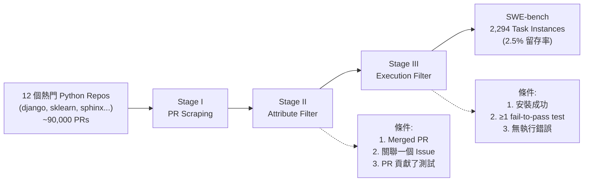
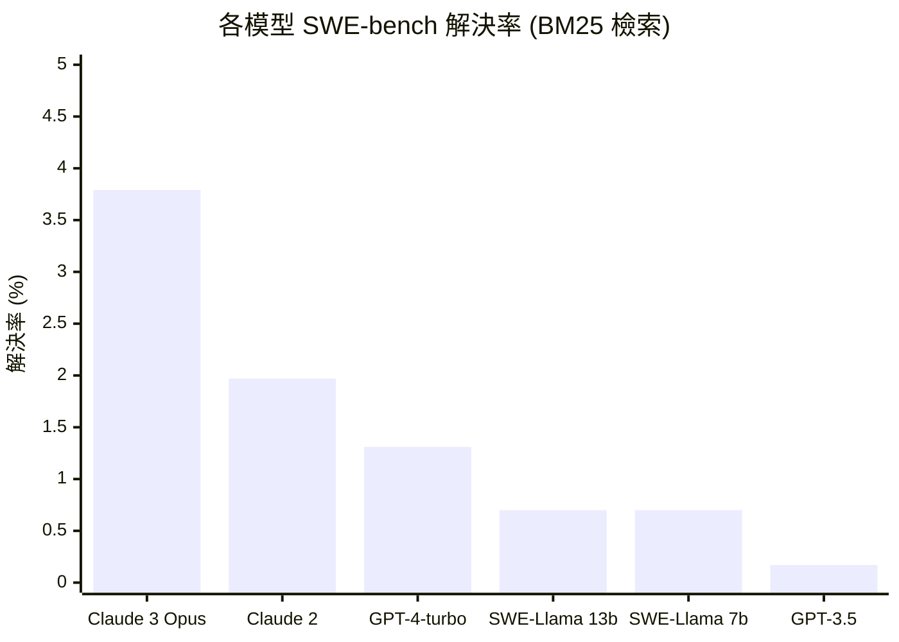

# SWE-bench: 從 HumanEval 到真實世界的程式碼生成評估

> **種子論文**: [SWE-bench: Can Language Models Resolve Real-World GitHub Issues?](https://arxiv.org/abs/2310.06770) (2023-10)
> **作者**: Carlos E. Jimenez, John Yang, Alexander Wettig et al.
> **機構**: Princeton University, University of Chicago

---

## TL;DR

> 現有的程式碼生成基準（如 HumanEval）僅評估模型在自包含函數合成上的表現，與真實軟體工程場景差距甚遠。SWE-bench 從 12 個熱門 Python 專案的 GitHub Issues 中構建了 2,294 個任務，要求模型修改完整倉庫來解決 Issue——這是一道需要跨檔案理解、長上下文推理、精準定位與 patch 生成的複雜挑戰。實驗顯示即使是最佳模型（Claude 2）也只能解決 1.96% 的問題，證明這是當前 LLM 能力的真實前緣。

---

## 背景與動機

要理解 SWE-bench 為什麼重要，得先看它出現之前程式碼生成評估的狀態。

### 從 GPT 到 Codex：程式碼生成能力的浮現

早在 GPT-3（Brown et al., 2020）時期，研究人員就注意到語言模型在未經專門訓練的情況下，能夠從 Python docstring 生成簡單的程式碼。這個發現令人振奮——如果一個主要訓練在自然語言上的模型都能展現程式的語意理解能力，那麼一個專門在程式碼上訓練的模型能達到什麼程度？

2021 年，OpenAI 發表了 **Codex**（Chen et al., 2021）——一個在 179 GB 的 GitHub 公開 Python 程式碼上微調的 GPT 模型（參數量最高達 12B）。一個獨特的生產版本後來成為了 GitHub Copilot。與這篇論文一同釋出的，是一個名為 **HumanEval** 的評估集：164 道手寫的 Python 程式設計問題，每題包含函數簽名、docstring、與多個 unit tests。

### HumanEval 的貢獻：functional correctness

HumanEval 最重要的貢獻不在於它的 164 題，而在於它引入了 **functional correctness**（功能正確性）這個評估概念。

傳統的程式碼生成評估依賴 BLEU score——比較模型輸出與參考解答之間的 n-gram 重疊率。但 Codex 論文用實驗證明了 BLEU score 的根本缺陷：**功能正確的程式不一定有高 BLEU score，功能錯誤的程式也不一定有低 BLEU score**。因為同一個功能可以用無數種等價語法來實現，而一個語法極其接近但邏輯上差了一點的程式則可能完全是錯的。

Functional correctness 的做法很簡單：讓模型生成程式，用 unit tests 執行，通過才算對。這個方式在 Kulal et al. (2019) 的 pseudocode-to-code 翻譯工作中就已經被使用，Codex 論文將它發揚光大，並提出了 pass@k 的 unbiased estimator。

**pass@k 的數學定義：**

假設對每個問題我們生成 $n$ 個樣本（論文用 $n=200$），其中有 $c$ 個樣本通過了 unit tests。那麼 pass@k 的 unbiased estimator 為：

$$
\text{pass@k} := \mathbb{E}_{\text{Problems}} \left[ 1 - \frac{\binom{n-c}{k}}{\binom{n}{k}} \right]
$$

直觀理解：從 $n$ 個樣本中隨機選 $k$ 個，全部失敗的機率是 $\binom{n-c}{k} / \binom{n}{k}$，所以至少有一個成功的機率就是 $1 - \binom{n-c}{k} / \binom{n}{k}$。這個 estimator 的一個常見（但有偏）的替代是 $1-(1-\hat{p})^k$，其中 $\hat{p} = c/n$。Codex 論文在 Appendix A 中證明了後者的偏誤，並提供了一個數值穩定的 numpy 實作：

```python
def pass_at_k(n, c, k):
    if n - c < k:
        return 1.0
    return 1.0 - np.prod(1.0 - k / np.arange(n - c + 1, n + 1))
```

這個公式逐項累乘而非計算 combinatorial 數字，避免了 large factorial 導致的數值溢位。

**Codex-12B 在 HumanEval 上的表現：**

| 設定 | pass@1 | pass@100 |
|:---|---:|:---:|
| GPT-3 175B (無微調) | 0% | 0% |
| Codex-12M | 2.00% | 8.58% |
| Codex-85M | 8.22% | 22.4% |
| Codex-300M | 13.17% | 36.27% |
| Codex-679M | 16.22% | 40.95% |
| Codex-2.5B | 21.36% | 59.5% |
| **Codex-12B** | **28.81%** | **72.31%** |
| Codex-S-12B (supervised FT) | **37.7%** | **77.5%** |

注意 pass@1 與 pass@100 的巨大差距——**28.81% → 72.31%**。這意味著即使單次正確率只有三成，從 100 個樣本中挑選一個正確的機率高達七成以上。這個發現對於後續的程式碼生成工具設計有深遠影響：**你不需要每次都做對，你只需要做對的次數夠多，然後有一個好的挑選機制**。

Codex 論文還發現，在沒有 oracle（即不通過 unit tests 來挑選）的情況下，使用樣本的平均 log-probability 來挑選是一個有效的 heuristic——44.5% 的 pass@1（從 100 個樣本中挑選），遠高於隨機挑選的預期值。

**Codex 與其他模型的對比**

除了 Codex 模型本身，Codex 論文還評估了當時其他開源模型在 HumanEval 上的表現：

| Model | Parameters | pass@1 | pass@100 |
|:---|---:|:---:|:---:|
| GPT-Neo 125M | 125M | 0.75% | 2.97% |
| GPT-Neo 1.3B | 1.3B | 4.79% | 16.30% |
| GPT-Neo 2.7B | 2.7B | 6.41% | 21.37% |
| GPT-J 6B | 6B | 11.62% | 27.74% |
| Codex-12B | 12B | 28.81% | 72.31% |

GPT-J-6B 約等於 Codex-300M 的表現（20× 參數量的劣勢），這說明**程式碼專用微調**（Codex 在 179GB GitHub 程式碼上訓練）的效果遠大於單純增加參數量。

**Codex-S 的監督式微調：**

除了基本的 Codex 微調，論文還進一步探索了 supervised fine-tuning（Codex-S），從兩個管道收集訓練資料：

- **Competitive programming sources**：從競賽程式設計網站收集了 10,000 道自包含問題，每個問題都有函數簽名、docstring、與 test cases。
- **Continuous integration tracing**：利用 `sys.setprofile` 追蹤 open source 專案在 CI 測試過程中的所有函數呼叫與輸入輸出，從中提煉出函數層級的 unit tests。

Codex-S-12B 在 HumanEval 上達到了 37.7% pass@1 與 77.5% pass@100。這證明了針對 target distribution 做監督式微調（而非僅在通用程式碼上微調）能顯著提升特定任務的效能——這個發現直接影響了後續 SWE-Llama 的設計。

**Codex 論文的局限性（與 SWE-bench 的關聯）：**

Codex 論文在結論中討論了模型的限制，包括對於包含長鏈操作的 docstring 理解困難、以及將運算綁定到變數時容易出錯。這些限制在 SWE-bench 中被放大了一個數量級：當 Issue 描述長達 195 個單詞、修改需要跨多個檔案、且涉及複雜的相依關係時，Codex 的能力完全不夠用。

SWE-bench 的作者精確地捕捉到了這個 gap：不是 Codex 不好，而是「程式碼生成的 benchmark 本身需要進化」。

**HumanEval 的結構性限制**

然而，HumanEval 有幾個根本的設計限制，這些限制在後來的工作中逐漸顯現：

**1. 自包含（self-contained）問題**

每一題只有一個函數簽名 + docstring，模型只需要填空。真實世界修 bug 常常要理解好幾個檔案、跨模組的相依關係、以及測試套件的整體行為。HumanEval 的參考解答平均只有不到 10 行程式碼——這與真實 patch 的規模差距了一個數量級。

**2. 給定精確的函數簽名**

HumanEval 的 prompt 告訴模型函數叫什麼名字、參數是什麼、回傳什麼型別。現實中開發者得自己決定要改哪裡、怎麼改、甚至要不要改——這正是軟體工程中「定位問題」的核心技能。

**3. 問題人工撰寫，數量有限**

164 題雖然品質高，但有兩個問題：一是數量有限，無法全面評估模型能力的廣度；二是這些題目是靜態的，一旦模型在訓練資料中見過類似問題（或甚至題目本身），評估就失去了意義。

**4. 不涉及真實開發流程**

真實的軟體開發包含：閱讀 Issue 討論、理解使用者回報的錯誤、檢查既有程式碼、執行測試來驗證假設、迭代修改——這些 HumanEval 完全不觸及。

### 從 HumanEval 到 SWE-bench

SWE-bench 的作者們觀察到這個巨大的差距，並提出了一個大膽的問題：如果我們把評估場景從「填空題」改成「真實的 GitHub Issue」，模型的表現會怎麼樣？

這個問題的答案——如我們即將看到的——是「非常差」。

> 左側的 HumanEval（164 題自包含函數填空）與右側的 SWE-bench（2,294 題真實倉庫 Issue 解決）之間存在數量級以上的難度差距。從給定精確函數簽名到需要自行定位修改位置、從單一函數填空到跨多個檔案協調修改、從數十行 docstring 到 438K 行程式碼的完整倉庫——SWE-bench 重新定義了程式碼生成評估的邊界。
>
> 完整概念對比圖（Excalidraw）請參見 [`assets/swe-bench-humaneval-comparison.excalidraw`](assets/swe-bench-humaneval-comparison.excalidraw)，可在 [excalidraw.com](https://excalidraw.com) 開啟。

SWE-bench 的關鍵洞察可以濃縮為一句話：**人類開發者在 GitHub Issue 上解決問題的方式，與現有 benchmark 要求模型做的事完全不同。** 如果我們希望 LLM 成為真正有用的程式碼生成工具，就必須用前者的標準來評估。這正是 SWE-bench 最核心的設計理念。

這個理念的具體體現在於 SWE-bench 的每一個設計決策：任務來自真實 Issue（不是人工編寫）、解方要通過真實測試套件（不只是少數 unit tests）、評估可以持續更新（不因資料污染而失效）。這些設計看似簡單，但它們共同構成了一個比 HumanEval 困難數百倍的評估場景。

在 SWE-bench 出現之前，學術界對 LLM 能力的評估主要有兩個方向：

一是像 BIG-bench（Srivastava et al., 2023）這種「大雜燴」式的綜合評估，涵蓋數百個不同領域的任務。但這類 benchmark 有「各任務太簡單、太狹窄」的問題——每個任務只測試一兩個技能，無法讓模型展現它的多樣能力。

二是像 AgentBench（Liu et al., 2023d）這種互動式評估，將 LLM 放在網頁瀏覽、作業系統操作等情境中。但這類評估通常需要特殊的環境支援，且任務設計與真實軟體開發仍有距離。

SWE-bench 選擇了一條不同的路：直接從 GitHub 上真實的 Issue 與 PR 中自動提取任務——這確保了每個任務的「真實性」與「新鮮度」，而且可以持續更新。

---

## 核心知識點

本文圍繞以下知識點展開，這是理解 SWE-bench 與程式碼生成評估的關鍵概念：

1. **Functional Correctness (pass@k)**——為什麼用 unit tests 取代 BLEU score 是程式碼生成評估的重要進步，以及 pass@k 的 unbiased estimator 如何正確計算模型效能
2. **資料集構建管線**——如何從 90,000 個 GitHub PRs 中篩選出 2,294 個高品質的任務實例，確保每個任務都有可驗證的測試
3. **SWE-bench 的獨特挑戰維度**——長上下文、跨檔案編輯、檢索瓶頸、問題定位困難——這些是 HumanEval 完全沒觸及的
4. **檢索策略對效能的影響**——BM25 稀疏檢索 vs Oracle 檢索的差異，以及檢索品質如何成為整體系統的瓶頸
5. **模型效能現狀與失敗模式**——為什麼 Claude 2 只有 1.96% 的解決率，模型在什麼情況下會失敗
6. **SWE-Llama：開源模型的長上下文微調**——如何使用 LoRA 微調 CodeLlama 來處理超過 100K token 的上下文
7. **SWE-bench 的限制與後續發展**——純 Python、執行測試的不足、以及 Agent-based 方法的未來

---

## 方法詳解

### 知識點 1：Functional Correctness (pass@k)

**這個知識點要回答什麼問題？**

程式碼生成的輸出是程式——程式必須能正確執行才有意義。如何評估一個程式是否「正確」，同時不限制模型只能產生與參考解答語法完全相同的輸出？

**Codex 論文的核心貢獻：**

在 Codex 之前，程式碼生成主要用 BLEU score 或其他 n-gram 比對指標來評估。但 Codex 論文用一個簡單的實驗證明了 BLEU 的缺陷：從 Codex-12B 在 HumanEval 上的所有樣本中，隨機挑選幾個問題，畫出正確與錯誤樣本的 BLEU score 分佈——結果發現兩者的分佈有大量的重疊區域。這意味著存在著功能錯誤但 BLEU score 很高的樣本，也存在功能正確但 BLEU score 很低的樣本。簡而言之，BLEU score 無法可靠地區分程式碼的正確性。

功能性正確性（functional correctness）的做法：對每個問題，生成 $k$ 個程式樣本，在 sandbox 中執行這些樣本對應的 unit tests。只要有任何一個樣本通過所有測試，該問題就被視為解決。

**SWE-bench 的採用與擴展：**

SWE-bench 繼承了 functional correctness 的精神，但做了重要的擴展。在 SWE-bench 中，評估不再只是「有一個測試可以跑」就夠了，而是需要更完整的測試分類：

- **fail-to-pass 測試**：這些測試在套用模型 patch 之前是失敗的，套用後應該變為通過。這證明模型確實解決了 Issue 描述的問題。
- **pass-to-pass 測試**：這些測試無論套不套用 patch 都應該通過。這確保模型沒有破壞既有功能。

每個 SWE-bench 任務至少要有 1 個 fail-to-pass 測試（平均 9.1 個），以及中位數 51 個 pass-to-pass 測試。這個雙層測試架構比單純的「通過測試」更嚴格——模型必須同時證明自己解決了問題且沒有引入 regression。

**pass@k 的計算在 SWE-bench 中的應用：**

SWE-bench 的評估延續了 pass@1 的概念——對每個任務生成一次 patch（或多次但報告最好的一次），檢查它是否正確。但由於 SWE-bench 的任務比 HumanEval 困難得多（耗時也更長），論文不進行大規模的重複採樣（100 次），而是聚焦在單次表現上。

---

### 知識點 2：資料集構建管線

**這個知識點要回答什麼問題？**

如何從 GitHub 上數以萬計的 Issues 和 PRs 中，自動化地篩選出可評估的任務——每個任務必須有明確的問題定義、可執行驗證的測試、以及不會污染評估的資料隔離？

**SWE-bench 的資料集構建採用了一個嚴格的三階段管線：**



**Stage I：Repo Selection 與 PR Scraping**

選擇 12 個熱門的 Python 開源專案。選擇標準很實際：熱門專案通常維護良好、有清晰的貢獻指南、測試覆蓋率高。這確保了任務品質的 baseline。12 個專案分別為：

- **django**（850 個任務，最大宗）—— Python 最受歡迎的 Web framework
- **sympy**（386 個任務）—— 符號數學庫
- **scikit-learn**（229 個任務）—— 機器學習庫
- **sphinx**（211 個任務）—— 文件生成工具
- **matplotlib**（184 個任務）—— 資料視覺化
- **seaborn**（121 個任務）—— 統計圖表
- **requests**（44 個任務）—— HTTP 客戶端
- **flask**（42 個任務）—— 微型 Web framework
- **pytest**（119 個任務）—— 測試框架
- **pylint**（57 個任務）—— 靜態分析
- **astropy**（95 個任務）—— 天文學計算
- **xarray**（110 個任務）—— 多維陣列

從中收集了約 90,000 個 PRs。

**Stage II：Attribute-Based Filtering**

這一步的篩選條件極其嚴格。每個候選 PR 必須同時滿足：
1. **Merged**——代表這個 PR 的解法被專案維護者接受了
2. **關聯一個 Issue**——透過 PR 描述中的關鍵字（如 "closes #123"、"fixes #456"）來識別
3. **貢獻測試**——PR 必須對測試檔案有修改，這表示貢獻者有寫測試來驗證修復

這三步確保了每個任務都有「定義清楚的問題」和「可驗證的測試」。

**Stage III：Execution-Based Filtering**

這是最關鍵也最耗時的步驟。對於每個通過 Stage II 的候選任務：
1. 從 mirror repo 的 base commit 進行安裝（確保環境可重現）
2. 執行 PR 貢獻的所有測試，記錄 baseline 結果
3. 套用 PR 的 patch（diff），重新執行測試
4. 保留至少有一個測試從 fail 變成 pass 的任務
5. 排除安裝失敗或執行錯誤的任務

經過三階段管線，最初的 90,000 個 PRs 最終只剩下 2,294 個任務——留存率不到 2.5%。

**為什麼留存率這麼低？**

主要瓶頸不在 Stage II（很多 PR 確實關聯 Issue 且有測試），而在 Stage III：很多 PR 雖然 merged，但它的測試套件需要特定版本的相依套件、特定的作業系統、或特定的硬體（如 GPU）才能正常執行。另外，一些 PR 雖然關聯了 Issue，但測試並未從 fail 變成 pass——可能測試本身就有問題，或者 Issue 只是 feature request 而非 bug fix。

**訓練資料的隔離：**

為了讓開源模型也能參與評估，論文從額外 37 個（與評估倉庫不重疊的）倉庫收集了 19,000 個 Issue-PR 配對作為 SWE-bench-train。訓練資料與評估資料的倉庫完全不重疊，這有效地避免了資料污染（data contamination）。

此外，SWE-bench 的任務來自於某個時間點之前建立的 Issue，而新的模型版本總是在此時間點之後才訓練——這意味著模型不太可能直接見過解方。更重要的是，論文實驗發現模型對 2023 年之前與之後的 Issue 解決率沒有顯著差異（Table 7），這是一個很好的 sanity check，證明模型不是靠記憶來解決問題的。

---

### 知識點 3：SWE-bench 的獨特挑戰維度

**這個知識點要回答什麼問題？**

在真實的軟體工程場景中評估 LLM，會遇到哪些 HumanEval 從未觸及的挑戰？

**挑戰 1：長上下文處理**

SWE-bench 的 codebase 平均規模非常驚人：
- 平均 1,900 個檔案（非測試）
- 平均 438,000 行程式碼
- 最大檔案數 5,890 個，最大行數 886,000 行

即使是最支援長上下文的模型（Claude 2、SWE-Llama 的 100K token），也無法容納整個倉庫。而且，LLM 的 context window 與「模型能有效使用的上下文長度」是兩回事——即使 context window 夠大，模型也常常在長上下文中迷失方向。

SWE-bench 的實驗殘酷地證明了這一點：**給模型更多程式碼上下文，效能反而下降**。Claude 2 在使用 13K token 的 BM25 檢索時有 1.96% 解決率，但當 context window 擴大到 50K token 時，解決率降到 1.22%。這不是資料量更多的問題，而是信噪比的問題——當檢索回來的檔案包含大量不相關的程式碼時，模型需要花費更多心力去過濾資訊，結果反而更難找到關鍵的修改位置。

論文提供了更精確的數據：Figure 5 將 Claude 2 的任務按輸入 token 數分組，觀察解決率的變化：

| 輸入 token 數 | 佔總任務比例 | 解決率（相對） |
|:---:|:---:|:---:|
| < 20K | ~25% | 最高 |
| 20K–50K | ~30% | 中等 |
| 50K–100K | ~25% | 低 |
| > 100K | ~20% | 最低 |

這對當前所有號稱「百萬 token context」的模型都是一個警示：單純增加 context window 長度，若沒有同時提升長上下文中的資訊定位能力，反而可能有害。

**挑戰 2：跨檔案編輯**

HumanEval 只需要在單一函數內填空。SWE-bench 需要模型在理解多個檔案間的依賴關係後，協調地修改它們。

SWE-bench 的參考 patch 統計：
- 平均修改 1.7 個檔案
- 平均修改 3.0 個函數
- 平均編輯 32.8 行程式碼（添加 + 刪除）
- 最高做了 5,888 行程式碼的修改、31 個檔案、36 個函數

一個典型的跨檔案任務：假設 django 的某個 Issue 要求新增一個 context variable（如 `show_save_and_add_another`），模型需要理解：
1. 這個 variable 在 template context 中如何傳遞（影響 `admin_modify.py`）
2. template 層怎麼渲染這個 variable（影響相關 template）
3. 其他已有的 context variables 是如何實作的（作為參考模式）
4. 確保新增的 variable 不會與既有功能衝突

**挑戰 3：檢索瓶頸**

如前面討論，檢索是 SWE-bench 的第一道關卡。BM25 在 27K token 設定下，平均 44.4% 的召回率意味著超過一半的相關檔案沒有被檢索到。更糟糕的是，在 27K 限制下，將近一半（~48%）的任務**完全沒有檢索到任何 Oracle 檔案**。當檢索失敗時，模型根本沒有機會答對。

**挑戰 4：問題定位困難**

即使檢索成功（Oracle 設定），模型知道要改哪些檔案，仍然只能在 4.8%（Claude 2）的案例中正確定位到要修改的具體行數。論文設計了 Oracle-collapsed 消融實驗：將檢索到的檔案「摺疊」到只留下被編輯行附近 ±15 行的程式碼。在這個設定下，Claude 2 的解決率提升到 5.93%。到 Oracle-collapsed 的改善是 4.8% → 5.93%（+23.5%），且 Claude 3 Opus 在此設定下達到 9.39%。

這告訴我們兩件事：
1. **干擾資訊的影響很大**——即使給了「正確的檔案」，檔案內大量不相關的程式碼仍然會誤導模型
2. **模型定位精準行數的能力是當前瓶頸**——即使去掉檔案內干擾，解決率仍然很低

**挑戰 5：Patch 格式生成**

SWE-bench 要求模型輸出 unix diff 格式的 patch。對 LLM 來說，這不是一個自然的輸出格式——它們的訓練資料中 patch 檔遠比完整的程式碼檔案少。然而，patch 格式有它的好處：它比寫整份檔案更節省 token，且更容易驗證語法正確性。

論文的對照實驗顯示：當要求 Claude 2 改寫整份檔案（而非生成 patch）時，Oracle 解決率從 4.8% 降到 2.2%。但有趣的是，大部分模型在 patch apply 率（patch 語法正確）上表現還不錯——Claude 2 有 43.07% 的 patch 能被成功套用，SWE-Llama 13b 甚至有 53.62%。證明模型能學會 patch 格式，但生成的邏輯內容不對。

---

### 知識點 4：檢索策略對效能的影響

**這個知識點要回答什麼問題？**

在 SWE-bench 的真實場景中，檢索策略的選擇如何影響模型表現？檢索之後的上下文品質又是另一個變因？

**為什麼選擇 BM25？**

在嘗試了幾種方案後，論文選擇了 BM25 稀疏檢索。原因是：
- 稠密檢索（dense retrieval，如 Dense Passage Retrieval）要求查詢與被檢索文件在語意空間中相近
- 但 SWE-bench 的查詢是**自然語言（Issue 描述）**而被檢索文件是**程式碼（.py 檔案）**——這兩者的語意差距大到 dense retrieval 的 embedding 無法有效對齊
- BM25 的詞彙匹配雖然粗糙，但至少能捕捉到 Issue 中提到的函數名、類別名、錯誤訊息等關鍵詞

**三種檢索設定的效能對比：**

| 檢索方法 | Claude 2 解決率 | BM25 召回率 | 說明 |
|:---|---:|:---:|:---|
| BM25 (13K) | 1.96% | 29.6% | 最實際的場景：模型只能看到有限的檢索結果 |
| BM25 (27K) | 1.87% | 44.4% | 給更多 token，召回率上升但解決率下降 |
| BM25 (50K) | 1.22% | 51.1% | 召回率更高但解決率更低——干擾增加 |
| Oracle | 4.80% | 100% (gold) | 不現實但給出上限：知道該改哪些檔案 |
| Oracle-collapsed | 5.93% | 100% (gold) | 知道該改哪些行，去掉干擾——上限中的上限 |

從 BM25 到 Oracle 的改善幅度是 2.5×（1.96% → 4.80%），從 Oracle 到 Oracle-collapsed 又增加了 23.5%（4.80% → 5.93%）。

**對於 BM25 召回率的深入分析：**

BM25 雖然簡單，但在這個場景中的表現出奇地一致：
- 在 27K token 設定下，BM25 在約 40% 的案例中成功召回了 Oracle 檔案的超集（即包含了所有需要修改的檔案）
- 但在同樣的設定下，將近一半（48% 左右）的案例完全沒有召回任何 Oracle 檔案
- 這表示 BM25 不是「每個任務都表現平庸」，而是「有些任務完美召回，有些任務完全失敗」

**BM25 的改進空間與方向：**

這個結果暗示了一個重要的研究方向：如果能改善檢索階段的召回率（例如使用基於 code structure 的檢索、或讓檢索器針對 issue 類型進行調整），即使模型本身的程式碼生成能力不變，整體表現也有望提升約 2.5 倍。

---

### 知識點 5：模型效能現狀與失敗模式

**這個知識點要回答什麼問題？**

目前最好的模型在 SWE-bench 上的表現如何？它們在什麼情況下會成功、什麼情況下會失敗？從失敗中可以學到什麼？

**主要結果：**

以下表格是各模型在 BM25 檢索設定下的完整結果：

| Model | SWE-bench 解決率 | SWE-bench 套用率 | Lite 解決率 | Lite 套用率 |
|:---|---:|:---:|:---:|:---:|
| Claude 3 Opus | **3.79%** | 46.56% | **4.33%** | 51.67% |
| Claude 2 | 1.97% | 43.07% | 3.00% | 33.00% |
| GPT-4-turbo | 1.31% | 26.90% | 2.67% | 29.67% |
| SWE-Llama 13b | 0.70% | **53.62%** | 1.00% | 38.00% |
| SWE-Llama 7b | 0.70% | 51.74% | 1.33% | 38.00% |
| GPT-3.5 | 0.17% | 26.33% | 0.33% | 10.00% |

**三個關鍵觀察：**

**觀察 1：解決率極低，但有意義**

3.79% 的解決率聽起來很低——但這個數字本身就是有意義的。如果一個 benchmark 上所有模型都拿 90% 以上，那就失去了區分能力。SWE-bench 刻意保留了高難度的任務，使得只有真正改進了程式碼生成能力的模型才能在這個 benchmark 上展現出差異。

事實上，SWE-bench 的作者刻意留下了這個「低解決率」的設計空間——他們在論文討論中說，SWE-bench 的這個「駭人的難度」使它在長期發展中更有價值，因為它不容易飽和。後續的發展證明了這點：從 2023 年底的 <4% 到 2025 年超過 30%，SWE-bench 一路區分了不同世代的模型。

**觀察 2：解決率 vs 套用率——巨大的鴻溝**

套用率（patch 能成功 apply）遠高於解決率（patch 正確）。Claude 3 Opus 的套用率是 46.56%，但解決率只有 3.79%——超過九成的 patch 語法正確但邏輯錯誤。

這代表模型已經學會了 diff 格式的基本規則（加行要 +、刪行要 -、行號上下文等），但無法生成邏輯正確的修改。套用率可以作為一個「語法正確性」的 proxy metric，但它與「功能正確性」之間存在巨大的 gap。

SWE-Llama 13b 的套用率高達 53.62%（甚至超過 Claude 2 的 43.07%），這直接來自於它被微調的任務就是生成 patch。但它的解決率只有 0.70%——被訓練成「輸出 patch 的專家」還不夠，內容品質才是關鍵。

**觀察 3：不同倉庫、不同難度**

Figure 4 顯示了模型在各個倉庫上的 Oracle 解決率。有些倉庫（如 astropy、flask）相對簡單，有些（如 pylint、matplotlib）極難。

難度差異的原因包括：
- matplotlib 有 32% 的任務包含圖片——模型需要看圖來理解 Issue
- 大型框架（django、scikit-learn）的程式碼結構複雜，常需要跨多個檔案修改
- pylint 的靜態分析規則修改需要深入理解語法樹

**失敗模式的質性分析：**

論文從 Oracle 檢索設定中選取了 11 個案例進行深入質性分析（Appendix F），歸納出以下反覆出現的失敗模式：

**模式 1：過度簡化的 patch**

模型生成的 patch 平均只修改 16.7–19.6 行程式碼，而對應的 gold patch 平均修改 33.6–44.1 行。模型傾向於只做「最小修改」——只解決 Issue 描述的表面症狀，而不觸及根本原因。

這與人類初級開發者常見的行為模式一致：初學者傾向於在問題出現的地方附近修補，而有經驗的開發者會往前追溯源頭，做出更全面的修復。

**模式 2：不擅長利用 codebase 語境**

模型傾向於撰寫「純 Python」——使用最基本的語法結構，很少引用 codebase 中既有的 utility functions、constants、或輔助類別。相比之下，gold patch 經常重構程式碼、提取 shared functions、或調整多個相關的邏輯路徑。

論文給了一個具體的例子：在 sphinx-doc/sphinx 的 Issue #11445 中，問題是 rst_prolog 設定會破壞帶有 domain directive 的頂層標題。模型的 patch 只改了正則表達式（regex），而 gold patch 使用了 docutils 的 `Body.patterns['field_marker']`——這需要對 docutils 內部 API 有深入的了解。

**模式 3：「貪婪求解」忽略程式碼風格**

模型生成的 patch 雖然功能上可能正確（或部分正確），但經常違反 codebase 既有的風格慣例。一個常見的例子是 import 風格——有些專案統一用 relative import，有些用 absolute import，模型往往選擇不恰當的方式。

**模式 4：無法處理多步驟推理**

有些任務需要多步驟修改：先在某處新增一個變數，再在另一處使用它。模型常只做了第一步，忘記了第二步——或者改了 A 處的邏輯但沒意識到 B 處需要同步更新。

---

### 知識點 6：SWE-Llama——開源模型的長上下文微調

**這個知識點要回答什麼問題？**

如何讓開源模型也能參與 SWE-bench 的評估？需要克服哪些技術障礙？開源模型與閉源 API 模型的差距在哪裡？

**為什麼需要 SWE-Llama？**

SWE-bench 發表時，商業 API 模型（GPT-4、Claude 2）雖然昂貴但可用。然而開源模型的處境更困難：
- 當時只有 CodeLlama 系列能處理 100K token 的上下文
- 但直接使用 CodeLlama 的效果極差——它產生的不是 patch，而是 placeholder 回應或完全不相關的程式碼
- 像 Llama 2 這種 4K context 的模型根本無法容納 SWE-bench 的 inputs

為了公平評估開源模型的表現（以及為社群提供 baseline），論文微調了 CodeLlama-Python 7B 和 13B 模型。

**微調細節：**

訓練資料來自 37 個（與評估用 12 個倉庫不重疊的）額外 Python 倉庫，共收集了 19,000 個 Issue-PR 配對。與評估資料的關鍵差異在於：訓練資料不需要 PR 貢獻測試——這降低了收集門檻，產生了更大的資料集。

訓練格式：
- **輸入** = Issue 描述 + Oracle 檢索的相關程式檔內容
- **輸出** = gold patch
- 訓練時只保留 input + output ≤ 30K token 的樣本（有效樣本數約 10,000 筆）

硬體設定：
- SWE-Llama 7b：4 張 NVIDIA A100，訓練 20 小時
- SWE-Llama 13b：8 張 NVIDIA A100，訓練 47 小時
- 使用 DeepSpeed Ulysses 實現長上下文訓練
- 使用 Flash Attention 加速 attention 計算
- 使用 LoRA（rank=16，α=16，dropout=0.05）微調所有 attention sublayer 的 Q/K/V/O projections

**SWE-Llama 的關鍵發現：**

**發現 1：Oracle 檢索下與 Claude 2 差距不大**

在 Oracle 檢索設定中，SWE-Llama 13b 解決了 3.98% 的問題，Claude 2 解決了 4.87%——差距在 1% 以內。這證明開源模型在獲得正確的上下文時，可以接近頂尖商業模型的表現。

**發現 2：BM25 檢索下表現暴跌**

這是一個重要的教訓：SWE-Llama 在 BM25 檢索下的解決率只有 0.70%，遠低於 Claude 2 的 1.96%。

原因在於 context distribution shift——SWE-Llama 的訓練資料是 Oracle 檢索的（只有需要修改的檔案），但評估時 BM25 會檢索到大量不需要修改的檔案。模型被訓練成「對每個輸入檔案都要做修改」，結果在 BM25 的「雜訊」輸入下，它仍然嘗試去修改不需要修改的檔案，反而產生了錯誤的 patch。

這個發現對所有微調任務格式的模型（而不只是 SWE-bench）都是一個重要的提醒：**模型會過度適應訓練時的輸入分佈，當評估時的輸入分佈偏移時，表現可能大幅下降**。

**發現 3：長上下文訓練有效但有限**

透過 DeepSpeed Ulysses + Flash Attention，SWE-Llama 可以處理超過 100K token 的上下文。這對於接受 Oracle 檢索的任務是必要的（有些任務的 codebase 超過 100K token）。

但長上下文訓練的效益有限——即使能處理 100K token，模型在長上下文中準確定位問題的能力仍然不足，如前面討論過的「長上下文導致效能下降」現象。

---

### 知識點 7：SWE-bench 的限制與後續發展

**這個知識點要回答什麼問題？**

SWE-bench 有哪些應該被注意的限制？自它之後，這個領域如何發展？

**論文自身承認的限制：**

1. **僅限 Python**——2,294 個任務全部來自 Python 專案。雖然擴展到其他語言在技術上是可行的（提取 PR 的流程是語言無關的），但每個語言需要不同的依賴管理、測試框架、以及安裝環境。

2. **執行測試不等於程式碼品質**——這可能是 SWE-bench 最根本的限制。通過測試的 patch 可能依然有嚴重的品質問題：效率低下（過慢的演算法）、可讀性差（不恰當的變數命名、缺乏註解）、不安全（有 SQL injection 或其他安全漏洞）、不完整（只處理了正常情況沒處理邊界情況）。

論文舉了一個具體的例子：在模型的 patch 中，雖然邏輯正確，但使用了硬編碼的設定值而非查詢 config——這在給定的測試案例中不會被發現，但會在實際使用中造成問題。

3. **靜態、一次性評估**——SWE-bench 不模擬真實開發中的迭代過程。真實開發中，開發者會執行測試、看到失敗、修改程式碼、再測試——形成一個 feedback loop。SWE-bench 的一次性 patch 生成無法捕捉這種迭代能力。

4. **baseline 方法最簡化**——論文刻意使用最簡單的「檢索 + 一次 patch 生成」作為 baseline。作者明確說他們「不試圖建立最先進的系統，而是提供一個乾淨的評估平台」，並鼓勵未來工作探索 agent-based 方法、工具增強的 LMs。

**後來者的改進方向：**

**方向 1：Agent-based 方法**

SWE-bench 之後最重大的進展是引入 agent loop 的方法，代表性工作包括：
- **SWE-agent**（Yang et al., 2024, Princeton）：讓模型在客製化的 sandbox shell 中操作，可以執行 bash 命令、編輯檔案、運行測試——形成完整的「觀察→思考→行動→觀察」循環
- **OpenHands** / **OpenDevin**：開源的程式碼 Agent 平台，支援多種工具使用
- **Devin**（Cognition Labs）：商業化的 AI 軟體工程師

這些方法將 SWE-bench 的解決率從 <4% 推升到 >30%，證明了 agent loop 的必要性：一次性 patch 生成遠遠不夠，模型需要能與環境互動、執行測試、閱讀錯誤訊息、並迭代改進。

**方向 2：檢索與上下文的改善**

改善檢索品質是另一個被大量探索的方向：
- 將 natural language Issue 描述轉換為結構化的檢索查詢
- 使用 code graph（函數呼叫圖、繼承關係圖）輔助檢索
- 多輪檢索（先檢索到相關檔案，再從檔案內容中檢索到相關函數）

**方向 3：SWE-bench 本身的演進**

- **SWE-bench Lite**（300 題子集）：降低評估成本
- **SWE-bench Verified**（Anthropic 驗證的 500 題）：確保任務品質
- **SWE-bench Multilingual**：擴展到 Java、TypeScript、Rust 等語言

---

## 實驗結果

### 主要實驗（BM25 設定）



注意原始論文只評估了 Claude 2、GPT-4、GPT-3.5、SWE-Llama 7b/13b。Claude 3 Opus 的數據來自後來的工作，放在這裡作為對照。

### Oracle 檢索對照實驗

從 BM25 到 Oracle 再到 Oracle-collapsed 的逐步對照，清晰揭示了各階段的瓶頸：

| 設定 | Claude 2 解決率 | 相對 BM25 改善 | 瓶頸階段 |
|:---|---:|:---:|:---|
| BM25 (27K) | 1.87% | 1× (baseline) | 檢索 + 定位 + 程式碼生成 |
| Oracle | 4.80% | 2.57× | 定位 + 程式碼生成 |
| Oracle-collapsed | 5.93% | 3.17× | 純程式碼生成 |

改善倍數的解讀：從 BM25 到 Oracle 的 2.57× 改善歸因於**檢索品質**，從 Oracle 到 Oracle-collapsed 的 1.24× 歸因於**減少干擾資訊**。兩者合計，檢索與上下文品質貢獻了約 68% 的改善空間，而程式碼生成能力本身只佔約 32%。

### SWE-bench Lite

300 題的子集 SWE-bench Lite 的設計目標是提供一個更實用（更低成本、更快評估）的 benchmark。篩選標準：
- 任務更自包含（不需要太多外部檢索）
- 聚焦功能性的 bug fix（排除 feature request 等較模糊的任務）
- 保持 11 個倉庫的多樣性

Lite 的解決率約為完整集的一倍左右（Claude 2 從 1.97% 提升到 3.00%），但模型間的相對排名保持不變。這表示 Lite 是一個有效的 proxy——如果模型在 Lite 上表現好，在完整集上通常也會表現好。

### 難度與時間的相關性分析

論文檢查了模型是否因為訓練資料中看過某些 Issue 的解方而「作弊」：

| Model | Before 2023 | After 2023 | 差異 |
|:---|---:|:---:|:---:|
| Claude 2 | 4.87% | 4.23% | -0.64% |
| GPT-4 | 1.96% | 0.00% | -1.96% |
| ChatGPT-3.5 | 0.49% | 0.77% | +0.28% |
| SWE-Llama 13b | 3.98% | 3.85% | -0.13% |
| SWE-Llama 7b | 2.95% | 3.46% | +0.51% |

結論很明確：**模型表現與 Issue 創建日期無關**。除了 GPT-4 在 Before 2023 有 1.96%（但作者備註 GPT-4 只用了 25% 的子集評估，這個數字可能有統計誤差），所有模型的表現幾乎不受時間影響。這是一個很重要的 sanity check。

### 模型 patch vs Gold patch 的對比

論文比較了模型生成的 patch 與 gold patch（人類維護者寫的 patch）在規模上的差異：

| Model | 總編輯行數 | 添加行數 | 刪除行數 | 編輯函數數 | 編輯檔案數 |
|:---|---:|:---:|:---:|:---:|:---:|
| Claude 2 生成 | 19.6 | 4.2 | 1.9 | 1.1 | 1.0 |
| Claude 2 Gold | 44.1 | 12.0 | 5.8 | 2.1 | 1.2 |
| ChatGPT 生成 | 30.1 | 3.8 | 2.7 | 1.0 | 1.0 |
| ChatGPT Gold | 39.6 | 9.5 | 6.1 | 1.6 | 1.2 |
| GPT-4 生成 | 20.9 | 4.4 | 1.5 | 1.0 | 1.0 |
| GPT-4 Gold | 33.6 | 8.4 | 3.8 | 1.9 | 1.1 |
| SWE-Llama 13b 生成 | 17.6 | 1.6 | 1.2 | 1.0 | 1.0 |
| SWE-Llama 13b Gold | 37.8 | 10.0 | 4.4 | 1.9 | 1.1 |

兩個顯著模式：
1. **模型 patch 規模約為 gold patch 的一半**——平均 17.6–30.1 行 vs 33.6–44.1 行
2. **模型幾乎總是只編輯單一檔案**——所有模型的平均編輯檔案數都是 1.0–1.1，而 gold patch 是 1.1–2.1

這印證了質性分析的結論：模型傾向於做最小修改，沒有進行跨檔案的協調修改。

---

## 總結、限制與未來方向

### 核心要點

**SWE-bench 定義了程式碼生成評估的新標準。** 它將評估場景從自包含函數合成（HumanEval）升級到需要理解大型倉庫、跨檔案編輯、端到端測試驗證的真實軟體工程場景。2,294 個任務全部來自真實的 GitHub Issues，這個設計確保了任務的「真實性」與「新鮮度」。

**當前 LLM 在這項任務上的能力仍然非常有限。** Claude 2 的 1.96% 解決率（BM25 設定）與 Claude 3 Opus 的 3.79% 都證明 SWE-bench 是一個尚未飽和、極具挑戰性的 benchmark。最重要的不是這些數字本身，而是它們揭示了 LLM 在真實軟體工程中的具體弱點：
- 長上下文下的資訊定位能力不足
- 跨檔案協調修改的能力幾乎不存在
- 對於程式碼風格與 codebase 語境的理解極淺
- 無法透過迭代來改進自己的解法

**檢索品質是當前最大的系統瓶頸。** 從 BM25 到 Oracle 檢索的 2.57× 改善證明，即使模型本身的程式碼生成能力不變，改善檢索就能帶來顯著的效能提升。這項發現對 RAG 系統有直接的借鑑意義。

**「更多的上下文」不是萬靈丹。** 更長的 context window 如果沒有更好的資訊定位能力，反而會讓模型表現下降。這對所有依賴長上下文理解的應用都是一個重要的設計考量。

### 已知限制

1. **僅限 Python 生態系。** 目前無法評估 Java、TypeScript、Go 等其他語言的程式碼生成能力，也無法評估跨語言的開發場景。

2. **執行測試不等於程式碼正確性。** 這是 functional correctness 評估的根本侷限：測試只能證明在某些輸入下程式行為符合預期，但無法保證沒有未覆蓋的 bug、效能問題、或安全漏洞。

3. **靜態一次性評估。** SWE-bench 的任務是「給一個 Issue，生成一個 patch」的一次性任務。這個設定忽略了真實開發中最重要的能力：迭代除錯——看到失敗、分析錯誤、修改程式碼、重新測試。

4. **僅限 Python 的測試框架。** 測試框架本身（pytest、unittest 等）以及依賴安裝（pip）都是 Python 專屬的。擴展到其他語言需要從零開始處理不同語言的生態系。

5. **僅評估 patch 生成能力。** SWE-bench 不評估程式碼審查、文件撰寫、CI 配置、或其他軟體工程中的重要技能。

### 未來方向與影響

SWE-bench 發表之後，這個領域的發展速度驚人：

**2024 上半年：** SWE-agent 將解決率推升到 12.5%（使用 GPT-4-turbo）。核心改進是引入了 agent loop——模型可以在 sandbox 中執行命令、閱讀輸出、編輯檔案、並迭代。

**2024 下半年：** 多個系統（OpenHands/OpenDevin、AutoCodeRover）將解決率推升到 20–30%。這些系統引入了更複雜的工具使用模式，包括基於 code graph 的導航、語法感知的編輯器工具、以及多輪除錯。

**2025 年：** 最新系統已經在 SWE-bench 上達到超過 40% 的解決率。但有趣的是，隨著系統越來越複雜，研究者開始反思：**我們到底是在改進模型的程式碼生成能力，還是在為模型設計更好的 scaffolding？**

這個反思本身可能就是 SWE-bench 最重要的貢獻：它迫使我們重新思考 LLM 能力的本質。一個在 SWE-bench 上表現好的系統，並不代表 LLM「會寫程式」——它可能只是因為有了更好的檢索、更靈活的工具使用、更完善的除錯循環。但正是這個「系統級能力」的引入，讓程式碼生成技術離真正有用的軟體工程工具更近了一步。

### 對研究社群的影響

SWE-bench 的開源與可複製性設計對研究社群產生了深遠影響：

**完全開放的生態系。** SWE-bench 團隊開源了完整的資料集（2,294 個任務的 metadata、base commit 的 mirror repos、測試腳本）、評估框架（基於 Docker 的 sandbox 環境）、與 SWE-Llama 模型權重。任何研究者都可以 zero-shot 複製實驗結果，或提交自己的模型到公開 leaderboard。

**持續更新的能力。** SWE-bench 的資料提取管線可以不斷從新的 GitHub PRs 中產生新任務。這意味著可以用「模型訓練日期之後才建立的 Issue」來評估模型，徹底避免資料污染的爭議。這項特性在 2024–2025 年的 LLM 快速迭代中變得極為重要——當每個月都有新模型發布時，一個能持續更新的 benchmark 是維持評估公平性的關鍵。

**從評估到訓練的反饋迴圈。** SWE-bench-train（19,000 個訓練資料）的釋出讓開源社群也能微調自己的模型來參與競爭。這個「高品質訓練資料 + 高難度評估 benchmark」的組合，促進了開源程式碼生成模型生態系的正向循環。

### 一個具體的案例分析

為了更具體地理解 SWE-bench 的難度，讓我們看看論文 Appendix F 中討論的一個實際案例（sphinx-doc/sphinx Issue #11445）：

**問題描述：** 當 `rst_prolog` 設定被啟用時，包含 domain directive（如 `:mod:`）作為第一個標題的文件無法正確渲染標題——標題消失、不出現在 toctree 中、版面錯亂。

**模型的生成：** SWE-Llama 13b（Oracle 檢索）。模型的正確定位到了要修改的檔案 `sphinx/util/rst.py`，也理解到問題與正則表達式相關。它的 patch 修改了 `docinfo_re` 這個 regex pattern，在表達式末尾加上 `\n`。

**Gold patch（人類維護者）：** 人類的解法使用了 docutils 內部的 `Body.patterns['field_marker']` 來取代硬編碼的 regex——這需要對 docutils parser 的內部實作有深入的了解。此外，gold patch 還更新了 import 語句、添加了 backward compatibility 處理、以及重構了 `prepend_prolog` 函數的邏輯。

**差距分析：** SWE-Llama 理解到了「需要修改 regex」這個層次——這已經算是相當不錯的問題定位能力了。但它沒有（也無法）理解到「docutils 內部已經有一個 field marker 的 pattern 可以用」——這需要對第三方函式庫的內部 API 有知識，而這種知識在訓練資料中可能只是隱含地存在。

### SWE-bench 在產業界的應用

SWE-bench 不僅是學術研究的 benchmark，也被產業界廣泛採用：
- **Anthropic** 使用 SWE-bench 作為 Claude 程式碼能力的核心評估指標（與 HumanEval 並列）
- **GitHub** 在評估 Copilot 新功能時參考 SWE-bench 的任務設計
- **Google** 的 Gemini 系列論文報告了 SWE-bench 結果作為模型程式碼能力的佐證
- 許多新創公司（如 Cognition Labs 的 Devin）將 SWE-bench 分數作為產品核心競爭力

一個 benchmark 能夠同時驅動學術研究、產業開發、與產品定位，這是 SWE-bench 超越單純評估工具的貢獻。

---

## 延伸閱讀

### Dependency Papers（本文涵蓋）

1. **Evaluating Large Language Models Trained on Code** ([2107.03374](https://arxiv.org/abs/2107.03374))
   - **Codex 論文**：建立了 pass@k functional correctness 評估標準與 HumanEval 資料集。SWE-bench 在此基礎上將評估場景從自包含函數合成擴展到真實倉庫規模的 Issue 解決。

### 後續發展（未涵蓋，僅列出）

- [SWE-agent: Agent-Computer Interfaces Enable Automated Software Engineering](https://arxiv.org/abs/2405.15793) (2024-05) — 首個在 SWE-bench 上顯著突破的 agentic 方法
- [OpenHands: An Open Platform for AI Software Developers](https://arxiv.org/abs/2407.16741) (2024-07) — 開源的程式碼 Agent 平台
- [CodeR: Issue Resolving with Multi-Agent and Task Graphs](https://arxiv.org/abs/2406.01304) (2024-06) — 多 Agent 協作的程式碼修復框架
- [SWE-bench Multilingual: A New Challenge for Code Agents](https://arxiv.org/abs/2411.04733) (2024-11) — SWE-bench 的多語言擴展

---

## 引用

完整 BibTeX 見 [`papers.bib`](./papers.bib)。

---

<!--
寫完後檢查清單：
- [x] TL;DR 三句話講完
- [x] 知識點是歸納後的概念，不是論文目錄
- [x] 每個知識點都串到了種子論文與相關論文
- [x] 論文原文引用比例 < 10%
- [x] meta.yaml 待更新
- [x] papers.bib 需建立
-->
