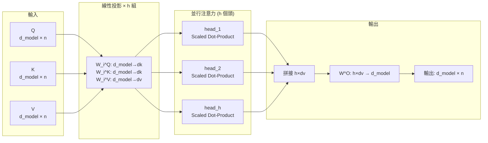
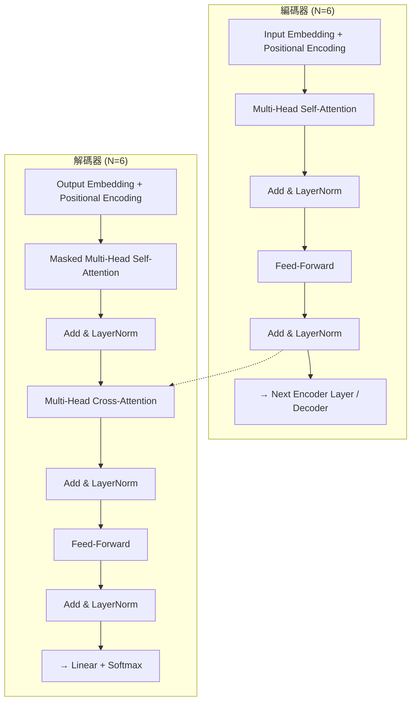

# Transformer: Attention Is All You Need

> **種子論文**: [Attention Is All You Need](https://arxiv.org/abs/1706.03762) (2017-06)
> **作者**: Ashish Vaswani, Noam Shazeer, Niki Parmar et al.
> **機構**: Google Brain / Google Research / University of Toronto

---

## TL;DR

Transformer 解決了序列轉換模型長期依賴 RNN 循序計算、無法平行化的根本限制。它提出一套完全基於 attention 機制的編碼器-解碼器架構，用自注意力取代遞迴，用 multi-head 投影在不同子空間並行捕捉特徵，並用正弦位置編碼注入序列順序資訊。在 WMT 2014 英德翻譯任務上以 28.4 BLEU 超越所有既有方法（含 ensemble），訓練成本僅為對比模型的數十分之一。此論文不僅是機器翻譯的里程碑，更奠定了此後 NLP、CV、語音、強化學習等領域的基礎架構範式。

---

## 背景與動機

### 序列轉換的兩難：RNN 的循序限制

在 Transformer 出現之前，神經序列轉換模型的主流架構是 RNN encoder-decoder。這類模型由一個編碼器 RNN 讀入來源序列，產生一個固定長度的上下文向量，再由解碼器 RNN 根據該向量逐步生成目標序列。Sutskever et al. (2014) 提出的 Seq2Seq 架構與 Cho et al. (2014) 的 GRU 編碼器-解碼器模型在機器翻譯上展現了優於傳統統計方法的潛力。

Seq2Seq 的基本架構可以描述如下：

編碼器將輸入序列 $x = (x_1, \ldots, x_{T_x})$ 映射到隱藏狀態序列：

$$
h_t = \text{RNN}(x_t, h_{t-1})
$$

最終的上下文向量 $c$ 通常是編碼器最後一個隱藏狀態 $h_{T_x}$（Sutskever 的做法）或所有隱藏狀態的函數。解碼器的條件概率為：

$$
p(y) = \prod_{t=1}^{T_y} p(y_t | \{y_1, \ldots, y_{t-1}\}, c)
$$

其中每個條件概率由一個 RNN 隱藏狀態 $s_t$ 定義：

$$
p(y_t | y_{<t}, c) = g(y_{t-1}, s_t, c)
$$

然而 RNN 有一個根本問題：**循序計算**。為了處理序列中第 $t$ 個位置，RNN 必須先完成前 $t-1$ 個位置的計算——這讓訓練無法在單一範例內平行化。當序列長度增加時，這個限制會使訓練時間急劇上升。雖然 LSTM 和 GRU 透過閘控機制緩解了長距離梯度消失問題，但它們仍然無法跳脫循序計算的框架。

此外，儘管 LSTM 的遺忘閘（forget gate）理論上可以讓梯度在長序列中更好地傳播，Hochreiter et al. (2001) 早已指出當序列長度超過 100–200 步時，即使使用 LSTM，長距離依賴的學習仍然非常困難。這與 RNN 的 $O(n)$ 最長信號傳播路徑直接相關。

### 固定長度向量的瓶頸

另一個與 RNN encoder-decoder 相關的問題是**固定長度上下文向量**。編碼器必須將整個來源句子的資訊壓縮到一個固定維度的向量 $c$ 中，再交給解碼器。Cho et al. (2014b) 已觀察到這種做法在長句子上的表現會明顯衰退。

Bahdanau et al. (2015) 率先提出注意力機制來解決這個問題。他們的做法是在解碼的每一步計算一個「對齊分數」，決定來源句中哪些位置與當前要產生的目標詞最相關，再以加權總和的方式得到一個隨位置變化的上下文向量 $c_i$。這個方法讓模型不再需要將所有資訊塞進單一向量中——編碼器輸出的是**整個序列的註釋向量**（annotations），解碼器再動態選擇要關注哪些部分。

Bahdanau 的 attention 在長句子上顯著優於原本的固定向量做法（BLEU 26.75 vs 17.82），但它的架構仍然依賴 RNN：編碼器是雙向 RNN（BiRNN），解碼器是 GRU。Attention 只是 RNN 架構上的一個附加元件，無法解決 RNN 循序計算的基本限制。

### 卷積方法的嘗試

在 Transformer 之前，也有研究者嘗試用卷積神經網路取代 RNN 以實現平行化。ByteNet (Kalchbrenner et al., 2017) 和 ConvS2S (Gehring et al., 2017) 都使用 CNN 作為基本建構單元，在輸入和輸出的所有位置並行計算隱藏表示。但 CNN 有一個代價：要連接任意兩個位置，需要的卷積層數與距離成正比（ByteNet 是對數級、ConvS2S 是線性級），這使得長距離依賴的學習變得更困難。

**Transformer 的核心洞察**：如果 attention 機制已經能讓模型關注到任意距離的位置，為什麼不直接用 attention 取代遞迴與卷積？論文提出了一個大膽的命題——Attention Is All You Need。透過完全摒棄 RNN 和 CNN，Transformer 不僅解決了循序計算的瓶頸，也簡化了整體架構的設計——不再需要 gate 機制、不再需要卷積核的設計選擇，所有操作都是矩陣乘法與 softmax 的組合。這個設計的簡潔性是 Transformer 成功的重要因素之一。

---

## 核心知識點

本文圍繞以下知識點展開。這些知識點是從種子論文與 dependency paper 的共同脈絡中歸納而來，並非照搬論文章節：

1. **RNN 在 Seq2Seq 中的根本限制**——循序計算無法平行化、固定長度向量瓶頸，以及 Bahdanau attention 如何部分解決後者但未解決前者
2. **Bahdanau 的加法注意力（Additive Attention）**——以對齊模型計算 soft alignment，作為 Transformer 的直接理論先驅
3. **Scaled Dot-Product Attention**——Transformer 的核心注意力計算，以及縮放因子 $\sqrt{d_k}$ 的設計原理
4. **Multi-Head Attention**——為什麼需要多頭投影，以及如何在不增加計算量的前提下捕捉不同子空間的資訊
5. **Transformer 整體架構**——Encoder-Decoder 各 $N=6$ 層的設計，含 residual connection、layer normalization、masking
6. **Position-wise Feed-Forward Networks**——每個位置獨立應用的兩層線性變換 + ReLU
7. **Positional Encoding**——不需要參數的正弦餘弦位置編碼，如何注入序列順序資訊且可外推
8. **Self-Attention 相較 RNN/CNN 的複雜度分析**——$O(n^2 \cdot d)$ vs $O(n \cdot d^2)$、$O(1)$ 循序操作 vs $O(n)$、$O(1)$ 最短路徑 vs $O(n)$
9. **訓練細節與消融實驗**——Adam 優化器、學習率排程、regularization，以及模型變體的系統性比較
10. **Transformer 的原始限制與後續批評**——$O(n^2)$ 注意力的計算成本、有限的任務驗證範圍

以下各節將依序展開每個知識點，串接種子論文與 dependency paper 的貢獻，並在必要時補充數學推導的中間步驟與實驗數據的深入解讀。

---

## 方法詳解

### 知識點 1：RNN 在 Seq2Seq 中的根本限制

**這個知識點要回答什麼問題？** 為什麼 RNN-based Seq2Seq 在效能和效率上終究遇到了天花板？

RNN 的設計本質上是循序的：產生隱藏狀態 $h_t$ 時需要前一個狀態 $h_{t-1}$：

$$
h_t = f(x_t, h_{t-1})
$$

這條式子意味著訓練時，序列中所有位置的計算構成了一條無法中斷的依賴鏈。正如 Transformer 論文中指出的，這「從根本上限制了訓練範例內的平行化」（the inherently sequential nature precludes parallelization within training examples）。

在長序列中這個問題尤其嚴重。記憶體限制迫使模型減少 batch size，而循序計算使得訓練時間與序列長度呈線性成長。雖然 LSTM 和 GRU 透過遺忘閘和更新閘緩解了梯度問題，但 $O(n)$ 的循序操作數始終不變。

Bahdanau et al. (2015) 的注意力機制解決了另一個問題——固定長度向量瓶頸。他們的核心想法是：在解碼的每一步，不是依賴單一的上下文向量 $c$，而是動態計算一個與當前解碼位置相關的上下文向量 $c_i$：

$$
c_i = \sum_{j=1}^{T_x} \alpha_{ij} h_j
$$

其中 $\alpha_{ij}$ 是對權重，表示來源句中第 $j$ 個詞與目標句中第 $i$ 個詞的關聯強度。這個設計讓模型能夠在長句子上保持效能——RNNsearch-50 在長度 50 以上的句子中 BLEU 沒有明顯衰減，而 RNNencdec-50 則從 30 個詞開始效能大幅下滑。

**但 Bahdanau 的做法仍然使用 RNN 作為編碼器和解碼器的基本單元**，attention 被實作為 RNN 之上的附加機制。真正需要解決的循序計算問題依然存在。

要理解 Bahdanau attention 的局限性，可以從兩個方向思考：
- **效率**：RNN 的循序計算讓模型在長序列上訓練極慢，而 attention 的加入（需要對每個解碼位置計算與所有編碼位置的對齊分數）進一步增加了計算量。Bahdanau 論文中 RNNsearch-50 在單張 GPU 上訓練了約 5 天。
- **梯度傳播**：attention 雖然減少了編碼器固定長度向量的壓力，但解碼器端的 RNN 仍然需要透過 $O(n)$ 的路徑將梯度傳播回編碼器的每個位置——如果解碼器在生成 $y_{20}$ 時需要關注來源句的 $x_5$，這個梯度需要穿過 20 個 RNN 時間步。

---

### 知識點 2：Bahdanau 的加法注意力（Additive Attention）

**這個知識點要回答什麼問題？** Bahdanau attention 是如何運作的？它與 Transformer 的 scaled dot-product attention 有何關鍵差異？

Bahdanau et al. 提出的注意力機制由一個「對齊模型」（alignment model）驅動。對於解碼器在第 $i$ 步的隱藏狀態 $s_{i-1}$ 和編碼器的第 $j$ 個註釋向量 $h_j$，對齊分數 $e_{ij}$ 由以下公式計算：

$$
e_{ij} = a(s_{i-1}, h_j) = v_a^\top \tanh(W_a s_{i-1} + U_a h_j)
$$

其中 $v_a$、$W_a$、$U_a$ 都是可學習的參數。這是一個**加法注意力**（additive attention）或稱拼接式注意力（concatenation-based attention），因為它先將 $s_{i-1}$ 和 $h_j$ 線性投影後相加，再通過 $\tanh$ 非線性激活。

對齊分數通過 softmax 歸一化得到權重 $\alpha_{ij}$：

$$
\alpha_{ij} = \frac{\exp(e_{ij})}{\sum_{k=1}^{T_x} \exp(e_{ik})}
$$

這個 $\alpha_{ij}$ 可以理解為「目標詞 $y_i$ 與來源詞 $x_j$ 的對齊機率」。解碼器在第 $i$ 步的上下文向量 $c_i$ 就是所有註釋向量的加權總和。

Bahdanau 也觀察到注意力權重的分布具有良好的語言學可解釋性：在英法翻譯中，大部分權重沿著對角線排列（對應於英法語序大致單調的對齊關係），但也有非單調的對齊——例如 [European Economic Area] 翻譯成 [zone économique européenne] 時，模型先跳到 [Area] 對應的 [zone]，再回頭看修飾語。這個行為在傳統的統計機器翻譯（phrase-based SMT）中需要人工定義的對齊表來實現，而在 Bahdanau 的模型中是由注意力權重自動學習的。

**Bahdanau attention 的編碼器設計**：Bahdanau 使用雙向 RNN（BiRNN）作為編碼器，分別從正向和反向讀取輸入序列：

- 正向 RNN $\overrightarrow{f}$ 從 $x_1$ 讀到 $x_{T_x}$，產生 $\overrightarrow{h}_1, \ldots, \overrightarrow{h}_{T_x}$
- 反向 RNN $\overleftarrow{f}$ 從 $x_{T_x}$ 讀到 $x_1$，產生 $\overleftarrow{h}_1, \ldots, \overleftarrow{h}_{T_x}$
- 每個位置的註釋向量 $h_j = [\overrightarrow{h}_j^\top; \overleftarrow{h}_j^\top]^\top$，即正向與反向的拼接

這種設計讓每個 $h_j$ 同時包含了前文和後文的摘要資訊，且由於 RNN 對最近輸入有更強的表徵，$h_j$ 自然聚焦在 $x_j$ 周圍的區域。

**與 Transformer 的關鍵差異**：Bahdanau attention 是附加型的——它需要一個小型神經網路（由 $v_a$、$W_a$、$U_a$ 參數化）來計算每個位置對的相容性分數。這個神經網路的輸出通過 $\tanh$ 非線性激活，然後與 $v_a$ 做內積得到一個標量分數。Transformer 改用純點積（dot product），計算上更高效（可用高度最佳化的矩陣乘法實現），但需要加上縮放因子 $\sqrt{d_k}$ 來防止梯度消失。

此外，Bahdanau 的注意力是**解碼器端的交叉注意力（cross-attention）**——它只用在解碼器計算上下文向量時，編碼器本身沒有使用注意力。Transformer 則將 self-attention 同時用於編碼器和解碼器，讓編碼器內部的所有位置也能互相關注（self-attention），大幅提升了編碼器對上下文的理解能力。

---

### 知識點 3：Scaled Dot-Product Attention

**這個知識點要回答什麼問題？** Transformer 的核心注意力計算公式是怎麼來的？為什麼要用 $\sqrt{d_k}$ 縮放？

Transformer 的基礎注意力機制稱為 Scaled Dot-Product Attention。輸入由 query、key、value 三個向量構成：query 和 key 的維度是 $d_k$，value 的維度是 $d_v$。

在實作上，所有位置的 query 被包裝成矩陣 $Q$，key 包裝成 $K$，value 包裝成 $V$。注意力輸出為：

$$
\text{Attention}(Q, K, V) = \text{softmax}\left(\frac{QK^\top}{\sqrt{d_k}}\right) V
$$

**為什麼是點積而非加法？** 點積注意力與加法注意力在理論複雜度上相近，但實務上點積可以使用高度最佳化的矩陣乘法（GEMM）來實現，比加法注意力需要的手工核函數快得多且記憶體效率更高。

**為什麼需要 $\sqrt{d_k}$ 縮放？** 這是最關鍵的設計細節，以下用正式的機率推導來說明。

假設 $q$ 和 $k$ 是兩個獨立的 $d_k$ 維隨機向量，每個分量 $q_i, k_i$ 都是獨立且均值為 0、變異數為 1 的隨機變數。則它們的點積可寫為：

$$
q \cdot k = \sum_{i=1}^{d_k} q_i k_i
$$

這個和的期望值為：

$$
\mathbb{E}[q \cdot k] = \sum_{i=1}^{d_k} \mathbb{E}[q_i]\mathbb{E}[k_i] = 0
$$

變異數則為：

$$
\begin{aligned}
\text{Var}(q \cdot k) &= \sum_{i=1}^{d_k} \text{Var}(q_i k_i) \\
&= \sum_{i=1}^{d_k} \left( \mathbb{E}[q_i^2 k_i^2] - (\mathbb{E}[q_i k_i])^2 \right) \\
&= \sum_{i=1}^{d_k} \mathbb{E}[q_i^2]\mathbb{E}[k_i^2] \quad (\text{因為 } \mathbb{E}[q_i] = \mathbb{E}[k_i] = 0) \\
&= \sum_{i=1}^{d_k} 1 \cdot 1 = d_k
\end{aligned}
$$

因此點積的標準差為 $\sqrt{d_k}$。當 $d_k = 64$ 時（Transformer base 的設定），標準差是 8——這意味著點積的數值有很大的機率落在 $[-24, 24]$ 區間內（3 倍標準差範圍）。將這麼大的數值送入 softmax，會讓 softmax 的輸入範圍涵蓋非常大的負值和正值區域。

Softmax 函數 $\text{softmax}(x_i) = e^{x_i} / \sum_j e^{x_j}$ 在輸入值很大時，其輸出會趨近於 one-hot 分布——最大的 $x_i$ 的 softmax 輸出接近 1，其餘接近 0。在這些極端區域中，softmax 的梯度非常小，導致訓練時梯度消失，參數幾乎無法更新。

除以 $\sqrt{d_k}$ 後，點積 $\frac{q \cdot k}{\sqrt{d_k}}$ 的變異數回歸到 1，標準差回到 1。softmax 的輸入現在落在合理的動態範圍內（約 $[-3, 3]$），梯度可以順利傳播。

論文的消融實驗（Table 3 row (B)）也證實了這點：將 $d_k$ 從 64 降到 32 時 BLEU 從 25.8 降到 25.1，降到 16 時進一步降到 25.4——較小的 $d_k$ 雖然不需要縮放（變異數較小），但限制了 query 和 key 的表示能力，導致相容性分數的辨別力下降。

---

### 知識點 4：Multi-Head Attention

**這個知識點要回答什麼問題？** 為什麼不直接用一個大型的單頭注意力，而要分成多個頭？

Multi-Head Attention 的動機源於一個觀察：單一注意力函數的加權平均會平均化不同位置的資訊，這抑制了模型從不同表示子空間捕捉特徵的能力。

Multi-Head Attention 的做法是：先將 $Q$、$K$、$V$ 分別透過 $h$ 組不同的線性投影（每個投影的維度是 $d_k$、$d_k$、$d_v$），然後對每組投影後的 $Q_i$、$K_i$、$V_i$ 並行執行注意力函數，產生 $h$ 個 $d_v$ 維的輸出，再將它們拼接起來做最後一次線性投影：

$$
\text{MultiHead}(Q, K, V) = \text{Concat}(\text{head}_1, \ldots, \text{head}_h) W^O
$$
$$
\text{head}_i = \text{Attention}(Q W_i^Q, K W_i^K, V W_i^V)
$$

Transformer 使用 $h = 8$ 個注意力頭，每個頭的維度 $d_k = d_v = d_{\text{model}} / h = 64$。由於每個頭的維度縮小了 $h$ 倍，**總計算量與單頭全維度注意力大致相當**——這是設計的巧妙之處。

論文在消融實驗中（Table 3 row (A)）測試了不同的頭數：
- 單頭（$h=1, d_k=512$）：BLEU 24.9（比最佳設定差 0.9）
- 4 頭（$h=4, d_k=128$）：25.5
- 8 頭（$h=8, d_k=64$）：**25.8**（最佳）
- 16 頭（$h=16, d_k=32$）：25.8（與 8 頭相當）
- 32 頭（$h=32, d_k=16$）：25.4（開始下降）

這顯示 8–16 頭是最佳範圍，頭數過多時每頭的維度太小，不足以捕捉複雜的 query-key 關係。

論文的附錄視覺化（Figure 3–5）顯示，不同注意力頭確實學到了不同的任務：有些頭關注句法依賴關係（如動詞與其遠距離賓語的連接），有些頭關注指代消解（anaphora resolution），說明了 multi-head 確實讓模型在不同表示子空間捕捉了不同類型的特徵。

---

### 知識點 5：Transformer 整體架構

**這個知識點要回答什麼問題？** Transformer 的編碼器和解碼器具體是怎麼搭建的？

Transformer 遵循 encoder-decoder 的總體架構，但編碼器和解碼器都是由 $N = 6$ 個相同的層堆疊而成，每個層包含不同的子層組合。

**編碼器層**：每個編碼器層有兩個子層。第一個是 multi-head self-attention，第二個是 position-wise FFN。每個子層都使用了殘差連接（residual connection）後接 layer normalization：

$$
\text{output} = \text{LayerNorm}(x + \text{Sublayer}(x))
$$

所有子層和嵌入層的輸出維度都是 $d_{\text{model}} = 512$。

**解碼器層**：每個解碼器層有三個子層。除了編碼器原有的兩個子層外，中間插入一個 **encoder-decoder attention** 子層，其 query 來自解碼器前一層的輸出，key 和 value 來自編碼器最後一層的輸出。這讓解碼器每個位置都能關注輸入序列的所有位置。

解碼器的 self-attention 還加了 **masking**：為了維持自迴歸（auto-regressive）性質，位置 $i$ 只能關注位置 $\leq i$ 的位置。這通過在 softmax 輸入中將非法連接設為 $-\infty$ 來實現。

Transformer 在論文中使用三種不同的 attention 應用方式：
1. **編碼器 self-attention**：每個位置關注編碼器前一層的所有位置。這讓編碼器能夠在讀取完整個句子後，讓每個詞彙的表示都融入其他所有詞彙的資訊
2. **解碼器 masked self-attention**：每個位置關注解碼器中 $\leq i$ 的所有位置。masking 通過在 softmax 前將 $i > j$ 的位置設為 $-\infty$ 來實現，確保模型在預測第 $i$ 個詞時看不到未來詞彙
3. **編碼器-解碼器 attention**（cross-attention）：解碼器每個位置關注編碼器的所有輸出位置。這類似於 Bahdanau 的跨注意力，但 query 來自解碼器 self-attention 的輸出而非 RNN 隱藏狀態，key 和 value 來自編碼器最終輸出而非 BiRNN 的註釋向量

### Decoding 的逐步流程

理解了架構後，我們可以追蹤一個完整的解碼步驟：

1. **輸入嵌入 + 位置編碼**：目標序列（訓練時為 ground truth，推理時為已生成的詞彙）被嵌入並加上位置編碼
2. **Masked self-attention**：解碼器每個位置透過 masked attention 關注已生成的所有位置。這一步讓模型知道「到目前為止我已經說了什麼」
3. **Encoder-decoder cross-attention**：query 來自步驟 2 的輸出，key/value 來自編碼器輸出。這一步讓模型決定「輸入句子中的哪些部分與當前要生成的詞彙最相關」——這直接對應 Bahdanau 的對齊步驟
4. **FFN**：對 cross-attention 的輸出進行非線性變換
5. **輸出投影 + softmax**：將解碼器最終隱藏狀態投影到詞彙空間，透過 softmax 得到下一個詞彙的機率分布

每一步的 $i$ 對應的是目標序列中的位置。在推理時，步驟 1–5 會重複執行，每次加入一個新生成的詞彙，直到生成 `<EOS>` 標記或達到最大長度。

---

### 知識點 6：Position-wise Feed-Forward Networks

**這個知識點要回答什麼問題？** 為什麼注意力層之後還需要全連接層？FFN 的結構是怎樣的？

每個編碼器和解碼器層在注意力子層之後都接一個 position-wise FFN。這個 FFN 由兩個線性變換組成，中間夾一個 ReLU 激活：

$$
\text{FFN}(x) = \max(0, xW_1 + b_1)W_2 + b_2
$$

雖然線性變換的參數在**不同位置之間是共享的**（即每個位置應用同一組 $W_1, b_1, W_2, b_2$），但不同層之間的參數不同。這等價於兩個 kernel size 為 1 的卷積。

內層維度 $d_{ff} = 2048$，輸入輸出維度 $d_{\text{model}} = 512$——FFN 將維度擴大到 4 倍後再壓縮回來。這個「先放大再縮小」的設計在後續的 Transformer 變體中成為標準做法。

FFN 的存在是必要的：self-attention 本質上是 bag-of-words 式的資訊混合（每個位置的輸出是其所有位置的加權平均），缺乏逐位置的非線性變換能力。FFN 補上了這一塊，讓模型能對每個位置的表示進行獨立的非線性轉換。

從另一個角度來看，每個 Transformer 層可以理解為兩個階段的處理：
1. **Self-attention 階段**（token mixing）：在不同位置之間交換資訊，讓每個 token 的表示吸收其他 token 的上下文
2. **FFN 階段**（channel mixing）：對每個 token 的表示在特徵維度上進行非線性變換和投影

這個「先交換再變換」的設計在後續的 Transformer 分析中被反覆討論。一些研究發現（如 Anthropic 的 Transformer Circuits），FFN 層儲存了大量的**事實知識**（如「法國的 capital 是 Paris」），而 attention 層負責將這些知識路由到正確的位置。

---

### 知識點 7：Positional Encoding

**這個知識點要回答什麼問題？** Transformer 沒有遞迴和卷積，如何讓模型知道序列的順序？

Transformer 完全摒棄了遞迴和卷積，卻也因此失去了對序列順序的感知——self-attention 是排列不變的（permutation invariant），把輸入順序打亂會得到完全相同的輸出。

為了解決這個問題，論文在編碼器和解碼器底部的輸入嵌入上**加上**位置編碼（positional encoding）。位置編碼的維度與嵌入維度相同（$d_{\text{model}} = 512$），可以直接相加：

$$
\text{input} = \text{token\_embedding} + \text{positional\_encoding}
$$

論文使用正弦和餘弦函數在不同頻率上生成位置編碼：

$$
PE_{(pos, 2i)} = \sin\left(\frac{pos}{10000^{2i/d_{\text{model}}}}\right)
$$
$$
PE_{(pos, 2i+1)} = \cos\left(\frac{pos}{10000^{2i/d_{\text{model}}}}\right)
$$

其中 $pos$ 是位置索引，$i$ 是維度索引。這意味著每個維度對應一個正弦波，波長從 $2\pi$ 到 $10000 \cdot 2\pi$ 呈幾何級數分布。具體來說，對於維度 $i$，其波長為：

$$
\lambda_i = 2\pi \cdot 10000^{2i/d_{\text{model}}}
$$

最低頻的維度 ($i = 0$) 波長為 $2\pi$，最高頻的維度 ($i = d_{\text{model}}/2 - 1$) 波長約為 $10000 \cdot 2\pi$。這意味著前幾個維度編碼的是**粗粒度**的位置差異（相鄰位置在這些維度上的編碼值幾乎相同），後幾個維度編碼的是**細粒度**的位置差異（相鄰位置在這些維度上的編碼值快速變化）。

**為什麼正弦編碼可以表示相對位置？** 對任意固定的偏移 $k$，以下三角恆等式成立：

$$
\begin{aligned}
\sin(pos + k) &= \sin(pos)\cos(k) + \cos(pos)\sin(k) \\
\cos(pos + k) &= \cos(pos)\cos(k) - \sin(pos)\sin(k)
\end{aligned}
$$

這意味著 $PE_{pos+k}$ 可以表示為 $PE_{pos}$ 的線性變換（由一個 $2 \times 2$ 的旋轉矩陣作用）。因此，模型可以透過學習線性變換來利用相對位置資訊——例如，注意力層可以學習到「相隔 $k$ 個位置的詞之間應該有更高的注意力權重」。

論文在消融實驗（Table 3 row (E)）中比較了正弦編碼與可學習的位置嵌入，結果兩者幾乎相同（BLEU 25.7 vs 25.8）。論文選擇正弦版本的考量是可推廣到比訓練時更長的序列長度。後續的 RoPE (Su et al., 2021) 進一步將這個旋轉矩陣的想法應用於相對位置編碼，成為現代 LLM（LLaMA、Mistral）最主流的編碼方案。

在實作上，Transformer 將位置編碼**加**到輸入嵌入上（而非拼接），要求兩者的維度相等且數值尺度匹配。論文將嵌入權重乘以 $\sqrt{d_{\text{model}}}$（見 §3.4），讓嵌入的數值範圍與位置編碼（範圍 $[-1, 1]$）在相加時保持適當的比例。

---

### 知識點 8：Self-Attention 相較 RNN/CNN 的複雜度分析

**這個知識點要回答什麼問題？** 從計算複雜度和資訊傳播的角度，self-attention 為什麼優於 RNN 和 CNN？

論文在 §4 中從三個面向系統性地比較了 self-attention、RNN 和 CNN：

| 衡量指標 | Self-Attention | RNN | CNN | 說明 |
|----------|---------------|-----|-----|------|
| 每層計算複雜度 | $O(n^2 \cdot d)$ | $O(n \cdot d^2)$ | $O(k \cdot n \cdot d^2)$ | $n$:序列長度, $d$:表示維度, $k$:卷積核大小 |
| 循序操作數 | $O(1)$ | $O(n)$ | $O(1)$ | 可平行化的程度 |
| 最長路徑距離 | $O(1)$ | $O(n)$ | $O(\log_k(n))$ | 長距離依賴學習的難度 |

**計算複雜度**：當序列長度 $n$ 小於表示維度 $d$ 時（在機器翻譯中通常是這種情況，例如 $n \approx 20-50$，$d = 512$），self-attention 的 $O(n^2 \cdot d)$ 小於 RNN 的 $O(n \cdot d^2)$。當 $n$ 非常大時，可以將 self-attention 限制為只關注大小為 $r$ 的鄰域（restricted self-attention），此時複雜度降為 $O(r \cdot n \cdot d)$。論文在 §4 中明確提出了這個未來方向（後來由 Longformer 和 BigBird 實現）。

但 $O(n^2 \cdot d)$ 也意味著當序列長度 $n$ 接近或超過 $d$ 時，self-attention 會變得比 RNN 更昂貴。以 $d = 512$ 為例，當 $n \approx 100$ 時兩者相當，$n = 512$ 時 self-attention 的矩陣 $QK^\top$ 的大小為 $512 \times 512 = 262K$ 元素——尚可接受，但當 $n = 4096$ 時，$QK^\top$ 的大小暴增到 $4096 \times 4096 \approx 16.8M$。這解釋了為什麼後續的長序列 Transformer 研究如此重要。

**平行化程度**：這是 self-attention 最顯著的優勢。RNN 需要 $O(n)$ 個循序步驟——每個位置必須等前一個位置計算完成。Self-attention 可以一步計算所有位置之間的注意力權重。這在硬體上的影響是巨大的：矩陣乘法 $QK^\top$ 可以充分利用 GPU 的 Tensor Core（或 NVIDIA 2017 年的 CUDA Core）進行大規模平行計算，而 RNN 的循序步驟迫使 GPU 在不同時間步之間不斷交換資料，無法充分利用運算單元。

**長距離依賴**：路徑長度直接影響學習長距離依賴的能力——信號在網路中傳播的路徑越短，梯度消失問題越輕。Self-attention 的 $O(1)$ 最短路徑是最理想的，RNN 的 $O(n)$ 最差，CNN 的 $O(\log_k(n))$ 居中。

論文的 Table 1 還包含了一個未在正文中詳細展開的比較維度：**restricted self-attention**（$O(r \cdot n \cdot d)$ 複雜度、$O(1)$ 循序操作、$O(n/r)$ 最長路徑）。當 $r < n$ 時，計算複雜度從 $O(n^2 \cdot d)$ 降為 $O(r \cdot n \cdot d)$，但最長路徑從 $O(1)$ 增加到 $O(n/r)$。這是一個計算成本與資訊傳播距離之間的權衡（trade-off），後來成為稀疏注意力（sparse attention）研究的理論基礎。

論文也指出 self-attention 的一個副產品是可解釋性：注意力權重可直接視覺化，不同注意力頭呈現出對句子句法和語義結構的不同關注模式。

---

### 知識點 9：訓練細節與消融實驗

**這個知識點要回答什麼問題？** Transformer 使用了哪些訓練技巧？哪些設計選擇是關鍵的？

**硬體與排程**：Base model 在 8 張 NVIDIA P100 GPU 上訓練 100,000 步（約 12 小時）。Big model 訓練 300,000 步（3.5 天）。

**Adam 優化器**：使用 $\beta_1 = 0.9$、$\beta_2 = 0.98$、$\epsilon = 10^{-9}$。特別地，$\beta_2 = 0.98$ 比標準 Adam（0.999）小，論文作者在後續訪談中提到這是因為 Transformer 訓練中 gradient variance 較大，需要更短的衰減窗口。

**學習率排程**：採用別具特色的 warmup + inverse square root decay 策略：

$$
\text{lrate} = d_{\text{model}}^{-0.5} \cdot \min(\text{step}^{-0.5}, \text{step} \cdot \text{warmup\_steps}^{-1.5})
$$

前 $warmup\_steps = 4000$ 步線性增加學習率，之後按步數的平方根倒數衰減。這種先升後降的設計讓模型在訓練初期能穩定地探索參數空間，後期則精細調校。

**正則化**：使用三種正則化手段：
- **Residual dropout**：每個子層的輸出在被加到子層輸入和 layer norm 之前應用 dropout ($P_{drop} = 0.1$)。這個位置非常關鍵——如果在加法之後才做 dropout，會連殘差路徑上的梯度一起遮蔽，導致深層訓練不穩定。
- **Embedding + positional encoding dropout**：同樣 $P_{drop} = 0.1$
- **Label smoothing**：$\epsilon_{ls} = 0.1$。雖然讓 perplexity 變差（模型學得不那麼確定），但提升了 BLEU 分數。論文中解釋這是因為 label smoothing 讓模型對輸出分布更均勻，從而改善了 beam search 時的泛化能力。

**學習率排程的詳細分析**：論文的學習率公式 $\text{lrate} = d_{\text{model}}^{-0.5} \cdot \min(\text{step}^{-0.5}, \text{step} \cdot \text{warmup\_steps}^{-1.5})$ 可以分成兩個階段理解：

在前 4000 步（warmup 階段），$\text{step} \cdot \text{warmup\_steps}^{-1.5} < \text{step}^{-0.5}$，min 取前者，此時學習率與 step 呈線性成長：

$$
\text{lrate} \propto \text{step}
$$

這讓模型在訓練初期以小學習率穩定啟始，避免早期梯度爆炸。

在 4000 步之後，$\text{step}^{-0.5} < \text{step} \cdot \text{warmup\_steps}^{-1.5}$，min 取後者，此時學習率與 step 的平方根成反比：

$$
\text{lrate} \propto \frac{1}{\sqrt{\text{step}}}
$$

這個衰減速度比指數衰減（exponential decay）慢得多，讓模型在訓練後期仍能持續微調。對比當時常用的學習率排程（如 step decay——每隔若干 epoch 將學習率除以 10），Transformer 的排程不需要預先設定衰減時間點，對不同任務有不同的適應性。

**Big model 的額外細節**：Big model（$d_{\text{model}} = 1024$、$d_{ff} = 4096$、$h = 16$）使用了 dropout rate $P_{drop} = 0.3$（英法版本為 0.1），參數量達到 213M（base model 為 65M）。訓練步數為 300K 步（3.5 天），比 base model 的 100K 步多 3 倍。

**消融實驗的關鍵發現**（Table 3）：
- **(A) 頭數與維度**：單頭會導致 0.9 BLEU 的下降，頭太多（32）也開始下滑。8–16 頭是最佳範圍
- **(B) Key 維度**：縮小 $d_k$（從 64 降到 16）會降低質量，說明 query-key 相容性的計算並非易事
- **(C) 模型大小**：更大的模型（$d_{\text{model}} = 1024$、$d_{ff} = 4096$）表現更好，但參數從 65M 暴增到 213M
- **(D) Dropout**：不加 dropout 時 BLEU 從 25.8 降到 24.6（-1.2），說明正則化至關重要
- **(E) 位置編碼類型**：正弦編碼與可學習嵌入幾乎無差異

---

### 知識點 10：Transformer 的原始限制與後續批評

**這個知識點要回答什麼問題？** 原始的 Transformer 論文有哪些未被解決的問題和限制？

1. **$O(n^2)$ 注意力計算成本**：Self-attention 的複雜度是序列長度 $n$ 的平方級，這在長序列任務（如文檔級翻譯、長文本生成）中成為主要瓶頸。論文自身提到了 restricted self-attention 作為未來方向，但未在實驗中驗證。這個問題催生了後續大量的高效注意力研究——Linformer (2020)、Longformer (2020)、BigBird (2021)、FlashAttention (2022) 等。

2. **有限的任務驗證範圍**：論文的實驗僅涵蓋機器翻譯（En-De、En-Fr）和英語 constituency parsing。雖然結果令人印象深刻，但 Transformer 對其他序列任務（如文字分類、序列標記）的表現、對不同語言特性（如語序靈活、形態豐富的語言）的適應性、以及對非自然語言任務的泛化能力，在原論文中均未驗證。

3. **固定位置編碼的外推限制**：正弦編碼雖然理論上可以外推到更長的序列，但實際上訓練階段未見過的長度可能導致位置編碼與預訓練階段的分布不一致。後續的 RoPE (Rotary Position Embedding, 2021) 和 ALiBi (2022) 等更靈活的位置編碼方案嘗試解決這個問題。

4. **深層訓練的不穩定性**：6 層的 Transformer 在論文中訓練穩定，但隨著層數增加（如 BERT 的 12/24 層、GPT-3 的 96 層），深層 Transformer 的訓練需要更複雜的初始化技巧和正則化策略，如 Pre-LayerNorm、Xavier 初始化調整、殘差縮放等。

5. **缺乏刻意設計的歸納偏誤**：不像 CNN 有局部連接和平移等變性的內建偏誤、RNN 有循序處理的偏誤，Transformer 的排列不變性需要靠位置編碼來補償，且需要海量資料才能學到語言結構。後續的許多研究（如 DeBERTa、T5 的相對位置編碼）都在試圖注入更強的語言偏誤。

---

## 實驗結果

### 主要實驗：WMT 2014 機器翻譯

**英德翻譯**（WMT 2014 En-De）：

| 模型 | BLEU | 訓練成本 (FLOPs) |
|------|------|-----------------|
| ByteNet | 23.75 | — |
| GNMT + RL (Google) | 24.6 | $2.3 \times 10^{19}$ |
| ConvS2S (Facebook) | 25.16 | $9.6 \times 10^{18}$ |
| MoE | 26.03 | $2.0 \times 10^{19}$ |
| GNMT + RL Ensemble | 26.30 | $1.8 \times 10^{20}$ |
| ConvS2S Ensemble | 26.36 | $7.7 \times 10^{19}$ |
| **Transformer (base)** | **27.3** | **$3.3 \times 10^{18}$** |
| **Transformer (big)** | **28.4** | **$2.3 \times 10^{19}$** |

**英法翻譯**（WMT 2014 En-Fr）：

| 模型 | BLEU | 訓練成本 (FLOPs) |
|------|------|-----------------|
| Deep-Att + PosUnk | 39.2 | $1.0 \times 10^{20}$ |
| GNMT + RL | 39.92 | $1.4 \times 10^{20}$ |
| ConvS2S | 40.46 | $1.5 \times 10^{20}$ |
| MoE | 40.56 | $1.2 \times 10^{20}$ |
| Deep-Att + PosUnk Ensemble | 40.4 | $8.0 \times 10^{20}$ |
| GNMT + RL Ensemble | 41.16 | $1.1 \times 10^{21}$ |
| ConvS2S Ensemble | 41.29 | $1.2 \times 10^{21}$ |
| **Transformer (base)** | **38.1** | — |
| **Transformer (big)** | **41.8** | **$2.3 \times 10^{19}$** |

**關鍵觀察**：
- Transformer (base) 在英德任務上以 $3.3 \times 10^{18}$ FLOPs 達到 27.3 BLEU，超過所有先前模型——包括使用 ensemble 的 ConvS2S（$7.7 \times 10^{19}$ FLOPs, 26.36 BLEU），訓練成本只有對手的約 1/23
- Transformer (big) 在英德上 28.4 BLEU 超越所有已有模型的 ensemble，在英法上 41.8 BLEU 也超越所有先前單一模型
- 特別值得注意的是 ConvS2S (Fairseq 的前身) 與 Transformer 是幾乎同時期的競爭方法，Transformer 在架構簡潔性和效能上都取得壓倒性優勢

### 消融實驗的詳細解讀

論文在 Table 3 中進行了系統性的消融分析：

1. **注意力頭的數量 (A)**：單頭（$h=1, d_k=512$）只有 24.9 BLEU，比最佳的 8 頭（25.8 BLEU）差 0.9。但頭數過多（$h=32, d_k=16$）也會下降（25.4 BLEU），可能是因為每個頭的維度太小，不足以捕捉有效的 query-key 相容性。

2. **Key 維度 (B)**：將 $d_k$ 從 64 降到 16 時 BLEU 從 25.8 降到 25.1，這呼應了 3.2.1 節關於 $\sqrt{d_k}$ 的分析——較大的 $d_k$ 需要縮放，但提供了更豐富的表示能力。

3. **模型深度與寬度 (C)**：層數 $N=2$ 時只有 23.7 BLEU，$N=4$ 時 25.3，$N=6$ 時 25.8。$d_{\text{model}}=256$ 時降到 24.5，$d_{\text{model}}=1024$ 時升到 26.0。寬度（$d_{\text{model}}$）的增加對效能的貢獻比深度更顯著。

4. **Dropout (D)**：不加 dropout 時 BLEU 掉到 24.6（-1.2），顯示即使有 layer normalization，正則化仍然至關重要。

5. **位置編碼類型 (E)**：正弦編碼與可學習嵌入幾乎相同（25.7 vs 25.8），驗證了函數式編碼的合理性。

### Constituency Parsing 結果

Transformer 在英語 constituency parsing（WSJ Section 23）上也展現了良好的泛化能力——這是一個與機器翻譯性質差異極大的任務：

- **WSJ only**（40K 訓練句）：4 層 Transformer 達到 91.3 F1，優於 BerkeleyParser (90.4) 和 LSTM-based RNN grammar (91.7) 以外的所有方法
- **Semi-supervised**（17M 句）：92.7 F1，優於所有非 multi-task 方法，包括 Vinyals & Kaiser 的 Seq2Seq (92.1) 和 McClosky 的自訓練方法 (92.1)

對比 LSTM-based 的 RNN grammar (93.3 F1) 仍然有差距，但考量到以下因素，這個結果相當出色：
1. Transformer **沒有針對 parsing 做任何任務特定的調參**——dropout、學習率、beam size 僅憑少量實驗選定
2. Transformer 的輸出長度（constituency tree）遠長於輸入長度（與機器翻譯相反），但其 masked self-attention 機制仍然有效地控制了左向資訊流
3. WSJ only 的 40K 句訓練資料對 Transformer 來說非常小——相比 NMT 中的上百萬句訓練資料——但 Transformer 仍然超越 BerkeleyParser 這種專門設計的統計 parser

這個結果證明了 Transformer 不僅是 NMT 的專用架構，而是一個通用的序列轉換框架。**

### WMT 2014 資料集細節

論文使用了標準的 WMT 2014 資料集：
- **英德**（En-De）：約 450 萬句對，使用 byte-pair encoding（BPE），共享來源/目標詞表約 37,000 tokens
- **英法**（En-Fr）：3600 萬句對，使用 word-piece 編碼，詞表 32,000 tokens（WordPiece 即後來 BERT 使用的 tokenizer）
- **批次策略**：句子按近似長度分組打包，每個 batch 包含約 25,000 個來源 token 和 25,000 個目標 token。這個策略避免了在同一個 batch 中混合長短懸殊的句子，減少 padding 浪費——對 Transformer 的 $O(n^2)$ 注意力計算尤其重要

### 實驗結果的深入解讀

**為什麼 Transformer (base) 在英法翻譯的 BLEU (38.1) 低於許多既有方法？**

仔細看 Table 2 可以發現一個值得注意的現象：在英法翻譯上，Transformer (base) 的 BLEU 只有 38.1，低於 ConvS2S (40.46) 和 MoE (40.56) 等既有方法。這與英德翻譯上 base model 全面超越對手的表現形成對比。

原因在於英法資料集（3600 萬句）遠大於英德（450 萬句），base model 的 65M 參數在大資料集上 capacity 不足——類似於用小型模型在大資料上欠擬合。**Big model（213M 參數）在英法上達到 41.8 BLEU**，超越所有先前方法，證明了 Transformer 的 scaling 能力：當參數量和訓練時間足夠時，它的優勢才會完全展現。

---

## 從 Bahdanau Attention 到 Transformer：一條清晰的演進脈絡

將 Bahdanau et al. (2015) 與 Transformer 放在一起，可以看到 attention 機制的關鍵演進：

| 維度 | Bahdanau et al. (2015) | Transformer (2017) |
|------|----------------------|-------------------|
| 注意力類型 | Additive（拼接式） | Scaled Dot-Product |
| 注意力計算 | $v_a^\top \tanh(W_a s + U_a h)$ | $\text{softmax}(QK^\top / \sqrt{d_k})V$ |
| 頭數 | 單頭 | 多頭（8 頭） |
| 編碼器 | BiRNN（GRU） | Self-Attention + FFN（6 層） |
| 解碼器 | RNN（GRU） | Masked Self-Attention + Cross-Attention + FFN（6 層） |
| 位置資訊 | RNN 循序處理自帶 | Sinusoidal Positional Encoding |
| 序列操作數 | $O(n)$ | $O(1)$ |
| 長距離路徑 | $O(n)$ | $O(1)$ |
| 平行化 | 受限於 RNN | 完全可平行 |
| 訓練成本（En-Fr） | ~5 天單 GPU | 3.5 天 8 GPU |
| BLEU（En-Fr） | 26.75（RNNsearch-50） | **41.8（big）** |

這個對比清楚顯示了 Transformer 的關鍵貢獻不僅是 attention 機制本身的改進（從加法到縮放點積、從單頭到多頭），更是**完全以 attention 取代 RNN 作為序列建模的基本單元**。

### 算力效率的量化對比

從論文的 Table 2 可以更具體地感受 Transformer 的算力效率優勢：

- Transformer (base) 在英德翻譯上以 $3.3 \times 10^{18}$ FLOPs 達到 BLEU 27.3，而 GNMT + RL（Google 的生產級翻譯系統）以 $2.3 \times 10^{19}$ FLOPs 只達到 24.6——Transformer 的效率是其 **7 倍**（每單位 FLOPs 帶來的 BLEU 增益）。
- 與 ConvS2S Ensemble 對比更懸殊：$3.3 \times 10^{18}$ vs $7.7 \times 10^{19}$ FLOPs，效率差異高達 **23 倍**。
- Transformer (big) 的 $2.3 \times 10^{19}$ FLOPs 與 GNMT single model 相同數量級，但 BLEU 從 24.6 大幅提升到 28.4。

這個效率差距的根源在於：Transformer 可以充分利用 GPU 的矩陣乘法單元進行大規模平行計算，而 RNN-based 的模型受限於循序依賴，GPU 利用率遠低於理論峰值。

### 關於 inference 的細節

論文中提到了幾項 inference 階段的實作技巧：

- **Beam search**：使用 beam size = 4，長度懲罰 $\alpha = 0.6$（參考 GNMT 的做法）
- **Checkpoint averaging**：Base model 平均最後 5 個 checkpoint（每 10 分鐘寫一次），big model 平均最後 20 個
- **最大輸出長度**：設為輸入長度 + 50，但允許提前終止
- 在 constituency parsing 中，beam size 提高到了 21，$\alpha = 0.3$，最大輸出長度提高到輸入長度 + 300

這些細節雖然不是 Transformer 的核心貢獻，但對實務複現來說至關重要。後續許多 Transformer 的開源實作（如 Hugging Face Transformers、fairseq）都將這些 inference 技巧作為標準配置。

---

## 我的觀察

> 以下是我讀完兩篇論文後的一些主觀看法。

### Transformer 的成功不僅是架構的勝利，也是工程文化的勝利

讀 Transformer 論文時，一個容易被忽略的特點是它的**工程品質**。論文的消融實驗（Table 3）涵蓋了頭數、key 維度、模型深度/寬度、dropout 率、位置編碼類型等 5 個面向，每個面向都有完整的對比數值。相比於當時許多深度學習論文只報告最佳結果，Transformer 的消融讓後續研究者可以清楚地知道每個設計選擇的代價和收益。

這種「工程文化」在論文的 author contributions 段落也隱約可見：Noam Shazeer 提出了 scaled dot-product 和 multi-head attention，Jakob Uszkoreit 提出了用 self-attention 取代 RNN，Ashish Vaswani 實作了第一個 Transformer 模型，Niki Parmar 調試了無數模型變體，Llion Jones 建立了 initial codebase。**Transformer 的成功來自於一個多學科團隊的精細分工和整合**，而非單一天才的靈光一閃。

### 論文標題的預言性

"Attention Is All You Need" 這個標題在 2017 年看起來是大膽的宣稱，但在今天看來幾乎是保守的。Transformer 不僅取代了 RNN 在 NLP 中的主導地位，還一路擴展到 CV（ViT）、多模態（CLIP）、語音（Whisper）、強化學習（Decision Transformer）、蛋白質折疊（AlphaFold2）等領域。某種意義上，現代深度學習的「基礎模型」（foundation model）範式，就是建立在 Transformer 這個統一的架構基礎之上——用 attention 處理所有類型的序列輸入。

### Bahdanau 論文的貢獻不應被低估

在 Transformer 的光環下，Bahdanau et al. (2015) 有時被簡化為「Transformer 的前身」。但實際上，Bahdanau 論文的貢獻在當時是革命性的：它不僅提出了 attention 機制，還引入了**對齊模型端到端訓練**的概念——alignment 不再是一個獨立的 latent variable，而是可以透過反向傳播直接學習的 soft alignment。這個概念直接影響了 Transformer 的設計哲學：如果你想學習序列元素之間的對應關係，讓模型自己學會關注哪裡就好，不需要人為定義的對齊規則。

Transformer 對 Bahdanau 的關鍵改進，與其說是 attention 機制本身的提升，不如說是**去掉了中間的 RNN**。這個洞察——「如果 attention 能告訴你該關注哪裡，為什麼還需要一個循序處理的中介？」——在回顧歷史時顯得如此自然，但在當時需要對既有範式（RNN 是序列建模的必需品）的大膽質疑。

### 一個未被充分討論的設計選擇：權重共享

論文中提到在 embedding 層和 pre-softmax 線性變換之間共享相同的權重矩陣（如 Press & Wolf, 2016 的做法），並將嵌入權重乘以 $\sqrt{d_{\text{model}}}$。這個設計既減少了參數量（dmodel × vocab_size 的矩陣只需存一份），也讓嵌入向量和模型隱藏狀態的數值尺度一致。後續的 GPT 系列和許多現代 LLM 都保留了這個設計。

### Layer Normalization vs Batch Normalization 的選擇

Transformer 選擇使用 Layer Normalization（Ba et al., 2016）而非當時更主流的 Batch Normalization（Ioffe & Szegedy, 2015）。這個選擇的合理性在於：NLP 任務中序列長度變化很大，Batch Normalization 在測試時的行為（依賴訓練集統計量）會變得不穩定，且在單一範例內的有效 batch size 隨序列長度變化。Layer Normalization 在每個範例內獨立計算正規化統計量，不受 batch 中其他序列影響，對 variable-length 的序列建模更合適。這個設計選擇也一直沿用至今。

---

## 總結、限制與未來方向

**核心要點**

Transformer 提出了首個完全基於 attention 的序列轉換模型，在機器翻譯上以大幅減少的訓練成本取得了超越所有既有方法的效果。它的深遠影響來自於以下幾個層面的貢獻：

1. **簡潔性**：一個統一的架構（multi-head self-attention + FFN + positional encoding），不再需要 RNN 或 CNN 的複雜設計
2. **效率**：$O(1)$ 的循序操作數讓訓練可以充分利用 GPU 的平行計算能力
3. **可擴展性**：$N=6$ 層的設計可以直接堆疊到更深（GPT 的 12/96 層、BERT 的 12/24 層），而沒有 RNN 梯度問題的困擾
4. **可解釋性**：注意力權重的直接視覺化讓研究人員能觀察模型的內部運作

### 已知限制與後續發展

原始 Transformer 論文對深度學習領域的影響力遠超過其本身的直接貢獻。許多後續研究都是在解決 Transformer 的原始限制：

- **$O(n^2)$ 計算成本** → FlashAttention (Dao et al., 2022) 透過 IO-aware 的 exact attention 計算，將注意力速度提升了 2–4 倍；Linformer (Wang et al., 2020) 證明 self-attention 是低秩的，可以投影到較小的維度；Longformer (Beltagy et al., 2020) 用滑動視窗 + 全域注意力的組合實現線性複雜度
- **絕對位置編碼** → RoPE (Su et al., 2021) 在 query 和 key 上施加旋轉變換來編碼相對位置；ALiBi (Press et al., 2022) 直接根據位置距離在注意力分數上加偏置（bias），不需學習參數；T5 的相對位置編碼 (Raffel et al., 2020) 使用分段 bucket 來編碼位置關係
- **訓練不穩定性** → Pre-LayerNorm (GPT-2, 2019) 將 layer norm 移到子層**之前**而非之後，讓殘差路徑上的梯度傳播更穩定；DeepNet (Wang et al., 2022) 透過初始化技巧讓 Transformer 能穩定訓練到 1000 層；Admin (Liu et al., 2020) 調整初始化分布來解決深層 Transformer 的輸出爆炸問題
- **缺乏歸納偏誤** → 預訓練（BERT/GPT）讓 Transformer 能從海量無標註資料中學習語言結構，彌補了排列不變性的弱點。GPT 系列的自迴歸預訓練與 BERT 的掩碼語言建模（masked LM）分別從不同角度解決了這個問題
- **任務泛化性** → 後續研究將 Transformer 推廣到幾乎所有 AI 子領域：圖像（ViT, Dosovitskiy et al., 2021）、音訊（Speech-Transformer, Dong et al., 2018）、影片（TimeSformer, Bertasius et al., 2022）、程式碼生成（Codex, Chen et al., 2021）、蛋白質結構預測（AlphaFold2, Jumper et al., 2021）、強化學習（Decision Transformer, Chen et al., 2021）、多模態（CLIP, Radford et al., 2021）
- **Decoder-only 架構的崛起**：Transformer 的 encoder-decoder 架構在機器翻譯之外逐漸被 decoder-only 架構（GPT 系列）取代。這背後的驅動力是：decoder-only 架構更自然地支援 zero-shot 和 in-context learning，且因果遮蔽（causal masking）讓模型可以無縫地處理條件生成和純生成任務。如今的大多數語言模型（GPT-4、LLaMA、Gemini、Claude）都採用 decoder-only Transformer

**後續論文引用 Transformer 時常見的錯誤**：許多論文引用的 Transformer 公式省略了 $\frac{1}{\sqrt{d_k}}$ 縮放因子，或在實作中將 multi-head attention 的拼接方式做了不同的處理（如先拼接後投影 vs 先投影後拼接）。這些細節差異在某些任務上可能導致顯著的效能差異。

---

## 延伸閱讀

### Dependency Papers（本文涵蓋）

1. **Neural Machine Translation by Jointly Learning to Align and Translate** ([1409.0473](https://arxiv.org/abs/1409.0473))
   - **Bahdanau, Cho, Bengio (ICLR 2015)**
   - 與本文關係：首次將注意力機制引入神經機器翻譯，為 Transformer「只用 attention」提供了理論和實證基礎。兩篇論文共同展示了 attention 在序列建模中的核心地位，差別在於 Bahdanau 將 attention 作為 RNN 的附加元件，而 Transformer 用 attention 完全取代 RNN。

### 後續發展（未涵蓋，僅列出）

- [BERT: Pre-training of Deep Bidirectional Transformers for Language Understanding](https://arxiv.org/abs/1810.04805) (2018-10)
- [Generative Pre-Training (GPT)](https://cdn.openai.com/research-covers/language-unsupervised/language_understanding_paper.pdf) (2018-06)
- [Attention Is All You Need (ViT for images)](https://arxiv.org/abs/2010.11929) (2020-10)
- [FlashAttention: Fast and Memory-Efficient Exact Attention](https://arxiv.org/abs/2205.14135) (2022-05)
- [RoFormer: Enhanced Transformer with Rotary Position Embedding](https://arxiv.org/abs/2104.09864) (2021-04)
- [An Image is Worth 16x16 Words: Transformers for Image Recognition at Scale](https://arxiv.org/abs/2010.11929) (2020-10)
- [Scaling Laws for Neural Language Models](https://arxiv.org/abs/2001.08361) (2020-01)

---

## 引用

完整 BibTeX 見 [`papers.bib`](./papers.bib)。本文撰寫時亦參考了論文的線上補充資料與附錄視覺化圖表。

---

*本文由 Hermes Agent 根據論文原文閱讀後撰寫。知識點歸納與比較分析為個人解讀，如有理解錯誤歡迎指正。*
