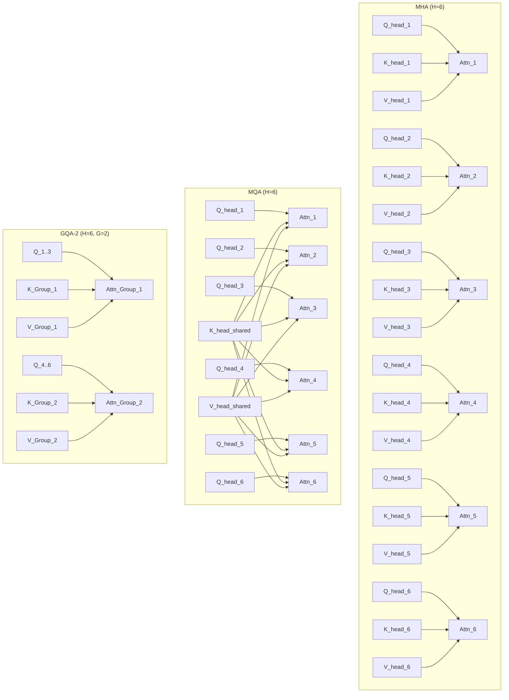
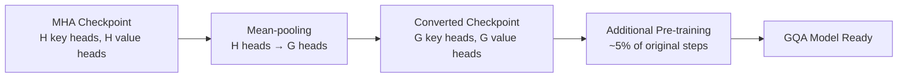

# GQA: Grouped Query Attention 解讀——從 MHA 到 MQA 再到 GQA 的演進

> **種子論文**: [GQA: Training Generalized Multi-Query Transformer Models from Multi-Head Checkpoints](https://arxiv.org/abs/2305.13245) (2023-05)
> **作者**: Joshua Ainslie, James Lee-Thorp, Michiel de Jong et al.
> **機構**: Google Research
> **分類**: cs.CL, cs.LG

## TL;DR

自回歸語言模型的推論速度受到 memory bandwidth 的嚴重限制——每次生成一個 token 都要從 HBM 載入整個 KV cache。Multi-Query Attention (MQA) 讓所有 query heads 共享單一 key/value head 來解決這個問題，但也因此帶來了品質下降與訓練不穩定。GQA (Grouped-Query Attention) 把 query heads 分成 G 組、每組共享一對 key/value head，在 MHA 的品質與 MQA 的速度之間找到了優雅的平衡點——最終 GQA-8 在 T5-XXL 上以只比 MQA 慢 17% 的代價，達到了接近 MHA 的品質。

如果你是第一次接觸 GQA，可以先記住一句話：**GQA 是 LLM 推論加速的「便宜午餐」**——它幾乎不花額外成本（幾行程式碼改動、5% 的 uptraining），但帶來了顯著的推論加速，而且不會犧牲模型品質。

---

## 背景與動機

### 為什麼推論會這麼慢？

要理解 GQA，得先理解一個反直覺的事實：**LLM 推論的瓶頸不是計算，而是記憶體頻寬**。

Transformer 的解碼器（decoder）在生成每個 token 時，必須做兩件事：

1. 載入整個模型的權重（weights）
2. 載入到目前為止所有歷史 token 的 attention keys 和 values（也就是 KV cache）

你可以想像這個過程：每次電腦要從記憶體搬資料到運算單元（GPU/TPU）時，搬運頻寬是有限的。現代 GPU 的計算能力（FLOPS）成長速度遠快於記憶體頻寬，導致很多運算單元常常處在「空等資料送達」的狀態。這種情況在深度學習中被稱為 **memory-bound**——瓶頸不在於算得多快，而在於資料送得多快。

這個問題對訓練來說不明顯，因為訓練時所有 token 可以同時計算（parallel over sequence length）。訓練時的 attention 計算可以用高度最佳化的 batch matrix multiply 來實作，GPU 可以同時處理數千個 token 的 attention 運算。

但推論時，每個 token 都得等到前一個 token 算完才能算下一個——這正是 Shazeer (2019) 在提出 MQA 時精確分析的場景。自回歸解碼的 sequential nature 讓 attention 計算無法利用平行化優勢，反而暴露了 memory bandwidth 的瓶頸。

**MQA 論文用了一個簡單但非常有啟發性的比喻**：在訓練時，attention 像是一次性讀取一整本書的所有頁面——你可以在記憶體和計算之間取得很好的平衡。但在增量解碼時，attention 像是一頁一頁地翻書——每次只讀一頁，但都要把整本書（KV cache）帶在身上。

**具體數據：搬運量有多大？**

假設一個標準的 decoder-only 模型（以 LLaMA 65B 為例）：

- Model dimension $d = 8192$，heads $H = 64$，每組 head dimension $d_k = 128$
- 推論到第 $t$ 步時，KV cache 大小為 $2 \times H \times t \times d_k$（keys + values）
- 當 $t = 2048$ 時，KV cache 約為 $2 \times 64 \times 2048 \times 128 = 33.5\text{M}$ 個 float16 數值 ≈ **64 MB**
- 這個 64 MB 的 KV cache 在每個 decoding step 都要被完整載入一次

MQA 的論文中給出了一個更精確的效能分析。對於標準的 multi-head attention incremental inference：

- 總運算量：$O(bnd^2)$（b = batch size, n = sequence length, d = model dimension）
- 總記憶體存取量：$O(bn^2d + nd^2)$
- 兩者的比值（compute intensity）約為 $O(\frac{n}{d} + \frac{1}{b})$

當 $n$ 較大或 $b$ 偏小時，這個比值會降到接近 1，遠低於 GPU 的 arithmetic intensity 需求。換句話說，**運算單元大多數時間都在等資料**。

**Shazeer 的效能分析——細節推導**

MQA 論文給出的效能分析雖然簡潔，但值得仔細推敲，因為它直接解釋了為什麼 MQA/GQA 能帶來如此巨大的推論加速。

在 batched multi-head attention 中（訓練情境），K、V、Q 三個張量的計算可以平行進行。標準的 attention 公式需要以下 einsum 操作：

1. $Q = X P_q$ → `bnd, hdk → bhnk` → $O(bhndk)$ 次操作
2. $K = M P_k$ → `bmd, hdk → bhmk` → $O(bhmdk)$ 次操作
3. $V = M P_v$ → `bmd, hdv → bhmv` → $O(bhmdv)$ 次操作
4. logits = $Q K^T$ → `bhnk, bhmk → bhnm` → $O(bhnm k)$ 次操作
5. weights = softmax(logits) → $O(bhnm)$ 次操作
6. $O = \text{weights} V$ → `bhnm, bhmv → bhnv` → $O(bhnm v)$ 次操作
7. $Y = O P_o$ → `bhnv, hdv → bnd` → $O(bhndv)$ 次操作

在標準設定下（$m=n$, $k=v=d/h$，且 $bnd^2$ 為 dominant term），總運算量為 $O(bnd^2)$。

記憶體存取方面，需要載入的張量包括：$X$、$M$、$Q$、$K$、$V$、$O$、$Y$ ($O(bnd)$)，logits 與 weights ($O(bhn^2)$)，以及投影矩陣 $P_q, P_k, P_v, P_o$ ($O(d^2)$)。

總記憶體存取量為 $O(bnd + bhn^2 + d^2)$。

在訓練場景中，$bhn^2$ 項雖然看起來很大，但因為 $bhn k$ 的計算量相應也大，compute intensity 仍可接受。

**但是，在增量解碼（incremental inference）中，情況完全不同：**

```python
def MultiheadSelfAttentionIncremental(x, prev_K, prev_V, P_q, P_k, P_v, P_o):
    # x shape: [b, d]  — 只有當前的 token！
    q = einsum("bd, hdk->bhk", x, P_q)     # O(b h d k)
    new_K = concat(prev_K, ...)            # KV cache 成長
    new_V = concat(prev_V, ...)
    logits = einsum("bhk, bhmk->bhm", q, new_K)  # O(b h m k)
    weights = softmax(logits)                       # O(b h m)
    o = einsum("bhm, bhmv->bhv", weights, new_V)   # O(b h m v)
    y = einsum("bhv, hdv->bd", o, P_o)             # O(b h d v)
    return y, new_K, new_V
```

增量解碼的關鍵區別是：**batch size b 通常為 1（或很小），而且一次只處理一個 token**。這意味著：

- 計算量：跨 $n$ 步，總共 $O(bnd^2)$
- 記憶體存取：跨 $n$ 步，總共 $O(bn^2d + nd^2)$
- Compute intensity：$O(\frac{bn d^2}{bn^2 d + nd^2}) = O(\frac{n d}{n^2 + d^2}) \approx O(\frac{n}{d})$（當 $n \approx d$ 時，約等於 1）

**當 compute intensity ≈ 1 時，意味著每做一次浮點運算，就要從記憶體搬一個數值進來。** 現代 GPU 的 peak compute 與 memory bandwidth 比例大約是 100:1（例如 A100 有 312 TFLOPS 和 2 TB/s bandwidth）——這代表 compute intensity 至少要達到 100 才能充分利用 GPU。1 的 compute intensity 意味著 GPU 利用率只有 1%。

MQA 將 KV cache 從 H 個 heads 縮減為 1 個，直接將 $bn^2 d$ 項中的 h 從 H 減為 1，極大降低了記憶體存取量。GQA 則進一步權衡：將 h 從 1 增加到 G，換取更好的品質。

**從效能分析到架構設計**

這個分析揭示了一個更深層的 insight：**attention head 的數量與推論效率之間的關係不是線性的，而是由 memory bandwidth 主導的「門檻效應」**。只要 KV heads 多到某個程度（超過 memory bandwidth 的瓶頸點），再多就會大幅拖慢速度；但只要 KV heads 少到讓 memory bandwidth 不再是瓶頸，再少也不會變得更快。GQA 的核心貢獻就是找到了這個「瓶頸點」，然後停在剛好夠用的組數上。

### 既有方法的不足

在 GQA 提出之前，領域內有四條路線在解決這個問題：

1. **MQA (Shazeer 2019)**：直接砍掉 KV heads，只用一個。速度快，但品質下降，而且有嚴重的訓練不穩定性問題
2. **FlashAttention (Dao et al., 2022)**：透過 tiling 技術優化 attention 計算的 memory access pattern，但不改變 KV cache 的總體大小，也不影響 incremental inference 的 KV cache 載入開銷
3. **量化 (Dettmers et al., 2022; Frantar et al., 2022)**：降低 KV cache 的精確度（例如從 float16 降到 int8），可以在不改變 attention head 配置的情況下減少記憶體頻寬需求，但會引入量化誤差
4. **Speculative decoding (Chen et al., 2023; Leviathan et al., 2022)**：用小模型先預測多個 token，再用大模型平行驗證。這是一種演算法層面的優化，與 attention 架構無關，可以與 GQA 同時使用

此外，還有一些更早期的分組注意力嘗試，如 Park et al. (2020) 和 Luo et al. (2022) 提出的 group-wise attention——但它們的分組是針對計算效率（減少 attention 總計算量），而不是針對 KV cache 的 memory bandwidth。這些工作與 GQA 的目標不同：GQA 專注於減少 KV cache 的記憶體存取，而非 attention 分數的計算量。

GQA 走的是第一條路線的延伸，但解決了 MQA 最關鍵的問題：**為什麼只砍到一個 KV head？多留幾個不是更好嗎？**

---

## 核心知識點

本文圍繞以下知識點展開。這些概念從記憶體頻寬瓶頸出發，一路走到 GQA 的設計與工程實踐：

1. **自回歸推論的記憶體頻寬瓶頸**——為什麼 KV cache 是解碼器推論的主要效能限制因素
2. **MHA 到 MQA 的演化**——Shazeer (2019) 如何從效能分析推導出只需一個 KV head 的結論
3. **GQA 的設計原理**——如何透過分組在 MHA 的品質與 MQA 的速度之間取得平衡
4. **Uptraining 的具體方法**——怎麼不從頭訓練就把現成的 MHA 模型轉換成 GQA
5. **訓練穩定性**——為什麼 MQA 容易訓練失敗，而 GQA 卻很穩定

---

## 方法詳解

### 知識點 1：自回歸推論的記憶體頻寬瓶頸

**這個知識點要回答什麼問題？**

為什麼看似簡單的「載入資料 → 計算 → 輸出下一個 token」流程會這麼慢？瓶頸到底在哪裡？

**Shazeer (2019) 的精確分析**

Shazeer 在 MQA 論文中，對 multi-head attention 的 batched 與 incremental 兩種模式做了非常詳細的效能分析。

在 batched 模式（訓練）中，attention 的 compute intensity 是：

$$O\left(\frac{1}{k} + \frac{1}{bn}\right)$$

其中 $k$ 是 head dimension，$b$ 是 batch size，$n$ 是 sequence length。當 batch size 夠大時（$b \gg 1$），這個比值不會太低——因為多個序列共享了 KV 的載入成本。

但在 incremental 模式（推論）中，情況完全不同。每次只解碼一個 token，無法平行。每個 step 都需要：

- 計算新的 query vector $q_t = x_t P_q$
- 將新的 key/value 加入 KV cache
- 載入完整的 KV cache 來計算 attention

Shazeer 推導出 incremental inference 的 compute intensity 為：

$$O\left(\frac{n}{d} + \frac{1}{b}\right)$$

當 $n$ 與 $d$ 差不多大（或 $d$ 小於 $n$，這在長序列推論中很常見），且 batch size $b$ 很小（通常推論時 batch size = 1）時，這個比值可以降到接近 1。**在現代 GPU 上，這意味著超過 90% 的時間都花在搬資料，而不是在算資料。**

公式背後的直覺是：在增量解碼中，K 和 V 的規模與 $n$ 成正比（因為要記得所有歷史 token），而計算量只與 $d$ 成正比（因為只算當前 token 的 query）。當序列長度拉長時，KV cache 不斷變大，但每次的計算量不變，形成一個不斷惡化的瓶頸。

**MQA 的解決思路**

如果 K 和 V 的大小是瓶頸的來源，那最直接的方法就是把它們變小。MQA 的想法很簡單：既然 attention 本來就有 H 個 heads，為什麼每個 head 都需要自己的 key 和 value？讓所有 query heads 共享同一組 key 和 value 不就好了嗎？

這個改動直接把 KV cache 的大小從 $2 \times H \times t \times d_k$ 降到 $2 \times 1 \times t \times d_k$——**縮小了 H 倍**。對於一個有 64 個 heads 的模型，KV cache 從 64 MB 降到 1 MB。

**MQA 的效能分析——為什麼一個 KV head 就夠了？**

要理解為什麼 MQA 只需要一個 KV head 就能運作，需要回到 multi-head attention 的設計初衷。Vaswani et al. (2017) 引入多頭注意力的理由是：「不同的 heads 可以學到不同的注意力模式」。但 Shazeer 的關鍵 insight 是：**不同的 query heads 雖然可能關注不同的位置，但它們關注的對象是同一組 keys 和 values**。換句話說，$K$ 和 $V$ 的投影矩陣只是將輸入 $M$ 映射到不同的子空間——多個 query heads 可以從同一個子空間中學到不同的注意力分佈。

這類似於共享嵌入層（shared embedding）的概念：詞彙表中每個詞的嵌入向量是共享的，但上層的 transformer layers 可以從中提取不同的語義。MQA 把這個類比從詞彙層延伸到注意力的 KV 投影層。

**實際效能測試**

從論文 Table 1 可以看到，MQA-XXL 的推論時間為 0.24ms，而 MHA-XXL 為 1.51ms——加速了 6.3 倍。作為對比，MHA-Large（參數量小很多的模型）的推論時間為 0.37ms。這意味著 **MQA-XXL 雖然參數量比 MHA-Large 大得多，推論速度卻比 MHA-Large 還快**——這正是因為記憶體頻寬瓶頸被 MQA 解除了。

---

### 知識點 2：從 MHA 到 MQA 的演化

**這個知識點要回答什麼問題？**

MQA 的改動看起來這麼合理，為什麼沒有被所有模型採用？它犧牲了什麼？

**MHA 的標準公式**

先回顧標準 multi-head attention 的公式。給定輸入 $x \in \mathbb{R}^d$，MHA 的計算如下：

$$Q = xW^Q, \quad K = MW^K, \quad V = MW^V$$

其中 $W^Q \in \mathbb{R}^{d \times h d_k}$，$W^K, W^V \in \mathbb{R}^{d \times h d_k}$。

然後將 Q、K、V 拆成 h 個 heads：

$$Q_i = Q_{[i \cdot d_k : (i+1) \cdot d_k]}, \quad K_i = K_{[i \cdot d_k : (i+1) \cdot d_k]}, \quad V_i = V_{[i \cdot d_k : (i+1) \cdot d_k]}$$

每個 head 獨立計算 attention：

$$\text{head}_i = \text{softmax}\left(\frac{Q_i K_i^T}{\sqrt{d_k}}\right) V_i$$

最後把所有 heads 的輸出拼接再投影：

$$\text{MHA}(x) = \text{Concat}(\text{head}_1, ..., \text{head}_h) W^O$$

**MQA 的改動**

MQA 把 key 和 value 的投影矩陣從每個 head 獨立改為共享一組：

$$K_{\text{MQA}} = M W^{K_{\text{shared}}}, \quad V_{\text{MQA}} = M W^{V_{\text{shared}}}$$

其中 $W^{K_{\text{shared}}} \in \mathbb{R}^{d \times d_k}$，$W^{V_{\text{shared}}} \in \mathbb{R}^{d \times d_k}$。

在推論時，KV cache 從儲存 $h$ 組 keys 和 values 變成只需儲存一組。**這很明顯是「用模型的容量（capacity）換速度」的取捨**。

**MQA 的代價**

Shazeer 在原始論文中就承認了 MQA 的品質下降，但他的實驗（機器翻譯 WMT En→De）顯示下降幅度很小。然而後續工作（包括 GQA 論文本身）發現：

- 對於更複雜的語言理解任務，MQA 的品質下降更明顯
- 在長序列任務（如長文本摘要）中，MQA 的退化更嚴重
- **最重要的是，MQA 在訓練過程中會出現嚴重的 loss spikes 和不穩定性**——這個問題在 GQA 論文的附錄 A（Training Stability）中有詳細記錄

到 2023 年 GQA 論文發表時，業界已經開始注意到這個問題。PaLM (Chowdhery et al., 2022) 使用了 MQA，但那是從頭訓練的。對於已經存在的 MHA 模型——如 T5 (Raffel et al., 2020) 和 LLaMA (Touvron et al., 2023)——如果要改用 MQA，要嘛重新訓練（極貴），要嘛忍受品質下降。

這就是 GQA 登場的契機。

---

### 知識點 3：GQA 的設計原理

**這個知識點要回答什麼問題？**

能不能設計一個注意力機制，同時具備 MHA 的品質和 MQA 的速度？

**GQA 的核心想法**

GQA 的想法極其簡單：

> 不要讓所有 query heads 共享一個 KV head，也不要讓每個 query head 都有自己的 KV head。**把 query heads 分成 G 組，每組共享一個 KV head。**

具體來說，將 $h$ 個 query heads 分成 $G$ 個 groups，每個 group 包含 $h/G$ 個 query heads。每個 group 使用一個 key head 和一個 value head。

用數學來表達：假設總共有 $h$ 個 query heads，$G$ 個 groups，第 $i$ 個 query head 的 query 向量為 $q_i \in \mathbb{R}^{d_k}$。屬於第 $g$ 組的 query heads 集合為 $\mathcal{Q}_g = \{i : (g-1)\frac{h}{G} + 1 \leq i \leq g\frac{h}{G} \}$。則第 $g$ 組的 key 和 value 為：

$$k_g = M_{[t,:]} W^{K}_g, \quad v_g = M_{[t,:]} W^{V}_g$$

其中 $W^{K}_g \in \mathbb{R}^{d \times d_k}$ 和 $W^{V}_g \in \mathbb{R}^{d \times d_k}$ 是第 $g$ 組的投影矩陣。

屬於第 $g$ 組的 query head $i$ 的 attention 輸出為：

$$\text{head}_i = \text{softmax}\left(\frac{q_i k_g^T}{\sqrt{d_k}}\right) v_g, \quad \forall i \in \mathcal{Q}_g$$

注意這裡的關鍵差異：**在 MHA 中，每個 $\text{head}_i$ 使用不同的 $k_i$ 和 $v_i$；在 MQA 中，所有 $\text{head}_i$ 使用相同的 $k$ 和 $v$；在 GQA 中，每個 group $\mathcal{Q}_g$ 內的 heads 共享 $k_g$ 和 $v_g$，但不同 groups 之間不共享。**

最終的輸出為：

$$\text{GQA-G}(x) = \text{Concat}(\text{head}_1, ..., \text{head}_h) W^O$$

**極端情況即為熟悉的架構：**

- GQA-1：只有一個 group → 等同 MQA
- GQA-H：group 數量等於 head 數量（每個 head 有自己的 KV）→ 等同 MHA
- GQA-8：8 個 groups，GQA 論文中選擇的中間值

這裡有一個關鍵的設計 insight：**GQA 的 KV cache 大小是 MHA 的 $G/H$，而不是 $1/H$**。對於 T5-XXL（H=64, G=8），KV cache 從 MHA 的 64 個 heads 降到 GQA 的 8 個 KV heads——這是 8 倍的減少，而不是 MQA 的 64 倍。這聽起來像是回退了一步，但實驗結果顯示：**8 倍的 KV cache 縮減就足夠讓推論速度接近 memory-bound 的極限，而額外的 KV heads 帶來了顯著的品質提升。**



**圖 1：MHA（每個 query head 有自己的 KV head）、MQA（所有 query heads 共享一個 KV head）、GQA（query heads 分組，每組共享一個 KV head）的對比示意圖。**

**為什麼 GQA 對大模型特別友善**

論文中提出了一個值得注意的觀察：**模型越大，從 GQA 得到的相對效益越好**。原因有兩層：

1. **KV cache scaling vs. model parameter scaling**：KV cache 的大小與 model dimension $d$ 成正比（$d_k \times H = d$），但模型參數量和 FLOPs 與 $d^2$ 成正比。這意味著模型越大，KV cache 在總記憶體頻寬佔比中相對越小——從 MHA 砍到 MQA 的「64 倍縮減」對於大模型來說可能太過激進。

2. **Sharding efficiency**：在模型並行（model parallelism）中，MQA 的單一 KV head 必須被複製到每個 partition 上（Pope et al., 2022），造成浪費。GQA 的 $G$ 個 KV heads 可以被分散到 $G$ 個 partitions 上，不需要複製——去除了這個浪費。

這兩個觀察共同指向一個結論：**對於大模型，用 GQA 取代 MQA 幾乎是只有好處沒有壞處的選擇。**

**一個具體的數學例子**

為了讓討論更具體，假設我們有一個 70B 模型，$d = 8192$，$H = 64$，$d_k = 128$，sequence length = 4096，使用 float16：

- MHA KV cache 大小（一層）：$2 \times 64 \times 4096 \times 128 \times 2\text{ bytes} = 128\text{ MB}$
- MQA KV cache 大小（一層）：$2 \times 1 \times 4096 \times 128 \times 2\text{ bytes} = 2\text{ MB}$
- GQA-8 KV cache 大小（一層）：$2 \times 8 \times 4096 \times 128 \times 2\text{ bytes} = 16\text{ MB}$

對於一個 80 層的模型：
- MHA：$128 \times 80 = 10.24\text{ GB}$
- MQA：$2 \times 80 = 160\text{ MB}$
- GQA-8：$16 \times 80 = 1.28\text{ GB}$

可以看到，GQA-8 的 KV cache 仍然只有 MHA 的 12.5%，同時保留了 8 個 KV heads 的容量。MQA 雖然降到 160 MB，但只剩一個 KV head。**GQA-8 用 1.12 GB 的額外 KV cache（相對於 MQA），換來了 quality 的大幅提升。** 在一個配備 80 GB VRAM 的 H100 上，1.28 GB 的 KV cache 完全可以接受。

---

### 知識點 4：Uptraining 的具體方法

**這個知識點要回答什麼問題？**

如果已經有一個訓練好的 MHA 模型，不想從頭訓練，該怎麼讓它用上 GQA？



**圖 2：從 MHA checkpoint 到 GQA 的 uptraining 流程。關鍵步驟是 mean-pooling 轉換和 5% 的繼續預訓練。**

**步驟 1：Checkpoint 轉換**

從 MHA checkpoint 出發，需要將 H 個 key/value 投影矩陣轉換為 G 組。GQA 論文嘗試了三種轉換方法並進行比較：

1. **Mean-pooling（最佳）**：對每組內的 heads，計算投影矩陣的 mean。具體來說，如果頭 1 到頭 $H/G$ 屬於第 1 組，則：
   $$W^{K}_{g} = \frac{1}{H/G} \sum_{i \in \text{group } g} W^{K}_i$$
   對 value 投影矩陣同理。

2. **First-head selection（次佳）**：直接選每組的第一個 head 作為該組的共享 head

3. **Random initialization（最差）**：隨機初始化新的 KV heads，完全不保留預訓練資訊

實驗結果（Figure 4）顯示 Mean-pooling 明顯優於另外兩種方法。直覺上很好理解：mean-pooling 保留了所有 heads 的資訊（雖然做了平均），而 first-head selection 丟棄了 $H/G - 1$ 個 heads 的資訊，random initialization 則完全丟棄了預訓練的成果。

**步驟 2：繼續預訓練**

轉換後的 checkpoint 再用原始預訓練設定（相同資料集、optimizer、學習率排程）繼續訓練一小部分步驟。論文測試了不同比例的預訓練步驟（見 Figure 5）：

- 0%（只做轉換不做訓練）：GQA 已經能達到不錯的表現
- 5%：MQA 和 GQA 都有顯著的品質提升
- 10%：效益遞減，從 5% 到 10% 的改善很小

論文最終選用 5% 的 uptraining proportion，對應約 600 TPUv3 chip-days 的計算成本（以 T5-XXL 為單位）。

**特別注意 GQA vs. MQA 在轉換後的初始表現差異**：GQA 在沒有額外訓練的情況下（0% uptraining）表現已經不錯，而 MQA 幾乎需要 uptraining 才能變得有用。這是因為 GQA 保留了更多的 KV heads，保留了更多的預訓練資訊。

**Uptraining 的理論基礎**

為什麼 uptraining 只需要 5% 的原始訓練量？這背後的直覺與 transformer 的學習特性有關：

預訓練過程中，模型學到的知識大致可以分為兩類：**語意知識**（詞彙、文法、事實）存在於 FFN 層和 attention 的 Q 投影中，而 **注意力結構知識**（哪些位置、哪些 heads 攜帶哪些資訊）存在於 K 和 V 投影中。當我們對 K 和 V 做 mean-pooling 時，注意力結構被破壞了（因為 heads 被合併），但語意知識幾乎完整保留。

Uptraining 的作用是讓模型「重新學習」注意力結構，而不需要重新學習語意知識。因為語意知識已經在 weights 中了，模型只需要調整 K、V 投影來適應新的 head 配置。這就解釋了為什麼只需要很少的訓練步驟——模型不是在學習新知識，而是在重新組織既有知識的提取方式。

從 Figure 5 的曲線來看，還有一個有趣的細微差別：GQA 在 0% 到 5% 之間的提升曲線比 MQA 更平緩。這是因為 GQA 的 mean-pooling 只合併了 $H/G$ 個 heads 的資訊，比 MQA 的 $H$ 個 heads 合併保留更多結構，所以初始品質更好，剩餘需要學習的部分更少。

---

### 知識點 5：訓練穩定性

**這個知識點要回答什麼問題？**

為什麼業界遲遲沒有全面採用 MQA？訓練不穩定到底是什麼意思？

**MQA 的訓練噩夢**

GQA 論文的附錄 A 記錄了一個被忽略的問題：

> "We trained multiple T5-Large models with multi-query attention from scratch. In each case, pre-training suffered from frequent loss spikes and the final models diverged immediately when fine-tuning on long-input tasks."

翻譯：**用 MQA 從頭訓練 T5-Large，每一次都出現頻繁的 loss spikes，而且最終模型在長序列任務上做 fine-tuning 時立刻發散。**

這是一個嚴重的問題。也就是說，MQA 不僅品質下降，在訓練上也很不穩定。對於需要大規模訓練的 LLM 來說，這種不穩定性是不可接受的。

論文進一步指出，從 MHA **uptrain** 到 MQA 的模型雖然比從頭訓練的 MQA 更穩定，但仍然顯示高方差（high variance）。因此在 unstable tasks 上，論文不得不對 MQA 報告三次 fine-tuning runs 的平均結果。

**GQA 的穩定性**

相比之下，uptrained GQA 模型在訓練過程中沒有觀察到不穩定性。論文寫道：

> "Uptrained grouped-query attention models, however, appear to be stable, so we did not investigate further on the root causes of multi-query instability."

之所以沒有深入探究原因，是因為 GQA 的穩定性已經可以滿足實際需求。但從文獻中可以推測可能的解釋：MQA 的單一 KV head 承載了所有 query heads 的注意力資訊——當所有 query heads 都想從同一個 KV head 讀取不同資訊時，這個 KV head 的 gradients 會變得非常嘈雜（noisy），導致訓練不穩定。GQA 的多個 KV heads 分散了這種 gradient 衝突。

**這個發現的實際意義**

對工程團隊來說，訓練穩定性可能是比品質更關鍵的決策因素：
- MQA：「品質下降一些，但至少還可以用」→ 訓練不穩定讓它根本不能用
- GQA：「品質接近 MHA，速度接近 MQA」→ 訓練穩定，可以直接用

這也是為什麼後續的開源模型（LLaMA 2 70B、LLaMA 3、Mistral、Gemma）幾乎都選擇 GQA 而非 MQA。

**穩定性的可能理論解釋**

雖然論文沒有深入探究 MQA 不穩定的根源，我們可以從訓練動態學的角度提出幾種可能的解釋：

1. **Gradient 衝突**：在 MQA 中，所有 $h$ 個 query heads 對同一個 KV head 的 gradients 進行更新。如果不同 query heads 需要截然不同的 KV 表示，它們的 gradients 可能方向相反，互相抵消或造成大幅震盪。在 GQA 中，只有 $h/G$ 個 query heads 共享一個 KV head，gradient 衝突的規模小了很多。

2. **容量瓶頸放大**：當共享的 KV head 在 training step 中被大幅更新時，它會同時影響所有 query heads 的注意力分佈。這就像一個舵同時控制多艘船——一個大轉向會讓所有船一起偏離。在 MQA 中這個效應被放大了 $h$ 倍。

3. **長序列的 compounding effect**：論文特別提到，MQA 的不穩定在長序列任務上更嚴重。這是因為長序列的 KV cache 更大，單一 KV head 需要承載的資訊量更多，gradient 的信噪比更低。

**為什麼 GQA 在實踐中如此重要**

如果只是品質問題，工程團隊可以透過更大的模型或更多的訓練來補償 MQA 的損失。但訓練不穩定是一個「非線性的牆」——它讓訓練根本無法完成。GQA 提供了一個既實用又優雅的解決方案，這也是它被快速採用的真正原因。

---

## 實驗結果

### 主要實驗

論文的核心實驗在 T5 Large 和 T5 XXL 上進行，比較以下四種配置：

- MHA-Large（baseline，小模型）—— 作為品質下限的參考點
- MHA-XXL（baseline，大模型）—— 作為品質上限的參考點
- MQA-XXL（5% uptrained）—— MQA 在 XXL scale 的表現
- GQA-8-XXL（5% uptrained，8 groups）—— 論文提出的方法

實驗涵蓋 5 個摘要資料集（CNN/Daily Mail、arXiv、PubMed、MediaSum、MultiNews）、1 個翻譯資料集（WMT En→De）和 1 個問答資料集（TriviaQA）。這些資料集涵蓋了短摘要（CNN/Daily Mail）、長摘要（arXiv、PubMed）、對話摘要（MediaSum）、多文件摘要（MultiNews）、機器翻譯（WMT）和開放域問答（TriviaQA），展現了 GQA 在不同任務類型上的泛化能力。以下是關鍵結果：

| Model | Infer Time (ms) | Avg | CNN R1 | arXiv R1 | PubMed R1 | MediaSum R1 | MultiNews R1 | WMT BLEU | TriviaQA F1 |
|-------|:-:|:-:|:-:|:-:|:-:|:-:|:-:|:-:|:-:|
| MHA-Large | 0.37 | 46.0 | 42.9 | 44.6 | 46.2 | 35.5 | 46.6 | 27.7 | 78.2 |
| MHA-XXL | 1.51 | 47.2 | 43.8 | 45.6 | 47.5 | 36.4 | 46.9 | 28.4 | **81.9** |
| MQA-XXL | **0.24** | 46.6 | 43.0 | 45.0 | 46.9 | 36.1 | 46.5 | **28.5** | 81.3 |
| GQA-8-XXL | 0.28 | **47.1** | **43.5** | **45.4** | **47.7** | 36.3 | **47.2** | 28.4 | 81.6 |

推論速度量測來自 TPUv4 chip，使用 xprof。

**關鍵觀察：**

1. **MQA-XXL vs GQA-8-XXL**：GQA 在平均品質上（47.1 vs 46.6）勝過 MQA，在推論時間上（0.28ms vs 0.24ms）只慢了 17%。這是一筆非常划算的交易——用 0.04ms 換來顯著的品質提升。值得注意的是，PubMed R1 上 GQA-8-XXL（47.7）甚至超越了 MHA-XXL（47.5），這是論文沒有特別強調但值得注意的現象。

2. **GQA-8-XXL vs MHA-XXL**：GQA 與 MHA 的品質差距僅 0.1 平均分（47.1 vs 47.2），但推論速度快了 **5.4 倍**（0.28ms vs 1.51ms）。這正是論文聲稱的「quality close to MHA, speed close to MQA」。

3. **MQA-XXL vs MHA-Large**：即使品質下降，MQA-XXL 在幾乎所有任務上都優於 MHA-Large——因為 XXL 的巨大參數量補償了 MQA 的容量損失。這支持圖 3 中的一個重要結論：**uptrain 一個更大的 MQA/GQA 模型，比使用 MHA 的小模型更好**——用更大的參數量搭配更高效的 attention 架構。

4. **TriviaQA 的獨特行為**：在 TriviaQA 上 MHA-XXL (81.9) 竟然優於 GQA-8-XXL (81.6) 和 MQA-XXL (81.3)，差距比其他任務更大。這可能是因為問答任務對 attention head 的容量更敏感，每個 query head 需要更特化的資訊來精確定位答案。GQA 的 head 共享在這裡產生了略微明顯的影響。

### 消融實驗

**Checkpoint 轉換方法**

論文比較了三種從 MHA 轉換到 MQA 的方法，在 T5-Large 上用 5% uptraining 測試：

| 轉換方法 | 平均效能 |
|----------|:-------:|
| Mean-pooling | 55.4 |
| First-head selection | 55.0 |
| Random initialization | 54.6 |

Mean-pooling 最佳，因為它保留了所有 heads 的資訊。隨機初始化最差——這告訴我們：**保留預訓練知識比從頭學更重要**。

**Uptraining 比例**

論文比較了 0%、5%、10% 三種 uptraining 比例：

- GQA 在 0%（僅轉換）已經表現不錯（約 55.6），而 MQA 在 0% 時表現明顯更差
- 兩者從 5% 得到顯著收益
- 10% vs 5% 的邊際效益遞減

這意味著 GQA 的轉換方法本身就保留了更多資訊（因為保留了更多 KV heads），需要的額外訓練更少。

**Group 數量與推論速度**

這可能是最實用的實驗結果。論文測試了 GQA-XXL 在不同 group 數（1、4、8、16、32、64）下的推論時間：

| Group 數量 | 推論時間 (ms) | 等同架構 | 每步相對 MQA 增加 |
|:----------:|:------------:|:--------:|:-----------------:|
| 1 (MQA) | 0.24 | MQA | — |
| 4 | ~0.255 | — | +6% |
| 8 | 0.28 | **GQA-8（論文選擇）** | +17% |
| 16 | ~0.38 | — | +58% |
| 32 | ~0.55 | — | +129% |
| 64 (MHA) | 1.51 | MHA | +529% |

從 1 個 group (MQA) 到 8 個 groups 只增加了約 0.04ms，但從 16 個 groups 以上時，時間開始急遽增加。這是因為 GPU 的 memory bandwidth 在較少的 KV heads 時不再是瓶頸——一旦 KV cache 縮小到某個臨界值以下，再縮小就不會有顯著的速度提升。論文選擇 8 個 groups 就是基於這個「甜蜜點」。

### 限制

論文坦誠地列出了幾項限制：

1. **評估指標的缺陷**：所有摘要任務都使用 ROUGE 分數——一個已知有缺陷的評估指標。這讓 trade-off 是否正確難以確認
2. **缺乏從頭訓練的對比**：受限於計算資源，論文沒有從頭訓練 GQA 模型來比較 uptraining vs from-scratch 的差異
3. **僅在 encoder-decoder 模型上驗證**：論文使用 T5（encoder-decoder），沒有測試 decoder-only 模型。論文推測對於 decoder-only 模型，GQA 相對於 MQA 的優勢會更大，因為 decoder-only 沒有 cross-attention

**未解答的問題**

除了論文承認的限制之外，我認為還有幾個值得關注的未解答問題：

1. **GQA 的最優 group 數量是否與模型大小有關？** 論文只在 T5-XXL（大約 11B 參數）上測試 group 數量的影響。對於更大的模型（如 70B、405B），最優 group 數是否會變化？從論文的分析來看，大模型從更多 groups 中獲得的品質邊際效益遞減——但這個「遞減點」在哪裡，還不清楚。

2. **Uptraining vs. from-scratch 的差距有多大？** 論文沒有從頭訓練 GQA 模型來比較。這是一個重要的 open question：如果從頭訓練一個 GQA 模型，它是否會比 uptrained GQA 更好？（論文的 uptrained GQA 本質上是從 MHA 出發，可能要適應 MHA 學到的注意力模式，從頭訓練則沒有這個限制。）

3. **GQA 對 encoder 層是否也能帶來好處？** 論文沒有對 encoder 應用 GQA，理由是 encoder 的計算是平行的。但 encoder 仍然有 KV cache——雖然不需要 incremental inference，但 encoder KV cache 仍佔記憶體。對於需要編碼長序列的任務（如長文本檢索），GQA 是否也能優化 encoder 的記憶體使用？

**後續研究如何驗證或挑戰 GQA 的結論**

GQA 論文發表後，後續的研究從多個角度驗證和擴展了它的結論：

- **LLaMA 2 70B**（2023-07）是第一個公開的使用 GQA 的大型 decoder-only 模型，證明了 GQA 在 decoder-only 架構上的有效性，確認了論文的預測
- **LLaMA 3 405B**（2024-04）的技術報告詳細記錄了 GQA 在 405B 參數模型上的表現，進一步驗證了 GQA 在大模型上的優勢
- **DeepSeek-V2 的 MLA**（2024-05）則在 GQA 的基礎上更進一步，展示了更積極的 KV 壓縮方案的可能性，暗示 GQA 可能不是 KV 壓縮的終點

---

## 與相關工作的對比

| 維度 | GQA (Ainslie et al., 2023) | MQA (Shazeer, 2019) | FlashAttention (Dao et al., 2022) |
|------|:-:|:-:|:-:|
| 核心思想 | KV heads 分組共享 | 全部 query heads 共享 KV | IO-aware tiling |
| KV cache 縮減 | $H \to G$ 倍 | $H \to 1$ 倍 | 無（不改變架構） |
| 推論加速 | 顯著（$> 5\times$） | 顯著（$> 6\times$） | 主要加速訓練 |
| 品質 | 接近 MHA | 有明顯下降 | 等同 MHA（exact） |
| 訓練穩定性 | 穩定 | 不穩定（loss spikes） | N/A（計算方法非架構） |
| 是否需要新訓練 | 只需 uptrain 5% | 只需 uptrain 5% | 不需修改 |
| 對大模型的效益 | 遞增 | 遞減（砍太多） | 遞增 |

從對比可以清楚看出 GQA 的定位：它填補了 MQA 與 MHA 之間的空隙，在不犧牲太多速度的前提下恢復了品質。

---

## 我的觀察

### GQA 為何成功

GQA 之所以成為事實上的業界標準（而非 MQA），我認為有一個關鍵原因：**它解決的正確問題不是「品質」，而是「訓練穩定性」**。

從論文的數據來看，GQA-8-XXL 與 MQA-XXL 在品質上的差距（47.1 vs 46.6）雖然明確，但並不是天差地別。把所有任務平均後只差 0.5 分。如果 MQA 只要品質下降這一個缺點，業界可能還是會選擇它——因為推論速度更快。

但 MQA 的訓練不穩定性是致命的。一個在 fine-tuning 時會發散的模型，在工程上是不可用的。GQA 解決了這個問題，這才是它被廣泛採用的真正原因。

### GQA 的「門檻效應」

從 group 數量的消融實驗中可以看到一個有趣的模式：從 1 個 group (MQA) 到 8 個 groups 的推論時間只增加 17%，但品質顯著提升。從 8 個 groups 到 64 個 groups (MHA) 的品質提升很小，但推論時間暴增 5 倍以上。

這形成了一個 **「門檻效應」** ：一旦 KV heads 超過某個數量（在這裡是 8），額外的 KV heads 對效能的貢獻急遽下降。這背後的直覺是：8 個 KV heads 已經提供了足夠的表示容量，讓解碼器可以分辨出足夠不同的注意力模式。再多只會增加記憶體頻寬的壓力。

### GQA 的實際實作考量

如果你要在自己的模型中使用 GQA，以下是幾個需要考慮的實作細節：

**KV cache 的組織方式**

GQA 對 KV cache 的影響非常直接。在標準 MHA 中，KV cache 的 shape 是 `[batch, layers, heads, seq_len, head_dim]`，其中 heads = H。切換到 GQA-G 時，heads 維度變成 G。重要的是：**每個 query head 需要知道它屬於哪個 group**。在實作中，最簡單的方式是：

```
# 假設 num_heads = 32, num_kv_heads = 8
# 每個 KV head 服務 32/8 = 4 個 query heads
# attention scores shape: [batch, 32, seq_len, seq_len]（用 32 個 queries）
# 但 KV 是 [batch, 8, seq_len, head_dim]（只有 8 組 keys/values）
# 計算時將 KV 沿 head 維度重複 4 次，得到 [batch, 32, seq_len, head_dim]
```

**與 group size 的關係**

論文中使用 GQA-8（8 個 groups），但實際應用中 group size 通常依模型架構而定：

- LLaMA 2 70B：40 query heads, 8 KV heads → GQA-8, group size = 5
- LLaMA 3 8B：32 query heads, 8 KV heads → GQA-8, group size = 4
- Mistral 7B：32 query heads, 8 KV heads → GQA-8, group size = 4
- Gemma 2B：16 query heads, 8 KV heads → GQA-8, group size = 2

可以看到一個有趣的模式：**大多數實作都選擇 8 個 KV heads**，然後根據模型大小調整 query heads 的數量。這呼應了論文的結論——8 個 KV heads 是甜蜜點，提供足夠容量同時保持推論速度。

**KV cache 記憶體節省的精確計算**

以 LLaMA 3 8B（sequence length 8192, float16, batch = 1）為例：

- MHA（32 KV heads）：$2 \times 32 \times 8192 \times 128 \times 2 \text{ bytes} = 128 \text{ MB}$ 每層
- GQA-8（8 KV heads）：$2 \times 8 \times 8192 \times 128 \times 2 \text{ bytes} = 32 \text{ MB}$ 每層
- 節省了 4 倍（與 $H/G = 32/8 = 4$ 相符）

對於 32 層的模型，KV cache 從 4 GB 降到 1 GB——這對於部署時的 GPU VRAM 限制是決定性的差異。

### GQA vs. 其他 KV 壓縮方法

GQA 不是唯一致力於壓縮 KV cache 的方法。除了它之外，還有幾個值得一提的方向：

**Multi-head Latent Attention (MLA)** 是 DeepSeek-V2 提出的方法，將 KV 投影到一個低維度的潛在空間（latent space）後再計算 attention。與 GQA 相比，MLA 的壓縮率更高（可以達到 $> 10$ 倍），但需要更複雜的架構修改。GQA 的優點在於**簡單**——它不需要特殊的算符（operator），可以直接用標準的 attention 實作來跑。

**KV cache 量化**（如 KVQuant、KIVI）則從另一個角度切入：不減少 KV heads 的數量，而是降低每個 KV head 中數值的精確度。這與 GQA 是**正交的**——你可以同時使用 GQA 和 KV cache 量化來獲得疊加的壓縮效果。實際上，LLaMA 3 等模型正是這樣做的。

### 對 decoder-only 的影響

論文只在 T5（encoder-decoder）上驗證，但我認為在 decoder-only 模型中 GQA 的優勢應該更大，原因如下：

- Decoder-only 的 self-attention 中，KV cache 直接決定推論速度（沒有 cross-attention 的分流）
- Decoder-only 的序列通常更長（像 LLaMA 支援 8K tokens），KV cache 壓力更大
- Decoder-only 模型中，GQA 的 KV heads 可以直接對應到 FFN 的 sharding 分區

**事後驗證**：LLaMA 2 70B（2023-07）採用了 40 query heads 搭配 8 KV heads 的 GQA 配置。LLaMA 3 全系列（8B、70B、405B）也全部採用 GQA。Mistral 7B（2023-10）進一步在 GQA 的基礎上加入了 sliding window attention，證明了 GQA 可以與其他注意力優化方法良好共存。

從這些模型的部署經驗來看，有幾個值得記錄的觀察：

1. **Group 數量的縮放規律**：LLaMA 3 8B（32 heads, 8 KV）和 LLaMA 3 70B（64 heads, 8 KV）都使用 8 KV heads，但 query heads 數量因模型大小而異。這暗示了一個經驗法則：**對於 decoder-only 模型，8 個 KV heads 可能是「夠用」的最小值**，而 query heads 則根據模型 capacity 需求調整。

2. **與 KV cache 量化的疊加效應**：LLaMA 3 在 GQA 之外還使用了 FP8 KV cache 量化。GQA 提供 4 倍的 KV cache 縮減，FP8 再提供 2 倍——總共 8 倍的 KV cache 減少。這讓 405B 模型在單一 GPU 節點上也能運行合理的 batch size。

3. **GQA 對長序列推論的影響**：對於 128K 序列長度的推論，KV cache 的大小會線性放大。LLaMA 3 405B 如果不使用 GQA，KV cache 將達到 $2 \times 64 \times 128K \times 128 = 2.1\text{GB}$ 每層。使用 GQA-8 後降到 $2 \times 8 \times 128K \times 128 = 262\text{MB}$ 每層。對於 80 層的模型，KV cache 從 168 GB 降到 21 GB——從「完全無法單節點部署」變成「可以部署在 8 張 H100 上」。

### GQA 的 macro 意義——一個架構變化的漣漪效應

從 2023 年 5 月 GQA 論文發表到 2024 年底，GQA 從一篇學術論文變成幾乎所有主流 LLM 的標準配置。這個過程本身值得反思。

GQA 之所以被快速採納，我認為有以下幾個原因疊加：

1. **它解決了一個真實的工程痛點**：2023 年中期，LLM 推論成本是各家公司最頭痛的問題。GQA 提供了一個低成本的解決方案——不需要從頭訓練，只需要對既有 checkpoint 做 5% 的 uptraining

2. **它與其他優化方法正交**：GQA 可以與 FlashAttention、量化、speculative decoding 同時使用，效果疊加

3. **它的實作極為簡單**：只需要修改 attention 層中 KV projection 的輸出維度，不改變計算圖的任何其他部分。對於工程團隊來說，這是「幾行程式碼」的改動

4. **開源生態的驗證**：LLaMA 2 70B 率先採用後，Mistral、Gemma、LLaMA 3 跟進，形成了一個正向循環——模型越多使用 GQA，框架對 GQA 的支援越好，更多的模型就越容易採用 GQA

從這個角度看，GQA 不是一個「突破性」的方法——它的核心想法在 Shazeer 2019 的 MQA 論文中就已經埋下了伏筆。GQA 的真正貢獻是**在正確的時間，用正確的實驗證據，推動了一個關鍵的工程決策**。

### GQA 的工程意義

從純實作的角度來看，GQA 的優點還包括：

- **不改變 attention 計算的核心邏輯**——只需要修改 projection 層的維度，attention 的 softmax 和 weighted sum 完全不用動
- **容易與現有系統整合**——KV cache 的管理邏輯幾乎不用改
- **與 FlashAttention 正交**——GQA 減少 KV cache 大小，FlashAttention 優化單次 attention 計算的 IO——兩者可以同時使用

---

## 延伸閱讀

### Dependency Papers（本文涵蓋）

1. **Fast Transformer Decoding: One Write-Head is All You Need** ([1911.02150](https://arxiv.org/abs/1911.02150))
   - Noam Shazeer, Google, 2019
   - 與本文關係：MQA 是 GQA 的直接前身，本文提出的 GQA 是 MQA 的一般化推廣。要理解 GQA 的設計動機，必須先理解 MQA 解決了什麼問題、留下了什麼缺口

### 後續發展（未涵蓋，僅列出）

- **LLaMA 2: Open Foundation and Fine-Tuned Chat Models** ([2307.09288](https://arxiv.org/abs/2307.09288)) (2023-07) —— LLaMA 2 70B 是第一個公開的使用 GQA 的大型開源模型，採用 40 query heads + 8 KV heads 配置
- **LLaMA 3: Herd of Models** (2024-04) —— LLaMA 3 全系列（8B、70B、405B）都使用 GQA，並搭配 FP8 KV cache 量化
- **Mistral 7B** ([2310.06825](https://arxiv.org/abs/2310.06825)) (2023-10) —— Mistral 7B 使用 GQA，並引入 sliding window attention，兩種 attention 優化方法成功結合
- **Gemma: Open Models Based on Gemini Research and Technology** ([2403.08295](https://arxiv.org/abs/2403.08295)) (2024-03) —— Google 的開源模型也採用 GQA，與 T5 系列的 GQA 實作一脈相承
- **DeepSeek-V2: A Strong, Economical, and Efficient Mixture-of-Experts Language Model** ([2405.04434](https://arxiv.org/abs/2405.04434)) (2024-05) —— DeepSeek 提出 MLA (Multi-head Latent Attention)，將 KV cache 壓縮到更低維度，可以視為 GQA 之後下一步的 KV 壓縮思路

### 實作資源

如果你想在程式碼中實作 GQA，以下開源實作可以參考：

- HuggingFace Transformers 的 `LlamaAttention` — LLaMA 2/3 的 GQA 實作，包含了 KV cache 的 group-aware 管理邏輯
- Google Flaxformer — GQA 論文使用的框架，包含原作者的實作
- PyTorch 2.0 的 `scaled_dot_product_attention` — 原生支援 GQA（透過 broadcast KV heads 到對應的 query heads 數量）

---

## 引用

完整 BibTeX 見 [`papers.bib`](./papers.bib)。
