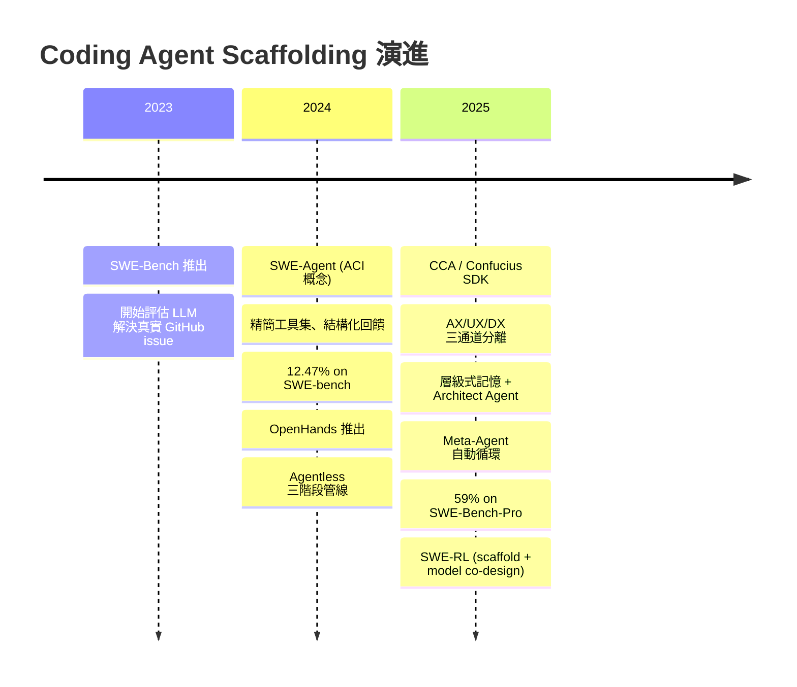

# Agent Scaffolding 論文導讀：Confucius Code Agent 與可擴展的代理人框架

## TL;DR

- **Scaffolding 比模型更重要**：在同等 LLM 下，不同的 agent scaffolding 設計可導致超過 15% 的效能差距，這證明 agent 的認知與操作環境本身就是一個獨立的研究維度，不應被視為 prompt engineering 的延伸。CCA 在 SWE-Bench-Pro 上的實驗直觀地展示了這一點：Claude 4.5 Sonnet + CCA 超越了 Claude 4.5 Opus + Anthropic 預設 scaffold，證明了精心設計的 scafffold 可以補償半個世代以上的模型差距。
- **SWE-Agent 建立基礎**：引入 Agent-Computer Interface (ACI) 概念，以精心設計的工具集取代原始 Linux shell，讓 LLM 能以 12.47% 的 resolve rate 解決真實 GitHub issue（較先前 RAG 方法提升 3 倍以上）。更重要的是，它說明了「LLM 需要的不是更靈活的介面，而是更適合它的介面」這個根本洞見。
- **Confucius Code Agent (CCA) 全面升級**：提出 AX/UX/DX 三通道分離的 SDK 架構，結合層級式記憶、Architect Agent 驅動的上下文壓縮、以及 Meta-Agent 自動化建構循環，在 SWE-Bench-Pro 上達到 59% Resolve@1，超越當時所有研究與商業的公開結果。

---

## 背景與動機

### Coding Agent 的興起

大型語言模型在程式碼領域的應用已經歷多次跳躍。從最早期 Austin et al. (2021) 的程式合成（以 OpenAI 的 Codex 為代表），到 Chen et al. (2021) 的自動程式碼補全，再到 Li et al. (2022) 的通用程式碼生成，每一次跳躍都伴隨著模型能力的顯著提升與任務範圍的擴張。Gu et al. (2024) 更進一步將 LLM 引入程式碼執行理解（code execution）的範疇，而 Jain et al. (2024) 的 LiveCodeBench 則將評測推展到競賽級程式設計。

2024 年起，LLM 開始被用於更貼近真實軟體開發的任務——在開放原始碼倉庫中修復真實的 GitHub issue。這個轉變的關鍵推手是 **SWE-Bench** (Jimenez et al., 2023)，一個以真實 GitHub issue 為基礎的評測基準。不同於傳統的 HumanEval（解決封閉式演算法問題），SWE-Bench 要求 agent 對整個程式碼倉庫進行理解、定位問題、修改多個檔案、並通過專案的既有測試。這個設定真實反映了軟體工程的本質——不是「從頭寫一段程式」，而是「在一個數萬行的既有程式碼庫中找出問題並修正」。SWE-Bench 的任務來自 12 個不同的開源專案（如 Django、Flask、SymPy 等），每個任務都附帶一個真實的 GitHub issue 描述、完整的 repository snapshot、以及人工撰寫的測試用例。

SWE-Bench 的推出迅速成為 coding agent 領域的核心評測基準，後續衍生出 SWE-Bench Lite（300 個精選子集）、SWE-Bench-Multilingual（多語言支援）、SWE-Bench-Multimodal (Yang et al., 2025a，多模態擴展)、以及最具挑戰性的 **SWE-Bench Pro** (Deng et al., 2025)。SWE-Bench Pro 包含 731 個任務，這些任務特別選取了需要長期推理（long-horizon reasoning）的企業級 issue，通常涉及多個檔案修改、複雜的跨模組依賴、與非平凡的修復策略。

### Agent Scaffolding 的浮現

當研究社群投入 SWE-Bench 的挑戰時，一個重要的現象逐漸清晰：**同樣的 LLM 搭配不同的 scaffolding，表現可以天差地遠。** Xia et al. (2025) 的實驗顯示，在相同 backbone model 下，不同的 scaffold 設計會導致 15% 以上的效能差距。這個現象在 SWE-Agent 的後續工作中被反覆驗證：Yang et al. (2024) 的實驗中，僅僅改變 file viewer 的視窗大小（30 行 vs 100 行），就導致了 3.7 個百分點的效能差距——這甚至比更換 backbone model 的影響還大。這個發現深刻地挑戰了當時的主流觀點：**LLM 是 agent 效能的唯一決定因素。**

這種現象的根源是，當 LLM agent 被放入一個互動環境時，它面臨的問題與傳統的「單次生成」截然不同。在 SWE-Bench 這類任務中，agent 需要：

1. **理解程式碼庫結構**：在數萬行程式中找到與 issue 相關的檔案與函式
2. **執行探索性行為**：編寫並執行復現腳本、檢查錯誤訊息、搜尋關鍵段落
3. **迭代式修改**：提出修補檔案、執行測試、根據失敗調整策略
4. **追蹤長期依賴**：數十輪互動中保持對問題脈絡的連續理解

每一步的成功都取決於 scaffold 如何呈現資訊、如何回饋結果、以及如何管理記憶。這不是一個「prompt 寫得好不好」的問題——而是整個認知環境的設計問題。

### 兩大核心挑戰

CCA 論文將這個問題具象化為兩個可操作的技術挑戰：

**C1: Long-context reasoning（長上下文推理）**。真實的程式碼倉庫動輒數萬行，agent 需要在單一對話中遍歷多個檔案、追蹤跨檔案之間的依賴關係、並將數小時前做出的決策納入當前推理。Flat history（扁平歷史）的設計不可避免地會在數十輪互動後觸發 LLM 的 context window 限制。更糟的是，即使是 200k tokens 的超長 context 視窗（如 Claude 3 Opus），當歷史對話累積到數萬 tokens 時，「lost in the middle」效應（Liu et al., 2024）會讓模型難以在長 context 中準確定位資訊。

**C2: Tool-use reliability（工具使用可靠度）**。當 agent 需要協調多種工具（grep 搜尋、檔案編輯、測試執行、git 操作）時，任意一個步驟的失敗都可能讓整條推理鏈脫軌。SWE-Agent 的資料顯示，超過 50% 的任務執行軌跡至少經歷一次編輯失敗。雖然 agent 通常能恢復，但每次失敗都會消耗寶貴的 context window 並且增加 cost。更根本的問題是，現有的 hard-coded 工具管線難以在失敗發生時優雅復原——一旦失敗，agent 很可能沿著錯誤的方向繼續前進。

CCA 的核心貢獻，就是提出一個系統性的 scaffolding framework——Confucius SDK——來同時解決這兩個挑戰，而不僅僅是逐一 patch 它們。

---

## 核心知識點

### 知識點 1：Agent-Computer Interface (ACI)

SWE-Agent 提出的核心概念可以被理解為「LLM 的可及性設計」（accessibility design for LMs）。正如人類工具有不同的 UI 設計原則（WYSIWYG、command line、touch interface），LLM agent 需要的也不是人類習慣的介面，而是一個專為文字模型設計的操作抽象層。

ACI 的核心設計差異在於：傳統的 Linux shell 提供的是高度靈活但粒度過細的操作空間（3000+ 種指令與 flags），LLM agent 在這種環境中面臨以下困難：

1. **編輯不精確**：對於 `sed -i` 這類檔案編輯指令，LLM 常常無法提供正確的 pattern 或行號。SWE-Agent 的實驗顯示，當 agent 直接用 `sed -i` 編輯檔案時，其成功率遠低於使用專用的 `edit` 指令。
2. **回饋不足**：shell 對錯誤的處理方式（stderr 輸出）並非為 LLM 設計，缺乏結構化資訊。例如 `grep -r "pattern"` 的回傳可能是零結果、數百行匹配、或一個錯誤訊息，這些對 LLM 來說都只是原始文字，需要自行解析。
3. **搜尋效率低**：`grep` 的輸出雖然人類可以快速掃讀，但 LLM 需要從大量文字中定位相關行，這個過程消耗 context window 且容易遺漏。

SWE-Agent 的 ACI 精簡為一組精心挑選的動作，每個動作都經過反覆測試與迭代：

**檔案編輯系列**：
- `edit <start> <end> <replacement>`：取代指定行號範圍的內容。編輯後自動執行 lint 檢查，若 lint 失敗則回傳明確的錯誤訊息並允許重試。
- `create <file_path>`：創建新檔案。與 `edit` 共用相同的替換邏輯。

**檔案搜尋系列**：
- `search_file <pattern>`：在當前開啟檔案中搜尋，回傳匹配行號與前後 5 行上下文。
- `search_dir <pattern>`：在目錄中搜尋，回傳匹配的檔案列表及其行數摘要，最多 25 個結果。
- `find_file <name>`：根據檔名搜尋，回傳完整路徑。

**瀏覽導航系列**：
- `open <file_path>`：開啟檔案，顯示預設 100 行的視窗。
- `scroll_up` / `scroll_down`：在開啟檔案中上下捲動。
- `goto <line>`：跳轉到指定行號。
- `find <pattern>`：在開啟檔案中搜尋字串。

**命令執行系列**：
- `python3 <script>`：執行 Python 腳本。
- `pytest <args>`：執行測試。
- `submit`：提交解決方案。

每個動作都搭配 guardrails（lint 檢查、結果驗證、輸入格式校驗）與**高度結構化的回饋訊息**。SWE-Agent 對 ACI 的消融實驗（ablation）系統性地驗證了每一項設計決策的影響。在 SWE-Bench Lite 上：

| ACI 變體 | Resolve Rate | 差異 |
|----------|-------------|------|
| 完整 ACI（基準） | 18.0% | — |
| 無編輯功能 | 10.3% | −7.7% |
| 無搜尋功能（summarized 替代） | 12.0% | −6.0% |
| File viewer 30 行 | 14.3% | −3.7% |
| File viewer 100 行 | 18.0% | 0% |

從這些數據可以歸納出 ACI 設計的三個關鍵原則：

- **原則 1**：編輯功能是最關鍵的 ACI 元件。移除編輯功能後的效能損失（−7.7%）大於任何單一變更。
- **原則 2**：搜尋的呈現方式至關重要。Summarized 搜尋結果雖然節省 token，但效能反而不如無搜尋功能（−6.0% vs −2.3%），這說明 LLM 需要看到搜尋結果才能做出更好的決策。
- **原則 3**：File viewer 的視窗大小需要平衡——太小（30 行）會遺漏上下文，太大則是浪費 token。

### 知識點 2：Scaffolding 的定義與重要性

CCA 論文明確定義 **agent scaffold** 為「圍繞 LLM 的認知與操作環境」，包含三個互補層面：

1. **Orchestration（編排）**：agent 的推理-行動循環（reason-act loop）設計。這決定了 agent 何時思考、何時行動、何時檢索資訊、何時求助。
2. **Memory structures（記憶結構）**：如何儲存、壓縮、與檢索過去的對話與決策。包括 short-term memory（context 中的壓縮摘要）與 long-term memory（跨 session 的筆記系統）。
3. **Tool abstractions（工具抽象層）**：如何封裝工具的操作介面與回饋。這不僅包括工具的呼叫方式，也包括工具回饋的呈現格式。

Scaffolding 的重要性可以從以下實驗數據看出：

- **CCA vs SWE-Agent (Claude 4 Sonnet)**：在同樣的 Claude 4 Sonnet 上，CCA（48.6%）超越 SWE-Agent（42.0%）超過 6 個百分點，純粹來自 scaffold 的改進。
- **CCA (Claude 4.5 Sonnet) vs SWE-Agent (Claude 4.5 Sonnet)**：差距更大，CCA（52.7%）超越 SWE-Agent（44.0%）超過 8 個百分點。
- **CCA (Claude 4.5 Sonnet) vs Anthropic proprietary scaffold (Claude 4.5 Opus)**：更弱的模型 + 更強 scaffold（52.7%）實際上超越了更強模型 + 較弱 scaffold（52.0%），雖然差距不大，但在代表性上具備重要意義。

這些結果指向一個清晰的結論：**Scaffold 的改善不僅是「錦上添花」，在某些場景下它可以直接帶來與換模型同等甚至更大的效能增益。** 對於工業部署而言，這意味著 scaffold 改善是一項高報酬率的投資——你不必升級模型就能獲得顯著的效能提升。

### 知識點 3：AX/UX/DX 三通道分離


> *圖 1：AX/UX/DX 三通道分離示意圖。左側藍色區塊為 AX（Agent Experience），中間綠色為 UX（User Experience），下方黃色為 DX（Developer Experience）。三者分離的設計避免 context bloat，讓每個 channel 得到最適合的資訊呈現方式。*

CCA 最核心的設計洞見——將 agent scaffold 的使用者分為三個不同的「體驗」層級，各自有不同的需求與介面設計：

- **AX (Agent Experience)**：模型看到的內容。必須簡潔、結構化、專注於任務相關資訊。例如檔案編輯的結果只需回報成功/失敗與關鍵變數，不需要輸出完整的 diff。AX 的目標是最小化 token 浪費，最大化資訊密度。
- **UX (User Experience)**：使用者看到的內容。需要豐富、即時的更新，包括 diff 顯示、執行進度條、錯誤訊息等。UX 的目標是提高透明度——讓使用者可以理解 agent 在做什麼、為什麼這麼做、以及目前的進度。
- **DX (Developer Experience)**：開發者看到的內容。需要細粒度的 tracing（呼叫堆疊、工具互動、記憶流）、playground 環境、A/B 測試工具。DX 的目標是加速 agent 的開發與除錯循環。

在許多現有系統中，這三者被混為一談：LLM 看到的就是使用者看到的（完整對話歷史），導致 context bloat 與 spurious anchors（虛假錨點——LLM 被無關的 UX 資訊干擾而做出錯誤決策）。CCA 將這三條 channel 分離，帶來三個直接效益：

1. **LLM 的 context 更乾淨**：不會被 diff 輸出、執行過程等 UX 專用資訊填充，context window 的利用率更高
2. **使用者可以獲得更好的監控體驗**：即時的 streaming diff、進度條、錯誤高亮，這些都不會干擾 agent
3. **開發者可以更快定位問題**：Trace UI 顯示完整的呼叫堆疊與記憶流，讓 prompt engineer 可以逐層排查

### 知識點 4：層級式記憶與上下文壓縮

CCA 實作了一套雙層記憶系統來解決 long-context reasoning 問題：

**層級式記憶（Hierarchical Working Memory）**。不同於單一 flat history，CCA 在檔案系統中建立了一個層級式目錄結構來組織記憶。每個任務實例對應一個目錄，其下包含：

- `analysis.md`：問題分析與影響評估
- `implementation_summary.md`：實作策略與修改記錄
- `todo.md`：開放的 TODO 事項與待解決問題

```
+-- instance_qutebrowser__qutebrowser-c09e1439...
+-- hierarchical_memory_3a7488c6-bf8c-11f0-...
    +-- qutebrowser_process_cleanup
    |-- analysis.md
    |-- implementation_summary.md
    +-- todo.md
```

**Architect Agent 驅動的上下文壓縮**。當 context 長度接近可設定的閾值時，CCA 會啟動一個獨立的 **Architect Agent** 呼叫，分析目前的對話歷史並產生結構化摘要。這個機制的工作流程如下：

1. **觸發條件**：當 LLM 的 context 使用量超過預設閾值（例如 80%）時，系統自動觸發壓縮
2. **Architect Agent 呼叫**：用一個獨立的 LLM 呼叫分析當前對話歷史，提取關鍵結構化資訊
3. **摘要生成**：產生包含以下類別的結構化摘要：
   - `[CONVERSATION CONTEXT]`：當前任務目標與已取得的進展
   - `[PROBLEM ANALYSIS]`：問題的技術分析
   - `[SOLUTION STRATEGY]`：採取的解決策略
   - `[ISSUES]`：遇到的障礙與待解決問題
   - `[NEXT STEPS]`：下一步行動計畫
4. **替換**：標記的歷史訊息被替換為壓縮摘要，同時保留最近 N 輪（可配置）的原始訊息
5. **持續優化**：摘要插入後，隨任務進展，後續的 Architect Agent 呼叫會基於先前的摘要增量更新，而不是每次從頭產生

CCA 對摘要品質進行了消融實驗。比較 Claude 3.5 Haiku 與 Claude 4 Sonnet 作為 summarizer 的差異：

| 摘要器 | 摘要格式 | 摘要長度 | 摘要品質 |
|--------|---------|---------|---------|
| Claude 3.5 Haiku | Schema-compliant | 標準 | 基本可用，但細節保留不足 |
| Claude 4 Sonnet | Schema-compliant | 標準 | 保留關鍵決策上下文，例如「Fix TSH login + proxy handling for test environments」的完整脈絡 |

兩者的摘要格式與 token 數幾乎一致，但 Sonnet 4 的摘要明顯保留了更多語義資訊，這也直接影響了下游 agent 的效能。

### 知識點 5：Extensions 模組化系統

CCA 將工具使用、輸出解析、副作用管理等行為封裝為 **extensions**——可組合的模組化元件。這項設計的靈感來自於觀察到：傳統 coding agent 的 prompt 與工具管線高度耦合，任何工具的增加或修改都需要修改整個 prompt template。

每個 extension 是一個型別化（typed）的設定物件，在 orchestrator loop 中註冊有序的 callback。支援的 callback hooks 包括：

- **`on_input_messages`**：在 LLM 呼叫前觸發，用於改寫或註解輸入訊息。例如，在 system prompt 中動態注入當前的檔案結構或問題描述。
- **`on_llm_output`**：在 LLM 回傳後觸發，用於解析結構化輸出。例如，從 `<file_edit>` XML tag 中解析出檔案路徑、行號、與替換內容。
- **`on_action_result`**：在 action 執行後觸發，用於處理結果。例如，將執行結果寫入 memory 或觸發後續動作。

Extensions 共享一個 run context，提供以下資源：
- **I/O**：檔案系統操作、標準輸出/錯誤流
- **Session state**：當前 session 的狀態變數
- **Memory**：層級式記憶的讀寫介面
- **Artifacts**：產生的中間產物（程式碼片段、diff、測試結果）

透過 extension 來路由工具使用和 prompt shaping，CCA 實現了 orchestration 與 capabilities 的**乾淨分離**。這帶來了三個顯著的工程優勢：

1. **可測試性**：每個 extension 可以獨立測試，不影響 orchestrator 的邏輯
2. **可組合性**：CCA 本身就是一個 orchestrator 搭配特定 extension bundle 的實例；消融實驗僅需要啟用/停用 extension 及其設定，就能隔離各模組的貢獻
3. **可擴展性**：新的工具可以作為一個新 extension 註冊，不需要修改 orchestrator 或現有 extension

### 知識點 6：Meta-Agent（Build-Test-Improve 循環）

CCA 引入了一個 **Meta-Agent**，用來自動化 agent 的建構、評估、與改善流程。這個概念的靈感來自於一個現實觀察：coding agent 的 prompt 調整、工具選用、參數設定都是一個高度手動且耗時的過程，而這個過程本身其實也可以用 agent 來完成。

Meta-Agent 的操作方式如下：

**Build（建構階段）**：
1. Meta-Agent 提供多種 coding agent template（預先定義的 orchestrator + extensions 組合）
2. 透過 multi-turn Q&A 與開發者釐清需求：「這個 agent 要用在哪個領域？」「需要哪些工具？」「有哪些已知的限制？」
3. 根據開發者的回覆，合成初始的 agent 設定：config 檔、prompt template、tool wiring

**Test（評估階段）**：
1. 在建置的 agent 設定上跑端到端測試用例
2. 記錄每項測試的結果：通過、失敗（附上錯誤訊息與執行軌跡）
3. 對失敗案例進行分類與歸因

**Improve（改善階段）**：
1. 分析失敗模式，找出共通的問題（例如：「agent 在找不到精確匹配時直接放棄，而不是嘗試模糊搜尋」）
2. 生成對應的 prompt 改善策略（例如：加入 fallback 說明：「如果你找不到精確匹配，請嘗試使用關鍵字搜尋或先確定檔案語境」）
3. 應用改善後重新評估

這個循環讓 agent 開發從「人工試錯」轉變為「評價驅動的自動化過程」。CCA 本身就是 Meta-Agent 的典型產物：論文中的 CCA 設定是從「一個可以解決真實軟體工程問題的 agent」這個高階描述出發，經過 Meta-Agent 的反覆優化（build → test → improve），直到在生產級測試集上的表現穩定。

Meta-Agent 的開發工具鏈包括：
- **Onboarding Experience**：多種 agent template + Q&A 引導
- **Trace UI**：細粒度的視覺化 tracing（呼叫堆疊、工具互動、記憶流）
- **Playground**：互動式 prompt 精煉與參數調整環境
- **Eval UI**：內建 regression test、A/B 比較、benchmark 評估
- **Centralized Agent Management**：統一的 agent 管理介面

### 知識點 7：Coding Agent 的失敗模式分析

SWE-Agent 對其無法解決的任務進行了系統性的失敗模式分類。這項分析使用 GPT-4 自動標註 248 個未解決的 SWE-Bench Lite 實例（人工驗證的一致性達 87%），產生了 8 個類別的分布：

| 失敗原因 | 佔比 | 說明 |
|----------|------|------|
| Incorrect Implementation | 39.9% | Agent 找到正確的檔案和位置，但產生的 patch 在功能上不正確 |
| Failed to Recover from Edit | 12.9% | 一次編輯失敗後，後續所有的編輯嘗試也接連失敗 |
| Overly Specific Implementation | 12.1% | Patch 只解決了 issue 描述中的特定情境，但無法處理邊界條件 |
| Failed to Find Edit Location | 12.1% | Agent 定位到正確的檔案但無法找到確切的編輯位置 |
| Failed to Find Relevant File | 4.8% | Agent 從一開始就無法定位到相關的程式碼檔案 |
| Gave Up Prematurely | 2.4% | Agent 在還有機會解決問題時提前放棄 |
| Can't Reproduce | 2.4% | Agent 無法復現 issue 描述中的問題 |
| Ran Out of Time | 2.0% | Agent 在達到預算上限前仍未完成修復 |

這個分布揭示了幾個關鍵洞察：

1. **定位能力優於修復能力**：超過 80% 的失敗案例中，agent 能夠定位到正確的檔案（只有 4.8% 找不到相關檔案），但無法產生正確或足夠通用的修補程式。這說明 ACI 的搜尋與導航設計已經相當有效，但 LLM 的修復能力仍是瓶頸。
2. **編輯失敗的級聯效應是結構性問題**：一旦發生一次編輯失敗，agent 無法從失敗中有效恢復，這不是 prompt engineering 可以解決的——它需要 scaffold 層面的「錯誤恢復機制」。
3. **任務早期提交 vs 晚期提交**：SWE-Agent 的分析發現，成功的任務通常在更早的步驟提交（中位數 12 步驟、$1.21），而失敗的任務則花費更多成本（中位數 21 步驟、$2.52）。93% 的成功案例在預算耗盡前提交，而失敗案例中只有 69%。這意味著「增加預算」不太可能是提高效能的解方——真正的問題在於如何讓 agent 更早、更正確地完成任務。

CCA 的設計直接回應了這些失敗模式：
- **Incorrect Implementation / Overly Specific Implementation**：透過 extensions 系統提供更豐富的 feedback，讓 LLM 可以從測試結果中學習；Meta-Agent 自動化 refine 機制改善 prompt 品質。
- **Failed to Recover from Edit**：透過 context compression 保持清晰的對話歷史，避免多次編輯失敗後的上下文紊亂。
- **Failed to Find Edit Location**：透過 hierarchical memory 保留搜尋過程的重要發現，減少重複探索。

---

## 從 SWE-Agent 到 CCA：Coding Agent Scaffolding 的演進脈絡



### SWE-Agent：起點——重新設計 Agent 的操作介面

SWE-Agent 的核心洞見在於：**語言模型不應該用為人類設計的工具**。人類工程師可以駕馭 Linux shell 的數千種指令，但 LLM agent 在使用複雜指令時常常出錯。出錯的原因不僅是指令語法的問題，更深層的原因是：人類與 LLM 有不同的認知模型。

從 HCI（人機互動）的角度來看，傳統的 UVM（使用者模型-檢視-控制器）框架同樣適用於 LLM agent。正如人類使用者需要不同於機器語言的介面，LLM agent 也需要一個不同於人類的 ACI。SWE-Agent 的 ACI 設計參考了 HCI 領域的「使用者研究」方法：

1. **手動觀察（Manual inspection）**：研究人員觀察 agent 的行為，記錄它遇到的困難。例如，他們發現 agent 在處理 `git` diff 輸出時常常混淆，因此設計了更結構化的檔案編輯回饋。
2. **Grid search**：對 ACI 的各個參數進行系統性搜尋，包括 file viewer 視窗大小（30/60/100 行）、搜尋結果數量上限（10/25/50 個）、編輯操作的行號格式等。

這個設計過程最終產生了 SWE-Agent 的 ACI——一組比人類 shell 更受限但更有效的操作空間。

#### SWE-Agent 的實驗設定

SWE-Agent 的評估使用兩個主要模型（GPT-4 Turbo 和 Claude 3 Opus），在 SWE-Bench 與 HumanEvalFix 上進行測試。其中與 CCA 相關的重要數據：

| 模型 | SWE-bench Full | SWE-bench Lite | HumanEvalFix (Python) |
|------|---------------|---------------|----------------------|
| RAG w/ GPT-4 Turbo | 1.31% | 2.67% | — |
| RAG w/ Claude 3 Opus | 3.79% | 4.33% | — |
| Shell-only w/ GPT-4 Turbo | — | 11.00% | — |
| **SWE-agent w/ GPT-4 Turbo** | **12.47%** | **18.00%** | **87.7%** |
| **SWE-agent w/ Claude 3 Opus** | **10.46%** | **13.00%** | — |

SWE-Agent 的工作不僅在於效能的領先，更在於它確立了 coding agent 領域的「典範轉移」：從「被動的 RAG 檢索 + 單次生成」轉向「主動的互動式探索 + 迭代式修改」。其後的所有 coding agent 工作——無論是 CCA、OpenHands、Live-SWE-Agent、還是 Agentless——都建立在這個範式之上。

### CCA：Scaffolding 的系統化設計與 Confucius SDK


> *圖 2：Confucius SDK 三層架構。Layer 1 Orchestrator 負責 AX/UX/DX 分離的對話循環、Layer 2 Memory System 包含 context window、Architect Agent 壓縮、與層級式記憶、Layer 3 Extensions 以 callback hooks 模組化工具行為。右側 Meta-Agent 驅動自動化 agent 建構與優化。*

CCA 承接了 SWE-Agent 的 ACI 成果，但認為問題不只在於「工具應該長什麼樣子」，更在於「agent 的整個認知與操作環境應該如何設計」。Confucius SDK 是對這個問題的系統性回答。

#### Confucius Orchestrator：通用執行循環

CCA 的執行循環基於一個通用的 orchestrator，其演算法可以表示如下：

```
Algorithm 1: Confucius Orchestrator Loop

Input: System prompt S, task description T, tool set E(extensions)
Output: Completed solution or error

1:  memory ← MemoryManager.initialize(T)
2:  extensions ← E.register_callbacks()
3:  context ← S + T
4:  iteration ← 0
5:
6:  while iteration < max_iters do
7:      // Phase 1: Reasoning
8:      response ← LLM.generate(context + memory.summary())
9:      parsed_actions ← extensions.parse(response)
10:
11:     // Phase 2: Execution
12:     for each action a in parsed_actions do
13:         extension ← extensions.route(a)
14:
15:         // Phase 2a: Pre-execution hooks
16:         context ← extension.pre_execute(context, a)
17:
18:         // Phase 2b: Execute
19:         result ← extension.execute(a)
20:         memory.record(a, result)
21:
22:         // Phase 2c: Post-execution hooks
23:         context ← extension.post_execute(context, result)
24:
25:         // Phase 2d: Feedback integration
26:         if result.status == "error" then
27:             context ← error_context(result)
28:         else if result.requires_continuation then
29:             context ← result.summary()
30:         end if
31:     end for
32:
33:     // Phase 3: Context Management
34:     if context.length > context_threshold then
35:         summary ← ArchitectAgent.compress(context)
36:         context ← summary + recent_window
37:     end if
38:
39:     // Phase 4: Completion Check
40:     if TaskCompleted(context) then
41:         return AssembleSolution(memory)
42:     end if
43:
44:     iteration ← iteration + 1
45: end while
46:
47: return Error("Max iterations exceeded")
```

這個 loop 的設計中有幾個值得強調的工程選擇：

**第 6–8 行**：每一次 LLM 呼叫前，context 不僅包含 system prompt 與當前狀態，還包含 memory.summary()——即由 Architect Agent 壓縮後的摘要。這確保了 LLM 在長對話中依然能感知到早期的關鍵決策。

**第 12–14 行**：Action 的執行透過 extension 路由，而不是直接呼叫工具。這個間接層（indirection layer）讓每種工具在執行前後都有 hook 可以插入自訂的處理邏輯。

**第 26–30 行**：錯誤處理是內建於 loop 中的一級公民。當工具執行失敗時，錯誤訊息不是簡單地追加到 context 中，而是透過 error_context() 封裝為結構化的 feedback，讓 LLM 可以更有效地從錯誤中學習。

**第 34–37 行**：Context management 不是事後補救的機制，而是 orchestrator loop 的核心環節。每次 iteration 結束後都會檢查 context 長度，必要時啟動壓縮。

#### AX/UX/DX 分離的實例分析

CCA 論文提供了一個具體的例子來說明 AX 與 UX 的差異。當 agent 創建 `config.py` 檔案並編輯其內容時：

**UX（使用者看到的）**：
```
Creating file at config.py
File created successfully at config.py
Here is the diff:
+ PORT=8080
+ DEBUG=true
+ MAX_CONNECTIONS=100
```

**AX（模型看到的）**：
```
Human: [previous user message]
AI: <file_edit type="create" file_path="config.py">...</file_edit>
Human: <result>File created successfully</result>
```

對比之下可以看到兩個重要的差異：

1. **Diff 資訊的處理**：使用者看到完整的 diff（這是 UX 需要的——他們需要確認 agent 做了什麼），但 LLM 看到的是「File created successfully」這個摘要。Diff 對 LLM 來說通常是冗餘的噪音——它已經知道它創建了什麼內容。
2. **結構化 vs 自然語言**：AX 使用 `<file_edit>` 這樣的結構化格式，讓 LLM 可以更容易解析；UX 使用自然語言與 diff 格式，讓使用者可以直觀理解。

#### 層級式記憶的檔案系統實作

CCA 的 hierarchy memory 在檔案系統中的組織方式如下。每個任務實例的記憶目錄包含：

```
instance_<repo>__<instance>/
  |-- hierarchical_memory_<uuid>/
      |-- <task_label>/
      |   |-- analysis.md
      |   |-- implementation_summary.md
      |   +-- todo.md
      +-- context_summaries/
          |-- summary_001.md
          |-- summary_002.md
          +-- summary_003.md
```

- `<task_label>/` 目錄儲存與當前任務直接相關的結構化資訊
- `context_summaries/` 目錄儲存 Architect Agent 產生的逐步壓縮摘要
- 這種設計確保了即使 context 被反覆壓縮，重要的洞察與中間產物仍然可以被檢索

### CCA 的 SWE-Bench-Pro 實驗設計

CCA 在評估上特別謹慎，目標是確保 scaffold 的比較是公平的：

1. **使用相同的 repository 環境**：CCA 使用 SWE-Agent 團隊提供的 SWE-ReX（Docker 容器化執行框架），確保 CCA 與 baseline 之間沒有執行環境的差異。
2. **使用相同的 model backend**：所有的 backbone model 都透過相同的 API 端點存取，避免 API 版本或 provider 差異造成的偏差。
3. **使用相同的工具環境**：檔案系統、shell 命令、測試框架都保持一致。

這個嚴格的實驗控制讓 CCA 可以自信地說：**效能差異來自 scaffold，而不是來自外在因素。**

#### 消融實驗詳細數據

CCA 對其各項機制進行了系統性的消融實驗：

**Context Management 消融**（SWE-Bench-Pro 100 個子集）：

| 設定 | Resolve@1 | vs 基準 |
|------|-----------|---------|
| CCA w/ Claude 4 Sonnet（無 advanced context mgmt） | 42.0% | — |
| CCA w/ Claude 4 Sonnet（含 advanced context mgmt） | 48.6% | +6.6% |
| CCA w/ Claude 4.5 Sonnet（無 context mgmt） | 44.0% | — |
| CCA w/ Claude 4.5 Sonnet（簡單 context mgmt） | 51.0% | +7.0% |
| CCA w/ Claude 4.5 Sonnet（advanced context mgmt） | **51.6%** | +7.6% |

**Tool Use Sophistication 消融**（與 context mgmt 交叉比較）：

| Tool Use | Context Mgmt | Resolve@1 |
|----------|-------------|-----------|
| No simple | 無 advanced | 44.0% |
| No advanced | 無 advanced | 51.0% |
| Yes advanced | advanced | 51.6% |

注意到：在已經啟用 advanced context management 的情況下，advanced tool use 沒有帶來額外的效能增益。這暗示了 **context management 是更為關鍵的 scaffolding 元件**——一旦 context 管理得好，工具本身的改善對效能的貢獻就變得邊際。

**Architect Agent 摘要品質消融**：

| 摘要模型 | 品質 | 下游效能影響 |
|---------|------|------------|
| Claude 3.5 Haiku | 結構化但細節不足 | 基礎可用 |
| Claude 4 Sonnet | 保留關鍵決策脈絡 | 明顯優於 Haiku |

這個消融實驗的發現：**即使摘要的格式、長度、頻率都保持一致，摘要的「品質」本身——具體來說是保留了多少語義關鍵資訊——就直接決定了下游 agent 的表現。** 這進一步強化了 context management 的重要性：不是「有沒有摘要」的問題，而是「摘要保留了多少關鍵資訊」的問題。

### Note-Taking 系統實驗

CCA 的 note-taking 系統——允許 agent 在跨任務之間保留經驗筆記——是 scaffold 設計中較新穎的嘗試。由於目前沒有任何公開 benchmark 能評估 coding agent 的跨任務記憶能力，CCA 設計了一個兩次連續執行的實驗：

1. **Run 1**：讓 CCA 從頭開始（無任何筆記）執行 151 個 SWE-Bench-Pro 實例。在執行過程中，note-taking agent 分析每個執行的軌跡，對其中 151 個具有可歸納洞察的案例產生筆記。
2. **Run 2**：將 Run 1 產生的筆記提供給 CCA，讓它在同樣的 151 個任務上重新執行。

結果：

| 指標 | Run 1 | Run 2 | 差異 |
|------|-------|-------|------|
| Avg. Turns | 64 | 61 | −3（−4.7%） |
| Avg. Token Cost | 104k | 93k | −11k（−10.6%） |
| Resolve@1 | 53.0% | 54.4% | +1.4% |

筆記的效益體現在兩個層面：

1. **Token 節省**：−10.6% 的 token 成本來自於 agent 不需要在第二次執行時重新探索簡單的邊界條件。例如，一個關於「當移除前綴後為空字串時的邊界處理」的筆記，讓 agent 在 Run 2 中直接參照了這個已知的 edge case，避免了重複的嘗試-錯誤循環。
2. **效能改善**：+1.4% 的 resolve rate 雖然看似不大，但考慮到這是在已經相當高效的 baseline 之上的改善，而且筆記系統本身不消耗推理 token（筆記是作為 context 注入的），這個增益是「純粹的 scaffold 改善，完全免費」。

以下是筆記系統產出的範例（取自論文附錄）：

```markdown
---
id: prefix_removal_empty_string_edge_case
title: Prefix Removal Empty String Edge Case
keywords: [string, manipulation, edge, case, prefix, validation]
---

# Prefix Removal Empty String Edge Case

## Problem
When removing a prefix from a string, you may end up with an empty string
if the input consists only of the prefix. This can cause unexpected
behavior if downstream code doesn't handle empty strings properly.

## Solution
- Strip whitespace/punctuation before prefix removal
- Check if result after removal is empty string → handle separately
```

### 思考預算實驗

CCA 對 thinking budget（推理 token 上限）進行了系統性評估。對於 Claude 4 Sonnet，在三種 thinking budget 設定下的效能：

| Thinking Budget | Resolve@1 |
|----------------|-----------|
| 8k | 67.3% |
| 16k | 68.4% |
| 32k | 68.7% |

從 8k 到 16k 的改善（+1.1%）較為可觀，但從 16k 到 32k 的改善（+0.3%）已經微乎其微。這呈現了典型的邊際效益遞減模式。

幾個重要的解讀方向：

1. **當前 scaffold 可能限制了 thinking 的效益**：即使 LLM 花更多 tokens 進行推理，但如果 scaffold 沒有設計合適的「推理到行動」的橋接機制，增加 thinking budget 的幫助有限。
2. **Claude 的 thinking trace 不可完全揭露**：論文特別註明，`thinkingBudget` 參數無法精確控制 Claude 實際的內部推理長度，且 Claude 只回傳一個總結後的 reasoning trace。因此，當前的 scaling curve 分析可能低估了真正的推理長度與效能之間的關係。
3. **Implication for scaffold design**：如果 scaffold 本身就能提供足夠豐富的回饋與結構化資訊，LLM 可能不需要進行大量的自我推理——因為「該思考什麼」已經由 scaffold 決定了。

---

## 實驗結果與比較

### SWE-Bench-Pro 主結果

| 模型 | Scaffold | Resolve@1 |
|------|----------|-----------|
| Claude 4 Sonnet | SWE-Agent (baseline) | 42.0% |
| Claude 4.5 Sonnet | SWE-Agent (baseline) | 44.0% |
| Claude 4 Sonnet | CCA | 48.6% |
| Claude 4.5 Sonnet | CCA | 52.7% |
| Claude 4.5 Opus | CCA | 54.3% |
| GPT-5.2 | CCA | **59.0%** |

### SWE-Bench-Verified 比較

| Backbone Model | Scaffold | Resolve@1 |
|----------------|----------|-----------|
| Claude 4 Sonnet | SWE-Agent | 66.6% |
| Claude 4 Sonnet | OpenHands | 72.8% |
| Claude 4 Sonnet | CCA | **74.6%** |
| Claude 4.5 Sonnet | mini-SWE-Agent | 70.6% |

### 編輯檔案數量與 Resolve Rate

| 修改檔案數 | Resolve@1 | 樣本數 |
|------------|-----------|--------|
| 1–2 個 | 57.8% | 294 |
| 3–4 個 | 49.2% | 203 |
| 5–6 個 | 44.1% | 86 |
| 7–10 個 | 52.6% | 38 |
| 10+ 個 | 44.4% | 18 |

一個值得注意的觀察是 7–10 個檔案的場景（52.6%）優於 3–4 個和 5–6 個檔案的場景。這可能是因為涉及大量檔案修改的任務通常是結構性的重構（refactoring），這類任務的修改模式較為機械化（例如重命名 API、改變 import 路徑），反而比需要在少數檔案中進行精準語義修改的任務更容易。

### PyTorch-Bench 案例研究

除了標準化的 SWE-Bench 評估外，CCA 也進行了 PyTorch repository 上的案例研究。這些案例來自 PyTorch GitHub issues，需要深度的領域專業知識（PyTorch CUDA memory allocator 的內部行為、expandable segments 的互動、checkpointing 的記憶體管理等）。

一個具體案例是 **PyTorch Issue #135837**：GPU 記憶體分配問題。在 Llama-2 (70B) 的訓練過程中，當 GPU 記憶體使用接近硬體上限（A100 80GB）時，PyTorch 的 CUDA allocator 產生了大量的「過度釋放與重新分配」循環，儘管已啟用 `expandable_segments=True`。CCA 成功定位到問題根源：`release_cached_blocks()` 函式在特定條件下仍然會對 expandable segments 執行 unmap，違反了使用者的預期行為。

這些案例說明了 scaffold 的品質不僅影響 benchmark 數字，也直接影響 agent 在真實世界中的問題解決能力。

---

## 總結、限制與未來方向

### 核心要點

**Scaffolding 是獨立的研究維度**。SWE-Agent 與 CCA 共同證明了：agent 的操作環境設計本身就是一個重要的研究方向，不應被視為 LLM 能力的附屬問題。同等 LLM 下，scaffold 的選擇可導致 15%+ 的效能差異。這是本文最核心的訊息。

**ACI 是有效起點**。SWE-Agent 的 ACI 概念——針對 LLM 特性設計的工具介面——已被後續所有 coding agent 工作繼承。精簡工具集、結構化回饋、guardrails 是三大核心設計原則。

**系統化 Scaffolding 需要三層分離**。CCA 的貢獻在於將 scaffold 的設計從「工具介面」提升到「完整認知環境設計」：AX/UX/DX 分離避免 context bloat，層級式記憶與壓縮解決 long-context 挑戰，modular extensions 支援工具組合，Meta-Agent 自動化建構流程。

**Scaffolding 可以補償模型的不足**。CCA 的實驗證據顯示，同樣的 scaffold 在不同代際的模型上都能持續貢獻效能增益，且 scaffold 的改善效果在 weak model 上更為顯著。這對實際部署有重要含義。

### 已知限制

**SWE-Agent 的限制**：

1. **編輯錯誤的累積效應缺乏 scaffold-level remedy**。SWE-Agent 的分析指出超過 50% 的執行軌跡至少有一次編輯失敗。雖然 agent 大多能恢復，但累積多次失敗後恢復機率從 90.5% 降至 57.2%。問題在於 SWE-Agent 的 scaffold 沒有設計專門的錯誤恢復機制——恢復完全依賴 LLM 自己的能力。
2. **ACI 設計缺乏理論框架**。SWE-Agent 的 ACI 調整主要依賴人工觀察與 Grid search，缺乏如 HCI 領域的「設計原則」、「使用者模型」或「可用性啟發法」。這使得 ACI 設計工作難以系統化地遷移到新領域。

**CCA 的限制**：

1. **無標準記憶評估基準**。CCA 的筆記系統評估需要自訂實驗設計，因為目前沒有任何公開基準能評估 coding agent 的跨任務記憶能力。這使得 note-taking 的成效數據缺乏可比性。
2. **架構複雜度的取捨**。Confucius SDK 的設計引入了顯著的架構複雜度——Orchestrator、Memory、Extensions、Meta-Agent 四個層級各有其設定維度，對新使用者的學習曲線較高。對於只想快速搭建一個簡單 agent 的開發者來說，CCA 可能過於重量級。
3. **Meta-Agent 的邊際效益遞減**。經過數輪 build-test-improve 循環後，Meta-Agent 的改善幅度顯著下降。這可能暗示了在當前 scaffold 設計空間中，自動化優化有其天花板，需要人類設計師的創造性參與來突破。
4. **思考預算實驗的限制**。CLAUDE 的 thinking trace 無法完全暴露，使得 thinking budget 的 scaling curve 分析不夠精確。此外，Diminishing returns 的發現可能僅適用於 SWE-bench 類型的任務。
5. **評估覆蓋範圍的限制**。CCA 的 SWE-Bench-Pro 評估雖然使用 731 個任務，但這些任務全部來自 Python 專案。對其他語言（JavaScript、Go、Rust 等）或非程式碼領域（如資料分析、基礎設施管理）的泛化能力尚未驗證。

### 未來方向

**Scaffolding 的理論框架**。目前的 scaffold 設計仍高度仰賴經驗法則與直覺。建立一個更系統化的理論基礎——什麼樣的 scaffold 適合什麼樣的任務、什麼樣的記憶結構適合什麼樣的推理需求——將是重要的下一步。HCI 領域的「使用者模型」或許可以提供靈感。

**跨任務與跨領域的通用 Scaffold**。CCA 的 extensions 系統雖然支援模組化組合，但目前的工具集高度針對軟體工程任務。是否能設計一套通用的 scaffold 元件，讓開發者只需組合即可適應新領域？

**Scaffold 與 LLM 的 Co-Design**。CCA 的實驗顯示 scaffold 可以補償 model 的不足。反過來想：如果 scaffold 設計與 LLM 訓練共同進行（co-design），是否能實現更大的綜效？SWE-RL (Wei et al., 2025) 已經朝這個方向邁出了一步——用 RL 訓練模型在特定 scaffold 環境中更有效地行動。

**評估方法的演進**。目前的 SWE-Bench 系列仍以功能性為核心，缺乏對非功能性需求（可維護性、安全性、效能）的評估。隨著 coding agent 的能力提升，評估方法也需要同步演進，從「能不能解決這個 issue」擴展到「解決方案夠不夠好」。

**Meta-Agent 的自我改善**。一個有趣的方向是讓 Meta-Agent 不僅改善 prompt 與 tool policy，也改善 scaffold 架構本身——即一個可以自動重構 scaffold 設計的 scaffold。這將會是一個令人興奮的「遞迴自省」的新領域。

---

## 延伸閱讀

- **SWE-agent: Agent-Computer Interfaces Enable Automated Software Engineering** (Yang et al., 2024)：本文的主要 dependency paper，提出 ACI 概念，為 coding agent 的 scaffold 設計奠定了基礎。arxiv: 2405.15793。
- **OpenHands: An Open Platform for AI Software Developers as Generalist Agents** (Wang et al., 2024)：另一個重要的開源 coding agent 平台，提供統一的檔案操作與程式碼執行 API。在 SWE-Bench-Verified 上是 CCA 之外表現最好的 open-source scaffold。
- **Agentless: Demystifying LLM-based Software Engineering Agents** (Xia et al., 2024)：提出簡化的三階段管線方法，在 SWE-Bench Lite 上表現優異。其成功挑戰了「複雜 scaffold = 更好結果」的假設。
- **SWE-bench: Can Language Models Resolve Real-World GitHub Issues?** (Jimenez et al., 2023)：SWE-bench 基準的原始論文，是 coding agent 領域最廣泛使用的評估框架。
- **Live-SWE-Agent: Can Software Engineering Agents Self-Evolve on the Fly?** (Xia et al., 2025)：探索 coding agent 在測試時的自我演化能力，可在運行中調整策略與工具設定。
- **SWE-RL: Advancing LLM Reasoning via Reinforcement Learning on Open Software Evolution** (Wei et al., 2025)：使用 RL 來訓練 LLM 在軟體工程場景中更有效地推理，是 scaffold + model co-design 方向的先行工作。

---

## 附錄 A：SWE-Agent 的行為模式分析

### SWE-Agent 的行動頻率分布

SWE-Agent 對其成功解決的 286 個 SWE-Bench 任務進行了行動頻率分析。從任務開始到完成，行動的分布呈現三個清晰的階段：

**階段 1（Turn 0–5）：探索與定位（Exploration & Localization）**
- 最頻繁的行動是 `search_dir`、`find_file`、`open`——agent 在程式碼庫中搜尋關鍵字、尋找相關檔案
- 典型的序列模式：`search_dir`（寬搜尋）→ `open`（開啟候選檔案）→ `find`（在檔案中定位具體行）
- 這個階段對應當人性中的「不熟路先逛逛」

**階段 2（Turn 5–15）：編輯與測試循環（Edit-Test Loop）**
- `edit` 與 `python`（或 `pytest`）成為最頻繁的兩個行動
- 典型模式：編輯 → 執行測試 → 根據結果判斷是否繼續編輯
- 值得注意的是，在這個階段中 `search_dir` 和 `find_file` 仍然不時出現——當測試結果提示需要修改其他檔案時，agent 會重新搜尋

**階段 3（Turn 15+）：提交或放棄**
- 成功案例的 `submit` 行動主要集中在 Turn 10–20 之間
- 失敗案例則通常會繼續編輯-測試循環直到預算耗盡

### 編輯成功的機率分析

SWE-Agent 的分析揭露了關於編輯行為的一個關鍵發現：

- 初次編輯嘗試的成功率約為 90.5%（包含 lint 錯誤後的更正）
- 但在一次失敗後，下一次編輯的成功率降至 57.2%
- 連續兩次失敗後，後續編輯幾乎很難成功

這個發現解釋了為什麼多次編輯失敗是導致任務失敗的主要因素（12.9%）。解決這個問題需要 scaffold-level 的介入——不是更好的 prompt，而是當編輯連續失敗時，scaffold 需要主動介入並提供結構化的復原建議。

### Agent 成功得快、失敗得慢

SWE-Agent 的數據顯示一個「成功得快、失敗得慢」的模式：

| 類別 | 中位數步驟 | 中位數成本 |
|------|-----------|-----------|
| 成功案例 | 12 | $1.21 |
| 失敗案例 | 21 | $2.52 |
| 在預算內提交的成功案例 | 93.0% | — |
| 在預算內提交的所有案例 | 69.0% | — |

成功案例的成本僅為失敗案例的一半不到，並且在更少的步驟內完成。這意味著：**如果 agent 能解決一個問題，它通常會很快解決。延長時間或增加預算對失敗案例的幫助有限。** 這對部署策略有重要影響：與其給 agent 無限的 token 預算，不如早點失敗並切換策略（例如重新啟動、嘗試不同的解決方案）。

## 附錄 B：Confucius SDK 開發者工具

Confucius SDK 提供了一套完整的開發者工具來支援 agent 的開發、除錯、與監控：

### Trace UI

Trace UI 是針對 DX（Developer Experience）設計的細粒度視覺化工具。它提供：

- **呼叫堆疊可視化**：顯示 orchestrator loop 中每一步的 LLM 呼叫、tool 執行、memory 操作
- **工具互動記錄**：每個 extension 的呼叫順序與輸入輸出
- **記憶流**：顯示 Architect Agent 何時觸發壓縮、摘要替換了哪些歷史訊息、以及摘要的內容
- **Artifact 瀏覽**：產生的中間檔案（程式碼片段、diff、測試結果）可以直接在 UI 中檢視

這與市面上 agent 監控工具（LangSmith、LangFuse、Helicone）的核心差異在於：Trace UI 是針對 Confucius SDK 的架構設計的，因此可以正確地呈現 extension callbacks、memory compression、與 orchestrator loop 的內部狀態，而不只是表面的 LLM I/O。

### Playground

Playground 是一個互動式的 prompt 精煉與參數調整環境：

- 可以在同一個 task 上以不同的 prompt 或 parameter 設定進行 A/B 測試
- 提供即時的 diff 比較，讓開發者可以直接看到不同設定下的結果差異
- 支援「從 Trace UI 直接跳到 Playground 修改 prompt」的工作流——找到問題後立即修正

### Eval UI

Eval UI 是 Meta-Agent 的可視化前端：

- **Regression tests**：確保新的 prompt 或 tool 變更不會導致既有的解決方案退步
- **A/B comparisons**：並列比較兩個不同的 agent 設定在相同測試集上的表現
- **Benchmark evaluations**：一鍵執行標準化評估（SWE-Bench、自訂測試集等）

### Centralized Agent Management

統一的 agent 管理介面，提供：

- Agent 設定的版本控制（每個設定對應一個 config + prompt + extension wiring 的 snapshot）
- 跨開發者的設定分享與回顧
- Agent 執行歷史的集中儲存與查詢

這些工具不僅提高了 agent 開發的效率，更重要的是它們讓 agent 開發從「黑箱 prompt engineering」轉變為「資料驅動的工程實踐」。這個轉變代表著 coding agent 領域正在走向成熟——從依賴個人經驗的 prompt 撰寫，轉向可重現、可測量、可迭代的工程流程。當開發者可以透過 Trace UI 看到每個 extension 的執行情況、透過 Playground 比較不同 prompt 的差異、透過 Eval UI 自動化 regression test 時，agent 開發就不再是黑魔法了。

## 附錄 C：SWE-Agent 與 CCA 的關鍵設計對比

以下表格總結了 SWE-Agent 與 CCA 在 scaffold 關鍵面向上的設計差異：

| 面向 | SWE-Agent | CCA / Confucius SDK |
|------|-----------|---------------------|
| 核心洞見 | LLM 需要專門設計的操作介面（ACI） | Scaffold 需要系統性的三層分離（AX/UX/DX） |
| 工具設計 | 精簡工具集（~8 個動作），單層 | 可組合的 extension 系統，支援 callback hooks |
| 記憶管理 | 無獨立記憶系統，仰賴 LLM 的上下文視窗 | 層級式記憶 + Architect Agent 壓縮 |
| 錯誤處理 | 依賴 LLM 自行從錯誤中恢復 | 結構化 error feedback + orchestrator-level recovery |
| 對話歷史 | 完整的 flat history（直到 context 耗盡） | 自適應壓縮，保留最近 N 輪 + 結構化摘要 |
| 開發流程 | 人工 ACI 設計 + Grid search | Meta-Agent 自動化 build-test-improve 循環 |
| 使用者體驗 | 單一 channel（agent = user） | AX/UX/DX 三通道分離 |
| 跨 session 記憶 | 無 | Note-taking 系統支援跨任務學習 |
| 消融可測試性 | 需要修改整個 scaffold 設計 | 只需啟用/停用 extension 或改變設定 |
| Scalability | 在複雜 multi-file 場景中受限 | 透過 context management 維持跨檔案效率 |

這個對比清楚地展示了從「工具設計視角」到「認知環境設計視角」的轉變。SWE-Agent 提供了精良的工具，而 CCA 提供了讓這些工具在長時間、多步驟任務中有效工作的認知基礎設施。

兩篇論文的共同結論是：當 coding agent 被部署到真實世界的軟體工程場景時，scaffold 的設計品質將直接決定 agent 能否成功。隨著 LLM 能力的持續提升——從 GPT-4 到 Claude 4 系列到 GPT-5——未來的研究重心可能需從「讓模型更強」轉向「讓模型的認知環境更合理」。Scaffold 的改善是當前投入回報率最高的研究方向之一，因為它獨立於模型升級：每次 scaffold 改善都直接服務於所有已部署的 agent 版本。

---

> 本文由 Hermes Agent 自動撰寫，遵循 paper_lens repo 的 AGENT_GUIDE.md 規範。如有錯誤或不足之處，歡迎發 Issue 指正。
