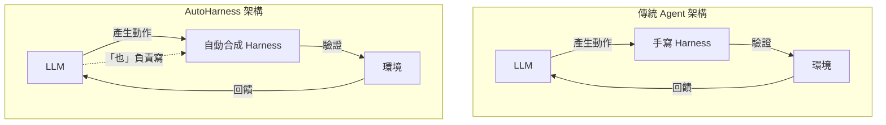
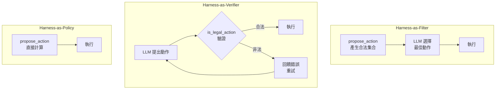
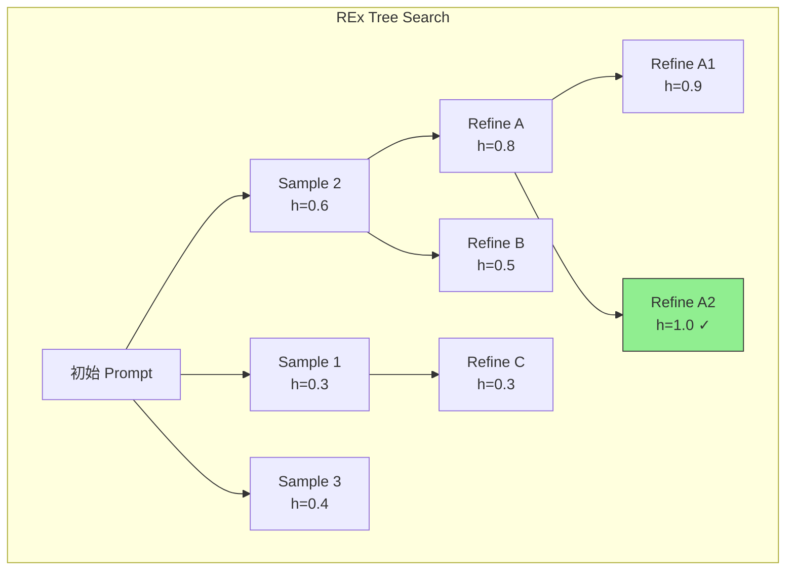
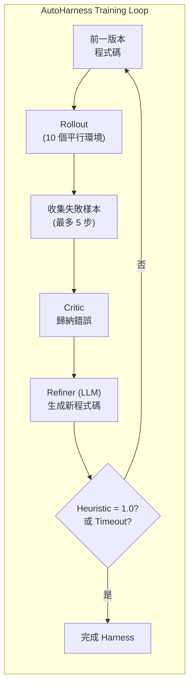

# AutoHarness: 用 LLM 自動合成 Code Harness 防止 Agent 違規行為

> **種子論文**: [AutoHarness: improving LLM agents by automatically synthesizing a code harness](https://arxiv.org/abs/2603.03329) (2026-02)
> **作者**: Xinghua Lou, Miguel Lázaro-Gredilla, Antoine Dedieu et al.
> **機構**: Google DeepMind
> **依賴論文**: [Code Repair with LLMs gives an Exploration-Exploitation Tradeoff](https://arxiv.org/abs/2405.17503) — Hao Tang et al. (NeurIPS 2024)

---

## TL;DR

LLM agent 在受約束環境中經常做出違規行為——Kaggle GameArena 象棋比賽有 78% 的敗局來自違規步，而非策略失誤。AutoHarness 讓 LLM 透過迭代式程式碼求精，自行合成 code harness 來約束自身的行為，在 145 個 TextArena 遊戲上實現 100% 合法動作率。更極端的是，auto-generated 的純程式碼策略（Harness-as-Policy）平均 reward 超越 GPT-5.2-High，且推理成本近乎為零。

---

## 背景與動機

### 問題：LLM Agent 會做「不該做的事」

大型語言模型在程式合成與數學解題上表現驚人，但當被當作 agent 使用時，它們經常提出在語意上看似合理、但在當前環境中**嚴格禁止**的行動。這不是策略好壞的問題——而是模型根本沒有理解「什麼動作是被允許的」。

這個現象在 Kaggle GameArena 2025 年舉辦的象棋比賽中暴露無遺。Gemini-2.5-Flash 在比賽中輸掉的局中，高達 78% 不是因為思考不深或策略錯誤，而是因為它走出了**規則不允許的棋步**——像是把車移到棋盤外、讓自己的國王暴露在攻擊下卻沒有回應將軍。這與人類棋手因為計算失誤而輸棋有本質上的不同。

學術上，這個問題被稱為 "Action Applicability Problem"，在 AI planning 社群中已有長期研究（Kokel et al., 2025）。隨著 LLM agent 從聊天機器人走向實際任務執行——操作 API、管理檔案、控制系統——這個問題的嚴重性只會越來越高。

### 既有方法的限制

傳統應對這個問題有幾條路線，各自有明顯的限制：

**第一條路線：Fine-tuning。** 讓模型在遊戲對局資料上做微調，讓它學會哪些動作是合法的。問題是：(1) 微調大型模型成本極高；(2) 微調可能 degrad 模型在其他任務上的能力；(3) 每換一個新環境就要重新微調。

**第二條路線：手寫 Harness。** 由人類程式設計師為每個環境手寫一個驗證層（harness），在 LLM 輸出動作後檢查合法性，非法則拒絕並重試。這是目前最常見的做法，但極度費工——每個遊戲、每套 API、每個環境都需要專屬的 harness，而且一旦環境規則改變，harness 就得跟著改。

**第三條路線：Chain-of-Thought 與 Tree-of-Thoughts。** 透過 prompting 讓 LLM 在生成動作前先推理規則。問題是這依賴於 LLM 的內部世界模型，而 LLM 對狀態轉移規則的模擬經常有幻覺。當模型需要「想像」一個棋局中的合法移動時，它其實是在生成一個可能不完全正確的內部模擬。

### AutoHarness 的核心洞見

AutoHarness 的想法很簡單但強而有力：既然 LLM 善於寫程式碼，為什麼不讓 LLM **自己寫一個 harness 來約束自己**？

一個 agent 的本質是 LLM 與 harness 的組合。Harness 是 LLM 與外部環境之間的「膠水」，負責管理控制流、驗證動作、處理錯誤。AutoHarness 把 harness 的生成轉化為一個**程式碼搜索問題**——在程式空間中搜尋一個能正確判斷動作合法性的函數（`is_legal_action()`）。

這個方法的核心優點是：
- 不需要微調模型
- 不需要人類手寫 harness
- 能適應多樣化的環境 (已在 145 個遊戲上驗證)
- 最終甚至可以完全用程式碼取代 LLM 在推理時的角色

---

## 核心知識點

本文圍繞以下 8 個知識點展開，涵蓋從問題定義到具體實現的完整脈絡：

1. **Action Applicability 問題**——LLM agent 為何頻繁違規，以及這個問題的本質
2. **Code Harness 的概念與角色**——Harness 在 LLM agent 系統中的定位
3. **三種 Code Harness 變體**——Action-Filter、Action-Verifier、Policy
4. **Thompson Sampling Tree Search**——REx 演算法的核心機制
5. **Beta-Bernoulli 數學框架**——Thompson Sampling 在程式碼求精中的具體實現
6. **AutoHarness 的訓練流程**——從初始程式碼到完成 harness 的迭代過程
7. **Harness-as-Policy 的極致表現**——完全用程式碼取代 LLM 推理
8. **已知限制與未來方向**——單環境 harness、無法遷移學習、harness-as-policy 的 2P 限制

---

## 方法詳解

### 知識點 1：Action Applicability 問題

**LLM agent 為何頻繁違規？**

LLM 本質上是語言模型，它的預訓練目標是預測下一個 token，而不是在結構化環境中執行動作。當一個模型被要求「走出下一步棋」時，它的內部表徵可能包含了棋局的豐富語義，但對於「什麼樣的動作是格式正確、規則允許的」這類精確約束，LLM 的模糊推理方式與規則系統的嚴格要求之間存在根本性的 mismatch。

這個 mismatch 的根源可以追溯到 LLM 的訓練資料本身。預訓練語料中的棋局描述大多是自然語言形式的——「白方 e4 開局」「黑方 e5 應對」——這讓 LLM 學會了哪些棋步在宏觀上是合理的，但沒有學會**所有合法動作的集合**這一結構化約束。當 LLM 需要生成一個具體動作時，它基於語義相似性做聯想，而不是基於規則推導做判斷。這就像一個學生讀了很多棋譜但從未學過正式規則——他可以說出精彩的棋局，但不知道什麼時候不能王車易位。

更精確地說，LLM agent 在受約束環境中的失敗模式可以分為四類：

1. **格式違規**——輸出的動作格式不符合系統預期（例如象棋中應該輸出 UCI 格式 `e2e4`，但 LLM 輸出了「把王前兵向前走兩格」這類自然語言）
2. **規則違規**——格式正確但內容違反遊戲規則（例如在象棋中移動一枚被「鎖定」的棋子，使己方國王暴露在將軍狀態）
3. **幻覺動作**——提出一個在當前狀態下不存在的動作（例如在 Sudoku 中填入一個「看起來合理」但其實違反數獨規則的數字）
4. **邊界混淆**——誤解動作空間的邊界條件（例如從 0 開始索引但環境使用 1-based indexing）

Kaggle GameArena 中 78% 的非法步就是最好的證據。值得注意的是，這些非法步並非均勻分布在所有遊戲中——象棋和黑白棋等傳統棋類遊戲的非法步率最高，而撲克牌類遊戲的非法步率相對較低。這可能反映了 LLM 在訓練資料中對棋類遊戲規則的接觸模式不同。簡化版的棋類規則被大量書面記錄和討論，但複雜的正式規則——特別是邊界情況如「逼和」「長將」——在自然語言語料中相對罕見。

**Code World Models 的相關嘗試**

Lehrach et al. (2025) 提出用 LLM 生成整個遊戲的世界模型（state transition function）的程式碼。這種方法理論上可以解決規則遵守問題，但有一個實際困境：如果遊戲規則本身非常複雜（如象棋有 6 種棋子的不同移動規則，以及將軍、將死、逼和、長將等特殊情況），生成的 world model 通常有 bug，而且 debug 一個上千行的程式碼比 debug 一個幾十行的 `is_legal_action()` 函數困難得多。

AutoHarness 的設計選擇正好相反：它只寫**動作合法性檢查器**，而不是完整的遊戲規則引擎。`propose_action()` 可以很簡單（「隨機抽一個合法動作」），`is_legal_action()` 則專注於回答一個二元問題——這個動作合法還是不合法。這個簡化讓程式碼搜索空間變小了幾個數量級。

具體來說，LLM agent 在受約束環境中的失敗模式可以分為兩類：

1. **格式違規**——輸出的動作格式不符合系統預期（例如象棋中應該輸出 UCI 格式 `e2e4`，但 LLM 輸出了「把王前兵向前走兩格」這類自然語言）
2. **規則違規**——格式正確但內容違反遊戲規則（例如在象棋中移動一枚被「鎖定」的棋子，使己方國王暴露在將軍狀態）

AutoHarness 要解決的是**第二類問題**——即使 LLM 理解了環境的語義，它仍然可能在具體動作選擇上違反規則。Kaggle GameArena 中 78% 的非法步就是最好的證據。

**Code World Models 的相關嘗試**

Lehrach et al. (2025) 提出用 LLM 生成整個遊戲的世界模型（state transition function）的程式碼，但這種方法對於複雜遊戲來說過於繁重——你不應該為了讓 agent 學會下象棋而先讓它寫一個完整的象棋引擎。AutoHarness 的策略是只寫**動作合法性檢查器**（action applicability checker），而不是完整的遊戲規則引擎。

---

### 知識點 2：Code Harness 的概念與角色

**Harness 在 LLM agent 系統中扮演什麼角色？**

在 AutoHarness 的框架中，一個 agent 被明確定義為：

```
Agent = LLM (核心推理引擎) + Harness (外部控制層)
```

Harness 是 LLM 與外部環境之間的「膠水層」，負責以下職責：

- **控制流管理**：何時呼叫 LLM、何時重試、何時終止
- **動作驗證**：檢查 LLM 提出的動作是否合法
- **錯誤處理**：當動作被拒絕時，提供反饋給 LLM 讓它修正
- **狀態管理**：維護 LLM 與環境之間的狀態同步

傳統上 harness 是人工編寫的，這在以下方面存在問題：

- **脆性**：harness 的邏輯與具體環境的規則緊密耦合，環境一變 harness 就得改
- **勞動密集型**：每個新環境都需要從頭編寫 harness
- **不一致性**：不同環境的 harness 品質不一，且缺乏統一的設計模式

AutoHarness 的核心洞見是：**Harness 本身就是一種程式碼，而 LLM 越來越擅長寫程式碼**。所以，讓 LLM 來寫 harness 是一個自然的演化方向。



---

### 知識點 3：三種 Code Harness 變體

AutoHarness 定義了三種由簡到繁的 code harness 形式，每種對 LLM 的依賴程度不同：

**Harness-as-Action-Filter（最簡單）**

程式碼中的 `propose_action()` 函數負責生成一個合法的動作集合，然後由 LLM 從中選出最優動作（可搭配 chain-of-thought 推理）。這種方式確保 LLM 只能在合法動作中做選擇，從根本上杜絕了違規的可能性。

```
控制流：propose_action() 生成合法集合 → LLM 選擇最佳動作 → 執行
LLM 角色：策略選擇者（在合法範圍內）
```

**Harness-as-Action-Verifier（本文主要使用）**

LLM 先自由提出一個動作，然後程式碼中的 `is_legal_action()` 檢查這個動作是否合法。如果非法，系統會包含「非法動作」警告訊息在內的新 prompt 重新詢問 LLM，直到 LLM 提出合法動作為止。

```
控制流：LLM 提出動作 → is_legal_action() 驗證 → 合法則執行 → 不合法則重試
LLM 角色：初始提案者 + 修正者
```

**Harness-as-Policy（最極端）**

完全用程式碼取代 LLM 在推理時的角色。`propose_action()` 直接根據遊戲狀態計算並返回最佳動作，不需要任何 LLM 呼叫。程式碼可以使用純 Python 和標準庫（如 numpy）。

```
控制流：propose_action() 直接計算最佳動作 → 執行
LLM 角色：僅在訓練階段存在，推理時完全不需要
```



---

### 知識點 4：Thompson Sampling Tree Search（REx）

**REx：Refine, Explore, Exploit**

AutoHarness 的程式碼搜索方法直接繼承自 Tang et al. (2024) 的 REx 演算法。REx 的核心洞見是：**迭代式程式碼求精（refinement）存在探索—利用的權衡**。

當你有一棵由程式碼組成的樹——每個節點是一個程式版本，每條邊是一次 LLM refinement——你要決定下一次 refine 哪個節點：

- **利用（Exploit）**：refine 當前最接近正確的程式（heuristic 值最高的）
- **探索（Explore）**：refine 一個尚未被充分探索的程式

這個權衡之所以困難，是因為每次 refinement 都會產生一個**全新的程式**（新的 arm），所以可選擇的動作集合不斷擴大。這不是標準的 MCTS 可以解決的問題——MCTS 需要 rollout（展開到 leaf node），但在 LLM refinement 的場景中，每個 rollout 都需要昂貴的 LLM 呼叫。

REx 將這個問題框架化為一個 **arm-acquiring bandit**（不斷新增臂的多臂賭徒問題），並用 Thompson Sampling 來做選擇。具體來說：

1. 每個程式（節點）是一個 arm
2. 每次 pull（refine）會得到一個隨機報酬（成功解決問題 = 1，否則 = 0）
3. 新的程式會不斷加入（每次 refine 產生新程式 = new arm）



**相對於其他搜索策略的優勢**

Tang et al. 在三個領域（競賽程式設計、視覺推理、Loop Invariant 合成）上比較了 REx 與 Greedy、BFS、Fixed-Width 等策略：

| 策略 | 行為 | 主要弱點 |
|------|------|---------|
| **Greedy** | 永遠 refine heuristic 最高的程式 | 容易陷入局部最優 |
| **BFS** | 寬度優先展開 | 寬度 vs 深度難以平衡 |
| **Fixed-Width** | 固定初始寬度後輪流 refine | 超參數敏感，跨資料集表現不穩定 |
| **REx (Ours)** | Thompson Sampling 自適應平衡 | 需要設定 C 參數，但對 C 不敏感 |

REx 的關鍵優勢在於它能夠**動態地調整搜索的寬度與深度**——當某條路徑看起來很有希望時，REx 會傾向於深入 refine；當當前路徑屢試不爽時，REx 會自動轉向其他路徑。在跨資料集的實驗中，REx 是唯一一個不需要為每個資料集單獨調整超參數就能穩定表現的方法。

---

### 知識點 5：Beta-Bernoulli Thompson Sampling 數學框架

**核心數學原理**

REx 的 Thompson Sampling 實作非常簡潔——原始論文號稱「約十行 Python 程式碼」。以下是其數學框架的逐步推導。

首先，將每個程式 $\pi$ 視為一個 arm，pulling arm 意味著對該程式做 refinement。refinement 的結果是二元報酬：

$$
r = \begin{cases}
1 & \text{如果 refine 後的新程式 } \pi' \text{ 滿足規格 } \Phi \\
0 & \text{否則}
\end{cases}
$$

因此報酬 $r$ 服從參數為 $\theta$ 的 Bernoulli 分布，其中 $\theta = P(r = 1 | \pi, \Phi)$ 代表 refine 此程式能成功解決問題的機率。

Thompson Sampling 需要維護對每個 $\theta$ 的後驗信念，而 Beta 分布是 Bernoulli 的 conjugate prior：

$$
P(\theta) = \text{Beta}(\alpha, \beta)
$$

REx 的關鍵創新是**將 heuristic 函數 $h(\pi)$ 融入先驗**：heuristic 值高的程式應該有更高的初始 $\theta$ 估計。Heuristic 函數 $h(\pi)$ 在這裡被定義為程式通過的測試比例：

$$
h(\pi) = \frac{1}{K} \sum_{k=1}^K \mathbb{1}[\pi \models \phi_k]
$$

在 AutoHarness 的場景中，$h(\pi)$ 被替換為合法動作的正確率（legal action accuracy）。

帶 heuristic 的先驗設計如下：

$$
\alpha_{\text{prior}} = 1 + C \cdot h(\pi) \\
\beta_{\text{prior}} = 1 + C \cdot (1 - h(\pi))
$$

其中 $C$ 是一個超參數，控制 heuristic 對先驗的影響強度。$C$ 越大，先驗越集中在 heuristic 值附近，行為越貪婪。

當一個程式被 refine $N$ 次且都沒有成功（沒有 reward）後，後驗分布變為：

$$
\begin{aligned}
P(\theta | N) &\propto P(N | \theta) P(\theta) \\
&= (1 - \theta)^N \cdot \text{Beta}(1 + C \cdot h(\pi), 1 + C \cdot (1 - h(\pi))) \\
&= \text{Beta}(1 + C \cdot h(\pi), 1 + C \cdot (1 - h(\pi)) + N)
\end{aligned}
$$

後驗的期望值（即 refine 此程式的預期報酬）為：

$$
\mathbb{E}[\theta | N] = \frac{1 + C \cdot h(\pi)}{2 + 2C + N}
$$

這個公式的直覺非常重要：
- 當 $N = 0$（從未 refine），期望值 ≈ $h(\pi)$（由 heuristic 決定）
- 當 $N \to \infty$，期望值 → $0$（refine 太多次都沒成功，該放棄了）
- $C$ 控制衰減速度：$C$ 越大，初始信心越高，衰減越慢，行為越傾向於 exploitation

選取下一個要 refine 的程式 $\pi^*$ 的規則非常簡單：

$$
\pi^* = \arg\max_{\pi} \tilde{\theta}_\pi
$$

其中 $\tilde{\theta}_\pi$ 是從 $\text{Beta}(\alpha_\pi, \beta_\pi)$ 中採樣的一個隨機值。這不是選期望值最高的——而是從後驗分布中**採樣**，這確保了即使是 heuristic 較低的程式，也有非零機率被選中（探索）。

**AutoHarness 中的具體應用**

AutoHarness 對 REx 的數學框架做了兩處調整：

1. **Heuristic 函數替換**：從「通過測試的比例」改為「合法動作的正確率」
2. **C 參數設定**：AutoHarness 使用 $C = 1.0$（相對保守的探索設定，因為環境回饋比標準測試集更稀疏）

此外，AutoHarness 還增加了 Harness-as-Policy 模式下的 heuristic 設計：

$$
H = \begin{cases}
0 & \text{若採取非法動作} \\
0.5 + 0.5r & \text{否則，} r \in [0.0, 1.0] \text{ 為環境 reward}
\end{cases}
$$

這使得 heuristic 不僅反映合法性，也反映策略品質。

---

### 知識點 6：AutoHarness 的訓練流程

**整體流程**

AutoHarness 的訓練流程是一個迭代式的程式碼求精迴圈，由四個組件構成：



詳細步驟如下：

1. **初始化**：從一個空的程式碼模板開始（包含 `propose_action()` 和 `is_legal_action()` 的簽名）
2. **Rollout**：使用當前的 harness 在 10 個平行環境中執行最多 1000 步，遇到非法動作或執行錯誤時終止
3. **收集失敗樣本**：從 rollout 中抽樣最多 5 個失敗步驟
4. **Critic 評估**：Critic 將各種錯誤類型（非法動作、執行錯誤、回報錯誤）歸納為結構化的錯誤訊息
5. **Refiner**：使用 LLM（Gemini-2.5-Flash）根據原始程式碼和錯誤訊息生成改進版本的程式碼。LLM 在此扮演「gradient-free code optimizer」的角色——它接收執行回饋，推理錯誤原因，然後輸出修訂後的程式碼
6. **Heuristic 評估**：使用 Thompson Sampling 的 heuristic 值（合法動作正確率）評估新程式碼
7. **重複**：直到 heuristic 達到 1.0（100% 合法動作率）或超過時間上限

AutoHarness 的 Refinement 邏輯有兩個分支：

```
如果 is_legal_action() 回傳 True 但動作非法 → 同時 refine 兩個函數
如果 is_legal_action() 回傳 False 且動作非法 → 只 refine propose_action()
```

第二個分支的邏輯是：當 `is_legal_action()` 已經正確拒絕了非法動作，問題出在 `propose_action()` 沒有提出合適的合法動作，所以只需要改 `propose_action()`。

**訓練結果**

在 32 個用於端到端評估的遊戲中，平均只需要 **14.5 次樹搜索迭代**就能達到 100% 合法動作率，其中 19/32 的遊戲在 10 次迭代內完成。最難的遊戲（GermanWhist-v0、Cryptarithm-v0、Othello-v0、Chess-v0）需要較多次數。

**LLM 呼叫成本分析**

每次樹搜索迭代包含多次 LLM 呼叫，主要用於：
- **初始程式碼生成**：從頭生成 `propose_action()` 和 `is_legal_action()`——1 次 LLM 呼叫
- **程式碼修訂**：根據失敗樣本 refine 程式碼——每次迭代 1 次 LLM 呼叫
- **擴展搜索**：當 Thompson Sampling 決定探索新分支時，需要重新生成初始程式碼——額外 LLM 呼叫

在簡單遊戲（如 GuessTheNumber-v0、Bandit-v0）上，只需 1–2 次 LLM 呼叫即可完成 harness 合成。而在最困難的遊戲（Othello-v0）上，需要 62 次迭代，對應約 80–100 次 LLM 呼叫。

如果我們對比這個訓練成本與手寫 harness 的人力成本——一個熟悉該遊戲的工程師可能需要 2–4 小時來手寫和測試一個可靠的 `is_legal_action()`——AutoHarness 在**需要為大量環境生成 harness** 的場景中具有顯著的成本優勢。

**Harness-as-Policy 的訓練**

在 Harness-as-Policy 模式下，訓練更加困難——因為不僅要學會判斷合法動作，還要學會選擇最佳動作。heuristic 從二元（合法/非法）改為包含 reward 的連續值。平均需要 **89.4 次迭代**，達到 heuristic 值 0.939。這比 Action-Verifier 模式多了約 6 倍的迭代次數，但換來的是推理時完全不需要 LLM 的極致效率。

---

### 知識點 7：Harness-as-Policy 的極致表現

**完全用程式碼取代 LLM 推理**

Harness-as-Policy 是 AutoHarness 最令人興奮的結果。在這個模式下，經過 AutoHarness 生成的 `propose_action()` 函數不再只是隨機抽樣合法動作，而是直接編碼了遊戲策略——它可以包含從簡單啟發式到複雜邏輯推導的各種決策邏輯。

以 MineSweeper-v0 為例，其 harness 程式碼包含：
- 棋盤解析與維度偵測
- 第一步的安全中心位置選擇
- 邏輯推理（規則 A：若未標記鄰居數等於剩餘地雷數，則全標為地雷；規則 B：若已找到所有地雷，則其餘格子安全）
- 進階子集推理（subset rule）
- 機率啟發式作為最後手段
- 多層 fallback 機制

這種程式碼的品質接近人類專家的手寫水準，而且是 LLM 在數十次迭代中自動演化出來的。

**實驗結果**

在 16 個 1P 文字遊戲上的平均 reward：

| Agent | 平均 Reward | 備註 |
|-------|-------------|------|
| Gemini-2.5-Flash (baseline) | 0.673 | 無 harness |
| Gemini-2.5-Pro (baseline) | 0.707 | 更大更強的模型 |
| Gemini-2.5-Flash + Harness (Action-Verifier) | 0.745 | **比 Gemini-2.5-Pro 高** |
| GPT-5.2 (no thinking) | 0.635 | 最新模型，無 thinking |
| GPT-5.2-High (high thinking) | 0.844 | 最新模型，高 thinking 模式 |
| **Harness-as-Policy (ours)** | **0.870** | **純程式碼，無 LLM 推理** |

Harness-as-Policy 不僅超越了 GPT-5.2-High，而且由於它生成的是純 Python 程式碼，推理成本幾乎為零。相比之下，GPT-5.2 和 GPT-5.2-High 的實驗花費了約 $640。

這個結果傳達了一個深層的洞見：**對於某些結構化環境，用小型模型自動合成專用策略程式碼，可以比使用大型模型即時推理更有效、更省成本。** 這類似於 compilation 之於 interpretation 的 trade-off——編譯需要時間，但執行時速度極快。

---

### 知識點 8：已知限制與未來方向

**論文承認的限制**

AutoHarness 雖然在 145 個文字遊戲上取得了 impressive 的結果，但仍有多個明確的限制：

1. **每個環境一個獨立 harness**——目前的方法需要為每個遊戲從頭合成 harness，沒有跨環境的遷移學習或知識共享
2. **Harness-as-Policy 僅限 1P 遊戲**——2P 遊戲需要考慮對手策略，往往需要 MCTS 類的搜索方法，純程式碼策略難以應對（除非同時學習 code world model）
3. **尚未建立可重用 harness 庫**——雖然論文中生成的 harness 品質很高，但這些 harness 目前是各自獨立的，沒有被組織成可組合的元件庫
4. **free-form text 遊戲被排除**——145 個遊戲中排除了 9 個動作空間是自由文字的遊戲（如 Mafia、Codenames），因為這些遊戲的「合法性」邊界模糊

**未來方向**

論文提出了幾個明確的後續研究方向：

1. **蒸餾回 base LLM**——將領域專家的 harness 知識蒸餾回基礎 LLM，使整個系統能「遞迴式自我改進」
2. **可重用 harness 庫**——建立一個可組合的 harness 元件庫，類似於軟體工程中的套件管理
3. **多模態遊戲**——將方法擴展到更複雜的視覺遊戲（如 Craftax、Terra Nova）
4. **跨任務遷移**——讓一個環境中學到的 harness 知識能遷移到相關環境

**Critique 與更深層的限制**

從更批判的角度來看，AutoHarness 的方法有以下值得注意的深層問題：

AutoHarness 的成功高度依賴 LLM 自身的程式碼生成能力。Gemini-2.5-Flash 的結果很好，但如果用一個程式碼生成能力較弱的模型，Refiner 可能無法產生有效的程式碼修訂，導致搜索陷入停滯。這意味著 AutoHarness 的門檻是 LLM 必須達到一定的程式碼生成水準。

此外，Harness-as-Policy 雖然推理成本極低，但**訓練成本並不低**（平均 89.4 次迭代），且每次迭代都可能涉及多次 LLM 呼叫。對於只需要執行一次的任務（one-off tasks），直接使用更大的 LLM 搭配手寫 prompt 可能更划算。Harness-as-Policy 的優勢在於**需要大量重複執行的場景**——例如在生產環境中每天執行數百萬次的 agent 任務。

最後，AutoHarness 的 heuristic 設計（僅基於合法動作率）在某些環境中可能不夠豐富。例如，在某些遊戲中，一個動作雖然合法但會導致立即輸掉遊戲。這種「合法但愚蠢」的動作不會被 heuristic 捕獲，需要更複雜的 heuristic 設計來處理。

---

## 實驗結果

### 主要實驗：合法動作率

在全部 145 個 TextArena 遊戲上，AutoHarness 的 Action-Verifier 模式均達到了 **100% 合法動作率**。這個結果是在移除了觀察字串中的 "Available Moves" 提示後取得的——這使得任務更加困難，但也更接近真實世界場景。

不同類型的遊戲所需訓練迭代次數差異很大：

| 遊戲類型 | 訓練迭代次數 | 特性 |
|---------|-------------|------|
| 簡單遊戲（GuessTheNumber、PigDice） | 1–3 次 | 規則簡單，動作空間小 |
| 中等遊戲（Sudoku、Sokoban、2048） | 5–27 次 | 有明確規則但狀態空間大 |
| 困難遊戲（Chess、Othello、GermanWhist） | 43–64 次 | 規則複雜或涉及對手策略推測 |

### 端到端遊戲表現（1P 遊戲）

在 16 個 1P 遊戲上，AutoHarness (Action-Verifier) 的表現：

- 平均 reward：**0.745**（比 Gemini-2.5-Pro 的 0.707 高出 5.4%）
- 在 8/16 遊戲中**優於** Gemini-2.5-Pro
- 在 5/16 遊戲中**持平** Gemini-2.5-Pro
- 僅在 3/16 遊戲中低於 Gemini-2.5-Pro

### 端到端遊戲表現（2P 遊戲）

在 16 個 2P 遊戲上，結果更具說服力：

- 對抗 Gemini-2.5-Pro：勝率 **56.3%** vs Pro 的 38.2%（不分勝負 5.5%）
- 對抗 Gemini-2.5-Flash：勝率 **64.8%** vs Flash 的 32.7%（不分勝負 2.5%）
- 9/16 遊戲勝過 Gemini-2.5-Pro

重點是：**Gemini-2.5-Flash + Harness 用一個更小的模型打敗了更大的 Gemini-2.5-Pro**。這不僅是技術上的突破，也有實際的商業意義——小模型 + 自動合成 harness 的成本遠低於大模型。

### 消融分析

AutoHarness 的消融實驗其實來自 Tang et al. 的 REx 實驗，因為 AutoHarness 論文本身沒有獨立的消融分析（它的重點在於方法在遊戲場景中的應用驗證）。從 REx 的消融實驗中我們可以學到：

1. **C 參數的影響**：$C = 20$ 在大多數資料集上表現最佳。更大的 $C$ 值使模型更偏向 exploitation，但在 $C = 10$ 到 $C = 50$ 的範圍內，REx 的表現相當穩定——這是它相對於 Fixed-Width 和 Greedy 的關鍵優勢
2. **REx vs 無搜索**：沒有 Thompson Sampling（僅 greedy refinement）時，APPS-Competition 的解決率下降了約 30-40%
3. **REx vs BFS**：BFS 在 compute budget 有限時表現尚可，但在預算較大時會被 REx 超越，因為 BFS 無法集中資源在最有希望的路徑上
4. **REx vs Fixed-Width**：Fixed-Width 在視覺推理（ARC）上接近 REx，但在 Loop Invariant 合成上表現很差——它的深度固定，無法適應需要反覆深入同一個節點的場景

### Harness-as-Policy 結果

| Agent | 平均 Reward | 優於 Baseline | 推理成本 |
|-------|-------------|--------------|---------|
| Gemini-2.5-Flash (baseline) | 0.673 | — | 高（每次動作呼叫 LLM） |
| Gemini-2.5-Pro (baseline) | 0.707 | +5.1% vs Flash | 更高 |
| GPT-5.2 (no thinking) | 0.635 | — | 最高 |
| GPT-5.2-High (high thinking) | 0.844 | +25.4% vs Flash | 極高 |
| **Harness-as-Policy (ours)** | **0.870** | **+29.3% vs Flash** | **近乎為零** |

Harness-as-Policy 在 16 個 1P 遊戲中：
- 3/16 遊戲**勝過**所有其他 agent（含 GPT-5.2-High）
- 8/16 遊戲與 GPT-5.2-High **打平**
- 5/16 遊戲不如 GPT-5.2-High

雖然在勝場數上不及 GPT-5.2-High，但平均 reward 更高——這意味著 Harness-as-Policy 在大部分遊戲中的表現更穩定，而 GPT-5.2-High 的極端高分集中在少數遊戲上。

---

## 程式碼範例解析：Minesweeper Harness 的演進

AutoHarness 論文的附錄 D.1 展示了 Minesweeper-v0 的 harness-as-policy 程式碼。這是一個絕佳的案例，讓我們理解 LLM 透過迭代 refinement 可以生成多複雜的策略邏輯。

**第一層：棋盤解析**

程式碼首先將文字棋盤解析為二維陣列，並取得棋盤尺寸：

```python
grid = parse_board_to_grid(board)
num_rows, num_cols = get_board_dimensions(grid)
```

這一步看似簡單，但對於 LLM 來說，從一個包含棋盤、回合資訊、遊戲狀態的文字描述中正確解析出二維陣列，本身就需要對文字結構有足夠的理解。

**第二層：特殊情況處理（第一步）**

```python
# 第一步：選擇中心區域的格子作為安全起點
if all_cells_unrevealed:
    first_move_row = num_rows // 2 - (1 if ...)
    first_move_col = num_cols // 2 - (1 if ...)
    return f"[{first_move_row} {first_move_col}]"
```

這對應於人類玩家「先點中間」的常見策略。值得注意的是，這個策略不是從論文中讀來的，而是 LLM 在 refinement 過程中自己「學到」的——在接到「第一步踩到地雷導致 game over」的錯誤回饋後，LLM 意識到第一步需要選擇安全區域。

**第三層：邏輯推導**

這是整段程式碼最複雜的部分，包含了三層遞增的推理規則：

- **規則 A（簡單地雷標記）**：如果一個數字格子的值等於其周圍未探索的格子數，則這些格子全是地雷
- **規則 B（簡單安全標記）**：如果一個數字格子周圍已找到的地雷數等於數字值，則其餘未探索的格子全部安全
- **子集規則（進階推理）**：如果一個約束集合 C1 是 C2 的子集，且 C1 需要的地雷數等於 C2 需要的地雷數，則 C2 \ C1 的格子安全；如果 C1 需要的地雷數比 C2 少恰好 |C2 \ C1|，則 C2 \ C1 的格子全是地雷

子集規則是 LLM 生成的程式碼中最令人驚豔的部分——這對應於人類掃雷高手所使用的「進階推理技巧」，而且被正確地實現為可遞迴執行的邏輯。大部分人類玩家甚至不知道這個技巧的正式名稱。

**第四層：機率啟發式**

當邏輯推導無法找到確定安全的格子時，程式碼退而使用機率方法：

```python
global_mine_prob = remaining_mines / total_unrevealed
# 計算每個未探索格子的風險分數（基於周圍數字線索）
current_risk_score = average(prob_from_clue for each clue neighbor)
# 選擇風險最低的格子
```

這個啟發式結合了全域地雷密度與局部線索的條件機率，與人類掃雷玩家的「猜測策略」一致。

**第五層：最終 Fallback**

如果所有方法都失敗了，程式碼還有一個最終的免死金牌——從完全未知的格子中隨機選擇一個。這確保了策略在任何狀態下都不會陷入僵局。

這個五層架構（解析 → 特殊情況 → 邏輯推理 → 機率啟發式 → Fallback）在軟體工程中稱為「防禦性編程」（defensive programming）的典範。一個自動生成的程式碼能自發地演化出這種多層 Fallback 結構，非常值得注意——這不是 prompt 工程師設計的，而是 LLM 在收到「程式碼執行失敗、拋出 Exception」的錯誤訊息後，為了提高 robustness 而自然演化的結果。

---

## 從 Code Repair 到 AutoHarness：一個框架的演化

回顧 Tang et al. 的 REx 與 Lou et al. 的 AutoHarness，我們可以看到一個明確的框架演化路徑：

**REx（Tang et al., 2024）**

- 場景：離線程式合成（競賽程式設計、視覺推理、Loop Invariant）
- 搜索：Thompson Sampling tree search over programs
- Heuristic：測試通過比例
- Refinement：單次 LLM call for code repair
- 結果：在 APPS-Competition 上達到 SOTA，減少 1.5x–5x LLM 呼叫

**AutoHarness（Lou et al., 2026）**

- 場景：線上 Code Harness 合成（TextArena 遊戲）
- 搜索：繼承 Thompson Sampling tree search
- Heuristic：合法動作正確率（二元）| reward 加權（連續）
- Refinement：多輪線上 refinement with environment feedback
- 結果：145 個遊戲 100% 合法動作率，Harness-as-Policy 超越 GPT-5.2-High

**關鍵差異**

| 維度 | REx | AutoHarness |
|------|-----|-------------|
| 回饋來源 | 靜態測試案例 | 動態環境回饋（包含錯誤訊息） |
| 搜索目標 | 解決程式問題 | 合成正確的 harness |
| 評估方式 | 離線測試（pass/fail） | 線上 rollouts（合法性 + reward） |
| 擴展方向 | 不同程式合成領域 | 三種 harness 變體 + Harness-as-Policy |

AutoHarness 的貢獻不僅是技術上的增量改進——它將 REx 從一個純粹的程式合成演算法，轉變為一個**可實用的 agent 開發框架**。這標誌著程式碼搜索從「解決演算法問題」的工具，擴展到「建構 agent 行為」的工具。

---

## 我的觀察

### 為什麼這篇論文重要？

AutoHarness 發表於 2026 年 2 月，正處在 LLM agent 從研究示範走向生產部署的關鍵時期。在這之前，agent harness（即 agent scaffold / 控制層）一直被視為 engineering 問題——每個團隊各自實作自己的 prompt templates、action validation、error recovery 邏輯，而且對外公開的討論很少。

AutoHarness 的貢獻在於它把這個「地下工程問題」提升為一個可系統化研究的學術問題。它提供了一個形式化的框架（code as harness）、一個可比較的評估基準（TextArena 的 145 個遊戲），以及一個清晰的方法論（Thompson Sampling tree search for code synthesis）。

### 論文沒有說但值得思考的事

論文沒有討論的是**這種方法的邊界到底在哪裡**。Harness-as-Policy 在文字遊戲上表現很好，但它能擴展到哪些現實場景？

我認為最適合的場景是那些具有**明確定義的輸入/輸出格式**和**可執行的合法性檢查**的任務：
- API 呼叫參數驗證（確認 API 參數格式正確、值在允許範圍內）
- 資料處理 Pipeline（確認中間資料格式符合下游要求）
- 系統管理腳本（確認命令參數安全、不超出權限範圍）
- 金融交易規則檢查（確認交易符合設定的風控規則）

最不適合的場景是那些「合法性」邊界模糊或需要人類判斷的任務：
- 內容審查（什麼是「不適當的內容」很難用程式碼精確定義）
- 創意寫作（什麼樣的句子是「合法的」沒有一個 formal specification）
- 需要常識推理的決策（雖然某些場景可以用規則近似）

### 與 Reflexion 的對比

AutoHarness 的 refinement loop 與 Shinn et al. 的 Reflexion 有表面上的相似性——兩者都是 iteratively refine agent 的行為。但關鍵差異在於：

- **Reflexion** 在自然語言空間中做反思——agent「讀取」自己的失敗軌跡，在 prompt 中加入反思文字
- **AutoHarness** 在程式碼空間中做反思——refinement 的輸出是修改後的程式碼，而不是修改後的 prompt

這個差異的深層含義是：**程式碼是比自然語言更可靠的 artifact**。程式碼可以被執行、被測試、被版本控制；程式碼的修改可以被 diff、可以被回溯。而 prompt 的修改是模糊的、難以測試的、難以版本化的。AutoHarness 的「code as harness」原則，本質上是把 agent 行為工程從「prompt engineering」轉向「software engineering」的一次重要嘗試。

---

## 總結

### 核心要點回顧

AutoHarness 代表了一種新的 agent 設計範式：**讓 LLM 的程式碼生成能力成為 harness 的生產者，而不只是動作的產生者**。這個範式的核心貢獻在於：

1. 定義了「程式碼即 harness」框架，將 harness 生成轉化為一個可自動搜索的程式碼優化問題
2. 將 REx 的 Thompson Sampling tree search 從離線程式合成擴展到線上多輪交互場景
3. 在 145 個文字遊戲上證明了自動合成 harness 可以 100% 防止非法動作
4. 展示了 Harness-as-Policy 的極致可能性——純程式碼策略超越大型模型，成本近乎為零

### 對 LLM Agent 開發的啟發

AutoHarness 的結果對 LLM agent 的實際部署有幾個重要的啟發，值得展開討論。

**第一，Agent 的「瓶頸」往往不在推理能力而在 rule-following 能力。** Kaggle GameArena 的 78% 非法步率是一個尖銳的信號——LLM 的進步在「理解規則」上可能比在「遵守規則」上快得多。外部 harness 是彌補這個 gap 的高成本效益方案。

**第二，自動化 harness 生成可能比 fine-tuning 更實用。** 對於大多數 production agent 場景，fine-tuning 的成本和副作用難以接受，而自動 harness 合成只需要環境反饋 + LLM 呼叫，不需要訓練基礎設施。

**第三，「編譯 vs 直譯」的 trade-off 同樣適用於 agent。** 有時候花時間（和 LLM 呼叫）為一個特定環境編譯出專用策略程式碼，比每次在執行時用大型模型推理更有效率。這在需要大量重複執行的場景（如 automated trading、遊戲 AI、系統管理）中特別有價值。

**第四，也是最重要的，這個方法挑戰了一個隱含假設：即 agent 的「智能」必須來自 LLM 的內部參數。** AutoHarness 證明了程式碼——LLM 生成的外部 artifact ——可以承載和傳遞「智能」，而且可以做得比 LLM 本身更好、更快、更便宜。

### 展望：Code as Harness 的未來

從更宏觀的角度看，AutoHarness 代表了 AI agent 開發的一個典範轉移。傳統上，我們把 agent 的「行為邏輯」完全託付給 LLM 的內部表徵——prompt 告訴它要做什麼，參數讓它知道怎麼做。但 AutoHarness 指出了一條不同的路：讓 LLM 生成外部程式碼來承載行為邏輯，將 LLM 本身縮減為一個「程式碼生成引擎」和「策略選擇器」的角色。

這個模式與軟體工程中的「編譯器」類比非常相似。編譯器將高階語言轉換為機器碼，一旦編譯完成，原始碼就不再需要在執行時存在。同樣地，AutoHarness 將 LLM 的高階「意圖」編譯為精確的 Python 程式碼，一旦 harness 生成完成，LLM 在推理時的角色可以大幅縮減甚至完全消除。

如果這個趨勢持續下去，我們可能會看到一個未來：**agent 專用程式碼生成**成為 LLM 的核心應用場景之一。小型、快速的 LLM 負責為特定任務生成專用的執行引擎，而大型、昂貴的 LLM 只在初始生成和不常見的邊界情況中被調用。這種分層架構（compiler LLM + generated executor）可能比現在「所有場景都用同樣的 LLM」的做法更有效率、更可靠。

---

## 延伸閱讀

### Dependency Papers（本文涵蓋）

1. **Code Repair with LLMs gives an Exploration-Exploitation Tradeoff** ([2405.17503](https://arxiv.org/abs/2405.17503))
   - 作者：Hao Tang, Keya Hu, Jin Peng Zhou et al. (NeurIPS 2024)
   - 與本文關係：AutoHarness 的 Thompson Sampling tree search 直接繼承自此論文的 REx 演算法。REx 首次將程式碼求精框架化為 arm-acquiring bandit 問題，AutoHarness 將其擴展到線上多輪交互場景

### 相關工作（未涵蓋，僅列出）

- [Code as Policies: Language Model Programs for Embodied Control](https://arxiv.org/abs/2209.07753) — Jacky Liang et al. (ICRA 2023)。提出用程式碼做機器人控制的框架，是 harness-as-policy 的靈感來源
- [Reflexion: Language Agents with Verbal Reinforcement Learning](https://arxiv.org/abs/2303.11366) — Noah Shinn et al. (NeurIPS 2023)。Agent 反思迴圈的早期工作，與 AutoHarness 的 refinement loop 概念相通
- [Code World Models for General Game Playing](https://arxiv.org/abs/2510.04542) — Wolfgang Lehrach et al. (2025)。同一 DeepMind 團隊的前作，用 LLM 生成完整遊戲世界模型程式碼
- [Voyager: An Open-Ended Embodied Agent with Large Language Models](https://arxiv.org/abs/2305.16291) — Guanzhi Wang et al. (2023)。用 LLM 生成可儲存的可執行程式碼來學習 Minecraft 技能
- [Eureka: Human-Level Reward Design via Coding Large Language Models](https://arxiv.org/abs/2310.12931) — Yecheng Jason Ma et al. (ICLR 2024)。用 LLM 做演化搜索生成 reward 函數
- [Tree of Thoughts: Deliberate Problem Solving with Large Language Models](https://arxiv.org/abs/2305.10601) — Shunyu Yao et al. (NeurIPS 2023)。透過搜索模擬 lookahead，但依賴 LLM 內部世界模型

---

## 引用

完整 BibTeX 見 [`papers.bib`](./papers.bib)。
