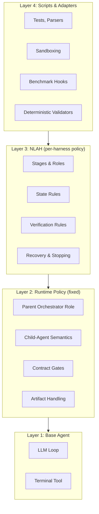
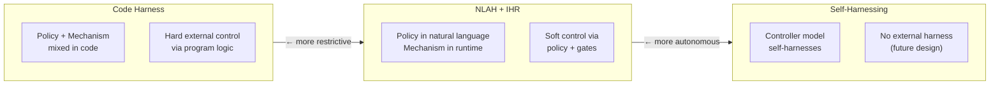

# Natural-Language Agent Harnesses (NLAHs) 論文導讀

> **種子論文**: [Natural-Language Agent Harnesses](https://arxiv.org/abs/2603.25723) (2026-03)
> **作者**: Linyue Pan, Lexiao Zou, Shuo Guo et al.
> **機構**: Tsinghua University (Shenzhen), Harbin Institute of Technology (Shenzhen)
> **Dependency**: [Building Effective AI Coding Agents for the Terminal](https://arxiv.org/abs/2603.05344) — Nghi D. Q. Bui (2026)

## TL;DR

- Agent harness（外部執行系統）對任務表現有巨大影響，但通常埋在 controller code 中，難以檢查、比較、移轉、消融
- NLAH 將 harness policy 寫成可編輯的自然語言文件，由共享 runtime（IHR）解釋執行，將「政策」與「機制」分離
- 在 SWE-bench、Terminal-Bench 2.0、OSWorld 三項 benchmark 上，IHR-executed NLAH 達到與原生 code harness 相當的表現，同時政策文件從數萬 token 縮減到數千 token

## 背景與動機

### Harness 是什麼，為什麼值得研究

現代的語言模型 agent 早已不只是單次問答系統。它們使用工具、維護執行狀態、從錯誤中恢復、驗證中間結果，有時甚至委派工作給其他 agent。這些行為由一個外部執行系統來組織，這個系統被稱為 harness。

定義上，harness 是 agent 中圍繞模型的外部執行系統。它把一個 base model 轉變成能對真實任務行動的 agent，透過決定模型看到什麼、可以使用哪些工具、狀態存在哪裡、結果如何回傳、何時需要驗證、失敗如何恢復、執行何時停止、以及多個 model call 或 agent call 如何組織。

Harness 的設計決策對 agent 最終表現有巨大影響。LangChain 的工程部落格、OpenAI 的 harness engineering 文章、以及 Bui (2026) 對 terminal coding agent 的系統性報告，都反覆印證了這個現象：不同的 harness 設計可以讓同一模型在同一 benchmark 上的分數相差數倍。

### Harness Engineering 涵蓋的面向

NLAH 論文在附錄 D.1 中列出了 harness engineering 的十一個主要面向，這些面向構成了一個完整的 harness 設計空間：

1. **Agent loops** — agent 的執行循環結構（ReAct、plan-execute、plan-execute-verify 等）
2. **Tool design and documentation** — tool 的設計、文件、signature 格式
3. **Context engineering** — prompt composition、system prompt 結構、快取策略
4. **Filesystem and workspace management** — agent 的工作目錄、檔案讀寫權限、artifact 路徑約定
5. **Memory and state** — 執行狀態的持久化、跨 session 記憶、handoff 時的狀態轉移
6. **Validation and stopping conditions** — 驗證機制、完成條件、失敗檢測
7. **Safety, permissions, and sandboxing** — 安全模型、權限控制、沙箱隔離
8. **Runtime defaults** — 預設模型、timeout、max steps 等執行參數
9. **Observability, logging, and replay** — 事件流、訊息日誌、tool 記錄、回放支援
10. **Retry and recovery** — 重試策略、失敗分類、修復路徑、graceful degradation
11. **Budget control** — token/time/tool-call 的預算管理與會計

這些面向共同構成了一個 harness 的完整設計空間。傳統上它們全部被實作在 controller code 中，NLAH 的工作就是將其中適合自然語言描述的部分提取出來。

### 問題：Harness 不是乾淨的研究物件

目前 harness logic 通常埋在 controller code 中。一個典型的 code harness 可能混雜著 prompts、tool adapters、parser 規則、驗證腳本、artifact 路徑、retry logic、context policy 與 benchmark-specific 假設，全部塞在同一個 controller bundle 裡。

結果是：
- **難以檢查**（inspect）— 要看懂 harness 做了什麼，必須讀完一整包 controller code
- **難以比較**（compare）— 兩個系統的 harness 差異無法被量化
- **難以移轉**（transfer）— 同一個 harness 想法要移植到新 benchmark 幾乎要重寫
- **難以消融**（ablate）— 無法 isolate 特定模組的貢獻，因為所有東西都耦合在一起

一個看似微小的 harness 變更可能同時改變 call boundaries、tool mediation、state carriers、validation gates 與 stopping semantics。研究者永遠無法確定分數差異是來自 agent 能力的改進還是 harness 的改變。

### Bui (2026)：Harness Engineering 的工程實踐

Nghi D. Q. Bui 在 2026 年發表的 OPENDEV 論文是第一個系統性地處理 terminal-native coding agent harness engineering 的技術報告。該論文報告了一個用 Rust 撰寫的開源命令列 coding agent，並從 scaffold 與 harness 兩個角度分析其架構。

Bui 論文最核心的貢獻是明確區分了兩個概念：

- **Scaffolding**：agent 收到第一個提示詞之前的組裝工作。包括 system prompt 編譯、tool schema 構建、subagent 註冊、技能載入。這是一個一次性的、在 conversation lifecycle 開始之前完成的階段。
- **Harness**：agent 收到提示詞之後的 runtime orchestration。包括 tool dispatch、context management、safety enforcement、session persistence、subagent orchestration。

這個分離的實用價值在於：每個 concern 可以獨立演進。新增一個 tool 只需要 scaffolding 階段的 registry 變更；改變 compaction 策略只需要 harness 階段的實作變更。

OPENDEV 的架構由四層組成：

```
Entry & UI Layer (CLI / TUI / Web UI)
        ↓
Agent Layer (MainAgent + subagents, Extended ReAct loop)
        ↓
Tool & Context Layer (ToolRegistry, PromptComposer, Compactor, Memory)
        ↓
Persistence Layer (Session Manager, Config Manager, Provider Cache)
```

其中 agent layer 又包含五個專門的 model roles（action model、thinking model、critique model、vision model、compact model），每個角色可以獨立設定 provider。

Bui 論文從工程經驗中提煉了五個跨元件的設計張力（design tensions），這些洞察是理解 NLAH 為何重要、以及 NLAH 嘗試解決什麼問題的關鍵：

**1. Context Pressure as the Central Design Constraint**

在 OPENDEV 的經驗中，tool outputs（檔案內容、命令結果、搜尋匹配）消耗了典型 session 中 70–80% 的 context，遠遠超過 system prompt 與 agent 自身的推理 token。這使得 context utilization 成為 agent 長壽命的最重要指標。

Bui 的解決方案是「graduated reduction」：不是等到 context 滿了才一次壓縮，而是持續監控利用率，在不同的 threshold 觸發不同的策略（70% warning、80% masking、85% pruning、99% LLM compaction）。Fast pruning pass 是其中最有效的：從最新的 tool output 往回走，把超出 agent 工作範圍的 output 替換成 `[pruned]` 標記。

另一個工程解法是「offload large outputs to filesystem」：當 tool output 超過某個大小 threshold 時，把完整內容寫到 scratch file，只回傳一段簡短的 preview 加上檔案路徑。這把 context consumption 問題轉化為 retrieval 問題——retrieval 只花一次 tool call，而 context 中的每個 token 在後續每次 LLM invocation 都要付費。

**2. Steering Behavior Over Long Horizons**

System prompt 的影響力會隨對話增長而衰減。在 30 次以上的 tool call 之後，system prompt 中最初的指令幾乎確定被淹沒在數十筆 tool outputs 下方。

Bui 的解決方案是「在決策點注入提醒」（event-driven system reminders），而且提醒必須使用 user role 而非 system role——實驗發現 user-role reminders 的一致性顯著更高。但提醒頻率必須有上限：每輪都注入的提醒會變成背景噪音。

另一個關鍵發現是「separate thinking from action」：提供一個沒有 tool access 的獨立 thinking phase，能產出明顯更好的 reasoning trace。機制很重要——不是「告訴 model 要仔細思考」，而是讓 tool schemas 完全不存在於 API call 中。

**3. Safety Through Architectural Constraints**

Bui 論文的關鍵 insight：運行時權限檢查不是安全的主要抽象層。如果 model 的 schema 中出現一個危險工具，它可以推理如何繞過權限檢查。更 robust 的做法是讓違規在結構上不可能：如果 write tools 不在 agent 的 schema 中，agent 不可能嘗試寫入，因為它根本不知道有這種工具存在。

基於這個原則，OPENDEV 使用五層安全架構：
- Layer 1: Prompt-Level Guardrails（安全政策提示詞）
- Layer 2: Schema-Level Tool Restrictions（Plan-mode whitelist、per-subagent allowed_tools）
- Layer 3: Runtime Approval System（Manual/Semi-Auto/Auto 層級、persistent permissions）
- Layer 4: Tool-Level Validation（DANGEROUS_PATTERNS blocklist、stale-read detection）
- Layer 5: Lifecycle Hooks（pre-tool blocking、argument mutation）

**4. Designing for Approximate Outputs**

LLM 的輸出本質上是近似正確的。Edit target 偏離實際檔案內容、recovery 策略引用不存在的工具、搜尋查詢使用錯誤的工具。要求 model 完全精確的系統，大多數時間會花在 error-recovery loops 中。

Bui 的解決方案是設計能吸收 imprecision 的工具：edit operation 用 chain of progressively relaxed matchers（精確匹配 → 忽略空白 → 模糊匹配），短路的策略確保精確匹配的 case 不產生額外開銷。

**5. Lazy Loading and Bounded Growth**

Eager loading 在規模化時會失敗。在 OPENDEV 中，loading 所有 MCP tool schemas 在 startup 時消耗了 40% 的 context budget。解決方案是 lazy discovery：只在 startup 時載入 metadata indices，完整內容在 agent 實際使用時才載入。這把 startup context cost 從 40% 降到 5% 以下。

另一條原則是「無法約束的資源必有上限」：iteration limits、undo history 大小、concurrent tool calls、nudge frequencies——所有隨 session 長度增長的資源都必須設定上限。

### 三個 Benchmark 及其 Harness Families

NLAH 論文的實驗覆蓋了三種不同類型的 agent 任務，每種任務對應一個代表性的 harness family。理解這三個 benchmark 的差異是理解實驗結果的前提：

**SWE-bench Verified（Live-SWE-Agent）**：評估 repository-grounded issue resolution。模型需要閱讀 issue 描述、探索 codebase、定位 bug、產生 patch、執行程式碼測試。主要的 performance metric 是 issue resolution rate。Live-SWE-Agent 是這個領域的 SOTA code harness，它使用 self-evolution 機制：agent 從失敗嘗試中反省，自動優化 prompt、tool、workflow 策略。

Live-SWE 的 harness 工程挑戰在於：repository 的探索需要大量的 context（codebase 理解），patch 產生需要精確的檔案操作，validation 需要正確的 test 執行環境。一個典型的 Live-SWE code harness run 涉及 23.3 次 LLM calls、17.7 次 tool calls、283.6k prompt tokens。code harness 的實作規模是 68 個檔案、60.1k tokens。

**Terminal-Bench 2.0（MHTBA）**：評估 long-horizon command-line tasks。模型需要在 Linux 環境中操作真實的命令列工具，執行系統管理、檔案操作、軟體設定等複雜任務。主要的 performance metric 是 task success rate。

TB2 的 harness 工程挑戰在於：任務可以持續數十分鐘，context 中會積累大量的 terminal outputs，tool calls 次數可以超過兩百次。MHTBA（Meta-Harness TB2 Artifact）是 SOTA terminal-use code harness，由 Meta-Harness 技術（Lee et al., 2026）自動優化產生，原始版本使用 Claude Opus 4.6 code harness 平均需要 223.2 次 LLM calls 和 122.9 次 tool calls——遠遠高於其他兩個 benchmark。MHTBA 的 code harness 較為精簡，僅 3 個檔案、10.5k tokens。

**OSWorld（SeeAct）**：評估 computer-use behavior。模型需要在真實的桌面環境（Ubuntu）中操作 GUI 應用程式。主要的 performance metric 是 task success rate。SeeAct-style GUI harness 專注於 grounded GUI interaction：模型需要觀察螢幕截圖、規劃操作步驟、執行滑鼠和鍵盤動作。

OSWorld 的 harness 工程挑戰在於：GUI 環境的回饋是視覺的而非文字的，模型需要處理 screenshot 的 context 消耗，tool calls 需要轉譯為精確的 GUI 操作序列（mouse clicks、key presses、drag-and-drop）。SeeAct code harness 有 5 個檔案、47.5k tokens。

這三個 benchmark 的共同特點：都需要 multi-step control、tool use、durable state accumulation 與 verification/evidence management——這些正是 NLAH 設計要處理的核心面向。它們的差異（code 操作 vs. terminal 操作 vs. GUI 操作）則考驗 NLAH 表示法的通用性。

### 為什麼 Bui 的工程方案還不夠

Bui 的 OPENDEV 論文為 harness engineering 提供了扎實的工程基礎，但它的貢獻是 construction-level 的：它告訴我們「如何建造一個好的 harness」。但 harness 本身仍然不是一個研究物件。

具體來說，Bui 論文留下了幾個未被回答的問題：

1. **比較性**：如果兩個 OPENDEV 實作的 harness 不同，如何量化它們的差異？光是比較 performance metric 不夠，因為 harness 的結構差異無法被捕捉。

2. **可移植性**：一個為 SWE-bench 設計的 harness，要移植到 Terminal-Bench 2.0 需要多少改動？這些改動的成本是否可以預測？

3. **可分析性**：當 harness 的所有元件都實作在 code 中時，module-level analysis 需要逐行閱讀 controller code 才能進行。

這些問題暗示了 harness engineering 需要一個更高層次的抽象：**harness 本身需要一個表示法**。

### NLAH 的切入點

Pan et al. 在 2026 年提出的 Natural-Language Agent Harnesses（NLAH）直接面對這個表示問題。論文的核心問題很簡單：

> 一個 agent harness 的可重用設計模式，能否表示為可執行的自然語言物件？

「可重用」是關鍵詞。如果 harness 可以被表示為文件，它就能被閱讀、比較、修改、消融（ablate）和移轉，而不需要逆向 engineering controller code。

NLAH 的靈感來自於 AGENTS.md、CLAUDE.md、SKILL.md 等可重用的自然語言文件模式。這些文件已經證明了 operational knowledge 可以被封裝為可重用的文字並附加到 agent run 上。NLAH 將這個概念從「tool-level 或 workflow-level」提升到「harness-level」——不再只是告訴 agent 某個工具怎麼用，而是告訴 agent 整個 task run 應該怎麼組織。

## 核心知識點

### KP1: Natural-Language Agent Harnesses (NLAHs)

NLAH 是一個可編輯的自然語言文件，用來描述 run-level 的 harness policy。它不是一段普通的提示詞——它不告訴 model「如何回答這個問題」，而是告訴 model「整個 task run 應該怎麼組織」。

一個 NLAH 文件涵蓋的範圍：

- **Stages**：run 的各個階段（inspect → plan → edit → verify → recover → finalize）
- **Roles**：不同階段由誰執行、誰驗證、誰做最終決定
- **State rules**：狀態存在哪裡、什麼時候要寫 state file、handoff 時哪些資訊必須轉移
- **Verification rules**：什麼時候要驗證、由誰驗證、驗證條件是什麼
- **Recovery rules**：失敗後如何處理、重試多少次、何時放棄
- **Stopping conditions**：run 在什麼條件下才算完成

NLAH 與普通提示詞的本質差異：提示詞告訴 agent 如何處理單次 interaction；NLAH 告訴 agent 如何組織由多次 interactions 組成的 task run。提示詞的 scope 是「一次 LLM call」；NLAH 的 scope 是「一個 run 的完整生命週期」。

NLAH 的寫作原則（從論文 §3.2 與實作經驗總結）：

**1. 先定義 task contract**

一個 NLAH 應該以定義 input、expected output、allowed tools 與 completion condition 開始。這防止後續的章節變成模糊的建議。對 coding 任務，contract 可能需要指定 patch location、test evidence 與 final answer format。對 computer-use 任務，contract 可能需要指定目標應用程式狀態、allowed interaction channels 與 completion evidence。

**2. 區分 stage 與 mechanism**

NLAH 應命名 run 的各個階段（如 inspect、plan、edit、verify、recover、finalize），但不需要用 prose 重新實作每個低階 tool operation。低階操作應該由 scripts、adapters 與 runtime hooks 處理。NLAH 應定義「何時使用這些機制」和「它們必須產出什麼 evidence」。

**3. 明確指定 state 與 evidence**

Long-horizon agent 的常見失敗模式：有用的 intermediate information 遺失、最終答案產出時沒有可檢查的證據。NLAH 應明確指定：
- 狀態存在哪裡
- 哪些 artifacts 必須被後續 agent 重開
- 每個 claim 需要什麼證據支持
- 哪些 files 或 logs 標誌 run 完成

**4. 模組邊界要可消融**

一個模組只有在它能被移除或修改而不靜默改變 harness 其他部分時，才是對研究有用的。NLAH sections 應使用清楚的名稱來命名模組（如 verifier、self-evolution、multi-candidate search、context compression、markdown memory），讓研究者可以問：「這個模組是否改變了 task outcomes、process metrics 或 solved-set composition？」

**5. 使用簡單可執行的語言**

NLAH 應使用簡短子句、具體條件、明確 artifacts。像「be careful」「think deeply」或「act like an expert」這類短語是弱的 harness policy，因為它們沒有定義可觀察的行為。與此相對，「write a state file before delegating」「run the verifier only after producing a candidate patch」「do not finalize without evidence from the target file」這類條款更容易被 IHR 執行，也更容易被研究者審核。

### KP2: Intelligent Harness Runtime (IHR)

IHR 是一個共享的 runtime，負責將 NLAH 解釋為實際的 agent calls、handoffs、state updates、validation gates 與 artifact contracts。

IHR 的四層架構（從底到頂）：



關鍵設計決策：

**Runtime-only parent role**：即使 nominally single-agent harness，IHR 也拆成 parent orchestrator + 一個 executor child。這讓 delegation boundary 保持可觀察。Parent 的角色是 orchestration，child 的角色是執行。這意味著：
- 一個看似「單一 agent」的 harness 在 IHR 下實際上是兩個 agents（parent + child）
- Parent 只負責啟動、監控、收集結果
- Child 負責與 task workspace 互動

**Minimal delegated baseline**：如果沒有提供 NLAH，或提供的 NLAH 不完整，runtime 先從 benchmark contract 建構一個最薄的可執行 baseline，再將 NLAH clauses 視為 overlay。這確保 IHR-executed NLAH 與 prompted NLAH 的區別不僅僅是文字：runtime 將 task instruction 扎根在一個可執行的 delegated execution substrate 上。

**Call-graph recovery with explicit context semantics**：IHR 從 NLAH text 中重建 roles、stages、repetition structure 與 independence requirements，然後透過 child-agent launches 來實作。關鍵的 context semantic 是 `fork_context`：
- `fork_context=true`：child 繼承 parent 的累積對話 context
- `fork_context=false`：child 從全新 context 開始，只接收 explicit task packet

`fork_context=false` 的 child 是 disposable 的：用完即丟，不留 context 殘留。

**Separated runtime state and final artifacts**：Durable intermediate state 寫到 `STATE_ROOT`，judgeable deliverables 寫到 `artifacts/`。這讓 runtime 可以暴露穩定的 evidence surfaces，而不需要 mirror 整個 task workspace。

**Contract-first completion and auditability**：Benchmark outputs 與 completion gates 是主要的 contract，但 runtime 必須留下可檢查的 evidence 才能聲稱 NLAH 執行了 staged 或 multi-role execution。

### KP3: Natural Language / Code 的分工邊界

NLAH 的最核心貢獻可能不是 NLAH 本身，而是它對 natural language 與 code 之間分工邊界的探索。論文建立了一個 expressivity boundary，定義哪些決策屬於哪個層次：

| Harness 面向 | Base Agent / Runtime | NLAH | Scripts / Adapters |
|---|---|---|---|
| Agent loops | 執行循環結構 | Stage 定義與順序 | 特定 benchmark 的 loop 實作 |
| Tool design | 基底 tool set | Tool-use policy 與 discipline | Tool wrappers |
| Context engineering | Prompt 組合架構 | Context policy、compression 規則 | 無 |
| Workspace management | 檔案系統介面 | Workspace 組織與 artifact 規範 | Benchmark-specific 路徑 adapter |
| Memory and state | 序列化機制 | State 更新規則、handoff policy | Merge scripts |
| Validation | 命令執行能力 | Verifier roles、驗收標準 | Tests、validators、parsers |
| Safety | 共享權限解釋 | Task-family 限制與安全規則 | Sandbox wrappers |
| Runtime defaults | 預設值，所有 NLAH 共用 | Task-family 需要的 override | Configuration adapters |
| Observability | 事件流、message log | Claimed stages、module boundaries | Trace post-processors |
| Retry and recovery | 重跑工具或啟動 child | Retry policy、修復路徑、fail-fast 規則 | Cleanup scripts |
| Budget control | 共享預算規範 | Candidate counts、search depth | Cost aggregation |

這個分界的原則是：
- 如果一個決策被所有 harness 共用或需要 machine execution → 屬於 base agent code 或 runtime policy
- 如果一個決策是 task-family-specific 且應該被讀取、編輯、重構、消融 → 屬於 NLAH
- 如果正確性依賴精確執行 → 屬於 scripts 或 adapters

這與 Bui (2026) 的觀察一脈相承。Bui 發現「在決策點注入提醒」比「一次性灌入所有指示」更有效。NLAH 將這個概念從 prompt-level guidance 擴展到 harness-level policy：不再是告訴 model「這一輪怎麼思考」，而是告訴 model「整個 task run 怎麼組織」。

### KP4: 三種 Harness Realization 的譜系

NLAH 論文定義了一個 harness 控制的譜系，從最嚴格的程式碼控制到完全沒有外部限制：



1. **Code Harness** — 原生 code 實作。政策與機制完全混合在 controller code 中。最強的控制力、最確定的執行行為，但也最難 inspect、最難修改、最難移植。

2. **IHR-executed NLAH** — NLAH 由 IHR 解釋執行。有明確的 child lifecycle 語義、artifact handling、contract gates、stopping conditions。這是本論文的設計點。

3. **Prompted NLAH** — 相同的 NLAH 文字被當作普通提示詞提供給 agent，但沒有 IHR 的共享 runtime 語義。這測試的是「純自然語言能達到多少控制力」。

4. **Self-Harnessing** — 可能未來的設計：controller model 直接 harness 其他 models，沒有任何外部 harness。目前不在本文範圍。

這三種實作的區別不只是實作方式不同，它反映了一個更深層次的問題：**harness 的控制力可以在哪個抽象層次實現？** Code harness 在 machine level 控制，IHR+NLAH 在 policy level 控制，而 prompted NLAH 在 instruction level 控制。

論文的實驗設計將這三種實作並排比較，分離了兩個問題：（a）自然語言 harness policy 是否足夠 expressive，（b）共享 runtime 是否比 prompting 提供更強的執行語義。

### KP5: Module Ablation 框架

一旦 harness 被表示為明確的文件，模組就能被乾淨地移除或修改。NLAH 論文定義了八個可消融的 harness modules（論文 Appendix F 提供了完整規範）：

**file-backed state**：持久的檔案路徑式狀態管理。
- `STATE_ROOT` 與 task workspace 分離，維持 `STATE_ROOT/RESPONSE.md` 作為穩定狀態檔案
- Handoff 必須通過檔案完成（`TASK.md`、`NLAH.md`、`RESPONSE.md`）
- 每個 child 寫入 `children/<id>/TASK.md` 與 `children/<id>/RESPONSE.md`
- Append-only launch/promotion history 在 `state/task_history.jsonl`

**evidence-backed answering**：最終答案必須有證據文件支持。
- Final answer、final patch 或 solved claim 之前，寫一份 standalone evidence document
- 涵蓋 problem statement、relevant materials、observed symptoms、root cause、candidate resolution、validation、residual uncertainty
- 每個 claim 必須標註 provenance（direct observation 或 inference）與 minimal supporting span

**verifier separation**：獨立的驗證角色檢查 candidate。
- Verifier 檢查一個 candidate answer 對原始問題的忠實度
- Procedure：identify claim → break into subclaims → audit completeness/factual/logical correctness → run independent check
- 回傳 verdict label + report（不 repair candidate）

**self-evolution**：顯式的 retry loop 與反省機制。
- 最多 5 次嘗試，首次是 baseline
- 每次 non-successful/partially successful/stalled 嘗試後 reflection
- Redesign 下一輪嘗試的 prompt、tool、workflow
- 精確停止條件：成功或達到上限，不假裝最後一次通過

**multi-candidate search**：多個候選方案的並行探索與選取。
- 預設 K=5 的 candidate budget
- Diversity：vary hypothesis、decomposition、evidence route、tool plan、risk preference
- Selection：去除 duplicates、unsupported、dominated、overly risky branches
- Escalation：如果沒夠好的 candidate，expand 或 redesign search

**dynamic orchestration**：動態啟動額外 subagent 的決策。
- 只在 delegation 改善 coverage、latency、specialist focus 或 quality control 時加 subagent
- Classify task shape → assign non-overlapping responsibilities → parallelize independent branches
- Parent narrates launches、waits、comparisons、integration；child 留給 substantive work

**context compression**：漸進式的 context 壓縮。
- Trigger：只能在寫入或重開 path-addressable state 之後壓縮
- 保留 task goal、constraints、explored paths、accepted/rejected decisions、validation status、unresolved risks、artifact paths
- 不可丟失 acceptance criteria、error signatures、commands still needed for replay、handoff state
- Check：解壓縮後必須確認 next action 與 required evidence 仍可 recover

**markdown memory**：標記式記憶檔案。
- Stable headings：task facts、decisions、reusable observations、environment notes、unresolved caveats
- 有意義的發現、驗證、失敗或設計決策後 add concise entries
- Superseded entries 標記覆寫，不靜默替換
- 在 planning、delegation、verification、final reporting 之前 reopen memory file

## 方法詳解

### 從 Bui (2026) 到 NLAH

要理解 NLAH 的設計，最好的方式是從 Bui (2026) 的 OPENDEV 出發，看 NLAH 在哪些方面繼承、在哪些方面超越了工程的邊界。

**共同的起點**：兩篇論文都承認 harness 對 agent 表現的巨大影響。Bui 透過 OPENDEV 的工程經驗總結了五個設計張力，NLAH 則從表示論的角度提出了解決方案。

**Bui 的框架——scaffolding 與 harness 的分離**：

Bui 將 agent 的執行分為兩個階段。Scaffolding 是「建造階段」：在收到第一個 user prompt 之前，system prompt 已被編譯、tool schemas 已被建構、subagents 已被註冊。Harness 是「運行階段」：tool dispatch、context compaction、safety enforcement、session persistence 在每個 iteration 中發生。

這個分離使每個 concern 可以獨立演進：新增一個 tool 只需要 scaffolding 階段的 registry 變更；改變 compaction 策略只需要 harness 階段的實作變更。

**NLAH 的擴展——政策與機制的分離**：

NLAH 在 Bui 的 scaffolding/harness 分離之上再加了一層抽象：**harness policy 與 runtime mechanism 的分離**。

在 OPENDEV 中，harness 仍然是 code。它是一個 runtime orchestration layer，用程式碼實作 harness 的行為。在 NLAH 中，harness policy 被提升到 natural language 層次，而程式碼只保留 exact mechanism。

這是兩種不同的抽象策略。Bui 的策略是 module-level engineering：把 harness 拆成可組合的元件（tool registry、context compactor、safety system、memory pipeline），每個元件都有清楚的 interface。NLAH 的策略是 representation-level：把 harness policy 變成文件，讓它不只是可組合，還是可讀的、可編輯的、可比較的 research object。

具體對比：

| 面向 | Bui (2026) OPENDEV | Pan et al. (2026) NLAH |
|---|---|---|
| Harness 的表示 | Code（Python/Rust） | Natural language（Markdown） |
| 分離策略 | Scaffolding vs. Harness | Policy vs. Mechanism |
| 重用單元 | Tool registry、subagent | NLAH document、IHR runtime |
| 分析方法 | Engineering metrics | Pattern-preservation metrics |
| 安全模型 | Schema gating（code level） | Contract gates（policy level） |
| Context 管理 | Staged compaction | Module ablation（compression as module） |

### IHR 的執行模型

IHR 的執行模型可以用一個形式化的方式理解。論文中定義了以下元素：

- **Model**：一個從 context c 到 output y 的可呼叫學習函數，$y = LM_m(c)$
- **Agent**：封裝一個或多個 model calls 並搭配外部互動的系統。一個 agent 接收 task t，維護執行狀態 s，觀察來自 tools 或環境的回饋，並決定是否繼續行動、請求資訊、驗證進度或停止。
- **Harness**：agent 中圍繞 model 的外部執行系統，將 base model 轉變為能在真實任務上行動的 agent。

在 IHR 中，agent call 是 harness 執行的原子單元。一個 model call 是退化的 agent call——task instruction 要求 agent 一次性回答，不採取外部行動。這個選擇讓 NLAH 可以在 prompts、tools、state、validation 與 delegation 實際運作的層次描述 harness 行為。

IHR 的實際執行流程：

1. **初始化階段**：IHR 收到 task + NLAH 文件。Runtime 讀取 NLAH，提取 stages、roles、contracts。如果 NLAH 不完整，runtime 從 benchmark contract 建構 minimal baseline。

2. **Parent orchestration 階段**：IHR 作為 parent orchestrator 啟動。Parent 的 context 包含 NLAH 全文 + runtime policy。Parent 不直接與 task workspace 互動。

3. **Child delegation 階段**：Parent 啟動 child agent，傳遞 TASK.md + NLAH.md。Child 擁有完整的 tool access，與 task workspace 互動。

4. **Handoff 階段**：Child 完成後，寫回 RESPONSE.md 與 artifacts。Parent 檢查是否滿足 NLAH 的 completion gates。如果不滿足，啟動新的 child（retry 或下一階段）。

5. **完成階段**：Parent 收集所有 artifacts，根據 NLAH 的 stopping conditions 決定是否完成。留下可檢查的 evidence。

### The Expressivity Boundary in Practice

論文 Appendix D.2 提供了 expressivity boundary 的詳細映射。以下是一些具體例子：

**Prompt design**：由每個 agent 的 initial context 實現。當 harness 需要 role-specific system prompts 時，NLAH 可以將每個 prompt 存在獨立檔案中，IHR 指示對應的 agent instance 載入該檔案。這讓 NLAH 可以相對精確地指定 agent roles，同時保持 prompt content 在可編輯的自然語言中。

**Tool design**：透過 code-backed tools 實現。具體工具是 executable programs、wrappers、scripts、services 或 adapters。NLAH 攜帶 tool policy 與 tool-use discipline，scripts 與 adapters 攜帶確切的 tool behavior。

**Workflow and multi-agent structure**：透過 IHR orchestration 實現。IHR 可以啟動新 agents、發送訊息給正在執行的 agents、檢查返回的 state 或 answers、將 outputs 路由給其他 agents、啟動額外 agents、關閉角色已完成的 agents。

**Memory and retrieval**：實現為 external、path-addressable state。NLAH 指定哪些 facts、decisions、failures、validation results 與 artifacts 應該寫入 memory files、task histories、manifests 或 evidence records。IHR 要求後續 agents 在 planning、verification、handoff 或 final reporting 之前 reopen 這些 files。

**Compression**：實現為 contract-preserving context operation。NLAH 指定何時可以壓縮、壓縮前必須 externalize 哪些 state、壓縮後的 state 必須保留哪些 fields、哪些資訊必須保持可恢復。當 context 變長或達到 stage boundary 時，IHR 要求 agent 寫入 compact state file（包含 task goal、constraints、explored paths、failure signals、validation status、key evidence、artifact paths、next actions）。

## 實驗結果

### 實驗設定

所有實驗使用相同的 IHR 實作：
- Codex CLI version 0.123.0
- Model: gpt-5.4-mini
- Reasoning effort: xhigh
- 運行環境：Ubuntu 24.04, 64 CPU cores, 251 GiB memory, Docker containers
- Per-task container caps: 32 vCPUs, 84 GiB memory, 40 GiB storage

論文的實驗回答三個研究問題（RQ）：

- **RQ1 (Harness Realization)**：NLAH 能否在維持競爭力任務表現的同時塑造可觀察的 agent 行為？與 code harness 和 prompted NLAH 相比如何？
- **RQ2 (Harness Mechanism Realization)**：IHR-executed NLAH 是否保留並具體化了預期的 harness mechanisms（workflow structure、contract enforcement、tool use、recovery、information handoff）？
- **RQ3 (Module Ablation)**：一旦 harness modules 被表示為自然語言，能否被乾淨地消融並在 module level 分析？

### RQ1: Harness Realization

| Benchmark | Harness | Perf. | LLM Calls | Tool Calls | Pr. Tok. | Comp. Tok. | Run Time (min) |
|---|---|---|---|---|---|---|---|
| SWE Verified | Live-SWE Code | 67.0 | 23.3 | 17.7 | 283.6k | 3.5k | 28.9 |
| SWE Verified | Live-SWE Prompt | 77.0 | 36.4 | 48.0 | 2.2M | 27.5k | 5.7 |
| SWE Verified | Live-SWE NLAH | **73.0** | 41.0 | 63.4 | 2.2M | 32.3k | 6.1 |
| Terminal-Bench 2.0 | MHTBA Code | 36.0 | 223.2 | 122.9 | 10.4M | 17.5k | 19.5 |
| Terminal-Bench 2.0 | MHTBA Prompt | 57.3 | 41.5 | 48.0 | 3.1M | 51.8k | 11.1 |
| Terminal-Bench 2.0 | MHTBA NLAH | **53.9** | 56.4 | 78.0 | 4.2M | 74.8k | 13.5 |
| OSWorld | SeeAct Code | 47.1 | 23.3 | 47.8 | 1.4M | 8.9k | 9.0 |
| OSWorld | SeeAct Prompt | 47.9 | 35.3 | 39.2 | 1.1M | 12.3k | 4.9 |
| OSWorld | SeeAct NLAH | **46.3** | 40.9 | 48.6 | 1.1M | 13.6k | 5.5 |

結果解讀：

**可行性確認**：IHR-executed NLAH 在三項 benchmark 上都達到了與 code harness 相近的表現。Live-SWE 上甚至超過了原生 code harness（73.0 vs 67.0）。這表明 harness policy 可以被移到自然語言中而不失去控制真實 agent run 的能力。

**MHTBA code harness 的 anomaly（36.0）**：MHTBA 的 code artifact 在 GPT 設定下遭遇嚴重的 timeout 問題。Appendix C 的診斷顯示：89 個 samples 中有 66 個以 AgentTimeoutError 結束，但其中 21 個 timeout runs 的 verifier reward 已經是 1.0——task state 已滿足 verifier，但 controller 沒有正確停止。這反映的是 code harness 的模型相容性問題（原始 MHTBA artifact 是為 Claude Opus 4.6 開發的），不是 NLAH 表示法的問題。

**Cost profile**：NLAH 通常使用更多的 model calls、tool calls 或 tokens。這是預期的，因為 IHR 使用 general agent substrate 和 natural-language orchestration，比 hand-specialized controller 多了 overhead。但重要的是，這個 cost 沒有破壞 task performance。在 Live-SWE 上，NLAH 的 wall-clock time（6.1 min）甚至遠低於 code harness（28.9 min）。

**Prompted NLAH 的意外表現**：在某些設定下（Live-SWE 77.0 vs NLAH 73.0, MHTBA 57.3 vs 53.9），Prompted NLAH 甚至略高於 IHR-executed NLAH。這說明（a）純自然語言確實在某些情況下足夠傳達 harness policy，（b）IHR 的額外 orchestration overhead 在某些案例中反而限制了 agent 的靈活性。

### Policy 簡潔性

由表 2 的 conciseness audit 顯示，這是 NLAH 論文最強的 representation-level 結果：

| Benchmark | Code Tokens | NLAH Tokens | Code Files | NLAH Files | Reduction |
|---|---|---|---|---|---|
| Live-SWE | 60.1k | 2.9k | 68 | 3 | 20.7× |
| MHTBA | 10.5k | 0.8k | 3 | 1 | 13.1× |
| SeeAct | 47.5k | 1.4k | 5 | 1 | 33.9× |

這不只是「文件變短了」這麼簡單。關鍵是：code harness 的 60.1k tokens 混合了 policy（應該被 inspect 的部分）與 mechanism（應該被 code 處理的部分）。NLAH 的 2.9k tokens 只包含 policy——state handling、validation、recovery、candidate search、completion gates——不包含低階的 tool execution、parsing、sandboxing 實作。

這意味著研究者和工程師現在可以直接閱讀和修改 high-level harness policy，而不需要從 controller code 中逆向 engineering 出 policy 是什麼。這是從 opaque harness engineering 到 harness representation science 的第一步。

### RQ2: Harness Mechanism Realization

NLAH 論文設計了一套新的 pattern-preservation metrics。這些 metrics 不像一般的 benchmark score 只看最終結果，而是測量整個執行過程中的 harness behavior：

- **Verification Signals**：verifier 的 engagement 程度（measure of how actively verifiers inspect progress）
- **Contract Surface**：NLAH 涵蓋的 contract clauses 比例（proportion of clauses in the NLAH that are realized in execution）
- **Tool Pres. (Tool Surface Preservation)**：tool use pattern 與 reference harness 的相似度
- **Workflow Cov. (Workflow Preservation)**：NLAH 定義的 workflow stages 是否被保留
- **Stage Coverage**：每個被定義的 stage 是否都被執行
- **Ordered Workflow**：stage 執行順序是否符合預期
- **Context Boundary**：parent/child context 的邊界清晰度
- **Model Match**：模型選擇是否符合 harness 設計的預期

Live-SWE 上的結果：

| Metric | Code | Prompt | NLAH |
|---|---|---|---|
| Verification Signals | — | 3.99 | **9.89** |
| Contract Surface | — | 0.89 | 0.81 |
| Tool Pres. | — | 0.82 | 0.87 |
| Workflow Cov. | — | 0.70 | 0.67 |
| Stage Coverage | — | 0.75 | **0.82** |
| Ordered Workflow | — | 0.74 | **0.78** |
| Context Boundary | — | 0.76 | **0.76** |
| Model Match | — | 1.00 | **1.00** |

解讀：

- Verification Signals（9.89 vs Prompt's 3.99）：NLAH 最強的機制訊號。因為 IHR 的 parent-child architecture，verifier 的 engagement 遠高於純 prompting。
- Contract Surface（0.81 vs 0.89）：NLAH 的 contract clauses 保留率略低於 prompting。原因可能是 IHR 的 parent-child orchestration 改變了某些 contract 的實作方式。
- Stage Coverage（0.82 vs 0.75）：NLAH 在 stage 覆蓋率上優於 prompting。因為 IHR 明確執行了 NLAH 定義的 stage structure。
- Context Boundary（0.76 vs 0.76）：兩者相同。這可能是因為在目前 prototype 中，parent-child context 的邊界還沒有被充分利用。

### RQ3: Module Ablation

Module ablation 的實驗設計：從完整（all modules enabled）的 baseline 開始，逐一移除每個 module，觀察 performance 變化。

| Module | SWE Verified (baseline 73.0) | OSWorld (baseline 44.4) |
|---|---|---|
| − file-backed state | negative | negative |
| − evidence-backed answering | negative | negative |
| − verifier separation | −0.2 | −8.4 |
| − self-evolution | small positive | small positive |
| − multi-candidate search | small positive | small positive |
| − dynamic orchestration | small positive | small positive |
| − context compression | +1.0 (beneficial to remove!) | +8.3 (beneficial to remove!) |
| − markdown memory | +2.8 (beneficial to remove!) | −5.6 |

負的 Δ 表示該 module 有幫助（移除後分數下降），正的 Δ 表示該 module 有害（移除後分數上升）。

**1. file-backed state 是最可靠的模組**

在所有設定下都提供穩定的正面貢獻。path-addressable durable state 比 aggressive summarization 或 free-form memory 更可靠。當 evaluator 依賴 action-critical details 時，精確的檔案路徑比 LLM summarization 更容易被信任。

**2. context compression 明顯有害**

移除 compression 在 SWE 上 +1.0，在 OSWorld 上 +8.3。這呼應了 Bui (2026) 的觀察：context 壓縮會丟失 action-critical information。Bui 的 solution 是 graduated reduction stages（先 masked、再 pruned、最後才 LLM summarization），而 NLAH 的結果從相反方向確認了 aggressive compression 的風險。

**3. verifier 幫助有限，且依賴 domain alignment**

在 OSWorld 上幫助較大（−8.4），在 SWE 上幫助很小（−0.2）。解釋：SWE-bench 的驗收標準是 patch-based，與 verifier 的評判對象（code correctness）之間的 gap 較大。OSWorld 的驗收標準是 desktop task completion，與 verifier 的評判對象更接近。

**4. markdown memory 的領域依賴**

在 SWE 上 −2.8（移除反而好），在 OSWorld 上 +5.6（移除有害）。這說明了記憶格式與任務類型的互動：terminal-use 任務（OSWorld）受益於自由格式的筆記，而 repository-grounded 任務（SWE）需要更結構化的狀態管理。在 SWE 中，markdown memory 可能與 file-backed state 發生了功能重疊，而多餘的記憶寫入反而消耗了 context budget。

**5. self-evolution 與 multi-candidate search**

貢獻真實但溫和。它們改變了行為（在部分案例中恢復了失敗），但 aggregate gain 有限。Self-evolution 的效果依賴 failure signal 的品質：如果 model 無法準確診斷失敗原因，retry 只是重複同樣的錯誤。

## 總結、限制與未來方向

### 核心要點

NLAH 論文做出了三個層次的貢獻：

**1. Representation contribution**

證明了 harness policy 可以被 externalized 為自然語言文件，並由共享 runtime 執行。在 SWE-bench、Terminal-Bench 2.0 與 OSWorld 上的實驗顯示，IHR-executed NLAH 可以達到與原生 code harness 相當的任務表現，同時 policy 文件從 60.1k tokens 縮減至 2.9k tokens。這建立了從 harness engineering 到 harness representation science 的第一步。

**2. Engineering contribution**

提出了 IHR——一個可以跨 benchmark 共享的 runtime，以及一套用來測量 harness mechanism preservation 的 metrics。IHR 的 parent-child orchestration 架構讓 agent runs 的 control flow 變得可觀察：哪個 agent 執行了哪個 stage、哪些資訊在 handoff 時被轉移、state file 在什麼時候被寫入或讀取。

**3. Scientific contribution**

透過 module ablation 證明了，一旦 harness 變成明確的研究物件，就可以提出和回答之前無法觸及的問題。File-backed state 到底提供了多少價值？Context compression 是賺還是賠？Verifier 在什麼條件下有效？這些問題無法在 harness 被埋在 controller code 中時被回答。

### Limitations

**1. 自然語言精確性（Natural-Language Imprecision）**

這是論文在 Appendix G 中明確承認的主要限制。NLAH 是可編輯的自然語言政策，語義上重要的限制可能被 underspecified、被不同模型以不同方式解釋、或被 paraphrase 削弱。論文的應對方式是將 exact mechanisms 保留在 code 中，並強調「executed behavior 必須透過 run 來檢查，不能從文字推論」。

**2. Prototype overhead**

IHR 是 prototype 實作。Parent-child orchestration 引入了顯著的 token 和 call overhead。Live-SWE 上從 23.3 次 LLM calls 增加到 41.0 次，從 3.5k completion tokens 增加到 32.3k。這是一個工程問題，不是表示法的根本限制，但目前的 cost profile 說明 IHR 距離生產級別還有很大的優化空間。

**3. 可推廣性**

論文的實驗在三項 benchmark 上進行，涵蓋了 coding（SWE-bench）、terminal-use（TB2）與 computer-use（OSWorld），但這是否推廣到 web navigation、data analysis、research 等其他類型的任務還不清楚。

**4. Module ablation 的測量限制**

Module ablation 的實驗設計是「remove one module at a time」，但 modules 之間可能有交互作用。File-backed state 與 markdown memory 的功能重疊就是一個例子。更完整的分析需要 pairwise 或 higher-order ablation。

**5. MHTBA code harness 的可移植性問題**

Appendix C 的 timeout diagnostics 揭示了 code harness 在跨模型移植時的重要問題。66/89 的 timeout rate 中有 21 個案例的 verifier reward 已經是 1.0——這說明 code harness 的 stopping protocol 對模型行為的假設（「exactly two calls」）在 model change 後不再成立。這反過來支持了 NLAH 的動機：將 stopping conditions 表示為 explicit policy 而不是藏在 controller logic 中。

### 與 Bui (2026) 的對比與互補

NLAH 與 Bui (2026) 的關係可以理解為兩個不同抽象層次的貢獻：

- Bui (2026) 在 **construction level** 解決問題：「如何建造一個好的 harness？」→ 提出 scaffolding/harness 分離、五層安全架構、graduated context compaction
- NLAH 在 **representation level** 解決問題：「harness 能不能被表示為研究物件？」→ 提出 NLAH+IHR，讓 harness policy 變成可讀、可編輯、可比較、可消融的文件

兩者的洞察是互補的。Bui 的工程經驗告訴我們「harness 的哪些部分應該分離」，NLAH 則告訴我們「分離出來的部分可以用自然語言表示」。

從這個角度看，Bui 的 OPENDEV 可以被視為一個 code-native harness 的終極工程化範例，而 NLAH 則是一個 representation-first harness 的初步探索。兩者的邊界——精確性 vs 可檢查性——正是未來研究的核心戰場。

值得注意的是，這兩個方向的結合可能是最有生產力的方向：一個 grounded in production engineering（Bui），另一個 grounded in representation theory（NLAH）。如果 OPENDEV 的 context engineering、safety architecture 與 tool design insights 能夠被表示為 NLAH modules，那將是 harness engineering 從 craft 走向 science 的關鍵一步。

### 未來方向

NLAH 論文在結尾指出了 harness representation science 的路徑。一旦 harness 變成明確的物件，它們就能被檢索、組合、變異和優化。未來的研究問題不再是「哪個 agent 系統最強？」，而是「哪個 harness policy choice 造成了差異？」。

具體的可能方向：

1. **NLAH modules 的自動組合與優化**：給定一個 task description，自動推薦最適合的 NLAH module 組合
2. **跨模型、跨任務的 NLAH 移植性研究**：同一個 NLAH 在不同模型（GPT、Claude、Gemini）和不同任務上的行為一致性
3. **NLAH 的測試與形式化驗證**：給定一個 NLAH 文件，能否自動推論它在某個 task 上的行為？
4. **從 code harness 到 NLAH 的自動翻譯**：現有的大量 code harness 遺產能否被自動轉換為 NLAH？
5. **Multiple NLAHs 的並行比較**：當 harness policy 變成文件，A/B testing harnesses 就變得可行——同一 task、同一 model、不同 NLAH 的比較可以直接在 module level 進行
6. **NLAH 的演化與適應**：類似 Bui 的 Meta-Harness 概念，但作用於 NLAH 文件而非 code harness——自動優化 harness policy
7. **與工程方案的整合**：將 NLAH 的表示層與 OPENDEV 的工程層結合——使用 NLAH 做 policy 表示，OPENDEV 做 runtime 執行

### MHTBA Code-Artifact Timeout 深度分析

NLAH 論文 Appendix C 的 timeout diagnostics 值得單獨討論，因為它揭示了 code harness 在跨模型移植時的根本性問題。

MHTBA code harness 在原始設定下（Claude Opus 4.6, 5 attempts）達到 76.4% 的 Terminal-Bench 2.0 分數。但當同一 code artifact 被放到 GPT 設定下（gpt-5.4-mini, xhigh, 1 attempt），分數驟降到 36.0。這不是一般效能差異——89 個 samples 中有 66 個（74.2%）以 AgentTimeoutError 結束。

更有趣的是 Timeout 群組內部的分佈：

| Outcome Group | Count | Share |
|---|---|---|
| Resolved without timeout | 11 | 12.4% |
| Resolved with timeout | 21 | 23.6% |
| Failed without timeout | 12 | 13.5% |
| Failed with timeout | 45 | 50.6% |

最關鍵的數據是：**21 個 timeout runs 的 verifier reward 已經是 1.0**。Task state 已滿足 verifier 的標準，但 controller 仍然無法停止。這 21 個 runs 的解題方向是正確的，卻因為 code harness 的 stopping protocol 與模型行為不匹配而以 timeout 失敗。

論文追蹤了其中一個典型案例：sample tune-mjcf。這個 sample 的 verifier reward 是 1.0，但 run 在 3600 秒、186 episodes、5.4M input tokens 後仍然以 AgentTimeoutError 結束。在 trace 末尾，GPT 反覆在 task_complete tool call、純文字 DONE response、no-tool warning 與 no-op shell command 之間交替——model 已經達到了有效的 task state，但 code artifact 的 exact two-call stopping protocol 無法接受 model 的完成方式。

這提供了一個強烈的論據支持 NLAH 的設計理念：**將 stopping conditions 表示為 explicit policy 而不是藏在 controller logic 中**。如果 MHTBA 的 stopping protocol 是一個 NLAH clause 而不是 controller code 中的假設，它在跨模型移植時就可以被檢查和調整，而不需要逆向 engineering controller code。

從更深層次看，這個問題不僅僅是 MHTBA 的實作缺陷。Code harness 本質上是對模型行為的一系列隱含假設的集合：model 會以特定格式回應、會在特定數量的 calls 內完成、會使用特定的 tool、會在特定的 schema 中表達意圖。當這些假設因為 model change 而不成立時，code harness 的表現就會崩潰——不只是變慢，而是以無法預測的方式崩潰（timed out runs 中有 46.6% 已經完成了任務）。

NLAH 不能完全解決這個問題（自然語言也會被不同 model 不同解釋），但它讓這些假設從隱含變為明確。在 NLAH 中，stopping protocol 是一個自然語言條款：「持續直到成功或達到上限，誠實回報未完成案例」。這個條款可以被不同 model 解釋（引入 imprecision），但至少它存在於一個可讀、可編輯、可比較的位置——而不是在 controller code 的 timeout 閾值中。

### Self-Evolution 的兩面性

Self-evolution 是 Live-SWE-Agent code harness 的核心機制，也是 NLAH module ablation 中一個深具啟發性的案例。Live-SWE 的 code-level self-evolution 讓 agent 從失敗嘗試中反省，自動調整 prompt、tool 與 workflow 策略。在 NLAH 的實驗中，self-evolution module 對 aggregate performance 的貢獻溫和但真實。

但 self-evolution 的兩面性值得注意。在 Bui (2026) 的經驗中，agent 的錯誤 recovery 是一個設計 tension：error-recovery loops 可以消耗大量的 context budget，而且 recovery 策略本身可能引用 agent 不具備的工具。Bui 的建議是「error recovery 的 hints 必須根據 agent 的可用工具集調整」——一個 subagent 不應該被告知「用 find_symbol 找 symbol」，如果它根本沒有 find_symbol 工具。

NLAH 的 self-evolution module 在某種程度上迴避了這個問題。因為在 IHR 中，所有的 child agents 都共享同一個基底 tool set（terminal access），所以 recovery hints 不需要針對不同 agent types 調整。但這也意味著 IHR 的 self-evolution 比 code-level 的 self-evolution 更粗略——它不能做精確的 tool-level 調整。

這反映了 NLAH 與 code harness 之間的一個根本 tradeoff：**表示層次越抽象，精確控制的能力就越弱，但可檢查性和可修改性就越強**。如何找到一個能兼顧兩者的表示層次，是 harness representation science 的核心問題。

### 對 Agent Engineering 的實際啟示

NLAH 論文雖然是研究性質的 prototype，但從中可以提煉出幾條對實際 agent 工程有直接幫助的啟示：

**1. Explicit state management > context compression**

這可能是論文最實用的結果。File-backed state 在所有設定下都提供正面貢獻，而 context compression 在所有設定下都是有害的。對於任何 long-running agent 系統，投資於精確的持久化狀態（寫入檔案、管理 artifact paths、實作 handoff protocol）比投資於 context 壓縮技術更值得。這呼應了 Bui (2026) 的「offload large outputs to filesystem」原則。

**2. Stopping conditions 應是明確的政策，不是 controller logic**

MHTBA 的 timeout 問題說明了一個普遍現象：code harness 中的 stopping protocol 通常包含對模型行為的隱含假設（「model 應該在 N 次 calls 內完成」「model 應該使用特定的 completion schema」）。當這些假設因模型更換或版本更新而不成立時，harness 會以難以預測的方式失敗。將 stopping conditions 表示為明確的政策（而不是 code 中的假設），至少讓問題可以被診斷。

**3. Verifier 的價值取決於 alignment**

如果 verifier 的評判對象與 benchmark 的驗收標準之間存在 gap，verifier 的幫助就有限。這個 insight 對設計 agent 的 verification pipeline 有直接影響：不要為了驗證而驗證；verifier 的目標應該與最終的 acceptance criterion 一致。

**4. Consider representation as a design dimension**

從 Bui (2026) 的 OPENDEV 到 NLAH，我們看到 harness 的設計空間多了一個維度：**表示層次**。Harness 不僅可以在 code level 被設計（元件組合、module interface），也可以在 representation level 被設計（policy documents、contract gates、module ablation）。對於研究者，這意味著 harness 可以成為一個研究物件而不只是工程雜務。對於工程師，這意味著有些 harness decisions 可以從 code 中提取出來變成可編輯的文件——讓團隊中的非工程師成員（如產品經理或研究員）也能參與 harness 設計的討論。

但至少它存在於一個可讀、可編輯、可比較的位置——而不是在 controller code 的 timeout 閾值中。


---

## 延伸閱讀

### Dependency Papers（本文涵蓋）

1. **Building Effective AI Coding Agents for the Terminal: Scaffolding, Harness, Context Engineering, and Lessons Learned** ([2603.05344](https://arxiv.org/abs/2603.05344))
   - Nghi D. Q. Bui (2026)
   - 與本文關係：提供了 harness engineering 的工程基礎，定義了 scaffolding/harness 分離與五個核心設計張力。NLAH 在 representation level 擴展了 Bui 的 construction-level 貢獻。

### 相關參考

- AGENTS.md (2026) — 自然語言文件模式的靈感來源
- CLAUDE.md (2026) — 與 AGENTS.md 類似的開發者偏好文件模式
- Live-SWE-Agent [Xia et al., 2025] — NLAH 論文使用的 coding harness family 的基底系統
- Meta-Harness [Lee et al., 2026] — 自動優化 code harness 的技術，產生了 MHTBA artifact
- AutoHarness [Lou et al., 2026] — 自動合成 code harness 的相關工作
- ContextCov [Sharma, 2026] — 從 agent instruction files 推導可執行 constraints

---

## 引用

完整 BibTeX 見 [`papers.bib`](./papers.bib)。
