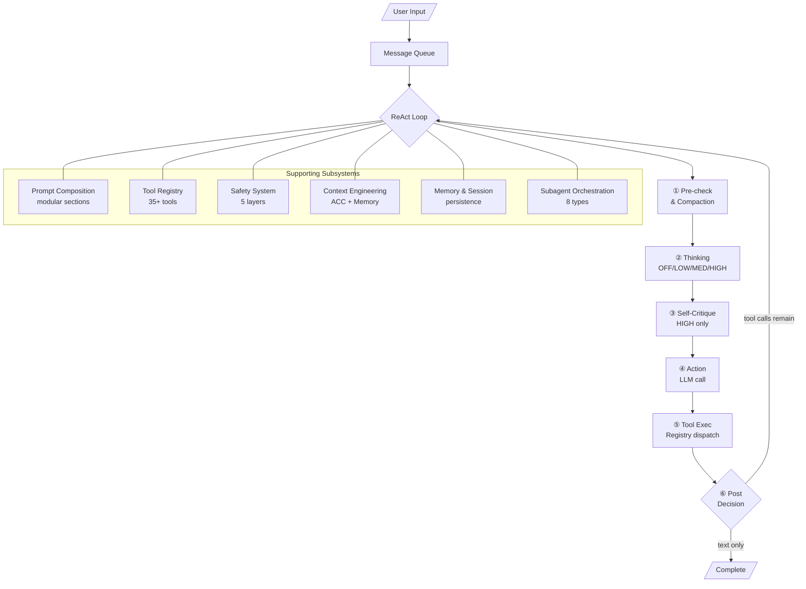
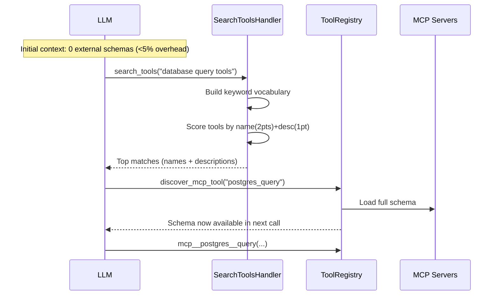

# Scaffolding & Harness for CLI Coding Agents 論文導讀

## TL;DR

CLI coding agent 正面臨從「benchmark 原型」到「日常生產工具」的根本轉型。OPENDEV 是第一個公開其完整工程決策的開源 terminal-native coding agent，其核心洞見是將 agent 系統明確拆解為**建構期（scaffolding）**與**執行期（harness）**兩個階段，並將上下文管理（context engineering）提升為一級工程考量。透過五階段漸進式壓縮、事件驅動的系統提醒、schema 層級的安全隔離，以及複合式 AI 系統架構，OPENDEV 為長期運行的 CLI agent 定義了一套可複製的架構藍圖。

## 背景與動機

### Agentic Coding 的典範轉移

過去幾年，AI coding assistant 的發展經歷了三次重大的範式轉移。第一階段以 GitHub Copilot 為代表，它們是 IDE 中的 inline 補全工具——被動、片段級、需要人類持續監督。GitHub Copilot 在 2025 年突破了 1500 萬開發者，證明市場對 AI 輔助程式設計有巨大的需求。

第二階段進入了 agentic 時代，以 SWE-agent、OpenHands、Devin 等系統為代表。LLM 開始具備檔案編輯、命令執行、多步驟推理的能力。這些系統在 SWE-bench 等標竿上展現了驚人的潛力：SWE-agent 在 2024 年以 GPT-4 Turbo 達到了 12.47% 的 resolve rate，遠超之前非互動式方法的 3.8%。OpenHands 提供了 production-grade 的 browser-based UI，Devin 則示範了 autonomous software engineer 的概念。

但真正改變格局的是第三階段——**terminal-native agent** 的崛起。Claude Code 在 2025 年初率先示範了 terminal-first 的路徑：不依賴 IDE 插件，直接在開發者已經工作的命令列環境中運作。Terminal 是軟體開發的「作戰心臟」——版本控制、建置系統、SSH 連線、headless 伺服器——所有核心開發活動都在這裡發生。早期系統如 Aider、CodeAct、Open Interpreter 已經示範了 terminal-based 程式設計的可行性，但 Claud Code 和 OpenAI Codex CLI 的推出才是真正引爆這個領域的催化劑。很快地，每個主要 AI lab 都推出了自己的 CLI agent，包括 Google 的 Gemini CLI、Block 的 Goose、charmbracelet 的 Crush 等。

然而，實現這個潛力並不容易。Terminal-Bench 和 LongCLI-Bench 等新興標竿揭露了殘酷的現實：即使是最先進的模型，在連續終端操作中的表現也遠低於實用門檻——Terminal-Bench 中 frontier agent 的任務完成率不到 65%，LongCLI-Bench 的長期任務通過率更低於 20%。

### 三個核心工程挑戰

這些 benchmark 數據指向三個任何長期運行 terminal agent 都必須解決的根本性工程挑戰：

1. **有限上下文視窗**：一個典型的長對話 session 會輕易超越模型的最大 token 預算。工具輸出（檔案內容、指令結果、搜尋結果）在典型 session 中消耗 70–80% 的 context budget，遠超過 system prompt 和 agent 本身的推理內容。一個長期執行的測試套件可以在一次 tool call 中就消耗 30,000 tokens 的 context。

2. **防止破壞性操作**：當 agent 可以執行任意 shell 命令時，一個錯誤的 `rm -rf` 就能造成不可逆的損害。安全機制必須在不妨礙生產力的前提下有效運作——太嚴格會讓開發者繞過安全系統，太寬鬆則形同虛設。

3. **擴展能力但不膨脹 prompt**：每增加一個外部工具、一個 skill、一條安全規則，都在與 agent 的推理能力競爭有限的 token 預算。一個有 100 個外部工具的系統，若每個 tool schema 平均 200 tokens，僅 tool definitions 就需要 20,000 tokens——佔了很多模型完整 context window 的一半以上。

### 為什麼現在需要這篇文章

OPENDEV 論文的獨特價值不在於提出新的演算法突破——它的作者直言不諱地說「This paper is not to present a novel algorithmic breakthrough」。它的貢獻在於**填補了文獻空白**：大部分的生產級 CLI agent 是閉源的（Claude Code），benchmark-oriented 框架有論文但非設計給互動使用（SWE-agent），開源 CLI agent 缺乏技術報告（Aider、Goose、OpenCode）。OPENDEV 是第一個公開完整架構決策、設計取捨、以及工程教訓的開源 terminal-native interactive coding agent。

### 三種現有系統的定位比較

| 類別 | 代表系統 | 論文 | 原始碼 | 互動使用 |
|------|---------|------|--------|---------|
| IDE 插件 | GitHub Copilot, Cursor | ✗ | ✗ | ✓ |
| Benchmark agent | SWE-Agent | ✓ (NeurIPS 2024) | ✓ | ✗（設計給自動化評估）|
| Closed-source CLI | Claude Code, Gemini CLI, Codex CLI | ✗ | ✗ | ✓ |
| 開源 CLI（無論文） | Aider, Goose, OpenCode, Crush | ✗ | ✓ | ✓ |
| 開源 CLI + 論文 | **OPENDEV** | ✓ (2026) | ✓ | ✓ |

這個表格清楚地顯示了 OPENDEV 填入的空白：它是目前唯一同時滿足「開源」+「有完整技術論文」+「設計給互動使用」的 terminal-native coding agent。

### 三個核心設計原則

OPENDEV 的整個架構由三個貫穿性的原則驅動：

1. **Separation of Concerns（關注點分離）**：每個架構決策（模型選擇、context 管理、安全執行、工具調度）應該獨立可配置和可替換，不影響其他部分。這個原則在 Scaffolding vs Harness 的分離、Per-workflow LLM binding、以及獨立的五層安全架構中都有體現。

2. **Progressive Degradation（漸進降級）**：當資源耗盡時（token budget、iteration count、網路連線），系統應該優雅地降級而非直接崩潰。ACC 的五階段壓縮就是典型的漸進降級設計——從最便宜的 warning 逐步升級到昂貴的 LLM compression，只在最後關頭才動用最大成本。

3. **Transparency Over Magic（透明勝於魔法）**：系統的每個動作（tool calls、safety vetoes、context compaction、memory updates）都應該對開發者可觀察和可覆寫。這體現在 lifecycle hooks、undo system、session cost tracking、以及 shadow git snapshots 等設計上。

## 核心知識點

本文圍繞以下 12 個核心知識點展開。每個知識點都試圖回答一個具體的工程問題，而不是抽象的方法論。

1. **Scaffolding vs Harness 的分離**：為什麼要把 agent 的建構期和執行期嚴格切開？
2. **Compound AI System 架構**：為什麼「一個模型打天下」不是最佳解？
3. **Schema-Level 安全隔離**：為什麼讓工具「看不見」比「擋住」更安全？
4. **Adaptive Context Compaction (ACC)**：為什麼漸進式壓縮比緊急壓縮更有效？
5. **Extended ReAct Loop**：為什麼 thinking phase 要與 action phase 分離？
6. **Event-Driven System Reminders**：為什麼 system prompt 在 30 輪後會失效？
7. **Dual-Memory Architecture**：如何讓 agent 同時記住策略目標與操作細節？
8. **Tool Design for LLM Imprecision**：為什麼 exact-match edit 是錯誤設計？
9. **MCP Lazy Discovery**：為什麼一次載入所有工具 schema 會耗掉 40% 的 context？
10. **Agent-Computer Interface (ACI)**：SWE-agent 的核心貢獻與 OPENDEV 的差異
11. **Doom-Loop Detection**：如何防止 agent 卡在重複呼叫同一個工具的死循環？
12. **Bounded Resource Growth**：為什麼每個隨 session 增長的資源都需要硬上限？

## 方法詳解

### 1. Scaffolding vs Harness 的分離

OPENDEV 最核心的架構決策是將 agent 的生命週期明確切割成兩個階段。

**Scaffolding（建構期）**發生在收到第一個 user prompt 之前。在這階段，AgentFactory 以嚴格的三階段順序組裝整個系統：Phase 1 載入 skills（從 builtin、user global、project-local 三個目錄），Phase 2 建立 SubAgentManager 並註冊所有 subagent，Phase 3 建構 MainAgent。這個順序是強制的，因為 Phase 2 必須在 Phase 3 之前完成——`spawn_subagent` 這個 tool 的 description 是從已註冊的 agent 集合動態產生的。

關鍵的設計選擇是 **eager construction**：`BaseAgent.__init__()` 在建構函數返回前就完成 `build_system_prompt()` 和 `build_tool_schemas()`。當 `__init__()` 完成時，agent 已經完全準備好服務請求，沒有任何 lazy prompt assembly 或 first-call latency。

OPENDEV 只有一個具體的 agent class——`MainAgent`。所有的 agent（主 agent、builtin subagent、使用者自訂 agent）都是這個 class 的實例。行為差異完全來自建構參數：`allowed_tools`（決定哪些 tool schema 出現在 agent 的 schema 中）和 `_subagent_system_prompt`。這取代了早期版本中繁重的 class hierarchy——當 subagent 需要混合能力時（例如一個同時需要 planning 和 code exploration 的 agent），class hierarchy 會產生菱形繼承問題。

#### Agent Factory 的三階段組裝

Factory 的執行邏輯如下：

**Phase 1 — Skills Discovery**：Factory 從三個目錄發現 skill definitions（builtin、user-global、project-local），建立一個 SkillLoader，並將其註冊到 tool registry，使 `use_skill` tool 可用。

**Phase 2 — Subagent Compilation**：每個 subagent 從一個 `SubAgentSpec`（TypedDict，包含 name、description、system prompt、optional tool allowlist、optional model override、optional Docker configuration）開始。`register_subagent()` 執行四步 pipeline：
1. 解析 tool list，若未指定則預設為一組硬編碼的安全工具
2. 若提供 model override，建立 `AppConfig` 拷貝
3. 建構 `MainAgent`，`allowed_tools` 設為解析後的 tool list，觸發 eager build
4. 設定 `agent._subagent_system_prompt` 為 spec 的 prompt override

結果存為 `CompiledSubAgent`（name, description, agent instance, tool list）。所有 subagent 共享同一個 tool registry reference，沒有 cloning 或 deep copy。

**Phase 3 — Main Agent Construction**：Factory 建構一個沒有 tool filtering 的 `MainAgent`（可以存取所有已註冊 tools）。返回 `AgentSuite` dataclass，包含 main agent、SubAgentManager、SkillLoader。

#### Dependency Injection 與隔離邊界

Agent 執行時需要 services。`AgentDependencies` 是攜帶七個 fields 的 Pydantic model：`mode_manager`, `approval_manager`, `undo_manager`, `session_manager`, `working_dir`, `console`, `config`。在 ReAct loop 內部，這些 manager 被 unpack 並傳入 `execute_tool()`。

Subagent 收到的是輕量化 `SubAgentDeps`，只有三個 fields。被省略的 fields 強制了隔離邊界：subagent 沒有 session_manager（它們的訊息不會被持久化）、console（output 流經 ui_callback）、或 config（每個 subagent 在建構時已攜帶自己的設定）。

#### 設計演進

Scaffolding 架構經歷了三次關鍵 pivots：

1. **從 class hierarchy 到參數化 MainAgent**：早期版本有獨立的 class（PlanningAgent、CodeExplorationAgent），但菱形繼承問題迫使改用單一參數化 class。

2. **從 lazy 到 eager construction**：Lazy prompt building 導致 first-call latency 和 MCP 的 race condition。Eager building 保證每個 agent 在建構時就完整。

3. **從 inline 到 registration-based subagent**：`SubAgentSpec` registration system 統一了 builtin 和 custom agent 的建構路徑。

#### Harness（執行期架構）

**Harness** 則負責所有 runtime 的 orchestration：工具調度、上下文管理、安全執行、session 持久化。論文中的圖 4 展示了 harness 如何圍繞 ReAct loop 組織七個子系統：

- **Prompt Composition engine**：將 system prompt 從模組化 sections 組裝，分為 cacheable 和 non-cacheable 區段
- **Tool Registry**：將 tool call dispatch 到專門的 handlers，MCP tools lazily discovered
- **Safety System**：五層 defense-in-depth
- **Context Engineering**：管理 conversation 作為有限資源，應用漸進式壓縮
- **Memory and Session services**：持久化 conversation transcript 和 playbook
- **Subagent Orchestration**：啟用 main agent 將專門任務委派給隔離的 agent instances



Scaffolding 與 Harness 的分離帶來了實際的工程好處：新增一個 tool 只需要 scaffolding 階段的 registry 變更，而改變壓縮策略只需要 harness 階段的程式碼變更。兩者互不干擾。

### 2. Compound AI System 架構

OPENDEV 的核心設計原則是它是一個 **compound AI system**：不是單一的 monolithic LLM，而是一個結構化的 agent、workflow、model 組合。這個觀點來自 Zaharia et al. 的「The Shift from Models to Compound AI Systems」——最先進的 AI 結果越來越依賴於組合多個模型、檢索器、工具，而非單一模型呼叫。

#### Five Model Roles

OPENDEV 具體體現這個原則的方式是 **per-workflow LLM binding**。系統定義了五種模型角色，每個角色獨立綁定到使用者設定的 LLM：

| 角色 | 用途 | 備援鏈 | 特性 |
|------|------|--------|------|
| Action Model | 主要執行模型，tool-based reasoning | 預設 | 預設給所有 workload，除非指定專門模型 |
| Thinking Model | 無 tool access 延伸推理 | → Action Model | 專注策略規劃，無 tool call 壓力 |
| Critique Model | 自我評估（Reflexion 啟發） | → Thinking → Action | 選擇性啟用，非每輪都執行 |
| Vision Model | 處理螢幕截圖和圖像 | → Action（若支援 vision） | 視覺除錯任務必備 |
| Compact Model | 較小較快的摘要模型 | → Action Model | 優先速度和成本，用於 context compaction |

這個設計讓使用者可以針對不同任務優化成本、延遲與能力：複雜推理用強但慢的 thinking model，簡單摘要用 compact model，視覺除錯用 VLM。

#### Provider Abstraction

每個 model selection 觸發 lazy initialization 的 provider-specific API client，只有實際在 session 中使用的 models 才會初始化。Model capabilities（context length、vision support、reasoning features）在本地以 24 小時 TTL 快取，啟用 stale-while-revalidate 策略。

切換 provider 或優化成本只需要 config 變更，不需要 code 變更。系統的 capabilities 不是固定在部署時，而是隨著新模型出現而持續可升級。三個模型選擇策略被考慮過：

- **Single model for everything**：簡單但 inflexible
- **Task-specific routing**（採用）：引入 selection logic 的複雜度，但啟用 workload optimization
- **Ensemble execution**：最高品質但 prohibitively expensive

### 3. Schema-Level 安全隔離

OPENDEV 安全性架構最深刻的洞見是：**讓工具「看不見」比「擋住」更安全**。

當一個 tool 存在於 agent 的 schema 中時，LLM 可以推理如何使用它、為繞過限制而爭論、探測 permission logic 的邊界。但如果 write tools 不在 schema 中——agent 根本不知道它們存在——那就完全不具備嘗試的可能性。這是 guard rail 與 missing road 的差異：模型無法對它不知道存在的能力進行推理。

這個原則在 Plan Mode 的設計中體現得淋漓盡致：

#### Plan Mode: Subagent-Based Planning

當主 agent 需要規劃時，它不是把自己切換到受限模式，而是 spawn 一個 Planner subagent，其 schema **只包含 read-only tools**。Planner 無法寫入檔案，不是因為 runtime check 阻擋，而是因為它的 schema 中根本沒有 write tools。

Planner subagent 執行三個階段：
1. **Explore**：用 read-only tools 探索 codebase（讀取檔案、搜尋程式碼、列出目錄、解析 symbol）
2. **Analyze**：分析 findings，評估風險與 trade-offs
3. **Write plan**：將結構化計劃寫入 scratch directory 的檔案（含七個 sections：goal、context、files to modify、new files、steps、verification criteria、risks）

關鍵優勢：
- 沒有 state machine，所以不可能卡在 plan mode
- Planner 可以與其他 subagent 並行運行
- 工具表面從四個工具減少到一個（`present_plan`）

#### Five-Layer Defense-in-Depth

除了 schema-level gating，OPENDEV 還有完整的五層安全架構，每一層獨立運作：

```
Layer 1: Prompt-Level Guardrails
  → 安全政策、行動安全、read-before-edit、git workflow、錯誤恢復
  防止 agent 在推理層級做出不安全決策

Layer 2: Schema-Level Tool Restrictions
  → Plan-mode whitelist、per-subagent allowed_tools、MCP discovery gating
  讓不安全工具對 agent 不可見

Layer 3: Runtime Approval System
  → Manual / Semi-Auto / Auto 三級
  → PATTERN/COMMAND/PREFIX/DANGER 四種 rule types
  → 持久化權限（跨 session 保存）
  預設危險規則（rm -rf / 等）總是啟用，不可覆寫

Layer 4: Tool-Level Validation
  → DANGEROUS_PATTERNS blocklist
  → Stale-read detection（防止覆蓋並行編輯）
  → Output truncation（80k chars head-tail）
  → Timeouts（60s idle, 600s absolute）

Layer 5: Lifecycle Hooks
  → Pre-tool blocking（exit code 2 硬阻擋）
  → Argument mutation（安全注入標記）
  → JSON stdin protocol（供外部腳本使用）
```

這五層是故意設計為獨立的——任何一層的 bug 不會削弱其他層。

### 4. Adaptive Context Compaction (ACC)

Context window 是長期運行 agent 最稀缺的資源。傳統的做法是在 95–99% 容量時觸發一次緊急 LLM-based 壓縮。這個方法有三個根本問題：觸發太晚（資訊已經 overflow）、資訊損失嚴重（一次性壓縮會丟失細節）、後續壓縮會累積錯誤（壓縮的壓縮）。

OPENDEV 的 ACC 則採用**五階段漸進式**策略，在每個 ReAct iteration 開始時檢查 context 壓力：

```
Stage 1 — Warning (70%):
  記錄壓力趨勢，不進行資料縮減。
  系統開始追蹤 utilization trends 以預測何時需要更積極的措施。

Stage 2 — Observation Masking (80%):
  較舊的 tool result 換成 compact reference pointer（~15 tokens each）。
  最新的 tool output 保留完整內容。
  保留 conversation structure，LLM API 需要這個結構。

Stage 2.5 — Fast Pruning (85%):
  輕量級的向後修剪。
  保護 recency window 內的結果，更舊的換成 [pruned] marker。
  這是 deletion-class 操作（內容直接丟棄而非 offload），
  但只針對遠超過 recency window 的輸出。

Stage 3 — Aggressive Masking (90%):
  保留區縮小到極少數最新的 tool outputs。
  其餘所有 observations 都被 masked。

Stage 4 — Full Compaction (99%):
  整個對話歷史序列化到 scratch file（確保 no permanent data loss）。
  LLM summarizer 壓縮中間部分，保留最近訊息逐字不變。
  Archive path 注入到 summary 中，使 compaction 實質上 non-lossy。
```

```mermaid
flowchart LR
    CP[Context\nPressure] --> T70{>70%?}
    T70 -- Yes --> W[Warning\nLog utilization]
    T70 -- No --> OK[No action]
    W --> T80{>80%?}
    T80 -- Yes --> M80[Mask older\nobservations → refs]
    T80 -- No --> OK
    M80 --> T85{>85%?}
    T85 -- Yes --> P85[Fast Prune\nold outputs → [pruned]]
    T85 -- No --> OK
    P85 --> T90{>90%?}
    T90 -- Yes --> A90[Aggressive\nMasking]
    T90 -- No --> OK
    A90 --> T99{>99%?}
    T99 -- Yes --> F99[Full LLM\nCompaction]
    T99 -- No --> OK
```

ACC 的關鍵元素包括：

- **Artifact Index**：結構化 registry 記錄 session 中所有 touched 檔案（讀取、建立、修改、刪除），序列化到 compaction summary 中，確保 agent 即使 context 被壓縮也能記得它跟哪些檔案互動過。
- **API-reported token counts 作為校正錨點**：Provider 會注入看不見的內容（safety preambles、tool schema 序列化），使 local token counting 系統性低估實際用量。使用 API reported `prompt_tokens` 作為 ground truth 是 ACC 準確運作的關鍵。

根據論文報告，ACC 將觀察結果的峰值 context 消耗減少了約 54%，通常在 30-turn 的典型 session 中完全不需要緊急壓縮。

### 5. Extended ReAct Loop

Standard ReAct（Yao et al., 2023）在同一個 turn 中交織推理與行動。這在簡單任務上有效，但在複雜任務上存在根本問題：tool schemas 消耗 context、產生「快點行動」的壓力，限制了深度思考。

OPENDEV 的 Extended ReAct Loop 將每個 iteration 擴展為六個階段：

**Phase 0 — Pre-check & Compaction**：清除 injection queue，執行 ACC 檢查，為下一輪準備 context。

**Phase 1 — Thinking**：如果 thinking mode 啟用，executor 用一份無 tool 的對話拷貝呼叫 thinking LLM。這個階段產生推理軌跡（結構化的情況分析、可能的方法、風險評估），但沒有工具可用，無法過早行動。四個 thinking depth level：

| Level | 行為 | 延遲影響 |
|-------|------|---------|
| OFF | 跳過，直接進 action | 最低 |
| LOW | 快速推理軌跡 | 低 |
| MEDIUM | 中等深度分析 | 中 |
| HIGH | 推理 + self-critique（critique model 評估後 thinking model 修正） | 高 |

**Phase 2 — Action**：Executor 組裝完整 action prompt（system prompt、ACE playbook bullets、tool schemas、conversation history、thinking trace），發送給 action LLM。

**Phase 3 — Decision, Dispatch, and Doom-Loop Detection**：根據 action model 的回應分支。如果有 tool calls，先執行 doom-loop detection，然後 dispatch tools。如果是純文字回應：

- 若前一個 tool 失敗：executor 分類錯誤型態（permission denied、file not found、syntax error、rate limit），注入對應的 recovery nudge
- 若還有 incomplete todos：nudge agent 繼續
- 若無 error：視為任務完成，loop 終止

**Tool Execution**：選擇執行策略——parallel（thread pool，最多 5 concurrent）用於獨立操作，serial 用於相依操作。執行後結果送入 ACE memory pipeline 進行 Reflector 分析和 Curator 更新。

**Termination**：loop 透過四種路徑終止——explicit task completion tool、implicit text-only response、error-recovery budget exhausted（3 consecutive failures）、iteration cap reached。

#### Doom-Loop Detection

每個 tool call 被指紋化為 (tool_name, arguments) 的 MD5 hash，追蹤在最近 20 次呼叫的 sliding window 中。當同一個 fingerprint 出現 ≥3 次：

1. **Tier 1 警告**：注入 `[SYSTEM WARNING]`，跳過該輪 tool execution
2. **Tier 2 暫停**：若相同 fingerprint 在警告後再次出現，升級為 approval-based pause——「Agent is repeating the same action. Allow / Break?」

這個兩階段的設計比單純的警告更穩健：LLM 可以忽略 injected text，但繞不過真正的執行中斷。Fingerprint-based 檢測捕捉到 iteration count 和 consecutive-read counters 遺漏的 pattern：不是「讀取了 5 次檔案」，而是「用完全相同的參數讀取了同一個檔案 5 次」。

#### Extended ReAct Algorithm Pseudocode

```
Algorithm: Extended ReAct Loop with Five-Stage Compaction

Require: User message m, Agent A, Tool registry T, Session S
Ensure: Response summary, error status, latency

1: S.add(m); nudge_count ← 0; fingerprints ← deque(maxlen=20)
2: repeat
3:   // Phase 0: Staged Context Management
4:   p ← token_count(S)/max_context
5:   if p > 0.99 then S ← compact(S)           // Full LLM summarization
6:   else if p > 0.85 then prune_old_tool_outputs(S)  // Fast pruning
7:   else if p > 0.80 then mask_old_observations(S)   // Replace with refs
8:   else if p > 0.70 then log_warning(p)
9:   end if
10:
11:  // Phase 1: Thinking
12:  if thinking_level ≠ OFF then
13:    trace ← A.call_thinking_llm(S)           // No tools
14:    if thinking_level = HIGH then
15:      critique ← A.call_critique_llm(trace)
16:      trace ← A.refine(trace, critique)
17:    end if
18:    S.add_trace(trace)
19:  end if
20:
21:  // Phase 2: Action
22:  response, tool_calls ← A.call_llm(S, T)   // With tools
23:
24:  // Phase 3: Decision & Dispatch
25:  if tool_calls ≠ ∅ then
26:    for tc ∈ tool_calls do
27:      fingerprints.append(md5(tc.name, tc.args))
28:    end for
29:    if max(Counter(fingerprints).values()) ≥ 3 then
30:      approval_pause("repeated tool call detected")
31:    else
32:      for tc ∈ tool_calls do
33:        result ← T.execute(tc); S.add(tc, result)
34:      end for
35:    end if
36:  else
37:    if last tool failed ∧ nudge_count < 3 then
38:      S.add(get_smart_nudge(error)); nudge_count += 1
39:    else break                                   // Implicit completion
40:    end if
41:  end if
42: until task_complete called ∨ max iterations reached
43: return summary, error, latency
```

### 6. Event-Driven System Reminders

當一個 coding agent 被 system prompt 告知「編輯檔案後永遠要跑測試」，它在頭幾輪會遵守。但在 20 次 tool call 後，檔案內容、搜尋結果、指令輸出不段堆積，它會悄悄地停止測試。指令仍然在 system prompt 中，但模型的注意力已經轉移到最近的訊息上。這不是假設性的問題——論文作者在超過 15 次 tool call 的 session 中持續觀察到這個可預測、可重現的失敗模式。

System reminders 的解法是：**在決策點注入短而精的提醒**，而不是把所有規則放在 system prompt 中。每個 reminder 是一條簡短的 `role: user` message，放在 conversation 中最高 recency 的位置。

#### 八個 Event Detectors

```
╔══════════════════════════════╤════════════════════════════════════╗
║ Detector                     │ 觸發條件                          ║
╠══════════════════════════════╪════════════════════════════════════╣
║ Tool failure without retry   │ tool 失敗後 agent 未嘗試恢復       ║
║ Exploration spirals          │ 5+ consecutive reads               ║
║ Denied tool re-attempts      │ 被拒絕的 tool 重複嘗試             ║
║ Premature completion         │ 還有 incomplete todos 就完成       ║
║ Continued work after done    │ 所有 todos 完成後繼續工作           ║
║ Plan without follow-through  │ plan 已批准但未執行                 ║
║ Unprocessed subagent results │ subagent 結果未被處理              ║
║ Empty completion messages    │ 完成訊息為空                       ║
╚══════════════════════════════╧════════════════════════════════════╝
```

#### 關鍵設計決策

**role: user vs role: system**：經過 40 輪對話，另一個 system message 只會混入模型已經部分遺忘的背景中。而 user message 出現在最高 recency 的位置，模型將其視為剛發生的事情、需要回應的事情。早期實驗確認了 user-role reminders 的 compliance rate 明顯較高。

**Guardrail counters**：每個 reminder type 有發射次數上限，防止提醒疲勞：
- incomplete-todo nudges：最多 2 次
- error-recovery nudges：最多 3 次
- plan-approved、all-todos-complete、completion-summary 信號：各 1 次

**Template resolution**：所有 reminder 文字存在 `reminders.md` 中，以 `--- section_name ---` 分隔。更長的 prompts 退回 `.txt` 檔案。這使 reminders 可以在不修改 Python code 的情況下被審計和編輯。

**Graceful degradation**：如果 reminder template 遺失或擷取失敗，agent 仍然有 system prompt。Reminders 強化現有指令；不會引入新指令。

### 7. Dual-Memory Architecture

Thinking phase 需要對話上下文進行策略推理，但完整對話歷史可能長達數十萬 token。提供 unbounded history 不可行（超過 context window），提供 only recent messages 又失去策略上下文。

OPENDEV 的解法是 dual-memory architecture，靈感來自認知心理學：

**Episodic Memory（情節記憶）**：LLM 產生的對話歷史摘要，捕捉戰略性長期上下文——已做出的決策、總體目標、關鍵發現、重要檔案路徑。摘要器被指示保留 actionable identifiers（檔案路徑、函數名稱、錯誤代碼），省略冗餘工具輸出。

摘要**每 5 條新訊息**重新生成一次（由 `regenerate_threshold` 控制）。週期性重新生成（而非增量壓縮）防止了「摘要漂移」——迭代壓縮摘要會造成累積失真。透過從完整歷史重新生成，每個 episodic memory snapshot 是 fresh compression 而非 compression of compression。

**Working Memory（工作記憶）**：最近 6 輪對話的逐字原始內容（由 `exclude_last_n` 控制）。這些訊息包含 immediate decision-making 需要的精確操作細節：確切的檔案內容、特定的錯誤訊息、精確的行號、最近的 tool call 結果。Summarization 會破壞當下最重要的事。

**Combined Injection**：Inject 到 thinking LLM 的形式：
```
1. Episodic Memory Summary（策略大局）—— 固定最大長度 500 chars
2. Working Memory Messages（操作細節）—— 6 輪逐字內容
3. 當前 user query
```

這使得 thinking token budget 無論對話長度如何都保持 bounded：episodic summary 有固定長度，working memory window 恆定。

### 8. Tool Design for LLM Imprecision

LLM consistently 產生 approximately-correct outputs。當編輯檔案時，LLM 指定的 `old_content` 經常與實際檔案有微小差異——尾隨空白、縮進、逸脫序列差異、從記憶重構而非逐字拷貝的格式化變異。

#### 9-Pass Fuzzy Matching Edit

OPENDEV 的 edit tool 採用 **chain-of-responsibility 模式**，包含 **9 個漸進式寬鬆的 replacer classes**：

| Pass | 策略 | 說明 |
|------|------|------|
| 1 | Exact match | 最優先，零開銷 |
| 2 | Whitespace normalization | 忽略行尾空白差異 |
| 3 | Indentation flexibility | 處理 tab/space 差異 |
| 4 | Escape handling | 處理逸脫序列 |
| 5 | Truncation-tolerant | 處理 multi-line content 截斷 |
| 6 | Partial context anchoring | 用小段 context 定位 |
| 7 | Header-based matching | 從 diff header 資訊匹配 |
| 8 | Line-by-line fuzzy | panel-by-panel 比對 |
| 9 | Semantic anchor matching | 最寬鬆，用代碼結構定位 |

每個 replacer 返回在原始檔案中找到的實際 substring，因此 replacement 保留原始檔案的格式。Chain 在第一個 match 處短路——exact match 完全不受 fuzzy passes 的開銷影響。

#### Tool Result Optimization

每個 tool result 通過 type-specific summarizer，將冗長輸出轉化為精密的語義保留表示：

```
File reads:   → "Read file (142 lines, 4,831 chars)"
Search:       → "Search completed (23 matches found)"
Directory:    → "Listed directory (47 items)"
Command exec: → "Command executed (312 lines of output)"
Error:        → "Error: FileNotFoundError: ..." (truncated to 200 chars)
```

超過 8000 字元的輸出 offloaded 到 scratch file，保留 500 字預覽 + 檔案路徑。這將 context-consumption 問題轉化為 retrieval 問題——retrieval 成本是一次 tool call，而 context consumption 會付出在 session 中後續的每次 LLM invocation。

這個優化將典型 session 長度從 15–20 turns（before context overflow）延長到 30–40 turns（without compaction）。

### 9. MCP Lazy Discovery

一個擁有 100 個外部工具的系統，若每個 schema 平均 200 tokens，僅 tool definitions 就需要 20,000 tokens。這在收到第一個 user message 之前就消耗了 40% 的 context budget。

OPENDEV 透過 **lazy discovery** 解決這個問題：



Discovery 有三個 detail level：
- `names`：僅返回 tool names（最少 token）
- `brief`：加短 description
- `full`：觸發完整 schema 載入到後續 LLM calls

Lazy discovery 將 startup context 成本從 40% 降低到不到 5%。初始 context 中有零個外部 tool schemas，只在實際使用時才載入。

### 10. Agent-Computer Interface (ACI)

SWE-agent 的核心貢獻是認識到：**LM agent 是一種新的終端使用者，需要專門為它們設計的介面**。

人類和 LLM 在能力與限制上有根本差異：LLM 缺乏直接操作 GUI 的視覺理解能力；人類可以靈活忽略不相關資訊，但 LLM 的所有 content 都有固定的 token 成本；人類能從少量示範中學習，LLM 需要精確的文件。

SWE-agent 歸納了四個 ACI 設計原則：

1. **Actions should be simple**：簡單的指令、少量選項、精簡文件。許多 bash 命令的文件包含數十個選項；簡單命令讓 agent 更易使用。

2. **Actions should be compact**：重要操作（檔案導覽、編輯）整合到最少 action 中。Poor design 會讓 agent 需要多個 turns 才能完成一次操作。

3. **Environment feedback should be informative but concise**：提供實質資訊但不必要的細節。例如編輯檔案時，更新 revised content 很有幫助。

4. **Guardrails mitigate error propagation**：內建防護（如 code syntax checker）幫助 agent 快速識別和修正錯誤。

SWE-agent 的 ACI 在 SWE-bench 上驗證了其有效性：與預設 Linux shell 相比，ACI 版本多解決了 10.7 個百分點的任務。

OPENDEV 與 SWE-agent 的對比則說明了這個領域的演進：

| 面向 | SWE-agent | OPENDEV |
|------|-----------|---------|
| 設計目標 | benchmark performance（SWE-bench） | interactive daily use |
| 模型策略 | 固定 LM，專注 ACI 設計 | compound AI，per-workflow model routing |
| Context 管理 | 基本 history 管理 | 五階段 ACC + dual-memory + system reminders |
| 安全性 | guardrails + syntax check | 五層 defense-in-depth |
| 工具架構 | 固定 ACI commands（~8 actions） | Registry + MCP lazy discovery（35+ tools） |
| Subagent | 無 | 8 種專門 subagent |
| 公開程度 | 開源 + NeurIPS 論文 | 開源 + 完整 52 頁技術報告 |

### 11. REPL Command Dispatch System

並非所有使用者輸入都需要 LLM 參與。Session management、mode switching、model selection、MCP server configuration 是確定性操作，應該直接由 REPL 處理而無需 agent loop。

OPENDEV 實現了**雙路徑輸入調度**：若輸入以 `/` 前綴開頭，路由到註冊的 command handler；否則進入 query processor 和 agent loop。九個 handler classes 涵蓋系統的互動控制面：

| Handler | 指令 | 功能 |
|---------|------|------|
| Session | /clear, /compact | 管理對話狀態 |
| Mode | /mode | 切換 normal/plan mode |
| Configuration | /models | 互動式 model selector |
| MCP | /mcp（11 subcommands） | 管理 MCP servers |
| Agent | /agents | 管理自訂 agent |
| Skills | /skills | 管理可重複使用 prompt 模板 |
| Plugins | /plugins | 管理第三方擴展 |
| Tool | /init | 初始化 codebase context |
| Help | /help | 列出所有可用指令 |

Commands 和 agent tools 是架構性分離而非偶然區分：commands 由使用者觸發、同步執行、無 LLM 參與、無 tool-use hooks、無 approval gates、無 undo tracking。Agent tools 由 LLM 在推理中選擇，經歷 tool registry dispatch、pre/post hooks、user approval (depending on autonomy level)，並被 undo manager 追蹤。

### 12. Subagent Orchestration

OPENDEV 有 8 種 builtin subagent，每種有專門的 tool access 和 prompts：

| Subagent | Tools | 用途 |
|----------|-------|------|
| Code-Explorer | read-only（read, search, list, find_symbol） | 程式碼庫深度探索 |
| Planner | read + write plans | 實作規劃 |
| PR-Reviewer | read + search + run_command | PR code review |
| Security-Reviewer | read + search + run_command | 安全審計 |
| Web-Clone | capture_web_screenshot + write + read + run | 網站複製 |
| Web-Generator | write + run + read | 網站建置 |
| Project-Init | read + search + write + run | 專案初始化 |
| Ask-User | 無（純 UI） | 結構化調查 |

關鍵設計：**自動平行執行**。當 main agent 在同一個 LLM response 中發出多個 `spawn_subagent` calls，SubAgentManager 透過 `asyncio.gather()` 平行執行它們，每個 subagent 在獨立 thread 中運行。這讓 agent 可以自然地分散工作——「調查 authentication module」和「審查 database schema」可以同時進行。

Subagent prompts 包含明確的停止條件以防止過度探索：
- Code Explorer：「找到明確證據時停止」、「進度停滯時停止」、「depth over breadth」
- Anti-loop instruction：「重複讀取同一個檔案觸發立即停止」

### 13. Context Engineering Pipeline

Context retrieval 是 coding agent 最關鍵的能力：每個下游動作（編輯、測試、規劃）的品質都被是否找到正確代碼所限制。OPENDEV 的四層 pipeline 從簡單 lookup 到多步 agentic search 逐級升級：

**Layer 1 — Anchor-Based Tool Selection**：根據查詢中最強的 anchor 選擇 retrieval tool：

| Anchor 類型 | 路由到 | 理由 |
|-------------|--------|------|
| Symbol 名稱（AuthController.validate） | `find_symbol`（LSP） | 語意解析 |
| 字串/錯誤訊息 | `text_search`（ripgrep） | 精確 pattern matching |
| 結構 pattern（檢查 is_admin 的 if） | `ast_search`（ast-grep） | 語言感知模板 |
| 檔案路徑慣例 | `list_files`（glob） | glob-based discovery |

**Layer 2 — Multi-Step Agentic Search**：透過 Code Explorer subagent 進行多步自主搜尋，context isolation 防止中間結果污染 main agent 的 context budget。

**Layer 3 — Context Assembly**：從六個 source 組裝最終 message list，每個 `ContextPiece` 追蹤 provenance（source subsystem、priority、token cost）。

**Layer 4 — Context Optimization**：ACC staged compaction 確保提交給 LLM 的 payload 尊重模型 context window。

#### Provider-Level Prompt Caching

對於支援 input caching 的 providers（目前 Anthropic），`compose_two_part()` 將 system prompt 分為 stable 部分（base instructions、tool descriptions、safety policy，80–90% 的內容）和 dynamic 部分（environment metadata、session-specific context）。Stable block 攜帶 `cache_control: {"type": "ephemeral"}` header。

由於 system prompt 在每次 LLM call 中重新發送，且 stable portion 佔 80–90%，快取它可以在 multi-turn session 中節省約 88% 的 cached portion input token cost。

### 14. Persistence Layer

OPENDEV 使用普通磁碟檔案——JSON for structured data、JSONL for append-heavy streams、plain text where simplicity matters。不需要外部資料庫。

**Session Storage**：每個 conversation 存為兩個檔案——`.json` metadata（session ID、timestamps、working directory、title、summary，不含 messages）和 `.jsonl` transcript（每行一個 JSON object）。分離意味著列出所有 sessions 只需讀取小 metadata 檔案，而非載入大型 transcript。

**Auto-Save**：每 5 輪自動儲存（可配置），使用 exclusive file lock + atomic rename 防止並行寫入資料損毀。

**Session Index**：輕量級 `sessions-index.json` 快取 essential fields（~200 bytes/entry），支援 instant session listing。若 index 遺失或損毀，自動從 metadata files 掃描重建。

**Undo Manager**：追蹤每個 file operation（create、modify、delete）的記錄。配合 shadow git snapshot——bare repository 在每步 agent 修改後 snapshot 整個專案目錄——實現 per-step 復原。

**Configuration Hierarchy**：四層設定，從最寬到最窄：built-in defaults → environment variables（API keys 僅從此載入）→ user-global settings（~/.opendev/settings.json）→ project-local settings（<project>/.opendev/settings.json）。

### 15. Bounded Resource Growth

OPENDEV 的經驗法則很簡單：**每個隨 session 長度增長的資源都必須有上限**。

| 資源 | 上限 | 理由 |
|------|------|------|
| Undo history | 50 ops | 防止 unbounded memory growth |
| Nudge attempts per error | 3 | 防止 agent 陷入提示循環 |
| Doom-loop window | 20 fingerprints | 捕捉近期重複 pattern |
| Doom-loop threshold | 3 次相同 fingerprint | 平衡靈敏度與誤報 |
| Iteration cap | configurable | 防止 runaway loops |
| Parallel tool calls | 5 concurrent | 防止資源耗盡 |
| Thinking levels | 4 (OFF~HIGH) | 使用者可調的延遲-品質平衡 |
| Tool output preview | 500 chars | 保持 context 精簡 |
| Max tool result length | 300 tokens | 防止單一結果佔滿 context |

論文的經驗是這些 threshold 的具體值難以從第一原理推導——它們依賴於模型行為、使用者工作流程、系統 overhead 的交互作用。OPENDEV 團隊的做法是從保守值開始，根據觀察到的 failure modes 逐步調整。

## 從 SWE-agent 到 OPENDEV：Engineering Harness 的演進

### SWE-agent 的貢獻與限制

SWE-agent 在 2024 年開創性地提出了 ACI 的概念——一個專門為 LM 設計的介面層，包含自訂的檔案瀏覽、編輯、搜尋、指令執行等 action。它在 SWE-bench 上以 12.47% 的 resolve rate 遙遙領先當時的所有非互動式系統（對比之前的 3.8%）。

但 SWE-agent 的設計有幾個重要的限制：

1. **Single-model architecture**：使用固定的 GPT-4 Turbo，沒有不同任務的角色分工
2. **Benchmark-focused design**：設計主要是為了在 SWE-bench 上獲得高分，而非長期互動使用
3. **Basic context management**：沒有 ACC、dual-memory、system reminders 等機制
4. **No subagent orchestration**：單一 agent 架構，沒有任務分解與平行執行
5. **有限的工具集**：約 8 個 ACI commands，沒有 MCP 或 extensibility

這些限制不是 SWE-agent 的缺陷——它們反映了 2024 年時這個領域的技術狀態。SWE-agent 要解決的問題是「如何讓 LLM 在 SWE-bench 上表現更好」，而不是「如何建立一個可以每天使用的 coding agent」。

### OPENDEV 的架構改進

OPENDEV 在兩個關鍵維度上推進了 coding agent 的工程實踐：

**第一維度：從單一模型到複合 AI 系統**。OPENDEV 的 per-workflow LLM binding 讓系統可以針對不同任務使用不同模型——thinking 用推理強但慢的模型，action 用快速的模型，壓縮用便宜的模型。這不是增量改進，而是**架構範式的轉移**：系統的 capabilities 不再被單一模型的能力上限所限制。

**第二維度：從 benchmark 原型到生產級工程**。OPENDEV 處理了 SWE-agent 沒有面對的生產級挑戰：
- Context 不是 buffer 而是 managed budget（ACC 五階段壓縮）
- 行為控制需要對抗 attention decay（system reminders）
- 安全性需要 defense-in-depth（五層獨立機制）
- 能力擴展不能膨脹 prompt（MCP lazy discovery、two-phase skill loading）

### 共同的工程哲學

雖然 SWE-agent 和 OPENDEV 在很多方面不同，它們共享一個重要的設計哲學：**不要假設 LLM 可以完美使用人類的介面**。SWE-agent 的 ACI 和 OPENDEV 的 scaffold/harness 分離都是對這個認知的具體回應。

SWE-agent 證明了 Linux shell 不是好的 LM agent interface，需要專門設計。OPENDEV 則更進一步——不是設計一組固定的 action，而是設計了一個可以動態建構 agent、動態管理 context、動態載入工具的架構框架。

## 實驗結果

### 定量評估的現狀

OPENDEV 論文明確承認其目前的限制：「This paper documents architectural decisions and design rationale but lacks systematic quantitative evaluation」。這意味著我們還沒有 OPENDEV 在 SWE-bench、Terminal-Bench 或 LongCLI-Bench 上的標準化成績。

這是論文的一個重要弱點，但也是作者選擇的誠實姿態——這是一篇**工程設計報告**而非實驗論文。與 AIM 時期的系統論文（如 MapReduce、Bigtable）類似，主要的貢獻是描述一個有效的系統設計，而非提出需要嚴格 benchmark 驗證的新演算法。

### ACC 的定量數據

ACC 的定量數據是論文中最具體的：**峰值 context 消耗減少約 54%**，通常在 30-turn session 中完全不需要緊急壓縮。Tool result optimization 將典型 session 長度從 15–20 turns（before context overflow）延長到 30–40 turns（without compaction）。Prompt caching 對 cached portion 節省約 88% 的 input token cost。

### 定性設計教訓

雖然缺乏系統性定量評估，論文在 Section 3 中提供了豐富的質性工程教訓，每個都來自實際開發中的失敗與迭代：

**Context Pressure as the Central Design Constraint**：
- Tool outputs consume 70–80% of context
- Graduated reduction（70%→80%→85%→90%→99%）dramatically outperforms single emergency compaction
- 使用 API-reported token counts 而非 local estimates 校正——local estimates 會系統性低估實際用量

**Steering Behavior Over Long Horizons**：
- System prompt 在 30 輪後影響力衰減
- User-role reminders consistently 比 system-role 更有效
- Thinking 與 Action 分離的機制比在同一個 call 中要求「仔細思考」更有效——關鍵是 tool schemas 從 API call 中移除
- Provider-conditional sections 讓 prompt budget 專注於當前使用中的 provider

**Safety Through Architectural Constraints**：
- Schema gating 比 runtime permission checks 根本更穩健
- Approval persistence 防止審批疲勞
- Modal priority during interrupt——當 interrupt key 按下時 modal dialog 被取消而非 agent，防止 orphaned UI state

**Designing for Approximate Outputs**：
- 9-pass fuzzy matching 將 near-misses 轉化為成功編輯
- Recovery hints 必須根據 agent 實際可用的 tools 調整
- Auto-promoting server-like commands（16 個 server pattern regex）
- Auto-installing missing dependencies（Playwright Chromium auto-install on first use）

**Lazy Loading and Bounded Growth**：
- Lazy discovery reduces startup context from 40% to under 5%
- Stale-while-revalidate 快取策略保證離線啟動
- Prefer empirical threshold tuning over first-principles calculation——所有 threshold 都從 iterative failure analysis 中浮現

## 限制與未來方向

### OPENDEV 的已知限制

1. **缺乏系統定量評估**：論文本身沒有在標準 benchmark 上的成績，這是最大的缺口。作者在未來方向中明確列出了在 SWE-bench、Terminal-Bench、LongCLI-Bench 上的評估需求。Terminal-Bench 顯示 frontier agent resolve rate <65%，LongCLI-Bench 顯示 long-horizon pass rate <20%——這代表 context management 和 multi-step reasoning 仍然有大幅改進空間。

2. **全域固定的參數**：70% 的壓縮閾值、3 次 nudge attempts、6 個 thinking depth levels——這些參數目前是全域固定的。Adaptive approaches 可以根據任務複雜度、當前 context pressure、錯誤歷史動態調整。例如簡單的 debugging 任務應該完全跳過 thinking phase，複雜的 architectural refactoring 則需要 deeper deliberation。

3. **Memory pipeline 的限制**：ACE playbook 目前是 per-project 操作。跨專案知識轉移、層次化 bullet 組織（分離通用程式設計 heuristics 與專案特定慣例）、主動學習（不確定時請求使用者回饋）都是有意義的擴展方向。

4. **純 flat 自然語言 memory**：目前的 memory pipeline 以 flat natural-language bullets 儲存經驗。Richer representations——code dependency graphs、call graphs、project-level ontologies——可以實現更精確的檢索與推理。結合 graph-structured code understanding 與跨 session 長期 persistent memory 可以讓 agent 建立 codebase 的深度演化模型。

5. **層級式 multi-agent coordination**：目前的 subagent 在 main-agent coordination 下獨立執行，只透過 completion markers 通訊。Richer patterns——peer-to-peer communication、shared blackboard、negotiation protocols——可以實現 concurrent code review、parallel exploration with result synthesis 等更複雜的工作流程。

6. **Learned system reminder optimization**：24-template reminder catalog 和 injection timing 是手工基於觀察到的 failure modes 設計的。透過 RL on attention-decay metrics、learned injection timing、adaptive template selection 自動化 reminder 模式發現是合理的研究方向。

7. **Hybrid CLI-IDE integration**：Dual-interface 架構（TUI + Web UI via shared UICallback contract）示範了同一套 agent logic 可以服務不同前端。延伸到 IDE plugins 可以讓使用者在 terminal autonomy 與 rich editor integration（inline diffs、symbol navigation、test result overlays）之間無縫切換。

### 對這個領域的意義

OPENDEV 的主要貢獻不在於提出突破性的演算法，而在於**定義了一個可複製的架構藍圖**。它清楚地展示了：

- 為什麼 context 需要作為 managed budget 而不是 buffer
- 為什麼 schema-level safety 比 runtime checks 更穩健
- 為什麼 compound AI system 是 terminal agent 的必要架構
- 為什麼 thinking 需要與 action 分離
- 為什麼每個隨 session 增長的資源都需要硬上限

對於正在建立類似系統的工程團隊，這些不是研究問題——它們是必須面對的工程決策，而 OPENDEV 提供了一組經過實戰檢驗的答案。論文的 Section 3 中的五個 cross-cutting design tensions 和 transferable lessons 實質上是一本「building long-running agentic systems」的實戰手冊。

### 未來展望

長遠來看，這個領域的幾個發展方向值得關注：

**Meta Context Engineering**：Ye et al. 的研究已經展示了 automatic context optimization 的可能性——MCE 在 SWE-bench Verified 上達到 89.1%（相比手工設計的 70.7%），且速度更快 13.6 倍。預計未來 context engineering 會從手工設計轉向 learned optimization。

**從 agent 到 ecosystem**：隨著 MCP 標準化、ACI 設計原則成熟、以及像 OPENDEV 這樣的開源系統提供了參考實作，terminal coding agent 正在從單一工具轉變為軟體開發生態系統的核心元件。Agent-to-Agent (A2A) 協議和 Agent Communication Protocol (ACP) 等標準正在將這個 vision 變為現實。

**Spec-driven development**：GitHub Spec Kit 和 OpenSpec 等框架正在將 structured specifications 確立為 AI-assisted development 的 primary source of truth。這與 OPENDEV 的 Plan Mode 和 subagent-based planning 設計是 complementary 的。

## 延伸閱讀

- **SWE-agent**：Yang et al., 2024, arXiv:2405.15793。提出 ACI 概念，在 SWE-bench 上達到 12.47% resolve rate。與 OPENDEV 形成 benchmark-oriented vs interactive daily-use 的對比。
- **Compound AI Systems**：Zaharia et al., 2024, BAIR Blog。論證最先進 AI 結果來自多模型組合而非單一模型呼叫。OPENDEV 的理論基礎之一。
- **ReAct**：Yao et al., 2023, ICLR。基礎的 reasoning + acting 循環。OPENDEV 將其擴展為六階段 Extended ReAct Loop。
- **Context Engineering 2.0**：Hua et al., 2025, arXiv:2510.26493。為 context engineering 提供理論框架（entropy reduction、minimal sufficiency、semantic continuity）。OPENDEV 的 context management 設計與其原則高度一致。
- **Effective Context Engineering for AI Agents**：Anthropic, 2025, Engineering Blog。Anthropic 的 context engineering 實踐指南，OPENDEV 的 ACC 和 system reminders 都受此啟發。
- **Effective Harnesses for Long-Running Agents**：Young, 2025, Anthropic Engineering Blog。直接定義了 harness 作為「the runtime orchestration layer that coordinates tool dispatch, context management, safety enforcement, and session persistence」。
- **Agentic Software Engineering Roadmap**：Hassan et al., 2025, arXiv:2509.06216。為 ASE 領域提供了全面的研究議程與方法論框架。
- **Meta Context Engineering**：Ye et al., 2026, arXiv:2601.21557。將 context engineering 本身視為優化問題，在 SWE-bench Verified 上達到 89.1%。
- **Reflexion**：Shinn et al., 2023, NeurIPS。Language agents with verbal reinforcement learning。OPENDEV 的 self-critique 機制受此啟發。
- **Terminal-Bench**：Merrill et al., 2025, arXiv。Benchmarking agents on CLI tasks。Frontier agents resolve <65%。
- **Agentic Reasoning**：Wei et al., 2026, arXiv:2601.12538。Agentic search 與 interleaved reasoning-retrieval 的綜合論述。
