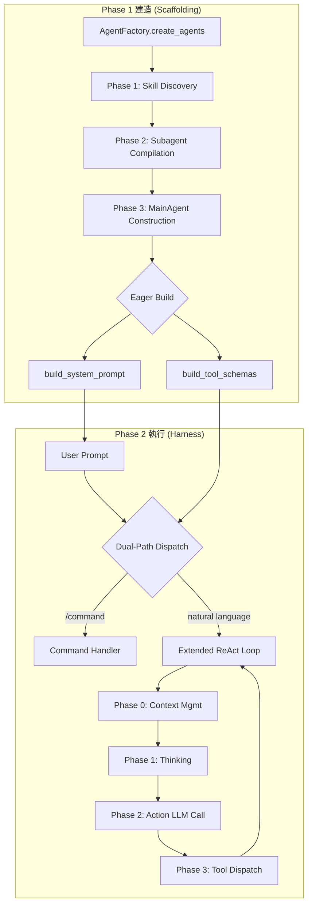
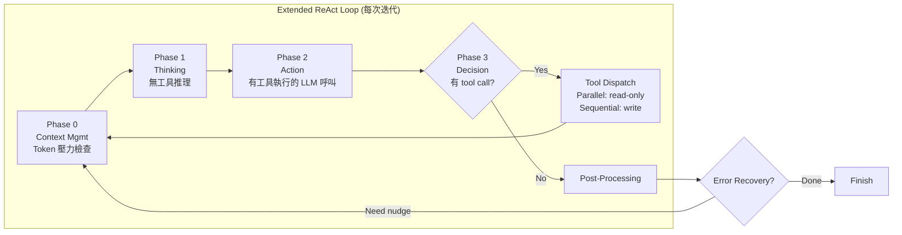
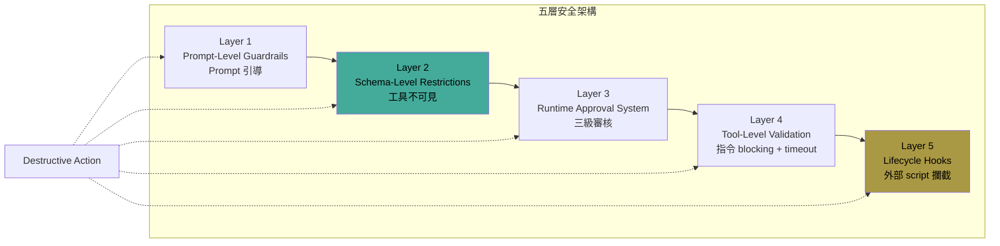
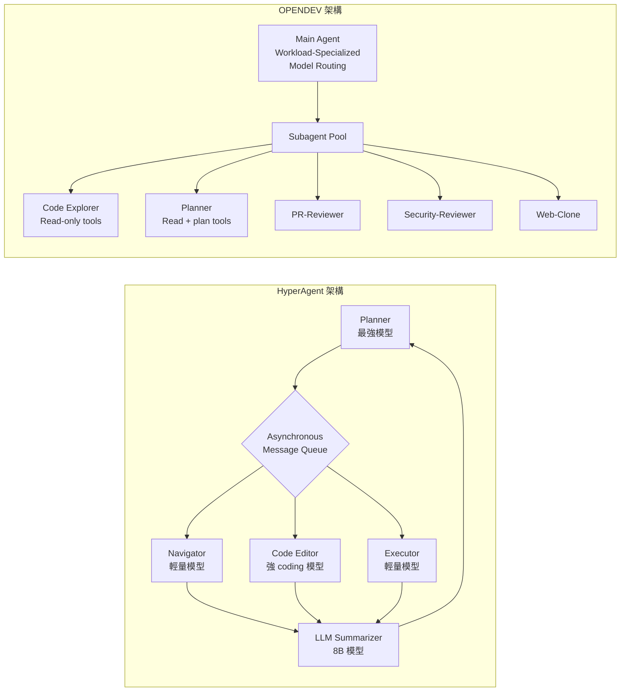

# OPENDEV: 為 Terminal 打造 AI Coding Agent 的 Scaffolding、Harness 與 Context Engineering

> **種子論文**: [Building Effective AI Coding Agents for the Terminal: Scaffolding, Harness, Context Engineering, and Lessons Learned](https://arxiv.org/abs/2603.05344) (2026-03)
> **作者**: Nghi D. Q. Bui
> **機構**: OpenDev

> **Dependency Paper**: [HyperAgent: Generalist Software Engineering Agents to Solve Coding Tasks at Scale](https://arxiv.org/abs/2409.16299) (2024-09)
> **作者**: Huy Nhat Phan, Tien N. Nguyen, Phong X. Nguyen, Nghi D. Q. Bui

---

## TL;DR

AI coding assistance 正從 IDE 插件轉向 terminal-native agent，但長時運行的 terminal agent 面臨 context window 有限、shell 指令安全風險、以及 prompt budget 被工具定義膨脹壓縮的三重挑戰。**OPENDEV** 是一個用 Rust 寫的開源 CLI coding agent，以 compound AI system 為核心設計哲學，透過 scaffolding（agent 建造階段）與 harness（執行階段）的明確分工，結合五階段漸進式 context compaction、defense-in-depth 安全架構、event-driven system reminders 與 workload-specialized 多模型路由，為 terminal-first 的 AI 輔助開發提供了完整的工程藍圖。與其 precursor **HyperAgent**（同作者群的 generalist multi-agent 系統）相比，OPENDEV 從 benchmark-oriented 框架轉向了真正面向互動式 terminal 使用的 agent 設計。

---

## 背景與動機

### Terminal-native agent 的崛起

過去幾年，AI coding assistant 一直緊密整合在 IDE 中，扮演需要人類持續監督的被動 copilot。然而，從 2025 年起，一場重大轉變開始發生：從複雜的 IDE 插件轉向更簡單的命令列介面。**Claude Code** 引領了這股潮流，證明 terminal-native agent 在真實軟體工程任務上可以達到甚至超過 IDE 整合工具的水準。

這個轉變並非偶然。Terminal 是軟體開發的運算核心——source control、build 系統、SSH 遠端 session、headless server 環境，全部圍繞 terminal 運作。早期的嘗試如 **Aider**、**CodeAct**、**Open Interpreter** 已經驗證了 terminal 式 AI pair programming 的可行性，但這些系統在面對真正長時、多步驟的開發任務時，暴露了三項根本性的工程挑戰：

1. **Context window 的有限性**：單一 session 可能包含數十輪 tool call 與大量輸出，遠超模型的 token budget
2. **Shell 指令的破壞性風險**：當 agent 可以執行任意 shell 指令時，一個失誤就可能導致資料遺失或系統損毀
3. **Capability 擴展的 prompt budget 壓力**：每加一個工具或 skill，system prompt 就膨脹一分，擠壓了實際對話可用的 token 空間

### 既有系統的不足

論文作者指出，現有系統大致分為兩類，但都留下缺口：

- **Benchmark-oriented 框架**（如 SWE-Agent、OpenHands）：有公開論文與清楚的架構設計，但主要設計目標是自動化評估而非互動式日常使用。OpenHands 雖然達到 production-grade 水準，但透過瀏覽器 UI 而非 terminal 介面操作
- **CLI-native agent**（如 Aider、Goose、OpenCode、Crush）：真正在 terminal 中運作，但缺乏公開的技術報告記錄其設計決策。Claude Code 是 CLI-native 但既非開源也沒有公開的技術報告

這意味著在 terminal-native 互動式 coding agent 的設計空間中，存在一個「封閉原始碼工業實踐 vs 開放學術討論」的缺口。OPENDEV 是第一個填補這個缺口的開源系統——它不僅是一個 production-ready 的 CLI agent，更是一份詳細的工程設計報告。

### 從 HyperAgent 到 OPENDEV 的脈絡

在探討 OPENDEV 之前，有必要先理解其重要的 precursor：**HyperAgent**。由相同作者群（Phan, Nguyen, Nguyen, Bui）在 2024 年 9 月發表，HyperAgent 採取的是 **centralized multi-agent** 架構——一個 Planner agent 作為唯一的決策中心，搭配 Navigator、Code Editor、Executor 三個子 agent 分別負責程式碼瀏覽、編輯、執行驗證。

HyperAgent 在 SWE-Bench Lite 上達到當時最佳 (SOTA) 的 26% 正確率，而且在 Defects4J 程式修復任務上以 192 correct fixes (22.9%) 超越所有既有方法。更重要的是，HyperAgent 證明了「不同 agent 角色可以使用不同層級的 LLM」——Planner 用最強的模型，Navigator 與 Executor 用輕量級模型——在不犧牲效能的前提下大幅降低成本（$0.45/task vs SWE-Agent 的 $2.55/task）。

然而，HyperAgent 的設計目標是「benchmark 上的通用 agent」，而非「terminal 中的互動式開發夥伴」。OPENDEV 繼承了 HyperAgent 中多 agent 分工與分層模型路由的概念，但將架構重心轉向了三個 HyperAgent 不曾深入處理的問題：**context engineering**（長 session 的 token 管理）、**safety**（shell 指令的防禦機制）、**scaffolding vs harness**（agent 建構與執行的明確分離）。

---

## 核心知識點

本文圍繞以下知識點展開。這些知識點構成了理解 terminal-native AI coding agent 的關鍵框架：

1. **Compound AI System 架構**——OPENDEV 的核心設計哲學：不是單一 LLM，而是多個 agent、workflow、tool 的結構化組合，每個元件各自獨立綁定不同模型
2. **Scaffolding vs. Harness**——建造階段（system prompt、tool schemas、subagent registry 的靜態組裝）與執行階段（tool dispatch、context management、safety enforcement 的動態調度）的明確分工
3. **Extended ReAct Execution Loop**——標準 ReAct 的延伸：Staged Compaction → Thinking → Self-Critique → Action → Tool Dispatch → Post-Processing
4. **Adaptive Context Compaction（五階段漸進壓縮）**——從 warning 到全量 LLM 摘要的漸進式 token 回收機制
5. **Defense-in-Depth Safety Architecture**——Prompt-Level → Schema-Level → Runtime Approval → Tool-Level → Lifecycle Hooks 五層安全架構
6. **Event-Driven System Reminders**——透過在決策點注入 user-role reminders 對抗 instruction fade-out
7. **Workload-Specialized Multi-Model Architecture**——五種模型角色（Action、Thinking、Critique、Vision、Compact），各自獨立配置與 fallback chain
8. **Centralized Multi-Agent (HyperAgent)**——單一 Planner + 多個執行子 agent，透過 asynchronous message queue 平行化
9. **從 HyperAgent 到 OPENDEV 的設計演進**——從 benchmark-oriented 到 interactive terminal-native 的典範轉移

---

## 方法詳解

### 知識點 1：Compound AI System 架構

OPENDEV 的第一個關鍵設計決策是，它不是一個 monolithic 的 LLM 呼叫，而是一個 **compound AI system**。這個概念由 Zaharia et al.（2024）提出：當今最先進的 AI 結果越來越多地來自於「組合多個模型、retriever、tool 的系統」，而非單一模型呼叫。

在 OPENDEV 中，這個原則體現在四個層級的階層式架構（圖 1）：

```
Session → Agent → Workflow → LLM
```

- **Session**：一個完整的開發對話，包含多輪 user query
- **Agent**：執行某個角色的 agent 實例（main agent 或 subagent）
- **Workflow**：agent 內部不同型態的執行流程（Execution、Thinking、Compaction）
- **LLM**：每個 workflow 可以獨立綁定使用者設定的模型

這個四層階層讓 OPENDEV 可以在 workflow 層級進行精細的模型選擇。舉例來說，Thinking workflow 可能使用 Claude Opus 或 DeepSeek-R1 進行深度推理，而 Compaction workflow 則使用 GPT-4o-mini 做輕量摘要——完全由使用者透過設定檔決定，不需修改程式碼。

### 知識點 2：Scaffolding vs. Harness

OPENDEV 最有架構價值的貢獻之一，是將 agent 的生命週期明確劃分為兩個階段：

#### Scaffolding（建造階段）

發生在 user prompt 到達之前，是 agent 的「靜態組裝」：

1. **BaseAgent 與 AgentInterface**：所有 agent 繼承自 BaseAgent（config、tool_registry、mode_manager 三個建構參數），定義四個抽象方法：build_system_prompt()、build_tool_schemas()、call_llm()、run_sync()
2. **Eager construction**：BaseAgent.__init__() 在建構子返回前就呼叫 build_system_prompt() 與 build_tool_schemas()，保證 agent 在完成建構時就完全準備好服務請求，沒有首次呼叫的延遲
3. **單一具體 agent 類別（MainAgent）**：沒有複雜的 class hierarchy——系統中的所有 agent（main agent、builtin subagents、使用者自訂 agent）都是 MainAgent 的實例。行為差異來自建構參數：allowed_tools（過濾 tool schema）、_subagent_system_prompt（prompt 覆寫）、is_subagent flag
4. **AgentFactory 三階段組裝**：Phase 1 發現 skills → Phase 2 編譯 subagents → Phase 3 建構 main agent。順序約束是 essential 的：Phase 2 必須在 Phase 3 之前完成，因為 spawn_subagent 的工具描述需要動態從已註冊的 agent 集合中產生

#### Harness（執行階段）

發生在 user prompt 到達之後，是 agent 的「動態運行」：

1. **ReAct Loop 中央執行引擎**（詳見知識點 3）
2. **七個支援子系統**：Prompt Composition Engine、Tool Registry、Safety System、Context Engineering、Memory & Session、Subagent Orchestration、Post-Processing
3. **Dependency injection**：AgentDependencies（7 個欄位）在運行時注入給 tool registry；subagent 收到輕量的 SubAgentDeps（3 個欄位），session_manager 被刻意省略以建立 isolation boundary

這個 scaffolding-harness 分離有一個務實的好處：scaffolding 是「一次性的建造」，harness 是「反覆的執行」，兩者可以獨立演化。你可以在不改變 tool execution 邏輯的情況下修改 agent 的 prompt 結構，反之亦然。



**圖 1：OPENDEV 的 Scaffolding 與 Harness 分工。左側是建造階段（agent 的靜態組裝），右側是執行階段（user prompt 的動態處理）。兩者透過 AgentFactory 產出的 agent instance 銜接。**

### 知識點 3：Extended ReAct Execution Loop

OPENDEV 的執行循環並非標準的 ReAct，而是有四個明確階段：

**Phase 0 — Staged Context Management**：每次迭代開始時，compactor 檢查 token 使用率（以 API 回報的 prompt_tokens 為基準，不用本地估計——因為本地估計系統性低估 provider 端注入）。根據壓力等級觸發不同層級的壓縮策略。

**Phase 1 — Thinking**：如果 thinking mode 啟用，executor 以一份「不含工具 schema 的對話副本」呼叫 thinking LLM。這個設計的關鍵在於：當工具 schema 不存在時，模型無法提早行動，因此可以專注於推理。四個可設定的 thinking depth 等級（OFF、LOW、MEDIUM、HIGH），HIGH 包含 self-critique——critique model 先評估 thinking trace，thinking model 再根據 critique 修正推理。

**Phase 2 — Action**：executor 組裝完整的 action prompt，包含 system prompt、memory bullets、tool schemas、對話歷史、thinking trace。呼叫 action model。

**Phase 3 — Decision、Dispatch、Doom-Loop Detection**：如果回傳包含 tool calls，透過 tool registry 調度——read-only tools 由 thread pool 平行執行（最多 5 個 concurrent calls），write tools 則順序執行。Doom-loop detection 使用 sliding window（20 次呼叫）與 MD5 fingerprinting：同樣的 (tool, args) 組合出現 ≥3 次就觸發警告。

表示式雖然簡單，但 doom-loop detection 比傳統的 iteration cap 或 consecutive-read counter 更 robust。它只偵測「同樣的 tool 用同樣的參數反覆呼叫」——這是 LLM 陷入循環的典型徵兆。



**圖 2：Extended ReAct Loop 的每次迭代流程。Phase 0（Context Management）在每次迭代開始時先檢查 token 壓力，Phase 1（Thinking）以無工具環境進行推理，Phase 2（Action）才讓模型看到工具。這樣的設計防止了模型過早行動。**

### 知識點 4：Adaptive Context Compaction（五階段漸進壓縮）

這可能是 OPENDEV 中最務實、最有工程價值的貢獻。Context compaction 不是一個二分的「要不要壓縮」決策，而是一連串漸進、成本遞增的減壓策略：

| 階段 | 壓力閾值 | 動作 | 成本 |
|------|---------|------|------|
| Stage 1 | 70% | 記錄 warning，不做資料縮減 | 無 |
| Stage 2 | 80% | Observation masking：將較舊的 tool 結果替換為約 15 tokens 的參考指標 | 低 |
| Stage 2.5 | 85% | Fast pruning：從最新訊息往回走，將舊結果替換為 `[pruned]` 標記 | 低 |
| Stage 3 | 90% | Aggressive masking：只保留最新的 tool outputs，其餘全部遮罩 | 中 |
| Stage 4 | 99% | Full compaction：整個 conversation 序列化到 scratch file，LLM-based summarizer 壓縮中間部分，保留最近訊息 | 高 |

「Stage 2.5」這個編號本身就暗示了這是在開發過程中發現的洞見——原本只有 4 個 stage，但 80%→90% 之間存在一個 gap，在 85% 加入 fast pruning 後，許多 session 不需要走到 full compaction。

量化數據顯示，這個機制可以減少約 54% 的峰值 context 消耗，在典型的 30 輪 session 中往往完全不需要 emergency compaction。

### 知識點 5：Defense-in-Depth Safety Architecture

OPENDEV 的安全設計遵循一個核心原則：**沒有任何單一安全機制是足夠的。** 因此採用了五層獨立的防禦架構，每一層針對不同抽象層級的失敗模式：

**Layer 1 — Prompt-Level Guardrails**：在 system prompt 中嵌入安全政策、action safety 指引、read-before-edit 規範、git workflow 規則。最脆弱也最靈活的層級——可以透過 prompt engineering 調整，但 LLM 可能忽略。

**Layer 2 — Schema-Level Tool Restrictions**：這是最強的防禦機制之一。關鍵洞見是：**並非「阻擋危險工具的使用」，而是讓危險工具對模型「不可見」**。如果某個 tool 不在 agent 的 tool schema 中，LLM 根本無法呼叫它，不需要任何 runtime check。Subagent 的 allowed_tools 列表在 schema 層級過濾，Plan Mode 下 write tools 完全不存在於 schema 中。

**Layer 3 — Runtime Approval System**：三種自主等級（Manual、Semi-Auto、Auto）。ApprovalRulesManager 包含四種規則類型：PATTERN（regex 匹配）、COMMAND（精確指令）、PREFIX（前綴匹配）、DANGER（自動拒絕）。預設的危險規則（rm -rf /、rm -rf *、chmod 777）永遠作用且不可覆寫。規則透過 JSON 檔案跨 session 持久化。

**Layer 4 — Tool-Level Validation**：DANGEROUS_PATTERNS blocklist（fork bombs、curl|bash pipe chains、dd to device files）、stale-read detection（檔案修改時間 vs 讀取時間 + 50ms tolerance）、output truncation、timeouts（idle 60s、absolute 600s）。

**Layer 5 — Lifecycle Hooks**：外部 script 可以在 agent 生命週期的 10 個事件點攔截或觀察。PreToolUse hook 可以硬性阻擋（exit code 2，無法被 prompt engineering 或 approval bypass）、修改 tool arguments（如注入 --dry-run）、或覆寫 approval decision。Blocking events 與 non-blocking events 分開處理。



**圖 3：五層獨立防禦安全架構。每一層在逐漸降低的抽象層級攔截危險操作。Layer 2（Schema-Level）是最強的防線——不存在的工具不會被呼叫。Layer 5（Lifecycle Hooks）是最底層的保險——即使 prompt 被繞過、schema 被誤用，外部 script 仍可硬擋。**

### 知識點 6：Event-Driven System Reminders

這是一個針對「long-horizon session 中 instruction fade-out（指令衰減）」的工程解法。作者觀察到，系統 prompt 的影響力在大約 30 次 tool call 後顯著衰減，導致以下典型失敗：

- 過早完成（premature completion）
- 放棄錯誤恢復
- 進入探索漩渦（exploration spirals）

解法是**在決策點注入短小、單一目的的 user-role 訊息**（不是 system role——user-role 的 compliance 明顯更好）。

Event detectors 監控 8 種條件：
1. Tool 失敗後沒有重試（6 種錯誤類別的特定模板）
2. 探索漩渦（連續 5 次以上 read-only 操作）
3. 被拒絕的工具重複嘗試
4. 在不完整 todo 的情況下過早完成
5. 在全部 todo 完成後仍繼續工作
6. Plan 批准後沒有跟進執行
7. 未處理的 subagent 結果
8. 空白的 completion 訊息

總共有 24 個 reminders，分成 6 個類別：Phase Control（4）、Task Lifecycle（5）、Todo Enforcement（2）、Error Recovery（8）、Behavioral（5）、JSON Retry（2）。

### 知識點 7：Workload-Specialized Multi-Model Architecture

OPENDEV 建立了五種 distinct 的模型角色，每一種可以在設定檔中獨立指定：

| 角色 | 用途 | Fallback |
|------|------|----------|
| **Action model** | 主要執行模型，負責 tool-based reasoning | 預設 |
| **Thinking model** | 無工具環境下的延伸推理 | Action model |
| **Critique model** | 自我評估，受 Reflexion 啟發但選擇性使用 | Thinking → Action |
| **Vision model** | 處理截圖與圖片的 VLM | Action model（需支援 vision） |
| **Compact model** | 上下文壓縮時的摘要用，優先速度和成本 | Action model |

這個架構考慮了三種方案：單一模型（簡單但缺乏彈性）、task-specific routing（被採用的方案）、ensemble execution（品質最佳但延遲和成本不可接受）。

模型能力的 metadata（context length、vision support、reasoning features）本地快取，使用 stale-while-revalidate 模式（24h TTL），保證離線啟動。

### 知識點 8：HyperAgent 的 Centralized Multi-Agent 架構

作為 OPENDEV 的 direct precursor，HyperAgent 採取不同的架構設計——**集中式 multi-agent 系統**：

- **Planner agent**：唯一的決策中樞。使用最強大的 LLM（Claude 3.5 Sonnet / GPT-4o / Llama-3-70B），負責產生策略、委派子任務、處理回饋
- **Navigator agent**：輕量級 agent（Claude Haiku / Llama-3-8B），負責高效率的程式碼庫資訊檢索。工具包括 Zoekt trigram engine 搜尋、ctags 符號解析、LSP-based go_to_definition
- **Code Editor agent**：需要強 coding 能力的模型，負責跨檔案的程式碼修改。具備 auto-repair 機制（自動修正縮排與語法錯誤）
- **Executor agent**：輕量級模型，負責複現問題、執行測試、驗證解決方案。在 Docker container 中運作以達到環境隔離

通訊使用 **asynchronous message queue**，搭配一個 8B 的輕量 LLM summarizer 來壓縮子 agent 的執行日誌，再餵回給 Planner。這個設計的關鍵優點是：

1. **平行執行**：多個 Navigator 可以同時探索程式碼庫的不同部分
2. **動態任務分發**：失敗任務自動重新排隊
3. **水平擴展**：獨立的 agent 可以獨立擴充
4. **decoupled 架構**：Planner 與子 agent 可以獨立調配資源

實驗結果顯示，HyperAgent-Full-1 在 SWE-Bench Verified 上達到 33.00%（SWE-Agent+Sonnet 為 33.60%），在 SWE-Bench Lite 上達到 26.00%（SOTA 第一）。更重要的是，HyperAgent-Lite-1 平均每個任務僅需 $0.45 與 106 秒——這要歸功於不同角色使用不同層級的模型。

在 Defects4J 上，HyperAgent 以 192 correct fixes（22.9%）超越 RepairAgent（164）、SelfAPR（110）、ITER（57），涵蓋兩個版本的 835 個 bug。



**圖 4：HyperAgent 與 OPENDEV 的架構對比。HyperAgent 採用單一 Planner 搭配 asynchronous message queue 的子 agent 平行執行；OPENDEV 則以 Main Agent 為核心，透過 workload-specialized model routing 直接在 agent 層級區分不同任務，subagent 是選擇性而非強制的委派機制。**

### 知識點 9：從 HyperAgent 到 OPENDEV 的設計演進

比較兩者的設計哲學，可以清楚看到從 benchmark-oriented 到 interactive terminal-native 的典範轉移：

| 設計維度 | HyperAgent | OPENDEV |
|----------|-----------|---------|
| 主要目標 | SWE-Bench 等標準化 benchmark | 互動式 terminal 開發 |
| Agent 組織 | 強制 multi-agent（Planner + 3 子 agent） | 可選 subagent dispatch（最多 8 種） |
| 模型策略 | 角色固定（1 強 + 3 弱） | 5 種角色各自獨立配置（使用者自訂） |
| Context 管理 | 訴諸輕量 summarizer 壓縮 agent 日誌 | 五階段漸進式 compaction（工程優先） |
| 安全機制 | Docker container 環境隔離 | 五層 defense-in-depth（schema-level 最強） |
| Tool 設計 | LLM-friendly 介面設計（proximity search、auto-repair） | 9-pass fuzzy matching chain、registry-based 註冊 |
| 執行模式 | 批次任務（問題復現 → 修復 → 驗證） | 互動式 ReAct loop（thinking + action 分離） |
| 架構語言 | Python | Rust |
| 主要成本 | $0.45/task（Lite 配置） | N/A（terminal-native，token cost 由使用者直接承擔） |

OPENDEV 保留了 HyperAgent 中多種角色使用不同模型的洞見，但做了兩個關鍵改變：

1. **從強制轉為可選**：HyperAgent 要求系統必須使用 multi-agent 架構（Planner + Navigator + Editor + Executor），而 OPENDEV 將 subagent 定義為選擇性的委派機制，main agent 本身就有完整的執行能力
2. **從 benchmark 轉向互動**：HyperAgent 的設計圍繞「複現 bug → 定位 → 修復 → 驗證」的批次流程，而 OPENDEV 的 ReAct loop 設計圍繞「使用者輸入 → 思考（可選）→ 行動 → 觀察」的互動循環

---

---

## 深入解析：Extended ReAct Loop 演算法與 Doom-Loop 偵測

OPENDEV 的執行核心以 Algorithm 1 呈現。以下將虛擬碼轉譯為中文解讀：

```
Algorithm 1: Extended ReAct Loop with Five-Stage Compaction
            and Doom-Loop Detection

Require: User message m, Agent A, Tool registry T, Session S
Ensure: Response summary, error status, latency

1: S.add(m); nudge_count ← 0; fingerprints ← deque(maxlen=20)

2: repeat
3:   // Phase 0: Staged Context Management
4:   p ← token_count(S) / max_context          ← Context pressure
5:   if p > 0.99 then S ← compact(S)           ← Full LLM summarization
6:   else if p > 0.85 then prune_old_tool_outputs(S)  ← Fast pruning
7:   else if p > 0.80 then mask_old_observations(S)   ← Observation masking
8:   else if p > 0.70 then log_warning(p)
9:   end if

10:  // Phase 1: Thinking (if enabled)
11:  if thinking_level ≠ OFF then
12:    trace ← A.call_thinking_llm(S)           ← No tools
13:    if thinking_level = HIGH then
14:      critique ← A.call_critique_llm(trace)
15:      trace ← A.refine(trace, critique)
16:    end if
17:    S.add_trace(trace)                       ← Visible to action phase
18:  end if

19:  // Phase 2: Action
20:  response, tool_calls ← A.call_llm(S, T)   ← With tools

21:  // Phase 3: Decision & Dispatch
22:  if tool_calls = ∅ then
23:    if nudge_count < 3 and needs_recovery(S) then
24:      inject_nudge(S); nudge_count++
25:    else
26:      break                                 ← Completion
27:    end if
28:  else
29:    fingerprint ← hash(tool_calls)
30:    fingerprints.append(fingerprint)
31:    if fingerprints.count(fingerprint) ≥ 3 then
32:      inject_warning(S, "doom-loop detected")
33:      skip_execution(fingerprint)
34:    end if
35:    for each tool_call in tool_calls do
36:      if is_read_only(tool_call) then
37:        parallel_execute(tool_call)           ← Thread pool (max 5)
38:      else
39:        sequential_execute(tool_call)
40:      end if
41:    end for
42:  end if
43: until iteration_count ≥ safety_limit or break

44: check_incomplete_todos(S)
45: persist_session(S)
46: return final_response
```

這個演算法有幾個值得注意的設計細節：

**Staged compaction（行 5–8）**：壓力檢查在每次迭代開始時進行，而非只在工具執行後。這是因為 tool output 可能大幅推升 token 使用量。五個 threshold（70%、80%、85%、90%、99%）是 real-world 使用經驗的產物——70% 只記錄 log，到了 85% 才開始刪除資料（pruning），99% 才使用高成本的 LLM summarization。

**Thinking phase 的注入（行 17）**：thinking trace 不是直接回傳給使用者，而是以 `system-reminder` 的形式注入到 action phase 的對話中。這意味著 action model 可以看到 thinking trace，但使用者不會被中斷。

**Doom-loop fingerprinting（行 29–34）**：每組 tool call 的 fingerprint 是 (tool_name, args) 的 MD5 hash。sliding window 為 20。≥3 次相同的 fingerprint 時，不是直接中斷執行，而是先注入 `[SYSTEM WARNING]` 訊息讓 agent 有自我修正的機會。如果同樣的 fingerprint 在警告後繼續出現，角色升級到 ApprovalManager 詢問使用者「Allow/Break?」。

**Completion 的四條件（行 22–27, 43）**：agent 可以透過四種方式終止循環——(1) implicit completion：回傳純文字且無 tool calls；(2) explicit completion：透過 task_complete tool 宣告完成；(3) nudge budget exhausted：error recovery 最多 3 次重試；(4) safety iteration cap：達到安全迭代上限。

---

## 深入解析：Tool System 詳解

OPENDEV 的 tool 系統是 agent 與環境互動的核心介面，有 35 個 built-in tools 分佈在 12 個 handler categories 中。這裡詳細解析最具 OPENDEV 特色的幾個工具設計。

### edit_file：9-pass Fuzzy Matching Chain

編輯工具是任何 coding agent 最關鍵的 tool。LLM 幾乎永遠無法給出精確的 old_string 匹配——縮排差一個空格、結尾多一個換行、或是轉義符號不一致，都會導致編輯失敗。

OPENDEV 的解法是一個 chain-of-responsibility pattern：9 個 replacer classes，每個處理特定類型的 mismatch，短路式——精確匹配在 pass 1 就返回，零 overhead：

1. **Simple**：精確字串匹配（baseline）
2. **Line-trimmed**：每行尾端空白消除後比較
3. **Block-anchor**：以首尾行作為 anchor，中間區域用 SequenceMatcher（0.3 similarity threshold）
4. **Whitespace-normalized**：所有連續空白壓縮為單一空格
5. **Indentation-flexible**：忽略所有前綴空白，跳過空白行
6. **Escape-normalized**：解碼常見轉義序列（\n、\t、\\）
7. **Trimmed-boundary**：先試 trimmed content，若部分匹配則擴展到完整行邊界
8. **Context-aware**：以首尾非空行作為 anchor，所有候選區域以 0.5 similarity threshold 評分
9. **Multi-occurrence**：最後手段——trimmed line-by-line exact match 掃描所有出現位置

每個 replacer 返回的是**在原始檔案中找到的實際子字串**（而非 LLM 提供的搜尋字串），確保編輯不會因為縮排格式差異而破壞原始檔案的格式化。

### Shell Execution Pipeline（六階段）

Shell execution 經過六個階段才能實際執行指令：

1. **Safety gates**：三個檢查——permission configuration 判斷是否需要審批、allowed-command matching 檢查安全模式、dangerous pattern blocking 擋下災難性操作
2. **Command preparation**：對已知的套件管理器指令（npm init、npx）自動預填 yes |；Python 指令自動加上 PYTHONUNBUFFERED=1
3. **Server detection**：16 條 regex pattern 自動判別伺服器指令（flask run、uvicorn、npm start、rails server 等），自動 promotion 到背景執行
4. **Execution fork**：背景指令使用 pseudo-terminal（pty.openpty() + Popen），前景指令使用 subprocess.Popen 搭配 start_new_session=True 確保 process group isolation
5. **Output management**：30,000 字元 cap（head-tail truncation：前 10,000 + 後 10,000）。select.select() 以 100ms 間隔 polling
6. **Timeout handling**：idle timeout: 60 秒無輸出；absolute timeout: 600 秒。InterruptToken 每次 polling 週期檢查，觸發時透過 os.killpg() 終止整個 process group

### MCP Lazy Discovery

Model Context Protocol (MCP) 的外部工具是 OPENDEV 的 extensions 機制。設計決策是 **lazy discovery**——初始 context 中完全沒有任何外部工具 schema。Agent 需要時透過 search_tools(query) 查詢，這個工具從已註冊的 MCP tool 名稱與描述中比對關鍵字（名稱匹配 = 2pts、描述匹配 = 1pt）。

三種 detail levels：names（只回傳名稱）、brief（名稱 + 描述）、full（完整 schema）。

直接呼叫特定 MCP tool 時（以 qualified name 如 mcp__github__create_issue），auto-discovers 不需要先 search。

這個設計將 MCP 的 startup context 成本從 40% 降到 <5%——因為只有當 agent 真正需要某個 MCP tool 時，其 schema 才被載入 context。

### Skills 系統：Two-Phase Loading

OPENDEV 的 skill 系統與 MCP 類似但針對 prompt templates：

- **Phase 1（startup）**：只掃描 YAML frontmatter，建立 metadata index（name、description、tags、use-when）
- **Phase 2（on-demand）**：agent 呼叫 invoke_skill 時，才從檔案系統載入完整 markdown content
- **Deduplication cache**：同一個 skill 在 session 中只載入一次

Skills 有三層 tier：built-in（內建於 OPENDEV 安裝目錄）→ user-global（~/.opendev/skills/）→ project-local（專案目錄下 .opendev/skills/）。最終層級的 skill 覆蓋較低層級的同名 skill。

### LSP Semantic Code Analysis（語意程式碼分析）

OPENDEV 支援 LSP (Language Server Protocol) 整合，透過 Solid Language Server 實現四層架構：Agent Tool Layer → Symbol Retriever → LSP Server Wrapper → Solid Language Server。

六個 LSP 工具：find_symbol、find_referencing_symbols、rename_symbol、replace_symbol_body、insert_before_symbol、insert_after_symbol。其中 replace_symbol_body 與 insert_* 屬於「語意感知的編輯」——不是修改文字內容，而是修改 AST 節點。

NamePathMatcher 支援三種匹配模式：exact（`MyClass.method`）、partial path（`.method`）、wildcard（`My*`）。這解決了 LLM 無法輸出精確路徑的問題——wildcard 允許 agent 用模糊名稱找到目標。

**兩層 cache system**：Level 1 快取原始 LSP responses（避免重複查詢），Level 2 快取處理後的 symbol tree（加速結構分析）。兩層 cache 都以 MD5 file content hash 為 key，cache 檔案位於 `.solidlsp/cache/<language_id>/`。version field 用於 cache invalidation。

支援超過 30 種語言的 LSP server（從 Python(Pyright)、TypeScript(tsserver)、Rust(rust-analyzer) 到 Zig(zls)、OCaml(ocamllsp) 等），全部以 JSON-RPC 2.0 over stdio 通訊。每個語言一個 server，lazy initialization，singleton pool 搭配 liveness check 與 transparent restart。

### Batch Execution 與平行化

batch_tool 允許 agent 在一次 response 中指定多個工具呼叫。Execution mode（parallel/sequential）由 agent 自行選擇，因為只有 agent 知道 tool calls 之間的 dependency。系統曾嘗試自動偵測 dependency，但發現不可靠——有些無關的 tool calls 可能操作同一個 file path，而相關的 tool calls 可能操作不同檔案。

**Automatic parallelization**：當 agent 在單一 response 中發出多次 spawn_subagent 呼叫時，系統自動以 asyncio.gather 平行執行。Code Explorer 與 Security-Reviewer 可以同時運行，無需 agent 自行管理平行化。

---

## 深入解析：Prompt Composition 系統

OPENDEV 的 system prompt 不是一個靜態的文字塊，而是由 21 個獨立的小節動態組裝而成：

```
Filter → Sort → Load → Join
```

每個小節有：
- **Condition predicate**：一個執行時的 context 判斷式，決定此小節是否載入
- **Priority**：排序依據（數值越小越優先）

21 個小節分為五個 tier：

| Tier | 小節數 | 內容 |
|------|--------|------|
| Core Identity | 3 | mode-awareness、tone-and-style、no-time-estimates |
| Tool Definitions | 3 | available-tools、tool-selection、code-quality |
| Safety & Rules | 5 | security-policy、interaction-pattern、action-safety、read-before-edit、error-recovery |
| Provider-Specific | 3 | provider-openai、provider-anthropic、provider-fireworks（互斥） |
| Dynamic Context | 7 | subagent-guide、git-workflow、task-tracking、output-awareness、scratchpad、code-references、reminders-note |

Thinking mode 只有 4 個小節——工具使用與程式碼品質的指引被刻意省略，因為它們在推理階段只會干擾注意力。

**變數替換**：小節中使用 `${VAR}` placeholder，由 PromptVariables registry 在 render 時解析。這將 prose 與 tool 命名 decouple——例如 `${EDIT_TOOL.name}` 指向 `edit_file`，修改 tool 名稱時不需要改寫所有小節的文字。

**雙層 fallback**：如果某個小節檔案遺失，composer 跳過它繼續。如果 templates 目錄完全不存在，fallback 到 monolithic core template——保證在部分部署的情境下 agent 仍可啟動。

**Provider-level prompt caching（Anthropic）**：compose_two_part() 將小節分為 stable（cacheable）與 dynamic 兩部分。Stable 部分（約 19 個小節，佔 prompt 的 80–90%）加上 cache_control header，在 multi-turn session 中快取。這使得輸入 token 成本降低約 88%。

---

## 深入解析：Dual-Memory Architecture 與 ACE Pipeline

OPENDEV 的記憶系統分為兩層：

### Episodic Memory（情節記憶）

LLM 生成的對話歷史摘要，包含策略性脈絡、目標、關鍵發現、檔案路徑。每 5 則訊息重新生成一次（非增量式——防止 summary drift），固定最大值 500 字元。

### Working Memory（工作記憶）

最近 6 輪 exchange 的完整內容（可設定 exclude_last_n）。保留立即決策所需的操作細節。

### Pipeline 架構（ACE: Agentic Context Engineering）

ACE 是一個四階段的經驗驅動 pipeline（受 Context Engineering 2.0 啟發）：

**Stage 1 — BulletSelector**：從 playbook 中選取相關 bullet。評分機制是加權組合：effectiveness (0.5) + recency decay (0.3) + cosine similarity of cached embeddings (0.2)。最高分的 bullets 被注入 Generator 的 system prompt。

**Stage 2 — Reflector**：每 5 則訊息執行一次。分析累積的經驗，產出：reasoning trace、error identification、root-cause analysis、correct approach。distill 成 bullet-level 的 effectiveness tags（helpful / harmful / neutral）。

**Stage 3 — Curator**：讀取 reflection 結果，規劃具體的 mutation（add、update、tag、remove）。輸出 DeltaBatch。

**Stage 4 — Mutation Application**：DeltaBatch 中的 mutations 被應用到 Playbook 的 bullet table。持久化到 session-scoped JSON 檔案中。

這個 pipeline 的設計意涵是：**agent 的能力應該隨著使用經驗逐步改善**，而不是每次 session 都從零開始。Playbook 中的 bullets 累積了過去 successful 的行為模式，讓 agent 在類似情境下更有效率。

---

## 深入解析：HyperAgent 的實驗架構與消融

HyperAgent 的實驗設計提供了幾項重要洞見。

### 消融實驗（Ablation Study）

| 配置 | SWE-Bench Lite | Cost | 時間 |
|------|---------------|------|------|
| HyperAgent-Full-1（全部角色） | **26.00%** | $0.45 (Lite) | 106s (Lite) |
| 移除 Navigator | 12.00%（↓14pp） | — | — |
| 移除 Code Editor | 19.00%（↓8pp） | — | — |
| 移除 Executor | 22.00%（↓5pp） | — | — |

從上表可以看出一個清晰的趨勢：**程式碼探索能力（Navigator）是 agent 效能的關鍵瓶頸**，其影響遠大於編輯或驗證能力。這是因為在真實的 issue resolution 場景中，80% 以上的時間花在「找到應該修改的檔案與位置」，而非實際修改本身。

### 分角色模型配置的 cost 影響

| 角色 | Full-1 使用的模型 | Lite-1 使用的模型 | Cost 差異 |
|------|------------------|-------------------|-----------|
| Planner | Claude Sonnet (強) | Claude Sonnet (強) | 相同 |
| Navigator | Claude Haiku (弱) | Claude Sonnet (同 Planner) | ↑ |
| Editor | Claude Sonnet (強) | Claude Sonnet (同 Planner) | 相同 |
| Executor | Claude Haiku (弱) | Claude Sonnet (同 Planner) | ↑ |

有趣的是，Lite-1 的 Accuracy 不如 Full-1（30.20% vs 33.00%），但成本反而不高（$0.45/task）——這是因為 Lite-1 只有 1 個 Agent Instance，而 Full-1 有 3 個。**平行執行的 agent 越多，潛在的 quality 越高，但 token 成本也被 multiplier effect 放大**。

### 從 HyperAgent 到 OPENDEV 的未解問題

HyperAgent 在某些任務上的表現揭示了 multi-agent 架構的限制。最典型的是 **RepoExec 的 Pass@5（53.33%）遠高於 Pass@1（38.33%）**——這表示 agent 經常「知道正確的做法但第一次就失誤」，需要在多次嘗試中才能成功。OPENDEV 透過 doom-loop detection + error recovery nudges 來緩解這個問題，但成效需要量化評估確認。

在 Defects4J 的故障定位中，HyperAgent 的 Acc@1 達到 59.70%，意即約 40% 的 bug 在第一次定位嘗試就失敗。這主要是因為 LLM 對精確的行號/列號輸入處理不佳——go_to_definition 需要精確的檔案位置，但 LLM 輸出的位置資訊常常有 ±1–3 行的誤差。HyperAgent 透過 proximity search 來處理，但這是 workaround 而非根本解法。OPENDEV 的 LSP-based 架構（透過 NamePathMatcher 支援 exact、partial path、wildcard 三種匹配模式）是更根本的解法。

### 1. Context Pressure as the Central Design Constraint

- **Tool outputs 佔據 context 的 70–80%**——這意味著壓縮 tool outputs 比壓縮對話本身更有效。在一輪典型的 interaction 中，agent 可能會 read_file（數 KB）、search（數 KB）、run_command（數十 KB），然後才產生最終答案。對話本身的使用者提問與 agent 回應反而只佔 context 的一小部分
- **將 context 視為預算，而非緩衝區**——漸進式壓縮階段優於單一的 emergency compaction。如果在 token 使用率 70% 時就開始管理，通常不需要走到 99% 的 full compaction（約 54% 的減少率已經足夠）
- **將大型輸出 offload 到檔案系統**——≥8,000 chars 的 tool output 自動寫入 scratch file，以 500-char preview + reference path 取代。這把一個 linearly growing context 問題轉化為成本更低的 retrieval 問題（agent 需要完整內容時可以 read_file）
- **以 API 回報的 token 數為校準基準**——本地估計系統性低估 token 使用量，因為 provider 端會注入 cache control keys、system prompts 等 overhead。OPENDEV 的開發者發現「本地估計 × 1.3」是經驗校正係數
- **Structure prompts for caching**——在 Anthropic 的 API 上，將 system prompt 分為 stable prefix（19 個可快取小節）與 dynamic suffix（2 個不可快取小節），節省約 88% 的 input token 成本
- **Regenerate summaries periodically, not incrementally**——episodic memory 每 5 則訊息重新生成，而非逐步累加。逐步累加的摘要會隨對話增長產生 summary drift，頭幾則訊息的影響力會慢慢被稀釋。週期性重生成從原始對話重頭產生摘要，規避了這個問題

### 2. Steering Behavior Over Long Horizons

- **在決策點注入 reminders 比放在 system prompt 中更有效**——user-role reminders at maximum recency > system prompt sections。作者實驗發現，經過 30 次 tool call 後，system prompt 的影響力已顯著衰減，但同一輪中緊接在 tool output 後的 user-role reminder 仍有高 compliance
- **將 thinking 與 action 分離**——關鍵不是 instruction 要求 model 不要行動，而是 tool schema 不存在讓 model 無法行動。OPENDEV 的 thinking phase 使用一份「不含工具 schema 的對話副本」，這從根本上消除了 premature action 的可能，因為模型不可能呼叫它看不到的工具
- **為 tool selection 提供具體的決策樹**——抽象的指引不如具體的判斷標準。例如「subagent-guide」小節中不是寫「在適當的時候使用 subagent」，而是列出 8 種 subagent 類型各自的 Use Case、何時不該用、以及與其他工具的取捨關係
- **Provider-conditional prompt sections**——同一份 system prompt 不應該同時包含 OpenAI 的 function calling 格式與 Anthropic 的 tool_use 格式。三個 provider-specific 小節（openai、anthropic、fireworks）是互斥的，只有當前激活的 provider 對應的小節會載入
- **Separate agent construction from execution**——scaffolding（一次性建造）與 harness（重複執行）的明確分離讓兩者可獨立演化。修改 prompt 結構不需要修改 tool execution 邏輯，反之亦然

### 3. Safety Through Architectural Constraints

- **Schema gating 在根本上比 runtime check 更可靠**——不存在的工具不可能被呼叫，這是最強的防線。Subagent 的 allowed_tools 清單在 schema 層級過濾：如果某個 tool 不在 subagent 的 schema 中，LLM 根本無法產生該 tool 的 function call，不需要 runtime 的權限檢查。Plan Mode 下 write tools 完全不存在於 schema 中，這是為何 PLAN 模式可以完全杜絕誤修改
- **五層獨立防禦**：每個 layer 針對不同的 failure mode 設計，且獨立運作。Layer 1（Prompt）被 bypass 了，Layer 2（Schema）可能仍會擋下。Layer 2 被繞過了，Layer 3（Approval）還需要使用者確認。這不是 redundancy——這是 defense-in-depth。每一層都假設前面的層級已經失靈
- **Approval persistence 防止疲勞**：使用者的審批決策（例如「允許 git push」）會持久化到 JSON 檔案中跨 session 生效，避免每次執行相同操作都詢問。但危險操作（DANGER rule type）永遠不會被持久化，每次都需要重新審批
- **Stale-read detection**：FileTimeTracker 在每次 read_file 時記錄該檔案的修改時間。在 edit_file 執行前，assert_fresh() 檢查 os.path.getmtime() 是否與 read 時間一致（+50ms tolerance）。如果檔案在 read 之後被外部修改，編輯被拒絕，避免 overwrite 外部變更。threading.Lock 用在每個檔案路徑上，實現 concurrent write serialization
- **Modal priority during interrupt**：當 agent 正在執行但使用者按下中斷時，先檢查是否有未完成的 modal dialog（ask-user 對話框、plan approval 畫面）。如果有，中斷不執行，因為關閉 modal 後使用者可能改變主意。這個修復解決了「中斷 → orphaned UI state」的 race condition
- **Process group isolation**：run_command 使用 start_new_session=True 建立獨立的 process group，確保 kill 可以透過 os.killpg() 終止所有 child processes。這不是一個 trivial 的決策——沒有 process group isolation 的話，kill 只會終止父行程，但子行程（如 npm install 中的 child processes）會變成 zombie 繼續執行

### 4. Designing for Approximate Outputs

- **9-pass fuzzy matching chain**——LLM 的輸出幾乎永遠不會精確符合期待，因此編輯工具需要多層次的模糊匹配策略
- **Auto-promote server-like commands**——透過 16 條 regex pattern 自動判別哪些指令應在背景執行
- **Auto-install missing dependencies**——首次使用 tool 時自動安裝缺失的依賴

### 5. Lazy Loading and Bounded Growth

- **MCP lazy discovery**：將 startup context 從 40% 降到 <5%
- **Skills two-phase loading**：啟動時只掃描 metadata index，需要時才載入完整內容
- **每個會隨 session 長度增長的資源都必須有上限**：iteration limits（15）、undo history（50 ops）、concurrent tool calls（5）、nudge budgets（3）
- **偏好實驗調整而非第一原理計算**：70% compaction trigger、3 nudge attempts、6 thinking depth levels 全部來自迭代失敗分析。論文的作者坦承：「the specific values for caps resist first-principles calculation」
- **Self-healing indexes**：session index 和 MCP tool cache 都設計為可自動重建。如果 index 遺失或損壞，系統從底層資料重新掃描產生——index 只是效能優化，不是單點故障

---

## 實驗結果

OPENDEV 本身在論文撰寫時尚未有正式的量化評估（論文將其列為未來工作），但其 engineering 決策與量化指標值得記錄：

| 機制 | 量化結果 |
|------|---------|
| Staged compaction | 減少 ~54% 高峰 context 消耗；30 輪 session 通常不需 emergency compaction |
| MCP lazy discovery | Startup context 從 40% 降至 <5% |
| Prompt caching (Anthropic) | 快取部分節省 ~88% input token 成本 |
| Tool output offload | ≥8,000 chars 自動分流到 scratch file |
| Edit fuzzy matching | 9-pass chain，短路式——精確匹配零 overhead |

HyperAgent 的量化結果作為對比 baseline：

| 任務 | HyperAgent | 最佳 Baseline |
|------|-----------|---------------|
| SWE-Bench Verified | 33.00% (Full-1) | 33.60% (SWE-Agent+Sonnet) |
| SWE-Bench Lite | **26.00% (Full-1, SOTA)** | 24.30% (Agentless+GPT-4o) |
| Defects4J v1.2 (correct fixes) | **82 (20.8%)** | 74 (RepairAgent, 18.7%) |
| Defects4J v2 (correct fixes) | **110 (25.0%)** | 90 (RepairAgent, 20.5%) |
| Fault localization Acc@1 | **59.70%** | 51.00% (AutoFL) |
| RepoExec Pass@1 | 38.33% | 42.93% (CodeLlama-34b w/ full context) |
| 平均執行時間 | **106s (Lite)** | 720s (AutoCodeRover) |
| 平均成本 | **$0.45 (Lite)** | $2.55 (SWE-Agent+GPT-4o) |

這些數據有兩個值得注意的趨勢：

1. **成本效能比率**：HyperAgent-Lite 的成本僅 $0.45，卻達到 30.20%（Verified），不到 SWE-Agent+GPT-4o 的六分之一成本，效能卻高出 7 個百分點。這是因為 Navigator 和 Executor 使用輕量模型，只有 Planner 和 Editor 使用強模型

2. **消融實驗的洞見**：移除 Navigator 造成的效能下降最大（27% → 12%），其次是 Editor（27% → 19%）和 Executor（27% → 22%）。這顯示「程式碼探索能力」是 agent 效能的關鍵瓶頸，甚至比編輯或驗證能力更重要

---

## 總結、限制與未來方向

### 核心要點

OPENDEV 是一個生產就緒的開源 CLI coding agent，它對 AI coding agent 工程領域的貢獻不在於演算法創新，而在於提供了第一份 open-source terminal-native interactive agent 的完整工程設計報告。其設計的核心貢獻是：

1. 將 Scaffolding（建造）與 Harness（執行）明確分離
2. 五階段漸進式 context compaction 取代二分法的壓縮策略
3. 五層 defense-in-depth 安全架構（schema-level 是最強防禦）
4. Workload-specialized 多模型路由（5 種角色自行配置）
5. Event-driven system reminders 對抗 long-horizon 的 instruction fade-out
6. 條件式、可快取的 prompt composition 系統

### 已知限制

論文誠實地列出了未來工作的方向，這也暗示了當前限制：

1. **缺乏定量評估**：OPENDEV 在論文撰寫時尚未在 SWE-Bench、Terminal-Bench、LongCLI-Bench 等標準化 benchmark 上進行系統性評估——這與 HyperAgent 形成了鮮明對比
2. **Adaptive resource allocation**：當前的 compaction thresholds 是固定的（70%、80%、85%、90%、99%），尚未實現動態調整
3. **Memory pipeline 的擴展性**：ACE 的 playbook bullet scoring 使用固定的權重（effectiveness 0.5、recency decay 0.3、semantic similarity 0.2），跨專案轉移與主動學習仍是開放問題
4. **Multi-agent coordination**：目前的 subagent 採用 hierarchical delegation（主 agent 委派子 agent），尚未實現 peer-to-peer、shared blackboard、negotiation 等更複雜的多 agent 協調模式
5. **Learned reminder optimization**：24 個 system reminders 的觸發時機和頻率是手動設定的，尚未使用 RL 進行學習優化

### HyperAgent 的限制（作為參考）

HyperAgent 也有其特定的限制：

1. **Early exit hallucination**：Planner 有時認為任務已解決（但實際上並未解決），這是 inter-agent 通訊中資訊損失造成的
2. **Edit-failed loops**：雖然比 SWE-Agent 好（因為有 auto-repair），但仍會發生編輯失敗後的反覆重試
3. **LLM 對精確位置輸入的處理不佳**：go_to_definition 需要精確的行號/列號，雖然透過 proximity search 緩解但未完全解決

### 未來方向

從 OPENDEV 的設計中可以看出 terminal-native AI coding agent 的幾個發展方向：

- **Quantitative evaluation**：在 SWE-Bench、Terminal-Bench、LongCLI-Bench 等標準化 benchmark 上，與 Claude Code、Aider、Goose、OpenCode 等系統進行公平比較。這是最重要也最直接的下一步——沒有量化數據，就無法驗證 OPENDEV 的設計決策是否確實有效
- **Adaptive resource allocation**：當前的 compaction thresholds 與 nudge budgets 是固定的經驗值。理想的做法是讓系統根據歷史 session 的行為模式，動態調整這些參數——例如，對經常跑大專案的使用者提高 compaction threshold，對偏好深度思考的使用者降低 thinking mode Cost
- **Scaling the memory pipeline**：ACE pipeline 目前只作用於單一 session 的 playbook bullets。下一步是跨專案轉移（在專案 A 學到的 pattern 能用於專案 B）、階層式 bullets（將具體 pattern 抽象為通用策略）、主動學習（agent 不確定時主動詢問使用者以累積 knowledge）
- **Structured code representations**：目前 OPENDEV 對程式碼的理解停留在 flat file 層級（ripgrep、ast-grep）。整合 dependency graphs、call graphs、project-level ontologies 可以提供更高層次的語意理解
- **Multi-agent coordination beyond hierarchical delegation**：目前的 subagent 採用 hierarchical delegation（主 agent 委派子 agent），但更複雜的模式如 peer-to-peer（子 agent 之間直接溝通）、shared blackboard（所有 agent 共享一個 context buffer）、negotiation（agent 之間協商資源分配）都是開放探索方向
- **Learned system reminder optimization**：24 個 system reminders 的觸發時機和頻率當前是手動設定的。RL-based 的 adaptive reminder scheduling 可以讓系統根據使用者的工作模式自動學習何時觸發何種 reminder
- **Hybrid CLI-IDE integration**：同一套 agent 邏輯同時支援 terminal 與 rich editor，讓使用者在不同開發環境之間無縫切換

OPENDEV 和 HyperAgent 共同呈現了一條清晰的發展脈絡——從 generalist benchmark-oriented multi-agent（HyperAgent），到 production-ready terminal-native compound system（OPENDEV）。前者證明了「多角色不同模型的 combo」在評估任務上的有效性，後者則將這個洞見轉化為可互動、可擴展、安全的終端開發工具。

正如 OPENDEV 作者在論文中所述：「這篇論文的目標不是提出新穎的演算法突破，而是分享在 engineering 一個 production-ready agentic coding system 過程中的設計決策、trade-offs、與 lessons learned。」在這個意義上，OPENDEV 與 HyperAgent 一樣——它們未必是 NLP 領域的方法論文，但對於 any 想建立 terminal-native coding agent 的人來說，它們是必讀的工程手冊。

---

## 延伸閱讀

- **Anthropic. Effective context engineering for AI agents. (2025)** — 論文中直接引用的 context engineering 理論基礎，討論 context 的 entropy-reduction 與 minimal-sufficiency 原則
- **Justin Young. Effective harnesses for long-running agents. (2025)** — Anthropic Engineering Blog，論文中 harness 概念的原始出處
- **Matei Zaharia et al. The shift from models to compound AI systems. (2024)** — Compound AI system 理論框架的提出者，OPENDEV 的設計哲學來源
- **Shunyu Yao et al. ReAct: Synergizing Reasoning and Acting in Language Models (ICLR 2023)** — OPENDEV 執行循環的基礎框架
- **Anthropic. Claude Code (2025)** — 目前最主流的 CLI-native coding agent，OPENDEV 的主要靈感來源與對比對象
