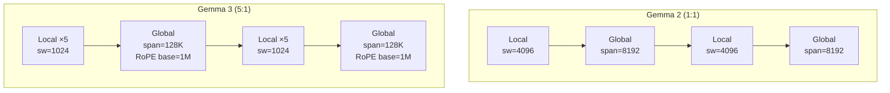
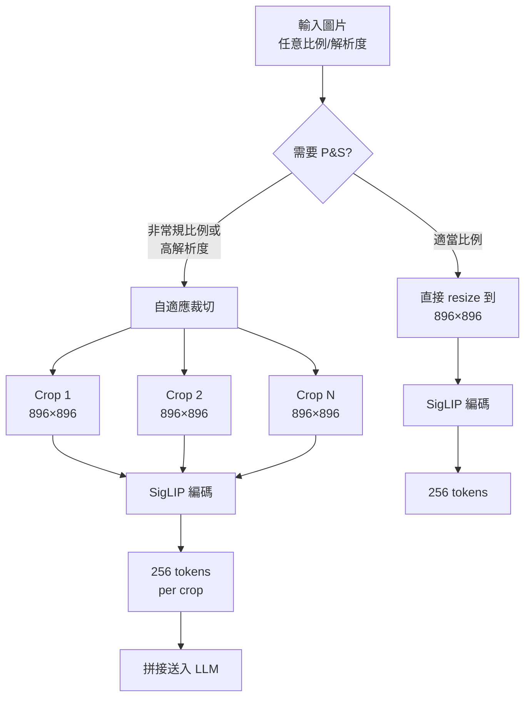

# Gemma 3: 輕量級開放語言模型的技術報告導讀

> **種子論文**: [Gemma 3 Technical Report](https://arxiv.org/abs/2503.19786) (2025-03)
> **作者**: Gemma Team, Google DeepMind
> **依存論文**: [Gemma 2: Improving Open Language Models at a Practical Size](https://arxiv.org/abs/2408.00118) (2024-07)

---

## TL;DR

Gemma 3 是 Google DeepMind 推出的第三代輕量級開源語言模型家族，從 1B 到 27B 參數共四種規模。它的核心架構創新是將 local/global attention layer 的比例從 Gemma 2 的 1:1 提升到 5:1，搭配僅 1024 tokens 的 sliding window，在不顯著影響 perplexity 的前提下大幅降低長序列的 KV-cache 記憶體消耗。結合知識蒸餾、SigLIP 視覺編碼器、以及改良的後訓練配方（BOND + WARM + WARP），Gemma 3 27B IT 在 LMSYS Chatbot Arena 獲得 Elo 1338，超越 DeepSeek-V3 和 LLaMA 3 405B 等更大的模型，且 Gemma 3 4B IT 就足以匹敵 Gemma 2 27B IT。

---

## 背景與動機

### 開放語言模型的兩難

大型語言模型在語言理解、生成、推理等能力上有顯著進展（Brown et al., 2020），但前沿模型如 Gemini、GPT-4 的規模與部署成本日益攀升。另一方面，開源社群需要能在消費級硬體（手機、筆電、消費級 GPU）上運行的輕量級模型。Gemma 系列正是為了解決這個需求而生。

Gemma 1（2024-02）首次將 Gemini 的訓練技術轉移到開源領域，證明即使是小模型也能透過大量訓練資料獲得優秀表現。但當時的訓練策略偏向「以量取勝」——增加 token 數量來提升效能，這種做法隨著模型接近 compute-optimal limit，邊際效益逐漸遞減。

### Gemma 2 的關鍵突破

Gemma 2（2024-07）引入了兩個重要技術：

1. **知識蒸餾**：取代單純的 next-token prediction，讓 2B 和 9B 模型從更大的教師模型學習機率分布，在同等 token 數量下獲得顯著提升
2. **Local/Global Attention 交錯**：每層交替使用 sliding window attention 與 global attention，在保留長距離依賴的同時降低計算量

Gemma 2 的 27B 模型以僅 LLaMA 3 70B 約 40% 的參數量達到接近的效能，驗證了輕量級模型的潛力。

### Gemma 3 要解決的新問題

Gemma 3 在 Gemma 2 的基礎上要同時解決三個挑戰：

1. **長上下文推理成本**：支援 128K tokens 時，KV-cache 的記憶體會隨序列長度線性膨脹。對一個 27B 的 dense model，128K 的 KV-cache 在某些量化配置下甚至超過模型權重本身的記憶體

2. **多模態整合**：開源社群對能「看」圖片的語言模型需求強烈。但如何在不大幅增加訓練成本的前提下，讓語言模型具備視覺理解能力？

3. **多語言支援不足**：Gemma 2 主要聚焦英語，tokenizer 對非英語語言的效率不佳。隨著 Gemini 2.0 的推出，Google 有了更均衡的 tokenizer 可以使用

以下從核心知識點出發，逐一探討 Gemma 2 與 Gemma 3 在這些維度上的設計選擇與演進。

---

## 核心知識點

本文圍繞以下知識點展開：

1. **Local/Global Attention 比例設計**——如何在保持語義理解品質的同時極大化記憶體節省
2. **知識蒸餾從選配變標配**——從 Gemma 2 僅對小模型使用到 Gemma 3 全系列使用
3. **QK-Norm 取代 Soft-Capping**——從限制 logit 數值範圍轉向正規化注意力分數
4. **RoPE 位置編碼的長上下文策略**——base frequency 提升、位置內插與分層設計
5. **視覺模態的務實整合**——SigLIP 編碼器 + Pan & Scan 推理策略
6. **多語言能力的資料驅動改善**——tokenizer 更換與訓練資料改造
7. **後訓練配方（BOND + WARM + WARP）**——從 SFT + RLHF 進化到多階段蒸餾與獎勵模型聚合
8. **量化感知訓練（QAT）的工業級實踐**——三種量化格式的生產部署

---

## 方法詳解

### 知識點 1: Local/Global Attention 比例設計

**這個知識點要回答什麼問題？**

對於 decoder-only transformer，global self-attention 的計算和記憶體複雜度是 $O(L^2)$，其中 $L$ 是序列長度。當上下文從 8K 擴展到 128K 時，KV-cache 的記憶體膨脹了 16 倍。如何在這個壓力下保留模型的表達能力？

**Gemma 2 的做法：1:1 交錯**

Gemma 2 採用每層交替 local sliding window attention 與 global attention 的模式：

```
Layer:  local → global → local → global → local → global → ...
```

local layer 的 sliding window 大小為 4096 tokens，global layer 的 span 為 8192 tokens。這種 1:1 的比例已經比「全部 global」的標準 transformer 減少了大量計算量，但從消融實驗來看（Table 10 of Gemma 2），將 sliding window 從 4096 縮小到 1024 時 perplexity 僅從 1.63 微幅上升到 1.64，顯示 local attention 的 window 有很大的縮減空間。

**Gemma 3 的極致壓縮：5:1 交錯 + 1024 window**

Gemma 3 將比例推到 5:1——每 5 個 local layer 穿插 1 個 global layer：

```
Layer:  local×5 → global → local×5 → global → ...
```

同時將 local layer 的 sliding window 從 4096 大幅縮小到 1024 tokens。這意味著：

- 只有約 1/6 的層（global layers）需要對整個上下文做 full attention
- local layers 只關注前 1024 tokens，記憶體消耗極低
- 搭配 GQA（num_groups=2），KV-cache 再進一步壓縮

**消融證據（Gemma 3 §5.2）**

論文透過一系列消融實驗驗證了這個設計：

- **Local:Global ratio（Fig. 3）**：從 1:1 到 7:1，perplexity 幾乎沒有變化。Gemma 3 選擇 5:1 作為安全平衡點
- **Sliding window size（Fig. 4）**：對 2B 模型測試，window 從 4096 降到 512 時，perplexity 變化在 0.01 以內
- **KV-cache 記憶體節省（Fig. 5、Fig. 6）**：「global only」的配置中，KV-cache 佔總記憶體的 60%。5:1 + sw=1024 的配置降至不到 15%。對於 128K 序列，差異達到數 GB



這個設計的直覺是：自然語言中，大部分的 token 依賴關係都是局部的（句法結構、鄰近修飾），只有少數關鍵的語義關係需要全局注意。因此，我們可以讓大多數層只處理局部關係，保留少數層處理全局關係。

**相關論文：Gemma 2 的做法**

Gemma 2 雖然引入了 1:1 的比例，但當時的 global layer 的 span 僅有 8192 tokens，不是真正的 long-context。Gemma 3 將 global layer 的 RoPE base frequency 提高到 1M，使 global attention 能有效擴展到 128K。

---

**Gemma 2 的架構參數對比**

Gemma 2 在不同規模的模型中使用不同的架構配置，這些配置選擇直接影響了 Gemma 3 的設計：

| 參數 | 2B | 9B | 27B |
|------|-----|-----|------|
| d_model | 2304 | 3584 | 4608 |
| Layers | 26 | 42 | 46 |
| Non-linearity | GeGLU | GeGLU | GeGLU |
| Feedforward dim | 18432 | 28672 | 73728 |
| Num heads | 8 | 16 | 32 |
| Num KV heads | 4 | 8 | 16 |
| Head size | 256 | 256 | 128 |
| Global att. span | 8192 | 8192 | 8192 |
| Sliding window | 4096 | 4096 | 4096 |
| Vocab size | 256128 | 256128 | 256128 |

Gemma 2 的設計選擇中，比較值得注意的是 head size 的差異：27B 使用 128 而 2B/9B 使用 256。這影響了 GQA 的 group 結構。Gemma 3 的架構參數沒有在論文中完整披露，但從對比來看，d_model 和 layer 數大體保持相似規模，主要差異在 local/global 比例和 context length 擴展。

### 知識點 2: 知識蒸餾從選配變標配

**這個知識點要回答什麼問題？**

小語言模型訓練的本質難題是：compute-optimal 下的 training budget 不足。以一個 2B 模型為例，Chinchilla 法則建議的 optimal token 數約 50B，但當今的訓練往往用到 2T tokens——超過 40 倍。單純的 next-token prediction 在這種 over-training 的情況下邊際效益急遽遞減。

知識蒸餾提供了解方：讓學生模型學習教師模型的機率分布，而不是 one-hot token label。每個 token 的 loss 從一個 scalar（cross-entropy with ground truth）變成一個 vector（distribution matching），資訊密度更高。

**Gemma 2：選擇性蒸餾**

Gemma 2 對 2B 和 9B 模型使用蒸餾，但 27B 模型仍然從頭訓練（from scratch）。蒸餾的作法：

$$
\min_\theta -\sum_t P_{\text{teacher}}(x_t | x_{<t}) \log P_{\theta}(x_t | x_{<t})
$$

其中 $P_{\text{teacher}}$ 是教師模型的機率分布。關鍵消融結果（Table 6）：

- 2B 模型，500B tokens：from scratch 平均 60.3 vs 蒸餾 67.7，差距顯著
- 蒸餾的效果在更大的模型上仍然保持（Table 7），從 200M 到 1B 模型都有正收益

**Gemma 3：全系列蒸餾 + 256 logits sampling**

Gemma 3 將蒸餾擴展到所有規模的模型，包含 27B。具體實作上採用 **sampled distillation**：

1. 對每個 token，教師模型輸出完整的 vocabulary 分布（262K 維）
2. 從中取樣 256 個 logits，以教師機率加權
3. 學生只對這 256 個 sampled logits 計算 cross-entropy loss
4. 未取樣的 logits 設為零機率，重新正規化

取樣策略大幅降低了蒸餾的計算開銷——原本需要計算 262K 維的分布匹配，現在只處理 256 維。

**小型 vs 大型教師的取捨（§5.4）**

Gemma 3 還探討了一個實務問題：應該用多大的教師模型？直覺上大教師更好，但過去的文獻（如 Hinton et al., 2015）顯示小教師有時效果更好。Gemma 3 的實驗（Fig. 8）揭開了這個謎團：

- **短訓練時**：小教師較好（正則化效果強，避免過擬合）
- **長訓練時**：大教師反超（隨著訓練步數增加，學生的容量可以充分利用大教師的豐富分布）

Gemma 3 因為訓練到 14T tokens，屬於長訓練場景，因此選擇大教師模型。

---

### 知識點 3: QK-Norm 取代 Soft-Capping

**這個知識點要回答什麼問題？**

大型 transformer 在訓練初期容易遇到注意力崩潰（attention collapse）——某些注意力頭的分數極大或極小，導致梯度爆炸或消失。Gemma 2 用 soft-capping 來控制 logit 範圍，但這種做法本質上是個啟發式（heuristic），而且 soft-capping 的 tanh 函數在極值區域梯度接近零。

**Gemma 2：Logit Soft-Capping**

Gemma 2 在每個 attention layer 和最終 layer 對 logit 進行 capping：

$$
\text{logits} \leftarrow \text{soft\_cap} \times \tanh\left(\frac{\text{logits}}{\text{soft\_cap}}\right)
$$

self-attention 層設 soft_cap = 50.0，最終層設 30.0。

**Gemma 3：QK-Norm**

Gemma 3 受 DeepViT（Dehghani et al., 2023）、Wortsman et al.（2023）和 Chameleon（2024）啟發，改用 QK-Norm——對 query 和 key 向量分別做 RMSNorm：

$$
Q' = \text{RMSNorm}(Q), \quad K' = \text{RMSNorm}(K)
$$

然後計算 $Q' K'^\top$，不再額外加 soft-capping。QK-Norm 的優點是：

- 正則化的方式更自然——直接作用在注意力計算的來源上
- 不引入 tanh 的非線性飽和區
- 與 RoPE 相容性更好

這個改變是從 Gemma 2 到 Gemma 3 在架構上的重要演進之一。

---

### 知識點 4: RoPE 位置編碼的長上下文策略

**這個知識點要回答什麼問題？**

RoPE（Rotary Position Embedding）有一個已知特性：其 base frequency 決定了模型能有效分辨的位置距離。標準的 RoPE base frequency 10k 約可支援 2K–8K 的上下文。要擴展到 128K，需要對位置編碼進行改造。

**Gemma 2：維持 10k base, 8192 context**

Gemma 2 的 context 是 8192 tokens，直接使用 RoPE base frequency 10k，不做特殊處理。這在當時是合理的——主要設計目標是效能而非長上下文。

**Gemma 3：雙軌 RoPE 策略**

Gemma 3 針對 local 和 global layers 使用不同的 RoPE 配置，這是一個非常務實且優雅的設計：

| 參數 | Local Layers | Global Layers |
|------|-------------|---------------|
| RoPE base frequency | 10k (不變) | 1M (100x 提升) |
| Context span | 1024 (sliding window) | 128K (完整上下文) |
| 用途 | 短距離句法/語意關係 | 長距離語義/篇章關係 |

Global layers 的 base frequency 從 10k 提升到 1M，使旋轉矩陣對大位置差有更強的區分能力。但這還不夠——論文使用 Chen et al.（2023）的 **Positional Interpolation** 方法來進一步擴展：

1. 先用 32K 序列預訓練
2. 在預訓練末期，使用線性內插（linear interpolation）將有效長度擴展到 128K
3. scaling factor 設為 8

從 Fig. 7 可以看到，未做 RoPE rescaling 前，perplexity 在 32K 附近急遽上升；rescaling 後平滑地維持到 128K。超過 128K 後效能急遽下降，顯示 128K 是這個配置的有效上限。

注意 1B 模型只支援 32K context，這與其較小的模型容量有關。

---

### 知識點 5: 視覺模態的務實整合

**這個知識點要回答什麼問題？**

讓語言模型「看懂圖片」通常是昂貴的——需要多模態預訓練、大規模圖片-文字數據集、以及複雜的對齊訓練。Gemma 3 找到了一個務實的路徑：凍結視覺編碼器、使用既有的對齊技術、再加上巧妙的推理策略。

**SigLIP 400M 凍結編碼器**

Gemma 3 使用 400M 參數的 SigLIP（Zhai et al., 2023）視覺編碼器。SigLIP 是 CLIP 的變體，將對比學習的 softmax 損失換成 sigmoid 損失，允許每個樣本獨立計算 loss，不需要 global batch normalization。這在分布式訓練中特別有利。

關鍵設計選擇：

- 視覺編碼器在訓練期間**凍結**，只訓練語言模型部分
- 圖片先由 SigLIP 編碼，然後壓縮成固定的 256 個 soft tokens
- 視覺 embeddings 在預訓練時預先計算（pre-compute），訓練語言模型時不增加計算成本
- 4B、12B、27B 共用同一視覺編碼器

**Pan & Scan (P&S) 推理策略**

SigLIP 編碼器操作在固定的 896×896 方形解析度上。這對非方形的圖片或高解析度圖片會產生嚴重問題——文字被壓縮到無法辨識，小物件消失。

Pan & Scan 是針對這個問題的推理時解決方案：



P&S 的自適應裁切演算法：

1. 判斷圖片是否需要裁切（非正方形比例或高解析度）
2. 將圖片分割成不重疊的均等 crop
3. 每個 crop resize 到 896×896 餵入編碼器
4. 控制最大 crop 數量，避免 token 量爆炸

從 Table 8 看，P&S 對依賴文字閱讀的任務提升顯著：

| 模型 | DocVQA | InfoVQA | TextVQA |
|------|--------|---------|---------|
| 4B | 72.8 | 44.1 | 58.9 |
| 4B + P&S | **81.0** (+8.2) | **57.0** (+12.9) | **60.8** (+1.9) |
| 27B | 85.6 | 59.4 | 68.6 |
| 27B + P&S | **90.4** (+4.8) | **76.4** (+17.0) | **70.2** (+1.6) |

InfoVQA 的提升最為誇張（27B 從 59.4 到 76.4，提升 17 個百分點），這正是因為資訊圖表中充滿了各種比例的文字區塊，P&S 完美地解決了這個場景。

---

### 知識點 6: 多語言能力的資料驅動改善

**這個知識點要回答什麼問題？**

開源模型的語言覆蓋率長期以來不均衡——英語效能遠高於其他語言。原因有二：(1) 訓練資料以英語為主；(2) tokenizer 對非英語語言的編碼效率低。

**Gemma 2 的局限**

Gemma 2 使用的是 Gemma 1 的 tokenizer（256K vocabulary），主要針對英語優化。這在文中的 multilingual benchmarks 上可以看到：WMT24++ 翻譯分數僅 53.0（27B），Flores 僅 44.3。對於號稱「開放」的模型來說，這個語言覆蓋率是不足的。

**Gemma 2 的蒸餾消融深度解讀**

Gemma 2 的 ablation section（§5）提供了幾個非常重要的實驗洞察：

1. **蒸餾 vs from scratch（Table 6）**：2B 模型訓練 500B tokens 時，from scratch 的平均分數 60.3，蒸餾達到 67.7——差距 7.4，相當於訓練了一個更大的模型。有趣的是，500B tokens 對 2B 模型來說已經是 compute-optimal（約 50B）的 10 倍，即使在此情況下蒸餾仍然有效

2. **模型規模與蒸餾效果的關係（Table 7）**：從 200M 到 1B 模型，perplexity 改善幅度分別是 23→19、19→17、17→15，雖然絕對值減小但相對改善率大致維持。這暗示更小模型從蒸餾中獲得的相對收益可能更大

3. **GQA vs MHA（Table 8）**：GQA 在 4 benchmarks 上的平均略優於 MHA（50.8 vs 50.3），但差距很小。主要的選擇理由是 GQA 參數更少、推理更快

4. **Wide vs deep（Table 9）**：在相同參數預算下，更深（more layers）比更寬（larger d_model）略好（52.0 vs 50.8），這影響了 Gemma 2 選擇 deeper architecture

5. **Sliding window size 的邊際影響（Table 10）**：window 從 4096 降到 1024，perplexity 從 1.63 僅上升到 1.64。這個發現直接啟發了 Gemma 3 將 sliding window 進一步縮小到 1024

Gemma 2 的消融實驗對 Gemma 3 的設計決策提供了堅實的實驗基礎——Gemma 3 的許多「創新」其實是 Gemma 2 既有發現的極致化應用。

**Gemma 3 的蒸餾細節**

Gemma 3 的蒸餾在實作層面有幾個值得注意的設計：

1. **教師模型的選擇**：Gemma 3 使用一個更大、訓練更充分的模型作為教師。從 Fig. 8 可以清楚看到，短訓練（< 50B tokens）時小教師更好，但 Gemma 3 訓練到 14T tokens，屬於長訓練場景，因此大教師勝出

2. **256 logits sampling 的實現**：對於每個 token 位置 $t$，教師模型輸出完整的 vocabulary 分布 $P_{\text{teacher}}(\cdot | x_{<t}) \in \mathbb{R}^{262K}$。從中根據機率權重取樣 256 個 token indices $\mathcal{S}_t$。學生模型只對這 256 個位置計算 softmax：

$$
P_{\text{student}}(w_i | x_{<t}) = \frac{\exp(z_i)}{\sum_{j \in \mathcal{S}_t} \exp(z_j)}, \quad i \in \mathcal{S}_t
$$

然後最小化 cross-entropy：

$$
\mathcal{L}_{\text{distill}} = -\sum_{t} \sum_{i \in \mathcal{S}_t} P_{\text{teacher}}(w_i | x_{<t}) \log P_{\text{student}}(w_i | x_{<t})
$$

這等同於在保留教師分布最高機率區域的同時大幅降低計算維度。

2. **增加多語言資料**：加入單語資料（monolingual）與平行語料（parallel data），處理語言不平衡時採用 Chung et al.（2023）的策略——根據語言的使用者數量來動態調整取樣率，避免低資源語言被稀釋

3. **結果顯著提升**（Table 13）：

| Benchmark | Gemma 2 27B | Gemma 3 27B |
|-----------|-------------|-------------|
| MGSM | 68.0 | 74.3 |
| Global MMLU | 69.4 | 75.7 |
| WMT24++ | 53.0 | 55.7 |
| Flores | 44.3 | 48.8 |
| XQuAD | 73.9 | 76.8 |
| ECLeKTic | 17.1 | 24.4 |

整體約提升 5–7 個百分點，尤其是 ECLeKTic（跨語言知識轉移測試）從 17.1 到 24.4，顯示對低資源語言的適應力有明顯改善。

---

### 知識點 7: 後訓練配方（BOND + WARM + WARP）

**這個知識點要回答什麼問題？**

一個語言模型從 pre-trained checkpoint 到可用的 instruction-tuned 模型，中間需要經過 post-training。Gemma 2 使用標準的 SFT + RLHF 流程。Gemma 3 引入了更複雜的前沿技術。

**Gemma 2 的後訓練**

Gemma 2 的流程：

1. SFT（Supervised Fine-Tuning）：在 teacher 生成的合成資料上進行 behavioral cloning
2. RLHF：使用比 policy 大一個數量級的 reward model
3. Model merging：對不同超參數訓練的模型進行權重平均

**Gemma 3 的改良配方**

Gemma 3 的後訓練由三個核心技術組成：

**BOND（Best-of-N Distillation）**（Sessa et al., 2024）：

從一個較大的 IT teacher 蒸餾知識，類似 pre-training 階段的蒸餾但改用在線（on-policy）方式——學生生成候選回答，teacher 對這些回答評分，學生學習 teacher 的評分分布。這個方式讓學生在推理時能「想像」teacher 會如何評價它的輸出。

**WARM（Weight Averaged Reward Models）**（Ramé et al., 2024b）：

單一 reward model 容易在訓練過程中發生 catastrophic forgetting——學會了新任務的偏好就忘記舊任務。WARM 維護多個 reward model（不同檢查點的權重平均），減少 reward hacking 的風險。

**WARP（Weight Averaged Rewarded Policies）**（Ramé et al., 2024a）：

在 RL fine-tuning 的後期，對多個訓練軌跡的 policy 進行權重平均，獲得更穩定的最終模型。

這三個技術的組合提供了多層次的穩定化：

```
SFT ─→ On-policy Distillation (BOND) ─→ RLHF with WARM ─→ WARP
                                            ↑
                              Multiple reward models (averaged)
```

除此以外，Gemma 3 還引入了多種 reward functions：
- Human feedback data（傳統 RLHF）
- Code execution feedback（Gehring et al., 2024）：讓模型在寫 code 時獲得執行時的 feedback
- Ground-truth rewards for math（DeepSeek-AI, 2025; Lambert et al., 2024）：對數學問題使用真實答案作為 reward

**效果驗證**

Table 6（Gemma 3）的 IT benchmark 數據顯示了顯著提升：

| Benchmark | Gemma 2 27B IT | Gemma 3 27B IT |
|-----------|---------------|---------------|
| MMLU-Pro | 56.9 | 67.5 |
| GSM8K | 91.1 | 95.9 |
| MATH | 55.6 | 89.0 |
| LiveCodeBench | 29.0 | 39.0 |
| MMMU (val) | — | 64.9 |

MATH 從 55.6 跳到 89.0，這個跳躍非常驚人，主要歸功於 math-specific ground-truth rewards 和 on-policy distillation。

---

### 知識點 8: 量化感知訓練（QAT）的工業級實踐

**這個知識點要回答什麼問題？**

大模型部署到消費級硬體幾乎都需要量化。常見的做法是訓練後量化（PTQ, Post-Training Quantization），但 PTQ 對於低 bit width（int4）或非對稱量化（如 SFP8）會有顯著的 accuracy drop。

**Gemma 3 的 QAT 方案**

Gemma 3 採用 Quantization Aware Training，對每個量化格式進行約 5,000 steps 的微調：

1. 以非量化 checkpoints 的輸出機率為 target
2. 調整訓練資料分布以同時涵蓋 pre-training 和 post-training 的分布
3. 支援三種量化格式：
   - **Per-channel int4**：每個輸出 channel 獨立量化，精確度最高但實作複雜
   - **Per-block int4 (blocksize=32)**：32 個 weight 一組共用一個 scale，與 llama.cpp 相容
   - **Switched FP8 (SFP8)**：8-bit floating point，硬體支援度高

從 Table 3 來看，27B 模型的記憶體對比：

| 配置 | bf16 | Int4 | Int4 (blocksize=32) | SFP8 |
|------|------|------|---------------------|------|
| 權重 | 54.0 GB | 14.1 GB | 15.3 GB | 27.4 GB |
| 權重 + KV cache | 72.7 GB | 32.8 GB | 34.0 GB | 46.1 GB |

int4 量化讓 27B 模型可以在一張消費級 GPU（如 RTX 4090 的 24GB）上運行（僅權重 14.1 GB），但如果加上 KV cache（32K context）則需要約 33 GB。

這為開源社群的部署提供了很實用的參考——不同硬體環境可以選擇不同的量化格式來平衡效能與 accuracy。

---

## 實驗結果

### LMSYS Chatbot Arena

Gemma 3 27B IT 在 LMSYS Chatbot Arena 的盲測 side-by-side 評比中獲得 **Elo 1338**，在開源模型中排名頂尖：

| 排名 | 模型 | Elo | 參數 |
|------|------|-----|------|
| 1 | Grok-3-Preview | 1412 | 671B MoE |
| 3 | Gemini-2.0-Flash-Thinking | 1384 | — |
| 8 | o1-2024-12-17 | 1352 | — |
| **9** | **Gemma 3 27B IT** | **1338** | **27B** |
| 13 | DeepSeek-V3 | 1318 | 671B MoE |
| 18 | LLaMA 3.1 405B | 1269 | 405B |
| 38 | Llama 3.3 70B | 1257 | 70B |
| 59 | Gemma 2 27B IT | 1220 | 27B |

**關鍵觀察**：

- Gemma 3 27B（Elo 1338）比 Gemma 2 27B（Elo 1220）提升了 118 分，這是跨世代的飛躍
- 超越了 DeepSeek-V3（671B MoE）和 LLaMA 3.1 405B 等大它一個數量級的模型
- 注意這些 Elo 分數不包含視覺能力——所有比較僅基於文字能力

### IT Benchmarks 詳細比較

| Benchmark | Gemma 2 27B IT | Gemma 3 27B IT | 差距 |
|-----------|---------------|---------------|------|
| MMLU | 76.2 | 76.9 | +0.7 |
| MMLU-Pro | 56.9 | 67.5 | **+10.6** |
| MATH | 55.6 | 89.0 | **+33.4** |
| GSM8K | 91.1 | 95.9 | +4.8 |
| HiddenMath | 12.0 | 56.0 | **+44.0** |
| HumanEval | 51.8 | 87.8 | **+36.0** |
| MBPP | 67.4 | 74.4 | +7.0 |
| LiveCodeBench | 29.0 | 39.0 | +10.0 |
| BBH | 74.9 | 87.6 | +12.7 |
| IFEval | 91.1 | 90.4 | −0.7 |

**觀察**：

- MMLU 提升不大（+0.7），因為 Gemma 2 已經接近 saturation
- MATH、HiddenMath、HumanEval 的巨幅提升是 post-training 改良的 direct result——特別是 math-specific rewards 和 code execution feedback
- IFEval 微降，可能是因為加強數學能力讓模型在某些 instruction-following 場景變得更「死板」

### 多模態基準測試

| Benchmark | Gemma 3 4B IT | Gemma 3 12B IT | Gemma 3 27B IT |
|-----------|--------------|---------------|---------------|
| MMMU (val) | 48.8 | 59.6 | 64.9 |
| DocVQA | 75.8 | 87.1 | 86.6 |
| InfoVQA | 50.0 | 64.9 | 70.6 |
| TextVQA | 57.8 | 67.7 | 65.1 |
| ChartQA | 68.8 | 75.7 | 78.0 |
| MathVista | 50.0 | 62.9 | 67.6 |

值得注意的是 12B 在某些任務（DocVQA、TextVQA）上表現接近甚至超過 27B，顯示模型規模並非視覺理解的唯一瓶頸——訓練資料品質和 encoder 設計同樣重要。

### 預訓練品質探測（Ablation Studies）

比較 Gemma 2 與 Gemma 3 的 pre-trained models（Figure 2），Gemma 3 在多數類別上超越 Gemma 2，特別是在程式碼和推理：

| 類別 | Gemma 2 vs Gemma 3 (PT) |
|------|------------------------|
| Science | 持平 / 微幅提升 |
| Code | **顯著提升**（特別是 27B） |
| Factuality | 持平 |
| Multilinguality | **顯著提升** |
| Reasoning | 顯著提升 |

### 訓練基礎設施與碳足跡比較

Gemma 2 和 Gemma 3 在訓練基礎設施上也有一些值得注意的差異。

**Gemma 2 的訓練配置：**

| 模型 | 硬體 | 晶片數 | 資料複製 | 模型分片 |
|------|------|--------|---------|---------|
| 2B | TPUv5e | 512 | 512-way | 1-way |
| 9B | TPUv4 | 4096 | 1024-way | 4-way |
| 27B | TPUv5p | 6144 | 768-way | 8-way |

**Gemma 3 的訓練配置：**

| 模型 | 硬體 | 晶片數 | 資料複製 | 序列分片 | Replica |
|------|------|--------|---------|---------|---------|
| 1B | TPUv5e | 512 | 16 | 16 | 2 |
| 4B | TPUv5e | 2048 | 16 | 16 | 8 |
| 12B | TPUv4 | 6144 | 16 | 16 | 24 |
| 27B | TPUv5p | 6144 | 24 | 8 | 32 |

Gemma 3 在訓練配置上更注重序列維度的平行化（sequence sharding），這是因為長上下文訓練（32K → 128K）需要更多的序列級記憶體管理。兩代模型都使用 ZeRO-3（Ren et al., 2021）進行 optimizer state 分片、Pathways（Barham et al., 2022）進行跨 pod 資料通訊、以及 GSPMD（Xu et al., 2021）進行計算圖分割。

### Gemma 2 vs Gemma 3 後訓練配方完整對比

雖然在前面各知識點已經分散討論過後訓練的改進，這裡做一個系統性的對比：

| 維度 | Gemma 2 | Gemma 3 |
|------|---------|---------|
| SFT 方法 | Teacher-generated synthetic data | 改良版 on-policy distillation |
| 蒸餾方式 | Behavioral cloning (offline) | BOND (on-policy, Sessa et al., 2024) |
| RL 演算法 | 標準 RLHF | WARM + WARP (multiple reward models) |
| Reward model 大小 | 10x policy | Weight-averaged |
| Math rewards | 無 | Ground-truth math rewards (DeepSeek-AI, 2025) |
| Code feedback | 無 | Code execution feedback (Gehring et al., 2024) |
| 模型合併 | 權重平均 | WARP 多軌跡權重平均 |
| 資料過濾 | 基本過濾（個人資訊、有毒內容） | 強化版（增加去重、factuality 強化資料） |

這個對比清晰顯示，Gemma 3 的後訓練是對 Gemma 2 的全面升級，不再是單純的 SFT + RLHF，而是多階段、多目標的系統性優化。

### 對比 PaliGemma 2 的視覺能力

Gemma 3 的視覺能力在 Table 12 中與 PaliGemma 2（Steiner et al., 2024）進行了對比：

| Benchmark | PaliGemma 2 9B | PaliGemma 2 27B | Gemma 3 4B | Gemma 3 12B | Gemma 3 27B |
|-----------|---------------|----------------|-----------|------------|------------|
| DocVQA | 81.6 | 86.3 | 86.1 | 89.0 | 89.5 |
| InfoVQA | 41.4 | 53.1 | 55.6 | 61.6 | 64.6 |
| TextVQA | 76.3 | 76.3 | 79.1 | 81.6 | 83.2 |
| ChartQA | 70.7 | 79.1 | 79.8 | 83.5 | 83.4 |

有趣的是，Gemma 3 4B 在 DocVQA 上就超越了 PaliGemma 2 9B（86.1 vs 81.6），這主要是因為 Gemma 3 的語言模型部分是直接在大量多模態資料上預訓練的，而 PaliGemma 2 是從 PaliGemma（純文字）再轉移學習到視覺任務。

### 從記憶化率看模型安全

Gemma 3 在記憶化（memorization）方面做了詳細的評估（§6）。使用與 Gemma 2 相同的方法論，測試模型的 extractable memorization：

1. 從訓練資料中隨機取樣大量片段
2. 對每個片段，使用前 50 tokens 作為 prefix
3. 讓模型繼續生成 50 tokens
4. 比對生成結果與原始訓練資料

記憶化率使用兩種定義：
- **Exact memorization**：所有 tokens 完全匹配
- **Approximate memorization**：edit distance ≤ 10%

從 Fig. 9 可以看到一個很清楚的趨勢（注意 y 軸是對數尺度）：

- Gemma 3 系列的記憶化率比 Gemma 2 低了一個數量級
- Exact memorization 率約 0.001–0.003%，approximate 約 0.01–0.02%
- 4B、12B、27B 三者的記憶化率差異很小
- 1B 因為參數量少、訓練 token 少，記憶化率最低

這個改善主要歸功於：(1) 更嚴格的訓練資料過濾，(2) 蒸餾訓練減少了模型 memorizing 訓練資料的傾向，(3) 去污化（decontamination）措施的加強。

---

## 總結、限制與未來方向

### 核心要點重述

Gemma 3 代表了 Google DeepMind 在輕量級開源語言模型上的一個重要里程碑。從技術角度看，它的關鍵貢獻是：

1. **架構效率的極致化**：5:1 local/global attention 比例證明，大多數 attention 層並不需要完整的上下文視野。這為長上下文模型的推理效率提供了新範式

2. **蒸餾成為標配**：將知識蒸餾從 Gemma 2 的「選擇性使用」提升到全系列標配，證明了蒸餾在大規模 over-training 場景下的必要性和有效性

3. **務實多模態整合**：凍結 SigLIP + P&S 的策略，讓語言模型在不大幅增加訓練預算的前提下獲得實用的視覺理解能力。P&S 對圖文理解任務的提升非常顯著

4. **後訓練配方的系統性改良**：BOND + WARM + WARP 的多層次穩定化策略，使 Gemma 3 在小參數量下達到驚人的數學和程式碼能力

### 已知限制

1. **視覺能力範圍有限**：僅支援靜態圖片理解，且依賴 P&S 的推理時開銷。不支援影片理解（雖然論文後續有 video understanding 評估）

2. **長上下文極限**：128K 是有效上限（Fig. 7），超過後 perplexity 急遽惡化。相比之下，Gemini 1.5 Pro 支援 1M+ tokens

3. **編輯強度不足**：雖然 IFEval 分數達 90+，但論文中承認在 open-ended instruction following 和事實性能力上仍有進步空間

4. **影片理解尚屬初步**：雖然 Gemma 3 在 video understanding 上進行了初步評估（Perception Test MCVQA: 27B 58.1%，ActivityNet-QA: 52.8%），但遠未達到專用影片模型的水平。影片評估使用 16 frames 的 linspace sampling，僅覆蓋了基本的時序理解

5. **訓練資料的語言覆蓋不完整**：雖然多語言能力有顯著改善（尤其是 XQuAD、ECLeKTic），但低資源語言的效能仍遠低於英語

6. **記憶化風險**：Fig. 9 顯示 Gemma 3 的記憶化率雖然遠低於前代模型，但在某些測試條件下仍可提取訓練資料片段

7. **小模型的蒸餾限制**：1B 模型由於參數量過小，在多模態任務上的表現顯著受限（不支援視覺編碼器）

### 我的觀察

讀完這篇論文的幾個感想。

**關於 attention 比例設計的啟示**

Gemma 3 最讓我在意的不是它的效能數字，而是 Fig. 3 那張 local:global ratio vs perplexity 的圖。從 1:1 到 7:1，perplexity 幾乎完全不變。這透露了一個更深層的信號：transformer 中絕大多數的 attention head 可能根本不需要全局視野。Gemma 3 仍然保留 1/6 的層做 global attention，但我懷疑在更大模型上這個比例可以進一步壓縮。5:1 也許不是終點。

**Gemma 3 背後的工程取捨**

這篇論文讀起來非常「務實」——沒有炫目的新理論，每個技術選擇都有明確的工程考量：

- 凍結視覺編碼器不是因為效果好，而是「因為 embedding 可以預先計算，不增加語言模型訓練成本」
- P&S 不是端到端學習的方法，而是「推理時優化」——因為它簡單、有效、不影響訓練
- 256 logits sampling 不是為了準確度，而是為了減少蒸餾的計算開銷

這種務實的工程態度，恰恰是 Gemma 3 成功的關鍵——它不是在每個環節都追求 SOTA，而是在約束條件下做出最有效的取捨。

**開放模型的策略演變**

Gemma 3 的發布策略也很有意思。Google 選擇同時發布 raw checkpoints 和 QAT 量化版本（int4、SFP8），後者是直接面向開源部署社群的需求。這與 LLaMA 3 的做法類似，顯示開源模型生態正在從「發布權重」到「發布即用版本」轉變。

另外，Gemma 3 對安全性和負責任發布的強調（§7）在其他開源模型的技術報告中比較少見。這反映了大公司對開源模型潛在風險的管理需求。

### 後續發展方向

Gemma 3 之後，預計的發展方向包括：

- **更深的 local/global 比例探索**：7:1、甚至 9:1 的比例是否可行？Fig. 3 顯示 7:1 的 perplexity 仍然接近 1:1
- **動態 attention routing**：讓模型根據輸入動態決定哪些層需要 global attention，取代固定的交錯模式
- **更大的視覺編碼器**：目前使用 400M SigLIP，更大的編碼器是否能帶來一致的提升仍需研究
- **與 Agent 能力的整合**：Gemma 3 已具備基礎的推理能力，但離自主 agent 協作還有距離

---

## 延伸閱讀

### Dependency Papers（本文涵蓋）

1. **Gemma 2: Improving Open Language Models at a Practical Size** ([2408.00118](https://arxiv.org/abs/2408.00118))
   - 與本文關係：Gemma 3 的直接前身。1:1 local/global attention 的首次引入、選擇性知識蒸餾、logit soft-capping
   - 作者：Gemma Team, Google DeepMind（2024-07）

### 相關技術（本文引用或參考）

- **SigLIP: Sigmoid Loss for Language Image Pre-training** (Zhai et al., 2023, CVPR)
- **LLaVA: Visual Instruction Tuning** (Liu et al., 2024, NeurIPS)
- **BOND: Aligning LLMs with Best-of-N Distillation** (Sessa et al., 2024)
- **WARM: Weight Averaged Reward Models** (Ramé et al., 2024b, ICML)
- **WARP: Weight Averaged Rewarded Policies** (Ramé et al., 2024a)
- **Extending Context Window via Positional Interpolation** (Chen et al., 2023)
- **GQA: Training Generalized Multi-Query Transformer Models** (Ainslie et al., 2023)
- **Longformer: The Long-Document Transformer** (Beltagy et al., 2020)
- **LLaMA 3 Herd of Models** (Meta, 2024)
- **DeepSeek-R1** (DeepSeek-AI, 2025)

---

## 引用

完整 BibTeX 見 [`papers.bib`](./papers.bib)。
