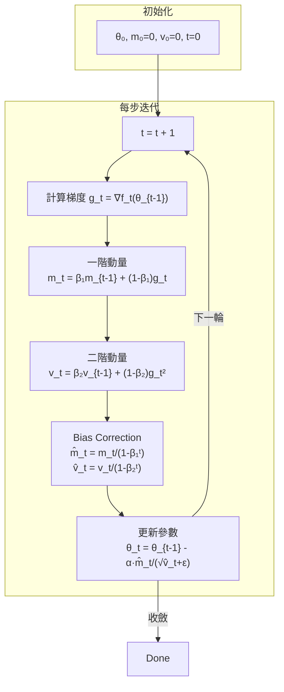

# Adam Optimizer: Adaptive Moment Estimation 深度解讀

> **種子論文**: [Adam: A Method for Stochastic Optimization](https://arxiv.org/abs/1412.6980) (2014-12)
> **作者**: Diederik P. Kingma, Jimmy Ba
> **機構**: University of Amsterdam / OpenAI, University of Toronto

---

## TL;DR

> Adam 想解決傳統 SGD 需要手動調整學習率、且單一學習率無法同時適應所有參數的問題。它同時維護梯度的一階動量（momentum）與二階動量（adaptive learning rate），並加入 bias correction 機制消除初始化偏差。在 ICLR 2015 發表後迅速成為深度學習最主流的優化器之一，截至今日累積超過 20 萬次引用。

> 相較於 AdaGrad（梯度平方累加導致學習率單調遞減至零）與 RMSProp（無 bias correction 在稀疏梯度時不穩定），Adam 用 EMA 取代累加、用 bias correction 解決初始偏差，同時結合 momentum 與 adaptive LR 的優點。

> 實驗證實 Adam 在 logistic regression、多層神經網路、CNN 等任務上 consistently 優於或持平 SGD+Nesterov、AdaGrad、RMSProp、AdaDelta。後續也發現 Adam 在某些情境下不收斂（AMSGrad 修復）、以及泛化不如 SGD 的討論，但這不影響 Adam 作為最廣泛使用的深度學習優化器的地位。

---

## 背景與動機

### 最佳化在深度學習中的角色

深度學習的核心是求解一個高度非凸、高維度的最佳化問題：

$$
\theta^* = \arg\min_\theta \frac{1}{N} \sum_{i=1}^N \mathcal{L}(f_\theta(x_i), y_i)
$$

其中 $\theta$ 通常是數百萬到數十億個參數，$\mathcal{L}$ 是損失函數。這個問題無法用 closed-form 求解，必須用迭代法逐步逼近。最基礎的方法是 **Stochastic Gradient Descent (SGD)**：

$$
\theta_{t+1} = \theta_t - \alpha \cdot g_t
$$

其中 $g_t = \nabla_\theta \mathcal{L}_t(\theta_t)$ 是當前梯度，$\alpha$ 是學習率（step size）。

SGD 簡單、理論保證好、記憶體效率高，但在實務上有幾個關鍵痛點。

### 痛點一：單一學習率無法適應所有參數

在深度網路中，不同參數的梯度尺度差異非常大。以 CNN 為例：

- 卷積層的梯度通常比較小（權重共享使每個權重的更新訊號較少）
- 全連接層的梯度通常比較大
- 某些參數（如 batch norm 的 scale/bias）的梯度尺度又完全不同

SGD 對所有參數使用相同的 $\alpha$，導致某些參數更新太快（震盪）、某些更新太慢（收斂停滯）。

### 痛點二：稀疏特徵的困境

在 NLP 或推薦系統中，輸入特徵通常是高度稀疏的。大部分參數在大部分時間梯度為零，只有少數樣本會激活少數特徵。例如在 bag-of-words 模型中，詞彙「peripatetic」可能只出現在百萬分之一的文件中。

對這些**罕見但高資訊量**的特徵，SGD 用和其他參數相同的學習率，導致其幾乎學不到任何東西。理想的做法是：對頻繁出現的特徵用小步更新，對罕見特徵用大步更新。

### 痛點三：學習率的手動調校

SGD 的學習率 $\alpha$ 是最敏感的超參數。太大導致發散，太小導致收斂過慢。而且最優的 $\alpha$ 在訓練過程中會變化：剛開始可能需要大步，接近收斂時需要小步。雖然可以加入 learning rate schedule（如 cosine decay、step decay），但 schedule 本身也是需要調的超參數。

### 既有方法的進展與不足

在 Adam 之前，學界已經有一些重要的進展：

**Momentum (Polyak, 1964)：** 引入梯度的一階動量，累積過去梯度方向，加速收斂並平滑更新路徑。更新規則為 $m_t = \gamma m_{t-1} + \alpha g_t$。但 momentum 沒有解決 learning rate 適應問題。

**Nesterov Accelerated Gradient (NAG) (1983)：** 在 momentum 的基礎上加入「look-ahead」機制，先在累積動量的方向預估下一步位置，再計算梯度。收斂更快，但同樣沒有 adaptive LR。

**AdaGrad (Duchi et al., 2011)：** 首次引入 per-parameter adaptive learning rate，對每個參數 $i$ 維護一個累加的梯度平方和 $G_{t,ii} = \sum_{\tau=1}^t g_{\tau,i}^2$，然後更新為 $\theta_{t+1,i} = \theta_{t,i} - \frac{\alpha}{\sqrt{G_{t,ii} + \epsilon}} \cdot g_{t,i}$。

AdaGrad 的直覺是：頻繁更新的參數累積 $G_{t,ii}$ 很大 → 學習率小；罕見更新的參數 $G_{t,ii}$ 很小 → 學習率大。這完美解決了稀疏特徵的問題。

但 AdaGrad 有致命缺陷：$G_{t,ii}$ 是**單調遞增**的（只加不減），導致學習率 $\alpha / \sqrt{G_{t,ii}}$ 持續縮小，最終趨近於零，徹底停止學習。在非凸設定中這是災難性的——模型在還沒到達好的局部極小值之前，學習率就已經歸零了。

**RMSProp (Tieleman & Hinton, 2012)：** 解決 AdaGrad 的累加問題，改用**指數加權移動平均 (EMA)** 來估計梯度平方的二階動量：

$$
v_t = \beta_2 v_{t-1} + (1 - \beta_2) g_t^2
$$

這樣 $v_t$ 是一個有上限的 moving average，不會單調遞增。RMSProp 在非凸深度網路中表現遠優於 AdaGrad。

但 RMSProp 沒有 momentum，且**缺乏 bias correction**。當 $\beta_2$ 接近 1（處理稀疏梯度所需），$v_t$ 的初始估計偏差很大，導致訓練初期更新步長過大、甚至發散。

這些既有方法的各自不足，正是 Adam 要解決的問題。Adam 的目標是：**同時結合 momentum 與 adaptive LR 的優點，並修復 bias 問題，提供一個「開箱即用」、超參數不太需要調的優化器。**

---

## 核心知識點

本文圍繞以下 12 個知識點展開。這是理解 Adam optimizer 的關鍵概念：

1. **SGD 的局限性**——單一 learning rate 無法適應所有參數，稀疏特徵學不到
2. **AdaGrad 的貢獻與限制**——per-parameter adaptive LR 很棒，但累加機制讓學習率死掉
3. **Momentum 的概念與形式**——一階動量用 EMA 平滑梯度方向
4. **RMSProp 的概念**——二階動量用 EMA 取代累加，解決學習率歸零問題
5. **Adam 核心演算法**——同時維護 m_t（一階）與 v_t（二階）的 EMA
6. **Bias Correction 機制**——為何需要、如何在數學上推導、為何在 β₂ 接近 1 時至關重要
7. **更新規則的數學特性**——SNR 自動調節步長、梯度縮放不變性、effective stepsize 有界
8. **超參數的直觀意義**——α、β₁、β₂、ε 各自控制什麼、合理預設值與調整方向
9. **收斂性理論保證**——線上凸最佳化下的 O(√T) regret bound
10. **Adam 與 AdaGrad/RMSProp 的形式化對比**——極限條件下 Adam 退化為 AdaGrad 的數學證明
11. **AdaMax 擴展**——L∞ norm 變體的概念
12. **已知限制與後續發展**——AMSGrad、泛化爭論、AdamW

---

## 方法詳解

### 知識點 1: SGD 的局限性

**這個知識點要回答什麼問題？為什麼不能用 SGD 搞定一切？**

SGD 是深度學習最基礎的優化方法，形式極簡：

$$
\theta_{t+1} = \theta_t - \alpha \cdot g_t
$$

但這個簡單的形式隱含了三個假設，在實務中通常不成立：

**假設一：所有參數的梯度尺度相當。** 如果不成立，對 A 參數效果好的 $\alpha$ 對 B 參數可能已經發散或停滯。這個問題在具有異質結構的深度網路中尤其嚴重——CNN 的卷積層與全連接層的梯度分布完全不同。

**假設二：梯度是真實梯度的無偏估計。** 事實上 mini-batch 帶來的雜訊使得估計有相當大的方差。SGD 只有 $\alpha$ 一個旋鈕來控制這個噪音——調小 $\alpha$ 可以降低噪音影響，但也會降低收斂速度。

**假設三：最優的 $\alpha$ 在訓練過程中保持不變。** 這完全不成立。剛開始訓練時，參數離最優解很遠，可以大步走；接近收斂時需要小步精細調整。雖然可以設計 learning rate schedule，但 schedule 本身也是需要調的超參數。

Adam 的核心貢獻就是同時放寬這三個假設：per-parameter LR 解決假設一、momentum 降低方差解決假設二、SNR 自動 annealing 解決假設三。

---

### 知識點 2: AdaGrad 的貢獻與限制

**這個知識點要回答什麼問題？AdaGrad 如何做到 adaptive learning rate？它為什麼失敗？**

AdaGrad (Duchi, Hazan & Singer, 2011) 的核心洞察是：**每個參數應該有自己的學習率，與其歷史梯度的大小成反比。**

具體實現是維護一個對角矩陣 $G_t \in \mathbb{R}^{d \times d}$，其中 $G_{t,ii} = \sum_{\tau=1}^t g_{\tau,i}^2$。參數 $i$ 的更新為：

$$
\theta_{t+1,i} = \theta_{t,i} - \frac{\alpha}{\sqrt{G_{t,ii} + \epsilon}} \cdot g_{t,i}
$$

直覺上：某個參數的梯度經常很大 → $G_{t,ii}$ 快速增長 → 學習率快速縮小 → 更新幅度變小，防止震盪。某個參數的梯度幾乎為零（罕見特徵）→ $G_{t,ii}$ 很小 → 學習率很大 → 看到該特徵時能大幅學習。

**AdaGrad 的成功在於：** 首次在數學上嚴謹地實現了 per-parameter adaptive learning rate，在稀疏資料（如文本分類）上 SGD 完全無法匹敵。論文中針對稀疏特徵場景的 O(log d √T) regret bound 也是理論上的一大突破。

**AdaGrad 的失敗也很清楚：** $G_t$ 的累加是單調遞增且無上界的。對非凸深度學習問題，訓練可能持續數十萬步，$G_t$ 最終會讓所有參數的學習率都趨近於零。模型在還沒收斂之前就停止學習了。

---

### 知識點 3: Momentum 的概念與形式

**這個知識點要回答什麼問題？Momentum 做了什麼、對 Adam 有什麼啟發？**

Momentum (Polyak, 1964) 的想法來自物理類比：參數更新不僅看當前梯度，還要保留過去的更新方向（動量）：

$$
v_t = \mu v_{t-1} + \eta g_t
$$
$$
\theta_{t+1} = \theta_t - v_t
$$

或更常見的形式：

$$
m_t = \beta_1 m_{t-1} + (1 - \beta_1) g_t
$$
$$
\theta_{t+1} = \theta_t - \alpha \cdot m_t
$$

這是一個**低通濾波器**——高頻雜訊被平滑掉，低頻的真實梯度方向被保留。在 ravine 地形（某個方向梯度很大、垂直方向很小）中，momentum 能有效抑制震盪、加速收斂。

Adam 直接採用了 momentum 這個想法，維護梯度的一階 EMA $m_t$。但 Adam 與傳統 momentum 的關鍵差異在於：Adam 的 $m_t$ 不是用來直接乘上學習率，而是與 adaptive 的二階動量 $v_t$ 形成**信噪比 (SNR)**，共同決定更新步長。

---

### 知識點 4: RMSProp 的概念

**這個知識點要回答什麼問題？RMSProp 如何取代 AdaGrad 的累加機制？**

RMSProp 是 Geoffrey Hinton 在 2012 年 Coursera 課程中提出的（未正式發表）。核心變革只有一行：

$$
\text{AdaGrad:} \quad G_{t,ii} = \sum_{\tau=1}^t g_{\tau,i}^2
$$
$$
\text{RMSProp:} \quad v_t = \beta_2 v_{t-1} + (1 - \beta_2) g_t^2
$$

把「累加所有過去的梯度平方」改成「用 EMA 追蹤最近的梯度平方」。這樣 $v_t$ 不會無限制增長，而是穩定在一個合理範圍內（大致是近期梯度平方的加權平均）。這解決了 AdaGrad 學習率歸零的問題，使 RMSProp 在非凸深度網路中表現遠優於 AdaGrad。

RMSProp 的更新規則：

$$
\theta_{t+1} = \theta_t - \frac{\alpha}{\sqrt{v_t + \epsilon}} \cdot g_t
$$

注意 RMSProp 沒有 momentum 也沒有 bias correction。沒有 momentum 意味著對雜訊敏感的場景不夠穩定；沒有 bias correction 意味著當 $\beta_2$ 接近 1（罕見特徵需要的設定）時，初始 $v_t$ 嚴重偏小，導致初期更新步長過大、可能發散。

Adam 的設計將同時解決這兩個遺漏。

---

### 知識點 5: Adam 核心演算法

**這個知識點要回答什麼問題？Adam 到底怎麼運作？**

Adam (Adaptive Moment Estimation) 的完整演算法如下：

```
Require: α (step size, 預設 0.001)
Require: β₁, β₂ ∈ [0, 1) (momentum 衰減率, 預設 0.9, 0.999)
Require: f(θ) (隨機目標函數)
Require: θ₀ (初始參數)

m₀ ← 0  (初始化一階動量向量)
v₀ ← 0  (初始化二階動量向量)
t ← 0

while θ_t 未收斂 do
    t ← t + 1
    g_t ← ∇_θ f_t(θ_{t-1})            // 計算梯度
    m_t ← β₁·m_{t-1} + (1-β₁)·g_t     // 更新一階動量 EMA
    v_t ← β₂·v_{t-1} + (1-β₂)·g_t²    // 更新二階動量 EMA
    m̂_t ← m_t / (1 - β₁ᵗ)            // bias-corrected 一階動量
    v̂_t ← v_t / (1 - β₂ᵗ)            // bias-corrected 二階動量
    θ_t ← θ_{t-1} - α · m̂_t / (√v̂_t + ε)  // 更新參數
end while
```

演算法有四個關鍵步驟，每一步都有自己的設計考量：

**步驟一：計算梯度 $g_t = \nabla_\theta f_t(\theta_{t-1})$**

與 SGD 完全一樣，在當前參數位置計算 mini-batch 的梯度。沒有額外計算成本。

**步驟二：更新一階動量 $m_t = \beta_1 m_{t-1} + (1 - \beta_1) g_t$**

這是 momentum 的標準形式。$\beta_1 = 0.9$ 表示當前梯度貢獻 10%，過去動量貢獻 90%。$m_t$ 是本輪梯度的**方向估計**（有符號）。

**步驟三：更新二階動量 $v_t = \beta_2 v_{t-1} + (1 - \beta_2) g_t^2$**

這是 RMSProp 的標準形式。$\beta_2 = 0.999$ 表示過去 1000 步左右的梯度平方都有貢獻。$v_t$ 是梯度大小的**尺度估計**（無符號、恆為正）。

**步驟四：bias-corrected 更新 $\theta_t = \theta_{t-1} - \alpha \cdot \hat{m}_t / (\sqrt{\hat{v}_t} + \epsilon)$**

bias correction 的細節見知識點 6。更新方向由 $\hat{m}_t$ 決定，更新步長由 $\alpha / \sqrt{\hat{v}_t}$ 決定。$\epsilon = 10^{-8}$ 是為了數值穩定（避免除以零）。



**Adam 的獨特之處**在於將 momentum 與 adaptive LR 有機結合（不是簡單疊加）。$m_t$ 與 $v_t$ 共同形成一個**信噪比**：

$$
\frac{\hat{m}_t}{\sqrt{\hat{v}_t}} \approx \frac{\text{期望梯度}}{\text{梯度標準差}} = \text{信噪比}
$$

高 SNR 表示梯度方向自信 → 大步更新；低 SNR 表示梯度方向不確定 → 小步更新。這是一種比任何手動 schedule 都更優雅的自動 annealing 策略。

---

### 知識點 6: Bias Correction 機制

**這個知識點要回答什麼問題？為什麼需要 bias correction？它如何推導？**

Bias correction 可能是 Adam 中最容易被忽略但卻關鍵的設計。我從數學推導來說明為什麼需要它。

**問題來源：** $m_0 = 0$, $v_0 = 0$。初始化為零向量會讓 $m_t$ 和 $v_t$ 在初始階段**偏向零**。

以一階動量為例，假設觀察 $T$ 個梯度 $g_1, g_2, ..., g_T$。展開 $m_T$：

$$
m_T = (1-\beta_1) \sum_{i=1}^T \beta_1^{T-i} g_i
$$

對兩邊取期望值：

$$
\mathbb{E}[m_T] = (1-\beta_1) \sum_{i=1}^T \beta_1^{T-i} \mathbb{E}[g_i]
$$

假設 $\mathbb{E}[g_i]$ 平穩（stationary），則：

$$
\mathbb{E}[m_T] = (1-\beta_1) \mathbb{E}[g] \sum_{i=1}^T \beta_1^{T-i} = \mathbb{E}[g] \cdot (1-\beta_1^T)
$$

因此 $\mathbb{E}[m_T] = \mathbb{E}[g] \cdot (1-\beta_1^T)$。**比真實的一階動量 $\mathbb{E}[g]$ 少了 $(1-\beta_1^T)$ 的因子。** 對於二階動量 $v_t$ 的推導完全對稱：

$$
\mathbb{E}[v_T] = \mathbb{E}[g^2] \cdot (1-\beta_2^T)
$$

**校正方式：** 直接除以 $(1-\beta^t)$：

$$
\hat{m}_t = \frac{m_t}{1-\beta_1^t}, \quad \hat{v}_t = \frac{v_t}{1-\beta_2^t}
$$

**為什麼這在 $\beta_2$ 接近 1 時特別重要？**

當 $\beta_2 = 0.999$（處理稀疏梯度時需要），$1-\beta_2^{10} = 1 - 0.999^{10} \approx 1 - 0.99 = 0.01$。也就是說，在前 10 步中，$v_t$ 只有其實際值的 1%。如果不做校正，$\sqrt{v_t}$ 極小 → $\alpha / \sqrt{v_t}$ 極大 → 參數更新步長可能比正常大 100 倍 → 訓練發散。

論文圖 4 的消融實驗（第 6.4 節）清楚展示了：移除 bias correction（即 RMSProp+momentum），當 $\beta_2 = 0.9999$ 時訓練完全發散；加入 bias correction 後 Adam 穩定收斂。

**一個更直覺的理解：** Bias correction 相當於在訓練初期動態調高學習率補償，隨著 $t$ 增大，$(1-\beta^t)$ 趨近於 1，校正項消失。它只在前 $O(1/(1-\beta))$ 步內有實質影響——對 $\beta_2 = 0.999$，大約前 1000 步。

**數值範例：** 假設 $\beta_2 = 0.9$（非推薦值，僅為示例），第 1 步時 $v_1 = (1-0.9) g_1^2 = 0.1 g_1^2$，$1-\beta_2^1 = 0.1$，校正後 $\hat{v}_1 = v_1 / 0.1 = g_1^2$，正好等於梯度平方本身。若無校正，$\sqrt{v_1} = \sqrt{0.1 g_1^2} \approx 0.316 |g_1|$，更新步長被放大了約 3.16 倍。當 $\beta_2 = 0.999$ 時，$v_1 = 0.001 g_1^2$，無校正式步長放大 $\sqrt{1000} \approx 31.6$ 倍——足以讓大多數訓練發散。

---

### 知識點 7: 更新規則的數學特性

**這個知識點要回答什麼問題？Adam 的 update rule 有哪些好數學性質？**

**1. Effective Stepsize 有上界**

Adam 的參數更新量為 $\Delta_t = -\alpha \cdot \hat{m}_t / (\sqrt{\hat{v}_t} + \epsilon)$。論文中證明，在常見條件下 $|\hat{m}_t / \sqrt{\hat{v}_t}| \leq 1$，因此：

$$
|\Delta_t| \lesssim \alpha
$$

這意味著 **$\alpha$ 直接設定了參數空間中每一步的最大移動距離**。這使得 $\alpha$ 的調校比 SGD 容易得多——在 SGD 中，$\alpha$ 的效果完全取決於梯度的尺度；在 Adam 中，$\alpha$ 是一個可直接理解的上限。

**2. 梯度縮放不變性 (Scale Invariance)**

如果將梯度 $g$ 乘以任意常數 $c$，那麼 $\hat{m}_t$ 縮放 $c$ 倍、$\sqrt{\hat{v}_t}$ 縮放 $|c|$ 倍，兩者抵消：

$$
\frac{c \cdot \hat{m}_t}{\sqrt{c^2 \cdot \hat{v}_t}} = \frac{\hat{m}_t}{\sqrt{\hat{v}_t}}
$$

這意味著 Adam 的更新步長**不受梯度絕對尺度的影響**。這在實務中非常有用——不同層的梯度尺度差幾個數量級不是問題。對比之下，SGD 中如果梯度突然變大 10 倍，可能需要手動調低學習率。

**3. SNR 自動 annealing**

信噪比 (Signal-to-Noise Ratio) 定義為 $\text{SNR} = \hat{m}_t / \sqrt{\hat{v}_t}$。

- $\hat{m}_t$ 是梯度的期望估計（訊號）
- $\sqrt{\hat{v}_t}$ 是梯度的標準差估計（雜訊）

當參數遠離最優解時：梯度方向一致且幅度大 → SNR 高 → 大步更新。
當參數接近最優解時：梯度在小範圍內隨機徘徊 → SNR 低 → 小步更新（甚至停止）。

這是 Adam 最優雅的設計之一——**不需要任何 learning rate schedule，SNR 自動完成 annealing**。

---

### 知識點 8: 超參數的直觀意義

**這個知識點要回答什麼問題？Adam 的四個超參數各自控制什麼？**

Adam 有四個超參數，比 SGD（只有 $\alpha$）多，但它們的直觀意義清楚，且預設值在絕大多數任務上工作良好。

**$\alpha$ (Stepsize, 預設 0.001)：步長上限**

- 控制了每一步在參數空間中移動的最大距離
- 太大 → 跨過最優解（震盪）；太小 → 收斂過慢
- **調參優先級最高**。雖然預設 0.001 在大多數任務上不錯，但某些場景（如 Transformer 訓練）可能需要更小（如 1e-4 或 3e-4）
- 典型調整範圍：3e-4 到 1e-2

**$\beta_1$ (First Moment Decay, 預設 0.9)：momentum 衰減率**

- 控制一階 EMA 的記憶長度。等效視窗大小為 $1/(1-\beta_1)$ 步
- $\beta_1 = 0.9$ → 記憶約 10 步。$\beta_1 = 0.99$ → 記憶約 100 步
- 越大 → momentum 越強 → 更新方向越平滑 → 收斂可能越快，但震盪風險也越大
- 在非常平滑的損失表面（如大 batch 訓練）可適當調大，在雜訊很大的場景（如小 batch）可調小
- 預設 0.9 在大多數情況下合理，**很少需要調整**

**$\beta_2$ (Second Moment Decay, 預設 0.999)：二階動量衰減率**

- 控制二階 EMA 的記憶長度。等效視窗大小為 $1/(1-\beta_2)$ 步
- $\beta_2 = 0.999$ → 記憶約 1000 步
- 越小 → $v_t$ 對最近梯度更敏感（更快適應梯度變化的尺度）；越大 → $v_t$ 更穩定（對瞬間的梯度突變不敏感）
- **在稀疏梯度場景需要接近 1**（以累積足夠的統計量來可靠估計二階動量）
- 在非稀疏場景（如 CV），有人建議調小到 0.99 或 0.995 表現更好
- 預設 0.999 偏向保守，適合大多數場景

**$\epsilon$ (Fuzz Factor, 預設 $10^{-8}$)：數值穩定常數**

- 避免除以零
- 實際影響非常小，只要 $\epsilon \ll \sqrt{v_t}$ 即可
- TensorFlow 預設 $10^{-8}$，PyTorch 預設 $10^{-8}$，**極少需要調整**
- 一個有趣的 note：$\epsilon$ 太大會讓 adaptive LR 的效果變差（因為 $\alpha / (\sqrt{v} + \epsilon)$ 中 $\epsilon$ 佔主導），但 $10^{-8}$ 對主流任務綽綽有餘

**實務建議：** 對新任務，先用 $\alpha=0.001, \beta_1=0.9, \beta_2=0.999, \epsilon=10^{-8}$。如果訓練不穩定，優先調小 $\alpha$（例如 0.0003）。調整 $\beta_2$ 是第二優先級（例如調到 0.99 讓 adaptive 更靈敏）。

---

### 知識點 9: 收斂性理論保證

**這個知識點要回答什麼問題？Adam 在理論上有什麼收斂保證？**

Adam 的收斂性分析採用**線上凸最佳化 (Online Convex Optimization)** 框架。在這個框架中，演算法在每一輪 $t$：

1. 預測一個參數 $\theta_t$
2. 看到一個（事先未知的）凸成本函數 $f_t$
3. 承受損失 $f_t(\theta_t)$

評估指標是 **regret**：跟「事後看最佳固定參數 $\theta^*$」的累積損失差距：

$$
R(T) = \sum_{t=1}^T [f_t(\theta_t) - f_t(\theta^*)]
$$

**定理 4.1 (簡化版本)：** 假設梯度有界 ($||\nabla f_t(\theta)||_2 \leq G$)、參數空間有界 ($||\theta_n - \theta_m||_2 \leq D$)、且 $\beta_1^2 / \sqrt{\beta_2} < 1$（通常滿足），則 Adam 達到：

$$
R(T) = O\left(\frac{D^2}{\alpha(1-\beta_1)} \sum_{i=1}^d \sqrt{T \hat{v}_{T,i}} + \cdots\right)
$$

**推論 4.2：** 平均 regret 收斂到零：

$$
\frac{R(T)}{T} = O\left(\frac{1}{\sqrt{T}}\right)
$$

這是**與 AdaGrad 同樣的最優率**（在線凸最佳化的下限是 $\Omega(1/\sqrt{T})$）。

**重要的註解：**

- 這個證明假設 $\alpha_t = \alpha / \sqrt{t}$（decaying learning rate），且 $\beta_{1,t}$ 隨時間指數衰減
- 對非凸問題（所有深度學習任務），這個理論保證不直接適用
- 但實務上 Adam 在非凸問題中表現仍然出色
- 原始的收斂證明後來被 Reddi et al. (2018) 指出存在缺陷，導致 AMSGrad 的提出（見知識點 12）

---

### 知識點 10: Adam 與 AdaGrad/RMSProp 的形式化對比

**這個知識點要回答什麼問題？Adam 在數學上如何與 AdaGrad、RMSProp 關聯？**

論文第 5 節給出了一個關鍵的數學觀察：**在極限條件下，Adam 會退化為 AdaGrad。**

**Adam → AdaGrad：** 當 $\beta_1 = 0$（無 momentum）且 $\beta_2 \to 1$（二階動量視窗趨於無限大）時：

$$
\lim_{\beta_2 \to 1} (1-\beta_2) v_t = \frac{1 - \beta_2}{1 - \beta_2} \sum_{i=1}^t g_i^2 \quad \text{(需要謹慎推導)}
$$

更準確地說，令 $\beta_2 \to 1$ 且使用 bias-corrected 的 $v_t$，則 $\hat{v}_t$ 趨近於 $\frac{1}{t} \sum_{i=1}^t g_i^2$（即梯度平方的算術平均）。搭配 $\beta_1 = 0$ 和 decaying learning rate $\alpha / \sqrt{t}$：

$$
\theta_{t+1} = \theta_t - \frac{\alpha}{\sqrt{t}} \cdot \frac{g_t}{\sqrt{\frac{1}{t} \sum_i g_i^2}} = \theta_t - \alpha \cdot \frac{g_t}{\sqrt{\sum_i g_i^2}}
$$

這正是 AdaGrad 的更新規則（省略 $\epsilon$ 和常數項）！

**Adam vs RMSProp：** RMSProp 更新規則為 $\theta_{t+1} = \theta_t - \alpha \cdot g_t / \sqrt{v_t}$。Adam 與 RMSProp 的差異在於：

| 維度 | RMSProp + Momentum | Adam |
|------|-------------------|------|
| Momentum | 對歸一化後的梯度 $g_t / \sqrt{v_t}$ 做 EMA | 對原始梯度 $g_t$ 做 EMA，再除以 $\sqrt{v_t}$ |
| Bias Correction | ❌ 無 | ✅ $m_t/(1-\beta_1^t)$、$v_t/(1-\beta_2^t)$ |
| 更新步長 | 不受控制，初期可能過大 | 有上界 $\alpha$ |

這是 Adam 的關鍵創新：**把 momentum 放在 gradient 層級而不是 normalized gradient 層級**，使得 $m_t/\sqrt{v_t}$ 自然形成 SNR，而非 arbitrary scaling。

| 方法 | 一階動量 | 二階動量 | Bias Correction | Learning Rate |
|------|---------|---------|----------------|--------------|
| SGD | 無 | 無 | — | $\alpha$ |
| Momentum | EMA of $g_t$ | 無 | — | $\alpha$ |
| AdaGrad | 無 | 累加 $\sum g_t^2$ | — | $\alpha / \sqrt{G_t}$ |
| RMSProp | 無 | EMA of $g_t^2$ | 無 | $\alpha / \sqrt{v_t}$ |
| **Adam** | EMA of $g_t$ | EMA of $g_t^2$ | ✅ 有 | $\alpha \cdot \hat{m}_t / \sqrt{\hat{v}_t}$ |

> 
> *AdaGrad（累加梯度平方和，學習率單調遞減到零）與 Adam（EMA + bias correction，SNR 自動調節）的結構對比。下方時間線標示了從 SGD 到 AdamW 的演化脈絡。*

---

### 知識點 11: AdaMax 擴展

**這個知識點要回答什麼問題？AdaMax 如何推廣 Adam？**

Adam 使用 L2 norm 來歸一化梯度：分母用 $\sqrt{\hat{v}_t}$（即梯度平方的 EMA 的平方根）。

論文的第 7 節提出將 L2 norm 推廣到 Lp norm：

$$
v_t = \beta_2^p v_{t-1} + (1 - \beta_2^p) |g_t|^p
$$

當 $p \to \infty$，發生有趣的事情：

$$u_t = \max(\beta_2 \cdot u_{t-1}, |g_t|)$$

更新規則變成：

$$
\theta_t = \theta_{t-1} - \frac{\alpha}{1 - \beta_1^t} \cdot \frac{m_t}{u_t}
$$

這稱為 **AdaMax**。它的優點是：

- 不需要 bias correction for $u_t$（因為 max 操作對初始化不敏感）
- 更新規則更簡單
- 在某些任務上比 Adam 更穩定

AdaMax 的預設超參數為 $\alpha = 0.002$（比 Adam 略大，因為 L∞ norm 比 L2 norm 的數值小）。

---

### 知識點 12: 已知限制與後續發展

**這個知識點要回答什麼問題？Adam 有哪些已知問題？後續有哪些重要改進？**

**限制一：不收斂反例 (AMSGrad, 2018)**

Reddi, Kale 與 Kumar 在 ICLR 2018 指出了 Adam 收斂證明的漏洞：在某些簡單的凸最佳化問題中，Adam 不保證收斂到最優解。原因是 $v_t$ 在某些情況下可能**遞減**（當梯度變小時，EMA 過去的較大梯度逐漸被遺忘），導致 effective stepsize $\alpha / \sqrt{\hat{v}_t}$ **增大**，違反了證明中對 stepsize 單調遞減的假設。

他們提出 **AMSGrad**：對 $v_t$ 加入 $\hat{v}_t = \max(\hat{v}_{t-1}, v_t)$ 的操作，強迫 learning rate 不會增加。

但實務上 AMSGrad 的表現並未 consistently 優於 Adam，因此後者仍然是主流。

**限制二：泛化性能不如 SGD (Wilson et al., 2017)**

Wilson et al. 在 2017 年指出，adaptive methods（包含 Adam）在訓練集上收斂更快，但測試集的泛化表現通常不如精心調校的 SGD + momentum。他們認為 adaptive methods 傾向於找到非常尖銳（sharp）的極小值，而 SGD 傾向於找到平坦（flat）的極小值，而平坦極小值通常泛化更好。

這個爭論的實際影響：對大型語言模型訓練（如 GPT、LLaMA），**SGD 很少被使用**，Adam/AdamW 是事實標準。但對小型分類任務（如 CIFAR、ImageNet），SGD + momentum + 良好 schedule 仍然很有競爭力。

**限制三：權重衰減的錯誤實作 (AdamW, 2019)**

Ilya Loshchilov 與 Frank Hutter 指出 Adam 中 L2 regularization 與 adaptive learning rate 的交互方式有問題。在 SGD 中，L2 regularization（weight decay）等於在每次更新中減去一小部分權重值。但在 Adam 中，因為不同參數的學習率不同，weight decay 的效果被不平均地縮放了。

他們的解決方案直截了當：把 weight decay 從損失函數中拆出來，在 Adam 更新之後獨立執行：

$$
\theta_t = \theta_{t-1} - \alpha \cdot \hat{m}_t / (\sqrt{\hat{v}_t} + \epsilon) - \alpha \cdot \lambda \cdot \theta_{t-1}
$$

這就是 **AdamW**（Adam with Decoupled Weight Decay），也是目前最廣泛使用的 Adam 變體。

**後續發展摘要：**

- **AdamW (2019)** — 解耦 weight decay，訓練大型模型的首選
- **LAMB (2019)** — 對 Adam 加入 layer-wise 學習率歸一化，支援超大 batch 訓練
- **Lion (2023)** — Chen et al. 提出的符號優化器，追蹤 momentum 但只用符號決定方向
- **Adam-mini (2024)** — 減少 Adam 中二階動量的維護數量，大幅降低記憶體

---

## 實驗結果

論文在三個代表性場景中評估了 Adam，涵蓋凸問題（logistic regression）、非凸問題（MLP、CNN）以及稀疏特徵與稠密特徵的組合。所有實驗使用 128 的 minibatch size，超參數透過 grid search 選取最佳值，與對比方法公平比較。

### 主要實驗

論文在三個場景中評估了 Adam：

#### 實驗一：Logistic Regression（MNIST + IMDB）

| 資料集 | 任務特性 | 結果 |
|--------|---------|------|
| MNIST (784d 稠密影像) | 凸、稠密 | Adam ≈ SGD+Nesterov > AdaGrad |
| IMDB BoW (10,000d 稀疏) | 凸、高度稀疏 | AdaGrad > SGD+Nesterov；Adam ≈ AdaGrad |

在 MNIST 稠密特徵上，momentum 比 adaptive LR 更重要（SGD+Nesterov 跟 Adam 一樣好）。在 IMDB 稀疏特徵上，adaptive LR 是關鍵（AdaGrad 與 Adam 遠勝 SGD）。**兩個實驗驗證了 Adam 同時處理稠密與稀疏的能力。**

#### 實驗二：多層神經網路 + Dropout（MNIST）

使用 2 層 1000 個 hidden units 的全連接網路。比較 SFO (quasi-Newton)、SGD+Nesterov、AdaGrad、RMSProp、AdaDelta 與 Adam。

結果：Adam 在收斂速度和最終 loss 上均優於或持平所有對手。SFO 因每步計算複雜度高 5-10 倍且不支援 dropout，被遠遠甩開。

#### 實驗三：CNN（CIFAR-10）

使用 3 層卷積 + 1 層全連接的 CNN（c64-c64-c128-1000）。

關鍵觀察（論文圖 3）：
- 前 3 epochs：Adam 與 AdaGrad 快速下降（adaptive LR 幫助初始化）
- 後期：AdaGrad 學習率迅速歸零，收斂停滯；Adam 與 SGD 持續改進
- Adam 在 CNN 上的優勢不如 MLP 明顯，但免去了手動逐層調學習率的麻煩

### 消融實驗：Bias Correction 的重要性

論文 6.4 節設計了一個 VAE 實驗，系統變化 $\alpha$、$\beta_1$、$\beta_2$ 並比較 Adam（有 bias correction）與 RMSProp+momentum（無 bias correction）。

**結果暴露出 RMSProp 的致命弱點：**

- $\beta_2 = 0.99$：兩者差不多
- $\beta_2 = 0.999$：Adam 穩定，RMSProp 不穩定
- $\beta_2 = 0.9999$：**RMSProp 在所有 $\alpha$ 設定下完全發散**；Adam 仍然穩定

這直接驗證了知識點 6 的核心論點：bias correction 不是可選的錦上添花，而是讓 $\beta_2$ 接近 1 時（稀疏梯度必須）能穩定訓練的關鍵機制。

### 限制與批評

從論文中可見的幾點限制：

1. **$v_t$ 在 CNN 中衰退過快**（論文中明確提及）。在 CNN 訓練後期，$v_t$ 趨近於零，Adam 實際上退化成了 SGD+momentum。這在某種程度上是好的（避免了 AdaGrad 的命運），但也意味著 adaptive 的效果在訓練後期減弱。

2. **收斂證明不涵蓋非凸問題**。雖然實務上 Adam 在非凸問題表現優秀，但缺乏理論保證。

3. **超參數雖然有直觀意義，但仍然需要調校**。在 LLM 訓練中，$\alpha = 3e-4$ 而非預設的 1e-3 是更常見的選擇。

---

## 相關工作對比

| 維度 | SGD + Momentum | AdaGrad | RMSProp | Adam | AdamW |
|------|---------------|---------|---------|------|-------|
| Per-parameter LR | ❌ | ✅ | ✅ | ✅ | ✅ |
| Momentum | ✅ | ❌ | 可選 | ✅ | ✅ |
| Bias Correction | — | — | ❌ | ✅ | ✅ |
| 梯度縮放不變性 | ❌ | ✅ | ✅ | ✅ | ✅ |
| Learning Rate Annealing | 需手動 schedule | 內建（但過快） | 內建（SNR） | 內建（SNR） | 內建（SNR） |
| 稀疏梯度處理 | ❌ | ✅ | ✅ (需大 $\beta_2$) | ✅ | ✅ |
| Weight Decay 正確性 | ✅ | ✅ | ✅ | ❌（耦合） | ✅（解耦） |
| 記憶體需求 | $O(d)$ | $O(d)$ | $O(d)$ | $O(2d)$ | $O(2d)$ |
| 預設超參數通用性 | 低 | 中 | 低 | 高 | 高 |

---

## 總結與我的觀察

### Adam 為什麼如此成功？

回顧 Adam 的設計，我認為它成功的核心原因不是任何一個單一創新，而是**把 momentum 和 adaptive LR 以正確的方式結合**：

- momentum 解決了 SGD 雜訊的問題
- EMA of $g^2$ 解決了 AdaGrad 學習率歸零的問題
- bias correction 解決了 RMSProp 初始不穩定的問題
- SNR 自動 annealing 解決了 learning rate schedule 的問題
- 梯度縮放不變性讓跨任務的超參數可移植

這五個元素的組合，造就了一個「**在大部分深度學習任務上，用預設超參數就能 work**」的優化器。

### 一個不同意論文的地方

論文在第 6.2 節對 SFO 的比較有點不公平——拿一個 mini-batch quasi-Newton 方法跟一階方法比 wall-clock time，結論不言而喻。SFO 的價值在於更少的 iterations（每次 iteration 更貴但更有資訊量），這在 batch 數量不多的場景中可能是優勢。

### AdaGrad 的被低估

雖然 AdaGrad 在深度學習中被 Adam 取代，但它在在線學習、推薦系統、稀疏特徵場景中仍然非常有效。Adam 對 AdaGrad 的「取代」更像是「繼承與擴展」，而非淘汰。AdaGrad 在 Duchi et al. 論文中對客觀函數的選擇性適應（feature selection）分析在理論上非常優雅。

### Adam 實作細節與工程考量

Adam 之所以能快速成為主流，除了演算法本身優秀之外，其**實作上的經濟性**也功不可沒：

**記憶體開銷：** Adam 需要維護 $m_t$ 和 $v_t$ 兩個額外的向量，大小與 $\theta$ 相同。這比 SGD 多 $2 \times$ 的記憶體。但與二階方法（需要 $O(d^2)$ 的 Hessian 矩陣）相比，$O(2d)$ 完全可以接受。在現代 GPU 記憶體環境下，多出來的兩個向量通常不是瓶頸。

**計算效率：** 演算法 1 中有一個被論文提及但未詳細說明的「更有效率的計算順序」。原始程式碼中的更新是獨立計算 $\hat{m}_t$ 和 $\hat{v}_t$ 後再結合。但可以重組為：

$$
\theta_t = \theta_{t-1} - \alpha \cdot \frac{m_t/(1-\beta_1^t)}{\sqrt{v_t/(1-\beta_2^t)} + \epsilon}
= \theta_{t-1} - \alpha \cdot \frac{\sqrt{1-\beta_2^t}}{1-\beta_1^t} \cdot \frac{m_t}{\sqrt{v_t} + \epsilon'}
$$

這樣 $\frac{\sqrt{1-\beta_2^t}}{1-\beta_1^t}$ 是一個**標量**（不是向量），可以在每個 timestep 預先算一次。更新變為：

$$
\theta_t = \theta_{t-1} - \alpha_t^* \cdot \frac{m_t}{\sqrt{v_t} + \epsilon'}
$$

其中 $\alpha_t^* = \alpha \cdot \frac{\sqrt{1-\beta_2^t}}{1-\beta_1^t}$。這雖然對理解無益，但將 $O(2d)$ 的除法運算減少到 $O(d)$，在大規模訓練中可觀。

**數值精度考量：** 在 $\beta_2$ 接近 1 時，$v_t$ 的數值可能迅速變小。PyTorch 和 TensorFlow 的實作中，$v_t$ 通常以 float32 儲存。對於特別長期的訓練（如 LLM 預訓練數十萬步），$v_t$ 可能下溢到零。AdamW 的實作中會加上一個小的 $\epsilon$ 到 $\sqrt{v_t}$ 來防止這個問題。

**$\epsilon$ 的數值效應：** 雖然論文說 $\epsilon = 10^{-8}$ 只是為了數值穩定，但實際上 $\epsilon$ 對最優 $\alpha$ 有間接影響。在 PyTorch 中 $\epsilon = 10^{-8}$，在 TensorFlow 中也是 $10^{-8}$，但在某些實作中（如 Hugging Face Transformers），$\epsilon$ 被設為 $10^{-6}$ 以獲得更好的訓練穩定性。$\epsilon$ 越大，$\alpha / (\sqrt{v_t} + \epsilon)$ 中 $\epsilon$ 的權重越大，adaptive LR 的效果越弱，行為越接近 SGD。因此 $\epsilon$ 實際上控制著 adaptive LR 的「強度」。

**預設值的由來：** $\beta_1=0.9$ 對應約 10 步的 momentum 記憶視窗（近似於 Polyak 的標準 momentum 設定）；$\beta_2=0.999$ 對應約 1000 步的二階動量記憶視窗，這是為了在稀疏梯度場景中累積足夠的統計樣本。這兩個值在論文實驗中對多種任務表現穩定，因而成為預設。

---

## 延伸閱讀

### Dependency Papers（本文涵蓋）

1. **Adaptive Subgradient Methods for Online Learning and Stochastic Optimization** ([JMLR 2011](https://www.jmlr.org/papers/volume12/duchi11a/duchi11a.pdf))
   - **AdaGrad**: 首次引入 per-parameter adaptive learning rate，用梯度平方累加實現特徵適應
   - 與本文關係：Adam 的二階動量設計直接繼承自 AdaGrad，但將累加改為 EMA

### 後續發展（未涵蓋，僅列出）

- **On the Convergence of Adam and Beyond (AMSGrad)** — Reddi et al., ICLR 2018. 指出 Adam 不收斂問題，提出 $\hat{v}_t = \max(\hat{v}_{t-1}, v_t)$ 修復
- **Decoupled Weight Decay Regularization (AdamW)** — Loshchilov & Hutter, 2019. 解耦 weight decay 與 adaptive LR，LLM 訓練標準
- **Large Batch Optimization for Deep Learning: Training BERT in 76 minutes (LAMB)** — You et al., ICLR 2020. Layer-wise LR 歸一化，支援 64K batch
- **Symbolic Discovery of Optimization Algorithms (Lion)** — Chen et al., 2023. 基於符號搜尋發現的新優化器，在部分 CV/NLP 任務上優於 AdamW
- **Adam-mini: Use Fewer Learning Rates to Gain More** — Zhang et al., 2024. 對 Adam 的 $O(2d)$ 記憶體需求進行大幅縮減，在 LLM 預訓練中效果匹配 AdamW

---

## 引用

完整 BibTeX 見 [`papers.bib`](./papers.bib)。
