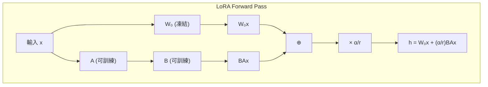
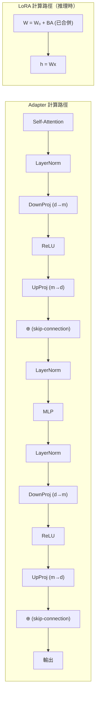

# LoRA: Low-Rank Adaptation 解讀

> **種子論文**: [LoRA: Low-Rank Adaptation of Large Language Models](https://arxiv.org/abs/2106.09685) (2021-06)
> **作者**: Edward J. Hu, Yelong Shen, Phillip Wallis et al.
> **機構**: Microsoft Corporation

---

## TL;DR

LoRA 要解決的是大模型時代全參數微調 (full fine-tuning) 成本過高的問題——每個下游任務需要儲存和部署一套完整的大模型，對 GPT-3 175B 等級的模型來說，這意味著每項任務 175B 參數的儲存開銷與巨量的 GPU 記憶體需求。LoRA 的核心直覺是：微調過程中權重的變化量 ΔW 具有低內在秩 (low intrinsic rank)，因此可以用一個低秩分解 ΔW = BA（其中 B 與 A 的秩 r ≪ d）來表示完整的參數更新量。LoRA 凍結原始預訓練權重 W₀，只訓練 B 與 A 兩組小矩陣。結果是：在 GPT-3 175B 上，LoRA 的可訓練參數減少了 10,000 倍、GPU 記憶體需求降低 3 倍，且效能不僅不輸全參數微調，在多項任務上甚至超越。

---

## 這篇論文在解決什麼問題？

在了解 LoRA 之前，先釐清一個根本問題：為什麼微調需要有效率？這不是學術上的吹毛求疵，而是工程上的生死存亡。

想像你是一家 SaaS 公司，提供 LLM 服務。每個客戶都有自己的領域——醫療、法律、金融——每個領域都需要一個微調後的模型。如果你的模型是 GPT-3 175B，每個客戶的微調版本就是你必須額外儲存 175B 參數。十個客戶就是 1.75TB 的模型權重。這還只是儲存——訓練時 Adam optimizer 需要為每個參數儲存 momentum（一階動量）和 variance（二階動量），這意味著每 1B 的可訓練參數需要大約 16GB 的 GPU 記憶體（以 FP32 計）。對 175B 參數微調來說，光是 optimizer states 就需要約 2.1TB 的 VRAM。

這不是抽象的問題。在 LoRA 提出的 2021 年，NVIDIA A100 只有 80GB VRAM。微調 GPT-3 175B 需要 26 張 A100 來儲存 optimizer states——還不算模型權重和梯度本身。這使得全參數微調對於大多數團隊來說是基礎設施上不可行的。

### 一個具體的數據對比

為了讓數字更有感，以下是三種不同規模模型在 full fine-tuning 與 LoRA 微調下的資源需求對比：

| 模型 | 參數量 | FT 可訓練參數 | LoRA 可訓練參數 | FT GPU 記憶體 | LoRA GPU 記憶體 |
|------|--------|--------------|----------------|--------------|----------------|
| RoBERTa base | 125M | 125M | 0.3M (0.24%) | ~3GB × (FT) | ~1.5GB × (推估) |
| RoBERTa large | 355M | 355M | 0.8M (0.23%) | ~8GB × | ~3GB × |
| GPT-3 175B | 175B | 175B | 4.7M (0.0027%) | ~1.2TB × | ~350GB × |

這裡的「×」是粗略估算，實際數字取決於 batch size、序列長度、模型並行配置等因素。但趨勢很清楚：**模型越大，LoRA 的記憶體節省越顯著**。這是因為 LoRA 的固定開銷（模型權重的前向傳播）隨模型規模線性增長，而可變開銷（optimizer states、梯度）隨可訓練參數規模增長——而後者在 LoRA 中被壓縮到極小值。

## 背景與動機

### 大模型微調的儲存噩夢

自然語言處理在 2018–2021 年間歷經了一場規模革命。從 BERT (110M 參數) 到 GPT-2 (1.5B)、再到 GPT-3 (175B)，模型規模的增長速度遠超過硬體成本的下降速度。在這種背景下，將一個預訓練模型適應到多項下游任務的傳統手段——全參數微調 (full fine-tuning)——開始暴露出根本性的問題。

全參數微調的流程很直接：載入預訓練權重 W₀，在下游任務資料上計算梯度，更新所有參數，得到 W₀ + ΔW。但這意味著每項任務都需要獨立儲存一套完整的模型。以 GPT-3 175B 為例：如果一個服務需要部署 10 個不同任務的微調版本，總儲存需求就是 10 × 175B = 1.75TB 的參數（還不算 optimizer states）。這不僅是儲存空間的問題，更嚴重的是 GPU 記憶體的消耗——訓練時 Adam optimizer 需要為每個參數儲存 momentum 與 variance，這使得記憶體需求達到參數量的 3 倍。對 175B 參數來說，光是 optimizer states 就需要超過 1TB 的 VRAM。

### 既有方法的嘗試

這個問題並非無人問津。在 LoRA 之前，學術界已經提出了幾條不同的路線：

#### Adapter 層

Houlsby et al. (2019) 提出了在 Transformer 層之間插入小型 bottleck 層的方法。預訓練權重凍結，只訓練這些 adapter 層。參數效率很高（每個任務約 3–5% 的額外參數），但有以下限制：

- **推理延遲**：Adapter 層是串聯在主路徑上的，在單樣本推理（batch size = 1）時，AdapterH 設計（每層兩個 adapter）增加了約 30% 的延遲，AdapterL（每層一個 adapter）增加了約 20%。
- **模型並行問題**：在分片環境中，額外的深度需要更多的 GPU 同步（AllReduce、Broadcast），延遲問題被進一步放大。

#### Prefix Tuning

Li & Liang (2021) 提出了一條完全不同的路線：不修改權重，而是在輸入序列前加上可訓練的「虛擬 token」。具體來說，Prefix Tuning 在每個 Transformer 層的 key 和 value 序列前添加可訓練的向量。這種方法完全消除了記憶體開銷（不需要儲存 optimizer states），但有兩個根本問題：

- **序列長度被佔用**：prefix token 佔用了可用於處理任務的序列長度。對於需要長語境的任務（如文件摘要），這是一個嚴重的限制。
- **訓練不穩定**：論文中觀察到 prefix tuning 的效能隨可訓練參數的增加非單調變化——更多參數不一定帶來更好效能。在 GPT-3 175B 上，PrefixEmbed 在參數從 0.4M 增加到 1.7M 時效能提升，但繼續增加到 6.4M 時效能反而下降。這個問題在後續的 Prompt Tuning (Lester et al., 2021) 中也有所體現。

#### BitFit

Ben-Zaken et al. (2021) 提出了最極簡的方案：只微調 bias 項。在 RoBERTa base 上，BitFit 僅用 0.1M 參數（少於 full fine-tuning 的 0.1%），在 GLUE 上的平均分數為 85.2（full fine-tuning 為 86.4）。雖然參數效率驚人，但與 full fine-tuning 仍有約 1.2 分的差距，且在不同任務上的表現波動較大（在 QQP 上 84.0 vs 91.9）。

#### 總結：既有方法的 trade-off 空間

| 方法 | 參數效率 | 推理延遲 | 訓練穩定性 | 模型品質 |
|------|---------|---------|-----------|---------|
| Full Fine-Tuning | 極差 | 無 | 穩定 | 最佳（理論上界） |
| Adapter | 良好 | +20–30% | 穩定 | 接近 FT |
| Prefix Tuning | 良好 | 無 | 不穩定 | 低於 FT |
| BitFit | 極佳 | 無 | 穩定 | 低於 FT（~1 分） |

從這張表可以看出，在 LoRA 出現之前，不存在一個同時做到「參數效率高、零推理延遲、訓練穩定、接近 FT 品質」的方法。每個現有方法都在至少一條維度上做出了犧牲。

這些方法各自有各自的 trade-off。Adapter 犧牲了推理效率，Prefix Tuning 犧牲了序列長度和訓練穩定性，BitFit 犧牲了模型品質。LoRA 試圖在參數效率、模型品質、推理效率三條軸線上同時取得最佳解。

---

## 核心知識點

本文圍繞以下知識點展開，從問題設定到數學推導、再到實驗驗證與限制：

1. **參數高效微調的問題設定**——為什麼全參數微調在大模型時代不敷使用
2. **低秩內在維度假說與其理論基礎**——Aghajanyan et al. 的發現與 LoRA 的核心假設
3. **LoRA 的數學定義**——ΔW = BA 的低秩分解與前向傳播公式
4. **零推理延遲的架構設計**——可合併權重 vs Adapter 的串聯延遲
5. **Adapter 的瓶頸架構**——兩者的設計空間與限制對比
6. **實驗配置與結果**——rank 選擇、適用層、GPT-3 上的驚人效能
7. **ΔW 與 W₀ 的子空間關係**——權重更新的內部分析

---

## 方法詳解

### 知識點 1: 參數高效微調的問題設定

**這個知識點要回答什麼問題？** 為什麼全參數微調在大模型時代成為瓶頸？數學上怎麼描述這個問題？

給定一個預訓練模型 $P(y|x)$，其參數為 $\Phi_0$，以及一個下游任務的資料集 $\mathcal{Z} = \{(x_i, y_i)\}_{i=1}^N$，其中 $x_i$ 是輸入序列（如自然語言查詢），$y_i$ 是輸出序列（如 SQL 指令）。全參數微調的目標是最大化條件語言模型目標：

$$
\max_{\Phi} \sum_{(x,y) \in \mathcal{Z}} \sum_{t=1}^{|y|} \log P_\Phi(y_t | x, y_{<t})
$$

這個優化問題的初始點是 $\Phi = \Phi_0$，經過若干步梯度下降後，最終參數為 $\Phi = \Phi_0 + \Delta\Phi$。

**關鍵問題**：$\Delta\Phi$ 的維度 $|\Delta\Phi|$ 等於 $|\Phi_0|$。對於 GPT-3 175B，$|\Phi_0| \approx 175 \times 10^9$。這意味著每項下游任務都需要獨立儲存和部署 175B 個浮點數。

LoRA 採用的是「編碼」觀點：將 $\Delta\Phi$ 進一步編碼為一個更小的參數集 $\Theta$，使得 $|\Theta| \ll |\Phi_0|$。目標函數變為：

$$
\max_{\Theta} \sum_{(x,y) \in \mathcal{Z}} \sum_{t=1}^{|y|} \log P_{\Phi_0 + \Delta\Phi(\Theta)}(y_t | x, y_{<t})
$$

如果 $|\Theta|$ 可以小到 $|\Phi_0|$ 的 0.01%（如 LoRA 在 GPT-3 上做到的），那麼儲存 100 個下游任務所需的總空間就從 $100 \times |\Phi_0|$ 變成 $|\Phi_0| + 100 \times |\Theta|$——一個巨大的節省。

**數學上，$|\Theta|$ 的下界是多少？**

這是一個困難的問題。如果 $\Delta\Phi$ 完全隨機，那麼 $|\Theta|$ 的下界就是 $|\Phi_0|$——沒有任何壓縮方法可以有效地表示一個隨機向量。但如果 $\Delta\Phi$ 有其結構（例如大部分參數接近零、或者集中於少數方向），那麼 $|\Theta|$ 可以遠小於 $|\Phi_0|$。LoRA 的核心假設正是：微調的權重更新 $\Delta\Phi$ 具有低秩結構，因此可以用 $r \ll d$ 的 $BA$ 分解來近似。

**相關論文 (Adapter) 怎麼處理？**

Houlsby et al. 採用另一種編碼形式：他們不在權重空間中編碼更新量，而是在網路架構中加入新的小型模組。Adapter 層是串聯在 Transformer 子層之後的額外神經網路層，其參數量遠小於原始模型。兩種方法共享相同的問題意識（參數效率），但編碼策略截然不同——Adapter 修改的是**網路深度**，LoRA 修改的是**權重更新的表示方式**。

---

### 知識點 2: 低秩內在維度假說與理論基礎

**這個知識點要回答什麼問題？** 我們有什麼理由相信 ΔW 可以是低秩的？

這個假設來自兩個關鍵的前期工作：

1. **Intrinsic Dimension** (Li et al., 2018; Aghajanyan et al., 2020)：這些工作發現，預訓練語言模型在隨機投影到一個極低維的子空間後，仍然可以有效地學習。換句話說，模型的有效自由度遠低於參數總數。

   Aghajanyan et al. (2020) 的實驗更具體：他們對 RoBERTa 的參數 $\Phi_0$ 施加一個隨機投影矩陣 $P \in \mathbb{R}^{d \times k}$（其中 $k \ll d$），然後只在低維空間 $\Phi_0 + P \cdot \Phi_{\text{sub}}$ 中訓練 $\Phi_{\text{sub}}$。他們發現，對於 GLUE 上的大多數任務，RoBERTa 的內在維度只需要約 200 維——也就是說，125M 參數的模型可以被壓縮到一個 200 維的子空間中，仍然能有效學習。

   這個結果具有深遠的意義。它說明了預訓練模型雖然參數量驚人，但模型實際的「靈活度」集中於少數方向。LoRA 將這個觀察從權重空間推廣到權重更新空間：如果模型本身具有低內在維度，那麼從 W₀ 到 W₀ + ΔW 的更新路徑也應該具有低秩結構。

2. **低秩結構在深度學習中的普遍性**：許多理論工作 (Oymak et al., 2019) 發現，過參數化的神經網路在訓練後的自然權重傾向於具有低秩結構。這意味著參數更新量 $\Delta W$（從 W₀ 到 W₀ + ΔW）也很可能集中在少數特徵方向上。

3. **低秩矩陣分解的近似定理**：根據 Eckart-Young 定理，對於任意矩陣 $M \in \mathbb{R}^{d \times k}$，其在 Frobenius 範數下最優的秩 $r$ 近似就是它的前 $r$ 個奇異值對應的 SVD 分解截斷。因此，如果 $\Delta W$ 的奇異值快速衰減（大部分能量集中在少數方向），低秩分解就是一個很好的近似。LoRA 的實驗證明了這一點：即使 $r=1$，GPT-3 175B 上的任務效能仍然很高，說明 $\Delta W$ 的奇異值衰減極快。

LoRA 的核心假設是微調的權重更新也具有低內在秩。形式化來說：對於預訓練權重矩陣 $W_0 \in \mathbb{R}^{d \times k}$，其更新量 $\Delta W$ 可以表示為：

$$
\Delta W = BA, \quad B \in \mathbb{R}^{d \times r}, \; A \in \mathbb{R}^{r \times k}
$$

其中 $r \ll \min(d, k)$。如果 $r$ 足夠小，這本身就是對低秩假設的驗證——因為如果 $\Delta W$ 的固有秩真的很高，低秩分解就無法準確近似它。

---

### 知識點 3: LoRA 的數學定義與前向傳播

**這個知識點要回答什麼問題？** LoRA 具體怎麼修改前向傳播？

考慮一個前饋層 $h = W_0 x$。在 LoRA 中，我們凍結 $W_0$（不計算梯度、不更新），並在旁邊並聯一個低秩分支：

$$
h = W_0 x + \Delta W x = W_0 x + BA x
$$

其中 $B \in \mathbb{R}^{d \times r}$、$A \in \mathbb{R}^{r \times k}$。由於 $r \ll \min(d, k)$，$BA$ 乘積的秩最多為 $r$。

**初始化策略：**
- $A$ 使用隨機高斯初始化（$\mathcal{N}(0, \sigma^2)$）
- $B$ 初始化為零矩陣
- 因此 $\Delta W = BA = 0$，在訓練開始時不改變原始行為

**縮放因子：**
LoRA 的輸出還乘以 $\frac{\alpha}{r}$，其中 $\alpha$ 是一個常數。論文發現，用 Adam 優化時，調整 $\alpha$ 大致等於調整學習率（前提是初始化適當縮放）。因此實務上將 $\alpha$ 設為第一個嘗試的 $r$ 值，之後改變 $r$ 時不需要重新調整超參數。

**為何選擇並聯而非串聯？**

這是 LoRA 與 Adapter 最根本的設計差異。Adapter 將 bottleck 層**串聯**在 Transformer 子層的輸出路徑上：

```
Adapter:  h ← SubLayer(x) → AdapterLayer(h) → LayerNorm → ...
```

而 LoRA 將權重更新**並聯**在原始權重上：

```
LoRA:     h ← W₀x + BAx → LayerNorm → ...
```

並聯的設計選擇有一個關鍵的數學後果：$\Delta W$ 的秩被**顯式限制**為 $r$。如果我們將 LoRA 應用到所有權重矩陣並訓練所有 bias，當 $r$ 增加到等於原始權重的滿秩時，LoRA 的表示力恰好收斂到 full fine-tuning。相比之下，Adapter 在參數增加時收斂到一個 MLP，Prefix Tuning 則會因序列長度被佔用而受限。



---

### 知識點 4: 零推理延遲的設計哲學

**這個知識點要回答什麼問題？** LoRA 如何在推理時完全消除額外計算？

這是 LoRA 最常被引用的優勢，也是它與 Adapter 之間最實務的差異。

**LoRA 的做法：**
由於 $W_0$ 和 $\Delta W = BA$ 在同一層中作用於相同的輸入 $x$，且兩者的輸出是逐元素相加，我們可以在訓練完成後直接計算：

$$
W = W_0 + BA
$$

然後將 $W$ 存回原始權重。在推理時，我們完全不需要載入或計算 $BA$。這意味著推理的計算圖和 full fine-tuning 一模一樣——沒有任何額外的矩陣乘法、沒有瓶頸層的非線性變換、沒有序列化的依賴。切換到下一個任務時，只需減去目前的 $BA$ 再加上新的 $B'A'$，這是一個極低成本的線性操作。

**Adapter 的做法（以及為何會有延遲）：**

Houlsby et al. 的 Adapter 層具有以下架構：

$$
\text{Adapter}(h) = \text{LayerNorm}(h + \text{UpProj}(\text{ReLU}(\text{DownProj}(h))))
$$

其中 DownProj 將 $d$ 維投影到 $m$ 維（$m \ll d$），UpProj 再投影回 $d$ 維。雖然 $m$ 很小，但這個 bottleck 層必須**串聯**在原本的計算路徑上：



雖然 Adapter 的參數量很少（通常 < 1%），但它增加了模型深度。在單樣本推理（batch size = 1）的場景下，深度增加意味著更多的順序計算。論文中的基準測試顯示，在 GPT-2 Medium 上，Adapter 的推理延遲增加了 20–30%（單樣本、短序列場景）。這個問題在模型並行（model parallelism）環境中更加嚴重，因為額外的深度需要更多的 GPU 同步操作（AllReduce/Broadcast）。

LoRA 的並聯設計從根本上避免了這個問題——因為可以合併，所以零延遲。

---

### 知識點 5: Adapter 的瓶頸架構與限制

**這個知識點要回答什麼問題？** Adapter 層的具體設計選擇以及為什麼它在參數效率和推理效率之間存在根本性權衡。

Houlsby et al. 提出的原始 Adapter 設計是：

**每個 Transformer 層插入兩個 adapter：**
- 一個在 Self-Attention 之後（在殘差連接之前）
- 一個在 FFN（MLP 子層）之後（在殘差連接之前）

**Adapter 層內部結構的數學描述：**

給定輸入 $h \in \mathbb{R}^d$，Adapter 層的輸出為：

$$
\text{Adapter}(h) = h + W_{\text{up}} \cdot \text{ReLU}(W_{\text{down}} \cdot h + b_{\text{down}}) + b_{\text{up}}
$$

其中：
- $W_{\text{down}} \in \mathbb{R}^{m \times d}$（下投影，降維）
- $W_{\text{up}} \in \mathbb{R}^{d \times m}$（上投影，還原）
- $b_{\text{down}} \in \mathbb{R}^m$，$b_{\text{up}} \in \mathbb{R}^d$
- $m \ll d$（瓶頸維度，控制參數量）

**參數量計算：** 每層總 adapter 參數為：

$$
\text{params}_{\text{layer}} = 2 \times (2 \times d \times m + d + m) \approx 4dm \quad (\text{當 } m \ll d)
$$

其中 $2\times$ 是因為每層有兩個 adapter。作為對比，LoRA 應用在 Wq 和 Wv 時的每層參數為：

$$
\text{params}_{\text{layer}}^{\text{LoRA}} = 2 \times 2 \times d \times r = 4dr
$$

兩者的參數效率關鍵差異在於：Adapter 的 bottleneck 維度 $m$ 需要應對整個層的隱藏表示，而 LoRA 的秩 $r$ 只需要捕捉權重更新 $\Delta W$ 的內在秩。由於 $\Delta W$ 的秩遠小於隱藏表示的維度，LoRA 可以在更小的 $r$ 值下達到與 Adapter 相當甚至更好的表現。

**為什麼 Adapter 要初始化為近零函數？** 這是訓練穩定的關鍵。論文發現，如果偏離單位映射太遠（例如標準差 > $10^{-2}$），模型會無法訓練。近零初始化的效果是：訓練開始時 adapter 幾乎不改變模型行為，然後在訓練過程中逐漸被激活。後續的消融實驗也顯示，刪除任何一層的 adapter 對效能的影響很小（< 2%），但刪除所有 adapter 後效能會下降到猜測 baseline——這說明 adapter 的整體效果是所有層的微小貢獻累積而來。

### Adapter 的推理延遲問題（已在前一個知識點討論）是其最根本的限制。即使在參數極少（0.37M vs 354M）的情況下，Adapter 在單樣本推理中的延遲仍然比 full fine-tuning 高出 2–22%（取決於序列長度）。

### 對兩者的綜合反思

有趣的是，LoRA 與 Adapter 雖然在工程實現上截然不同，但它們共享了一個深層的設計直覺：**下游任務所需的「適應性變化」在參數空間中佔據極小的體積**。Adapter 透過 bottleck 的維度 m 來限制變化量，LoRA 則透過秩 r 來限制。兩者都在問同一個問題：「要表達一個下游任務的適應性，參數的最小自由度是多少？」只是 Adapter 的回答是「一個小型的 bottleck 神經網路」，而 LoRA 的回答是「一個低秩矩陣更新」。

這個觀察在後續研究中得到了進一步的發展。例如 VeRA (Kopiczko et al., 2023) 發現連低秩矩陣的參數都不需要訓練——凍結隨機初始化的低秩矩陣、只訓練縮放向量，就能達到接近 LoRA 的效果。這進一步證明了適應性更新的路徑方向可能比路徑長度重要得多。

---

## 實驗結果

### 主要實驗

LoRA 的實驗涵蓋了三個維度：(1) 自然語言理解（NLU）上的 GLUE benchmark、(2) 自然語言生成（NLG）上的 E2E NLG Challenge、(3) 超大型模型 GPT-3 175B 上的壓力測試。

**RoBERTa base/large 在 GLUE 上的表現：**

| Method | #Params | MNLI | SST-2 | MRPC | CoLA | QNLI | QQP | RTE | STS-B | Avg |
|--------|---------|------|-------|------|------|------|-----|-----|-------|-----|
| RoBERTa base (FT) | 125.0M | 87.6 | 94.8 | 90.2 | 63.6 | 92.8 | 91.9 | 78.7 | 91.2 | 86.4 |
| AdapterD (Houlsby setup) | 0.9M | 87.3 | 94.7 | 88.4 | 62.6 | 93.0 | 90.6 | 75.9 | 90.3 | 85.4 |
| **LoRA** (r=8, Wq+Wv) | **0.3M** | **87.5** | **95.1** | **89.7** | **63.4** | **93.3** | **90.8** | **86.6** | **91.5** | **87.2** |

關鍵觀察：LoRA 只用 0.3M 可訓練參數（不到 full fine-tuning 的 0.3%），在平均分數上超越了 full fine-tuning（87.2 vs 86.4）。尤其在 RTE 這個小資料集（約 2.5K 訓練樣本）上，LoRA 以巨大優勢勝出（86.6 vs 78.7），顯示參數高效的方法在小資料集上正則化效果更強。

### GPT-2 Medium/Large 在 E2E NLG Challenge 上的表現

| Method | #Params | BLEU | NIST | METEOR | ROUGE-L | CIDEr |
|--------|---------|------|------|--------|---------|-------|
| GPT-2 M (FT) | 354.92M | 68.2 | 8.62 | 0.462 | 0.710 | 2.47 |
| GPT-2 M (AdapterL) | 0.37M | 66.3 | 8.41 | 0.450 | 0.698 | 2.40 |
| GPT-2 M (AdapterL) | 11.09M | 68.9 | 8.71 | 0.461 | 0.713 | 2.47 |
| GPT-2 M (PrefixLayer) | 0.35M | 69.7 | 8.81 | 0.461 | 0.714 | 2.49 |
| **GPT-2 M (LoRA)** | **0.35M** | **70.4** | **8.85** | **0.468** | **0.718** | **2.53** |
| GPT-2 L (FT) | 774.03M | 68.5 | 8.78 | 0.460 | 0.699 | 2.45 |
| **GPT-2 L (LoRA)** | **0.77M** | **70.4** | **8.89** | **0.468** | **0.720** | **2.47** |

關鍵觀察：在 NLG 任務上，LoRA 不僅超越了所有參數高效的方法，也超越了 full fine-tuning。這是一個重要的結果，因為 NLG 任務（相較於 NLU）通常被認為更依賴完整的模型容量。

### DeBERTa XXL (1.5B) 在 GLUE 上的表現

| Method | #Params | MNLI | SST-2 | MRPC | CoLA | QNLI | QQP | RTE | STS-B | Avg |
|--------|---------|------|-------|------|------|------|-----|-----|-------|-----|
| DeBXXL (FT) | 1500.0M | 91.8 | 97.2 | 92.0 | 72.0 | 96.0 | 92.7 | 93.9 | 92.9 | 91.1 |
| **DeBXXL (LoRA)** | **4.7M** | **91.9** | **96.9** | **92.6** | **72.4** | **96.0** | **92.9** | **94.9** | **93.0** | **91.3** |

DeBERTa XXL 上的結果尤其值得注意——1.5B 參數的模型，LoRA 僅用 4.7M（0.3%）的可訓練參數就超越了 full fine-tuning 的平均分數（91.3 vs 91.1）。

### GPT-3 175B 上的大規模實驗：

| Method | #Params | WikiSQL Acc. | MNLI-m Acc. | SAMSum R1/R2/RL |
|--------|---------|-------------|-------------|-----------------|
| Fine-Tune | 175,255.8M | 73.8 | 89.5 | 52.0/28.0/44.5 |
| AdapterH | 40.1M | 73.2 | 91.5 | 53.2/29.0/45.1 |
| AdapterH | 7.1M | 71.9 | 89.8 | 53.0/28.9/44.8 |
| PrefixLayer | 20.2M | 70.1 | 89.5 | 50.8/27.3/43.5 |
| **LoRA** (r=8) | **4.7M** | **73.4** | **91.7** | **53.8/29.8/45.9** |
| **LoRA** (r=64) | **37.7M** | **74.0** | **91.6** | **53.4/29.2/45.1** |

關鍵觀察：LoRA（r=8，僅 4.7M 參數，不到 full fine-tuning 的 0.003%）在三項任務上都達到了最佳效能。在 WikiSQL 上，LoRA 的表現（73.4）幾乎與 full fine-tuning（73.8）持平；在 MNLI-m 上甚至更高（91.7 vs 89.5）。值得注意的是 prefix-based 方法在增加參數時效能反而下降（PrefixEmbed 從 0.4M 到 6.4M 時 WikiSQL 從 55.9 降到 63.1 → 又回到 55.9），印證了前文討論的訓練不穩定問題。

，在與方法詳解中使用的超參數相同的前提下）。  

**低資料量場景（Low-Data Regime）：**

| Method | MNLI-100 | MNLI-1k | MNLI-10k | MNLI-Full |
|--------|----------|---------|----------|-----------|
| Fine-Tune | 60.2 | 85.8 | 88.9 | 89.5 |
| PrefixEmbed | 37.6 | 75.2 | 79.5 | 88.6 |
| PrefixLayer | 48.3 | 82.5 | 85.9 | 89.6 |
| **LoRA** | **63.8** | **85.6** | **89.2** | **91.7** |

這個表格非常有意思。在極低資料量（MNLI-100，僅 100 個訓練樣本）下，LoRA 是唯一能夠超越 full fine-tuning 的方法（63.8 vs 60.2），而 PrefixEmbed 甚至只比隨機猜測（33.3%）好一點點（37.6%）。PrefixLayer 的表現（48.3）也遠不及 LoRA。這說明 LoRA 在資料稀缺時的正則化效果特別顯著——因為可訓練參數極少，模型不容易對有限的訓練樣本過擬合。

**消融實驗：哪些權重矩陣最適合應用 LoRA？**

論文在 GPT-3 175B 上進行了系統性實驗，固定參數預算為 18M，比較不同權重類型的組合：

| Weight Type | r | WikiSQL | MNLI |
|-------------|---|---------|------|
| Wq (僅 query) | 8 | 70.4 | 91.0 |
| Wk (僅 key) | 8 | 70.0 | 90.8 |
| Wv (僅 value) | 8 | 73.0 | 91.0 |
| Wo (僅 output) | 8 | 73.2 | 91.3 |
| Wq + Wk | 4 | 71.4 | 91.3 |
| **Wq + Wv** | **4** | **73.7** | **91.3** |
| Wq + Wk + Wv + Wo | 2 | 73.7 | 91.7 |

關鍵發現：(1) 同時對 Wq 和 Wv 應用 LoRA 效果最佳；(2) 只對 Wq 或 Wk 應用的話，即使分配更多參數（r=8 vs r=4），效能也顯著較差；(3) 將參數分散到更多類型的權重（Wq+Wk+Wv+Wo，每個 r=2）與集中在 Wq+Wv（r=4）效果相當。結論：同一類型的權重用更大的 rank 不如將 LoRA 應用到更多類型的權重。

**Rank 的影響：**

在 GPT-3 175B 上，令人驚訝的是 r=1 就足夠了——Wq+Wv+r=4 在 WikiSQL 上已經達到 73.7，而 r=64 稍微提升到 73.8。論文推測這說明了大模型的適應性更新確實具有極低的內在秩。

在 GPT-2 Medium（354M）上，最優 rank 落在 4–16 之間，略高於 GPT-3。這意味著模型規模與最優 rank 之間並非單純的線性關係，而是一個目前仍未完全理解的開放問題。

### 限制與批評

論文自身承認的限制，以及我讀完後認為值得注意的面向：

1. **混合 batch 不直接支援**：如果將 $BA$ 合併進 $W_0$（以獲得零推理延遲），就無法在同一個 batch 中同時對不同樣本使用不同的 LoRA 模組。雖然可以不合併然後動態選擇，但這犧牲了延遲優勢。

2. **僅關注 Attention 權重**：論文的實驗限定在 Self-Attention 中的四個權重矩陣（Wq、Wk、Wv、Wo），沒有系統性探索 MLP 層、LayerNorm 層或 bias 項的 LoRA。後續工作（如 QLoRA 的實驗）顯示，對 MLP 層應用 LoRA（與 attention 層一起）通常能進一步提升效能，但論文沒有探索這個維度。

3. **秩的理論理解不足**：雖然經驗上發現極低 rank（r=1 或 2）在 GPT-3 上已足夠，但「為什麼大模型需要的 rank 似乎更小」仍然是個開放問題。一種猜測是：更大的模型在預訓練中學到了更豐富的特徵表示，因此下游任務只需要微調更少的參數就能達到適應。但這個猜想缺乏理論證明。

4. **不支援跨任務 batch 推理**：如果將 LoRA 權重合併回 W₀（以獲得零延遲），則無法在單個 forward pass 中同時處理需要不同 LoRA 模組的樣本。這在需要同時服務多個任務的場景中是一個實務限制。雖然可以選擇不合併，但這又會回到有少量延遲的狀態。

5. **理論基礎與低秩假設的驗證不足**：雖然論文引用了 Li et al. (2018a) 和 Aghajanyan et al. (2020) 來支持「權重更新具有低內在秩」這個核心假設，但這個假設本身缺乏嚴格的理論證明。論文第 7 節的實驗分析是事後（post-hoc）驗證，不是事前（a priori）保證。

6. **與 Adapter 的公平比較爭議**：論文中與 Adapter 的比較使用了原始的 Houlsby 設計（AdapterH 和 AdapterL）。後來的工作（如 KronA、Compacter）提出了更高效的 Adapter 變體，LoRA 與這些新變體的比較有待補充。此外，Adapter 論文在 GLUE 上的結果是基於 BERT，而 LoRA 的比較是基於 RoBERTa——雖然兩者相關但不是完全相同的基底模型。

7. **跨領域泛化尚未驗證**：論文的實驗完全集中在 NLP 任務（NLU 和 NLG）。LoRA 是否同樣適用於視覺模型（如 ViT）、語音模型、多模態模型，論文沒有給出任何實驗證據。後續的工作（如 LoRA 在 Stable Diffusion 中的應用）填補了這部分空白，但論文本身沒有。

8. **訓練效率提升的實際極限**：雖然論文報告了訓練吞吐量提升 25%，但這個數字是在特定條件下（GPT-3 175B、模型並行）測得的。在小模型上（如 RoBERTa base 125M），LoRA 的訓練速度提升不明顯，因為 W₀ 的前向傳播仍然需要完整計算。在這些場景下，LoRA 的主要優勢來自參數效率和儲存節省，而非訓練速度。

### ΔW 與 W₀ 的子空間分析細節

論文第 7 節包含了我認為最有趣但也最容易被忽略的實驗。以下是這些分析的詳細解讀：

**子空間相似度的定義：**

為了衡量 $\Delta W$ 和 $W_0$ 的關係，論文使用以下相似度度量：令 $\mathbf{U}^{A}_i \in \mathbb{R}^{d \times i}$ 和 $\mathbf{U}^{B}_j \in \mathbb{R}^{d \times j}$ 分別為 $A$ 和 $B$ 的左奇異矩陣的前 $i$ 和 $j$ 個列向量（對應最大的奇異值），則相似度為：

$$
\phi(A, B, i, j) = \frac{\|\mathbf{U}^{A\top}_i \mathbf{U}^{B}_j\|^2_F}{\min\{i, j\}}
$$

這個度量在 $[0, 1]$ 之間。如果兩個子空間完全重合，$\phi = 1$；如果完全正交，$\phi = 0$。

**關鍵發現 1：$\Delta W$ 不包含 $W_0$ 的主要方向。**

論文將 $r=4$ 的 $\Delta W = W_{q,\text{LoRA}}$ 與 $W_0 = W_q$（原始的 query 投影矩陣）進行比較。結果顯示 $\phi(W_q, \Delta W_{r=4}, i, j)$ 在所有層級上都低於 0.2。這意味著 $\Delta W$ 學習到的前 4 個方向與 $W_q$ 的頂部奇異方向幾乎沒有重疊。

**關鍵發現 2：$\Delta W$ 放大 $W_0$ 中未被強調的方向。**

論文定義了一個「放大因子」：

$$
\text{amplification} = \frac{\|U^\top \Delta W V\|_F}{\|\Delta W\|_F}
$$

其中 $U$ 和 $V$ 是 $W_0$ 的左右奇異矩陣。$U^\top \Delta W V$ 本質上是 $\Delta W$ 在 $W_0$ 特徵方向上的投影。

對於 $r=4$，這個放大因子高達 20。這意味著：在每層 Transformer 中，大約有 4 個特徵方向（從整個預訓練特徵空間中選出）需要被放大約 20 倍，才能達到論文報告的下游任務準確率。

對於 $r=64$，放大因子降至約 2。這意味著當 rank 增大時，$\Delta W$ 開始包含許多不需要被放大的方向。從另一個角度看，這也證明了適應性所需的內在秩確實很低——只需要 4 個方向就足夠了，額外的 60 個方向幾乎沒有貢獻。

```mermaid
flowchart LR
    subgraph W0["W₀ (預訓練權重)"]
        direction TB
        S1["主奇異方向 (主要特徵)"]
        S2["次要奇異方向"]
        S3["微弱方向 ★"]
    end

    subgraph DeltaW["ΔW = BA (LoRA 更新)"]
        D1["方向 1: 放大 ~20×"]
        D2["方向 2: 放大 ~20×"]
        D3["方向 3: 放大 ~20×"]
        D4["方向 4: 放大 ~20×"]
    end

    S3 -.->|"ϕ < 0.2 低相似度"| D1
    S1 -.->|"ϕ ≈ 0（正交）"| D1

    note["ΔW 提取 W₀ 中微弱但任務相關的方向\n並大幅放大它們\n（放大因子 ~20× for r=4）"]


5. **未涵蓋的場景**：LoRA 沒有在純視覺模型、多模態模型等非 Transformer 語言模型上進行系統性評估。

### 訓練效率的詳細分析

除了模型品質之外，LoRA 在訓練效率上的提升同樣值得仔細分析。

**記憶體節省的來源：**

在 full fine-tuning 中，Adam optimizer 需要為每個可訓練參數儲存三份拷貝：參數本身的權重 ($\theta$)、momentum ($m_t$，一階動量估計)、variance ($v_t$，二階動量估計)。這意味著實際的 GPU 記憶體需求大約是可訓練參數量的 **3 倍**（以相同精度計算）。對於 GPT-3 175B，這意味著光是 optimizer states 就需要約 2.1TB 的記憶體（175B × 4 bytes × 3 ≈ 2.1TB）。

LoRA 將可訓練參數從 175B 降至約 4.7M（r=8，只訓練 Wq 和 Wv），因此 optimizer states 僅需約 56MB。再加上模型權重（約 350GB 以 FP16 儲存）和梯度，總 GPU 記憶體需求從約 1.2TB 降至約 350GB——**減少了 3 倍**。

**訓練吞吐量的提升：**

在 GPT-3 175B 上，full fine-tuning 的訓練吞吐量為每個 V100 GPU 每秒 32.5 tokens。在相同的模型並行配置下，LoRA 的吞吐量達到每秒 43.1 tokens——提升了約 **25%**。這個提升來自兩個方面：

1. **不需要計算凍結參數的梯度**：雖然前向傳播仍然需要計算完整的 W₀x（無法跳過），但反向傳播只需要對 $A$ 和 $B$ 計算梯度，跳過了對 $W_0$ 的梯度計算。
2. **不需要更新 optimizer states**：Adam 對凍結參數的 momentum 和 variance 更新也被跳過。

**實際部署的儲存節省：**

這是 LoRA 最具實務影響力的面向。假設一個服務有 100 個不同的下游任務：

- Full fine-tuning: 100 × 350GB = 35TB 的模型權重
- LoRA: 1 × 350GB（共享的預訓練模型）+ 100 × 35MB（LoRA 模組）= 353.5GB

節省了約 **100 倍**的儲存空間。而且任務切換只需要載入 35MB 的 LoRA 權重（約 0.1 秒，取決於儲存頻寬），而不是 350GB 的完整模型（約數分鐘）。

### 訓練超參數的具體設定

從論文的附錄中可以找到訓練超參數的具體設定，了解這些能幫助理解 LoRA 在實務中的使用方式：

**RoBERTa base 在 GLUE 上的超參數（LoRA）：**

| 超參數 | 值 |
|--------|-----|
| Optimizer | AdamW |
| 學習率 | 1e-4（LoRA 模組）/ 2e-5（bias） |
| Batch size | 32（所有任務統一） |
| 序列長度 | 128 |
| 學習率排程 | Linear decay |
| 訓練 epoch | 10–40（依任務而定） |
| Warmup ratio | 6% |
| LoRA rank r | 8 |
| LoRA α | 8 |
| Weight decay | 0.1（只作用於 LayerNorm bias） |
| LoRA 目標 | Wq, Wv |

**GPT-3 175B 在 WikiSQL 上的超參數（LoRA）：**

| 超參數 | 值 |
|--------|-----|
| Optimizer | AdamW |
| 學習率 (LoRA) | 2e-4 |
| 學習率 (bias) | 1e-4（僅訓練 LoRA + bias） |
| Batch size | 256 |
| 訓練 tokens | 250K |
| Warmup tokens | 40K |
| LoRA rank r | 8（r=4 用於多權重組合時） |
| LoRA α | 8 |
| LoRA 目標 | Wq, Wv |

注意到 LoRA 的學習率（2e-4）比 full fine-tuning 的學習率（5e-6）高出約 40 倍。這是因為 LoRA 只訓練極少數參數，每個可訓練參數需要承擔更多的學習責任。這個差異也是 LoRA 實務中使用的主要陷阱之一——如果使用與 full fine-tuning 相同的學習率，LoRA 模組幾乎不會更新。

---

## 與相關工作的對比

以下表格總結了三種參數高效微調方法的核心差異：

| 維度 | Full Fine-Tuning | Adapter (Houlsby 2019) | LoRA (Hu 2021) |
|------|-----------------|----------------------|----------------|
| 架構策略 | 更新全部權重 | 插入新層（串聯） | 權重旁路（並聯） |
| 額外參數/任務 | 100% | 0.5–8% | < 0.01% |
| 推理延遲 | 無 | +2–30%（單樣本） | 無（可合併） |
| 訓練記憶體節省 | 無 | 中等（凍結主幹） | 最高（減少 3×） |
| 任務切換成本 | 載入全新模型 | 載入新 adapter 層 | 線性加減 BA 矩陣 |
| 序列長度影響 | 無 | 無 | 無 |
| 大模型可擴展性 | 極差（GPT-3 1.2TB VRAM） | 中等（同步瓶頸） | 最佳（350GB） |
| 收斂行為 | 標準 SGD/Adam | 穩定（近零初始化） | 穩定（零起點初始化） |

左欄 Full Fine-Tuning 是參數效率的終極反面——效果最好但成本最高。Adapter 透過犧牲推理效率換取參數效率。LoRA 則在參數效率與推理效率之間取得無妥協的解——但代價是引入了低秩假設這個設計約束。

---

## LoRA 的實際使用方法

了解 LoRA 的理論之後，看看實際使用中需要注意的實務細節：

### 超參數設定

LoRA 的主要超參數只有三個：

1. **秩 r**：控制低秩分解的維度。在 GPT-3 175B 上 r=1 已足夠，小型模型（GPT-2 354M）建議 r=4–16。實務上 r=8 是一個安全的預設值。

2. **縮放因子 α**：控制更新量的幅度。論文建議將 α 設為第一次嘗試的 r 值，後續改變 r 時不需要調整 α。如果 α 太小，學習會很慢；如果太大，訓練會不穩定。

3. **目標權重矩陣**：論文建議同時對 Wq 和 Wv 應用 LoRA。如果參數預算允許，對 Wq、Wk、Wv、Wo 全部應用（以較小的 r）效果更好。

### 與其他 LoRA 模組的組合

LoRA 之間可以線性組合：如果需要同時使用多個 LoRA 模組（如風格 + 知識），可以將它們的輸出相加：

$$
h = W_0 x + \sum_{k=1}^{K} B_k A_k x
$$

這使得 LoRA 非常適合做模組化組合——你可以訓練不同面向的 LoRA，然後在推理時動態加權組合。

### 與量化的搭配

LoRA 與模型量化是天然搭檔：預訓練權重 W₀ 可以量化為 4-bit 或 8-bit（使用 bitsandbytes 等函式庫），而 LoRA 的 A 和 B 保持 FP16 精度。QLoRA (Dettmers et al., 2023) 正是利用這個特性，讓 65B 的 LLaMA 模型可以在單張消費級 GPU（如 RTX 3090 24GB）上微調。

### 常見陷阱

- **不要在 LoRA 權重上使用 weight decay**：因為 A 和 B 被初始化為零（B）和高斯（A），如果在訓練初期對它們施加 weight decay，B 會被困在零附近。
- **不要對 bias 項使用 LoRA**：LoRA 是為權重矩陣設計的，對偏置（bias）項直接微調即可。
- **注意學習率的配合**：LoRA 模組通常需要比 full fine-tuning 更高的學習率（約 1–2 個數量級），因為可訓練參數少，每個參數承擔更多的學習責任。

---

## 我的觀察

**1. 低秩假設是 LoRA 最美麗也最脆弱的部分。**

說它美麗，是因為這個假設來自對「權重更新為什麼可以很小」的深刻觀察——微調不是在學習全新的特徵，而是在放大預訓練中已經存在但未被強調的方向。論文第 7 節的子空間分析（§7.3）證明了這一點：ΔW 與 W₀ 的前若干奇異方向之間的相似度不到 0.2，而放大因子高達 20 倍。這是一個非常優雅的結果。

說它脆弱，是因為這個假設依賴於「預訓練模型的特徵空間已經包含了下游任務所需的方向」。如果預訓練和下游任務的分布偏移過大（例如預訓練在英文文本、微調在日文音訊上），低秩性質可能不再成立。

**2. 10,000× 參數減少的數字需要謹慎解讀。**

這個驚人數字來自 checkpoint 大小的比較：35MB vs 350GB。但這 350GB 是包含完整 175B 參數的模型權重，而 LoRA 仍需要載入完整 350GB 的預訓練權重——只是不需要為每個任務複製一份。正確的理解應該是：「100 個任務總共只需要 350GB + 35MB × 100 = 353.5GB，而不是 100 × 350GB = 35TB。」這是部署角度的巨大節省，但不是訓練角度的 10,000× 參數減少。

**3. LoRA 的影響力遠超論文本身。**

這篇論文被引超過萬次，很大程度來自它的實用性。HuggingFace PEFT 函式庫將 LoRA 做為核心方法，QLoRA（量化 + LoRA）讓 65B 模型的微調可以在單張消費級 GPU 上完成。在某種意義上，LoRA 對 LLM 微調的普及貢獻可能比論文宣稱的基準測試成績更大——它讓「每個人」都有能力微調大型模型，而不只是擁有大量 GPU 的機構。

**4. 關於低秩假設的潛在矛盾。**

論文的實驗（§7.4）顯示：當 r 從 4 增加到 64 時，放大因子從 20 下降到 2。這意味著 rank 增加時，新增的方向幾乎不被放大。但同時，實驗也顯示 r=64 的效能並不比 r=4 差太多（甚至在某些任務上略好）。這似乎暗示：模型能夠「忽略」那些不需要的方向，而不是被它們干擾。這是一個值得深思的性質——低秩更新的冗餘方向不會損害效能。

但更值得追問的問題是：**如果 rank r 對效能的影響這麼小（r=1 到 r=64 的結果差異很小），那 LoRA 到底在學習什麼？** 如果主要的效能來自於選擇了「哪些方向」而非「方向的數量」，那 LoRA 的設計可能不是最優的。後續的 DoRA (Liu et al., 2024) 和 PiSSA (Meng et al., 2024) 正是從這個角度出發：DoRA 將權重分解為大小與方向，PiSSA 則對 W₀ 做 SVD 分解後用主奇異分量初始化 LoRA 模組。

5. **Adapter 與 LoRA：被忽略的互補性。**

雖然論文中將 Adapter 定位為競爭對手，但後來的研究顯示兩者有很強的互補性。Adapter 的 bottleneck 結構包含非線性變換（ReLU），這讓它的表達力在理論上超過了純線性的 LoRA。而 LoRA 的並聯設計可以與 Adapter 同時使用——在 attention 層用 LoRA，在 FFN 層用 Adapter。這種混合使用在實際應用中可能比單一方法更好，但論文中沒有探索這個方向。

**5.1 LoRA 什麼時候可能不夠好？**

雖然 LoRA 在大多數任務上表現出色，但有幾種情境下它的低秩假設可能不成立：

1. **領域偏移過大**：如果下游任務與預訓練資料的分布差距極大（例如，將一個在英語維基百科上預訓練的模型微調到中文醫療領域），所需的權重更新量 $\Delta W$ 可能不再具有低秩結構。在這種情況下，低秩分解 $BA$ 的近似誤差會很大。

2. **需要大量參數變化的任務**：某些任務（如學習全新的輸出格式或語言）可能需要更多的參數變化。論文中的實驗顯示，在 GPT-3 上 r=1 就足夠了，但在 GPT-2 Medium 上最優 rank 是 4–16。這暗示模型規模與所需 rank 之間存在負相關——較小的模型可能需要更高的 rank。

3. **與模型並行策略的互動**：在超大規模模型（如 GPT-3 175B）中，權重被分片到多個 GPU 上。LoRA 的低秩矩陣需要與這些分片權重互動，在極端的分片策略下可能引入額外的通訊開銷。

6. **對後續研究的深遠影響。**

LoRA 不僅改變了微調的實務，也改變了我們對「模型適應性」的理論理解。它提供了一個簡單而強大的框架來回答「一個下游任務需要改變模型多少？」這個根本問題。此後的 DoRA、VeRA、PiSSA、LoRA+ 等工作都是在這個框架內探索更優的參數化方式。從這個角度來看，LoRA 最大的貢獻或許不是它的效能，而是它定義了一個可以持續發展的研究範式。

---

## 延伸閱讀

### Dependency Papers（本文涵蓋）

1. **Parameter-Efficient Transfer Learning for NLP** ([1902.00751](https://arxiv.org/abs/1902.00751))
   - Houlsby et al., ICML 2019
   - 與本文關係：Adapter 方法的原始論文，LoRA 的核心對比 baseline。在相同的問題設定（參數高效微調）下提出了不同的解答（串聯 bottleck 層 vs 並聯低秩分解）
   - 實際看到 Adapter 的設計選擇（兩層 bottleck，近零初始化，僅 3.6% 參數達到 full fine-tuning 的 99.6% 效能），才能理解 LoRA 的創新點在哪裡

### 需要進一步理解 Adapter 的設計動機

為什麼 Houlsby et al. 選擇了 bottleck 架構而不是其他形式？論文中測試了多種設計，最終選擇了 Bottleneck → ReLU → UnBottleneck + Skip-connection 的結構。這個設計有兩個關鍵優勢：

1. **參數效率**：Bottleck 維度 m 可以直接控制參數量——m 越小，參數越少，但模型容量也越小。這提供了一個平滑的參數-效能權衡曲線。
2. **初始化穩定性**：Skip-connection 配合近零初始化的權重，確保訓練開始時 adapter 近似於單位映射，不破壞預訓練模型的行為。

Adapter 論文還有一個常被忽略的發現：**底層（lower layers）的 adapter 對最終效能的影響遠小於高層（higher layers）的 adapter**。這支援了遷移學習中的一個經典觀點——底層學習通用特徵，高層學習任務特定特徵。這個發現對後續的參數高效微調研究有深遠影響，也間接支援了 LoRA 的「只需微調少數層或少數權重」的核心直覺。

### 深入 Adapter 的 GLUE 結果與 LoRA 的對比

為了讓 Adapter 與 LoRA 的比較更具體，這裡列出兩者在相似規模模型上的 GLUE 成績：

**Adapter (Houlsby et al.) 在 BERTLARGE (330M) 上的結果：**

| Method | #Params | CoLA | SST-2 | MRPC | STS-B | QQP | MNLI | QNLI | RTE | Avg |
|--------|---------|------|-------|------|-------|-----|------|------|-----|-----|
| Full FT | 100% | 60.5 | 94.9 | 89.3 | 87.6 | 72.1 | 86.7 | 94.0 | 70.1 | 80.4 |
| Adapter (8-256) | 3.6% | 56.9 | 94.2 | 89.6 | 87.3 | 71.8 | 85.3 | 94.0 | 71.5 | 80.0 |
| Adapter (64) | 2.1% | 59.5 | 94.0 | 89.5 | 86.9 | 71.8 | 84.9 | 94.2 | 68.8 | 79.6 |

**LoRA (Hu et al.) 在 RoBERTabase (125M) 與 RoBERTalarge (355M) 上的結果：**

| Method | #Params | CoLA | SST-2 | MRPC | STS-B | QQP | MNLI | QNLI | RTE | Avg |
|--------|---------|------|-------|------|-------|-----|------|------|-----|-----|
| FT (125M) | 100% | 63.6 | 94.8 | 90.2 | 91.2 | 91.9 | 87.6 | 92.8 | 78.7 | 86.4 |
| LoRA (0.3M) | 0.24% | 63.4 | 95.1 | 89.7 | 91.5 | 90.8 | 87.5 | 93.3 | 86.6 | 87.2 |

雖然 Adapter 和 LoRA 的基底模型不同（BERT vs RoBERTa），無法直接比較絕對數值，但可以比較「與 full fine-tuning 的差距」：

- Adapter（最佳配置）：FT 80.4 → Adapter 80.0，差距 **-0.4%**
- LoRA（最佳配置）：FT 86.4 → LoRA 87.2，差距 **+0.8%（超越 FT）**

LoRA 不僅縮小了與 full fine-tuning 的差距，還在部分任務上超越了它。這在 Adapter 的時代是未曾出現的結果。特別是在 RTE 這個只有約 2.5K 訓練樣本的資料集上，LoRA 的表現（86.6）遠超 full fine-tuning（78.7），說明了極小參數量的正則化效應在小資料集上的顯著優勢。

### 從 Adapter 到 LoRA 的技術演化脈絡

回顧這條技術路線的演化，可以看到一個清晰的模式：

1. **2019 — Adapter (Houlsby et al.)**：提出在預訓練模型中插入小型可訓練模組。串聯架構，推理時延遲增加。
2. **2021 — Prefix Tuning (Li & Liang)**：不修改權重，修改輸入。免除推理延遲，但訓練不穩定且佔用序列長度。
3. **2021 — LoRA (Hu et al.)**：不修改架構也不修改輸入，用低秩分解編碼權重更新。並聯設計，零推理延遲，最佳的參數-效能權衡。
4. **2023 — QLoRA (Dettmers et al.)**：將 LoRA 與 4-bit 正規化量化（NF4）結合，使大型模型微調可以在消費級 GPU 上完成。驗證了 LoRA + 量化的天然相容性。
5. **2024 — DoRA (Liu et al.)**：將權重分解為大小（magnitude）和方向（direction）分量。在 LoRA 的框架上加入 direction 校正，持續提升效能。

這一連串的進步有一個共同的主題：**如何在完全不改變預訓練模型結構的前提下，以最小的參數成本實現有效的適應？** LoRA 給出了一個接近最優的答案——低秩分解是目前已知的、在線性空間中參數效率最高的表示方式之一。

### 後續發展（未涵蓋，僅列出）

- [QLoRA: Efficient Finetuning of Quantized Language Models](https://arxiv.org/abs/2305.14314) (Dettmers et al., 2023) — 將 LoRA 與 4-bit 量化結合，使 65B 模型可在單張 GPU 上微調
- [LoRA-FA: LoRA with Feature-based Adaptation](https://arxiv.org/abs/2305.14706) (2023) — 只訓練增量矩陣的 A（而非 BA），進一步減少記憶體
- [DoRA: Weight-Decomposed Low-Rank Adaptation](https://arxiv.org/abs/2402.09353) (Liu et al., 2024) — 將權重分解為大小與方向，對 LoRA 進行改進
- [VeRA: Vector-based Random Matrix Adaptation](https://arxiv.org/abs/2310.11454) (Kopiczko et al., 2023) — 凍結隨機初始化的低秩矩陣，只訓練縮放向量
- [LoRA+: Efficient Low-Rank Adaptation of Large Models](https://arxiv.org/abs/2402.12354) (2024) — 對 B 和 A 使用不同學習率的理論分析
- [PiSSA: Principal Singular Values and Singular Vectors Adaptation](https://arxiv.org/abs/2404.02948) (Meng et al., 2024) — 對 W₀ 做 SVD 分解，用主奇異分量初始化 LoRA 模組

---

## 引用

完整 BibTeX 見 [`papers.bib`](./papers.bib)。
