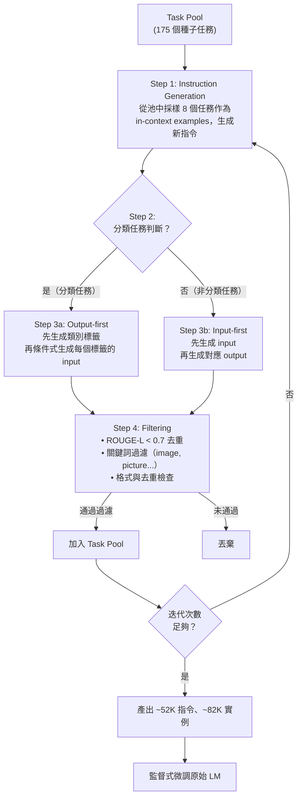

# Self-Instruct: 自我引導式指令生成方法導讀

## TL;DR

1. **Self-Instruct** 是一種讓語言模型透過自助式（bootstrapping）生成自己的指令微調（instruction tuning）資料的方法，大幅降低對人工標註的依賴——僅需 175 個種子任務即可啟動。
2. 核心流程包含四個階段：從種子任務出發讓 LM 迭代生成新指令 → 判斷任務類型（分類/非分類）→ 用對應策略（Input-first / Output-first）生成輸入輸出實例 → 過濾低品質或重複資料。
3. 在 GPT-3 上應用此方法，在 Super-NaturalInstructions 測試集上取得 **33.1% 的絕對進步**，效能與使用數十名標註人員數月工作訓練的 InstructGPT-001 幾乎持平（ROUGE-L 39.9 vs 40.8，僅差 5% 的 human evaluation gap）。

---

## 1. 背景與動機

### 1.1 從語言模型到指令遵循

大型語言模型（LLM）經過大規模預訓練後——典型如 GPT-3 在數 TB 的網路文本上訓練——雖然具備強大的語言理解與生成能力，但它們往往無法精確遵循使用者的指令。這個問題有一個根本性的原因：語言模型的預訓練目標是「預測下一個 token」，而這個目標與「遵循使用者意圖」這件事情本質上是不一致的。

舉一個具體的例子：當使用者問「請用三句話解釋什麼是愛因斯坦的相對論」時，一個未經指令微調的 GPT-3 可能會繼續生成更多關於相對論的細節，或者偏離到完全不同的話題，而不是「恰好用三句話回答然後停下來」。這個問題在論文中被量化為：vanilla GPT-3 在 SUPERNI 測試集上的 ROUGE-L 僅 6.8（滿分 100），基本上等同於隨機生成。

為了解決這個問題，**指令微調（instruction tuning）** 成為一個關鍵技術方向。其核心想法非常直接：收集大量「指令 → 正確輸出」的配對資料，然後用這些資料對預訓練模型進行監督式微調，讓模型學會「當收到一個指令時，應該產生什麼樣的回應」。這條路線的代表工作包括：

- **FLAN**（Wei et al., 2021）：將 62 個 NLP 資料集轉換為指令格式，在 T5 模型上進行微調，證明了指令微調可以顯著提升零樣本泛化能力
- **T0**（Sanh et al., 2022）：進一步擴展到更多資料集，並系統性地研究了 prompt 格式對泛化效能的影響

這些工作共同確立了一個重要的發現：**多樣化的指令訓練資料是零樣本泛化的關鍵**。但這也同時暴露了一個瓶頸——這些多樣化的指令資料從哪裡來？

### 1.2 人工指令資料的三重困境

傳統指令微調依賴一個昂貴的資源：**人工撰寫的指令資料**。像是 PromptSource（Bach et al., 2022）和 Super-NaturalInstructions（Wang et al., 2022，簡稱 SUPERNI）這類資料集，雖然品質高，但它們的製作需要大量的人力投入——每個任務都需要人類專家來撰寫指令定義、設計輸入格式、並給出正確的輸出範例。

這帶來了三個根本性的限制：

**成本困境**：招募、培訓標註人員並確保品質一致性，需要大量資金和時間。InstructGPT 的研究團隊僱用了約 40 名透過 Upwork 和 ScaleAI 招募的合約人員，整個資料收集過程持續了數月。這對於學術實驗室而言幾乎無法複製。

**多樣性困境**：人類撰寫的任務往往偏向傳統的 NLP 任務——分類、問答、摘要、抽取——因為這些是 NLP 研究者最熟悉的任務類型。但真實使用者的需求遠比這些廣泛，涵蓋創意寫作、程式碼生成、頭腦風暴、角色扮演等。論文中對 InstructGPT 訓練資料的分析顯示，API 使用者的提示中高達 45.6% 是「生成式」（generation）任務，而傳統的「分類」僅佔 3.5%。

**創造力瓶頸**：一個有趣的發現是，在某些領域（如極度創意的寫作任務），人類的想像力可能不如語言模型本身的多樣性。這在 Self-Instruct 的資料分析中得到證實——模型生成的指令中，只有 14% 可以被 Top 20 的動詞-名詞結構覆蓋，其餘 86% 屬於更複雜的句法結構，展示出遠超人類種子任務的多樣性。

### 1.3 Self-Instruct 的核心洞察

正是在這個背景下，Wang 等人於 2022 年底提出了 **Self-Instruct** 框架。這個方法的核心洞察既簡單又深具啟發性：

> **如果語言模型本身已經具備足夠的語言理解能力，為什麼不讓它自己來生成指令微調所需的資料？**

這個想法的基礎是：雖然一個普通的 GPT-3 模型無法直接遵循複雜的指令，但它內部已經儲存了足夠的知識來「理解」什麼樣的輸入輸出構成一個有效的任務。透過適當的提示工程（prompt engineering）和迭代的 bootstrapping 過程，可以逐步從模型中提取出高品質的指令資料，再用這些資料來微調模型本身——形成一個自我增強的循環。

這個方法在概念上與機器學習中的幾個經典想法一脈相承：
- **半監督學習（semi-supervised learning）**：利用未標註資料來輔助少量標註資料的學習
- **自我訓練（self-training）**：用模型自己的預測來擴增訓練資料
- **Bootstrapping**：從一個小樣本出發，透過迭代逐步擴展

但 Self-Instruct 將這些想法應用到了指令資料生成這個全新的場景中。它的目標不是取代人工標註，而是將其需求降到最低——只需要一小組種子任務（175 個）來引導生成過程，其餘的 52K 指令完全由模型自行生成。

---

## 2. 核心知識點框架

### 2.1 指令資料的結構化定義

在深入 Self-Instruct 的方法之前，需要先理解它對「指令資料」的定義。一個完整的指令資料範例包含三個部分：

- **指令（Instruction）** $I$：用自然語言描述一個任務。例如「根據給定的句子，判斷其情感是正面還是負面」。
- **輸入（Input）** $X$：可選的任務輸入。例如「這家餐廳的服務非常好」。
- **輸出（Output）** $Y$：期望的模型輸出。例如「正面」。

值得注意的是，指令與輸入之間的界線在某些情況下是模糊的。舉例來說，「寫一篇關於校園安全的文章」這句話本身就可以作為一個完整的指令，不需要額外的輸入。Self-Instruct 刻意允許這種無輸入的指令格式——在生成的 82K 實例中，有 35,878 個（約 43%）具有空輸入——以鼓勵資料格式的多樣性。

形式化來說，一個資料集被定義為一組指令 $\{I_i\}_{i=1}^N$，每個指令對應一個任務。對於每個指令，有一組實例 $(X_{ij}, Y_{ij})_{j=1}^{M_i}$。模型 $M$ 的期望行為是：

$$M(I_i, X_{ij}) = Y_{ij} \quad \text{for all } i \in \{1,...,N\},\; j \in \{1,...,M_i\}$$

### 2.2 指令微調 vs RLHF：兩種對齊路線

理解 Self-Instruct 最好的方式是把它放在與 InstructGPT/RLHF 的對比中來看。這兩條路線試圖解決同一個問題（讓 LM 更好地遵循指令），但採取了截然不同的策略：

| 維度 | Self-Instruct | InstructGPT (RLHF) |
|------|---------------|-------------------|
| **資料來源** | LM 自身生成 | 人類標註人員 |
| **訓練階段** | 單階段：監督式微調 | 三階段：SFT → RM → PPO |
| **人工參與** | 175 個種子任務（一次性） | 持續的人工標註與偏好收集 |
| **核心機制** | Bootstrapping + 過濾 | 人類偏好作為獎勵訊號 |
| **計算成本** | 低（單次 SFT） | 高（需訓練 RM 和 PPO） |
| **可複製性** | 高（只需要一個 LM） | 低（需要標註團隊） |
| **資料品質** | 中等（54% 完全正確） | 高（人工把關） |
| **效能** | 接近 InstructGPT-001 | 基準 |

Self-Instruct 的核心優勢在於它的**極簡人工依賴**。一旦你有一個足夠強大的預訓練語言模型（在原始論文中是 GPT-3 "davinci"），你就可以啟動這個自助式生成流程，不需要僱用標註人員、不需要收集使用者資料、不需要訓練獎勵模型。當然，代價是生成的資料品質不如人工標註，但論文的實驗結果顯示這個差距並不大——在 SUPERNI 上僅差 0.9 ROUGE-L 點。

### 2.3 Bootstrapping 的迭代本質

Self-Instruct 最核心的設計原則是 **bootstrapping**：從一個小規模但高品質的種子集合出發，透過迭代的方式逐步擴展。這個過程類似於滾雪球——每次迭代都從現有的任務池中採樣，生成新的任務，過濾後再加入池中。

這個設計的一個關鍵細節是採樣策略。在每次指令生成時，從任務池中採樣的 8 個 in-context examples 中：

- **6 個**來自人工撰寫的種子任務
- **2 個**來自之前迭代中模型生成的任務

這個 6:2 的比例設計是為了平衡兩個相互競爭的目標：
1. **品質**：較多的種子任務範例確保了生成的方向正確性，避免模型偏離有效任務的定義
2. **多樣性**：引入模型生成的任務作為範例，逐步引入新的變化，避免生成的指令困在種子任務的分布中

這個比例是論文中的固定設定，沒有進行系統性的消融實驗來尋找最佳比例——這是一個可能的改進方向。

### 2.4 關鍵名詞對照

在閱讀論文時，有幾個容易混淆的術語值得先釐清：

- **Task Pool（任務池）**：所有已知任務的集合，初始為 175 個種子任務，隨著迭代逐步擴大
- **Instruction（指令）**：對一個任務的自然語言描述，如「判斷句子的情感」
- **Instance（實例）**：一個具體的 (input, output) 配對，對應於某個指令
- **Seed Task（種子任務）**：人工撰寫的初始任務，用於引導生成過程
- **Bootstrapping**：從種子任務出發，利用模型自身生成新任務並加入任務池的迭代過程

---

## 3. 方法詳解

### 3.1 Pipeline 總覽

Self-Instruct 的完整流程如下圖所示，它是一個閉環的迭代過程：



### 3.2 提示模板的具體設計

論文中使用了多種精心設計的提示模板來引導 GPT-3 的生成過程，每個模板都有特定的格式和策略。

#### 指令生成模板

指令生成的提示模板（論文 Table 5）的結構如下：

```
Come up with a series of tasks. For example:
Task: Given a sentence, identify the part of speech of the word "word".
Task: Write a short story about a person who discovers a hidden talent.
Task: Generate a list of 5 questions a job interviewer could ask a candidate.
...（更多種子任務範例）...
Task: Explain the concept of supply and demand in simple terms.
Task:
```

這個模板使用了一個直接的模式延續策略：模型在看到一系列 "Task: ..." 模式後，會在最後的 "Task:" 之後續寫出一個新的任務指令。這個設計簡單但有效，充分利用了 GPT-3 在 text completion 上的模式識別能力。

#### Output-first 模板

對於分類任務的 Output-first 生成，模板（論文 Table 8）的結構如下：

```
Instruction: Given a sentence determine if it is grammatically correct.
Label: correct
Input: The cat sat on the mat.
Label: incorrect
Input: He go to store yesterday.

Instruction: Classify the sentiment of a movie review.
Label: positive
Input: This film was absolutely captivating from start to finish.
Label: negative
Input: A waste of time and money, terrible acting.

...（更多分類任務範例）...

Instruction: {new_classification_instruction}
Label: {label_1}
Input: {model generates this}
Label: {label_2}
Input: {model generates this}
```

這個模板先展示了來自其他分類任務的「類別標籤 → 對應輸入」範例，然後讓模型為新的分類指令生成所有可能的類別標籤和每個標籤對應的輸入。透過先確定類別標籤，模型不再受到自然語言 $P(X)$ 分布偏差的影響。

#### Input-first 模板

對於非分類任務的 Input-first 生成，模板（論文 Table 7）的結構如下：

```
Instruction: Summarize the following article.
Input: The rapid advancement of artificial intelligence...
Output: AI is progressing quickly, with new breakthroughs happening regularly.

Instruction: Write a haiku about nature.
Input: Null
Output: Autumn leaves falling / Gently touch the quiet ground / Nature's lullaby.

...（更多非分類任務範例）...

Instruction: {new_instruction}
Input: {model generates this}
Output: {model generates this}
```

對於無需額外輸入的任務，Input 欄位被設為 "Null"，模型只需要生成 Output 欄位。

### 3.3 Step 1：指令生成（Instruction Generation）

Self-Instruct 的第一個步驟也是最關鍵的：**如何讓一個尚未經過指令微調的普通 LM 產生新的任務指令？**

答案是使用**上下文學習（in-context learning）**。方法是從當前的任務池中採樣 8 個任務指令作為範例，然後將這些範例組合成一個提示模板，讓 LM 根據這些範例的模式生成一個「新的、未出現過的」指令。

論文中使用的提示模板結構如下（簡化版）：

```
Come up with a series of tasks:
Task: {seed instruction 1}
Task: {seed instruction 2}
...
Task: {seed instruction 6}
Task: {model-generated instruction 1}
Task: {model-generated instruction 2}
Task:
```

模型需要在 "Task:" 之後續寫出一個新的指令。這個設計利用了 GPT-3 在 text completion 上的強大模式識別能力——它善於辨識序列中的規律並以同樣的格式繼續生成。

這個步驟只生成指令本身，還不包含具體的輸入輸出範例。一個生成結果的例子是：「給定一個地址和城市，找出對應的郵遞區號」——這是一個有效的指令，但還沒有對應的輸入輸出實例。

### 3.3 Step 2：分類任務判斷（Classification Task Identification）

#### 分類任務判斷模板

論文使用一個 few-shot 提示來讓 LM 自行判斷，提供了 12 個分類指令和 19 個非分類指令作為 in-context examples。以下是簡化後的模板結構：

```
Is the following task a classification task?
Task: Classify the sentiment of this sentence. -> Yes
Task: Summarize the following article. -> No
Task: Determine if the email is spam or not. -> Yes
Task: Write a poem about autumn. -> No
Task: Identify the named entities in this text. -> Yes
...
Task: {new instruction} ->
```

LM 只需要輸出 "Yes" 或 "No" 來表示判斷結果。論文將分類任務定義為「具有有限小輸出標籤空間的任務」。這個定義雖然直觀，但在邊界案例上可能存在模糊性——例如「判斷句子是正式還是非正式語氣」算不算分類？這取決於我們認為「正式/非正式」是一個二分類，還是光譜上的連續值。

### 3.4 Step 3：實例生成（Instance Generation）

這是 Self-Instruct 方法中最具原創性的設計，也是論文的核心貢獻之一。

#### Input-first Approach（非分類任務）

對於非分類任務，使用最直觀的方式：先讓 LM 根據指令產生輸入（input），再產生對應的輸出（output）。提示模板顯示了來自其他任務的多個「指令 → 輸入 → 輸出」三元組，然後讓模型為新的指令補全輸入和輸出：

```
Instruction: {inst_1}
Input: {input_1}
Output: {output_1}

Instruction: {inst_2}
Input: {input_2}
Output: {output_2}

...

Instruction: {new_instruction}
Input:
```

模型需要依序產生 Input 和 Output 欄位。這種方式類似於模型在推理階段的運作方式——給定指令和輸入，產生輸出。但在這裡，模型同時充當了「資料設計師」（決定輸入應該長什麼樣）和「作答者」（給出正確輸出）的雙重角色。

#### Output-first Approach（分類任務）—— 核心創新

對於分類任務，Input-first 有一個嚴重的問題。論文中觀察到：

> **模型傾向於產生偏向某一類別的輸入。**

舉例來說，對於指令「判斷句子的語法是否正確」，使用 Input-first 方法時，模型產生的輸入絕大多數是語法正確的句子。這背後的直覺不難理解：語言模型是在大量「正確的」人類語言文本上訓練的，因此它的自然語言生成分布 $P(\text{sentence})$ 本身就偏向語法正確的句子。當我們用這個分布來生成分類任務的輸入時，自然會得到不平衡的樣本。

更形式化地說，假設我們有一個分類任務，類別標籤為 $C \in \{C_1, C_2, ..., C_K\}$。在 Input-first 方法中，生成過程為：

$$X \sim P_\theta(X \mid I), \quad Y = f(X)$$

其中 $f(X)$ 是對輸入 $X$ 的真實類別標籤，$P_\theta(X \mid I)$ 是 LM 在給定指令 $I$ 下生成輸入的條件分布。如果 $P_\theta$ 偏向產生某些標籤的輸入（例如語法正確的句子），那麼最終的訓練資料就會有嚴重的類別不平衡。

Output-first 方法的解決方案是將生成順序反過來：

1. 先讓模型生成任務的所有可能類別標籤：$\{C_1, C_2, ..., C_K\}$
2. 對於每個類別標籤 $C_k$，條件式地生成屬於該類別的輸入：$X \sim P_\theta(X \mid I, C_k)$

這個方法的數學直覺是：透過先固定類別標籤 $C_k$，然後生成條件分布 $P_\theta(X \mid I, C_k)$，我們可以打破 $P_\theta(X \mid I)$ 本身的分布偏差，確保每個類別都有足夠的訓練樣本。

Output-first 的提示模板設計如下：

```
Instruction: {class_inst_1}
Possible labels: {label_1, label_2}
Label: {label_1}
Input: {input_for_label_1}
Label: {label_2}
Input: {input_for_label_2}

...

Instruction: {new_class_instruction}
Possible labels:
```

模型需要先列出所有可能的類別標籤，然後為每個標籤生成一個或多個對應的輸入。

### 3.5 Step 4：過濾與後處理（Filtering and Postprocessing）

生成階段完成後，需要過濾掉低品質或重複的資料。Self-Instruct 使用了多重過濾機制：

**相似度過濾**：新生成的指令只有在與任務池中任何現有指令的 **ROUGE-L 相似度低於 0.7** 時才會被加入。ROUGE-L 是一種基於最長公共子序列（LCS）的文本相似度度量：

$$\text{ROUGE-L} = \frac{\text{LCS}(X, Y)}{\max(|X|, |Y|)}$$

門檻值 0.7 的選擇是一個經驗性的權衡——太嚴苛會抑制多樣性，太寬鬆會讓重複指令堆積。論文中沒有對這個門檻值進行消融實驗。

**關鍵詞過濾**：排除包含特定關鍵詞（如 "image"、"picture"、"graph"）的指令，因為 LM 無法處理這些需要視覺感知的任務。雖然這個規則有些粗糙——例如「描述一張圖片的內容」這類任務即使不需要真正看到圖片也可能被誤殺——但它作為一個保守的過濾策略是有效的。

**去重與格式檢查**：
- 排除完全相同的實例
- 排除相同輸入但不同輸出的矛盾實例
- 排除指令太短（< 3 個詞）或太長（> 200 個詞）的生成
- 排除輸出只是輸入重複的實例

### 3.6 資料生成統計

將 Self-Instruct 應用於 GPT-3 "davinci" 引擎後，論文中報告了以下統計數據：

| 統計指標 | 數值 |
|---------|------|
| 總指令數 | 52,445 |
| 分類指令數 | 11,584 (22.1%) |
| 非分類指令數 | 40,861 (77.9%) |
| 總實例數 | 82,439 |
| 空輸入實例數 | 35,878 (43.5%) |
| 平均指令長度 | 15.9 詞 |
| 平均非空輸入長度 | 12.7 詞 |
| 平均輸出長度 | 18.9 詞 |

從這些數字可以看出，生成的資料以非分類任務為主（約 78%），且超過四成的實例不需要額外的輸入——這反映了真實使用情境中，很多指令本身就是自足的。

### 3.7 API 調用參數

論文中使用 OpenAI API 的 "davinci" 引擎來生成資料。生成階段的 API 參數設定如下：

- **模型**：text-davinci-001（與 InstructGPT-001 使用相同的基礎模型）
- **溫度（temperature）**：0.7（生成指令階段），為生成提供適度的隨機性以鼓勵多樣性
- **最大 tokens**：取決於具體任務階段，通常在 200–500 tokens 範圍
- **Top-p**：0.9（nucleus sampling）
- **頻率懲罰（frequency penalty）**：0（無）
- **存在懲罰（presence penalty）**：0（無）

這些參數的選擇反映了論文在「生成品質」和「生成多樣性」之間的權衡。較高的溫度（0.7）有助於產生多樣化的指令，但也可能引入更多雜訊。

### 3.8 微調階段

資料生成完成後，最後一步是用這些資料對原始 LM 進行監督式微調。微調同樣透過 OpenAI 的 fine-tuning API 進行，關鍵參數如下：

- **Epochs**：2
- **Prompt loss weight**：0（只計算 output token 的 loss，不計算 instruction 和 input 的 loss）
- **學習率**：使用 API 預設值
- **訓練資料格式**：instruction 和 input 拼接成 prompt，output 作為 completion

論文中使用了一個關鍵的技巧來增強模型對不同提示格式的魯棒性：**多模板編碼**。同一個指令-輸入配對可以用多種方式格式化，例如：

- "Task:" 前綴可有可無
- "Input:" 前綴可有可無
- "Output:" 前綴可有可無
- 指令和輸入之間可以插入不同數量的換行

具體來說，論文使用了以下模板變體：

```
Template 1: {instruction}\n{input}\nOutput: {output}
Template 2: Task: {instruction}\nInput: {input}\n{output}
Template 3: {instruction}\n{input}\n{output}
...
```

這種資料增強策略讓模型在推理時對提示格式的變化更加魯棒——不論使用者用什麼方式提問，模型都能正確理解並回應。微調透過 OpenAI 的 fine-tuning API 進行，使用預設的超參數，除了將 prompt loss weight 設為 0（只計算 output token 的 loss）以及訓練 2 個 epochs。

---

## 4. 從 InstructGPT 到 Self-Instruct：演進脈絡

### 4.1 InstructGPT 的三階段 RLHF

要理解 Self-Instruct 的價值，需要先深入理解它要替代的方法——InstructGPT 的 RLHF 流程。這個方法由 OpenAI 於 2022 年 3 月發表，分為三個階段：

#### 階段一：監督式微調（SFT）

從 GPT-3 預訓練模型開始，收集一組「人類示範資料」。資料來源有兩個：

1. **標註人員撰寫的提示**：分為三種類型——
   - Plain：直接要求標註人員想出任意任務
   - Few-shot：要求標註人員提供指令和多個 query/response 配對
   - User-based：根據 API 使用者申請中陳述的使用案例來設計提示

2. **OpenAI API Playground 的真實使用者提示**：來自使用 InstructGPT 早期版本的 Playground 介面。使用者被告知他們的資料可能被用於訓練。論文過濾了 PII（個人可識別資訊），並根據 user ID 進行 train/validation/test 分割，確保驗證集和測試集不包含訓練集中使用者的資料。

總共收集了約 13K 個訓練提示。使用這些資料對 GPT-3 進行標準的監督式微調，訓練 16 個 epochs，使用餘弦學習率衰減和 0.2 的殘差 dropout。

一個有趣的觀察是：雖然模型在 1 個 epoch 後就在驗證損失上過擬合了，但繼續訓練反而改善了 RM score 和人類偏好評分。這說明在 RLHF 的背景下，驗證損失的最低點並不總是對應最佳的人類感知品質——過擬合於示範資料可能會讓模型更好地捕捉人類偏好的細微差異。

#### 階段二：獎勵模型（RM）訓練

從 SFT 模型出發（移除最後的嵌入層），訓練一個模型來為「提示 + 回應」配對輸出一個標量獎勵值 $r_\theta(x, y)$。論文中使用 6B 參數的 RM（而非 175B），因為 175B RM 在訓練上不穩定，且不適合作為 RL 中的 value function。

資料收集方式：標註人員對同一個提示的多個模型輸出進行排名（K = 4 到 9 個回應）。每個排名任務產生 $\binom{K}{2}$ 個兩兩比較。

RM 的損失函數為：

$$\text{loss}(\theta) = -\frac{1}{\binom{K}{2}} \mathbb{E}_{(x, y_w, y_l) \sim D} \left[ \log \left( \sigma(r_\theta(x, y_w) - r_\theta(x, y_l)) \right) \right]$$

其中 $y_w$ 是人類偏好的回應，$y_l$ 是較差的回應，$\sigma$ 是 sigmoid 函數。關鍵的實作細節是：來自同一個 prompt 的所有 $\binom{K}{2}$ 個比較被視為一個 batch element 進行訓練。這意味著對於每個 prompt，只需要對 K 個 completion 各做一次 forward pass（而不是 $\binom{K}{2}$ 次），大幅提升了計算效率，並避免了過擬合。

#### 階段三：PPO 優化

使用 PPO（Proximal Policy Optimization）演算法，以 RM 的輸出作為獎勵函數 $\hat{R}(x, y) = r_\theta(x, y)$，對 SFT 策略 $\pi_{\text{SFT}}$ 進行強化學習微調。

PPO 的目標函數為：

$$\text{objective}(\phi) = \mathbb{E}_{(x, y) \sim D_{\pi_\phi}} \left[ r_\theta(x, y) - \beta \log \frac{\pi_\phi(y \mid x)}{\pi_{\text{SFT}}(y \mid x)} \right] + \gamma \mathbb{E}_{x \sim D_{\text{pretrain}}} \left[ \log \pi_\phi(x) \right]$$

這個目標函數包含三項：
1. **獎勵項** $r_\theta(x, y)$：最大化 RM 給出的獎勵
2. **KL 懲罰項** $-\beta \log \frac{\pi_\phi}{\pi_{\text{SFT}}}$：避免策略偏離 SFT 模型太遠（防止獎勵 hacking）
3. **預訓練混合項** $\gamma \log \pi_\phi(x)$：保留語言建模能力，減少在公開 NLP 資料集上的效能衰退

第三項（PPO-ptx）是論文中的一個重要貢獻。論文中發現，不使用這個項目的話，模型在 SQuAD、DROP、HellaSwag 等基準上的效能會顯著下降——這被稱為「對齊稅（alignment tax）」。加入預訓練混合後，可以在不大幅降低人類偏好評分的情況下，幾乎消除這些衰退。

### 4.2 Self-Instruct 的定位與差異

有了 InstructGPT 的完整圖像，Self-Instruct 的定位就非常清晰了：

| 維度 | InstructGPT | Self-Instruct |
|------|-------------|---------------|
| **資料成本** | 13K SFT 示範 + 33K RM 比較 | 175 個種子任務 |
| **人工時數** | 40 名標註人員 × 數月 | 數人 × 數天（寫種子任務） |
| **方法複雜度** | 三階段（SFT + RM + PPO） | 單階段（SFT） |
| **資料多樣性** | 受限於標註人員的想像力 | 由 LM 的生成能力決定 |
| **可擴展性** | 需要持續收集新標註 | 可以一次生成後反覆使用 |
| **SUPERNI ROUGE-L** | 40.8（InstructGPT-001） | 39.9（GPT3Self-Inst） |

Self-Instruct 以不到 InstructGPT 1% 的成本（就人力投入而言），達到了約 98% 的效能。這個 trade-off 對於資源有限的學術實驗室極具吸引力。

### 4.3 Input-first 與 Output-first 的深入分析

Output-first 的提出是對一個具體問題的具體解決方案，但它的意義不僅於此。它可以被理解為一種**對抗分布偏差（distribution bias）**的一般性策略。

在機器學習中，一個常見的問題是訓練資料的分布與真實分布不一致。在分類任務的指令生成場景中，Input-first 方法面臨的問題是 $P_\theta(X)$ 本身有偏——LM 的自然語言生成分布偏向於「常見的」、「正確的」句子。

Output-first 透過以下方式解決這個問題：

$$P_\theta(X \mid I, C_k) \propto P_\theta(C_k \mid X, I) \cdot P_\theta(X \mid I)$$

但在實作中，論文直接將生成過程分解為兩個條件步驟，而非試圖對抗 $P_\theta(X \mid I)$ 的偏差：

$$X \sim P_\theta(X \mid I, C_k)$$

這個條件生成相當於說：「已知這個輸入屬於類別 $C_k$，請產生一個典型的 $C_k$ 類輸入」。這繞過了 $P_\theta(X \mid I)$ 的偏差問題，因為 $C_k$ 已經被固定了。

這個方法的一個潛在問題是：$P_\theta(X \mid I, C_k)$ 產生的輸入可能過於刻板或模板化，缺乏真實數據的多樣性。論文中沒有對此進行系統性的消融研究，但品質審查的結果（79% 的輸入被認為適合指令）顯示這個問題可能不嚴重。

---

## 5. 實驗結果與分析

### 5.1 實驗設定

論文進行了兩組主要實驗來評估 Self-Instruct 的效果：

#### 實驗一：SUPERNI 零樣本泛化

使用 SUPERNI（Wang et al., 2022）的評估集，包含 119 個任務，每個任務 100 個實例。評估設定為零樣本（zero-shot），即模型只看到任務定義，沒有任何 in-context 示範範例。評估指標為 ROUGE-L，一個基於最長公共子序列的文本相似度指標。

#### 實驗二：新任務的人工評估

為了更好地評估模型在真實場景中的實用價值，論文作者自行編寫了一組面向使用者應用的新指令，涵蓋以下領域：
- Email 寫作
- 社交媒體
- 生產力工具
- 娛樂
- 程式設計
- 生活建議

然後由人類評估者對模型輸出進行四級評分：A（valid and satisfying）到 D（irrelevant or invalid response）。

### 5.2 主要結果

以下是論文中報告的完整實驗結果：

| 模型 | 參數量 | 訓練資料 | SUPERNI ROUGE-L |
|------|--------|---------|-----------------|
| T5-LM（vanilla） | 11B | 無 | 25.7 |
| GPT-3（vanilla） | 175B | 無 | 6.8 |
| T0 | 11B | PromptSource（人工） | 33.1 |
| GPT-3 + T0 Training | 175B | T0 資料（50K instances） | 37.9 |
| **GPT3Self-Inst（Ours）** | **175B** | **Self-Instruct 生成** | **39.9** |
| InstructGPT-001 | 175B | 人工標註 | 40.8 |
| GPT-3 + SUPERNI Training | 175B | SUPERNI（50K instances） | 49.5 |
| GPT3Self-Inst + SUPERNI Training | 175B | 兩者混合 | **51.6** |
| T-INSTRUCT | 11B | SUPERNI | 46.0 |

從這張表中可以讀出幾個關鍵資訊：

1. **Vanilla GPT-3 幾乎無法遵循指令**。ROUGE-L 僅 6.8，甚至低於小得多的 T5-LM（11B, 25.7）。論文指出這是因為 GPT-3 在零樣本設定下通常會產生不相關或重複的文字，且不知道何時停止生成。

2. **Self-Instruct 帶來了巨大的提升**。從 6.8 躍升至 39.9，這是 **33.1% 的絕對進步**，相當於 487% 的相對提升。這個結果有力地證明了「用模型自身的生成來訓練模型」這個基本假設是有效的。

3. **與 InstructGPT-001 幾乎持平**。39.9 對 40.8，差距僅 0.9 ROUGE-L 點。考慮到 InstructGPT-001 使用了大量人工標註資料和更複雜的三階段訓練流程，這個結果非常令人印象深刻。論文還補充說，在更嚴格的人工評估中，差距約為 5%。

4. **Self-Instruct 的資料與人工標註資料互補**。當 GPT3Self-Inst 進一步在 SUPERNI 訓練集上微調時，效能提升到 51.6——高於單獨使用 SUPERNI 的 49.5。這證明了 Self-Instruct 產生的資料提供了人工標註資料所缺乏的多樣性和覆蓋範圍。

5. **Self-Instruct 優於 T0 和 GPT-3 + T0 Training**。值得注意的是，Self-Instruct（39.9）甚至超越了使用大量人工標註 PromptSource 資料的 T0（33.1）和 GPT-3 + T0 Training（37.9）。這說明了資料的多樣性比單純的資料量更重要。

### 5.3 新任務人工評估的詳細結果

在新編寫的 user-oriented 指令集上，人工評估結果揭示了更豐富的資訊：

- GPT3Self-Inst 超越了使用其他公開指令資料集（T0 training、SUPERNI training）訓練的模型
- GPT3Self-Inst 的輸出中約 55% 被評為 valid/satisfying（A 或 B 級）
- InstructGPT-001 約 60%，差距約 5%
- InstructGPT-002 和 003 表現更好，但論文指出這些新版模型使用了更多的資料（如程式碼補全、最新使用者查詢）和更先進的演算法（如 PPO），與 Self-Instruct 的設定不具直接可比性

論文中還展示了一些具體的生成範例（Table 9）。例如，對於指令「Design an outline for a blog post based on the given information and list the sections accordingly」，GPT3Self-Inst 給出了結構合理的部落格大綱；對於指令「Create alliterations by finding synonyms for words in the given sentence」，模型也能正確產生 "David dons a derby daily" 這類頭韻句。

### 5.4 資料品質分析

論文對生成的資料進行了詳細的品質審查。隨機取樣 200 個指令和每個指令的 1 個實例，由專家標註人員檢查：

| 審查面向 | 通過率 |
|---------|--------|
| 指令是否描述一個有效任務 | 92% |
| 輸入是否適合該指令 | 79% |
| 輸出是否正確可接受 | 58% |
| **全部通過** | **54%** |

從論文中提供的有效範例（Table 10）和無效範例（Table 11）可以看出品質的差異：

**有效範例**：指令「Generate a random password with at least 6 characters」的產生結果包含一段完整的 Python 函式 `def generateRandomPassword()`，格式正確、功能完整。指令「Write a story with three characters: a person, an animal and an object」產生的故事具有完整的敘事結構和人物互動。

**無效範例**：指令「Given a set of words...write a function that takes a target length l...」的產生結果 `def wordSubsetSum(w, l)` 雖然有正確的函式簽名，但內部邏輯與問題描述完全不符。另一個例子「Find out if you have any friends who like to play football or chess」的輸出是一段看似相關但實際上無法執行的 Python 程式碼。

這個分析揭示了幾個重要的洞見：

**指令層面的品質（92%）** 非常高，說明模型透過 in-context learning 能夠很好地理解「什麼構成一個有效的任務指令」。這可能得益於 GPT-3 在預訓練階段見過大量類似「任務描述」的文本。

**輸入層面的品質（79%）** 略有下降，但仍在可接受範圍。一些常見的問題包括：輸入與指令不完全匹配、輸入過於簡單或過於複雜。

**輸出層面的品質（58%）** 是最弱的一環。這不難理解——輸出是整個任務中最需要「專業知識」的部分。對於事實性問題，模型可能產生不準確的答案；對於創造性任務，輸出可能缺乏連貫性。

然而，論文中指出了一個重要的發現：**即使輸出不完全正確，大多數生成仍然保持正確的格式或部分正確**。這意味著這些資料仍然可以為訓練模型遵循指令提供有用的信號。例如，對於一個摘要任務，即使輸出的摘要遺漏了一些細節，但模型仍然學到了「應該輸出一個比輸入短的文本」這個指令遵循行為。

### 5.5 資料多樣性分析

論文使用 Berkeley Neural Parser 解析生成的指令，提取根動詞（root verb）及其直接名詞受詞（direct noun object）來分析語義多樣性。結果如圖 3 所示：

最重要的發現是：**Top 20 最常見的根動詞僅涵蓋 14% 的所有指令**。這意味著有 86% 的指令使用了更複雜的句法結構，例如：

- 「判斷這條 tweet 是否包含政治內容」（"Whether...or not" 結構）
- 「以下哪些陳述是正確的」（問句形式）
- 「用不超過 140 個字元總結這段文字」（包含約束條件）

此外，論文分析指令與種子指令的 ROUGE-L 重疊度分布（圖 4），發現大部分生成的指令與種子指令有顯著差異。這驗證了 bootstrapping 過程確實產生了多樣化的新任務，而不僅僅是種子任務的變體。

### 5.6 與下游客戶資料的比較

論文還進行了一個有趣的對比：將生成的指令分布與 OpenAI API 的真實使用者提示分布進行比較。結果顯示，Self-Instruct 產生的指令涵蓋了許多與 API 使用者的真實需求重疊的類型——從創意寫作到程式設計到日常建議——但同時也包含了 API 資料中較少見的學術性 NLP 任務。

這說明 Self-Instruct 生成的資料在某種程度上成為了「真實使用者需求」和「標準 NLP 任務」之間的橋樑，同時保留了兩者的優點。

---

## 6. 討論：限制、批評與未來方向

### 6.1 資料品質問題

最明顯的限制是生成的資料品質參差不齊。只有 54% 的實例完全正確，這意味著在微調過程中，模型會看到大量品質不一的訓練範例。雖然實驗結果顯示整體效果仍然正面，但可以合理推測，如果能夠提高資料品質，效果可能會進一步提升。

論文中使用了一個專家標註人員來評估 200 個隨機樣本的品質。然而，論文中沒有報告兩個重要的分析：

1. **資料品質對模型效能的影響**：如果只使用高品質的子集（如那 54% 完全正確的資料）來訓練，效能是會提升還是下降？這是一個未回答的消融問題。

2. **錯誤類型的分布**：哪些類型的錯誤最常見？是事實性錯誤（false facts）、格式錯誤（format mismatch）、還是邏輯不一致（logical inconsistency）？了解這個分布可以幫助設計更好的過濾規則。

### 6.2 對種子任務的依賴

Self-Instruct 的起點是 175 個人工撰寫的種子任務。雖然這個數量遠少於傳統方法所需，但這些種子任務的品質和多樣性直接影響了最終生成資料的品質和分布。

一些值得探討的問題：
- **種子任務的領域偏差**：如果種子任務偏向某些領域（如 NLP 分類任務），生成的資料是否也會繼承這些偏差？
- **種子任務的語言偏差**：論文中僅使用英文種子任務，Self-Instruct 是否能在非英文語言上同樣有效？
- **種子任務數量的敏感性**：如果只用 50 個或 100 個種子任務，效果是否會顯著下降？或者反過來，如果用 500 個種子任務，效果是否會更好？

這些問題在論文中沒有被系統性地探討，但對方法的實際應用有重要影響。

### 6.3 模型能力的天花板

Self-Instruct 依賴的是「讓模型從自己的分布中採樣」來生成訓練資料。這意味著一個根本性的限制：**模型無法生成它自己從未見過的任務類型**。

具體來說：
- 如果模型從未在訓練資料中見過程式碼，它也無法生成程式碼相關的指令
- 如果模型對某些文化背景缺乏了解，它生成的指令也可能缺乏相關的多樣性
- 模型原有的偏見和錯誤也會被繼承和放大

這個問題在後續的 Alpaca 工作中得到了一定程度的緩解——透過使用更強大的教師模型（GPT-3.5）來生成資料，然後在較小的開源模型（LLaMA 7B）上進行微調。

### 6.4 評估的局限性

論文中主要使用 SUPERNI 的 ROUGE-L 作為自動評估指標。但 ROUGE-L 作為評估指令遵循能力的指標有其內在局限：

- **語義不敏感**：ROUGE-L 主要衡量 n-gram 重疊，無法區分「正確的事實但不同的措辭」和「錯誤的事實」
- **長度偏差**：較長的輸出往往有更高的 ROUGE-L 分數（因為 LCS 更長）
- **創造性任務的評估盲區**：對於需要創造力的任務（如寫故事、頭腦風暴），「正確答案」不存在，ROUGE-L 無法評估

雖然論文也進行了人工評估，但規模有限（200 個任務 × 少量模型）。更大規模、更多面向的評估（如事實性、安全性、有用性等維度）會提供更全面的圖像。

### 6.5 方法論層面的反思

從後見之明來看，Self-Instruct 也有一些方法論層面值得反思的地方：

**Iterative bootstrapping 的必要性**：論文中以迭代方式生成指令，但沒有對比一次性生成（使用所有種子任務作為範例，一次性產生所有指令）的效果。迭代的好處是需要較少的種子任務範例，但代價是生成過程更複雜且有序列依賴（前一次的生成結果影響下一次生成）。

**ROUGE-L 門檻的消融**：0.7 的 ROUGE-L 門檻是論文中的固定設定。對這個門檻值的敏感性分析——例如嘗試 0.5、0.6、0.8、0.9——會讓我們更了解這個超參數對最終效能的影響。

**Output-first 的泛化性**：Output-first 方法是針對分類任務設計的。但對於具有有限輸出空間的非分類任務（如選擇題、是非題），Output-first 是否也適用？論文中沒有探討這個邊界案例。

### 6.6 後續發展與影響

Self-Instruct 的發表對後續研究產生了深遠的影響，主要體現在以下幾個方面：

#### Alpaca（Taori et al., 2023）

史丹佛大學的研究團隊在 Self-Instruct 的基礎上，使用 Meta 的 LLaMA 7B 模型，結合 GPT-3.5（text-davinci-003）生成 52K 指令資料，訓練出了 Alpaca 模型。這個工作在 Self-Instruct 的方法上做了兩個關鍵改動：

1. **教師-學生分離**：使用更強大的模型（GPT-3.5）作為教師來生成資料，用較小的開源模型（LLaMA 7B）作為學生來學習。這解決了 Self-Instruct 的「模型能力天花板」問題。

2. **資料生成與模型訓練解耦**：資料生成只需要一次 API 呼叫，生成的資料可以被反覆使用。這讓研究者可以在沒有強大模型的情況下，利用別人已經生成好的資料來微調自己的模型。

整個 Alpaca 的訓練成本不到 600 美元（主要是 GPT-3.5 API 的調用費用），證明了 Self-Instruct 範式在預算有限的情況下也是可行的。

#### WizardLM（Xu et al., 2023）

WizardLM 提出了 **Evol-Instruct** 方法，透過「逐步演化」的方式來提升指令的複雜度。給定一個基礎指令，Evol-Instruct 會應用一系列演化操作（如「增加約束條件」、「增加推理步驟」、「使輸入更複雜」）來產生更複雜的指令。這個方法可以看作是 Self-Instruct 在「指令複雜度」這個維度上的延伸。

#### Self-Align（Sun et al., 2023）

Self-Align 進一步探討了模型自我對齊的可能性，將 Self-Instruct 的想法從「指令遵循」延伸到了「價值對齊」領域。其核心想法是讓模型根據一系列原則（如「有益、誠實、無害」）來自我評判和修正自己的輸出，從而在不依賴人類標註的情況下實現價值對齊。

#### 合成資料生成範式

Self-Instruct 最重要的貢獻可能不是具體的方法，而是它所開創的範式：**「用強模型生成訓練資料來教導弱模型」**。這個範式衍生出了大量的後續工作：

- **生成式資料增強**：不僅用於指令微調，也用於其他 NLP 任務的資料增強
- **知識蒸餾**：從大模型蒸餾到小模型
- **課程學習**：從簡單到複雜逐步生成訓練資料

---

## 7. 總結

Self-Instruct 提出了一個簡單而優雅的框架，讓語言模型可以透過自我生成來產生指令微調所需的訓練資料。它的核心貢獻在於證明了：**一個足夠強大的預訓練語言模型不需要依賴大量的人工標註來學會遵循指令，它可以利用自身已儲存的知識來產生訓練信號。**

從方法層面來看，Self-Instruct 的具體貢獻包括：
1. 提出了四階段的 bootstrapping pipeline，讓 LM 可以迭代地生成、過濾、累積指令資料
2. 針對分類任務提出了 Output-first 生成策略來解決標籤偏差問題
3. 透過 ROUGE-L 和關鍵詞過濾確保生成資料的品質和多樣性

從實證角度來看，Self-Instruct 在 GPT-3 上產生了 52K 指令和 82K 實例，訓練出的 GPT3Self-Inst 在 SUPERNI 上達到了 39.9 ROUGE-L，與使用大量人工標註訓練的 InstructGPT-001（40.8）僅有不到 1 個百分點的差距。考慮到兩者在成本上的巨大差異，這個結果尤為突出。

Self-Instruct 的影響超越了論文本身。它開創的「用強模型生成訓練資料來教導弱模型」範式——透過 Alpaca、Vicuna、WizardLM 等一系列工作——已成為後續合成資料生成領域的核心方法論之一。對於任何想了解指令微調、RLHF 對比、以及合成資料生成歷史的人來說，Self-Instruct 都是一篇必須閱讀的論文。

---

### Visual Assets


上圖展示了 Self-Instruct 與 InstructGPT 在流程和成本上的對比。左側的 Self-Instruct 路線只需要一次性撰寫 175 個種子任務，右側的 InstructGPT 路線則需要數十名標註人員持續工作數月。最後的結果對比顯示，Self-Instruct 以極低的成本達到了接近 InstructGPT-001 的效能。

---

## 延伸閱讀

### Dependency Papers

- **InstructGPT（RLHF Baseline）**：Long Ouyang 等人於 2022 年提出的方法，使用 RLHF 來對齊語言模型與人類意圖。Self-Instruct 將其作為主要比較基準。InstructGPT 的三階段流程（SFT → RM → PPO）已成為後續對齊研究的標準範本。參見 [arXiv:2203.02155](https://arxiv.org/abs/2203.02155)。

### 後續發展

- **Alpaca**：史丹佛大學基於 Self-Instruct 的方法，使用 GPT-3.5 生成指令資料，在 LLaMA 7B 上進行微調。展示了 Self-Instruct 範式在開源模型上的可行性。
- **WizardLM**：提出了 Evol-Instruct 方法，透過「逐步演化」提升指令複雜度，是 Self-Instruct 思路的延伸。參見 [arXiv:2304.12244](https://arxiv.org/abs/2304.12244)。
- **Self-Align**：將 Self-Instruct 的想法延伸到了價值對齊領域，探討模型在不依賴人工標註的情況下實現自我對齊。

### 參考文獻

1. Wang et al., "Self-Instruct: Aligning Language Models with Self-Generated Instructions", ACL 2023. [arXiv:2212.10560](https://arxiv.org/abs/2212.10560)
2. Ouyang et al., "Training language models to follow instructions with human feedback", NeurIPS 2022. [arXiv:2203.02155](https://arxiv.org/abs/2203.02155)
3. Wei et al., "Finetuned Language Models Are Zero-Shot Learners", ICLR 2022. [arXiv:2109.01652](https://arxiv.org/abs/2109.01652)
4. Sanh et al., "Multitask Prompted Training Enables Zero-Shot Task Generalization", ICLR 2022. [arXiv:2110.08207](https://arxiv.org/abs/2110.08207)
5. Taori et al., "Alpaca: A Strong, Replicable Instruction-Following Model", Stanford CRFM, 2023.
6. Xu et al., "WizardLM: Empowering Large Language Models to Follow Complex Instructions", ICLR 2024. [arXiv:2304.12244](https://arxiv.org/abs/2304.12244)
