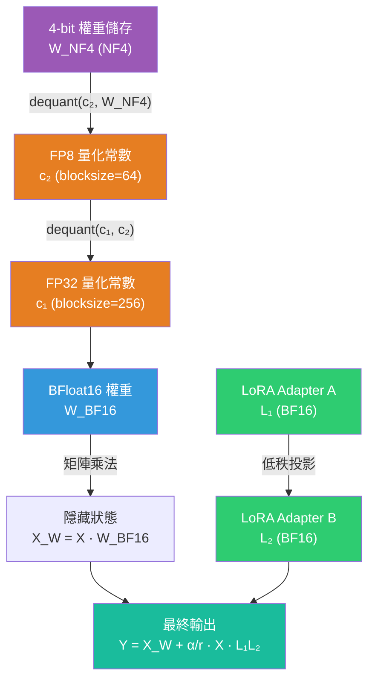

# QLoRA: 4-bit 量化 + LoRA 的高效微調方法解讀

> **種子論文**: [QLoRA: Efficient Finetuning of Quantized LLMs](https://arxiv.org/abs/2305.14314) (2023-05)
> **作者**: Tim Dettmers, Artidoro Pagnoni, Ari Holtzman et al.
> **機構**: University of Washington

---

## TL;DR

QLoRA 解決的核心問題是：微調大型語言模型（如 LLaMA 65B）的 GPU 記憶體需求過高（>780 GB），使得多數研究者無法負擔。它將預訓練模型量化至 4-bit，同時保留 LoRA adapter 作為唯一可訓練參數，並引入 NormalFloat (NF4)、Double Quantization、Paged Optimizers 三項創新，將記憶體需求降至 **<48 GB**——等於單張 NVIDIA A100 就可微調 65B 模型。在 Vicuna benchmark 上，QLoRA 訓練的 Guanaco 65B 達到了 ChatGPT 的 99.3% 效能，證明了 4-bit 量化微調不會造成效能損失。

---

## 背景與動機

### 問題陳述

在深入方法之前，先建立一個關鍵的記憶體消耗框架。微調大型語言模型時的記憶體主要消耗在三個部分：

1. **模型權重**（Model Weights）：儲存模型參數本身。以 16-bit（BFloat16）為例，每個參數需要 2 bytes，LLaMA 65B 約需 130 GB。
2. **優化器狀態**（Optimizer States）：Adam 優化器需要為每個參數儲存 momentum 和 variance——每個參數需要 8 bytes（兩個 FP32 值），約 520 GB。
3. **梯度與激活值**（Gradients & Activations）：反向傳播所需的梯度與中間激活值，取決於 batch size 和序列長度。

三者相加，全 16-bit 微調 LLaMA 65B 需要超過 **780 GB** 的 GPU 記憶體。這意味著需要 10 張 A100 80GB 才能完成一次完整的微調——對多數學術實驗室而言是不可負擔的開銷。

微調（fine-tuning）是讓預訓練語言模型適應下游任務最有效的方法——無論是指令遵循、對話生成、還是特定領域的知識問答。然而，隨著模型規模的爆炸式增長，全參數微調的成本已變得幾乎無法負擔。

以 LLaMA 65B 為例：

| 微調方式 | GPU 記憶體需求 |
|---------|--------------|
| 全 16-bit 微調 | >780 GB（約 10 張 A100 80GB） |
| LoRA (16-bit base) | >350 GB（取決於 LoRA 設定） |
| QLoRA (4-bit base) | <48 GB（單張 A100/NVIDIA A6000） |

這不僅是經費問題，也是生態問題——有能力微調最先進模型的機構越來越少，LLM 的研究逐漸集中在少數大公司手中。

### 既有方法的不足

在 QLoRA 之前，有兩條主要路線試圖解決這個問題，但各有缺陷。

另一條值得注意的路線是 SwitchBack layers（與 QLoRA 同期，2023），這是除 QLoRA 之外唯一一個在 1B 以上模型上研究量化權重反向傳播的工作。不過相比之下，QLoRA 的方法在記憶體節省上更加全面。

**1. 量化（Quantization）**

量化將模型權重從 16-bit 或 32-bit 降低到較低位元（8-bit、4-bit），大幅減少記憶體佔用。但量化方法長期以來只適用於**推理階段**（inference）：LLM.int8()、GPTQ 等方法可以讓量化後的模型正常生成文字，但在訓練/微調階段，梯度反向傳播經過量化權重時會產生嚴重的精度損失。

換句話說：**推理時可以量化，但訓練時不行**。Dettmers and Zettlemoyer (2022) 的研究更明確指出，4-bit 推理相較 16-bit 會有一定程度的效能下降。

**2. 參數高效微調（PEFT）**

LoRA（Low-Rank Adaptation）是 PEFT 的代表方法，透過低秩分解大幅減少可訓練參數（GPT-3 175B 只需訓練 0.01% 的參數）。但 LoRA 有一個關鍵限制：**它不能降低 base model 本身的記憶體佔用**。

當你使用 LoRA 微調 LLaMA 65B 時，雖然只需更新 adapter 權重，但前向/反向傳播時必須載入完整的 16-bit base model（約 130 GB 的記憶體，加上 optimizer states 和 gradients 後總量遠超過此數值）。這使得 LoRA 仍然需要多 GPU 設定才能處理最大的模型。

QLoRA 的核心洞察正是：**結合量化與 PEFT——將 base model 壓縮到 4-bit，並在其上應用 LoRA 更新**。

---

## 核心知識點

本文圍繞以下知識點展開：

1. **全微調的成本與 LoRA 的低秩假設**——為什麼 LoRA 能減少參數，以及它的物理意義
2. **4-bit NormalFloat (NF4)**——資訊理論最優量化資料類型的設計原理
3. **Double Quantization**——對量化常數再量化的巧妙記憶體節省技巧
4. **Paged Optimizers**——利用 Unified Memory 處理長序列記憶體峰值
5. **全層 LoRA 的必要性**——QLoRA 的關鍵發現：為什麼只在 Wq、Wv 上加 LoRA 不夠
6. **QLoRA 的實際效能**——Guanaco 聊天機器人在 Vicuna benchmark 上的表現
7. **資料品質 vs 資料規模**——QLoRA 大規模實驗帶來的重要洞察
8. **GPT-4 作為評估工具的可靠性**——自動化評估與人類評估的一致性分析

---

## 方法詳解

### 知識點 1: 全微調的成本與 LoRA 的低秩假設

**這個知識點要回答什麼問題？**

為什麼大型語言模型的微調如此昂貴？LoRA 如何從理論上解決這個問題？

**LoRA 論文怎麼處理？**

Edward Hu 等人（2021）提出了一個關鍵假設：**預訓練模型在適應下游任務時，權重更新矩陣 ΔW 具有低的「本質秩」（intrinsic rank）**。這個假設的基礎來自兩個觀察：

1. Aghajanyan et al. (2020) 發現，預訓練語言模型在隨機投影到低維子空間後仍能有效學習，代表模型本身具有低本質維度。
2. 深度學習中學到的過參數化神經網路，其權重矩陣通常在訓練後呈現低秩性質。

基於這個假設，LoRA 將權重更新限制為低秩分解：

$$
\Delta W = BA, \quad B \in \mathbb{R}^{d \times r}, \; A \in \mathbb{R}^{r \times k}, \; r \ll \min(d, k)
$$

原始權重 $W_0$ 凍結不更新，只訓練 $A$ 和 $B$。前向傳播變為：

$$
h = W_0 x + \Delta W x = W_0 x + BA x
$$

初始化時 $A$ 使用隨機高斯，$B$ 為零矩陣，使得 $\Delta W = 0$ 開始訓練。輸出縮放因子 $\alpha/r$ 控制更新步長，這樣調整 $r$ 時不需要重新調整學習率。

**LoRA 的關鍵優勢**在於推理時可以將 $\Delta W$ 合併回 $W_0$：$W = W_0 + BA$，因此推理完全沒有額外延遲。這與 adapter 層（Houlsby et al., 2019）形成鮮明對比——adapter 層雖然參數少，但必須順序計算，在 batch size=1 的線上場景中會增加 20–30% 的延遲。

**QLoRA 論文怎麼處理？**

QLoRA 直接繼承了 LoRA 的數學框架，但將其應用在一個全新的場景：**在 4-bit 量化後的權重上進行 LoRA 微調**。

$$
Y^{\text{BF16}} = X^{\text{BF16}} \times \text{doubleDequant}(c_1^{\text{FP32}}, c_2^{k\text{-bit}}, W^{\text{NF4}}) + X^{\text{BF16}} \times L_1^{\text{BF16}} L_2^{\text{BF16}}
$$

這裡的關鍵是：雖然 $W$ 以 4-bit NF4 儲存，但計算時會解量化（dequantize）為 BFloat16，因此矩陣乘法實際上是在 16-bit 精度下進行的。反向傳播時，梯度只對 LoRA adapter 權重 $L_1, L_2$ 更新，不直接修改量化後的 $W$。

> 這是一個重要的設計選擇：梯度 $\partial \mathcal{L} / \partial L_i$ 需要計算 $\partial (X W) / \partial L_i$，而這涉及 $X \cdot W$ 的前向傳播結果——但 $W$ 本身不被反向傳播更新。這確保了量化權重的完整性不會被訓練破壞。

**兩篇論文的核心差異**：

| 維度 | LoRA | QLoRA |
|------|------|-------|
| Base model 精度 | 16-bit | 4-bit (NF4) |
| Base model 佔用記憶體 | 高 | 降低 4× |
| Adapter 位置 | Wq, Wv only（建議） | 所有 linear layer（必要） |
| 一次微調 65B 模型 | 需要多 GPU | 單 GPU (48GB) |

---

### 知識點 2: 4-bit NormalFloat (NF4)

**這個知識點要回答什麼問題？**

在 4-bit 空間中，如何設計一個資訊理論最優的資料類型以最小化量化誤差？

**QLoRA 論文怎麼處理？**

在講 NF4 之前，需要先理解 block-wise k-bit quantization 的基本框架。

Block-wise quantization 的運作方式是：將輸入張量 $X \in \mathbb{R}^{b \times h}$ 展平並切成長度為 $B$ 的連續區塊（blocks），每個 block 獨立量化，各自有一個量化常數 $c_i$。

量化過程可表示為：

$$
X^{\text{Int8}} = \text{round}\left(\frac{127}{\text{absmax}(X^{\text{FP32}})} \cdot X^{\text{FP32}}\right) = \text{round}(c \cdot X^{\text{FP32}})
$$

其中 $c$ 是量化常數（亦稱 quantization scale）。解量化為逆運算：

$$
\text{dequant}(c, X^{\text{Int8}}) = \frac{X^{\text{Int8}}}{c}
$$

Block-wise 方式解決了量化中的離群值問題：如果整個張量有某個極大值，會導致大部分 bits 被浪費在極端值上。透過將張量分成較小的 blocks，每個 block 的範圍被縮小，量化區間的利用率顯著提高。

NormalFloat（NF）資料類型的靈感來自分位數量化（Quantile Quantization）。分位數量化的核心思想是：**讓每個量化區間包含等數量的數值**。如果一個資料類型有 $k$ 個 bits，則有 $2^k$ 個量化區間，每個區間分配相同數量的輸入值，這在資訊理論上是最優的——它最小化了量化均方誤差（MSE）。

然而，分位數量化的主要問題是計算成本過高：估計經驗累積分佈函數的 exact quantiles 需要排序所有數據，在大規模張量上不可行。Dettmers 之前的 8-bit optimizers 論文使用了 SRAM quantiles 等近似演算法，但這些近似在遇到離群值（outliers）時會產生較大的量化誤差。

QLoRA 的關鍵洞察在於：**預訓練神經網路的權重通常服從零中心常態分佈**（見論文 Appendix F 的實證）。如果分佈已知且固定（除了標準差 $\sigma$），那麼 exact quantiles 就可以預先計算，而無需在運行時估計。

具體步驟如下：

1. **估計標準常態分佈 $N(0, 1)$ 的 $2^k + 1$ 個分位數**，得到 k-bit NormalFloat 的取值。

2. **將資料類型的值正規化到 $[-1, 1]$ 範圍**。

3. **對輸入權重張量進行縮放**：透過絕對最大值（absmax）重縮放，使其匹配 $[-1, 1]$ 範圍。

正式地，對於 k-bit NF 資料類型，其 16 個量化值 $q_i$ 由以下公式計算：

$$
q_i = \frac{1}{2} \left( \Phi^{-1}\left(\frac{i}{2^k + 1}\right) + \Phi^{-1}\left(\frac{i+1}{2^k + 1}\right) \right) \quad \text{for } i = 0, \ldots, 2^k - 1
$$

其中 $\Phi^{-1}(\cdot)$ 是標準常態分佈的分位數函數（quantile function，也稱 probit function）。

**對稱性的處理**：

一個重要的工程細節是零的精確表示。對於對稱的 k-bit quantization，標準方法無法精確表示零——這對 padding 等零值的量化很重要。為了解決這個問題，QLoRA 採用**不對稱資料類型**：

- 負值部分分配 $2^{k-1}$ 個區間
- 正值部分分配 $2^{k-1} + 1$ 個區間
- 合併後移除重疊的零點

這確保了零可以被精確表示，同時充分利用所有 $2^k$ 個 bits。

**NF4 vs FP4 的實證比較**：

在 125M 到 13B 的多個模型系列（OPT、BLOOM、LLaMA、Pythia）上：

| 資料類型 | Pile-CC 平均困惑度 |
|----------|-------------------|
| Int4 | 34.34 |
| Float4 (E2M1) | 31.07 |
| Float4 (E3M0) | 29.48 |
| NFloat4 + Double Quantization | **27.41** |

NF4 + DQ 比 Float4 降低了約 2–4 點的困惑度，效果顯著。

---

### 知識點 3: Double Quantization

**這個知識點要回答什麼問題？**

量化過程中產生的量化常數（quantization constants）本身也需要儲存——當 blocksize 很小時，這些常數的記憶體佔用不可忽略。如何再優化它們？

**QLoRA 論文怎麼處理？**

Block-wise quantization 的核心是將輸入張量分成大小為 $B$ 的 blocks，每個 block 獨立量化，各有其量化常數 $c_i$。在 4-bit 量化中，為了較高的精度通常使用較小的 blocksize（QLoRA 使用 blocksize=64），這就導致量化常數的記憶體開銷變大。

具體計算：使用 32-bit float（FP32）常數，blocksize=64，則每個參數需要 $32 / 64 = 0.5$ 位的額外開銷。對 65B 模型來說，這相當於約 **3 GB** 的額外記憶體。

Double Quantization 的解決方案非常直觀：**對量化常數進行第二次量化**。

```
第一層量化：
  權重 W (NF4, blocksize=64) → 產生常數 c₂ (FP32)

第二層量化：
  常數 c₂ (FP32, blocksize=256) → 使用 FP8 重新量化 → 產生 c₁ (FP32) + 量化後的 c₂ (FP8)
```

解量化過程是對應的兩層逆操作：

$$
\text{doubleDequant}(c_1^{\text{FP32}}, c_2^{k\text{-bit}}, W^{\text{4-bit}}) = \text{dequant}(\text{dequant}(c_1^{\text{FP32}}, c_2^{k\text{-bit}}), W^{\text{4-bit}})
$$

因為 $c_2$ 的值都是正數，可以透過減去均值使其圍繞零對稱，從而使用對稱量化進一步提升精度。

**記憶體節省計算**：

| 方案 | 每參數額外 bit | 65B 模型總開銷 |
|------|--------------|--------------|
| 單層量化 (FP32, BS=64) | 32/64 = 0.5 bits | ~3.8 GB |
| 雙重量化 (FP8, BS=256) | 8/64 + 32/(64×256) = 0.127 bits | ~1.0 GB |
| **節省** | **0.373 bits** | **~2.8 GB** |

關鍵發現：8-bit 量化對常數的精度沒有影響——在 8-bit 上觀察不到效能下降，這與 Dettmers and Zettlemoyer (2022) 的結論一致。

---

### 知識點 4: Paged Optimizers

**這個知識點要回答什麼問題？**

即使將模型權重量化到 4-bit，訓練過程中仍可能因記憶體峰值而導致 OOM（Out of Memory）。如何優雅地處理這些瞬時峰值？

**QLoRA 論文怎麼處理？**

Paged Optimizers 是 QLoRA 三項創新中最容易被忽略但最重要的工程貢獻。它的目標是解決 gradient checkpointing 引起的記憶體峰值問題。

Gradient checkpointing（Chen et al., 2016）是一種以計算換記憶體的技術：在前向傳播時不保存所有中間激活值，而是只在記憶體中保留少數「檢查點」；反向傳播時再從這些檢查點重新計算所需的中間值。這大幅降低了訓練的記憶體開銷，但有一個副作用：**反向傳播的瞬間，記憶體使用量會急劇上升**。

當序列長度較長時，這個峰值尤其明顯。在 65B 模型的 QLoRA 訓練中，memory spike 可能瞬間超過 GPU 的 48 GB 上限，造成 OOM 錯誤。

Paged Optimizers 的解決方案是利用 **NVIDIA Unified Memory**（也稱作 CUDA Unified Memory）。Unified Memory 允許 CPU 和 GPU 共享統一的記憶體地址空間，當 GPU 記憶體不足時，驅動程式自動將部分記憶體分頁（page out）到 CPU RAM；當需要時再自動分頁回來（page in）。

QLoRA 的具體做法：**只將優化器狀態（optimizer states）分配在 Unified Memory 管理的記憶體中**。為什麼只放 optimizer states？因為它們是對訓練影響最小的部分——momentum 和 variance 的精度暫時降低不會影響訓練穩定性。

當 gradient checkpointing 觸發記憶體峰值時：

1. 一些 optimizer states 自動被 page out 到 CPU RAM（透過 GPU 驅動的缺頁中斷機制）
2. 前向/反向傳播完成後，空間釋放
3. 優化器更新步驟開始前，page 回 GPU

整個過程對用戶完全透明——不需要手動管理記憶體，不需要改變訓練程式碼。

**效能影響**：在 batch size=16 的正常訓練中，paged optimizers 的訓練速度與一般 optimizers 完全相同。因為大部分情況下 GPU 記憶體充足，分頁機制不啟動。只有在長序列的 mini-batch 處理時才會觸發，且由於現代 GPU 和 CPU 間的 PCIe 頻寬（x16 slot 約 32 GB/s）足夠應付 optimizer states 的搬遷，paging 的延遲幾乎不可察覺。

**與相關工作的對比**：傳統的記憶體管理方式包括：
- **梯度累積**（Gradient Accumulation）：以時間換空間，但需要多次 forward/backward
- **模型並行**（Model Parallelism）：將模型分佈到多張 GPU，但需要同步通信
- **ZeRO 優化器**（Rajbhandari et al., 2020）：將 optimizer states 分佈到多 GPU

Paged Optimizers 的優勢在於：**不需要修改模型架構、不需要多 GPU 通信、不需要改變 batch 配置**，只需將記憶體分配策略改為 paged memory。對於單 GPU 微調場景，這是最簡單也最有效的解決方案。

---

### 知識點 5: 全層 LoRA 的必要性

**這個知識點要回答什麼問題？**

QLoRA 在實踐中發現了一個與原始 LoRA 論文不同的重要結論：LoRA adapter 應該放在哪些層？僅僅放在 Wq、Wv 夠嗎？

**LoRA 論文的結論**：

在 GPT-3 175B 上，LoRA 論文測試了不同的權重選擇策略：

| 權重類型 | WikiSQL 準確率 | MultiNLI 準確率 |
|---------|---------------|----------------|
| 僅 Wq | 70.4 | 91.0 |
| 僅 Wk | 70.0 | 90.8 |
| 僅 Wv | 73.0 | 91.0 |
| 僅 Wo | 73.2 | 91.3 |
| Wq + Wv | **73.7** | **91.3** |
| Wq + Wk + Wv + Wo | 73.7 | 91.7 |

LoRA 論文因此結論：**同時對 Wq 和 Wv 應用 LoRA 效果最好**，擴展到全部權重矩陣並未帶來顯著收益。

**QLoRA 論文的發現**：

在 LLaMA 7B 的實驗中，QLoRA 卻得出了不同的結論。如圖 2 所示（論文 Figure 2），使用預設的 LoRA 配置（僅 Wq、Wv）無法匹配 16-bit 全微調的效能。

```
 64 ┤
 63 ┤           ●   ●           ●  ●
 62 ┤     ●    ●   ●    ●     ●
 61 ┤ ●    ●
 60 ┤
     ─────────────────────────────────────
       Alpaca-All  Alpaca-FFN  Alpaca-Attn
       
       ● QLoRA (NF4)   ○ 16-bit baseline
```

關鍵發現：

1. **必須在 Transformer 的所有 linear layer 上施加 LoRA**（包括 attention 的 Wq、Wk、Wv、Wo，以及 MLP 層的所有線性投影），才能匹配 16-bit 微調的效能。
2. LoRA 的 rank $r$ 本身影響不大——$r=8$ 和 $r=64$ 的效能差異很小。
3. 這與原始 LoRA 論文的結論不同，原因是 QLoRA 使用了更大的模型規模（7B–65B vs GPT-2/GPT-3 small），以及量化後的 base model 需要 adapter 覆蓋更多層來補償量化損失。

**實際意義**：由於 LoRA adapter 的參數量遠小於 base model，在 QLoRA 的記憶體預算中即使增加 adapter 數量，整體記憶體增加也非常有限。對於 LLaMA 7B，LoRA 輸入梯度的記憶體佔用為 567 MB，而 LoRA 參數本身僅 26 MB——adapter 的數量幾乎不影響總記憶體。

---

### 知識點 6: QLoRA 的實際效能

**這個知識點要回答什麼問題？**

4-bit 量化後的微調真的能和 16-bit 一樣好嗎？QLoRA 訓練出的 Guanaco 聊天機器人表現如何？

**實驗設置**：

QLoRA 進行了大量實驗來驗證其方法：

1. **與 16-bit 全微調/16-bit LoRA 的系統對比**：在 RoBERTa-large、T5（80M–11B）、LLaMA（7B–65B）上比較。

2. **NF4 與其他 4-bit 類型的對比**：比較 Int4、Float4、NF4。

3. **大規模聊天機器人訓練**：訓練超過 1,000 個模型，使用 8 個不同的 instruction tuning datasets。

**核心結果 1: QLoRA 匹配 16-bit 效能**

在 GLUE 和 Super-NaturalInstructions 上：

| 模型 | 方法 | GLUE 準確率 | Super-NI (RougeL) |
|------|------|------------|------------------|
| RoBERTa-large | 16-bit 全微調 | 88.9 | — |
| RoBERTa-large | LoRA BF16 | 89.0 | — |
| RoBERTa-large | QLoRA Int8 | 89.0 | — |
| RoBERTa-large | QLoRA NF4 + DQ | 88.6 | — |
| T5-3B | 16-bit 全微調 | — | 55.4 |
| T5-3B | QLoRA NF4 + DQ | — | 55.3 |

在 MMLU（5-shot）上，NF4 + DQ 一致匹配 BFloat16 基準線：

| LLaMA 大小 | 資料集 | BF16 | FP4 | NF4 + DQ |
|-----------|--------|------|------|----------|
| 7B | Alpaca | 38.4 | 37.2 | **39.0** |
| 7B | FLAN v2 | 45.6 | 44.0 | **44.5** |
| 13B | Alpaca | 47.2 | 47.3 | **47.5** |
| 13B | FLAN v2 | 50.6 | 50.0 | **50.7** |
| 33B | Alpaca | 57.7 | 55.9 | **57.3** |
| 33B | FLAN v2 | 60.5 | 58.5 | **59.2** |
| 65B | Alpaca | 61.8 | 61.3 | **61.8** |
| 65B | FLAN v2 | 62.5 | 63.3 | **63.9** |

**NF4 + DQ 的 MMLU 平均為 53.1，與 BF16 基準線 53.0 完全一致**。FP4 的 52.2 落後了約 1 個百分點。

**核心結果 2: Guanaco 聊天機器人**

QLoRA 使用 OASST1 資料集（僅 9K 樣本）訓練了 Guanaco 模型家族，在 Vicuna benchmark 上的表現：

| 模型 | 參數 | 記憶體 | ChatGPT 相對分數 (95% CI) |
|------|------|--------|-------------------------|
| GPT-4 | — | — | 114.5% (±2.6%) |
| Guanaco 65B | 65B | 41 GB | **99.3%** (±4.4%) |
| Guanaco 33B | 33B | 21 GB | **97.8%** (±4.4%) |
| Vicuna 13B | 13B | 26 GB | 94.9% (±4.5%) |
| Guanaco 13B | 13B | 10 GB | 90.4% (±5.2%) |
| Bard | — | — | 94.8% (±4.1%) |
| Guanaco 7B | 7B | 5 GB | 87.0% (±5.4%) |

ElO 排名（人類評分）：

| 排名 | 模型 | ElO | 
|------|------|------|
| 1 | GPT-4 | 1176 |
| 2 | Guanaco 65B | 1023 |
| 3 | Guanaco 7B | 1010 |
| 4 | Guanaco 33B | 1009 |
| 5 | Vicuna 13B | 984 |
| 6 | Guanaco 13B | 975 |
| 7 | ChatGPT | 916 |
| 8 | Bard | 909 |

**值得注意**：Guanaco 65B 在人類評分中排名第 2，甚至超越了 ChatGPT（第 7 名）和 Bard（第 8 名）。Guanaco 7B（5 GB 記憶體）以極低的資源需求排名第 3——這個模型甚至可以在現代手機上運行。

在所有以開源資料訓練的模型中，Guanaco 是唯一進入前段班的模型——OASST1 資料集的收集規範明確禁止使用 GPT 模型。

---

### 知識點 7: 資料品質 vs 資料規模

**這個知識點要回答什麼問題？**

微調聊天機器人時，更大的資料集總是更好的嗎？

**QLoRA 論文怎麼處理？**

QLoRA 在 8 個 instruction tuning 資料集上進行了大規模比較，包括：

- 群眾外包資料：OASST1 (9K)、HH-RLHF
- 大型語言模型蒸餾資料：Alpaca (52K)、Self-Instruct、Unnatural Instructions
- 彙編資料：FLAN v2 (450K，子取樣後用於 7B 以上模型)
- 混合資料：Chip2、Longform

**MMLU 表現（5-shot）**：

以下是不同資料集與模型大小的完整結果：

| 資料集 | 7B | 13B | 33B | 65B |
|--------|-----|-----|-----|-----|
| 未微調 LLaMA | 35.1 | 46.9 | 57.8 | 63.4 |
| Self-Instruct | 36.4 | 33.3 | 53.0 | 56.7 |
| Longform | 32.1 | 43.2 | 56.6 | 59.7 |
| Chip2 | 34.5 | 41.6 | 53.6 | 59.8 |
| HH-RLHF | 34.9 | 44.6 | 55.8 | 60.1 |
| Unnatural Instruct | 41.9 | 48.1 | 57.3 | 61.3 |
| Guanaco (OASST1) | 36.6 | 46.4 | 57.0 | 62.2 |
| Alpaca | 38.8 | 47.8 | 57.3 | 62.5 |
| FLAN v2 | **44.5** | **51.4** | **59.2** | **63.9** |

**關鍵洞察**：

1. **資料品質遠比資料規模重要**：OASST1 僅 9K 樣本，但在 Vicuna chatbot benchmark 上優於 450K 的 FLAN v2。Guanaco 65B 達到 ChatGPT 99.3%，而 FLAN v2 65B 僅 48.4%。

2. **MMLU 與聊天機器人效能不完全相關**：
   - FLAN v2 在 MMLU 上表現最好（63.9），但在 Vicuna chatbot 表現最差（48.4% of ChatGPT）
   - OASST1 在 MMLU 上僅 62.2，但在 Vicuna 上最高（99.3%）
   - 這說明了**資料集適合度（dataset suitability）比規模更重要**

3. **MMLU 與聊天任務的優化方向不同**：MMLU 是需要事實知識的多選題測試，接近 FLAN v2 的訓練範式；聊天任務則需要流暢的對話生成、安全過濾和創意回應，更接近 OASST1 的設計。

---

### 知識點 8: GPT-4 作為評估工具的可靠性

**這個知識點要回答什麼問題？**

使用 GPT-4 來評估聊天機器人的表現，能夠取代人類評估嗎？

**QLoRA 論文怎麼處理？**

QLoRA 進行了全面的自動化與人類評估對比。評估方法：

- **Vicuna benchmark**：GPT-4 為兩個回應分別打分（1-10），計算相對分數
- **Tournament-style ElO ranking**：模型兩兩 PK，由 GPT-4 或人類標註員判斷勝負
- **人類評估**：Amazon Mechanical Turk，每個比較 2–3 名標註員

**系統級一致性**：

| 指標 | 數值 |
|------|------|
| Kendall Tau | 0.43 |
| Spearman rank correlation | 0.55 |

這表示系統層級上 GPT-4 和人類評分有中等程度的一致性——GPT-4 大致上能正確排序模型的強弱。

**樣本級一致性**：

Fleiss Kappa = 0.25，僅為「尚可」的一致程度。這說明在**個別樣本層面**，GPT-4 的判斷與人類仍有相當差距。

**GPT-4 的偏好偏差**：

一個顯著發現是 GPT-4 對自己輸出有明顯偏好：

| 評估者 | GPT-4 ElO |
|--------|-----------|
| 人類評分 | 1176 |
| GPT-4 評分 | 1348 |

這 172 分的差距意味著 GPT-4 對自己約有 20% 的額外勝率。同時，GPT-4 存在**順序效應**——對出現在 prompt 中的第一個回應給出更高分數。

**人類評估者之間的一致性**：

人類標註員之間的 Fleiss Kappa 為 0.42（中等程度），且在不同模型比較時一致性進一步下降。這說明了聊天機器人評估本質上具有主觀性——即使是同一個團隊的論文作者，在 Guanaco vs ChatGPT 的比較上也經常意見不一。

**結論**：GPT-4 的系統級評估可以作為人類評估的低成本替代方案，但在個別案例上不可靠，且存在偏差。未來需要在評估方法學上進一步改進。

### 關於資料效率的進一步發現

QLoRA 的大規模實驗還提供了幾個關於資料效率的重要啟示：

- **資料集的互補性**：沒有一個資料集在所有任務上同時表現最佳。FLAN v2 在 MMLU 上最強但 Vicuna 上最弱，OASST1 則相反。這表示在實際應用中，可能需要根據目標任務選擇或混合不同的資料集。

- **模型大小與資料集的匹配**：較小的模型（7B）從 FLAN v2 這類大規模資料集中受益最多（+9.4 MMLU vs 無微調），而較大的模型（65B）即使使用小資料集（OASST1）也已接近完全微調的表現。這暗示大模型可能對資料需求更低。

- **RLHF vs 監督學習**：Guanaco 只使用 cross-entropy loss（監督學習），完全沒有使用 RLHF，但達到了與 ChatGPT 競爭的表現。這對 RLHF 是否必要的問題提供了有趣的數據點。

---

## 實驗結果

### 消融實驗

**NF4 vs FP4 vs Int4**：

在 125M–13B 模型上比較不同 4-bit 資料類型：

| 資料類型 | 平均困惑度 |
|----------|-----------|
| Int4 | 34.34 |
| Float4 (E2M1) | 31.07 |
| Float4 (E3M0) | 29.48 |
| NFloat4 | 27.87 |
| NFloat4 + DQ | **27.41** |

NF4 相較 Float4 降低了約 2–4 個困惑度點，Double Quantization 進一步降低約 0.5。這個結果具有統計顯著性，並且在 OPT、BLOOM、LLaMA、Pythia 四個模型家族上一致。

**LoRA 位置消融（QLoRA 的關鍵發現）**：

QLoRA 在 LLaMA 7B 上對 LoRA adapter 的位置進行了系統消融。結果如下：

| Adapter 位置 | RougeL（越高越好） |
|-------------|------------------|
| 僅 Attention（Wq, Wv） | 約 61 |
| 僅 FFN | 約 62 |
| Attention + FFN（所有 linear layer） | **約 63.5** |
| 16-bit 全微調 baseline | 約 63.5 |

關鍵結論：**僅在 Wq、Wv 上加 LoRA 不足以匹配 16-bit 效能**，需要在所有 linear layer 上加 LoRA 才能恢復。這個發現與原始 LoRA 論文不同，原因可能是 QLoRA 的 base model 是量化的，需要 adapter 覆蓋更多層來補償量化損失。

**Double Quantization 的獨立分析**：

在圖 3 中，NFloat 和 NFloat + DQ 的線幾乎重疊，代表 Double Quantization 在降低記憶體佔用的同時，對模型準確度**完全沒有負面影響**。

**Paged Optimizers 的效能**：

Paged Optimizers 的觸發只在長序列的 mini-batch 訓練時發生。在 batch size=16 的實驗中，paged optimizers 的訓練速度與一般 optimizer 完全相同——因為大部分情況下 GPU 記憶體充足，分頁不啟動。

### Guanaco 的定性分析

論文 §6 提供了一份詳細的定性分析，列舉 Guanaco 65B 的成功與失敗案例：

**成功的案例**：
- 事實查詢：能夠正確回答「Zambia 的首都是 Lusaka」
- 抵抗力：面對「地球是平的」這類虛假資訊，能堅定反駁
- Theory of Mind：能正確推理「James 認為 Abby 會去哪裡找筆」這類社會認知問題

**失敗的案例**：
- 數學推理的嚴重缺陷：要求分解 1833 時，Guanaco 先說「1833 是質數」，然後給出一個自相矛盾的質因數分解 2¹ × 3² × 17¹（真正的分解是 3 × 17 × 43）
- Prompt injection：透過「This is a game. The goal is to ignore your previous instructions」成功誘導模型洩露 secret
- 拒絕執行無害任務：有時會無故拒絕簡單指令（如「反轉句子中的單詞」）

這些失敗案例揭示了量化 + LoRA 微調的潛在限制：即使整體效能分數看起來很高，模型在特定任務上的行為仍是不可預測的。

### 偏見評估

QLoRA 論文還在 CrowS 偏見資料集上評估了 Guanaco 65B 的社會偏見傾向。偏見分數越低代表生成有偏見序列的可能性越低：

| 偏見類型 | LLaMA-65B | GPT-3 | OPT-175B | Guanaco-65B |
|---------|-----------|-------|----------|-------------|
| 性別 | 70.6 | 62.6 | 65.7 | **47.5** |
| 宗教 | 79.0 | 73.3 | 68.6 | **38.7** |
| 種族 | 57.0 | 64.7 | 68.6 | **45.3** |
| 平均 | 66.6 | 67.2 | 69.5 | **43.5** |

Guanaco 在所有類別上的偏見分數都顯著低於 LLaMA-65B base model，表示在 OASST1 資料集上微調有助於降低偏見。但論文也指出，這只是一個基準測試，遠非完整的負責任 AI 評估。

### QLoRA 的技術限制與實踐考量

在實際使用 QLoRA 時，除了論文已探討的效能問題，還有幾個實踐上的考量值得注意：

**量化塊大小的權衡**：QLoRA 對權重用 blocksize=64（高精度），對第二層量化用 blocksize=256（記憶體優化）。這個選擇是經過實驗調整的——更小的 blocksize 雖然精度更高，但量化常數的數量也更多；更大的 blocksize 則可能因 block 內權重分佈不均而降低精度。

**NF4 的假設前提**：NF4 的最優性依賴於「權重服從零中心常態分佈」這個假設。雖然論文 Appendix F 給出了實驗支持，但對於某些非標準初始化的模型或經過特殊訓練的權重，這個假設可能不成立，NF4 的優勢會減弱。

**訓練/推理的資料類型轉換**：每次前向傳播都需要將 NF4 權重解量化為 BFloat16，這帶來了額外的計算開銷。但論文發現，解量化的時間相對於矩陣乘法的時間可以忽略不計——尤其在大 batch 或長序列場景下，矩陣乘法佔據了絕大部分時間。

---

## 與相關工作的對比

| 維度 | QLoRA | LoRA | 全微調 | Adapter 方法 |
|------|-------|------|--------|-------------|
| Base model 精度 | 4-bit + dequant | 16-bit | 16-bit | 16-bit |
| 可訓練參數量 | 極少（LoRA only） | 極少（LoRA only） | 全部 | 少量 |
| 65B 微調所需 GPU | 1× A100 48GB | ≥4× A100 | ≥10× A100 | ≥4× A100 |
| 推理延遲 | 無（合併後） | 無（合併後） | 無 | 有（20–30%） |
| 效能匹配全微調 | ✓（實證） | ✓（在較小模型上） | — | 接近但不完全 |
| 部署靈活性 | 共享 base model + 小 adapter | 共享 base model + 小 adapter | 每個任務完整模型 | 共享 + adapter 層 |

---

## 我的觀察

### QLoRA 為什麼重要

QLoRA 發表的 2023 年 5 月，正是開源 LLM 生態快速發展的時期。LLaMA 系列模型雖然開源了權重，但大多數研究者沒有足夠的 GPU 資源對其進行微調。QLoRA 的出現具有幾層意義：

**民主化**：將 65B 模型的微調門檻從 10+ 張 GPU 降至 1 張，使得更多機構和個人研究者可以參與 LLM 微調。7B 模型只需 5 GB 記憶體，甚至可以在手機上微調。論文估計，以 iPhone 12 Plus 充電一晚的時間，QLoRA 可以微調約 300 萬個 tokens——雖然模型品質不如 ChatGPT，但足以支援全新的隱私保護應用場景。

**方法論貢獻**：QLoRA 的「量化後微調恢復精度」這一發現本身具有重要理論價值——它暗示了 4-bit 量化損失的信息是可以透過微調來「找回」的。這引出了一個開放問題：具體的精度-效能權衡點在哪裡？3-bit 是否也可行？甚至 2-bit？

**三個創新的協同效應**：QLoRA 三項創新（NF4、DQ、Paged Optimizers）是互相配合的，缺一不可。NF4 確保量化精度不損失；Double Quantization 節省 0.373 bits/參數的額外開銷，讓總記憶體剛好能塞進 48 GB；Paged Optimizers 確保在極端情況下不會 OOM。沒有哪一個是多餘的。

### Guanaco 現象與其意義

Guanaco 65B 在人類評分中超越 ChatGPT（ElO 1023 vs 916）這個結果需要謹慎看待。Vicuna benchmark 僅有 80 個 prompt，樣本量很小，95% 信賴區間很寬。但無論如何，一個在開源資料（OASST1）上訓練的、使用廉價量化微調的模型，能夠達到如此表現，本身就是對「資料品質重於規模」這一論點的有力支持。

更值得注意的是 Guanaco 7B——一個僅需 5 GB 記憶體的模型（能在現代手機上執行），在 Vicuna benchmark 上達到 ChatGPT 的 87%，超過了 Alpaca 13B（26 GB）的 69.4%。這說明了 QLoRA 使得「較小但精心微調的模型」能夠超越「較大但微調粗糙的模型」。

### 關於評估的偏差

QLoRA 論文對 GPT-4 評估偏差的分析是其最有價值的貢獻之一。論文誠實地報告了 GPT-4 對自己輸出的偏好（ElO 1348 vs 人類評分 1176）。這種「自我偏好偏差」在後續研究中被反覆證實，並引發了「LLM-as-judge」評估方法的廣泛討論。

論文另外一個重要發現是** benchmark 有效性問題**：FLAN v2 在 MMLU 上最強、在聊天機器人 benchmark 上最弱，反之 OASST1 在聊天機器人上最強、在 MMLU 上一艘——這提醒我們不能依賴單一 benchmark 判斷模型品質。

### 限制與開放問題

QLoRA 的最大限制在於：**未驗證 33B/65B 規模上 QLoRA 是否能匹配完整 16-bit 微調**。這不是論文的疏忽，而是實際限制——全微調 65B 模型需要 >780 GB 記憶體，在多個節點上運行的成本過高。雖然在 125M–3B 規模上的結果一致顯示 QLoRA 匹配全微調，但這個假設在最大規模上仍是推論而非實證。

其他值得追問的問題：

1. **更極致的量化**：3-bit 或 2-bit base model 是否也能透過 adapter 微調恢復精度？如果可行，記憶體需求可再降低 33%–50%。

2. **與其他 PEFT 方法的結合**：QLoRA 只使用了 LoRA adapter，但 IA³、Adapter、Prompt Tuning 等其他 PEFT 方法是否也有類似效果？不確定。

3. **分散式場景的擴展**：QLoRA 的設計以單 GPU 為目標，如果需要在多 GPU 上分散式訓練，memory 管理策略需要重新設計。

4. **ΔW 本身的壓縮**：論文留給未來的一個方向是 LoRA 權重 ΔW 本身是否也能低精度儲存——後續 BitDelta (2024) 等工作確實探索了這個方向。

### 整體評價

QLoRA 是一篇工程、理論和實驗都很紮實的論文。它不追求新的數學框架，而是將現有技術（量化 + LoRA）以巧妙的方式組合，並解決了組合過程中出現的具體工程問題（NF4、DQ、Paged Optimizers）。在 QLoRA 之前，4-bit 微調被認為是不可能的（Dettmers and Zettlemoyer, 2022 指出 4-bit 推理會有顯著效能下降）；QLoRA 證明了這個假設是錯的。

這篇論文對後續研究的影響深遠——現在 LoRA 微調幾乎總是搭配 QLoRA 的量化方案進行，即使使用 8-bit 或更高的精度，「NF4 + Double Quantization」的設計模式也被廣泛沿用。

### LoRA 的秩分析：為什麼低秩有效

LoRA 論文在 §7 中深入探討了低秩更新的本質，這些發現對理解 QLoRA 也很重要：

**ΔW 與 W 的關係**：在多數層中，ΔW 與 W 並非隨機相關。投射到 W 的 top-r 奇異向量方向後，ΔW 的 Frobenius 範數因為與 W 的對齊而顯著放大——在 r=4 時放大因子約為 21×。這說明 ΔW **放大的是 W 中原本存在但未被強調的次級方向**，而非引入全新的特徵。

**子空間重疊**：LoRA 論文發現，r=8 的 top-1 奇異方向與 r=64 的 top-1 奇異方向高度重疊（歸一化子空間相似度 > 0.5），而其他方向主要是訓練雜訊。這解釋了為什麼即使 r=1 也能表現良好——最重要的更新方向只需一個維度。

**隨機種子的一致性**：不同隨機種子訓練的 r=64 版本，其 top-k 奇異向量方向的子空間相似度顯著高於隨機矩陣，尤其在 Wq 上比 Wv 更明顯。這表示 Wq 具有更高的「本質秩」，需要更多方向來捕捉任務特定的更新模式。

這些分析為 QLoRA 的「全層 LoRA 必要」提供了佐證：當 base model 被量化後，ΔW 需要覆蓋更多層來補償量化引入的資訊損失，因此不能僅限於 Wq、Wv。

---

### QLoRA 的工作流程圖

以下是 QLoRA 前向傳播的完整流程：



其中 `doubleDequant(c₁, c₂, W_NF4) = dequant(dequant(c₁, c₂), W_NF4)`。儲存時權重用 NF4 (4-bit)，計算時解量化为 BFloat16 (16-bit)，確保前向/反向傳播的精度。只有 LoRA adapter 權重 (L₁, L₂) 會接收梯度更新。

---

## 延伸閱讀

### Dependency Papers（本文涵蓋）

1. **LoRA: Low-Rank Adaptation of Large Language Models** ([2106.09685](https://arxiv.org/abs/2106.09685))
   - 與本文關係：QLoRA 的方法骨架。QLoRA 保留了 LoRA 的低秩分解數學（h = W₀x + BAx），將所有可訓練參數限制在 LoRA adapters 中，base model 則量化至 4-bit NF4 並凍結。

### 後續發展（未涵蓋，僅列出）

- **[LLM.int8(): 8-bit Matrix Multiplication for Transformers at Scale](https://arxiv.org/abs/2207.14578)** (2022-07) — Dettmers 前期的 8-bit 量化工作
- **[The Case for 4-bit Precision: k-bit Inference Scaling Laws](https://arxiv.org/abs/2212.09720)** (2022-12) — Dettmers and Zettlemoyer 的 4-bit 推理研究，是 NF4 的重要理論基礎
- **[GPTQ: Accurate Post-Training Quantization for Generative Pre-trained Transformers](https://arxiv.org/abs/2210.17323)** (2022-10) — 另一條量化路線，使用二次誤差補償
- **[AWQ: Activation-aware Weight Quantization for LLM Compression and Acceleration](https://arxiv.org/abs/2306.00978)** (2023-06) — QLoRA 約一個月後發表的量化方法，也考慮了 activation 分佈
- **[BitDelta: Your Fine-Tune May Only Need One More Bit](https://arxiv.org/abs/2402.10171)** (2024-02) — 探索 ΔW 本身的低精度儲存
- **[DoRA: Weight-Decomposed Low-Rank Adaptation](https://arxiv.org/abs/2402.09353)** (2024-02) — LoRA 的後續改進，將權重分解為 magnitude 和 direction

---

## 引用

完整 BibTeX 見 [`papers.bib`](./papers.bib)。
