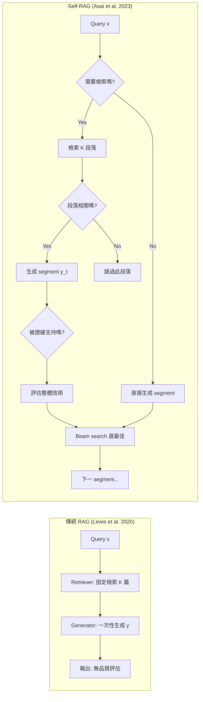

# Self-RAG: 學習檢索、生成與自我批判

> **種子論文**: [Self-RAG: Learning to Retrieve, Generate, and Critique through Self-Reflection](https://arxiv.org/abs/2310.11511) (2023-10)
> **作者**: Akari Asai, Zeqiu Wu, Yizhong Wang, Avirup Sil, Hannaneh Hajishirzi
> **機構**: University of Washington, Allen Institute for AI, IBM Research AI

> **Dependency Paper**: [Retrieval-Augmented Generation for Knowledge-Intensive NLP Tasks](https://arxiv.org/abs/2005.11401) (Lewis et al. 2020)
> **作者**: Patrick Lewis, Ethan Perez, Aleksandra Piktus, Fabio Petroni, Vladimir Karpukhin et al.
> **機構**: Facebook AI Research, University College London, New York University

---

## TL;DR

傳統 RAG 不論輸入是否需要事實知識，一律固定檢索 K 篇段落，也不檢查生成是否確實被檢索到的證據支持。Self-RAG 讓模型學會自主判斷何時該檢索、檢索到的段落是否相關、以及自己的生成是否被證據充分支持——全部透過一種稱為 reflection tokens 的特殊 token 來實現，無需外部模型介入。在開放域問答、事實驗證、長文生成等 6 個任務上，Self-RAG (7B/13B) 全面超越 ChatGPT 與 Llama2-chat 的 RAG 版本，尤其 PopQA 準確率 45.5% 比 Llama2 基線高出近一倍。

---

## 背景與動機

### LLM 的事實正確性問題

大型語言模型（LLM）在生成流暢、連貫的自然語言方面已經達到了令人驚嘆的程度。但這些能力建立在一個根本性的假設上：**模型從訓練資料中學到的參數化記憶（parametric memory）已經包含了足夠的事實知識來回答使用者的問題**。

這個假設在許多情境下並不成立。原因至少有幾個：

- **知識截止日期**：模型訓練完之後所發生的事件（新的國家元首、新的科學發現），模型無從得知
- **長尾知識**：訓練資料中出現次數很少的罕見事實，模型難以可靠記住
- **對抗性幻覺**：即使模型「知道」正確答案，在生成過程中也可能因為注意力分散或其他原因而產生錯誤

這個問題在知識密集型任務（knowledge-intensive tasks）中特別嚴重。Petroni et al. (2019) 在 Language Models as Knowledge Bases 中系統性地評估了 LLM 儲存事實知識的能力，發現即使是大型模型，在 recall-oriented 的查詢上也表現不佳。Mallen et al. (2023) 進一步指出，模型的參數化知識對於長尾實體（long-tail entities）特別不可靠。

### RAG 的出現

Retrieval-Augmented Generation (RAG, Lewis et al. 2020) 為上述問題提供了一個直覺的解法：在 LLM 生成回答之前，先從一個外部知識庫（通常是 Wikipedia）中檢索相關段落，然後把這些段落與原始問題一起餵給模型。

RAG 的數學形式可以寫成：

$$p(y|x) = \sum_{z \in \text{top-}k(p(\cdot|x))} p(z|x) \, p(y|x, z)$$

其中 $x$ 是輸入，$y$ 是輸出，$z$ 是檢索到的段落。retriever $p(z|x)$ 和 generator $p(y|x, z)$ 都是預訓練模型，透過 marginalize latent variable $z$ 的方式進行端到端訓練。

#### Retriever（DPR）

檢索器採用 Dense Passage Retrieval (DPR, Karpukhin et al. 2020) 的雙編碼器架構：

$$p(z|x) \propto \exp(d(z)^\top q(x))$$

其中 $d(z) = \text{BERT}_d(z)$ 是段落的稠密向量表示，$q(x) = \text{BERT}_q(x)$ 是查詢的稠密向量表示，兩者都是 BERT-base。訓練時使用對比學習目標，讓相關的（查詢, 段落）對的內積最大，不相關的對的內積最小。

實際檢索時，所有段落的向量被預先計算並索引（使用 FAISS 的 HNSW 近似最近鄰搜尋），在 inference 時對每個查詢 $x$ 進行 Maximum Inner Product Search (MIPS) 找到 top-K 段落。

#### Generator（BART）

生成器採用 BART-large，一個預訓練的 seq2seq Transformer（400M 參數）。BART 在預訓練階段使用 denoising objective：輸入被各種噪聲函數破壞的文本，輸出原始的未破壞文本。這使得 BART 特別擅長在給定部分資訊的情況下生成完整的、連貫的文本。

在 RAG 中，檢索段落 $z$ 與輸入 $x$ 拼接後作為 BART encoder 的輸入：

$$p(y_i|x, z, y_{<i}) = \text{BART}(y_i | [z; x], y_{<i})$$

#### RAG-Sequence vs RAG-Token

Lewis et al. 提出了兩種 marginalization 策略：

**RAG-Sequence**：整個輸出序列共用同一個檢索段落。這類似於「先選一篇參考文獻，再根據這篇文獻來寫整段回答」。

$$p_{\text{RAG-Seq}}(y|x) = \sum_{z} p(z|x) \prod_i p(y_i | x, z, y_{<i})$$

**RAG-Token**：每個輸出 token 可以從不同段落取得資訊。這更接近人寫作時的行為——這段話引用來源 A，下一段話引用來源 B。

$$p_{\text{RAG-Token}}(y|x) = \prod_i \sum_{z} p(z|x) \, p(y_i | x, z, y_{<i})$$

在 decoding 時，RAG-Sequence 需要對每個段落獨立執行 beam search 然後在候選集中 marginalize（Thorough Decoding）或近似（Fast Decoding）。RAG-Token 則可以像標準 seq2seq 模型一樣使用標準 beam search，因為 marginalization 已經在 token 層級完成了。

### RAG 的內在限制

RAG (Lewis et al. 2020) 雖然在知識密集型任務上帶來了顯著改進（Natural Questions 44.5 EM、TriviaQA 68.0 EM），但它有幾個根本性的架構限制：

**限制一：固定檢索，不論是否需要**

RAG 對所有輸入都固定檢索 K 個段落。這在知識密集型任務（如開放域問答）上沒有問題，但對於不需要外部知識的輸入（如「寫一篇關於你最難忘的暑假的文章」），檢索外部文件不僅無益，還可能引入不相關的資訊干擾生成。這正是 Self-RAG 論文中反覆強調的：indiscriminately retrieving passages regardless of whether factual grounding is helpful *diminishes LM versatility*。

**限制二：不檢查段落品質**

RAG 檢索到的 K 個段落中，通常會有一些與查詢完全不相關（irrelevant），或包含誤導性資訊。傳統 RAG 沒有機制來排除這些低品質的檢索結果——所有段落都被不加區別地餵給 generator。Shi et al. (2023) 的研究也證實，LLM 容易被不相關的上下文干擾，導致生成品質下降。

**限制三：不驗證生成內容是否被證據支持**

即使檢索到了完全相關的段落，模型生成的回答也不必然與這些段落一致。Gao et al. (2023) 發現，LLM 在長文生成中常常包含無法從檢索到的證據中追溯的陳述。RAG 沒有機制來檢查「我的生成是否真的被檢索到的段落支持」。

**限制四：缺乏可控制的檢索行為**

不同的下游任務對檢索的需求截然不同。事實核查任務（如 FEVER）需要頻繁檢索以確保每個主張都可驗證。創意寫作任務（如個人經驗分享）則需要盡量減少檢索以免干擾創造力。傳統 RAG 無法根據任務需求靈活調整檢索行為。

### 從 RAG 到 Self-RAG 的關鍵跳躍

Self-RAG 的核心洞察是：**與其讓模型被動接收檢索結果，不如讓模型學會主動判斷、評估和批判**。這個想法其實很自然地來自於人類寫作的方式——我們在寫一段需要事實陳述的文字時，會先在心裡判斷「這段話我需要查資料嗎？」、「查到資料後，會判斷它是否相關」、「寫完後會檢查自己寫的是否有根據」。Self-RAG 把這個「自我反思」（self-reflection）的循環，用一種極簡的方式融入到了語言模型的生成過程中。

---

## 核心知識點

本文圍繞以下 7 個知識點展開：

1. **RAG 的基本架構與內在限制** — Retriever $p(z|x)$ + Generator $p(y|x,z)$ 的 marginalization 公式化，以及四個限制：固定檢索、不檢查段落品質、不驗證生成支持度、無法控制檢索行為。

2. **On-demand Retrieval 的設計** — 模型透過二元決策 token 來自動判斷當前 segment 是否需要檢索。不需要時直接用參數化知識生成，需要時才啟動檢索 pipeline。

3. **Reflection Tokens 四層設計** — 詞表擴充加入四組特殊 token：Retrieve（是否需檢索）、ISREL（段落相關性）、ISSUP（生成支持度）、ISUSE（生成效用）。每組內含多個 token 代表不同評估結果，形成一條完整的評估鏈。

4. **Critic Model：從 GPT-4 蒸餾** — 先用 GPT-4 搭配 type-specific instructions 和 few-shot demonstrations 產生高品質的 reflection token 標註（4k–20k 筆/組），再蒸餾到小型 critic model (Llama 2-7B)，達成 >90% 一致率。

5. **Generator 的兩階段訓練** — 第一階段：critic model 對原始訓練語料進行 offline augmentation，插入 reflection tokens；第二階段：generator 在 augmented corpus 上用標準 next token prediction 訓練，loss 對檢索段落內容進行 masking，確保模型學習的是「如何使用檢索結果」而非「背誦檢索結果」。

6. **Inference-time Controllable Decoding** — 每 segment 並行處理 K 個檢索段落（tree decoding），用 segment-level beam search 選擇最佳延續，評分函數是生成機率與 critique token probabilities 的加權和。可透過 threshold $\tau$ 控制檢索頻率、權重 $w_G$ 控制事實正確性與創造力的平衡。

7. **實驗結果與深度消融** — 在 PopQA、PubHealth、ASQA、ARC-Challenge、FEVER、Bio Generation 上全面超越 ChatGPT 與 Llama2-chat。消融逐一驗證了 retriever、critic、reflection tokens、tree decoding 等元件的必要性。

---

## 方法詳解

### 知識點 1：RAG 的基本架構與內在限制

下圖對比傳統 RAG 與 Self-RAG 的流程差異，幫助建立直覺：



傳統 RAG 的流程是一條直線（輸入 → 檢索 → 生成 → 輸出），沒有反饋迴路。Self-RAG 的流程則包含多個決策點和評估節點，形成一個有反饋的閉環。

RAG 的生成過程是一個兩階段的管道。給定輸入 $x$：

**第一階段（檢索）**：retriever 從外部知識庫 $D$ 中檢索 top-K 段落。DPR 雙編碼器計算查詢與每個段落的相關性分數：

$$p(z|x) = \frac{\exp(d(z)^\top q(x))}{\sum_{z' \in D} \exp(d(z')^\top q(x))}$$

實際上並不需要計算所有段落的分數——使用 MIPS 可以在次線性時間內找到 top-K。

**第二階段（生成）**：generator 對每個檢索段落 $z$ 計算 $p(y|x,z)$，然後透過 marginalization 得到最終的輸出機率。RAG-Sequence 對整個輸出序列使用同一個段落；RAG-Token 允許不同 token 使用不同段落。

這裡隱含了一個假設：**所有 $K$ 個檢索到的段落都對生成有幫助**。這正是 Self-RAG 要挑戰的假設。

### 知識點 2：On-demand Retrieval 的設計

Self-RAG 的第一個關鍵決策：**不在整個輸出層級決定是否檢索，而是在 segment 層級**。

為什麼需要 segment 層級？因為在同一個回答中，不同的句子對事實知識的需求可能完全不同。考慮回答「美國各州的名字是怎麼來的？」：

- 第一句「各州名字來自多種來源」——這是背景總結，不需要檢索
- 第二句「11 個州以個人命名，例如加州的名字來自一位西班牙探險家」——這裡的具體數字和名稱需要事實驗證
- 第三句「還有一些州以原住民部落命名」——同樣需要驗證

如果採用 output-level 的決策，要嘛全都檢索（浪費計算資源，且可能引入不相關資訊干擾前幾個 segment），要嘛都不檢索（後面的 segment 可能產生幻覺）。

Retrieve token 有三個可能的值：

| Token Value | 意義 | 範例情境 |
|-------------|------|----------|
| `Yes` | 需要檢索 | 當前 segment 包含可驗證的事實陳述 |
| `No` | 不需要檢索 | 當前 segment 是個人觀點、創意寫作、或通用知識 |
| `Continue` | 繼續使用前一段的證據 | 前一個 segment 檢索到的段落涵蓋大量事實，可繼續使用 |

Continue 這個值的設計特別重要。考慮一個情境：檢索到一段關於「美國各州命名由來」的段落，內容非常豐富。模型可能決定一個 segment 無法用完所有資訊，因此第一個 segment 後標記 `Continue`，然後在同一個段落的基礎上生成第二個 segment。這避免了重複檢索同一個段落。

### 知識點 3：Reflection Tokens 四層設計

Reflection tokens 是 Self-RAG 的核心創新。除了 Retrieve token（決定是否檢索），還有三組 critique tokens：

#### ISREL（段落相關性）

- **輸入**: $(x, d)$ — 原始輸入與檢索到的段落
- **輸出**: `{Relevant, Irrelevant}`
- **目的**: 判斷段落 $d$ 是否對解決當前的輸入 $x$ 有幫助

這是檢索品質的第一道過濾器。如果模型判斷 `ISREL=Irrelevant`，這個段落在後續的 beam search 中就會被排除。

#### ISSUP（生成支持度）

- **輸入**: $(x, d, y_t)$ — 輸入、檢索段落、當前生成的 segment
- **輸出**: `{Fully supported, Partially supported, No support}`
- **目的**: 評估在 $y_t$ 中，所有可驗證的陳述（verification-worthy statements）是否被段落 $d$ 支持

這是 Self-RAG 中最關鍵的 token。它直接回答了論文的核心問題：**我生成的內容是否忠於我檢索到的證據？**

三層級的分類很重要：
- `Fully supported`：所有可驗證的陳述都被段落支持
- `Partially supported`：部分陳述被支持，部分沒有
- `No support`：沒有任何陳述被段落支持

#### ISUSE（生成效用）

- **輸入**: $(x, y_t)$ — 輸入與當前生成的 segment（不包含檢索段落）
- **輸出**: `{5, 4, 3, 2, 1}`（5 為最佳）
- **目的**: 綜合評估 $y_t$ 作為對 $x$ 的回應的整體品質（有用性、相關性、完整度）

ISUSE 的評估不依賴於檢索段落，這對「不需要檢索」的 segment 特別重要——即使模型沒有使用外部知識，它也需要評估自己生成的內容是否對使用者有幫助。

這四層 token 形成了一條完整的評估鏈，從檢索決策到最終的生成品質：

$$\text{要不要查} \xrightarrow{\text{Retrieve}} \text{查到的東西有用嗎} \xrightarrow{\text{ISREL}} \text{我寫的內容有根據嗎} \xrightarrow{\text{ISSUP}} \text{我寫的內容好嗎} \xrightarrow{\text{ISUSE}}$$

#### 一個完整的推論範例

為了更具體地理解這些 tokens 如何協同運作，考慮論文 Figure 1 中的範例：

**Segment 1**（問題：「How did US states get their names?」）:
- 模型預測 `Retrieve=Yes`（這個問題需要事實知識）
- Retriever 檢索到 3 個候選段落：
  - $d_1$: 「Of the fifty states, eleven are named after an individual person...」
  - $d_2$: 「Popular names by states. In Texas, Emma is a popular baby name.」
  - $d_3$: 「California was named after a fictional island in a Spanish book.」
- 對 $d_1$：`ISREL=Relevant`，生成「11 of 50 states names come from persons」，`ISSUP=Supported`
- 對 $d_2$：`ISREL=Irrelevant`（討論的是嬰兒名字流行度，與州名由來無關）→ 跳過
- 對 $d_3$：`ISREL=Relevant`，生成「California's name has its origins in a 16th-century novel」，`ISSUP=Partially`（加州名字確實來自小說，但段落沒有提到是哪本小說）
- Beam search 選擇 $d_1$ 的結果（`Supported` > `Partially`），`ISUSE=5`

**Segment 2**:
- 段落 $d_1$ 還包含更多事實，模型預測 `Retrieve=Continue`
- 在同一個段落的基礎上繼續生成，`ISSUP=Supported`，`ISUSE=5`

**Segment 3**:
- 段落 $d_1$ 的資訊已經用完，模型預測 `Retrieve=Yes`
- 重新檢索，重複上述流程

另一個不需要檢索的例子（Figure 1 底部）：
- 輸入：「Write an essay of your best summer vacation」
- 模型預測 `Retrieve=No`——個人經驗寫作不需要事實知識
- 直接生成：「My best summer vacation is when my family and I embarked on a road trip along...」
- `ISUSE=5`

這個對比清楚地說明了 **versatility preservation** 的效果：同一個模型在需要使用外部知識時啟動檢索，在不需要時退回到標準的參數化生成。

### 知識點 4：Critic Model：從 GPT-4 蒸餾

訓練一個能夠準確產生 reflection tokens 的模型面臨一個現實問題：在 segment 層級對檢索段落和生成內容進行細粒度評估，如果完全由人工標註，成本極高。

Self-RAG 採用了一個兩階段的蒸餾策略來解決這個問題：

#### 第一階段：GPT-4 標註

對每組 reflection token，設計不同的 instruction prompt 引導 GPT-4 產生標註：

```
For Retrieve:
"Given an instruction, make a judgment on whether finding some external
documents from the web helps to generate a better response."

For ISREL:
"Given an instruction and a passage, determine whether the passage
provides useful information to solve the instruction."

For ISSUP:
"Given an instruction, a passage, and a response, determine whether
the response is supported by the passage."

For ISUSE:
"Given an instruction and a response, rate the overall utility of the
response on a scale of 1 to 5."
```

對每組 token，從原始訓練資料中隨機採樣實例 $(x, y)$，加上組特定的 instruction 和 few-shot demonstrations $I$，讓 GPT-4 預測 reflection token $r$：

$$p(r|I, x, y)$$

每組 token 收集 4k–20k 筆資料，合併形成 critic 的訓練資料集 $\mathcal{D}_{\text{critic}}$。訓練資料格式是 (input, output) → reflection token，例如對於 ISREL：

```
Input: "How did US states get their names?"
Output: "Of the fifty states, eleven are named after an individual person."
Passage: "Of the fifty states, eleven are named after an individual person.
California was named after a fictional island in a Spanish book."
Label: Relevant
```

GPT-4 的標註品質經人工驗證，與人類評估的一致性高。

#### 第二階段：蒸餾到小型 Critic Model

使用收集到的資料訓練一個小型 critic model $C$。論文中選擇 Llama 2-7B 作為初始模型（與 generator 相同的架構），訓練目標是標準的條件式語言模型目標：

$$\max_{\text{C}} \mathbb{E}_{((x,y),r) \sim \mathcal{D}_{\text{critic}}} \log p_{\text{C}}(r|x, y)$$

訓練後，critic model 在各組 token 上與 GPT-4 的一致率（agreement rate）如下：

| Token Group | Agreement with GPT-4 |
|-------------|---------------------|
| Retrieve | > 90% |
| ISREL | > 90% |
| ISSUP | > 90% |

這證明了蒸餾的有效性：一個 7B 的開源模型，在少量（每組 4k–20k）高品質標註資料上訓練，就能夠達到與 GPT-4 相當的批評能力。

#### Critic Model 的訓練細節

Critic model 的訓練資料收集是一個多步驟流程：

1. **採樣**: 從原始訓練資料（涵蓋多種指令跟隨任務的 150k 實例）中，對每組 reflection token 隨機採樣 subset
2. **Prompting**: 對每個採樣實例，使用 token-specific instruction + few-shot demonstrations 呼叫 GPT-4
3. **品質過濾**: 對 GPT-4 的輸出進行 basic validation（確保輸出格式正確、在 token 的 allowable values 範圍內）
4. **合併**: 將四組 token 的訓練資料合併

每組 token 的資料量不同：Retrieve 和 ISREL 需要的資料較少（因為任務相對簡單，4k–10k 即可），ISSUP（需要判斷細粒度的支持程度）和 ISUSE（需要 1–5 評分）需要的資料較多（10k–20k）。

Critic model 的訓練使用標準的 causal LM fine-tuning。一個重要的設計決策：critic 的訓練資料只包含 (input, output) → reflection token 的映射，不包含檢索段落。這意味著 critic 評估的是「這個 output 是否需要檢索」或「這個 output 的整體品質」，而不是「這個 output 相對於某個特定段落的支持度」。對於需要檢索段落作為輸入的 token（ISREL、ISSUP），訓練資料中會包含對應的段落。

### 知識點 5：Generator 的兩階段訓練

#### 資料準備（Offline Augmentation）

Critic model $C$ 訓練好之後，用它來對目標訓練語料進行 offline augmentation。對於每個 (input, output) 對 $(x, y)$：

1. 將 $y$ 按句子切成 segment 序列 $y = [y_1, \ldots, y_T]$
2. 對每個 $y_t$，用 critic $C$ 評估是否需要檢索：$p(\text{Retrieve}|x, y_t)$
3. 若 `Retrieve=Yes`，用 retriever $R$ 取得 top-K passages $D = \{d_1, \ldots, d_K\}$
4. 對每個 $d \in D$，用 critic $C$ 評估相關性：$p(\text{ISREL}|x, d)$
5. 若 `ISREL=Relevant`，用 critic $C$ 評估生成支持度：$p(\text{ISSUP}|x, d, y_t)$
6. 在完整 output $y$ 結束後，用 critic $C$ 評估整體效用：$p(\text{ISUSE}|x, y)$

最終的 augmented output 看起來像這樣（取自論文 Figure 2 的範例）：

```
No Retrieval My best summer vacation was a magical escape to the
coastal town of Santorini. No Retrieval The azure waters, charming
white-washed building are unforgettable experience. Util: 5
```

對於需要檢索的範例：

```
Retrieve <p>Of the fifty states, eleven are named after an individual
person</p>. Relevant 11 of 50 states' names come from persons. Supported
Retrieve <p>LOUISIANA: Named in honor of Louis XIV of France.</p>.
Relevant For instance, Louisiana was named after King Louis XIV, and
Georgia was named after King George II. Partially Util: 5
```

值得注意的是，`Retrieve` 和 `Critique`（ISREL、ISSUP、ISUSE）在 augmented output 中的位置不同：
- `Retrieve`：在檢索**之前**產生，因為它決定是否要檢索
- `ISREL`：在檢索段落**之後**立即產生，因為它是對段落的評估
- `ISSUP`：在任務 output segment **之後**產生，因為它是對已生成內容的評估
- `ISUSE`：在整個 output **結束後**產生

#### Generator 訓練 Generator model $M$ 在 augmented corpus $\mathcal{D}_{\text{gen}}$ 上用標準的 next token prediction 目標訓練：

$$\max_{\text{M}} \mathbb{E}_{(x, y, r) \sim \mathcal{D}_{\text{gen}}} \log p_{\text{M}}(y, r|x)$$

兩個關鍵設計：

**1. 詞表擴充**：將原始詞彙表 $V$（例如 Llama 2 的 32k tokens）擴充加入 reflection tokens。這些 token 不是單個 token，而是一組 token（例如 Retrieve: Yes、No、Continue 分別對應不同的 token ID）。

**2. Loss Masking**：在計算 loss 時，mask 掉檢索段落的內容，即 `<p>...</p>` 標記之間的所有 token。這確保模型只需要學習如何根據檢索段落來生成文本和 reflection tokens，而不需要背誦檢索內容。如果沒有這個 masking，模型可能會退化為一個「記住 Wikipedia 內容的模型」而不是「學會使用 Wikipedia 的模型」。

這個設計還有一個隱含的好處：**generator 在訓練時看到的 critic model 產生的 reflection tokens，但在 inference 時不需要 critic model**。因為 generator 已經學會了在給定上下文時自主產生 reflection tokens——這些 token 已經被當作普通的詞彙來訓練了。

#### Generator 訓練的超參數與實作

Generator training 使用標準的語言模型 fine-tuning 設定（基於 Llama 2）：

- **基礎模型**: Llama 2-7B 或 Llama 2-13B
- **訓練資料**: 150k augmented instruction-output pairs（包含 reflection tokens）
- **最佳化**: AdamW，學習率 2e-5，cosine learning rate schedule
- **硬體**: 使用 Stability AI 提供的運算資源（具體 GPU 規格未在論文中詳述）
- **訓練時間**: 對於 7B 模型在 150k 資料上訓練約需 1–2 天

論文中有兩個重要的訓練細節值得注意：

1. **訓練資料的多樣性**: 150k 實例來自多個不同的指令跟隨資料集（包括 Tulu (Wang et al. 2023)、FLAN (Wei et al. 2022) 等），涵蓋了問答、推理、創作、分類等多種任務類型。這確保了 generator 能在不同類型的任務上都學會適當的檢索策略。

2. **檢索器的選擇**: 論文中使用 Contriever-MS MARCO (Izacard et al. 2022) 作為 retriever。Contriever 是一個無監督訓練的稠密檢索器（不使用 query-document 配對標註），這意味著 Self-RAG 不依賴於特定檢索器的標註資料。

#### 完整訓練流程的偽代碼

為了更清楚地理解整個訓練 pipeline，以下是 Augmentation → Critic Training → Generator Training 的完整流程：

```
Algorithm: SELF-RAG Training

Input: Original instruction-output pairs D_raw = {(x_i, y_i)}
       Pre-trained LM M_init (e.g., Llama 2-7B)
       Retriever R (Contriever-MS MARCO)
       Document index (Wikipedia)

/* Phase 1: Train Critic */
// Step 1: Collect GPT-4 labels
for each token_type in {Retrieve, ISREL, ISSUP, ISUSE}:
    D_labels = []
    for (x, y) in sample(D_raw, n_type):
        instruction = get_instruction_for(token_type)
        examples = get_few_shot_examples(token_type)
        r = GPT4_predict(instruction, examples, x, y)
        D_labels.append(((x, y), r))

// Step 2: Train Critic C
C = copy(M_init)
for epoch in 1..N_critic:
    for ((x, y), r) in D_labels:
        loss = -log p_C(r | x, y)
        C.update(loss)

/* Phase 2: Augment Data */
D_gen = []
for (x, y) in D_raw:
    y_augmented = []
    for segment y_t in y:
        has_context = False
        if p_C(Retrieve=Yes | x, y_t) > threshold:
            D = R.retrieve(x, K=10)
            for d in D:
                if p_C(ISREL=Relevant | x, d) > threshold:
                    y_augmented += [Retrieve=Yes, <d>, ISREL, y_t, ISSUP, ISUSE]
                    has_context = True
        if not has_context:
            y_augmented += [Retrieve=No, y_t, ISUSE]
    D_gen.append((x, y_augmented))

/* Phase 3: Train Generator */
M = copy(M_init)
M.extend_vocab(reflection_tokens)
for epoch in 1..N_gen:
    for (x, y_augmented) in D_gen:
        loss = -log p_M(y_augmented | x)  // mask loss on <d> tokens
        M.update(loss)
```

### 知識點 6：Inference-time Controllable Decoding

Self-RAG 的推論流程（Algorithm 1）可以精確描述為：

```
Algorithm 1: SELF-RAG Inference
Input: prompt x, preceding generation y_{<t}
Output: next segment y_t

1.  M predicts Retrieve token given (x, y_{<t})

2.  if Retrieve == No:
      y_t ← M(x)                                 // 標準 LM 生成
      ISUSE ← M(x, y_t)                          // 僅評估效用
      return y_t

3.  if Retrieve in {Yes, Continue}:
      D ← R(x, y_{t-1})                          // 檢索 K 個段落
      candidates ← []
      for d in D:
        ISREL ← M(x, d)                          // 段落相關性
        if ISREL == Irrelevant: continue
        y_t ← M(x, d, y_{<t})                    // 生成 segment
        ISSUP ← M(x, d, y_t)                     // 生成支持度
        ISUSE ← M(x, y_t)                        // 生成效用
        score ← log p(y_t) + w_G · s(ISSUP, ISREL, ISUSE)
        candidates.append((y_t, score))

      return argmax(candidates)                  // 選擇最佳 segment
```

#### Tree Decoding with Beam Search

每個需要檢索的 segment，Self-RAG 執行群 $K$ 個檢索段落的並行生成。這類似於在每一步展開一棵寬度為 $K$ 的樹：

$$f(y_t, d, \text{Critique}) = \log p(y_t|x, d, y_{<t}) + \sum_{G \in \mathcal{G}} w_G \cdot s^G_t$$

其中 $\mathcal{G} = \{\text{ISREL}, \text{ISSUP}, \text{ISUSE}\}$，而：

$$s^G_t = \frac{p_t(\hat{r})}{\sum_{i=1}^{N_G} p_t(r_i)}$$

這裡 $s^G_t$ 是組 $G$ 中「最佳 token」的標準化機率。以 ISSUP 為例，如果模型對 `Fully supported` 的機率為 0.7，`Partially supported` 為 0.2，`No support` 為 0.1，則 $s^{\text{ISSUP}}_t = 0.7 / (0.7 + 0.2 + 0.1) = 0.7$。

#### 可控制的檢索行為

Self-RAG 提供了兩種控制機制：

**軟控制（Soft Constraints）**：透過上述的權重 $w_G$ 來調整。增加 ISSUP 的權重會讓模型更偏好「被證據充分支持的」生成，這在事實正確性要求高的任務中有用。論文的實驗（Figure 3b）顯示，增加 ISSUP 權重從 0 提高到 2，ASQA 的 citation precision 從約 65% 提升到約 95%，但 MAUVE（流暢性）從約 0.70 下降到約 0.68。

**硬控制（Hard Constraints）**：透過 threshold $\tau$ 來控制檢索頻率。只有當 `Retrieve=Yes` 的標準化機率超過 $\tau$ 時才觸發檢索。$\tau=0$ 表示總是檢索（類似傳統 RAG），$\tau=1$ 表示幾乎不檢索。論文的實驗（Figure 3c）顯示，在 PubHealth 上 $\tau$ 從 0 增加到 1（檢索頻率從 100% 降至約 10%），準確率僅從約 74% 降至約 72%；但在 PopQA 上，同樣的 threshold 變化導致檢索頻率從 100% 降至約 20%，準確率從約 44% 降至約 30%。這反映了不同任務對檢索的依賴程度不同。

這種 inference-time 的可控制性是 Self-RAG 相對於傳統 RAG 的關鍵優勢：**你可以在推理時根據任務需求動態調整模型的行為，而不需要重新訓練模型**。

#### Tree Decoding 的計算複雜度分析

假設每個段落的生成長度為 $L$，檢索段落數 $K=5$，beam size $B=3$：

- **傳統 RAG**: 單次 forward pass（retrieve 一次性 → generate 一次性）
- **Self-RAG (no retrieval)**: 單次 forward pass（無檢索，最快速）
- **Self-RAG (with retrieval)**: $K$ 次並行 forward pass（每段落一次），然後 $B$ 次 forward pass 進行 beam search 合併

如果 40% 的 segment 需要檢索（在知識密集型任務中常見的比例），每 segment 平均 forward pass 次數約為 $0.6 \times 1 + 0.4 \times (K + B) = 0.6 + 0.4 \times 8 = 3.8$ 次。相比傳統 RAG 的 1 次，多了約 3.8 倍的計算量，但換來的是顯著的品質提升。

#### 硬控制（Hard Constraints）的解碼實作

在實際實作中，硬控制模式（Algorithm 1）的解碼流程如下：

1. 模型對當前 segment 預測 Retrieve token 的機率分佈
2. 取得 `Retrieve=Yes` 的機率 $p_{\text{yes}}$
3. 如果 $p_{\text{yes}} > \tau$（threshold），觸發檢索
4. 如果 $\tau$ 設定為 0，等同於「總是檢索」（類似傳統 RAG）
5. 如果 $\tau$ 設定為 1，等同於「幾乎不檢索」

論文中也提到，可以透過軟控制（soft constraints）更細膩地影響檢索行為：不強制要求 $p_{\text{yes}} > \tau$，而是將 $p_{\text{yes}}$ 作為一個 soft signal 融入評分函數 $f(\cdot)$ 中，讓模型在檢索與不檢索之間自然權衡。

### 與 RLHF 的聯繫與對比

Self-RAG 在概念上與 RLHF（Reinforcement Learning from Human Feedback）有一定的相似性，但採用了完全不同的實現路徑：

**相似點**：
- 兩者都使用批評信號（critique / reward）來引導模型生成更好的輸出
- 兩者都試圖在訓練階段注入對生成品質的評估

**關鍵差異**：
- RLHF 需要一個獨立的 reward model 在訓練過程中提供即時反饋（online），且訓練使用 PPO 這類複雜的強化學習演算法
- Self-RAG 的批評信號由 critic model 離線（offline）產生並直接插入訓練語料，generator 使用標準的 LM objective 訓練
- RLHF 的 reward model 在 inference 時完全不需要；Self-RAG 的 reflection tokens 在 inference 時由 generator 自主產生，用於可控制解碼

結果是 Self-RAG 的訓練流程比 RLHF 簡單得多——不需要 PPO 的 importance sampling、advantage estimation、KL penalty 等複雜機制。

#### 與其他 Self-Reflection 方法的對比

Self-RAG 並不是唯一探索「讓模型自我反思」的工作。同期還有幾個相關方向：

- **Self-Refine (Madaan et al. 2023)**: 讓模型生成 output → 給 feedback → 根據 feedback 修正 output，重複迭代。Self-RAG 與之的關鍵差異在於：(1) Self-RAG 的反思是 fine-grained（多個 critique tokens），而非單一的自然語言 feedback；(2) Self-RAG 的反思是生成過程的一部分，而非後處理步驟；(3) Self-RAG 不需要多次迭代，生成與反思在一次前向傳播中完成。

- **Chain-of-Verification (Dhuliawala et al. 2023)**: 模型先輸出 baseline response，然後產生 verification questions，再回答這些 verification questions，最後根據驗證結果修正 response。CoVe 需要多次呼叫 LLM，且 verification 階段獨立於生成階段。Self-RAG 的反思是內建在生成過程中的，不需要額外的 pipeline stages。

- **Decomposition with Self-Evaluation (Xie et al. 2023)**: 專注於推理任務，使用單一評估維度（reasoning path consistency）且不涉及檢索。

---

## 實驗結果

### 主要基準結果

Self-RAG 在 6 個任務上進行了評估，涵蓋開放域問答、事實核查、推理、長文生成等多個面向：

#### 知識密集型任務（Table 2）

| 任務 | PopQA (Acc) | PubHealth (Acc) | ARC-Challenge (Acc) | ASQA (EM) |
|------|------------|----------------|--------------------|----------|
| Llama2-FT 7B (無檢索) | 24.7 | 73.0 | 52.1 (13B) | 9.9 (13B) |
| Llama2-FT 7B + RAG | 30.5 | 72.8 | - | 12.3 (13B) |
| ChatGPT | 37.9 | - | 63.6 | 28.9 |
| ChatGPT + RAG | 41.6 | - | - | 30.1 |
| Self-RAG 7B | **45.5** | 73.5 | 63.2 | **32.1** |
| Self-RAG 13B | 46.6 | **74.8** | **66.0** | 33.8 |

Llama2-FT 代表在相同 instruction-output 資料上 fine-tune 的 Llama 2，但未使用檢索或自我反思。Llama2-FT + RAG 在 inference 時才接入檢索。Self-RAG 在所有指標上都顯著優於這些基線。

特別值得注意的是 PopQA 的結果：Self-RAG 7B (45.5%) 比 Llama2-FT 7B (24.7%) 高出 20.8 個百分點，甚至超越了更大的 ChatGPT (37.9%)。PopQA 包含大量關於長尾實體（long-tail entities）的問題，這些實體在訓練資料中出現次數少，參數化記憶不可靠。這正是 Self-RAG 的 on-demand retrieval 最能發揮作用的地方。

#### 長文生成與引用

| 模型 | ASQA Citation Precision | ASQA Citation Recall | Bio Generation FactScore |
|------|------------------------|--------------------|-------------------------|
| Llama2-FT 13B | 29.0 | 30.8 | 63.4 |
| ChatGPT | 52.5 | **59.6** | 67.3 |
| Self-RAG 7B | **74.6** | 56.6 | **70.5** |
| Self-RAG 13B | 70.5 | 58.3 | - |

ASQA 的 citation precision 是 Self-RAG 表現最突出的指標：Self-RAG 7B (74.6%) 比 ChatGPT (52.5%) 高出 22 個百分點。這直接驗證了 ISSUP token 的效果——模型學會了批評自己的生成是否被證據支持，因此自然產生了引用精確度更高的輸出。

### 消融實驗（Table 3a）

消融實驗是理解 Self-RAG 各元件貢獻的關鍵：

| 消融設定 | PopQA (Acc) | PubHealth (Acc) | ASQA (EM) |
|----------|------------|----------------|-----------|
| **訓練消融** | | | |
| Self-RAG (50k) | 45.5 | 73.5 | 32.1 |
| No Retriever（僅 LM，無檢索） | 43.6 (-1.9) | 67.8 (-5.7) | 31.0 (-1.1) |
| No Critic（固定 top-1 + 無 reflection tokens） | 42.6 (-2.9) | 72.0 (-1.5) | 18.1 (-14.0) |
| | | | |
| **推論消融** | | | |
| No retrieval（推論時禁用檢索） | 24.7 (-20.8) | 73.0 (-0.5) | - |
| Hard constraints（Retrieve=Yes 時才檢索，無 threshold） | 28.3 (-17.2) | 72.6 (-0.9) | - |
| Retrieve top 1（固定用 top-1 段落） | 41.8 (-3.7) | 73.1 (-0.4) | 28.6 (-3.5) |
| Remove ISSUP（beam search 不使用 ISSUP） | 44.1 (-1.4) | 73.2 (-0.3) | 30.6 (-1.5) |

*（所有實驗基於 7B 模型，使用 50k 訓練實例以加速消融實驗）*

幾個關鍵觀察：

1. **No Critic 在 ASQA 上的崩潰 (18.1 vs 32.1)**：這是最戲劇性的發現。在長文問答中，沒有 reflection tokens 意味著模型無法評估不同檢索段落對生成的不同 segment 的品質。這導致模型在不應該使用某個段落的地方使用了它，或者在應該更換段落的時候繼續使用舊段落。14% 的差距證明了 reflection tokens 在長文生成中的至關重要性。另一個角度來看：No Critic 類似於 SAIL (Luo et al. 2023) 的方法——只提供 top-1 段落但沒有 reflection——其 ASQA EM 只有 18.1，遠低於 Self-RAG 的 32.1。

2. **No retrieval 在 PopQA 上的崩潰 (24.7 vs 45.5)**：PopQA 包含大量長尾知識問題（例如關於特定人物、地點、事件的問答）。關閉檢索後模型只能依賴參數化記憶，效能直接腰斬。這也解釋了為什麼傳統 RAG 在 PopQA 上也有顯著提升（Llama2-FT 7B 從 24.7 提升到 30.5）。值得注意的是在 PubHealth 上關閉檢索幾乎沒有影響（73.0 vs 73.5），因為 PubHealth 的事實相對常見，模型已經透過預訓練記憶了足夠的知識。

3. **Retrieve top 1 的表現**：固定使用 top-1 段落（類似傳統 RAG）在 PopQA (41.8) 和 ASQA (28.6) 上都顯著低於 Self-RAG (45.5 和 32.1)。這驗證了**並行處理多段落 + critique-based 篩選**的優越性。傳統 RAG 的做法等同於將所有賭注押在檢索器判斷的第一名段落上，而 Self-RAG 可以讓 generator 自己判斷哪個段落最適合當前的生成需求。

4. **No ISSUP 的溫和降幅**：移除 ISSUP 對效能的影響相對溫和（PopQA 45.5→44.1、ASQA 32.1→30.6），這可能因為 ISREL 和 ISUSE 已經提供了足夠的品質訊號來引導 beam search。但這不意味著 ISSUP 不重要，因為在需要精確引用的場景（如 Bio Generation），ISSUP 的作用可能更明顯。

### 訓練資料規模效應（Figure 4）

論文圖 4a–4c 展示了訓練資料量對效能的影響：

- 在 PopQA 上，5k → 150k 的資料量增加帶來了約 8% 的持續提升
- 在 PubHealth 上，效能從 5k 的 71% 提升到 150k 的 73.5%
- 在 ASQA citation precision 上，50k → 150k 的提升最顯著（約 10%）

比較之下，Llama2-FT 7B 從 50k 增加到 150k 時的提升遠小於 Self-RAG。這表明 Self-RAG 的 augmented data 具有遞增回報——更多的資料意味著模型看到更多樣的檢索情境和反射模式，從而學會更泛化的自我反思能力。

論文也分析了不同任務對資料規模的敏感度差異。PopQA 和 ASQA 對資料量最敏感（從 5k 到 150k 持續提升），而 PubHealth 在 50k 之後就趨於飽和。這與任務性質有關：PopQA 和 ASQA 涉及更多樣的事實查詢，需要更多範例才能學會何時檢索與如何評估；PubHealth 的問題領域相對集中，50k 已經足夠涵蓋大部分情況。

### 人類評估（Figure 4d）

論文進行了小規模的人類評估（50 個樣本來自 PopQA 和 Bio Generation），重點評估兩個維度：

- **S&P (Plausible + Supported)**: 輸出是否合理且被證據支持
- **Reflection Token 可靠性**: 模型預測的 ISREL 和 ISSUP 是否與人類判斷一致

這項評估依循 Menick et al. (2022) 的 S&P 評估框架。評估者被要求判斷：(1) 輸出是否合理且與問題相關（Plausible）；(2) 提供的證據是否足以驗證答案的正確性（Supported）。對於 reflection tokens 的可靠性評估，評估者逐一檢查模型對 ISREL 和 ISSUP 的預測是否與他們的判斷一致。

人類評估者發現 Self-RAG 的輸出在 plausibility 和 supportedness 上都獲得了高分，且 ISREL 和 ISSUP 的預測與人類判斷的一致性高。具體而言，在不需要考慮 irrelevant 或 no support 的情況下，Self-RAG 在 PopQA 上的 S&P 分數達到 92.5，在 Bio Generation 上達到 85.0。這提供了 qualitative evidence 支持 Self-RAG 的自我評估是可靠的。

---

## 延伸閱讀

### 從 RAG 到 Self-RAG 的演進脈絡

RAG 領域的發展可以歸納為幾條主線：

| 方向 | 代表工作 | 核心想法 |
|------|---------|---------|
| 基礎 RAG | Lewis et al. 2020 (RAG) | Retriever + Generator 端到端訓練，marginalize latent variable |
| 共同預訓練 | Guu et al. 2020 (REALM) | 在預訓練階段就引入檢索，salient span masking |
| 適應性檢索 | Jiang et al. 2023 (Active RAG) | 對專有 LLM prompting 決定何時檢索 |
| 自我反思檢索 | Asai et al. 2023 (Self-RAG) | **訓練 LM 學會檢索與批判** |
| 檢索後過濾 | Yoran et al. 2023 | 用外部 NLI model 過濾不相關段落 |
| 檢索後壓縮 | Xu et al. 2023 (RECOMP) | 用外部 summarization model 壓縮檢索段落 |
| 樹搜索檢索 | Zhou et al. 2023 (LATS) | LM-guided tree search + value scores |

Self-RAG 在這條脈絡中的獨特位置在於：**它不依賴任何外部模型進行檢索決策或品質評估**。Active RAG 依賴專有 LLM 的 prompting，Yoran et al. 依賴外部 NLI model，Xu et al. 依賴外部 summarization model——這些方法在 inference 時都需要額外的模型調用。Self-RAG 的所有檢索判斷、過濾、品質評估都由同一個訓練過的 generator LM 自主完成。

#### Dense Retrieval 的基礎知識

要理解 RAG 與 Self-RAG 的檢索元件，需要先了解稠密檢索（dense retrieval）的基本概念。傳統的檢索方法（如 BM25）依賴詞彙重疊（term overlap），例如查詢「美國總統」與文件「美國的總統制度」共享「美國」和「總統」這兩個詞，因此容易匹配。但語義相關但詞彙不重疊的情況（如查詢「白宮主人」與文件「美國總統的職責」）就無法處理。

稠密檢索使用神經網路將文本映射到稠密向量空間，使得語義相似的文本在向量空間中距離更近。DPR 使用雙編碼器（dual encoder）架構：一個 query encoder 和一個 document encoder，兩者都是 BERT-base。訓練時使用對比學習（contrastive learning）目標：讓相關的（query, document）對的餘弦相似度最大化，不相關的對的相似度最小化。

DPR 的索引建構流程：
1. 將 Wikipedia 所有文章切成 100-word chunks，得到約 2100 萬個段落
2. 用 document encoder 將每個段落編碼為 768 維向量
3. 使用 FAISS 建立 HNSW（Hierarchical Navigable Small World）索引，支援次線性時間的近似的最近鄰搜尋（ANN）

在 RAG 訓練中，document encoder 保持固定（不更新），只更新 query encoder 和 generator。這是因為更新 document encoder 需要重建整個索引，計算成本極高（REALM 在預訓練階段每個 checkpoint 都重建索引，這也是 REALM 訓練成本極高的原因之一）。Self-RAG 繼承了這個設定，使用 Contriever-MS MARCO（一個無監督預訓練的 dense retriever）並在訓練過程中保持固定。

### Self-RAG 的已知限制

1. **Segment 粒度的選擇** — 論文以完整句子作為 segment unit。這對大多數任務足夠，但對於包含多個需要獨立驗證的子句的長句子可能不夠細。更細粒度的 segment（如子句層級）可能進一步提升引用精確度，但會增加計算成本（更多 segment 意味著更多檢索決策點）。一個句子包含兩個需要不同引用的事實時，目前的設計只能選擇檢索一個段落來支持整句，可能導致其中一個事實無法被驗證。

2. **Critic 模型對 GPT-4 的依賴** — 雖然 critic model 是從 GPT-4 蒸餾而來且在後續步驟中可本地運行，但批評標註的最初品質仍然受制於 GPT-4 的能力邊界。如果 GPT-4 在某些類型的評估上系統性地偏離人類判斷，critic model 也會繼承這些偏差。論文中報告了 >90% 的一致率，但這是在相對有限的標註樣本上測量的。此外，GPT-4 的能力本身也在快速演進（Chen et al. 2023 發現 ChatGPT 的行為會隨著時間改變），這意味著基於某一特定版本 GPT-4 蒸餾的 critic model 可能隨時間而過時。

3. **訓練資料規模的瓶頸** — 150k augmented instances 對比現代 LLM 訓練動輒數十億 token 的規模仍然很小。資料規模實驗（Figure 4）也證實資料量增加持續帶來增益，暗示更大規模的訓練可能進一步提升 Self-RAG 的效能。但 augmentation 流程需要 multi-step 處理（retrieve → critique → augment），規模化到百萬級別的成本不低。一個可能的解決方案是用訓練好的 generator 來自動擴增訓練資料（self-augmentation），但這可能引入確認偏差（confirmation bias）。

4. **Inference 計算成本** — 需要檢索時，模型需要對 K 個段落進行並行處理，每個段落的生成都需要完整的 generator forward pass。如果 K=10、每 segment 都要檢索，inference 延遲可能比傳統 RAG 高一個數量級。論文承認了這個成本 trade-off，並透過 threshold $\tau$ 來控制檢索頻率以平衡效率與品質。在實務上，可以透過以下方式優化：(1) 使用較小的 K 值（論文發現 K=5 與 K=10 的效能差異不大）；(2) 對不需要檢索的 segment 跳過 tree decoding；(3) 使用模型量化或 KV cache 共享來加速並行處理。

5. **檢索來源的限制** — 所有實驗只在 Wikipedia 上進行（遵循 DPR 的設定）。Self-RAG 是否能泛化到其他知識庫（如 Bing 搜尋、學術論文資料庫、企業內部知識庫）仍有待驗證。不同的知識庫有不同的語義分佈和檢索難度，reflection tokens 的判別能力可能需要在新的領域上重新訓練。例如，如果知識庫包含大量噪音或重複內容，ISREL token 的判別準確度可能會下降。

6. **多輪對話的挑戰** — Self-RAG 的實驗主要在單輪問答設定下進行。在多輪對話中，模型需要追蹤哪些事實已經在前面的輪次中被驗證過、哪些需要重新檢索、以及使用者的問話意圖在對話過程中如何演變——這些對 reflection tokens 的設計提出了新的挑戰。特別是在需要長期記憶維持的對話場景中，Retrieve=Continue 的機制需要擴充來支援跨輪次的段落引用。

7. **訓練需求** — Self-RAG 需要一個完整的 pipeline 來訓練：GPT-4 labeling → critic training → data augmentation → generator training。這比傳統 RAG 的「retriever + generator 端到端 fine-tune」要複雜得多。對於只有有限運算資源的團隊，這個流程可能難以完整複製。

### 後續發展

Self-RAG 在 2023 年 10 月發表後，對 RAG 領域產生了廣泛影響：

- 多個後續工作採用了 reflection tokens 或類似設計來增強 LLM 的自我評估能力。reflection token 的概念被延伸到其他領域，如程式碼生成中的自我除錯（讓模型在生成程式碼後，用 reflection token 標記「這段程式碼是否有語法錯誤」）。

- On-demand retrieval 的概念被普遍採納。後續的 RAG 系統很少再使用「固定檢索 K 篇」的設計，而是引入了某種形式的選擇性檢索。

- Self-RAG 的「讓 generator 同時扮演生成者與評估者」的設計範式，在後續的自我改進（self-improvement）和自我對齊（self-alignment）工作中持續發酵。

- 2024–2025 年間，多模態 RAG 系統也開始引用 Self-RAG 的設計理念。例如，在視覺問答系統中，模型可以透過類似 reflection token 的機制決定是否需要檢索更多圖片或文字資料來回答問題。

---

## 結語

Self-RAG 的核心貢獻不在於發明了一個全新的架構，而是在於對 RAG pipeline 中一個長期被忽視的問題提出了優雅的解法：**讓模型學會評估自己的生成品質**。透過 reflection tokens 這個簡單的設計——只是在詞表中加入幾個特殊 token——Self-RAG 就讓傳統 RAG 從一個被動的檢索—生成管道，變成了一個能夠主動判斷、批判、調整的智能生成系統。

從更大的視角來看，這篇論文體現了 LLM 發展中的一個重要趨勢：**從「讓模型更大」到「讓模型更擅長使用工具和評估自己」**。參數不是萬能的，與其無止境地擴大模型規模來裝下更多事實知識（這在知識截止日期和長尾實體問題上永遠無解），不如教會模型如何有效地使用外部知識、以及如何判斷自己使用的效果。

對於希望應用 Self-RAG 的讀者，我的建議是：不要只把 Self-RAG 當作一個 RAG 方法來看待，而要把它當作一種**讓 LLM 具備自我反思能力的設計模式**。核心概念——在生成過程中插入特殊的評估 token（可以是 reflection、citation、uncertainty等），讓模型學會同時輸出內容和對內容的評估——這個想法可以套用到許多場景。不是所有任務都需要完整的 RAG 架構，但幾乎所有任務都能從某種形式的自我評估中受益。
