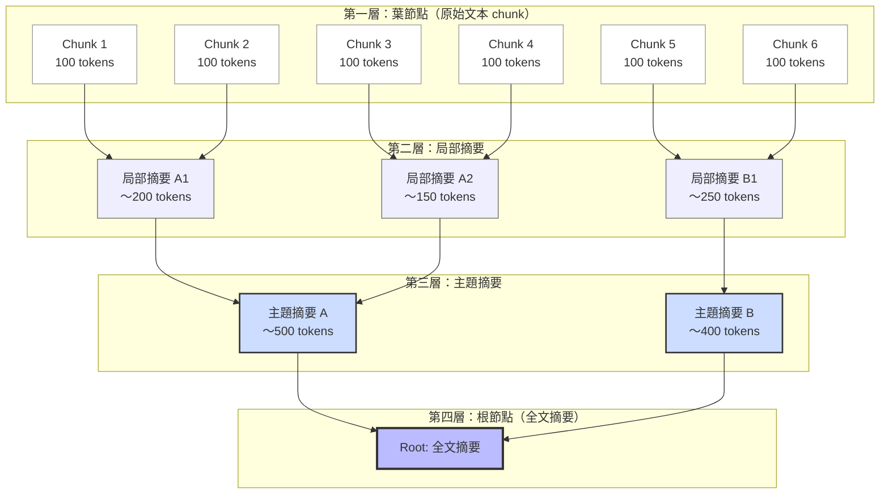
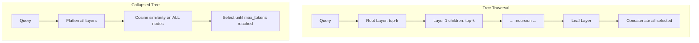

# RAPTOR：以遞迴摘要與樹狀結構實現多層次檢索增強生成

## TL;DR

- 標準 RAG 只檢索短連續 chunk，無法理解文件的整體脈絡與跨章節關係。
- RAPTOR 提出遞迴式嵌入、聚類、摘要的樹狀建構流程，從底層葉節點到高層主題摘要形成多層次檢索樹。
- 在 QuALITY 搭配 GPT-4 達到 82.6%（+20% 絕對準確率），打破當時 SOTA。

## 背景與動機

### RAG 的成功與其結構性限制

大型語言模型（LLM）雖然可以在參數中儲存大量事實知識（Petroni et al., 2019; Jiang et al., 2020），但它們有幾個根本問題：知識無法即時更新、無法追蹤來源、容易產生幻覺。檢索增強生成（Retrieval-Augmented Generation, RAG）由 Lewis et al.（2020）提出，透過將問題先送去一個外部知識庫檢索相關段落，再把這些段落餵給 LLM 作為生成 context，有效解決了上述問題。

RAG 的核心流程很直觀：

1. 把文件切成長度固定的連續 chunk（通常是 100 個 token 左右）
2. 用 Dense Passage Retriever（DPR）或 BM25 等檢索器把每個 chunk 編碼成向量
3. 查詢時，對 query 做同樣的編碼，找 top-k 最相似的 chunk
4. 把這些 chunk 餵給 seq2seq 模型（如 BART）產生答案

這個流程簡單有效，但存在一個根本的結構性限制：**檢索回來的 chunk 是短且連續的文字片段，無法捕捉文件的整體脈絡與跨段落語意關係**。

### 為什麼需要從 RAG 到 RAPTOR

RAG 的成功與限制，可以用一個簡單的類比來理解：

- 標準 RAG 像是圖書館的**卡片目錄**：每張卡片代表一本書的一個段落，你可以根據主題搜尋，但只能借出單張卡片。
- RAPTOR 的目標是成為一個**有經驗的圖書館員**：不只幫你找卡片，還能理解整本書的結構，為你摘要相關章節的內容，並指出不同章節之間的關聯。

這個類比說明了為什麼 RAG 雖然有效，但對複雜問題仍有不足：

| 情境 | 標準 RAG | RAPTOR |
|------|---------|--------|
| 事實性查詢（「巴黎是法國的首都嗎？」） | ✅ 直接從單一 chunk 找到答案 | ✅ 同樣可從葉節點找到 |
| 多跳推理（「拿破崙在哪所學校受過教育？」） | ⚠️ 需要多個 chunk 串接，標準 RAG 無法做到 | ✅ 摘要節點可能已包含完整的因果鏈 |
| 主題性理解（「這篇文章的論點是什麼？」） | ❌ 只有 fragment，無法形成整體理解 | ✅ 高層摘要節點直接提供 |
| 比較性問題（「方法 A 與方法 B 的差異？」） | ❌ 相關資訊分散在不同章節 | ✅ 透過語意聚類，相關的比較段落可能已在同一 cluster 中 |

### RAG 的架構詳解

RAG 在 2020 年由 Facebook AI Research 的 Lewis et al. 提出，發表於 NeurIPS 2020。它是第一個將預訓練 seq2seq 模型與神經檢索器端到端整合的通用架構，奠定了現代 RAG 的基礎。

#### 核心架構

RAG 包含兩個主要元件：

**1. 檢索器（Retriever）— Dense Passage Retriever (DPR)**

DPR 由 Karpukhin et al.（2020）提出，採用雙編碼器（bi-encoder）架構。它用兩個獨立的 BERT-base 模型分別編碼 query 和 document：

給定查詢 $x$，檢索器計算每個文件 $z$ 的相關性分數：

$$p_{\eta}(z|x) = \frac{\exp(d(z)^\top q(x))}{\sum_{z' \in \mathcal{Z}} \exp(d(z')^\top q(x))}$$

其中 $d(z) = \text{BERT}_d(z)$ 是文件編碼器，$q(x) = \text{BERT}_q(x)$ 是查詢編碼器。由於 $\mathcal{Z}$ 可能包含數千萬個文件，精確計算 softmax 不可行。RAG 使用 top-K 近似：只保留前 K 個相關性最高的文件，並對它們的 softmax 分數正規化。

實際搜尋時，文件 embedding 被預先計算好並存在 MIPS（Maximum Inner Product Search）索引中。RAG 使用 FAISS 的 Hierarchical Navigable Small World (HNSW) 近似演算法實現次線性的檢索速度。

**2. 生成器（Generator）— BART-large**

BART-large 是 400M 參數的 seq2seq transformer，預訓練時使用 denoising auto-encoding 目標（對輸入加入多種噪聲後還原）。RAG 將檢索到的文件 $z$ 與原始輸入 $x$ 拼接成 `[x, z]` 作為 BART 的輸入：

$$p_{\theta}(y_i|x, z, y_{1:i-1}) = \text{BART}(y_i | [x; z], y_{1:i-1})$$

#### 兩種邊際化方式

RAG 的核心創新之一是把檢索到的文件當作潛在變數，並提出兩種邊際化策略：

**RAG-Sequence**：假設整段輸出使用同一組文件

$$p_{\text{RAG-Seq}}(y|x) \approx \sum_{z \in \text{top-}k} p_{\eta}(z|x) \prod_i p_{\theta}(y_i|x, z, y_{1:i-1})$$

解碼時，對每個文件 $z$ 獨立做 beam search，產生候選集合 $\mathcal{Y}$。然後對每個候選 $y \in \mathcal{Y}$ 計算所有文件上的邊際機率。論文中提供了兩種解碼方式：

- **Thorough Decoding**：對每個文件 $z$ 計算 $p(y|x, z)$，然後加權求和。計算量較大但準確。
- **Fast Decoding**：對於不在 beam 中的 $y$，假設 $p(y|x, z_i) \approx 0$。計算量小但可能漏掉最佳解。

**RAG-Token**：每個輸出 token 可用不同的文件

$$p_{\text{RAG-Token}}(y|x) \approx \prod_i \sum_{z \in \text{top-}k} p_{\eta}(z|x) p_{\theta}(y_i|x, z, y_{1:i-1})$$

這實際上把邊際化移到 token 層級：每個生成步驟先對 K 個文件做邊際化，再產生下一個 token。解碼時使用標準的 beam search，因為 $p(y_i|x, y_{1:i-1})$ 可以視為標準的 autoregressive transition probability。

#### 訓練方式

RAG 端到端聯合訓練 retriever 與 generator，最小化負邊際對數似然：

$$\mathcal{L} = -\sum_j \log p(y_j|x_j)$$

訓練時的文件編碼器 $\text{BERT}_d$ 保持凍結（更新它需要定期重建文件索引，成本太高），只更新查詢編碼器 $\text{BERT}_q$ 和 BART generator。

#### RAG 的成就與限制

RAG 在四個開放域 QA 資料集上創下 SOTA（Natural Questions: 44.5 EM、TriviaQA: 68.0 EM），並在 Jeopardy 問題生成與 MS-MARCO 抽象式 QA 上表現優於純參數模型。它的關鍵貢獻是：

1. 證明生成式檢索（generative retrieval）可以超越 extractive 方法
2. 引入可端到端訓練的檢索-生成架構模板
3. 展示非參數記憶的可熱替換性（index hot-swapping）

但 RAG 的文件索引方式成為後續改進的焦點：**將 Wikipedia 的每篇文章切成 100 字的 disjoint chunk，總共形成約 2,100 萬個 chunk**。這意味著檢索的單位是短且孤立的文字片段。RAPTOR 要解決的正是這個問題。

### 為什麼 Flat Chunk 不夠用

想像一個問題：「灰姑娘是怎麼得到幸福結局的？」答案分散在故事的不同段落——仙女教母的幫助、舞會的場景、玻璃鞋的失而復得。如果只檢索 top-3 最相似且最短的 contiguous chunk，每一段可能只提到故事的一個環節，沒有一段包含足夠的上下文來回答這個主題性問題。

這種「需要綜合文件多個部分才能回答」的問題，在學術上稱為**主題性問題或跨段落多跳（multi-hop）問題**。NarrativeQA（Kocisky et al., 2018）就是這類問題的典型資料集——它需要理解整本書或整部電影的敘事才能正確回答。

### 為什麼不直接用長 context

有人可能會問：既然 GPT-4 已經有 128K 的 context window，為什麼不直接把整份文件塞進去就好？

RAPTOR 論文中引用了 Liu et al.（2023）和 Sun et al.（2021）的研究來回答這個問題。他們的發現是：**模型在長 context 中會「迷失在中間」（lost in the middle）**——當相關資訊嵌在長文本中時，模型隨著 context 長度增加反而表現下降。更實際的問題是：長 context 又慢又貴，對大多數應用場景來說不切實際。

這說明了即使在長 context 時代，**選擇最相關的資訊**仍然是知識密集型任務的關鍵。

### 既有方法的不足

在 RAPTOR 之前，已經有研究試圖改善 RAG 的檢索品質：

- **Dense Hierarchical Retrieval (DHR)** 和 **Hybrid Hierarchical Retrieval (HHR)**（Liu et al., 2021; Arivazhagan et al., 2023）結合了文件層級與段落層級的檢索，但仍然是基於位置的層次而非語意的層次。
- **LlamaIndex**（Liu, 2022）透過摘要相鄰 chunk 並保留中間節點來儲存不同粒度的資訊，但依賴文本的順序相鄰性（adjacency）來分組，無法捕捉文本中相隔較遠但語意相關的段落。
- **Recursively Summarizing Books**（Wu et al., 2021）用任務分解的方式逐步摘要文本，但同樣以順序為基礎，且只使用根節點做檢索，遺漏了中間層次。

RAPTOR 的核心洞察是：**語意相關的段落不一定在文本中相鄰**，因此需要以語意相似性為基礎的聚類，而非以文本順序為基礎的切割。

### RAPTOR 樹狀建構流程示意圖



> 圖 1：RAPTOR 樹狀結構示意圖。底層為 100-token 的原始文本 chunk（葉節點），透過語意聚類與 LLM 摘要逐步合併為局部摘要、主題摘要，最終到根節點的全文摘要。圖中灰色葉節點（Chunk 2、4、5）語意相近，被聚在同一 cluster 中。

## 核心知識點

### 1. Flat Chunk Retrieval 的結構性限制

標準 RAG 將文件切成固定長度的連續 chunk，用向量相似度做 top-k 檢索。這種方式有兩個根本問題：

- **上下文破碎**：一個完整的思想可能被切在多個 chunk 中，每個 chunk 單獨看都缺少前後文。
- **跨 chunk 關係遺失**：主題性問題需要綜合多個段落的資訊，標準 RAG 無法做到「把相關但分散的段落拼起來」。

### 2. 遞迴樹狀建構流程

RAPTOR 的建構流程是本篇論文的核心貢獻。它包含四個反覆進行的步驟：**嵌入 → 聚類 → 摘要 → 重嵌入**。具體來說：

1. **葉節點生成**：把文件切成 100 token 的 chunk（保留完整句子），用 SBERT 嵌入
2. **聚類**：用 Gaussian Mixture Model（GMM）+ UMAP 降維，對節點做軟聚類
3. **摘要**：每個 cluster 送給 LLM（GPT-3.5-turbo）生成摘要，成為父節點
4. **遞迴**：父節點重新嵌入後，回到步驟 2，直到無法再聚類

最終結果是一個多層次的樹：底層是原始文本片段，上層是越來越抽象的主題摘要。

### 3. 軟聚類演算法設計

RAPTOR 的聚類演算法有幾個精巧的設計選擇：

- **Gaussian Mixture Model (GMM)**：相較於 k-means 的硬分類，GMM 允許一個節點屬於多個 cluster（soft clustering），這很重要因為一段文本可能同時涉及多個主題。
- **UMAP 降維**：高維向量空間的距離度量會出現「維度詛咒」問題（Aggarwal et al., 2001），UMAP 將 embedding 降到低維後再做 GMM 聚類。
- **BIC 決定 cluster 數量**：Bayesian Information Criterion 在模型複雜度與擬合度之間取得平衡，自動決定最佳 cluster 數。
- **兩階段聚類**：先做 global clustering 找出大主題，再在每個 global cluster 內做 local clustering 找出子主題，捕捉從廣義到具體的全光譜關係。

### 4. 兩種檢索策略

RAPTOR 提供兩種檢索策略，各有取捨：

**Tree Traversal**：
- 從根層開始，計算 query 與該層所有節點的餘弦相似度
- 選 top-k 節點後，只考慮它們的子節點
- 重複直到葉節點
- 優點：計算量小（每層只搜尋子集）
- 缺點：每一層選 top-k 的比例固定，無法根據問題動態調整

**Collapsed Tree**：
- 把整個樹攤平成單一層級
- 對全部節點做餘弦相似度搜尋
- 從最相似開始取，直到達到 max token 數
- 優點：彈性最高，可根據問題粒度自動選擇適當層級的資訊
- 缺點：需要對所有節點搜尋，大規模應用需 FAISS 加速

實驗結果顯示 Collapsed Tree 一致優於 Tree Traversal。

### 5. LLM 摘要的品質控制

摘要品質是 RAPTOR 潛在的脆弱點。論文做了詳細的分析：

- 約 4% 的摘要含有輕微幻覺
- 幻覺**不會傳播**到父節點——因為父節點是基於子節點的**原始內容**重新摘要，而不是基於子節點摘要的摘要
- 幻覺對 QA 任務無可察覺的負面影響
- 使用 GPT-3.5-turbo 作為摘要模型

### 6. 樹結構的實質貢獻

論文透過消融實驗證明樹結構不是花俏包裝，而是有實質貢獻：

- 完整樹（所有層級）優於只檢索特定層級
- 非葉節點貢獻了 18.5%–57% 的被檢索節點（視資料集與 retriever 而定）
- 上層節點對主題性問題特別關鍵——當問題需要廣泛理解時，高層摘要節點提供了關鍵 context

## 方法詳解

### 從 RAG 到 RAPTOR：檢索架構的演化

要理解 RAPTOR 的貢獻，先要理解它要取代的標準 RAG 架構。

#### RAG（Lewis et al., 2020）的架構

RAG 在 2020 年由 Facebook AI Research 提出，是第一個將預訓練 seq2seq 模型與神經檢索器整合的通用架構。它的設計包含兩個核心元件：

1. **檢索器（Retriever）**：使用 Dense Passage Retriever（DPR）的雙編碼器架構。給定查詢 x，計算
   $$p_{\eta}(z|x) \propto \exp(d(z)^\top q(x))$$
   其中 $d(z)$ 是 BERT-based 文件編碼器，$q(x)$ 是 query 編碼器。top-k 檢索透過 Maximum Inner Product Search（MIPS）實現，使用 FAISS 加速。

2. **生成器（Generator）**：使用 BART-large（400M 參數），將檢索到的文件 z 與輸入 x 拼接後產生輸出 y。

RAG 提出了兩種邊際化方式：

- **RAG-Sequence**：整段生成使用同一組檢索文件
  $$p_{\text{RAG-Seq}}(y|x) \approx \sum_{z \in \text{top-}k} p_{\eta}(z|x) p_{\theta}(y|x,z)$$

- **RAG-Token**：每個 token 可使用不同的檢索文件
  $$p_{\text{RAG-Token}}(y|x) \approx \prod_i \sum_{z \in \text{top-}k} p_{\eta}(z|x) p_{\theta}(y_i|x,z,y_{1:i-1})$$

RAG 在 Natural Questions、WebQuestions、CuratedTrec 等開放域 QA 資料集上創下 SOTA。它的關鍵貢獻是證明了**不需要 extractive reader 或 re-ranker**，直接用生成模型就能超越當時的最佳 extractive 方法。

但 RAG 的文件索引方式是：將 Wikipedia 的每一篇文章切成 100 字的 disjoint chunk，總共形成約 2,100 萬個 chunk。這意味著檢索的單位是短且孤立的文字片段——RAPTOR 要解決的核心問題就在這裡。

#### RAPTOR 的樹狀建構詳解

RAPTOR 的樹狀建構可以拆成四個階段，每個階段都有特定的演算法設計：

**階段一：葉節點生成**

首先將文件切成 100 token 的短文本。與標準做法不同，RAPTOR 在遇到句子邊界時會把整個句子移到下一個 chunk，維持語意完整性：

```
Example:
  "The quick brown fox jumps over the lazy dog. It then ran into the forest."
  → Chunk 1: "The quick brown fox jumps over the lazy dog."
  → Chunk 2: "It then ran into the forest."
```

每個 chunk 用 SBERT（multi-qa-mpnet-base-cos-v1）嵌入成 dense vector。這些 chunk 與其 embedding 形成樹的葉節點。

**階段二：軟聚類**

這是最關鍵也最複雜的步驟。傳統的基於順序的摘要方法（如 LlamaIndex、Wu et al. 2021）只合併相鄰文本，但 RAPTOR 認為語意相關的段落可能分布在文本的各處，因此用語意相似性來決定哪些節點應該被合成一個 cluster。

聚類流程如下：

1. 對葉節點的 embedding 做 **UMAP 降維**，將 d 維向量降到低維表示
   - UMAP 的 `n_neighbors` 參數控制局部 vs. 全局結構的平衡
   - 論文透過變化 `n_neighbors` 實現兩階段聚類：先用小 neighbors 做 global clustering，再在大 cluster 內用大 neighbors 做 local clustering

2. 對降維後的資料擬合 **Gaussian Mixture Model (GMM)**
   - GMM 假設資料來自 K 個高斯分布的混合：
   $$P(x) = \sum_{k=1}^{K} \pi_k \mathcal{N}(x; \mu_k, \Sigma_k)$$
   - 不同於 k-means 的硬分類，GMM 給出每個節點屬於每個 cluster 的後驗機率 $P(k|x)$，實現 soft clustering
   - 這允許一段文本同時屬於多個主題——例如一段討論「Transformer 在 NLP 的應用」的文章可能同時被分到 NLP 與 Transformer 兩個 cluster

3. 用 **Bayesian Information Criterion (BIC)** 決定最佳 cluster 數量
   $$\text{BIC} = \ln(N)k - 2\ln(\hat{L})$$
   - $N$：節點數，$k$：參數量，$\hat{L}$：最大似然值
   - BIC 在模型複雜度（越多 cluster）與擬合度之間取平衡
   - 選擇使 BIC 最小的 K 值

4. 用 **Expectation-Maximization (EM)** 演算法估計 GMM 參數（均值、共變異數、混合權重）

5. **遞迴聚類**：如果某個 local cluster 的合併文本超過摘要模型的 token 限制，就對該 cluster 內的節點再遞迴地做一次 GMM 聚類

**階段三：LLM 摘要**

每個 cluster 內的所有節點文本送給 GPT-3.5-turbo 生成摘要。這個摘要成為父節點的內容。

論文提供了一個重要的品質分析：約 4% 的摘要含有輕微幻覺。但關鍵設計是**父節點基於子節點的原始內容重新摘要**，而不是基於子節點的摘要再做摘要。這意味著：

```
錯誤做法（可能導致幻覺傳播）：
  葉節點 → 摘要 A → 對摘要 A 做摘要 B → 錯誤可能在 A 中已經是摘要偏差，B 會放大

RAPTOR 的做法：
  葉節點 → 摘要 A（基於原始葉節點）
  葉節點 + 摘要 A → 摘要 B（基於原始葉節點 + 原始摘要 A）
```

論文的表註研究確認這種設計確保幻覺不會傳播到上層節點。

**階段四：重嵌入與遞迴**

父節點的摘要文本用 SBERT 重新嵌入後，回到階段二，將新一代節點（葉節點 + 父節點）重新聚類、摘要、再嵌入。這個過程持續進行，直到以下條件之一滿足：

- 所有節點被聚成一個 cluster（無法再分）
- 進一步聚類會產生空 cluster
- 達到預設的最大層數

最終形成一個多層次的樹狀結構——從底層的原始文本，中間層的主題摘要，到根層的全文摘要。整個建構過程在時間與 token 消耗上都呈線性，適合大規模語料。

#### 檢索階段

建構好樹後，查詢時有兩種策略：



**Tree Traversal 的演算法**：

```
1. 從根層開始，計算 query 與該層所有節點的餘弦相似度
2. 選 top-k 節點，加入集合 S_1
3. 只考慮 S_1 節點的子節點
4. 在子節點集合中再選 top-k，得到 S_2
5. 重複直到葉節點
6. 拼接 S_1 ∪ S_2 ∪ ... ∪ S_d 作為 context
```

Tree Traversal 的 `k` 和 `d`（層數）決定了檢索的精確度與廣度。但它的缺點是每層的 top-k 比例固定——不管問題是「故事的主題是什麼」還是「王子在幾點離開舞會」，檢索的層級分布都一樣。

**Collapsed Tree 的演算法**：

```
1. 把整個樹攤平成單一集合 C（包含所有層級的所有節點）
2. 對 query 與 C 中所有節點計算餘弦相似度
3. 從最相似的節點開始取，直到達到 max_tokens 門檻
```

Collapsed Tree 的關鍵優勢是彈性：對於主題性問題（「這本書在講什麼？」），高層摘要節點的相似度會最高，因此被優先選取；對於細節性問題（「主角在哪一年出生？」），底層葉節點的相似度會最高。問題的粒度自動決定了檢索的層級。

實驗顯示 Collapsed Tree 在 QASPER 的 20 個故事測試中一致優於 Tree Traversal，因此論文後續實驗都使用 Collapsed Tree 搭配 2,000 token 的最大 context。

### 數學推導補充

論文中對 GMM 的數學描述比較簡略，這裡補上完整推導。

GMM 假設資料 $x$ 來自 $K$ 個高斯分布的加權組合：

$$P(x|\Theta) = \sum_{k=1}^{K} \pi_k \mathcal{N}(x|\mu_k, \Sigma_k)$$

其中 $\Theta = \{\pi_1, ..., \pi_K, \mu_1, ..., \mu_K, \Sigma_1, ..., \Sigma_K\}$，且 $\sum_{k=1}^{K} \pi_k = 1$。

給定 $N$ 個觀測值 $\{x_1, ..., x_N\}$，對數似然為：

$$\ln P(X|\Theta) = \sum_{i=1}^{N} \ln\left(\sum_{k=1}^{K} \pi_k \mathcal{N}(x_i|\mu_k, \Sigma_k)\right)$$

這個式子沒有閉式解，因此用 EM 演算法迭代求解：

**E-step**：計算每個點 $x_i$ 屬於第 $k$ 個 cluster 的後驗機率（也稱為 responsibility）：
$$\gamma_{ik} = \frac{\pi_k \mathcal{N}(x_i|\mu_k, \Sigma_k)}{\sum_{j=1}^{K} \pi_j \mathcal{N}(x_i|\mu_j, \Sigma_j)}$$

**M-step**：根據 $\gamma_{ik}$ 更新參數：

$$N_k = \sum_{i=1}^{N} \gamma_{ik}$$

$$\mu_k^{\text{new}} = \frac{1}{N_k} \sum_{i=1}^{N} \gamma_{ik} x_i$$

$$\Sigma_k^{\text{new}} = \frac{1}{N_k} \sum_{i=1}^{N} \gamma_{ik} (x_i - \mu_k^{\text{new}})(x_i - \mu_k^{\text{new}})^\top$$

$$\pi_k^{\text{new}} = \frac{N_k}{N}$$

迭代直到收斂。這個過程在 UMAP 降維後的空間中進行，因為原始高維空間（SBERT 的 768 維）的距離度量會出現「維度詛咒」——在高維空間中，所有點之間的距離趨近於相等，使得 GMM 的聚類效果大幅下降。

## 實驗結果

### 資料集與設定

RAPTOR 在三個 QA 資料集上進行評估：

| 資料集 | 文件類型 | 文件長度 | 問題類型 | 評估指標 |
|--------|---------|---------|---------|---------|
| NarrativeQA | 書籍/電影劇本 | 全書長度 | 自由文字問答 | BLEU, ROUGE, METEOR |
| QASPER | NLP 論文 | 全篇論文 | 可答/不可答、Yes/No、摘要、擷取 | F1 |
| QuALITY | 中等長度文章 | ~5,000 tokens | 選擇題 | Accuracy |

### 控制實驗：有 RAPTOR vs. 無 RAPTOR

第一個實驗的設計很直接：在同一個 retriever（SBERT、BM25、DPR）上，比較加不加 RAPTOR 樹的差異。Reader 統一使用 UnifiedQA-3B。

**NarrativeQA 結果**：

| 模型 | ROUGE-L | BLEU-1 | BLEU-4 | METEOR |
|------|---------|--------|--------|--------|
| SBERT 無 RAPTOR | 29.26% | 22.56% | 5.95% | 18.15% |
| SBERT 有 RAPTOR | 30.87% | 23.50% | 6.42% | 19.20% |
| BM25 無 RAPTOR | 23.52% | 17.73% | 4.65% | 13.98% |
| BM25 有 RAPTOR | 27.93% | 21.17% | 5.70% | 17.03% |
| DPR 無 RAPTOR | 29.56% | 22.84% | 6.12% | 18.44% |
| DPR 有 RAPTOR | 30.94% | 23.51% | 6.45% | 19.05% |

關鍵觀察：**無論用哪個 retriever，加上 RAPTOR 樹結構後表現都提升了**。這說明了 RAPTOR 的效益是獨立於底層 retriever 的——它是在檢索架構層面的改進，不是特定 retriever 的優化。

**QuALITY 與 QASPER 結果**：

| 模型 | QuALITY (Accuracy) | QASPER (Answer F1) |
|------|-------------------|-------------------|
| SBERT 無 RAPTOR | 54.9% | 36.23% |
| SBERT 有 RAPTOR | 56.6% | 36.70% |
| BM25 無 RAPTOR | 49.9% | 26.47% |
| BM25 有 RAPTOR | 52.1% | 27.00% |
| DPR 無 RAPTOR | 53.1% | 31.70% |
| DPR 有 RAPTOR | 54.7% | 32.23% |

### 跨 LLM 的比較

論文進一步用三種不同的 LLM 做 reader，比較 RAPTOR、BM25 和 DPR 在 QASPER 上的表現：

| Retriever | GPT-3 F1 | GPT-4 F1 | UnifiedQA F1 |
|-----------|---------|---------|-------------|
| Title + Abstract only | 25.2 | 22.2 | 17.5 |
| BM25 | 46.6 | 50.2 | 26.4 |
| DPR | 51.3 | 53.0 | 32.1 |
| **RAPTOR** | **53.1** | **55.7** | **36.6** |

RAPTOR 優於 DPR 的幅度在不同模型下分別為：+1.8（GPT-3）、+2.7（GPT-4）、+4.5（UnifiedQA）個百分點。值得注意的是，**GPT-4 + RAPTOR 並未達到最高提升幅度**——反而是 UnifiedQA（規模最小的 reader）從 RAPTOR 的樹結構中獲益最多（+4.5 vs. DPR）。這暗示當 reader 本身能力較弱時，更好的檢索品質（提供更多上下文）的邊際效益更大。

### 與 SOTA 比較

**QASPER F1 Match 比較**：

| 模型 | F1 Match |
|------|---------|
| LongT5 XL（Guo et al., 2022） | 53.1 |
| CoLT5 XL（Ainslie et al., 2023） | 53.9 |
| **RAPTOR + GPT-4** | **55.7** |

**QuALITY 比較**：

| 模型 | 完整測試集 | Hard 子集 |
|------|-----------|----------|
| Longformer-base（Beltagy et al., 2020） | 39.5% | 35.3% |
| DPR + DeBERTaV3-large（Pang et al., 2022） | 55.4% | 46.1% |
| CoLISA DeBERTaV3-large（Dong et al., 2023a） | 62.3% | 54.7% |
| **RAPTOR + GPT-4** | **82.6%** | **76.2%** |

這個結果特別引人注目：RAPTOR + GPT-4 在 QuALITY 上比先前的 SOTA 提高了 **20.3% 的絕對準確率**，在 Hard 子集上提高了 21.5%。如此巨大的提升幅度需要謹慎看待——它可能部分來自 GPT-4 本身的推理能力（先前的 SOTA 使用較小的模型如 DeBERTaV3-large），但 RAPTOR 提供的多層次 context 確實讓 GPT-4 能更有效地利用文件資訊。

**NarrativeQA 比較**：

| 模型 | ROUGE-L | BLEU-1 | BLEU-4 | METEOR |
|------|---------|--------|--------|--------|
| BiDAF（Kocisky et al., 2018） | 6.2 | 5.7 | 0.3 | 3.7 |
| BM25 + BERT（Mou et al., 2020） | 15.5 | 14.5 | 1.4 | 5.0 |
| Recursively Summarizing Books（Wu et al., 2021） | 21.6 | 22.3 | 4.2 | 10.6 |
| Retriever + Reader（Izacard & Grave, 2022） | 32.0 | 35.3 | 7.5 | 11.1 |
| **RAPTOR + UnifiedQA** | 30.8 | 23.5 | 6.4 | **19.1** |

RAPTOR + UnifiedQA 在 METEOR 上創下 SOTA（19.1），超過 Wu et al.（2021）的 10.6。這說明 RAPTOR 相較於同樣使用遞迴摘要的 Wu et al. 的關鍵優勢：Wu et al. 只使用樹的根節點（全文摘要）來回答問題，而 RAPTOR 利用中間層的節點來捕捉從一般主題到具體細節的全光譜資訊。

### RAPTOR 搭配不同 LLM 的表現趨勢

從跨 LLM 的實驗中可以觀察到一個有趣的模式：

| Retriever | GPT-3 F1 | GPT-4 F1 | UnifiedQA F1 |
|-----------|---------|---------|-------------|
| BM25 | 46.6 | 50.2 | 26.4 |
| DPR | 51.3 | 53.0 | 32.1 |
| RAPTOR | 53.1 | 55.7 | 36.6 |
| RAPTOR 優於 DPR 幅度 | +1.8 | +2.7 | +4.5 |

RAPTOR 的效益在最小的 reader（UnifiedQA 3B）上最大（+4.5 F1），在最大的 reader（GPT-4）上反而最小（+2.7 F1）。這背後的直覺是：**當 reader 本身能力較強時，它可以自行補償檢索階段的不足**——GPT-4 可以從多個檢索到的片段中推理出綜合答案，但 UnifiedQA 需要檢索結果本身就已經是高品質的綜合資訊。

這個發現對系統設計有重要含義：如果你的 reader 能力有限（如部署開源小模型），RAPTOR 提供的多層次 context 會有很大的邊際效益；如果你使用 GPT-4 等級的模型，RAPTOR 仍然有幫助，但邊際效益較小。

### 消融實驗：層級貢獻

論文對樹結構的各層級做了詳細的消融研究：

| 檢索層級 | 正確率（Story 1） |
|---------|-----------------|
| 只檢索葉節點（Layer 0） | 57.9% |
| 只檢索 Layer 1 | 57.8% |
| 只檢索 Layer 2 | 57.9% |
| Layer 0 + Layer 1 | 52.6% |
| Layer 1 + Layer 2 | 63.15% |
| **完整樹（三層）** | **73.68%** |

這裡有幾個值得注意的觀察：

- **單一層級不管選哪層表現都差不多**（約 58%）——說明任何單一層級都不足以涵蓋多樣的查詢需求
- **Layer 1 + Layer 2 優於 Layer 0 + Layer 1**——上層的多層次組合比底層的組合更有用
- **完整樹大幅優於所有子集**（73.68% 對比 57.9%）——證明樹的不同層級提供的資訊是互補的

跨資料集的更全面分析顯示：非葉節點貢獻了 18.5%–57% 的被檢索節點，具體比例取決於資料集與 retriever：

| 資料集 | DPR | SBERT | BM25 |
|--------|-----|-------|------|
| NarrativeQA | 57.36% | 36.78% | 34.96% |
| QuALITY | 32.28% | 24.41% | 32.36% |
| QASPER | 22.93% | 18.49% | 22.76% |

NarrativeQA 的非葉節點貢獻最高（DPR 下達 57%），這符合預期——書籍/電影的主題性問題特別需要高層次的摘要資訊。葉節點適合細節性查詢，高層摘要節點適合主題性查詢，Collapsed Tree 的優勢就在於它能根據問題自動選取適當的層級。這個特性使得 RAPTOR 在面對混合型查詢（同時需要細節與摘要）時表現特別出色。

## 消融分析：樹結構的貢獻

論文對樹結構的各層級做了詳細的消融研究，這是理解 RAPTOR 為何有效的核心分析。

### 單一故事逐層實驗

以下是在 QuALITY 的一個故事上，限制檢索不同層級時的表現：

| 檢索層級 | 正確率（Story 1） |
|---------|-----------------|
| 只檢索葉節點（Layer 0） | 57.9% |
| 只檢索 Layer 1 | 57.8% |
| 只檢索 Layer 2 | 57.9% |
| Layer 0 + Layer 1 | 52.6% |
| Layer 1 + Layer 2 | 63.15% |
| **完整樹（三層）** | **73.68%** |

三個值得注意的觀察：

- **單一層級不管選哪層表現都差不多**（約 58%）——說明任何單一層級都不足以涵蓋多樣的查詢需求。
- **Layer 1 + Layer 2 優於 Layer 0 + Layer 1**——上層的多層次組合比底層的組合更有用。
- **完整樹大幅優於所有子集**（73.68% vs. 57.9%）——證明樹的不同層級提供的資訊是互補的。

有趣的是，Layer 0 + Layer 1 的組合反而比單獨使用 Layer 0 更差（52.6% vs. 57.9%）。這可能與「迷失在中間」效應有關——當同時提供原始細節與第一層摘要時，reader 反而難以判斷應該關注哪個層級。

### 跨資料集非葉節點佔比

論文在 Appendix I 中提供了跨三個資料集的完整層級貢獻分析：

| 資料集 | DPR | SBERT | BM25 |
|--------|-----|-------|------|
| NarrativeQA | 57.36% | 36.78% | 34.96% |
| QuALITY | 32.28% | 24.41% | 32.36% |
| QASPER | 22.93% | 18.49% | 22.76% |

NarrativeQA 的非葉節點貢獻最高（DPR 下達 57%），這符合預期——書籍/電影的主題性問題特別需要高層次的摘要資訊。QASPER 最低但仍有 18-23%，說明即使在事實性查詢中，摘要仍提供有意義的額外上下文。

### 逐層貢獻分布

以 DPR 為 retriever 時，各層級的節點被選取比例：

| 層級 | NarrativeQA | QuALITY | QASPER |
|------|-------------|---------|--------|
| Layer 0（葉節點） | 42.64% | 67.71% | 77.07% |
| Layer 1 | 45.00% | 29.43% | 21.88% |
| Layer 2 | 10.57% | 2.85% | 1.05% |
| Layer 3 | 1.78% | — | — |

NarrativeQA 上 Layer 1 甚至超越了葉節點（45% vs. 42.6%），這是論文中最有力的證據之一：對於長文本的主題性問題，第一層摘要比原始文本片段更有資訊價值。

### 檢索器類型對層級選擇的影響

比較三種 retriever 的非葉節點貢獻：

- **DPR 最傾向選擇非葉節點**（NarrativeQA 上 57%）——作為 dense retriever，它能更好地捕捉高層摘要節點與 query 之間的語意匹配。
- **BM25 最不傾向非葉節點**——基於詞彙重疊的檢索器對精簡後的摘要文本較不利，因為摘要中的詞彙可能與 query 不完全匹配。
- **SBERT 介於兩者之間**——作為 sentence-level 的 dense embedding，它在語意匹配與詞彙匹配之間取得了平衡。

這個差異說明了 RAPTOR 樹結構的效益與底層 retriever 的特性有關：dense retriever 能更有效地利用樹結構提供的多層次資訊。

## 總結、限制與未來方向

### 核心貢獻

RAPTOR 的核心貢獻是提出了**語意驅動的樹狀檢索結構**，將文件從一維的連續文字序列轉化為多層次的語意樹，在檢索時能同時提供高層次的主題摘要與底層的細節資訊。相較於標準 RAG 的 flat chunk 檢索，RAPTOR 在三個不同的 QA 資料集上、搭配三種不同的 retriever 與三種不同的 LLM 都一致地表現更好。

### 已知限制

1. **建構成本高**：樹的建構需要多次 LLM 摘要調用（一次建構，多次查詢使用）。對於很大規模的語料庫，這個前期成本可能很可觀。

2. **相依於 OpenAI API**：論文使用 GPT-3.5-turbo 做摘要、GPT-3/GPT-4 做 QA 評估。這意味著實驗結果依賴於特定 API 的行為，難以完全重現。如果使用開源模型做摘要，摘要品質可能不同。

3. **GMM 假設與文本分布不符**：GMM 假設資料來自多個高斯分布的混合，但文本 embedding 通常是稀疏且偏斜分布的。論文在 ablation 中將 GMM 聚類與簡單的 contiguous chunk 摘要做了比較，結果傾向 GMM，但這不代表 GMM 是最優選擇。

4. **摘要幻覺雖小但存在**：4% 的幻覺率在 QA 任務中沒有顯著影響，但在事實查核或醫療等對準確性要求極高的場景中可能構成問題。

5. **Collapsed Tree 的搜尋成本**：雖然 Collapsed Tree 表現最佳，但它需要對所有節點做餘弦相似度搜尋。論文提到可以用 FAISS 加速，但對於非常大規模的樹，這仍然是一個瓶頸。

### 後續發展方向

RAPTOR 發表於 ICLR 2024，後續已有一些延伸工作：

- **GraphRAG**（Microsoft, 2024）進一步將 RAPTOR 的樹狀結構擴展為圖狀結構，加入實體關係抽取與社群偵測（community detection），用於全域性查詢。如果 RAPTOR 是「從文件建樹」，GraphRAG 就是「從文件建圖」，後者更靈活但建構成本也更高。
- **HippoRAG**（Gutierrez et al., 2024）結合 LLM 知識圖譜（從文件中抽取的 triple）與傳統檢索，讓檢索能理解實體間的關係。與 RAPTOR 的路徑不同：RAPTOR 用摘要建立語意層次，HippoRAG 用知識圖譜建立結構化索引。
- **RAPTOR-Pack**：LlamaIndex 中已整合 RAPTOR 的實作，降低使用門檻。
- LangChain 的 ecosystem 中也出現了 RAPTOR 的社群實作。

### 可重現性評估

RAPTOR 論文的可重現性有幾個考量點：

- **摘要模型**：GPT-3.5-turbo 的具體版本隨時間改變，不同時間點跑同樣的程式可能得到不同的摘要結果。
- **QA 評估**：GPT-3 和 GPT-4 也同樣面臨 API 版本變動的問題。
- **聚類隨機性**：GMM + EM 演算法對初始值敏感，UMAP 也有隨機成分，不同次建構可能產生不同的樹。
- **超參數敏感性**：葉節點大小（100 tokens）、UMAP 的 n_neighbors、GMM 的 BIC 門檻等超參數的選擇對最終樹的品質有顯著影響。論文沒有提供全面的超參數敏感性分析。
- **正面的可重現措施**：論文使用了 UnifiedQA（開源 HuggingFace 模型）作為 reader 之一，提供了不依賴 API 的評估結果。論文也公開了程式碼（雖然截至本文撰寫仍在「將公開」狀態）。

### 值得進一步探索的方向

除了論文已提出的改進方向外，我認為以下幾個問題值得後續研究：

- **摘要模型的選擇**：GPT-3.5-turbo 是否是摘要任務的最佳選擇？開源模型（如 Llama 3、Qwen）在摘要任務上的表現如何？不同模型在不同領域的摘要品質差異如何？
- **動態樹更新**：RAPTOR 目前的樹是靜態的——建好後就不會變。如何高效地在新增文件時更新既有樹，是一個實務上的重要問題。
- **跨文件樹**：論文中的樹是在單一文件內建立的。如何建立跨文件的主題樹（類似 GraphRAG 但保留樹狀結構）是一個自然的擴展方向。
- **檢索與生成的更深層整合**：RAPTOR 的檢索與生成是兩階段獨立的。能否讓 reader 在生成過程中決定是否需要更細節或更抽象的資訊（類似 RAG-Token 的精神但跨層級）？

### RAPTOR 在長 context 時代的定位

一個自然會有的疑問是：隨著 GPT-4 的 128K context、Gemini 的 1M context 出現，檢索增強還重要嗎？

RAPTOR 論文引用了幾項研究來回答這個問題：

- **Lost in the Middle**（Liu et al., 2023）發現：當相關資訊在長 context 的中間位置時，模型表現最差。即使有長 context，模型也傾向於只使用開頭與結尾的資訊。
- **長 context = 慢 + 貴**：將整本書塞進 context 雖然理論可行，但實務上的計算成本與延遲是 prohibitive 的。
- **長 context 不等於理解**：Sun et al.（2021）發現長 context LM 並沒有真正使用長程上下文資訊。

所以 RAPTOR 的核心論點仍然是有效的：**選擇性檢索比盲目塞入所有文字更有效**。長 context 與檢索增強不應該是二選一——最佳實踐可能是：先用 RAPTOR 之類的方法檢索出最相關的數千 token，再餵給 model 的長 context window。

### 與其他遞迴方法的比較

RAPTOR 不是第一個使用遞迴摘要來處理長文件的方法。與 Wu et al.（2021）的 Recursively Summarizing Books 相比，關鍵差異在於：

| 維度 | Wu et al.（2021） | RAPTOR |
|------|------------------|--------|
| 聚類方式 | 順序相鄰（adjacent） | 語意相似性（GMM clustering） |
| 檢索層級 | 只使用根節點 | 使用全部層級（Collapsed Tree） |
| 群組化彈性 | 固定順序群組 | soft clustering，可跨段落合併 |
| 摘要模型 | 人類回饋強化 | GPT-3.5-turbo |

Wu et al. 的方法雖然效果不錯（NarrativeQA ROUGE-L 21.6），但受限於順序性聚類與單層檢索，無法捕捉跨章節的語意關係。RAPTOR 在 NarrativeQA 上的 METEOR 分數（19.1 vs. 10.6）展示了語意驅動聚類的優勢。

### 我的看法

RAPTOR 的最有價值的洞察不是樹狀結構本身，而是**語意相似性應該取代文字順序作為文件組織原則**。標準 RAG 的 flat chunk 檢索假設相關資訊在文字上相鄰（所以切 chunk 時是連續的），但這個假設在很多場景下不成立——一本書的不同章節可能討論同一個主題，而被中間的章節隔開。

RAPTOR 用聚類代替鄰近性來決定哪些節點應該合併，看似只是一個技術選擇，但反映了對文件結構更深層的理解：**文件的結構不是線性的，而是語意的。** 這個轉變——從位置驅動到語意驅動——可能是 RAPTOR 對後續研究最持久的貢獻。

回顧 RAPTOR 整體，我認為它最成功的地方在於找到了「簡單」與「有效」之間的良好平衡。樹狀結構在概念上直觀易懂，建構流程在工程上可行（線性時間與 token 消耗），實驗結果在三個資料集上一致且顯著。它不是一個追求理論極致的模型，而是一個解決了實際問題、設計優雅的系統。對於任何正在建構 RAG 系統的開發者來說，RAPTOR 的思路——在檢索層引入多層次語意結構——是一個值得認真考慮的方向。

### 延伸閱讀

以下是本篇討論到的相關論文，按閱讀順序列出：

- **RAG 原始論文**：Lewis et al., "Retrieval-Augmented Generation for Knowledge-Intensive NLP Tasks", NeurIPS 2020（本篇的 dependency paper）
- **DPR**：Karpukhin et al., "Dense Passage Retrieval for Open-Domain Question Answering", EMNLP 2020（RAG 使用的檢索器）
- **GraphRAG**：Microsoft Research, "From Local to Global: A Graph RAG Approach to Query-Focused Summarization", 2024（RAPTOR 的圖狀擴展）
- **Lost in the Middle**：Liu et al., "Lost in the Middle: How Language Models Use Long Contexts", 2023（解釋為什麼長 context 不等於有效 context）
- **Recursively Summarizing Books**：Wu et al., "Recursively Summarizing Books with Human Feedback", 2021（RAPTOR 的前身在順序摘要上的工作）
- **FAISS**：Johnson et al., "Billion-Scale Similarity Search with GPUs", IEEE Transactions on Big Data, 2019（Collapsed Tree 高效率搜尋的基礎設施）

以上論文皆可在 arXiv 上免費取得。
