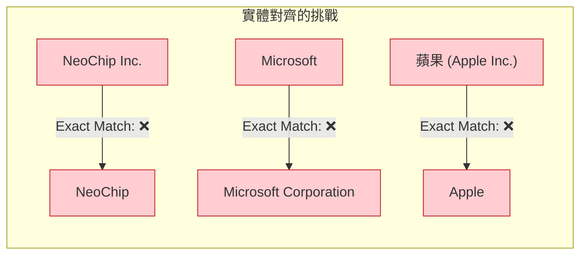
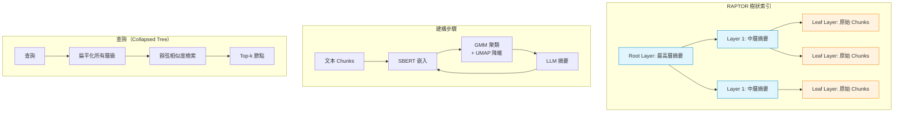
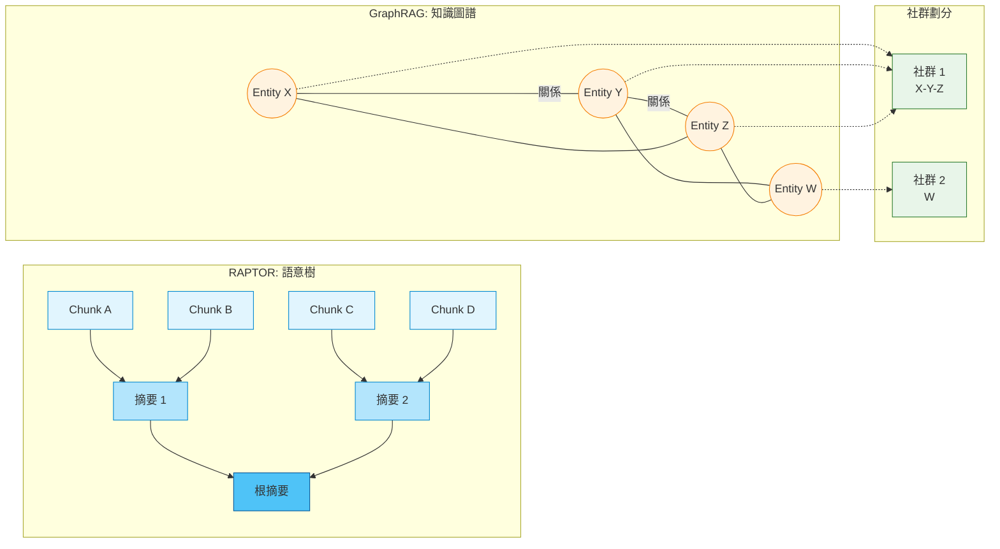

# GraphRAG: 用圖索引與社群摘要實現全局理解

> **種子論文**: [From Local to Global: A Graph RAG Approach to Query-Focused Summarization](https://arxiv.org/abs/2404.16130) (2024-04)
> **作者**: Darren Edge, Ha Trinh, Newman Cheng et al.
> **機構**: Microsoft Research

---

## TL;DR

> 傳統 RAG 擅長回答需要特定事實片段的局部問題，但面對「這個資料集有哪些主要主題？」這類需要全局理解的問題就無能為力——因為這本質上不是檢索任務，而是查詢導向摘要（QFS）任務。GraphRAG 用 LLM 從文件集中建構知識圖譜，再以社群偵測（Leiden 演算法）將圖分割為多層級社群，對每個社群預先生成摘要，查詢時以 map-reduce 方式聚合這些摘要產生全局答案。在百萬 token 規模的真實資料集上，GraphRAG 在答案的 comprehensiveness 與 diversity 上顯著超越傳統 vector RAG，勝率高達 72%–83%。

---

## 背景與動機

### RAG 的成功與邊界

檢索增強生成（RAG）已經成為 LLM 應用的標準架構。當 LLM 的 context window 不足以容納整個資料庫時，RAG 的做法是先從外部知識庫中檢索出與查詢相關的文件片段，再將這些片段作為 context 餵給 LLM 生成答案。

這個架構對「總統的白宮幕僚長是誰？」或「PhaseNet 論文使用了哪些評估指標？」這類問題非常有效——因為答案通常落在某個或某幾個連續的文本區塊中，檢索系統可以直接定位到相關段落。

然而，當問題變成「這個資料集的主要主題是什麼？」或「過去十年跨領域研究如何影響科學發現的趨勢？」時，傳統 RAG 就遇到了結構性的天花板。這類問題要求的是對整個文件集的全局理解，而非檢索特定事實片段。

### 全局綜觀問題的挑戰

上述問題屬於「查詢導向摘要」（Query-Focused Summarization, QFS）的範疇。QFS 的目標是根據一個開放式的查詢，從大量文本中提煉出相關的主題、趨勢與洞察。

傳統 QFS 方法通常依賴將整份文件餵給 LLM 做摘要——但當資料量超過 LLM 的 context window 時（通常在 8K–128K tokens 之間），這種做法就無法擴展。你不可能把一百萬 token 的新聞資料集全部塞進 prompt 讓 LLM 摘要。

RAG 與 QFS 之間存在一個根本性的矛盾：
- **RAG** 擅長找到相關的「針」，但無法看到「乾草堆」的全貌
- **QFS** 擅長看到全貌，但無法擴展到大型資料集

### 現有方法的不足

在 GraphRAG 出現之前，研究社群已經嘗試了一些折衷方案：

1. **單純增加 context window**: 雖然 GPT-4 等模型支援 128K tokens，但 Liu et al. (2023) 的研究顯示，LLM 在長 context 中的表現會衰退（「Lost in the Middle」現象），且長 context 的計算成本與延遲都顯著增加。

2. **Map-reduce 直接摘要原始文本**: 將原始文本打散後分塊摘要，再聚合——但這種做法沒有利用文本的結構資訊，只是暴力地將 chunks 壓縮。

3. **層次化摘要**: RAPTOR（Sarthi et al., 2024）提出用聚類 + 遞迴摘要建立樹狀結構，但依賴向量語意相似度而非實體關係，無法捕捉文本中隱含的結構化知識。

### 圖結構的切入點

GraphRAG 從一個不同的角度切入這個問題：如果我們讓 LLM 將非結構化文本轉換為結構化的知識圖譜，再對這個圖進行社群偵測，會發生什麼事？

這個思路的關鍵洞察是：
- LLM extractive summarization 可以從文本中抽取出實體、關係與主張
- 知識圖譜的模組性（modularity）提供了一個天然的文本分割依據——同一社群的實體傾向於討論相似的主題
- 社群摘要比原始文本 chunks 更適合用來回答全局綜觀問題

### 兩篇論文在技術脈絡中的位置

要理解 GraphRAG 與 RAPTOR 的貢獻，需要把它們放在 RAG 演化的脈絡中看。

第一代 RAG（2020–2023）以 Lewis et al. 的「Retrieval-Augmented Generation for Knowledge-Intensive NLP Tasks」為代表。這一代的核心架構是「檢索 → 閱讀」：檢索器從外部知識庫找到相關文本片段，生成器根據檢索到的片段與查詢生成答案。檢索器通常使用 DPR（Karpukhin et al., 2020）或 BM25，生成器使用 BART 或 T5。這個架構的問題是檢索粒度單一——只有原始文本 chunks，沒有層次化結構。

第二代 RAG（2023–2024）開始引入結構化索引。RAPTOR 是這一代的代表作：它不再僅檢索原始 chunks，而是先對整個語料庫進行層次化摘要，建立一個多層樹狀索引。這讓 LLM 可以從不同的抽象層級檢索資訊。但 RAPTOR 的分組僅依賴 embedding 的語意距離，無法捕捉文本中更豐富的結構化關係。

第三代 RAG（2024–）以 GraphRAG 為標誌，引入了知識圖譜作為索引結構。關鍵的突破在於：不再是 embedding 決定哪些文本應該被歸為一組，而是文本中實際存在的實體與關係決定。這讓分組從「語意相似度」進化為「結構化關聯」。

GraphRAG 與 RAPTOR 的關係不是取代，而是互補。RAPTOR 更適合需要快速檢索多樣化問題的場景，GraphRAG 更適合需要高質量全局理解的場景。在實務中，一個 RAG 系統可能需要同時使用兩者——事實上，後續的 LightRAG 和 Fast-GraphRAG 正是在這個方向上的嘗試。

---

### LLM-as-a-judge 的局限性

使用 LLM 作為裁判雖然是當前生成任務評估的主流做法，但存在幾個需要注意的問題。首先，LLM-as-a-judge 存在位置偏誤（position bias）——它傾向於偏好出現在選項較前面的答案。論文雖然透過多次重複實驗（每個比較做 5 次 replicate）來緩解這個問題，但無法完全消除。在一篇分析 LLM-as-a-judge 偏誤的後續研究中，位置偏誤被發現會造成高達 5–10% 的評估差異。

其次，LLM 在評估 empowerment 時表現不穩定。論文的分析顯示，LLM 在判斷哪個答案「幫助使用者理解主題」時經常前後矛盾，這可能是因為 empowerment 本身是一個模糊的概念，不像 comprehensiveness 可以用 claim 數量量化。論文對此坦率承認：「LLM 的推理展示了 empowerment 與 specificity 之間的有趣張力。」

最後，LLM-as-a-judge 不能完全取代 human evaluation。論文的一個重要貢獻在於用 claim-based 驗證（Claimify）來交叉驗證 LLM 的判斷方向，但這仍然不是人類評估。對於真正的使用者體驗問題，還是需要使用者研究來驗證。

### 實體對齊與圖品質的依賴

GraphRAG 的整個系統品質高度依賴於第一步的 entity extraction。如果 LLM 抽出的實體品質不佳（例如命名不一致、忽略重要實體、抽取了不相關的實體），後續的知識圖譜和社群劃分都會受到影響。

論文使用 exact string matching 來進行實體對齊——這是一個相當簡化的做法。實際應用中，同一個實體可能以「Microsoft」、「Microsoft Corporation」、「微軟」等多種形式出現，exact matching 無法處理這種情況。軟匹配（如 fuzzy matching、embedding-based alignment）可以改善，但論文未探討其影響。



### 社群層級的選擇難題

GraphRAG 使用社群層級體系（C0–C3），但沒有提供如何選擇最佳層級的指南。實驗結果顯示：
- C1–C2（中間層級）通常表現最好
- C0（根層級）在 diversity 上表現較好
- C3（葉層級）可能因為資訊過於零碎而降低答案品質

但在實際應用中，使用者往往不知道應該查詢哪個層級。一個理想的做法是讓系統自動選擇或合併多個層級的結果，但論文沒有提供這種機制。

---

## 核心知識點

本文圍繞以下知識點展開：

1. **Flat RAG 的根本缺陷**——為什麼傳統 vector RAG 無法回答全局綜觀問題，以及這個缺陷的技術根源
2. **RAPTOR 的樹狀遞迴摘要**——如何用語意聚類與層次化摘要建構可檢索的樹狀索引
3. **GraphRAG 的圖索引與社群偵測**——從 LLM 抽取實體到 Leiden 社群偵測的完整流程
4. **Map-Reduce 全局答案生成**——社群摘要如何經由兩階段 map-reduce 產生全局答案
5. **樹 vs 圖：兩種結構化 RAG 的關鍵對比**——RAPTOR 與 GraphRAG 在索引結構、分組依據、查詢機制與優缺點上的系統性比較
6. **結構化 RAG 的評估挑戰**——如何評估一個沒有標準答案的全局理解任務

---

## 方法詳解

### 知識點 1: Flat RAG 的根本缺陷

**這個知識點要回答什麼問題？** 為什麼看似成熟的 vector RAG 無法處理需要全局理解的問題？

傳統 RAG（論文稱之為 vector RAG）的運作流程如下：使用 text embedding 模型將文件庫中的所有 chunks 編碼為向量，查詢時同樣對查詢編碼，然後用餘弦相似度找到 top-k 最相關的 chunks，將這些 chunks 作為 context 餵給 LLM。

這個流程的問題在於，相似度檢索捕捉的是「語意局部性」（semantic locality）——它找到的是與查詢在語意空間中最接近的連續文本片段。對於「資料集有哪些主要主題？」這類問題，答案需要的資訊分散在整個資料集中，沒有任何一個 chunk 能單獨回答這個問題。檢索系統會回傳與「主題」這個詞最相關的幾個片段，但這些片段缺少上下文和全局視角。

更深層的問題是 LLM 的「Lost in the Middle」現象（Liu et al., 2023）：當 LLM 接收的 context 超出其有效處理範圍時，位於 context 中間位置的資訊被忽視的機率遠高於開頭與結尾的資訊。這意味著即使你硬把所有 chunks 塞進 context，LLM 也不會均勻地關注所有資訊。

GraphRAG 論文中對這個問題的描述很精準：「sense-making queries require reasoning over connections in order to anticipate their trajectories and act effectively。」這就是為什麼單靠檢索無法解決問題——你需要的不只是相關片段，而是對整個知識結構的理解。

### 知識點 2: RAPTOR 的樹狀遞迴摘要

**這個知識點要回答什麼問題？** RAPTOR 如何透過遞迴聚類與摘要，將原始文本轉換為多層次的樹狀索引結構？

RAPTOR（ICLR 2024）由 Stanford 團隊提出，是 GraphRAG 最重要的前置工作之一。它的核心想法是：不要只檢索原始文本 chunks，而是先對文本進行層次化摘要，建立一個多層次的樹狀結構，讓檢索可以在不同的抽象層級上進行。

**索引建構流程：**

1. **文本分割與嵌入**: 將原始文件分割為 100-token 的 chunks（保留句子完整性），用 SBERT（multi-qa-mpnet-base-cos-v1）編碼為向量。

2. **軟聚類（Soft Clustering）**: 使用高斯混合模型（GMM）對向量進行聚類。關鍵設計是用 UMAP 先降維，再用 BIC（貝氏資訊準則）決定最優聚類數 K。這裡的「軟聚類」意味著一個節點可以屬於多個叢集——因為一個文本段落可能同時涉及多個主題。

3. **LLM 摘要**: 對每個叢集中的節點，用 GPT-3.5-turbo 生成摘要。

4. **遞迴**: 將生成的摘要重新嵌入，重複步驟 2–3，直到無法進一步聚類為止。結果是一個從葉節點（原始 chunks）到根節點（最高層摘要）的多層樹。

**查詢機制：**

RAPTOR 提出了兩種查詢策略：

- **Tree Traversal**: 從根層級開始，根據查詢與節點的餘弦相似度選擇 top-k 節點，然後下降到這些節點的子節點層級繼續選擇，直到葉節點。

- **Collapsed Tree**（推薦）: 將所有層級的節點扁平化為一個集合，一次對所有節點做相似度檢索，選擇 top-k 直到達到 token 上限。這種方式更靈活，因為不同類型的問題會自動從不同層級檢索到適合粒度的資訊。

實驗顯示，Collapsed Tree 一致優於 Tree Traversal，因為它允許每個問題動態選擇合適的抽象層級——全局問題傾向於命中高層節點（摘要），細節問題命中低層節點（原始 chunks）。

**RAPTOR 的關鍵限制：**

RAPTOR 的分組依據是語意相似度——它將語意接近的 chunks 聚在一起。但「語意接近」不一定是「主題相關」：兩個句子在 embedding 空間中可能很近，但討論的是完全不同的實體和關係。這就是 GraphRAG 要解決的核心問題。

#### GMM 的數學形式與高維度挑戰

RAPTOR 使用的 GMM 假設文本向量由多個高斯分佈的加權混合生成。給定 N 個文本片段（每個為 d 維向量），向量 $x$ 屬於第 k 個高斯分佈的機率為：

$$
P(x|k) = \mathcal{N}(x; \mu_k, \Sigma_k) = \frac{1}{(2\pi)^{d/2} |\Sigma_k|^{1/2}} \exp\left( -\frac{1}{2} (x - \mu_k)^T \Sigma_k^{-1} (x - \mu_k) \right)
$$

其中 $\mu_k$ 是均值向量，$\Sigma_k$ 是協方差矩陣。整體分佈是 K 個分量的加權組合：

$$
P(x) = \sum_{k=1}^{K} \pi_k \mathcal{N}(x; \mu_k, \Sigma_k), \quad \sum_{k=1}^{K} \pi_k = 1
$$

這裡有一個實際問題：SBERT 產出的向量是 768 維的。在高維空間中，距離度量的區分力急遽下降（Aggarwal et al., 2001）。RAPTOR 使用 UMAP 先降維再進行 GMM 聚類，並變化 UMAP 的 n_neighbors 參數來建立兩階段聚類——先用較大 n_neighbors 找出全局叢集，再在叢集內部用較小 n_neighbors 做局部細分。

決定最優叢集數 K 使用 BIC：

$$
\text{BIC} = \ln(N)k - 2\ln(\hat{L})
$$

其中 k 是模型參數數（對 GMM 而言，$k = K \cdot (1 + d + d(d+1)/2) - 1$），$\hat{L}$ 是最大概似值。BIC 同時懲罰模型複雜度與獎勵擬合優度，避免過度聚類。

使用 EM 演算法估計 GMM 參數：
- **E-step**: 根據當前參數計算每個資料點屬於每個分量的後驗機率
- **M-step**: 最大化後驗機率重新估計分量參數

論文的消融實驗顯示，GMM + 語意聚類優於簡單的 contiguous clustering（按文本順序分組），驗證了語意分組的價值。但約 4% 的摘要存在輕微幻覺，這些幻覺沒有傳播到父節點。



### 知識點 3: GraphRAG 的圖索引與社群偵測

**這個知識點要回答什麼問題？** GraphRAG 如何將非結構化文本轉換為結構化的知識圖譜，並利用社群偵測進行主題分割？

GraphRAG 的索引建構比 RAPTOR 多了一個關鍵步驟：將文本轉換為知識圖譜。這個轉換讓後續的分組依據從「語意相似度」變為「實體關係強度」。

#### 步驟 3.1 文本分割

與 RAPTOR 類似，GraphRAG 首先將原始文檔分割為 600-token 的 chunks（100-token overlap）。較大的 chunk size 可以減少 LLM 呼叫次數（降低成本），但會降低 chunk 開頭的資訊召回率（Kuratov et al., 2024）。

#### 步驟 3.2 LLM 驅動的實體與關係抽取

這是 GraphRAG 最關鍵的步驟。對每個 chunk，LLM 被提示做三件事：

- **抽取實體**: 找出 chunk 中的重要命名實體（人物、組織、地點等）
- **抽取關係**: 找出實體之間的語意關係
- **抽取主張（Claims）**: 關於這些實體的重要事實陳述

舉個例子，如果 chunk 包含以下文字：

> NeoChip's shares surged in their first week of trading on the NewTech Exchange. However, market analysts caution that the chipmaker's public debut may not reflect trends for other technology IPOs. NeoChip, previously a private entity, was acquired by Quantum Systems in 2016.

LLM 會抽出：
- 實體: NeoChip（低功耗處理器公司）、Quantum Systems（持有公司）
- 關係: Quantum Systems owned NeoChip
- 主張: NeoChip shares surged on NewTech Exchange debut

這些 prompt 可以透過 domain-specific few-shot exemplars 做調整——例如科學領域的實體類型會與商業領域不同。

#### 步驟 3.3 知識圖譜建構

由於同一個實體在多個 chunks 中被多次抽取，GraphRAG 需要做實體對齊（entity matching）。論文使用 exact string matching（精確字串匹配），但註明 softer matching 也可以。實體描述被聚合與摘要，關係的重複次數成為圖的邊權重。

最終產出是一個以實體為節點、關係為邊、權重為共現次數的帶權知識圖譜。

#### 步驟 3.4 Leiden 層次社群偵測

給定知識圖譜，GraphRAG 使用 Leiden 演算法（Traag et al., 2019）進行層次化的社群偵測。Leiden 是 Louvain 的改進版本，保證社群劃分的連通性且效率更高。

關鍵在於層次化：Leiden 會遞迴地在每個社群內部繼續偵測子社群，直到無法再分割為止。這產生了一個社群層級體系：

- C0: 根層級（最少、最全局的社群）
- C1: 高層級子社群
- C2: 中層級子社群
- C3: 低層級子社群（最多、最具體的社群）

Podcast 資料集（8,564 nodes / 20,691 edges）的社群劃分結果：
- C0: 10 個社群摘要
- C1: 75 個社群摘要
- C2: 629 個社群摘要
- C3: 1,656 個社群摘要

#### 步驟 3.5 社群摘要生成

對每個社群，GraphRAG 生成一份報告式的摘要：

- **葉層級社群**: 按邊的加權度數（source + target node degree）降序排列，迭代加入 LLM context window 直到 token 上限
- **高層級社群**: 如果所有元素摘要能放進 context window，直接摘要；否則用子社群摘要（較短）替換元素摘要（較長）直到能放進為止

這些摘要本身就是有意義的——使用者可以直接瀏覽社群摘要來了解資料集的全局結構。事實上，論文的附錄中展示了這些摘要的範例，可以作為 corpus overview 獨立使用，無需任何查詢。

#### Entity Extraction Prompt 的設計考量

GraphRAG 的 entity extraction prompt 設計是一個被低估的工程細節。預設 prompt 使用 generic 的實體類型（人物、組織、地點等），但論文強調了領域特定 few-shot exemplars 的重要性。例如，處理科學文獻時，prompt 可以加入「研究機構」、「資助機構」、「論文標題」等實體類型。

Claim extraction 是另一個設計細節——它不僅抽取實體的事實陳述，還會附上出處（哪個 chunk 的哪個段落）。這讓後續的 claim-based 驗證成為可能。


### 知識點 4: Map-Reduce 全局答案生成

**這個知識點要回答什麼問題？** 查詢進入 GraphRAG 系統後，預先計算好的社群摘要如何轉換為最終的全局答案？

給定一個使用者查詢，GraphRAG 的答案生成分為兩階段：

**第一階段：Prepare**

社群摘要被隨機打散後切成指定 token 大小的區塊。隨機打散是為了確保相關資訊分散到不同區塊中，而不是集中在某個區塊（可能被丟棄）。

**第二階段：Map**

對每個區塊，平行呼叫 LLM 生成中間答案。此外，LLM 還會生成一個 0–100 的 helpfulness score，表示該答案對目標查詢的幫助程度。得分為 0 的答案被過濾掉。

**第三階段：Reduce**

中間答案按 helpfulness score 降序排列，迭代加入新的 context window 直到 token 上限。這個最終 context 被用來生成最終的全局答案。

這個 map-reduce 設計有幾個精妙之處：

1. **平行處理**: Map 階段可以完全平行化，適合大規模部署
2. **自動排序**: Helpfulness score 讓最有幫助的答案自然排在前面
3. **Token 效率**: Reduce 階段只保留高品質的中間答案，避免 context 被低品質內容佔用

不同社群層級（C0–C3）會產生不同粒度的答案。實驗發現 C1–C2 層級在 comprehensiveness 與 diversity 之間取得最佳平衡。

### 知識點 5: 樹 vs 圖的關鍵對比

**這個知識點要回答什麼問題？** RAPTOR 的樹狀結構與 GraphRAG 的圖社群結構有什麼本質差異？各自的適用場景是什麼？

這是本文最重要的對比。以下是兩者從索引結構到查詢機制的完整比較：

#### 索引結構

| 維度 | RAPTOR | GraphRAG |
|------|--------|----------|
| 資料結構 | 樹（Tree） | 圖（Graph） |
| 葉節點 | 原始文本 chunks（100 tokens） | LLM 抽取的實體與關係 |
| 非葉節點 | LLM 生成的語意摘要 | LLM 生成的社群摘要 + 圖結構 |
| 節點間關係 | 父子層級關係 | 實體間的語意邊 |
| 分組依據 | 嵌入向量的語意距離（GMM） | 圖結構的模組性（Leiden） |

#### 建構成本

- **RAPTOR**: 嵌入 + 聚類 + 摘要，每個節點只做一次 LLM 呼叫
- **GraphRAG**: LLM extraction per chunk + 實體對齊 + 社群偵測 + 多層摘要

在 Podcast 資料集（1M tokens, 1,669 chunks）上，GraphRAG 的索引建構耗時 281 分鐘（使用 GPT-4 turbo），而 RAPTOR 的建構成本在 GPT-3.5-turbo 上顯著更低。

#### 查詢機制

| 維度 | RAPTOR | GraphRAG |
|------|--------|----------|
| 查詢方式 | 向量檢索（cosine similarity） | Map-reduce 聚合 |
| 查詢階段 | 實時檢索 top-k 節點 | 使用預計算的社群摘要 |
| 推論成本 | 低（一次向量檢索 + LLM 生成） | 中高（map 階段平行 LLM 呼叫） |
| 靈活性 | 高（可檢索不同層級） | 中（依賴預計算的社群層級） |

#### 何時選哪個？

- **RAPTOR 適合**: 需要低延遲查詢、資源受限、問題類型多樣（包括事實性問題）的場景
- **GraphRAG 適合**: 需要高質量全局答案、可接受高索引成本、以綜觀分析為主要使用場景的應用

兩者並非互斥——實際上可以結合使用：用 RAPTOR 處理局部檢索，GraphRAG 處理全局綜觀。



### 知識點 6: 結構化 RAG 的評估挑戰

**這個知識點要回答什麼問題？** 當被問的是沒有標準答案的開放式綜觀問題時，如何客觀評估一個 RAG 系統的表現？

GraphRAG 論文在這方面做了非常紮實的工作。由於全局綜觀問題沒有 ground-truth 答案（不像「法國的首都是什麼？」有一個正確答案），他們設計了一套完整的評估框架。

#### 問題生成

使用 persona 驅動的多層次問題生成：

```
Algorithm 1: 問題生成流程
輸入: Corpus description, users K, tasks per user N, questions per (user, task) M
輸出: K × N × M 個全局綜觀問題

1. LLM 基於資料集描述，生成 K 個假想使用者 persona
2. 對每個 persona，生成 N 個相關任務
3. 對每個 (persona, task) 組合，生成 M 個需要全局理解的問題
```

在實驗中 K = N = M = 5，每個資料集生成 125 個測試問題。例如 Podcast 資料集生成了一個「科技記者想了解科技領袖如何看待法規政策」的 persona，對應的問題包括「哪些集數主要討論科技政策與政府法規？」。

#### 評估標準

論文設計了四個評估標準（criteria），由 LLM 作為裁判進行 head-to-head 比較：

1. **Comprehensiveness（全面性）**: 答案是否涵蓋了問題的所有面向？提供多少細節？
2. **Diversity（多樣性）**: 答案是否提供了不同的觀點與洞察？內容是否豐富多樣？
3. **Empowerment（賦能性）**: 答案是否幫助使用者理解主題並做出有根據的判斷？
4. **Directness（直接性）**: 答案多直接清楚地回應問題？（控制基準）

Directness 作為控制基準——預期與 comprehensiveness 和 diversity 呈負相關。

#### Claim-based 驗證

為避免 LLM-as-a-judge 的同儕偏誤，論文還做了 claim-based 驗證。使用 Claimify（同一團隊的工具）從生成答案中抽取可驗證的事實聲明，然後：

- **Comprehensiveness**: 每個答案中的 claims 數量
- **Diversity**: Claims 經過凝聚聚類後的叢集數量

總共從實驗結果中抽取了 47,075 個唯一 claims，平均每個答案 31 個 claims，驗證了 LLM-as-a-judge 的結論方向。

---

## 實驗結果

### 主要實驗：GraphRAG vs Vector RAG

實驗使用兩個資料集，分別代表不同類型的長期文本語料：

- **Podcast transcripts**: Behind the Tech 播客逐字稿（1,669 chunks × 600 tokens = 1M tokens）。這個資料集的特色是對話形式——多位來賓在不同集數中討論科技趨勢，實體（人物、公司、技術）在集數之間大量交叉出現，形成密集的實體關係網路。

- **News articles**: MultiHop-RAG 基準中的新聞文章集，涵蓋 2013–2023 年多個類別（娛樂、商業、體育、科技、健康、科學）（3,197 chunks × 600 tokens = 1.7M tokens）。這個資料集的主題跨度更大，但跨文章的實體連結較少。

比較六個條件（條件僅在 context 的來源不同，prompt 與 context window 大小完全相同）：

- SS: 標準 vector RAG（語意搜尋）
- TS: Map-reduce 直接摘要原始文本
- C0–C3: GraphRAG 在不同社群層級

#### Comprehensiveness（勝率 %，越高越好）

| 條件 | SS | TS | C0 | C1 | C2 | C3 |
|------|-----|-----|-----|-----|-----|-----|
| SS | 50 | 17 | 28 | 25 | 22 | 21 |
| TS | 83 | 50 | 50 | 48 | 43 | 44 |
| C0 | 72 | 50 | 50 | 53 | 50 | 49 |
| C1 | **75** | 52 | 47 | 50 | 52 | 50 |
| C2 | **78** | 57 | 50 | 48 | 50 | 52 |
| C3 | **79** | 56 | 51 | 50 | 48 | 50 |

（Podcast 資料集，125 問題 × 5 次重複取平均。粗體 = 該列的顯著勝者）

**關鍵觀察：**

- 所有 GraphRAG 條件（C0–C3）在 comprehensiveness 上以 72%–79% 的勝率顯著優於 vector RAG（SS），p < 0.001
- 在 diversity 上，勝率範圍為 75%–82%（Podcast）和 62%–71%（News）
- C1–C3 層級在 comprehensiveness 上略優於 TS（純文本 map-reduce），但差距不如 vs SS 顯著
- Directness 的結果符合預期：SS 在直接性上最高，因為它直接返回相關片段

#### 圖索引規模

| 資料集 | 節點數 | 邊數 | 最大社群層級數 |
|--------|--------|------|--------------|
| Podcast | 8,564 | 20,691 | 3（C0–C3）|
| News | 15,754 | 19,520 | 3（C0–C3）|

值得注意的是 Podcast 資料集雖然 chunks 較少（1,669 vs 3,197），但邊數更多——這可能是因為播客內容的連貫性較高，實體之間的關係更密集。

#### Claim-based 驗證結果

Claim-based 指標驗證了 LLM-as-a-judge 的結論：
- GraphRAG（C1–C3）在 claims 數量（comprehensiveness）和 claims 叢集數（diversity）上都顯著優於 SS
- 兩種評估方法的方向一致，增加了結論的可信度

#### News 資料集的差異

News 資料集（1.7M tokens, 3,197 chunks）的結果趨勢與 Podcast 一致，但 GraphRAG 的優勢幅度略微縮小——Diversity 從 75%–82% 降至 62%–71%。論文推測這是因為新聞文章本身的語意結構比播客更鬆散（一篇新聞通常只討論一個主題，跨文章的主題連結較少），導致知識圖譜的社群結構不如播客明顯。

這一觀察也暗示了 GraphRAG 的適用邊界：對於本質上結構化程度較低的語料（如隨機論壇貼文集合），社群偵測帶來的好處可能不如高結構化的語料（如書籍、長篇報導）顯著。

#### RAPTOR 的實驗結果對照

RAPTOR 的實驗設定與 GraphRAG 不同——它使用標準化 QA benchmarks 而非自建的全局理解集：

- **NarrativeQA**: RAPTOR + SBERT 在 ROUGE-L 上達到 30.87%，優於無 RAPTOR 的 SBERT（29.26%）和 BM25（23.52%）
- **QASPER**: RAPTOR + GPT-4 達到 55.7% F1，超越 DPR（53.0%）和 BM25（50.2%），成為 SOTA
- **QuALITY**: RAPTOR + GPT-4 達到 62.4% accuracy，比 DPR 高 2%、比 BM25 高 5.1%；在 QuALITY-HARD 子集上，QuALITY 的最佳成績被提升了 20%（絕對值）

關鍵消融結果：18.5%–57% 的檢索節點來自非葉層級（視資料與檢索器而定），直接驗證了層次化結構的價值——如果只有葉節點有用，樹狀結構就是浪費計算。

### 失敗案例與限制

#### 索引成本的結構性問題

GraphRAG 最明顯的限制是指數級增長的索引成本。處理 1M tokens 的資料集需要 281 分鐘的 GPT-4 turbo 推論時間。這個成本來自三個疊加的因素：

1. **LLM extraction per chunk**: 每個 600-token chunk 都要做一次 entity/relationship/claim extraction，1,669 chunks × 3 層 LLM 呼叫
2. **社群摘要生成**: 多層社群（C0–C3, 合計數千個社群）每個都需要 LLM 摘要
3. **摘要聚合**: 高層社群需要將子社群摘要聚合為更短的版本

這使得 GraphRAG 在以下場景中難以應用：
- 需要即時索引更新的動態資料集（如即時新聞流）
- 成本敏感的應用（GPT-4 turbo 的 API 費用遠高於 open-source 模型）
- 小型團隊或個人專案

論文使用的硬體規格（16GB RAM, Intel Xeon 2.60GHz, 公共 OpenAI endpoint）暗示這不是 GPU 密集的運算，而是 LLM API 呼叫延遲佔主導。

#### Chunk Size 的取捨權衡

GraphRAG 使用 600-token chunks（100-token overlap）——這比 RAPTOR 的 100-token chunks 大了 6 倍。這個設計選擇反映了兩個方法的不同定位：

- **RAPTOR 的 100-token**: 較小的 chunk 保證了每個文本片段的語意集中性，讓 GMM 聚類更精確。但代價是更多的 chunks → 更多的 LLM 呼叫 → 更高的索引成本。

- **GraphRAG 的 600-token**: 較大的 chunk 可以顯著減少 entity extraction 的 LLM 呼叫次數（1,669 vs ~10,000），雖然每個 chunk 的召回率會下降（Liu et al., 2023）。此外，較大的 chunk 讓 LLM 有更多上下文來做 entity extraction，可能抽出更完整的實體及其關係。

論文對 chunk size 的敏感性分析發現：600-token 是兼顧召回率（recall）與精確率（precision）的折衷點。小於 300 tokens 時，實體抽取的召回率顯著下降（因為上下文不足）；大於 1,200 tokens 時，chunk 中段的資訊被忽略的機率增加。

#### 實體對齊的準確性與穩定性

論文使用 exact string matching 做實體對齊，這是最簡單的對齊策略，但也最脆弱：

- 「NeoChip」vs「NeoChip Inc.」被視為不同實體
- 「New York Times」vs「NYT」被視為不同實體
- 不同語言的同一實體（「United Nations」vs「聯合國」）無法匹配

雖然論文聲明「generally resilient to duplicates since duplicates typically cluster together」，但這個說法沒有定量支持。如果 duplicate 實體分散在不同社群中，它們的關係可能會錯誤地強化某些社群邊界。

#### 社群解析度與參數敏感度

Leiden 演算法的解析度參數（resolution parameter）直接控制社群的大小與數量。不同的解析度會產生完全不同的社群劃分，進而影響摘要品質。但論文沒有提供選擇解析度的指南，實驗中的預設值也可能不適用於其他資料集。

此外，Leiden 層次結構的深度（C0–C3）取決於圖的拓撲結構——如果圖的模組性不明顯，層次深度可能只有 1–2 層，失去了多層摘要的優勢。

#### 領域適應性與人工成本

雖然論文提供了一個通用的實體抽取 prompt，但要達到最佳效果，需要領域專屬的 few-shot exemplars。這些 exemplars 需要人工設計，增加了實際部署的門檻。

例如，處理醫學文獻時需要的實體類型（疾病、藥物、基因）與法律制度文獻（法條、判例、當事人）完全不同。如果使用通用 prompt，可能會錯過領域關鍵實體或抽出大量不相關的實體。

---

## 與相關工作的對比

### RAPTOR vs GraphRAG 完整比較

| 維度 | RAPTOR | GraphRAG |
|------|--------|----------|
| 發表場合 | ICLR 2024 | Microsoft Research Tech Report |
| 索引結構 | 語意樹（遞迴聚類摘要） | 知識圖譜（實體關係圖） |
| 分組方法 | GMM + UMAP + BIC | Leiden 層次社群偵測 |
| 儲存成本 | 樹節點數 = O(chunks) | 圖節點數 = O(entities in corpus) |
| 索引建構成本 | 中（SBERT + GPT-3.5） | 高（GPT-4 turbo extraction + summarization） |
| 查詢成本 | 低（一次向量檢索） | 中高（map-reduce LLM 呼叫） |
| 問題類型 | 事實性 + 主題性 | 全局綜觀性 |
| 評估資料集 | NarrativeQA, QASPER, QuALITY | 自建 Podcast/News 全局理解集 |
| 開源程式碼 | 未提供 | 已開源（GitHub） |
| 生態整合 | 僅論文方法 | LangChain, LlamaIndex, Neo4J 擴充 |
| 主要優點 | 低推論成本、靈活檢索 | 關係感知、社群結構可解釋 |
| 主要缺點 | 語意距離 ≠ 主題相關 | 索引成本高、依賴 LLM 品質 |

兩者的本質差異在於對「什麼是好的分組」的定義不同。RAPTOR 認為語意接近的 chunks 應該歸為一組，而 GraphRAG 認為同一主題下緊密相關的實體應該歸為一組——這兩種分組各自的適用場景不同。

### 後續發展

GraphRAG 與 RAPTOR 啟動了結構化 RAG 這個研究方向，後續出現了幾條分支：

- **LightRAG**（2024）: 簡化版 GraphRAG，在索引階段的 LLM 呼叫數與答案品質之間做取捨
- **Fast-GraphRAG**（2024）: 專注於降低 GraphRAG 的索引時間
- **Agentic RAG**: 在 RAG 流程中引入語意路由（semantic routing），動態決定使用 flat RAG、RAPTOR 或 GraphRAG
- **Hierarchical RAG 評估框架**: 針對結構化 RAG 提出專屬的評估標準

---

## 我的觀察

### 從 vector 到 structure 的轉變

RAG 的演化正在經歷從「純向量檢索」到「結構化索引」的轉變。這背後的原因是業界逐漸認識到：嵌入向量雖然擅長捕捉語意相似度，但對於需要理解文本結構、實體關係與主題層級的任務來說，它的表徵能力是不夠的。

GraphRAG 將非結構化文本先轉換為結構化 KG 再進行社群分析的思路，其實借鑑了傳統自然語言處理中的資訊抽取（Information Extraction）管線。差別在於 LLM 的到來讓實體與關係抽取變得不再需要大規模標註資料。

### 工程上的取捨

讀 GraphRAG 論文時，我最感興趣的不是方法本身，而是論文中坦誠的成本討論。281 分鐘處理 1M tokens——這在生產環境中是很難接受的。這也是為什麼論文在開源之外還積極與 LangChain 和 LlamaIndex 整合：真正的價值可能在於讓社群基於此開發更輕量的變體。

另一件值得注意的事是論文對 chunk size 的討論：600 tokens 是兼顧成本與召回率的折衷選擇。這個數字雖然平淡無奇，但反映了工程落地中的無數取捨。

### 評估方法的貢獻

我認為 GraphRAG 論文在評估方法上的貢獻可能比方法本身更大。為了解決「沒有標準答案如何評估」這個問題，論文設計了一套完整的框架：persona-driven question generation、LLM-as-a-judge head-to-head comparison、claim-based validation。這個評估框架可以推廣到任何開放式生成任務的評估。

特別是 claim-based validation——從生成的答案中抽取可驗證的事實聲明再進行量化分析——是一個驗證 LLM-as-a-judge 結果的有效手段。如果未來做 RAG 評估的論文都能附上 claim-based 分析作為 sanity check，整個領域的評估可信度會大幅提升。

### 未解決的問題

幾個在論文閱讀過程中浮現但未解決的問題：

1. 社群層級 C0–C3 的選擇：更好的做法可能是動態選擇而非固定一個層級
2. 實體對齊的精確度對下游任務的真實影響有多大？論文說「generally resilient to duplicates」但沒有定量分析
3. GraphRAG 能否與 RAPTOR 結合？例如用 RAPTOR 做第一層檢索，GraphRAG 做第二層全局摘要

### 對實務應用的啟發

GraphRAG 論文對實務應用有幾個值得注意的啟發。

**啟發一：評估先行。** 論文中評估框架的精緻程度遠超過方法本身。這暗示了一個重要的實務原則：如果你要部署一個 RAG 系統，先建立評估方法再選擇模型。沒有好的評估，你無法判斷系統在全局理解任務上是否有進步。

**啟發二：成本結構決定應用場景。** 281 分鐘的索引時間意味著 GraphRAG 適合「建立一次、查詢多次」的場景——例如知識庫、文獻回顧、組織記憶系統。不適合即時對話、動態資訊流等場景。

**啟發三：開源生態的槓桿效應。** GraphRAG 的論文本身只是研究報告，它真正的影響力來自於開源程式碼 + 與 LangChain/LlamaIndex/Neo4J 的整合。這讓社群可以在論文的基礎上快速迭代——LightRAG 和 Fast-GraphRAG 的出現速度就說明了這一點。

**啟發四：社群摘要本身的價值。** 論文中提到社群摘要可以獨立於查詢使用——使用者可以直接瀏覽社群摘要來了解資料集的全局結構。這是一個被低估的功能點：在實際系統中，即使沒有精確的查詢，讓使用者能快速了解「這個知識庫包含哪些主題」本身就是有價值的。

### 與其他新興技術的交叉

GraphRAG 的思路正在與幾個新興方向融合：

- **Agentic RAG**: 使用 LLM agent 在 RAG 流程中動態決定使用哪種索引策略（flat、tree 或 graph）
- **Multi-modal GraphRAG**: 將圖索引擴展到多模態——不只是文本中的實體關係，還包括圖片、表格中的結構化資訊
- **Streaming GraphRAG**: 增量式圖索引更新，解決 GraphRAG 無法處理動態資料的問題

這些方向可能比單純改進 GraphRAG 的索引效率更有影響力，因為它們在擴展 RAG 的能力邊界而非優化現有架構。

---

## 延伸閱讀

### Dependency Papers（本文涵蓋）

1. **RAPTOR: Recursive Abstractive Processing for Tree-Organized Retrieval** ([2401.18059](https://arxiv.org/abs/2401.18059))
   - Parth Sarthi, Salman Abdullah, Aditi Tuli, Shubh Khanna, Anna Goldie, Christopher D. Manning
   - 與本文關係：GraphRAG 最重要的前置工作，提出遞迴聚類摘要建立樹狀索引的核心思想。
     GraphRAG 以 RAPTOR 的結構化索引為基礎，用知識圖譜替代語意樹。

### 後續發展（未涵蓋，僅列出）

- [LightRAG: Simple and Fast Retrieval-Augmented Generation](https://arxiv.org/abs/2410.05779)（2024-10）
- [Fast GraphRAG: Accelerating Graph-based RAG](https://arxiv.org/abs/2412.05860)（2024-12）
- [GraphRAG in Production: Lessons Learned from Deploying at Scale](https://microsoft.com/graphrag-blog)（2024）

---

## 引用

完整 BibTeX 見 [`papers.bib`](./papers.bib)。
