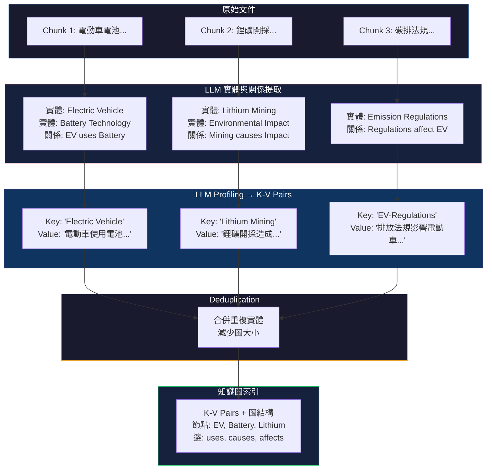
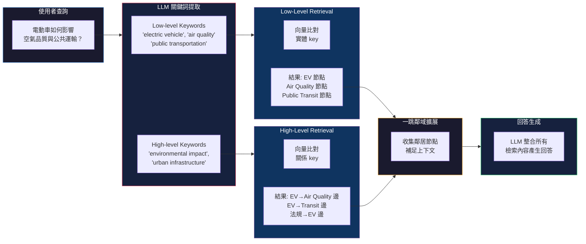
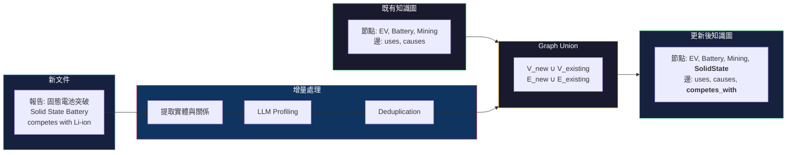

# LightRAG: Simple and Fast Retrieval-Augmented Generation

> **種子論文**: [LightRAG: Simple and Fast Retrieval-Augmented Generation](https://arxiv.org/abs/2410.05779) (2024-10)
> **作者**: Zirui Guo, Lianghao Xia, Yanhua Yu, et al.
> **Dependency**: [From Local to Global: A Graph RAG Approach to Query-Focused Summarization](https://arxiv.org/abs/2404.16130) (2024-04) — GraphRAG
>
> 閱讀時間: 約 30–40 分鐘

---

## TL;DR

傳統 RAG 系統將文件切成平面區塊（flat chunks）後用 embedding 相似度檢索，但這種平面表示法無法捕捉跨文件實體之間的複雜關係，導致面對需要多跳推理的問題時只能給出破碎的答案。LightRAG 把知識圖譜結構引入 RAG 的索引與檢索流程，用 LLM 從文件中提取實體與關係建構圖索引，並設計了雙層檢索機制（low-level 針對具體實體、high-level 針對抽象主題），在 4 個資料集上全面超越既有方法。最關鍵的工程貢獻是：LightRAG 不需要像 GraphRAG 那樣對圖做 community detection 與層級摘要，而是直接用向量資料庫比對 key-value pair，讓單次查詢的 token 成本從 GraphRAG 的 ~610K 降到 <100。

---

## 背景與動機

### RAG 的基本困境

Retrieval-Augmented Generation（RAG）是目前讓大型語言模型引用外部知識最主流的方式。一個典型的 RAG 系統由檢索模組 $R$ 與生成模組 $G$ 組成。給定查詢 $q$ 與外部資料庫 $D$：

$$
M(q; D) = G(q, R(q; D^)), \quad D^ = \Phi(D)
$$

其中 $\Phi(\cdot)$ 是索引建構函數，將原始資料 $D$ 轉換為可檢索的結構 $D^$。

最常見的索引策略是**平面分塊索引（flat chunk indexing）**：將文件庫切成大小固定的文字區塊（chunks），用 embedding 模型將每個 chunk 轉為向量存入向量資料庫；查詢時將 query 也嵌入，以相似度搜尋 top-k chunks，再將這些 chunks 作為 context 餵給 LLM 生成回答。

這個流程雖然簡單有效，但有一個根本的限制：**文件之間的關係是 flat 的**。每個 chunk 獨立存在，不認識隔壁 chunk 裡的實體跟自己的實體有什麼關聯。當使用者問的問題需要跨文件整合資訊時（例如「電動車的普及如何影響城市空氣品質與公共運輸？」），傳統 RAG 可能檢索到電動車、空污、公共運輸三份獨立文件，但無法把它們串成一個有因果鏈的回答。

具體來說，embedding 相似度檢索的假設是：**語義相似的 query 與 chunk 會落在 embedding space 的相近區域**。這個假設對事實性查詢（「畢卡索出生在哪一年？」）非常有效，但對需要整合多個概念的複雜查詢就力不從心了。原因在於 embedding 空間中，chunk 與 chunk 之間的距離只反映語義相似度，不反映它們之間的實體關係或因果關係。

讓我們用一個具體的數值例子來說明。假設一個資料集包含三份文件：

- 文件 A：「電動車使用鋰離子電池，能量密度高但成本仍偏高」
- 文件 B：「鋰礦開採造成地下水污染，環保團體呼籲加強監管」
- 文件 C：「各國政府推出碳排補貼政策，加速電動車普及」

對於查詢「電動車的環境影響」，傳統 RAG 可能檢索到 A（電動車本身）和分數較低的 B（鋰礦污染），但 LLM 需要自己推導出「電動車 → 鋰電池 → 鋰礦開採 → 環境影響」這個因果鏈。如果文件 B 在 embedding space 中與查詢的距離太遠（因為 B 的主題是「鋰礦」而非「電動車」），B 可能根本不會被檢索到。

將以上思考形式化：傳統 RAG 的檢索函數 $R(q; D)$ 本質上是

$$
R(q; D) = \text{top-}k \left( \{ \text{sim}(f(q), f(c_i)) \mid c_i \in C \} \right)
$$

這是一個**集合獨立的檢索**——每個 $c_i$ 的檢索分數與其他 $c_j$ 無關。而圖增強檢索可以寫成：

$$
R^*(q; D) = \text{top-}k \left( \{ \text{sim}(f(q), f(v_i)) \mid v_i \in V \} \right) \cup \mathcal{N}(v_i)
$$

其中 $\mathcal{N}(v_i)$ 是節點 $v_i$ 的鄰域。這個檢索是**結構感知的**——檢索到一個實體後，它的鄰居自動被納入。

這個差異說明了為什麼圖結構對於跨文件查詢必要：它不是讓檢索更精準，而是讓檢索的範圍從「搜尋與查詢相似的東西」擴展到「搜尋與查詢相關的東西」。

假設文件 A 提到「電動車的電池技術」，文件 B 提到「鋰礦開採的環境影響」，文件 C 提到「各國碳排法規」。人看完 A+B+C 可以推理出「電動車普及 → 鋰需求增加 → 採礦環境成本 → 法規因應」的因果鏈，但傳統 RAG 只會回傳三段獨立文字。這就是論文所說的 **fragmented answers**（破碎的回答）。

### 從 Flat RAG 到 Graph-enhanced RAG

這個問題的解法方向很直觀：如果文件之間的關係本來就不是平面的，為什麼不用圖來表示它們？

GraphRAG（Edge et al., 2024）是第一篇系統性地把圖結構引入 RAG 的工作。它的做法是：先用 LLM 從文件中提取實體（entity）與關係（relation），建出一張知識圖；然後用 Leiden 社群偵測演算法將圖分群，對每個群（community）用 LLM 生成層級摘要；查詢時採用 map-reduce 風格——先對每個 community 的摘要獨立產生部分回答，再把所有部分回答匯總為最終回答。

GraphRAG 在全局性問題（global sensemaking questions）上表現出色——對 Naive RAG 的 Overall 勝率高達 72–83%。但它有一個明顯的代價：**效率**。查詢需要遍歷數百個 community 的摘要，每次查詢的 LLM token 消耗約 610K tokens（以 Legal 資料集為例）；更新資料時更需要重建所有 community 結構，成本極高。

這就帶出了 LightRAG 要解決的核心問題：**能不能保留圖增強 RAG 的理解能力，同時把檢索效率做到跟傳統 RAG 一樣快？**

### 現有 RAG 增強方法的類別

在深入 LightRAG 的方法之前，先釐清 RAG 增強的幾條技術路線有助於定位 LightRAG 的貢獻。現有的 RAG 增強方法可以分為以下幾類：

**查詢端增強（Query-side Augmentation）：** 這類方法在查詢階段對使用者輸入進行前處理，以提高檢索命中率。典型代表是 RQ-RAG（Chan et al., 2024），它用 LLM 將原始查詢分解為多個子查詢（sub-queries），透過重寫、拆解、消歧等顯式技術來提升搜尋準確度。另一個代表是 HyDE（Gao et al., 2022），它讓 LLM 先基於查詢產生一份假設性文件（hypothetical document），再用這份文件去檢索真實 chunks。HyDE 的直覺是：查詢的 embedding 可能與相關文件的 embedding 不在同一區域，但「關於該查詢的答案」的 embedding 會與相關文件更接近。這類方法的優勢在於不需修改索引結構，缺點是依賴 LLM 在沒有上下文的情況下做出好的推理。

**檢索端增強（Retrieval-side Augmentation）：** 這類方法改進檢索演算法本身，例如查詢與文件的交互編碼（ColBERT）、多輪檢索、或結合稀疏檢索（BM25）與稠密檢索。這些方法可以與 LightRAG 的圖索引互補。

**索引端增強（Index-side Augmentation）：** 這類方法改變的是索引結構而不是檢索流程。LightRAG 與 GraphRAG 都屬於這一類——它們用圖結構取代或補充原本的平面 chunk 索引。這個路線的假設是：**檢索品質的上限由索引決定的，而不是由查詢技巧決定的**。如果索引已經組織成能反映實體關係的結構，即使最簡單的向量搜尋也能得到好的結果。

理解這個分類有助於看到 LightRAG 與 GraphRAG 的方法定位：兩者都選擇了索引端增強這條更根本但也更昂貴的路線（需要重新索引整個資料庫），但 LightRAG 在索引結構的設計上比 GraphRAG 更輕量。

---

## 核心知識點

本文圍繞以下 6 個知識點展開：

1. **從平面檢索到圖增強 RAG 的動機**——為什麼 flat chunking 不夠、圖結構解決了什麼問題
2. **圖索引建構 pipeline**——LightRAG 如何從原始文件一步步建出知識圖索引
3. **雙層檢索機制**——如何用同一組 LLM 提取的關鍵詞同時滿足具體查詢與抽象查詢
4. **增量更新機制**——如何在動態環境中無需重建整個索引就能整合新資料
5. **GraphRAG 與 LightRAG 的全面比較**——兩種圖增強路線的差異與取捨
6. **實驗分析與消融研究**——論文如何驗證每個設計選擇的必要性

---

## 方法詳解

### 知識點 1：從平面檢索到圖增強 RAG 的動機

**為什麼需要圖結構？**

回頭看傳統 RAG 的索引設計。給定文件庫 $D = \{d_1, d_2, ..., d_n\}$，傳統 RAG 做的事是：

$$
D_{\text{index}} = \{f_{\text{emb}}(c_1), f_{\text{emb}}(c_2), ..., f_{\text{emb}}(c_m)\}
$$

其中 $c_i$ 是從 $D$ 切出來的 chunk，$f_{\text{emb}}$ 是 embedding 函數。查詢 $q$ 的檢索就是：

$$
c^* = \arg\max_{c \in C} \text{sim}(f_{\text{emb}}(q), f_{\text{emb}}(c))
$$

問題在於：每個 chunk $c_i$ 的向量表示是彼此獨立的。即使兩個 chunks 包含相關的實體，embedding space 中它們的距離只反映語義相似度，不反映它們之間的關係。圖結構的解決方案就是把實體當成節點（node）、關係當成邊（edge），讓檢索可以沿著邊走，從一個實體找到與之相關的其他實體。

### 知識點 2：圖索引建構 Pipeline

LightRAG 的圖索引建構分為三個步驟，全部由 LLM 驅動。給定原始文件 $D$，最終產出知識圖 $\hat{D} = (\hat{V}, \hat{E})$：

$$
\hat{D} = (\hat{V}, \hat{E}) = \mathcal{D}(\mathcal{P}(\mathcal{R}(D)))
$$

#### Step 1：實體與關係提取 $\mathcal{R}(\cdot)$

先將 $D$ 切成多個 chunks $D_i$，對每個 chunk 呼叫 LLM 識別其中的實體（人、事、時、地、物）以及實體之間的關係（邊）。例如從「心臟科醫師評估症狀以識別潛在心臟問題」這段文字中，LLM 會提取實體節點「Cardiologists」「Heart Disease」與關係邊「Cardiologists _診斷_ Heart Disease」。

形式化地，每個 chunk $D_i$ 產出節點集 $V_i$ 與邊集 $E_i$，然後取聯集：

$$
V = \bigcup_i V_i, \quad E = \bigcup_i E_i
$$

#### Step 2：LLM Profiling 產生 Key-Value Pair $\mathcal{P}(\cdot)$

這是 LightRAG 最關鍵的設計選擇。對每個節點 $v \in V$ 與每條邊 $e \in E$，LLM 產生文字形式的 key-value pair $(K, V)$：

- **實體節點**：key = 實體名稱（作為唯一的索引鍵）；value = 一段描述文字，彙整該實體在文件中的相關資訊
- **關係邊**：key = LLM 增強產生的多個索引鍵（包含來自相連實體的主題資訊）；value = 關係描述、強度分數、高層關鍵詞

這個 key-value 結構是 LightRAG 高效率檢索的關鍵。它不是將整個圖結構存進向量資料庫，而是將每個節點與邊的語義壓縮成短文字（value），用文字 key 作為記憶體索引。

一個具體的 K-V pair 範例如下（以一則關於心臟科與心臟病的文件段落為例）：

```
Entity Node:
  Key: "Cardiologists"
  Value: "Cardiologists are medical professionals who specialize in diagnosing and treating heart diseases. They assess patient symptoms, conduct diagnostic tests such as electrocardiograms, and develop treatment plans. Cardiologists work in hospitals and clinics..."
  Original Chunk ID: chunk_0042

Relation Edge:
  Keys: ["Cardiologist-Heart Disease", "Medical Diagnosis", "Healthcare Provider-Condition"]
  Value: "Cardiologists diagnose Heart Disease through assessment of symptoms and diagnostic tests. This relationship is central to cardiac care. Cardiologists are the primary healthcare providers responsible for identifying potential heart issues in patients..."
  Source Node: "Cardiologists", Target Node: "Heart Disease"
  Original Chunk ID: chunk_0042
```

注意實體 key 是單一的（實體名稱），而關係 key 可以是多個（由 LLM 從相連實體的主題推導）。這是因為關係本身承載了比單一實體更豐富的語義——「Cardiologists diagnose Heart Disease」這個關係應該能透過多種不同的查詢路徑被找到，包括「誰診斷心臟病」「心臟病與哪個科別相關」「醫療診斷流程」等。

#### 整個索引建構的資料流

從原始文件到可檢索的 K-V pairs，資料在每個階段的型態變化如下：

| 階段 | 輸入 | 輸出 | 變化 |
|------|------|------|------|
| Chunk 分割 | 原始文件 $D$（~5M tokens across 94 docs） | Chunks $D_i$（1,200 tokens each） | 文件 → 固定長度區塊 |
| 實體提取 $\mathcal{R}$ | Chunk $D_i$ | 節點集 $V_i$ + 邊集 $E_i$ | 文字 → 結構化元素 |
| 聯集 | $\{V_i\},\{E_i\}$ | $V, E$ | 跨 chunks 合併節點/邊 |
| Profiling $\mathcal{P}$ | 節點 $v \in V$, 邊 $e \in E$ | K-V pairs $(K_v, V_v)$, $(K_e, V_e)$ | 結構化元素 → 可檢索索引 |
| Deduplication $\mathcal{D}$ | $(\hat{V}, \hat{E})$ | $(\hat{V}', \hat{E}')$ | 合併重複，減少圖大小 |

這個 pipeline 的關鍵在於：**圖結構是在 Profiling 階段被「展平」成 K-V pairs 的**。既然每個節點與邊都變成了獨立可檢索的 key-value entry，檢索就不再需要遍歷圖的結構。圖結構只在檢索後的鄰域擴展階段才被重新利用。

#### Step 3：Deduplication $\mathcal{D}(\cdot)$

來自不同 chunks 的實體與關係可能重複（例如「Beekeeper」「beekeeper」「A beekeeper」指的是同一實體）。去重模組用 LLM 識別並合併相同的節點與邊，減少圖的大小與後續操作的開銷。

去重的流程是：對每個新提取的節點 $v_{\text{new}}$，LLM 會比對既有節點集 $\hat{V}$ 中是否有語義上等價的節點。如果是，則合併：保留一個節點，但其描述 value 可能是兩個節點描述的串接或由 LLM 重新摘要。如果否，則做為新節點加入 $\hat{V}$。

這個步驟的品質取決於 LLM 的判別能力。在論文的實驗設定中（GPT-4o-mini），去重表現良好，但換成較弱的 LLM 可能出現：
- **False negatives**（未合併）：圖中出現多個名稱不同但指向同一實體的節點，使圖的連通性被低估
- **False positives**（誤合併）：兩個不同的實體因為名稱或描述相似而被錯誤合併，造成資訊混淆

在實作上，去重是 LightRAG 中最難調試的步驟——因為它發生在索引階段，錯誤的影響會被傳播到所有後續查詢。

#### 圖索引 vs GraphRAG 的 indexing 對比

| 功能 | LightRAG | GraphRAG |
|------|----------|----------|
| 實體提取 | LLM 從每個 chunk 提取實體與關係 | 同左，另加 claim statements |
| 實體去重 | LLM 驅動的去重 | Leiden-based entity resolution |
| 索引結構 | 實體/關係 → K-V pairs（扁平結構） | 實體/關係 → Communities → 層級摘要 |
| 社群偵測 | 無 | Leiden 演算法 |
| 摘要粒度 | 每個節點/邊一份 key-value（~50–200 tokens） | 每個 community 一份摘要報告（~5,000 tokens） |
| 索引總成本 | 實體提取 + Profiling token（線性於資料量） | 實體提取 + Community Detection + 摘要生成（super-linear） |



**圖 1：LightRAG 圖索引建構流程。** 原始文件經 chunk 分割後，由 LLM 依次執行實體提取、K-V Profiling 與去重合併，最終建出可檢索的知識圖索引。

### 知識點 3：雙層檢索機制

LightRAG 的 dual-level retrieval 是其核心創新。它的設計動機來自一個觀察：**使用者的查詢可以是具體的也可以是抽象的**，但傳統 RAG 只用同一套 embedding 空間來處理兩者。具體查詢（例如「誰寫了《傲慢與偏見》？」）需要的是一對一的精準匹配；抽象查詢（例如「AI 如何影響現代教育？」）需要的是跨多個實體的綜合理解。

LightRAG 用兩套獨立的檢索路徑來處理這兩種需求。

#### 查詢關鍵詞提取

給定查詢 $q$，LightRAG 先用 LLM 從 $q$ 中提取兩組關鍵詞：

- **Low-level keywords $k^{(l)}$**：查詢中出現的具體實體名稱或細節關鍵詞
- **High-level keywords $k^{(g)}$**：查詢涉及的抽象主題與高層概念

這兩組關鍵詞從同一個查詢出發，因為 LLM 有能力分辨一個查詢中的「具體部分」與「抽象部分」。

#### 雙路檢索

**Low-Level Retrieval（低層檢索）：**

$k^{(l)}$ 與圖索引中的實體 key 進行向量比對，找出匹配的具體實體節點：

$$
R_{\text{low}}(q) = \{v \in \hat{V} \mid \text{sim}(f_{\text{emb}}(k^{(l)}), \text{key}(v)) > \theta\}
$$

**High-Level Retrieval（高層檢索）：**

$k^{(g)}$ 與圖索引中的關係 key 進行向量比對。關係 key 在 LLM Profiling 階段已被增強，包含來自相連實體的全局主題資訊，因此天生適合處理抽象查詢：

$$
R_{\text{high}}(q) = \{e \in \hat{E} \mid \text{sim}(f_{\text{emb}}(k^{(g)}), \text{key}(e)) > \theta\}
$$

#### 高階關聯擴展（High-Order Relatedness）

檢索到初步的節點與邊之後，LightRAG 再做一跳鄰域擴展。對於所有已檢索到的節點 $v$ 與邊 $e$，收集它們的一跳鄰居：

$$
\mathcal{N}_{\text{retrieved}} = \{v_i \mid v_i \in \hat{V} \land (v_i \in N_v \lor v_i \in N_e)\}
$$

其中 $N_v$ 是已檢索節點的鄰居節點集，$N_e$ 是已檢索邊的端點節點集。這個步驟確保了回答的上下文覆蓋——即使某個相關實體不在檢索結果的前幾名，只要它與已檢索到的實體有直接邊相連，就會被納入。



**圖 2：LightRAG 雙層檢索流程。** 同一個查詢經 LLM 分解為 low-level 與 high-level 關鍵詞，分別匹配實體 key 與關係 key，再經一跳鄰域擴展後由 LLM 生成回答。

#### 消融分析對雙層檢索的驗證

論文的 Table 2 顯示了各項消融的結果。去除 high-level 檢索（-High）後，Agriculture 資料集的 Overall 從 67.6% 降至 64.8%，CS 從 61.2% 降至 56.0%（-5.2pp），Legal 從 84.8% 降至 78.0%（-6.8pp）。去除 low-level 檢索（-Low）也有不同程度的退化：Agriculture 從 67.6% 降至 65.2%，CS 從 61.2% 降至 56.4%，Legal 從 84.8% 降至 81.2%。

這驗證了兩個檢索層級是**互補而非冗餘**的——缺少任何一層都會在某些查詢類型上導致性能下降。

值得注意的是去除原始文字段落（-Origin）的消融結果：在 Agriculture 上 Overall 反而提升到 74.4%（+6.8pp）。論文推測原因是圖索引已捕捉到足夠的關鍵資訊，而原始文字段落常包含不相關的噪聲。這也暗示了圖增強 RAG 的一個潛在優勢——經過 LLM 過濾與提煉後的結構化知識可能比原始全文更適合做為 LLM 的回答上下文。

### 知識點 4：增量更新機制

在動態環境中，文件庫會持續增長。傳統 RAG 只要對新文件做 embedding 後加入向量資料庫即可，但圖增強 RAG 面臨一個問題：**新文件的實體與關係如何融入既有知識圖**？

GraphRAG 的做法是整個重建——新資料加入後，重新執行 community detection 與摘要生成。論文估算在 Legal 資料集上，當資料量翻倍時，GraphRAG 需要重建 1,399 個 communities，花費約 14M tokens。

LightRAG 的做法則簡單得多：**graph union（圖聯集）**。

新文件 $D_{\text{new}}$ 進來後，走完全相同的圖索引 pipeline——提取實體與關係、LLM Profiling、去重——得到 $\hat{D}_{\text{new}} = (\hat{V}_{\text{new}}, \hat{E}_{\text{new}})$。然後：

$$
\hat{V}' = \hat{V} \cup \hat{V}_{\text{new}}, \quad \hat{E}' = \hat{E} \cup \hat{E}_{\text{new}}
$$

去重模組 $\mathcal{D}(\cdot)$ 在合併時處理重複的節點與邊。這個操作的時間複雜度是 $O(|V_{\text{new}}| + |E_{\text{new}}|)$，而不是 $O(|V| + |E|)$——也就是說，成本與新資料量成正比，與既有知識圖的大小無關。



**圖 3：LightRAG 增量更新機制。** 新文件經相同 pipeline 處理後，以 set union 方式合併至既有知識圖，無需重建索引。

### 知識點 5：GraphRAG 與 LightRAG 的全面比較

GraphRAG 與 LightRAG 都做「把圖結構引入 RAG」，但兩者的設計哲學截然不同。

| 維度 | GraphRAG | LightRAG |
|------|----------|----------|
| **索引結構** | Entity KG + Community Hierarchy | Entity KG + K-V Pairs |
| **社群偵測** | Leiden 演算法分群，產生層級 community tree | 不做社群偵測，直接以實體與關係為單位 |
| **摘要粒度** | 對每個 community 產生摘要報告（~5,000 tokens/community） | 對每個實體與關係產生 key-value pair（~50–200 tokens/pair） |
| **查詢流程** | Map-reduce：遍歷所有 community → 獨立回答 → 匯總 | 向量檢索：關鍵詞提取 → K-V 匹配 → 鄰域擴展 → 回答 |
| **查詢 Token 成本** | ~610K tokens/query（Legal 資料集，610 communities × 1,000 tokens） | <100 tokens/query（單次 LLM 關鍵詞提取 + 向量搜尋） |
| **更新成本** | 重建所有 community（~14M tokens for data doubling） | 僅處理新文件提取成本（與資料量成正比） |
| **設計哲學** | 查詢時窮舉（query-time exhaustive） | 索引時提煉（index-time summarization） |

最關鍵的差異在於 **查詢時 vs 索引時** 的計算配置。GraphRAG 選擇在查詢時做 exhaustive processing——不論查詢多簡單，都要遍歷所有 community 的摘要。這樣的好處是回答品質穩定（因為「看過」所有資料），但代價是每次查詢都很昂貴。LightRAG 則把成本移到索引階段——在索引時就花成本做 LLM Profiling，把實體與關係壓縮成可直接檢索的 key-value pairs。查詢時就只是向量資料庫的標準操作：關鍵詞提取 → 比對 → 鄰域擴展。這使得 LightRAG 的查詢成本與傳統 RAG 接近，但保留了圖結構的理解能力。

#### GraphRAG 的方法細節（補充）

了解 GraphRAG 的完整流程有助於理解 LightRAG 的設計取捨。GraphRAG 的索引階段分為四層：

1. **實體與關係提取**：與 LightRAG 類似，用 LLM 從每個 chunk 提取實體與關係。但 GraphRAG 還額外要求 LLM 對每個實體產生一組「claim statements」，以英文句子形式記錄該實體的關鍵資訊（例如「Beekeepers manage bee colonies and prevent pest infestations」）。

2. **實體解析（Entity Resolution）**：使用 Leiden 演算法的變體來解析指代（coreference）與去重，將不同 chunks 中指向同一實體的節點合併。

3. **社群偵測（Community Detection）**：對去重後的知識圖執行 Leiden 演算法，將密集連接的子圖分為不同社群。Leiden 的優勢在於它會自動產生層級結構——從最細粒度的社群（層級 0）到最粗的社群（層級 2 或更高）。

4. **社群摘要生成（Community Summarization）**：對每個社群（通常是層級 0 的社群），用 LLM 生成結構化摘要報告，格式類似：
   ```
   ## {社群 ID} — {社群主題標籤}
   - Entity: {實體名稱} ({關鍵 claim})
   - Entity: {實體名稱} ({關鍵 claim})
   - ...
   - Relationships: {描述社群內關係模式}
   - Summary: {100–200 字的社群摘要}
   ```

查詢時，GraphRAG 執行 **map-reduce** 流程。Map 階段：對每個 community summary 獨立呼叫 LLM，產生部分回答。對於一個有 610 個活躍社群的資料集，這代表 610 次 LLM 呼叫，每次輸入約 1,000–1,500 tokens。Reduce 階段：將所有部分回答串接，再用一次 LLM 呼叫匯總為最終回答。匯總的輸入長度與部分回答數量成正比，在大型資料集上可能數萬 tokens。

這個流程的瓶頸很明顯：每次查詢的 token 消耗幾乎與資料集大小呈線性關係。

#### 從 GraphRAG 到 LightRAG 的設計演化

從系統設計的角度，GraphRAG → LightRAG 的變化可以歸納為一項核心洞察：**community traversal 不是圖結構索引的必要配套**。圖結構可以被用來做兩件不同的事：

1. **作為檢索輔助**（LightRAG 路線）：圖中儲存的是**索引路標**——key-value pairs 指向實體與關係的位置，向量資料庫負責比對，圖結構只在檢索後做鄰域擴展。檢索成本與資料庫大小無關。

2. **作為知識容器**（GraphRAG 路線）：圖中儲存的是**濃縮知識**——community summaries 是對資料的解釋而非索引。檢索成本與資料庫大小成正比。

這兩條路線沒有絕對的優劣，它們適合不同的場景。LightRAG 路線較適合需要低延遲、高吞吐的生產環境；GraphRAG 路線較適合需要一次性全局分析的研究場景。

#### GraphRAG 的實驗結果

GraphRAG 在兩種場景下進行評估：Activity 資料集（約 1M tokens，播客轉錄）與 Podcast 資料集（約 0.8M tokens，新聞與網路文章）。評估針對全局性問題（global sensemaking questions）。

GraphRAG vs Naive RAG 的完整回答勝率（Overall）：

| 資料集 | GraphRAG vs NaiveRAG（LLM Judge） |
|--------|----------------------------------|
| Activity | 72% vs 28% |
| Podcast | 83% vs 17% |

在 Comprehensiveness 維度上，GraphRAG 的勝率高達 77–83%；在 Diversity 維度上為 62–82%。這確認了：**對於全局性問題，平面檢索的資訊覆蓋率遠不及圖增強檢索**。

然而，GraphRAG 的論文也承認了幾個限制：community 大小的選擇對效能敏感、community traversal 的 token 消耗在更大規模資料集上可能爆炸性增長、以及 map-reduce 流程在極大社群數量時可能遇到 LLM 的上下文長度限制。LightRAG 正是為了解決這些限制而設計的。

### 知識點 6：實驗分析與消融研究

#### 主要結果

論文使用 UltraDomain 基準中的四個資料集進行評估：

| 資料集 | 文件數 | Token 數 | 領域 |
|--------|--------|----------|------|
| Agriculture | 12 | ~2M | 農業 |
| CS | 10 | ~2.3M | 計算機科學 |
| Legal | 94 | ~5M | 法律 |
| Mix | 61 | ~619K | 混合（文學、傳記、哲學） |

評估使用 LLM-as-judge 進行 pairwise comparison，比較四個維度：Comprehensiveness（完整性）、Diversity（多樣性）、Empowerment（啟發性）、Overall（綜合）。

**LightRAG vs 所有 Baseline（Overall 勝率）：**

| Baseline | Agriculture | CS | Legal | Mix |
|----------|-------------|-----|-------|-----|
| vs NaiveRAG | 67.6% | 61.2% | 84.8% | 60.0% |
| vs RQ-RAG | 67.2% | 58.8% | 81.6% | 58.8% |
| vs HyDE | 68.0% | 59.6% | 83.2% | 61.6% |
| vs GraphRAG | 65.6% | 60.0% | 84.0% | 62.4% |

LightRAG 在所有資料集上對所有 baseline 的 Overall 勝率都超過 58%，在 Legal 資料集上甚至達到 81–85%。這顯示圖增強 RAG 在需要跨文件整合的法律文本分析中特別有效。

**與 GraphRAG 的具體對比（Agriculture 資料集）：**

| 維度 | LightRAG 勝率 | GraphRAG 勝率 |
|------|--------------|--------------|
| Comprehensiveness | 66.0% | 34.0% |
| Diversity | 72.4% | 27.6% |
| Empowerment | 65.6% | 34.4% |
| Overall | 65.6% | 34.4% |

雖然 LightRAG 全面領先，但差距並非壓倒性——兩者在回答品質上差距不是最主要的，效率差距才是。LightRAG 最顯著的優勢在 Diversity 維度（+44.8pp），這與其 dual-level retrieval 的設計一致——high-level 關係檢索能捕捉更多元的知識面向。

**按資料集與 Baseline 的完整 Overall 勝率：**

| 資料集 | vs NaiveRAG | vs RQ-RAG | vs HyDE | vs GraphRAG |
|--------|-------------|-----------|---------|-------------|
| Agriculture | 67.6% | 67.2% | 68.0% | 65.6% |
| CS | 61.2% | 58.8% | 59.6% | 60.0% |
| Legal | 84.8% | 81.6% | 83.2% | 84.0% |
| Mix | 60.0% | 58.8% | 61.6% | 62.4% |

觀察 Legal 資料集上的極高勝率（81–85%），合理的解釋是：法律文本中實體之間的關係網絡特別密集（法條相互引用、案例與法律的關聯），圖結構在這種場景下最能發揮其組織資訊的優勢。相對地，Mix 資料集（文學、傳記、哲學）上勝率較低（58–62%），這類文本的主題較鬆散，圖結構的效益相對有限。

**LightRAG vs GraphRAG 跨資料集所有維度平均：**

| 資料集 | Comprehensiveness | Diversity | Empowerment | Overall |
|--------|-----------------|-----------|-------------|---------|
| Agriculture | 66.0% | 72.4% | 65.6% | 65.6% |
| CS | 58.0% | 56.8% | 54.8% | 60.0% |
| Legal | 85.6% | 83.2% | 85.6% | 84.0% |
| Mix | 60.4% | 64.0% | 65.2% | 62.4% |
| **平均** | **67.5%** | **69.1%** | **67.8%** | **68.0%** |

LightRAG 對 GraphRAG 的平均 Overall 勝率為 68%。在 Diversity（多元性）維度上優勢最大（69.1%），這與 dual-level retrieval 的設計目標一致。

值得注意的是，Legal 資料集上的勝率遠高於其他三個資料集（84.0% vs 平均 ~63%），這不是偶然。法律文本的語言特性——高度結構化（法條、條文、判例）、實體關係密集（條文間的相互引用、法律與案例的關聯）、名詞精確（單一實體不會有大量同義詞）——恰好是圖索引結構最擅長的領域。相對地，Mix 資料集包含文學與哲學文本，其中概念間的關係較模糊，圖結構的優勢被削弱。

#### 語意查詢範例

論文中提供了一個具體的查詢案例來展示 LightRAG 的優勢。在 Legal 資料集上，考慮一個需要跨文件整合的查詢：「公司重組對利害關係人有什麼影響？」NaiveRAG 可能檢索到關於「公司重組的法律程序」「股東權益」「債權人保護」等各自獨立的段落，但無法解釋這些概念之間的關係。LightRAG 的雙層檢索可以：

1. Low-level：檢索到「Company Restructuring」「Shareholders」「Creditors」等具體實體節點
2. High-level：檢索到描述「Restructuring _impacts_ Shareholders」「Restructuring _affects_ Creditors」等關係邊
3. 一跳擴展：從這些實體擴展到「Legal Compliance」「Regulatory Requirements」等相關節點

最終 LLM 整合後產生的回答不僅列出各利害關係人的影響，還能解釋公司重組如何透過債務重整影響債權人，以及如何透過股權稀釋影響股東。

#### 效率消融

雖然論文沒有專門做效率消融，但從方法論可以推理各元件的效率貢獻：

| 元件 | 成本類型 | 佔比估計 |
|------|---------|---------|
| 實體提取（每 chunk） | LLM API token | ~60% 的索引成本 |
| LLM Profiling（每節點/邊） | LLM API token | ~30% 的索引成本 |
| Deduplication | LLM API token | ~10% 的索引成本 |
| 查詢關鍵詞提取（每查詢） | LLM API token | <1 token per query（相對於索引） |
| 向量相似度搜尋（每查詢） | 計算 | 可忽略（O(log N)） |

索引階段的成本（實體提取 + Profiling）是固定的，與查詢次數無關。這意味著對於查詢量大的系統，初期索引投資可以快速攤銷。

#### 消融實驗

| 資料集 | LightRAG | -High（無高層檢索） | -Low（無低層檢索） | -Origin（無原始段落） |
|--------|----------|-------------------|-------------------|---------------------|
| Agriculture | 67.6% | 64.8% (↓2.8) | 65.2% (↓2.4) | **74.4%** (↑6.8) |
| CS | 61.2% | 56.0% (↓5.2) | 56.4% (↓4.8) | 60.8% (↓0.4) |
| Legal | 84.8% | 78.0% (↓6.8) | 81.2% (↓3.6) | 84.4% (↓0.4) |
| Mix | 60.0% | 57.6% (↓2.4) | **64.8%** (↑4.8) | 55.6% (↓4.4) |

三個關鍵發現：

1. **雙層檢索的必要性**：移除 high-level 或 low-level 檢索在大部分情況下都會造成性能下降，證明兩層檢索提供的互補資訊都是必要的。Legal 資料集上移除 high-level (-6.8pp) 比移除 low-level (-3.6pp) 影響更大，暗示法律文本更依賴高層主題檢索。CS 資料集兩者影響接近（-5.2pp vs -4.8pp），可能是因為計算機科學領域的文本既有具體技術實體（如 Spark、Hadoop）又有抽象概念（如分散式系統、即時分析），兩種檢索層級同等重要。

2. **去除原始文字段落的驚人效果**：在 Agriculture 上 -Origin（不提供原始段落給 LLM，只提供圖索引的 key-value pairs）反而提升了 6.8%。這意味著圖索引的 key-value 描述已經捕捉了足夠的資訊，過多的原始文本可能引入噪聲。然而在 Mix 資料集上 -Origin 卻下降了 4.4%——可能是因為 Mix 包含文學與哲學文本，這類文本的語義豐富度較高，K-V pairs 的壓縮損失較大。

3. **資料集之間的差異**：Mix 資料集的高層檢索（-Low）甚至超越了完整版 LightRAG（64.8% vs 60.0%），說明了文學/哲學類文本的特性：抽象主題檢索比具體實體檢索更重要。這與 Legal 資料集的模式相反（-Low = 81.2% < 84.8% 完整版），驗證了不同領域需要不同的檢索策略配置。

#### 消融實驗的額外解讀

-High 與 -Low 的消融結果還揭示了一個重要資訊：**兩層檢索的貢獻不均勻**。在 Legal 資料集上，High-level 貢獻了 6.8pp，Low-level 貢獻了 3.6pp，High-level 的貢獻是 Low-level 的兩倍。但在 CS 資料集上，兩者的貢獻接近（5.2pp vs 4.8pp）。從實用角度，這意味著：
- 在法律、規範性文本中，High-level 檢索（關係邊匹配）是更關鍵的元件
- 在技術性文本中，兩者同等重要
- 在文學性文本中，Low-level 檢索可能反而有害（-Low 反而 +4.8pp）

如果 LightRAG 要適應不同領域，可能需要一個領域感知的檢索權重調整機制。

#### 效率分析

論文從 token 消耗的角度比較了 LightRAG 與 GraphRAG 的成本（以 Legal 資料集為例）：

| 階段 | GraphRAG | LightRAG |
|------|----------|----------|
| **圖建構** | 實體提取 + Community Detection + Summary generation | 實體提取 + LLM Profiling + Deduplication |
| **單次查詢** | 610 communities × ~1,000 tokens = ~610K tokens | <100 tokens（關鍵詞提取） |
| **查詢 API 呼叫** | 數百次（每個 community 一次） | 1–2 次（關鍵詞提取 + 回答生成） |
| **資料翻倍更新** | ~14M tokens（重建所有 community） | 僅增量提取成本 |

LightRAG 的查詢成本優勢在於：從 community-level traversal 退化成了 vector DB 標準查詢。GraphRAG 的 community traversal 需要數百次 LLM API 呼叫，而 LightRAG 只需要一次 LLM 呼叫做關鍵詞提取，加上向量資料庫的標準相似度搜尋。

---

## 實驗結果

### 與相關工作的對比

以下將三種 RAG 範式放在同一個框架中：

| 維度 | Flat RAG（NaiveRAG） | GraphRAG | LightRAG |
|------|---------------------|----------|----------|
| **索引結構** | 平面 chunks + embedding | 知識圖 + community hierarchy | 知識圖 + K-V pairs |
| **跨文件關係** | 無（chunk 獨立） | 完整（community 涵蓋關聯資料） | 完整（圖結構 + 一跳鄰域） |
| **查詢方式** | 向量相似度 top-k | Community traversal map-reduce | 向量相似度 + 鄰域擴展 |
| **查詢速度** | 最快（單次向量搜尋） | 最慢（數百次 API 呼叫） | 快（單次向量搜尋 + 1 LLM call） |
| **全局理解** | 弱（僅局部 chunks） | 強（community 層級摘要） | 強（high-level 關係檢索） |
| **更新成本** | 低（增量 embedding） | 極高（重建 community） | 低（graph union） |
| **適用場景** | 事實性問答 | 全局分析、大規模摘要 | 混合查詢（事實＋抽象） |

### 失敗案例與限制

論文中未明確列出 failure cases，但從方法設計與實驗結果可以推斷幾個限制：

1. **LLM Profiling 品質直接決定了系統上限**。如果 LLM 在提取實體/關係或產生 key-value pair 時出錯（漏掉重要實體、錯誤描述關係），這些錯誤無法在檢索階段被修正。這與 GraphRAG 的 community traversal 形成對比——後者雖然昂貴，但保留了更多的原始資訊冗余。

2. **Deduplication 的可靠性**。去重依賴 LLM 判斷兩個實體名稱是否指向同一事物。False negatives（未合併的重複節點）會讓圖膨脹；false positives（錯誤合併的不同實體）則會丟失資訊。

3. **一跳鄰域擴展的限制**。論文只收集已檢索節點與邊的一跳鄰居。對於需要多跳推理的查詢（例如 A → B → C 的間接關係），一跳擴展可能不足。雖然使用圖結構可以支援多跳檢索，但 LightRAG 的實作目前沒有這麼做。

4. **LLM-as-judge 的評估偏誤**。論文的評估完全依賴 LLM（GPT-4o-mini）來判斷哪個回答更好。雖然做了 order randomization 來減輕位置偏誤，但 LLM 作為 evaluator 的自我偏好（prefer 自己的風格）與其他系統性偏誤沒有被評估。此外，LightRAG 的索引 pipeline 也大量使用相同的 GPT-4o-mini——這可能造成一種隱性的評估偏差。

5. **規模化驗證不足**。最大資料集只有 94 份文件、~5M tokens。在 web-scale 的資料量（數百萬文件、數十億 tokens）上，LLM 提取實體與關係的 API 成本是否能負擔、查詢延遲是否能維持，都是開放問題。論文也未提供任何真實使用者的延遲數據或 QPS 壓力測試結果。

6. **缺乏對 embedding 模型的消融**。論文中使用特定的 embedding 模型，但沒有探討不同 embedding 模型（如 OpenAI ada-002、text-embedding-3-small、或開源的 BGE-M3）對檢索品質的影響。Entity key 與 relation key 的語義差異可能需要不同的 embedding 策略。

### 實務考量

對於考慮在生產環境中使用 LightRAG 的開發者，以下幾點值得注意：

**Embedding 模型的選擇**：LightRAG 的檢索效能高度依賴向量相似度比對的品質。Entity key 與 relation key 的文字長度差異很大（entity key 可能是 1–3 個詞，relation key 可能是 5–10 個詞的短語），需要 embedding 模型能同時處理不同粒度的語義。

**Chunk Size 的設計**：論文中固定 chunk size = 1,200 tokens，但這個參數對圖索引品質有直接影響。Chunk 太小：實體可能被切斷、關係無法從上下文中識別。Chunk 太大：LLM 提取實體與關係的準確率下降（長文本中的資訊密度高，LLM 容易遺漏）。不同領域的最佳 chunk size 可能需要實驗調整。

**LLM 成本結構**：LightRAG 將 LLM 成本從查詢階段移到索引階段。如果系統以讀為主（查詢多、更新少），這種配置很合理。但如果資料庫頻繁更新（寫入多、查詢少），每次增量更新都需要呼叫 LLM 做實體提取與 Profiling，累計的成本可能可觀。

舉例來說，一個每天新增 1,000 份文件的新聞監控系統，每份文件約 3 個 chunks：
- 實體提取：1,000 份 × 3 chunks = 3,000 次 LLM 呼叫（假設 GPT-4o-mini：輸入 ~1,200 tokens，輸出 ~500 tokens）
- LLM Profiling：每個 chunk 平均提取 5–10 個實體與關係，產生 ~15,000–30,000 個 K-V pairs → 同等數量的 LLM Profiling 呼叫
- 每月 LLM 成本估算：~90,000 次索引呼叫 × ~$0.00015/1K tokens（GPT-4o-mini）≈ $13–$27/月

這個成本規模對於中型專案是可接受的，但對於大規模部署（每天 10 萬份文件）則需要考量成本效率。

**Deduplication 的效能影響**：去重操作需要比對新節點與既有節點集，時間複雜度為 $O(|V_{\text{new}}| \times |V|)$。對於大型知識圖（數百萬節點），每次增量更新可能需要批次處理與索引優化。

**向量資料庫的選擇**：論文使用 nano vector database，但生產環境可能需要支援更多功能（過濾、混合搜尋、多租戶隔離）的向量資料庫，如 Qdrant、Weaviate、Pinecone 或 Milvus。不同向量資料庫對 K-V pair 檢索的延遲與召回率有直接影響。

**GraphRAG 混合部署的可能性**：LightRAG 與 GraphRAG 並非二選一。一個可能的混合策略是：對於常見的具體查詢使用 LightRAG 的低延遲檢索，對於需要全局分析的複雜查詢（例如「這個資料集的主要主題是什麼？」）則回退到 GraphRAG 的 community traversal。這種 hybrid 架構可以在效率與深度之間取得更好的平衡。

---

## 我的觀察

LightRAG 最吸引我的設計決策是 **「把複雜度移到索引階段」** 這個選擇。GraphRAG 選擇在查詢時做 exhaustive processing——每次查詢都要遍歷整個 community hierarchy——這在學術論文場景或許可行（使用者查詢次數有限），但在生產環境中每次查詢花費 610K tokens 是不切實際的。LightRAG 把同樣的 LLM 成本花在索引階段，換來查詢時 O(1) 的向量檢索效率。這個 trade-off 對生產環境更友善。

不過這個設計也帶來一個隱憂：**索引品質決定了系統的知識天花板**。如果 Profiling 階段錯了某個實體的描述，那後續所有與該實體相關的查詢都會受影響。GraphRAG 的 community summaries 雖然昂貴，但保留了更多原始資訊的冗餘，對 LLM 理解的魯棒性可能更好。

另一個值得注意的點是 -Origin 消融的結果：在 Agriculture 資料集上不提供原始文字段落反而提升性能。這呼應了 LLM-as-Judge 領域的一個現象——**過多的上下文可能稀釋 LLM 對關鍵資訊的關注**（lost-in-the-middle）。如果圖索引的 key-value pairs 已經提煉出關鍵資訊，大量的原始文字段落可能反而是噪聲。這對 RAG 系統的設計有重要的工程啟示：不是越多的 context 越好，正確的 context 才是關鍵。

最後，從系統設計的角度，LightRAG 提出了一個值得思考的問題：**當我們說「增強 RAG」時，我們到底在增強哪個環節？** 傳統的 RAG 增強路線（Query rewriting、HyDE、RQ-RAG）都是增強**檢索端**。LightRAG 與 GraphRAG 選擇了一條不同的路線：增強**索引端**。這個選擇的啟示是：索引階段的資訊組織方式可能比查詢階段的技巧對最終回答品質有更大的影響力。

此外，我注意到 LightRAG 論文核心的 K-V pair 設計其實與傳統資訊檢索中的**倒排索引（inverted index）** 有深層的相似性。倒排索引將文件中出現的詞彙映射到包含該詞彙的文件列表；LightRAG 的 K-V pairs 則是將實體與關係映射到描述該實體/關係的文字段落。兩者的共同核心是：**在索引階段將檢索單位從文件/段落降級到語義單元（詞彙、實體），使檢索更精準**。LightRAG 的不同之處在於用 LLM 產生的語義 key（而非原始詞彙）與向量檢索（而非精確字串匹配）。

這也帶出一個有趣的比較：GraphRAG 的 community summaries 比較像傳統的**摘要檢索（abstractive retrieval）**——它對資料進行了解釋而非索引。LightRAG 的 K-V pairs 則比較像**描述性索引（descriptive indexing）**——它保留了索引的結構化特性，但用 LLM 的描述而非原始文字來表示每個元素。這兩種路線哪個會成為圖增強 RAG 的主流方向，取決於未來 LLM 的成本走勢：如果 LLM 推論成本持續下降，GraphRAG 的摘要路線可能因為回答品質更好而勝出；如果成本持平或應用對延遲敏感，LightRAG 的索引路線更有優勢。

最後，LightRAG 引出了一個重要的工程問題：**圖增強 RAG 的 scalability 瓶頸在哪裡？** 對於一個有 100 萬份文件的企業知識庫，LightRAG 需要：

1. 對每份文件提取實體與關係（100 萬次 LLM 呼叫，假設每份文件 1–5 個 chunks = 100–500 萬次）
2. 對每個實體與關係做 LLM Profiling（取決於每個 chunk 提取的實體數，可能數百萬至數千萬個 K-V pairs）
3. 將所有 K-V pairs 存入向量資料庫（儲存成本與數量成正比）

雖然查詢階段的成本很低，但索引階段的 LLM 成本在 web-scale 場景下仍然可觀。對於只有數千份文件的中小型知識庫，LightRAG 的索引成本完全可接受；但對於大型企業級部署，索引階段的成本可能會成為瓶頸。

### 誰適合使用 LightRAG？

綜合以上分析，LightRAG 最適合以下場景：

- **需要低查詢延遲的生產環境**：查詢只需一次 LLM 呼叫（關鍵詞提取）+ 向量搜尋，延遲可控
- **以讀為主的系統**：查詢遠多於更新，索引建構的成本可以快速攤銷
- **實體關係密集的領域**：法律、醫療、財經等文本比開放域文本更適合圖結構
- **中等規模的資料庫**：數千至數十萬份文件。過大的資料庫會讓索引階段的 LLM 成本成為瓶頸

相對地，以下場景可能需要考慮其他方案：
- 純事實性問答（例如「某參數的值是多少」）：傳統 RAG 加上簡單的 metadata 過濾可能就足夠
- 超大型資料庫（數百萬份以上）：可能需要分片索引或非 LLM 的實體提取方案
- 需要深度全局分析的場景：GraphRAG 的 community traversal 可能提供更好的回答品質

---

## 延伸閱讀

### Dependency Papers（本文涵蓋）

1. **From Local to Global: A Graph RAG Approach to Query-Focused Summarization** ([2404.16130](https://arxiv.org/abs/2404.16130))
   - 作者：Darren Edge, Ha Trinh, Newman Cheng, et al. (Microsoft, 2024)
   - 與本文關係：GraphRAG 是圖增強 RAG 路線的開創者。LightRAG 與其共享「用圖結構增強 RAG」的基本假設，但改用 dual-level retrieval + vector matching 的策略來解決 GraphRAG 查詢成本過高的問題

### 後續發展（未涵蓋，僅列出）

- [RAG-Gym: Optimizing Reasoning and Search Agents with Process Reward Guidance](https://arxiv.org/abs/2504.14057) (2025-04)
- [Fast GraphRAG: Efficient Graph-Enhanced Retrieval for Large Language Models](https://arxiv.org/abs/2501.16803) (2025-01)
- [Agentic RAG: A Survey on Agent-based Retrieval-Augmented Generation](https://arxiv.org/abs/2505.03701) (2025-05)

---

## 引用

完整 BibTeX 見 [`papers.bib`](./papers.bib)。
