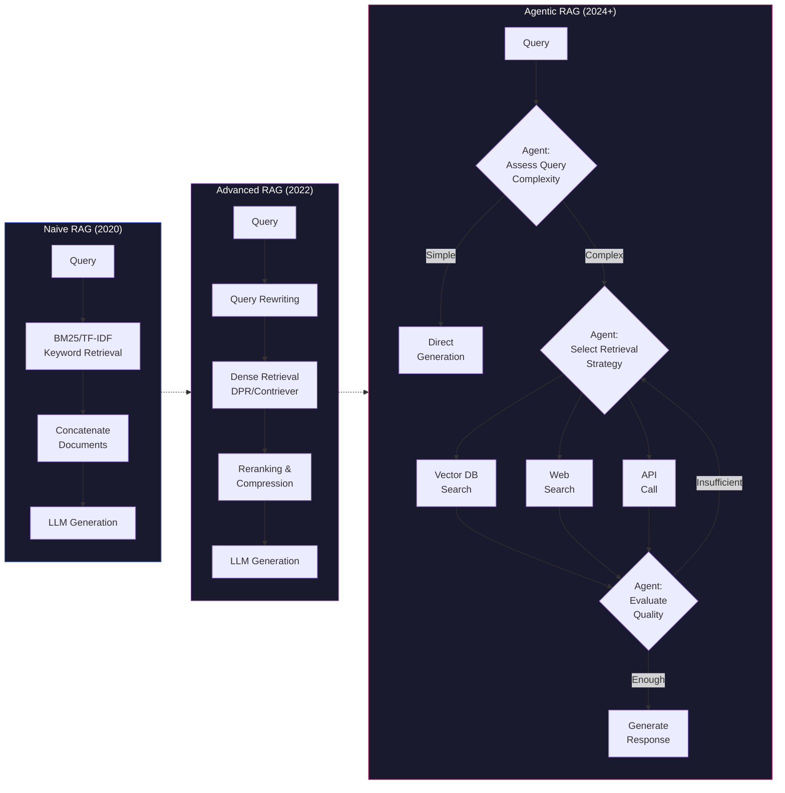
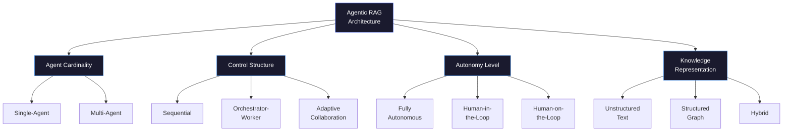

# Agentic RAG: 從靜態檢索生成到自主智能的進化

> **種子論文**: [Agentic Retrieval-Augmented Generation: A Survey on Agentic RAG](https://arxiv.org/abs/2501.09136) (2025-01)
> **作者**: Aditi Singh, Abul Ehtesham, Saket Kumar, et al.

> **Dependency Paper**: [Corrective Retrieval Augmented Generation (CRAG)](https://arxiv.org/abs/2401.15884) (2024-01)
> **作者**: Shi-Qi Yan, Jia-Chen Gu, Yun Zhu, Zhen-Hua Ling

---

## TL;DR

RAG 系統長期以來受限於靜態、線性的檢索生成流程，無法應對需要多步推理、動態適應的複雜查詢。Agentic RAG 將自主 AI 智能體嵌入 RAG pipeline，讓系統具備反射（self-reflection）、規劃（planning）、工具使用（tool use）與多智能體協作（multi-agent collaboration）等能力，從根本上突破了傳統 RAG 的限制。這場從「被動工具」到「主動代理」的轉變，正在重新定義 RAG 系統的架構設計與應用邊界。

---

## 背景與動機

### LLM 的知識邊界問題

大型語言模型（LLM）的能力來自於大規模預訓練。GPT-4、PaLM、LLaMA 等模型在訓練過程中消耗了 TB 級的文本資料，從中學習到大量的語言模式與事實性知識。但這個過程有一個根本的限制：**預訓練是有截止日期的**。截至最新訓練資料的時點後發生的事件、新發表的論文、最新的新聞——這些模型都不知道。

更糟的是，即使是在訓練資料涵蓋的時間範圍內，模型也無法保證記住所有事實。參數化記憶（parametric memory）的本質決定了它是一個有損壓縮過程——模型不是一個資料庫，無法精確儲存每一項事實，它學到的是統計規律和模式，這就導致了所謂的「幻覺」（hallucination）：模型自信滿滿地給出聽起來合理但實際上錯誤的答案。

這個問題在知識密集型的任務上特別嚴重。例如：

> **查詢**：「Explain the key contributions of the 2024 Nobel Prize in Physics winners」
>
> **純 LLM 回應**：模型如果訓練資料截止在 2023 年，它根本不知道 2024 年的諾貝爾獎得主是誰，但它很可能會編造一個聽起來合理的答案——例如編造幾個有名的物理學家的名字。

### RAG 作為解決方案與它的根本困境

RAG 的直覺很直接：不要讓模型憑記憶回答，而是先到外部知識庫（維基百科、公司內部文件、最新新聞）檢索相關資訊，然後把這些資訊當作參考資料餵給模型。這就好像在考試時讓學生翻開課本——不是測試學生的記憶力，而是測試學生能否從課本中找到正確答案並理解它。

這個方案在理論上很完善，但在實務上遇到了一個尷尬的問題：**如果翻開的課本那一頁是錯的呢？**

檢索系統不是完美的。原因可能來自：

- **查詢表述模糊**：「蘋果的創辦人是誰」——系統無法判斷使用者指的是水果還是公司，取決於 embedding 模型的語意理解能力
- **語料庫覆蓋不足**：如果知識庫中沒有相關文件，檢索器只能回傳最「接近」的文件，但接近不等於正確
- **Embedding 品質問題**：稠密檢索模型可能因為訓練資料的偏差，在某些特定領域表現不佳
- **語意漂移**：同一個詞在不同上下文中的語意差異可能導致誤配

研究顯示（Shi et al., 2023），當檢索回傳的文件不相關時，RAG 的表現可能比不使用 RAG 更差——因為不相關的上下文會像雜訊一樣干擾模型，引導它朝錯誤方向生成。

### 三層次的解決方案

針對這個困境，研究社群提出了三個層次的解決方案，它們構成了 RAG 進化的主線：

**第一層：讓檢索更好（Advanced RAG）**

改善檢索本身的品質。引入稠密檢索（DPR、Contriever）來捕捉語意而非關鍵字；加入查詢改寫（query rewriting）讓查詢更適合檢索；使用重排序（reranking）在檢索後進一步過濾。但這一層次的方案本質上是「線性改進」——它讓每一個環節做得更好，但沒有改變整體流程的結構。

**第二層：決定何時檢索（Selective RAG）**

不是每個查詢都需要檢索。簡單的事實性查詢（「台北 101 多高」）LLM 可能已經知道；只有需要最新或特定資訊的查詢才需要檢索。Self-RAG 是這一層次的代表作，它訓練一個 critic model 來判斷是否該檢索以及檢索結果是否可信。

**第三層：自主管理檢索過程（Agentic RAG）**

這是最新的層次，也是本文的主題。不再是「該不該檢索」的二元決策，而是由 agent 自主管理整個檢索生成過程——判斷當前查詢的複雜度，決定檢索策略，迭代修正查詢表述，整合多種資訊來源，評估生成品質，必要時回頭重新檢索。

這個三層次框架有助於理解為什麼 CRAG 是一個重要的里程碑。CRAG 處於第二層和第三層之間：它比第二層多了「檢出錯誤後如何修正」的能力，但又不像第三層那樣具備完整的自主規劃能力。

### 靜態 RAG 的天花板

Retrieval-Augmented Generation（RAG）從 2020 年 Lewis 等人的經典論文開始，一直是解決 LLM 靜態知識限制的主要方案。核心想法直白：讓 LLM 在生成前先到外部知識庫檢索相關文件，把檢索結果當作上下文一起餵給模型。這個「retrieve → read → generate」流程在問答、事實查核等任務上表現出色，但隨著應用場景從簡單問答擴展到複雜多步推理，它的侷限也越來越明顯。

傳統 RAG 最根本的問題是**缺乏判斷力**：

- **檢索品質無保障**：一旦 retriever 撈到不相關或品質差的文件，LLM 仍然照單全收，甚至可能因為被誤導而產出更糟的結果。Shi 等人（2023）的研究顯示，檢索失敗時 RAG 的表現可能比純 parametric generation 還差，因為錯誤的上下文會把模型推向幻覺。

- **流程是僵化的**：無論查詢是「今天是幾號」還是「解釋量子糾纏對現代密碼學的影響」，系統都跑同一套 retrieve → read → generate 流程。前者不需要檢索，後者可能需要多次迭代檢索和多步推理，但傳統 RAG 無法區分。

- **缺乏反饋迴路**：生成結果的好壞無法影響下一次檢索。系統不會因為第一次輸出品質差就回頭修正檢索策略。

這些問題在需要多跳推理（multi-hop reasoning）、長文字生成（long-form generation）、以及動態資訊整合的場景中特別致命。

### 從修正到自主

解決方案可以從兩個維度思考。第一層是「當檢索出錯時怎麼辦」——這是 CRAG 的核心問題。它引入一個輕量級的檢索評估器來判斷檢索文件的品質，並在品質不佳時觸發修正動作（網路搜尋、知識精煉等）。這是一種**反應式（reactive）的智慧**：系統被動地等待檢索結果，然後決定如何處理。

第二層是「能否讓系統主動決定檢索策略」——這才是 Agentic RAG 的真正內涵。不再是「先檢索再評估」，而是讓 LLM-based agent 主動判斷「現在該不該檢索」「該用什麼策略檢索」「蒐集到足夠證據了嗎」「需不需要重新表述查詢」。這是**主動式（proactive）的智慧**。

這兩個層次並不是非此即彼的關係。事實上，CRAG 的糾正機制可以看作 Agentic RAG 中「reflection pattern」的一種具體實現，它們之間的進化關係是理解 Agentic RAG 的關鍵線索。

---

## 核心知識點

本文圍繞以下六個知識點展開。它們構成了理解 Agentic RAG——從概念、方法到架構——的完整框架：

1. **RAG 的進化路徑**——從 Naive RAG 到 Agentic RAG，每一階段的關鍵突破與限制
2. **檢索品質的核心矛盾**——檢索失敗時系統該如何應對，以及 CRAG 提出的解決方案
3. **Agentic 設計模式**——Reflection、Planning、Tool Use、Multi-Agent Collaboration 四種模式的內涵與適用場景
4. **Agentic RAG 架構分類法**——Survey 提出的基於四維度的統一 taxonom
5. **從 CRAG 到 Agentic RAG 的連續性**——糾正機制如何在 agentic 框架下被重新理解
6. **開放挑戰**——評估標準化、協調複雜度、記憶管理、計算效率、治理與安全性

---

## 方法詳解

### 知識點 1: RAG 的進化路徑

RAG 的發展可以大致分為五個階段，每一階段都解決了前一階段的核心限制。

**Naive RAG（2020–2021）**

最早的形式。使用 TF-IDF 或 BM25 做關鍵字匹配檢索，將檢索到的文件直接拼接進 prompt。優點是簡單、直覺，但缺點同樣明顯：缺乏語義理解、檢索結果品質波動大、產出容易碎片化。Lewis 等人（2020）與 Guu 等人（2020）的經典論文奠定了這個範式。

**Advanced RAG（2022–2023）**

引入 Dense Passage Retrieval（DPR）、Contriever 等稠密檢索模型，將語義理解能力帶入檢索環節。同時出現了 pre-retrieval 和 post-retrieval 的處理流程：檢索前對查詢進行改寫（query rewriting）、檢索後對文件進行重排序（reranking）或壓縮（compression）。這個階段顯著提升了檢索的語義精度，但整體流程仍是線性的——系統無法根據檢索結果的好壞動態調整策略。

**Modular RAG（2023–2024）**

RAG 進入模組化時代，出現了更精細的流程控制。系統可以根據任務需求動態決定是否檢索、何時檢索、以及檢索後如何處理。Self-RAG 是這個階段的代表性工作——它訓練一個 critic model 來判斷是否該檢索、檢索結果是否相關、以及生成內容是否可信。這已經具有初步的 agentic 特徵。

**Graph RAG（2024）**

將知識圖譜引入 RAG，使系統能夠利用實體關係進行多跳推理。Graph RAG 特別適合醫療診斷、法律研究等需要理解結構化關係的場景。缺點是整合圖資料與非結構化檢索系統的複雜度較高。

**Agentic RAG（2024–2025）**

這是最新的範式轉移。Agentic RAG 將自主 AI 智能體嵌入 RAG pipeline，系統不再只是被動地等待檢索結果，而是由 agent 主動管理整個檢索與生成過程。這包括：動態決定檢索策略、迭代修正查詢表述、整合多種資訊來源（向量資料庫、API、網路搜尋）、以及協調多個 agent 分工合作。

這個進化路徑有一個清晰的趨勢：**系統的自主性逐步提高**，從最早的「被動檢索」到「選擇性檢索」再到「主動管理檢索過程」。



### 知識點 2: 檢索品質的核心矛盾

傳統 RAG 的一個根本假設是「檢索到的文件是相關的」。這個假設在受控環境下大致成立，但在實際應用中經常被違反。檢索器可能因為查詢表述模糊、語料庫覆蓋不全、或 embedding 品質問題而回傳不相關的文件。

CRAG 針對這個矛盾提出了一個直接的解決方案：在檢索和生成之間插入一個**檢索評估器（Retrieval Evaluator）**。

**CRAG 的檢索評估器**

CRAG 使用 T5-large（0.77B 參數）作為檢索評估器的初始化模型，並在任務相關數據上 fine-tune。對於每個 query-document 對，評估器輸出一個 relevance score。相比 Self-RAG 使用的 7B critic model，CRAG 的評估器極為輕量。論文中也嘗試用 ChatGPT prompt 來評估檢索相關性，但表現不如 fine-tuned T5-large。

評估器輸出每個 query-document 對的分數後，系統根據這些分數觸發三種動作：

**Correct（正確）**：至少一個文件的置信度高於上閾值，表示檢索結果總體可用。此時執行知識精煉（knowledge refinement），將檢索文件分解為細粒度知識片段（knowledge strips），用評估器過濾不相關片段後重新組合。

**Incorrect（錯誤）**：所有文件的置信度都低於下閾值，表示檢索結果完全不可用。這時丟棄所有檢索結果，轉向大規模網路搜尋（web search）獲取新的資訊。

**Ambiguous（模糊）**：介於兩者之間，系統對檢索品質沒有把握。此時同時使用兩種策略——對檢索結果進行知識精煉，同時也進行網路搜尋——將兩者合併後交給 generator。

這個三層設計的巧妙之處在於 Ambiguous 動作。如果只有 Correct 和 Incorrect 兩種硬性判斷，系統表現會過度依賴評估器的準確度。Ambiguous 提供了一個軟性調和機制，大幅提升了系統對評估器誤差的容忍度。

**形式化描述**

CRAG 的推理流程可以形式化為：

給定輸入查詢 $x$ 與檢索結果集合 $D = \{d_1, d_2, ..., d_k\}$：

1. 評估器 $E$ 對每個 query-document 對計算相關性分數 $\text{score}_i = E(x, d_i)$
2. 根據分數集合決定置信度 $C \in \{\text{Correct}, \text{Incorrect}, \text{Ambiguous}\}$
3. 根據 $C$ 選擇知識來源 $K$：
   - Correct: $K = \text{KnowledgeRefine}(x, D)$
   - Incorrect: $K = \text{WebSearch}(\text{Rewrite}(x))$
   - Ambiguous: $K = \text{KnowledgeRefine}(x, D) + \text{WebSearch}(\text{Rewrite}(x))$
4. Generator $G$ 以 $x$ 與 $K$ 為輸入生成回應 $y = G(x, K)$

這個流程雖然只涉及單一層次的決策（評估 → 修正），但已經包含了 agentic 系統的核心元素：**感知（評估檢索品質）、決策（選擇動作）、行動（知識精煉或網路搜尋）**。

**門檻值機制與三層動作的形式化**

CRAG 的三層動作基於門檻值（threshold）機制實現。對於每個 query-document 對，評估器輸出一個介於 0 到 1 之間的相關性分數 $s_i = E(x, d_i)$。系統設定兩個門檻值：上門檻 $\tau_{\text{high}}$ 和下門檻 $\tau_{\text{low}}$。對每個文件的判定方式為：

$$
\text{Action}(d_i) = 
\begin{cases} 
\text{Correct} & \text{if } s_i > \tau_{\text{high}} \\
\text{Incorrect} & \text{if } s_i < \tau_{\text{low}} \\
\text{Ambiguous} & \text{otherwise}
\end{cases}
$$

整體判定規則為：
- **Correct**：$\max_i s_i > \tau_{\text{high}}$（至少一個文件被判定為相關）
- **Incorrect**：$\forall i, s_i < \tau_{\text{low}}$（所有文件都被判定為不相關）
- **Ambiguous**：其他情況

門檻值的選擇決定了系統的保守程度。CRAG 論文中對 PopQA 數據集的實驗顯示，當 $\tau_{\text{high}} = 0.7$ 且 $\tau_{\text{low}} = 0.3$ 時取得最佳平衡。如果 $\tau_{\text{high}}$ 設定過高，Incorrect 動作會頻繁觸發，導致不必要的網路搜尋開銷；如果 $\tau_{\text{low}}$ 設定過低，系統會過度容忍低品質的檢索結果。

下圖展示了 CRAG 的完整推理流程：

```mermaid
flowchart TD
    Q[Input Query x] --> R[Retriever]
    R --> D[Retrieved Docs D = {d1,...,dk}]
    D --> E[Retrieval Evaluator\nT5-large 0.77B]
    E --> C{Confidence\nAssessment}
    
    C -->|At least one score > τ_high| CORRECT
    C -->|All scores < τ_low| INCORRECT
    C -->|Otherwise| AMBIGUOUS
    
    CORRECT --> KR[Knowledge Refinement\nDecompose → Filter → Recompose]
    INCORRECT --> WS[Web Search\nRewritten Query]
    AMBIGUOUS --> COMBINE[Combine Both\nInternal + External]
    
    KR --> KIN[Internal Knowledge kin]
    WS --> KEX[External Knowledge kex]
    AMBIGUOUS --> KCOMB[Combined Knowledge\nkin + kex]
    
    KIN --> GEN[Generator\nLLM]
    KEX --> GEN
    KCOMB --> GEN
    GEN --> Y[Final Response y]
    
    style CORRECT fill:#193b1c,stroke:#4caf50,color:#fff
    style INCORRECT fill:#3b1919,stroke:#f44336,color:#fff
    style AMBIGUOUS fill:#3b3519,stroke:#ff9800,color:#fff
```

**評估器的訓練細節**

CRAG 的 Retrieval Evaluator 使用 T5-large（770M 參數）作為 backbone，並在任務相關的數據上進行 fine-tune。正樣本來自數據集中提供的 golden passage（例如 PopQA 的 golden subject wiki title），負樣本則是從 retriever 回傳但不相關的文件中隨機抽樣。這個設計非常務實——不需要昂貴的人工標註，可以直接從現有數據集和檢索結果中獲取訓練信號。

值得注意的是，CRAG 論文中也比較了使用 ChatGPT prompt 作為評估器的替代方案，但在所有任務上，fine-tuned T5-large 的表現都優於 ChatGPT prompt。這說明在檢索評估這個任務上，專用的輕量模型比通用的大模型更有效——可能的原因是檢索評估需要的不是廣泛的世界知識，而是對 query-document 相關性的精確判斷能力。

**CRAG 的 plug-and-play 特性**

CRAG 一個重要的設計原則是「plug-and-play」——它不需要修改 retriever 或 generator 的內部結構，而是作為一個中介模組插入兩者之間。這意味著 CRAG 可以與任何現有的 RAG 系統整合。論文中實驗了兩種整合方案：

1. **RAG + CRAG**：將 CRAG 插入標準 RAG（Lewis et al., 2020）的檢索與生成之間
2. **Self-RAG + CRAG**：將 CRAG 插入 Self-RAG（Asai et al., 2024）的檢索與生成之間

兩種方案都帶來了穩定的性能提升，證明了 CRAG 的通用性。

**Decompose-then-Recompose 演算法**

當檢索結果被判定為 Correct 時，CRAG 會對每個檢索文件執行知識精煉（Knowledge Refinement），該過程包含三個步驟：

1. **Decompose（分解）**：將檢索文件分割為細粒度的知識片段（knowledge strips）。如果文件很短（一到兩句話），整個文件視為一個片段；如果文件較長，則根據句子邊界分割為數個片段，每個片段包含若干句子，確保每個片段承載一個獨立的資訊單元。

2. **Filter（過濾）**：使用 Retrieval Evaluator 對每個知識片段重新計算相關性分數，保留高於門檻值的片段，過濾掉不相關的片段。

3. **Recompose（重組）**：將過濾後剩餘的片段按照原始順序拼接，形成精煉後的內部知識（internal knowledge）。

這個演算法的關鍵在於，它意識到「一個檢索文件中的部分內容是相關的，但並非全部相關」。傳統 RAG 將整個文件視為一個整體，導致 generator 被迫處理大量無關的上下文。CRAG 的 decompose-then-recompose 將粒度從文件級別細化到段落級別，讓 generator 專注於最相關的知識片段。

### 知識點 3: Agentic 設計模式

如果說 CRAG 代表了「單點決策」的 agentic 雛形，那麼種子論文 survey 描述的則是完整的 agentic design pattern 體系。該 survey 將 agentic 設計模式分為四類：

**Reflection（反射）**

Reflection 是 agentic workflow 中最基礎的模式，讓 agent 能夠迭代地評估和修正自己的輸出。具體做法是：先讓 agent 產出一個初步結果，然後 prompt 它對這個結果進行批判——檢查正確性、風格、效率等面向——再根據批判結果進行改進。外部的校驗工具（如單元測試、搜尋引擎結果）可以進一步增強這個過程。

在 Agentic RAG 中，reflection 的應用場景包括：檢查檢索結果是否真正回答了查詢、評估生成結果是否基於檢索內容而非幻覺、以及判斷是否需要進一步檢索。

Reflection 與 CRAG 的關係值得注意。CRAG 的 Retrieval Evaluator 本質上就是一個自動化的 reflection 機制——它評估檢索品質，然後決定下一步行動。區別在於，CRAG 使用專用的小模型（T5-large）來做評估，而 Agentic RAG 中的 reflection 可以由 LLM-based agent 本身透過 prompt 來完成。

從實作角度來看，reflection pattern 有幾種具體的實現方式：

第一種是 **single-pass reflection**：agent 先產出一次結果，然後 prompt 它「檢查你的答案是否有問題」。這是最簡單的形式，但效果依賴於模型自身的自我批判能力。研究顯示，LLM 的自我批判能力並不穩定——模型有時無法發現自己的錯誤，有時又會把正確的答案誤判為錯誤。

第二種是 **tool-assisted reflection**：agent 使用外部工具來驗證自己的輸出。例如，在 RAG 場景中，agent 可以針對生成的每個事實性陳述，重新發起檢索來驗證其正確性。這種方式比純自我批判更可靠，因為引入了獨立的外部驗證。

第三種是 **multi-pass iterative reflection**：agent 反覆執行「生成 → 批判 → 修正」的循環，直到滿足某個停止條件（如批判不再發現問題、或迭代次數達到上限）。論文「Self-Refine」（Madaan et al., 2023）和「Reflexion」（Shinn et al., 2023）是這種模式的重要先行工作。

**Planning（規劃）**

Planning 模式讓 agent 能夠將複雜任務自主分解為較小的子任務。這對需要多跳推理的查詢尤其重要——例如「解釋量子糾纏對現代密碼學的影響」這樣的查詢，需要先解釋量子糾纏、再解釋現代密碼學的基礎、最後建立兩者之間的連結，每一步都可能需要不同的檢索策略。

Planning 在 Agentic RAG 中的應用體現在：agent 先將查詢分解為數個子查詢，為每個子查詢制定檢索計畫，然後依序或平行執行，最後將各子結果整合為最終回應。

Planning pattern 的實作可以分為幾種策略：

- **Static Planning**：agent 在執行前先制定完整的計畫，然後按計畫執行。適合結構化、步驟明確的任務，但缺乏對執行過程中新資訊的反應能力。
- **Dynamic / Replanning**：agent 在執行過程中根據已獲得的新資訊動態調整後續計畫。例如，在檢索到某個文件後，agent 可能發現需要先理解一個前置概念才能繼續。
- **Hierarchical Planning**：agent 將任務分解為多層次的計畫（高層策略 → 中層戰術 → 低層操作），每一層的計畫在下一層執行時進一步具體化。

**Tool Use（工具使用）**

Tool Use 模式讓 agent 能夠超越 parametric knowledge 的限制，與外部工具、API、資料庫互動。在 Agentic RAG 中，這意味著 agent 可以：

- 選擇不同的檢索工具（向量資料庫 vs. 網路搜尋 vs. 結構化資料庫查詢）
- 動態決定檢索參數（top-k、相似度閾值、查詢改寫策略）
- 整合非文字工具（圖片搜尋、程式碼執行、API 呼叫）
- 使用運算工具進行數學計算或數據分析
- 呼叫專用工具進行特定任務（如翻譯、摘要、格式轉換）

Tool Use 的實現隨著 GPT-4 的 function calling 能力和 LangChain、LlamaIndex 等框架的成熟而大幅簡化，但挑戰在於如何在大量工具中高效選擇最相關的。當可用工具數量超過一定的門檻（例如 10–20 個），簡單的「把所有工具描述放進 prompt」策略會因為上下文長度限制和注意力分散而失效。技術方案如 heuristic-based selection（根據任務類型預過濾工具）、tool retrieval（使用 embedding 檢索相關工具描述）、以及兩階段的工具選擇（先粗篩再細選）正在被積極探索。

**Multi-Agent Collaboration（多智能體協作）**

多智能體協作是 agentic 模式的最高階形式，讓多個專門化的 agent 分工協作。每個 agent 有自己的記憶、工作流和工具集，透過溝通和任務分配來完成複雜任務。

在 Agentic RAG 中，多智能體架構的典型應用包括：一個檢索 agent 負責搜索和驗證資訊、一個推理 agent 負責邏輯分析、一個寫作 agent 負責回應生成、一個批判 agent 負責品質把關。框架如 AutoGen（Microsoft）、CrewAI、LangGraph 提供了實現這種架構的開發工具。

**多智能體協作的實務考量**

多智能體協作在理論上很優雅，但在實務上需要考慮以下問題：

- **通訊成本**：每次 agent 間的通訊都是一次 LLM 呼叫。在一個 N-agent 系統中，如果每個 agent 都需要與其他所有 agent 交換訊息，通訊複雜度為 $O(N^2)$。實務上通常會限制通訊拓撲（如 star topology、tree topology）來控制成本。

- **共識問題**：當不同 agent 對同一個問題給出不同答案時，系統如何決定採用哪個答案？常見的做法包括投票機制、指定 arbitrator agent、或根據 agent 的 confidence score 加權。

- **任務切分粒度**：任務切分得太粗（每個 agent 處理一大塊任務）會失去多 agent 的協作優勢；切分得太細（每個 agent 處理非常小的子任務）又會讓通訊開銷超過協作收益。找到適當的切分粒度需要實務經驗和實驗調試。

- **除錯困難**：多 agent 系統的行為是 emergent 的——不是任何單一 agent 的程式碼可以預測的。一個意料之外的 agent 交互可能產生既不在任何 agent 的設計意圖之內、也難以重現的 bug。成熟的 logging（例如 LangSmith、Weights & Biases Prompts）和 tracing 機制對多 agent 系統至關重要。

此外，種子論文也討論了 agentic workflow patterns（不同於上述的四種 agentic 設計模式，workflow patterns 關注的是多個 prompt / model / agent 如何在系統層級被協調）。主要的 workflow patterns 包括：

| Workflow Pattern | 描述 | 適用場景 | 複雜度 |
|-----------------|------|---------|--------|
| Prompt Chaining | 將任務分解為序列步驟，每一步的輸出是下一步的輸入 | 簡單的線性流程 | 低 |
| Routing | 根據輸入分類選擇不同的處理路徑 | 查詢類型明確的分類場景 | 低-中 |
| Parallelization | 多個步驟同時執行，結果匯總 | 需要從多個角度調查的問題 | 中 |
| Orchestrator-Worker | 一個 orchestrator 分配工作給多個 worker | 複雜的多步驟任務 | 高 |
| Evaluator-Optimizer | generator 產出結果，evaluator 評分，反覆迭代 | 需要高品質生成的任務 | 中-高 |

這些 workflow patterns 與前面討論的四種設計模式是正交的——同一個系統可以同時使用多種 patterns 和多種設計模式。例如，一個 Agentic RAG 系統可以使用 Orchestrator-Worker pattern 來協調多個 agent，而每個 agent 在其內部使用 Planning 和 Tool Use 模式執行分配給它的子任務。

### 知識點 4: Agentic RAG 架構分類法

種子論文的核心貢獻之一是提出了一個統一的 Agentic RAG 架構分類法（taxonomy），基於四個維度對現有框架進行分類。以下 Mermaid 圖直觀地展示了這個分類法的結構：



**Agent 數量（Agent Cardinality）**

- **Single-Agent Architecture**：一個 agent 負責所有檢索與生成決策。優點是簡單、協調成本低；缺點是單點瓶頸，所有決策集中在一個 agent 上。
- **Multi-Agent Architecture**：多個專門化 agent 分工協作。優點是任務可以平行處理、各 agent 可以專注於特定領域；缺點是協調複雜度高、訊息傳遞 overhead 大。

**控制結構（Control Structure）**

- **Sequential（序列式）**：agent 們依固定順序執行任務。簡單可預測，但缺乏彈性。
- **Orchestrator-Worker**：一個 orchestrator agent 負責任務分解和分配，worker agents 負責執行。提供了結構化的任務管理。
- **Adaptive Collaboration（自適應協作）**：agent 們根據任務需求動態決定協作模式。最具彈性，但也最難實現和除錯。

**自主性程度（Autonomy Level）**

- **Fully Autonomous**：系統自主決策，不需要人類介入。
- **Human-in-the-Loop**：關鍵決策（如敏感資訊的正確性確認）由人類把關。
- **Human-on-the-Loop**：人類監督但不直接介入，系統在例外情況時才請求人類協助。

**知識表示（Knowledge Representation）**

- **Unstructured**：純文字文件、網頁等非結構化資料。
- **Structured / Graph**：知識圖譜、關聯式資料庫等結構化知識。
- **Hybrid**：結合多種知識表示方式，根據任務需求動態選擇最適合的檢索來源。

這個分類法提供了一個評估和比較不同 Agentic RAG 框架的工具。例如，CRAG 可以歸類為：Single-Agent、Sequential control structure、Fully Autonomous（無需人類介入）、Unstructured knowledge（主要處理文字文件）。

**框架實例對照**

為了更具體地理解這個分類法的應用，這裡將幾個代表性的 Agentic RAG 框架對應到分類法中：

| 框架 | Agent 數量 | 控制結構 | 自主性 | 知識表示 |
|------|-----------|---------|--------|---------|
| CRAG (Yan et al., 2024) | Single | Sequential | Fully Autonomous | Unstructured |
| Adaptive RAG (Jeong et al., 2024) | Single | Sequential (with router) | Fully Autonomous | Unstructured |
| GEAR (Shen et al., 2024) | Single | Sequential | Fully Autonomous | Hybrid (Graph + Text) |
| Agent-G (Lee et al., 2024) | Multi | Orchestrator-Worker | Fully Autonomous | Graph |
| LangGraph Agentic RAG | Single/Multi (configurable) | Orchestrator-Worker | Configurable | Unstructured |
| CrewAI RAG | Multi | Adaptive Collaboration | Fully Autonomous | Unstructured |
| AutoGen RAG | Multi | Adaptive Collaboration | Configurable | Unstructured |

從這個對照表可以觀察到幾個趨勢：

1. **早期方法都是 Single-Agent**：CRAG、Adaptive RAG 等 2024 年初的方法都採用最簡單的單 agent 架構，集中在解決「檢索品質」單一問題上
2. **圖增強的 Agentic RAG 傾向於多 agent**：GEAR 和 Agent-G 因為需要同時處理圖結構資料和文字資料，自然走向多 agent 分工
3. **框架層面提供更大的彈性**：LangGraph、CrewAI、AutoGen 等通用 agent 框架可以根據任務需求配置不同的 agent 數量和控制結構

### 知識點 5: 從 CRAG 到 Agentic RAG 的連續性

理解 CRAG 與 Agentic RAG 的關係是掌握這篇 survey 精髓的關鍵。它們不是兩條不同的技術路線，而是同一條路徑的不同深度。

**CRAG 作為 Agentic RAG 的特例**

CRAG 的核心邏輯——評估查詢狀態、根據評估結果決定行動、執行行動——本質上就是一個 agentic loop。如果把 CRAG 的 Retrieval Evaluator 替換成 LLM-based agent（透過 prompt 來做評估和決策），CRAG 就成為了一個完整的單 agent Agentic RAG 系統。

更精確地說，CRAG 實現了 agentic 設計模式中的 **Reflection pattern**（透過檢索評估器自我審查檢索品質）以及部分的 **Tool Use pattern**（選擇性使用網路搜尋作為外部工具）。

**CRAG 的獨特貢獻與限制**

CRAG 的獨特貢獻在於它將「檢索品質評估」從一個模糊的概念轉化為一個可量化的、可操作的流程。它證明了即使是使用輕量級的小模型（T5-large, 0.77B），也能有效地評估檢索品質並進行修正，這對追求效率的生產環境有重要意義。

然而 CRAG 的限制也很明顯：

- **決策深度有限**：只做一層決策（評估 → 修正），不像真正的 Agentic RAG 可以進行多輪迭代。CRAG 的動作是確定性的——一旦評估器決定「Correct」或「Incorrect」，系統就沿著固定的路徑前進，沒有回路。
- **無規劃能力**：無法將複雜查詢分解為子任務逐步處理。CRAG 假設輸入查詢是原子性的、可以直接被檢索和回答的。但在實際場景中，很多查詢需要先分解再回答。
- **單一 agent**：不支援多 agent 分工協作。檢索評估、知識精煉、網路搜尋全部在同一個流程中完成，無法平行處理。
- **無長期記憶**：每次查詢的決策獨立，無法從歷史交互中學習對特定領域的檢索偏好或常見的檢索失敗模式。
- **評估器需要 fine-tune**：CRAG 的 Retrieval Evaluator 需要在特定領域數據上 fine-tune 才能達到最佳表現。這在有充足標註數據的場景下可行，但在低資源領域或跨領域遷移時可能受限。

將 CRAG 映射到種子論文 survey 的分類法中，可以清楚地看到它的位置和限制：

| Agentic RAG 維度 | CRAG 的狀態 | 完整 Agentic RAG 的目標 |
|-----------------|------------|----------------------|
| 決策循環 | 一次性的（評估 → 行動） | 迭代的（可多次循環） |
| 任務分解 | 不支援 | 支援（Planning pattern） |
| Agent 數量 | 單一 | 可配置（single 或 multi） |
| 工具選擇 | 硬編碼（兩種：corpus + web） | 動態的（任意工具組合） |
| 記憶 | 無狀態（stateless） | 有狀態（stateful, 含長期記憶） |
| 評估方式 | 專用小模型（0.77B） | LLM-based（in-context 或 fine-tuned） |
| 訓練需求 | 需要 | 可選 |

**種子論文 Survey 的定位**

種子論文作為一篇 survey，並不是要提出一個新的方法超越 CRAG，而是提供一個更大的框架來理解 CRAG 及其同類工作。它的核心價值在於：

1. 將散落在不同論文中的方法（CRAG、Adaptive RAG、Self-RAG 等）歸納到統一的 taxonom 下
2. 明確定義了 Agentic RAG 的 boundary conditions——何時某個方法算是「agentic」
3. 為後續研究提供了設計空間的 mapping

### 知識點 6: 開放挑戰

種子論文的倒數第二個主要章節專門討論了 Agentic RAG 的開放挑戰。這些挑戰是理解領域現狀與未來方向的重要背景。

**評估標準化**

Agentic RAG 目前缺乏統一的評估框架。傳統 RAG 的評估指標（如 F1、ROUGE、BLEU）主要衡量生成品質，但無法評估 agentic 行為本身——如決策是否合理、資源使用是否高效、協作是否協調。一些初步的工作如 RAGBench、BERGEN、FlashRAG 正在填補這個空白，但離標準化還很遠。

**協調複雜度**

多智能體架構中，agent 之間的通訊、任務分配、結果整合都是複雜的工程問題。如何確保多個 agent 的決策一致而不衝突？如何在資訊不對稱的情況下達成共識？這些問題在分散式系統領域有豐富的文獻，但應用於 LLM-based agent 時需要重新思考——因為 LLM 的輸出本質上具有隨機性，不像傳統分散式系統那樣可預測。

**記憶管理**

Agentic RAG 系統需要管理多種記憶：短期記憶（當前查詢的上下文）、長期記憶（歷史查詢的經驗）、以及外部知識（檢索到的文件）。如何在這些記憶之間有效切換、以及在記憶增長時保持檢索效率，是設計大規模 Agentic RAG 系統的關鍵工程挑戰。

**計算效率**

引入 agent 帶來了額外的計算開銷。每個 agent 都需要 LLM 推論，多 agent 協作還需要額外的通訊成本。如何在不犧牲品質的前提下最小化 token 消耗，是 Agentic RAG 能否在生產環境中應用的關鍵。一些策略包括：使用路由機制僅在必要時呼叫 agent、使用較便宜的模型做 routine 任務、以及 caching 常見查詢的 agent 決策。

**治理與安全性**

Agent 的自主性越高，監控和控制的難度就越大。如何確保 agent 的行為符合預期？如何防止 agent 在沒有監督的情況下做出不可逆的錯誤決策？這些問題不僅是技術挑戰，也涉及框架設計的哲學選擇——完全自主（fully autonomous）vs 人機協作（human-in-the-loop）。種子論文認為，在關鍵應用場景（如醫療、金融）中，human-in-the-loop 在可預見的未來仍然是必要的要求。

---

## 實驗結果

### CRAG 的實驗設置

CRAG 在四個數據集上進行了評估，這些數據集涵蓋了短文本生成和長文本生成兩大類任務：

| 數據集 | 任務類型 | 指標 | 描述 |
|--------|----------|------|------|
| PopQA | 短文本單跳問答 | Accuracy | 測試模型對事實性知識的掌握。每個問題有標準答案（golden wiki title），答案形式為短詞彙 |
| Biography | 長文本生成 | F1 Score | 基於維基百科的傳記生成任務。模型需要生成關於某個人物的一段落傳記文字，評估生成內容與參考文本之間的 token-level 匹配 |
| PubHealth | 事實查核 | Accuracy | 公共衛生相關的事實驗證。模型需要判斷一句關於健康議題的陳述是否正確 |
| Arc-Challenge | 科學推理 | Accuracy | 科學問題的多選問答（Grade-school 到 High-school 層級），需要結合常識推理和事實知識 |

這四個數據集的選擇有其策略考量。PopQA 和 Arc-Challenge 屬於短文本生成（答案通常在一句話內），Biography 屬於長文本生成（答案通常是段落級別），PubHealth 屬於事實性判斷。這種多樣性確保了 CRAG 的評估覆蓋了 RAG 系統常見的應用場景。

CRAG 將自己作為 plug-and-play 模組插入兩種基準方法：標準 RAG（Lewis et al., 2020）和 Self-RAG（Asai et al., 2024），然後比較插入前後的表現。這是評估 CRAG 通用性的關鍵設計——如果 CRAG 只對特定基礎方法有效，它的實用價值就會大打折扣。

### 主要結果

| 方法 | PopQA | Biography | PubHealth | Arc-Challenge |
|------|-------|-----------|-----------|---------------|
| RAG | 22.6 | 7.8 | 48.3 | 64.5 |
| RAG + CRAG | **26.8** | **15.1** | **57.6** | **71.0** |
| Self-RAG | 29.3 | 15.3 | 58.4 | 70.2 |
| Self-RAG + CRAG | **31.2** | **20.4** | **62.4** | **74.8** |

（以上數字為 accuracy / F1 分數，摘錄自 CRAG 論文的實驗報告。）

**關鍵觀察**：

1. CRAG 對兩種基準方法都有穩定的增益，證明其 plug-and-play 的特性確實成立
2. 在長文本生成任務（Biography）上增益最大（RAG + CRAG 從 7.8 提升到 15.1，提升了近一倍），這是因為長文本生成對檢索品質更敏感——少量的錯誤資訊就會被放大，在長文中產生累積效應
3. CRAG + Self-RAG 的組合在所有任務上都達到了最佳表現，說明 CRAG 的糾正機制與 Self-RAG 的選擇性檢索機制是互補的，而非冗餘
4. Self-RAG 本身在大部分任務上已經優於標準 RAG（因為它學會了何時該檢索、何時不該檢索），但加上 CRAG 後仍有進一步提升（Self-RAG + CRAG 的 Accuracy 在 PopQA 上從 29.3 提升到 31.2）

這個結果模式有重要的實務意義：如果你已經在使用 Self-RAG，加上 CRAG 仍然能帶來額外的 2–5 個百分點的提升，而這個提升只需要插入一個 0.77B 的評估器模組，計算成本極低。

### CRAG 的消融實驗

CRAG 論文進行了多組消融實驗來驗證各個元件的必要性：

**動作策略的消融**：移除 Ambiguous 動作（只保留 Correct 和 Incorrect 兩種硬性判斷）後，所有任務上的表現平均下降約 3–5 個百分點。PopQA 上從 26.8 下降到 24.1，Biography 從 15.1 下降到 12.6。這驗證了 Ambiguous 作為軟性調和機制的重要性——當系統對檢索品質不確定時，強迫做出二元判斷會降低整體表現。

**知識精煉的消融**：跳過 decompose-then-recompose 步驟，直接使用完整檢索文件作為 Correct 動作的輸入時，表現下降約 2–4 個百分點。說明即使檢索結果總體相關，文件中的不相關片段確實會干擾生成品質。值得注意的現象是：在 PopQA（短文本任務）上，知識精煉的影響較小（因為答案通常可以在文件中的一句話內找到）；在 Biography（長文本任務）上，知識精煉的影響更大（因為長文本生成容易受到無關片段的干擾）。

**評估器大小的消融**：CRAG 比較了 T5-small（60M）、T5-base（220M）、T5-large（770M）作為評估器的表現。結果顯示 T5-large 明顯優於較小的版本，但 T5-base 與 T5-large 之間的差距不大（約 1–2%），說明實務上可以根據計算預算在 T5-base 和 T5-large 之間取捨。這個消融實驗也揭示了評估器大小與最終表現之間並非線性關係——從 60M 到 220M 的提升幅度遠大於從 220M 到 770M 的提升幅度。

### Agentic RAG Survey 的實證貢獻

作為一篇 survey，種子論文本身不提出新的實驗結果。但它提供了：

1. **全面的框架對比**：對 Agentic RAG 領域的現有 framework 在功能維度上進行了系統性比較，包括 CRAG、Adaptive RAG、GEAR、Agent-G 等
2. **工具生態圖譜**：總結了實現 Agentic RAG 的主要框架（LangChain/LangGraph、LlamaIndex、CrewAI、AutoGen、Semantic Kernel 等）及其適用場景
3. **Benchmark 整理**：彙整了 RAG 評估常用的數據集與任務分類（見論文 Table 5，涵蓋 QA、Dialogue、Reasoning、Summarization 等 12 個類別的 30+ 數據集）

---

## 與相關工作的對比

| 維度 | CRAG (Yan et al.) | Self-RAG (Asai et al.) | 完整的 Agentic RAG |
|------|-------------------|----------------------|-------------------|
| 核心貢獻 | 檢索後修正 | 選擇性檢索 | 端到端的自主管理 |
| 決策類型 | 反應式（評估已有結果） | 選擇性（決定是否檢索） | 主動式（管理整個流程） |
| 檢索評估方式 | 專用小模型（T5-large 0.77B） | LLM-based critic（7B） | LLM-based agent |
| 評估器訓練方式 | Fine-tune on golden passages | Instruction-tune LLaMA-2 7B | In-context prompting |
| 檢索前處理 | 無 | Query complexity classifier | 完整規劃（planning） |
| 檢索後校正 | 有（三種動作 + 知識精煉） | 有（critic 評估生成品質） | 有（多種策略可組合） |
| 任務分解 | 無 | 無 | 透過 Planning pattern |
| 多智能體 | 無 | 無 | 支援 |
| 長期記憶 | 無 | 無 | 支援 |
| 對 generator 的修改 | 無（plug-and-play） | 無（critic 獨立於 generator） | 可選 |
| 模型大小（評估元件） | 0.77B | 7B | 依賴底層 LLM |
| 訓練需求 | 需 fine-tune 評估器 | 需 fine-tune critic | 通常不需（使用 in-context） |
| 主要限制 | 決策深度單一、無規劃 | 評估品質依賴 critic 能力 | 計算 cost 高、協調複雜 |

這個對比表清楚地顯示了從 CRAG 到完整 Agentic RAG 的連續頻譜。CRAG 和 Self-RAG 各自解決了 RAG 的某一個具體問題（檢索品質評估、選擇性檢索），而完整 Agentic RAG 試圖將這些能力整合進一個統一的 agent 框架中。

### 失敗案例與限制

CRAG 論文也討論了其方法的一些失敗模式：

- **評估器誤差**：當 Retrieval Evaluator 將相關文件誤判為不相關（false negative）時，系統會不必要地觸發網路搜尋，導致延遲增加；當將不相關文件誤判為相關（false positive）時，錯誤資訊會進入生成環節，降低生成品質

- **長尾知識的檢索困難**：對非常罕見或專業的查詢，corpus retrieval 或 web search 都可能回傳低品質的結果。此時 CRAG 的修正機制效果有限

- **多跳推理的侷限**：CRAG 評估的是單次查詢與檢索文件的相關性，無法將需要一步步推理的問題分解為子問題。這限制了它在 multi-hop QA 場景中的應用

種子論文 survey 則從架構層面指出了 Agentic RAG 共同的失敗模式：

- **Over-reliance on agents**：在某些情況下，引入 agent 反而降低可靠性，因為 LLM-based agent 的行為不如傳統 pipeline 可預測

- **Cost explosion**：簡單查詢可能觸發多輪 agent 推理和多次檢索，token 消耗遠超預期。需要 budget-aware routing 來管理

- **Evaluation gap**：缺乏同時評估「生成品質」和「決策品質」的 unified benchmark，難以比較不同 Agentic RAG 架構的優劣

---

## 總結、限制與未來方向

### 核心要點

1. **Agentic RAG 不是一個單一方法，而是一個範式**。它將自主智能體引入 RAG pipeline，使系統能夠根據任務需求動態調整檢索與生成策略。這個轉變的核心是從「被動工具」到「主動代理」的躍遷。其驅動力來自於 LLM 自身能力的不斷提升——只有當 LLM 足夠強大到可以承擔規劃、評估、工具使用等高階任務時，Agentic RAG 的願景才變得可行。

2. **CRAG 是這條路徑上的關鍵里程碑**。它證明了「檢索品質評估 + 條件式修正」的有效性，並展示了即使用輕量小模型（0.77B T5-large）也能顯著提升 RAG 的穩健性。但 CRAG 只是起點——它的決策深度和範圍都還有很大的擴展空間。從這個視角看，CRAG 的重要性不在於它解決了所有問題，而在於它展示了「第一層次」的自主性帶來了多大的改進空間。

3. **Agentic 設計模式提供了從簡單到複雜的光譜**。從最基礎的 reflection 到最高階的 multi-agent collaboration，每個模式都有其適用的場景和成本。沒有一種架構適合所有任務，設計者應該根據任務需求選擇合適的模式組合。一個重要的設計原則是：不要為了 agentic 而 agentic——對於簡單的事實性查詢，傳統 RAG 甚至 direct generation 可能更有效率。

4. **評估仍然是最大的挑戰**。傳統 RAG 的評估指標無法捕捉 agentic 行為的品質，而新的評估框架還處於早期階段。缺乏標準化評估是制約領域快速發展的主要瓶頸。目前的實務建議是：除了最終生成品質外，agent 的決策軌跡（retrieval 次數、工具使用序列、自我修正的次數和類型）也應該被記錄和分析。

### 種子論文的限制

作為一篇 survey，種子論文有以下幾點限制值得注意：

1. **覆蓋範圍的取捨**：survey 的 taxonom 雖然有助於結構化理解，但也可能因為分類的二元性（single vs multi、sequential vs adaptive 等）而忽略了一些介於中間的設計（例如 CRAG 的 Ambiguous 動作本身就打破了二元分類，無法被簡單歸類到 Correct 或 Incorrect 中的任何一側）。

2. **缺乏深度的優劣分析**：對於每個比較維度，survey 主要提供的是分類標籤。但對於為什麼某個架構設計在某個維度上更好或更差，缺少深入的工程考量分析。例如「Orchestrator-Worker 優於 Sequential control structure」——這並不總是成立的；對於只需要一到兩個檢索步驟的簡單查詢，Sequential 架構的 overhead 更低、延遲更短。

3. **技術細節深度有限**：作為 survey，難免在每種方法的技術細節上淺嘗輒止。對於想實作 Agentic RAG 的讀者，survey 提供了完整的地圖，但每個站點需要自己去探索。這在某種程度上限制了它作為「實用指南」的價值。

4. **時效性問題**：Agentic RAG 領域正在快速演進。這篇 survey 的 v1 版本於 2025 年 1 月發布，但截至 2026 年 4 月，已經出現了多個重要的新框架和應用。雖然 v4 版本有更新，但作為一篇靜態的 survey 論文，它始終無法捕捉到領域中最新的動態。

### 未來方向

1. **評估框架的建立**：需要能夠同時衡量生成品質和 agentic 行為（決策效率、資源消耗、協作品質）的評估體系。目前常用的 RAG 評估指標（F1、ROUGE、BLEU、Accuracy）只能評估生成結果，無法評估 agent 的決策品質。一些初步的工作（RAGBench、BERGEN、FlashRAG）正在填補這個空白，但這些大多是工具庫而非標準化的評估協定。未來的評估框架可能需要引入強化學習中的評估方法（如 trajectory-level reward）來評估 agent 的決策序列品質——不只是最終答案是否正確，還包括檢索次數、資源消耗、決策路徑的效率等。

2. **記憶與知識的統一管理**：Agentic RAG 系統需要管理多層次的記憶——短期記憶（當前對話的上下文窗口）、長期記憶（跨會話的知識累積）、外部知識（結構化與非結構化資料庫）。目前不同系統對記憶的處理方式差異很大，從簡單的 conversation history 拼接到位於 Agent 架構核心的 vector store 都有。未來需要更統一、更高效的記憶架構，能夠無縫整合這三種記憶層次，並在記憶增長時保持檢索效率。

3. **效率優化**：Agentic RAG 的計算 overhead 是生產部署的主要障礙。引入 agent 意味著每個 query 可能需要多次 LLM 推論（規劃、檢索、評估、生成），對於多 agent 系統，通訊 overhead 更大。可能的優化方向包括：
   - **預測性路由**：使用分類器（而非 LLM）判斷查詢的複雜度，只在複雜查詢時啟用完整的 agentic pipeline，簡單查詢走傳統 RAG 或 direct generation
   - **模型級聯**：簡單查詢用小模型（如 8B 參數），複雜查詢用大模型（如 70B+），降低平均推理成本
   - **決策快取**：caching agent 對常見查詢類型的決策結果，避免重複的推理開銷
   - **平行執行**：在多 agent 架構中，允許不相依的子任務平行執行而非序列處理

4. **治理框架**：隨著 agent 自主性的提高，如何確保 agent 行為的可控性與可解釋性變得越來越重要。具體而言：
   - **監控（Monitoring）**：即時記錄 agent 的決策軌跡（retrieval 決策、工具選擇、生成內容），為事後分析提供完整的 Audit Trail
   - **圍欄（Guardrails）**：在 agent 行動前設定邊界條件（如禁止呼叫特定 API、結果長度限制、敏感內容過濾）
   - **人工介入（Human-in-the-Loop）**：在關鍵決策點設置信號，請求人類確認後再執行（如在醫療或金融場景中，要求人類確認檢索結果後再生成最終回應）

5. **跨語言與多模態的 Agentic RAG**：目前 Agentic RAG 的研究大多聚焦於英文文本。未來的重要方向包括支援多語言檢索（不同語言的知識庫與查詢配對）以及多模態檢索（圖片、音訊、影片等非文字資訊的 Agentic RAG）。

6. **自我進化與持續學習**：更高階的 Agentic RAG 系統可能具備從過往交互中學習的能力——記錄哪些檢索策略對哪些類型的查詢最有效，並逐步調整自己的行為。這將使 Agentic RAG 從一個「配置好的系統」變成一個「會成長的系統」。

---

## 延伸閱讀

### Dependency Papers（本文涵蓋）

1. **Corrective Retrieval Augmented Generation (CRAG)** ([2401.15884](https://arxiv.org/abs/2401.15884))
   - Shi-Qi Yan, Jia-Chen Gu, Yun Zhu, Zhen-Hua Ling (2024)
   - 提出輕量級檢索評估器與三種糾正動作（Correct / Incorrect / Ambiguous），是靜態 RAG 到 Agentic RAG 的關鍵橋樑
   - 核心貢獻：證明 plug-and-play 的檢索品質修正可以顯著提升各類 RAG 系統的穩健性

### 後續發展（未涵蓋，僅列出）

- **Adaptive RAG**: Jeong et al., "Adaptive-RAG: Learning to Adapt Retrieval-Augmented Large Language Models through Question Complexity" ([2401.09184](https://arxiv.org/abs/2401.09184)) — 根據查詢複雜度動態調整檢索策略，與 CRAG 互補
- **Self-RAG**: Asai et al., "Self-RAG: Learning to Retrieve, Generate, and Critique through Self-Reflection" ([2310.11511](https://arxiv.org/abs/2310.11511)) — 雖然未被 survey 明確引用，但直接啟發了 reflection pattern 在 RAG 中的應用
- **GEAR**: Shen et al., "GEAR: Graph-Enhanced Agent for Retrieval-Augmented Generation" — 圖增強的 Agentic RAG 框架，結合結構化知識與非結構化檢索

---

## 引用

完整 BibTeX 見 [`papers.bib`](./papers.bib)。

---

> 本文為 Paper Lens 系列文章之一。主題分類：RAG。文章遵循 CC BY 4.0 授權，論文的引用遵循原論文授權。

---

## 我的觀察

讀完這篇 survey 和 CRAG 論文後，有幾個觀察值得記錄。

**Survey 的最大價值是它的分類法，不是它的覆蓋率**

作為一篇 2025 年初出版的 survey，它的參考文獻不可避免地有一些缺失——例如沒有直接引用 Self-RAG 作為一個獨立參考條目，雖然它在 reflection pattern 的討論中隱含地觸及了 Self-RAG 的概念。但這不妨礙其分類法的實用價值：四個維度的分類（Agent 數量、控制結構、自主性、知識表示）提供了一個思考 Agentic RAG 架構設計的通用框架。無論未來出現什麼新方法，只要它能被 mapping 到這四個維度上，就能與現有方法進行比較。

**CRAG 和 Self-RAG 的關係比表面上看起來更互補**

CRAG 和 Self-RAG 常被視為競爭方法，但實際上是互補的。Self-RAG 解決的是「是否該檢索」的問題（決定何時查詢外部知識），CRAG 解決的是「檢索結果不可靠時怎麼辦」的問題（在檢索後修正）。兩者分別作用於檢索過程的不同階段，組合使用自然會產生疊加效應——實驗結果也證實了，Self-RAG + CRAG 在所有數據集上都達到了最佳表現。

**Agentic RAG 的「agentic」光譜**

一個有趣的觀察是，「agentic」不是一個二元屬性，而是一個連續光譜。從最簡單的 CRAG（單一評估決策）到最複雜的 multi-agent 自適應協作系統，中間有大量的中間態。目前文獻中把很多方法都稱為「Agentic RAG」，但這些方法在自主性、決策深度、工具使用範圍上的差異很大。種子論文的分類法在一定程度上解決了這個問題，但在實務中，一個系統的「agentic 程度」可能需要以多個維度分別評估，而不是用單一標籤概括。

**從 CRAG 學到的工程智慧**

CRAG 雖然在概念上很直觀，但它的工程設計中有幾個值得學習的智慧：

1. **Ambiguous 動作是點睛之筆**：直覺上可能認為 Correct 和 Incorrect 兩種動作就夠了，但 Ambiguous 的引入大幅降低了系統對評估器準確度的依賴。這是一個認識到「你的評估器也會犯錯」的務實設計。

2. **輕量級評估器的選擇**：使用 T5-large（0.77B）而非更大的模型是經過深思熟慮的。論文中實驗顯示，更小的評估器雖然準確度較低，但在延遲和成本上的優勢更大。這是一個工程上的權衡，而非純粹追求準確度。

3. **知識精煉的粒度控制**：Decompose-then-Recompose 的關鍵是找到合適的 decomposition 粒度——太粗（整份文件）會保留雜訊，太細（單一句子）會丟失上下文。CRAG 使用可變長度的知識片段，根據文件長度動態調整粒度，這是一個實用且有效的方案。

**為什麼我看到這篇 survey 感到振奮**

作為一個長期關注 RAG 領域的觀察者，這篇 survey 讓我最感興趣的不是它列出了多少框架（雖然它的 coverage 確實不錯），而是它揭示了一個清晰的趨勢：RAG 正在從「工具」變成「代理人」。幾年前的 RAG 只是一個資料庫前端——你說什麼，它就幫你檢索什麼。但未來的 RAG 會是一個能夠自主理解你的需求、規劃檢索策略、評估資訊品質、並在有疑問時主動追問的系統。這個從工具到夥伴的轉變，或許才是 Agentic RAG 真正的深層意義。

---

> 本文為 Paper Lens 系列文章之一。主題分類：RAG。文章遵循 CC BY 4.0 授權，論文的引用遵循原論文授權。
