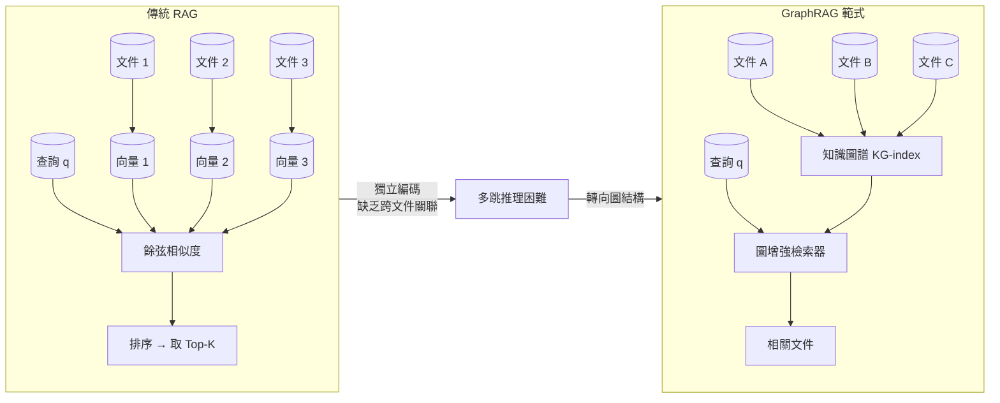
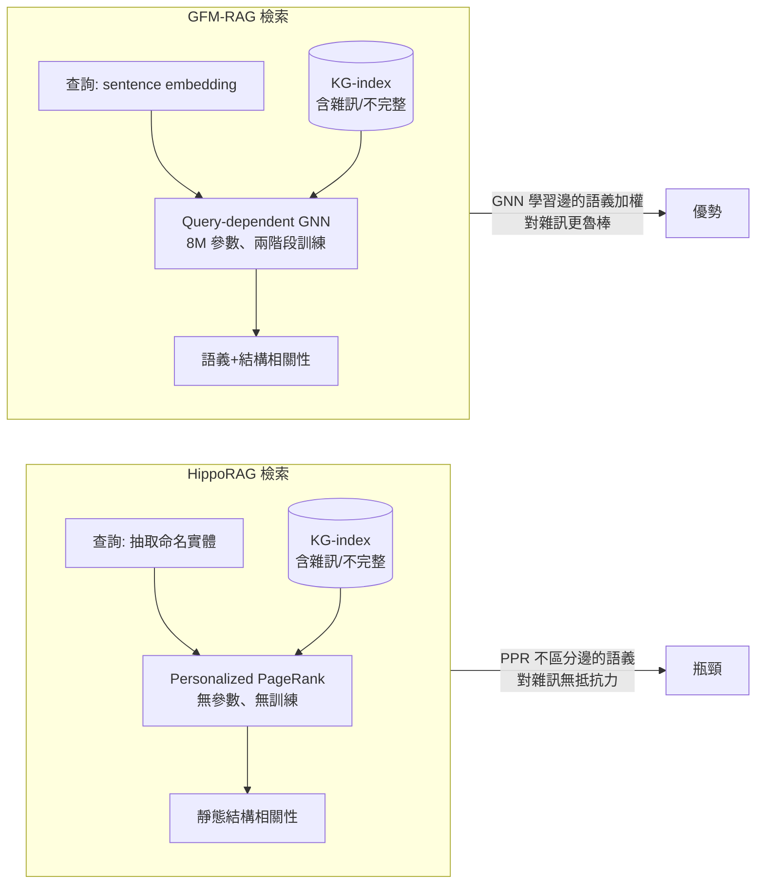
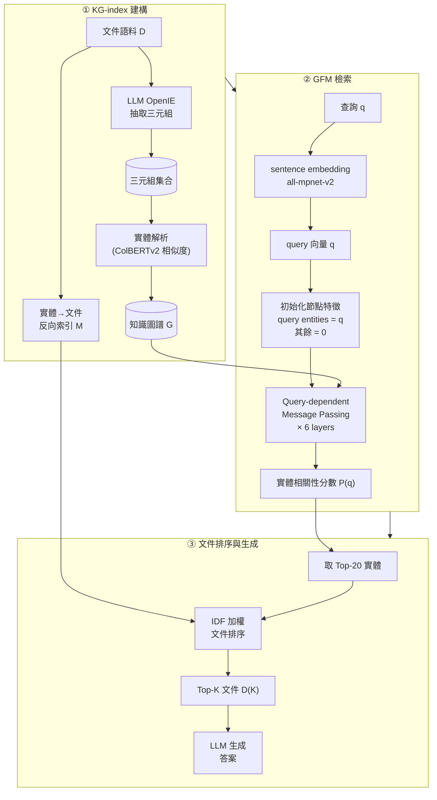
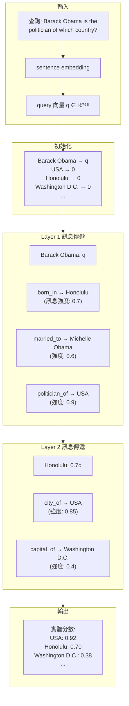
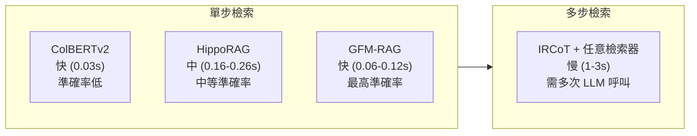

# GFM-RAG (Graph Foundation Model for RAG) 論文導讀

## TL;DR

- GFM-RAG 提出第一個專為 RAG 設計的圖基礎模型 (Graph Foundation Model, GFM)，用 8M 參數的 query-dependent GNN 取代傳統的向量檢索或 PageRank-based 檢索
- 透過兩階段訓練（自監督 KG 補全預訓練 + 監督文件檢索微調）在 60 個知識圖譜、14M 三元組、700K 文件上訓練，能在 unseen 資料集上 zero-shot 檢索
- 在三組多跳 QA 資料集（HotpotQA、MuSiQue、2Wiki）和七組領域 RAG 資料集上超越 SOTA，單步檢索速度比 IRCoT 快 10–30 倍

## 背景與動機

### RAG 的核心困境

讓我們從一個具體問題開始。假設我們有兩篇文件：

- 文件 A：「Barack Obama was born on August 4, 1961, in Honolulu, Hawaii.」
- 文件 B：「Honolulu is the capital and most populous city of the U.S. state of Hawaii, which is in the Pacific Ocean.」

現在問一個問題：「Barack Obama is the politician of which country?」

要回答這個問題，需要連結三件事：(1) Obama → born_in → Honolulu；(2) Honolulu → city_of → USA。這是一個典型的兩跳推理 (2-hop reasoning) 問題。傳統 RAG 的做法是：分別計算 query 與文件 A、B 的向量相似度。由於 query 中有 "politician" 和 "country"，這兩個詞可能與任何文件都不特別相似。

IRCoT 的做法是：先檢索文件 A（因為提到 Obama），讓 LLM 推理「Obama 在哪裡出生」，然後再用「Honolulu」作為新的查詢去檢索，找到文件 B 後推理出「Honolulu 所在的城市是 USA」。這需要兩次 LLM 呼叫和兩次檢索，耗時且昂貴。

GraphRAG 的做法則是：從文件建構 KG——(Obama, born_in, Honolulu) 和 (Honolulu, city_of, USA)，然後在一次圖檢索中找到 Obama → Honolulu → USA 的路徑。這就是 GraphRAG 的核心優勢。

### 為什麼傳統 RAG 無法處理多跳推理

Retrieval-Augmented Generation (RAG) 已是 LLM 整合外部知識的標準做法。標準流程是：用 dense embedding model（如 Contriever、ColBERTv2）將文件編碼成獨立向量，給定查詢後計算語義相似度來檢索。這個架構有個根本問題：**文件是獨立編碼的**。

當問題需要跨越多個文件才能回答時（例如「那位研究阿茲海默症的史丹佛教授是誰？」），獨立編碼的向量無法捕捉「研究阿茲海默症」和「史丹佛教授」這兩個概念之間的關聯——除非某個文件恰好同時提到這兩個條件。這就是多跳推理 (multi-hop reasoning) 的核心挑戰。

### 傳統解法：多步檢索

為了解決這個問題，既有方法如 IRCoT (Khattab et al., 2022) 採用迭代檢索：讓 LLM 先從一個文件出發，推理下一步需要什麼資訊，再檢索第二輪，如此反覆。這雖然有效，但有明顯的代價：

- **計算成本高**：每一步都需要 LLM 參與推理和檢索
- **誤差累積**：前面一步的推理錯誤會直接導致後續檢索失準
- **延遲高**：在多跳資料集上，IRCoT 需要 1–3 秒完成一次檢索

### GraphRAG：用圖結構建模知識關係

一個更根本的思路是：**不以文件為最小單位，而以知識圖譜 (Knowledge Graph) 為索引結構**。GraphRAG 範式從文件建構 KG，其中節點是實體、邊是關係，用圖結構來顯式建模跨文件知識的關聯。

目前 GraphRAG 的主流方法有兩個方向：

第一類是 **static graph-based retrieval**，以 HippoRAG (Jiménez Gutiérrez et al., 2024) 為代表。它用 LLM 從文件抽取三元組建 KG，再用 Personalized PageRank (PPR) 演算法在圖上傳播查詢節點的機率，辨識相關實體。PPR 是無參數的靜態演算法，不需要訓練，但在圖結構有雜訊或不完整時表現受限。

第二類是 **GNN-based retrieval**，如 G-retriever (He et al., 2024)。它用圖神經網路 (GNN) 在 KG 上進行多跳推理，能較好地處理不完整的圖結構。但缺點是每次遇到新的資料集就要重新訓練，缺乏泛化能力。

### GFM-RAG 要解決的問題

GFM-RAG 的目標是結合兩者的優點：既有 GNN 的多跳推理能力，又能像靜態方法一樣直接套用到 unseen 資料集。關鍵想法是：**訓練一個可遷移的 GNN 檢索器，讓它學會在任意 KG 上做 query-dependent 的訊息傳遞**。

這等於是把「圖上的多跳推理」本身當作一個任務來學習，而不是為每個特定的 KG 訓練一個 GNN。

## 核心知識點

以下是理解 GFM-RAG 需要的核心概念：

### 知識點 1：傳統 RAG 的獨立編碼侷限

標準 RAG 將每個文件獨立編碼成稠密向量，檢索時計算 query 與各文件的餘弦相似度。這無法捕捉跨文件關係。即使使用「稠密檢索」如 Contriever 或 ColBERTv2，文件之間仍沒有結構化的關聯。

### 知識點 2：GraphRAG 範式與 KG-index

GraphRAG 從文件語料建構知識圖譜索引 (KG-index)。節點是實體（人名、地名、概念），邊是關係（「出生於」、「任職於」）。KG-index 的結構特性讓它能在一次檢索中捕捉多步關聯，而不需要迭代地呼叫 LLM。

### 知識點 3：OpenIE 與實體解析

KG-index 的建構依賴 Open Information Extraction (OpenIE)：用 LLM 從非結構化文件中抽取 (subject, relation, object) 三元組。接著用實體解析 (entity resolution) 來連結同義實體（如「USA」和「United States of America」），通常用 dense embedding 的餘弦相似度來判斷。

### 知識點 4：HippoRAG 的 Personalized PageRank 檢索

HippoRAG 受海馬體索引理論啟發，將 KG-index 視為人工海馬體索引。檢索時，先從查詢中抽取命名實體作為 seed nodes，再用 Personalized PageRank 在圖上傳播機率。PPR 本質上是在圖上做定點隨機漫步，讓 seed nodes 附近的節點獲得較高分數。

PPR 的優點是訓練免費 (training-free)，但缺點是它只依賴圖的靜態結構。當 KG 有雜訊（錯誤的邊）或不完整（缺少關鍵連接）時，PPR 無法區分哪些結構特徵是可靠的。

### 知識點 5：Query-dependent GNN

這是 GFM-RAG 的核心貢獻。傳統 GNN 對同一個圖上的所有 query 使用相同的訊息傳遞路徑，無法根據查詢動態調整。Query-dependent GNN 則將 query 的語義嵌入作為初始化注入圖節點，讓訊息傳遞的方向和強度取決於查詢本身。

具體做法是：用 sentence embedding model 將 query 編碼成向量，然後將 query 中有提到的實體的初始特徵設為 query vector，其餘設為零向量。經過多層訊息傳遞後，GNN 會從 query entities 出發，沿著圖結構擴散到相關的其他實體。

### 知識點 6：兩階段訓練策略

GFM-RAG 的訓練分為兩個階段，各有不同目的：

**Stage 1：自監督 KG 補全預訓練**
從 KG-index 中隨機取三元組，遮罩頭實體或尾實體，製造合成查詢 `(e, r, ?)` 或 `(?, r, e)`，訓練 GNN 預測被遮罩的實體。這階段的目標是學習通用的圖推理能力（如何沿著邊關係在圖上推理邏輯路徑）。

**Stage 2：監督文件檢索微調**
用真實的多跳 QA 資料，從支持文件中提取目標實體，訓練 GNN 直接預測與查詢相關的實體。這階段讓模型學會理解自然語言查詢並將其映射到圖上的相關區域。

### 知識點 7：Neural Scaling Law for Graph Foundation Model

GFM-RAG (8M) 驗證了性能隨訓練數據量和模型參數量遵循冪律縮放 (power-law scaling)：z ≈ 0.24x^0.05 + 0.11y^0.03，R² = 0.95。這意味著增大模型和數據有可預測的性能提升，這是 foundation model 的重要特徵。

## 方法詳解

### 從傳統 RAG 到 GraphRAG：一個範式轉移

為了理解 GFM-RAG 的貢獻，我們先釐清整體的演進脈絡。



圖中左側是傳統 RAG：文件被獨立編碼成向量，檢索時只考慮語義相似度。右側是 GraphRAG：從文件建構 KG-index，檢索器在圖結構上推理，捕捉跨文件關聯。

### HippoRAG：神經生物學啟發的索引理論

HippoRAG (Jiménez Gutiérrez et al., 2024, NeurIPS) 是理解 GFM-RAG 最重要的前置工作，因為兩者共享相同的基礎架構——KG-index——但在檢索機制上有根本差異。HippoRAG 的方法來自一個看似不相關的領域：神經生物學。

**架構模仿**：HippoRAG 將人腦長程記憶的三個組件映射到 RAG 系統：
- **新皮質 (Neocortex)** → LLM：處理感知輸入，從文件抽取知識
- **旁海馬區域 (PHR)** → Retrieval Encoder：連結語義相似的實體
- **海馬體 (Hippocampus)** → KG + Personalized PageRank：儲存索引並完成 pattern completion

**運作流程**：

1. **離線索引**：用 LLM 對每篇文件做 OpenIE，抽取實體和關係三元組。用 retrieval encoder 加入同義關係（cosine similarity > 門檻值的實體對之間加 `equivalent` 邊）。
2. **在線檢索**：從查詢中抽取命名實體 → 映射到 KG 節點 → 執行 Personalized PageRank → 用 PageRank 分數乘上 node specificity（類似 IDF）→ 透過實體-文件反向索引對文件排序。

**關鍵洞見**：HippoRAG 的 PPR 檢索是 training-free 的，這讓它可以直接套用到任何資料集。但這也意味著它無法學習——當 KG 有雜訊或不完整時，PPR 沒有辦法區分「重要但連接稀疏」的實體和「不相關但被錯誤連接」的實體。

**PPR 的數學形式**：給定 KG 的鄰接矩陣 $\mathbf{A}$ 和 seed nodes 的機率分布 $\mathbf{s}$（query nodes 等機率，其餘為 0），PPR 迭代計算：

$$\mathbf{p}^{(t+1)} = (1 - \alpha) \mathbf{A} \mathbf{p}^{(t)} + \alpha \mathbf{s}$$

其中 $\alpha$ 是 restart probability（通常設為 0.15）。最終的 stationary distribution $\mathbf{p}^*$ 就是每個節點與 query nodes 的相關性分數。

**關鍵限制**：PPR 的訊息傳播只依賴圖的連結結構——從 Obama 到 Honolulu（born_in 邊）的機率傳播與從 Obama 到 USA（politician_of 邊）的機率傳播沒有本質區別。換句話說，**PPR 不知道邊的語義**，只知道邊的存在。當 KG 中有錯誤的邊（如誤將 Obama 連結到不相關的實體），PPR 會不分青紅皂白地傳播機率過去。

### GFM-RAG：用 Learned GNN 取代 Static PageRank

GFM-RAG 繼承 HippoRAG 的 KG-index 架構，但將檢索器從無參數的 PPR 改為可訓練的 query-dependent GNN。這是從「無學習的靜態演算法」到「可學習的深度模型」的典範轉移。



整體流程分為三個階段：從文件建構 KG-index、用 GFM 檢索器計算實體相關性分數、透過反向索引排序文件並餵給 LLM 生成答案。



整個流程分為三個階段：從文件建構 KG-index、用 GFM 檢索器計算實體相關性分數、透過反向索引排序文件並餵給 LLM 生成答案。

### KG-index 的建構細節

KG-index 的建構與 HippoRAG 基本一致，但規模更大、步驟更系統化。

**OpenIE 抽取**：使用 GPT-4o-mini 搭配 HippoRAG 的 prompt 模板，從每個文件抽取命名實體和三元組。這一步是 pipeline 中最昂貴的部分——每 10K 文件約耗費 48M tokens (約 $2.6 USD，使用 GPT-4o-mini)。Prompt 採用 one-shot 示範：先列出文件中所有命名實體，再根據這些實體產生三元組。例如對一篇關於印度第一家私營 FM 電台「Radio City」的文章，先抽出實體清單 `["Radio City", "India", "3 July 2001", ...]`，再產生 `(Radio City, located in, India)`、`(Radio City, started on, 3 July 2001)` 等三元組。

**實體解析**：用 ColBERTv2 計算實體嵌入間的餘弦相似度，若 > 0.8 則加入 `(e_i, equivalent, e_j)` 邊。這能連結同義實體（如「Barack Obama」和「President Obama」），讓圖結構更稠密。門檻值 0.8 的選擇是關鍵——太高會遺漏同義關係，太低會引入雜訊邊。

**數據分組策略**：由於單一資料集（如 HotpotQA 有 20K 問題、204K 文件）建出來的 KG-index 過大，GFM-RAG 將數據分為約 1K 問題 + 10K 文件一組，產生 60 個獨立的 KG-indexes。這有兩個好處：一是控制 GPU 記憶體（batch 只要載入一個 KG），二是增加訓練多樣性（模型看到 60 種不同的圖結構）。

**訓練數據規模**：從 HotpotQA、MuSiQue、2Wiki 的訓練集抽取 60,000 個 query-doc 對，分組為約 1K 問題 + 10K 文件一組，共 60 個 KG-indexes，包含:
- 4,392,235 個實體
- 2,240,110 種關係
- 14,125,063 個三元組

值得注意的是，GFM-RAG 的 KG 索引建構速度非常快——只需要 **93.55 秒**，遠低於 LightRAG (1,430 秒) 和 GraphRAG/MS (1,796 秒)。這是因為它不建向量資料庫，也不做社群摘要。

### Query-dependent GNN：將查詢注入圖結構

GFM-RAG 的檢索器是核心貢獻。它使用 query-dependent GNN 從純粹依賴圖結構的檢索，進化為結合語義與結構的檢索。

**理論基礎**：Query-dependent GNN 已被理論證明能夠在 KG 上執行多跳邏輯推理。給定一個自然語言查詢（如「Barack Obama is the politician of which country?」），它可以學著在圖上執行對應的邏輯操作：

$$politician\_of(\text{Barack Obama}, y) \leftarrow work\_in(\text{Barack Obama}, z_1) \land city\_of(z_1, y)$$

這個邏輯公式的意義是：要找到 Barack Obama 是哪個國家的政治家，可以分解為兩個子目標——先找 Obama 在哪工作（$z_1$），再找 $z_1$ 是哪個國家的城市。最後 $y$ 就是 USA。這是一種「邏輯查詢」的 soft 版本——GFM 不需要精確匹配關係名稱，而是透過語義嵌入來理解查詢意圖。

**Query 初始化**：用 sentence embedding model ($all$-$mpnet$-$v2$) 將查詢編碼成向量 $\mathbf{q} \in \mathbb{R}^d$。對查詢中有提到的實體（透過命名實體辨識），將其初始特徵設為 $\mathbf{q}$；其餘節點設為零：

$$\mathbf{h}_e^0 = \begin{cases} \mathbf{q}, & e \in \mathcal{E}_q \\ \mathbf{0}, & \text{otherwise} \end{cases}$$

這裡的關鍵設計是：所有實體的初始特徵都在同一個語義空間中（由 sentence embedding model 定義）。這讓 query 可以直接與實體名稱進行語義比對——例如 query "Barack Obama" 的嵌入與 KG 中節點 "Barack Obama" 的嵌入（從其名稱經過同一個 sentence embedding model 產生）在高維空間中非常接近。

**Triple-level Message Passing**：對 KG 中的每個三元組 $(e, r, e')$，計算從 $e$ 到 $e'$ 的訊息。關聯嵌入 $\mathbf{h}_r^0$ 也用同樣的 sentence embedding model 初始化（反映語義，如 "born_in"），並由一個 2-layer MLP $g^{l+1}(\cdot)$ 逐層更新：

$$\mathbf{m}_{e \rightarrow e'}^{l+1} = \text{Msg}(\mathbf{h}_e^l, g^{l+1}(\mathbf{h}_r^l), \mathbf{h}_{e'}^l)$$

$$\mathbf{h}_e^{l+1} = \text{Update}(\mathbf{h}_e^l, \text{Agg}(\{\mathbf{m}_{e' \rightarrow e}^{l+1} | e' \in \mathcal{N}_r(e), r \in \mathcal{R}\}))$$

Msg 函數使用非參數化的 DistMult（源自 NBFNet 架構），Aggregation 使用 sum。

**相關性預測**：經過 L=6 層訊息傳遞後，用 MLP + sigmoid 將最終的實體嵌入映射到相關性分數：

$$\mathbf{P}(q) = \sigma(\text{MLP}(\mathbf{H}^{(L)})), \quad \mathbf{P}(q) \in \mathbb{R}^{|\mathcal{E}| \times 1}$$

**泛化能力的來源**：由於 query、entity、relation 的嵌入都使用同一個 sentence embedding model 初始化（同維度、同語義空間），query-dependent GNN 可以直接應用到不同的查詢和不同的 KG 上——它學到的是「如何在圖上推理的通用能力」，而不是對某個特定 KG 的記憶。

### GFM 的訊息傳遞示意



圖中展示了一個具體例子：從查詢實體 "Barack Obama" 出發，經過兩層訊息傳遞，"USA" 因為同時被 `politician_of`（直接）和 `city_of`（經由 Honolulu 間接）連接，獲得最高分數。

### 訓練目標

GFM 的訓練結合了兩種損失函數：

**BCE Loss**：最大化目標實體的預測機率：
$$\mathcal{L}_{BCE} = -\frac{1}{|\mathcal{A}_q|}\sum_{e \in \mathcal{A}_q} \log P_q(e) - \frac{1}{|\mathcal{E}^-|}\sum_{e \in \mathcal{E}^-} \log(1 - P_q(e))$$

**Ranking Loss**：最大化正負實體之間的 margin：
$$\mathcal{L}_{RANK} = -\frac{1}{|\mathcal{A}_q|}\sum_{e \in \mathcal{A}_q} \log \frac{P_q(e)}{\sum_{e' \in \mathcal{E}^-} P_q(e')}$$

最終損失：$\mathcal{L} = \lambda \mathcal{L}_{BCE} + (1 - \lambda) \mathcal{L}_{RANK}$，其中 $\lambda = 0.3$（論文透過消融實驗找到的最佳值）。

**兩階段的訓練數據形式**：

Stage 1 (自監督預訓練) 的目標是學習通用的圖推理能力。從 60 個 KG-indexes 中隨機取三元組，製造以下形式的合成查詢：

```
給定三元組 (Barack Obama, born_in, Honolulu)
→ 遮罩頭實體: (?, born_in, Honolulu), 目標實體: {Honolulu}
→ 遮罩尾實體: (Barack Obama, born_in, ?), 目標實體: {Honolulu}
```

這個任務與知識圖譜補全 (Knowledge Graph Completion) 完全相同。GNN 需要學會沿著關係類型理解推理路徑——例如從 `(Barack Obama, born_in, ?)` 學會尋找 born_in 關係的尾節點。

預訓練階段在 60 個 KG-indexes 上訓練 30,000 步，batch size = 4（每 batch 一個 KG+關聯樣本），使用 AdamW optimizer、lr=5e-4。這段訓練在 8×A100-80G 上耗時約 **14 小時**。

Stage 2 (監督微調) 的目標是讓模型理解自然語言查詢。從多跳 QA 資料集中取得真實問答對及對應的支持文件：

```
給定問答對 "Where was Barack Obama born in?"
→ 從支持文件中提取目標實體: {Honolulu, USA}
→ GNN 要學著預測這兩個實體是相關的
```

微調階段訓練 5 epochs，batch size = 4，同樣使用 AdamW、lr=5e-4，耗時約 **5 小時**。

訓練總耗時約 19 小時 (8×A100-80G)。

**損失函數的深入分析**：

論文使用 BCE loss 和 Ranking loss 的加權組合 $\mathcal{L} = \lambda \mathcal{L}_{BCE} + (1 - \lambda) \mathcal{L}_{RANK}$，其中 $\lambda = 0.3$。

BCE loss 在正樣本稀少時會遇到梯度消失問題。在 GFM-RAG 的設定中，一個 query 通常只有 1-3 個相關實體，而 KG 的節點數可能多達數萬個。正負樣本比約為 1:10^4。在這種極度不平衡的設定下，BCE loss 的梯度會被負樣本主宰。

Ranking loss 解決這個問題的方式是：不要求模型準確預測每個實體的分數（BCE 的觀點），而是要求模型把正樣本的分數排得比負樣本高。這在正負樣本不均衡時更穩定。

論文透過消融實驗（Table 12）發現：
- $\lambda = 0$（僅 Ranking loss）：HotpotQA MRR = 0.5189
- $\lambda = 0.3$（最佳）：HotpotQA MRR = 0.5243
- $\lambda = 0.7$：HotpotQA MRR = 0.5202
- $\lambda = 1$（僅 BCE loss）：HotpotQA MRR = 0.5096

最佳 $\lambda = 0.3$ 的結果與先前研究一致：在正樣本稀少時，BCE loss 權重不宜過大。

### 文件排序機制

GFM 預測出每個實體的相關性分數後，還需要將實體層級的結果映射回文件層級：

1. 取 Top-T = 20 個實體 $\mathcal{E}_T$
2. 對每個實體 $e$，用 IDF 倒數加權：$F_e = 1 / count(e)$（降低頻繁出現的通用實體的影響）
3. 用實體-文件反向索引 $\mathbf{M}$ 計算文件分數：$\mathbf{P}_d = \mathbf{M} \cdot \mathbf{F}_{\mathcal{E}_T}$
4. 取 Top-K 文件餵給 LLM

這個 IDF 加權步驟在消融實驗中被證明至關重要：移除 IDF 會讓 R@2 從 78.3% 降到 71.6%（HotpotQA）。

## 實驗結果

### 檢索性能

GFM-RAG 在三組多跳 QA 資料集上進行檢索性能測試，與三大類 baseline 比較：

| 類別 | 方法 | HotpotQA R@2 | HotpotQA R@5 | MuSiQue R@2 | MuSiQue R@5 | 2Wiki R@2 | 2Wiki R@5 |
|------|------|:---:|:---:|:---:|:---:|:---:|:---:|
| 單步 | BM25 | 55.4 | 72.2 | 32.3 | 41.2 | 51.8 | 61.9 |
| 單步 | Contriever | 57.2 | 75.5 | 34.8 | 46.6 | 46.6 | 57.5 |
| 單步 | ColBERTv2 | 64.7 | 79.3 | 37.9 | 49.2 | 59.2 | 68.2 |
| 圖增強 | HippoRAG (Contriever) | 58.3 | 76.6 | 35.4 | 49.3 | 61.6 | 77.3 |
| 圖增強 | LightRAG | — | 77.7 | — | 51.9 | — | 89.1 |
| 圖增強 | SubgraphRAG | 59.0 | 76.2 | 41.0 | 52.1 | 71.5 | 89.5 |
| 圖增強 | G-retriever | 60.5 | 77.7 | 40.9 | 51.9 | 70.7 | 89.1 |
| 多步 | IRCoT + ColBERTv2 | 65.6 | 79.0 | 34.2 | 44.7 | 61.2 | 75.6 |
| 多步 | IRCoT + HippoRAG (ColBERTv2) | 67.9 | 82.0 | 41.7 | 53.7 | 64.1 | 74.4 |
| 單步 | **GFM-RAG** | **78.3** | **87.1** | **49.1** | **58.2** | **90.8** | **95.6** |

**關鍵觀察**：
- GFM-RAG 在全部六個指標上大幅超越所有單步和多步方法
- 在 2Wiki 上達到 R@5 = 95.6% 的極高分數，接近檢索上限
- 超越 SOTA baseline IRCoT + HippoRAG 分別達 16.8%、8.3%、19.8% (R@2)

### 問答性能

在最終的 QA 性能上（使用 GPT-4o-mini 作為 generator，Top-5 文件）：

| 類別 | 方法 | HotpotQA EM/F1 | MuSiQue EM/F1 | 2Wiki EM/F1 |
|------|------|:---:|:---:|:---:|
| 單步 | ColBERTv2 | 43.4 / 57.7 | 15.5 / 26.4 | 33.4 / 43.3 |
| 多步 | IRCoT + ColBERTv2 | 45.5 / 59.6 | 13.8 / 25.6 | 48.9 / 62.8 |
| 多步 | IRCoT + HippoRAG (ColBERTv2) | 48.7 / 60.6 | 16.2 / 28.4 | 46.7 / 65.4 |
| 單步 | **GFM-RAG** | 51.6 / 66.9 | 30.2 / 40.4 | 69.8 / 77.7 |
| 多步 | **IRCoT + GFM-RAG** | **56.0 / 71.8** | **36.6 / 49.2** | **72.5 / 80.8** |

GFM-RAG 單步檢索已經超越所有 baseline，而且可以進一步與 IRCoT 整合——在 HotpotQA 上 EM 從 51.6% 提升到 56.0%（+8.5%），在 MuSiQue 上提升到 36.6%（+21.2%）。

### 效率分析

GFM-RAG 最令人印象深刻的成果之一是效率——它在單次檢索中完成多跳推理，不需要多次 LLM 呼叫。



| 方法 | HotpotQA 時間(s) | HotpotQA R@5 | 2Wiki 時間(s) | 2Wiki R@5 |
|------|:---:|:---:|:---:|:---:|
| ColBERTv2 | 0.035 | 79.3 | 0.029 | 68.2 |
| HippoRAG | 0.255 | 77.7 | 0.158 | 89.1 |
| LightRAG | 0.861 | 54.7 | 1.204 | 77.3 |
| IRCoT + ColBERTv2 | 1.146 | 82.0 | 2.095 | 74.4 |
| IRCoT + HippoRAG | 3.162 | 83.0 | 3.441 | 93.9 |
| **GFM-RAG** | **0.107** | **87.1** | **0.060** | **95.6** |

GFM-RAG 在 **0.06–0.11 秒**內完成一次單步多跳檢索，同時達到最高檢索準確率。相比 IRCoT + HippoRAG（3–3.4 秒），**快了約 30 倍**且檢索性能更高。

### 消融實驗

消融實驗提供了對 GFM-RAG 各元件重要性的深入理解，值得逐一檢視：

**訓練策略的影響（Table 10）**：

| 方法 | HotpotQA R@2 | MuSiQue R@2 | 2Wiki R@2 |
|------|:---:|:---:|:---:|
| GFM-RAG (完整) | 78.3 | 49.1 | 90.8 |
| 僅預訓練 (無微調) | 21.0 | 18.3 | 44.6 |
| 僅微調 (無預訓練) | 77.8 | 48.3 | 88.3 |

這個結果相當有啟發性。移除監督微調導致災難性的性能下降（R@2 從 78.3% 降到 21.0%），表示自監督 KG 補全雖然學會了圖推理，但無法將推理結果對齊到自然語言查詢的意圖。反之，僅微調（無預訓練）的版本性能接近完整模型，表示監督微調是讓模型理解查詢的關鍵。

但這並不代表預訓練是多餘的。論文進一步在 KG 補全任務上測試（Table 11）：

| 方法 | MRR | Hits@1 | Hits@3 | Hits@10 |
|:-----|:---:|:---:|:---:|:---:|
| GFM-RAG (完整) | 0.193 | 0.138 | 0.221 | 0.293 |
| 僅預訓練 | **0.304** | **0.234** | **0.323** | **0.451** |
| 僅微調 | 0.029 | 0.007 | 0.022 | 0.067 |

這裡的發現很重要：**預訓練的目標（KG 補全能力）與最終任務（檢索能力）是不同的技能**。僅預訓練的模型在 KG 補全上表現最好（MRR 0.304），但在檢索上最差（R@2 21.0%）。這表示兩階段訓練各自貢獻了不同的能力——預訓練提供圖推理基礎，微調將其導向檢索目標。

**Sentence embedding 的影響**：
GFM-RAG 對 sentence embedding model 的選擇不敏感——all-mpnet-v2、bge-large-en、gte-Qwen2-*、NV-Embed-v2 之間的性能差異很小（R@2 在 68.1–70.2 之間）。這是一個正面的結果，表示方法不需要依賴最新最強的 embedding 模型，且 all-mpnet-v2（僅 768 dim）在效率和性能間取得了最佳平衡。

**GNN 層數消融**：
論文還研究了 GNN 層數從 1 到 8 層的影響，發現 **6 層是最佳配置**。層數太少（1-2 層）無法捕捉足夠遠的推理路徑；層數太多（7-8 層）會導致 over-smoothing——所有節點的表示趨於一致，喪失區分能力。

**排序方法消融（Table 13）**：
| 排序方法 | HotpotQA R@2 | 2Wiki R@2 |
|:---------|:---:|:---:|
| IDF + Top-T Pred (GFM-RAG) | **78.3** | **90.8** |
| IDF + All Pred | 68.1 | 86.0 |
| Top-T Pred (w/o IDF) | 71.6 | 74.7 |
| All Pred | 77.6 | 88.6 |

IDF 加權的影響在 2Wiki 上特別顯著（90.8 vs 74.7），推測這是因為 2Wiki 的圖結構中頻繁出現的通用實體較多，需要 IDF 來抑制它們的影響。Top-T 取樣的效果則在所有資料集上一致——移除它會引入雜訊實體（低分數的不相關實體）污染文件排序。

**損失權重的影響**：
| λ 值 | HotpotQA MRR | MuSiQue MRR | 2Wiki MRR |
|:---:|:---:|:---:|:---:|
| 0 (僅 ranking loss) | 0.5189 | 0.3252 | 0.4425 |
| 0.3 | **0.5243** | **0.3260** | **0.4490** |
| 0.7 | 0.5202 | 0.3249 | 0.4348 |
| 1 (僅 BCE loss) | 0.5096 | 0.3214 | 0.4282 |

λ=0.3 是最佳配置，這與先前研究一致：在正樣本稀少的設定下，BCE loss 的權重應該較小。

### 泛化能力

作為 foundation model，GFM-RAG 最重要的測試是在 unseen 領域資料集上的 zero-shot 表現：

| 方法 | PubMedQA | DelucionQA | EManual | ExpertQA | TechQA | MS Marco | HAGRID |
|:-----|:---:|:---:|:---:|:---:|:---:|:---:|:---:|
| HippoRAG (zero-shot) | 59.0 | 50.0 | 55.1 | 39.5 | 51.1 | 75.5 | — |
| LightRAG (zero-shot) | 46.1 | 46.2 | 59.4 | 36.8 | 48.3 | 75.9 | — |
| GFM-RAG (zero-shot) | **70.8** | **60.6** | **62.7** | **46.6** | **71.0** | **84.7** | **—** |
| GFM-RAG (domain fine-tune) | 82.7 | 75.9 | 60.8 | 49.5 | 77.5 | 86.6 | — |

在全部六個領域資料集上，GFM-RAG 的 zero-shot 表現都大幅超越 HippoRAG 和 LightRAG，平均提升 **18.9%**。特別是在 PubMedQA（生物醫學）上，GFM-RAG 達到 70.8% vs HippoRAG 的 59.0%。這驗證了 GFM-RAG 學到了可遷移的圖推理能力。

進一步進行 domain-specific fine-tuning 後，性能還能再提升（如 DelucionQA 從 70.8% 到 82.7%）。論文還研究了跨領域的遷移學習能力。在 Table 14 中，論文分別用單一資料集訓練 GFM-RAG，然後在所有三個 benchmark 上測試：

| 訓練資料集 | HotpotQA R@2 | MuSiQue R@2 | 2Wiki R@2 |
|:----------|:---:|:---:|:---:|
| HotpotQA | 79.3 | 46.9 | 86.6 |
| MuSiQue | 68.8 | 47.6 | 84.4 |
| 2Wiki | 72.2 | 46.6 | 89.3 |
| **全部三組** | **78.3** | **49.1** | **90.8** |

關鍵發現：用 HotpotQA 訓練的模型在 2Wiki 上達到 R@2 86.6%，而用 2Wiki 訓練的模型在 HotpotQA 上也有 72.2%。這表示 GFM-RAG 學到的圖推理能力是跨領域可遷移的。全部三組資料聯合訓練在所有指標上達到最佳或接近最佳，驗證了多領域訓練的有效性。

### Neural Scaling Law

GFM-RAG 驗證了神經縮放定律——這對 foundation model 來說是至關重要的特徵：

$$\text{MRR}(z) \approx 0.24x^{0.05} + 0.11y^{0.03}, \quad R^2 = 0.95$$

其中 $x$ 是訓練數據量，$y$ 是模型參數數。擬合度高達 0.95 表示性能隨規模的增長是高度可預測的。

一些具體的發現：
- 參數量從 0.08M (dim=32) 增加到 8M (dim=512) 時，性能持續提升
- GNN 層數從 1 到 8 層，性能先升後降，**6 層是最佳配置**（太少無法捕捉多跳，太多會過度平滑）
- 在 3K 到 45K 訓練樣本的範圍內，性能隨數據量增加而提升，且模型越大對數據量的需求越大

### Path Interpretations：多跳推理的可視化

GFM-RAG 提供了一個獨特的能力：路徑可解釋性。受到 NBFNet 啟發，它可以計算每層三元組對最終預測分數的偏微分，找出貢獻最大的推理路徑。

論文在 Table 4 展示了兩個令人印象深刻的例子：

**例 1：足球俱樂部擁有權**
> 查詢：「What football club was owned by the singer of 'Grow Some Funk of Your Own'?」
>
> GFM-RAG 找到的路徑：
> 1. (grow some funk of your own, is a song by, elton john) → **0.795**
> 2. (elton john, equivalent, sir elton hercules john) → **0.848**
> 3. (sir elton hercules john, owned, watford football club) → **0.912**

路徑的重要性分數逐跳攀升，因為後續 hop 建立在前面 hop 的證據之上。GFM-RAG 不僅找到了正確答案（Watford FC），還找到了另一條替代路徑（named a stand after → watford football club），表示它對這個推理有穩固的多路徑支持。

**例 2：1966 年連環殺人案審判**
> 查詢：「When was the judge born who made notable contributions to the trial of the man who tortured, raped, and murdered eight student nurses from South Chicago Community Hospital on the night of July 13-14, 1966?」
>
> 這個查詢需要 3 跳推理（犯罪 → 被告 → 審判法官），GFM-RAG 正確找到了 Louis B. Garippo 法官，並推斷其出生日期為 June 4, 1931。

從路徑解釋可以看出，GFM-RAG 的推理能力來自多層訊息傳遞的疊加效應，而不是簡單的機率隨機漫步。

### 索引建構成本對比

除了檢索效率外，論文還比較了各方法的索引建構成本：

| 方法 | 索引建構時間 (s) |
|:-----|:---:|
| **GFM-RAG** | **93.55** |
| LightRAG | 1,430.32 |
| GraphRAG (MS) | 1,796.43 |

GFM-RAG 的索引建構僅需 **93.55 秒**，遠低於 LightRAG 和 GraphRAG/MS。這是因為 GFM-RAG 只建構 KG-index（實體→文件反向索引），不需要建向量資料庫或產生社群摘要。

在 token 消耗上，GFM-RAG 每 10K 文件耗費約 48M tokens（約 $2.6 USD，使用 GPT-4o-mini），而 LightRAG 和 GraphRAG 分別為 57M 和 76M tokens。GFM-RAG 沒有社群摘要步驟，因此 token 消耗更低。

## 限制與批評

### GFM-RAG 的已知限制

論文本身在 Section G 中列出了三點限制。這些限制值得逐一深入討論：

**1. KG-index 建構成本與品質依賴**

目前使用 GPT-4o-mini 做 OpenIE 抽取，成本雖低（每 10K 文件約 $2.6 美元）但仍不可忽略。更重要的是，KG 的品質直接影響下游檢索性能。

論文進行了一個重要的對比實驗（Table 21）：分別用 GPT-4o-mini 和 GPT-3.5-turbo 建構 KG-index，然後比較 GFM-RAG 和 HippoRAG 的表現：

| 設定 | HotpotQA R@2 | HotpotQA R@5 | MuSiQue R@2 | 2Wiki R@2 |
|:-----|:---:|:---:|:---:|:---:|
| GFM-RAG (gpt-4o-mini) | **78.3** | **87.1** | **49.1** | **90.8** |
| HippoRAG (gpt-4o-mini) | 62.2 | 79.3 | 41.7 | 72.1 |
| GFM-RAG (gpt-3.5-turbo) | 75.6 | 84.7 | 46.1 | 85.2 |
| HippoRAG (gpt-3.5-turbo) | 60.5 | 77.7 | 40.9 | 70.7 |

關鍵發現有兩個：(a) GFM-RAG 對 KG 品質的魯棒性優於 HippoRAG——改用較弱的 LLM 建 KG 時，GFM-RAG 的 R@2 降幅為 3.4% (78.3→75.6)，而 HippoRAG 降幅僅 2.8% (62.2→60.5)，但絕對值上 GFM-RAG 仍然領先近 15%；(b) 使用較強的 LLM 建 KG 對雙方都有幫助，這表示改善 KG 品質是提升 GraphRAG 整體表現的一條直接路徑。

論文承認可以替換為非 LLM 的 KG 建構工具，但目前實作中使用 GPT-4o-mini 做 OpenIE 仍是 pipeline 中最脆弱的環節——如果 API 變更、價格調整或品質波動，都會直接影響 GFM-RAG 的表現。

**2. 模型規模與 foundation model 的定義爭議**

8M 參數是 GFM-RAG 的總參數量。在 LLM 動輒數十億參數的時代，8M 是否足以稱為「foundation model」存在討論空間。論文的辯護是：GNN-based model 與 transformer-based LLM 在參數量的可比性上沒有直接意義，因為兩者的計算模式和效率曲線完全不同。

但讀者仍可以提出兩個合理的質疑：

第一，如果 foundation model 的定義是「能在廣泛任務上 zero-shot 泛化」，那麼目前 GFM-RAG 只在多跳 QA 和 KG 補全兩個任務上驗證。論文沒有在標準的圖學習 benchmark（如節點分類、連結預測）上測試，這使得「foundation model」的宣稱仍需更多證據。值得注意的是，論文引用的 ULTRA (Galkin et al., 2024)、OpenGraph、GFT 等 graph foundation model 都在傳統圖任務上驗證了泛化能力，而 GFM-RAG 目前只專注在 RAG 場景。

第二，論文自身的 Neural Scaling 實驗顯示參數量在 1.2M 到 8M 之間的邊際效益已經遞減。這意味著繼續 scale 到 80M 或 800M 參數是否會帶來線性收益仍是開放問題。R²=0.95 的擬合曲線在已觀測的範圍內很漂亮，但外推到更大的規模不一定成立——跨典範的 scaling（如從 GNN 轉向更高容量的架構）可能需要重新設計基礎架構。

**3. 評估範圍有限**

目前只測試了多跳 QA 和 KG 補全兩個任務。論文提到未來要在知識圖譜問答 (KGQA) 和知識圖譜推理上驗證。考慮到 GFM 的核心是 graph reasoning，這兩個任務其實是更直接的應用場景，不在論文中納入是有點可惜的——這會讓「foundation model」的宣稱更有說服力。

此外，所有實驗都使用 GPT-4o-mini 作為 generator。如果改用開源 LLM（如 Llama 3、Qwen 2.5），GFM-RAG 的優勢是否仍然顯著？論文沒有提供這方面的消融，但這對實際部署的決策很重要。

### 其他值得關注的議題

**可解釋性的二元性**
GFM-RAG 提供了路徑解釋（Path Interpretations）：透過計算預測分數對每層三元組的偏微分來找出最重要的推理路徑。Table 4 展示的例子確實令人印象深刻——給定「哪位歌手擁有哪個足球俱樂部」的查詢，GFM-RAG 能找到 `(song, is a song by, singer) → (singer, owned, club)` 的推理鏈。但這本質上是 beam search 的 top-k 路徑，無法保證覆蓋所有合理的推理路徑。

此外，路徑解釋的可信度與 GNN 的層數正相關。對於 3 跳以內的簡單推理（如 Obama → born_in → Honolulu → city_of → USA），路徑解釋是直觀且可信的。但對於更複雜的推理路徑（論文 Table 4 的第二個例子需要 4 跳），路徑解釋的長度增長會讓人的理解成本急遽上升。

**與其他 GraphRAG 方法的比較缺失**
論文的 baseline 選擇了 HippoRAG (PPR-based) 和 LightRAG (雙層檢索)，但未與更近期的 GraphRAG 改進方法比較。特別是 SubgraphRAG 和 G-retriever 都被列在 baseline 中，但論文中它們的詳細設定和與 GFM-RAG 的深入差異討論並不多。

此外，論文引用了 [8] (Dong et al., 2024) 提出的「Don't forget to connect!」——一種用圖結構做 reranking 的方法——但未將其作為主要 baseline。這或許是因為該方法的重點在 reranking 而非 retrieval，但對於一篇自稱 foundation model 的論文來說，與所有主流 GraphRAG 方法的全面比較會更有說服力。

**訓練數據的潛在洩漏問題**
GFM-RAG 的訓練數據來自 HotpotQA、MuSiQue、2Wiki 的訓練集。儘管論文強調使用 1K validation set 測試且遵循既有評估規範，但由於 (a) 訓練數據本身來自相同資料集的訓練 split，(b) 測試資料的 KG-index 建構也來自同一資料集的候選文件，存在訓練與測試分布相似的潛在問題。

更具體地說，MuSiQue 和 2Wiki 的測試集與訓練集來自相同的文件語料庫 (Wikipedia)，只是問題不同。GFM-RAG 的兩階段訓練在這些文件上學到的模式（如常見的實體關係模式）可能會直接遷移到測試集的文件上。雖然所有 baseline 都在同樣的設定下評估（公平比較），但對於「foundation model」的泛化宣稱，這會略微削弱說服力——真正的 unseen 泛化測試應該是論文中的七個領域 RAG 資料集，而 GFM-RAG 在這些資料集上的確表現出色。

**GNN 的邊際效益問題**
從 Neural Scaling 實驗可以推斷，當參數量從 0.08M 增加到 1.2M 時性能提升最明顯，從 1.2M 到 8M 的邊際效益已經遞減。這引發了一個問題：繼續 scale 到更大的 GNN（如 80M 或 800M）是否會持續帶來線性收益，還是會迅速飽和？

論文給出的 R²=0.95 擬合曲線提供了樂觀的預測，但實際驗證到 80M 參數的實驗數據尚未提供。另一個相關的問題是：GNN 的 scaling 是否會遇到類似 transformer 的「emergence」現象，還是 GNN 的 scaling 曲線本質上更平滑？這是一個值得持續關注的研究問題。

**與 foundation model 既有定義的對齊**
論文將 GFM-RAG 定位為 graph foundation model，但現有的 GFM 文獻（如 ULTRA、OpenGraph、GFT）通常定義 GFM 為「能在多種圖學習任務（節點分類、連結預測、圖分類等）上泛化的模型」。GFM-RAG 在一個特定任務（RAG retrieval）上表現出色，但這與「多任務圖基礎模型」的既有定義不完全一致。

這不是對論文貢獻的打折——GFM-RAG 確實在 RAG 檢索這個特定任務上實現了令人印象深刻的泛化——但讀者應該理解「foundation model」在這裡的用法比既有文獻更狹義。

## 延伸閱讀

### 本篇文章涵蓋的論文

| 論文 | 角色 | 連結 |
|------|------|------|
| **GFM-RAG** (Luo et al., NeurIPS 2025) | 種子論文 | https://arxiv.org/abs/2502.01113 |
| **HippoRAG** (Jiménez Gutiérrez et al., NeurIPS 2024) | Dependency | https://arxiv.org/abs/2405.14831 |

### 延伸閱讀建議

對於想深入了解 GraphRAG 領域的讀者，建議按以下順序閱讀：

1. **HippoRAG (2405.14831)** — 先理解 KG-index 的建構邏輯和神經生物學靈感，這是 GFM-RAG 的基礎
2. **LightRAG (2410.05779)** — 了解另一種 GraphRAG 方法的雙層檢索設計
3. **GraphRAG/MS (2404.16130)** — 微軟的 GraphRAG 方法，側重於社群摘要而非檢索
4. **GFM-RAG (2502.01113)** — 本篇文章的核心論文，理解如何用 learned GNN 取代 static PPR

此外，對於 graph foundation model 的背景，建議延伸閱讀 ULTRA (Galkin et al., 2024, ICLR) 和 OpenGraph，它們定義了 GFM 在傳統圖學習任務上的範式。

### 相關後續方向

**從 PPR 到 Learned GNN 的趨勢**：GFM-RAG 的核心貢獻是證明了 learned graph retrieval 可以超越 static PPR。未來工作可以朝幾個方向發展：

1. **更高效的 KG 建構**：目前用 GPT-4o-mini 做 OpenIE 仍是 bottleneck。論文承認可以替換為非 LLM 的 KG 建構工具，這是一個重要的實務方向。具體來說，可以探索 (a) 專用的輕量級 OpenIE 模型（如基於 encoder-only 的序列標註模型），(b) 以 retrieval-augmented 方式來建構 KG（先用密集檢索找出相關文件再抽取），(c) 端到端地跳過顯式 KG 建構，直接在文件圖上做推理。

2. **更大的 GFM 模型**：8M 只是個起點，驗證了 scaling law 後的下一步就是 scale up。從論文的 scaling 曲線來看，在 80M–800M 參數範圍內應該還有顯著的性能提升空間。一個有趣的問題是：當 GFM 大到一定程度時，GNN 的 message passing 是否會遇到類似 transformer 的 quadratic complexity 瓶頸？如果是，可能需要引入稀疏化或採樣策略。

3. **端到端推理**：論文在 ranking methods 消融中提到，目前 IDF + Top-T Pred 是手動設計的橋接機制——GNN 輸出實體分數後需要透過反向索引映射到文件分數。未來可以探索完全端到端的模型，讓 GNN 直接在文件圖上推理，跳過實體→文件的映射步驟。這可能會簡化 pipeline 並釋放更多性能。

**與 LLM 的協作模式**：GFM-RAG 目前使用 LLM 做兩件事：(1) KG 建構（OpenIE），(2) 答案生成（generator）。一個自然的延伸是讓 LLM 參與檢索過程——例如在 GNN 輸出初步檢索結果後，讓 LLM 做 reranking 或 query expansion。論文已經在 IRCoT + GFM-RAG 的實驗中驗證了這種協作的有效性（QA EM 提升 3.9–21.2%）。

**對 RAG 系統設計的啟示**：GFM-RAG 展示了「不是所有 RAG 改進都要靠 LLM」。一個 8M 的 GNN 在檢索任務上可以超越需要多次 LLM 呼叫的 IRCoT，這對實際系統的延遲和成本都有重要意義。對於需要多跳推理的應用（法律檢索、醫療診斷、科學文獻回顧），GFM-RAG 提供了一個兼具效率與效果的架構選擇。

具體的系統設計建議：
- 如果應用場景主要是單跳檢索（查一個關鍵字找一篇文件），傳統 dense retriever（ColBERTv2）已經足夠且最快
- 如果涉及 2–3 跳的多文件推理，GFM-RAG 是當前的最佳選擇——比 IRCoT 快 10–30 倍且更準確
- 如果涉及 4 跳以上的複雜推理，GFM-RAG + IRCoT 的組合可以提供進一步提升（論文實驗顯示 +3.9–21.2% EM）

### GFM-RAG 與 HippoRAG 的架構對比總結

為了讓讀者對這兩篇論文的關係有更清晰的認識，下表總結了它們在各個面向的對比：

| 面向 | HippoRAG | GFM-RAG |
|:-----|:---------|:--------|
| 索引結構 | KG-index（LLM OpenIE + entity resolution） | 同左，但規模更大（60 KG vs 3 KG） |
| 檢索機制 | Personalized PageRank（無參數） | Query-dependent GNN（8M 參數） |
| 訓練需求 | 無需訓練 | 兩階段訓練（預訓練 + 微調） |
| 泛化方式 | 訓練免費，直接套用 | 預訓練後 zero-shot 套用 |
| 對雜訊魯棒性 | 低（PPR 不分語義） | 高（GNN 學習邊加權） |
| 檢索速度 | 0.03–0.26s | 0.06–0.12s |
| 跨領域泛化 | 中等 | 最佳（超越 18.9% avg） |
| 可解釋性 | 無內建 | Path Interpretations |
| 參數 | 0 | 8M |
| 訓練硬體 | 無需 | 8×A100-80G, 19hrs |
| 是否 foundation model | 否（無訓練、無遷移學習） | 宣稱是，但需更多驗證 |

## 結論

GFM-RAG 代表的不是單一技術的改進，而是 RAG 架構設計思路的一次重要轉向：從「用更大的 LLM 做更複雜的推理」轉向「用小而專的 GNN 替代 LLM 做檢索階段的推理」。

這個轉向的意義在於：(1) **效率**——0.06–0.12 秒完成一次多跳檢索，比迭代 LLM 方法快一個數量級；(2) **泛化**——在 7 個領域資料集上 zero-shot 超越 SOTA，這是「foundation model」宣稱的核心證據；(3) **可擴展性**——遵循 Neural Scaling Law，表示更大的模型和更多的數據會帶來可預測的性能提升。

當然，GFM-RAG 並非沒有爭議：8M 參數的 GNN 是否配得上「foundation model」的稱號、對 LLM OpenIE 的依賴是否會成為實務瓶頸、以及 GNN 的 scaling 極限在哪裡，都是值得後續研究深入探討的問題。

但無論如何，GFM-RAG 已經為 RAG + GNN 的交叉領域開闢了一個值得關注的方向。對於任何在實務中需要多跳文件推理的系統——從法律檢索到醫療診斷到學術文獻回顧——GFM-RAG 都是一個值得認真考慮的架構參考。

對於有興趣進一步了解的讀者，建議優先閱讀 HippoRAG（理解 KG-index 的設計邏輯和神經生物學靈感），再讀 GFM-RAG（理解如何用 learned GNN 替代 static PPR）。兩篇論文都發表在 NeurIPS（分別為 2024 和 2025），程式碼和數據集都已公開。
