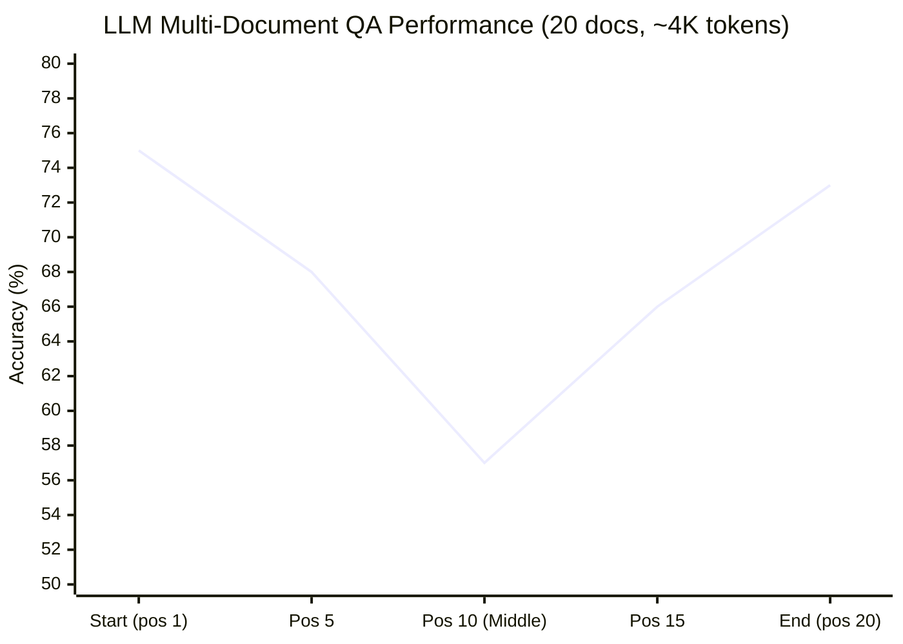

<!--
Paper Lens 文章
主題: Contextual Normalization for RAG
種子論文: Grounding Long-Context Reasoning with Contextual Normalization for RAG (arXiv 2510.13191)
Dependency: Lost in the Middle: How Language Models Use Long Contexts (arXiv 2307.03172)
撰寫語言: 繁體中文
-->

# C-NORM: Contextual Normalization for RAG 解讀

> **種子論文**: [Grounding Long-Context Reasoning with Contextual Normalization for Retrieval-Augmented Generation](https://arxiv.org/abs/2510.13191) (2025-10)
> **作者**: Jiamin Chen, Yuchen Li, Xinyu Ma et al.
> **機構**: City University of Hong Kong & Baidu Inc.

---

## TL;DR

LLM 在 RAG 情境中處理長上下文時，除了已知的 lost-in-the-middle 位置偏差外，Chen et al. 發現一個更底層的問題：**context 的表面格式（delimiter、結構標記、表示方式）即使語義完全相同，也能讓模型表現產生戲劇性差異**。為此他們提出 Contextual Normalization (C-NORM)，一種無需訓練、模型不可知的輕量化策略，透過注意力分佈自動選擇最有效的 context 格式。實驗顯示 C-NORM 在多項 long-context RAG benchmark 上持續提升模型的穩健性與準確度，尤其在挑戰性的長上下文場景中效果顯著。

---

## 背景與動機

### RAG 的承諾與隱藏成本

Retrieval-Augmented Generation (RAG) 已成為讓 LLM 處理知識密集型任務的標準典範。標準 RAG pipeline 由三個核心元件組成：retriever（檢索器）從大規模語料庫中找出與查詢相關的文件，ranker（排序器）對檢索結果進行重排序，generator（生成器）將檢索文件與原始查詢拼接成 prompt 後餵給 LLM 生成答案。

這個架構在理論上非常優雅：LLM 不需要記住所有知識（減少模型容量需求），知識可以動態更新（只需更新檢索庫），且每步決策都是可追溯的。這些特性讓 RAG 成為比單純增大模型參數更務實的選擇，也解釋了為什麼從學術界到工業界都廣泛採用 RAG。

然而，實作一個高品質的 RAG 系統遠比看起來複雜。從 retriever 的訓練策略（dense vs sparse）、chunking 策略（固定長度 vs 語義分割）、到 generator 的 prompt 設計，每個環節都有大量的設計選擇。這些選擇過去被視為工程細節，很少有人系統性地研究它們對最終表現的影響。

隨著長上下文 LLM 的蓬勃發展（從 GPT-3.5 的 4K tokens 到 GPT-4-128K、Claude-100K、Gemini-1M），RAG 系統得以同時考慮更多檢索結果。理論上，更多的上下文應該意味著更好的回答品質——畢竟 LLM 有了更多證據可以參考。然而，實務上的經驗告訴我們事情沒這麼簡單。

單純增加 context 長度非但不保證效果提升，反而可能引入三大問題：

1. **檢索雜訊放大（Retrieval Noise Amplification）** — 文件越多，不相關的干擾資訊也越多。Retriever 的 top-k 命中率不會隨 k 增加而線性提升，超過某個閾值後，新增的文件幾乎都是雜訊。LLM 需要從大量噪音中篩選出真正相關的證據，這個篩選過程本身就會消耗有限的注意力資源。

2. **資訊稀釋（Information Dilution）** — 即使所有文件都相關，相關證據散落在大量內容中時，信號會被稀釋。Liu et al. 的研究顯示，當 30 份文件中只有 1 份包含答案時，模型在 worst-case 下的表現還不如不給任何文件。這意味著提供更多文件的邊際效益可能為負。

3. **位置偏差（Positional Bias）** — LLM 傾向於過度關注 prompt 的開頭（primacy bias）和結尾（recency bias），中間位置的資訊容易被忽略。這不是某個特定模型的問題，而是 Transformer 架構的普遍現象，從 GPT-3.5 到 Claude-1.3 到 MPT-30B 都觀察到同樣的模式。

### Lost-in-the-Middle 現象

Liu et al. (2023) 在 **"Lost in the Middle: How Language Models Use Long Contexts"** 中首次系統性地揭露了位置偏差問題。這篇論文發表於 2023 年 7 月（arXiv v1），正值 LLM context window 快速擴張的時期——GPT-3.5 的 4K、GPT-4 的 8K、Claude-100K——但幾乎沒有人系統性地檢驗長上下文 LLM 是否真的會使用這些上下文。Liu et al. 的工作填補了這個空白，成為長上下文 LLM 研究的里程碑，被後續百餘篇論文引用。它的核心貢獻在於建立了嚴謹的受控實驗框架來測量 LLM 的上下文利用能力。

**為什麼這個問題重要？** 如果 LLM 無法有效利用長上下文，那麼以下場景都會受到影響：
- **RAG 系統**：檢索到大量文件但模型只用了開頭和結尾的幾份
- **對話歷史**：幾十輪的對話中，只有最近的幾輪被有效利用
- **長文件分析**：法律或學術文件的關鍵資訊若在中間段落，可能被忽略

**實驗一：多文件問答 (Multi-Document QA)**

作者從 NaturalQuestions-Open 中取樣 2655 個問題。對每個問題，他們準備了 k 份文件（k = 10、20、30），其中只有一份包含答案，其餘 k - 1 份是透過 Contriever 檢索器取得的最相關但不包含答案的干擾文件。關鍵的控制變因是：他們系統性地變換相關文件在 prompt 中的位置（從位置 1 到位置 k），觀察模型表現的變化。

結果令人震驚：**所有評估的模型都呈現明顯的 U 形表現曲線**。相關文件在開頭或結尾時表現最佳，在中間位置時急遽下降。以 GPT-3.5-Turbo 為例：

- 相關文件在位置 1（開頭）: 約 75% 準確率
- 相關文件在位置 10–11（中間）: 約 55–57% 準確率
- 相關文件在位置 20（結尾）: 約 72% 準確率

注意中間位置的 55% 甚至低於 closed-book 設定（不給任何文件）的 56.1%。換句話說，**提供 20 份文件但把相關文件放在中間，比不提供任何文件還糟糕**——模型不僅沒從文件中受益，反而被干擾資訊混淆了。

**實驗二：Key-Value Retrieval 任務**

為了確認這個現象不是語義理解能力不足造成的，Liu et al. 設計了一個純粹的合成任務。給定一個 JSON 格式的 key-value 物件（所有 key 和 value 都是隨機產生的 128-bit UUID），要求模型返回指定 key 對應的 value。這個任務排除了所有語義干擾——模型只能仰賴 exact match 能力來檢索。

結果再次驗證 U 形曲線。但有一個有趣的例外：**Claude-1.3 和 Claude-1.3-100K 在所有設定下都接近完美表現**，而其他模型（GPT-3.5-Turbo、MPT-30B-Instruct、LongChat-13B）在 140 和 300 對 key-value 設定下仍呈現明顯的 U 形曲線。以 GPT-3.5-Turbo 為例，在 300 對 key-value 的設定下，worst-case 表現僅 45.6%。這說明對於某些模型而言，純粹的檢索任務本身就是有挑戰性的，而不只是推理能力的問題。

### Liu et al. 的延伸分析

Liu et al. 沒有停留在現象描述，而是進一步探討了造成 U 形曲線的潛在因素：

**模型架構的影響**：Encoder-decoder 模型（Flan-UL2、Flan-T5-XXL）在訓練時序列長度範圍內對位置變化的穩健性遠高於 decoder-only 模型。Flan-UL2 在 2048 tokens 以內的最佳與最差位置差距僅 1.9%（從 69.5% 到 71.4%）。但一旦超出訓練時的序列長度（超過 2048 tokens），encoder-decoder 模型也開始出現 U 形曲線。這暗示雙向編碼器讓模型能在處理各文件時同時看到前後文資訊，從而更好地評估每份文件的相關性。然而這個優勢只在訓練時見過的序列長度內成立——超出後就無法外推。

**Query-Aware Contextualization**：標準的 RAG prompt 結構是「文件 → query」（先給文件再問問題）。Liu et al. 嘗試了另一種結構：「query → 文件 → query」，讓模型在讀文件時就知道要關注什麼。這個看似微小的改變在 key-value retrieval 任務上產生了驚人的效果——所有模型在 300 對 key-value 設定下都達到接近 100% 的準確率。然而，這個策略對多文件 QA 的影響微乎其微，僅略微提升了相關資訊在開頭時的表現。這個反差說明了重要的區分：**retrieval 能力（找到相關資訊）與推理能力（用相關資訊回答問題）是兩種不同的能力**。Query-aware contextualization 幫助模型定位相關資訊，但無法幫助模型在定位後進行有效的推理。

**Instruction Fine-Tuning 的作用**：Liu et al. 比較了 MPT-30B（base model）與 MPT-30B-Instruct。結果出乎意料——兩者都呈現 U 形曲線，但 instruction fine-tuning 略微縮小了最佳與最差表現的差距（從約 10% 縮小到約 4%）。這表示位置偏差並非 instruction fine-tuning 引入的 artifacts，而是模型在預訓練階段就習得的格局，instruction fine-tuning 只能部分緩解。

此外，Liu et al. 對 Llama-2 各尺寸（7B、13B、70B）的分析揭露了**規模效應**：7B 模型僅呈現 recency bias（只對結尾敏感），而 13B 和 70B 模型呈現完整的 U 形曲線。這暗示 U 形曲線是「足夠大的模型」才會出現的現象——小模型連記住開頭資訊的能力都不足，只對最近看到的 token 有反應。

### Liu et al. 未解答的問題

Lost in the Middle 為長上下文 RAG 奠定了重要的診斷框架，但也留下了幾個關鍵缺口：

1. **只診斷，未治療** — 論文系統性地揭露了問題的存在和度量方式，但沒有提出任何實用的解決方案。就像一個醫生能準確診斷疾病但開不出藥方。

2. **僅關注位置，忽略格式** — 所有實驗都在固定的 context 格式下進行（標準 UUID 格式、標準段落分隔）。論文改變了位置和上下文長度，卻沒有探索 context 格式本身是否也是一個影響變數。

3. **合成任務的真實性差距** — 使用隨機 UUID 作為 key-value 固然能乾淨地測量 retrieval 能力，但偏離了真實 RAG 場景的複雜性。真實文件中有語義、有結構、有上下文，這些因素可能與位置交互影響。

### 為什麼這個問題過去被忽略？

回顧文獻，context format 的影響之所以長期被忽略，我認為有三個原因：

1. **人類閱讀的投射謬誤**：人類閱讀時對格式變化的容忍度很高——無論是用逗號、分號還是空白分隔清單，我們都能理解。這種經驗被不自覺地投射到 LLM 上，假設「模型也應該一樣」。

2. **注意力集中在更大的問題上**：在 RAG 研究中，retrieval quality（檢索品質）的影響遠大於 format——如果 retriever 根本沒檢索到相關文件，context 格式再好也沒用。因此研究社群自然優先關注 retrieval、reranking、query rewriting 等問題。Format 被視為末端細節。

3. **缺少合適的實驗平台**：傳統的 RAG benchmark（如 NQ、TriviaQA、HotpotQA）使用真實文件，文件之間在語義、長度、結構上都有差異。在這種設定下，格式的效果與語義效果糾纏在一起，很難分離。Liu et al. 的 key-value extraction 任務使用隨機 UUID 排除語義干擾，才讓格式效果浮現出來。

### Chen et al. 的新視角：Context Format 的影響

Chen et al. (2025) 從 Liu et al. 的 key-value extraction 任務出發，無意間發現了一個被整個領域忽略的變因。

他們的實驗設計很簡單：在 Liu et al. 的 key-value extraction 框架下，除了變換位置外，還改變了 key-value 對的表面格式。具體來說，他們比較了三種格式：(1) 標準 UUID（如 `74bc8a2d-3a44-...`），(2) Plain Text（連續字串，無分隔符號），(3) Modified UUID（將 `-` 改為 `&`）。

結果讓人大吃一驚：**即使語義內容和輸入長度完全相同，僅改變分隔符號就能讓 LLaMA-2-7B-Chat 的 OAA 從 0.810 暴跌至 0.102**。在最極端的案例中，模型甚至拒絕回答。

這個發現將討論從「資訊在哪個位置」延伸到「資訊如何被呈現」，開啟了一個全新的研究方向。如果「長什麼樣子」和「在哪個位置」一樣重要，那麼 RAG 系統的優化空間可能比我們想像的大得多。

### 兩篇論文的研究問題對照

在深入方法細節之前，有必要先釐清這兩篇論文的定位差異。Lost in the Middle 屬於「診斷型研究」——它的目標是揭露問題的存在、測量其嚴重程度、分析其影響因子。C-NORM 則屬於「處方型研究」——它在診斷的基礎上提出解決方案。兩者的關係類似於病理學家（指出疾病機制）與治療師（提供治療方案）的協作。

為了幫助理解兩篇論文之間的關係，以下做一個簡要對照：

| 維度 | Lost in the Middle (Liu et al., 2023) | C-NORM (Chen et al., 2025) |
|------|---------------------------------------|---------------------------|
| 核心問題 | LLM 是否會隨相關資訊位置而表現不同？ | Context 格式是否會影響 LLM 表現？ |
| 控制變因 | 相關資訊的位置、上下文長度 | 相關資訊的位置 + context 格式 |
| 主要發現 | U 形表現曲線（primacy + recency bias） | 格式差異可導致 0.810→0.102 的劇變 |
| 解決方案 | 無（診斷性研究） | C-NORM（自動格式選擇） |
| 核心貢獻 | 建立評估框架 | 提供實用治療方案 + 機制解釋 |

這個對照表也說明了我選擇 Lost in the Middle 作為 dependency paper 的原因：C-NORM 的整個故事始於 Liu et al. 的診斷，然後 Chen et al. 發現了一個新的變因，再基於這個發現設計了治療方案。沒有前者，後者的動機和實驗設計都不完整。

---

## 核心知識點

本文圍繞以下知識點展開，涵蓋從問題診斷到方案提出的完整脈絡：

1. **Lost-in-the-Middle 現象** — LLM 在長上下文中位置偏差的本質、測量方式與模型規模效應
2. **Context Format Sensitivity** — 表面格式差異如何戲劇性地影響 LLM 表現，以及這個發現為何重要
3. **Tokenization 機制** — 不同 tokenizer（SentencePiece vs BPE）對分隔符號的處理如何部分解釋格式敏感性
4. **Attention Balance 機制** — 注意力分佈的均衡度如何決定格式的有效性，以及 ABS 的數學定義
5. **C-NORM 架構設計** — 候選格式生成、Attention Balance Score 計算、自動格式選擇三階段流程
6. **模型特定的格式偏好** — 不同 LLM 對分隔符號的偏好為何不同、自動選擇相較於人工選擇的優勢、ABS 的穩定性分析

---

## 方法詳解

### 知識點 1: Lost-in-the-Middle 現象

**這個知識點要回答什麼問題？**

為什麼 LLM 在長上下文中的表現會隨相關資訊的位置而大幅波動？這個現象有多普遍、有多嚴重？

**Liu et al. (2023) 的實驗發現**

Lost in the Middle 的核心貢獻是透過系統性的受控實驗，建立了 LLM 長上下文表現的基本定律：

1. **U 形曲線是普遍現象**，在多種模型（GPT-3.5-Turbo、Claude-1.3、MPT-30B-Instruct、LongChat-13B）、兩種任務（多文件 QA 和 key-value retrieval）、多種上下文長度（2K 到 16K tokens）下都穩定出現。

2. **擴展上下文視窗不等於更好的上下文利用**。GPT-3.5-Turbo（4K）和 GPT-3.5-Turbo-16K 在 10 和 20 文件設定下的表現幾乎完全重疊。Claude-1.3（8K）和 Claude-1.3-100K 也呈現同樣的模式。這意味著「能接收更多 tokens」和「能有效利用更多 tokens」是兩回事。

3. **最差位置表現可以低於無上下文（closed-book）設定**。當 20 份文件中只有 1 份包含答案，且該文件位於 prompt 中間時，GPT-3.5-Turbo 的表現（約 55%）低於完全不給文件的 closed-book 表現（56.1%）。

4. **U 形曲線的出現與模型規模相關**：Llama-2-7B 只表現出 recency bias（僅對結尾敏感），但 13B 和 70B 呈現完整的 U 形曲線。這是一個違反直覺的發現——更大的模型不一定更會用長上下文，反而可能因為注意力機制更強而產生更極端的偏差。



> 圖 1：Lost-in-the-Middle 現象示意圖。LLM 在相關資訊位於 prompt 開頭或結尾時表現最高，中間位置急遽下降，形成典型的 U 形曲線。

**影響因子分析**

Liu et al. 進一步發現影響 U 形曲線深度的三個調節因子：

- **Encoder-decoder 架構**：在訓練時序列長度內提供顯著的穩健性（最佳與最差差距僅 1.9%），但超出後仍出現 U 形曲線
- **Query-aware contextualization**：在純 retrieval 任務上提供巨大幫助（從 45.6% 到接近 100%），但在需要推理的 QA 任務上幫助有限
- **Instruction fine-tuning**：略微縮小最佳與最差表現的差距（從 10% 到 4%），但不足以消除 U 形曲線

**Chen et al. 如何處理這個知識點**

Chen et al. 接受 lost-in-the-middle 為基本事實，不挑戰這個現象本身。他們的貢獻在於證明：**context 格式是一個可以調節 U 形曲線深度的新變數**。在某些格式下（如 Plain Text for Qwen），U 形曲線的深度會顯著減小。

---

### 知識點 2: Context Format Sensitivity

**這個知識點要回答什麼問題？**

Context 的語義內容完全相同時，僅僅改變表面格式是否能影響 LLM 表現？影響幅度有多大？

**Chen et al. 的設計**

Chen et al. 以 key-value extraction 為實驗平台，因為這個任務完全排除了語義干擾。他們設計了三種 context 格式：

1. **UUID** — 標準 UUID，32 位十六進位數以連字號 `-` 分隔五組（如 `74bc8a2d-3a44-41d4-a716-446655440000`）
2. **Plain Text** — 移除所有結構化標識符，壓平成連續的 32 字元字串（如 `74bc8a2d3a4441d4a716446655440000`）
3. **Modified UUID** — 保留結構，但將分隔符號從 `-` 替換為其他符號（如 `&`）

實驗在受控設定下進行：500 個樣本，兩種密度設定（low: 40 對 x 32 字元、high: 10 對 x 128 字元），並變換目標 key 的位置。

**核心結果**

論文中最令人震驚的發現來自 LLaMA-2-7B-Chat：

| 格式 | OAA（Low Density） | 備註 |
|------|:-----------------:|------|
| UUID | 0.810 | 標準格式 |
| Mod-UUID (`-` → `&`) | **0.102** | 驟降 87.4% |
| Modified UUID (`:` → `,`) | 0.960 | 反而提升 |
| Modified UUID (`+` → `&`) | 0.976 | 最佳表現 |

僅僅更換一個分隔符號（從 `-` 到 `&`）就能讓模型幾乎無法作答。而在其他分隔符號下（如 `,`、`+`），表現反而優於標準 UUID。

這個結果強烈反駁了一個常見假設：**LLM 對輸入的格式變化是魯棒的**。事實恰恰相反——LLM 對格式變化的敏感度遠超出大多數人的預期。

更深入的分析顯示：

- **LLaMA-2-7B**（非 chat 版本）：在所有密度設定下一致偏好 Plain Text，UUID 表現較差
- **LLaMA-2-7B-Chat**：偏好隨密度改變，low density 下 UUID 較好，high density 下 Plain Text 較好
- **Qwen2.5-1.5B**：表現最為複雜，low density 偏好 UUID，high density 轉為偏好 Plain Text（OAA 從 0.854 提升至 0.949）
- **Qwen2.5-1.5B-Instruct**：一致偏好 Plain Text


> 圖 2：不同 LLM 的格式偏好與 delimeter 敏感性比較。各模型偏好的格式和分隔符號不同，且同模型在不同密度設定下偏好也可能改變。

**與 Lost in the Middle 的關聯**

Liu et al. 在 key-value extraction 任務中使用統一的 UUID 格式。他們的實驗設計假設了格式是中性因素。Chen et al. 的結果表明這個假設不成立——如果 Liu et al. 使用了不同的格式，他們觀察到的 U 形曲線的形狀和幅度可能會不同。

這不是否定 Liu et al. 的發現（U 形曲線是真實且普遍存在的），而是補充了一個重要的調節變數。更精確的說法是：**U 形曲線的存在是普遍的，但其幅度受 context 格式調節**。

---

### 知識點 3: Tokenization 機制

**這個知識點要回答什麼問題？**

格式敏感性背後的底層機制是什麼？Tokenization（分詞）扮演了什麼角色？

**Tokenization 對 token 數量的影響**

Chen et al. 首先從最直觀的角度切入：不同的分隔符號被 tokenizer 轉換成不同數量的 token。

對於使用 **SentencePiece tokenizer** 的 Qwen2.5，不同分隔符號對 token 數的影響很顯著：

- 分隔符號 `&`（and 符號）: ~33 tokens → 最長序列
- 分隔符號 `/`（斜線）: ~32.7 tokens
- 分隔符號 `+`（加號）: ~32.4 tokens
- 分隔符號 `,`（逗號）: ~32.0 tokens
- 分隔符號 `-`（連字號）: ~31.5 tokens → 最短序列
- 分隔符號 `.`（句點）: ~31.6 tokens
- 分隔符號 `:`（冒號）: ~31.75 tokens

這個順序與模型表現存在清晰的相關性。Pearson 相關係數 r = -0.82，屬於強負相關。也就是說，**token 序列越短，模型表現越好**。

為什麼 token 數量會影響表現？直觀的解釋是：在固定的 context window 中，更 compact 的 token 序列意味著每份文件佔用更少的 token，文件的資訊密度更高，模型能更有效地分配注意力。反之，冗長的 token 序列稀釋了有用資訊，使模型難以聚焦。

然而，如果 tokenization 是唯一的解釋，那麼對於那些 token 數不因分隔符號而變化的模型，格式敏感性應該消失。事實並非如此。

**BPE Tokenizer 的特殊情況**

對於使用 **BPE（Byte-Pair Encoding）tokenizer** 的 LLaMA-2 系列，多數常見分隔符號（`-`、`,`、`/`、`+`）都被 tokenize 為單一 token。因此，無論使用哪個分隔符號，總 token 數完全相同。

但在這種情況下，LLaMA-2 的表現依然隨分隔符號變化——Plain Text 優於 UUID，且 Modified UUID 中的 `&` 會導致災難性的表現下降。既然 token 數不是原因，那必定還有其他機制在運作。

**小結**

Tokenization 是格式敏感性的**部分解釋**，不是完整解釋：

- 對 SentencePiece tokenizer：格式透過 token 數量影響表現（約可解釋 67% 的變異，r² ≈ 0.67）
- 對 BPE tokenizer：token 數不變但表現仍變，說明有其他機制
- 兩種 tokenizer 都觀察到格式效果，說明 tokenization 是調節因子而非根本原因

---

### 知識點 4: Attention Balance 機制

**這個知識點要回答什麼問題？**

除了 tokenization 外，格式敏感性的更深層機制是什麼？如何從 LLM 的內部表徵理解這個現象？

**Chen et al. 的注意力分析**

Chen et al. 從 LLM 的內部 attention 分佈尋找答案。他們在 low-density 設定下提取 LLaMA-2-7B 和 Qwen2.5-1.5B 最後一層的 attention weights，分析從最終 token 到前面所有 token 的注意力分配。

結果揭示了有趣的**交互作用**：

- **Qwen2.5-1.5B**: Plain Text 格式產生尖銳的 attention peaks 集中在序列的開頭和結尾（典型 primacy + recency bias），而 UUID 格式產生更均勻的 attention 分佈，對中間位置的覆蓋更好。這解釋了為什麼 Qwen 在 low density 下偏好 UUID——UUID 幫助模型將注意力更均勻地分配在整個序列上，避免了 lost-in-the-middle 效應。

- **LLaMA-2-7B**: 情況正好相反——UUID 讓 attention 集中在序列邊界，Plain Text 反而讓中間位置獲得更多覆蓋。這與 LLaMA-2 偏好 Plain Text 的實驗結果一致。

更令人驚訝的是，即使相關文件位於序列開頭，不同格式下的 attention 分佈也存在巨大差異。這說明格式不僅影響模型**能否找到**相關資訊，還影響模型**如何分配有限的注意力資源**。

**訓練資料的影響（未解之謎）**

Chen et al. 嘗試用 token frequency（token 在訓練資料中的出現頻率）來解釋 attention 模式的差異。他們用 Stanford Alpaca-7B 進行了一個精巧的實驗：將 fine-tuning 語料中的 token 按出現頻率排序，然後讓模型用「最高頻 token」或「最低頻 token」改寫 context，觀察 attention 分佈的變化。

結果顯示：無論使用高頻還是低頻 token，attention 分佈的模式並未發生實質變化。這表示格式敏感性的來源比單純的統計頻率更複雜——可能與 tokenizer 的內部表徵、預訓練資料中特定模式的統計規律、以及模型在訓練過程中習得的「格式如何影響注意力」的隱含知識有關。

**Attention Balance Score (ABS) 的數學定義**

基於上述觀察，Chen et al. 提出了一個量化 attention 平衡程度的指標。

給定最後一層最終 token 的 attention 向量 $\mathbf{a} \in \mathbb{R}^T$（$T$ 為序列長度），定義 attention 重心位置 $\mu$：

$$
\mu = \frac{\sum_{t=1}^{T-1} t \cdot a_t}{(T-1) \sum_{j=1}^{T-1} a_j}
$$

這裡 $\mu$ 介於 [0, 1] 之間。$\mu = 0$ 表示所有 attention 集中在第一個 token（極端 primacy bias），$\mu = 1$ 表示所有 attention 集中在最後一個 token（極端 recency bias），$\mu = 0.5$ 表示 attention 沿序列均勻分佈。

Attention Balance Score 的定義為：

$$
\text{ABS}(\mathbf{a}) = 1 - 2|\mu - 0.5|
$$

當 $\mu = 0.5$（完全平衡）時，$\text{ABS} = 1$。當 $\mu = 0$ 或 $\mu = 1$（極端偏差）時，$\text{ABS} = 0$。中間值線性插值。

**為什麼 ABS 對稱於 0.5？** 因為 primacy bias 和 recency bias 是不對稱但同等有害的。LLM 在相關資訊位於開頭或結尾時都能表現良好（兩端對稱），但中間位置表現差。因此 ABS 懲罰的是 attention 偏離中間位置的程度，而不懲罰偏離的方向。

---

### 知識點 5: C-NORM 架構設計

**這個知識點要回答什麼問題？**

如何將上述的機制理解轉化為一個實用的、無需訓練的 context 優化方法？

**C-NORM (Contextual Normalization) 三階段流程**

C-NORM 是一個模型感知（model-aware）但無需訓練的 plug-and-play 框架：

**階段 1: 候選格式生成（Candidate Formatting）**

給定查詢 $q$ 和一組檢索文件 $D = \{d_1, \ldots, d_m\}$，C-NORM 對每份文件 $d_i$ 進行 sentence-level 的格式重構。具體演算法：

1. 將文件 $d_i$ 分割為句子 $s_1, s_2, \ldots, s_n$
2. 對每個句子 $s_j$，以機率 $p$（論文預設 0.5）決定是否修改
3. 對要修改的句子，將其中的空白字元替換為候選分隔符號 $f$
4. 產生格式變體 $\tilde{d}_i^{(f,p)}$
5. 將所有 $\tilde{d}_i^{(f,p)}$ 拼接成完整 context

候選分隔符號集合 $F = \{\text{none}, -, :, ., ,, +, /, \&, \ldots\}$。參數 $p$ 控制干預強度：
- $p = 0$：完全不修改（等於原始格式）
- $p = 1$：所有句子都套用分隔符號
- $p = 0.5$：約一半的句子被修改

**階段 2: 注意力引導評分（Attention-Guided Scoring）**

對於每個候選格式 $f \in F$：

1. 從查詢集合 $Q$ 中隨機取樣一個子集 $S$（$|S| \ll |Q|$，論文使用 |S| = 8）
2. 對每個樣本 $s \in S$，執行一次 forward pass，提取最後一層最終 token 的 attention 向量 $\mathbf{a}^{(s)}(f)$
3. 計算每個樣本的 ABS：
   $$
   \text{ABS}_s = 1 - 2\left|\frac{\sum_{t=1}^{T-1} t \cdot a_t^{(s)}(f)}{(T-1) \sum_{j=1}^{T-1} a_j^{(s)}(f)} - 0.5\right|
   $$
4. 計算平均 ABS：
   $$
   \text{ABS}_{\text{avg}}(f) = \frac{1}{|S|} \sum_{s=1}^{|S|} \text{ABS}(\mathbf{a}^{(s)}(f))
   $$

最終選擇：
   $$
   f^* = \arg\max_{f \in F} \text{ABS}_{\text{avg}}(f)
   $$

**階段 3: 應用所選格式（Format Application）**

將 $f^*$ 套用至所有檢索文件 $d_1, \ldots, d_m$：

1. 對每份文件 $d_i$，使用分隔符號 $f^*$ 和比例 $p$ 重新格式化
2. 將格式化後的文件拼接成標準化的 prompt
3. 送入 LLM 進行生成

```mermaid
flowchart LR
    A[檢索文件<br/>D = {d₁, ..., dₘ}] --> B[候選格式生成<br/>用分隔符號 f 產生變體]
    B --> C{注意力引導評分<br/>取樣 S⊂Q, forward pass}
    C --> D[格式 f₁: ABS₁]
    C --> E[格式 f₂: ABS₂]
    C --> F[格式 fₙ: ABSₙ]
    D --> G[選擇 f* = argmax ABS]
    E --> G
    F --> G
    G --> H[套用 f* 至所有 context]
    H --> I[LLM 生成答案]

    style A fill:#a5d8ff,stroke:#1e1e1e
    style B fill:#d0bfff,stroke:#1e1e1e
    style C fill:#fff3bf,stroke:#1e1e1e
    style D fill:#b2f2bb,stroke:#1e1e1e
    style E fill:#b2f2bb,stroke:#1e1e1e
    style F fill:#b2f2bb,stroke:#1e1e1e
    style G fill:#ffc9c9,stroke:#1e1e1e
    style H fill:#c3fae8,stroke:#1e1e1e
    style I fill:#a5d8ff,stroke:#1e1e1e
```

> 圖 3：C-NORM 三階段流程圖。從檢索文件出發，依序經過候選格式生成 → 注意力引導評分（ABS 最大化）→ 最佳格式套用，最終送入 LLM 進行生成。

**C-NORM 的實用特性**

C-NORM 的設計特別注重實用性：

- **無需訓練** — 不需要任何額外的模型訓練、fine-tuning 或參數更新。這對於無法修改模型的 API-only 場景特別重要。
- **模型感知（Model-Aware）** — 透過 attention 信號「感知」模型的內部處理偏好。與 blind grid search 不同，C-NORM 利用模型自身的表徵來引導搜索。
- **計算效率高** — 僅需少量樣本（論文顯示 1–10 個樣本即足夠穩定）。每個樣本只需一次 forward pass，沒有 backward pass 或梯度計算。對於 $|F|$ 個候選格式和 $|S|$ 個樣本，總 forward passes 為 $|F| \times |S|$。以 $|F| = 10$ 和 $|S| = 8$ 為例，總共只需 80 次 forward passes，在現代 GPU 上可在數秒內完成。
- **Plug-and-Play** — 可無縫整合到現有 RAG pipeline 的 generator 階段，無需修改 retriever 或模型架構。
- **可擴展** — 候選格式集可隨需求擴展。如果未來發現對某個新分隔符號的偏好，只需將其加入 $F$ 即可。

---

### 知識點 6: 模型特定的格式偏好與 ABS 的優越性

**這個知識點要回答什麼問題？**

為什麼不同的 LLM 偏好不同的格式？為什麼自動選擇比人工選擇更可靠？

**模型間的系統性差異**

Chen et al. 的消融實驗揭露了鮮明的模型特定偏好：

| 模型 | 最優分隔符號 | 最差分隔符號 | 偏好格式 |
|------|:----------:|:----------:|:--------:|
| LLaMA-2-7B | `.` (句點) | `&` (and) | Plain Text |
| LLaMA-2-7B-Chat | `:` (冒號) | `&` (and) | UUID → Plain (依密度) |
| Qwen2.5-1.5B | `-` (連字號) | `&` (and) | UUID (low) / Text (high) |
| Qwen2.5-1.5B-Instruct | `&` (and) | 因模型而異 | Plain Text |

三個模式值得注意：

1. **`&`（and 符號）是所有模型中最差的分隔符號之一**。對 LLaMA-2-7B-Chat 來說甚至是災難性的（OAA 從 0.810 降至 0.102）。這可能與 `&` 在 tokenizer 中的編碼方式有關——它通常被 tokenize 為單一 token，但在 SentencePiece 中會觸發更長的編碼。

2. **同一模型的不同版本（base vs chat/instruct）偏好不同**。LLaMA-2-7B 偏好 `.`，但 LLaMA-2-7B-Chat 偏好 `:`。Qwen2.5-1.5B 偏好 `-`，但 Qwen2.5-1.5B-Instruct 偏好 `&`。這表示 instruction fine-tuning 不僅改變了模型的行為，還改變了模型對輸入格式的敏感度模式。

3. **偏好是上下文相依的**。即使同一模型，在 low density 和 high density 設定下的最優分隔符號也可能不同。Qwen2.5-1.5B 是最典型的例子——low density 下 UUID 優於 Plain Text，high density 下完全相反。

**為什麼不能靠人工選擇**

上述三點共同指向一個結論：**人工選擇 context 格式在實務上不可行**。

原因有三：(1) 你不知道目標模型偏好哪個分隔符號（預測的準確率極低）；(2) 即使你知道了目標模型的偏好，這個偏好在不同任務/設定下可能會改變；(3) 最佳的格式往往違反人類直覺——人類覺得容易閱讀的格式（如空白分隔的 Plain Text）對 LLM 來說未必最佳。

這就是 ABS 自動選擇的核心價值：它不需要任何先驗知識，只需一次 forward pass 就能推斷出對特定模型和 context 設定而言的最佳格式。

**ABS 的穩定性分析**

Chen et al. 進行了一個實用的穩定性分析：改變選擇分隔符號時使用的樣本數量（從 1 到 10），觀察 (1) 所選的分隔符號是否穩定，(2) 最終表現是否穩定。

結果顯示：
- **使用 1 個樣本與使用 10 個樣本的最終表現幾乎相同**
- 所選的分隔符號在樣本量變化時也保持穩定
- 這意味著 ABS 對樣本量的敏感性極低

更深入的分析發現，當格式比例 $p$ 變化時，最佳分隔符號可能會改變，這印證了「最佳格式是上下文相關的」這一論點。然而，在固定的 $p$ 下，ABS 的選擇是穩定的。

**計算成本量化**

以一個典型的 RAG 場景為例：假設 $|F| = 10$（10 個候選分隔符號）、$|S| = 8$（8 個樣本）、每個 context 長度約 4K tokens、模型為 7B 參數。總 forward passes 為 80 次。在 A100 GPU 上，每次 forward pass 約需 0.1–0.2 秒，總時間約 8–16 秒。如果使用 1 個樣本（論文中已證明足夠），則只需 10 次 forward passes，約 1–2 秒。

這個計算成本遠低於 fine-tuning、prompt optimization 或其他需要多次迭代的方法。

---

## 實驗結果

### 主要實驗一：受控 Long-Context RAG (NQ-Open)

**實驗設定**

論文使用 NQ-Open 資料集進行受控實驗。流程如下：
1. 從 NQ-Open 隨機取樣 500 個問題
2. 對每個問題，識別一份「黃金文件」（包含答案）
3. 檢索 9 份與問題相關但不含答案的干擾文件（使用 Contriever）
4. 總共 10 份文件，每份約 100–300 tokens
5. 將黃金文件放在所有 10 個可能的位置，其餘干擾文件隨機排列
6. 對每個位置設定，生成 3 組不同的干擾文件排列（3 個 random seeds）

評估指標：
- **Overall Averaged Accuracy (OAA)**：所有 10 個位置 × 3 個 random seeds 的準確率平均值，反映對位置變化的總體穩健性
- **Optimal Positioned Accuracy (OPA)**：所有 random seeds 中最佳位置的準確率，反映模型在理想條件下的長上下文推理能力

**主要結果**

| 模型 | OAA (Baseline) | OAA (C-NORM) | 絕對提升 | OPA (Baseline) | OPA (C-NORM) | 絕對提升 |
|------|:-------------:|:------------:|:--------:|:--------------:|:------------:|:--------:|
| LLaMA-2-7B | 36.5% | **63.9%** | +27.4% | 68.2% | **84.4%** | +16.2% |
| LLaMA-2-7B-Chat | 30.5% | **42.2%** | +11.7% | 47.2% | **61.4%** | +14.2% |
| Qwen2.5-1.5B | 55.7% | **60.5%** | +4.8% | 62.6% | **64.6%** | +2.0% |
| Qwen2.5-1.5B-Instruct | 45.1% | **57.4%** | +12.3% | 70.6% | **76.7%** | +6.1% |

**關鍵觀察與深度解讀**

1. **C-NORM 在所有模型上一致提升 OAA 和 OPA**，沒有任何一個模型的表現下降。這在 AI 研究中並不多見——大部分方法在平均表現提升的同時都會在某些子集上有所犧牲。

2. **小模型獲益最大**。LLaMA-2-7B（4K context window、7B 參數）的 OAA 從 36.5% 提升到 63.9%，+27.4% 的絕對提升意味著相對提升高達 75%。這強烈暗示：**格式優化可以部分補償模型推理能力的不足**。對於無法升級到更大模型的場景，C-NORM 提供了一條「免費」提升表現的途徑。

3. **OAA 提升幅度遠大於 OPA**。例如 LLaMA-2-7B 的 OAA 提升 +27.4%，但 OPA 提升僅 +16.2%。這與 ABS 的設計目標一致：C-NORM 主要是提升**穩健性**（確保模型在各種位置下都能表現良好），而非提升**峰值能力**（模型在最佳條件下本來就表現不錯）。

4. **最有效的格式不是人類可讀的格式**。Chen et al. 特別強調，對人類來說最容易理解的格式（如空白分隔的 Plain Text）對模型來說不一定是最佳的。在某些案例中，分隔符號密集或結構上經過改編的格式反而表現更好。這說明了優化 context 格式應該以模型內部表徵為導向，而非以人類的閱讀體驗為導向。

5. **不同模型對 C-NORM 的受益程度呈現清晰模式**：基礎模型（如 LLaMA-2-7B）比 instruction-tuned 版本獲益更多，小模型比大模型獲益更多，context window 較小的模型比較大的模型獲益更多。

### 主要實驗二：真實 RAG 場景 (LongBench-v2)

**LongBench-v2 介紹**

LongBench-v2 (Bai et al., 2024) 是目前最具挑戰性的長上下文 benchmark 之一。它包含 503 個多選題，涵蓋六個類別：
- **單文件 QA**（Single-Doc QA）：在一份長文件中尋找答案
- **多文件 QA**（Multi-Doc QA）：跨越多份文件整合資訊
- **長上下文學習**（Long In-Context Learning）：從多個範例中學習模式
- **對話歷史理解**（Dialogue History）：從長對話中擷取資訊
- **程式碼庫理解**（Codebase Comprehension）：理解程式碼結構與註釋
- **結構化資料理解**（Structured Data）：處理表格、JSON 等結構化格式

每個問題搭配的上下文從 8K 到超過 2M tokens，絕大多數落在 128K 以下。

**實驗設定**

論文在兩種設定下評估：
- **Base**：提供完整的 ground-truth context（沒有檢索雜訊），測試 C-NORM 在最理想條件下的效果
- **RAG**：使用 top-4 檢索文件（含檢索雜訊），模擬真實的 open-domain QA

最大 prompt 長度限制為 4K tokens（受計算資源限制）。

**結果**（已選取關鍵指標）

| 設定 | LLaMA-2-7B-Chat | | Qwen2.5-1.5B-Instruct | |
|------|:-------------:|:------------:|:--------------:|:------------:|
| | Baseline | C-NORM | Baseline | C-NORM |
| **Base Overall** | 26.4 | **26.6** | 23.7 | **24.7** |
| **Base Hard** | 27.3 | **27.7** | 23.2 | **24.4** |
| **Base Long** | 29.6 | **32.4** | 18.5 | **19.4** |
| **RAG Overall** | 9.3 | **10.3** | 25.6 | **26.2** |
| **RAG Hard** | 12.2 | **13.5** | 25.1 | **26.4** |
| **RAG Long** | 10.2 | **12.0** | 24.1 | **25.0** |

**關鍵觀察與深度解讀**

1. **C-NORM 在所有 Hard 和 Long 子集上一致提升**，不受設定（Base vs RAG）或模型影響。這印證了 C-NORM 的核心論點：format 優化對挑戰性的長上下文場景特別有效。

2. **Easy 和 Short 子集基本持平**（差距 < 1%），表示 C-NORM 不會在簡單場景中引入不必要的雜訊。這是一個重要的安全性質——好的方法不應該在它不需要介入時造成傷害。

3. **LLaMA-2-7B-Chat 在 RAG 設定下 baseline 極低（9.3%）**。這反映了小模型在面對檢索雜訊時的脆弱性。C-NORM 將其提升到 10.3%（+10.7% 相對提升），雖然絕對數字仍然不高，但方向是一致的。

4. **Qwen2.5-1.5B-Instruct 的 Base vs RAG 表現反常**：Base（23.7%）反而低於 RAG（25.6%）。這是因為 4K token 的 prompt 上限較低，限制長度為 128K 的 Qwen 在 Base 設定下可能被截斷的關鍵資訊比 RAG 設定更多。這是一個實驗限制，不代表 Base 不如 RAG。

5. **與受控實驗的對比**：C-NORM 在受控實驗中的提升幅度（最高 +27.4%）遠大於 LongBench-v2（最高 +2.8%）。這有兩個可能的原因：(1) LongBench-v2 的格式本來就比較多樣化，C-NORM 的標準化效應被稀釋；(2) 4K token 的 prompt 上限限制了 C-NORM 的效果，特別是在需要長上下文的場景。

### 消融實驗與參數分析

**A. 分隔符號候選集的影響**

Chen et al. 系統性地改變了候選分隔符號的數量，觀察對 C-NORM 表現的影響：

- 使用更多候選分隔符號：一致提升表現。更大的 $F$ 集合增加找到最佳格式的機會
- 但即使只使用 3–5 個候選，C-NORM 也顯著優於 baseline（單一格式）
- 收益遞減：從 5 個擴充到 10 個的邊際效益很小

實務建議：使用 5–8 個常見分隔符號作為預設集合就足夠了。

**B. 樣本數量的影響**

改變選擇分隔符號時使用的樣本數量 $|S|$：
- $|S| = 1$：表現與 $|S| = 10$ 幾乎無差異
- 所選分隔符號在 $|S|$ 變化時保持穩定
- 原因：ABS 對樣本量的敏感性很低，同一模型在相同 context 設定下的 attention 模式高度一致

實務建議：$|S| = 1$ 就夠了（只需 1 次 forward pass）。

**C. 格式比例 $p$ 的影響**

參數 $p$ 控制被修改句子的比例：
- $p = 0$：完全不修改 → 等於 baseline
- $p \in [0.1, 0.5]$：表現逐步提升
- $p \in [0.5, 1.0]$：表現趨於穩定或略降

$p$ 的選擇與 context 的結構有關。對於結構化程度高的 context（如 JSON），較低的 $p$ 可能更好；對於非結構化的自然語言，較高的 $p$ 更有效。

**D. Attention 分佈的變化（機制驗證）**

Chen et al. 進一步驗證了 C-NORM 確實改變了 attention 分佈。在 C-NORM 下：
- 即使相關文件位於序列開頭，模型的中間位置 attention 也獲得顯著提升
- 整體 attention 分佈更均勻，primacy/recency bias 減輕
- 這個效果在 LLaMA-2-7B 上比 Qwen2.5-1.5B 上更明顯，與 OAA 的提升幅度一致

這印證了 ABS 的設計假設：選擇能產生更平衡 attention 的格式，最終導致更穩健的表現。

**E. 與相關方法的定性比較**

雖然 Chen et al. 沒有進行與其他方法的直接比較，但我們可以從原理層面評估 C-NORM 與相關方法的定位差異：

| 方法 | 是否需要訓練 | 是否需要模型修改 | 適用場景 | 主要限制 |
|------|:----------:|:--------------:|:--------:|:--------:|
| C-NORM | 不需要 | 不需要 | 任何 RAG pipeline | 需 access attention weights |
| Prompt Optimization (Liu et al., 2024b) | 不需要 | 不需要 | 任意 LLM | 需多次 LLM 呼叫 |
| Positional Encoding (Zhang et al., 2024) | 可能需少量訓練 | 需修改位置編碼 | 自部署模型 | 非 plug-and-play |
| Supervised Context Training (An et al., 2024) | 需要 | 需要 | 自訓練模型 | 資料製作成本高 |

C-NORM 在「無需訓練、無需修改模型」的維度上與 prompt optimization 最接近，但兩者的切入點不同：prompt optimization 選擇最佳的**內容排列**（文件順序），C-NORM 選擇最佳的**表現形式**（文件格式）。兩者理論上可疊加使用。

---

## 總結、限制與未來方向

### 核心貢獻總結

這篇論文從一個被忽略的角度切入長上下文 RAG 問題，提供了從發現、理解到解決方案的完整敘事：

**發現層次**：首次系統性地揭露 context format 對長上下文 RAG 的深遠影響。證明格式不僅是「表面問題」，而是一個可以被量化、預測和優化的關鍵變數。最令人震撼的證據：將 LLaMA-2-7B-Chat 的 UUID 分隔符號從 `-` 改為 `&`，準確率從 0.810 暴跌至 0.102。

**理解層次**：從 tokenization 和 attention allocation 兩個互補的機制解釋了格式敏感性的根源。Tokenization 解釋了部分變異（特別對 SentencePiece tokenizer），但 attention balance 提供了更普遍的理解框架——格式透過調節 LLM 的注意力分佈來影響表現。

**方法層次**：提出 C-NORM，一個實用、高效的 context 標準化方案。C-NORM 的設計特別注重計算效率和實用性——僅需 1 次 forward pass（使用 1 個樣本）即可決定最優格式，且無需任何訓練或架構修改。

### 限制

儘管 C-NORM 的實驗結果令人鼓舞，以下限制值得仔細審視：

1. **ABS 的代理性質**：ABS 僅依賴最後一層的 attention 信號，忽略了較早層的注意力模式。對於某些模型來說，最後一層的 attention 可能已經高度抽象化，不再反映底層的資訊流。雖然在實證上效果良好，但理論上的最佳化目標可能比 ABS 更複雜。一個改進方向是考慮多層 attention 的加權組合。

2. **格式搜索空間有限**：目前 C-NORM 僅探索了基於分隔符號的格式變體。更複雜的結構變換策略——如詞序調整、句子重組、摘要化、段落分割——可能帶來更大的提升，但也需要更高的計算成本和更複雜的評分機制。

3. **對 RAG 以外的任務適用性未驗證**：論文的實驗集中在 RAG 情境。C-NORM 對其他長上下文任務（如長文件摘要、多輪對話、程式碼理解）是否同樣有效，目前是一個開放問題。尤其對於摘要任務，格式的影響可能與 QA 任務不同。

4. **長上下文模型潛力未充分發揮**：論文使用了 4K token 的 prompt 上限（受計算資源限制），這對 Qwen2.5（原生 128K context window）來說遠小於其設計範圍。在更長的上下文設定下，C-NORM 的效果是否能保持、甚至放大，是值得追蹤的問題。

5. **訓練資料效應的本質仍未知**：Chen et al. 嘗試用 token frequency 解釋格式偏好，但未能建立明確關聯。格式敏感性的更深層原因——可能與預訓練語料中特定格式的分佈規律、tokenizer 的訓練資料、或是模型架構的內在偏置有關——仍然是開放問題。

6. **對 instruction-tuned 模型的影響模式不一致**：對 LLaMA-2，instruction fine-tuning 減輕了格式敏感性（C-NORM 提升從 +27.4% 降到 +11.7%）；對 Qwen2.5，instruction fine-tuning 反而增加了格式敏感性（C-NORM 提升從 +4.8% 升到 +12.3%）。這不一致性缺乏解釋。

### 未來方向

這篇論文開啟了多個值得追蹤的研究方向：

1. **動態格式選擇（Dynamic Format Selection）**：目前 C-NORM 對所有 context 使用統一的格式。更先進的方案可以對不同的文件或段落動態選擇不同的格式——例如對結構化資料使用一種格式，對敘述性文本使用另一種格式。

2. **C-NORM 與其他 RAG 技術的疊加效果**：C-NORM 是否可以與 prompt optimization（Liu et al., 2024b）、positional encoding 改善（Zhang et al., 2024）、或是 supervised 上下文訓練（An et al., 2024）疊加使用？這些方法從不同層面解決問題，理論上應該有協同效應。

3. **跨任務適用性**：將 C-NORM 推廣到 QA 以外的長上下文任務——長文件摘要（summarization）、多輪對話（multi-turn dialogue）、上下文學習（in-context learning）等。

4. **更大模型的驗證**：在 Llama-3-70B、GPT-4、Claude-3.5 等更大更強的模型上驗證 C-NORM 的效果。目前 7B–1.5B 的實驗結果需要向上確認。

5. **Pre-training 階段的格式感知**：如果預訓練階段就引入格式多樣性（例如隨機變換 context 格式作為 data augmentation），是否能讓模型從根本上對格式變化更不敏感？這可能是比 C-NORM 更根本的解決方案。

6. **格式選擇的理論基礎**：目前 ABS 是一個 heuristic。是否存在一個理論最優的格式選擇標準？是否可以從資訊論、速率失真理論或注意力機制的數學性質推導出來？

7. **跨語言與跨領域的通用性**：論文的實驗在英文語境下進行。對於中文、日文等 tokenization 方式顯著不同的語言，C-NORM 的效果是否一致？對於程式碼、數學公式等高度結構化的領域，格式優化的策略是否需要調整？

### 個人觀察

這篇論文最讓我印象深刻的是**反直覺的核心發現**：人類覺得容易閱讀的格式，對 LLM 來說未必是最佳的。這提醒我們，在與 LLM 交互時，我們的「直覺」可能並不適用——模型的處理方式與人類閱讀理解有本質差異。

從更大的視角來看，C-NORM 代表了一種值得關注的趨勢。過去幾年的研究重點是「prompt 的內容」——該問什麼、該提供什麼資訊。但這篇論文告訴我們，**「資訊如何被呈現」可能和「資訊本身」同樣重要**。這不是 trivial 的工程細節，而是一個需要系統性研究的科學問題。

另一個有趣的觀察是，這篇論文由 Baidu 參與完成。近年來中國 AI 研究社群在 RAG 和長上下文領域的產出密度很高——從搜尋引擎的工程經驗出發，對 pipeline 中每個細節的優化都有獨特視角。這與矽谷「訓練更大的模型解決一切」的信仰形成了有趣的對照：有時候，答案不在模型容量中，而在管線的細節裡。

最後，我認為 C-NORM 這類方法在實務部署中的價值可能被低估。對於 API-only 的使用場景（只能調用 GPT-4 API，無法修改模型），C-NORM 提供了一條在模型能力之外「免費」提升表現的途徑。任何 RAG 系統都可以在 generator 前加上 C-NORM 這層前處理，幾乎沒有風險（最少不會比 baseline 差），但可能帶來不小的提升。

### 這篇文章沒講到的事

作為讀者，有幾件事是論文沒說但我認為值得補充的：

首先，C-NORM 的格式選擇依賴於一個重要的前提：**我們需要能存取模型的 attention weights**。對於 API-only 的服務（如 GPT-4 API、Claude API），attention weights 通常不可用。在這種情況下，C-NORM 無法直接套用。一個可能的變通方案是使用開源模型（如 Llama、Qwen）的 attention 來替 API 模型做出選擇——但不同模型的 attention 模式差異很大，這個替代方案的有效性有待驗證。

其次，論文雖然展示了 C-NORM 在 NQ-Open 上高達 +27.4% 的提升，但在 LongBench-v2 上的提升幅度小很多（最高 +2.8%）。這種從受控環境到真實場景的落差是常見的，但也說明 C-NORM 的效果高度依賴 context 的結構化程度。對於高度非結構化的自然語言文本，格式優化的空間可能有限。

最後，這篇論文沒有討論 C-NORM 與其他長上下文技術（如 RULER、LongRoPE、YaRN 等）的交互作用。這些技術從不同層面改善長上下文 LLM 的表現，與 C-NORM 疊加的效果是一個開放且重要的問題。

---

## 延伸閱讀

### Dependency Papers（本文涵蓋）

1. **Lost in the Middle: How Language Models Use Long Contexts** ([2307.03172](https://arxiv.org/abs/2307.03172)) — Nelson F. Liu, Kevin Lin, John Hewitt et al. (2023)
   - 與本文關係：C-NORM 的動機和實驗框架都奠基於此。Liu et al. 系統性揭露了 LLM 在長上下文中的位置偏差，Chen et al. 從 context format 這個新視角提出解決方案。

### 後續發展（未涵蓋，僅列出）

由於 C-NORM 是 2025 年 10 月發表的最新論文，目前尚無直接引用或延伸工作，但以下相關方向的進展值得關注：

- **Found in the Middle: How Language Models Use Long Contexts Better via Plug-and-Play Positional Encoding** (Zhang et al., 2024) — 從 positional encoding 角度改善長上下文利用，與 C-NORM 的格式優化互補
- **Make Your LLM Fully Utilize the Context** (An et al., 2024) — 透過監督式訓練提升上下文利用率，訓練成本高但效果可能更持久
- **Likelihood as a Performance Gauge for Retrieval-Augmented Generation** (Liu et al., 2024b) — 透過 prompt 排列打分來選擇最佳 prompt，與 C-NORM 的 ABS 評分有類似精神
- **Adaptive-RAG** (Jeong et al., 2024) — 根據問題複雜度動態調整檢索策略，與 C-NORM 的動態格式選擇思路互補

---

## 引用

完整 BibTeX 見 [`papers.bib`](./papers.bib)。
