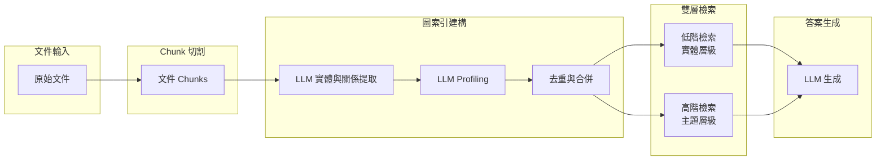

# Multimodal RAG 論文導讀 — RAG-Anything

## TL;DR

1. RAG-Anything 是首個統一的多模態 RAG 框架，透過 dual-graph construction（雙圖建構）策略，同時建構跨模態知識圖譜與文字知識圖譜，再經由實體對齊融合為統一的檢索索引。
2. 核心創新在於 cross-modal hybrid retrieval（跨模態混合檢索），結合結構知識導航（沿圖關係進行多跳推理）與語義相似度匹配（稠密向量檢索），補足了傳統 RAG 系統無法處理圖像、表格、方程式等非文字內容的缺口。
3. 在 DocBench 與 MMLongBench 兩個多模態長文件基準上，RAG-Anything 達到 SOTA 表現，特別在超過 100 頁的長文件中優勢顯著（68.2% vs 54.6%），且消融實驗證明 3.4 個百分點的主體增益來自圖結構而非 reranker。

---

## 背景與動機

### 為什麼需要多模態 RAG

Retrieval-Augmented Generation（RAG）已成為擴展大型語言模型知識邊界的基本範式。透過在推理過程中動態檢索外部知識，RAG 系統將靜態語言模型轉變為具備知識感知能力的系統。然而，現有 RAG 系統存在一個根本性的假設問題：它們假設知識庫僅由純文字文件組成。

現實世界的知識庫本質上就是多模態的。一份科研論文同時包含文字、圖表、數據表格與數學方程式；一份財務報告涵蓋市場圖表、相關性矩陣與績效表格；一份醫療文獻則包含放射影像、診斷圖表與臨床數據表。傳統 RAG 系統面對這些內容時，要麼完全丟棄非文字資訊，要麼將複雜的多模態內容扁平化為不足的文字近似，導致嚴重的資訊損失。

RAG-Anything 的三位作者 Zirui Guo、Xubin Ren、Lingrui Xu 等人來自香港大學，他們在學術界已經在圖增強 RAG 領域有深厚積累——前作 LightRAG 就是圖增強文字 RAG 的代表作。RAG-Anything 的出發點很直接：既然圖結構能改善文字 RAG 的檢索品質，為什麼不把它擴展到所有模態？

### 三個技術挑戰

論文明確指出多模態 RAG 不同於文字 RAG 的三個根本挑戰：

1. **統一多模態表示（Unified Multimodal Representation）**：需要無縫整合多種資訊類型，同時保留各模態的獨特特徵與跨模態關係。這要求能夠捕捉模態內與跨模態依賴關係的先進編碼器。

2. **結構感知分解（Structure-Aware Decomposition）**：複雜的文件佈局（如多面板圖、跨頁表格）需要智能解析，以維持空間與層次關係。這需要專門的佈局感知解析模組來解釋文件結構，保留多模態元素的上下文位置。

3. **跨模態檢索（Cross-Modal Retrieval）**：需要能夠在不同模態之間導航的機制，並在檢索過程中推理它們的相互關聯。這需要能夠理解文字、圖像與結構化資料之間語義對應關係的跨模態對齊系統。

這些挑戰在長文件場景中被進一步放大——相關證據分散在多個模態與章節中，需要跨異質資訊來源的協調推理。

---

## 核心知識點

這個主題的關鍵概念可以歸納為以下八個知識點。我逐一展開解釋，並說明 LightRAG 與 RAG-Anything 在每個知識點上的貢獻與差異。

### 1. Text-only RAG 的結構性限制

在進入 RAG-Anything 的細節之前，有必要先理解傳統 RAG 系統的根本限制，因為正是這些限制驅動了整個研究方向。

**傳統 RAG 的做法**：將文件切割成固定大小的文字片段（chunks），用嵌入模型（如 text-embedding-3-large）將每個 chunk 編碼為稠密向量，存入向量資料庫。查詢時計算查詢向量與所有 chunk 向量的餘弦相似度，返回 top-k 最相似的 chunks。

這個流程有兩個結構性弱點：

- **Flat representation**：Chunk 之間沒有任何關係資訊。如果答案需要的資訊分散在 chunk 1 的第 3 段和 chunk 5 的第 2 段，系統無法「沿著關係鏈」找到它們，只能依賴向量相似度的偶然匹配。LightRAG 的實驗顯示，在 Legal 資料集（508 萬 tokens）上，Naive RAG 的整體勝率僅 15.2%，因為簡單的 chunk 切割完全無法處理跨文件的多跳查詢。

- **文本假設**：所有非文字內容都被忽略或轉為粗糙的文字描述。即使是最先進的 GraphRAG（Edge et al., 2024）和 LightRAG 也只是在文字模態內使用圖結構來改善檢索，並未觸及多模態問題。RAG-Anything 的消融實驗中，「Chunk-only」變體僅達到 60.0% 的整體準確率，比完整模型低了 3.4 個百分點，這說明了 flat chunk 架構在多模態場景中特別脆弱。

### 2. Graph-based vs Chunk-based 索引

既然 flat chunks 不夠好，替代方案是什麼？答案是：用圖結構來組織知識。

**圖結構的核心優勢**：圖中的節點（entities）代表知識單元（如「Cardiologists」、「Heart Disease」），邊（relations）代表它們之間的關係（如「Cardiologists diagnose Heart Disease」）。這樣的結構支援多跳推理——如果查詢是「某種心臟病的預防治療方法是什麼？」系統可以從「Heart Disease」節點出發，沿關係邊找到「Prevention」、「Treatment」等相關節點，再檢索這些節點對應的原始文件段落。

LightRAG 是第一個系統性地證明圖結構在 RAG 中優勢的工作，它的核心方法包括三個步驟：

1. **Entity & Relation Extraction**：用 LLM 從每個文件 chunk 中識別實體與關係。
2. **LLM Profiling**：為每個實體與關係生成 (key, value) 鍵值對，key 是檢索用的關鍵字，value 是摘要描述。
3. **Deduplication**：合併跨 chunks 的重複實體與關係，減少圖的大小。

LightRAG 的實驗結果非常有說服力。在 Agriculture、CS、Legal、Mix 四個資料集上，LightRAG 對比 Naive RAG 的整體勝率分別為：67.6%、61.2%、84.8%、60.0%。在最大的 Legal 資料集上，LightRAG 的整體勝率甚至達到 84.8%，原因是跨文件的多跳關係在圖結構中被明確保留，而 flat chunk 方法完全無法處理這類查詢。

### 3. LightRAG 的 Dual-Level Retrieval

LightRAG 的第二個關鍵貢獻是 dual-level retrieval 範式。它認識到不同類型的查詢需要不同粒度的檢索策略：

- **Low-level retrieval（低階檢索）**：專注於特定實體及其屬性。例如「誰寫了傲慢與偏見？」——這個查詢直接對應到一個特定實體（作者），目標是精確匹配。

- **High-level retrieval（高階檢索）**：處理廣泛主題與概念。例如「人工智慧如何影響現代教育？」——這個查詢沒有單一實體可以對應，需要匯總多個相關實體與關係的資訊。

LightRAG 的消融實驗顯示，移除高階檢索（-High 變體）在所有四個資料集上都導致顯著的效能衰退，特別是在 Diversity 維度上。這說明抽象查詢需要高階檢索來提供資訊的廣度。而完整版本的 LightRAG（結合低階與高階）在 Comprehensiveness、Diversity、Empowerment 三個維度上都達到最佳平衡。

LightRAG 的另一個實用貢獻是**增量更新機制**。傳統的 GraphRAG 在新增資料時需要重建所有社群（communities），耗費大量 token（5,000 tokens per community × 1,399 communities = 約 700 萬 tokens）。LightRAG 只需將新圖與原圖的節點集合與邊集合做聯集（union），計算成本幾乎可以忽略。



*圖 1: LightRAG 的核心架構。圖結構索引取代傳統 flat chunk 索引，而 dual-level retrieval 同時支援精確實體檢索與廣泛主題檢索。*

#### LightRAG 消融實驗詳解

LightRAG 的消融實驗提供了圖結構與雙層檢索各自貢獻的量化證據。實驗以 Naive RAG 為參考，比較四個變體：

| 變體 | Agriculture Overall | CS Overall | Legal Overall | Mix Overall |
|------|-------------------|------------|--------------|------------|
| Naive RAG (baseline) | 32.4% | 38.8% | 15.2% | 40.0% |
| LightRAG (-High, 無高階) | 35.2% | 44.0% | 22.0% | 42.4% |
| LightRAG (-Low, 無低階) | 34.8% | 43.6% | 18.8% | 35.2% |
| LightRAG (-Origin, 無原文) | 25.6% | 39.2% | 15.6% | 44.4% |
| **LightRAG (完整)** | **67.6%** | **61.2%** | **84.8%** | **60.0%** |

從這些數據可以看到幾個模式：

- **高階檢索的重要性**：在 Legal 資料集上，移除高階檢索（-High）的整體勝率掉到 22.0%，而完整模型是 84.8%。這是因為 Legal 資料集包含大量跨文件的法律條文連結，需要高層次的主題聚合來串聯分散的知識。

- **低階檢索的精準度角色**：在 Mix 資料集上，移除低階檢索（-Low）反而導致更大幅度的衰退（35.2% vs 42.4%）。Mix 資料集包含多種文體（文學、傳記、哲學），精確實體匹配在此處扮演關鍵角色。

- **圖結構的資訊密度**：-Origin 變體完全移除原文 chunk，僅使用圖實體與關係的鍵值對來回答。令人驚訝的是，在某些資料集上（Mix 的 44.4% 甚至高過完整模型的某些維度），純圖結構的表示已經足夠。這意味著 LLM profiling 階段成功將關鍵資訊濃縮進了圖節點的描述中，原文中無關的雜訊反而被過濾掉了。

#### LightRAG 的效率分析

LightRAG 對比 GraphRAG 的計算成本差異是一項常被忽略但重要的貢獻。以下是在 Legal 資料集上的量化比較：

| 階段 | GraphRAG | LightRAG |
|------|----------|----------|
| 索引階段 tokens | 610 × 1,000 = 610K tokens | < 100 tokens (關鍵詞生成) |
| 索引階段 API calls | 610 (每個社群) | 1 |
| 增量更新 tokens | ~1,399 × 2 × 5,000 = 14M tokens | ~1,399 × 2 (簡單聯集) |
| 增量更新 API calls | 1,399 × 2（重建所有社區） | 1 (關鍵詞生成) |

GraphRAG 需要將所有抽取出的實體與關係聚類為 1,399 個社群（community），為每個社群生成一份報告，查詢時遍歷 610 個 level-2 社群。LightRAG 則用向量資料庫儲存所有實體與關係的嵌入，透過關鍵詞匹配 + 向量搜尋一步到位。在增量更新時，GraphRAG 需要摧毀並重建所有社群結構的代價更是天文數字。

### 4. Dual-Graph Construction（雙圖建構）

這是 RAG-Anything 相較於 LightRAG 最核心的創新。LightRAG 雖然使用了圖結構，但它的節點與關係都是從**文字**中提取的——它無法處理圖像、表格、方程式這些非文字模態。

RAG-Anything 的解決方案是：同時建構兩個互補的知識圖譜，再將它們融合。

#### 跨模態知識圖譜（Cross-Modal Knowledge Graph）

對於非文字內容（圖像、表格、方程式），RAG-Anything 的處理流程如下：

1. **描述生成**：用 VLM（Vision-Language Model）從每個非文字內容單元 `cj` 生成兩種文字表示——詳細描述 `djchunk`（用於跨模態檢索）與實體摘要 `ejentity`（包含實體名稱、類型、描述，用於圖建構）。

2. **圖提取**：對每個非文字單元的描述 `djchunk` 運行圖提取函數 `R(·)`，識別其中的細粒度實體與關係：
   ```
   (Vj, Ej) = R(djchunk)
   ```

3. **多模態錨點**：每個非文字單元作為一個多模態實體節點 `vjmm`，透過 `belongs_to` 邊連接其內部提取的實體：
   ```
   Ṽ = {vjmm}ᵢ ∪ ⋃ⱼ Vⱼ
   Ē = (⋃ⱼ Eⱼ) ∪ {(u →belongs_to→ vjmm) : u ∈ Vⱼ}
   ```

這個設計的關鍵洞察是：非文字內容的「語義」不能只靠其內容本身來表達。一張實驗結果圖的語義來自於：圖中顯示了什麼趨勢 + 圖標標註了什麼 + 周圍的文字段落解釋了什麼。跨模態知識圖譜透過將非文字單元嵌入其文字鄰域來保留這種上下文。

#### 文字知識圖譜（Text-Based Knowledge Graph）

對於純文字 chunk，RAG-Anything 直接沿用 LightRAG 的方法論（Guo et al., 2024），包括實體與關係提取、LLM profiling、去重合併。這部分沒有引入新技術，但確保了文字模態的知識也被完整保留。

#### 圖融合（Graph Fusion）

兩個圖譜透過 **entity alignment（實體對齊）** 合併。具體做法是用實體名稱作為主要匹配鍵，識別跨圖譜的語義等效實體，合併它們的表示：

```
G = (V, E) = Merge(Ṽ, Ē, V_text, E_text)
```

融合後的統一知識圖譜 `G` 同時包含多模態上下文關係與文字語義連接，提供了文件的整體視角。再結合嵌入表 `T`（包含所有圖實體、關係、原子內容 chunks 的稠密表示），構成完整的檢索索引 `I = (G, T)`。

這個雙圖設計解決了一個微妙的 trade-off：如果直接把所有模態的內容塞進一個單一圖譜，可能會丟失模態特有的結構訊號（例如表格中的行列關係、圖像中的面板佈局）。透過先分別建構再融合，兩個圖譜保留了自己的結構特徵，同時在必要的地方建立跨模態連接。

```mermaid
flowchart TD
    subgraph Doc["多模態文件"]
        D1[文字段落]
        D2[圖像]
        D3[表格]
        D4[方程式]
    end

    subgraph MMKG["跨模態知識圖譜"]
        MM1[多模態實體節點]
        MM2[細粒度實體<br/>與關係]
        MM3[belongs_to 邊]
    end

    subgraph TBKG["文字知識圖譜"]
        T1[文字實體節點]
        T2[語義關係邊]
    end

    subgraph Fusion["圖融合"]
        F1[Entity Alignment<br/>實體名稱匹配]
        F2[Unified KG<br/>G = (V, E)]
    end

    subgraph Embedding["稠密表示"]
        E1[Embedding Table T<br/>所有節點+邊+chunks]
    end

    D1 --> TBKG
    D2 --> MMKG
    D3 --> MMKG
    D4 --> MMKG
    MMKG --> Fusion
    TBKG --> Fusion
    Fusion --> F2
    F2 --> E1

    style MMKG fill:#1a237e,color:#fff
    style TBKG fill:#0d47a1,color:#fff
    style Fusion fill:#4a148c,color:#fff
```

*圖 2: RAG-Anything 的 Dual-Graph Construction。跨模態 KG 與文字 KG 分別建構，保留各自的結構訊號，再透過 entity alignment 融合為統一圖譜。*

### 5. Multimodal Knowledge Unification（多模態知識統一化）

在圖建構之前，RAG-Anything 需要先解決一個根本問題：如何將異質的多模態內容轉換為統一且可檢索的抽象表示？

**正式定義**：每個知識來源 `ki ∈ K`（例如一個網頁）被分解為原子內容單元：
```
ki →decompose→ {cj = (tj, xj)}ⁿⱼ₌₁
```
其中每個單元 `cj` 包含模態類型 `tj`（text、image、table、equation 等）與原始內容 `xj`。

為了確保高保真的萃取，RAG-Anything 使用專門的解析器應對不同內容類型：

- **文字**：分段為連貫的段落或列表項
- **圖像**：提取圖像本身及相關元數據（標題、交叉引用）
- **表格**：解析為結構化儲存格，保留表頭與數值
- **數學表達式**：轉換為符號表示（LaTeX）

關鍵在於 `xj` 不僅保留內容，還保留在原始文件中的結構上下文。例如一張圖片的 `xj` 不只包含圖像本身，還包含其標題、所在的章節、以及在文件中的位置。這種「上下文感知」的處理方式確保後續的跨模態檢索能正確地將查詢導向相關的多模態內容。

### 6. Cross-Modal Hybrid Retrieval（跨模態混合檢索）

索引建好之後，下一步是如何從索引中檢索與查詢相關的知識。RAG-Anything 提出的混合檢索架構包含兩個互補的機制：

#### 結構知識導航（Structural Knowledge Navigation）

這個機制利用統一知識圖譜 `G` 的結構屬性，透過以下步驟操作：

1. **關鍵詞匹配與實體識別**：對查詢 `q` 進行精確實體匹配，找出圖中的相關節點。
2. **鄰域擴展**：在指定的 hop 距離內進行策略性鄰域擴展，包含相關實體與關係。

這個方法對於捕捉高層語義連接與跨模態關係特別有效。舉例來說，如果查詢是「Figure 2 中哪個實驗條件的準確率最高」，系統可以從「Figure 2」這個多模態實體節點出發，沿 `contains` 邊找到圖中的各個面板節點，再沿 `label→applies→to` 邊找到每個面板對應的實驗條件，最終定位到正確的數據。

#### 語義相似度匹配（Semantic Similarity Matching）

單純靠圖結構導航可能會錯過那些語義相關但沒有直接結構連接的內容。為了解決這個問題，RAG-Anything 同時在嵌入表 `T` 中進行稠密向量檢索：

```
C_sem(q) = top-k closest(emb(q), T)
```

這涵蓋了所有模態的原子內容 chunks、圖實體與關係表示，確保即使在傳統詞彙或結構訊號不存在的情況下，也能發現相關知識。

#### 候選池統一與多信號融合排序

兩個檢索路徑的結果被統一到一個綜合候選池中：
```
C(q) = C_stru(q) ∪ C_sem(q)
```

但單純合併會忽略每個路徑提供的不同相關性訊號。為此 RAG-Anything 設計了 **multi-signal fusion scoring**（多信號融合評分），整合三個互補的相關性訊號：

1. **結構重要性**（Structural Importance）：來自圖拓撲的 PageRank-like 分數
2. **語義相似度**（Semantic Similarity）：來自稠密向量空間的餘弦相似度
3. **模態偏好**（Modality Preference）：來自查詢的詞彙分析（例如查詢包含 "figure" 則偏好圖像模態）

最終排序兼顧了結構知識關係、語義相關性，並根據查詢特徵適當加權不同模態。

### 7. Modality-Aware Query Processing（模態感知查詢處理）

這個機制是 RAG-Anything 中一個雖小但實用的設計。給定使用者查詢 `q`，系統首先進行模態感知分析，從查詢中提取詞彙線索與潛在的模態偏好：

- 查詢包含 "figure"、"chart"、"diagram" → 可能需要圖像資訊
- 查詢包含 "table"、"column"、"row" → 可能需要表格資訊
- 查詢包含 "equation"、"formula" → 可能需要數學表達式

然後，系統使用與索引階段相同的編碼器計算查詢的統一文檔嵌入 `emb(q)`，確保查詢與知識表現在同一個向量空間中。

這個設計讓文字查詢能夠有效地檢索非文字內容——因為在共享的嵌入空間中，查詢「What trend does Figure 2 show?」的向量與圖像描述的向量可能在語義上相近，即使查詢本身是純文字。

#### 合成階段（Section 2.4）的技術細節

檢索完成後，RAG-Anything 的合成階段需要解決一個微妙的問題：如何將跨模態的檢索結果整合為連貫的回應？

流程包含兩個步驟：

**步驟一：建構文字上下文。** 給定 top-ranked 檢索候選 `C(q)`，系統將所有檢索到的元件（實體摘要、關係描述、chunk 內容）依模態類型和層次來源進行結構化串接，使用分隔符號標明來源。例如：
```
[Text Chunk from Section 3.1]
...
[Image Description for Figure 2]
Panel A: style space of DAE (clear separation)
Panel B: content space (less distinct)
...
[Table Data from Financial Report]
Row: "Wages and salaries" → Column: "2020" → Value: "26,778 million DKK"
```

**步驟二：還原視覺內容。** 對於對應到視覺內容的檢索結果，系統進行 dereferencing，還原原始的圖像、表格、方程式等視覺資產 \(V(q)\)。這樣做的設計原因是：文字化的 proxy 確保了檢索的效率與一致性，但最終的推理需要原始的視覺語義。

最終的回應生成由一個 VLM 完成：
```
Response = VLM(q, P(q), V(q))
```
其中 `q` 是使用者查詢，`P(q)` 是彙整的文字上下文，`V(q)` 是還原的視覺內容。三者共同作用，使回應既有視覺資訊又有事實根據。

這個設計避開了兩個常見的陷阱：
- 只用文字表示視覺內容：丟失圖像中的空間關係與視覺模式
- 直接用原始圖像進行檢索：效率低下且無法進行跨模態的語義匹配

#### 模態感知提示設計（Appendix A.3）

RAG-Anything 為不同模態設計了專門的分析提示，這是常被忽略但重要的實作細節。論文在 Appendix A.3 公開了三組提示：

**視覺分析提示（Vision Analysis Prompt）**：
這組提示引導 VLM 系統性地捕捉以下維度：構圖元素、物件關係、視覺屬性、風格特徵、動態行為、技術組件（如圖表）。關鍵要求是必須建立與周圍文字的明確連接——不是單純描述圖像內容，而是解釋圖像在文件語境中的角色。

**表格分析提示（Table Analysis Prompt）**：
結構化的表格分解提示涵蓋五個分析維度：結構組織（行/列/合併儲存格）、欄位語義（表頭解釋）、關鍵數值（精確提取）、統計模式（趨勢分析）、語境相關性（與周圍段落的連接）。提示特別強調避免模糊概括，要求精確保留指標數值。

**方程式分析提示（Equation Analysis Prompt）**：
優先處理語義解讀而不是語法重述。提示要求分析：變數定義、運算邏輯、理論基礎、跨公式關係、實際應用。這確保數學內容成為論證框架的一部分，而非孤立呈現。

這三組提示的設計顯示了一個深刻的洞察：多模態 RAG 的瓶頸不僅在於「如何索引」，也在於「如何讓 VLM/LLM 理解不同模態間的關聯」。提示本身承載了系統對模態關係的先驗知識。

### 8. 跨模態推理的挑戰與限制

RAG-Anything 的 Appendix A.5 坦率地揭示了當前多模態 RAG 系統的兩個主要失敗模式，這些也是 RAG-Anything 自己的限制：

#### Text-Centric Retrieval Bias（文字中心檢索偏誤）

即使查詢明確要求視覺資訊（如「According to Figure 3, what is the sequence...」），系統仍然偏好檢索文字段落而非圖像。這是因為：
- 文字段落通常包含與查詢更精確的關鍵詞匹配（因為圖像的描述是 VLM 生成的，可能不夠精確）
- 跨模態注意力機制不夠強大，無法克服文字偏誤
- 檢索的相關性排序偏向文字模態

在論文提供的案例中（Figure 11），所有方法——GPT-4o-mini、LightRAG、MMGraphRAG 和 RAG-Anything——都無法從指定的圖像中檢索到正確答案，因為文字雜訊誤導了檢索過程。

#### Rigid Spatial Processing（僵化空間處理模式）

大多數系統預設使用從上到下、從左到右的掃描模式，這在處理非標準文件佈局時會出現系統性失敗：

- 表格中的合併儲存格會混淆行列關係
- 從下到上的流程圖（如 NER pipeline）需要反向處理
- 多面板圖中不同面板之間的關係需要非線性理解

論文提供的 NER 案例（Figure 11）中，正確答案需要按照從底部到頂部的順序閱讀流程圖，而所有方法都按照從上到下的預設順序處理，導致完全錯誤的推斷。

這兩個限制指向了多模態 RAG 的未來方向：需要更好的跨模態注意力機制來克服文字偏誤，以及更靈活的空間推理能力來處理非標準文件佈局。

#### 跨模態案例的結構性比對

論文的 Figure 6 還提供了一個特別值得分析的案例——多資料集表格的結構消歧：

| 方法 | 最高 AUPRC 值 | 模型組合 |
|------|-------------|----------|
| GPT-4o-mini | 0.455 | BERT-to-BERT |
| LightRAG | 0.429 | BERT + LSTM Attention |
| MMGraphRAG | 0.708 | Bert-ToBert |
| **RAG-Anything** (正確) | **0.506** | **GloVe + LSTM - Attention** |

所有 baseline 方法都給出錯誤的答案。為什麼？因為這個表格包含多個資料集（Evidence Inference、其他）的實驗結果，且不同資料集之間有重複的模型名稱（如 BERT-to-BERT 在第一個資料集也有出現）。傳統方法將表格讀取為線性文字後，無法正確判斷哪個模型組合對應哪個資料集。

RAG-Anything 透過將表格解析為 comprehensive relational graph，明確保留 row-of 和 column-of 關係，正確隔離出 Evidence Inference 資料集的上下文範圍，鎖定正確的行與列交點。這證明了結構化表示在表格理解中的不可替代性——單純的語義匹配（所有 baseline 都在做「語義相似」這件事）不足以處理表格的結構消歧。

#### RAG-Anything 與 Multiple Choice Cases

另一個有趣的發現是 RAG-Anything 在「Unanswerable queries (Una.)」類別上的表現。在 DocBench 中，RAG-Anything 的 Una. 準確率僅 46.0%，低於 MMGraphRAG 的 60.5% 和 GPT-4o-mini 的 49.6%。這可能是一個系統性 trade-off：圖結構雖然能捕獲更多相關資訊，但在判斷「資訊不足無法回答」的閾值設定上可能過於寬容——當圖結構從多個來源匯集了看似相關但實際上不足以回答的證據時，模型傾向於「猜一個答案」而不是「承認無法回答」。

---

#### RAG-Anything 整體流程

```mermaid
flowchart TD
    subgraph Input["多模態文件輸入"]
        A[PDF/網頁/文件]
    end

    subgraph Unification["Multimodal Knowledge Unification"]
        B1[文字解析器]
        B2[圖像解析器<br/>+ VLM 描述]
        B3[表格結構解析器]
        B4[方程式解析器]
        C[Atomic Knowledge Units<br/>cj = (tj, xj)]
    end

    subgraph DualGraph["Dual-Graph Construction"]
        D1[Cross-modal KG<br/>非文字錨點]
        D2[Text-based KG<br/>LightRAG 方法]
        D3[Entity Alignment<br/>圖融合]
    end

    subgraph Index["檢索索引 I = (G, T)"]
        E1[Unified KG G]
        E2[Embedding Table T]
    end

    subgraph Retrieval["Cross-Modal Hybrid Retrieval"]
        F1[Structural Navigation<br/>圖拓撲多跳]
        F2[Semantic Matching<br/>稠密向量檢索]
        F3[Multi-Signal Fusion<br/>結構+語義+模態]
    end

    subgraph Synthesis["回應生成"]
        G1[文字上下文 P(q)]
        G2[視覺還原 V(q)]
        H[VLM 生成]
    end

    A --> Unification
    B1 --> C
    B2 --> C
    B3 --> C
    B4 --> C
    C --> D1
    C --> D2
    D1 --> D3
    D2 --> D3
    D3 --> E1
    C --> E2
    E1 --> F1
    E2 --> F2
    F1 --> F3
    F2 --> F3
    F3 --> G1
    F3 --> G2
    G1 --> H
    G2 --> H
```

*圖 3: RAG-Anything 的端到端架構，從文件輸入到 unified representation、dual-graph construction、hybrid retrieval、再到 VLM 生成。*

## 從 LightRAG 到 RAG-Anything：方法演進

現在我來把前後兩篇論文串起來，說明這個研究路線的邏輯脈絡。

### LightRAG 的視野與邊界

LightRAG（Guo et al., 2024，arXiv:2410.05779）由 Zirui Guo 與 Chao Huang 團隊發表，是圖增強 RAG 領域的代表作。它的核心貢獻是證明圖結構──更具體地說是實體-關係知識圖譜──可以系統性地替代傳統的 flat chunk 索引，在全域知識檢索任務上取得顯著優勢。

LightRAG 的設計選擇值得仔細審視，因為它們的優點與限制直接鋪設了 RAG-Anything 的設計空間。

優點方面，LightRAG 的 **graph-based text indexing** 用 LLM 從每個 chunk 中提取實體與關係，再透過 LLM profiling 生成 (key, value) 鍵值對用於檢索。這比 GraphRAG（Edge et al., 2024）的社群級檢索更高效——GraphRAG 每次檢索需要遍歷 1,399 個社群中的 610 個（每個約 1,000 tokens，共 610K tokens），而 LightRAG 僅需不到 100 tokens 的關鍵詞生成加上一次向量檢索。在增量更新場景下，LightRAG 的優勢更明顯：GraphRAG 需要重建所有社群報告（約 1,399 × 2 × 5,000 = 1,400 萬 tokens），LightRAG 只需簡單的聯集操作。

限制方面，LightRAG 的所有處理都建立在**文字模態**之上。它的實體與關係提取、LLM profiling、去重合併——全都依賴 LLM 對文字的理解。這不是 LightRAG 的設計缺陷，而是它的設計邊界：它要解決的是文字 RAG 中 flat chunk 的問題，不是多模態問題。

### RAG-Anything 的關鍵擴展

RAG-Anything 在 LightRAG 的基礎上做了三個層次的擴展：

**第一層：模態擴展。** 從只處理文字，擴展到處理圖像、表格、方程式等所有模態。這是外顯的、最明顯的擴展。它不是簡單地增加一個圖像處理模組，而是從 Unified Representation 層級重新設計了整個系統。

**第二層：結構擴展。** 從單一文字知識圖譜，擴展到 dual-graph construction（跨模態 KG + 文字 KG）。這比「把所有東西塞進一個圖」更細緻——因為不同模態的結構訊號本質上不同（表格需要行列關係，圖像需要面板佈局），分別處理能保留這些結構特徵。

**第三層：檢索擴展。** 從 dual-level retrieval（低階 vs 高階），擴展到 cross-modal hybrid retrieval（結構導航 + 語義匹配）。這不是簡單的命名改動——LightRAG 的「低階 vs 高階」是同一模態內的粒度差異，而 RAG-Anything 的「結構 vs 語義」是跨模態的互補路徑。

RAG-Anything 的消融實驗清楚展示了這些擴展的貢獻。在 DocBench 基準上：

| 變體 | 整體準確率 | 說明 |
|------|-----------|------|
| Chunk-only | 60.0% | 繞過圖建構，純粹基於 chunks |
| w/o Reranker | 62.4% | 移除 reranker，保留圖架構 |
| RAG-Anything (完整) | 63.4% | 完整模型 |

從 Chunk-only 到 w/o Reranker 的 +2.4% 增益來自圖結構，從 w/o Reranker 到完整模型的 +1.0% 來自 reranker。這初步顯示圖結構是主力貢獻。

但如果看文字模態（Txt.）與多模態（Mm.）的細項，情況更清楚：

| 變體 | 文字模態 | 多模態 |
|------|---------|--------|
| Chunk-only | 81.6% | 66.2% |
| w/o Reranker | 81.7% | 74.7% |
| RAG-Anything | 85.0% | 76.3% |

在多模態場景中，圖結構帶來了 +8.5% 的巨大增益（66.2% → 74.7%），而在文字場景中幾乎無影響（81.6% → 81.7%）。這證明了雙圖設計對於多模態知識結構化特別有效。

### 具體的數學推導與實作細節

讓我補充一些論文中省略的中間推導步驟。

**圖結構的形式化定義：**

給定一個文件 `k_i`，經過 decomposition 後得到原子單元集合 `{c_j = (t_j, x_j)}`。

對於跨模態知識圖譜，每個非文字單元 `c_j`（`t_j ≠ text`）的處理過程是：

1. 先用 VLM 生成 `d_j^chunk = VLM(c_j, local_neighborhood(c_j))`——注意這裡的 `local_neighborhood` 包含了 `c_j` 的前後各 `δ` 個單元，確保生成的描述反映文件上下文。

2. 然後對 `d_j^chunk` 運行圖提取：
   ```
   (V_j, E_j) = R(d_j^chunk)
   ```
   其中 `V_j` 是從描述中提取的實體，`E_j` 是它們之間的關係。

3. 多模態實體節點 `v_j^mm` 透過 `belongs_to` 邊連接 `V_j`：
   ```
   Ṽ = {v_j^mm} ∪ ⋃ⱼ Vⱼ
   Ē = (⋃ⱼ Eⱼ) ∪ {(u →belongs_to→ v_j^mm) : u ∈ Vⱼ}
   ```

**Entity Alignment 的實作：**

兩個圖譜的融合依賴實體對齊。文中提到「使用實體名稱作為主要匹配鍵」，這是最簡單的 exact string matching。更精確的做法（文中未詳述但可以推測）應該包括：
- 名稱標準化（去除大小寫、空格、標點符號差異）
- 同義詞匹配（如 "CNN" vs "convolutional neural network"）
- LLM 輔助消歧（當名稱相同但上下文不同時）

**嵌入表 `T` 的構建：**

`T = {emb(s) : s ∈ V ∪ E ∪ ∪ⱼ cⱼ}`——所有實體、關係、原始 chunk 都被編碼到同一個嵌入空間。這意味著在檢索時，查詢向量可以同時與實體向量（找精確實體）、關係向量（找關係路徑）、chunk 向量（找原始內容）進行相似度匹配。

---

## 實驗結果與比較

### 主要結果

RAG-Anything 在兩個多模態長文件基準上進行了評估。這兩個基準從不同角度測試多模態 RAG 的能力：DocBench 涵蓋五個領域（學術、金融、政府、法律、新聞），共 229 份文件（平均 66 頁、46,377 tokens）；MMLongBench 涵蓋七個文件類型，共 135 份文件（平均 47.5 頁、21,214 tokens）。

#### Baseline 方法分析

RAG-Anything 比較了三個主要的 baseline 類型：

1. **GPT-4o-mini（128K 上下文）**：最強的端到端多模態 LLM baseline。它不需要 RAG 架構，而是直接將整個文件（最多 50 頁，144 dpi）作為圖像輸入。這測試的是「如果 LLM 自己能看到所有內容，能做得多好」。

2. **LightRAG（Guo et al., 2024）**：文字-only 的圖增強 RAG。這測試的是「如果只有文字，圖結構能幫多少」。LightRAG 無法處理圖像、表格、方程式等非文字模態。

3. **MMGraphRAG（Wan & Yu, 2025）**：現有的多模態 RAG baseline。它將圖像與文字的基本 graph linking 結合，但將表格和方程式視為純文字——這是一個關鍵的限制。

**DocBench 結果：**

| 方法 | Aca. | Fin. | Gov. | Law | News | Txt. | Mm. | Una. | 整體 |
|------|------|------|------|-----|------|------|-----|------|------|
| GPT-4o-mini | 40.3 | 46.9 | 60.3 | 59.2 | 61.0 | 61.0 | 43.8 | 49.6 | 51.2 |
| LightRAG | 53.8 | 56.2 | 59.5 | 61.8 | 65.7 | 85.0 | 59.7 | 46.8 | 58.4 |
| MMGraphRAG | 64.3 | 52.8 | 64.9 | 40.0 | 61.5 | 67.6 | 66.0 | 60.5 | 61.0 |
| **RAG-Anything** | **61.4** | **67.0** | 61.5 | 60.2 | **66.3** | **85.0** | **76.3** | 46.0 | **63.4** |

**MMLongBench 結果：**

| 方法 | Res. | Tut. | Acad. | Guid. | Broch. | Admin. | Fin. | 整體 |
|------|------|------|-------|-------|--------|--------|------|------|
| GPT-4o-mini | 35.5 | 44.0 | 24.6 | 33.1 | 29.5 | 46.8 | 31.1 | 33.5 |
| LightRAG | 40.8 | 34.1 | 36.2 | 39.4 | 41.0 | 44.4 | 38.3 | 38.9 |
| MMGraphRAG | 40.8 | 36.5 | 35.7 | 35.8 | 28.2 | 46.9 | 38.5 | 37.7 |
| **RAG-Anything** | **46.6** | 43.5 | **38.7** | **43.9** | 34.0 | 45.7 | **43.6** | **42.8** |

幾個值得注意的觀察：

1. **跨領域泛化**：RAG-Anything 在 DocBench 的 Finance 領域取得 67.0%（領先第二名的 MMGraphRAG 達 14.2 個百分點），在 MMLongBench 的 Research Reports 領域取得 46.6%（領先 5.8 個百分點）。這說明 dual-graph 架構對資訊密集的文件特別有效。

2. **多模態優勢**：在多模態場景（Mm. 類別）中，RAG-Anything 的 76.3% 大幅領先第二名的 MMGraphRAG 的 66.0%。這是 dual-graph construction 的直接效果——圖結構能精確建立表格行-列-單位之間的關係，而 MMGraphRAG 將表格視為純文字，丟失了結構資訊。

3. **長文件優勢**：論文特別分析了不同文件長度下的效能：
   - 11–50 頁：各方法差異不大
   - 51–100 頁：RAG-Anything 開始拉開差距（+3.4 to +9.3 分）
   - 101–200 頁：差距擴大到 13.6 分（68.2% vs 54.6%）
   - 200+ 頁：差距維持在 13.8 分（68.8% vs 55.0%）

   這驗證了交叉模態混合檢索的設計假設——長文件中相關證據分散在多個模態與章節，需要結構導航與語義匹配協同運作才能有效檢索。

#### 頁數級別的細粒度分析

論文的 Figure 2 提供了按文件頁數分層的細粒度分析，這是在主要結果表之外的重要資訊：

| 頁數範圍 | DocBench (RAG-Anything) | DocBench (MMGraphRAG) | 差距 |
|---------|----------------------|---------------------|------|
| ≤10 頁 | ~71% | ~70% | +1% |
| 11–50 頁 | ~65% | ~64% | +1% |
| 51–100 頁 | ~63% | ~54% | +9% |
| 101–200 頁 | 68.2% | 54.6% | +13.6% |
| 200+ 頁 | 68.8% | 55.0% | +13.8% |

| 頁數範圍 | MMLongBench (RAG-Anything) | MMLongBench (MMGraphRAG) | 差距 |
|---------|--------------------------|-------------------------|------|
| 11–50 頁 | ~44% | ~41% | +3.4% |
| 51–100 頁 | ~45% | ~36% | +9.3% |
| 101–200 頁 | ~49% | ~41% | +7.9% |

這個分析有兩個重要發現：

1. **臨界點在 50 頁左右**：短文件（≤50 頁）中各方法的差異不大，因為資訊集中，簡單的向量檢索或端到端上下文處理就足夠。但在 50 頁以後，RAG-Anything 的優勢開始快速拉開。這是一個經驗性的證據，說明了多模態 RAG 的真實價值——不是取代短文件的簡單方案，而是解鎖長文件的複雜推理能力。

2. **100 頁以上的穩定表現**：在超過 100 頁的文件中，RAG-Anything 的準確率穩定在 68–69%，而 MMGraphRAG 則在 54–55% 徘徊。更重要的是，RAG-Anything 從 11–50 頁的 ~65% 到 200+ 頁的 ~69% 略有上升，表示它的檢索機制在長文件中**沒有衰減**——隨著文件變長，dual-graph 的結構化索引反而能捕獲更多跨模態的證據鏈。

4. **LightRAG vs RAG-Anything**：在文字模態（Txt.）上，LightRAG 與 RAG-Anything 表現相當（85.0% vs 85.0%），因為文字部分的圖索引方法幾乎相同。但在多模態（Mm.）上，RAG-Anything 的 76.3% 顯著優於 LightRAG 的 59.7%。這個 16.6 分的差距就是多模態擴展帶來的純粹增益。

### 消融實驗的啟示

消融實驗的設計有兩個變體：Chunk-only（繞過圖建構）和 w/o Reranker（移除 reranker）。但這兩個變體的選擇本身就體現了 RAG-Anything 的設計哲學：圖建構是核心創新，reranker 是輔助優化。

#### Chunk-only 的解剖

Chunk-only 變體的結果需要仔細解讀。它達到 60.0% 的整體準確率，這其實不算差——它仍然使用了 MinerU 進行高品質的文件解析、使用 text-embedding-3-large 進行稠密檢索、使用 bge-reranker-v2-m3 進行重排序。Chunk-only 與完整模型的 63.4% 之間只有 3.4 分的差距，但這 3.4 分背後隱藏著重要的結構性差異。

細看各領域的表現：

| 領域 | Chunk-only | 完整模型 | 差距 |
|------|-----------|---------|------|
| Academia (Aca.) | 55.8% | 61.4% | +5.6% |
| Finance (Fin.) | 61.5% | 67.0% | +5.5% |
| Government (Gov.) | 60.1% | 61.5% | +1.4% |
| Legal (Law.) | 60.7% | 60.2% | -0.5% |
| News | 64.0% | 66.3% | +2.3% |

Chunk-only 在 Academia 和 Finance 這兩個模態最豐富的領域損失最大（-5.6% 和 -5.5%），因為這兩個領域的圖表和表格密度最高。而在 Legal 領域，Chunk-only 與完整模型幾乎持平（60.7% vs 60.2%），因為法律文件主要以文字為主，圖結構在此處的幫助相對有限。

這提供了一個重要的實踐洞察：dual-graph construction 的投資回報率在不同領域之間差異很大。對於圖表密集的學術和金融文件，圖結構帶來了巨大的增益；對於文字為主的法律文件，圖結構的邊際效益較低。

而 w/o Reranker 與完整模型的差距只有 1.0 分，這告訴我們兩件事：
1. Reranker 提供了有價值的精煉作用，但不是核心貢獻
2. 圖結構本身貢獻了 2.4 分（60.0% → 62.4%）的核心增益，這驗證了 graph-based 方法在多模態場景中的必要性

### 案例研究中的關鍵洞見

論文的案例研究提供了兩個具體的場景來說明 RAG-Anything 如何運作。

**Case 1: Multi-panel Figure Interpretation**

查詢：「Which model's style space shows a clearer separation between different styles according to Figure 2?」

正確答案是 DAE（確定性自編碼器）的風格空間比 VAE（變分自編碼器）更清晰分離。但所有 baseline 方法都回答 VAE——因為圖中有兩個相鄰的面板（style space panel 與 content space panel），傳統方法無法區分哪個面板對應哪個查詢。

RAG-Anything 將圖像轉換為 visual-layout graph，其中面板、軸標題、圖例、標題都成為節點，透過 `contains`、`caption→provides→context`、`subfigure→relates→hierarchically` 等邊編碼語義關係。這讓檢索器能正確定位到 style-space panel，避免 content-space panel 的干擾。

**Case 2: Financial Table Navigation**

查詢：「What was Novo Nordisk's total amount spent on wages and salaries in 2020?」

正確答案是 26,778 million DKK。但 GPT-4o-mini 回答 32,928 million、MMGraphRAG 回答 11,503 million、LightRAG 也回答 11,503 million——全部錯誤。

錯誤原因在於財務表格中有多個包含「wages and salaries」相關的條目（如「Share-based payments」），不同行有不同的數值。傳統方法將表格視為線性文字，混淆了數字範圍與年份對應。

RAG-Anything 將表格轉換為結構化圖，其中 row headers、column headers、data cells、units 都成為節點，透過 `row→of`、`column→of`、`header→applies→to`、`unit→of` 等邊捕獲結構關係。這讓系統能精確定位到「Wages and salaries」行與「2020」列的交點。

---

## 總結、限制與未來方向

### 核心要點重述

1. 從 LightRAG 到 RAG-Anything 展現了一條清晰的研究路線：文字圖增強 RAG → 多模態圖增強 RAG。核心洞察是同一個圖結構工具可以擴展到處理所有模態。

2. RAG-Anything 的 dual-graph construction 解決了一個微妙的設計問題：不同模態的結構訊號在單一圖譜中難以共存。透過分別建構再融合，系統同時保留了跨模態的上下文關係與文字的細粒度語義。

3. 混合檢索架構的設計（結構導航 + 語義匹配）是必要的，因為跨模態場景中相關知識可以透過明確的路徑（圖結構）或隱含的相似性（向量空間）來發現，僅靠單一路徑會遺失另一半。

4. 長文件場景是 RAG-Anything 最能體現優勢的地方。隨著文件長度增加，結構化方法 vs flat chunk 方法的差距從幾乎持平擴大到 13+ 百分點。

### 已知限制

RAG-Anything 自己在 Appendix A.5 中指出的限制是最誠實的評估：

1. **Text-Centric Retrieval Bias**：即使查詢明確指向圖像，系統仍偏好檢索文字。這不是一個偶發的問題，而是當前多模態 RAG 架構的系統性缺陷——跨模態注意力機制不夠強大，無法克服億萬級文字訓練資料帶來的偏誤。

2. **Rigid Spatial Processing**：預設的從上到下、從左到右掃描模式無法適應非標準佈局。表格合併儲存格、反向閱讀順序（從下到上）、非線性資訊流——這些真實世界中常見的結構變化都會導致完全錯誤的答案。

3. **LLM 成本**：圖建構過程重度依賴 LLM（實體提取、關係提取、profiling、VLM 描述生成）。雖然 LightRAG 的增量更新降低了維護成本，但初始索引的 LLM API 調用成本仍然顯著高於簡單的 chunk-embedding 方案。

4. **Entity Alignment 的精度**：文中使用簡單的實體名稱匹配進行圖融合。在跨語言、縮寫變體、同義詞場景下，exact string matching 可能錯過或錯誤合併大量實體。

### 後續研究方向

基於 RAG-Anything 揭示的限制，有幾個值得關注的未來方向：

**方向一：更好的跨模態注意力。** 固定權重的檢索策略無法解決 text-centric bias。也許可以引入查詢依賴的模態門控機制，當查詢的模態偏好線索明確時（如 "Figure"、"Table"），動態提高非文字模態的檢索權重。

**方向二：彈性空間推理。** 從預設的單一掃描模式轉向佈局感知的動態處理策略。論文提到的「rigid spatial processing patterns fail to adapt to non-standard document layouts」是一個具體可定義的技術問題——也許可以將文件佈局轉換為一組空間約束，讓檢索器根據佈局類型選擇處理順序。

**方向三：輕量化圖索引。** LightRAG 已經解決了增量更新的效率問題，但初始索引的 LLM 成本仍然很高。未來的工作可能需要探索更輕量的實體提取方案，或利用小型專用模型來取代 LLM 的圖建構角色。

**方向四：多步推理的圖優化。** 目前的 dual-graph 是靜態建構的，檢索時不會根據查詢動態調整圖結構。引入查詢導向的圖剪枝或子圖選擇策略，可以進一步提升長文件場景的檢索效率與精準度。

RAG-Anything 的工作是一個重要的里程碑，因為它將 RAG 系統從「文字處理」推進到「知識處理」——知識從來不限於文字，真正的知識感知系統也應該如此。

### 對後續研究的啟示

RAG-Anything 的工作對後續研究提供了幾個具體的啟示：

**1. 圖結構作為統一表徵的可行性。** RAG-Anything 證明了知識圖譜可以作為跨模態內容的統一表徵層。這不是一個 trivially 的結論——替代方案包括直接使用多模態嵌入（如 CLIP-like 的跨模態編碼）、或者為不同模態分別建立檢索索引再融合結果。RAG-Anything 選擇了圖結構，並通過實驗證明這是一個有效的設計選擇。

**2. 「分別建構、再融合」的模組化哲學。** Dual-graph construction 的核心想法——不強迫不同模態進入同一個表示空間，而是分別保留它們的結構特徵再透過對齊機制融合——可能是一個通用的設計原則。未來的工作可以為聲音、影片、3D 模型等新模態擴展這個框架。

**3. 混合檢索比單一檢索策略更穩健。** 結構導航與語義匹配的互補性在跨模態場景中被清晰展示：在圖結構的關係明確時，結構導航提供精確性；在關係不明確或不完整時，語義匹配提供召回率。這兩者的組合不是錦上添花，而是跨模態場景中的必需。

**4. 誠實的失敗分析比成功的宣傳更有價值。** RAG-Anything 的 Appendix A.5 是全論文中我最欣賞的部分——不是因為它展示了方法有多好，而是因為它誠實地展示了方法在哪裡失敗了、為什麼失敗。text-centric retrieval bias 和 rigid spatial processing 這兩個失敗模式的精確定位，為後續研究提供了比任何正面結果都更清晰的技術路線圖。

---

## 延伸閱讀

### 直接比較的 baseline 方法

- **LightRAG** (Zirui Guo et al., 2024, arXiv:2410.05779)：RAG-Anything 的 direct predecessor，由同組研究者開發的圖增強文字 RAG 系統。提出 dual-level retrieval（低階實體檢索 + 高階主題檢索）與增量更新機制。RAG-Anything 的文字知識圖譜部分直接沿用其方法論。LightRAG 的開源倉庫為 https://github.com/HKUDS/LightRAG。

- **MMGraphRAG** (Xueyao Wan & Hang Yu, 2025, arXiv:2507.20804)：另一個多模態 RAG 框架，但只處理圖像模態與文字的基本 graph linking，忽略表格與方程式的結構資訊。MMGraphRAG 使用 spectral clustering 進行跨模態實體分析，但對表格和公式僅做純文字處理，丟失了表格的行列結構與公式的變數關係。

- **GraphRAG** (Darren Edge et al., 2024, arXiv:2404.16130)：微軟提出的圖增強 RAG 方法，透過社群級檢索來捕捉全域資訊。LightRAG 在效率上顯著優於 GraphRAG——檢索階段的 token 消耗從 610K 降低到不到 100 tokens。

### 評估資料集詳情

論文使用的兩個基準提供了互補的評估視角：

**DocBench**（Zou et al., 2024）：229 份多模態文件，1,102 個問答對，涵蓋五個領域。文件平均 66 頁、46,377 tokens，最長類別為金融報告（平均 192 頁）。這是一個強調「領域廣度」的基準——每個領域的文件風格差異很大，從學術論文的精確圖表到新聞報導的簡潔版面。

**MMLongBench-Doc**（Ma et al., 2024）：135 份文件，1,082 個問答對，涵蓋七個文件類型（研究報告、教學手冊、學術論文、指南手冊、宣傳冊、行政檔案、財務報告）。平均 47.5 頁、21,214 tokens。這是一個強調「文件類型多樣性」的基準——從結構化嚴謹的學術論文到版面自由的宣傳手冊，考驗系統對不同文件佈局的適應能力。

### 相關技術脈絡

- **VisRAG** (Yu et al., 2025)：將文件佈局保留為圖像來處理多模態，但無法捕捉細粒度的結構關係（如表格的行列對應）。
- **HippoRAG** (Jimenez Gutierrez et al., 2024)：神經生物學啟發的長期記憶機制，類似於 RAG 的持久化知識存儲。
- **RAPTOR** (Sarthi et al., 2024)：遞迴抽象處理以構建樹狀組織的檢索結構。
- **MinerU** (Wang et al., 2024)：RAG-Anything 使用的文件內容精確萃取工具，用於解析文字、圖像、表格、方程式。
- **DocBench** (Zou et al., 2024) 與 **MMLongBench-Doc** (Ma et al., 2024)：兩個多模態長文件 QA 基準，覆蓋學術、金融、法律、政府等領域。
