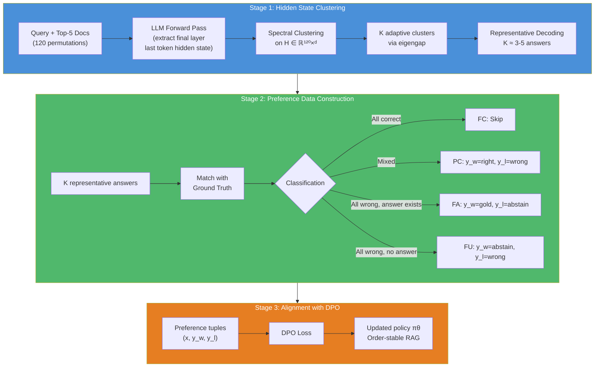
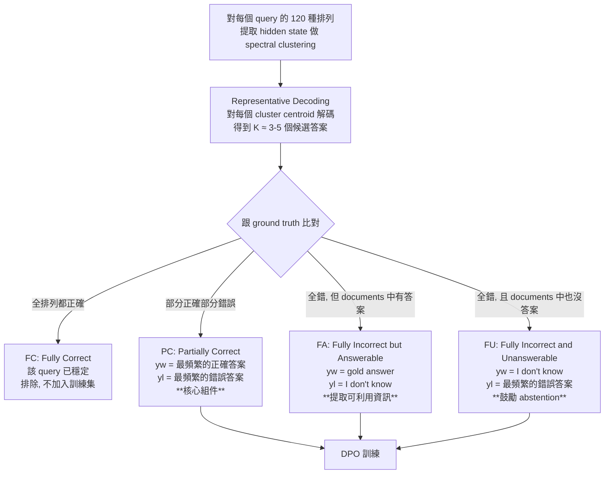

# Stable-RAG: 用 Hidden State 聚類解決 RAG 的檢索排列敏感度

> **種子論文**: [Stable-RAG: Mitigating Retrieval-Permutation-Induced Hallucinations in Retrieval-Augmented Generation](https://arxiv.org/abs/2601.02993) (2026-01)
> **作者**: Qianchi Zhang, Hainan Zhang, Liang Pang, Hongwei Zheng, Zhiming Zheng
> **Dependency 論文**: [Making Retrieval-Augmented Language Models Robust to Irrelevant Context](https://arxiv.org/abs/2310.01558) (Yoran et al., ICLR 2024)

---

## TL;DR

RAG 系統存在一個被長期忽略的漏洞：即使檢索出來的文件內容完全相同、gold document 固定在第一位，僅僅改變文件的排列順序就會導致 LLM 輸出大幅變化。Stable-RAG 發現這個問題源自 LLM 深層 layer 的推理軌跡分歧——不同排列會觸發不同的內部推理路徑。它的解法是對所有排列下的 hidden state 做 spectral clustering 找到主要推理模式，再透過 DPO 把不一致的輸出對齊到正確答案。在 NQ、TriviaQA、HotpotQA 三個數據集上，Stable-RAG 在所有評測指標上均超越 RetRobust、ATM、RAAT 等強基線，並展現跨數據集、跨 retriever、跨 Top-K 的泛化能力。

> 如果你對 content noise 路線的 robust RAG 有興趣，RetRobust 提供了另一個角度的解法。如果你想知道排列敏感度在架構層面如何根本解決，Set-LLM 的 permutation-invariant attention 是值得關注的方向。

---

## 背景與動機

### RAG 的可靠性問題

Retrieval-Augmented Generation (RAG) 已經成為減少 LLM 幻覺的主流方法 (Lewis et al., 2020)。核心概念很直觀：當 LLM 需要回答一個問題時，先從外部知識庫中檢索相關文件，把這些文件和問題一起餵進 context window，讓模型在參考外部資訊的基礎上生成答案。這比起只依靠 LLM 參數中儲存的知識（參數記憶）要有更高的正確性和可更新性。

RAG 在知識密集型任務上的效果是顯著的。開放域問答、事實查核、多跳推理——在這些場景中，RAG 系統一致性地超越了純 LLM 生成。但 RAG 的可靠性遠非完美。現有的 robust RAG 研究大致分為兩條路線。

### 第一條路線：內容干擾 (content noise)

這條路線關注的問題很直覺：檢索器不是完美的，有時會取回低品質、不相關、甚至誤導的文件。當 LLM 看到這些無關文件時，可能會被「帶偏」，複製文件中的錯誤資訊或忽略正確的文件。

針對這個問題，研究界提出了多種解法：

**RetRobust** (Yoran et al., 2024) 給出了兩種方案。第一種是 NLI-based 過濾：用一個 Natural Language Inference 模型去判斷「檢索文件 + 問題 ⇒ 答案」這個推論是否被文件內容 entail。如果不夠 entail，系統就退回到不依賴檢索的純 LLM 生成。這種方法的好處是黑箱操作、不需要訓練 LLM，但 NLI 模型可能過度嚴格，把相關文件也濾掉了。第二種方案是 finetuning：自動生成訓練數據（混合相關文件、低排名文件、隨機文件），對 LLM 做 supervised finetuning，讓它學會在有無關文件時忽略它們。

**RAAT** (Fang et al., 2024) 採用對抗訓練的思路。在訓練過程中，系統故意注入檢索噪音或不相關文件，讓 LLM 在對抗環境中學習保持穩健。這類似於電腦視覺中對抗樣本訓練的概念——讓模型見過各種「被干擾」的輸入，從而學會不受干擾影響。

**AdaComp** (Zhang et al., 2024b) 和 **CompSelect** (Zhang et al., 2026c) 則從另一個角度切入：在 generator 之前先做一層噪音過濾，篩選出真正有用的文件再餵給 LLM。

這些方法的共同假設是：只要文件的內容跟問題相關，LLM 就不該出錯。它們的注意力都在「文件的內容品質」上。

### 第二條路線：位置偏差 (positional bias)

另一條路線關注的是 LLM 位置編碼本身的偏差。

現代 LLM 幾乎都使用相對位置編碼——RoPE (Su et al., 2024) 或 ALiBi (Press et al., 2021)。這些編碼方案雖然比絕對位置編碼更靈活，但也引入系統性偏差：

- **Attention sink**：早期 token（通常包括問題和前面的文件）會獲得不成比例的注意力
- **Long-range decay**：越靠後的 token 因位置編碼的衰減效果而被忽略

對 RAG 來說這意味著：放在第一位的文件可能因為 attention sink 得到過多關注，而關鍵資訊如果放在後面可能被忽略。

這類方法的解法包括：修改位置編碼使注意力更均勻 (Zhang et al., 2024d)、調整因果遮罩來重新分配注意力權重 (Hsieh et al., 2024)、或用知識蒸餾把有利位置的知識轉移到不利位置 (Wang et al., 2025b 的 Pos2Distill)。

但位置偏差主要被視為「長語境」的問題——context 越長，位置偏差越明顯。對於 RAG 中的 Top-5 設定（通常 <1000 tokens），位置偏差的影響被認為是有限的。

### 被忽略的第三個問題：排列敏感度

Stable-RAG 發現了這兩條路線都沒有觸及的根本漏洞。他們做了一個簡單但有力的實驗。

實驗設定：用 Top-5 檢索取回文件（gold document 一定在其中），把 gold document 固定在輸入的第一位，然後僅僅改變其他 4 份 non-gold 文件的排列順序。結果是什麼？

**同一個問題、同一組文件、gold 在同樣的位置**，僅僅因為 non-gold 文件的排列順序不同，LLM 的答案就會大幅變化。

這不是內容干擾——文件內容完全沒變，沒有噪音注入。
這也不是位置偏差——gold 固定在 position 1，不涉及長距離衰減或 attention sink。
這純粹是排列順序本身導致的問題——相同的資訊套上不同的排列，LLM 就走上了不同的推理路徑。

更關鍵的是，這個效應在短 context（<1000 tokens）下就發生了，不是長語境特有的現象。這表示 LLM 對輸入順序的敏感度遠比我們以爲的更根本、更普遍。

### 為什麼排列敏感度被長期忽略？

回頭看，排列敏感度其實是 Transformer 架構的已知性質：self-attention 是 permutation-variant 的（不像 RNN 或 CNN 那樣 permutation-invariant）。但以往大家把這個當作「可以忽略的細節」——因為在標準的語言建模任務中，文本的自然線性結構固定了排列順序。只有在 RAG 這種「外部材料被動插入 context」的場景中，排序的隨機性才會暴露這個問題。

這就像一個一直存在的 bug，只是以前沒有人有動機去觸發它。

---

## 核心知識點

本文圍繞以下知識點展開：

1. **排列敏感度的存在與量化**——如何設計實驗證明排列會影響 LLM 輸出，以及如何量化這種影響
2. **Hidden State 聚類作為診斷工具**——為什麼 spectral clustering 可以揭示 LLM 內部推理軌跡的結構，以及背後的數學原理
3. **Deep Layer Reasoning Divergence**——排列敏感度如何隨 layer 深度增加而加劇，對不同模型家族的普遍性
4. **偏好數據的分類構建**——FC/PC/FU/FA 四種分類的設計邏輯與互補角色
5. **DPO 對齊與跨排列一致性**——為什麼標準 DPO 不夠，order-stability constraint 如何在不改變損失函數的情況下提升效果
6. **RetRobust vs Stable-RAG 的對比**——兩種 RAG 可靠性提升策略的異同、互補關係與適用場景

### 整體架構

Stable-RAG 的完整流程包含三個階段，以下用架構圖說明：



---

## 方法詳解

### 知識點 1: 排列敏感度的存在與量化

**這個知識點要回答什麼問題？**

檢索排列順序真的會影響 LLM 的輸出嗎？影響有多大？這個效應在多大規模的模型上存在？

**Stable-RAG 怎麼處理？**

研究者設計了一個系統性實驗。對於 NQ 測試集中的每個問題：

1. 用檢索取回 Top-5 文件（gold document 確保在其中）
2. 將 gold document 分別固定在 position 1 到 position 5
3. 對每個固定的 gold 位置，隨機排列剩下的文件
4. 對每種排列，讓 LLM 生成答案
5. 檢查 LLM 的答案是否與 gold answer 一致

結果用 **Perturbation Success Rate (PSR)** 來量化——即排列擾動成功導致 LLM「放棄正确答案、轉而產生幻覺輸出」的比例。

論文 Figure 1 的數據非常驚人。以 LLaMA 模型家族在 NQ 測試集上的表現為例：

**Gold document 固定在 position 1（最理想的情況）：**
| 模型 | PSR (%) |
|------|---------|
| LLaMA-3.2-1B-Instruct | 92.3 |
| LLaMA-3.2-3B-Instruct | 94.1 |
| LLaMA-3-8B-Instruct | 94.5 |
| LLaMA-3.3-70B-Instruct | 93.8 |

即使是最強的 70B 模型，PSR 也高達 93.8%。這說明排列敏感度**不是小模型的專利**。

**Gold document 固定在 position 5（最不利的情況）：**
| 模型 | PSR (%) |
|------|---------|
| LLaMA-3.2-1B-Instruct | 59.5 |
| LLaMA-3.2-3B-Instruct | 50.8 |
| LLaMA-3-8B-Instruct | 51.4 |
| LLaMA-3.3-70B-Instruct | 27.5 |

有趣的是，當 gold 在 position 5 時 PSR 反而比 position 1 低。這違反直覺——如果排列敏感度只是「模型看不到 gold」的問題，那 gold 放越前面應該越好。但數據顯示相反：gold 在 position 1 時 PSR **最高**。這暗示排列敏感度的機制不是簡單的注意力分配問題，而是更深層的推理路徑分歧。

**三點重要觀察：**

1. **Scale 無法完全解決問題**——從 1B 到 70B 的 PSR 雖然下降（position 5 時 59.5% -> 27.5%），但在 position 1 時甚至幾乎沒有改善（92.3% -> 93.8%）
2. **Qwen 模型也有類似模式**——附錄 C.1 中的 Qwen 模型結果顯示同樣的趨勢
3. **排列敏感度是普遍現象**——五個不同規模和架構的模型都有顯著的排列敏感度，說明這是 LLM 的結構性問題而非特定模型缺陷

**RetRobust 怎麼看？**

RetRobust 完全沒有考慮這個問題。它的核心假設是「只要文件內容夠相關，LLM 就能正確使用」。但 Stable-RAG 的實驗證明，即使內容夠相關（gold document 在裡面），順序不對仍然會出錯。這個發現擴展了我們對 RAG 可靠性邊界的認知——問題不只是「文件內容不對」，還有「文件的排列順序不對」。

---

### 知識點 2: Hidden State 聚類作為診斷工具

**這個知識點要回答什麼問題？**

排列敏感度的內部機制是什麼？如何從 LLM 的內部表徵來診斷這個問題？

**Stable-RAG 怎麼處理？**

Stable-RAG 的核心 insight 是：**如果排列敏感度是推理路徑分歧的結果，那這個分歧應該會顯現在 LLM 的 hidden state 空間中。** 基於這個假設，他們提出用 spectral clustering 對 LLM 的 hidden states 做結構分析。

**Step 1: Internal States Extraction**

對於每個 query $q$ 和其 Top-5 檢索文件集合 $S = \{d_1, ..., d_n\}$：

1. 枚舉所有 $n! = 120$ 種文件排列 $\pi_i$（$i \in \{1, ..., 120\}$）
2. 對每種排列，讓 LLM 處理 $f_\theta(q, \pi_i)$
3. 在 LLM 開始生成答案前（最後一個 token 的位置），提取 final layer 的 hidden state $h^{(i)} \in \mathbb{R}^d$
4. 所有 hidden states 構成矩陣 $H = [h^{(1)}, h^{(2)}, ..., h^{(120)}] \in \mathbb{R}^{120 \times d}$

為什麼只取最後一個 token 的 hidden state？先前的工作 (Azaria & Mitchell, 2023; Ni et al., 2025) 已經證明這個 hidden state 充分捕捉了 LLM 對自身知識邊界的感知。在生成第一個 token 之前，模型的 internal state 已經包含了它對「要回答什麼」的決策。

**Step 2: Weighted Adjacency Matrix**

Spectral clustering 的第一步是構建加權鄰接矩陣 $A \in \mathbb{R}^{N \times N}$，其中 $A_{ij}$ 表示 hidden state $h^{(i)}$ 和 $h^{(j)}$ 之間的相似度：

$$
A_{ij} = \exp\left(-\frac{1 - \frac{h^{(i)} \cdot h^{(j)}}{\|h^{(i)}\| \|h^{(j)}\|}}{\sigma}\right)
$$

這裡 $1 - \cos(h^{(i)}, h^{(j)})$ 是 cosine distance，$\sigma$ 是一個控制敏感度的超參數。exponential 轉換讓距離近的點得到較高的權重、距離遠的點權重指數衰減，形成一個自然的相似度圖。

**Step 3: Graph Laplacian 與 Eigengap**

有了鄰接矩陣 $A$，下一步是構建歸一化的 graph Laplacian：

$$
D = \text{diag}\left(\sum_{j=1}^N A_{ij}\right), \quad L = I - D^{-1/2} A D^{-1/2}
$$

$D$ 是 degree matrix，對角元素 $D_{ii}$ 表示第 $i$ 個 hidden state 與其他所有點的相似度總和。$L$ 是歸一化的 graph Laplacian，其特徵值 $\lambda_1 \leq \lambda_2 \leq ... \leq \lambda_N$ 編碼了圖的連通性資訊。

Cluster 數量 $K$ 透過 eigengap 自適應決定：

$$
K = \max_{2 \leq k \leq K_{\max}} (\lambda_{k+1} - \lambda_k)
$$

直觀來說：如果數據自然形成 $K$ 個 cluster，那第 $K$ 個特徵向量到第 $K+1$ 個之間的 gap 會最大。

**為什麼選 spectral clustering 而非 K-means？**

這是一個重要的設計選擇。K-means 假設 cluster 在歐氏空間中是球形的，但 LLM hidden state 的分佈通常是非凸的——同一推理模式的 hidden states 可能在空間中形成不規則的 manifold。Spectral clustering 透過 graph Laplacian 捕捉數據的全局流形結構，對非球形分佈遠比 K-means 有效。

**Step 4: Representative Decoding**

確定 $K$ 個 cluster $C_1, ..., C_K$ 後，對每個 cluster $C_k$ 找出代表 centroid：

$$
\mu_k = \frac{1}{|C_k|} \sum_{h^{(i)} \in C_k} h^{(i)}
$$

然後選出離 centroid 最近的 hidden state：

$$
h^{(r_k)} = \arg\min_{h^{(i)} \in C_k} \|h^{(i)} - \mu_k\|_2
$$

只有這 $K$ 個 representative hidden states 需要解碼成文字答案，將推理次數從 $N = 120$ 降到 $K$（通常 $K \approx 3\text{--}5$），大幅降低計算和標註開銷。

**關鍵驗證：**

研究者做了一個重要的定量驗證（Table 1）：把 representative decoding 的結果與 cluster 中所有 hidden states 的真實答案比對，計算 Precision、Recall、F1。結果在 final layer 上 F1 達到 83.9%（LLaMA3-8B）和 87.6%（Qwen3-8B）——足夠好作為實際應用的依據。

---

### 知識點 3: Deep Layer Reasoning Divergence

**這個知識點要回答什麼問題？**

排列敏感度在 LLM 的哪一層開始出現？為什麼會隨深度加劇？這個現象在多大程度上是模型通用的？

**Stable-RAG 怎麼處理？**

**Layer-wise PCA 視覺化**

研究團隊對每一層的 hidden state 做 PCA 降維並視覺化（Figure 3）。以 NQ 測試集中一個案例為例，問題是 "what is the liquid in a magic 8 ball?"（正確答案：Alcohol），結果非常直觀：

- **Layer 1–4**：不同答案（"Alcohol" 和 "Water"）的 hidden states 混雜在一起，無法區分
- **Layer 8**：開始出現分離的趨勢，但邊界仍然模糊
- **Layer 12–16**：分離變得明顯，"Alcohol" 組的點和 "Water" 組的點各自聚集
- **Layer 24–32**：形成完全分離的 cluster。同一答案的 hidden states 清晰聚在一起，cluster 之間有明顯的 gap

這個視覺化證明了關鍵假設：**排列誘發的推理分歧在 deep layers 中最明顯。**

**定量分析**

為了讓這個觀察更精確，研究者對每一層計算 clustering 的 Precision、Recall、F1（以 hidden state 解碼後的答案是否與 cluster 中多數答案一致為標準）：

| Layer | Qwen3-8B (Precision/Recall/F1) | LLaMA3-8B (Precision/Recall/F1) |
|-------|------------------------------|--------------------------------|
| 8 | 78.1 / 79.3 / 77.9 | 69.2 / 71.8 / 69.3 |
| 16 | 79.9 / 81.3 / 79.6 | 81.4 / 82.5 / 81.3 |
| 24 | 86.8 / 87.5 / 86.6 | 82.3 / 83.7 / 82.2 |
| 36 (Qwen) / 32 (LLaMA) | **87.8 / 88.4 / 87.6** | **84.1 / 85.2 / 83.9** |

**三個關鍵發現：**

1. **Divergence 是漸進的**——F1 從 shallow layers 的 70–78 逐漸提升到 deep layers 的 84–88。不是某個 layer 突然分裂，而是從 shallow 到 deep 逐步加劇
2. **Final layer 的聚類品質足夠**——F1 在 84%–88% 之間，代表 spectral clustering 在 final layer 的表現已經達到了實際應用的門檻
3. **LLaMA 和 Qwen 趨勢一致**——雖然具體數值不同（Qwen 在所有 layer 上都略優於 LLaMA），但整體的「shallow 混合 → deep 分離」模式完全一致

**Sensitive vs Non-sensitive samples**

研究者進一步比較了兩類樣本：
- **Sensitive samples**：排列導致多種答案，cluster 數量 $\geq$ 10
- **Non-sensitive samples**：排列導致的答案種類 $\leq$ 2（1 或 2 種）

在 deep layers 中，sensitive samples 的 divergence 遠大於 non-sensitive 的。這個差異主要集中在中高層 layer，說明排列敏感度源自 LLM 推理動態的**結構性不穩定性**，而非特定模型設計選擇。

附錄 C.2 的擴展實驗（LLaMA3 和 Qwen3 的完整模型家族，從 1B 到 70B）進一步確認：儘管模型在架構、規模、預訓練數據上各不相同，但這個結構性不穩定性在所有模型中一致出現。

---

### 知識點 4: 偏好數據的分類構建

**這個知識點要回答什麼問題？**

有了 hidden state clustering 之後，如何從聚類結果構建訓練數據？對於不同的排列表現情況，應該怎麼區別對待？

**Stable-RAG 怎麼處理？**

這是 Stable-RAG 中設計最精巧的部分。研究團隊根據模型在不同排列下的表現，將每條 query 分為四類：



**FC (Fully Correct)**：模型在所有排列下都能正確回答。這是最理想的狀態，表示該 query 的排列敏感度很低，不需要任何干預。FC 樣本直接被排除在訓練集之外——沒有必要去「改正」一個本來就正確的行為。

**PC (Partially Correct)**：這是**最重要的類別**，也是 Stable-RAG 最有貢獻的地方。模型在不同排列下有時對有時錯——這是最典型的排列敏感度場景。

具體做法：
1. 對 $K$ 個 cluster 的 representative decoding 結果做答案頻率統計
2. 找到最多排列產生的**正確答案**作為 $y_w$（preferred answer）——這強化了最穩定的正確推理模式
3. 找到最多排列產生的**錯誤答案**作為 $y_l$（dispreferred answer）——這校正常見的推理偏誤

消融實驗（Table 3）清楚顯示 PC 是最關鍵的組件：去掉 PC 後，NQ 從 48.14 掉到 37.62（-10.52），TriviaQA 從 72.05 掉到 61.37（-10.68），HotpotQA 從 38.91 掉到 28.54（-10.37）。三個數據集的一致大幅下降證明了 PC 的核心作用。

**FU (Fully Incorrect and Unanswerable)**：模型在所有排列下都答錯，且檢索文件中也不包含正確答案。這種情況下，強迫模型給個答案反而會產生幻覺。

正確的作法是不回答。$y_w$ 設為 "I don't know"，$y_l$ 設為最常見的錯誤答案。消融實驗中，去掉 FU 後 AR (Abstention Rate) 從 21.8% 掉到 0.0%，但平均 SubEM 只掉了 1.06——說明 FU 主要影響 abstention 能力而非準確率。

**FA (Fully Incorrect but Answerable)**：模型在所有排列下都答錯，但檢索文件中確實有正確答案。這是四類中最令人沮喪的情況——資訊明明就在那裡，但 LLM 無論如何排列都無法提取正確答案。

$y_w$ 直接設為 gold answer，$y_l$ 設為 "I don't know"，強迫模型學習從文件中提取正確資訊。消融實驗中，去掉 FA 導致平均 SubEM 下降 2.16 但 AR 反而上升至 17.3%，說明模型開始「過度 abstention」——該回答的也不敢回答了。

**互補邏輯：**

這四類設計形成了一個完整的訓練策略：
- FC 排除（不需要學的）
- PC 校正（最需要學的）
- FU 學會 abstention（安全的邊界）
- FA 學會提取（能力的邊界）

每一類缺了都會導致整體性能下降。

---

### 知識點 5: DPO 對齊與跨排列一致性

**這個知識點要回答什麼問題？**

偏好數據構建好之後，用什麼損失函數訓練？為什麼用 DPO 而非其他對齊方法？「跨排列一致性」的約束到底起了什麼作用？

**Stable-RAG 怎麼處理？**

Stable-RAG 使用 **Direct Preference Optimization (DPO)** (Rafailov et al., 2023) 進行對齊訓練。

**DPO 的核心思想：**

傳統的 RLHF 方法需要訓練一個 reward model $r_\phi(x, y)$ 來模擬人類偏好，然後用 PPO 去最大化這個 reward。DPO 的關鍵 insight 是：Bradley-Terry 偏好模型給出了 reward 函數與 policy 之間的 closed-form 關係：

$$
r(x, y) = \beta \log \frac{\pi_\theta(y|x)}{\pi_{\text{ref}}(y|x)} + \beta \log Z(x)
$$

其中 $Z(x)$ 是 partition function。代入偏好概率公式後，$Z(x)$ 會被消去，得到不需要 reward model 的損失函數：

$$
\mathcal{L}_{\text{DPO}}(\pi_\theta; \pi_{\text{ref}}) = -\mathbb{E}_{(x, y_w, y_l) \sim \mathcal{D}} \left[ \log \sigma \left( \beta \log \frac{\pi_\theta(y_w | x)}{\pi_{\text{ref}}(y_w | x)} - \beta \log \frac{\pi_\theta(y_l | x)}{\pi_{\text{ref}}(y_l | x)} \right) \right]
$$

其中 $\beta$ 控制 policy 與 reference policy 之間的 KL 散度懲罰強度。

### DPO 損失函數的詳細推導

為了深入理解 DPO 為何適合這個任務，這裡展開一下數學推導的關鍵步驟。

Bradley-Terry 偏好模型假設人類偏好 $y_w \succ y_l$ 的概率與 reward 的差距成 logistic 關係：

$$
p^*(y_w \succ y_l | x) = \sigma(r^*(x, y_w) - r^*(x, y_l))
$$

其中 $r^*(x, y)$ 是隱含的真實 reward 函數，$\sigma$ 是 sigmoid 函數。

DPO 的核心洞察是：給定一個 policy $\pi_\theta$，最優 reward 函數可以表示為：

$$
r^*(x, y) = \beta \log \frac{\pi_\theta(y|x)}{\pi_{\text{ref}}(y|x)} + \beta \log Z(x)
$$

將這個 $r^*$ 代入 Bradley-Terry 模型：

$$
p(y_w \succ y_l | x) = \sigma\left(\beta \log \frac{\pi_\theta(y_w|x)}{\pi_{\text{ref}}(y_w|x)} - \beta \log \frac{\pi_\theta(y_l|x)}{\pi_{\text{ref}}(y_l|x)}\right)
$$

注意這裡的 partition function $Z(x)$ 被消去了——因為它在 $y_w$ 和 $y_l$ 的 reward 計算中出現了一次正號和一次負號。

最大化這個偏好概率的對數似然，就得到了 DPO 的損失函數。

在 Stable-RAG 的背景下，$x$ 是（query, document permutation）pair，$y_w$ 和 $y_l$ 是我們透過 FC/PC/FU/FA 分類後選擇的答案。關鍵的設計決策是：

- 對於 PC 類別，$y_w$ 和 $y_l$ 來自同一個模型在不同排列下的輸出——這確保了偏好對比反映的是排列敏感度，而不是模型本身的隨機性
- 對於 FU 類別，$y_w$ = "I don't know" 在這個公式中相當於讓模型學習一個「abstention 路徑」的 reward 高於「隨意回答」
- $\beta$ 控制 KL 約束的強度：$\beta$ 越大，$\pi_\theta$ 越接近 $\pi_{\text{ref}}$，訓練越保守；$\beta$ 越小，$\pi_\theta$ 可以偏離 $\pi_{\text{ref}}$ 更多

### 與 standard DPO 的關鍵差異

為了進一步說明 order-stability constraint 的價值，我們需要理解 standard DPO 和 Stable-RAG 在數據構建上的本質差異：

**Standard DPO：** $y_w$ 通常來自 ground truth 或人類標註，$y_l$ 來自模型採樣或人類標註。這種方式假設「正確答案」在任何情況下都是正確的。但在 RAG 場景中，這個假設不成立——模型可能在一個排列下正確、在另一個排列下錯誤。

**Stable-RAG：** $y_w$ 來自多排列下的多數投票（PC）或 abstention（FU/FA）。$y_l$ 來自多排列下的常見錯誤。這種方式捕捉了一個微妙的差別：並不是「這個答案是正確的」，而是「這個答案在多數排列下是穩定的」。如果一個答案只在特定排列下正確、在其他排列下錯誤，那它就不是一個可靠的答案。

這解釋了 Table 4 中的結果：同樣的 DPO 損失函數，只是換了 $y_w$/$y_l$ 的選擇方式，就提升了 3–4 個百分點。

**為什麼 DPO 適合 Stable-RAG：**

1. **不需要 reward model**——在 RAG 場景中，額外訓練一個 reward model 會引入另一層噪音和穩定性問題
2. **與四類偏好數據自然匹配**——DPO 的 pairwise preference loss 非常適合 PC 的 yw/yl 對比結構，也支援 FU 和 FA 中的 abstention 學習
3. **reference policy 的初始作用**——model policy $\pi_\theta$ 初始化為 reference policy $\pi_{\text{ref}}$（即 base model），確保訓練初期不會偏離原始能力太遠

**對比標準 DPO：**

論文做了一個重要的控制實驗（Table 4）：比較 Stable-RAG（加了跨排列一致性約束）與標準 DPO（直接用 gold answer vs sampled wrong answer，不考慮排列順序）。

| 方法 | NQ (Contriever) | NQ (DPR) | TriviaQA (Contriever) | TriviaQA (DPR) | HotpotQA (Contriever) | HotpotQA (DPR) |
|------|----------------|----------|----------------------|----------------|----------------------|----------------|
| Standard DPO | 44.76 | 50.88 | 68.03 | 71.67 | 35.96 | 30.43 |
| **Stable-RAG (Ours)** | **48.14** | **52.02** | **72.04** | **73.43** | **38.91** | **29.48** |

（HotpotQA DPR 上 Stable-RAG 略低，但整體趨勢清楚。）

加了 order-stability constraint 後，每個數據集都提升了 3–4 個百分點（標準 DPO → Stable-RAG）。更重要的是，這個提升**完全不改變 DPO 的損失函數**——修改的是 $y_w$ 和 $y_l$ 的構建方式。這說明 DPO 的瓶頸不在損失函數本身，而在於偏好數據的品質：如果 $y_w$ 和 $y_l$ 的選擇沒有考慮排列一致性，DPO 的效果就會受限。

---

### 知識點 6: RetRobust vs Stable-RAG 的對比

**這個知識點要回答什麼問題？**

RetRobust 和 Stable-RAG 都號稱「讓 RAG 更可靠」，但它們理解的「可靠」一樣嗎？兩者可以並存嗎？

**RetRobust 的視角：內容干擾**

RetRobust 解決的問題非常明確：檢索器有時會取回跟問題無關的文件，這些無關文件會誤導 LLM。

RetRobust 的兩個方案：

1. **NLI-based 過濾 (In-context RALM + NLI)**

   用一個 BART-Large MNLI 模型去判斷「文件 ⇒ (問題 + 答案)」是否被 entail。如果 entail probability ≥ 0.5，就用 RALM（檢索增強）的結果；否則退回不檢索的純 LLM 生成。

   這個方案的好處是黑箱操作、不需訓練。但 NLI 模型過於嚴格——在 Fig. 4 中可以看到，NLI 過濾雖然避免了檢索帶來的負面影響，但也顯著限制了檢索帶來的正面提升。

2. **SFT Finetuning (SA-RetRobust)**

   自動生成訓練數據：對訓練集中的每條 QA pair，以等概率（各 1/3）取 top-1 相關文件、低排名文件、或隨機文件作為檢索結果。

   對 LLM 做標準的 supervised finetuning，讓它學會在相關文件存在時正確使用、在無關文件存在時忽略它們。

   論文在 Llama-2-13B 上只用 500–1000 條訓練數據就取得了顯著效果——確實展示了 finetuning 的效率。

**RetRobust 的盲點：**

RetRobust 的所有實驗都假設檢索文件的排列順序對模型來說是「中性」的——只要文件內容夠相關，模型就會正確使用。Stable-RAG 的實驗證明了這個假設是錯的。

**Stable-RAG 的視角：順序干擾**

Stable-RAG 解決的是排列順序本身導致的問題——文件內容與相關性完全相同，只是順序變了，LLM 的推理軌跡就改變了。

這不是內容問題，而是結構問題。

**方法對比表：**

| 維度 | RetRobust | Stable-RAG |
|------|-----------|------------|
| 核心洞察 | 無關文件會干擾 LLM | 排列順序會改變推理路徑 |
| 解決對象 | 內容層面的噪音 | 順序層面的不穩定性 |
| 方法路線 | NLI 過濾 / SFT | Spectral clustering + DPO |
| 是否需檢視內部表徵 | 不需要（黑箱） | 需要（white-box hidden states） |
| 訓練開銷 | 低（500–1000 條 samples） | 中（120 permutations per query） |
| 泛化能力 | 跨數據集和 retriever | 跨數據集、retriever、Top-K |
| 是否處理 abstention | 被動（NLI 退回到 no-retrieval） | 主動（FU 分類） |
| 是否需要 ground truth | 需要 QA pair | 需要 gold answer |
| 模型需求 | 黑箱即可 | 需要訪問 final layer hidden states |

**互補關係：**

兩篇論文解決的不是同一個問題，而是互相補充。一個完整的 robust RAG 系統可能需要一個 pipeline：

```
檢索 → RetRobust (過濾無關文件) → Stable-RAG (穩定排列) → LLM 生成
```

先過濾掉真正無關的文件（內容層面），再對剩餘文件做排列穩定（順序層面）。

Stable-RAG 在 Cross-Retriever Transferability 實驗（Figure 5 Middle）中展示了：在 DPR 上訓練、Contriever 上評估的效果。這間接驗證了與不同 retriever 配合的可行性。

---

## 實驗結果

### 主要實驗

論文用兩個 backbone（LLaMA3-8B-Instruct、Qwen3-8B）和兩個 retriever（DPR、Contriever）在三組 QA 數據集上評估：

- **NQ (Natural Questions)**：單跳開放域問答
- **TriviaQA**：單跳 trivia 問答
- **HotpotQA**：多跳推理問答

完整結果（LLaMA3-8B-Instruct，Contriever retriever）：

| 方法 | NQ | | TriviaQA | | HotpotQA | | Average | |
|------|----|----|---------|---------|---------|---------|---------|---------|
| | SubEM | F1 | SubEM | F1 | SubEM | F1 | SubEM | F1 |
| Direct Generation | 25.18 | 29.11 | 55.92 | 55.92 | 21.39 | 22.87 | 34.16 | 36.98 |
| Vanilla RAG | 42.10 | 44.78 | 63.89 | 64.85 | 34.36 | 36.97 | 42.13 | 43.26 |
| Vanilla SFT | 41.82 | 44.26 | 55.52 | 51.40 | 27.25 | 31.58 | 41.39 | 43.52 |
| RetRobust | 43.75 | 44.88 | 67.12 | 68.67 | 32.73 | 35.79 | 48.82 | 49.80 |
| ATM | 42.33 | 43.85 | 66.37 | 68.03 | 30.17 | 33.65 | 47.50 | 49.11 |
| RAAT | 44.58 | 43.12 | 64.13 | 64.21 | 35.73 | 41.78 | 47.29 | 48.35 |
| Pos2Distill | 40.32 | 42.49 | 65.58 | 66.48 | 32.98 | 38.21 | 45.48 | 47.69 |
| Ms-PoE | 43.12 | 42.49 | 64.21 | 64.88 | 30.15 | 33.26 | 44.37 | 46.03 |
| **Stable-RAG** | **48.14** | **45.80** | **72.05** | **72.13** | **38.91** | **39.87** | **52.34** | **52.23** |

**關鍵觀察：**

1. **全面最優**——Stable-RAG 在所有六個（數據集 × retriever × 指標）組合中都是最優的
2. **TriviaQA 提升最大**——+8.16 SubEM 對比 Vanilla RAG，+4.93 對比最佳 baseline RetRobust
3. **HotpotQA 證明多跳能力**——在需要複合推理的多跳任務上提升顯著（+16.18 SubEM 對比 Vanilla RAG）
4. **RetRobust 在 HotpotQA 上反效果**——RetRobust 在 HotpotQA（Contriever）上僅 32.73 SubEM，甚至低於 Vanilla RAG 的 34.36。這可能是因為噪音過濾在多跳場景中更難控制
5. **ATM 效果有限**——雖然 ATM 「考慮了排列擾動」，但由於沒有建模推理軌跡，效果不如 Stable-RAG（差距 +2.84 SubEM 平均）

### DPR Retriever 結果

改用 DPR retriever 後趨勢一致：

| 方法 | NQ | TriviaQA | HotpotQA | Average SubEM |
|------|----|---------|---------|--------------|
| Vanilla RAG | 42.10 | 63.89 | 27.25 | 44.41 |
| RetRobust | 49.78 | 68.67 | 29.07 | 49.17 |
| **Stable-RAG** | **52.02** | **74.01** | **30.41** | **52.14** |

Stable-RAG 在 DPR 上同樣全面領先。值得注意的是，DPR 作為密集檢索器，檢索品質通常高於 Contriever。Stable-RAG 在兩種 retriever 下都有效，說明其方法不依賴特定檢索器。

### 模型擴展性：不同 backbone 的效果

論文同時在 LLaMA3-8B-Instruct 和 Qwen3-8B 兩個 backbone 上評估。以下是平均 SubEM 對比：

| 模型 | Vanilla RAG | RetRobust | RAAT | Stable-RAG |
|------|-------------|-----------|------|------------|
| LLaMA3-8B-Instruct (Contriever) | 42.13 | 48.82 | 47.29 | **52.34** |
| LLaMA3-8B-Instruct (DPR) | 41.39 | 49.24 | 48.45 | **50.27** |
| Qwen3-8B (Contriever) | 46.61 | 44.83 | 44.95 | **51.68** |
| Qwen3-8B (DPR) | 47.26 | 47.46 | 44.20 | **49.19** |

Stable-RAG 在兩種 backbone 上都實現了最優效果，儘管 Qwen3-8B 的 baseline 比 LLaMA3-8B 更好（Vanilla RAG 原始 SubEM 更高），但 Stable-RAG 仍然帶來了穩定的提升。這驗證了論文聲稱的 **model-agnostic generalization**。

值得注意的是 RetRobust 在 Qwen3-8B（Contriever）上僅 44.83 SubEM，甚至低於 Vanilla RAG 的 46.61。這可能說明 RetRobust 的 finetuning 策略對某些模型有不適應的風險——finetuning data 的噪音分布可能與模型原本的測試分布不一致。Stable-RAG 沒有這個問題，因為它的訓練數據是基於模型自己的排列 hidden states 構建的。

### 消融實驗

論文對 Stable-RAG 的三個訓練組件做了系統消融（Table 3）：

| Index | PC | FA | FU | NQ | TriviaQA | HotpotQA | Avg SubEM | AR (%) |
|-------|-----|------|------|------|---------|---------|-----------|--------|
| (a) | ✗ | ✓ | ✓ | 37.62 | 61.37 | 28.54 | 42.51 | 35.1 |
| (b) | ✓ | ✗ | ✓ | 47.17 | 71.28 | 37.44 | 51.96 | 0.0 |
| (c) | ✓ | ✓ | ✗ | 46.73 | 70.14 | 35.75 | 50.87 | 17.3 |
| (d) | ✓ | ✗ | ✗ | 46.70 | 70.69 | 38.93 | 52.11 | 0.5 |
| Full | ✓ | ✓ | ✓ | **48.14** | **72.05** | **38.91** | **53.03** | 21.8 |

- **(a) 去掉 PC**：所有數據集大幅下降（-10.52 Avg SubEM），且 AR 升到 35.1%（模型過度 abstention）。**PC 是最核心的組件**
- **(b) 去掉 FA**：Avg SubEM 小降到 51.96，但 AR 掉到 **0.0%**——模型變成硬答狂魔，沒有任何 abstention 機制
- **(c) 去掉 FU**：效能略降到 50.87，且 AR 僅 17.3%，說明 FU 有助於安全 abstention 但不影響準確率
- **(d) 同時去掉 FU 和 FA**：Avg SubEM 反而比去掉其中一個高（52.11），但 AR 掉到 0.5%。這表示 FA 和 FU 在某些樣本上有重疊或矛盾訊號

Abstention Rate (AR) 是最有趣的指標——它衡量模型在「沒有檢索證據且模型無法回答」時的 abstention 比例。Full 版本達到 21.8% AR，且 SubEM 仍然是最高的。這表示 Stable-RAG 不僅提升了準確率，還提升了模型對自身限制的認知——該回答時回答，不該回答時知道閉嘴。

### 擴展實驗

**Cross-Dataset Generalization**（Figure 5 Left）：在一個數據集上訓練、在其他數據集上測試。結果顯示 Stable-RAG 的排列敏感度模式可跨數據集遷移，且 consistently outperforms 最佳 baseline。

**Cross-Retriever Transferability**（Figure 5 Middle）：在 DPR 上訓練、Contriever 上評估（反之亦然）。跨 retriever 測試仍然優於所有 baseline，說明了方法的 retriever 獨立性。

**Cross-Top-K Robustness**（Figure 5 Right）：Top-5 → Top-10 → Top-20 → Top-50，Stable-RAG 在所有 K 值下都優於 Vanilla RAG、RAAT、Pos2Distill。

---

## 實務啟示

Stable-RAG 的發現對 RAG 系統的實務設計有幾個直接啟示：

**檢索結果的排序不該被視為固定。** 在實務中，retriever 對 Top-K 文件的排序分數差異往往很小——top-1 和 top-5 的文件在相關性上可能幾乎沒有差距。傳統做法是直接按 retriever 的排序餵給 LLM，但 Stable-RAG 告訴我們這個排序本身就會影響答案。

**排列多樣性測試。** 在評估 RAG 系統時，不該只在單一排列下測試。對每個 query 測試 3–5 種不同的文件排列，觀察輸出的一致性——如果 LLM 對排列敏感，就要考慮用 Stable-RAG 的方法來穩定。

**組合使用。** 對生產系統來說，最務實的做法是：先用 RetRobust 過濾無關文件（解決 content noise），再用排列多樣性測試來監控排列敏感度。如果發現敏感度過高，再考慮引入 Stable-RAG 或類似的對齊方法。

---

## 我的觀察

這篇論文最讓我印象深刻的不是它的方法——雖然方法確實設計精巧——而是它發現了一個所有人都知道應該存在但沒有人認真去量化和解決的問題。

### 一個長期被忽略的假設

排列敏感度其實是 Transformer 架構的基本性質：self-attention 輸出取決於輸入順序，這從 "Attention Is All You Need" 那天就知道了。但領域裡一直有一個隱性假設：在 text generation 場景中，輸入的線性結構是自然固定的，排列變化不會太大。RAG 打破了這個假設——檢索結果的排序本身就帶有隨機性（retriever 的分數差異可能很小），而 LLM 對這個排序過度敏感。

這就像一個一直存在的 bug，只是 trigger condition 之前不夠常見。

### 方法論的轉向

另一個值得關注的點是方法論上的轉向。現有的 robust RAG 研究幾乎都是工程路線——改進檢索品質、改進位置編碼、加噪音過濾。這些方法都是在 **外部** 對 RAG 系統動手腳。

Stable-RAG 的方法論是本質上不同的：它走向 LLM 的 **內部**，透過分析 hidden state 的結構來診斷和修正問題。用 spectral clustering 分析 hidden states 來揭示推理軌跡的結構，這在 RAG 領域是新的方向。它在可解釋性（我們可以看到推理軌跡如何分離）和實用性（聚類後對齊確實有效）之間找到了平衡。

### 方法的可遷移性

論文的跨數據集、跨 retriever、跨 Top-K 實驗展示了很好的泛化能力。但我更感興趣的是這個方法能否遷移到其他場景：

- **Long-context RAG**（>10K tokens）：如果排列敏感度在短 context 就這麼嚴重，在長 context 中只會更嚴重。但 spectral clustering over 長 context 的計算成本會急劇上升
- **多模態 RAG**（圖像 + 文字檢索）：圖像和文字的排列混合會不會產生新的排列敏感度模式？
- **Agentic RAG**（多輪互動中的動態檢索）：如果每輪都重新檢索並排列，排列敏感度會在多輪中累積嗎？

### 幾點保留

**計算成本**——雖然 representative decoding 比 exhaustive 少了約 3 倍，但 120 次 permutation 的推理開銷仍然很大。對於生產環境中的高並發場景，這個成本可能難以接受。論文自己也提到了這個限制。

**DPO 的依賴**——DPO 需要一個 reference model $\pi_{\text{ref}}$，在訓練時需要 maintain 一個 baseline policy。如果 baseline policy 本身就有偏差（比如對某些類型的問題系統性偏誤），DPO 的校正效果會受影響。

**gold document 缺失的場景**——論文沒有討論一個重要邊界情況：如果 gold document 不在檢索結果中（即 Top-5 都是無關文件），排列敏感度還有意義嗎？在這種情況下，問題可能變成了純 content noise，應該用 RetRobust 的方式處理——先 abstain 或退回到 parametric memory。

---

## 限制與未來方向

論文本人在 Limitations 章節坦承了三個主要限制：

### 限制 1: 僅對 final layer 做表徵穩定

Stable-RAG 只對 generation 前最後一層的 hidden state 做聚類和對齊，沒有對 intermediate layers 的推理軌跡施加任何約束。這是論文分析中最矛盾的地方——前面的分析（Figure 2, Figure 3）清楚顯示 divergence 從 middle layers 已經開始，但方法只在 final layer 做修正。

為什麼不直接在 intermediate layers 做正則化？論文的解釋是需要更細粒度的監督訊號或架構修改。我認為還有一個技術原因：intermediate layers 的 hidden state 語義不如 final layer 明確——final layer 的 hidden state 直接對應到「即將生成的答案」，而 intermediate layers 的 state 還混雜了語法、語義、位置編碼等多種資訊。

未來的一個自然延伸是 **layer-wise alignment**：對每一層（或選定的關鍵層）都做 hidden state 聚類和對齊。這需要更大的計算開銷，但可能帶來更好的穩定效果。

### 限制 2: 計算與標註開銷

Spectral clustering over 120 permutations 雖然比 exhaustive decoding 省了約 3 倍，但對於大規模應用來說仍非 trivial。具體來說：

- 每個 query 需要 120 次 forward pass（提取 hidden state，不需完整解碼）
- 一次 spectral clustering（O(N³) with $N=120$，但 $N$ 很小所以可忽略）
- $K \approx 3\text{--}5$ 次 representative decoding（生成完整答案）
- ground truth 比對來決定 FC/PC/FU/FA

未來可能的優化方向：

1. **採樣策略**：不用全部 120 種排列，而是採樣一個有代表性的子集（如 10–20 種）。論文未探索這個方向
2. **弱監督**：用 proxy task 或規則來代替 ground truth 比對，減少對正確答案的依賴
3. **無監督對齊**：完全不需要 ground truth，只用 hidden state 聚類的一致性作為訓練目標

### 限制 3: 對 ground truth 的依賴

Stable-RAG 的 FA 類別需要知道 gold answer 來做「全錯但 answerable」的判斷。這限制了它在純開放域場景中的應用——如果沒有 ground truth，就無法區分 FU 和 FA。

可能的解法：用模型自身的不確定性估計來近似 FA/FU 分類。但這又回到了傳統 uncertainty estimation 的老問題——LLM 的不確定性估計本身就不可靠。

### 未來方向

從 Stable-RAG 的局限出發，我認為最有潛力的延伸方向是：

1. **採樣優化 + layer-wise alignment**：減少排列數量 + 多層對齊，同時降低成本和提升效果
2. **與 content noise 方法的系統整合**：把 RetRobust 的過濾和 Stable-RAG 的穩定串接成一個完整 pipeline
3. **在更長 context 下的驗證**：排列敏感度在 >10K tokens 的場景中可能會更嚴重，需要專門的實驗
4. **Agentic RAG 中的排列敏感度**：在多輪 Agent 互動中，動態檢索的排列累積效果可能是新的研究方向

---

## 延伸閱讀

### Dependency Papers（本文涵蓋）

1. **Making Retrieval-Augmented Language Models Robust to Irrelevant Context** ([2310.01558](https://arxiv.org/abs/2310.01558))
   - Ori Yoran, Tomer Wolfson, Ori Ram, Jonathan Berant (ICLR 2024)
   - 與本文關係：內容干擾路線的代表方法，提供與 Stable-RAG 互補的 RAG 可靠性視角。RetRobust 透過 NLI 過濾和 SFT 訓練處理無關文件的干擾問題，而 Stable-RAG 在此基礎上進一步解決排列敏感度。兩者結合可形成更完整的 robust RAG 系統。

### 後續發展與相關工作（未涵蓋，僅列出）

- [Set-LLM: A Permutation-Invariant LLM](https://arxiv.org/abs/2505.15433) (Egressy & Stühmer, 2025) — 從架構層面解決排列敏感度，與 Stable-RAG 的訓練層面方案形成對比。Set-LLM 提出用 set-level attention 取代序列 attention，讓 LLM 對輸入順序完全不敏感——這代表了根本解法 vs. 訓練緩解的路線之爭
- [Recomp: Improving Retrieval-Augmented LMs with Context Compression and Selective Augmentation](https://arxiv.org/abs/2310.04408) (Xu et al., 2024)
- [RAAT: Enhancing Noise Robustness of RALMs with Adaptive Adversarial Training](https://arxiv.org/abs/2404.06629) (Fang et al., 2024)
- [ATM: Adversarial Tuning Multi-Agent System Makes a Robust Retrieval-Augmented Generator](https://aclanthology.org/2024.emnlp-main.607/) (Zhu et al., EMNLP 2024)
- [Pos2Distill: Mitigate Position Bias through Inter-Position Knowledge Distillation](https://aclanthology.org/2025.emnlp-main.080/) (Wang et al., EMNLP 2025)

---

## 引用

完整 BibTeX 見 [`papers.bib`](./papers.bib)。
