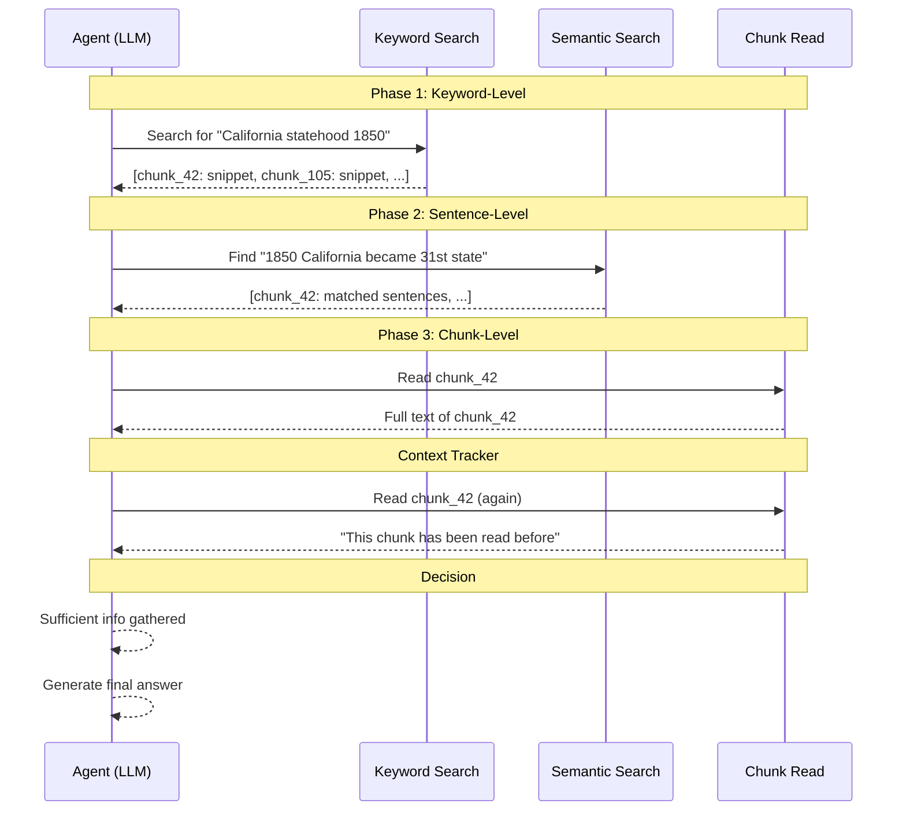

# A-RAG (Agentic RAG) 導讀：從固定 Workflow 到自主檢索的範式轉移

## TL;DR

- RAG 領域的主流方法可分為三大範式：Basic RAG（一次性檢索）、Graph RAG（圖結構輔助檢索）、Workflow RAG（預定義步驟的 agentic 檢索），但它們有一個共同的限制——模型無法真正參與檢索決策。
- A-RAG 提出階層式檢索介面（keyword_search、semantic_search、chunk_read），讓 pretrained reasoning model 自行決定何時用哪種工具、何時停止檢索，不需要任何訓練或預定義 workflow，在多個 multi-hop QA 基準上超越現有方法。
- 比較 Self-RAG（Workflow RAG 的代表，需 SFT 訓練模型執行固定 workflow）與 A-RAG，核心差異在於「固定策略 vs 自主策略」——前者訓練模型 follow 一個預先設計好的流程，後者設計 agent-friendly 的介面讓模型自行探索最佳策略。

---

## 背景與動機

### RAG 的發展脈絡

Retrieval-Augmented Generation（RAG）自 Lewis et al. (2020) 提出以來，已成為解決 LLM 事實錯誤問題的主流方法。核心想法很簡單：在 LLM 生成回答之前，先從外部知識庫檢索相關段落，將這些段落作為 context 拼接進輸入，讓 LLM 基於檢索到的資訊生成更準確的回應。

早期的 RAG 方法（Basic RAG）採用最直接的做法：對每個查詢檢索固定數量的段落，全部塞進 LLM 的 context window。這種做法雖然簡單，但問題也很明顯——對於不需要外部知識的查詢（如「寫一篇關於你暑假的作文」），強制檢索反而會引入雜訊、降低生成品質；對於需要多步推理的複雜查詢，一次性檢索的段落往往不夠全面。

為了解決這些限制，研究者開始探索更結構化的檢索方式。Graph RAG（Edge et al., 2025；Sarthi et al., 2024；Gutiérrez et al., 2025a）在離線階段建構實體關係圖或階層式摘要樹，試圖讓檢索到的資訊更全面、更有結構。RAPTOR（Sarthi et al., 2024）透過遞迴摘要建構樹狀結構，讓模型可以在不同抽象層級檢索。LightRAG（Guo et al., 2025）結合知識圖譜與向量檢索，同時支援局部和全域搜尋。HippoRAG（Gutiérrez et al., 2025a）則模仿海馬體記憶索引機制，使用 Personalized PageRank 實現高效的多跳推理。

但這些 Graph RAG 方法有一個根本限制：它們的檢索策略在設計時就固定了。即使首次檢索到的上下文不足，模型也不能利用其推理能力來迭代收集更完整的資訊。這些方法仍然屬於「預定義演算法」的範疇，而非真正的「模型驅動」決策。

### Workflow RAG 的興起與限制

隨著 LLM 的工具使用和推理能力大幅提升，研究者開始探索讓模型以更靈活的方式進行檢索。Workflow RAG 是這個方向的第一波嘗試。

這類方法的核心想法是：設計一個預定義的 workflow（例如「先決定是否需要檢索→如果需要則檢索→產生回答→檢查回答品質」），然後提示模型或訓練模型逐步執行這個 workflow。FLARE（Jiang et al., 2023）在生成信心度下降時觸發檢索。IRCoT（Trivedi et al., 2023）將 chain-of-thought 推理與檢索步驟交錯進行。RA-ISF（Liu et al., 2024）透過迭代自我回饋來分解複雜查詢。

而其中最具有代表性的方法，是 Asai et al. (2023) 提出的 **Self-RAG**。

Self-RAG 將 RAG 流程形式化為一個三段式程序：**判斷是否需要檢索 → 檢索並評估段落相關性 → 生成並批評自己的輸出**。它透過 SFT 訓練 LLM 生成特殊的 reflection tokens（如 `<Retrieve>`、`<ISREL>`、`<ISSUP>`、`<ISUSE>`），讓模型能夠在推理過程中自主決定何時檢索，並對自己的生成進行品質評估。

Self-RAG 相較於之前的 RAG 方法有明顯進步，但它仍然屬於 Workflow RAG 的範疇——workflow 在訓練階段就被固定下來了。模型學到的是「先判斷是否檢索，再處理段落，再批評輸出」這個固定的步驟序列，而不是根據任務特性靈活調整策略的能力。如果一個任務需要的不是「先檢索再生成」而是「先嘗試生成再根據不足補檢索」，Self-RAG 的固定 workflow 就無法應對。

### 範式轉移：從固定 Workflow 到自主 Agentic

A-RAG（Du et al., 2026）正是在這個背景下提出的。它的核心洞見是：**與其訓練模型去 follow 一個設計好的 workflow，不如設計 agent-friendly 的介面，讓 pretrained model 憑藉其已有的推理和工具使用能力，自行探索最佳策略。**

這個想法呼應了 LLM 領域的一個更大趨勢——從單輪文本理解與生成，轉向複雜推理與多步驟工具增強的互動（OpenAI, 2025；Anthropic, 2025；DeepSeek-AI et al., 2025）。當我們已經有 Claude Code、Cursor、Deep Research 這樣的 agentic 系統時，RAG 領域卻還在用固定 workflow，這個落差正是 A-RAG 想要填補的。

A-RAG 提出三個定義真正 agentic autonomy 的原則：

1. **Autonomous Strategy**（自主策略）：模型能根據任務特性自行選擇檢索策略，而非執行預定義的步驟序列。
2. **Iterative Execution**（迭代執行）：模型能多次迭代、逐步收集資訊，而非一次性檢索固定數量的段落。
3. **Interleaved Tool Use**（交錯工具使用）：模型能靈活地在推理和工具呼叫之間切換，而非按照固定的「檢索→生成」順序。

根據這三個原則，A-RAG 將現有 RAG 方法分為三個範式，並指出只有它自己滿足了所有三個條件，成為真正的 Agentic RAG。

### Agentic RAG 的設計原則

A-RAG 的三個自主原則不僅僅是分類工具，它們本身也構成了設計 agentic RAG 系統的指導方針：

**原則一：Autonomous Strategy（自主策略）**

模型必須能夠根據任務特性自行選擇檢索策略。什麼是「任務特性」？包括問題的複雜度（單跳 vs 多跳）、資訊粒度需求（精確事實 vs 全面了解）、推理類型（比較分析 vs 順序查找 vs 分類彙總）。

在實踐中，這意味著系統不能預先決定「先用哪個工具、再用哪個工具」。模型應該能夠：對一個簡單的事實查詢直接檢索並回答；對一個比較問題先檢索兩個實體的資訊再對比；對一個複雜的多跳問題逐步收集資訊。所有這些策略都不應該在系統設計時預先編排，而是由模型在推理時根據具體情況動態決定。

**原則二：Iterative Execution（迭代執行）**

模型必須能夠多次迭代、逐步收集資訊，而不是在第一次檢索後就開始生成回答。這個原則的關鍵在於：模型需要能夠評估「當前收集的資訊是否足夠回答問題？」如果不足，它應該知道下一步該做什麼——需要更多資訊就繼續檢索，需要不同角度的資訊就切換檢索策略，需要更詳細的內容就深入閱讀。

迭代執行的一個重要設計考量是終止條件。什麼時候模型應該停止檢索並開始生成？A-RAG 將這個決定完全交給模型——當模型認為已經收集到足夠資訊時，它會直接生成最終答案。但如果模型永遠不停止怎麼辦？論文透過設定最大迭代次數（5–20 步）來防止無限循環。

**原則三：Interleaved Tool Use（交錯工具使用）**

模型必須能夠靈活地在推理和工具呼叫之間切換。這與 Iterative Execution 密切相關——每次工具呼叫之間，模型應該進行推理，評估結果，決定下一步。

這個原則的一個重要隱含意義是：檢索不應該與生成分離。在許多傳統 RAG 系統中，檢索發生在生成之前，兩者是兩個獨立的階段。在 A-RAG 中，檢索和生成是交錯進行的——模型可以在生成一部分內容後發現需要更多資訊，然後呼叫檢索工具，獲得結果後繼續生成。

### 評估資料集生態

A-RAG 使用了四個多跳 QA 資料集，每個都有不同的特性和挑戰：

**HotpotQA（Yang et al., 2018）**：最經典的多跳推理資料集。問題需要組合 2–3 個維基百科段落才能回答。例如：「California 這個名字是怎麼來的？它是在哪一年成為美國的第 31 個州的？」——需要同時找到關於 California 命名的文章和關於美國領土擴張的文章。HotpotQA 的優勢在於人工標註的黃金推理路徑（supporting facts），方便分析模型的錯誤類型。

**2WikiMultiHopQA（Ho et al., 2020）**：從維基百科頁面自動合成問題，需要比較兩個實體的屬性。例如：「哪個國家的 GDP 更高，法國還是德國？」模型的檢索策略會與 HotpotQA 不同——不是順序查找多個事實，而是平行查找兩個實體的相同屬性。

**MuSiQue（Trivedi et al., 2022）**：由單跳問題組合而成的多跳資料集，可以精確控制推理難度（2 跳、3 跳、4 跳）。它的設計確保每個多跳問題都可以分解為一個單跳問題序列。這讓研究者可以精確分析模型在哪一步推理出錯。

**GraphRAG-Bench（Xiang et al., 2025）**：專門用於評估圖增強 RAG 方法的資料集，包含需要全域理解和跨文件推理的問題。這個資料集對需要結構化資訊整合的方法特別有挑戰性。

這四個資料集涵蓋了從簡單的多跳推理（2WikiMultiHopQA）到複雜的長文理解（GraphRAG-Bench）的完整範圍，為評估 A-RAG 的有效性提供了可靠的實驗基礎。

---

## 核心知識點

### 知識點 1：RAG 範式的四階段演進

A-RAG 在論文中對現有 RAG 方法進行了系統性的範式分類。論文的 Figure 2 用一個簡潔的對比圖說明了三種範式在三項自主原則上的差異：

**Basic / Naive RAG**：這是最早期的做法。對每個查詢，用固定的檢索演算法取回 K 個段落，全部拼接進 LLM 的輸入。代表作包括原始的 Lewis et al. (2020) RAG 以及後續各種 query rewriting 和 reranking 的改良。這種做法的優點是簡單，缺點是完全不考慮檢索的必要性和段落品質。它不滿足任何一項自主原則。

**Graph RAG**：在離線階段對語料庫建構結構化索引，如知識圖譜（GraphRAG）、階層式摘要樹（RAPTOR）、或混合索引（LightRAG、HippoRAG2）。檢索時利用圖結構或階層結構來取得更全面的資訊。但這些方法仍然使用固定的檢索演算法——模型無法在檢索結果不足時進行第二次嘗試。Graph RAG 滿足 Autonomous Strategy 嗎？不滿足——策略由檢索演算法決定，不是模型。滿足 Iterative Execution 嗎？不滿足——檢索是一次性的。滿足 Interleaved Tool Use 嗎？不滿足——沒有工具切換的概念。

**Workflow RAG**：設計預定義的 workflow，讓模型逐步執行。Self-RAG 透過 SFT 訓練模型生成 reflection tokens 來控制流程；FLARE 在生成信心度低時觸發檢索；IRCoT 將推理和檢索交錯進行。這些方法比起前兩個範式更靈活，但 workflow 本身在設計或訓練階段就固定了。Workflow RAG 部分滿足 Iterative Execution（可以多次迭代）和 Interleaved Tool Use（可以在推理和檢索之間切換），但**不滿足 Autonomous Strategy**——策略（先檢索還是先生成、什麼時候停止）由預定義的 workflow 決定，不是模型。

**Agentic RAG（A-RAG）**：不預定義任何 workflow，而是提供一套 agent-friendly 的檢索工具，讓模型自主決定何時用哪種工具、何時停止。模型可以針對不同任務自行發展出不同的 interaction strategy，從簡單的單次檢索到複雜的多步推理都能靈活應對。A-RAG 滿足全部三項自主原則。

### 知識點 2：Self-RAG 的 Reflection Token 機制

Self-RAG 的核心貢獻是引入了一組特殊的 reflection tokens，讓 LLM 在生成過程中能夠自我評估輸出品質。這個想法受到獎勵模型（reward model）和可控文字生成（controlled text generation）的啟發，但 Self-RAG 將它應用在 RAG 場景中，讓模型可以同時控制「是否檢索」和「輸出品質」。

**四種 Reflection Tokens 的詳細定義：**

第一種，`<Retrieve>`（輸出值：yes / no / continue）。這個 token 在每個 segment 生成之前預測。yes 代表需要檢索外部知識；no 代表不需要，模型直接用內部知識生成；continue 代表繼續生成不中斷。在訓練數據中，yes 的標註由 critic model 決定——如果一個 segment 包含事實性陳述（如「California 是 1850 年成為美國第 31 個州的」），就會被標記為需要檢索；如果只是主觀意見或個人經歷（如「我最喜歡的暑假是去加州海灘」），就會被標記為不需要檢索。

第二種，`<ISREL>`（輸出值：relevant / irrelevant）。這個 token 在檢索段落之後預測。如果檢索到的段落與查詢相關，標記為 relevant；如果不相關，標記為 irrelevant。不相關的段落會在後續處理中被過濾掉，不會影響生成。

第三種，`<ISSUP>`（輸出值：fully supported / partially supported / no support）。這個 token 在生成每個 segment 之後預測，評估生成的內容是否被檢索到的段落支持。fully supported 代表段落完整支持生成內容；partially supported 代表段落支持部分內容；no support 代表生成內容無法從段落中找到依據。這個 token 直接對應到事實準確性和 citation 品質。

第四種，`<ISUSE>`（輸出值：1–5 分）。這個 token 在每個 segment 結束時預測，評估該 segment 對整體回答的效用。1 代表完全無用，5 代表非常有用。這個 token 的評分獨立於檢索段落——即使某個 segment 完全由模型內部知識生成（沒有檢索），也可以獲得高分。

**訓練數據收集的細節：**

Self-RAG 的訓練數據收集依賴一個關鍵決策：使用 GPT-4 作為 teacher model 來生成 reflection token。對每組 token，研究者設計了不同的 instruction prompt：

- 對 `<Retrieve>`：prompt 為「Given an instruction, make a judgment on whether finding some external documents from the web helps to generate a better response.」
- 對 `<ISREL>`：prompt 為「Given an instruction, a piece of text, and a question, determine whether the passage is relevant to answering the question.」
- 對 `<ISSUP>`：prompt 為「Given an instruction, a question, a passage, and a response, determine whether the response is fully supported, partially supported, or not supported by the passage.」
- 對 `<ISUSE>`：prompt 為「Given an instruction and a response, rate the overall quality and usefulness of the response on a scale of 1 to 5.」

每個 prompt 都搭配了 few-shot demonstrations。總共收集了 4k–20k 筆訓練數據（每組 token 的數據量不同），然後用這些數據訓練 critic model。

**訓練流程的兩階段公式化：**

第一階段，訓練 critic model $C$。給定 $\mathcal{D}_{\text{critic}} = \{(x, y, r)\}$ 其中 $x$ 是輸入、$y$ 是輸出、$r$ 是 GPT-4 標註的 reflection token：

$$\max_{\theta_C} \mathbb{E}_{((x,y), r) \sim \mathcal{D}_{\text{critic}}} \log p_{\theta_C}(r|x, y)$$

critic model 的最終準確率（與 GPT-4 的 agreement）超過 90%，顯示 GPT-4 的蒸餾是有效的。

第二階段，訓練 generator model $M$。用 critic model 和 retriever $R$ 離線擴充訓練語料 $\mathcal{D}_{\text{gen}}$。對原始數據 $(x, y)$ 中的每個 segment $y_t$：

1. 用 $C$ 評估是否需要檢索
2. 如果需要，用 $R$ 檢索 K 個段落
3. 用 $C$ 評估每個段落的相關性（ISREL）和支持度（ISSUP）
4. 插入 reflection tokens 和檢索段落到 $y_t$ 前後

然後用生成數據訓練：

$$\max_{\theta_M} \mathbb{E}_{(x, y, r) \sim \mathcal{D}_{\text{gen}}} \log p_{\theta_M}(y, r|x)$$

訓練時，檢索段落（被 `
` 和 `
` 包圍的部分）會被 mask 掉，不參與 loss 計算。模型的詞表被擴充，加入 reflection tokens 作為新的 token。

**推理時的 Segment Score 計算：**

推理時，對每個 segment $y_t$，用 beam search（beam size $B$）選擇最佳輸出。segment 的得分計算為：

$$f(y_t, d, \text{Critique}) = \log p(y_t|x, d, y_{<t}) + \sum_{G \in \{\text{ISREL}, \text{ISSUP}, \text{ISUSE}\}} w_G \cdot s^G_t$$

其中 $s^G_t$ 是 token type $G$ 中最理想 token 的歸一化機率，$w_G$ 是推理時可調整的權重。

**Self-RAG 的優點與限制：**

優點：訓練成本低於 RLHF（因為 reflection token 是離線插入訓練數據的，不需要在訓練過程中跑 reward model）；可控性高（可調整 retrieval threshold 和各維度權重）；支援 citation 和歸因。在長文生成任務中，Self-RAG 的 citation precision 和 recall 顯著優於其他方法。

限制：（1）依賴 GPT-4 生成訓練數據，增加成本又影響可重現性——如果 GPT-4 的 API 行為改變，重新生成訓練數據可能產生不一致的結果；（2）beam search over K 個段落 × B 個 beam 的計算開銷大，實際部署時可能需要取捨；（3）最重要的——workflow 在設計時就固定了，模型無法跨越不同任務類型自適應調整策略。Self-RAG 的論文也提到，對每個 segment 都要執行完整的 retrieve → generate → critique 流程，這個開銷在長文生成任務中會累積。

### RAG 範式演進對比

下面的 Mermaid 圖展示了四種 RAG 範式在三項自主原則上的差異（對應論文的 Figure 2）：

```mermaid
graph TB
    subgraph "Basic RAG"
        A1[Query] --> A2[Retrieve K Passages]
        A2 --> A3[Concatenate + Generate]
    end

    subgraph "Graph RAG"
        B1[Query] --> B2[Graph Structure Retrieval]
        B2 --> B3[Predefined Algorithm]
        B3 --> B4[Generate]
    end

    subgraph "Workflow RAG (Self-RAG)"
        C1[Query] --> C2{Need Retrieval?}
        C2 -->|Yes| C3[Retrieve + Evaluate]
        C2 -->|No| C4[Generate Directly]
        C3 --> C5[Generate with Critique]
        C4 --> C5
        C5 --> C6[Beam Search Selection]
        C6 --> C7{More Segments?}
        C7 -->|Yes| C2
        C7 -->|No| C8[Final Answer]
    end

    subgraph "Agentic RAG (A-RAG)"
        D1[Query] --> D2[Observe State]
        D2 --> D3[Decide Action]
        D3 -->|Keyword Search| D4[Get Snippets]
        D3 -->|Semantic Search| D5[Get Snippets]
        D3 -->|Chunk Read| D6[Get Full Chunk]
        D4 --> D7[Update Context]
        D5 --> D7
        D6 --> D7
        D7 --> D8{Sufficient?}
        D8 -->|No| D2
        D8 -->|Yes| D9[Generate Answer]
    end
```

### A-RAG 階層式檢索流程

下面的 Mermaid 圖展示了 A-RAG 的三層檢索工具如何在 progressive disclosure 原則下協作：

這個 progressive disclosure 的流程是 A-RAG token 效率的核心——每次只揭露需要的資訊量，從最輕量的關鍵字匹配到最完整的段落閱讀。

A-RAG 的核心設計是三層檢索工具，分別對應不同粒度的資訊存取。論文中的 Figure 3 展示了完整的架構。

**第一層：keyword_search（關鍵字搜尋）**

這個工具執行精確的詞彙匹配（exact text matching）。與傳統的 inverted index 不同，A-RAG 不在離線階段建構任何索引——keyword search 在查詢時即時掃描所有 chunk 文本進行字串匹配。

模型提供一個關鍵字列表 $K = \{k_1, k_2, \ldots, k_m\}$ 和一個結果數量參數 $k$。每個 chunk $c_i$ 的相關性分數計算為：

$$\text{Score}_{\text{kw}}(c_i, K) = \sum_{k \in K} \text{count}(k, T_i) \cdot |k|$$

公式中的兩項乘積值得深入分析。$\text{count}(k, T_i)$ 是關鍵字 $k$ 在 chunk 文本 $T_i$ 中出現的頻率——出現越多次，$c_i$ 可能越相關。但頻率單獨使用會有問題：如果一個 chunk 反覆出現「state」這個常見詞，但實際上與查詢無關，頻率就會誤導。為了解決這個問題，設計引入了 $|k|$ 作為加權因子——更長的關鍵字（如「California」長度為 10）比分數被自然放大，而短的常見詞（如「the」長度為 3）的權重就低得多。這是一個簡單但有效的啟發式過濾。

對於每個匹配到的 chunk，工具會建構一個簡短的 snippet——只包含含有至少一個關鍵字的句子：

$$\text{Snippet}(c_i, K) = \{s \in \text{Sent}(c_i) \mid \exists k \in K, k \in s\}$$

snippet 的設計很重要——它讓模型在不需要完整閱讀 chunk 的情況下就能判斷該 chunk 是否值得進一步探索。這正是 progressive information acquisition 的核心。

keyword_search 的計算複雜度是 $O(|K| \cdot N \cdot L)$，其中 $N$ 是 chunk 數量，$L$ 是平均 chunk 長度。對大型語料庫來說，即時掃描所有文本可能成為瓶頸。但 A-RAG 論文的實驗設定中，語料庫大小在數萬個 chunk 的規模，即時掃描是可以接受的。對更大規模的語料庫，可能需要引入近似匹配或分區索引。

**第二層：semantic_search（語意搜尋）**

這個工具使用 dense retrieval 來尋找語意相似的段落。給定自然語言查詢 $q$，先將其編碼為 query embedding $v_q = f_{\text{emb}}(q)$，然後與所有 sentence embeddings 計算 cosine similarity：

$$\text{Score}_{\text{sem}}(s_{i,j}, q) = \frac{v_{i,j}^T v_q}{\|v_{i,j}\| \|v_q\|}$$

句子級檢索（而非 chunk 級檢索）是這裡的關鍵設計。為什麼要檢索句子而不是直接檢索 chunk？有兩個原因。第一，檢索粒度更細：一個 chunk 可能包含多個不同的主題（例如一個 chunk 同時提到 California 的命名由來和它的地理特徵），chunk 級檢索只能找到「大致相關」的 chunk，句子級檢索能精準定位到 chunk 內部最相關的句子。第二，sentence embedding 的語意表徵通常比 long document embedding 更準確——長文本的平均 embedding 會稀釋關鍵資訊的語意強度。

檢索到 top-ranked sentences 後，再按 parent chunk 聚合。聚合策略是取 chunk 內所有句子中的最高分作為該 chunk 的分數：

$$\text{Score}_{\text{sem}}(c_i, q) = \max_{j \in \{1, \ldots, n_i\}} \text{Score}_{\text{sem}}(s_{i,j}, q)$$

論文使用 Qwen3-Embedding-0.6B（Zhang et al., 2025b）作為 embedding model，$k=5$ 為檢索結果數。

**第三層：chunk_read（段落閱讀）**

基於 keyword_search 和 semantic_search 傳回的 snippets（僅含關鍵句的摘要），模型可以自行判斷哪些 chunk 需要完整閱讀，然後用這個工具存取該 chunk 的完整內容。模型也可以讀取相鄰 chunk 來獲得更全面的上下文。

這個三層設計的關鍵在於「漸進式資訊獲取」——模型從最輕量級的關鍵字匹配開始，逐步深入到語意層級的比對，最後只在必要時才讀取完整的段落內容。這與傳統 RAG 方法「一次性檢索大量段落再全部塞進 context」的做法形成鮮明對比。

### 知識點 4：Progressive Information Acquisition（漸進式資訊獲取）

A-RAG 的資訊獲取策略可以用一句話概括：**先看標題，再讀摘要，最後才翻到那頁**。

具體來說，keyword_search 和 semantic_search 回傳的不是完整段落，而是只有相關句子的 snippet。這類似於搜尋引擎的結果頁——你看到的是標題和一段摘要，而不是整個網頁的內容。模型根據這些 snippets 判斷哪些 chunk 值得完整閱讀，然後才用 chunk_read 取得完整內容。

這個設計帶來兩個好處。第一，**Token 效率極高**。實驗數據顯示，A-RAG (Full) 在 HotpotQA 上平均僅檢索 2,737 tokens，遠低於 Naive RAG 的 5,358 tokens 和 GraphRAG 的 8,744 tokens。換句話說，A-RAG 用更少的 token 達到了更高的準確率。第二，**避免雜訊**。傳統 RAG 將大量可能不相關的段落強行塞進 context，這些雜訊會干擾 LLM 的推理。A-RAG 透過漸進式揭露讓模型只讀取真正需要的資訊。

**Context Tracker 的設計與效果：**

A-RAG 還設計了一個 **Context Tracker**——一個記錄已讀取 chunk 的集合 $C_{\text{read}} = \{c_{i_1}, c_{i_2}, \ldots, c_{i_k}\}$。當模型嘗試讀取一個已讀過的 chunk 時，chunk_read 工具會回傳「This chunk has been read before」，不消耗額外的 token。

這個機制有兩個效果。第一，直接節省 token——如果模型反覆嘗試讀取同一個 chunk（例如因為 Agent Loop 在多次迭代中引用了同一份資料），Context Tracker 會攔截這些重複請求。第二，間接引導探索行為——當模型發現某個 chunk 已經讀過時，它會傾向於嘗試其他 chunk，而不是停留在同一份資料上。這個行為模式更接近人類專家的閱讀策略——我們不會反覆讀同一頁，除非那頁的內容特別關鍵。

Context Tracker 的 token 節省效果非常顯著。從 Table 3 的數據來看，A-RAG (Naive)（沒有 Context Tracker）平均檢索 22k–56k tokens，而 A-RAG (Full) 僅需 2.7k–7.6k tokens——相差約一個數量級。當然這個差異主要來自層級式檢索的設計（而非單一的 Context Tracker），但 Context Tracker 在防止浪費性重複讀取方面扮演了重要角色。

### 知識點 5：Test-Time Scaling 行為

A-RAG 對 test-time scaling 進行了系統性的研究，這是它與 Self-RAG 的一個重要區別——Self-RAG 沒有討論過 scaling 行為。

實驗在 MuSiQue 的前 300 個任務上進行，觀察兩個 scaling 維度：

**Max Steps Scaling：** 將最大迭代次數從 5 步增加到 20 步。論文的 Figure 4（左側圖表）展示了這個曲線：

- GPT-5-mini：LLM-Acc 從約 62% 提升到約 70%（+8%），曲線在 15 步後開始飽和
- GPT-4o-mini：LLM-Acc 從約 44% 提升到約 48%（+4%），曲線在 10 步後就飽和了

這個差異說明了更強的 reasoning model 能更有效地利用 longer horizon exploration——它們有能力在更多步驟中做出更好的決策，而不只是浪費 token。GPT-4o-mini 在超過 10 步之後就無法繼續改善，因為它的推理能力不足以在 longer horizon 中做出有效的探索。GPT-5-mini 則可以持續改善到約 15 步。

**Reasoning Effort Scaling：** 將 reasoning effort 從 minimal 增加到 high。論文的 Figure 4（右側圖表）：

- GPT-5-mini：LLM-Acc 從約 44% 提升到約 69%（+25%）
- GPT-5：LLM-Acc 從約 52% 提升到約 76%（+24%）

這個提升幅度非常大。reasoning effort 從 minimal 到 high 的變化，實際上改變了模型在每個步驟的推理深度——在高 reasoning effort 下，模型會花更多 token 在「思考該用哪個工具、下一步要做什麼」上，而不是急於執行工具呼叫。這與當前的「思考模型」（如 o1、DeepSeek-R1）的哲學一致——更多的推理時間帶來更好的決策品質。

這兩個 scaling 實驗指向同一個結論：**A-RAG 的效能瓶頸在 backbone model 的能力，而不是框架設計**。隨著 reasoning model 的進步，A-RAG 的效能會自然提升。

### 知識點 6：固定 Workflow vs 自主 Agentic——核心差異

Self-RAG 和 A-RAG 雖然都屬於「讓模型參與檢索決策」的大方向，但它們的實現哲學有根本差異：

| 維度 | Self-RAG（Workflow RAG） | A-RAG（Agentic RAG） |
|------|--------------------------|----------------------|
| 核心哲學 | 訓練模型 follow 固定 workflow | 設計 agent-friendly 介面讓模型自由探索 |
| 訓練需求 | SFT + critic model 蒸餾 | 不需訓練 |
| 檢索決策 | Reflection token 控制固定流程 | 模型自主選擇工具和策略 |
| Workflow | Retrieve → Generate → Critique（固定） | 無預設 workflow，模型自行發展 |
| 檢索粒度 | 段落級（固定） | Keyword → Sentence → Chunk（多粒度） |
| 可控性 | Reflection token 權重調整 | 工具選擇 + Max Steps + Reasoning Effort |
| Token 效率 | 無特別優化 | Progressive disclosure + Context Tracker |
| Scaling | 未探討 | 系統性 Test-Time Scaling 分析 |
| 實作複雜度 | 高（需 GPT-4 生成訓練數據 + critic + retriever + generator） | 低（直接使用 pretrained model + 三個工具函數） |
| 推理成本 | O(S × K × B) 其中 S=segments, K=documents, B=beam size | O(S × T) 其中 T=平均 steps |
| 最強項目 | 長文生成 + citation accuracy | 多跳推理 + token 效率 |
| 泛化性 | 需要特定任務訓練 | 零樣本直接使用 |

從 Token 效率的維度來看，差距更加明顯。Self-RAG 對每個 segment 都要檢索 K 個段落、並行處理、beam search 選最佳。在長文生成任務中，如果輸出有 20 個 segment、K=5、B=2，那麼每個 segment 需要處理 5×2=10 個候選，總共 20×10=200 次 forward pass。A-RAG 每次迭代只呼叫一個工具、處理一個結果，迭代次數由模型自主決定，通常 5–15 步即可完成。

這個對比揭示了一個更深層的問題：**當我們說「讓模型自主檢索」時，我們真正應該做的是訓練一個 better follower 還是提供一個 better playground？** Self-RAG 選擇前者——訓練模型更好地執行一個固定流程。A-RAG 選擇後者——設計更好的工具和介面，讓模型憑藉其已有的能力去探索和發現。從實驗結果來看，後者的策略不僅更簡單，效果也更好。

---

## 從 Self-RAG 到 A-RAG 的演進脈絡

### Self-RAG 的核心貢獻：讓 LLM 學會對自己的生成進行批評

在 Self-RAG 之前，RAG 領域的主流做法是「檢索多個段落，全部拼接進輸入，然後讓 LLM 生成回答」。這個方法最大問題是：LLM 無法自主決定何時需要檢索，也無法對檢索到的內容品質進行評估。一個關於「你最喜歡的暑假」的作文不需要檢索任何外部知識，但 Basic RAG 仍然會強制檢索一堆不相關的段落。

Self-RAG 的關鍵突破是讓 LLM 學會**自我評估**。透過 reflection tokens，LLM 能夠在生成的同時評估（1）當前是否需要外部知識、（2）檢索到的段落是否相關、（3）自己的輸出是否被段落支持、（4）整體輸出品質如何。這種自我評估能力讓 LLM 在不需要檢索時可以跳過檢索步驟，在需要檢索時可以過濾不相關的段落。

Self-RAG 還引入了一個精巧的推理機制：當檢索到多個段落時，模型會並行處理每個段落，然後用 reflection token 的機率來計算每個 segment 的品質分數，透過 beam search 選擇最好的輸出。設計上它特別適合需要 citation 和歸因的長文生成任務。在 Self-RAG 的論文中，它在 ALCE-ASQA 資料集上的 citation precision 達到 77.1%，遠超過其他方法。

**Self-RAG 的 Algorithm 1（推理流程）：**

論文提供了完整的推理演算法（Algorithm 1），可以歸納為以下步驟：

對於每個輸入 $x$ 和先前生成 $y_{<t}$：

1. 模型預測 `<Retrieve>` token。如果為 yes，進入步驟 2；如果為 no，直接生成 $y_t$ 並預測 `<ISUSE>`
2. 用 retriever $R$ 檢索 K 個相關段落 $D$
3. 對每個段落 $d \in D$：
   a. 模型預測 `<ISREL>`（段落相關性）
   b. 如果 relevant，生成 $y_t$（候選輸出）
   c. 模型預測 `<ISSUP>`（輸出支持度）和 `<ISUSE>`（整體效用）
4. 根據 $\{\text{ISREL}, \text{ISSUP}, \text{ISUSE}\}$ 的權重排序所有候選 $y_t$
5. 選擇最佳候選作為當前 segment 的輸出

這個演算法的時間複雜度是 $O(K)$，因為步驟 3 對 K 個段落都執行了完整的生成和批評。

但 Self-RAG 的根本限制在於它訓練模型去 follow 一個固定的三段式流程。這個流程雖然比 Basic RAG 靈活，但仍然是線性的、固定順序的。試想一個多跳推理的場景：問題是「California 這個名字是怎麼來的？它是在哪一年成為美國的第 31 個州的？」Self-RAG 的固定流程會先檢索關於 California 命名的資訊，生成一個 segment，然後再檢索關於 California 成為第 31 州的資訊。但如果檢索到的第一個資訊不足，它無法根據已生成的內容調整下一步的檢索策略——它只能按照既定的流程繼續。

### A-RAG 的關鍵洞見：介面設計 > 流程設計

A-RAG 的出發點是一個簡單的觀察：**當前的 frontier LLM 已經具備了強大的推理和工具使用能力**。GPT-5、Claude Sonnet 4、DeepSeek-R1 這些模型在 coding agent、deep research 等場景中展現了令人驚嘆的自主決策能力。但在 RAG 領域，我們卻還在用固定 workflow 來限制它們。

A-RAG 的關鍵洞見是：與其花費大量成本訓練模型去 follow 一個特定 workflow，不如直接給模型一套設計良好的檢索工具，讓它自己決定怎麼用。這個想法類似於在 GUI 出現之前，使用者需要記住複雜的命令序列；GUI 的出現讓使用者可以透過視覺介面直觀地操作，而無需記憶固定流程。

具體來說，A-RAG 的設計包含了三個層次的架構：

**第一層：階層式索引（Hierarchical Index）**

A-RAG 的索引建構非常輕量——僅包含兩個步驟：chunking 和 embedding。

Chunking：跟隨 LinearRAG（Zhuang et al., 2025）的設定，將語料庫分割為約 1,000 tokens 的 chunk，chunk 邊界對齊句子邊界以保持語意完整性。每個 chunk 作為一個自包含的語意單元，agent 可以透過專屬的檢索介面選擇性地存取它。

Embedding：對每個 chunk $c_i$，先分解為句子 $\{s_{i,1}, s_{i,2}, \ldots, s_{i,n_i}\}$（使用基於規則的句子分割），然後對每個句子計算 dense vector representation：$v_{i,j} = f_{\text{emb}}(s_{i,j})$。

值得注意的是，A-RAG 刻意避免建構 inverted index 或知識圖譜——keyword-level 的檢索直接在查詢時進行 exact text matching。這個設計選擇大幅降低了索引時間和計算成本。

**第二層：檢索工具（Retrieval Tools）**

如知識點 3 所述，三層工具提供了不同粒度的資訊存取。但更關鍵的是這些工具的設計哲學：**它們回傳的是資訊，而不是答案**。keyword_search 和 semantic_search 回傳的是 snippet——一段簡短的摘要，讓模型可以決定是否需要更多資訊。chunk_read 才回傳完整內容。這種 progressive disclosure 的設計讓模型在每一個步驟都有機會行使判斷力：這個 snippet 夠了嗎？我需要讀完整內容嗎？還是試試另一種檢索方式？

**第三層：Agent Loop**

A-RAG 刻意採用最簡單的 ReAct-like agent loop，避免複雜的編排機制干擾對介面效果的觀察。在每一個 iteration：

1. 模型觀察當前狀態（已收集的資訊、已讀取的 chunk）
2. 模型決定下一步動作（呼叫某個檢索工具或直接生成最終答案）
3. 如果呼叫工具，觀察回傳結果
4. 重複步驟 1–3，直到模型決定生成答案或超過最大迭代次數

Context Tracker（$C_{\text{read}}$）確保模型不會重複讀取相同的資訊。

當達到最大迭代次數但模型還沒有生成答案時，A-RAG 會提示模型基於已收集的資訊合成一個回應。這個 fallback 機制確保即使模型陷入無限循環（一直在檢索但從不給答案），系統也不會永遠持續下去。

這個設計的巧妙之處在於它的「簡潔性」——不是因為作者想不到更複雜的設計，而是因為越簡單的設計越能凸顯階層式檢索介面的效果。實驗結果證明這個策略是對的：即使是最簡單的 A-RAG (Naive)——只有一個 embedding-based 檢索工具——就已經超越了所有 Workflow RAG 和 Graph RAG 方法。

### 為什麼 Workflow RAG 容易被 A-RAG 超越？

從論文中的實驗數據可以觀察到一個有趣的現象：在 GPT-5-mini 作為 backbone 時，A-RAG 與基線方法的差距比使用 GPT-4o-mini 時更大。在 GPT-4o-mini 上，A-RAG (Full) 在 5 個資料集中有 3 個取得最佳成績；在 GPT-5-mini 上，A-RAG (Full) 在所有資料集上都取得最佳成績，且領先幅度更大。

以 MuSiQue 為例，在 GPT-4o-mini 上 A-RAG (Full) 達到 46.1%（LLM-Acc），最佳基線是 A-RAG (Naive) 的 43.8%（差距 +2.3%）。但在 GPT-5-mini 上，A-RAG (Full) 達到 74.1%，最佳基線是 HippoRAG2 的 52.8%（差距 +21.3%）。這個巨大的差距變化說明了：

1. GPT-5-mini 的推理能力讓 A-RAG 能夠更有效地使用檢索工具
2. 固定 workflow 方法（如 HippoRAG2、LinearRAG）在強模型上也無法從 backbone 的進步中受益
3. 隨著 backbone 模型變強，A-RAG 的優勢會持續擴大

這個現象有一個合理的解釋：當 backbone 模型的能力越強時，固定的 workflow 就越成為瓶頸。強模型有能力做出更好的決策、探索更複雜的策略，但固定 workflow 不讓它這麼做。相反地，A-RAG 的 agent-friendly 介面讓強模型可以完全發揮其優勢——模型越強，A-RAG 的效果越好。

這也解釋了為什麼 A-RAG (Naive) 能夠超越許多更複雜的 Graph RAG 和 Workflow RAG 方法。Naive A-RAG 只有一個 embedding-based 檢索工具，但因為它給了模型決定何時檢索、何時停止的自主權，就已經勝過了那些有複雜圖結構但缺乏自主性的方法。

### 實驗數據深入分析

**主要結果（Table 1 完整數據）**

以下為所有方法在四個資料集上的完整表現（LLM-Acc %）：

**GPT-4o-mini backbone：**

| 方法 | MuSiQue | HotpotQA | 2Wiki | Med. LLM | Novel LLM |
|------|---------|----------|-------|----------|-----------|
| Direct Answer | 18.3 | 45.4 | 30.3 | 49.7 | 68.6 | 45.3 |
| Naive RAG | 38.6 | 74.5 | 42.6 | 59.0 | 51.3 | 28.8 |
| GraphRAG | 26.4 | 33.2 | 18.4 | 47.2 | 72.0 | 70.1 |
| HippoRAG2 | 40.6 | 80.7 | 64.7 | 68.5 | 53.1 | 45.4 |
| LinearRAG | 34.8 | 72.0 | 62.9 | 62.3 | 42.5 | 33.3 |
| FaithfulRAG | 28.8 | 60.5 | 38.8 | 38.1 | 62.3 | 44.5 |
| MA-RAG | 34.1 | 52.5 | 27.7 | 50.3 | 67.7 | 61.3 |
| RAGentA | 32.2 | 60.6 | 51.0 | 53.4 | 79.0 | 70.0 |
| A-RAG (Naive) | 43.8 | 54.4 | 60.2 | 63.7 | 79.4 | 72.7 |
| A-RAG (Full) | **46.1** | **76.6** | **77.1** | **74.0** | **90.5** | **80.4** |

**GPT-5-mini backbone：**

| 方法 | MuSiQue | HotpotQA | 2Wiki | Med. LLM | Novel LLM |
|------|---------|----------|-------|----------|-----------|
| Direct Answer | 35.8 | 63.6 | 51.3 | 54.0 | 87.3 | 45.1 |
| Naive RAG | 52.8 | 81.2 | 50.2 | 66.5 | 78.2 | 70.6 |
| GraphRAG | 48.3 | 82.5 | 66.5 | 70.7 | 79.2 | 77.1 |
| HippoRAG2 | **52.8** | 84.8 | 82.0 | 79.7 | 75.4 | 54.3 |
| LinearRAG | 48.3 | 86.2 | **87.2** | **84.8** | 68.3 | 54.7 |
| FaithfulRAG | 40.0 | 76.9 | 51.8 | 56.6 | 73.7 | 60.7 |
| MA-RAG | 38.3 | 67.1 | 24.0 | 53.5 | 92.7 | 45.1 |
| RAGentA | 37.4 | 61.2 | 61.2 | 65.0 | 93.1 | 60.2 |
| A-RAG (Naive) | 66.2 | 57.9 | 54.7 | 54.3 | 86.1 | 85.3 |
| A-RAG (Full) | **74.1** | **90.8** | **94.5** | **89.7** | **92.7** | **85.3** |

A-RAG (Full) 在 GPT-5-mini 下全面領先，特別是在需要深度推理的資料集（MuSiQue +21.3%、Novel LLM +8.2%）上優勢更為顯著。

**消融實驗（Table 2）完整數據：**

A-RAG 的消融實驗系統性地移除每個檢索工具。完整版的消融結果（GPT-5-mini backbone, LLM-Acc %）：

| 變體 | MuSiQue | HotpotQA | 2Wiki | Med. LLM | Novel LLM |
|------|---------|----------|-------|----------|-----------|
| A-RAG (Full) | **74.1** | **94.5** | **89.7** | **93.1** | **85.3** |
| w/o Keyword Search | 72.6 | 93.0 | 88.9 | 93.2 | 85.0 |
| w/o Semantic Search | 69.4 | 93.9 | 89.1 | 92.1 | 85.2 |
| w/o Chunk Read | 73.6 | 93.6 | 89.0 | 93.3 | 85.1 |

分析消融結果，可以發現幾點：

- 移除 semantic_search 在 MuSiQue 上造成最大下降（從 74.1% 降至 69.4%，-4.7%）。這說明在複雜多跳推理任務中，語意檢索是三個工具中最關鍵的。
- 移除 keyword_search 在 HotpotQA 和 2Wiki 上造成可測量的下降（-1.5% 和 -0.8%）。這兩個資料集都包含大量專有名詞，精確實體匹配確實有幫助。
- 移除 chunk_read 的影響最小（平均 -0.4%）。這可能是因為在 1,000 token 的 chunk 大小下，直接回傳完整 chunk 文本的效果與 snippet 加 chunk_read 的效果相當。但在更大型的語料庫或更長的 chunk 設定下，chunk_read 的優勢應該會更明顯。

**Token 效率（Table 3）完整數據：**

A-RAG (Full) 在 token 效率上的優勢非常明顯。與 A-RAG (Naive) 相比，Full 版本的 token 消耗降低了 85%–94%，同時準確率提高了。這說明了層級式檢索的核心優勢——不是檢索更多，而是檢索更精準。

| 方法 | MuSiQue | HotpotQA | 2Wiki | Med. LLM | Novel LLM |
|------|---------|----------|-------|----------|-----------|
| Naive RAG | 5,387 | 5,358 | 5,506 | 5,418 | 4,997 |
| HippoRAG2 | 5,411 | 5,380 | 5,538 | 5,447 | 5,019 |
| GraphRAG | 9,234 | 8,744 | 4,201 | 9,391 | 9,318 |
| LinearRAG | 5,418 | 5,353 | 5,518 | 5,427 | 4,998 |
| FaithfulRAG | 5,342 | 5,310 | 5,419 | 5,410 | 4,994 |
| MA-RAG | 9,566 | 8,007 | 8,857 | 6,858 | 6,101 |
| A-RAG (Naive) | 56,360 | 27,455 | 45,406 | 23,657 | 22,391 |
| A-RAG (Full) | **5,663** | **2,737** | **2,930** | **7,678** | **6,087** |

A-RAG (Naive) 的 token 消耗非常大——因為它只有一個 embedding-based 工具，無法精準定位到需要的資訊，只能大量檢索。A-RAG (Full) 透過階層式介面大幅降低了 token 消耗，甚至在 HotpotQA 上只用了 Naive RAG 一半的 token。

### 失敗模式分析（Section 5.3 深入解讀）

論文的 Figure 5 展示了 A-RAG 在 MuSiQue 上的錯誤分析。研究者人工審閱了 A-RAG 最初的 100 個錯誤案例，並將其分為兩層分類：

**第一層分類（主要錯誤類型）：**

- **Reasoning Chain Errors**（佔比最大，約 55–60%）：模型在推理過程中犯了錯，而不是檢索出了問題。這是 A-RAG 最主要的失敗原因。這部分的錯誤又可以細分為三個子類型。
- **Retrieval Errors**（約 25–30%）：模型沒有檢索到足夠或正確的資訊來回答問題。這可能是因為檢索工具沒能找到相關資訊，也可能是模型選擇了錯誤的檢索策略。
- **Generation Errors**（約 10–15%）：模型即使有足夠的資訊，也無法產生正確的回答。這通常表現為模型忽略或誤解了已檢索到的資訊。

**第二層分類（Reasoning Chain 的子類型）：**

- **Entity Confusion**（最常見的子類型，約佔 Reasoning Chain Errors 的 40–45%）：模型混淆了不同的實體。例如，問題問的是「California 的命名由來」，但模型找到的是關於「California 的地理位置」或「California 的歷史」的資訊，然後用這些不相關的資訊來回答。這反映了模型在跨實體推理時的弱點——它可能記住了某個實體的部分事實，但在需要精確對應時出錯。
- **Wrong Retrieval Strategy**（約佔 Reasoning Chain Errors 的 30–35%）：模型選擇了錯誤的檢索策略。例如，對一個需要 semantic_search 來找到同名但不同指稱的實體的查詢，模型使用了 keyword_search，結果找到了錯誤的實體。或者是對一個需要多次迭代檢索的多跳問題，模型過早停止了檢索，只收集了部分資訊就開始生成答案。
- **Question Misunderstanding**（約佔 Reasoning Chain Errors 的 20–25%）：模型誤解了問題的真正意圖。例如，問題問的是「哪個國家的 GDP 更高？」，但模型理解成了「這兩個國家的 GDP 分別是多少？」這類錯誤通常發生在問題結構複雜或包含多個子問題的場景中。

**第三層細節：**

論文進一步分析了 Retrieval Errors 的子類型。最常見的是「關鍵字語意歧義」——例如 keyword_search 找到了包含相同關鍵字但不同語意的段落。其次是「embedding 檢索的 false negative」——語意相關但詞彙不同的段落沒有被檢索到。

這個失敗模式分析揭示了 A-RAG 目前的瓶頸與其說是檢索能力，不如說是模型的推理能力。這與 test-time scaling 實驗的結論一致——當 backbone 模型更強時，A-RAG 的效果也更好。特別值得注意的是，Entity Confusion 這個最常見的錯誤類型，本質上是 LLM 的知識回憶和推理問題，而非檢索問題。這意味著 A-RAG 的剩餘提升空間主要在 backbone model 層面，而不是框架設計層面。

---

## 方法與比較

### 核心數學推導補完

A-RAG 的論文在介紹 keyword_search 和 semantic_search 時給出了數學公式，但有幾個推導細節值得補充說明。

**Keyword Search 的加權設計**

$$\text{Score}_{\text{kw}}(c_i, K) = \sum_{k \in K} \text{count}(k, T_i) \cdot |k|$$

這個公式的設計有兩個意圖。第一，用關鍵字出現次數 $\text{count}(k, T_i)$ 來衡量 chunk $c_i$ 中該關鍵字的重要性——出現越多次，chunk 可能越相關。第二，用關鍵字長度 $|k|$ 來加權——更長的關鍵字通常更具體（例如「California」比「state」更具體），所以權重更高。

一個有趣的設計選擇是：A-RAG 不使用 TF-IDF 或 BM25 這些更成熟的檢索演算法，而是使用了自己設計的簡化加權方案。這可能是因為 TF-IDF 需要全域統計（document frequency），在 agentic 設定中每次檢索的「語料庫」可能是整個 chunk 集合，計算 IDF 成本較高。而且 A-RAG 的 keyword_search 只是作為一個「快速篩選」工具，不需要太高的精確度。

另一個隱含的假設是：所有檢索工具回傳的結果都是 top-k，即只回傳分數最高的 $k$ 個結果。這個 $k$ 是由模型在呼叫工具時指定的參數。模型可以根據需求調整 $k$ 的大小——如果需要更全面的覆蓋，可以指定較大的 $k$；如果只需要快速確認，可以指定較小的 $k$。

**Semantic Search 的句子級檢索與聚合**

$$\text{Score}_{\text{sem}}(s_{i,j}, q) = \frac{v_{i,j}^T v_q}{\|v_{i,j}\| \|v_q\|}$$

句子級檢索的設計是 A-RAG 的一個重要創新。傳統的 RAG 方法通常對固定大小的段落（如 100–500 tokens）進行檢索，A-RAG 則是對每個句子進行檢索。句子級檢索的計算成本更高（需要嵌入和檢索 N 倍數量的句子，而不是 M 個 chunk，其中 N 通常大於 M），但它提供了更精準的定位能力。

聚合步驟：取得 top-k 句子後，按 parent chunk 分組。每個 chunk 的相關性分數由其中得分最高的句子決定——這是 max pooling 策略。這個策略的合理性在於：只要 chunk 中有一個句子高度相關，這個 chunk 就值得被模型進一步閱讀。min pooling 或 average pooling 都不適合——它們會因為 chunk 中包含不相關的句子而低估相關性。

**Self-RAG 的 Segment Score 與推導**

Self-RAG 的 segment score 公式為：

$$f(y_t, d, \text{Critique}) = \log p(y_t|x, d, y_{<t}) + \sum_{G \in \{\text{ISREL}, \text{ISSUP}, \text{ISUSE}\}} w_G \cdot s^G_t$$

這個公式由兩部分組成。第一部分 $\log p(y_t|x, d, y_{<t})$ 是標準的語言模型生成機率——模型對 $y_t$ 的偏好程度。第二部分是批評分數的加權和——critique tokens 對 $y_t$ 品質的評估。

$s^G_t$ 的具體計算為：

$$s^G_t = \frac{p_t(\hat{r})}{\sum_{i=1}^{N_G} p_t(r_i)}$$

其中 $\hat{r}$ 是 token type $G$ 中最理想的 token（如 ISREL 的「relevant」、ISSUP 的「fully supported」），$N_G$ 是該 type 的 token 數量。這個歸一化確保每個維度的分數都在 [0, 1] 範圍內。

權重 $w_G$ 在推理時可以調整。例如：
- 如果任務強調事實準確性：設置 $w_{\text{ISSUP}} = 2.0, w_{\text{ISREL}} = 1.0, w_{\text{ISUSE}} = 0.5$
- 如果任務強調整體品質：設置 $w_{\text{ISUSE}} = 2.0, w_{\text{ISREL}} = 1.0, w_{\text{ISSUP}} = 0.5$
- 如果想檢索更頻繁：降低 retrieval threshold

**Chunk Read 與 Context Tracker**

$$C_{\text{read}} = \{c_{i_1}, c_{i_2}, \ldots, c_{i_k}\}$$

Context Tracker 的實作非常輕量——就是一個集合。當模型呼叫 chunk_read(c_i) 時，系統先檢查 $c_i \in C_{\text{read}}$。如果存在，回傳固定訊息；如果不存在，從儲存中載入 $c_i$ 的完整文本，將 $c_i$ 加入集合，然後回傳文本。

Context Tracker 的時間複雜度是 $O(1)$（hash set lookup），空間複雜度是 $O(k)$ 其中 $k$ 是已讀取 chunk 數量。對大多數應用場景來說，$k$ 通常不超過數十個，記憶體開銷可以忽略。

### Self-RAG vs A-RAG：同一個目標，兩種路徑

*圖：Self-RAG（固定 Workflow）與 A-RAG（自主 Agentic）在核心設計哲學上的對比差異。左側藍色區塊為 Self-RAG 的三段式固定流程，右側綠色區塊為 A-RAG 的自主探索策略。*

**相同的目標：讓 LLM 在檢索決策中扮演更積極的角色**

Self-RAG 和 A-RAG 都認識到傳統 RAG 的問題——模型被動接受檢索結果，無法參與檢索決策。兩篇論文都試圖給 LLM 更多的自主權。

**不同的路徑：訓練 vs 介面設計**

Self-RAG 選擇的是 training-based approach，訓練模型學會一個固定的 workflow。這個路徑的優點是模型的行為高度可控——你可以透過調整 reflection token 的權重來精確控制模型的檢索頻率和事實準確性。缺點是訓練成本高、workflow 固定、無法自適應。

A-RAG 選擇的是 interface-based approach，設計好的工具讓模型自由探索。這個路徑的優點是不需要訓練、可以充分利用正快速進步的 pretrained model 的能力、模型能根據任務自適應發展不同策略。缺點是對 backbone model 的能力要求較高——如果模型本身的推理和工具使用能力不夠強，A-RAG 的效果就會受限。

**這個選擇的更深層含義**

從更深層的角度來看，Self-RAG 和 A-RAG 的對比反映了 AI 研究中的一個經典張力：**我們應該讓模型更好地執行我們設計的規則，還是讓模型自由地探索和發現更好的規則？**

Self-RAG 的立場是：我們知道一個好的 RAG workflow 長什麼樣（Retrieve → Generate → Critique），所以我們訓練模型去執行它。A-RAG 的立場是：我們不知道對於每一種可能的查詢，最佳策略是什麼，所以我們提供好的工具和環境，讓模型自己去發現。

從實驗結果來看，至少在 multi-hop QA 這個領域，A-RAG 的立場是更正確的——至少目前如此。但這也可能是因為我們正處於 reasoning model 能力快速提升的時期。如果未來模型的推理能力繼續增強，A-RAG 這種提供工具讓模型自由探索的方法可能會越來越有優勢。而如果未來模型的推理能力趨向飽和，Self-RAG 這種透過訓練精確控制行為的方法可能會重新取得優勢。

### Self-RAG 的詳細訓練流程與 A-RAG 的對比

Self-RAG 的訓練流程比 A-RAG 複雜得多，值得展開說明以理解為什麼 A-RAG 的簡潔設計是一個優勢。

**Critic Model 訓練的關鍵細節：**

Self-RAG 需要先訓練一個 critic model。訓練數據由 GPT-4 生成——對每組 reflection token，用不同的 instruction prompt（如「評估這個段落是否相關」）搭配 few-shot demonstrations 來讓 GPT-4 產出 reflection token。論文中提到，每個 token type 收集了 4k–20k 筆訓練數據。

為什麼需要 4k–20k 筆而不是更少？因為不同 token type 的判斷難度不同。`<Retrieve>` 的判斷比較簡單（只需決定是否需要外部知識），4k 筆可能就夠了。但 `<ISSUP>` 的判斷更複雜（需要比較生成內容和段落內容是否一致），可能需要更多訓練數據。

Critic model 的訓練數據收集過程是獨立於 generator model 的——這意味著如果要改變 reflection token 的定義或數目，整個數據收集和訓練流程需要重新執行。

**Generator Model 訓練的關鍵細節：**

有了 critic model 之後，用它來擴充原始訓練語料。論文中使用 150k 筆 instruction-output pairs 作為原始數據。對每筆數據中的每個 segment：

1. 用 critic model 判斷是否需要檢索
2. 如果需要，用 Contriever-MS MARCO 檢索 K=10 個段落
3. 對每個段落，用 critic model 判斷相關性
4. 對相關段落，用 critic model 判斷支持度
5. 插入 reflection tokens 和內容到 segment 前後

這個流程對 150k 筆數據中的每一個 segment 都執行一次。如果平均每個數據有 5 個 segment，那總共需要處理 750k 個 segment。每個 segment 需要 1（critic for retrieve）+ 10（retrieve）+ 10（critic for ISREL）+ 10（critic for ISSUP）= 31 次模型推理。總共約 23M 次推理。這需要相當大的計算資源。

相比之下，A-RAG 完全不涉及任何訓練。直接用 pretrained model，給它三個檢索工具和一個簡單的 ReAct loop，就可以開始運作了。這種簡潔性不僅降低了使用門檻，也讓框架更容易隨著 backbone model 的進步而進步——當 GPT-6 或 Claude Sonnet 5 出來時，A-RAG 可以直接套用，而 Self-RAG 需要重新訓練。

**兩種方法的最小運作設定比較：**

Self-RAG 的最小運作設定需要：
1. 一個 GPT-4 帳號（生成 reflection token 訓練數據，API 費用約數百至數千美元）
2. 一個 Llama2-7B 作為 critic model（訓練需要 GPU，約 1–2 天）
3. 一個 Contriever-MS MARCO 作為 retriever
4. 一個 Llama2-7B/13B 作為 generator（訓練需要 GPU，約 2–4 天）
5. 一個推理服務（支援 beam search 和 vLLM）

A-RAG 的最小運作設定只需要：
1. 一個具備工具使用能力的 API model（GPT-4o-mini 或更強）
2. 一個 embedding model（Qwen3-Embedding-0.6B 或類似）
3. 三個檢索工具的實現（約 100 行程式碼）
4. 一個簡單的 ReAct loop 實現（約 50 行程式碼）

這個對比說明了為什麼 A-RAG 的方法在實際應用中可能更具吸引力——特別是在 backbone model 能力持續進步的背景下。

### 從更宏觀的視角看 Self-RAG 與 A-RAG

如果我們把視角拉得更開，Self-RAG 和 A-RAG 的對比不僅是 RAG 方法的選擇，也反映了 AI 領域一個更深層的趨勢轉變。

2023 年的 Self-RAG 誕生於一個「模型能力不足」的時代——那時的 Llama2-7B 和 GPT-3.5 在工具使用和推理方面還相當有限。所以 Self-RAG 需要大量工程設計（reflection tokens、critic model、segment-level beam search）來彌補模型能力的不足。

2026 年的 A-RAG 誕生於一個「模型能力過剩」的時代——GPT-5-mini、Claude Sonnet 4、DeepSeek-R1 這些模型已經能夠自主使用工具、進行複雜推理。所以 A-RAG 可以大幅簡化設計——不需要訓練，不需要 reflection tokens，只需要三個精心設計的工具和一個簡單的 agent loop。

這兩個時間點的差異說明了一個重要原則：**AI 系統的複雜度應該與 backbone model 的能力成反比**。模型越弱，系統越需要複雜的工程設計來補償；模型越強，系統越應該簡化，讓模型的能力得到充分發揮。

這個原則在當前的 AI 領域有很多具體體現：從 few-shot prompting 到 zero-shot prompting，從複雜的 RLHF pipeline 到直接的 DPO 訓練，從多階段的 training recipe 到直接使用 pretrained model。A-RAG 是這個趨勢在 RAG 領域的最新體現。

---

## 工程實踐考量

### 部署 A-RAG 的實際考量

A-RAG 的設計雖然簡潔，但在實際部署時仍有幾個需要考慮的工程問題：

**語料庫規模的影響：** A-RAG 的 keyword_search 對語料庫中的每個 chunk 進行即時字串匹配。對小型語料庫（數萬個 chunk）來說是可以接受的。但對大型語料庫（百萬級 chunk），即時掃描的成本會變得非常高。可能的解決方案包括：（1）對 keyword_search 引入倒排索引（inverted index）加速；（2）先用 embedding-based retrieval 過濾候選集，再對候選集進行 keyword search；（3）引入分區索引，只掃描與查詢相關的分區。

**Embedding Model 的選擇：** 論文中使用 Qwen3-Embedding-0.6B，這是一個 6 億參數的 embedding model。選擇更輕量的 embedding model（如 100M 參數級別）可以降低成本，但可能會犧牲語意檢索的準確性。選擇更好的 embedding model（如 OpenAI 的 text-embedding-3-large）可以提升準確性，但也增加了外部依賴和成本。

**Agent Loop 的實現：** 論文使用 ReAct-like agent loop，但實際實現時可以考慮以下變體：（1）限制最大迭代次數（論文使用 5–20 步）；（2）設定 token 預算，達到預算後強制生成答案；（3）引入 parallel tool calling（論文刻意避免，但實際部署時可以加速）。

**Context Window 管理：** A-RAG 在每次迭代中都將歷史訊息（先前的工具呼叫和結果、先前的推理步驟）保留在 context 中。隨著迭代次數增加，context 會越來越長。對 context window 有限的模型（如 32k tokens），需要考慮 truncation 或 summarization 策略。

### 與現有 RAG 系統的整合

A-RAG 的架構與現有 RAG 系統有良好的相容性。具體來說：

**取代 Naive RAG 的檢索層：** 現有 RAG 系統通常有一個固定的檢索層（如 FAISS 索引 + 向量檢索）。A-RAG 可以作為檢索層的替代品——不是被動回傳 top-k 段落，而是提供一個 agentic 介面讓模型主動探索。

**與 Graph RAG 的整合：** A-RAG 目前沒有圖結構的支援。但可以將 Graph RAG 的輸出作為 A-RAG 的額外工具——例如加入一個 `graph_search` 工具，讓模型可以在圖結構中查詢實體關係。或者，可以將 Graph RAG 的結構化輸出作為 semantic_search 的背景資訊，幫助模型在語意層級理解實體之間的關聯。

**與 Workflow RAG 的比較：** 對已經部署了 Self-RAG 或類似方法的系統，遷移到 A-RAG 需要考慮：（1）如果需要 citation 和歸因功能，A-RAG 目前還沒有驗證這方面的能力；（2）如果已經有訓練好的 Self-RAG 模型，遷移可能沒有必要——除非 backbone model 升級後效果提升有限，而 A-RAG 在新的 backbone model 上可能表現更好。

**與 Agent 框架的整合：** A-RAG 的設計使其可以無縫整合到更大的 agent 框架中。例如，agent 不僅可以使用檢索工具，還可以同時使用計算器、程式碼直譯器、API 呼叫等其他工具。A-RAG 的檢索工具只是 agent 工具集的一部分，這讓它更適合實際的 agentic 應用場景。

### 對不同規模語料庫的適用性

A-RAG 的設計對語料庫規模的適用性差異很大：

**小型語料庫（<10K chunks）：** A-RAG 是最理想的選擇。即時 keyword search 的開銷可以忽略，Agent Loop 的迭代次數不會太多，Context Tracker 的管理也很簡單。

**中型語料庫（10K–100K chunks）：** A-RAG 仍然適用。即時 keyword search 的開銷可以接受（對每個 chunk 掃描一次約數毫秒），embedding search 的索引可以全部載入記憶體。

**大型語料庫（>100K chunks）：** A-RAG 的即時 keyword search 可能成為瓶頸。需要引入近似匹配技術（如分區索引、粗略過濾後精確比對）來維持回應速度。Embedding search 可能需要分片或量化。

**超大規模語料庫（>1M chunks）：** A-RAG 的設計可能需要調整。對這種規模，keyword-level 的即時掃描可能不可行。一個可能的方案是先用 embedding search 從全庫檢索 top-N 候選，然後在候選集上進行 keyword search 和 chunk read。

---

## 總結、限制與未來方向

### 核心要點重述

- RAG 領域正在經歷從 Basic RAG → Graph RAG → Workflow RAG → Agentic RAG 的範式轉移。A-RAG 是第一個完全滿足「自主策略、迭代執行、交錯工具使用」三個 agentic 原則的 RAG 方法。
- A-RAG 的核心貢獻是階層式檢索介面的設計——透過 keyword_search、semantic_search、chunk_read 三個工具，讓模型可以自主地以不同粒度存取資訊，從關鍵字層級一路深入到段落層級。
- 與 Self-RAG（Workflow RAG 的代表）相比，A-RAG 不需要訓練就能達到更好的效果，這說明了在模型能力已經足夠強的今天，介面設計可能比流程設計更重要。
- A-RAG 展現了良好的 test-time scaling 特性——模型能力越強、計算資源越多，效能就越好。這讓它與當前 reasoning model 的發展趨勢完美契合。

### A-RAG 的已知限制

論文本身坦承了幾個重要的限制：

**未窮舉所有工具設計：** 論文的消融實驗只比較了「有無某個工具」的二元對比，沒有系統性地探索不同的工具組合方式。例如，如果加入第四個工具（如時間範圍過濾、圖譜查詢、結構化資料查詢）會怎樣？不同的工具組合對 agent 行為有什麼影響？論文對「最佳工具集」的探索還很初步。

**僅限 multi-hop QA 驗證：** 論文的實驗只在 multi-hop QA 資料集上進行，沒有驗證在事實驗證（fact verification）、對話系統、長文生成等其他知識密集型任務上的泛化能力。Self-RAG 在長文生成和 citation 任務上表現很好（citation precision 77.1%），A-RAG 在這些場景中的表現還不清楚。這是一個重要的缺口——特別是在需要 citation 和歸因的應用場景中。

**缺乏更大模型的實證：** 由於計算資源限制，論文沒有在 GPT-5 或 Gemini-3 這樣的前沿模型上驗證 A-RAG。考慮到 A-RAG 是專門為具備強工具使用能力的推理模型設計的，在這些模型上的效能提升可能會更加顯著，但缺乏實證支持。論文中提到「performance gains would be more pronounced with these frontier models」，但這只是一個推測。

**Agent Loop 過於簡化：** 論文刻意使用最簡單的 ReAct-like agent loop，避免複雜的編排機制干擾對介面效果的觀察。但這也意味著框架的潛力可能沒有被完全發揮。如果使用更先進的 agent 框架（如 tree search、reflexion、multi-agent coordination），A-RAG 的效果可能還能進一步提升。

### 對 Self-RAG 的批評視角

A-RAG 論文在定位自己時，將 Self-RAG 歸類為「Workflow RAG」並指出其根本限制。從 A-RAG 的視角來看，Self-RAG 有以下幾個值得商榷的地方：

**Workflow 的固化問題：** Self-RAG 的三段式流程（Retrieve → Generate → Critique）雖然比 Basic RAG 靈活，但仍然是固定順序的。對於需要多輪反覆檢索的複雜查詢，這個固定流程可能不如 A-RAG 的自主策略來得有效率。論文中提出的多跳 QA 場景——有時需要依次查找多個事實，有時需要平行比較多個實體——Self-RAG 的固定流程難以同時適應這兩種需求。

**訓練數據的品質依賴：** Self-RAG 的訓練數據由 GPT-4 生成，這意味著它的最終效能很大程度上取決於 GPT-4 的 reflection token 預測品質。如果 GPT-4 在某些類型的查詢上判斷錯誤，這些錯誤會被蒸餾到 Self-RAG 模型中。而且，GPT-4 本身也是一個發展中的模型——它的 reflection token 判斷標準可能隨版本變化而改變。

**推理成本與延遲：** Self-RAG 在推理時對每個 segment 都執行 K-pass beam search，計算開銷不小。A-RAG 雖然也會在迭代過程中多次呼叫工具，但沒有 beam search 的倍數擴張效應。在實際應用中，Self-RAG 的推理延遲可能是 A-RAG 的數倍。

不過也必須指出，Self-RAG 在長文生成和 citation 歸因方面的能力是 A-RAG 目前還沒有驗證的。Self-RAG 的 reflection token 設計讓它可以提供精細的 citation（哪個 segment 被哪個段落支持），這在需要高度可驗證性的應用場景中是一個重要優勢。

### 未來方向

**Agentic RAG 的介面設計探索：** A-RAG 打開了一個新的研究方向——如何設計更好的 agent-friendly 檢索介面？可能的改進包括動態工具組合（根據任務自動選擇工具子集）、結構化工具回傳（不僅回傳文本，還回傳圖譜、表格等結構化資訊）、以及多輪對話中的記憶整合。一個有趣的問題是：對不同類型的任務（事實查詢、比較分析、長文生成），最優的工具集配置是否不同？

**與其他 Agent 框架的整合：** A-RAG 目前使用最簡單的 ReAct loop，但可以與更先進的 agent 框架結合。例如，整合 reflexion 機制讓模型從過去的錯誤中學習——如果模型發現某個檢索策略無效，它可以在下一次迭代中嘗試不同的策略。整合 tree search 在多個可能的檢索路徑中選擇最佳路徑。或整合 multi-agent coordination，讓不同 agent 專注於不同子任務（一個 agent 負責 keyword search，另一個負責 semantic search，第三個負責整合結果）。

**大規模實證：** 在 GPT-5、Gemini-3、Claude Sonnet 4 等前沿推理模型上驗證 A-RAG 的效能，特別是在 test-time scaling 方面是否會呈現更陡峭的曲線。如果 A-RAG 在這些模型上的提升幅度更大，那將進一步強化「agent-friendly 介面 > 固定 workflow」的論點。

**跨任務泛化：** 將 A-RAG 推廣到 multi-hop QA 之外的任務類型，如事實驗證（fact verification）、對話式問答（conversational QA）、長文摘要與生成等。特別是在需要 citation 和歸因的任務中，A-RAG 的表現是否會像在 multi-hop QA 上一樣優秀？這是一個重要的開放問題。

**訓練與介面的結合：** 雖然 A-RAG 不需要訓練，但結合 Self-RAG 的部分訓練策略可能能進一步提升效果。例如，可以對特定領域的語料進行小規模的 SFT，讓模型學習如何更有效地使用 A-RAG 的工具。這種「介面為主、訓練為輔」的策略可能結合了兩者的優點。

### 個人感想

讀完這兩篇論文，我最大的感想是：A-RAG 的出現時機非常重要。如果 Self-RAG 是 2023 年的方法——那時的 LLM 推理能力遠不如現在——那麼 A-RAG 是 2026 年的方法——此時的 LLM 已經強大到可以自主決定如何使用工具。這不是巧合，而是反映了 AI 領域的一個更大趨勢：當模型能力不夠強時，我們需要精心設計流程來引導它們；當模型能力足夠強時，我們應該設計好的介面和工具，然後讓它們自由發揮。

A-RAG 真正提出的不只是三個檢索工具，而是一個新的設計哲學：**不要把模型當作一個需要詳細指令的實習生，把它當作一個有判斷力的同事——給它好的工具和清楚的目標，讓它自己決定怎麼做最好。**

這個哲學不僅適用於 RAG，也適用於整個 AI 領域正在經歷的變革。從 explicit programming（精確編程）到 implicit guidance（隱式引導），從 rule-based systems（基於規則的系統）到 tool-based systems（基於工具的系统），我們正在從「告訴 AI 怎麼做」轉向「給 AI 好的工具和環境」。A-RAG 是這個趨勢在 RAG 領域的一個具體體現。

同時也要注意到，這個哲學有其前提——backbone model 的能力必須足夠強。對 2023 年的 Llama2-7B 來說，Self-RAG 的訓練方法是必要的。但對 2026 年的 GPT-5-mini 來說，A-RAG 的介面方法已經足夠。這提醒我們，選擇方法時要考慮 backbone model 的能力水平——not just what works, but what works for the models we have today.

---

## 延伸閱讀

- **Asai et al. (2023)** — Self-RAG: Learning to Retrieve, Generate, and Critique through Self-Reflection：Workflow RAG 的代表方法，與 A-RAG 形成「固定 workflow vs 自主 agentic」的直接對比。
- **Yao et al. (2023)** — ReAct: Synergizing Reasoning and Acting in Language Models：A-RAG 採用其 ReAct-like agent loop 作為 backbone。
- **Edge et al. (2025)** — From Local to Global: A Graph RAG Approach to Query-Focused Summarization：Microsoft 的 GraphRAG，A-RAG 對比的 Graph RAG 代表。
- **Zhuang et al. (2025)** — LinearRAG：A-RAG 在其實驗設定和基準資料集上跟隨的論文。
- **Sarthi et al. (2024)** — RAPTOR: Recursive Abstractive Processing for Tree-Organized Retrieval：階層式 RAG 結構的早期探索。
