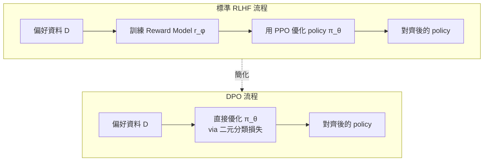

# DPO (Direct Preference Optimization): 語言模型本身就是獎勵模型

> **種子論文**: [Direct Preference Optimization: Your Language Model is Secretly a Reward Model](https://arxiv.org/abs/2305.18290) (2023-05)
> **作者**: Rafael Rafailov, Archit Sharma, Eric Mitchell, Stefano Ermon, Christopher D. Manning, Chelsea Finn
> **機構**: Stanford University

---

## TL;DR

DPO 想解決 RLHF 訓練流程過於繁瑣且不穩定的問題。它發現 RLHF 中的最優 policy 與 reward function 之間存在一個解析映射關係，利用這個關係直接把 reward model 的角色吸收進 policy 的損失函數中，讓偏好對齊變成一個簡單的二元分類損失。在多個對齊任務（情感控制、摘要、對話）上，DPO 用更簡單的流程達到與 PPO-based RLHF 相當甚至更好的效果，大幅降低了訓練語言模型對齊的門檻。

---

## 背景與動機

### 語言模型的對齊問題

大型語言模型經過大規模無監督預訓練後，學到了豐富的世界知識與一定的推理能力，但這些模型的行為並非總是符合人類期望。它們可能會產生虛假資訊（hallucination）、有毒內容，或是不遵循使用者的指令。這個問題的根源在於語言建模的訓練目標——預測下一個 token——與「有用且安全地遵循人類指令」這個目標並不直接一致。

舉例來說，我們希望模型知道「50% 的人相信某個常見誤解」，但當被問到這個誤解是否為真時，我們不希望模型回答「是的，因為 50% 的人都這樣認為」。這裡顯現了一個微妙的區別：模型應該理解世界上的各種觀點，但在生成時應該偏向正確且有幫助的輸出。

這個問題在學術界被稱為「對齊問題」（alignment problem）。具體來說，一個完全不對齊的語言模型可能有以下行為：

- 不遵循指令，對於「用一句話回答」的要求輸出整段文章
- 捏造事實，對於不知道的問題編造「聽起來合理但錯誤」的回答
- 產生有毒或偏見內容，反映訓練資料中的偏見
- 難以控制，需要複雜的 prompt engineering 才能取得想要的輸出

InstructGPT 論文中用了一個非常生動的數據說明這個問題的嚴重性：他們的 1.3B 參數 InstructGPT 模型的輸出，在人類評估中比 175B 的原始 GPT-3 更受偏好——儘管參數量少了 100 倍。這意味著**模型的大小不是決定輸出品質的唯一因素，對齊方法同樣關鍵**。

### RLHF 的標準解法與其複雜性

在 DPO 出現之前，最主流的對齊方法是 Reinforcement Learning from Human Feedback（RLHF），由 InstructGPT（Ouyang et al., 2022）等論文推廣。RLHF 通常包含三個階段，如下圖所示：

```mermaid
flowchart LR
    subgraph Phase1["第一階段: SFT"]
        A1[預訓練 LM] --> A2[收集人工示範資料]
        A2 --> A3[監督式微調 SFT]
        A3 --> A4[π_SFT]
    end

    subgraph Phase2["第二階段: Reward Model"]
        B1[π_SFT] --> B2[對每個 prompt 生成多個回應]
        B2 --> B3[人類偏好排序]
        B3 --> B4[訓練 Reward Model r_φ]
        B4 --> B5[r_φ]
    end

    subgraph Phase3["第三階段: PPO RL"]
        C1[π_SFT 初始化 π_θ] --> C2[用 PPO 優化<br/>max E[r_φ] - β·KL(π_θ||π_ref)]
        C5[r_φ] --> C2
        C3[從 π_θ 採樣回應] --> C2
        C4[KL 約束: π_ref] --> C2
        C2 --> C6[對齊後的 policy π_θ]
    end

    A4 --> Phase2
    A4 --> Phase3
    B5 --> Phase3
```

**第一階段：監督式微調（SFT）**。收集高品質的人工示範資料——給定 prompt，人類標註者寫出理想的回應——然後用標準的 cross-entropy loss 對預訓練語言模型進行監督式微調。這個階段的產物稱為 π^SFT。

在 InstructGPT 中，SFT 資料集包含約 13,000 個 prompt-response pairs（來自 API 和標註者撰寫），模型在 16 個 epoch 上訓練。有趣的是，雖然 validation loss 在 1 個 epoch 後就開始過擬合，但訓練更長的 epoch 反而有助於提升 reward model score 和人類偏好評分——這是一個反直覺但被反覆驗證的現象。

**第二階段：獎勵模型訓練（Reward Model）**。用 π^SFT 對每個 prompt 生成多個候選回應（通常 K = 4 到 9 個），人類標註者對這些回應進行偏好排序（不是打絕對分數，只是比較哪個比較好）。然後訓練一個獎勵模型 r_φ(x, y) 來預測人類的偏好。

常用的偏好模型是 Bradley-Terry 模型：

$$
p^*(y_1 \succ y_2 \mid x) = \frac{\exp(r^*(x, y_1))}{\exp(r^*(x, y_1)) + \exp(r^*(x, y_2))} = \sigma(r^*(x, y_1) - r^*(x, y_2))
$$

獎勵模型的訓練就是最大化 negative log-likelihood：

$$
\mathcal{L}_R(r_\phi, \mathcal{D}) = -\mathbb{E}_{(x, y_w, y_l) \sim \mathcal{D}} \left[ \log \sigma(r_\phi(x, y_w) - r_\phi(x, y_l)) \right]
$$

InstructGPT 的實作細節值得注意：當 K > 2 時，每個 labeling task 會產生 C(K, 2) 個 comparison pairs。如果將這些 pairs 視為獨立樣本，reward model 會很快過擬合。他們的解決方法是將來自同一個 prompt 的所有 comparisons 作為一個 batch element 處理——這樣只需要一次 forward pass 就夠，且不再過擬合。

**第三階段：用 PPO 進行強化學習優化**。把訓練好的獎勵模型當作 reward signal，用 PPO 演算法來微調語言模型 policy π_θ，目標是最大化預期獎勵，同時用 KL 散度約束防止偏離 π^SFT 太遠：

$$
\max_{\pi_\theta} \mathbb{E}_{x \sim \mathcal{D}, y \sim \pi_\theta(y|x)} \left[ r_\phi(x, y) \right] - \beta \cdot \mathbb{D}_{\text{KL}}\left( \pi_\theta(y|x) \parallel \pi_{\text{ref}}(y|x) \right)
$$

InstructGPT 的 RL 階段採用 bandit 環境：每個 prompt 隨機出現，模型生成一個完整回應後，reward model 給出標量獎勵，episode 結束。同時，為了防止在公開 NLP 評估集上退化，InstructGPT 在 PPO 梯度中混合了 pretraining gradients（PPO-ptx 變體）。

### 現有方法的痛點

這個三階段流程雖然有效，但存在一系列實際問題：

- **複雜度高**：需要訓練三個模型（SFT → RM → policy），每個階段都有各自的超參數需要調校
- **獎勵模型過擬合**：reward model 對 comparison pairs 的處理方式需要特殊設計，否則容易過擬合
- **PPO 訓練不穩定**：PPO 作為 on-policy RL 演算法，需要從當前 policy 頻繁採樣，reward scale 變化需要 careful normalization，KL 懲罰係數 β 敏感
- **計算成本高**：RL 階段需要在訓練 loop 中反覆從 LM 採樣，對於大模型來說非常昂貴
- **實作複雜**：需要同時維護 policy network、value network（從 reward model 初始化）、reference model，還有各種 reward normalization tricks

### 核心問題

RLHF 的複雜性引出了一個根本問題：**我們真的需要顯式的 reward model 加上 RL 才能做偏好對齊嗎？** 換句話說，能不能繞過整個 RL 管線，直接用偏好資料來優化語言模型？

DPO 給出了一個肯定的答案——不僅可以，而且有嚴格的數學推導支撐。它的核心 insight 非常優雅：RLHF 中 reward function 和 optimal policy 之間存在一個解析（closed-form）映射關係。利用這個關係，可以直接把偏好機率表達成 policy 的函數，從而繞過 reward model 和 RL。

---

## 核心知識點

本文圍繞以下知識點展開：

1. **RLHF 的數學形式化**——從 KL 約束的獎勵最大化目標出發，理解 RLHF 在數學上到底在做什麼
2. **從 reward function 到 optimal policy 的解析映射**——為什麼最優 policy 可以用 reward function 的 closed-form 表示
3. **Bradley-Terry 偏好模型與等價類**——偏好資料只編碼獎勵的差值，導致 reward function 有等價類
4. **DPO 的 change-of-variables：把 reward 代回 policy**——核心洞察：將 closed-form 解代入 BT 模型，partition function 抵消，偏好機率直接用 policy 比值表示
5. **DPO 損失函數與梯度機制**——為什麼 DPO loss 就是個簡單的二元交叉熵，以及它的梯度加權如何防止模型退化
6. **DPO 的理論保證**——Theorem 1 證明 DPO 的 reward 參數化不損失 generality
7. **DPO 與 PPO 的對比**——從 actor-critic 的視角理解 DPO 為何更穩定

---

## 方法詳解

### 知識點 1: RLHF 的數學形式化

**RLHF 在數學上究竟在解什麼問題？**

給定一個 reference policy π_ref（通常是 SFT 階段的產物），RLHF 的核心目標是找到一個 policy π_θ，能在最大化 reward function r(x, y) 的同時，不偏離 π_ref 太遠。這個直覺被形式化為 KL 約束的獎勵最大化目標：

$$
\max_{\pi_\theta} \mathbb{E}_{x \sim \mathcal{D}, y \sim \pi_\theta(y|x)} \left[ r(x, y) \right] - \beta \cdot \mathbb{D}_{\text{KL}}\left( \pi_\theta(y|x) \parallel \pi_{\text{ref}}(y|x) \right)
$$

這裡的 KL 散度項有兩個作用：
1. 防止 policy 為了獲得高 reward 而產生脫離自然的語言（reward hacking）
2. 保持生成多樣性，避免 mode collapse 到少數高 reward 的回應
3. 確保 policy 停留在 reward model 準確的分布範圍內

β 是一個超參數，控制 KL 懲罰的強度——β 越大，policy 越接近 π_ref；β 越小，policy 可以更自由地最大化 reward。在極端情況下：
- β → ∞：π_θ = π_ref，不做任何對齊
- β → 0：π_θ 完全忽視語言流暢性，只追求最大化 reward（容易產生 nonsense）

**InstructGPT 怎麼處理？**

InstructGPT 遵循上述 RLHF 框架，具體實現是：
- 用 PPO 演算法優化這個目標
- 建構一個修正後的 reward：

$$
r(x, y) = r_\phi(x, y) - \beta(\log \pi_\theta(y|x) - \log \pi_{\text{ref}}(y|x))
$$

- 用 learned value function（從 reward model 初始化）來降低梯度方差
- 加入 pretraining mix 防止在公開 NLP 評估集上退化。總體目標函數為：

$$
\text{objective}(\theta) = \mathbb{E}_{(x,y) \sim \mathcal{D}_{\text{RL}}} \left[ r_\phi(x, y) - \beta \log \frac{\pi_\theta(y|x)}{\pi_{\text{SFT}}(y|x)} \right] + \gamma \cdot \mathbb{E}_{x \sim \mathcal{D}_{\text{pretrain}}} \left[ \log \pi_\theta(x) \right]
$$

其中 γ 控制 pretraining loss 的權重。對於標準的 PPO 模型，γ = 0。PPO-ptx 變體則使用一個非零的 γ，這在犧牲些微偏好分數的情況下，顯著減少了在 SQuAD、DROP、HellaSwag 等公開 NLP 評估集上的效能退化。

這個方法雖然有效，但需要同時維護 policy network、value network、reference model 三組權重，還需要 careful 的 reward normalization。InstructGPT 論文中提到，175B 的 reward model 訓練不穩定，因此他們實際上只使用了 6B 的 reward model——這從側面說明了這個流程的工程挑戰。

---

### 知識點 2: 從 Reward Function 到 Optimal Policy 的解析映射

**給定一個 reward function，最優的 policy 長什麼樣子？**

RLHF 的目標函數有一個美好的性質：對於任意的 reward function r(x, y)，最優解可以解析寫出。這是一個經典的約束優化問題，透過拉格朗日方法求解：

$$
\pi_r(y|x) = \frac{1}{Z(x)} \pi_{\text{ref}}(y|x) \exp\left(\frac{1}{\beta} r(x, y)\right)
$$

其中 $Z(x) = \sum_y \pi_{\text{ref}}(y|x) \exp(r(x, y)/\beta)$ 是配分函數（partition function），確保 π_r 是一個合法的機率分布。

這個形式非常直覺：最優 policy 就是把 reference policy 的每個回應的機率乘上一個由 reward 決定的指數權重，然後重新歸一化。

**但是**，在實際應用中這個形式很難直接使用。Z(x) 需要對所有可能的回應求和——對於語言模型來說，這個求和空間是指數級的，不可能精確計算。這就是為什麼既有的 RLHF 方法選擇用 RL 來隱式地逼近這個最優解，而不是直接計算它。

---

### 知識點 3: Bradley-Terry 偏好模型與等價類

**人類的偏好比較告訴我們什麼？**

當人類標註者比較兩個回應 y₁ 和 y₂ 時，他們給出的訊號不是絕對分數，而是相對偏好。Bradley-Terry（BT）模型假設存在一個潛在的 reward function r(x, y)，人類偏好產生的機率由 reward 的差值決定：

$$
p^*(y_1 \succ y_2 \mid x) = \frac{\exp(r^*(x, y_1))}{\exp(r^*(x, y_1)) + \exp(r^*(x, y_2))} = \sigma(r^*(x, y_1) - r^*(x, y_2))
$$

這裡的關鍵是，偏好機率**只依賴 reward 的差值**。這意味著如果我們對 reward 加上一個只跟 prompt x 有關的函數 f(x)：

$$
\tilde{r}(x, y) = r(x, y) + f(x)
$$

偏好機率完全不變，因為差值中 f(x) 被抵消了。這就是 reward function 的**等價類**概念——所有相差一個 x-only 函數的 reward 屬於同一個等價類，它們在 BT 模型下是不可區分的。

這個性質有兩個重要推論：

**Lemma 1**：同一等價類中的 reward 在 BT/Plackett-Luce 偏好框架下誘導出相同的偏好分布。

**Lemma 2**：同一等價類中的 reward 在 KL 約束的 RL 問題中誘導出相同的最優 policy。

這意味著**我們只需要學到 reward 的等價類，不需要精確的 reward 值**——因為同一類中的任何一個 reward 都會導向同一個最優 policy。

---

### 知識點 4: DPO 的 Change-of-Variables

**DPO 的核心洞察：把 reward 定義為 policy 的函數**

DPO 的關鍵 insight 來自於將知識點 2 的 closed-form 解反過來用——不是從 reward 求 policy，而是把 reward 表達成 policy 的函數。

從知識點 2 的公式：

$$
\pi_r(y|x) = \frac{1}{Z(x)} \pi_{\text{ref}}(y|x) \exp\left(\frac{1}{\beta} r(x, y)\right)
$$

兩邊取對數：

$$
\log \pi_r(y|x) = \log \pi_{\text{ref}}(y|x) + \frac{1}{\beta} r(x, y) - \log Z(x)
$$

整理可得 reward 的表達式：

$$
r(x, y) = \beta \log \frac{\pi_r(y|x)}{\pi_{\text{ref}}(y|x)} + \beta \log Z(x)
$$

這個式子說的是：**reward function 可以被分解為 policy 比值 $\beta \log(\pi_r(y|x)/\pi_{\text{ref}}(y|x))$ 加上 partition function $\beta \log Z(x)$ 兩部分**。注意 $\log Z(x)$ 只跟 prompt x 有關，不依賴具體的回應 y。

現在，把這個表達式代入 Bradley-Terry 模型。**關鍵步驟**：BT 模型只依賴 reward 的差值：

$$
p^*(y_1 \succ y_2 \mid x) = \sigma(r(x, y_1) - r(x, y_2))
$$

代入後，Z(x) 項在差值中抵消：

$$
r(x, y_1) - r(x, y_2) = \left( \beta \log \frac{\pi(y_1|x)}{\pi_{\text{ref}}(y_1|x)} + \bcancel{\beta \log Z(x)} \right) - \left( \beta \log \frac{\pi(y_2|x)}{\pi_{\text{ref}}(y_2|x)} + \bcancel{\beta \log Z(x)} \right)
$$

$$
= \beta \log \frac{\pi(y_1|x)}{\pi_{\text{ref}}(y_1|x)} - \beta \log \frac{\pi(y_2|x)}{\pi_{\text{ref}}(y_2|x)}
$$

因此：

$$
p^*(y_1 \succ y_2 \mid x) = \sigma\left( \beta \log \frac{\pi(y_1|x)}{\pi_{\text{ref}}(y_1|x)} - \beta \log \frac{\pi(y_2|x)}{\pi_{\text{ref}}(y_2|x)} \right)
$$

**人類的偏好機率現在完全用 policy 的比值來表達，reward function 和 partition function 都消失了。**

這個結果的意義極其深遠：它告訴我們不需要先學一個獨立的 reward model，然後再用 RL 去優化它。我們可以直接對 policy π_θ 進行 maximum likelihood 估計，讓它擬合人類偏好資料。這正是 DPO 的目標。



### 完整的 DPO 推導鏈

DPO 的推導可以總結為以下幾個步驟：

1. 從 RLHF 的 KL 約束獎勵最大化目標出發
2. 寫出最優 policy 的 closed-form 解（知識點 2）
3. 將 closed-form 解重寫為 reward 的函數
4. 代入 Bradley-Terry 偏好模型
5. 得到直接用 policy 表達的偏好機率
6. 對 policy 做 maximum likelihood 估計

$$
\text{RLHF 目標} \xrightarrow{\text{步驟 2}} \pi_r(y|x) = \frac{1}{Z(x)} \pi_{\text{ref}}(y|x) e^{r(x,y)/\beta}
\xrightarrow{\text{步驟 3}} r(x,y) = \beta \log \frac{\pi(y|x)}{\pi_{\text{ref}}(y|x)} + \beta \log Z(x)
$$

$$
\xrightarrow{\text{步驟 4–5}} p(y_1 \succ y_2|x) = \sigma\left( \beta \log \frac{\pi(y_1|x)}{\pi_{\text{ref}}(y_1|x)} - \beta \log \frac{\pi(y_2|x)}{\pi_{\text{ref}}(y_2|x)} \right)
$$

$$
\xrightarrow{\text{步驟 6}} \mathcal{L}_{\text{DPO}}(\pi_\theta; \pi_{\text{ref}}) = -\mathbb{E}_{(x, y_w, y_l) \sim \mathcal{D}} \left[ \log \sigma\left( \beta \log \frac{\pi_\theta(y_w|x)}{\pi_{\text{ref}}(y_w|x)} - \beta \log \frac{\pi_\theta(y_l|x)}{\pi_{\text{ref}}(y_l|x)} \right) \right]
$$

---

### 知識點 5: DPO 損失函數與梯度機制

**DPO loss：一個簡單的二元交叉熵**

有了上面的偏好機率表達式，DPO 的損失函數就是標準的 negative log-likelihood：

$$
\mathcal{L}_{\text{DPO}}(\pi_\theta; \pi_{\text{ref}}) = -\mathbb{E}_{(x, y_w, y_l) \sim \mathcal{D}} \left[ \log \sigma \left( \beta \log \frac{\pi_\theta(y_w|x)}{\pi_{\text{ref}}(y_w|x)} - \beta \log \frac{\pi_\theta(y_l|x)}{\pi_{\text{ref}}(y_l|x)} \right) \right]
$$

其中 y_w 是較偏好的回應，y_l 是較不被偏好的回應。

這個損失函數的形式非常簡單——它就是一個**標準的二元邏輯迴歸損失**。DPO 的核心貢獻就是證明這個簡單的損失函數等價於優化 RLHF 的 KL 約束獎勵最大化目標，只是透過一個 change-of-variables 從 reward space 轉換到了 policy space。

**梯度分析：為什麼 DPO 有效**

理解 DPO 為什麼有效的關鍵在於分析損失函數的梯度：

$$
\nabla_\theta \mathcal{L}_{\text{DPO}} = -\mathbb{E}_{(x, y_w, y_l) \sim \mathcal{D}} \Bigg[ \underbrace{\sigma\left( \beta \log \frac{\pi_\theta(y_l|x)}{\pi_{\text{ref}}(y_l|x)} - \beta \log \frac{\pi_\theta(y_w|x)}{\pi_{\text{ref}}(y_w|x)} \right)}_{\text{權重: implicit reward 的錯誤程度}} \cdot \underbrace{\left( \nabla_\theta \log \pi_\theta(y_w|x) - \nabla_\theta \log \pi_\theta(y_l|x) \right)}_{\text{提高 y_w 機率,降低 y_l 機率}} \Bigg]
$$

梯度有兩個部分：

1. **方向部分**：$(\nabla \log \pi(y_w|x) - \nabla \log \pi(y_l|x))$
   - 提高偏好回應的 log-probability，降低不偏好回應的 log-probability
   - 這跟 naive 的 unlikelihood 方法類似

2. **權重部分**：$\sigma(\beta \cdot \hat{r}(x, y_l) - \beta \cdot \hat{r}(x, y_w))$
   - 這裡 $\hat{r}(x, y) = \log(\pi_\theta(y|x) / \pi_{\text{ref}}(y|x))$ 是 policy 隱式定義的 reward
   - 當模型錯誤地把不偏好回應 y_l 的 implicit reward 排得比 y_w 高時（即 $\hat{r}(x, y_l) > \hat{r}(x, y_w)$），權重接近 1，更新幅度大
   - 當模型已經正確排序時（$\hat{r}(x, y_w) > \hat{r}(x, y_l)$），權重接近 0，更新幅度小
   - β 控制這個動態加權的銳利度

這個動態加權是 DPO 成功的關鍵。論文的實驗顯示，如果去掉這個權重（即變成簡單的 maximize log p(y_w|x) + minimize log p(y_l|x)），模型在複雜任務上會退化到產生無意義的回應（見論文 Table 3）。

直覺上，這個加權機制等同於隱式地維持了一個 implicit reward model，並且只有在這個 reward model 犯錯時才進行大規模更新——這比 unlikelihood 那種不分青紅皂白地壓低 y_l 機率要聰明得多。

---

### 知識點 6: DPO 的理論保證

**DPO 會不會限制 reward 的表示能力？**

一個自然的疑問是：把 reward function 限定為 $\beta \log(\pi_\theta(y|x) / \pi_{\text{ref}}(y|x))$ 會不會丟失某些可能的 reward function？論文用一個定理回答了這個問題。

**Theorem 1**: 在溫和的假設下，所有與 Bradley-Terry（及 Plackett-Luce）模型一致的 reward 等價類，都可以用 DPO 的 reparameterization 表示。

**證明思路**：

1. 對於任意 reward function r(x, y)，它會誘導一個對應的最優 policy π_r（由知識點 2 的 closed-form 給出）：

$$
\pi_r(y|x) = \frac{1}{Z(x)} \pi_{\text{ref}}(y|x) \exp\left(\frac{1}{\beta} r(x, y)\right)
$$

2. 定義一個投影運算元 f，它從 r 的等價類中選出一個特定的「正則化」版本：

$$
f(r; \pi_{\text{ref}}, \beta)(x, y) = r(x, y) - \beta \log \sum_y \pi_{\text{ref}}(y|x) \exp\left(\frac{1}{\beta} r(x, y)\right)
$$

3. 這個 f(r) 與 r 屬於同一等價類（因為減去的項——log partition function——只與 x 有關，不依賴 y）

4. 將知識點 2 的 closed-form 代入，得到：

$$
f(r; \pi_{\text{ref}}, \beta)(x, y) = \beta \log \frac{\pi_r(y|x)}{\pi_{\text{ref}}(y|x)}
$$

**這個定理的實際意義**：DPO 沒有損失 generality。任何可以用標準 RLHF 學到的 reward，都能用 DPO 的 reparameterization 表示。差別只在於 DPO 選擇了等價類中 partition function 被「歸一化」的那個 reward——而這個選擇恰好讓訓練變得簡單且穩定。

更直覺地說，這個定理等同於說：**語言模型本身就是一個隱式的 reward model**。DPO 做的就是把這個隱式 reward 放到損失函數中，讓它被直接優化。

#### 等價類的直覺理解

想像你有兩個考試評分系統：系統 A 給分範圍 0–100，系統 B 給分範圍 0–1000。如果系統 B 的分數剛好是系統 A 的 10 倍，那麼當我們只看「誰的分數比較高」時，這兩個系統是完全等價的。偏好學習就是這樣——它只關心「哪個比較好」，不關心「好多少」的絕對尺度。等價類捕捉的正是這個性質：不管 reward 的 scale 和 offset 如何，只要相對排序不變，偏好分布和最優 policy 都不受影響。

DPO 的巧妙之處在於，它透過選擇一個特定的等價類代表（partition function 被歸一化的那個），讓 reward 可以直接從 policy 比值讀出來，而不需要任何額外的學習或估計。

### 從 Actor-Critic 視角理解 DPO 的穩定性

從控制作為推理（control as inference）的視角來看，標準 RLHF 中 policy gradient 的目標可以寫成：

$$
\max_{\pi_\theta} \mathbb{E}_{y \sim \pi_\theta(y|x)} \left[ r(x, y) - \beta \log \frac{\pi_\theta(y|x)}{\pi_{\text{ref}}(y|x)} \right]
$$

在 actor-critic 框架下，我們需要一個 value function V(x) 來降低 policy gradient 的方差。InstructGPT 將 reward model 初始化為 value function，但這引入了額外的訓練不穩定性，尤其是對大模型來說——論文提到 175B reward model 的訓練不穩定，最終只能使用 6B 版本。

DPO 的 reparameterization 選擇了一個「自身歸一化」的 reward 函數。從式 (5) 可以看到，等價類中由 DPO 選擇的 reward 滿足：

$$
\sum_y \pi_{\text{ref}}(y|x) \exp\left(\frac{1}{\beta} r(x, y)\right) = 1
$$

這意味著 $\pi_r$（由這個 reward 誘導的 policy）是一個合法的機率分布——它的 partition function 是 1。在這種情況下，不再需要任何 baseline 或 value function 來估計 partition function，因為它已被解析地歸一化了。

---

### 知識點 7: DPO 與 PPO 的對比

**為什麼 DPO 能比 PPO 更穩定？**

從控制作為推理（control as inference）的視角來看，標準 RLHF 中 policy gradient 的目標可以寫成：

$$
\max_{\pi_\theta} \mathbb{E}_{y \sim \pi_\theta(y|x)} \left[ r(x, y) - \beta \log \frac{\pi_\theta(y|x)}{\pi_{\text{ref}}(y|x)} \right]
$$

這個目標的問題在於，policy gradient 的方差可能很大，尤其是在 reward 的 scale 變化較大的情況下。為了解決這個問題，標準做法是引入一個 value function baseline V(x) 來降低方差，但這又引入了另一組需要訓練的參數和相關的優化困難。

另一種做法是使用人類完成的 baseline（相當於單樣本 Monte Carlo 估計），但這種估計的噪聲很大。

DPO 的 reparameterization 本質上選擇了一個「已被歸一化」的 reward 函數——這個 reward 的自動歸一化特性消除了對任何 baseline 的需求。從這個角度來看，DPO 可以被理解為一個解決了 actor-critic 中 high variance 問題的替代方案。

總結對比：

| 維度 | PPO-based RLHF | DPO |
|------|---------------|-----|
| 需要獨立 reward model | 是 | 否（implicit reward 內建在 policy 中） |
| 需要使用 RL 演算法 | 是（PPO） | 否（二元分類） |
| 需要 value function | 是 | 否 |
| 需要從 policy 採樣 | 是（on-policy） | 否（offline dataset） |
| 超參數數量 | 多（PPO clip、learning rate、KL coefficient 等） | 少（主要是 β） |
| 訓練穩定性 | 中等（需要 reward normalization） | 高 |
| 計算成本 | 高（需要同時維護多個模型） | 低 |

---

## 實驗結果

### 情感控制（IMDb）

論文首先在 IMDb 電影評論的情感控制任務上驗證 DPO 的基本能力。給定 prompt，模型需要生成帶有特定情感（正面或負面）的評論。控制條件是僅在 prompt 中指定情感方向（例如 "This movie was..."），然後用一個情感分類器作為外部 reward 評估。

論文比較了以下方法：
- **DPO**：本文提出的方法
- **PPO**：論文自行實作的標準 PPO RLHF（使用學到的 reward model）
- **PPO-GT**：PPO 但使用 ground truth reward（情感分類器直接作為 reward，而非學到的 reward model），這是 PPO 的 oracle baseline
- **Unlikelihood**：單純 maximize log p(y_w|x) + minimize log p(y_l|x)，不加權重
- **Preferred-FT**：只在偏好回應上做 supervised fine-tuning

結果顯示：

| Method | Reward（越高越好） | Win Rate vs Reference |
|--------|-------------------|----------------------|
| Preferred-FT | 低 | ~0.50 |
| Unlikelihood | 中 | ~0.55 |
| PPO（論文實作） | 高 | ~0.85 |
| PPO-GT（oracle） | 更高 | ~0.90 |
| **DPO（ours）** | **最高** | **~0.92** |

關鍵觀察：
- DPO 在所有方法中取得最高的 reward 和 win rate
- DPO 明顯優於 unlikelihood baseline，證明了動態加權的重要性
- 即使 PPO 使用 ground truth reward（PPO-GT），DPO 仍然略勝一籌
- Best-of-N（從 π_ref 中抽樣取 reward 最高者）是很強的 baseline，但 DPO 能進一步提升

### 摘要（TL;DR）

在 Reddit TL;DR 摘要任務上，論文使用 GPT-4 作為評審計算 win rate。模型在 6B 規模上進行訓練和評估：

| Method | GPT-4 Win Rate vs PPO (temp=0) |
|--------|-------------------------------|
| SFT（溫度 0.25） | ~35% |
| PPO（溫度 1.0） | ~42% |
| **DPO（溫度 0.25）** | **~47–50%** |

**關鍵發現**：

1. **低溫採樣**：DPO（温度 0.25）在 win rate 上與 PPO（溫度 0）相當或略優，差距約 1-3 個百分點
2. **高溫採樣**：這是 DPO 最突出的優勢。當 temperature > 0 時，PPO 的 win rate 急遽下降（從 ~50% 降到 ~30%），而 DPO 的衰退較平緩。這表明 DPO policy 在輸出分布上更平滑，對採樣溫度的魯棒性更好
3. **與 Best-of-N 的關係**：Best-of-64 到 Best-of-128 可以達到約 60% 的 win rate，但需要 64–128 倍的推理計算量。DPO 在推理時只需要一次 forward pass

論文也進行了人類研究來驗證 GPT-4 評估的可靠性。25 位 Stanford 學生志願者對 275 組 DPO vs PPO 比較進行了評估。人類與 GPT-4 的判斷高度一致（agreement rate 接近 90%），這為使用 GPT-4 作為自動評審提供了堅實的證據。

### 對話（Anthropic-HH）

在 Anthropic 的 Helpful & Harmless 對話資料集上：

| Method | GPT-4 Win Rate vs Chosen Response |
|--------|-----------------------------------|
| SFT | ~25% |
| PPO（temp=0） | ~48.7% |
| **DPO（temp=0.7）** | **~58.8%** |
| Best-of-128（temp=0.5） | ~61% |

DPO 的 win rate 顯著高於 PPO（58.8% vs 48.7%），差距約 10 個百分點。Best-of-128 仍然是最強的 baseline（~61%），但 DPO 與之差距不大，而推理成本低得多。

### Best-of-N 消融分析

論文對 Best-of-N baseline 進行了系統分析，考察抽樣數量 N 和溫度對效能的影響：

- 在對話任務上，N = 1 → 4 → 16 → 64 → 128 時 win rate 持續提升
- 在 N = 64–128 之後趨於平緩，更多抽樣的邊際效益遞減
- 高溫採樣時 Best-of-N 更有優勢（因為樣本多樣性更大），但低溫時也有明顯提升
- 最佳溫度因任務而異：對話 ~0.5，摘要 ~0.25–0.5

DPO 可被視為一種「隱式的 Best-of-∞」——透過學習而不是抽樣來獲得更好的 policy，而且推理時只需要一次 forward pass。

### 主要觀察

DPO 雖然訓練時完全不使用 RL，但在所有任務上都達到了與 PPO-based RLHF 相當或更好的結果，同時：

- **訓練速度更快**：只需一個簡單的二元分類 loss，不需要繁瑣的 reward model 訓練和 PPO 超參調校
- **不需要從 policy 採樣**：與 PPO 不同，DPO 不需要在訓練 loop 中反覆從當前 policy 採樣，節省大量計算
- **不需要維護 reward model 和 value function**：policy 本身包含了 implicit reward
- **對超參數不敏感**：論文提到「with virtually no tuning of hyperparameters」，DPO 幾乎不需要調參就能得到好結果
- **採樣穩定性**：DPO policy 在高溫採樣時效能衰退更慢，更適合需要多樣性的應用

---

## DPO 訓練流程

DPO 的訓練流程極其簡單，延續了論文的「dual track」策略：

**第一步：準備參考模型**

如果已有 SFT model，直接設為 π_ref。如果沒有 SFT model，可以用偏好資料中的優選回應 (x, y_w) 做 supervised fine-tuning 得到 π_ref：

$$
\pi_{\text{ref}} = \arg\max_\pi \mathbb{E}_{(x, y_w) \sim \mathcal{D}} \left[ \log \pi(y_w|x) \right]
$$

**第二步：計算 DPO 損失**

對每個 batch 的 (x, y_w, y_l) 三元組：

1. 計算 π_θ(y_w|x) 和 π_θ(y_l|x) 的 log-probabilities
2. 計算 π_ref(y_w|x) 和 π_ref(y_l|x) 的 log-probabilities（這些可以預先計算好，只需要一次 forward pass 而非每個訓練步都算）
3. 計算 $\beta \log(\pi_\theta(y_w|x)/\pi_{\text{ref}}(y_w|x)) - \beta \log(\pi_\theta(y_l|x)/\pi_{\text{ref}}(y_l|x))$
4. 套用 sigmoid 和 binary cross-entropy loss
5. 反向傳播

**第三步：標準的語言模型訓練 loop**

不需要 PPO 的 advantage estimation、value function update、KL penalty coefficient tuning。就是一個標準的 PyTorch 訓練 loop：

```
for batch in dataloader:
    logps = policy(batch["prompt"], batch["chosen"], batch["rejected"])
    ref_logps = ref_policy(batch["prompt"], batch["chosen"], batch["rejected"])
    loss = -F.logsigmoid(beta * (logps["chosen"] - ref_logps["chosen"]
                                 - logps["rejected"] + ref_logps["rejected"])).mean()
    loss.backward()
    optimizer.step()
```

這個簡單性正是 DPO 最大的吸引力之一——它在 Hugging Face TRL library 中的實作只需要約 30 行核心程式碼。

在實際應用中，ref_logps 通常只計算一次並快取（在訓練前對整個資料集跑一次 π_ref 的 forward pass），這樣每個訓練步只需要對 π_θ 做一次 forward pass 計算 log-probabilities。這進一步降低了計算成本。

## 與相關工作的對比

完整的對比表如下：

| 維度 | DPO | PPO-based RLHF | Unlikelihood | Best-of-N |
|------|-----|----------------|--------------|-----------|
| 訓練範式 | 直接偏好優化 | 兩階段（RM + RL） | 直接優化 | 純抽樣 |
| 需要 reward model | 否（implicit） | 是 | 否 | 是（僅評估時） |
| 使用 RL | 否 | 是（PPO） | 否 | 否 |
| 訓練計算成本 | 最低 | 高 | 低 | 無（但推理成本高） |
| 推理計算成本 | 低 | 低 | 低 | 高（需要 N 倍採樣） |
| 輸出品質 | 高 | 高 | 低（複雜任務退化） | 視 N 而定 |
| 超參數敏感性 | 低 | 高 | 中 | 無 |
| 訓練穩定性 | 高 | 中 | 中 | N/A |

**為什麼 DPO 在超參數上如此不敏感？**

這是因為 DPO 的損失函數只有一個關鍵超參數 β（控制 KL 約束強度），而且它在等價類變換中扮演的是 scale parameter 的角色——在偏好機率的 sigmoid 中，β 直接縮放了 implicit reward 的差值，但透過調整 learning rate 可以一定程度上補償 β 的選擇。相比之下，PPO 有 clip range、value function coefficient、KL penalty coefficient、learning rate、number of PPO epochs 等多個需要協調的超參數。

### DPO 與 InstructGPT 的深度對比

從 InstructGPT 到 DPO 的演進是一個有趣的案例，展示了理論洞察如何簡化實務流程：

| 面向 | InstructGPT (RLHF) | DPO |
|------|--------------------|-----|
| 需要訓練的模型數 | 3（SFT + RM + policy） | 1（policy + reference model 凍結） |
| 偏好資料使用方式 | 學 reward model → 用 reward 驅動 RL | 直接使用偏好比較 |
| 訓練穩定性 | 依賴 reward normalization 和 value function | 隱式歸一化，無需調校 |
| 對採樣溫度的魯棒性 | 低（高溫時急遽退化） | 高（衰退較平緩） |
| 人類標註需求 | 需要偏好比較 + 示範資料 | 只需要偏好比較 |
| 超參數數量 | ~10+（PPO 相關） | ~2-3（β、learning rate、batch size） |

---

## 總結、限制與未來方向

### 核心要點重述

DPO 的貢獻可以濃縮為三點：

1. **理論洞察**：發現 RLHF 的 KL 約束獎勵最大化目標可以透過 change-of-variables 轉換為直接在 policy space 中優化，reward model 和 RL 都是多餘的
2. **簡單實作**：DPO 最終只是一個二元分類損失——任何會用 PyTorch 訓練語言模型的人都能在幾十行程式碼內實作
3. **有效且穩定**：在情感控制、摘要、對話任務上達到或超越 PPO-based RLHF，且對超參數不敏感

論文標題 "Your Language Model is Secretly a Reward Model" 精準捕捉了核心訊息：當你訓練語言模型做偏好對齊時，你不需要額外的 reward model——這個 reward 一直藏在你的 policy 裡面，DPO 只是找到了一個方法把它提取出來。

### 已知限制

論文自身明確指出了以下限制，這些也是理解 DPO 適用範圍的重要參考：

1. **OOD 泛化（未知）**

   DPO policy 在訓練分布外的泛化能力如何？標準 RLHF 學到的是顯式的 reward function r_φ(x, y)，這個 function 理論上可以在分布外對新 prompt-response pairs 給出合理評分。DPO 的 implicit reward 則完全綁定在 π_θ 和 π_ref 的比值上——如果遇到與訓練分布差異很大的 prompt，這個比值是否仍然有意義？初步結果顯示 DPO 與 PPO 的 OOD 泛化相似，但論文承認這需要更全面的研究。

2. **Reward over-optimization 的表現形式**

   在標準 RLHF 中，reward over-optimization 是一個已知且被廣泛研究的問題：policy 學會利用 reward model 的漏洞來獲得高分（例如寫出很長但無意義的內容），而 reward model 無法正確辨識。在 DPO 中，這個現象如何表現？由於 DPO 沒有獨立的 reward model，傳統的 reward hacking 路徑可能不適用——但可能出現其他形式的退化。論文 Figure 3 右側在對話任務上觀察到 DPO 效能隨訓練步數的輕微下降，可能是一個實例。

3. **規模限制**

   論文只評估到 6B 參數的 Llama 衍生模型。DPO 是否能順利擴展到數百 B 參數的模型？更大模型中 KL 約束的 β 如何調整？Implicit reward 的表達能力是否隨著模型增大而提升？這些問題在論文發表時尚未被回答，但後續的工作（包括 Llama 3 的技術報告）顯示 DPO 在更大規模上也是有效的。

4. **GPT-4 評估偏差**

   論文使用 GPT-4 作為自動評審計算 win rate，但發現結果受 prompt 設計影響。例如，在對話任務的定性分析中（Table 7–10），GPT-4 有時會做出明顯錯誤的判斷——例如將 verbose 但不準確的回應誤判為更好。開發更可靠的自動化對齊評估方法是一個開放問題。

5. **離線偏好資料的限制**

   DPO 訓練使用的是固定的離線偏好資料集 $\mathcal{D} = \{x^{(i)}, y_w^{(i)}, y_l^{(i)}\}$。這意味著 DPO 無法像 online RLHF 那樣在訓練過程中收集新的偏好比較（例如，對當前 policy 的輸出進行人類評估加入訓練）。如果偏好資料的分布與最優 policy 的分布差異很大，DPO 的效能可能受限。後續工作如 Iterative DPO、SPIN（Self-Play Fine-Tuning）嘗試解決這個限制。

### 後續工作引發的新問題

DPO 的出現開啟了「直接偏好優化」這個研究方向，但也帶來了新的問題：

- **偏好資料品質的重要性**：DPO 的結果高度依賴偏好資料的品質。如果偏好資料中有大量不一致或噪音的標註，DPO 會直接學到這些噪音。相比之下，RLHF 中的 reward model 某種程度上可以對噪音進行平滑

- **Online vs Offline 的權衡**：DPO 簡化了訓練，但失去了 RLHF 中 online 探索的能力。後續的 Iterative DPO 嘗試折衷——使用 DPO 訓練一個初始 policy，然後用這個 policy 生成新的樣本給人類標註，再重新訓練

- **超參數 β 的實際影響**：β 控制了對參考模型的偏離程度，但它同時影響了 implicit reward 的 scale 和 KL 約束的強度——這兩個角色耦合在一起。後續的 SimPO 嘗試解耦它們

- **偏好資料的表示方式**：DPO 使用成對比較（y_w vs y_l），但某些場景下只有二元訊號（好/不好）而沒有成對比較。KTO 針對這種場景提出了改進

### 影響與啟發

DPO 的發表對 LLM 對齊領域產生了深遠的影響：

1. **降低了對齊研究的門檻**：在 DPO 之前，做偏好對齊需要掌握 RL、reward model training、PPO 等一系列技術。DPO 讓任何有 deep learning 基礎的研究者都能參與對齊研究

2. **促進了偏好學習的理論進展**：DPO 提供了一個清晰的數學框架，後續的 IPO、KTO、SimPO、ORPO 等都是在這個框架上的改進或變體

3. **成為 open-source LLM 對齊的標準方法**：Llama 3、Mistral、Zephyr 等知名開源模型都在其對齊階段使用了 DPO 或其變體

4. **改變了 reward model 的研究方向**：DPO 之後，研究者開始思考「我們是否真的需要顯式 reward model」——即使需要，reward model 的角色也從「提供 reward signal」轉變為「提供高品質的偏好資料或隱式引導」

### 後續發展

DPO 引發了一系列後續研究的熱潮：

- **Iterative DPO / Online DPO**：在訓練過程中反覆從當前 policy 採樣並獲取偏好，實現疊代式的偏好學習
- **IPO（Identity Preference Optimization）**：從另一個理論角度推導了類似的直接偏好優化目標
- **KTO（Kahneman-Tversky Optimization）**：只需要每個回應是否被偏好的二元訊號（不需要成對比較），更接近 real-world 的資料收集場景
- **SimPO（Simple Preference Optimization）**：使用 generation reward 而不是 implicit reward 來簡化訓練
- **ORPO（Odds Ratio Preference Optimization）**：在 SFT 階段就同時進行偏好學習，不需要 π_ref

這些後續工作在 DPO 的基礎上從不同角度簡化或改進了偏好對齊的流程，也證明了 DPO 開創的「直接優化 policy 來滿足偏好」這個範式的影響力。

---

## 延伸閱讀

### Dependency Papers（本文涵蓋）

1. **Training language models to follow instructions with human feedback** ([2203.02155](https://arxiv.org/abs/2203.02155))
   - 作者：Long Ouyang, Jeff Wu, Xu Jiang, et al.（OpenAI）
   - 與本文關係：InstructGPT 建立了標準的 PPO-based RLHF 三階段流程，是 DPO 直接對比和簡化的對象。DPO 旨在保留 RLHF 的對齊效果，同時移除其複雜性

### 後續發展（未涵蓋，僅列出）

- [Iterative DPO / Self-Rewarding Language Models](https://arxiv.org/abs/2401.01323) (2024-01)
- [KTO: Alignment as Contrastive Learning](https://arxiv.org/abs/2402.01306) (2024-02)
- [IPO: Preference Optimization without Regularization](https://arxiv.org/abs/2310.12036) (2023-10)
- [SimPO: Simple Preference Optimization](https://arxiv.org/abs/2405.14734) (2024-05)
- [ORPO: Odds Ratio Preference Optimization](https://arxiv.org/abs/2403.07691) (2024-03)
- [SPIN: Self-Play Fine-Tuning](https://arxiv.org/abs/2401.01335) (2024-01)

---

## 我的觀察

### 為什麼 DPO 的推導如此優雅？

DPO 最讓我印象深刻的地方不是它的效能（雖然確實不錯），而是它的推導方式。它沒有引入任何新的假設或架構，僅僅是對現有 RLHF 框架做了一個變數代換，就得到了一個全新的訓練方法。這在深度學習研究中是極為罕見的——大部分好方法的出現來自於新的架構、新的損失函數、或新的訓練技巧，而 DPO 純粹來自於對既有數學框架的重新審視。

這給了我一個啟發：有時候我們覺得一個方法「必須很複雜才能有效」，可能只是因為我們還沒找到那個能讓一切簡化的變換。

### DPO 的隱含假設

雖然 DPO 的推導是嚴格的，但它有一個值得注意的隱含假設：Bradley-Terry 模型是對人類偏好的正確建模。現實中的人類偏好可能不符合 BT 模型的假設——例如，偏好可能不是傳遞性的（A 優於 B、B 優於 C 但 C 優於 A），或者偏好的強度在不同 pairs 之間不可比較。當偏好資料違反這些假設時，DPO 和標準 RLHF 都會受到影響，但表現形式可能不同。

### 對實務應用的影響

在 DPO 之前，對齊一個開源語言模型需要：SFT → reward model training → PPO，每一步都需要大量的工程和調參。DPO 讓對齊變成了一個簡單的 SFT-like 流程，這是開源社群能夠快速追上閉源模型對齊品質的關鍵因素之一。可以說 DPO 對 open-source LLM 對齊的影響，堪比 LoRA 對 open-source LLM 微調的影響——兩者都大幅降低了門檻。

---

## 引用

完整 BibTeX 見 [`papers.bib`](./papers.bib)。
