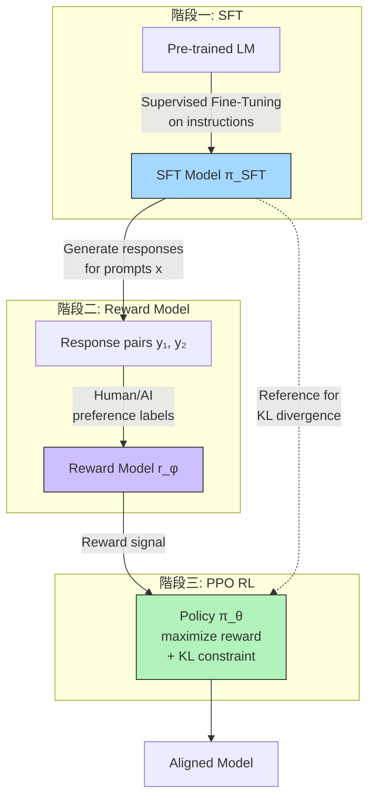
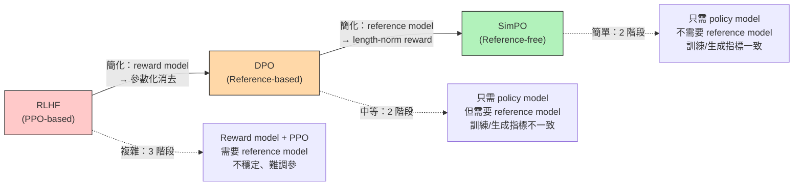
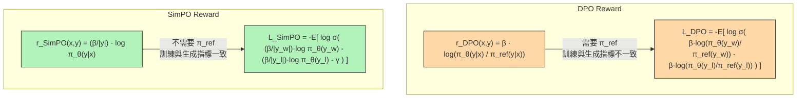

# SimPO: Simple Preference Optimization with a Reference-Free Reward

> **種子論文**: [SimPO: Simple Preference Optimization with a Reference-Free Reward](https://arxiv.org/abs/2405.14734) (2024-05)
> **作者**: Yu Meng, Mengzhou Xia, Danqi Chen
> **機構**: University of Virginia / Princeton University
> **會議**: NeurIPS 2024

---

## TL;DR

SimPO 想解決 DPO 的兩個根本問題：(1) DPO 的 reward 公式依賴一個 reference model，增加記憶體與計算開銷；(2) DPO 在訓練時優化的 reward 與生成時實際使用的評估指標不一致，導致約半數訓練樣本的偏好排序在生成時是錯的。SimPO 的做法非常簡單：直接用 policy 模型對回應序列的 **average log probability** 作為 reward，再加上一個 target reward margin，完全去掉 reference model。結果在 AlpacaEval 2 上超越 DPO 最多 6.4 個百分點，Arena-Hard 上最多 7.5 個百分點，且不顯著增加生成長度。

---

## 背景與動機

### RLHF 的經典三階段流程

要把大型語言模型對齊人類偏好，最主流的做法是 RLHF（Reinforcement Learning from Human Feedback）。RLHF 通常分為三個階段：

1. **Supervised Fine-Tuning (SFT)**：在高品質的指令資料上對預訓練模型做監督式微調，得到 $\pi^{\text{SFT}}$
2. **Reward Model 訓練**：用 $\pi^{\text{SFT}}$ 對同一 prompt 生成多個回應，請人類標註偏好，然後訓練一個 reward model $r_\phi(x, y)$ 來擬合這些偏好。偏好建模通常使用 Bradley-Terry 模型：

$$
p(y_w \succ y_l | x) = \sigma(r_\phi(x, y_w) - r_\phi(x, y_l))
$$

3. **Policy 優化（通常用 PPO）**：固定 reward model，用強化學習（通常是 PPO）最大化 reward，同時用 KL 散度約束 policy $\pi_\theta$ 不要偏離 $\pi^{\text{SFT}}$ 太遠：

$$
\max_{\pi_\theta} \mathbb{E}_{x \sim \mathcal{D}, y \sim \pi_\theta(y|x)} \left[ r_\phi(x, y) \right] - \beta \cdot \mathbb{D}_{\text{KL}} \left[ \pi_\theta(y|x) \parallel \pi_{\text{ref}}(y|x) \right]
$$

### RLHF 的痛點

經典三階段流程雖然有效，但問題不少：

- **流程繁瑣**：需要同時維護 policy model、reward model、reference model 三個模型
- **訓練不穩定**：PPO 本身就是出了名的難調參，加上 reward model 在訓練過程中可能發生 distribution shift
- **計算成本高**：reward model 的前向與後向傳播、policy 的 online sampling 都增加計算開銷

### DPO 的突破與其不足

DPO（Direct Preference Optimization）在 2023 年提出了一個重要的洞見：透過對 reward function 的重新參數化，可以直接把 reward model 的角色吸收進 policy 的損失函數中。

DPO 的核心推導是：將 RLHF 的 KL-constrained 優化問題解出來，得到 optimal policy $\pi^*_r$ 與 reward function $r$ 之間的關係：

$$
\pi^*_r(y|x) = \frac{1}{Z(x)} \pi_{\text{ref}}(y|x) \exp\left(\frac{1}{\beta} r(x, y)\right)
$$

反過來解出 $r$：

$$
r(x, y) = \beta \log \frac{\pi^*_r(y|x)}{\pi_{\text{ref}}(y|x)} + \beta \log Z(x)
$$

把這個 $r$ 代入 Bradley-Terry 模型，log partition function $Z(x)$ 在兩項相減時消掉，就得到直接在 policy 空間定義的損失函數：

$$
\mathcal{L}_{\text{DPO}}(\pi_\theta; \pi_{\text{ref}}) = -\mathbb{E}_{(x, y_w, y_l) \sim \mathcal{D}} \left[ \log \sigma \left( \beta \log \frac{\pi_\theta(y_w|x)}{\pi_{\text{ref}}(y_w|x)} - \beta \log \frac{\pi_\theta(y_l|x)}{\pi_{\text{ref}}(y_l|x)} \right) \right]
$$

DPO 的貢獻無庸置疑——它讓 RLHF 從三階段簡化為兩階段，大幅降低了門檻。但 SimPO 的論文指出 DPO 仍有兩個未解決的問題：

**問題一：仍然需要 reference model。** DPO 的 reward 公式中出現了 $\pi_{\text{ref}}$，所以在訓練時需要把 reference model 的參數載入記憶體。雖然不需要 backprop，但前向計算和記憶體佔用仍是額外開銷。

**問題二：訓練 reward 與生成指標不一致。** DPO 在訓練時優化的 reward 是 $\beta \log \frac{\pi_\theta(y|x)}{\pi_{\text{ref}}(y|x)}$，但是在生成（inference）時，模型使用 decode 策略（如 beam search、top-k sampling）來挑選回應。在 decode 時，評估回應好壞的指標是 **average log-likelihood**：

$$
\bar{p}(y|x) = \frac{1}{|y|} \log \pi_\theta(y|x) = \frac{1}{|y|} \sum_{i=1}^{|y|} \log \pi_\theta(y_i | x, y_{<i})
$$

這裡沒有 reference model，是直接用 policy model 的機率來評估。SimPO 論文的實驗發現，DPO 訓練後，只有約 50% 的訓練樣本滿足 $\bar{p}(y_w|x) > \bar{p}(y_l|x)$——也就是說，DPO 優化的 reward 排名跟生成時實際使用的指標排名，幾乎是隨機一致的。

這個不一致怎麼來的？DPO 的 reward $r_{\text{DPO}}(x, y) = \beta \log \frac{\pi_\theta(y|x)}{\pi_{\text{ref}}(y|x)}$ 可以被拆成兩部分：

$$
\beta \log \pi_\theta(y|x) - \beta \log \pi_{\text{ref}}(y|x)
$$

第一項是 policy model 的 log-likelihood，第二項是 reference model 的 log-likelihood。DPO 其實是在鼓勵 policy 在 **reference model 已經很擅長** 的回應上增加機率——但如果 reference model 對某個回應的機率就是很低的（例如長度太長或太短），DPO 可能會用一種「扭曲」的方式來調整機率，使得 $\bar{p}(y_w|x) > \bar{p}(y_l|x)$ 不一定成立。

---

## 從 DPO 到 SimPO 的演進脈絡

SimPO 的誕生不是憑空出現的，它是偏好優化方法從 RLHF 到 DPO 再到 SimPO 這條簡化脈絡的必然產物。

這條簡化路線反映了偏好優化領域的一個重要趨勢：**從複雜的多階段流程，走向越來越簡單、端到端的訓練方式。**

---

## 核心知識點

本文圍繞以下知識點展開：

1. **Reward Formulation 的設計空間**——偏好優化演算法的 reward 公式應如何設計？什麼樣的 reward 能帶來更好的對齊效果？
2. **訓練-生成指標不一致問題**——訓練目標與推論評估指標之間的 gap 會造成什麼後果？
3. **Length-Normalized Reward**——為什麼用 average log probability 取代 sum，以及這如何解決長度偏誤
4. **Target Reward Margin**——引入 $\gamma$ 到 Bradley-Terry 模型的效果與原理
5. **Reference-Free 設計的 trade-off**——去掉 reference model 後如何防止 catastrophic forgetting
6. **SimPO vs DPO 梯度分析**——從梯度視角理解兩者的根本差異
7. **實驗與消融分析**——SimPO 在哪些設定下有效、哪些無效
8. **限制與開放問題**——SimPO 的失敗模式與未來方向

---

## 方法詳解

### 預備知識：RLHF 的數學基礎

在深入 SimPO 之前，先建立 RLHF 的數學框架。這有助於理解 SimPO 與 DPO 之間的技術關係。

**KL-constrained Reward Maximization**

RLHF 的核心問題是：如何在最大化 reward 的同時，不讓 policy 偏離參考模型太遠。形式上：

$$
\max_{\pi_\theta} \mathbb{E}_{x \sim \mathcal{D}, y \sim \pi_\theta(y|x)} [r(x, y)] - \beta \cdot \mathbb{D}_{\text{KL}}[\pi_\theta(y|x) \parallel \pi_{\text{ref}}(y|x)]
$$

這個目標函數有已知的解析解。利用拉格朗日乘數法，可以證明最優 policy 的形式為：

$$
\pi^*_r(y|x) = \frac{1}{Z(x)} \pi_{\text{ref}}(y|x) \exp\left(\frac{1}{\beta} r(x, y)\right)
$$

其中 $Z(x) = \sum_y \pi_{\text{ref}}(y|x) \exp\left(\frac{1}{\beta} r(x, y)\right)$ 是 partition function。這個推導的關鍵步驟是：

1. 將約束優化問題寫成 Lagrangian：$\max_{\pi} \mathbb{E}[r] - \beta \cdot \mathbb{D}_{\text{KL}}[\pi \parallel \pi_{\text{ref}}]$
2. 對 $\pi(y|x)$ 求導並令導數為零
3. 得到 $\pi^*(y|x) \propto \pi_{\text{ref}}(y|x) \exp(r(x,y)/\beta)$
4. 歸一化引入 $Z(x)$

這是 DPO 和 SimPO 共同的理論起點。

**Bradley-Terry 偏好模型**

偏好優化的第二個基本元件是偏好模型。給定一對回應 $(y_w, y_l)$，Bradley-Terry 模型假設人類偏好 $y_w \succ y_l$ 的機率由潛在 reward 函數 $r(x, y)$ 決定：

$$
p(y_w \succ y_l | x) = \frac{\exp(r(x, y_w))}{\exp(r(x, y_w)) + \exp(r(x, y_l))} = \sigma(r(x, y_w) - r(x, y_l))
$$

其中 $\sigma$ 是 sigmoid 函數。這等價於一個二分類問題：給定 $(y_w, y_l)$，我們希望 $r(x, y_w) > r(x, y_l)$。

**DPO 的關鍵推導步驟**

DPO 的核心創新是將 reward model 從優化目標中消去。步驟如下：

1. 從上式解出 $r(x, y)$：$r(x, y) = \beta \log \frac{\pi^*(y|x)}{\pi_{\text{ref}}(y|x)} + \beta \log Z(x)$
2. 代入 Bradley-Terry 模型：$p(y_w \succ y_l | x) = \sigma\left( \beta \log \frac{\pi^*(y_w|x)}{\pi_{\text{ref}}(y_w|x)} - \beta \log \frac{\pi^*(y_l|x)}{\pi_{\text{ref}}(y_l|x)} \right)$
3. 注意到 $Z(x)$ 在相減時被消去！
4. 對參數化 policy $\pi_\theta$ 寫出負對數似然損失：$\mathcal{L}_{\text{DPO}}(\pi_\theta; \pi_{\text{ref}}) = -\mathbb{E}[\log \sigma(\beta \log \frac{\pi_\theta(y_w|x)}{\pi_{\text{ref}}(y_w|x)} - \beta \log \frac{\pi_\theta(y_l|x)}{\pi_{\text{ref}}(y_l|x)})]$

這個推導讓 DPO 可以跳過顯式的 reward model 訓練，直接用 policy model 來表達偏好。

**DPO 損失函數的展開與直觀理解**

把 DPO 損失的 sigmoid 內部展開：

$$
\beta \log \frac{\pi_\theta(y_w|x)}{\pi_{\text{ref}}(y_w|x)} - \beta \log \frac{\pi_\theta(y_l|x)}{\pi_{\text{ref}}(y_l|x)} = \beta[\log \pi_\theta(y_w|x) - \log \pi_\theta(y_l|x)] - \beta[\log \pi_{\text{ref}}(y_w|x) - \log \pi_{\text{ref}}(y_l|x)]
$$

這個式子告訴我們：DPO 是在比較 policy model 和 reference model 對 $(y_w, y_l)$ 的偏好差距。如果 policy model 對 $y_w$ 的偏好超過 reference model 對 $y_w$ 的偏好，損失就小。如果 policy model 偏向了 $y_l$，損失就大。

這個公式有一個重要的隱含假設：**$\pi_{\text{ref}}$ 對 $(y_w, y_l)$ 的偏好排序是合理的。** 如果 $\pi_{\text{ref}}$ 本身對 $y_w$ 和 $y_l$ 的機率接近（這是常見的情況，因為 SFT 模型對差異不大的回應賦予相似的機率），那 DPO 的效果就取決於 policy model 能否在這些「平局」樣本上產生決定性的差距。

---

### 知識點 1：Reward Formulation 的設計空間

偏好優化演算法的核心是在 preference dataset $\mathcal{D} = \{(x, y_w, y_l)\}$ 上定義一個損失函數。以下是 DPO 與 SimPO 的 reward formulation 對比：

縱觀近年的方法，reward formulation 可以沿兩個軸線分類：

**軸線一：是否使用 reference model？**

- Reference-based（DPO、IPO、KTO）：reward 包含 $\frac{\pi_\theta(y|x)}{\pi_{\text{ref}}(y|x)}$ 項
- Reference-free（SimPO、ORPO、CPO、RRHF、SLiC-HF）：reward 只依賴 $\pi_\theta(y|x)$

**軸線二：reward 是否做 length normalization？**

- Length-normalized（SimPO、RRHF）：$r(x, y) = \frac{\beta}{|y|} \log \pi_\theta(y|x)$
- 非 length-normalized（DPO、IPO、KTO）：$r(x, y) = \beta \log \pi_\theta(y|x)$ 或包含其他項

SimPO 選擇了 reference-free + length-normalized 這個組合。這不是唯一的合理組合，論文在 Appendix I 中實驗了把 length normalization 和 target margin 分別加到 DPO 上，結果並不一致——只有在資料存在明顯長度偏誤時才有幫助。

這告訴我們：SimPO 的兩個設計元件（reference-free、length-normalized）是**協同作用**的，不能簡單地把其中一個元件移植到另一個框架就期望得到相同效果。

**DPO 的 Reward 公式：**

$$
r_{\text{DPO}}(x, y) = \beta \log \frac{\pi_\theta(y|x)}{\pi_{\text{ref}}(y|x)} + \beta \log Z(x)
$$

$Z(x)$ 是 partition function，在 Bradley-Terry 模型中被消掉，因此實際不影響訓練，但概念上存在。

$$
\mathcal{L}_{\text{DPO}}(\pi_\theta; \pi_{\text{ref}}) = -\mathbb{E}_{(x,y_w,y_l)\sim\mathcal{D}} \left[ \log \sigma \left( \beta \log \frac{\pi_\theta(y_w|x)}{\pi_{\text{ref}}(y_w|x)} - \beta \log \frac{\pi_\theta(y_l|x)}{\pi_{\text{ref}}(y_l|x)} \right) \right]
$$

DPO 的 reward 可以改寫為：

$$
r_{\text{DPO}}(x, y) = \beta \left[ \sum_{i=1}^{|y|} \log \pi_\theta(y_i | x, y_{<i}) - \sum_{i=1}^{|y|} \log \pi_{\text{ref}}(y_i | x, y_{<i}) \right]
$$

注意這裡的 $\log \pi_\theta(y|x)$ 是**求和**（sum），不是平均（average）。

**SimPO 的 Reward 公式：**

$$
r_{\text{SimPO}}(x, y) = \frac{\beta}{|y|} \log \pi_\theta(y|x) = \frac{\beta}{|y|} \sum_{i=1}^{|y|} \log \pi_\theta(y_i | x, y_{<i})
$$

這是 average log probability，乘上係數 $\beta$ 控制 scaling。

**ORPO 的 Reward 公式（另一個 reference-free 方法）：**

ORPO 同樣是 reference-free，但使用 odds ratio 作為 reward：

$$
p(y|x) = \frac{\exp\left(\frac{1}{|y|} \log \pi_\theta(y|x)\right)}{1 + \exp\left(\frac{1}{|y|} \log \pi_\theta(y|x)\right)}
$$

ORPO 的損失函數包含一個 SFT loss 項和一個 odds ratio-based 的偏好項。

> **小結**：Reward formulation 是偏好優化演算法最重要的設計維度。SimPO 選擇了最簡單的 formulation——直接用 policy 的 average log probability，沒有任何參考點——卻取得了最好的效果。這暗示了「簡單就是有效」在偏好優化中也許是一條值得遵循的原則。

---

### 知識點 2：訓練-生成指標不一致問題

這是 SimPO 論文中我認為最重要的洞見。

在 DPO 的訓練過程中，我們優化的 reward 是：

$$
r_{\text{DPO}}(x, y) = \beta \log \frac{\pi_\theta(y|x)}{\pi_{\text{ref}}(y|x)}
$$

但在生成（inference）階段，當我們用語言模型對一個 prompt $x$ 生成回應 $y$ 時，評估這個回應品質的常用指標是 **average log-likelihood**。例如 beam search 的 scoring function 就是：

$$
\text{score}(y|x) = \frac{1}{|y|} \log \pi_\theta(y|x)
$$

SimPO 論文的核心論證是：這兩個東西不一樣。

**具體來說，對於任意一個 triple $(x, y_w, y_l)$，DPO 確保了 $r_{\text{DPO}}(x, y_w) > r_{\text{DPO}}(x, y_l)$，但這完全不能保證 $\bar{p}(y_w|x) > \bar{p}(y_l|x)$。**

為什麼？因為：

$$
r_{\text{DPO}}(x, y_w) > r_{\text{DPO}}(x, y_l)
$$

等價於：

$$
\beta \log \pi_\theta(y_w|x) - \beta \log \pi_{\text{ref}}(y_w|x) > \beta \log \pi_\theta(y_l|x) - \beta \log \pi_{\text{ref}}(y_l|x)
$$

移項後：

$$
\beta \log \pi_\theta(y_w|x) - \beta \log \pi_\theta(y_l|x) > \beta \log \pi_{\text{ref}}(y_w|x) - \beta \log \pi_{\text{ref}}(y_l|x)
$$

左邊是 $\beta \cdot [\log \pi_\theta(y_w|x) - \log \pi_\theta(y_l|x)]$，右邊是 $\beta \cdot [\log \pi_{\text{ref}}(y_w|x) - \log \pi_{\text{ref}}(y_l|x)]$。

所以 DPO 的約束實際上是：**policy model 對 winning/losing 的偏好差距，必須大於 reference model 的偏好差距。** 如果 reference model 本身對 $y_w$ 和 $y_l$ 就沒有明顯偏好（兩者的 log prob 接近），那 policy model 只需要很小的差距就能滿足條件——但這個很小的差距，換算成 average log-likelihood，可能仍然是 $\bar{p}(y_w|x) < \bar{p}(y_l|x)$。

**實驗證據**：SimPO 論文的 Figure 4b 顯示，DPO 訓練後的模型，在約 50% 的訓練 triples 上，$\bar{p}(y_w|x) > \bar{p}(y_l|x)$ 不成立。也就是說，DPO 在這些樣本上雖然「正確」地提高了 DPO reward 的排名，但對於生成品質最重要的 average log-likelihood 排名，它幾乎是隨機的。

一個相關的觀察來自一篇同期工作（SimPO 論文引用 [14]）：即使是經過大量偏好優化的模型，在 average log-likelihood 上的 ranking accuracy 仍然接近隨機水準。

**SimPO 的解**：直接使用 average log-likelihood 作為 reward，讓訓練目標與生成指標完全對齊：

$$
r_{\text{SimPO}}(x, y) = \frac{\beta}{|y|} \log \pi_\theta(y|x)
$$

這使得訓練時優化的 reward 與生成時使用的 scoring function **是同一個東西**，從根本上消除了不一致。

---

### 知識點 3：Length-Normalized Reward

為什麼用 average（平均）而不是 sum（總和）？

如果我們直接用 **sum of log probabilities** 作為 reward：

$$
r_{\text{sum}}(x, y) = \beta \log \pi_\theta(y|x) = \beta \sum_{i=1}^{|y|} \log \pi_\theta(y_i | x, y_{<i})
$$

那麼長度較長的回應天然就有更大的 reward（因為乘了更多項），即使每個 token 的 log probability 都差不多。這會形成一個長度偏誤（length bias）：當 $y_w$ 比 $y_l$ 長的時候，模型只要略微提高每個 token 的機率，就能讓 $y_w$ 的 sum log prob 遠超 $y_l$，但這是靠長度優勢而不是內容品質。

Length normalization 透過除以 $|y|$ 來消除這個偏誤：

$$
r_{\text{SimPO}}(x, y) = \frac{\beta}{|y|} \log \pi_\theta(y|x)
$$

實驗結果（論文 Figure 6）證實了 length normalization 的必要性：

- 移除 length normalization 後，生成長度增加最多 25%（SimPO w/o LN 在 Mistral-Base/AlpacaEval 2 上從 1868 tokens 變為 2345 tokens）
- 同時長度控制後的 win rate（LC）大幅下降（從 21.5% 降至 11.9%）
- 這表示 model 確實學到了用長度來「投機取巧」——生成更長的回應來提高 sum log prob，但內容品質並未提升

**一個更精細的觀察**：論文 Table 11 顯示，SimPO w/o LN 在不同設定下的退化程度不同。在 Mistral-Base 設定下 LC 從 21.5% 掉到 11.9%（幾乎腰斬），但在 Mistral-Instruct 下從 32.1% 掉到 19.1%（掉了約 40%）。這可能是因為 Instruct 模型已經經過多輪 RLHF，初始的長度偏誤較小。

論文還比較了另一種處理長度的方法：R-DPO 透過在 DPO 損失函數中加入 $(\log |y_w| - \log |y_l|)$ 項來補償長度偏誤。實驗顯示 SimPO 仍優於 R-DPO，暗示 length normalization 是比 post-hoc 補償更有效的手段。

---

### 知識點 4：Target Reward Margin

SimPO 的第二個設計是 target reward margin $\gamma > 0$。標準的 Bradley-Terry 模型是：

$$
p(y_w \succ y_l | x) = \sigma(r(x, y_w) - r(x, y_l))
$$

SimPO 把它改成：

$$
p(y_w \succ y_l | x) = \sigma(r(x, y_w) - r(x, y_l) - \gamma)
$$

這個 $\gamma$ 強迫 winning response 的 reward 要比 losing response 高出至少 $\gamma$，否則 $\sigma$ 的輸入為負，損失會懲罰模型。

**與分類問題中 margin 的類比**：在 SVM 或 contrastive learning 中，margin 通常能提升泛化能力。$\gamma$ 強迫模型不只要「區分」$y_w$ 和 $y_l$，還要把它們「拉開」一定的距離。這對泛化的影響，可以從兩個角度理解：

- **訓練時**：$\gamma$ 讓模型對偏好差距不明顯的樣本（即 $y_w$ 和 $y_l$ 差異很小的 hard examples）產生更大的梯度，迫使模型更認真地學習這些邊界案例
- **測試時**：如果對於 unseen 的 prompt，模型給兩個回應的 reward 接近，$\gamma$ 確保了至少 $\gamma$ 的緩衝，減少隨機取樣的風險

**$\gamma$ 的影響（論文 §4.3）**：

- $\gamma$ 從 0 開始增加時，生成品質持續提升
- 達到某個最佳值（通常在 1.0–1.5 之間）後再增加，品質開始下降
- 過大的 $\gamma$ 會讓模型過度專注於拉開差距，忽略內容本身的品質

**與 IPO 的比較**：IPO（Identity Preference Optimization）也定義了一個類似的 margin 項：

$$
\mathcal{L}_{\text{IPO}}(\pi_\theta) = \mathbb{E}_{(x,y_w,y_l)\sim\mathcal{D}} \left[ \left( \log \frac{\pi_\theta(y_w|x)}{\pi_{\text{ref}}(y_w|x)} - \log \frac{\pi_\theta(y_l|x)}{\pi_{\text{ref}}(y_l|x)} - \frac{1}{2\tau} \right)^2 \right]
$$

IPO 的 margin 是 $1/(2\tau)$，但其框架仍然依賴 reference model。SimPO 的實驗顯示，IPO 在大多數設定下不如 SimPO，說明光是 target margin 還不夠——reward formulation 的選擇才是關鍵。

**SimPO 的完整目標函數**：

將 $r_{\text{SimPO}}$ 和 $\gamma$ 結合，得到：

$$
\mathcal{L}_{\text{SimPO}}(\pi_\theta) = -\mathbb{E}_{(x,y_w,y_l)\sim\mathcal{D}} \left[ \log \sigma \left( \frac{\beta}{|y_w|} \log \pi_\theta(y_w|x) - \frac{\beta}{|y_l|} \log \pi_\theta(y_l|x) - \gamma \right) \right]
$$

這個公式非常簡潔：只需要 policy model 本身，不需要 reference model，不需要 partition function，甚至不需要顯式的 KL regularization（詳見下一個知識點）。

---

### 知識點 5：Reference-Free 設計的 Trade-off

SimPO 完全捨棄了 reference model。這帶來兩個直接好處和一個潛在風險。

**好處**：

1. **計算效率**：訓練時只需要 forward/backward 一個模型，記憶體佔用減少約 30–50%（取決於模型大小）。對於 7B–9B 參數的模型，這意味著可以在同樣的 GPU 上訓練更大的 batch size。

2. **實現簡單**：不需要同時維護 $\pi_\theta$ 和 $\pi_{\text{ref}}$ 兩組參數，不需要 periodically 更新 reference。程式碼更短、debug 更容易。

**潛在風險：Catastrophic Forgetting**

Reference model 在 DPO 中扮演了兩個角色：

1. 提供 reward 公式中的參考點（正規化作用）
2. 透過 KL 散度約束 policy 不要偏離太遠（正則化作用）

SimPO 完全沒有 KL 正則化。那它為什麼不會 catastrophic forgetting？

論文給出了三點理由：

1. **小 learning rate**：所有實驗都使用較小的 learning rate（一般是 5e-7 到 1e-6），這天然限制了參數更新的幅度
2. **多樣化的偏好資料集**：使用的 UltraFeedback 資料集涵蓋多個領域和任務（摘要、寫作、推理等），模型不會在單一領域過度擬合
3. **LLM 的內在穩定性**：經過大規模預訓練和 SFT 的 LLM 本身對新資料的學習有極強的魯棒性。即使不顯式約束，學習少量偏好資料也不會抹去既有知識

論文 §4.4 報告了 SimPO 與 DPO 的 KL 散度比較：SimPO 的 KL 散度與 DPO 相當甚至更低，說明這些實務因素確實有效地控制了 policy 的偏移。

**但這個 trade-off 在特定設定下會失效**——參見知識點 8（限制與開放問題）。

---

### 知識點 6：SimPO vs DPO 梯度分析

論文 Appendix F 提供了最精髓的分析。比較兩者的梯度：

**DPO 梯度：**

$$
\nabla_\theta \mathcal{L}_{\text{DPO}}(\pi_\theta) = -\mathbb{E}_{(x,y_w,y_l)\sim\mathcal{D}} \left[ d \cdot \left( \underbrace{\nabla_\theta \log \pi_\theta(y_w|x)}_{\text{增加 } y_w \text{ 的機率}} - \underbrace{\nabla_\theta \log \pi_\theta(y_l|x)}_{\text{減少 } y_l \text{ 的機率}} \right) \right]
$$

其中梯度權重：

$$
d = \sigma\left( \beta \log \frac{\pi_\theta(y_l|x)}{\pi_{\text{ref}}(y_l|x)} - \beta \log \frac{\pi_\theta(y_w|x)}{\pi_{\text{ref}}(y_w|x)} \right)
$$

**SimPO 梯度：**

$$
\nabla_\theta \mathcal{L}_{\text{SimPO}}(\pi_\theta) = -\mathbb{E}_{(x,y_w,y_l)\sim\mathcal{D}} \left[ s \cdot \left( \underbrace{\frac{1}{|y_w|} \nabla_\theta \log \pi_\theta(y_w|x)}_{\text{length-normalized 增加 } y_w} - \underbrace{\frac{1}{|y_l|} \nabla_\theta \log \pi_\theta(y_l|x)}_{\text{length-normalized 減少 } y_l} \right) \right]
$$

其中梯度權重：

$$
s = \sigma\left( \frac{\beta}{|y_l|} \log \pi_\theta(y_l|x) - \frac{\beta}{|y_w|} \log \pi_\theta(y_w|x) + \gamma \right)
$$

**兩個關鍵差異：**

**差異一：梯度權重不同。**

- $d$ 涉及 $\pi_{\text{ref}}$，需要前向計算 reference model
- $s$ 只依賴 $\pi_\theta$ 本身，不需要 reference model

更重要的是，$s$ 有直觀的解釋：當 policy model 在 losing response $y_l$ 上給的 average log prob 高於 winning response $y_w$ 時（即 $\frac{1}{|y_l|}\log\pi_\theta(y_l|x) > \frac{1}{|y_w|}\log\pi_\theta(y_w|x)$），$\sigma$ 的輸入為正，$s$ 接近 1，模型會對這個樣本給出大的梯度更新。

**差異二：梯度更新本身不同。**

- DPO 對 $y_w$ 和 $y_l$ 的梯度更新是**非標準化**的：$\nabla_\theta \log \pi_\theta(y_w|x)$ 是所有 token 的梯度之和。更長的序列意味著更多的梯度項，自然會主導訓練
- SimPO 對梯度做了 length normalization：$\frac{1}{|y_w|} \nabla_\theta \log \pi_\theta(y_w|x)$ 是每個 token 的平均梯度

這呼應了前面的分析：**DPO 有內在的長度偏誤傾向**，因為長序列在總和梯度計算中自然獲得更大的權重。SimPO 的 length-normalized 梯度從根本上消除了這個偏誤。

論文還發現 SimPO 的梯度權重 $s$ 對 hard examples（$\bar{p}(y_l|x) > \bar{p}(y_w|x)$ 的樣本）會產生較大的梯度，這在某種程度上類似於 hard negative mining 的效果，也是 SimPO 有效的另一個原因。

---

### 梯度分析的實例詮釋

為了更直觀地理解 SimPO 與 DPO 在梯度上的差異，考慮一個具體的例子。

假設我們有一個 prompt $x$，$y_w$ 長度為 50 tokens，$y_l$ 長度為 10 tokens。在 DPO 中，兩個回應的梯度更新量分別是 $\nabla_\theta \log \pi_\theta(y_w|x)$（50 項梯度之和）和 $\nabla_\theta \log \pi_\theta(y_l|x)$（10 項梯度之和）。即使每個 token 的梯度貢獻相同，$y_w$ 的總梯度也是 $y_l$ 的 5 倍。這意味著 DPO 天然會更關注長回應，不管長回應的品質是否真的更好。

而在 SimPO 中，梯度更新量是 $\frac{1}{50} \nabla_\theta \log \pi_\theta(y_w|x)$ 和 $\frac{1}{10} \nabla_\theta \log \pi_\theta(y_l|x)$——也就是每個 token 的平均梯度。**長度不再影響總梯度的大小。**

再考慮一個更複雜的情形：假設經過訓練後，policy model 對 $y_w$ 的每個 token 平均賦予 $\log p = -0.5$ 的機率，對 $y_l$ 每個 token 平均賦予 $\log p = -0.4$ 的機率。在長度分別為 50 和 10 的情況下：

- SimPO reward（average）：$r_{\text{SimPO}}(y_w) = \beta \times (-0.5)$，$r_{\text{SimPO}}(y_l) = \beta \times (-0.4)$
- 所以 $r_{\text{SimPO}}(y_w) - r_{\text{SimPO}}(y_l) = \beta \times (-0.1) < 0$——模型正確地偏向了 $y_l$（因為每個 token 的品質更好）

- DPO reward（non-normalized sum）：$r_{\text{DPO}}(y_w) \approx \beta \times (-0.5 \times 50) = -25\beta$，$r_{\text{DPO}}(y_l) \approx \beta \times (-0.4 \times 10) = -4\beta$
- 所以 $r_{\text{DPO}}(y_w) - r_{\text{DPO}}(y_l) = -21\beta < 0$——看起來也是偏向 $y_l$

但如果 reference model 對 $y_w$ 的 sum log prob 是 $-30\beta$，對 $y_l$ 是 $-5\beta$：

- DPO reward difference = $[(-25) - (-30)] - [(-4) - (-5)] = 5 - 1 = 4 > 0$
- **DPO 認為 $y_w$ 優於 $y_l$！** 因為 policy 在 $y_w$ 上的提升幅度比在 $y_l$ 上大。

但這裡的問題是：policy 在 $y_w$ 上的「提升」只是因為 $y_w$ 更長，累積了更多的絕對 log prob 提升。DPO 無法區分「因為 $y_w$ 內容更好所以機率提升」和「因為 $y_w$ 更長所以機率提升總和更大」。

SimPO 的 length-normalized reward 從根本上避免了這個問題。

---

### 知識點 7：實驗與消融分析

SimPO 論文做了非常完整的實驗，涵蓋 4 種訓練設定 × 8 種 baseline 方法。

**主要實驗設定：**

### 訓練設定的詳細對照

論文設計了 4 組訓練設定來確保實驗的全面性。每組設定由三個參數決定：基礎模型架構、初始 checkpoint 類型（Base vs Instruct）、偏好資料的生成方式。

| 設定 | 說明 | SFT 模型 | 偏好資料 |
|------|------|---------|---------|
| Mistral-Base | 從基礎模型開始，完整 SFT → 偏好優化 | Mistral-7B-v0.1 + UltraChat-200k | UltraFeedback（PairRM 標註） |
| Mistral-Instruct | 從 instruct 模型開始，on-policy 資料 | Mistral-7B-Instruct-v0.2 | 重新生成 + PairRM 標註 |
| Llama-3-Base | 從基礎模型開始，完整 SFT → 偏好優化 | Llama-3-8B + UltraChat-200k | UltraFeedback（PairRM 標註） |
| Llama-3-Instruct | 從 instruct 模型開始，on-policy 資料 | Llama-3-8B-Instruct | 重新生成 + PairRM 標註 |
| Gemma-2-9B-it | 最強模型，ArnoRM 標註 | Gemma-2-9B-it | 重新生成 + ArmoRM 標註 |

### 核心結果（AlpacaEval 2 LC %）

論文在所有 4 種設定 × 8 種方法的完整實驗結果如下表所示。數值為 AlpacaEval 2 Length-Controlled Win Rate（LC %），是論文最核心的效能指標。

| Method | Mistral-Base | Mistral-Instruct | Llama-3-Base | Llama-3-Instruct |
|--------|-------------|------------------|--------------|-----------------|
| SFT | 8.4 | 17.1 | 6.2 | 26.0 |
| DPO | 15.1 | 26.8 | 18.2 | 40.3 |
| SimPO | **21.5** | **32.1** | **22.0** | **44.7** |
| ORPO | 14.7 | 24.5 | 12.2 | 28.5 |
| KTO | 13.1 | 24.5 | 14.2 | 33.1 |
| IPO | 11.8 | 20.3 | 14.4 | 35.6 |

**關鍵觀察：**

1. **SimPO 在所有設定下都是最好的**，且優勢一致。在 Llama-3-Instruct 設定下，SimPO（44.7%）超越 SFT（26.0%）近 19 個百分點，超越 DPO（40.3%）4.4 個百分點。
2. **Instruct 設定 > Base 設定**：所有方法在 Instruct 設定下都顯著優於 Base 設定，這不意外，因為 Instruct 模型已經經過多輪對齊訓練。
3. **Arena-Hard 結果**：SimPO 在 Arena-Hard 上的優勢更加明顯：
   - Mistral-Base：SimPO 16.6% vs DPO 10.4%（+6.2）
   - Mistral-Instruct：SimPO 21.0% vs DPO 16.3%（+4.7）
   - Llama-3-Base：SimPO 23.4% vs DPO 15.9%（+7.5）
   - Llama-3-Instruct：SimPO 33.8% vs DPO 32.6%（+1.2）
4. **長度控制有效**：SimPO 的 LC win rate 普遍高於 raw win rate，說明 SimPO 不是透過增加回應長度來取勝。
5. **Gemma-2-9B-it 的最強表現**：論文的最佳模型 Gemma-2-9B-it-SimPO 搭配 ArmoRM 標註，達到了 72.4% LC win rate（AlpacaEval 2）和 59.1% Arena-Hard win rate。這個模型在 Chatbot Arena 從 36 名提升到 25 名，是所有 <10B 參數模型中的第一名。

**消融實驗（論文 §4.3, §4.4）：**

- **$\beta$ 的影響**：最佳值在 2.0–2.5 之間。$\beta$ 太小（接近 0）模型的 reward 接近 0，無法有效學習；$\beta$ 太大則梯度過大，訓練不穩定。
- **$\gamma$ 的影響**：最佳值在 0.5–1.5 之間。$\gamma = 0$ 時（即沒有 target margin），SimPO 退化為純 length-normalized reward，效能下降約 2–3 points。
- **Length normalization**：移除後效能大幅下降（Mistral-Base 上 LC 從 21.5% 降到 11.9%），生成長度增加 25%。
- **梯度權重分析**（論文 Figure 5）：SimPO 的梯度權重對 hard examples 更大，而 DPO 的梯度權重分布更均勻。這解釋了 SimPO 更有效利用偏好資料的原因。

**下游任務效能：**

論文也報告了 Huggingface Open Leaderboard 的結果（MMLU、ARC、HellaSwag、TruthfulQA、Winograd、GSM8K）。SimPO 在大多數設定下與 DPO 相當或略好，但在 GSM8K（數學推理）上 SimPO 在 Instruct 設定下有退化。這指出 SimPO 在對齊聊天能力的同時，可能犧牲了部分推理能力——這在 Appendix J 中有更深入的討論。

---

### 知識點 8：限制與開放問題

SimPO 論文誠實地報告了多個限制，這些是理解方法全貌的重要資訊：

**限制 1：Instruct 設定下的 Catastrophic Forgetting**

論文 Appendix J（July 2024 更新）詳細報告了這個問題。當使用較高 learning rate（1e-6）從 Llama-3-8B-Instruct 繼續訓練 SimPO 時：

- AlpacaEval 2 LC：從 26.0% 提升到 **53.7%**（大幅提升）
- ZeroEval GSM（數學推理）：從 78.5% 降到 **57.4%**（大幅下降）
- ZeroEval MMLU（通用知識）：從 61.7% 降到 **54.9%**（明顯下降）

用較小 learning rate（4e-7）雖然聊天效能略低（38.8%），但 GSM 幾乎不降（77.9%）且 MMLU 反而略升（62.6%）。

這凸顯了 reference-free 方法的根本 trade-off：**沒有 KL 約束時，learning rate 成為唯一的正則化手段。** 過大的 learning rate 讓模型在聊天任務上表現亮眼，但會遺忘預訓練階段的知識。

**限制 2：SFT Loss 無法直接改善**

一個直覺的想法是：既然其他 reference-free 方法（ORPO、RRHF、SLiC-HF）都包含 SFT loss 項，把 SFT loss 加到 SimPO 上是不是會更好？實驗結果顯示：

- SimPO w/ SFT：LC 從 53.7% 降到 41.4%（AlpacaEval 2）
- 但在 GSM8K 上有所提升（Table 12）

這告訴我們 SFT regularization 對 SimPO 的影響不是單純的「更好」或「更差」，而是取決於任務本身。論文將此留作未來研究。

**限制 3：Strong SFT 與高品質資料削弱方法間的差異**

論文 H 節有一個有趣的觀察：當使用更強的 SFT 模型（Llama-3-8B-Instruct）和更高品質的偏好資料（ArmoRM 標註）時，DPO 和 SimPO 的差異縮小了：

- DPO：LC 48.2%, WR 47.5%
- SimPO v0.2：LC 53.7%, WR 47.5%

雖然 LC win rate 仍有差距（差異來自 SimPO 的 shorter sequences），但 raw win rate 已經相同了。這暗示著：**隨著基礎模型和資料品質的進步，不同偏好優化演算法之間的差距可能會越來越小。** 但 SimPO 的計算效率和實現簡單度仍然是其優勢。

**限制 4：長度控制不是唯一的品質指標**

論文 Table 10 顯示 SimPO 在某些設定下生成的回應比 DPO 更長（例如 Mistral-Base/AlpacaEval 2 上 1868 vs 1477 tokens）。只是 SimPO 的 longer responses 帶來了更高的 win rate，而 DPO 的 longer responses 不一定提升品質。這說明單純的長度控制不夠，更關鍵的是長度和品質的正確配對。

**開放問題**：
- SimPO 對 reference-free 方法的探索是否到了頭？還是有更優的 reward formulation 尚未被發現？
- 能否設計一個方法，同時保留 SimPO 的效能優勢和顯式的 KL 約束？
- SimPO 在超大型模型（70B+）上的表現如何？論文只實驗到 9B。

**限制 5：實作上的超參數敏感度**

雖然 SimPO 論文宣稱 SimPO 對超參數不敏感，但從論文提供的實驗結果來看，$\beta$ 和 $\gamma$ 的最佳值在不同設定下有所變化。在 Base 設定下，$\beta$ 和 $\gamma$ 分別以 2.0 和 0.5 左右為佳；在 Instruct 設定下則傾向 2.5 和 1.5。這對實務使用者意味著：雖然 SimPO 比 DPO 簡單，但針對自己的資料集 tuning $\beta$ 和 $\gamma$ 仍然是必要的。

**限制 6：偏好資料品質的重要性**

論文 H 節的 Llama-3-Instruct v0.2 實驗中，當偏好資料的標註 reward model 從 PairRM 換成 ArmoRM 後，**所有方法**的效能都顯著提升。SimPO 的 LC 從 44.7% 提升到 53.7%，DPO 也從 40.3% 提升到 48.2%。這提醒我們：**偏好優化演算法再好，也無法超越資料品質的天花板。** 在實際應用中，投資高品質的偏好資料建設可能比追求更新的演算法更有效。

**限制 7：對 reward model 的依賴轉移**

有趣的是，SimPO 雖然去掉了 training 階段的 reference model，但在 Instruct 設定中，它依賴一個**外部 reward model**（PairRM 或 ArmoRM）來標註偏好資料。論文 §3 描述：在 Instruct 設定下，先用 SFT model 生成 5 個回應，再用 PairRM 選出最佳和最差作為 $(y_w, y_l)$。這意味著：SimPO 的效能間接取決於這個外部 reward model 的品質。在 Gemma-2-9B-it 的最佳實驗中，用的也是 ArmoRM 標註的資料。

這不是 SimPO 特有的限制——所有離線偏好優化方法都有這個問題。但這值得注意：我們只是把 reward model 從 training loop 中移到了 data preparation 階段，並沒有真正消除對偏好標註的依賴。

---

## 實驗結果

### 主要實驗彙整

| 評測 | SimPO vs DPO（最佳提升） | SimPO 最佳值 | 對應設定 |
|------|------------------------|-------------|---------|
| AlpacaEval 2 LC | +6.4（Llama-3-Base） | 72.4%（Gemma-2-9B-it） | Instruct + ArmoRM |
| Arena-Hard WR | +7.5（Llama-3-Base） | 59.1%（Gemma-2-9B-it） | Instruct + ArmoRM |
| MT-Bench（GPT-4 Turbo） | +0.1–0.7 | 7.2 / 10 | 多種設定 |
| Chatbot Arena 排名 | 36th → 25th | <10B 模型第一名 | Gemma-2-9B-it |

### 與其他 Reference-Free 方法的比較

在 Llama-3-Instruct 設定下：

| Method | AlpacaEval 2 LC | Arena-Hard | 是否需要 Reference Model | 是否需要 SFT Loss |
|--------|-----------------|------------|------------------------|-----------------|
| SimPO | **44.7** | **33.8** | ❌ 不需要 | ❌ 不需要 |
| RRHF | 31.3 | 26.5 | ❌ 不需要（但用 length-norm） | ❌ 不需要 |
| SLiC-HF | 26.9 | 26.2 | ❌ 不需要 | ✅ 有 |
| CPO | 28.9 | 28.8 | ❌ 不需要 | ✅ 有 |
| ORPO | 28.5 | 25.8 | ❌ 不需要 | ✅ 有 |
| KTO | 33.1 | 26.4 | ✅ 需要（用 reference 算 KL） | ❌ 不需要 |
| DPO | 40.3 | 32.6 | ✅ 需要 | ❌ 不需要 |

SimPO 在所有 Reference-Free 方法中表現最佳，甚至超過了需要 reference model 的 DPO。

### 消融實驗分析

論文最重要的消融實驗結果（以 Mistral-Base 為例）：

| 設定 | AlpacaEval 2 LC | 生成長度 |
|------|----------------|---------|
| SimPO（完整） | **21.5** | 1868 |
| SimPO w/o LN | 11.9 | 2345 |
| SimPO w/o $\gamma$（$\gamma = 0$） | ~19.0 | ~1900 |
| DPO | 15.1 | 1477 |
| DPO w/ LN | 21.0 | ~1700 |
| DPO w/ $\gamma$ | 15.2 | ~1500 |

注意：**DPO w/ LN 在 Mistral-Base 上表現與 SimPO 接近（21.0 vs 21.5）**，但在 Mistral-Instruct 上就沒有效果了（SimPO 32.1 vs DPO w/ LN 21.7）。這說明 length normalization 在資料存在長度偏誤時對 DPO 有幫助，但不如 SimPO 的完整設計來得通用。

---

## 與相關工作的對比

| 維度 | SimPO | DPO | ORPO | IPO |
|------|-------|-----|------|-----|
| Reference model | ❌ 不需要 | ✅ 需要 | ❌ 不需要 | ✅ 需要 |
| Reward 公式 | average log prob | log prob ratio | odds ratio | log prob ratio |
| Length normalization | ✅ 有 | ❌ 無 | ✅ 有（implicit） | ❌ 無 |
| Target margin | ✅ $\gamma$ | ❌ 無 | ❌ 無 | ✅ $1/(2\tau)$ |
| SFT loss | ❌ 無 | ❌ 無 | ✅ 有 | ❌ 無 |
| 計算效率 | 最高 | 中等 | 高 | 中等 |
| 實現複雜度 | 最低 | 低 | 低 | 低 |

---

## 我的觀察

SimPO 給我的最大啟發不只是「它比 DPO 好」，而是它揭示了一個更深的矛盾：**DPO 的理論推導雖然優雅，但其隱含假設與實際應用場景之間存在差距。**

DPO 的推導從「最優 policy 與 reward 的 closed-form 關係」出發，數學上無懈可擊。但這個推導依賴一個假設：我們關心的 reward 就是 $\beta \log \frac{\pi_\theta(y|x)}{\pi_{\text{ref}}(y|x)}$。然而在實際使用語言模型時，我們評估生成結果的指標是 average log-likelihood——這跟 DPO 的 reward 是兩個不同的量。

SimPO 的洞見在於：**有時候放棄數學上的「正確性」，直接對齊實際的評估指標，反而能得到更好的結果。** 這在機器學習中其實是一個反覆出現的模式——從 objective function 到 evaluation metric 的「direct optimization」往往勝過間接優化。

另一個值得思考的是 reference model 的角色。DPO 的推導告訴我們 reference model 是理論上的「正則化器」，但 SimPO 用實務經驗證明，小 learning rate + 多樣化資料 + LLM 穩定性就足以起到同樣的作用。這可能暗示了一種更廣泛的現象：在 LLM 時代，傳統 ML 中的許多「理論正則化」可以被「資料多樣性」和「訓練穩定性」取代。

當然，SimPO 不是沒有代價的。Appendix J 中學習率對 catastrophic forgetting 的敏感度提醒我們：reference-free 的自由是有代價的——當你追求單一任務的極致表現時，沒有 reference model 的保護傘，更容易在其他任務上付出代價。這也解釋了為什麼 SimPO 的論文建議 $\beta$ 和 $\gamma$ 分別在 2.0–2.5 和 0.5–1.5 的範圍內——這是一個實務上最安全的操作區間。

### SimPO 對整個偏好優化領域的影響

SimPO 發表於 NeurIPS 2024，其影響力在某種程度上被 DeepSeek-R1 的 GRPO 所掩蓋。但從技術角度，SimPO 所揭示的「訓練-生成指標不一致」問題是普遍存在的，不僅限於 DPO。

一個值得追蹤的方向是：能否將 SimPO 的洞見（用 average log-likelihood 作為 reward）與 GRPO 的 group-based 評分框架結合？這可能產生一種新的偏好優化方法，既具備 SimPO 的簡單高效，又能利用 group-based 評分的優勢來提升訓練穩定性。

另一個方向是將 SimPO 的思想應用到多模態模型（如視覺語言模型）的對齊中。多模態偏好優化目前多直接沿用 DPO，但也許 SimPO 的 length-normalized reward 能帶來更好的效果——因為多模態生成的長度變化往往更大。

### 給實務使用者的建議

如果你正在考慮在專案中使用 SimPO，以下是基於論文實驗的一些實務建議：

1. **從 Instruct 模型開始**：論文實驗一致顯示 Instruct 設定下的效果遠優於 Base 設定。如果你有可用的 instruction-tuned 模型，優先從它開始做 SimPO 微調。
2. **使用高品質的偏好資料**：ArmoRM 標註的資料遠優於 PairRM 標註的。投資在偏好資料的品質上回報更高。
3. **小心 learning rate**：論文 Appendix J 清楚地展示了 learning rate 對 catastrophic forgetting 的影響。建議從 $5 \times 10^{-7}$ 開始嘗試，觀察聊天能力和推理能力的權衡。
4. **$\beta$ 和 $\gamma$ 的預設值**：從 $\beta = 2.0$、$\gamma = 1.0$ 開始，然後根據驗證集調整。
5. **如果是從較弱的基礎模型開始**：考慮先做一輪 SFT 再做 SimPO，而不是直接從 base model 開始 SimPO。
6. **評估 LC win rate 而非 raw win rate**：SimPO 的一個優勢是它不依賴長度來提升效能，因此 LC win rate 更能反映真實品質。如果你看到 raw win rate 高但 LC win rate 低，要注意模型是否在 exploit 長度。

---

## 延伸閱讀

### Dependency Papers（本文涵蓋）

1. **Direct Preference Optimization: Your Language Model is Secretly a Reward Model**（Rafael Rafailov et al., 2023）
   - SimPO 所改進的基礎方法。DPO 將 RLHF 中的 reward model 參數化吸收進 policy 損失函數，SimPO 進一步去掉 reference model 並使用 length-normalized reward。
   - [https://arxiv.org/abs/2305.18290](https://arxiv.org/abs/2305.18290)

### 後續發展（未涵蓋，僅列出）

SimPO 之後，偏好優化方向有幾個值得注意的進展：

- **GRPO**: Group Relative Policy Optimization（DeepSeek-R1 使用的訓練方法），將偏好優化擴展到 group-based 評分，不再需要 value model
- **KTO**: Kahneman-Tversky Optimization，提出從非成對偏好資料中學習的方法
- **ORPO**: Odds Ratio Preference Optimization，與 SimPO 幾乎同時提出的 reference-free 方法，使用 odds ratio 替代 SimPO 的 average log prob
- **R-DPO**: 在 DPO 中引入 length 相關的正則化項來補償長度偏誤

---

## 引用

完整 BibTeX 見 [`papers.bib`](./papers.bib)。

---

## 參考資料

- SimPO 官方實作：[https://github.com/princeton-nlp/SimPO](https://github.com/princeton-nlp/SimPO)
- Bradley-Terry 模型：[https://en.wikipedia.org/wiki/Bradley%E2%80%93Terry_model](https://en.wikipedia.org/wiki/Bradley%E2%80%93Terry_model)
- DPO 原始論文：[https://arxiv.org/abs/2305.18290](https://arxiv.org/abs/2305.18290)
