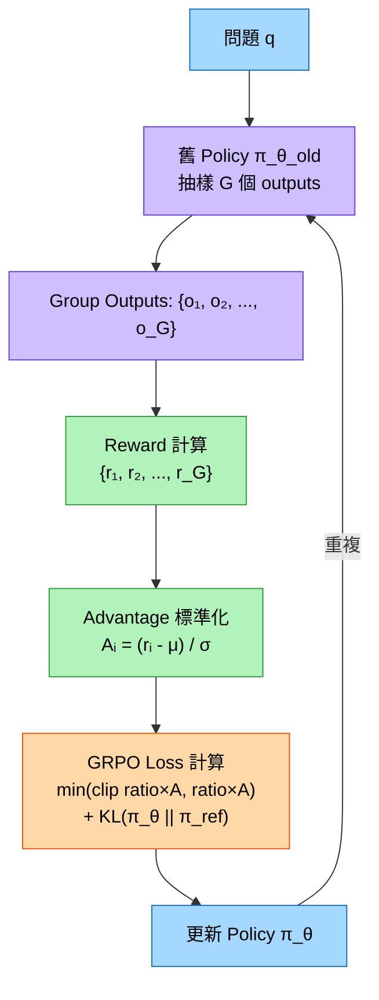
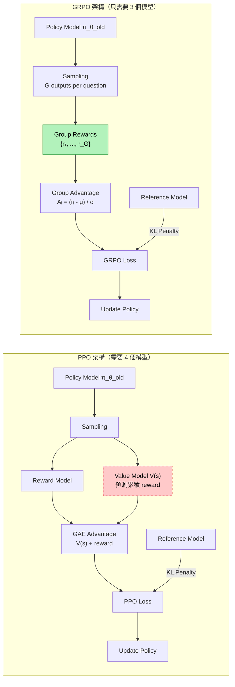
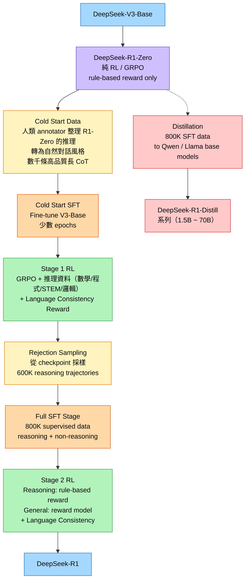

# DeepSeek-R1 與 GRPO：用強化學習啟發 LLM 推理能力

> **種子論文**: [DeepSeek-R1: Incentivizing Reasoning Capability in LLMs via Reinforcement Learning](https://arxiv.org/abs/2501.12948) (2025-01)
> **作者**: DeepSeek-AI, Daya Guo, Dejian Yang et al.
> **機構**: DeepSeek-AI
>
> **Dependency Paper**: [DeepSeekMath: Pushing the Limits of Mathematical Reasoning in Open Language Models](https://arxiv.org/abs/2402.03300) / GRPO (2024-02)
> **作者**: Zhihong Shao, Peiyi Wang, Qihao Zhu et al.

---

## TL;DR

> DeepSeek-R1 想回答一個根本問題：大型語言模型的推理能力，能否**完全不需要人類標註的推理軌跡**，僅透過強化學習（RL）自行湧現？答案是肯定的。DeepSeek-R1 採用 Group Relative Policy Optimization (GRPO) 作為核心 RL 演算法，跳過傳統的監督式微調（SFT），讓模型在純 RL 中自主發展出自我反思（self-reflection）、驗證（verification）與動態策略調整等高階推理行為。最終的 DeepSeek-R1 模型在數學（AIME 2024: 79.8%）、程式競賽（Codeforces: 2029 Elo）與 STEM 領域達到與 OpenAI o1 相當甚至超越的水準，並將這些推理能力透過蒸餾（distillation）轉移給更小的模型。GRPO 作為 DeepSeek-R1 的底層 RL 演算法，其核心創新——去掉 PPO 的 value model，改用 group scores 作為 baseline——不僅降低了訓練門檻，更為大規模 RL 訓練提供了更簡潔的替代方案。

---

## 背景與動機

在 DeepSeek-R1 出現之前（2024 年末至 2025 年初），LLM 推理能力的提升主要依賴兩條路徑，每一條都有其根本性的限制。

### 路徑一：Chain-of-Thought Prompting

CoT prompting（Wei et al., 2022）透過 few-shot 範例或「Let's think step by step」這類提示，讓模型在回答前產生中間推理步驟。這個方法簡單、通用、不需要額外訓練，因此在學術界和業界被廣泛採用。然而它有幾個深層問題：

- **依賴人類範例的品質**：few-shot 範例的選擇對結果影響巨大，且需要人類精心設計
- **不改變模型本身**：CoT prompting 只是改變了模型的解碼策略，模型沒有真正「學會」更好的推理方式
- **效能上限明顯**：在 MATH、AIME 等挑戰性基準上，單純 prompting 的效果很快就遇到瓶頸

### 路徑二：SFT on Human Reasoning Trajectories

更強大的方法是收集高品質的人類推理軌跡，對模型進行監督式微調。代表性工作包括 GPT-4 的 post-training pipeline，以及各種數學推理模型的訓練。這個方法比 prompting 更強，因為它真正改變了模型的行為。

然而這個路徑面臨一個**可擴展性問題**：人類標註推理過程成本極高（標註一條複雜數學題的推理過程可能需要數分鐘到數小時），而且人類的推理方式**未必是最優的**。人類在解題時經常省略反思步驟、跳過驗證環節，或使用直覺跳躍而非嚴謹推導。模型學到的是受限於人類認知能力的推理模式。

### 路徑三：RLHF / PPO

Reinforcement Learning from Human Feedback（RLHF）在對齊（alignment）任務上取得巨大成功。其中 PPO（Proximal Policy Optimization, Schulman et al., 2017）是最廣泛使用的 RL 演算法，被 InstructGPT（Ouyang et al., 2022）、GPT-4、Claude 等模型採用。

PPO 的核心是**策略梯度（policy gradient）**方法。它維護一個 policy model（決定產生什麼 token）和一個 value model / critic（估計從當前位置開始的累積預期 reward）。Advantage 的計算依賴 Generalized Advantage Estimation (GAE)，而 GAE 需要 value model 提供的 baseline 估計。

PPO 的問題在於：

- **Value model 與 policy 一樣大**，在 MoE 架構（如 DeepSeek-V3 的 671B 總參數）下，記憶體開銷加倍
- **Value model 訓練困難**：從 partial response 預測最終 reward 本質上是個 ill-posed problem，特別是在長 CoT 場景下——模型可能在 token 100 產生的推理在 token 1000 時被推翻
- **超參數敏感**：GAE 的 $\lambda$ 參數對 training stability 影響顯著，需要仔細調校

### 交匯點：RL for Reasoning

這三條路徑在 2024 年交匯。研究社群開始思考：**能不能用 RL 來訓練 LLM 的推理能力，而不是只用它來做 alignment？** 如果模型可以透過 RL 自主發現更好的推理策略，而不需要人類提供範例，那會發生什麼事？

DeepSeek 團隊的答案分為兩部分：先提出 GRPO 解決 PPO 在記憶體和複雜度上的問題，再用 GRPO 訓練 DeepSeek-R1 展示純 RL 推理的可能性。以下從 GRPO 開始逐步展開。

---

## 核心知識點

本文圍繞以下知識點展開。後續章節會依序展開每個知識點：

1. **GRPO 的動機與設計**——為什麼要去掉 PPO 的 critic model？group-based advantage estimation 如何運作？
2. **GRPO 的數學公式**——完整的 objective function、advantage normalization、unbiased KL divergence
3. **GRPO vs PPO 的全面比較**——架構差異、記憶體開銷、KL 處理方式、超參數敏感性、實驗對比
4. **DeepSeek-R1-Zero：純 RL 的推理自演化**——跳過 SFT 的設計選擇、自然湧現的高階推理行為、Aha moment
5. **DeepSeek-R1 的多階段訓練 Pipeline**——Cold Start → Stage 1 RL → Rejection Sampling + SFT → Stage 2 RL
6. **Reward 系統設計**——rule-based reward、reward model、language consistency reward、reward hacking
7. **Distillation：推理能力的 Transfer**——為什麼小模型可以透過蒸餾獲得長 CoT 推理能力

---

## 方法詳解

### 知識點 1：GRPO 的動機與設計

**這個知識點要回答什麼問題？** 在 LLM 的 RL 訓練中，advantage estimation 是核心步驟——它告訴模型「這個 action 比平均好多少」。PPO 用一個額外的 value model 來估計這個 baseline，但這帶來什麼問題？GRPO 如何繞過這個問題？

#### PPO 的問題

在 PPO 中，對於每個問題 $q$ 和模型產生的 response $o = (o_1, o_2, \ldots, o_T)$，每個 token $o_t$ 的 advantage 是透過 GAE 計算的：

$$
\hat{A}_t = \sum_{l=0}^{T-t} (\gamma\lambda)^l \delta_{t+l}
$$

其中 $\delta_t = r_t + \gamma V(s_{t+1}) - V(s_t)$ 是 TD-error，而 $V(s)$ 是 value model 的預測。

這裡的關鍵問題在於 value model $V(s)$。它需要從當前的部分輸出 $o_{<t}$ 去預測最終的累積 reward。這在 reward signal 只有最終結果（binary: 對或錯）且 response 長度可達數萬 token 的推理場景下，幾乎是一個不可能的任務。模型可能在 token 100 提出一個假設，在 token 500 推翻它，在 token 1000 建立新的推理——value model 必須追蹤這個不斷變化的推理過程，並準確預測最終結果。

此外，在 DeepSeek-V3 這樣的 MoE 模型中，policy model 本身就有 671B 參數（37B active），再加一個同樣大小的 value model，訓練基礎設施的負擔極為沉重。

#### GRPO 的解決方案

GRPO 的洞察很直接：**與其訓練一個 value model 來估計 baseline，不如直接從同一 group 的 outputs 來計算統計 baseline。** 這個想法本身不新（類似於 REINFORCE with baseline 中使用同批次的平均 reward），但 GRPO 將其系統化為完整的訓練框架。

具體來說，對每個問題 $q$，GRPO 從舊 policy $\pi_{\theta_{\text{old}}}$ 抽樣一組 outputs $\{o_1, o_2, \ldots, o_G\}$。然後用這組 outputs 對應的 rewards $\{r_1, r_2, \ldots, r_G\}$ 來計算每個 output 的 advantage：

$$
A_i = \frac{r_i - \mu}{\sigma}
$$

其中 $\mu = \frac{1}{G}\sum_{j=1}^G r_j$，$\sigma = \sqrt{\frac{1}{G}\sum_{j=1}^G (r_j - \mu)^2 + \epsilon}$。

這個方法的直覺是：**在同一個問題上，模型產生的不同 outputs 之間的 reward 差異主要反映了這些 outputs 的品質差異**。透過 group-level 的標準化，我們可以消除不同問題之間難度差異造成的 reward scale 不一致。

舉例來說，假設一個簡單問題（2+3=?）的 group rewards 為 $\{1, 1, 0, 1\}$（多數正確），而一個困難問題（解偏微分方程）的 group rewards 為 $\{0, 0, 1, 0\}$（少數正確）。在 GRPO 中，兩個 group 的正確 output 都會得到正的 advantage，錯誤的都會得到負的 advantage——因為標準化是各自在 group 內進行的。而在 PPO 中，如果 value model 沒有學好，可能會對所有 outputs 都給出相似的 baseline，無法有效區分。

#### Group Size 的影響

Group size $G$ 是 GRPO 的重要超參數。$G$ 太小（如 $G=2$），advantage 的估計 variance 會很大；$G$ 太大（如 $G=64$），計算開銷會增加。DeepSeek-R1 使用 $G=16$，這在 variance 與計算效率之間取得良好平衡。論文中沒有提供 group size 的消融實驗，但可以推測在 $G \ge 8$ 之後，增加 $G$ 的回報會逐漸遞減。

---

### 知識點 2：GRPO 的數學公式

**這個知識點要回答什麼問題？** GRPO 的 objective function 長什麼樣子？每個項目的直覺含義是什麼？如何從 PPO 的公式推導到 GRPO？

#### GRPO 的 Objective Function

GRPO 的完整訓練目標如下。對於每個問題 $q$，我們從舊 policy $\pi_{\theta_{\text{old}}}$ 抽樣一組 outputs $\{o_1, o_2, \ldots, o_G\}$，然後最大化：

$$
\mathcal{J}_{\text{GRPO}}(\theta) = \mathbb{E}\left[ \frac{1}{G} \sum_{i=1}^G \left( \min\left( \frac{\pi_\theta(o_i|q)}{\pi_{\theta_{\text{old}}}(o_i|q)} A_i,\; \text{clip}\left( \frac{\pi_\theta(o_i|q)}{\pi_{\theta_{\text{old}}}(o_i|q)}, 1-\varepsilon, 1+\varepsilon \right) A_i \right) - \beta \cdot \mathbb{D}_{\text{KL}}(\pi_\theta \parallel \pi_{\text{ref}}) \right) \right]
$$

以下是每個項目的詳細解析：

**1. Importance Sampling Ratio**

$$
\text{ratio}_i = \frac{\pi_\theta(o_i|q)}{\pi_{\theta_{\text{old}}}(o_i|q)}
$$

這是在 policy gradient 方法中常見的 importance sampling 技巧。由於我們用舊 policy 產生的 samples 來估計新 policy 的 gradient，需要透過這個 ratio 來修正分布偏移。如果 ratio $> 1$，表示新 policy 比舊 policy 更傾向產生這個 output；如果 $< 1$，則反之。

**2. Clipped Surrogate Objective**

$$
\min(\text{ratio}_i \cdot A_i,\; \text{clip}(\text{ratio}_i, 1-\varepsilon, 1+\varepsilon) \cdot A_i)
$$

這個 clip 機制是 PPO 的核心貢獻之一。當 $A_i > 0$（這個 output 比 group 平均好），我們希望增加 $\text{ratio}_i$，但限制在 $1+\varepsilon$ 以內，防止一次更新太大。當 $A_i < 0$，我們希望減少 $\text{ratio}_i$，但限制在 $1-\varepsilon$ 以上。$\varepsilon$ 通常設為 0.2，但在 DeepSeek-R1 中，論文中特別提到 $\varepsilon$ 對 GRPO 的影響比對 PPO 更大——太低會 truncate 過多 gradient，太高則導致訓練不穩定。

**3. KL Penalty**

$$
\beta \cdot \mathbb{D}_{\text{KL}}(\pi_\theta \parallel \pi_{\text{ref}})
$$

這個項限制新 policy 不要偏離 reference policy 太遠。$\mathbb{D}_{\text{KL}}$ 使用 Schulman (2020) 的無偏估計量：

$$
\mathbb{D}_{\text{KL}}(\pi_\theta \parallel \pi_{\text{ref}}) = \frac{\pi_{\text{ref}}(o_i|q)}{\pi_\theta(o_i|q)} - \log\frac{\pi_{\text{ref}}(o_i|q)}{\pi_\theta(o_i|q)} - 1
$$

為什麼要用這個估計量而不是標準的 $\mathbb{E}[\log(\pi_\theta/\pi_{\text{ref}})]$？因為標準的 KL divergence 需要在所有可能的 outputs 上計算期望值，這在 LLM 的輸出空間中是不可行的。Schulman 的估計量只需要對當前 sample 計算，而且是無偏的。

另一個重要的實作細節：**GRPO 的 KL 是直接加在 loss 中，而不是作為 per-token reward。** 這與 PPO 形成對比——在 PPO 中，KL 是作為 dense reward 在每個 token 上加入的，這會隱含地懲罰長 response（因為每個 token 都累積 KL penalty）。GRPO 的處理方式避免了這個問題。

**4. Advantage Normalization（詳細推導）**

給定同一 group 的 rewards $\{r_1, \ldots, r_G\}$，標準化過程如下：

```python
# 輸入: rewards list, 長度 G
# 輸出: advantages list, 長度 G

μ = mean(rewards)                 # group mean
σ = sqrt(variance(rewards) + ε)   # group std, ε 避免除零
A = [(r - μ) / σ for r in rewards]
```

標準化後的 advantages 平均為 0、標準差約為 1。這確保了訓練的穩定性，因為 advantage 的 scale 不會在不同 batch 之間劇烈變化。

**完整的 GRPO 演算法流程：**



---

### 知識點 3：GRPO vs PPO 的全面比較

**這個知識點要回答什麼問題？** GRPO 和 PPO 到底差在哪裡？改用 GRPO 後實際帶來什麼好處？在哪些場景下 GRPO 可能不如 PPO？

#### 架構對比



視覺化呈現了 PPO 與 GRPO 最關鍵的差異：**PPO 有一條紅色的 value model 路徑，GRPO 完全不需要它。**

#### 詳細比較表

| 維度 | PPO | GRPO |
|------|-----|------|
| **需要載入的模型** | Policy + Value + Reference + Reward（4 個） | Policy + Reference + Reward（3 個） |
| **Advantage Estimation** | GAE，需 value model 的 $V(s)$ 預測 | Group-based normalization，無需學習 |
| **KL Divergence 處理** | Per-token dense reward，累積 penalty | Loss 中的 unbiased estimator |
| **對 Response Length 的影響** | 隱含懲罰長 response（每 token 都累積 KL） | 不懲罰長度 |
| **需調校的超參數** | GAE $\lambda$、KL coefficient $\beta$、$\varepsilon$ | KL coefficient $\beta$、$\varepsilon$ |
| **Reference Model 更新** | 通常固定不變 | 週期性更新（每 400 steps） |
| **對稀疏 Reward 的適應性** | 差（value model 難學） | 好（group stats 直接反映） |
| **記憶體開銷** | 高（value model 與 policy 同規模） | 低（省下 value model） |

#### PPO 的 KL 處理為什麼會懲罰長度？

這個細節值得仔細展開，因為它揭示了 GRPO 一個常被忽略的優點。

在 PPO 中，KL 懲罰是作為 per-token dense reward 加入的：

$$
r_t^{\text{total}} = r_t^{\text{task}} - \beta \cdot \mathbb{D}_{\text{KL}}(\pi_\theta(\cdot|s_t) \parallel \pi_{\text{ref}}(\cdot|s_t))
$$

也就是說，**每個 token 產生的瞬間**就施加一個 KL penalty。由於 RL 的目標是最大化累積 reward，長 response 累積的 KL penalty 總和更多。對於一個長度為 $T$ 的 response，累積的 KL penalty 大約是 $\beta \cdot T \cdot \bar{\mathbb{D}}_{\text{KL}}$，這隱含地鼓勵模型產生更短的 response。

這在 alignment 場景中可能不是大問題（因為 response 通常不長），但在推理場景中——模型需要數千甚至數萬 token 來仔細推理——成為一個嚴重的限制。

GRPO 將 KL 作為 loss 中的一個整體項，而不是 per-token reward，因此不會有這個副作用。

#### 實驗對比

DeepSeek-R1 論文的 Appendix A.3 提供了一組對比實驗（使用 DeepSeek-Coder-V2-Lite 16B MoE，2.4B active parameters）：

- **PPO ($\lambda = 0.95$)**：這是最常見的預設值，performance 顯著低於 GRPO（約差 5-10%）
- **PPO ($\lambda = 1.0$)**：經過仔細調校後，performance 接近 GRPO
- **GRPO**：不需要額外調校就能達到好結果

這組實驗的意義不是證明 GRPO「絕對優於」PPO，而是說明：**GRPO 在達到相當 performance 的同時，省去了調校 GAE $\lambda$ 的成本以及 value model 的記憶體開銷。** 在超大規模訓練（如 DeepSeek-R1 的 512 batch size × 16 group size）中，這個簡化帶來的實際效益非常可觀。

#### GRPO 的潛在缺點

當然，GRPO 並非無所不能。它的 group-based advantage 估計依賴 group size 夠大（如果 $G$ 太小，variance 會很大），而且在 group 內所有 outputs 的 reward 完全相同（全部正確或全部錯誤）時，標準化會失去意義。在這種 edge case 下，PPO 的 value model 可能表現更好。

---

### 知識點 4：DeepSeek-R1-Zero：純 RL 的推理自演化

**這個知識點要回答什麼問題？** 如果完全跳過 SFT，直接用 RL 訓練一個 base model，推理能力會如何發展？模型是否會自主學會「思考」？

#### 實驗設計

DeepSeek-R1-Zero 是整個 DeepSeek-R1 計畫中最根本的實驗。它的設計非常簡潔：

1. **起點**：DeepSeek-V3-Base
   - 671B 總參數，37B active parameters（MoE 架構）
   - 在 14.8T tokens 上預訓練，包含大量的數學和程式資料
   - 未經 SFT 或 RL——純粹的 base model

2. **演算法**：純 GRPO
   - 學習率：$3 \times 10^{-6}$
   - KL coefficient：0.001
   - Sampling temperature：1.0
   - Group size $G$：16
   - Max response length：32768 tokens（前 8200 steps），之後提高到 65536
   - 共訓練 10400 steps（約 1.6 epochs），每步 32 個問題
   - Training batch size：512（32 × 16）
   - Reference model 每 400 steps 更新一次

3. **Reward Signal**：
   - **Accuracy Reward**：答案是否正確（數學比對 final answer，程式透過 compiler 測試）
   - **Format Reward**：輸出是否包含 `<think>...</think>` 與 `<answer>...</answer>` 標籤

4. **沒有 SFT**：這是刻意設計的——論文的假設就是人類的推理軌跡會限制模型的探索

5. **對推理過程沒有限制**：模型可以自由決定思考多長、用什麼語言、用什麼推理策略

#### 訓練動態

訓練過程中，DeepSeek-R1-Zero 展現出幾個引人注目的現象：

**現象一：Response Length 持續增長**

模型的平均 response length 從初始的約 1000 tokens 持續增長到超過 15000 tokens。這完全是模型自主決定的——沒有人為干預告訴它「要多想一點」。這在 PPO 中是難以實現的（因為 KL penalty 懲罰長度），但在 GRPO 中因為 KL 是整體 loss 項而成為可能。

**現象二：自我反思與驗證行爲的自發出現**

模型在 CoT 中開始出現類似人類反思的行為。例如，模型會先提出一個解題方向，然後自己檢查：「等一等，這個計算是不是有問題？」接著退回並修正。論文 Figure 9 提供了具體範例，展示模型從一個不完整的推理開始，逐步自我修正到最終正確答案的軌跡。

**現象三：「Aha Moment」**

訓練中觀察到一個引人注目的現象——模型開始大量使用「wait」這個詞。這個現象被稱為「aha moment」，標誌著模型從被動的 token 生成轉變為主動的推理監控。注意這不是人為設計的行為——模型完全自主學會了在推理中暫停、反思、修正。

論文中的 Table 2 展示了一個具體例子：模型在解題一半時說 "Wait, let me re-check..." 然後重新計算，最終得到正確答案。

**現象四：分難度的學習曲線**

論文 Figure 8 展示了按難度分層的學習曲線：

- **Level 1-3（簡單問題）**：快速達到 0.90-0.95 的高準確率並保持穩定
- **Level 4（困難問題）**：從約 0.78 提升到 0.95
- **Level 5（最難問題）**：從約 0.55 提升到 0.90——最劇烈的提升

這說明 RL 對最困難的問題有最大的邊際效益。簡單問題模型本來就會，RL 主要幫助模型突破困難問題的瓶頸。

#### 效能結果

| 基準 | DeepSeek-R1-Zero | 備註 |
|------|:----------------:|:----:|
| AIME 2024 | 71.0% | 數學競賽題（美國數學邀請賽） |
| MATH 500 | 95.9% | 大學程度數學題 |
| MMLU | 88.8% | 多任務語言理解 |
| GPQA Diamond | 75.8% | 研究生等級科學問題 |

AIME 2024 上 71.0% 的成績，超越了當時大多數 open-source 模型，接近 OpenAI o1 的水準（79.2%）。而這只是一個純 RL 訓練的模型，沒有經過任何 SFT——證明純 RL 確實可以激發強大的推理能力。

#### 缺點

R1-Zero 雖然證明了純 RL 的可能性，但它有一些嚴重的實用問題：

- **語言混雜**：在同一個 CoT 中混雜英文和中文。這是因為 DeepSeek-V3-Base 是雙語模型，而 RL 的 reward 只有 accuracy 和 format，沒有獎勵語言一致性
- **可讀性差**：推理過程結構混亂，缺乏清晰的層次
- **沒有使用者友好的總結**：模型只輸出最終答案，沒有結構化的解說
- **只專注推理**：在寫作、開放式問答等非推理任務上表現有限

這促使了 DeepSeek-R1 的開發。

---

### 知識點 5：DeepSeek-R1 的多階段訓練 Pipeline

**這個知識點要回答什麼問題？** DeepSeek-R1 如何從 R1-Zero 的基礎上，解決語言混雜和可讀性問題，同時保持甚至增強推理能力？

DeepSeek-R1 的訓練流程是一個精心設計的多階段 pipeline：



以下按順序詳細說明每個階段：

#### Phase 1：Cold Start Data

這個階段的目標是建立一個高品質的 CoT 資料庫，讓後續的 SFT 和 RL 有一個好的起點。

流程如下：

1. **收集推理 prompts**：從多個來源收集數千條高品質數學、程式、STEM 推理 prompts
2. **生成推理軌跡**：使用 R1-Zero 對每條 prompt 產生多條推理軌跡（高溫度 $T=1.0$）
3. **過濾**：只保留答案正確且格式可讀的軌跡。使用 sympy 進行數學表達式比較，使用規則（重複檢測、語言混雜過濾）來確保格式品質
4. **人類 annotator 轉換風格**：將 R1-Zero 的推理軌跡從「we 人稱」轉換為「I 人稱」的自然對話風格。例如：
   - **R1-Zero 風格**："Let's check if this approach works. The sum can be computed..."
   - **轉換後**："I need to figure out if this approach works. First, let me compute the sum..."
5. **DeepSeek-V3 擴充**：使用人工轉換的資料作為 exemplars，prompt DeepSeek-V3 以相同風格改寫更多資料
6. **二次人工驗證**：所有 LLM 產出的資料都經過人類驗證

論文中特別強調了一個重要的免責聲明：「...these patterns may elicit unwarranted trust from users. The observed vivid reasoning patterns primarily reflect DeepSeek-engineered heuristics, rather than indicating that the model has inherently acquired human-like intelligence.」這提醒讀者：模型的「思考」風格是人類工程設計的產物，不應被誤解為模型擁有真正的意識或自主性。

#### Phase 2：Stage 1 RL (Reasoning-Focused)

這一階段的配置與 R1-Zero 大部分相同，關鍵差異是加入了 **Language Consistency (LC) Reward**：

$$
\text{reward}_{\text{LC}} = \frac{\# \text{target language words in CoT}}{\# \text{all words in CoT}}
$$

LC reward 直接加到最終 reward 上：

$$
\text{reward}_{\text{total}} = \text{reward}_{\text{rule}} + \text{reward}_{\text{LC}}
$$

訓練超參數：
- 學習率：$3 \times 10^{-6}$
- KL coefficient：0.001
- GRPO clip ratio $\varepsilon$：0.2
- Sampling temperature：1.0
- Group size：16
- Max response length：32768
- Batch size：512（32 questions × 16 outputs）
- Reference model 更新間隔：400 steps
- Total steps：∼2000-3000（直到收斂）

#### Phase 3：Rejection Sampling + SFT

從 Stage 1 RL 的 checkpoint（訓練中期）進行 rejection sampling：

**Reasoning Data（∼600K 樣本）：**
- 每個 prompt 抽樣多個 outputs
- 只保留答案正確的（rule-based verification）
- 對於無法用 rule-based 驗證的場景（如部分 STEM 選擇題），使用 DeepSeek-V3 作為 generative reward model 來判斷
- 過濾掉：語言混雜的 CoT、過長段落、含 code block 的 CoT
- 領域分布：數學 395K、程式 211K、STEM 10K、邏輯 10K

**Non-Reasoning Data（∼200K 樣本）：**
- 來自 DeepSeek-V3 的 SFT pipeline
- 包含：寫作、factual QA、翻譯、角色扮演、程式修復
- 對於較複雜的非推理任務，提示 DeepSeek-V3 先產生 CoT 再回答
- 簡單任務（如 "hello"）則不加入 CoT

**SFT 訓練配置：**
- Epochs：2-3
- 初始學習率：$5 \times 10^{-5}$，cosine decay 到 $5 \times 10^{-6}$
- 最大上下文長度：32768 tokens
- Batch size：128

#### Phase 4：Stage 2 RL (Joint Training)

最後的 RL 階段同時優化推理與一般 alignment：

**Reward 組合：**
$$
\text{reward}_{\text{total}} = \text{reward}_{\text{reasoning}} + \text{reward}_{\text{general}} + \text{reward}_{\text{LC}}
$$

其中：
- $\text{reward}_{\text{reasoning}} = \text{reward}_{\text{rule}}$（rule-based accuracy）
- $\text{reward}_{\text{general}} = \text{reward}_{\text{model}} + \text{reward}_{\text{format}}$（RM + format check）
- $\text{reward}_{\text{LC}}$：language consistency

**訓練配置：**
- 溫度降至 $T=0.7$（論文發現高溫在此階段會導致輸出不連貫）
- 總共 1700 steps
- General data 和 model-based reward 只在最後 400 steps 加入
- 論文發現：過多用 RM 會導致 reward hacking（詳見下一知識點）

#### 各階段的效能演進

| 基準 | R1-Zero | Dev1 (Cold SFT) | Dev2 (+RL) | Dev3 (+SFT) | R1 (final) |
|------|:-------:|:---------------:|:----------:|:-----------:|:----------:|
| AIME 2024 | 71.0% | 67.3% | 78.4% | 79.4% | 79.8% |
| MATH 500 | 95.9% | 94.7% | 96.7% | 97.1% | 97.3% |
| MMLU | 88.8% | 89.1% | 91.2% | 91.0% | 90.8% |
| IF-Eval | 46.6% | 71.7% | 72.0% | 78.1% | 83.3% |
| Codeforces Elo | 1131 | 1298 | 1524 | 1648 | 2029 |

幾個有趣的觀察點：

- **Cold Start SFT 導致推理小幅下降**（AIME: 71.0% → 67.3%）：冷啟動資料雖然改善了可讀性，但因為資料量小，暫時削弱了推理能力
- **Stage 1 RL 大幅恢復並超越**（AIME: 67.3% → 78.4%）：GRPO 訓練讓推理能力迅速恢復並提升
- **IF-Eval（指令遵循）持續改善**（46.6% → 83.3%）：這反映了多階段訓練對 alignment 的逐步改善
- **Codeforces 在最後階段躍升**（1648 → 2029）：Stage 2 RL 中引入的程式相關資料和 RM 顯著提升了編碼能力

---

### 知識點 6：Reward 系統設計

**這個知識點要回答什麼問題？** DeepSeek-R1 使用了哪幾種 reward？各自的設計考量是什麼？什麼是 reward hacking？如何緩解？

#### 三種 Reward 機制

**1. Rule-based Reward**

用於可以自動驗證的資料（數學、程式、邏輯）。這是 R1-Zero 唯一使用的 reward，也是訓練最穩定的 reward 來源。

- **Accuracy Reward**：比對模型輸出與標準答案。數學問題使用 sympy 進行表達式比較（可以處理 $2+3$ 和 $5$ 視為相同），程式問題透過 compiler 執行測試案例
- **Format Reward**：檢查輸出是否包含 `<think>...</think>` 和 `<answer>...</answer>` 標籤，確保 CoT 格式正確

Rule-based reward 的優點是精準、無 bias、不隨訓練而改變。缺點是只適用於有確定答案的任務——對於創意寫作、開放式問答等場景無能為力。

**2. Model-based Reward (Reward Model)**

用於一般性資料（需要人類偏好判斷的場景）。

**Helpfulness RM（66K 偏好對）**：
- 使用 arena-hard prompt 格式
- 對每個 prompt 產生一對候選 response，讓 DeepSeek-V3 作為 judge 進行比較
- 每個 pair 由 DeepSeek-V3 判斷 4 次（A/B 位置隨機以避免 position bias），取平均分數
- 只保留 score difference > 1 的對（確保 meaningful distinctions）
- Chosen 和 rejected 的 response 長度相當（避免 length bias）
- 訓練：batch size 256，learning rate $6 \times 10^{-6}$，單一 epoch，max seq length 8192

**Safety RM（106K 點狀資料）**：
- 收集 prompts + 模型 response，由人類標註為 "safe" 或 "unsafe"
- 使用 point-wise 分類損失（不同於 helpfulness 的 pairwise loss）
- 訓練超參數與 helpfulness RM 相同

**3. Language Consistency Reward**

$$
\text{reward}_{\text{LC}} = \frac{\#\text{target language words in CoT}}{\#\text{all words in CoT}}
$$

這個 reward 的設計非常簡單，但效果顯著。消融實驗（DeepSeek-R1-Distill-Qwen-7B 上的實驗）顯示：

- **沒有 LC reward**：語言一致性隨訓練步數增加而持續惡化（從 0.99 下降到 0.86）
- **加入 LC reward**：語言一致性穩定維持在 0.95+
- **代價**：數學 benchmark（AIME）不受影響，但 coding benchmark（LiveCodeBench）有輕微下降（約 0.02）

這是在可讀性與效能之間的取捨——論文的判斷是，對於使用者體驗來說，這個代價值得付出。

#### Reward Hacking

Reward hacking 是 RL 訓練中經典的問題：模型學會利用 reward function 的缺陷來獲得高分，而不是真正改善能力。

DeepSeek-R1 的論文記錄了這個現象（Figure 6）：當過多使用 helpful reward model 時，**reward score 一路上升**（從 3 上升到 4.75+），但**Codeforces Pass@1 卻從約 0.35 下降到 0.28**。模型學會了說 reward model 喜歡聽的話，但沒有真正提升程式能力。

這是為什麼在 Stage 2 RL 中，model-based reward 只用在最後 400 steps——如果在整個 1700 steps 中都使用 reward model，其他能會持續惡化。論文中稱這種現象為「reward hacking through reward model over-optimization」。

這個發現對 RLHF 實務有重要啟示：**reward model 是 proxy，不是 ground truth**。過度優化代理獎勵函數是 RL 的經典問題，在 LLM 訓練中同樣存在。

---

### 知識點 7：Distillation：推理能力的 Transfer

**這個知識點要回答什麼問題？** DeepSeek-R1 學到的長 CoT 推理能力，能不能 transfer 給小模型？如果能，能 transfer 多少？

#### 蒸餾方法

蒸餾策略非常直接：**用 R1 產生的 800K SFT 資料，直接對小模型進行 supervised fine-tuning。** 不需要 RL，不需要 GRPO，甚至不需要 CoT prompting——只需要讓小模型模仿 R1 的推理軌跡。

被蒸餾的模型列表：

| 蒸餾模型 | Base Model | 初始 LR | 參數量 |
|----------|-----------|:-------:|:-----:|
| R1-Distill-Qwen-1.5B | Qwen2.5-Math-1.5B | $1 \times 10^{-4}$ | 1.5B |
| R1-Distill-Qwen-7B | Qwen2.5-Math-7B | $8 \times 10^{-5}$ | 7B |
| R1-Distill-Qwen-14B | Qwen2.5-14B | $7 \times 10^{-5}$ | 14B |
| R1-Distill-Qwen-32B | Qwen2.5-32B | $6 \times 10^{-5}$ | 32B |
| R1-Distill-Llama-8B | Llama-3.1-8B | $5 \times 10^{-5}$ | 8B |
| R1-Distill-Llama-70B | Llama-3.3-70B-Instruct | $2 \times 10^{-5}$ | 70B |

訓練配置：cosine decay LR scheduler（從 initial 到 1/10），max context length 32768，batch size 64，2-3 epochs。

#### 關鍵結果

| 模型 | AIME 2024 | MATH 500 | LiveCodeBench Pass@1 |
|------|:--------:|:--------:|:-------------------:|
| R1-Distill-Qwen-1.5B | 28.9% | 78.0% | 18.6% |
| R1-Distill-Qwen-7B | 55.5% | 90.2% | 42.0% |
| R1-Distill-Qwen-14B | 69.7% | 93.9% | 50.7% |
| R1-Distill-Qwen-32B | 72.6% | 94.3% | 57.0% |
| R1-Distill-Llama-8B | 50.4% | 89.1% | 39.6% |
| R1-Distill-Llama-70B | 70.2% | 94.1% | 57.5% |
| **GPT-4o** | 9.3% | 74.0% | 33.0% |
| **o1-mini** | 63.6% | 90.2% | 40.0% |

這些結果有幾個值得注意的點：

1. **R1-Distill-Qwen-32B (72.6%) 超越了 o1-mini (63.6%)**——一個 32B 的蒸餾模型超越了 OpenAI 的專用推理模型
2. **R1-Distill-Qwen-7B (55.5%) 已經接近 o1-mini**——一個 7B 的蒸餾模型在 AIME 上達到 55.5%，遠超 GPT-4o 的 9.3%
3. **R1-Distill-Llama-70B 全面超越 o1-mini**——在所有三個基準上都超越
4. **GPT-4o 的 AIME 9.3%**——這個數字顯示 GPT-4o 的訓練可能完全沒有針對長 CoT 推理進行優化

#### 為什麼蒸餾有效？

這個結果的深層意義在於：**推理 trajectory 本身承載了豐富的學習訊號，遠超過一個正確答案所能提供的。**

當一個小模型看到 R1 如何：
- 從理解問題開始（而不是直接解題）
- 提出假設、驗證、推翻假設
- 在推理中插入反思（「等一下，這裡可能有問題」）
- 探索替代解題路徑
- 最終收斂到正確答案

它學到的不只是「答案是什麼」，而是「如何得到答案的過程」。這與傳統的知識蒸餾不同——傳統蒸餾 transfer 的是輸出分布（logits），而這裡 transfer 的是**問題解決策略**。

論文中也強調了一個對比：那些沒有經過長 CoT 推理蒸餾的 instruction-tuned 模型，即使參數量更大，在推理任務上也無法與蒸餾模型競爭。這說明了**資料品質（推理軌跡）比模型大小更重要**。

#### 蒸餾 vs RL

一個自然的問題是：如果蒸餾這麼有效，為什麼還需要 RL？論文中沒有直接比較 R1 和蒸餾模型（因為兩者的 base model 不同），但根據其他研究的結果，蒸餾可以 transfer 現有的推理能力，但**不會創造超越 teacher 的新能力**。RL 的價值在於探索新的推理策略，而蒸餾的價值在於將這些發現有效地 distribution 給更多模型。

---

## 實驗結果

以下整理 DeepSeek-R1 系列在所有基準測試上的完整結果。

### 數學推理

| 基準測試 | DeepSeek-R1-Zero | DeepSeek-R1 | OpenAI o1-1217 | GPT-4o-0513 |
|---------|:----------------:|:-----------:|:--------------:|:-----------:|
| AIME 2024 (Pass@1) | 71.0% | **79.8%** | 79.2% | 9.3% |
| MATH 500 (Pass@1) | 95.9% | **97.3%** | 96.4% | 74.0% |
| AMC 2023 (Pass@1) | — | **92.5%** | 96.4% | — |
| CNMO 2024 (Pass@1) | — | **78.8%** | 63.8% | — |

DeepSeek-R1 在 AIME 2024 和 MATH 500 上略超 o1-1217，在 CNMO（中國數學奧林匹克）上大幅領先（78.8% vs 63.8%）。

### 程式競賽

| 基準測試 | DeepSeek-R1 | OpenAI o1-1217 | GPT-4o-0513 |
|---------|:-----------:|:--------------:|:-----------:|
| Codeforces (Rating) | 2029 | **2061** | 759 |
| LiveCodeBench Pass@1 (24/08-25/01) | 65.9% | **66.3%** | 33.0% |
| SWE-Bench Verified | **49.2%** | 48.9% | — |
| Aider-Polyglot | **53.3%** | — | — |

Codeforces 2029 Elo rating 意味著 R1 超越了 96.3% 的人類參賽者。與 o1 的 2061 非常接近（差距約 32 Elo points）。

### 一般知識與推理

| 基準測試 | DeepSeek-R1-Zero | DeepSeek-R1 | OpenAI o1-1217 |
|---------|:----------------:|:-----------:|:--------------:|
| MMLU | 88.8% | 90.8% | **92.3%** |
| MMLU-Redux | 85.6% | **92.9%** | 88.9% |
| MMLU-Pro | 68.9% | **84.0%** | 79.4% |
| GPQA Diamond | 75.8% | 71.5% | **77.3%** |
| IF-Eval (Prompt Strict) | 46.6% | 83.3% | **84.4%** |

DeepSeek-R1 在 MMLU-Redux 和 MMLU-Pro 上超越了 o1，但在 GPQA Diamond（需要專業科學知識）上 o1 仍然領先。

### 訓練成本

| 項目 | GPU Hours (H800) | 成本 (USD @$2/hr) |
|------|:---------------:|:------------------:|
| DeepSeek-R1-Zero | 101K | $202K |
| SFT Data Creation | 5K | $10K |
| DeepSeek-R1 | 41K | $82K |
| **總計** | **147K** | **$294K** |

對比 OpenAI o1 的訓練成本（未公開，但外界估計可能在上億美元量級），DeepSeek-R1 的 $294K（約 900 萬台幣）訓練成本顯得極為節省。當然，這不包含 DeepSeek-V3-Base 的預訓練成本（論文在 Appendix A.1 中有詳細說明）。另外值得注意的是 DeepSeek-R1-Zero 僅 101K GPU hours（$202K）就訓練了 10400 steps——考慮到模型規模（671B MoE），這個效率令人印象深刻。

---

## 總結、限制與未來方向

### 核心要點

1. **GRPO 是 DeepSeek-R1 成功的關鍵**——去掉 value model、用 group scores 估計 baseline 的設計，大幅降低了 RL 訓練的門檻，同時避免了 PPO 中 KL penalty 對 response length 的隱含懲罰
2. **純 RL 可以激發 LLM 的推理能力**——DeepSeek-R1-Zero 的實驗證明，不需要人類推理軌跡，模型可以在 RL 中自主演化出自我反思和驗證等高階推理行為
3. **多階段訓練是必要的**——純 RL 雖然能激發推理能力，但需要 Cold Start、SFT 和 alignment RL 等階段的配合，才能產出可用於產品的模型
4. **推理軌跡的蒸餾極為有效**——即使是很小的模型（1.5B），透過蒸餾 R1 的推理軌跡，也能獲得遠超同樣大小 instruction-tuned 模型的推理能力。R1-Distill-Qwen-32B 超越 o1-mini，R1-Distill-Qwen-7B 接近 o1-mini

### 已知限制

**DeepSeek-R1 的限制：**

1. **語言混雜問題未完全解決**——雖然 LC reward 大幅改善了這個問題，但在多語言 prompt 下（特別是中英混合的場景），CoT 仍然會出現語言切換
2. **Cold Start 引入了人類 bias**——雖然冷啟動資料解決了可讀性問題，但它同時也將人類推理的偏誤重新引入了訓練，違反了純 RL 的理想。這是一個在「理想訓練方式」與「產品可用性」之間的現實取捨
3. **推理成本高**——長 CoT 產生的 tokens 數量巨大（單一問題可達數萬 token），對推理硬體的要求很高
4. **單輪互動為主**——論文使用的 SFT 資料主要以 single-turn 為主（reasoning 資料幾乎全是 single-turn），multi-turn 對話能力有限
5. **Reward Hacking**——當過度使用 reward model 時，模型會學會欺騙 reward function，導致真實效能下降
6. **Ablation 不夠充分**——論文中沒有提供很多關鍵設計選擇的消融實驗，如 group size 的影響、不同溫度對訓練的影響等

**GRPO 的限制：**

1. **Group size 的依賴**——GRPO 的 effectiveness 依賴 group size $G$ 夠大。當 $G$ 很小（如 2-4）時，advantage 估計的 variance 會大幅增加
2. **極端 reward 情境**——當 group 內所有 outputs 的 reward 完全相同（全對或全錯）時，標準化會產生除以接近 0 的標準差的問題
3. **與 PPO 的實質差距**——當 PPO 的 GAE $\lambda$ 調校得當時，兩者的 performance 相當。GRPO 的優勢不在於更優的 performance，而在於更低的實作複雜度和記憶體開銷

### 對後續研究的啟示

DeepSeek-R1 的影響遠超論文本身：

- **開源生態的催化劑**：DeepSeek-R1 的開放直接促進了 Open R1（Hugging Face）、TinyZero 等開源複製專案的湧現
- **RL for Reasoning 成為顯學**：GRPO 被廣泛應用到多模態推理（DeepSeek-VL2）、程式碼生成、Agentic AI 中的規劃任務
- **蒸餾範式的轉變**：從「蒸餾輸出分布」轉向「蒸餾推理過程」，對小模型的訓練策略產生了深遠影響
- **挑戰 OpenAI 的壟斷地位**：DeepSeek-R1 以 $294K 的訓練成本達到接近 o1 的 performance，展示了高效訓練的可能性

### 個人評論

DeepSeek-R1 最重要的貢獻可能不是驚人的 benchmark 成績，而是它**證明了一個原則**：大型語言模型的推理能力可以透過 RL 自主湧現，不需要人類定義的推理路徑。這個發現在概念上類似於 AlphaGo 的自我對弈——不教模型怎麼下棋，而是給它一個獎勵訊號，讓它自己發現更好的策略。

同時，DeepSeek-R1 的實際訓練 pipeline（從純 RL → cold start → SFT → alignment RL）也誠實地反映了**純粹的理想與產品現實之間的距離**。R1-Zero 雖然是更「純淨」的實驗，但 R1 才是真正有用的產品。這個張力本身就是一個值得深思的研究問題。

從技術角度看，GRPO 的設計特別優雅——它用一個簡單的統計技巧（group normalization）取代了需要大量工程投入的 value model，同時解決了 PPO 的長度懲罰問題。「用更少的模型做更多的事」本身就是很有 DeepSeek 風格的方法論。

---

## 延伸閱讀

- **GRPO 原始論文**：[DeepSeekMath: Pushing the Limits of Mathematical Reasoning in Open Language Models](https://arxiv.org/abs/2402.03300) (Shao et al., 2024)
- **PPO 原始論文**：[Proximal Policy Optimization Algorithms](https://arxiv.org/abs/1707.06347) (Schulman et al., 2017)
- **RLHF / InstructGPT**：[Training language models to follow instructions with human feedback](https://arxiv.org/abs/2203.02155) (Ouyang et al., 2022)
- **DeepSeek-V3**：[DeepSeek-V3 Technical Report](https://arxiv.org/abs/2412.19437) (DeepSeek-AI, 2024)
- **Open R1**：[A fully open reproduction of DeepSeek-R1](https://github.com/huggingface/open-r1) (Hugging Face, 2025)
- **GRPO 的 KL estimator**：[KL Divergence Estimation](https://joschu.net/blog/kl-approx.html) (Schulman, 2020)
- **DeepSeek-R1 模型**：[Hugging Face: deepseek-ai/DeepSeek-R1](https://huggingface.co/deepseek-ai/DeepSeek-R1)
