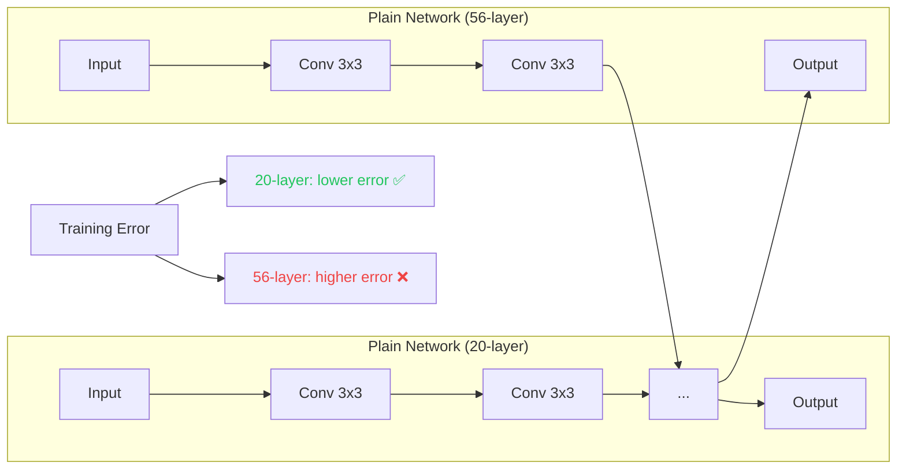
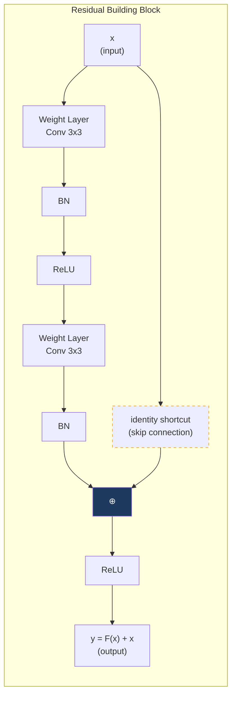
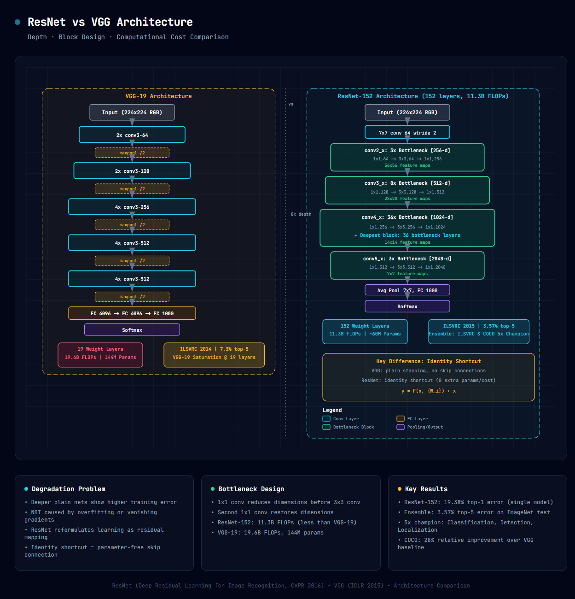

# ResNet (Deep Residual Learning): 論文導讀

> **種子論文**: [Deep Residual Learning for Image Recognition](https://arxiv.org/abs/1512.03385) (2015-12)
> **作者**: Kaiming He, Xiangyu Zhang, Shaoqing Ren, Jian Sun
> **機構**: Microsoft Research

---

## TL;DR

> 當卷積網路越堆越深時，plain network 的訓練誤差不降反升——這個違反直覺的現象稱為 degradation problem。ResNet 提出殘差學習框架，將非線性層擬合的目標從學習原始映射 H(x) 改為學習殘差 F(x) = H(x) − x，並透過 identity shortcut connection 實現 F(x) + x。在 ILSVRC 2015 上，152 層的 ResNet 以 3.57% top-5 error 奪冠（比 VGG 更深、計算量卻更少），並在 COCO 五項任務全部奪冠。

---

## 背景與動機

### 深度很重要，但堆不上去

2014 年的兩篇代表性工作——VGG (Simonyan & Zisserman) 和 GoogLeNet (Szegedy et al.)——各自用不同方式證明了增加深度對分類準確率有顯著幫助。VGG 的結論特別直觀：從 11 層堆到 19 層，error 穩定下降。這讓整個領域開始相信「更深 = 更好」。

然而，當研究者嘗試把 plain network 推到 20 層以上時，一個奇怪的現象出現了：

- **56 層 plain network 的 training error 高於 20 層版本**
- 這不是消失梯度造成的——batch normalization 和好的初始化已經解決了這個問題
- 這也不是 overfitting——training error 本身就比較高

這就是 **degradation problem**：深度本身的增加反而讓優化變得更難，而非過擬合或梯度問題。

### 既有方法的不足

| 方法 | 問題 |
|------|------|
| VGG | 深度在 19 層飽和，無法繼續加深 |
| Highway Network | 用 gated shortcut，有參數，但沒證明能訓練超過 100 層 |
| BN + 好初始化 | 解決了梯度問題，但沒解決 degradation problem |

ResNet 的切入點是：如果新增的層可以做到恒等映射（identity mapping），那麼深度增加不該傷害效能。問題在於非線性層很難直接擬合 identity mapping，所以論文換了一個角度——讓層去擬合**殘差**。

---

## 核心知識點

1. **Degradation Problem**——為什麼深度增加會惡化優化？這個現象的本質是什麼？（不是梯度消失，不是過擬合）
2. **殘差學習公式**——為什麼 F(x) = H(x) − x 比直接學 H(x) 容易？（identity preconditioning）
3. **Identity Shortcut Connection**——為什麼不加參數的恒等捷徑就夠了？它和 Highway Network 的 gating 有何不同？
4. **Bottleneck Design**——1×1 → 3×3 → 1×1 的設計為何能讓 152 層的計算量低於 VGG-19？
5. **VGG 的貢獻與限制**——VGG 為 ResNet 奠定了哪些基礎？哪裡成了瓶頸？

---

## 方法詳解

### 知識點 1: Degradation Problem

**這個問題的本質是什麼？**

論文的實驗設定很乾淨。他們建了一組 plain network（單純堆疊卷積層，沒有 skip connection），深度分別為 18 層和 34 層。直覺上 34 層作為 18 層的超集合（18 層的解空間是 34 層的子空間），不該有更高的 training error。但實驗結果正好相反。

> *"When deeper networks are able to start converging, a degradation problem has been exposed: with the network depth increasing, accuracy gets saturated and then degrades rapidly. Unexpectedly, such degradation is not caused by overfitting."*

這個現象在 CIFAR-10 和 ImageNet 上都觀察到。值得注意的是 2015 年時，梯度消失和梯度爆炸已經被 normalized initialization (Glorot & Bengio 2010, He et al. 2015) 和 batch normalization (Ioffe & Szegedy 2015) 有效緩解了。所以 degradation problem 不是梯度問題，而是一個 optimizer 的局限——SGD 在 2015 年所能找到的解，在高維非線性空間中**傾向於避開 identity mapping 附近的區域**。



**種子論文的做法：**

論文明確指出問題不是出現在測試集上，而是 training error 本身就比淺層網路高——這讓 overfitting 的說法不攻自破，也讓「多加幾層會更好」的假設被推翻。

---

### 知識點 2: 殘差學習公式

**為什麼 F(x) = H(x) − x 比直接學 H(x) 容易？**

給定一個 subnetwork 要擬合的目標映射 H(x)，與其讓非線性層直接逼近 H(x)，不如讓它們逼近殘差 F(x) = H(x) − x：

$$
y = F(x, \{W_i\}) + x
$$

以一個兩層的 residual block 為例：

$$
F = W_2 \sigma(W_1 x)
$$

其中 $\sigma$ 為 ReLU。最終輸出為 $y = F(x, \{W_i\}) + x$ 後再接一個 ReLU。

論文的假設是：**若 identity mapping 是最優解（即最理想情況是不改變 x），讓非線性層的權重趨近於零來得到 F(x) → 0，遠比讓非線性層學習一個 identity mapping 容易。** 實驗證明殘差函數的 response 確實接近零（圖 7），支持了這個假設。



**相關論文（VGG）的做法：**

VGG 以連續堆疊 3×3 conv 層聞名，每一層都嘗試學習完整的映射。當深度從 11 層增加到 19 層時，準確率持續進步——但這是在不遇到 degradation problem 的深度範圍內。VGG 的 19 層約束暗示了 plain stacking 的天花板。

---

### 知識點 3: Identity Shortcut Connection

**為什麼不加參數的捷徑就夠了？**

Shortcut connection 不是 ResNet 原創——早年的 multi-layer perceptron 就有輸入直連輸出的做法。關鍵差異在：

1. **參數為零**：identity shortcut 不引入任何可學習參數，也不增加計算量（只是 element-wise addition）
2. **永不關閉**：相比 Highway Network 用 gating function 控制 shortcut 的開關，identity shortcut 始終保持暢通。所有資訊都能無衰減地通過，殘差函數在此基礎上進行「微調」
3. **網路結構不變**：plain network 加上 identity shortcut 後，參數數量、深度、寬度、計算量完全相同，得以公平對比

論文測試了三種處理維度不匹配的方案：

| 選項 | 做法 | 參數 | 效能 |
|------|------|------|------|
| A | identity + zero-padding for 升維 | 無 | 25.03% top-1 err |
| B | 1×1 conv projection for 升維 | 少量 | 24.52% |
| C | 全部用 projection | 最多 | 24.19% |

結論：A 就足夠了。Projection 非必要——identity mapping 本身就為優化提供了足夠好的 preconditioning。

---

### 知識點 4: Bottleneck Design

**152 層的計算量為何低於 19 層的 VGG？**

對於深層版本（ResNet-50/101/152），論文引入 bottleneck block：

```
輸入 256-d
   │
   ├→ 1×1 conv, 64       (降維：256 → 64)
   ├→ 3×3 conv, 64       (特徵提取)
   ├→ 1×1 conv, 256      (升維：64 → 256)
   │
   └→ identity shortcut → ⊕
```

這個設計的妙處是：
- 3×3 conv 在低維空間（64 維）中運算，計算量遠低於在高維空間（256 維）中運算
- 1×1 conv 的代價極小（只有 256×64 個參數對比 3×3×256×256）
- 最終計算量：ResNet-152 = 11.3B FLOPs，VGG-19 = 19.6B FLOPs

**相關論文（VGG）的設計：**

VGG 使用更樸素的方式——連續堆疊 3×3 conv，每次 max-pool 後 channel 加倍（64 → 128 → 256 → 512）。沒有降維瓶頸。結果 VGG-19 的參數量（144M）遠大於 ResNet-152（約 60M），計算量也更大。


*圖：ResNet-152 與 VGG-19 的架構對比。左側 VGG 的 19 層 plain stacking（19.6B FLOPs），右側 ResNet 的 152 層 bottleneck design（11.3B FLOPs）。核心差異在於 identity shortcut 讓 ResNet 能在更深的同時計算量更低。*

---

### 知識點 5: VGG 的貢獻與限制

**VGG 為 ResNet 鋪了什麼路？**

1. **3×3 conv 堆疊範式**：VGG 證明多層小卷積核比單層大卷積核更有效。ResNet 直接繼承了這個設計
2. **系統性的深度實驗**：VGG 從 A→E 逐層增加，建立了「深度與準確率」的對應表
3. **預訓練權重的價值**：VGG 提供了可遷移的 ImageNet 預訓練模型，ResNet 也遵循類似訓練流程

**VGG 的限制（ResNet 解決了什麼）：**

- VGG-19 後無法繼續加深——plain stacking 的自然極限
- 全連接層參數量太大（3 層 FC = 約 120M 參數），ResNet 改用 global average pooling
- VGG-16 的計算量 15.3B FLOPs 遠高於 ResNet-50 的 3.8B FLOPs

---

## 實驗結果

### ImageNet 分類

| 方法 | Top-1 err (%) | Top-5 err (%) | FLOPs |
|------|:------------:|:------------:|:-----:|
| VGG-16 | 28.07 | 9.33 | 15.3B |
| GoogLeNet | — | 9.15 | ~1.5B |
| **Plain-34** | 28.54 | 10.02 | 3.6B |
| **ResNet-34** | **25.03** | **7.76** | 3.6B |
| **ResNet-50** | **22.85** | **6.71** | 3.8B |
| **ResNet-101** | **21.75** | **6.05** | 7.6B |
| **ResNet-152** | **21.43** | **5.71** | 11.3B |
| BN-Inception | 21.99 | 5.81 | ~2B |
| ResNet ensemble | — | **3.57** | — |

**關鍵觀察：**

- **Plain-34 比 Plain-18 更差**（28.54% vs 27.94%）——degradation problem 的典型呈現
- **ResNet-34 比 Plain-34 低了 3.51%**——全部歸功於 identity shortcut
- **ResNet-152 的計算量（11.3B FLOPs）低於 VGG-16（15.3B FLOPs）**——儘管深度是 8 倍以上
- ILSVRC 2015 提交時僅用了 6 個模型的 ensemble（僅 2 個是 152 層），就達到了 3.57% top-5 error，超越人類水準

### CIFAR-10 實驗

- ResNet-110（1202 層版）仍然能正常訓練並收斂
- 論文指出 1202 層的 test error 略高於 110 層（因為 overfitting），但未出現 degradation
- 這是 2015 年訓練過的最深的卷積網路

### 評析

論文的 classic 消融實驗——**A vs B vs C shortcut 形式比較**——清楚展示了 identity mapping 才是最關鍵的設計。Projection shortcut 雖然效果略好（24.19% vs 25.03%），但增加的參數與計算量不值得。這個結論直接影響了後續所有殘差網路的設計。

---

## 與相關工作的對比

| 維度 | ResNet | VGG-16/19 | Highway Network |
|------|--------|-----------|-----------------|
| 核心方法 | 殘差學習 F(x) + x | 純堆疊卷積層 | Gated shortcut |
| Shortcut type | Identity (無參數) | 無 | 有參數的 gating |
| 可達深度 | 152+ 層 | 19 層飽和 | 沒驗證 > 100 層 |
| 計算效率 | 152 層 = 11.3B FLOPs | 19 層 = 19.6B FLOPs | — |
| 訓練難度 | 簡單（residual 趨近 0） | 深層有 degradation | 需調 gating |
| 遷移表現 | COCO +28% rel. | 好 | 未驗證 |

---

## 我的觀察

這篇論文最有意思的地方在於它解決問題的方式：**不是發明新的結構，而是改變了學習目標的定義方式。** 從 H(x) 變成 F(x) + x 只是把問題重新表述了一下，但 optimizer 的行為就完全不同了。

這個 insight 在深度學習史上非常有代表性：有時最大的突破不是來自新的資料、新的硬體或新的模型結構，而是來自對問題的**不同表述方式**（reformulation）。

另一個值得注意的是論文的實驗設計非常乾淨：plain network 和 residual network 除了 shortcut 之外完全一致，確保了實驗結果的歸因是純淨的。這讓「identity mapping 本身提供了好的 preconditioning」這個假設得到了強烈支持。

後續研究（如 ResNet v2、Pre-Activation ResNet）進一步優化了 block 內部的排列方式（BN → ReLU → Conv vs Conv → BN → ReLU），但核心的殘差學習框架始終沒變。

---

## 延伸閱讀

### Dependency Papers（本文涵蓋）

1. **VGG: Very Deep Convolutional Networks for Large-Scale Image Recognition** ([1409.1556](https://arxiv.org/abs/1409.1556))
   - 與本文關係：VGG 證明了深度對分類準確率的價值，但也暴露了 plain stacking 的天花板。ResNet 直接繼承 VGG 的 3×3 conv 堆疊範式並解決其瓶頸。

### 後續發展（未涵蓋，僅列出）

- [Identity Mappings in Deep Residual Networks](https://arxiv.org/abs/1603.05027) (2016-03)——ResNet v2，提出 pre-activation 設計
- [Wide Residual Networks](https://arxiv.org/abs/1605.07146) (2016-05)——加寬而非加深，降低深度但維持效能
- [Aggregated Residual Transformations for Deep Neural Networks (ResNeXt)](https://arxiv.org/abs/1611.05431) (2016-11)——在 ResNet 中引入 group convolution
- [Deep Residual Learning for Image Recognition (原論文)](https://arxiv.org/abs/1512.03385)——種子論文

---

## 引用

完整 BibTeX 見 [`papers.bib`](./papers.bib)。
