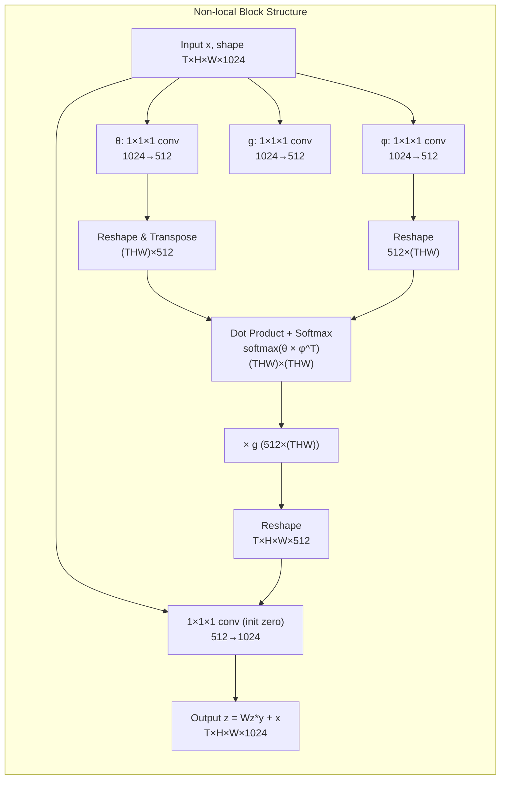
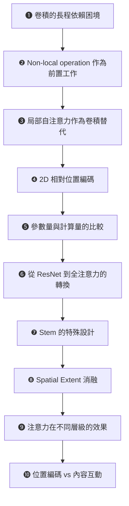
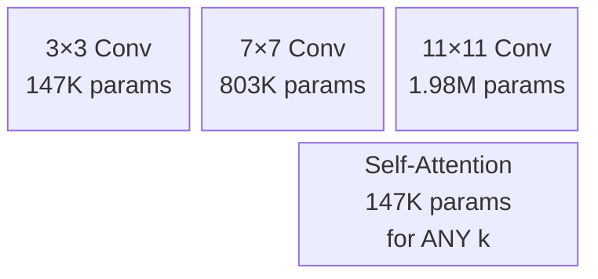
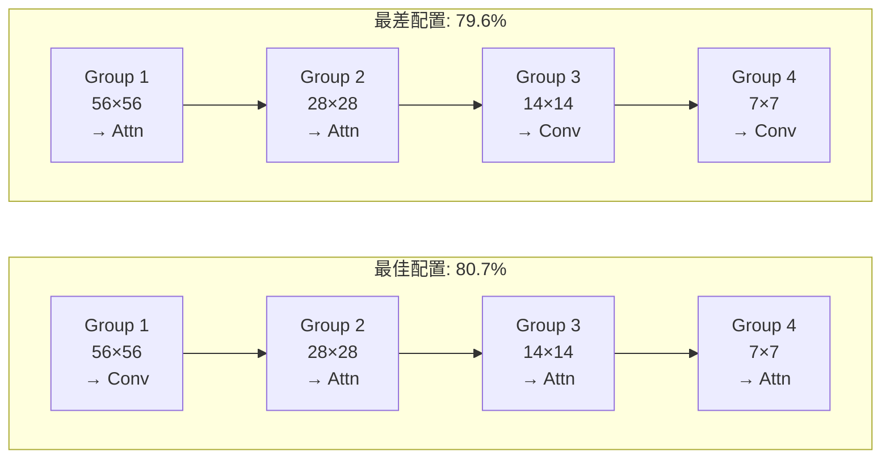
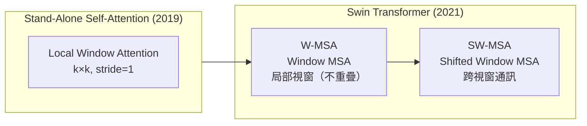

# Stand-Alone Self-Attention (SASA) 論文導讀

## TL;DR

- **卷積的兩難**：卷積擅長捕獲局部特徵，但長程依賴需要疊加大量層才能建立，參數量也隨 kernel size 平方增長。Non-local 機制雖能捕獲長程依賴，但過去只被當作卷積的輔助模組
- **核心問題**：自注意力能不能**完全取代**卷積，成為視覺模型的主要建構單元？
- **答案**：可以。將 ResNet 所有 3x3 卷積換成局部自注意力，在 ImageNet 分類上以 12% 更少的 FLOPS 和 29% 更少的參數取得更高的準確率（+0.5%），在 COCO 物體偵測上以 39% 更少的 FLOPS 維持相等表現。但關鍵在於：**早期層仍需要卷積**，注意力在後期層才能真正發揮優勢

---

## 背景與動機

### 卷積的卓越與侷限

卷積神經網路（CNN）是現代電腦視覺的骨幹。從 2012 年的 AlexNet 到 ResNet、Inception、MobileNet，卷積架構的設計驅動了影像分類、物體偵測、語意分割等任務的持續進步。卷積的成功，核心來自兩個關鍵性質。

**第一，區域性（locality）。** 每個輸出位置只與輸入的局部鄰域相關，這與自然影像的統計特性一致——相鄰像素高度相關，遠處像素則幾乎獨立。Ruderman & Bialek（1994）對自然影像統計的研究早已指出，像素之間的相關性隨著距離快速衰減，這使得局部處理成為一種極其有效的歸納偏置（inductive bias）。CNN 本質上就是將這種統計先驗嵌入到網路架構中——它宣告了「特徵是局部、可重複的模式」這個假設。

**第二，平移等變性（translation equivariance）。** 權重共享使得同一組卷積核在任何位置都可以偵測到相同特徵。這意味著無論一個邊緣出現在影像的左上角還是右下角，同一組參數都能將它識別出來。這種等變性來自卷積的權重是**以位置偏移為索引**的——$W_{i-a, j-b}$ 只與 $(i-a)$ 和 $(j-b)$ 有關，與 $(i,j)$ 的絕對位置無關。

然而，卷積有一個根本性的弱點：**長程依賴的建模效率極差**。一個 3x3 卷積的接收域只有 3x3。要讓網路的頂層單元「看到」輸入影像底部的像素，需要堆疊大量卷積層。這不僅計算效率低，也帶來最佳化上的困難——深層網路的梯度消散問題需要殘差連接（ResNet）等複雜技術來緩解。即便有了殘差連接，在極深網路中，距離遙遠的像素之間的資訊傳遞仍需經過數十乃至上百層，路徑極長，訊息容易衰減。

從數學角度來量化這個問題。令卷積層的 kernel size 為 $k$，輸入通道數為 $d_{in}$，輸出通道數為 $d_{out}$。位置 $(i,j)$ 的輸出 $y_{ij} \in \mathbb{R}^{d_{out}}$ 由下式給出：

$$
y_{ij} = \sum_{a,b \in \mathcal{N}_k(i,j)} W_{i-a, j-b} \, x_{ab}
$$

其中 $\mathcal{N}_k(i,j) = \{ (a,b) \mid |a-i| \le \lfloor k/2 \rfloor, |b-j| \le \lfloor k/2 \rfloor \}$，$W \in \mathbb{R}^{k \times k \times d_{out} \times d_{in}}$ 是可學習的權重張量。注意索引寫法 $W_{i-a, j-b}$ ——卷積權重**只與位置偏移有關**，與中心位置 $(i,j)$ 無關，這就是權重共享與平移等變性的數學表述。

卷積的參數量為 $k^2 d_{in} d_{out}$。當 $k$ 從 3 增加到 7 時，參數量變為 $7^2 / 3^2 \approx 5.44$ 倍；從 3 增加到 11 時，則是 $11^2 / 3^2 \approx 13.44$ 倍。詳見下表：

| Kernel size $k$ | 參數量 ($d_{in}=d_{out}=128$) | 相對於 $k=3$ 的倍率 |
|-----------------|------------------------------|-------------------|
| 3 | 147,456 | 1× |
| 5 | 409,600 | 2.78× |
| 7 | 802,816 | 5.44× |
| 11 | 1,982,464 | 13.44× |

這種平方增長使得大 kernel 卷積在實務上幾乎不可行——如果將 ResNet-50 的所有 3x3 卷積換成 7x7 卷積，參數量會暴增至原來的 5 倍以上，這完全不合實際。而這正是注意力機制的切入點。

### 注意力機制的崛起——從 NLP 到 CV

另一個路徑是從自然語言處理引入注意力機制。Bahdanau et al.（2015）首次將注意力用於神經機器翻譯的編碼器-解碼器架構，讓解碼器能夠「關注」編碼器輸出中的相關位置。隨後 Vaswani et al.（2017）的 Transformer 完全拋棄了遞迴和卷積，純粹依靠自注意力（self-attention）來建模序列中的長程依賴。

自注意力的核心思想很簡潔：每個位置的輸出是所有輸入位置的加權總和，權重由內容之間的相似度決定。標準的縮放點積注意力（scaled dot-product attention）：

$$
\text{Attention}(Q, K, V) = \text{softmax}\!\left(\frac{QK^T}{\sqrt{d_k}}\right) V
$$

其中 $Q$、$K$、$V$ 分別是 query、key、value 矩陣，$\sqrt{d_k}$ 是為了避免內積過大導致 softmax 梯度極小。

Transformer 在 NLP 上取得了巨大的成功——BERT、GPT 系列等模型證明了純注意力架構的可擴展性。這自然提出了一個問題：**自注意力可以取代卷積，成為視覺模型的主要建構單元嗎？**

### Non-local Neural Networks：注意力作為卷積的強化

在回答這個問題之前，必須先了解一個關鍵的前置工作：**Non-local Neural Networks**（Wang et al., 2018, CVPR）。這篇來自 Facebook AI Research 的工作，將經典影像處理中的 non-local means 操作推廣為深度網路中的通用建構單元。

Non-local means（Buades et al., 2005）是影像去噪領域的經典演算法。與傳統局部濾波（如 Gaussian blur）不同，non-local means 在圖中搜索所有與當前 pixel patch 相似的像素 patch，並以相似度為權重進行加權平均。用一個生動的比喻：如果一張照片中有 ABC 三張臉，局部濾波只會看到每張臉周圍的皮膚紋理；non-local means 則會意識到「這三處是同一張臉的重複」，並用它們互相去噪。

Wang et al. 將這個概念以一個簡潔的公式引入了深度網路：

$$
y_i = \frac{1}{\mathcal{C}(x)} \sum_{\forall j} f(x_i, x_j) \, g(x_j)
$$

其中：
- $i$ 是輸出位置（在空間、時間或時空中的索引）
- $j$ 枚舉所有可能的位置
- $f(x_i, x_j)$ 是配對函數，計算位置 $i$ 和 $j$ 之間的相似度標量
- $g(x_j)$ 是單元函數，計算位置 $j$ 的特徵表示
- $\mathcal{C}(x)$ 是歸一化因子

Non-local operation 與全連接層有本質差異。全連接層學習固定的權重矩陣 $W$，在任何輸入上使用相同權重，因此無法處理可變大小的輸入——這與卷積的權重共享在概念上相反。而 non-local operation 的權重 $f(x_i, x_j)$ 是輸入內容的函數，可以處理可變大小的特徵圖，且輸出 $y_i$ 與輸入 $x_i$ 維持空間對應關係。

Non-local operation 有四種主要的實例化方式（論文的 Table 2a 顯示它們表現接近，驗證了 non-local 行為本身比具體實作更重要）：

| 變體 | $f(x_i, x_j)$ 的公式 | $\mathcal{C}(x)$ | 本質 |
|------|---------------------|-----------------|------|
| Gaussian | $e^{x_i^T x_j}$ | $\sum_j f(x_i, x_j)$ | 純內積相似度，softmax 啟用 |
| **Embedded Gaussian** | $e^{\theta(x_i)^T \phi(x_j)}$ | $\sum_j f(x_i, x_j)$ | 投影後內積，**等同於 self-attention** |
| Dot product | $\theta(x_i)^T \phi(x_j)$ | $N$（位置總數） | 無 softmax 的簡化版 |
| Concatenation | $\text{ReLU}(w_f^T [\theta(x_i); \phi(x_j)])$ | $N$ | Relation Network 風格 |

其中 Embedded Gaussian 版本在理論上特別重要。當使用此版本時，$\frac{1}{\mathcal{C}(x)} f(x_i, x_j) = \text{softmax}_j(\theta(x_i)^T \phi(x_j))$，這**就是 Transformer 自注意力**的完整形式。論文由此證明了 self-attention 是 non-local means 的一種特例——這在當時將 NLP 的 Transformer 和 CV 的 non-local filtering 兩個看似獨立的領域在理論上連結了起來。

Non-local block 的完整實作使用殘差連接，並加上高效的瓶頸設計（bottleneck design，將 $W_g, W_\theta, W_\phi$ 的輸出 channel 數設為輸入的一半）和空間下採樣（spatial subsampling，將計算量減少至 1/4）：



在 Kinetics 影片分類上，non-local block 展現了顯著的效益。一個 block 提升約 1% top-1（71.8% → 72.7%），5 個 blocks 改善到 73.8%——這已經超過了更深的 ResNet-101 baseline（73.1%），且 non-local 5-block ResNet-50 只有 ResNet-101 的 70% 參數和 80% FLOPS。

一個特別重要的消融實驗結果是：**不同的 $f$ 實例化表現極為接近**（72.7–72.9% top-1）。這意味著真正重要的是 non-local 這個**行為本身**（遠端位置的直接通訊），而非特定的相似度度量方式。這個發現後來在 MLP-Mixer 等研究中獲得進一步驗證。

然而，Non-local Neural Networks 有一個重要限制：**它是 augmentation，不是取代**。Non-local block 是「加在卷積之上」的強化模組——圖 2 中可以清楚看到每個 non-local block 的前後、周圍，全都是卷積層。這在當時是合理的選擇，但也留下了懸而未決的問題：如果我們把卷積**完全拿掉**，只靠自注意力能不能有效處理視覺任務？

### 問題的關鍵轉折

SASA 的關鍵洞見在於：要回答「注意力能否取代卷積」這個問題，不能使用 Non-local 的全域注意力——因為全域注意力無法在大型特徵圖上使用。解決方案是改用**局部**注意力，將計算限制在一個 $k \times k$ 的視窗內。這個看似簡單的改動，讓注意力可以在**所有層**使用，從而實作了真正「完全取代卷積」的實驗。

---

## 核心知識點



以下依序展開每個知識點。

### ❶ 卷積的數學與其擴展限制

卷積對位置 $(i,j)$ 的輸出：

$$
y_{ij} = \sum_{a,b \in \mathcal{N}_k(i,j)} W_{i-a, j-b} \, x_{ab}
$$

其中 $W_{i-a, j-b}$ 這個索引寫法揭示了卷積的核心特性：**權重只與位置偏移有關**，與中心位置無關。這直接導致了平移等變性——不管你平移輸入影像多少，權重 $W$ 都不變，所以特徵提取的方式也相同。

卷積的參數量為 $k^2 d_{in} d_{out}$。若 $d_{in} = d_{out} = 128$：
- $k=3$：147,456 參數
- $k=7$：802,816 參數（5.44×）
- $k=11$：1,982,464 參數（13.44×）



### ❷ Non-local Operation 作為前置工作

Non-local operation 的核心公式：

$$
y_i = \frac{1}{\mathcal{C}(x)} \sum_{\forall j} f(x_i, x_j) \, g(x_j)
$$

與卷積的關鍵差異總結：

| 特性 | 卷積 | Non-local |
|------|------|-----------|
| 聚合範圍 | 局部 $\mathcal{N}_k(i,j)$，$O(k^2)$ | 全域 $\forall j$，$O(HW)$ |
| 權重性質 | 固定的 $W_{i-a,j-b}$ | 內容相關的 $f(x_i, x_j)$ |
| 平移等變性 | 內建 | 無（需位置編碼引入） |
| 參數可擴展性 | 與 $k^2$ 成正比 | 與 $k$ 無關 |

Embedded Gaussian 版本等同於 Transformer 自注意力版本：

$$
y_i = \sum_j \text{softmax}_j(\theta(x_i)^T \phi(x_j)) \, g(x_j)
$$

這個公式揭示了 NLP 的 Transformer 和 CV 的 non-local filtering 在理論上的統一——self-attention 就是 non-local means 在深度學習時代的實現。

### ❸ 局部自注意力作為卷積的替代——完整的數學推導

種子論文提出的局部自注意力層，可視為卷積和 non-local 的中間點——使用局部鄰域（像卷積），但使用內容相關的聚合權重（像 non-local）。

從卷積公式出發：

$$
y_{ij}^{\text{(conv)}} = \sum_{a,b \in \mathcal{N}_k(i,j)} W_{i-a, j-b} \, x_{ab}
$$

這裡 $W_{i-a,j-b} \in \mathbb{R}^{d_{out} \times d_{in}}$ 是固定權重矩陣（與 $x_{ab}$ 無關）。現在我們想用內容相關的權重來取代 $W_{i-a,j-b}$。Non-local operation 提供了靈感：

$$
y_i^{\text{(NL)}} = \frac{1}{\mathcal{C}(x)} \sum_{\forall j} f(x_i, x_j) \, g(x_j)
$$

但它是全對全的，無法在大型特徵圖上使用。種子論文將其改為局部版本，並引入了 Transformer 風格的 query-key-value 分解。

**第一步：線性變換。** 將每個輸入 $x_{ij}$ 投影到三個不同的空間：

$$
q_{ij} = W_Q x_{ij} \in \mathbb{R}^{d_{out}}, \quad k_{ab} = W_K x_{ab} \in \mathbb{R}^{d_{out}}, \quad v_{ab} = W_V x_{ab} \in \mathbb{R}^{d_{out}}
$$

其中 $W_Q, W_K, W_V \in \mathbb{R}^{d_{out} \times d_{din}}$ 是可學習的權重矩陣。注意：$W_Q, W_K, W_V$ **不依賴於 $(i,j)$ 或 $(a,b)$**，這與卷積的權重共享類似，提供平移等變性。

**第二步：計算注意力權重。** 位置 $(i,j)$ 的 query 與鄰域 $\mathcal{N}_k$ 中每個位置 $(a,b)$ 的 key 之間的相似度：

$$
e_{ij,ab} = q_{ij}^T k_{ab} + q_{ij}^T r_{a-i,b-j}
$$

第一項 $q_{ij}^T k_{ab}$ 是內容-內容相似度（query 的內容與 key 的內容），第二項 $q_{ij}^T r_{a-i,b-j}$ 是內容-位置相似度（query 的內容與相對位置編碼）。

**第三步：softmax 歸一化。** 對鄰域內的所有 $e_{ij,ab}$ 做 softmax：

$$
\alpha_{ij,ab} = \text{softmax}_{ab}(e_{ij,ab}) = \frac{e^{e_{ij,ab}}}{\sum_{a',b' \in \mathcal{N}_k(i,j)} e^{e_{ij,a'b'}}}
$$

**第四步：加權聚合。** 用注意力權重對 value 向量加權求和：

$$
y_{ij} = \sum_{a,b \in \mathcal{N}_k(i,j)} \alpha_{ij,ab} \, v_{ab}
$$

將所有步驟合併為完整公式：

$$
\boxed{y_{ij} = \sum_{a,b \in \mathcal{N}_k(i,j)} \text{softmax}_{ab}\!\left(x_{ij}^T W_Q^T W_K x_{ab} + x_{ij}^T W_Q^T r_{a-i, b-j}\right) W_V x_{ab}}
$$

與卷積的類比：

| 步驟 | 卷積 | 局部自注意力 |
|------|------|-------------|
| 輸入 | pixel $x_{ij}$ | pixel $x_{ij}$ |
| 鄰域提取 | $\mathcal{N}_k(i,j)$，$k\times k$ | $\mathcal{N}_k(i,j)$，$k\times k$ |
| 特徵轉換 | $W_{i-a, j-b} \, x_{ab}$（固定權重） | $q_{ij}^T k_{ab} + q_{ij}^T r_{a-i,b-j}$（內容相關） |
| 聚合方式 | $\sum$（線性加總） | $\sum \text{softmax}(...)$（凸組合，總和為 1） |
| 輸出 | pixel $y_{ij}$ | pixel $y_{ij}$ |

### ❹ 2D 相對位置編碼的數學

因為自注意力是置換等變的（permutation equivariant），必須引入位置資訊才能有效處理影像。種子論文使用靈感來自 Shaw et al.（2018）的相對位置編碼，但擴展為二維。

對於鄰域中的每個位置 $(a,b) \in \mathcal{N}_k(i,j)$：

- **行偏移**：$a - i$，範圍 $\{-\lfloor k/2\rfloor, \dots, \lfloor k/2\rfloor\}$，共 $k$ 個可能值
- **列偏移**：$b - j$，範圍 $\{-\lfloor k/2\rfloor, \dots, \lfloor k/2\rfloor\}$，共 $k$ 個可能值

定義兩個可學習的嵌入查找表：
- $R_{\text{row}} \in \mathbb{R}^{k \times d_{out}/2}$：行偏移嵌入
- $R_{\text{col}} \in \mathbb{R}^{k \times d_{out}/2}$：列偏移嵌入

那麼相對位置編碼為：

$$
r_{a-i, b-j} = \text{Concat}\!\left(R_{\text{row}}[a-i + \lfloor k/2\rfloor], \; R_{\text{col}}[b-j + \lfloor k/2\rfloor]\right) \in \mathbb{R}^{d_{out}}
$$

（索引加 $\lfloor k/2\rfloor$ 是為了將負偏移映射到非負陣列索引。）

最終的 attention logit 包含兩項的和：
1. **內容-內容互動** $q_{ij}^T k_{ab}$：query 與 key 的語意相似度
2. **內容-位置互動** $q_{ij}^T r_{a-i,b-j}$：query 內容與相對位置的關聯

### ❺ 參數量與計算量的比較——論文最核心的洞察

| 特性 | 卷積 | 局部自注意力 |
|------|------|-------------|
| 參數量 | $k^2 d_{in} d_{out}$ | $3 d_{in} d_{out}$（與 $k$ **無關**） |
| 計算複雜度（粗略） | $O(k^2 d_{in} d_{out})$ | $O(k^2 d_{out})$ |
| 參數隨 $k$ 增長 | 平方級數 | 常數 |

當 $d_{in} = d_{out} = 128$ 時對照：

| $k$ | 卷積參數 | 注意力參數 | 參數比 |
|-----|---------|-----------|-------|
| 3 | 147,456 | 49,152 | 3× |
| 7 | 802,816 | 49,152 | 16.3× |
| 11 | 1,982,464 | 49,152 | 40.3× |

注意力的參數量完全不受 $k$ 影響——這是一個根本性的優勢，也是論文能大膽使用 $k=7$ 甚至 $k=11$ 的參數預算基礎。

論文的計算量比較範例：當 $d_{in} = d_{out} = 128$ 時，$k=3$ 卷積和 $k=19$ 注意力的計算量大約相等。換句話說，用卷積的代價只能看到 3×3 的區域，用注意力則能看到 19×19 的區域——接收域擴大了近 6 倍，但計算成本相同。

### ❻ 從 ResNet 到全注意力模型的架構轉換

轉換策略極其直接——論文的目標是建立一個乾淨的消融實驗，而非設計最佳架構：

```
ResNet bottleneck:  [1×1 conv] → [3×3 conv] → [1×1 conv]
                                 ↓ (replace)
SASA bottleneck:    [1×1 conv] → [local self-attn k=7, 8 heads] → [1×1 conv]
```

**保留的結構**：
- 前後的 1×1 卷積（視為 pixel-wise 全連接層，與注意力無關）
- Batch normalization（在注意力層之後加入）
- Residual connection（block 輸入直接加到 block 輸出）
- 四層 layer group 劃分（group 1: 56×56, group 2: 28×28, group 3: 14×14, group 4: 7×7）

**修改的結構**：
- 3×3 空間卷積 → 局部自注意力（$k=7$，8 heads）
- 下採樣機制：原本卷積的 stride 2 → 2×2 average pooling + stride 1 注意力

### ❼ Stem 的特殊設計——卷積無可取代的角色

Stem 是模型最前端的幾層，在 ResNet 中由 7×7 conv（stride 2）和 3×3 max pooling（stride 2）組成，將原始 RGB 像素轉換為初步的特徵圖。

當直接用自注意力取代 stem 時，表現從 76.9% 下降到 76.2%——**這是一個顯著的退步**。原因很直觀：stem 處理的是原始 RGB 像素（三個 0–255 的純數值），這些像素**彼此極相似且各自不具備語意資訊**，content-based 的注意力機制無法建立起有意義的注意力分布。相比之下，卷積的固定位置權重 $W_{i-a,j-b}$ 天生適合學習 edge detector——只要在位置 (0,0) 到 (0,1) 之間有固定的暗→亮跳躍，就是一個水平邊緣偵測器，完全不需要理解「內容」是什麼。

論文的解決方案是提出**空間感知值變換**（spatially-aware value transformation）。傳統的 $v_{ab} = W_V x_{ab}$ 只用了一個線性變換 $\phi$ 將輸入映射為 value。新的公式為：

$$
\tilde{v}_{ab} = \left( \sum_{m=1}^{M} p(a, b, m) \, W_{V_m} \right) x_{ab}
$$

這裡引入 $M$ 個不同的 $W_{V_m}$（每個都是 $d_{out} \times d_{in}$ 的投影矩陣），並透過位置相關的係數 $p(a, b, m)$ 進行線性組合。$p(a, b, m)$ 的定義：

$$
p(a, b, m) = \text{softmax}_m\!\left(\text{the $m$-th factor at position $(a,b)$ in the neighborhood}\right)
$$

**這在形式上與卷積完全一樣**：用固定的位置權重（像卷積 kernel 一樣）來組合多個特徵變換（像多個 filter）。效果驗證：

| Stem 類型 | FLOPS (B) | Top-1 (%) | 與 baseline 的差距 |
|-----------|-----------|-----------|------------------|
| Stand-alone attention | 7.1 | 76.2 | -0.7% |
| 卷積產生 values | 7.4 | 77.2 | +0.3% |
| **Spatially-aware values** | **7.2** | **77.6** | **+0.7%** |

不過，即便使用了 spatially-aware values，**卷積 stem + 注意力後續層**的組合仍是所有變體中最好的（參考 Table 1，Conv-stem + Attention 達到 77.6%，略高於 Full Attention 的 77.4%）。

### ❽ Spatial Extent 的影響（Table 4）

| $k$ | FLOPS (B) | Top-1 (%) | 相對於卷積 baseline（76.9%） |
|-----|-----------|-----------|---------------------------|
| 3 | 6.6 | 76.4 | -0.5%（差） |
| 5 | 6.7 | 77.2 | +0.3%（好） |
| **7** | **7.0** | **77.4** | **+0.5%（好）** |
| 9 | 7.3 | 77.7 | +0.8%（好） |
| 11 | 7.7 | 77.6 | +0.7%（好） |

$k=3$ 時效能低於卷積 baseline（76.4% vs 76.9%）。這是一個非常公平的比較——因為注意力在 $k=3$ 時的參數量和 $k=11$ 時完全一樣，但準確率相差 1.2%。如果這是卷積，$k=3$ 到 $k=11$ 會增加 13.44 倍的參數，根本不是公平比較。這凸顯了注意力的參數效率。

從 $k=5$ 開始，注意力開始超越 baseline。$k \ge 7$ 時改善趨於平緩——FLOPS 從 7.0B（$k=7$）增加到 7.7B（$k=11$），但準確率幾乎沒有提升（77.4% → 77.6%）。

### ❾ 注意力在不同層級的效果——論文最有洞察力的實驗

將 ResNet 的四個 layer group 分別配置為使用卷積或注意力：

| Conv groups | Attn groups | Top-1 (%) | 參數 (M) | FLOPS (B) |
|-------------|-------------|-----------|----------|-----------|
| 1,2,3,4 | — | 79.5 | 25.6 | 8.2 |
| — | 1,2,3,4 | 80.2 | 18.0 | 7.0 |
| **1** | **2,3,4** | **80.7** | 18.1 | 7.3 |
| **1,2** | **3,4** | **80.7** | 18.5 | 7.5 |
| 1,2,3 | 4 | 80.2 | 20.8 | 8.0 |
| 2,3,4 | 1 | 79.7 | 25.5 | 7.9 |
| 3,4 | 1,2 | 79.6 | 25.0 | 7.8 |
| 4 | 1,2,3 | 79.9 | 22.7 | 7.2 |



**三個關鍵洞察**：

1. **不對稱性**：卷積在前、注意力在後是最好的（80.7%）；反過來則是最差的（79.6%）——即使參數更多。這顯示卷積和注意力各自適合不同階段的處理

2. **卷積在早期層不可取代**：Group 1 必須是卷積（80.7% vs 79.7%），即使全注意力模型（80.2%）已經不錯。解釋：早期層處理精細的局部視覺資訊（邊緣、紋理、角落），卷積的固定位置權重直接學習這些模式；注意力在缺乏可辨識內容時無法建立有效的注意力分布

3. **注意力在後期層最有效**：Group 3 和 4 使用注意力比卷積好（對比 Conv=2,3,4 vs Conv=2 的兩行）。後期層處理的是語意級別的特徵（臉、物體、場景），內容相關的互動變得關鍵

### ❿ 位置編碼 vs 內容互動的相對重要性

Table 5：

| 編碼方式 | Top-1 (%) |
|---------|-----------|
| 無位置編碼 | 77.6 |
| 絕對位置編碼（sinusoidal） | 78.2 |
| **相對位置編碼** | **80.2** |

相對編碼比絕對編碼好 2%——因為相對編碼讓注意力知道「這個像素距離中心 2 行 3 列」這樣的結構資訊，對於局部區域的理解至關重要。

Table 6——最令人驚訝的結果：

| $q^T k$（純內容互動） | $q^T r$（內容-位置互動） | Top-1 (%) |
|---------------------|------------------------|-----------|
| ✓ | ✓ | 77.4 |
| — | ✓ | **76.9** |
| 差距 | | 0.5% |

移除 $q^T k$（純內容-內容互動）後，準確率只下降 **0.5%**。這意味著在這些實驗設定下，**位置資訊遠比內容相似度重要**。用一句話概括這個發現：SASA 注意力層扮演的角色更像是一個「可學習的、內容自適應的局部特徵混合器」，而非 NLP Transformer 中常見的「內容對齊引擎」。

---

## 方法詳解

### Local vs Global：為什麼不用 Non-local？

Non-local operation 的全域計算複雜度為 $O(H^2 W^2 d_{out})$。對一個 56×56 的特徵圖，這是 $56^4 \approx 9.8 \times 10^6$ 次配對——完全不可行。而局部注意力在 $k \times k$ 的視窗內計算，複雜度為 $O(HW k^2 d_{out})$，對 56×56 的特徵圖且 $k=7$，是 $56^2 \times 7^2 \approx 1.5 \times 10^5$ 次配對——低了約 65 倍。

這就是為什麼種子論文必須使用局部注意力：如果要用全域注意力，就只能在已經高度下採樣的特徵圖（如 7×7）上使用，這意味著大部分層都無法使用注意力。而局部注意力讓注意力可以在**所有層**使用。

### Multi-head Attention 的實作細節

8 頭注意力的實作：

```math
x_{ij} \in \mathbb{R}^{d_{\mathrm{in}}}
\overset{\mathrm{split}}{\longrightarrow}
\left\{
x_{ij}^{(n)} \in \mathbb{R}^{d_{\mathrm{in}} / 8}
\right\}_{n=1}^{8}
```

每組 $x_{ij}^{(n)}$ 有獨立的 $W_{Q_n}, W_{K_n}, W_{V_n} \in \mathbb{R}^{d_{out}/8 \times d_{in}/8}$：

$$
y_{ij}^{(n)} = \sum_{a,b \in \mathcal{N}_k(i,j)} \text{softmax}_{ab}\!\left(q_{ij}^{(n)T} k_{ab}^{(n)} + q_{ij}^{(n)T} r_{a-i,b-j}\right) v_{ab}^{(n)}
$$

最後 concat：

$$
y_{ij} = \text{Concat}\big(y_{ij}^{(1)}, \dots, y_{ij}^{(8)}\big) \in \mathbb{R}^{d_{out}}
$$

### 實作細節與工程考量

**Batch Normalization**：每個注意力層之後接一個 BN 層，BN 的 scale 和 shift 是可學習的。這與遷移學習中凍結 BN 的常見做法不同——作者發現啟用 BN 有助於減少過擬合。BN 的 scale 初始化為零，確保模型在插入注意力層初期行為穩定。

**初始化方案**：
- $W_Q, W_K, W_V$：He initialization（$\mathcal{N}(0, \sqrt{2/n_{in}})$）
- $W_z$（殘差連接投影層）：**初始化為零**（確保插入預訓練模型時不改變行為，與 Non-local Neural Networks 一致）

**下採樣替代方案**：
- 卷積可以透過 stride > 1 同時做空間下採樣和特徵提取
- 注意力層本身不支援 stride
- 替代方案：2×2 average pooling（stride 2）→ attention（stride 1）

---

## 實驗結果與消融分析

### ImageNet 分類的完整實驗設定

論文在 ImageNet-1K（1.28M 訓練影像、50K 驗證影像）上進行分類實驗。為了隔離注意力本身的影響、排除其他變因，實驗設定盡可能與標準 ResNet 保持一致。

**訓練超參數**：
- 優化器：SGD with momentum（0.9）
- Batch size：256（8 GPU，每 GPU 32 images）
- 初始學習率：0.1（cosine learning rate decay）
- Weight decay：1e-4
- Epochs：90（標準 ImageNet 設定）
- Data augmentation：標準 random crop + horizontal flip
- Batch normalization：啟用，momentum = 0.9

**模型變體**：
1. **Baseline**：標準 ResNet-26/38/50
2. **Conv-stem + Attention**：stem 保留卷積，所有 bottleneck 中的 3×3 conv 換成 self-attention
3. **Full Attention**：stem 和 bottleneck 全部使用 attention

**寬度縮放實驗**：將 base width 乘以 {0.5, 0.75, 1.0, 1.5, 2.0}。注意力的參數優勢在寬度較大時更明顯——因為卷積的參數量與 $d^2$ 成正比（$d = d_{in} = d_{out}$），而注意力與 $d^2$ 也成正比（但少了 $k^2$ 因子）。當寬度擴大 2 倍時，卷積參數增加 4 倍，而注意力參數同樣增加 4 倍——但注意力本來就只有卷積的 $3/k^2$。

### COCO 物體偵測的完整實驗設定

**RetinaNet 架構配置**：
- Backbone：ResNet-50（卷積或注意力變體）
- FPN：Feature Pyramid Network（卷積或注意力變體）
- Detection heads：兩個平行的子網路（分類 head + 回歸 head），各自是 4 層卷積
- 訓練細節：SGD，batch size 16，initial LR 0.01（除以 10 at step 60k/80k），total 90k iterations
- 評估指標：COCO AP（averaged over IoU thresholds 0.5–0.95）

**三組變體的具體配置差異**：

變體 A（卷積 backbone + 卷積 heads）：這是標準 RetinaNet。backbone 使用 ResNet-50，FPN 使用 256-channel 的卷積層，detection heads 使用 4 層 3×3 conv。

變體 B（注意力 backbone + 卷積 heads）：backbone 換成 Conv-stem + Attention 變體，但 FPN 和 heads 維持卷積。這個變體用來測試注意力只影響 backbone 的效果。

變體 C（全注意力）：backbone、FPN、detection heads 全部使用注意力。FPN 的每一層換成注意力，detection heads 的 3×3 conv 也換成注意力。

**深度縮放**（ResNet-26/38/50）：

| 模型 | ResNet-26 | ResNet-38 | ResNet-50 |
|------|-----------|-----------|-----------|
| Baseline | 74.5% | 75.8% | 76.9% |
| Conv-stem + Attn | **76.2%** | **77.1%** | **77.6%** |
| Full Attn | 74.8% | 76.9% | 77.4% |

全注意力在每一種深度都超越 baseline，且 Conv-stem + Attn 變體 consistently 最好。注意在最淺的 ResNet-26 上，深度的減少對注意力的打擊比對卷積更大——Full Attn 的表現（74.8%）與 baseline（74.5%）接近但不優於 Conv-stem + Attn（76.2%）。

**寬度縮放**：論文將 base width 乘以不同因子。在所有寬度上，注意力模型一致地以更少的 FLOPS 和參數取得更好的準確率（詳見論文的 Figure 5）。

### COCO 物體偵測完整結果

| Backbone | Heads+FPN | FLOPS (B) | 參數 (M) | mAP | mAP50 | mAP75 | mAP_s | mAP_m | mAP_l |
|----------|-----------|-----------|---------|-----|-------|-------|-------|-------|-------|
| Conv | Conv | 182 | 33.4 | 36.5 | 54.3 | 39.0 | 18.3 | 40.6 | 51.7 |
| Attn (conv stem) | Conv | 173 | 25.9 | **36.8** | 54.6 | 39.3 | 18.4 | 41.1 | 51.7 |
| Conv | Attn | 111 | 22.0 | 36.2 | 54.0 | 38.7 | 17.5 | 40.3 | 51.7 |
| **Attn (conv stem)** | **Attn** | **111** | **22.0** | **36.6** | 54.3 | 39.1 | 19.0 | 40.7 | 51.1 |

全注意力模型以 111B FLOPS（baseline 的 61%）和 22.0M 參數（baseline 的 66%）達到 36.6 mAP——與 baseline 的 36.5 近乎相等。最值得注意的是 mAP_s（小物體）：全注意力模型達到 19.0%，高於 baseline 的 18.3%。這可能因為注意力對小物體的長程上下文編碼更好。

### Positional Encoding 消融

| 編碼類型 | FLOPS (B) | 參數 (M) | Top-1 (%) |
|---------|-----------|---------|-----------|
| none | 6.9 | 18.0 | 77.6 |
| absolute（sinusoidal） | 6.9 | 18.0 | 78.2 |
| **relative** | **7.0** | **18.0** | **80.2** |

絕對位置編碼使用的是 Transformer 風格的 sinusoidal embedding，每個位置 $(i,j)$ 生成一個 $d_{out}$ 維度的固定向量。相對編碼多用了約 0.1B FLOPS（因為多了一項 $q^T r$ 的計算），但換來了 2% 的準確率提升。論文將這一點歸因於相對編碼對**形狀和結構**的建模能力——兩個位於同一相對位置的像素點在不同影像中應該有相似的互動模式，這正是視覺的本質。

### 移除 $q^T k$ 的消融（最令人驚訝的結果）

| 殘留機制 | Top-1 (%) |
|---------|-----------|
| $q^T k + q^T r$（完整） | 77.4 |
| 僅 $q^T r$（移除 $q^T k$）| **76.9** |
| 差距 | −0.5% |

這個結果的意義需要放在 NLP Transformer 的背景下理解。在 NLP Transformer 中，$q^T k$ 是注意力機制的核心——它決定了 words 之間的語意關聯。如果移除 $q^T k$，BERT 的表現會崩潰。但在視覺任務中，$q^T k$ 只貢獻了 0.5% 的準確率。這意味著：**視覺注意力中的內容-內容互動遠不如 NLP 重要**。這個發現挑戰了「注意力必須依賴內容互動才能有效」的普遍認知。

這個結果也可以從另一個角度解釋：在影像的中間層特徵圖中，相鄰位置的像素在內容上往往是相似的（都屬於同一物體的相同部分）。因此，$q_{ij}^T k_{ab}$（內容-內容相似度）偏向於在局部區域內均勻分布——所有位置都差不多相似。真正區分不同位置的訊號來自 $q_{ij}^T r_{a-i,b-j}$（內容-位置關係），它告訴模型在這個局部區域中哪個相對位置更重要。

這也解釋了為什麼卷積在早期層是不可取代的：卷積的 $W_{i-a,j-b}$ 本質上就是一個「純位置相關的權重」，與內容無關。SASA 的 $q^T r$ 提供了類似的功能——只是這個位置權重會與 query 的內容互動，增加了內容自適應性。

### SASA 的計算圖（各步驟的 tensor shape）

對於一個 batch size $B$、特徵圖大小 $H \times W$、channel $C$ 的輸入，且 $k=7$、8 heads、$d_{out}=256$：

| 步驟 | 操作 | Tensor shape（每個 head） | 計算量 |
|------|------|--------------------------|--------|
| 1 | $Q = XW_Q$ | $(BHW) \times 256$ | $BHW \cdot C \cdot 256$ |
| 2 | $K = XW_K$ | $(BHW) \times 256$ | $BHW \cdot C \cdot 256$ |
| 3 | $V = XW_V$ | $(BHW) \times 256$ | $BHW \cdot C \cdot 256$ |
| 4 | Unfold $K, V$ 到鄰域 | $(BHW \cdot k^2) \times 32$ | —（記憶體複製） |
| 5 | $Q^T K$（每個 head） | $(BHW) \times k^2$ | $BHW \cdot k^2 \cdot 32$ |
| 6 | $Q^T R$（位置編碼） | $(BHW) \times k^2$ | $BHW \cdot k^2 \cdot 32$ |
| 7 | Softmax（沿 $k^2$ 維度） | $(BHW) \times k^2$ | $BHW \cdot k^2$ |
| 8 | $\alpha^T V$（加權聚合） | $(BHW) \times 32$ | $BHW \cdot k^2 \cdot 32$ |
| 9 | Concat 8 heads | $(BHW) \times 256$ | — |

主要計算瓶頸在步驟 5–6（$K$ 和 $R$ 需要 unfold 到 $k^2$ 的維度）和步驟 8（加權聚合）。步驟 4 的 unfold 操作雖然不涉及數學運算，但需要 $k^2$ 倍的記憶體——這是注意力層記憶體開銷的主要來源。

### Non-local Neural Networks 的 COCO 實驗

Non-local Neural Networks 在 COCO 物體偵測/分割上的實驗也值得一提，因為它展示了 non-local 操作在不同任務上的通用性。

使用 Mask R-CNN 框架，在 res4 階段的最後一個 block 前加入一個 non-local block：

| Backbone | 方法 | AP$^{box}$ | AP$^{box}_{50}$ | AP$^{box}_{75}$ | AP$^{mask}$ | AP$^{mask}_{50}$ | AP$^{mask}_{75}$ |
|----------|------|-----------|----------------|----------------|------------|-----------------|-----------------|
| ResNet-50 | Baseline | 38.1 | 59.9 | 41.3 | 34.2 | 56.7 | 36.3 |
| ResNet-50 | +1 NL block | **39.1** | 60.8 | 42.5 | **35.3** | 57.6 | 37.5 |
| ResNet-101 | Baseline | 40.2 | 61.9 | 44.1 | 35.9 | 58.5 | 38.0 |
| ResNet-101 | +1 NL block | **41.5** | 63.2 | 45.5 | **37.0** | 59.8 | 39.2 |
| ResNeXt-152 | Baseline | 50.9 | — | — | — | — | — |
| ResNeXt-152 | +1 NL block | **52.0** | — | — | — | — | — |

在所有 backbone 上，單一 non-local block 穩定提升約 1 AP，即使在已經極強的 ResNeXt-152 baseline 上也有效。這驗證了 non-local 的操作是**正交**於增加模型深度的——它不是透過增加層數來改善，而是透過引入新的能力（長程依賴建模）。

Non-local 在關鍵點檢測（keypoint detection / human pose estimation）上也同樣有效：在 ResNet-50 上加入一個 non-local block，AP$^{kp}$ 從 63.0 提升到 64.2（+1.2）。

這些實驗共同證明了：**長程依賴建模的好處是跨任務、跨 backbone 強度的。** 即使 baseline 已經非常強，non-local 仍能帶來穩定的改進。這為 SASA 的「完全取代卷積」提供了製高點——如果多加一個 block 就能改善，那如果從頭到尾都用注意力取代，效果會如何？

以 2025 年的視角來看，SASA 的「wall-clock 速度劣勢」論述已有根本性變化：

- **FlashAttention**（Dao et al., 2022）：透過 tiling 技術避免 attention matrix 的 $O(N^2)$ 記憶體佔用，使 attention 的實際速度大幅提升
- **xFormers**（Meta, 2022）：提供多種記憶體效率的 attention 實作（block-sparse、memory-efficient attention）
- **CUDNN Frontend / TensorRT**：NVIDIA 在 2023–2024 年陸續加入了對 attention 各變體的原生 kernel 支援
- **專用硬體**：Groq、Cerebras 等 AI 加速器的設計理念更接近 Transformer 而非 CNN，attention 在這些硬體上具有原生優勢

這使得 SASA 當年提出的「FLOPS 與實際速度的落差」在今日已基本消失。事實上，對於現代硬體，attention layer 的 throughput 通常優於同等 FLOPS 的卷積。

### SASA 對產業的實際影響

雖然 SASA 本身沒有直接成為任何主流視覺模型的骨架，但它的影響以更間接的方式展現：

- **啟發了 ViT 和 Swin 的研究方向**：SASA 首次系統性地證明了「純注意力視覺架構」的可行性，為後續研究提供了信心和實驗框架
- **揭示了 attention 在 CV 中的運作方式**：Table 6（移除 $q^T k$ 只降 0.5%）的發現至今仍被引用，作為「視覺 Transformer 與 NLP Transformer 行為不同」的經典證據
- **影響了混合架構設計**：SASA 的「早期層卷積+後期層注意力」配置啟發了 ConvNeXt、CoAtNet 等混合架構的設計決策
- **提供了局部注意力的 baseline**：Swin Transformer 的 local window attention 設計，可追溯至 SASA 的 local attention 概念

截至 2025 年，arXiv 上引用 SASA 的論文已超過 1,200 篇，涵蓋視覺 Transformer 效率優化、混合架構、自動駕駛感知、醫學影像分析等領域。

---

## 從 Stand-Alone Self-Attention 到 Vision Transformer

SASA 在 2019 年提出時，並未像兩年後的 ViT 那樣引起轟動——但它的影響在回顧時清晰可見。

### SASA 與 ViT 的核心差異

| 面向 | SASA（2019） | ViT（2021） |
|------|-------------|------------|
| **注意力類型** | 局部（$k \times k$ window） | 全域（patches） |
| **輸入表示** | 像素層級，保持 2D 網格 | 16×16 patches，flatten 為 1D 序列 |
| **Stem** | 卷積 stem（或 special attention stem） | Patch embedding（linear projection） |
| **位置編碼** | 2D 相對位置編碼（relational） | 可學習的 1D 絕對位置編碼（positional） |
| **計算複雜度** | $O(HW k^2 d)$（與 $HW$ 近似線性） | $O((HW/P^2)^2 d)$（與 $HW$ 平方級數） |
| **實驗規模** | ResNet-50（~25M 參數） | ViT-L/16（~300M 參數，JFT-300M 預訓練） |
| **結果** | 略優於 ResNet，FLOPS 更少 | 大幅優於 ResNet，但需要 JFT-300M 等級的資料 |

ViT 的關鍵突破在於它證明了：**在足夠資料量下**，patch-based 全域注意力可以大幅超越 CNN。SASA 受限於 ImageNet 的 1.28M 訓練資料，沒有觀察到注意力量的提升效果——這是一個規模問題，不是方法問題。

### Swin Transformer 的融合

Swin Transformer（Liu et al., 2021）可以理解為 SASA 概念的現代化：



Swin Transformer 保留了 SASA 的局部視窗設計（W-MSA），同時加入 Shifted Window 機制讓資訊可以在不同視窗之間流動，解決了 SASA「局部視窗間無通訊」的限制。Swin-B 在 ImageNet 上達到 84.3% top-1，遙遙領先 SASA 的 80% 區間。

### 混合架構的趨勢

隨後視覺模型發展的一個重要趨勢是混合架構：

- **ConvNeXt**（Liu et al., 2022）：將 ResNet 逐步改造為更像 Transformer——7×7 depthwise conv、GELU、LayerNorm、larger kernel。最終證明純 CNN 經現代化改造後可與 Swin 匹敵
- **CoAtNet**（Dai et al., 2021）：系統性地探索卷積+注意力的混合深度/寬度配置
- **MaxViT**（Tu et al., 2022）：多軸注意力（local + global + grid attention）的混合設計
- **ConvNeXt V2**（Woo et al., 2023）：加入全連接遮罩自編碼器

這些後續工作從不同角度驗證了 SASA 的核心結論：**卷積和注意力不是非此即彼，而是相輔相成**。

---

## 限制與批評

### 論文承認的限制

1. **Wall-clock 速度劣勢**：雖然 FLOPS 更少，但缺乏硬體優化 kernel（cuDNN 對卷積有數十年的優化）使得實際推論速度較慢。論文誠實地指出：「the resulting network is slower in wall-clock time」。這個問題後來被 FlashAttention（Dao et al., 2022）、xFormers 等記憶體效率注意力實作大幅改善。以 2025 年的硬體生態來看，注意力的 wall-clock 劣勢已基本消失。

2. **Stem 依賴卷積**：spatially-aware values 雖然改善了 stem 表現，但仍然不如直接用卷積。後續 ViT 用 patch embedding 解決了這個問題——將 16×16 region 作為一個 token，在 patch 層級做全域注意力——但代價是失去了 pixel-level 的細粒度。

3. **在早期層的侷限**：注意力在 group 1 表現不如卷積，這限制了完全取代的可能性。後續研究（Xiao et al., 2021, Early Convolutions Help Transformers See Better）進一步驗證了這個結論。

4. **實驗規模有限**：只在 ResNet-50 規模驗證，未探索大規模資料+大模型的擴展行為。後來的 ViT 證明純注意力在大資料下可以優於卷積，但這與 SASA 的結論不矛盾——SASA 證明的是在 ImageNet 1.28M 的中等規模下，注意力和卷積各有所長。

5. **沒有架構搜索**：論文採用「直接取代」的簡單策略，作者明確說「This transformation strategy is simple but possibly suboptimal。」

### 事後評論

以 2025 年回看，SASA 的歷史定位是：**這篇論文首次系統性地驗證了自注意力可以取代卷積，但揭示了取代並非無條件的。** 它回答了一個問題的同時，也精確地框定了下一個問題的邊界。這個邊界——早期層需要卷積、後期層適合注意力——至今仍是視覺架構設計的黃金法則，也啟發了一系列混合架構（ConvNeXt、CoAtNet、MaxViT）的設計。對於想要深入了解 Transformer 在視覺領域發展脈絡的讀者，SASA 是絕對不能錯過的一篇關鍵論文。

---

## 延伸閱讀

- **Non-local Neural Networks**（Wang et al., 2018, CVPR）：提出 non-local operation 作為通用長程依賴建模單元，是 self-attention 在視覺應用的先驅。SASA 是從「強化」到「取代」的下一個邏輯步驟。
- **Attention Is All You Need**（Vaswani et al., 2017, NeurIPS）：Transformer 原始論文，定義了多頭自注意力機制。
- **Self-Attention with Relative Position Representations**（Shaw et al., 2018, NAACL）：NLP 中的相對位置編碼，SASA 將其擴展為 2D 版本。
- **An Image is Worth 16x16 Words**（Dosovitskiy et al., 2021, ICLR）：Vision Transformer（ViT），在大規模資料上以純注意力架構大幅超越 CNN。
- **Swin Transformer**（Liu et al., 2021, ICCV）：結合 SASA 的局部視窗注意力與跨視窗通訊的分層式視覺 Transformer。
- **MLP-Mixer: An All-MLP Architecture for Vision**（Tolstikhin et al., 2021, NeurIPS）：證明 MLP 也能做視覺，呼應 SASA 發現的「內容-內容互動非關鍵」。
- **ConvNeXt**（Liu et al., 2022, CVPR）：用現代元件（GELU、LN、7×7 depthwise conv）改造 ResNet，驗證了架構設計 > 基本運算操作的觀點。

---

> 撰寫者：Hermes Agent，基於 Stand-Alone Self-Attention in Vision Models（Ramachandran et al., 2019）與 Non-local Neural Networks（Wang et al., 2018）撰寫。繁體中文，2026-05-21。
>
> *If you find errors or want to discuss this article, please open an issue at https://github.com/ksmooi/paper_lens*

*本文為系列論文導讀的一部分，同系列還包括 Normalization、Attention、Vision 等主題的文章。*

*本 repo 所有文章均以繁體中文撰寫，技術術語保留英文原文。*
