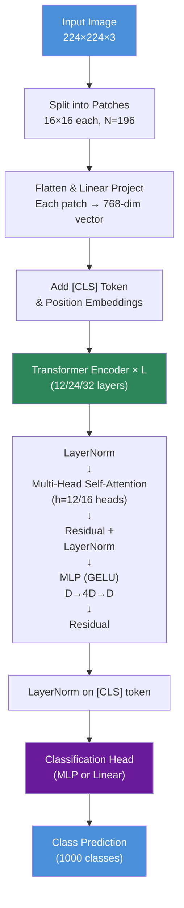
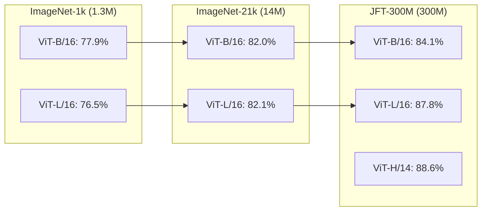

# ViT (Vision Transformer): 當 Transformer 遇見影像

> **種子論文**: [An Image is Worth 16x16 Words: Transformers for Image Recognition at Scale](https://arxiv.org/abs/2010.11929) (2020-10)
> **作者**: Alexey Dosovitskiy, Lucas Beyer, Alexander Kolesnikov et al.
> **機構**: Google Research, Brain Team

---

## TL;DR

ViT 想回答一個看似簡單的問題：把 NLP 的 Transformer encoder 直接搬到影像分類上，不做任何卷積或影像專屬的架構修改，會發生什麼事？答案是：**在大規模數據下，Transformer 可以完全取代 CNN**，而且更省計算資源。ViT 把影像切成 16×16 的不重疊 patch，攤平後當作 NLP 的 token 序列餵進標準 Transformer encoder，在 JFT-300M 這類大型數據集上預訓練後，在 ImageNet 等分類 benchmark 上超越當時的 SOTA 卷積網路。

---

## 背景與動機

### 卷積網路的統治與其限制

2012 年 AlexNet 橫空出世以來，卷積神經網路 (CNN) 一直是電腦視覺的霸主。從 VGG、Inception 到 ResNet，CNN 的核心設計哲學——**局部連接 (locality) + 權重共享 (weight sharing) + 平移等變性 (translation equivariance)**——被認為是處理影像的「天然」方式。這些歸納偏置 (inductive biases) 讓 CNN 在中等規模的資料集上就能表現良好：一張 224×224 的影像有 50,176 個像素，但 CNN 只需要在每層的 3×3 局部區域內做卷積，參數效率遠高於全連接網路。

但從另一個角度看，CNN 的設計假設也帶來了幾個根本性的限制：

**感受野的限制**：雖然理論上堆疊多層 3×3 卷積後，高層神經元的感受野可以覆蓋整張影像，但實際研究中發現 CNN 的**有效感受野**遠小於理論值。Luo et al. (2016) 的實證分析表明，CNN 的有效感受野隨層數的平方根增長，而非線性——這意味著需要極深的網路才能讓頂層看到全圖的上下文。對於需要全局理解的任務（如判斷影像中是否有一個特定物體），這個限制尤為致命。

**固定的處理粒度**：卷積核在影像的所有位置使用相同的權重和相同的空間範圍。這在處理不同尺度的物體時效率很低——大物體的細部紋理和小物體的整體形狀需要不同的分析粒度，但 CNN 無法動態調整。雖然多尺度 CNN（如 FPN、多分支 Inception）試圖緩解這個問題，但它們都是手動設計的，而非端到端學習的。

**難以擴展的架構設計**：更大的 CNN 需要設計更寬的瓶頸層、更多的 stage，以及調整每個 stage 的 channel 數和 kernel 大小。這些超參數的選擇缺乏統一的指導原則，很大程度上依賴經驗和反覆試驗。

**硬體利用率的瓶頸**：CNN 的計算模式（im2col + GEMM）在 GPU 上的利用效率不如 Transformer 的純矩陣乘法。im2col 將卷積映射為矩陣乘法時，會產生大量的記憶體開銷（將輸入影像重複排列成龐大的矩陣），而 Transformer 的計算模式直接就是大型矩陣乘法，與 GPU/TPU 的設計哲學完美契合。

### Transformer 在 NLP 的崛起

與此同時，自然語言處理領域在 2017 年 Transformer (Vaswani et al., 2017) 出現後發生了翻天覆地的變化。Transformer 完全拋棄循環與卷積，只依賴自注意力 (self-attention) 機制來建模序列中任意兩個位置之間的關係。其關鍵優勢在於：

1. **全局依賴**：self-attention 中每個 position 都可以直接 attend 到所有其他 position，資訊傳遞路徑長度為 O(1)，不存在長距離衰減問題。
2. **高度並行化**：不同於 RNN 的序列計算，self-attention 的計算可以在一次矩陣乘法中完成，充分利用 GPU 的平行計算能力。
3. **規模化能力**：BERT (Devlin et al., 2019)、GPT-3 (Brown et al., 2020) 等大型 Transformer 模型證明，只要數據夠多、模型夠大，Transformer 的表現幾乎沒有飽和跡象。

### 在視覺中使用注意力的已有嘗試

在 ViT 之前，已經有許多工作嘗試將注意力機制引入電腦視覺。這些先行者為 ViT 鋪平了道路，但它們的設計都有一個共同前提：**不信任純 Transformer 能直接處理影像**：

- **SENet (2017) 與 CBAM (2018)**：在卷積特徵圖的通道維度或空間維度上加裝輕量級注意力模組。這是最保守的做法——保留 CNN 的全部結構，只在瓶頸處插入注意力。SENet 的 squeeze-and-excitation block 可以視為一種通道層級的 self-attention，但其範圍極其有限（只在通道間做 attention，不在空間維度做）。
- **Non-Local Neural Networks (Wang et al., 2018)**：為影片理解設計的全局注意力區塊。它的 self-attention 計算方式與 Transformer 幾乎相同（query、key、value + softmax 加權），但被包裝成一個「插件」插入 ResNet 的特定層，而不是作為整個架構的基礎建構塊。
- **Stand-Alone Self-Attention (Ramachandran et al., 2019)**：在局部鄰域內做 self-attention，完全取代卷積。這是向純 attention 架構邁進的重要一步，但它仍然在局部範圍內操作（類似卷積的 3×3 窗口），並未充分發揮 Transformer 的全域建模能力。
- **Sparse Transformers (Child et al., 2019)**：嘗試在像素層級做全局 attention，但為了避免 $O(N^2)$ 的計算成本，使用了稀疏 attention pattern。這些模式在理論上優雅，但在硬體（GPU/TPU）上實作效率不佳，無法與高度最佳化的卷積實現競爭。
- **Image Transformer (Parmar et al., 2018)**：在影像生成中引入 Transformer，但只在局部像素鄰域內做 attention。它專注於生成任務，且受限於極小的局部窗口。
- **Axial Attention (Ho et al., 2019; Wang et al., 2020a)**：沿影像的高度軸和寬度軸分別做 attention，將 $O(N^2)$ 降為 $O(H^2 + W^2)$（假設 $H$ 和 $W$ 不同，則為 $O(H^2) + O(W^2) = O(N)$，線性複雜度）。這在理論上非常高效，但工程實作複雜，需要為每個軸分別實作 attention 層。

這些工作的共通困境是：**直接在像素層級做 self-attention 太貴（$O(像素^2)$ 的複雜度不可行），但局部 attention 又會喪失 Transformer 的全局能力**。ViT 的 patch-based 設計找到了一個巧妙的平衡點——patch 的大小（16×16）讓序列長度 $N$ 降到了整個計算可以忽略不計的程度（$N=196$），同時每個 patch 內部的局部細節由 MLP 處理，patch 之間的全局關係由 self-attention 建模。

ViT 的核心論點是：**也許不是純 Transformer 不適合視覺，而是過去的數據規模不夠大**。

---

## 核心知識點

本文圍繞以下 11 個知識點展開。這些概念共同構成了對 ViT 完整而深入的理解：

1. **影像作為 Patch 序列**——ViT 如何把 2D 影像轉換為 1D 序列，這是連接視覺與 Transformer 的關鍵橋樑
2. **Transformer Encoder 架構**——ViT 沿用了哪種 Transformer 結構，做了哪些最小修改
3. **[CLS] Token 分類策略**——BERT 式的分類 token 在視覺任務中的角色
4. **位置編碼的設計空間**——1D 位置嵌入為何足夠，以及 2D 插值在微調中的應用
5. **歸納偏置的取捨**——CNN 的顯式偏置 vs Transformer 的隱式學習
6. **規模定律**——為什麼 ViT 在大數據下優於 CNN，在小數據下反而不如
7. **計算效率優勢**——同等準確率下的計算成本比較
8. **模型家族與變體**——ViT-B/L/H 的設計哲學與 patch size 的權衡
9. **注意力距離分析**——ViT 如何從底層就實現全域與局部注意力的混合
10. **高解析度微調技巧**——序列變長時位置嵌入的處理方式
11. **限制與後續挑戰**——ViT 的不足之處與開放問題

---

## 方法詳解

### 知識點 1：影像作為 Patch 序列

**這個知識點要回答什麼問題？**

Transformer 只接受 1D token 序列作為輸入，但影像是 2D 的像素網格。要如何把一個 $H \times W \times C$ 的影像轉換成 Transformer 可以處理的形式？

**ViT 的處理流程 (整體架構圖)：**

**ViT 的解法：**

ViT 的做法出奇地簡單——將影像分割成固定大小的不重疊 patch，然後把每個 patch 攤平成 1D 向量，再透過一個可學習的線性投影映射到 Transformer 的 latent dimension $D$。

具體來說，假設輸入影像 $x \in \mathbb{R}^{H \times W \times C}$，patch 大小為 $(P, P)$，則 patch 數量為：

$$N = \frac{HW}{P^2}$$

每個 patch 是 $P \times P \times C$ 的 3D 張量，攤平後得到長度為 $P^2 C$ 的向量。線性投影矩陣 $E \in \mathbb{R}^{(P^2 C) \times D}$ 將每個攤平後的 patch 映射到 D 維空間：

$$z_0 = [x_{\text{class}}; \; x_p^1 E; \; x_p^2 E; \; \cdots; \; x_p^N E] + E_{\text{pos}}$$

其中 $x_p^i$ 是第 $i$ 個 patch，$x_{\text{class}}$ 是可學習的 [class] token（見知識點 3），$E_{\text{pos}}$ 是位置嵌入（見知識點 4）。

以 ViT-Base 搭配 224×224 輸入和 16×16 patch 為例：$N = (224/16)^2 = 196$ 個 patch，加上 [class] token 共 197 個 token，hidden size $D = 768$。輸入序列的形狀就是 $197 \times 768$。

這個設計有幾個值得注意的地方：

- **Patch 大小控制序列長度與計算量**。Patch 越小（如 8×8），序列越長（更多 patch），計算量更大但保留更多細部資訊。ViT 的實驗集中在 14×14 (Huge)、16×16 (Base/Large)、32×32 (以上) 三種 patch size。
- **Cordonnier et al. (2020)** 做過非常相似的設計，但使用 2×2 的極小 patch，僅適用於低解析度影像。ViT 的貢獻在於證明這個設計可以擴展到實際的影像解析度，並在大規模預訓練下達到 SOTA。

**Transformer (Vaswani et al., 2017) 的基礎：**

原始 Transformer 接收的是 NLP 的 token embedding 序列。在機器翻譯中，輸入句子首先被 tokenize 成子詞單元，然後每個 token 被映射到 $d_{\text{model}} = 512$ 維的嵌入向量。ViT 的 patch embedding 在概念上完全等價——只是把「子詞 token」換成了「影像 patch」。

### 知識點 2：Transformer Encoder 架構

**這個知識點要回答什麼問題？**

ViT 使用的 Transformer 結構與 NLP 中的標準版本有什麼異同？它保留了哪些元件，又捨棄了哪些？為什麼 pre-LN 比 post-LN 更適合 ViT？self-attention 的計算複雜度在影像 patch 的場景下是多少？

**ViT 的解法：**

ViT 使用的 Transformer encoder 與 Vaswani et al. (2017) 幾乎完全一致，只做了一個關鍵調整：**它只使用 encoder 部分，不使用 decoder**。對於分類任務，不需要序列生成，只需從 encoder 的輸出中提取一個整體表示。

原始 Transformer 的 encoder-decoder 架構是為序列轉導設計的——encoder 將輸入映射為連續表示，decoder 以自迴歸方式逐一生成輸出 token。機器翻譯需要這種結構，因為輸出的長度與輸入不同且不確定。但 ViT 做的是分類，輸出是一個固定的類別標籤，因此只需要 encoder 的最終 [CLS] token 表示，接上一個分類頭即可。

此外，ViT 的 encoder 層數比原始 Transformer 更深：Vaswani et al. 使用 $N=6$ 層，而 ViT-Base 使用 $L=12$ 層，ViT-Large 使用 24 層，ViT-Huge 使用 32 層。這個趨勢與 BERT 等後續工作一致——更大的模型需要更深的網路來容納更多的參數。

Encoder 由 $L$ 個相同層疊加而成，每層包含兩個子層：

1. **Multi-Head Self-Attention (MSA)**：讓每個 token 可以 attend 到所有其他 token
2. **MLP block**：兩個全連接層 + GELU 激活函數，隱藏層大小通常為 $4D$

每個子層外都使用：
- **Layer Normalization (pre-LN)**——在每個子層之前先做 LN，這與原始 Transformer 的 post-LN 不同。ViT 採用 Wang et al. (2019) 與 Baevski & Auli (2019) 的 pre-LN 設定。

**為什麼 pre-LN 比 post-LN 更適合深度 Transformer？**

原始 Transformer (Vaswani et al., 2017) 使用 post-LN：`LayerNorm(x + Sublayer(x))`，即在子層輸出和殘差連接相加之後做正規化。ViT 改用 pre-LN：`x + Sublayer(LayerNorm(x))`，即在子層之前先正規化。

這個看似微小的變動對深層 Transformer 的訓練穩定性有顯著影響。Xiong et al. (2020) 在 post-LN vs pre-LN 的理論分析中指出：

1. **Gradient 流通路徑**：Post-LN 中 gradient 必須先經過 LayerNorm 的逆傳播（涉及對角 Jacobian 矩陣），這會根據輸入的統計量對 gradient 做 scaling。當輸入的方差偏離 1 時，這個 scaling 因子可能遠大於或遠小於 1，導致 gradient 幅度不穩定。
2. **殘差路徑的 clean gradient**：Pre-LN 的 gradient 可以經過 `x + ...` 的快捷路徑直接傳播，繞過 LN 的 gradient scaling。這意味著越深層的 gradient 訊號越穩定。
3. **實證結果**：使用 post-LN 時，24 層以上的 Transformer 通常需要 learning rate warmup（先從小 lr 開始逐步增加），否則訓練初期會 diverged。Pre-LN 不需要 warmup 或只需要非常短的 warmup，且允許使用更高的 base learning rate。

由於 ViT-Huge 達到 32 層，pre-LN 的選擇對於穩定訓練至關重要。

$$
\begin{aligned}
z'_\ell &= \text{MSA}(\text{LN}(z_{\ell-1})) + z_{\ell-1} \\
z_\ell &= \text{MLP}(\text{LN}(z'_\ell)) + z'_\ell
\end{aligned}
$$

- **殘差連接 (residual connection)**——每個子層的輸入直接加到輸出上。這是讓數十層 Transformer 可以穩定訓練的關鍵設計。

Multi-Head Self-Attention 的具體計算如下 (Vaswani et al., 2017)：

對於輸入序列 $z \in \mathbb{R}^{N \times D}$，先透過線性投影產生 query、key、value：

$$[q, k, v] = z U_{qkv}, \quad U_{qkv} \in \mathbb{R}^{D \times 3D_h}$$

這裡 $U_{qkv}$ 是一個權重矩陣，將 D 維輸入投影到一個中間空間。$D_h$ 是每個 attention head 的維度（ViT-Base: $D_h = 768/12 = 64$）。之所以需要這個投影，是因為我們希望 query、key、value 從不同的角度表徵同一個 token——query 代表「我對什麼感興趣」，key 代表「我提供什麼資訊」，value 代表「我的實際內容」。

然後計算 attention 權重——每個 query 與所有 keys 的相容度分數，經過 softmax 正規化後成為一組加權和權重：

$$A = \text{softmax}\left(\frac{q k^\top}{\sqrt{D_h}}\right), \quad A \in \mathbb{R}^{N \times N}$$

$$\text{SA}(z) = A v$$

**關於計算複雜度：**

Self-attention 的計算複雜度為 $O(N^2 D)$——對於序列長度 $N$ 是二次的。這是 Transformer 被批評的主要瓶頸。但對於 ViT 的典型設定，$N$ 很小（$224^2/16^2 = 196$ 或 $384^2/16^2 = 576$），而 $D$ 較大（768~1280）。因此實際的計算負擔來自 $O(N D^2)$ 的線性投影（$U_{qkv}$ 與 $U_{msa}$），而非 $O(N^2 D)$ 的 attention 加權。

相比之下，如果嘗試對像素級別做 self-attention（$N = 224^2 = 50,176$），$N^2$ 項就會爆炸成 ~25 億——這就是為什麼直接將 Transformer 應用於像素不可行的根本原因。ViT 的 patch-based 設計巧妙地避開了這個問題。

**縮放因子 $\sqrt{D_h}$ 的重要性：**

除以 $\sqrt{D_h}$ 的縮放因子至關重要。Vaswani et al. 對這個設計有精確的動機分析：假設 query $q$ 和 key $k$ 的每一維都是獨立隨機變數，均值 0、方差 1，則內積 $q \cdot k = \sum_{i=1}^{D_h} q_i k_i$ 的均值為 0、方差為 $D_h$。當 $D_h$ 較大時（如 64 或以上），內積值的方差會變大，使得 softmax 被推入梯度極小的區域（趨近於 0 或 1 的極端值），造成梯度消失。$\sqrt{D_h}$ 縮放將方差歸一化到 1，保持了梯度的穩定。

Multi-Head Attention 將這個過程平行執行 $h$ 次（每個 head 有獨立投影矩陣），然後將結果串接後再做一次線性投影：

$$\text{MSA}(z) = [\text{SA}_1(z); \text{SA}_2(z); \cdots; \text{SA}_h(z)] U_{msa}$$

$$U_{msa} \in \mathbb{R}^{h D_h \times D}$$

ViT-Base 使用 $h = 12$ 個 heads，每個 head 的維度 $D_h = D/h = 64$。

MLP block 的兩層設計同樣沿襲 Transformer：

$$\text{MLP}(x) = \text{GELU}(x W_1 + b_1) W_2 + b_2$$

第一層將維度從 $D$ 擴展到 $4D$，第二層再壓回 $D$。ViT-Base 的 MLP 隱藏層大小為 $3072 = 4 \times 768$。

### 知識點 3：[CLS] Token 分類策略

**這個知識點要回答什麼問題？**

ViT 只需要一個向量來代表整張影像的分類結果。要如何從 Transformer encoder 輸出的 $N+1$ 個 token 表示中提取出這個全局表示？

**ViT 的解法：**

ViT 採用了 BERT 的 [CLS] token 策略：在輸入序列的最前面添加一個特殊 token $x_{\text{class}}$，其初始嵌入是可學習的參數。經過全部 $L$ 層 encoder 後，這個 [class] token 的輸出狀態 $z_L^0$ 被視為整張影像的聚合表示：

$$y = \text{LN}(z_L^0)$$

在預訓練階段，分類頭是一個帶有單一隱藏層的 MLP；在微調階段，則替換為一個單一的線性層（zero-initialized）。

**為什麼這個設計有效？**

Self-attention 的性質是每個 token 都可以 attend 到所有其他 token。因此 [class] token 在每層都可以透過 attention 從所有 patch token 收集資訊。經過 12、24 或 32 層的逐步聚合後，它的最終狀態包含了整張影像的全局資訊。

**替代方案與比較：**

一個直覺的替代方案是對所有 patch token 的輸出做全域平均池化 (global average pooling)。ViT 論文中並未詳細比較兩者，但 BERT 的經驗表明 [CLS] token 能夠比平均池化更好地捕捉序列中的關鍵資訊——因為 [class] token 透過 attention 權重可以「選擇性」關注最重要的 patch，而不是簡單地平均所有位置。

一個被低估的設計細節是：ViT 的 [CLS] token 從初始嵌入到最終輸出的過程中，經歷了完整 $L$ 層的資訊聚合。在每層的 self-attention 中，[CLS] token 會 attend 到所有 196 個 patch token，同時其他 patch token 也會 attend 到 [CLS] token。這意味著 [CLS] token 不僅從 patches 收集資訊，也透過其他 patches 的 attention 間接獲取資訊——每一層都是一次全局資訊交換。

論文在微調時的另一個設計選擇是：將完整的分類頭（預訓練的兩層 MLP）移除，換成一個 zero-initialized 的單層線性層。作者發現這比只重新初始化最後一層更穩定，因為新任務的類別數通常與預訓練不同（例如 ImageNet 的 1000 類 → Pets 的 37 類），完整移除可以讓模型從頭學習新的線性分類邊界。

### 知識點 4：位置編碼的設計空間

**這個知識點要回答什麼問題？**

Self-attention 是置換等變 (permutation equivariant) 的——交換兩個 token 的輸入順序，輸出只是對應交換，數值不變。這意味著 Transformer 本身不知道 token 在序列中的位置。對於影像，patch 的空間位置顯然有意義（左上角的 patch 與右下角的 patch 不同）。如何注入位置資訊？

**ViT 的解法：**

ViT 使用標準的**可學習 1D 位置嵌入 (learnable 1D position embeddings)**，與 BERT 完全相同。每個位置 $i$（從 0 到 $N$，包含 [class] token）有一個對應的 $D$ 維可學習向量 $p_i$，加到 patch embedding 上：

$$z_0 = [x_{\text{class}}; \; x_p^1 E; \; \cdots; \; x_p^N E] + \underbrace{[p_0; p_1; \cdots; p_N]}_{E_{\text{pos}}}$$

**為什麼不做 2D 的位置編碼？**

這是最令人驚訝的設計選擇之一。論文的附錄 D.4 明確測試了 2D 感知的變體（將 patch 的行編碼與列編碼分開處理），但發現與簡單的 1D 可學習嵌入相比，沒有顯著性能提升。

原因在於：雖然位置嵌入在初始化時不帶任何 2D 資訊，但模型在訓練過程中自發地學習到了空間結構。圖 7（論文 Fig. 7 中間）展示了位置嵌入之間的餘弦相似度——同一行或同一列的 patch，其位置嵌入的相似度明顯更高，形成了類似 2D 網格的結構。某些情況下還觀察到了類似正弦波的結構。**模型從 1D 編碼中自己學會了 2D 拓撲**。

這是一個漂亮的例子，說明**當模型有足夠的容量和數據時，它可以自行學習本質上是 2D 的空間關係，不需要人類手動注入 2D 偏置**。

**Transformer 的位置編碼：**

原始 Transformer (Vaswani et al., 2017) 使用固定頻率的正弦/餘弦位置編碼：

$$
PE_{(pos, 2i)} = \sin(pos / 10000^{2i/d_{\text{model}}})
$$
$$
PE_{(pos, 2i+1)} = \cos(pos / 10000^{2i/d_{\text{model}}})
$$

這種設計的優點是：不同位置的編碼可以透過線性變換相互表示，模型可以推廣到比訓練時更長的序列。ViT 選擇可學習嵌入而非固定正弦編碼，可能是因為影像的 patch 數量通常固定（對固定解析度而言），不需要序列長度外推能力。

### 知識點 5：歸納偏置的取捨

**這個知識點要回答什麼問題？**

為什麼 CNN 在中等規模的數據上表現良好，而純 Transformer 需要大得多的數據集？這兩種架構內建的「先驗知識」有什麼根本差異？

**核心差異分析：**

CNN 內建了三種強烈的歸納偏置：

1. **局部性 (locality)**：卷積核只在 3×3 或 5×5 的局部區域內運作，假設相鄰像素比遠距離像素更相關。
2. **平移等變性 (translation equivariance)**：物件在影像中移動，其特徵表示只是對應平移，數值不變。
3. **2D 鄰域結構**：卷積核天然處理 2D 網格，不需要額外編碼空間關係。

這些偏置讓 CNN 在數據不多時就能有效學習——它們相當於一組非常有用的先驗知識，告訴模型「影像中相鄰像素是相關的」「同一個物體出現在不同位置時應該被同樣對待」。

ViT 在這方面的設計截然不同：

- **Self-attention 是全局的**：從第一層開始，每個 patch 就可以 attend 到所有其他 patch，沒有任何局部性約束。
- **MLP 層有局部性**，但只在每個 token 內部（position-wise），不跨 token。
- **2D 資訊只在 patch 切割處被注入一次**，之後全靠模型自行學習。
- **沒有任何平移等變性**：貓在左上角與右下角會產生不同的 attention 模式。

**這種取捨的後果：**

「少偏置」既是弱點也是優勢——

- **小數據下是弱點**：ViT 需要從零開始學習「相鄰像素相關」「物體具有平移不變性」等 CNN 已經內建的概念，因此在 ImageNet-1k (1.3M 張) 上訓練時，ViT 的準確率比同等計算量的 ResNet 低幾個百分點。
- **大數據下是優勢**：當數據足夠多時，模型可以從數據中學習比人類設計的偏置更靈活、更強大的特徵。CNN 的固定偏置反過來成為限制——比如固定大小的卷積核無法動態適應不同尺度的物體。ViT 則沒有這種限制。

**Transformer 的印證：**

Vaswani et al. (2017) 的 Transformer 同樣打破了 RNN 的序列偏置（sequential processing assumption），用純 attention 取代循環。兩者的共通哲學是：**不要對數據做過多的結構性假設，讓模型自己從大數據中學習最有效的表示方式**。

### 知識點 6：規模定律

**這個知識點要回答什麼問題？**

ViT 在小數據下不如 CNN，但在大數據下超越 CNN。這個轉折點在哪裡？為什麼？

**實驗證據：**

ViT 論文的第 4.3 節「Pre-training Data Requirements」做了極具說服力的實驗。作者在三個逐漸增大的數據集上預訓練 ViT 和 ResNet，觀察其轉移學習表現：

1. **ImageNet-1k (1.3M 張)**：ViT-Large 即使加了正則化（weight decay、dropout、label smoothing），表現仍然明顯不如 BiT (ResNet-based)。大模型在此數據下甚至不如小模型（ViT-L < ViT-B），因為過擬合嚴重。

2. **ImageNet-21k (14M 張)**：ViT-L 與 ViT-B 表現相當，但仍然落在 BiT 的效能區間內（論文的 Fig. 3 灰色區塊）。

3. **JFT-300M (3 億張)**：情況完全逆轉。ViT-H/14 達到 88.55% ImageNet top-1 準確率，超越 BiT-L (87.54%) 和 Noisy Student (88.4~88.5%)。**大規模訓練壓過了歸納偏置**。

第二個實驗更直接：在 JFT-300M 中隨機抽取不同大小的子集（9M、30M、90M、300M），固定除數據規模外的所有超參數，觀察不同模型的表現。結果（Fig. 4）顯示：

- 在 9M 子集上，ViT-B/32 遠不如 ResNet50（BiT）
- 在 90M 子集上，ViT 追平 ResNet
- 在 300M 完整數據集上，ViT 全面超越

**關鍵洞察：**

這告訴我們一個重要的事實：**歸納偏置不是免費的**。CNN 的局部性偏置在小數據上很有用（提供了好的先驗），但在大數據上反而可能限制模型的靈活性。ViT 的「無偏置」設計讓它可以更自由地從大數據中學習最優的表示，而這些表示可能比人類設計的卷積核更適合視覺任務。

這個結果也呼應了深度學習的一個普遍觀察：**隨著數據規模增長，模型結構的影響減小，訓練數據本身的影響增大**。

### 知識點 7：計算效率優勢

**這個知識點要回答什麼問題？**

ViT 在達到同等或更好準確率時，預訓練需要多少計算資源？與 SOTA CNN 相比如何？

**預訓練與微調的訓練細節：**

論文使用 Adam 優化器（$\beta_1 = 0.9, \beta_2 = 0.999$），batch size 4096，weight decay 0.1。學習率排程為線性 warmup（10,000 steps）接線性衰減。值得注意的是，作者發現 Adam 對 ResNet 也略優於 SGD——這與當時許多人的認知相反（當時普遍認為 SGD + momentum 對 CNN 更好）。這可能是因為大 batch size (4096) 下 Adam 的自適應學習率比 SGD 更穩定。

微調時改用 SGD with momentum（momentum = 0.9），batch size 512，cosine learning rate decay，不做 weight decay。分類頭被完整移除（兩層 MLP），替換為單層 zero-initialized 的線性層。

**數據集去重 (de-duplication)：**

一個容易被忽略但至關重要的細節：作者對預訓練數據集做了去重處理（de-duplication w.r.t. downstream test sets），確保預訓練數據中不包含下游任務的測試集影像。這避免了常見的數據污染問題。相關方法來自 Kolesnikov et al. (2020) 的 BiT 論文。

**VTAB 評估設定：**

VTAB 是一個包含 19 個任務的 benchmark，分為三組：
- **Natural (7 tasks)**：自然影像任務，如 Pets、CIFAR 等
- **Specialized (4 tasks)**：特殊影像（醫療、衛星），如 PatchCamelyon、EuroSAT
- **Structured (8 tasks)**：需要幾何理解的任務，如 dSprites 位置預測、CLEVR 計數

每個任務只提供 1,000 張訓練樣本，測量模型的低資料轉移能力。ViT 使用固定超參數（LR=0.01, 2,500 steps）在 384×384 解析度下訓練所有 19 個任務。這組設定在 ViT 之前並不常見——多數方法會為每個任務分別 tune 超參數。ViT 使用統一的設定仍然取得 SOTA，說明了其特徵表示的泛化品質。值得注意的是，ViT-H/14 在 Structured 任務群組（如 dSprites、CLEVR-count）上表現特別出色，這類任務通常需要幾何關係推理（例如「計算紅色的物體有幾個」），而傳統 CNN 在這類任務上較弱。ViT 的全局注意力機制讓它更容易捕捉影像中物體之間的空間關係。

**ResNet 基線的修改：**

論文的 CNN 基線並非標準 ResNet，而是經過 BiT (Big Transfer) 最佳化的版本：(1) BatchNorm 替換為 GroupNorm，(2) 使用標準化卷積 (Standardized Convolutions)。這些修改改善了轉移學習表現。Hybrid 模型則從 ResNet 的中間特徵圖提取 patch 後餵給 ViT。

**關鍵結果**（論文 Table 2）：

| 模型 | 預訓練數據 | ImageNet | ImageNet ReaL | CIFAR-10 | CIFAR-100 | Pets | Flowers | VTAB | 預訓練計算量 |
|------|-----------|----------|---------------|----------|-----------|------|---------|------|------------|
| ViT-H/14 | JFT-300M | **88.55%** | **90.72%** | **99.50%** | **94.55%** | **97.56%** | **99.68%** | **77.63%** | 2.5k |
| ViT-L/16 | JFT-300M | 87.76% | 90.54% | 99.42% | 93.90% | 97.32% | 99.74% | 76.28% | 0.68k |
| ViT-L/16 | ImageNet-21k | 85.30% | 88.62% | 99.15% | 93.25% | 94.67% | 99.61% | 72.72% | 0.23k |
| BiT-L (R152x4) | JFT-300M | 87.54% | 90.54% | 99.37% | 93.51% | 96.62% | 99.63% | 76.29% | 9.9k |
| Noisy Student (EN-L2) | JFT-300M + SSL | 88.5% | 90.55% | — | — | — | — | — | 12.3k |

**ViT-L/16 只用 BiT-L 不到 1/14 的計算量就達到更高的平均準確率**。ViT-H/14 是最大的模型，也只用了 BiT-L 約 1/4 的計算量。

**為什麼 ViT 更省計算？**

原因有幾點：

1. **Self-attention 的計算效率**：雖然 self-attention 的理論複雜度是 $O(N^2 D)$（$N$ = patch 數量），但 ViT 的 $N$ 很小（196~256），而 $D$（768~1024）才是主要計算維度。實際計算中，線性投影（$U_{qkv}$、$U_{msa}$、$W_1$、$W_2$）的 $O(N D^2)$ 佔了絕大部分的 FLOPs，這些都是高度最佳化的矩陣乘法。相比之下，CNN 的卷積需要 im2col 轉換或 Winograd 變換，硬體利用效率較低。

2. **沒有 bottle-neck 結構**：ResNet 這類 CNN 為了控制參數與計算量，在 bottleneck 層會先降維再升維（例如 256→64→256）。ViT 在所有層維持統一的 $D$ 維度（768 或 1024 或 1280），結構更規則，硬體利用率更高。

3. **Hybrid 模型的啟示**：有趣的是，hybrid 模型（ResNet 提取特徵後餵給 ViT）在小計算量時略優於純 ViT，但差距在大模型時完全消失（Fig. 5）。這說明**當 ViT 足夠大時，CNN 的前處理並不必要**——ViT 可以自己從 raw patches 中學習到高品質的低階特徵。

4. **TPU 的硬體優勢**：Google 的 TPU 專為大型矩陣乘法優化。ViT 的計算模式幾乎全部是大型矩陣乘法（attention 中的 QKV projection、MLP 的線性層），與 TPU 的 systolic array 設計完美匹配。CNN 的多種卷積核大小（3×3、1×1、5×5）和 stride 組合則沒有這種統一的計算模式。

**更詳細的 scaling 數據：**

論文第 4.4 節的 scaling study 中包含了一組詳細的效能曲線。在不同總預算下對比 ViT 與 ResNet：

- 在 ~1 exaFLOP 的預算下：ViT 達到約 84% 的 ImageNet 轉移準確率，ResNet 達到約 80%
- 在 ~5 exaFLOP 的預算下：ViT 達到約 87%，ResNet 達到約 83%
- 在 ~10 exaFLOP 的預算下：ViT 達到約 88%（開始飽和），ResNet 仍有繼續上升的趨勢

這些數據支援 ViT 約 2~4× 的效率優勢。更值得注意的是，**ViT 的曲線斜率更陡**——這意味著在同樣的計算預算增加下，ViT 獲得更高的效能提升。這對未來更大模型的 scaling 是一個正面信號。

**計算成本與準確率的定量比較：**

| 計算預算 (TPUv3-core-days) | 代表性 ViT 模型 | ViT 準確率 | 代表性 ResNet | ResNet 準確率 |
|---|---|---|---|---|
| ~1k | ViT-L/16 (7 epochs) | ~87% | — | — |
| ~2.5k | ViT-H/14 (14 epochs) | 88.55% | — | — |
| ~10k | — | — | BiT-L (14 epochs) | 87.54% |
| ~12k | — | — | Noisy Student (EfficientNet) | 88.5% |

這些數字清楚顯示了 ViT 的效率優勢。特別值得強調的是 ViT-L/16（在 JFT-300M 上 7 epochs，約 0.68k TPUv3-core-days）已經超越了需要 9.9k 的 BiT-L。這意味著過去訓練一個 SOTA CNN 的計算資源，現在可以用來訓練一個 ViT 的同時，還可以再訓練好幾個其他任務。

「TPUv3-core-days」這個指標值得進一步說明：1 個 TPUv3 core-day 相當於一個 TPU v3 核心（總共 8 個核心在一張 TPU v3 pod 上）連續運算 24 小時。ViT-L/16 需要 0.68k = 680 core-days，如果使用一張 8 核心的 TPUv3，約需 85 天的連續訓練。

### 知識點 8：模型家族與變體

**這個知識點要回答什麼問題？**

ViT 提供了從 86M 到 632M 參數的多種規模選擇，以及不同的 patch size。這些選擇如何影響性能與計算量？

**模型配置：**

| 模型 | Layers | Hidden $D$ | MLP size | Heads | 參數量 |
|------|--------|-----------|----------|-------|--------|
| ViT-Base | 12 | 768 | 3072 | 12 | 86M |
| ViT-Large | 24 | 1024 | 4096 | 16 | 307M |
| ViT-Huge | 32 | 1280 | 5120 | 16 | 632M |

**設計哲學：**

ViT 的模型配置直接沿用 BERT 的「Base、Large」設定，並新增了「Huge」作為更大的變體。這種標準化設計的好處是：

- **超參數選擇有據可循**：不必從頭探索 layer 數、hidden size、head 數量的最佳組合，BERT 已經驗證過這組配置在 Transformer 架構下效果良好。
- **與 NLP 社群共享工程基礎設施**：可以複用已高度優化的 Transformer 實作（如 kernel fusion、混合精度訓練、模型並行策略）。

**Patch Size 的權衡：**

Patch size 直接決定了 Transformer 的序列長度 $N = HW/P^2$。對於 224×224 輸入：
- $P = 32$: $N = 49$（短序列，計算快但空間解析度低）
- $P = 16$: $N = 196$（預設選擇，平衡計算與細節）
- $P = 14$: $N = 256$（僅 Huge 使用，最大序列長度）

論文使用簡短記號標示：例如 ViT-L/16 表示 Large 模型搭配 16×16 patch。更小的 patch size 意味著 Transformer 處理更長的序列，更多自注意力計算開銷，但保留了更多的細部空間資訊。

實證結果（論文 Table 6 附錄）顯示：同一個模型（如 ViT-Base）改用 ViT-B/16 比 ViT-B/32 在各種 benchmark 上高出 2~5%，但計算成本也顯著增加。這是典型的「解析度 vs 效率」權衡。

### 知識點 9：注意力距離分析

**這個知識點要回答什麼問題？**

ViT 的 self-attention 在底層就能看到全域，但它是真的在「看」整張影像嗎？attention heads 的行為模式有什麼特點？

**分析方法：**

ViT 論文（Fig. 7 右）計算了一個稱為「注意力距離」的指標。對於給定的 attention head，作者將 attention 權重投影回影像空間，測量 query patch 和 key patch 之間的平均像素距離。這個指標類似於 CNN 的感受野大小——但不同的是，感受野是固定的，而注意力距離是學習出來的。

**關鍵發現：**

1. **有些 heads 從第一層就全域操作**：在最低層，已有部分 heads 的注意力距離高達 80~100 像素（對於 224×224 影像，這已經涵蓋了近半張影像的範圍）。這意味著 ViT 確實利用了 self-attention 的全局能力從底層就整合遠距離資訊。

2. **其他 heads 保持局部性**：同一層中的另外一些 heads 可能只有 10~20 像素的注意力距離。這些 heads 的行為類似於 CNN 中的小感受野卷積核，專注於局部紋理和邊緣。**模型自發地在不同 heads 之間分化出「全域專家」和「局部專家」**。

3. **注意力距離隨深度增加**：從較低層到較高層，整體注意力距離逐步增大。這與 CNN 的感受野隨層數增加的規律一致——但 CNN 是通過堆疊小卷積核被動擴大感受野，ViT 則可以主動選擇關注的範圍。

4. **Hybrid 模型的 heads 更局部**：如果先用 ResNet 提取特徵再餵給 ViT，底層 heads 的注意力距離明顯更小。這暗示 ResNet 已經處理了局部特徵提取，ViT 不需要再自己學習局部注意力。

**意義：**

這組觀察說明了一個重要概念：**ViT 不只是在做全局 attention——它在同一個架構內同時做到了局部與全局的混合**，而且這種混合是透過學習自動實現的，不需要手動設計不同的卷積核大小或空洞率。

### 知識點 10：高解析度微調技巧

**這個知識點要回答什麼問題？**

CNN 在處理不同解析度的輸入時需要調整網路結構嗎？ViT 如何處理微調時解析度變化的情況？

**ViT 的解法：**

ViT 的一個優雅特性是它能處理任意長度的序列（受記憶體限制）。當微調時需要更高解析度（比如從 224 提升到 384），ViT 只需要：

1. **保持 patch size 不變**（例如維持 16×16）
2. **這會產生更多的 patch**：384/16 = 24，$N = 24^2 = 576$，比起訓練時的 196 更多
3. **對預訓練的位置嵌入做 2D 插值**：因為預訓練時學到的是 $14 \times 14 = 196$ 個位置（224/16=14），但現在需要 $24 \times 24 = 576$ 個位置。ViT 將位置嵌入視為 $14 \times 14$ 的 2D 網格（實際上是儲存為 1D 的 196 個向量），進行雙線性插值得到 $24 \times 24$ 的新嵌入

這個 2D 插值步驟是 ViT 中**極少數手動注入 2D 歸納偏置的地方**。除此之外，模型完全不依賴 2D 結構資訊。

**注意：**

- 這個技巧不是無成本的。更長的序列意味著 self-attention 的計算量從 $O(196^2)$ 增加到 $O(576^2) \approx 8.6\times$，因此高解析度微調的主要成本是記憶體和計算時間，而不是模型參數。
- 論文的 fine-tuning 設定通常使用 384 解析度，部分實驗（如 ImageNet）用到 512 或 518。

### 知識點 11：限制與後續挑戰

**這個知識點要回答什麼問題？**

ViT 取得了驚人的成果，但它有哪些不完美之處？哪些問題留給了後續研究？

**1. 數據飢渴問題**

ViT 最大的限制就是對數據的強烈需求。在 ImageNet-1k (1.3M 張) 上訓練時，即使在加強正則化後，ViT-Large 的表現仍然不如小得多的模型。這限制了 ViT 在資料稀缺領域（如醫療影像、衛星影像）的直接應用。

DeiT (Data-efficient Image Transformers, Touvron et al., 2021, arxiv 2012.12877) 等後續工作透過蒸餾策略解決了這個問題——使用 CNN 作為 teacher 來引導 ViT 的訓練，讓 ViT 在 ImageNet-1k 這種中等規模數據集上也能達到競爭力。

**2. 自監督預訓練的不足與後續突破**

論文的第 4.6 節做了初步的自監督探索——類比 BERT 的 masked language modeling，ViT 在 patch 層級做 masked patch prediction。具體設定為：

- 隨機遮擋 50% 的 patch embeddings
- 對被遮擋的 patch：80% 替換為可學習的 [mask] embedding、10% 替換為隨機其他 patch embedding、10% 保持不變（這與 BERT 的設定完全相同）
- 預測目標：被遮擋 patch 的平均 3-bit 顏色（512 種顏色之一）
- 訓練設定：1M steps（約 14 epochs），batch size 4096，JFT 數據集

結果：ViT-B/16 達到 79.9% ImageNet 準確率，比監督式預訓練低約 4%。論文也測試了其他預測目標（4×4 downsampled patch prediction、L2 regression on full patch），但發現簡單的 3-bit mean color 表現最好。

這個結果雖然不驚豔，但為後續的自監督 ViT 開創了方向。關鍵的突破來自後續工作：

- **MAE (Masked Autoencoders, He et al., 2021)** 做了兩個關鍵改變：(1) 只對可見 patch 做編碼（不對稱編碼器-解碼器設計），大幅降低計算量；(2) 用 decoder 重建原始像素而非 3-bit 顏色。MAE 將自監督 ViT 的 ImageNet 準確率推到了 87.8%（ViT-H/14），超越了監督式預訓練的表現（86.8%）。
- **MoCo v3 (Chen et al., 2021)** 透過對比學習訓練 ViT，解決了 batch size 過大時對比學習不穩定的問題，同樣達到了超越監督式的效果。

這告訴我們，自監督 ViT 不是方法本身的問題，而是**預訓練目標的設計**至關重要——MAE 的 pixel reconstruction 遠比 ViT 原始的 3-bit color prediction 更有效。

**3. 檢測與分割任務的未驗證**

論文明確指出「one challenge is to apply ViT to other computer vision tasks, such as detection and segmentation」。在當時，ViT 只在分類 benchmark 上被驗證。後續的 DETR (Carion et al., 2020, 但 DETR 其實早於 ViT)、ViTDet、Mask2Former 等工作補上了這塊拼圖。

**4. Hybrid 在大規模下無優勢**

一個違反直覺的發現：hybrid 模型（ResNet + ViT）只在計算預算小的時候略優於純 ViT，隨著模型規模增大，差距完全消失。這意味著卷積的前處理在 ViT 足夠大時反而是冗餘的。這個結果對實務有重要意義——如果計算預算足夠，直接用純 ViT 即可，不需要複雜的 hybrid 設計。

**5. 位置編碼的非連續性與分辨率外推**

當微調解析度與預訓練解析度差異過大時，2D 插值的位置編碼品質會下降。以 ViT 為例，預訓練於 224×224（14×14 個位置），微調於 384×384（24×24 個位置）時，需要將 196 個位置嵌入插值為 576 個。插值假設相鄰位置之間的關係是平滑的，但對於已經學習了特定空間頻率的位置嵌入，插值會引入高頻偽影（aliasing）。

後續的 Rotary Position Embedding (RoPE, Su et al., 2021) 和 AliBi (Press et al., 2022) 從根本上解決了這個問題，因為它們的位置編碼是計算式的（不需學習），可以直接套用到任意序列長度。但在 ViT 的時代，這些方法還沒有被提出或廣泛應用於視覺任務。ViT 選擇 1D 可學習嵌入主要是因為實作簡單且在小範圍插值（224→384 僅是 2× 線性放大）下表現足夠好。

**6. 可解釋性與診斷困難**

ViT 的 self-attention 提供了注意力權重作為一種可解釋性工具（論文 Fig. 6 顯示了 model 關注的區域），但需要注意的是，attention weights ≠ 歸因 (attribution)。Abnar & Zuidema (2020) 的研究顯示，attention 權重在層間傳播時會被重新加權和混合，單純看某一層的 attention 權重可能會誤導理解。ViT 的可解釋性仍需更多工作。

**7. 位置編碼對於不同解析度的一致性**

ViT 使用學習式位置編碼，這意味著對於不同的 patch 數量（例如 196 與 576），需要學習不同的位置嵌入。這在部署時造成了一個不便：要處理多種解析度的輸入，需要多組位置嵌入或每次都做插值。這與 CNN 的天然解析度不敏感性形成對比——CNN 可以處理任意解析度的輸入，只要微調最後的池化層即可。

---

## 實驗結果

### 主要實驗

**ViT vs SOTA CNN (Table 2)**：

| 模型 | 預訓練數據 | ImageNet | CIFAR-100 | VTAB | 預訓練計算量 |
|------|-----------|----------|-----------|------|------------|
| ViT-H/14 | JFT-300M | **88.55%** | **94.55%** | **77.63%** | 2.5k TPUv3-core-days |
| ViT-L/16 | JFT-300M | 87.76% | 93.90% | 76.28% | 0.68k |
| ViT-L/16 | ImageNet-21k | 85.30% | 93.25% | 72.72% | 0.23k |
| BiT-L (ResNet152x4) | JFT-300M | 87.54% | 93.51% | 76.29% | 9.9k |
| Noisy Student (EfficientNet-L2) | JFT-300M + 半監督 | 88.5% | — | — | 12.3k |

**關鍵觀察**：

1. ViT-L/16 (JFT) 在所有任務上都超越了 BiT-L，但訓練成本只有其 1/14
2. 即使是最大的 ViT-H/14 (JFT)，訓練成本 (2.5k) 仍遠低於 BiT-L (9.9k) 和 Noisy Student (12.3k)
3. ViT-L/16 在 ImageNet-21k 上訓練時表現雖然較好，但與 JFT 版本仍有顯著差距——驗證了數據規模的關鍵性
4. VTAB 的拆分解讀 (Fig. 2) 顯示 ViT 在 Natural 和 Structured 任務群組上特別出色，在 Specialized 群組上與 BiT 相當

### 消融實驗

論文中最重要的消融分析隱藏在不同數據規模的比較中。我將其整理為三個層次的消融：

**1. 模型大小 × 數據規模的交互作用 (Fig. 3)**

這是最關鍵的消融實驗：固定 ViT 架構，改變模型大小（Base、Large、Huge）和預訓練數據規模（ImageNet、ImageNet-21k、JFT-300M），觀察兩者的交互效應：

這組結果本身就是一組消融實驗：「如果移除足夠的數據，ViT 的大參數量反而有害」。在 ImageNet-1k 上，ViT-L 的表現甚至不如 ViT-B，因為 307M 的參數量在 1.3M 張影像上會嚴重過擬合。隨著數據規模增大，大模型的優勢逐步展現。

**關於正則化的實驗：**

為了在 ImageNet-1k 上提升 ViT 的表現，作者嘗試了三種正則化手段：weight decay、dropout、label smoothing。即使加上這些正則化，ViT-L 仍然不如 ViT-B。這說明**不是正則化不夠強，而是數據量對於 ViT-L 來說根本不足以學到有用的視覺表徵**。這個結果與當時社群的普遍認知（「dropout 對 Transformer 很重要」）矛盾。

**2. 位置編碼設計 (Appendix D.4)：**

- 1D 可學習位置嵌入 vs 2D-aware 變體（行/列分開編碼）→ 無顯著差異
- 這表明模型透過學習可以從 1D 編碼中自行提取 2D 空間關係
- 作者在附錄中展示了位置嵌入的餘弦相似度矩陣，清晰地顯示了網格結構

**3. Hybrid vs 純 ViT (Fig. 5)：**

- 小計算量（小模型）：Hybrid 略優（R50+ViT-B 比 ViT-B 好約 0.5~1%）
- 大計算量（大模型）：差距完全消失
- 這是一個違反直覺但非常重要的結果——意味著卷積前處理對於 Transformer 來說不是必要的

**4. 注意力距離隨層數的變化 (Fig. 7 右)：**

從最低層到最高層，attention heads 的平均注意力距離呈現穩定的增長趨勢。這與 CNN 的感受野隨層數增加的本質相同，但 ViT 的增長可以更劇烈——有些 heads 在早期層就可以達到全局範圍。

---

## 與相關工作的對比

為了更直觀地展示 ViT 與其他代表性方法的差異，我整理了以下對比表：

| 維度 | ViT | ResNet (BiT) | Non-Local Networks | Axial Attention |
|------|-----|---------------|-------------------|-----------------|
| 處理單位 | 16×16 patches | 3×3 卷積核 | 像素 + 局部特徵 | 整列/整行像素 |
| 感受野 | 全局（從第一層） | 逐層擴大（有效感受野有限） | 全局（但只在特定層） | 軸向全局（行+列） |
| 歸納偏置類型 | 極少 | 大量（局部性、平移等變性、2D 鄰域） | CNN 保留 + 全局 attention | 軸向分解（2D→1D×2） |
| 小數據 (1k-10k) 表現 | 差（需大數據） | 好 | — | — |
| 大數據 (100M+) 表現 | 優秀 | 好 | — | — |
| 計算效率 (vs ResNet) | 2~4× 更省 | 基準 | 更貴（全局 attention 開銷） | 理論上更高效但實作複雜 |
| 實作複雜度 | 極低（標準 Transformer） | 低 | 中等（插件設計） | 高（需要為每個軸實作） |
| 硬體友善度 | 極高（純矩陣乘法） | 中等（im2col 開銷） | 低（稀疏 attention） | 低（軸向 attention 不易最佳化） |

### 從 Cordonnier et al. (2020) 到 ViT

論文中提到與 ViT 最接近的先前工作是 Cordonnier et al. (2020)，該方法同樣提取 patches 並應用 Transformer。差異在於：
- Cordonnier et al. 使用 2×2 的極小 patch，這導致序列極長（$N = 112^2 = 12,544$），僅適用於低解析度影像
- ViT 使用 16×16 的實際 patch，序列長度僅 196，可以處理真實影像解析度
- Cordonnier et al. 只在小數據集上驗證，ViT 證明了大規模預訓練的重要性

### 從 iGPT (Chen et al., 2020a) 到 ViT

iGPT 是另一個將 Transformer 應用於影像的嘗試，但其方法是：
1. 先降低影像解析度（如 224→48）和顏色深度（RGB→9-bit color）
2. 然後對像素做因果語言建模式的自監督預訓練
3. 最後對特徵進行線性探查 (linear probing) 或微調

iGPT 在 ImageNet 上達到約 72% 的準確率（遠低於 ViT 的 88.55%）。關鍵差異在於：
- iGPT 處理的是像素級別的序列（$N = 48^2 = 2,304$ 個 token），而非 patch 級別
- iGPT 的自監督目標是像素預測（類似 GPT 的語言建模），而非監督式分類
- iGPT 沒有使用 [CLS] token 或大型 supervised pre-training

### Transformer 的影響範圍

要理解 ViT 的設計動機，必須回顧 Vaswani et al. (2017) 的關鍵貢獻——這個貢獻不只是 self-attention 本身，而是整個架構設計：

1. **Scaled Dot-Product Attention**：在傳統 dot-product attention 上加上 $\sqrt{d_k}$ 縮放因子，解決了大維度下的梯度消失問題
2. **Multi-Head Attention**：讓模型可以在不同表示子空間中同時關注資訊，每個 head 學習不同的 attention pattern
3. **Position-wise FFN**：細粒度地對每個位置做非線性變換，補足 attention 的線性加權特性
4. **Residual + LayerNorm**：讓深層 Transformer 可以穩定訓練的基礎配置
5. **Positional Encoding**：注入序列位置資訊，使置換等變的 attention 具備位置感知能力

ViT 將這些設計一一繼承，只去掉了 decoder 部分，證明了 Transformer encoder 是一個通用特徵提取器，不限於 NLP。

---

## 我的觀察

ViT 對我來說最震撼的意義不在於它取得了多少準確率，而在於它展示了**一個簡單的想法可以走得有多遠**。

把影像切成 patch、攤平、餵進 Transformer——這個 idea 在 arXiv 出現之前，我相信有無數研究者想過。但大部分人可能只試了幾個小時，發現它在 ImageNet 上不如 ResNet，就放棄了。ViT 的團隊賭的是：不是這個想法不好，而是數據量不夠大。這個賭注贏了。

ViT 的教訓深刻地影響了後續整個深度學習領域的走向：

1. **歸納偏置是可選的，不是必須的**。如果數據夠多，模型可以自己學到比人類設計更好的表示。這直接啟發了後續 CLIP、DALL·E、MAE 等一系列「越簡單越好」的視覺模型。這些模型都採用了 ViT 式的 patch-based encoder，而不是複雜的 custom vision backbone。

2. **Transformer 是通用架構**。ViT 證明了不需要為視覺任務設計新的 attention pattern，NLP 的標準 Transformer 直接拿來用就可以了。這極大簡化了多模態架構的設計——既然 NLP 和 CV 都用同一種 backbone，那 CLIP、Flamingo 這類跨模態模型的整合就變得自然多了。在此之前，多模態模型需要為文字和影像分別設計不同的 encoder（如 BERT + ResNet），然後在後續層做融合。ViT 出現後，同一個 Transformer backbone 可以同時處理文字和影像，只要在輸入端做不同的 tokenization。

3. **規模化是答案，但也是問題**。ViT 的成功建立在 JFT-300M 這樣的私有數據集上。對於學術界和資源有限的團隊來說，這不是現成的解決方案。這也解釋了為什麼 DeiT、MAE 等後續工作如此重要——它們試圖讓 ViT 在資源受限的條件下也能工作。同時，ViT 的數據依賴性也引發了一個更深層的問題：**當數據規模大到某種程度時，模型結構的選擇還重要嗎？** ViT 論文的答案是「不太重要」——但這只限於分類任務。其他任務（如檢測、分割）可能需要不同的結構設計。

4. **簡潔就是力量**。ViT 的論文中幾乎沒有引入任何新的數學工具或複雜的架構設計。Patch embedding、Transformer encoder、[CLS] token——全部是既有技術的組合。但這種「簡單」在當時是很大膽的：在一個卷積網路統治多年的領域，提出「我們不需要卷積」需要十足的勇氣和實驗證據。ViT 證明了，有時候最難的創新不是你發明了什麼，而是你敢於**不做什麼**。

另外，我個人覺得 ViT 論文中一個被低估的貢獻是它對注意力距離的分析（Fig. 7 右）。這個分析不僅幫助我們理解了 ViT 的內部運作，還提供了一個通用的工具來比較不同架構的資訊整合模式。後來的研究者用它來分析 ViT 在檢測中的行為、比較不同位置編碼的效果，以及診斷模型在特定任務上的失敗模式。

最後，從實務角度，ViT 的出現也讓 vision model 的部署變得更加統一。既然 LLM 也用 Transformer，vision encoder 也用 Transformer，那麼整個模型只需要維護一種 kernel（self-attention + MLP）的 GPU/TPU 最佳化實現。硬體設計（TPU、GPU 上的 Transformer 加速單元）也可以同時服務 NLP 和 CV。這在 ViT 之前是難以想像的。一句話總結：ViT 的存在改變了整個電腦視覺的遊戲規則，從「設計更好的 CNN」到「如何讓 Transformer 在視覺上 work」。這個典範轉移的影響，至今仍在發酵。

---

## 延伸閱讀

### Dependency Papers (本文涵蓋)

1. **Attention Is All You Need** ([1706.03762](https://arxiv.org/abs/1706.03762)) (Vaswani et al., 2017)
   - 與本文關係：ViT 的基礎架構——Transformer encoder 直接沿用自此。ViT 的核心假設是「NLP 的 Transformer 可以不做修改就用於視覺」

### 後續發展 (未涵蓋，僅列出)

- **DeiT: Data-efficient Image Transformers** ([2012.12877](https://arxiv.org/abs/2012.12877)) (Touvron et al., 2020) — 透過蒸餾讓 ViT 在小數據上也能收斂
- **MAE: Masked Autoencoders are Scalable Vision Learners** ([2111.06377](https://arxiv.org/abs/2111.06377)) (He et al., 2021) — 自監督 ViT，用遮罩編碼器解碼器架構超越監督式預訓練
- **MoCo v3: An Empirical Study of Training Self-Supervised Vision Transformers** ([2104.02057](https://arxiv.org/abs/2104.02057)) — 對比學習下的 ViT 訓練穩定性研究
- **ViTDet: Exploring Plain Vision Transformer Backbones for Object Detection** ([2203.16527](https://arxiv.org/abs/2203.16527)) — ViT 作為檢測骨幹
- **DETR: End-to-End Object Detection with Transformers** ([2005.12872](https://arxiv.org/abs/2005.12872)) — 同期工作，把 Transformer 用於偵測
- **CLIP: Learning Transferable Visual Models From Natural Language Supervision** ([2103.00020](https://arxiv.org/abs/2103.00020)) — 基於 ViT 的 vision-language 模型
- **SAM: Segment Anything** ([2304.02643](https://arxiv.org/abs/2304.02643)) (Kirillov et al., 2023) — 使用 ViT 作為影像編碼器的通用分割模型
- **ViT-22B: Scaling Vision Transformers to 22 Billion Parameters** ([2302.05442](https://arxiv.org/abs/2302.05442)) (Dehghani et al., 2023) — ViT 規模化到 22B 參數

---

## 引用

完整 BibTeX 見 [`papers.bib`](./papers.bib)。

*本文由 Hermes Agent 於 2026-05-21 自動生成，基於 Dosovitskiy et al. (2020) 與 Vaswani et al. (2017)。*
