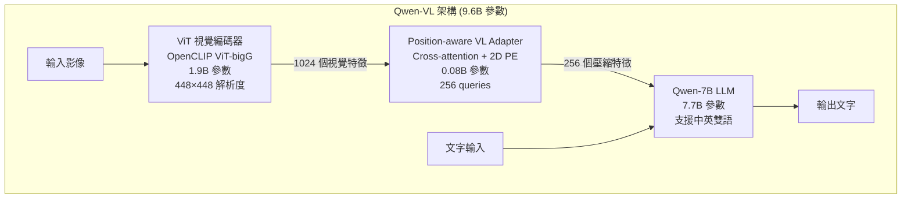
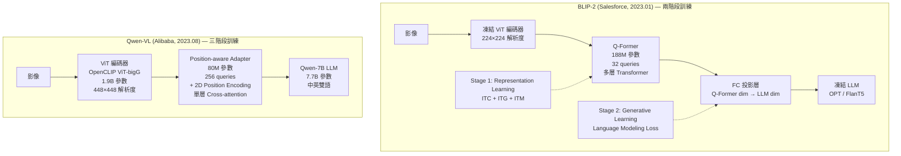
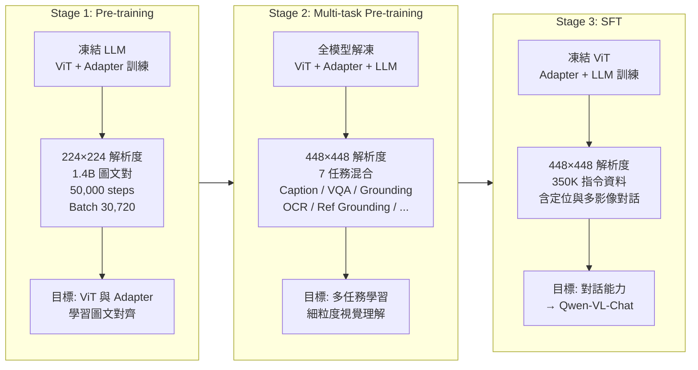
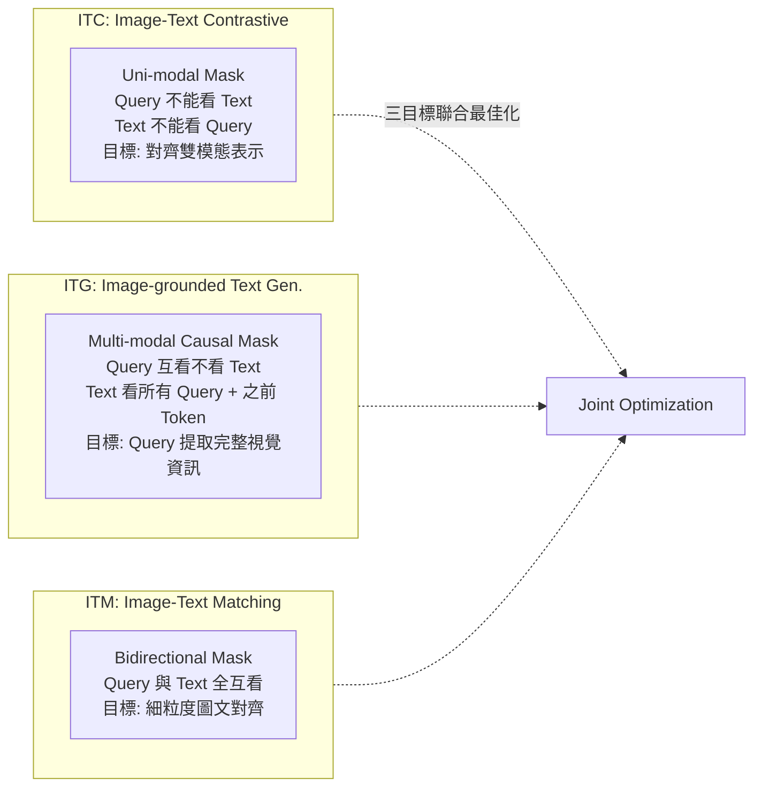

# Qwen-VL (Vision-Language Model) 論文導讀

## TL;DR

Qwen-VL 是阿里巴巴基於 Qwen-7B 打造的開源視覺語言模型系列，透過精心設計的三階段訓練管線與 Position-aware 視覺語言 Adapter，在 9.6B 參數規模下創下了多項視覺理解 benchmark 的 SOTA 紀錄。其核心貢獻在於：(1) 繼承 BLIP-2 的 query-based cross-attention 架構，但將 query 數量從 32 擴充到 256 並加入了 2D 位置編碼以支援更高解析度的細粒度理解；(2) 建立了從粗粒度圖文預訓練（1.4B 圖文對）到多任務預訓練（7 任務混合）再到指令微調（350K 資料）的完整三階段訓練流程；(3) 實現了物件定位（grounding）與文字閱讀（text reading）等細粒度能力，在 RefCOCO 上達到 89.36 分，超越了同期開源 LVLM 如 LLaVA、Shikra、InstructBLIP。本篇文章將詳細解讀 Qwen-VL 的架構設計、訓練策略與實驗結果，並與其核心前置工作 BLIP-2 進行深度對比分析。

---

## 背景與動機

### 為什麼需要視覺語言模型

大型語言模型在文字生成與理解上展現了驚人的能力。從 GPT-3 的 in-context learning，到 ChatGPT 的對話互動，再到 GPT-4 的多模態理解，LLM 已經徹底改變了我們與機器互動的方式。然而，純文字模型天生缺乏感知其他模態的能力——它們可以讀懂文字描述的「一隻貓坐在沙發上」，但無法直接理解一張實際的貓咪照片。這嚴重限制了它們在真實世界場景中的應用範圍，畢竟我們的世界從根本上來說是視覺的。

為了賦予 LLM 視覺能力，研究者開始開發大型視覺語言模型。這些模型將預訓練的視覺編碼器與 LLM 結合，讓模型能夠「看懂」圖片並根據圖片內容進行對話。到 2023 年中，已經有多個代表性工作：

- **Flamingo (DeepMind, 2022)**：在凍結 LLM 中插入新的 cross-attention layers，訓練數十億圖文對，展現了優秀的 few-shot VQA 能力
- **BLIP-2 (Salesforce, 2023.01)**：提出 Querying Transformer（Q-Former）作為輕量橋接模組，僅用 188M 可訓練參數就超越了 Flamingo-80B
- **LLaVA (Microsoft, 2023.04)**：提出最簡潔的方案——直接用一個 MLP 將 CLIP 視覺特徵投影到 LLM embedding 空間
- **InstructBLIP (Salesforce, 2023.05)**：將指令微調引入 BLIP-2 框架

### Qwen-VL 要解決的三個問題

儘管已經有許多 LVLM 被提出，Qwen-VL 的作者們指出當前開源 LVLM 普遍存在三個尚未解決的問題：

1. **訓練不足導致性能落後**：多數開源 LVLM 在訓練規模與優化策略上遠落後於閉源模型（如 GPT-4V）。開源社群需要一個「足夠好」的基線模型來推動研究

2. **粗粒度理解缺乏實用性**：大部分開源 LVLM 只能做整體影像描述或簡單問答。真實世界的視覺場景非常複雜，使用者需要的是「圖中左上角那隻穿藍色衣服的人在讀什麼書？」這類細粒度問題的解答。但除了少數嘗試（Kosmos-2、Shikra），多數模型缺乏物件定位與文字閱讀能力

3. **多語言支援不足**：許多 LVLM 以英文為中心，對中文及其他語言的支援有限。Qwen-7B 本身是一個強大的中英雙語 LLM，以此為基礎打造多語言 LVLM 是非常自然的選擇

### BLIP-2 的前置貢獻

要深入理解 Qwen-VL 的設計，必須先對 BLIP-2 有完整的認識。BLIP-2 是 Salesforce 在 2023 年 1 月提出的高效視覺語言預訓練方法，其核心洞見非常簡潔有力：**不需要端到端訓練大型模型**，而是透過一個輕量級的 Querying Transformer（Q-Former）來橋接**凍結的預訓練影像編碼器**與**凍結的大型語言模型**。

BLIP-2 的 Q-Former 包含兩個共享 self-attention 層的 Transformer 子模組：影像 Transformer（透過 cross-attention 與凍結的影像編碼器互動）和文字 Transformer（可同時作為編碼器與解碼器）。Q-Former 使用 32 個可學習的 query embedding（每個維度 768）作為影像 Transformer 的輸入。在預訓練的第一階段，這些 query 透過三種不同的 attention mask 策略（ITC、ITG、ITM）學會從影像編碼器中提取與文字最相關的視覺特徵。在第二階段，Q-Former 的輸出經由一個全連接層投影後，作為 soft visual prompt 插入 LLM 的輸入。

BLIP-2 的關鍵突破非常驚人：僅用 188M 可訓練參數，就在 VQAv2 上取得了 65.2 分，超越了擁有 80B 參數的 Flamingo-80B（56.3 分），實現了 8.7% 的提升與 54 倍的參數效率。這項成果證明了「凍結預訓練模型 + 輕量橋接模組」這條路徑的可行性。

### 什麼是 Query-based Cross-Attention？

這是理解兩篇論文的核心概念。傳統的作法（如 Flamingo）是在 LLM 中插入 cross-attention layers，讓 LLM 的注意力機制直接關注視覺特徵。這種方法雖然直觀，但需要大量端到端訓練才能讓 LLM 學會解讀視覺信號。

Query-based cross-attention 採用了不同的思路：不是讓 LLM 直接看影像，而是先透過一組可學習的 query 向量從視覺特徵中「提取摘要」。這個摘要只保留對語言生成有用的資訊，捨棄不相關的視覺細節。這樣做的好處是：(1) LLM 不需要從頭學習視覺-語言對齊，因為 query 已經做了這層工作；(2) query 的數量是固定的（比如 32 或 256），不受輸入影像尺寸影響，使得計算量可預測。

BLIP-2 將這個做法推到極致：Q-Former 本身是一個完整的 Transformer，包含多層 self-attention 與 cross-attention。而 Qwen-VL 則將其簡化為單層 cross-attention，但增加了 query 數量並加入了位置編碼。

---

## 核心知識點

### 1. 視覺語言 Adapter 的設計哲學

Qwen-VL 的「Position-aware Vision-Language Adapter」是一個關鍵的架構創新。它本質上是一個單層 cross-attention 模組，使用一組可訓練的 query 向量從視覺編碼器的輸出中提取資訊。這個設計吸收了 BLIP-2 Q-Former 的優點，但做了兩項重要改良：

**改良一：增加 query 數量**
BLIP-2 使用 32 個 query，這在 224×224 解析度下可能足夠——此時 ViT 輸出 256 個 token（(224/14)² = 256），壓縮比為 8:1。但當 Qwen-VL 將解析度提高到 448×448 時，ViT 輸出增加到 1024 個 token，32 個 query 的壓縮比高達 32:1，資訊損失可能過大。Qwen-VL 將 query 數量增加到 256 個，壓縮比降到 4:1，在保留空間細節與控制計算量之間取得了更好的平衡。

作者在 Appendix E.2 中對 query 數量進行了系統性的消融研究。實驗中使用 ViT-L/14 與 224×224 解析度（輸出 256 token），比較了 L64、L144、L256、L400 四種配置。結果顯示：
- 在訓練初期（前 50 步），query 越少 loss 越低——64 個 query 的初始 loss 最低，400 個 query 最高。這是因為更多 query 意味著更多參數需要收斂
- 收斂後（1000-5000 步），L64 與 L400 的 loss 都高於 L144 與 L256。64 個 query 容量不足，無法捕獲足夠的視覺資訊；400 個 query 則過度參數化，最佳化困難
- 考慮到第二階段解析度提升到 448×448 時，輸入特徵數從 256 增加到 1024，256 個 query 在 4:1 壓縮比下是更合理的選擇

**改良二：加入 2D 絕對位置編碼**
這是最重要的架構創新。ViT 內部使用 1D 位置編碼保留 patch 的空間順序，但當這些特徵經過 cross-attention 壓縮後，原本的空間對應關係會被破壞——設想一個場景：如果一張圖片中包含「左上角的紅球」和「右下角的藍球」，單從視覺特徵本身可能無法區分「紅球在哪個位置」這個資訊。為了解決這個問題，Qwen-VL 在 cross-attention 的 query-key 計算中明確加入了 2D 位置編碼，讓每個 query 在提取特徵時知道自己正在關注影像的哪個區域。

具體來說，對於 query i 和視覺 token j，attention score 不僅取決於它們的語意相似度，還加上一個基於兩者在原始影像中二維座標的偏置項。這個偏置讓模型可以學習「哪些空間區域的視覺資訊對當前的語言任務最重要」——例如在 grounding 任務中，模型需要知道某個描述詞對應的影像區域在哪裡。

這個 Adapter 扮演的是「資訊瓶頸」角色：它將 ViT 輸出的可變長度特徵序列壓縮到固定長度 256，再餵入 LLM。壓縮過程必然會損失資訊，但透過兩階段的逐步訓練（Stage 1 凍結 LLM 先訓練 ViT + Adapter -> Stage 2 全模型聯合訓練），以及位置編碼保留空間資訊，Adapter 學會保留對語言生成最重要的視覺特徵。

### 2. 三階段訓練管線的戰略意義

Qwen-VL 最顯著的貢獻之一是其三階段訓練策略。這不是一個隨意的設計決定，而是對齊了視覺語言學習中三個不同層次的目標：

**Stage 1（預訓練）的直覺**：在第一階段，凍結 LLM 只訓練 ViT 和 Adapter。這背後的邏輯是：LLM 已經經過了大規模文字預訓練，具備強大的語言能力。如果一開始就讓 LLM 參與訓練，它的語言能力可能會因為多模態資料中的雜訊而退化。先讓視覺編碼器學會產生對語言有用的特徵，再讓 LLM 學會解讀這些特徵，是更穩健的策略。

**Stage 2（多任務預訓練）的直覺**：提高解析度到 448×448，並解凍 LLM。此時 ViT 和 Adapter 已經對齊了視覺與語言，可以開始讓 LLM 學習更複雜的多任務能力。七個任務從簡單的影像描述到複雜的 grounding 和 OCR，形成了一個漸進的學習曲線。

**Stage 3（SFT）的直覺**：凍結 ViT，只訓練 LLM 和 Adapter。這類似於 LLM 的指令微調階段——模型已經學會了「看懂」影像，現在需要學會「對話」。35K 筆指令資料中特別包含了定位與多影像理解的對話資料，確保接地能力在對話場景中也能發揮。

### 3. 位置編碼在特徵壓縮中的關鍵角色

這是一個容易被忽略但至關重要的設計細節。ViT 將影像分割成 14×14 的 patch，每個 patch 的位置資訊透過絕對位置編碼保留。但當這些特徵經過 cross-attention 壓縮後，原本明確的位置資訊可能被模糊化——例如「左上角的貓」和「右下角的貓」如果只從語意特徵來區分，可能難以分辨。

Qwen-VL 的解決方案是在 cross-attention 的 query-key 計算中直接加入 2D 位置編碼。具體來說，對於 query $i$ 和視覺 token $j$，它們之間的 attention score 不僅取決於語意相似度，還加上了一個基於兩者在原始影像中 2D 位置的偏置項。這樣一來，query 在提取特徵時可以選擇性地關注特定空間區域，類似於一種「軟性的空間注意力」。

這個設計對於 grounding（需要精確的空間定位）和 text reading（需要知道文字在影像中的哪個位置）特別重要。對於簡單的影像描述任務，位置編碼的效益可能不大，但對於需要精確空間理解的任務，它帶來了顯著的性能提升。

### 4. 從 BLIP-2 到 Qwen-VL 的架構演進

| 面向 | BLIP-2 Q-Former | Qwen-VL Adapter |
|------|----------------|-----------------|
| 參數量 | 188M | 80M |
| Query 數量 | 32 | 256 |
| 位置編碼 | 無內部位置編碼 | 2D 絕對位置編碼 |
| Attention 層數 | 多層 Transformer（與 BERTbase 相同） | 單層 Cross-attention |
| 初始化 | BERTbase 預訓練權重 | 隨機初始化 |
| LLM 互動方式 | FC 投影層（Q-Former dim → LLM dim） | 直接輸入 LLM |
| 影像解析度 | 224×224 | 448×448 |
| 訓練凍結策略 | 全凍結 ViT 與 LLM | 階段性解凍 |

一個有趣的觀察：Qwen-VL 的 Adapter 參數更少（80M vs 188M），但透過更多的 query（256 vs 32）和位置編碼來補償架構簡化帶來的容量損失。這反映了兩種不同的設計哲學——BLIP-2 追求「橋接模組的完整性」（讓 Q-Former 足夠強大，以彌補凍結 ViT 和 LLM 的不足），而 Qwen-VL 追求「橋接模組的簡潔性」（讓 Adapter 作為純粹的壓縮工具，更多的學習能力留給 LLM）。

### 5. 細粒度能力的實現路徑

Qwen-VL 的 grounding 與 text reading 能力不是單一設計的功勞，而是三個支撐點協同作用的結果：

**支撐一：高解析度輸入**
448×448 的輸入解析度提供了比 BLIP-2 的 224×224 多 4 倍的空間細節（307,200 pixels vs 50,176 pixels）。對於 OCR 任務來說，更大的解析度意味著更小的文字（如文件中的腳註、圖表中的標籤）也能被 ViT 的 patch 捕捉到。對於 grounding 任務，高解析度讓模型可以更精確地定位物體邊界。具體來說，224×224 下每個 14×14 patch 對應 16×16 像素；448×448 下同一個 patch 只對應 32×32 像素，定位精度提高了 2 倍。

**支撐二：專用訓練資料**
Qwen-VL 為 grounding 和 OCR 建構了龐大且多樣化的訓練資料：

Grounding 資料包含從 GRIT 資料集提取的約 1,220 萬樣本（含 grounding、ref grounding、grounded caption 三個子任務）。GRIT 資料的 caption 中可能包含 recursive box labels——即一個 box 嵌套在另一個 box 內部。Qwen-VL 使用貪婪演算法去重：從最大的 box 開始逐一檢查，如果某個 box 完全落在已選取的 box 內部則跳過，確保每個 box label 對應唯一的空間區域。

OCR 資料包含兩部分：
- **合成資料**（SynthDoG）：在 COCO train2017 和 unlabeled2017 的背景影像上，選擇 41 種英文字型與 11 種中文字型渲染文字。對每個渲染的文字位置跟蹤其四邊形座標，作為訓練標籤
- **真實資料**（PDF/HTML）：從 Common Crawl 收集 PDF 文件（使用 PyMuPDF 渲染為影像、提取文字與邊界框）與 HTML 頁面（使用 Puppeteer 渲染）。對 PDF 資料進行了詳細的過濾：移除尺寸太小、字元數過多或過少、包含特定 Unicode 區塊（Latin Extended-A/B 區塊、Private Use Area）字元的頁面

**支撐三：特殊 Token 格式**
Qwen-VL 使用四組特殊 token 來處理邊界框的輸入與輸出：

- `` 與 `</img>`：包裹 ViT 提取的影像特徵序列
- `<box>` 與 `</box>`：包裹歸一化後的邊界框座標字串
- `<ref>` 與 `</ref>`：包裹被邊界框標註的文字內容（描述詞或短語）
- 座標格式：`(Xtopleft, Ytopleft), (Xbottomright, Ybottomright)`，歸一化到 [0, 1000)

舉例來說，對於「圖中那隻穿著紅色衣服的狗」這個 grounding 任務，輸入可能被格式化為：

```
image_features</img>請找出 <ref>穿著紅色衣服的狗</ref><box>(120, 45), (380, 250)</box> 的位置。
```

所有特殊 token 都被 LLM 視為普通文字 token，不需要額外的詞彙表或位置嵌入。邊界框座標轉換為字串後，由 LLM 的 tokenizer 直接分詞。這種設計保持了架構的簡潔性——模型不需要為邊界框設計額外的編碼器或解碼器。

### 6. BLIP-2 的三重訓練目標（數學推導）

BLIP-2 的第一階段是最精巧的設計，同時最佳化三個目標，每個目標使用不同的 self-attention mask 來控制 query 與文字的互動方式。

**ITC (Image-Text Contrastive)**
目標是最大化正圖文對之間的 mutual information，數學上可以寫為：

$$ \mathcal{L}_{\text{ITC}} = -\log \frac{\exp(s(I, T^+) / \tau)}{\exp(s(I, T^+) / \tau) + \sum_{T^-} \exp(s(I, T^-) / \tau)} $$

其中 $s(I, T) = \max_i (z_i \cdot t)$ 是影像與文字的相似度計算方式。$z_i$ 是第 i 個 query 的輸出，$t$ 是文字 [CLS] token。使用 max 而非 mean 的直覺是：不同的 query 可能關注影像的不同區域（例如一個 query 關注貓的臉、另一個關注貓的身體），取最大值讓模型可以從最相關的角度來判斷圖文是否匹配。

使用 uni-modal self-attention mask：query 只能互相關注，不能看文字；文字 token 也只能互相關注，不能看 query。這個 mask 確保 query 在提取視覺特徵時不會「偷看」文字內容。

**ITG (Image-grounded Text Generation)**
目標是訓練 Q-Former 根據影像條件生成文字，使用語言建模 loss：

$$ \mathcal{L}_{\text{ITG}} = -\sum_{t} \log P(w_t | Z, w_{<t}) $$

其中 $Z$ 是 query 的輸出，$w_t$ 是第 t 個文字 token。使用 multi-modal causal self-attention mask：query 可以互相關注但不能看文字；每個文字 token 可以關注所有 query 和它之前的文字 token。

關鍵洞察：由於 query 是文字 token 獲取視覺資訊的唯一管道（架構上不允許文字直接看 ViT），要準確生成文字描述，query 必須提取到涵蓋描述中所有資訊的視覺特徵。這迫使 query 學會完整的視覺語意表示。

**ITM (Image-Text Matching)**
目標是學習細粒度的圖文對齊，作為二分類任務：

$$ \mathcal{L}_{\text{ITM}} = -\log P(\text{matched} | I, T) - \log (1 - P(\text{matched} | I, T^-)) $$

使用雙向 self-attention mask：所有 query 和文字可以互相關注。每個 query 輸出經過一個二類線性分類器得到 logit $\phi(z_i)$，最終匹配分數為 $\frac{1}{N} \sum_i \phi(z_i)$。

BLIP-2 使用了 BLIP 中的 hard negative mining 策略：在 ITC 中，對每個 batch 內的所有負樣本計算相似度，選取相似度最高的負樣本作為 ITM 的訓練樣本。這樣確保了 ITM 任務有足夠有資訊量的負樣本，避免學習退化成簡單的模式匹配。

三目標共享 Q-Former 的參數但使用不同的 attention mask，這類似於多任務學習中的參數共享：ITC 關注全局對齊、ITG 關注生成能力、ITM 關注局部匹配。三個目標互補，共同訓練出一個既能提取全局語意又能捕獲局部細節的視覺表示。

**第二階段：Generative Learning**
在第一階段訓練好 Q-Former 後，第二階段將其連接到一個凍結的 LLM。Q-Former 的輸出 $Z$ 通過一個全連接層 $W_{\text{fc}}$ 投影到 LLM 的 embedding 空間，然後作為 soft visual prompt 插入 LLM 的輸入序列：

$$ \text{Input}_{\text{LLM}} = [Z W_{\text{fc}}; \text{TextEmbeddings}] $$

針對 decoder-only 的 LLM（如 OPT），直接使用語言建模 loss 訓練：條件於視覺 prompt 生成目標文字。針對 encoder-decoder 的 LLM（如 FlanT5），使用 prefix language modeling loss：將文字分為 prefix 與 suffix，prefix 與視覺 prompt 一起輸入 encoder，suffix 作為 decoder 的生成目標。

---

## 方法詳解

### Qwen-VL 的完整架構

Qwen-VL 的整體架構由三個元件組成，總參數量約 9.6B：



### Position-aware VL Adapter 的數學細節

給定 ViT 輸出的視覺特徵序列 $V \in \mathbb{R}^{N_v \times d_v}$（$N_v = 1024$ 在 448×448 下）和一組可學習的 query embedding $Q \in \mathbb{R}^{N_q \times d_q}$（$N_q = 256$），單層 cross-attention 的計算步驟如下：

**第一步：線性投影**
$$ Q' = Q W_Q, \quad K = V W_K, \quad V' = V W_V $$

其中 $W_Q \in \mathbb{R}^{d_q \times d_k}$、$W_K, W_V \in \mathbb{R}^{d_v \times d_k}$ 是可學習的投影矩陣。在 Qwen-VL 中，$d_k$ 的選擇與 Qwen-7B 的 hidden dimension 一致。

**第二步：加入 2D 位置編碼**
$$ A_{ij} = \frac{Q'_i \cdot K_j + P_{2D}(x_i, y_i, x_j, y_j)}{\sqrt{d_k}} $$

位置編碼 $P_{2D}$ 的具體實作是：對於 query $i$，先計算其在 query 序列中的位置 $x_i$（考慮到 256 個 query 在空間上的排列方式）；對於視覺 token $j$，從 ViT 的 2D 位置編碼中取得其在原始影像中的座標 $(x_j, y_j)$。然後透過一個可學習的 MLP 或查詢表將這些位置資訊轉換為一個標量偏置。這種設計保留了 cross-attention 中 query-key 計算的雙線性形式，使位置資訊可以自然地與語意相似度結合。

**第三步：加權聚合**
$$ Z_i = \sum_j \text{softmax}_j(A_{ij}) \cdot V'_j $$

輸出 $Z \in \mathbb{R}^{256 \times d_k}$ 是 256 個壓縮後的特徵向量，直接作為 LLM 的部分輸入。

### 三階段訓練的詳細設計

#### Stage 1: Pre-training（預訓練）

這個階段的目標是讓 ViT 和 Adapter 學會從影像中提取與文字相關的特徵。

**訓練資料的清洗流程**：
原始資料來自公開來源，總計約 50 億張圖文對。經過以下清洗步驟後，僅保留 14 億張（保留率 28%）：

1. 移除長寬比極端（> 5 或 < 1/5）或尺寸過小（< 200 像素）的影像——極端長寬比的影像通常來自網頁裝飾元素而非實際內容
2. 移除 CLIP 分數低於特定閾值的配對（每個資料集閾值不同）——CLIP 分數低意味著文字與影像內容可能沒有實際關聯
3. 移除文字包含非英/中文字元（保留中英雙語）、emoji、HTML 標籤殘留、異常重複模式的配對
4. 移除文字過短（< 3 字元）或過長（> 500 字元）的配對——太短沒有資訊量，太長可能是文字轉儲
5. 對於學術資料集中含多張圖片的配對，只保留文字最長的那張——避免同一段描述對應多張影像造成歧義

清洗後的資料分佈：

| 資料集 | 原始量 | 清洗後 | 保留率 |
|--------|:-----:|:------:|:------:|
| LAION-en | 20 億 | 2.8 億 | 14% |
| LAION-COCO | 6 億 | 3 億 | 50% |
| DataComp | 14 億 | 3 億 | 21% |
| Coyo | 7 億 | 2 億 | 28% |
| CC12M | 1,200 萬 | 800 萬 | 66% |
| CC3M | 300 萬 | 300 萬 | 100% |
| SBU | 100 萬 | 80 萬 | 80% |
| COCO Caption | 60 萬 | 60 萬 | 100% |
| LAION-zh | 1.08 億 | 1.05 億 | 97% |
| 內部資料 | 2.2 億 | 2.2 億 | 100% |
| **總計** | **50 億** | **14 億** | **28%** |

值得注意的是，不同資料集的清洗保留率差異巨大：LAION-en 只有 14% 通過清洗，而內部資料則 100% 保留。這反映了網路爬取資料與人工審核資料之間品質的巨大鴻溝。清洗後英文資料佔 77.3%、中文佔 22.7%。

**訓練設定**：
- 凍結 LLM，只最佳化 ViT（1.9B 參數）和 Adapter（0.08B 參數）
- 影像縮放到 224×224
- 訓練目標：最小化文字 token 的 cross-entropy loss
- 最佳化器：AdamW（β1=0.9, β2=0.98），weight decay 0.05
- 學習率：峰值 2e-4，cosine decay，2,000 steps linear warmup
- Batch size：30,720！這個巨大的 batch size 得益於凍結 LLM 節省的 GPU 記憶體——LLM 的梯度不需要計算和儲存
- 訓練步數：50,000 steps
- 總消耗樣本數：約 15 億張（每個圖文對大約訓練一遍）
- ViT 輸入增強：random resized cropping + horizontal flipping

#### Stage 2: Multi-task Pre-training（多任務預訓練）

這個階段引入高品質、細粒度的視覺語言標註資料，並提高輸入解析度。這是 Qwen-VL 與 BLIP-2 最關鍵的差異點之一。

**解析度提升的取捨分析**：從 224×224 提高到 448×448，ViT 的序列長度從 256 增加到 1024（(448/14)² = 1024）。這帶來了兩個問題：(1) 計算成本增長——self-attention 的計算量從 O(256²) 增加到 O(1024²)，約為 16 倍，但由於 token 數也增加了 4 倍，每 step 的總計算量約為 4 倍；(2) 資訊量也增加 4 倍，需要更多的 query 來保留。Qwen-VL 將 query 數從 64（消融實驗中的最佳值之一）增加到 256，以匹配資訊量增長，壓縮比約為 4:1。

作者對 window attention 與 global attention 進行了詳細的消融。Window attention 將 448×448 的影像分割為多個 224×224 的視窗，每個視窗內獨立做 attention。理論上這種做法可以大幅降低計算量，但實驗結果顯示：
- 在 448×448 下，window attention 的 loss 明顯高於 global attention，差距在收斂後仍持續存在
- 訓練速度差異很小（9s/iter vs 10s/iter），這是因為 ViT 的計算瓶頸不在 attention 計算本身，而在 feed-forward 層與 cross-attention 層
- 只有在 896×896 解析度下，window attention 才展現出顯著的效率優勢（25s/iter vs 60s/iter），因為此時 global attention 的計算量已經大到成為瓶頸
- 最終選擇：448×448 + global attention

**七任務混合訓練的詳細資料分佈**：

| 任務 | 樣本數 | 資料來源與處理方式 |
|------|--------|-------------------|
| Captioning | 1,970 萬 | LAION-en/zh、DataComp、Coyo、CC12M、CC3M、SBU、COCO Caption、內部資料。排除 LAION-COCO（這是合成資料） |
| VQA | 360 萬 | GQA、VGQA、VQAv2、DVQA、OCR-VQA、DocVQA。對 VQAv2 選擇最高置信度的答案註解 |
| Grounding | 350 萬 | GRIT。使用貪婪演算法去除 recursive box labels |
| Ref Grounding | 870 萬 | GRIT、Visual Genome、RefCOCO、RefCOCO+、RefCOCOg。簡單拼接名詞/短語與邊界框座標 |
| Grounded Caption | 870 萬 | 同上，雙向產生的 grounded captioning 任務 |
| OCR | 2,480 萬 | SynthDoG 合成資料（在 COCO 背景上渲染中英文）+ Common Crawl PDF（用 PyMuPDF 渲染）+ Common Crawl HTML（用 Puppeteer 渲染） |
| Pure-text | 780 萬 | 內部收集的純文字語料，維持 LLM 的語言能力 |

**訓練設定**：
- 全模型解凍（ViT + Adapter + LLM）
- 影像解析度提高到 448×448
- 訓練目標：與 Stage 1 相同的 cross-entropy loss
- 最佳化器、學習率排程與 Stage 1 相同
- 這個階段沒有明確給出訓練步數，但從資料量可以推斷為數萬步

#### Stage 3: Supervised Fine-tuning（監督微調）

這個階段將 Qwen-VL 調整為具有對話能力的 Qwen-VL-Chat。

**指令資料的組成**：35 萬筆指令資料的來源包括：
- 人工標註的定位與多影像理解對話（直接標註邊界框與對話配對）
- 使用 LLM（如 GPT-4）進行 self-instruction 生成的單影像對話資料
- 策略拼接：將已有的 caption 資料與 VQA 資料轉換為對話格式
- 混合純文字對話資料以維持模型的語言能力

**訓練設定**：
- 凍結 ViT，只最佳化 LLM 與 Adapter
- 這個階段的凍結策略與 Stage 1 相反——Stage 1 凍結 LLM，Stage 3 凍結 ViT。這是有意為之：ViT 已經從前兩個階段中學習到了足夠的視覺特徵提取能力，不需要再變化；而 LLM 需要調整以適應對話格式
- 訓練目標：語言建模 loss（預測 assistant 的回覆）

### BLIP-2 的消融實驗與洞察

BLIP-2 提供了幾個對理解 Qwen-VL 很重要的消融實驗。這些實驗雖然不是在 Qwen-VL 上做的，但它們揭示了 query-based 視覺語言橋接設計中的關鍵原則：

**Representation Learning 的關鍵性**

BLIP-2 的 Figure 5 顯示了一個非常有趣且具有啟發性的現象：如果跳過 representation learning stage（Stage 1），直接進行 generative learning（Stage 2），使用 OPT 作為 LLM 的模型在 VQA 上的性能會隨著訓練進程急遽下降——從約 30 分下降到接近 10 分，這是典型 catastrophic forgetting 的表現。即使是指令微調過的 FlanT5，沒有 representation learning 的模型也明顯落後於有 representation learning 的模型（差距約 10-15 分），不過 FlanT5 的退化速度比 OPT 慢得多。

這背後的直覺是：Language modeling loss（第二階段）雖然可以驅動 Q-Former 學習提取對生成有用的視覺特徵，但這個訊號對於視覺-語言對齊來說太弱了。LLM 本身是一個強大的語言模型，它可以僅基於語言先驗「猜」出合理的回答而不需要真正理解影像內容（例如對於「這張圖片中有什麼？」這個問題，即使不看圖片，模型也可能猜出「一個人」或「一隻狗」這類常見答案）。如果沒有 representation learning 先讓 Q-Former 學會提取與文字相關的視覺特徵，Q-Former 可能永遠學不會「主動」提取有用的視覺資訊，而 LLM 則會因為學到了忽略視覺輸入而發生 catastrophic forgetting。

這個發現對於 Qwen-VL 的三階段設計有直接的指導意義：Qwen-VL 的第一階段（凍結 LLM，只訓練 ViT + Adapter）本質上就是在做 BLIP-2 的 representation learning，只是將訓練從 Q-Former 擴展到了 ViT 和 Adapter。第二階段（全模型解凍）則對應於 BLIP-2 的 generative learning。

**BLIP-2 的 VQA 微調策略**

BLIP-2 在 VQA 微調階段有一個重要的設計細節：為了讓 Q-Former 提取與問題相關的視覺特徵，BLIP-2 將問題文字 token 也作為 Q-Former 的輸入。具體來說，問題 token 透過 self-attention layers 與 query 互動，引導 query 的 cross-attention layers 關注與問題更相關的影像區域。這是一種「query conditioned on text」的設計——同樣的影像，不同的問題會引導 query 關注不同的區域。

這個設計與 Qwen-VL 形成對比：Qwen-VL 的 Adapter 更簡潔，只做視覺特徵的壓縮，不接收問題文字作為輸入。問題與影像的互動完全交給 LLM 來處理。這種簡化是可行的，因為 Qwen-VL 的 LLM 是開放的（不是凍結的），LLM 本身可以學會如何將問題與 Adapter 輸出的視覺特徵對齊。

### BLIP-2 的 NoCaps 零樣本影像描述結果

BLIP-2 在 NoCaps 零樣本影像描述上的表現特別值得關注，因為它直接展示了 Q-Former 的泛化能力。NoCaps 資料集包含來自 OpenImages 的影像，分為 in-domain（與 COCO 語意重疊）、near-domain（部分重疊）和 out-domain（很少重疊）三個子集：

| 模型 | 可訓練參數 | In-domain | Near-domain | Out-domain | Overall CIDEr |
|------|:---------:|:---------:|:-----------:|:----------:|:-------------:|
| OSCAR | 345M | 80.9 | 81.4 | 75.8 | 80.5 |
| VinVL | 345M | 94.4 | 93.0 | 85.6 | 92.5 |
| BLIP | 446M | 103.1 | 110.3 | 100.5 | 105.5 |
| SimVLM | 1.4B | 114.9 | 117.8 | 115.2 | 116.4 |
| Flamingo-80B | 10.6B | 113.7 | 112.1 | 115.2 | 112.2 |
| BLIP-2 (ViT-g OPT2.7B) | 1.1B | 123.0 | 117.8 | 123.4 | 119.7 |
| BLIP-2 (ViT-g OPT6.7B) | 1.1B | 123.7 | 119.2 | 124.4 | 121.0 |
| BLIP-2 (ViT-g FlanT5XL) | 1.1B | 124.4 | 121.0 | 123.7 | 122.0 |
| BLIP-2 (ViT-g FlanT5XXL) | 1.1B | 124.8 | 121.6 | 123.7 | **122.6** |

BLIP-2 在 out-domain 上的表現（123.7）與 in-domain（124.8）幾乎沒有差距，這說明 Q-Former 學到的視覺-語言對齊是通用的，不局限於特定的語意領域。相比之下，OSCAR 和 VinVL 的 out-domain 表現比 in-domain 低 5-6 分，說明它們的視覺表示更依賴於特定的訓練資料分佈。

**query 數量的消融**

Qwen-VL 在 Appendix E.2 中消融了 query 數量的影響。實驗使用 ViT-L/14 和 224×224 解析度（因此 ViT 輸出為 256 個 token），比較了 64、144、256、400 四個 query 數：

- 訓練初期（前 50 steps）：query 越少，loss 越低。這是因為更少的 query 意味著更少的參數需要學習，初期最佳化更容易
- 訓練收斂後（1K-5K steps）：64 和 400 的 loss 高於 144 和 256。64 太少，可能遺失重要視覺資訊；400 太多，最佳化困難
- 最終選擇 256 的考慮：在第二階段 448×448 解析度下，ViT 輸出為 1024 個 token，256 個 query 的壓縮比（4:1）比在 224×224 下（256 輸入 → 64 query 的 4:1 壓縮比）更合理

**Global vs Window Attention**

在 448×448 下使用 global attention 的 loss 明顯低於 window attention。訓練速度上兩者差異不大（9s/iter vs 10s/iter），因為計算瓶頸不在 attention 計算而在 feed-forward 層與 cross-attention 層。只有在 896×896 下，window attention 才展現出 2.4 倍的訓練速度優勢（25s/iter vs 60s/iter）。

### Qwen-VL 的位置編碼消融

雖然 Qwen-VL 論文中沒有對位置編碼做獨立的消融實驗，但從 grounding 與 text-oriented VQA 的顯著性能提升，可以間接推斷位置編碼的重要性：

- **RefCOCO val**：Qwen-VL 達到 89.36 分，比沒有位置編碼的 Shikra-7B（87.01）高出 2.35 分，比 Shikra-13B（87.83）高出 1.53 分。更值得注意的是 GRIT benchmark 上的表現（78.61 vs 67.58，+11.03 分 vs Shikra-13B），差距遠大於 RefCOCO

- **TextVQA**：Qwen-VL 達到 63.8 分，比 InstructBLIP（50.7）高出 13.1 分。雖然這個差距不完全來自位置編碼（也有解析度與訓練規模的影響），但位置編碼讓模型在定位文字在影像中的位置時更加精確

GRIT 上的巨大差距特別值得注意。GRIT 資料集的 grounding 任務比 RefCOCO 更複雜——它包含更廣泛的物體類別和更複雜的場景描述。在這種需要精確空間理解的任務上，位置編碼的效用更加明顯。這為後續 LVLM 設計提供了一個重要啟示：當模型需要精確空間理解時，視覺特徵壓縮過程中的位置資訊保留至關重要。

### Qwen-VL 的多影像輸入能力

Qwen-VL 的一個獨特設計是其對多影像輸入的原生支援。在訓練階段，模型允許任意穿插的圖文資料作為輸入——這意味著模型不僅可以處理「一張影像 + 一段描述」的簡單格式，還可以處理「影像A + 描述A + 影像B + 描述B」的複雜交錯格式。

這種多影像能力的技術基礎來自於 Qwen-VL 的訓練資料構建方式。在第二階段的多任務預訓練中，作者將同一任務的多筆資料打包成序列長度 2048 的交錯圖文序列。例如，將多張影像描述資料依序串接：`img1</img>描述1 img2</img>描述2 ...`。這種簡單的打包策略讓模型在預訓練階段就學會了處理任意數量的影像輸入。

在 SFT 階段，多影像能力進一步強化。作者透過策略拼接（將已有的 caption 資料與 VQA 資料交錯組合），建構了多影像對話的訓練資料。例如：

1. **比較任務**：「影像A 是一張風景照，影像B 是一張人物照。請比較這兩張圖片的風格差異。」
2. **篩選任務**：「從這組圖片中找出包含貓咪的那一張，並描述牠在做什麼。」
3. **排序任務**：「請根據這些圖片的拍攝時間先後順序排列。」

多影像輸入的實現相對直觀：每張影像獨立通過 ViT 與 Adapter 處理，產生各自的 256 個壓縮特徵。多組壓縮特徵拼接後（例如 3 張影像產生 768 個特徵），與文字 token 一起輸入 LLM。LLM 需要在多組視覺特徵之間建立關聯並進行推理——這考驗的是 LLM 本身的序列建模能力，而非視覺編碼器的設計。與單影像任務相比，多影像任務對 LLM 的 context length 要求更高，這也是為什麼訓練時使用 2048 的序列長度而非更短的配置。

---

## 實驗結果

### 影像描述與通用 VQA

Qwen-VL 在影像描述與視覺問答任務上展現了強大的性能。以下表格整理了 Qwen-VL 與其他同級模型的對比結果，所有指標均為零樣本（zero-shot）評估：

| 模型 | 參數量 | Flickr30K (CIDEr) | VQAv2 (test-dev) | GQA | OKVQA |
|------|:-----:|:-----------------:|:----------------:|:---:|:-----:|
| Flamingo-9B | 9.3B | 61.5 | 51.8 | - | 44.7 |
| Flamingo-80B | 80B | 67.2 | 56.3 | - | 50.6 |
| Unified-IO-XL | ~2.9B | 100.0 | 77.9 | - | 54.0 |
| BLIP-2 (Vicuna-13B) | ~13B | 103.9 | 65.0 | 32.3 | - |
| InstructBLIP (Vicuna-13B) | ~13B | 121.9 | 77.36 | 49.5 | - |
| Shikra (Vicuna-13B) | ~13B | 73.9 | 77.4 | - | - |
| **Qwen-VL (Qwen-7B)** | **9.6B** | **120.2** | **79.5** | **59.3** | **58.6** |
| Qwen-VL-Chat (Qwen-7B) | 9.6B | 121.4 | 78.2 | 57.5 | 56.6 |

幾個值得注意的觀察：
- Qwen-VL 在 Flickr30K 上以 120.2 CIDEr 超越了 BLIP-2（103.9），與 InstructBLIP（121.9）接近，但 Qwen-VL 的參數量更少（9.6B vs 13B）
- VQAv2 上 79.5 分超越 Flamingo-80B 的 56.3 分多達 23 個百分點——這是一個跨世代的差距
- GQA（59.3）與 OKVQA（58.6）的大幅領先（BLIP-2: 32.3, InstructBLIP: 49.5）特別值得關注，因為這兩個 benchmark 需要複雜的場景理解與外部知識推理

### 文字導向 VQA

在需要文字閱讀能力的 benchmark 上，Qwen-VL 的優勢更加明顯。這直接歸功於 448×448 的高解析度輸入以及訓練資料中 2,480 萬筆的 OCR 相關樣本：

| 模型 | TextVQA | DocVQA | ChartQA | AI2D | OCR-VQA |
|------|:-------:|:------:|:-------:|:----:|:-------:|
| BLIP-2 (Vicuna-13B) | 42.4 | - | - | - | - |
| InstructBLIP (Vicuna-13B) | 50.7 | - | - | - | - |
| mPLUG-DocOwl (LLaMA-7B) | 52.6 | 62.2 | 57.4 | - | - |
| Pix2Struct-Large (1.3B) | - | 76.6 | 58.6 | 42.1 | 71.3 |
| **Qwen-VL (Qwen-7B)** | **63.8** | **65.1** | **65.7** | **62.3** | **75.7** |

Qwen-VL 在 TextVQA 上（63.8）大幅領先 BLIP-2（42.4，+21.4）和 InstructBLIP（50.7，+13.1），這直接歸功於 448×448 的輸入解析度與訓練資料中 2,480 萬筆 OCR 樣本。在 ChartQA（65.7）和 AI2D（62.3）上的高分也說明了模型在結構化圖表與科學圖理解上的優勢。值得注意的是 Pix2Struct（一個專門為視覺語言理解設計的 encoder-decoder 模型）在 DocVQA 上以 76.6 分領先，但在其他 benchmark 上 Qwen-VL 表現更均衡。

### 指代表達理解

| 模型 | RefCOCO val | RefCOCO+ val | RefCOCOg val | GRIT |
|------|:----------:|:-----------:|:-----------:|:----:|
| OFA-L* | 79.96 | 72.12 | 74.41 | - |
| Shikra-7B | 87.01 | 81.60 | 82.64 | 61.70 |
| Shikra-13B | 87.83 | 82.89 | 82.19 | 67.58 |
| **Qwen-VL-7B** | **89.36** | **85.34** | **85.58** | **78.61** |
| Qwen-VL-7B-Chat | 88.55 | 84.51 | 85.96 | 76.79 |

在所有 grounding benchmark 上，Qwen-VL 都取得了同級模型中的最佳表現。RefCOCO val 的 89.36 分與 GRIT 的 78.61 分都是當時的最高水準。GRIT 的遙遙領先（+11 分 vs Shikra-13B）特別說明 Qwen-VL 在接地任務上的能力不僅來自訓練資料的規模，更來自 Adapter 中位置編碼對空間資訊的有效保留。

### BLIP-2 的零樣本 VQA 結果

BLIP-2 的實驗展示了 frozen unimodal models 策略的威力：

| 模型 | 可訓練參數 | 總參數 | VQAv2 (test-dev) | OK-VQA | GQA |
|------|:---------:|:------:|:---------------:|:------:|:---:|
| Flamingo-80B | 10.2B | 80B | 56.3 | 50.6 | - |
| BLIP-2 (ViT-L + OPT2.7B) | 104M | 3.1B | 50.1 | 30.2 | 33.9 |
| BLIP-2 (ViT-g + OPT2.7B) | 107M | 3.8B | 53.5 | 31.7 | 34.6 |
| BLIP-2 (ViT-g + OPT6.7B) | 108M | 7.8B | 54.3 | 36.4 | 36.4 |
| BLIP-2 (ViT-L + FlanT5XL) | 103M | 3.4B | 62.6 | 39.4 | 44.4 |
| BLIP-2 (ViT-g + FlanT5XL) | 107M | 4.1B | 63.1 | 40.7 | 44.2 |
| BLIP-2 (ViT-g + FlanT5XXL) | 108M | 12.1B | **65.2** | 45.9 | 44.7 |

一個重要的觀察：**更強的 image encoder 和更強的 LLM 都能帶來一致的性能提升**。從 ViT-L 升級到 ViT-g，同一個 LLM（OPT2.7B）的 VQAv2 從 50.1 提升到 53.5。而從 OPT 切換到 FlanT5（同為 XL 規模），VQAv2 從 53.5 跳到 63.1。這驗證了 BLIP-2 作為一個通用 VLP 框架的 scalability——只要更換更強的 backbone，性能就會跟著提升。

### 純文字能力保留的實驗與分析

一個常見的擔憂是：多模態訓練是否會導致 LLM 原本的純文字能力退化？這在學術界被稱為「catastrophic forgetting」——當模型學習新任務時，可能忘記已經學到的舊知識。在 Qwen-VL 的案例中，這個問題尤為重要，因為模型需要在多任務預訓練和 SFT 階段同時處理影像與文字資料。

Qwen-VL 做了詳細的純文字 benchmark 對比實驗：

| 模型 | MMLU | CMMLU | C-Eval |
|------|:----:|:-----:|:------:|
| LLaMA-7B | 35.1 | 26.8 | 32.5 |
| LLaMA2-7B | 46.8 | 31.8 | 42.8 |
| Baichuan-7B | 42.3 | 44.4 | 54.0 |
| Baichuan2-7B | 54.2 | 57.1 | 51.7 |
| ChatGLM2-6B | 47.9 | 48.8 | 52.8 |
| InternLM-7B | 51.0 | 51.8 | 61.3 |
| Qwen-7B（最終發布版本） | **58.2** | **62.2** | **63.5** |
| Qwen-7B（用作 Qwen-VL 初始化的 intermediate checkpoint） | 49.9 | 49.5 | 48.5 |
| **Qwen-VL** | **50.7** | **49.5** | **51.1** |

觀察與分析：

1. **Qwen-VL 使用了 Qwen-7B 的 intermediate checkpoint**，而非最終發布版本。這是因為 Qwen-VL 與 Qwen-7B 的開發時程幾乎重疊，後者尚未完成最終訓練。這解釋了為什麼 intermediate checkpoint 的 MMLU（49.9）低於最終版本（58.2）

2. **Qwen-VL 的純文字能力與 intermediate checkpoint 相當**，在 MMLU 上甚至略有提升（50.7 vs 49.9）。這說明多模態訓練**沒有**導致 catastrophic forgetting

3. **多階段訓練中的純文字資料混合策略是關鍵**：在多任務預訓練（Stage 2）和 SFT（Stage 3）階段，Qwen-VL 都混合了純文字資料（分別為 780 萬樣本與對話資料中的純文字部分）。這種混合策略讓模型在學習視覺任務的同時持續接受文字任務的訓練

4. **與開源 LLM 的比較**：Qwen-VL 的 MMLU（50.7）高於 LLaMA-7B（35.1）和 LLaMA2-7B（46.8），但低於最終版本的 Qwen-7B（58.2）。這反映了 LLM 基線能力的影響，而非多模態訓練帶來的退化

5. **Qwen-VL 的 C-Eval 提升**：從 intermediate checkpoint 的 48.5 提升到 51.1，可能來自 SFT 階段混合的中文純文字對話資料。這是一個正面現象——多模態訓練可以透過混合優質文字資料來提升 LLM 原本的中文能力

### Loss 收斂曲線分析

Qwen-VL 在 Appendix E.1 中提供了第一階段預訓練的收斂曲線。有三個曲線值得關注：

**Pre-training Loss**：loss 隨訓練影像數量的增加穩定下降，從初始約 3.0 下降到約 1.6。曲線平滑，沒有明顯的突發上下波動，說明訓練設定（batch size 30,720、learning rate 2e-4）是穩健的。

**Caption (Flickr) CIDEr**：Flickr30K 的 zero-shot CIDEr 隨訓練從約 63 分逐步上升到約 76 分。有趣的是，CIDEr 的增長曲線與 loss 的下降曲線非常同步——loss 下降最快的時候也是 CIDEr 增長最快的時候。這說明 captioning 任務的表現與總體語言建模 loss 有很強的相關性。

**Zero-shot VQA (VQAv2)**：VQAv2 的 zero-shot 準確率從約 48% 逐步上升到約 55%。值得注意的是，**第一階段沒有使用任何 VQA 資料**（全部是圖文對資料），但 zero-shot VQA 性能仍然在提升。這意味著 ViT 和 Adapter 在學習圖文對齊的過程中，自然地學會了提取對問答任務有用的視覺表示——圖文對齊學到的視覺特徵本身就具有問答相關性。

---

## 延伸閱讀

### 從 BLIP-2 到 Qwen-VL 的技術脈絡

以下是從 BLIP-2 到 Qwen-VL 這條技術路線上的關鍵里程碑：

**Flamingo (2022, NeurIPS)**：DeepMind 的早期 LVLM 代表作。在凍結的 Chinchilla LLM 中插入新的 cross-attention layers 來注入視覺特徵，並在數十億圖文對上訓練這些新增層。雖然效果好，但端到端訓練的計算成本極高。Flamingo 的每個新增 cross-attention layer 都需要參與反向傳播，這在 80B 參數規模下意味著巨大的 GPU 記憶體需求。

**BLIP-2 (2023.01, ICML)**：提出 Q-Former，用 188M 的輕量橋接模組取代 Flamingo 中插入 LLM 的 cross-attention layers。關鍵突破是「凍結」ViT 與 LLM，只訓練橋接模組，將可訓練參數量從 Flamingo 的 10.2B 降低到 108M。但 Q-Former 本身是一個完整的 Transformer（初始化自 BERTbase），結構並不簡單。BLIP-2 的兩階段訓練策略（representation learning → generative learning）為後續工作提供了重要的設計參考。

**LLaVA (2023.04, NeurIPS)**：從 BLIP-2 的複雜設計轉向極簡主義——直接用一個 MLP 將 CLIP 的視覺特徵投影到 LLM（Vicuna-13B）的 embedding 空間。訓練分為兩階段：先預訓練 MLP（凍結 ViT 與 LLM），再微調 LLM 與 MLP。雖然零樣本性能不如 BLIP-2，但它的簡潔性讓社群可以輕鬆複現與修改，也開啟了「簡單 projection」這條重要的技術路線。

**InstructBLIP (2023.05)**：將指令微調引入 BLIP-2 框架，證明 Q-Former 也可以在指令資料上進行微調，並取得比 BLIP-2 更好的性能。

**Qwen-VL (2023.08)**：結合了 BLIP-2 的 query-based attention 與 LLaVA 的簡潔設計哲學。它的 Adapter 比 Q-Former 簡單（單層 cross-attention vs 完整 Transformer），但透過更多的 query（256 vs 32）和位置編碼來彌補架構簡化。

Qwen-VL 在這條脈絡中的獨特貢獻在於：它證明了 query-based cross-attention 架構在足夠的訓練規模下可以超越更簡單的 MLP projection（如 LLaVA），但需要更複雜的訓練管線（三階段 vs LLaVA 的兩階段）與更多的訓練資料來充分發揮潛力。

### BLIP-2 的限制

BLIP-2 雖然提出了有效的框架，但有幾個在 Qwen-VL 中被明確回應的限制：

1. **輸入解析度瓶頸**：224×224 的解析度在文字密集或細粒度任務上成為明顯的瓶頸。對於包含小文字的文件影像，224×224 可能無法保留足夠的細節讓視覺編碼器捕捉到每個字元

2. **空間資訊的壓縮損失**：Q-Former 將視覺特徵壓縮到 32 個 query，壓縮比達到 8:1（256/32）。在這個過程中，重要的空間位置資訊可能被丟失，導致 Q-Former 在 grounding 任務上表現不佳。實際上 BLIP-2 沒有評估 grounding 任務

3. **過於簡單的視覺-語言介面**：Q-Former 到 LLM 之間只使用了一個 FC 投影層，這可能限制了視覺特徵的表達能力。後續工作（如 InstructBLIP）在 Q-Former 的輸出和 LLM 之間加入了更多可學習的參數

### Qwen-VL 的限制與後續發展

Qwen-VL 雖然在 2023 年 8 月取得了當時同級模型中的最佳表現，但從今天的角度來看，有幾個值得深入討論的限制：

**1. 語言模型天花板**
Qwen-VL 的語言能力完全依賴 Qwen-7B intermediate checkpoint。Qwen-7B 本身是一個優秀的中英雙語模型（MMLU 58.2 在最終版本），但 Qwen-VL 使用的 intermediate checkpoint 語言能力較弱（MMLU 49.9）。這意味著 Qwen-VL 的純文字推理能力低於同期使用 LLaMA2-7B (MMLU 46.8) 或更強 LLM 的 LVLM。如果後續版本使用更強的 LLM 作為 base，Qwen-VL 的整體性能可能還有相當大的提升空間。後續的 Qwen-VL-Plus 和 Qwen-VL-Max 確實透過使用更大的基座模型（推測為更強版本的 Qwen）來解決這個問題。

**2. 解析度仍有進步空間**
448×448 雖然比 BLIP-2 的 224×224 進步 4 倍，但對於密集文字場景（如整頁文件、複雜圖表、顯微鏡影像）仍然不夠。後來的 LLaVA-NeXT（2024.01）採用了 672×672 的解析度，並引入了 AnyRes 策略——將高解析度影像裁剪為多個 336×336 的塊，每個塊獨立通過 ViT 編碼後再拼接。這種方法的優勢在於：(1) 不需要修改 ViT 的架構來處理更高解析度；(2) 可以動態決定每張影像需要多少個塊；(3) 保留了 ViT 在預訓練解析度下的表現。缺點則是計算量與影像塊數量線性增長。

**3. Global Attention 的計算效率問題**
在 448×448 解析度下使用 global attention，ViT 的 self-attention 計算量是 224×224 的 4 倍（序列長度增加 4 倍 → attention 計算量增加 16 倍，但 token 數也增加 4 倍，所以每 step 總計算量約為 4 倍）。雖然 Qwen-VL 評估 window attention 在 448×448 下 loss 較高，但後續工作發現透過更好的 window attention 設計（如交錯 window/global、可變 window 大小）可以在不顯著降低性能的情況下大幅降低計算成本。InternVL（2024）採用了 dynamic resolution + 可變 ViT 深度的策略，在不同層使用不同的 attention 模式。

**4. 三階段訓練的複雜性**
相比 LLaVA 的兩階段純 projection 訓練，Qwen-VL 的三階段管線需要更多超參數調整。每個階段有不同的凍結設定、解析度、資料組成和訓練步數，這帶來了幾個困難：
- 複現門檻高：要複製 Qwen-VL 的結果，需要精確復現每個階段的設定
- 消融困難：由於三個階段的設計是嵌套的，很難獨立評估每個設計選擇的效果
- 計算資源需求大：三個階段的總計算量遠大於 LLaVA 的兩階段訓練

對於後續研究者來說，Qwen-VL 的「query-based cross-attention + 多階段訓練」與 LLaVA 的「MLP projection + 兩階段訓練」代表了兩種不同的設計權衡，選擇哪條路徑取決於可用的計算資源與目標應用的需求。

**5. 靜態影像限制**
Qwen-VL 只支援靜態影像輸入，不支援影片。在真實應用中，影片理解是一個重要的場景——例如影片摘要、事件檢測、時序推理等。後續的 Video-LLaMA、Video-ChatGPT 等模型開始探索將 LVLM 擴展到影片域，而 Qwen 團隊也在後來的 Qwen2-VL（2024-2025）中加入了影片理解能力，透過引入 3D 卷積與時序 attention 來處理影片輸入。

### 後續影響與未來方向

Qwen-VL 在 2023 年 8 月發表後，對開源 LVLM 社群產生了顯著影響。以下從幾個面向來分析：

**開源生態貢獻**：Qwen-VL 系列的所有模型（Qwen-VL、Qwen-VL-Chat）以及相關程式碼都在 GitHub 上開源（https://github.com/QwenLM/Qwen-VL）。通用授權讓研究者和開發者可以自由使用、修改和分發。作為少數以中文 LLM 為基礎的 LVLM，Qwen-VL 特別推動了中文社群的多模態研究。

**從 Qwen-VL 到 Qwen2-VL 的演進**：Qwen-VL 系列持續演進，2024-2025 年推出的 Qwen2-VL 引入了多項重要改進：

1. **Dynamic Resolution**：不再固定使用 448×448，而是根據輸入影像的長寬比動態選擇最佳解析度。對於寬幅影像，可以分配更多的水平 token；對於高瘦影像，分配更多的垂直 token。這避免了強制縮放帶來的資訊損失
2. **Multimodal Rotary Position Embedding (M-RoPE)**：將 RoPE（旋轉位置編碼）從純文字擴展到多模態，讓 LLM 可以在統一的 position encoding 框架下處理文字與視覺 token 的混合序列
3. **影片理解**：透過引入 3D 卷積與時序 attention，支援影片輸入
4. **視覺編碼器效率提升**：採用更高效的 ViT 變體，在更高解析度下保持合理的計算成本

**兩條技術路線的融合**：2024 年後，query-based cross-attention（BLIP-2/Qwen-VL 路線）與 MLP projection（LLaVA 路線）開始融合。後續的 LVLM 如 InternVL2、Qwen2-VL 同時包含了 projection layer（用於高效率的視覺-語言對齊）與 cross-attention 機制（用於更深層次的模態互動），取兩者之長。

**對 VLM 設計的指導意義**：Qwen-VL 的實驗結果對後續 LVLM 設計提供了幾個重要啟示：

1. **解析度是關鍵瓶頸**：從 224×224 到 448×448 帶來的巨大性能提升（特別是文字導向任務）表明，視覺解析度是當時 LVLM 最重要的瓶頸之一。後續工作競相提高解析度，形成了從 448×448 到 672×672 再到動態解析度的演進路線

2. **訓練資料品質 > 數量**：50 億圖文對經過清洗後只剩 14 億（28%），但性能反而更好。正確的清洗策略比單純增加資料量更重要

3. **多任務訓練的有效性**：同時訓練 7 個任務比單一任務訓練效果更好，這驗證了多任務學習在 VLM 中的價值。但需要注意的是，任務間的平衡關係需要仔細調整——Captioning 佔了近 2,000 萬樣本，而 VQA 只有 360 萬，這種比例需要根據任務難度和重要性來設計

4. **查詢式橋接的 scalability**：Qwen-VL 的實驗與 BLIP-2 的實驗共同驗證了「查詢式橋接」方法的有效性。與 LLaVA 的簡單投影相比，query-based attention 提供了更靈活的視覺-語言對齊方式，特別是在需要細粒度理解的任務上優勢明顯。但代價是更複雜的訓練流程。這也解釋了為什麼後續的 LVLM 設計（如 InternVL2）嘗試將兩者結合：用 MLP projection 做快速的粗糙對齊，用 cross-attention 做精細的模態互動。

### 論文之間的對比總結

為了幫助讀者快速掌握兩篇論文的核心差異與各自的貢獻，以下從多個維度進行對比：

| 對比維度 | Qwen-VL (2023.08) | BLIP-2 (2023.01) |
|---------|------------------|-----------------|
| 核心目標 | 打造高效能開源 LVLM | 提出高效 VLP 框架 |
| 參數量 | 9.6B | 188M (可訓練) |
| 橋接模組 | 單層 Cross-attention | 完整 Transformer |
| Query 數量 | 256 | 32 |
| 位置編碼 | 2D 絕對位置編碼 | 無 |
| 影像解析度 | 448×448 | 224×224 |
| ViT | OpenCLIP ViT-bigG (1.9B) | CLIP ViT-L/14 (307M) |
| LLM | Qwen-7B (7.7B) | OPT/FlanT5 (凍結) |
| 訓練階段 | 3 階段 | 2 階段 |
| 訓練資料 | 清洗後 14 億 | 129M |
| 細粒度能力 | Grounding + OCR | 無 |
| 支援語言 | 中英雙語 | 英文 |

從這個對比可以看出，Qwen-VL 在各個維度上都比 BLIP-2 更「重」——更大的 ViT、更多的 query、更高的解析度、更多的訓練資料、更多的訓練階段。但 BLIP-2 的貢獻在於它開創性地證明了「凍結 backbone + 輕量橋接」這個方向是可行的，而 Qwen-VL 則展示了在這個方向上透過 scale up 可以達到什麼樣的高度。

總結來說，這兩篇論文分別代表了 LVLM 設計中的兩個關鍵面向：效率（BLIP-2）與規模（Qwen-VL），兩者共同推動了視覺語言模型的快速發展。

---

## 視覺資產

### 圖 1 — Qwen-VL 與 BLIP-2 架構對比



### 圖 2 — Qwen-VL 三階段訓練管線



### 圖 3 — Cross-attention Adapter 運作機制

```mermaid
flowchart TD
    subgraph Input["輸入"]
        V[ViT 視覺特徵<br/>N_v = 1024 tokens × d_v]
        Q[Query Vectors<br/>N_q = 256 tokens × d_q]
    end
    
    subgraph CA["Cross-Attention 層"]
        direction TB
        PROJ[Q' = Q×W_Q<br/>K = V×W_K<br/>V' = V×W_V]
        QK[A_ij = Q'_i · K_j / sqrt(d_k)]
        P[+ 2D Position Encoding<br/>空間偏置項]
        SM[softmax 歸一化]
        WV[Z_i = Σ softmax(A_ij) · V'_j]
    end
    
    subgraph Output["輸出"]
        O[壓縮特徵<br/>Z ∈ R^{256 × d_k} → LLM]
    end
    
    Q --> PROJ
    V --> PROJ
    PROJ --> QK
    QK --> P --> SM --> WV
    PROJ --> WV
    WV --> O
```

### 圖 4 — BLIP-2 Q-Former 的三種 Attention Mask



---

## 參考文獻

1. Bai, J. et al. "Qwen-VL: A Versatile Vision-Language Model for Understanding, Localization, Text Reading, and Beyond." arXiv:2308.12966, 2023.
2. Li, J. et al. "BLIP-2: Bootstrapping Language-Image Pre-training with Frozen Image Encoders and Large Language Models." arXiv:2301.12597, 2023.
3. Alayrac, J. et al. "Flamingo: a Visual Language Model for Few-Shot Learning." NeurIPS, 2022.
4. Liu, H. et al. "Visual Instruction Tuning." arXiv:2304.08485, 2023 (LLaVA).
5. Dai, W. et al. "InstructBLIP: Towards General-Purpose Vision-Language Models with Instruction Tuning." arXiv:2305.06500, 2023.
6. Peng, Z. et al. "Kosmos-2: Grounding Multimodal Large Language Models to the World." arXiv:2306.14824, 2023.
7. Dosovitskiy, A. et al. "An Image is Worth 16x16 Words: Transformers for Image Recognition at Scale." ICLR, 2021.

---

*本文由 Hermes Agent 自動生成，基於 arXiv:2308.12966（Qwen-VL）與 arXiv:2301.12597（BLIP-2）兩篇論文。文章採用繁體中文撰寫，專有名詞與論文名稱保留英文。如有錯誤或理解偏差，歡迎指正。*
