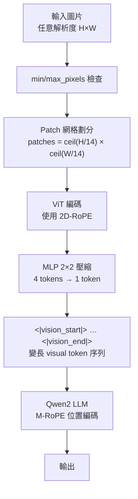
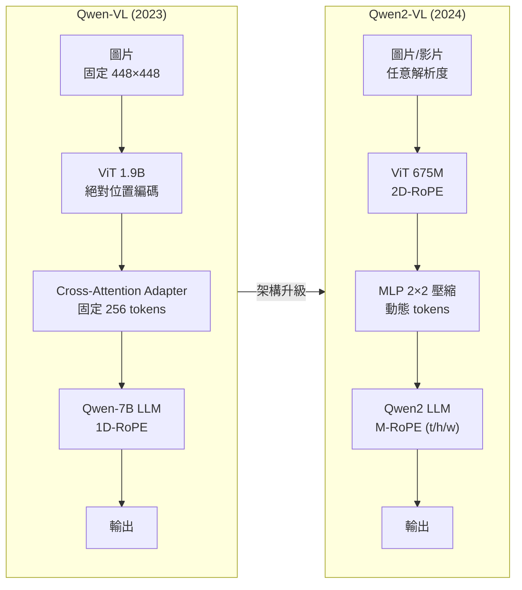

# Qwen2-VL 論文導讀：動態解析度與多模態位置編碼

當我們讓一個視覺語言模型「看見」圖片時，一個看似簡單的問題卻困擾了研究人員許久：應該把圖片縮小到多大的尺寸送進模型？縮太小會丟失細節，縮太大又浪費計算。Qwen2-VL 的回答是：不要縮放，讓模型自己決定。本文深入解讀這背後的核心設計——Naive Dynamic Resolution 和 M-RoPE——以及它們如何將 Qwen-VL 在 DocVQA 上的 65.1 分一舉推升到 96.5 分。

## TL;DR

- Qwen2-VL 是阿里巴巴 Qwen 團隊推出的第二代視覺語言模型（LVLM），是 Qwen-VL 的完整升級，包含 2B、7B、72B 三種規模
- 核心突破有二：**Naive Dynamic Resolution** 讓模型能處理任意解析度的圖片（不再強制縮放到固定尺寸），**M-RoPE** 將 Rotary Position Embedding 分解為 temporal、height、width 三個維度來統一處理文字、圖片、影片的位置資訊
- 72B 版本在多項基準（DocVQA 96.5%、OCRBench 877、Video-MME 77.8）上與 GPT-4o 和 Claude 3.5 Sonnet 相當甚至超越，並在所有規模上開源

---

## 背景與動機

### VLM 的簡史：從 CLIP 到 Qwen-VL

在深入技術細節之前，先簡要回顧 VLM 的技術演進，這有助於理解 Qwen2-VL 所處的位置。

**CLIP（2021）**可以說是現代 VLM 的起點。CLIP 使用 contrastive learning 訓練一個圖片編碼器和一個文字編碼器，讓符合的圖文對在 embedding space 中靠近。但 CLIP 本身不是一個 generative model——它不能根據圖片生成文字描述。

**Flamingo（2022，DeepMind）**是第一個真正能根據圖片生成文字的大規模 VLM。它使用一個「凍結的」預訓練視覺編碼器和一個「凍結的」LLM，透過輕量級的 cross-attention layers（稱為 perceiver resampler）來橋接兩者。Flamingo 展示了 frozen encoder + frozen LLM + 輕量適配器的範式，這一範式影響了後續的許多工作。

**BLIP-2（2023 年 1 月）**引入了 Q-Former——一個輕量級的 transformer，它使用可學習的 query tokens 從凍結的視覺編碼器中提取資訊，然後餵給凍結的 LLM。Q-Former 出色的設計讓 BLIP-2 在參數效率和效能之間取得了極佳的平衡。

**LLaVA（2023 年 4 月）**將這個範式推向了新高度。LLaVA 使用一個簡單的 linear projection layer 作為視覺適配器（而不是 Q-Former 的複雜設計），並首次引入「視覺指令微調」——使用 GPT-4 生成大量（圖片, 問題, 答案）三元組來訓練模型遵循視覺相關的指令。LLaVA-1.5 進一步驗證了簡單架構 + 高質量數據的有效性。

**Qwen-VL（2023 年 8 月）**是阿里巴巴 Qwen 團隊的 VLM 嘗試。與 LLaVA 的簡單 linear projection 不同，Qwen-VL 使用了更複雜的 cross-attention adapter，並引入了三階段訓練管線。Qwen-VL 在視覺定位（visual grounding）和 OCR 上的表現優於當時的同規模模型。Qwen-VL 也是第一個在同一個模型中同時支援圖文理解、定位、文字讀取的開源 VLM。

### 大型視覺語言模型的兩個根本限制

大型語言模型（LLM）在 2020–2023 年間取得了爆炸性的進展，從 GPT-3 到 ChatGPT 再到 GPT-4，模型在文字生成、理解、推理上的能力不斷突破。但一個根本的限制始終存在：**純文字模型只能透過文字來理解世界**。圖片、影片、聲音這些佔據人類感知絕大部分輸入的模態，對 LLM 來說是完全不可見的。

視覺語言模型（Vision-Language Model, VLM）的目標就是打破這個限制。早期的 VLM 如 CLIP（2021）和 Flamingo（2022）展示了視覺與文字表徵對齊的可能性，但它們在複雜的視覺推理任務上能力有限。真正讓 VLM 爆發的轉折點是 2023 年的 BLIP-2 和 LLaVA——後者引入了「視覺指令微調」（visual instruction tuning）的概念，使用 GPT-4 生成的圖文對話數據來訓練模型，使 VLM 不僅能看懂圖片，還能像聊天機器人一樣與人類互動。

Qwen-VL（2023 年 8 月）就是在這個脈絡下誕生的。它基於 Qwen-7B LLM，使用了精心設計的三階段訓練管線和一個 Cross-Attention 視覺适配器，在當時同規模的開源 VLM 中取得了領先成績，特別是在視覺定位（visual grounding）和文件理解上展現了優異的潛力。

### 大型視覺語言模型的兩個根本限制

儘管 Qwen-VL 等第一代 LVLM 取得了顯著進展，它們共享一個根本的架構假設：**輸入圖片必須被縮放到一個固定解析度**。這個假設源自 ViT（Vision Transformer）的設計特性——標準的 ViT 使用可學習的絕對位置編碼（absolute position embeddings），這種編碼需要在訓練時預先指定一個最大序列長度，且無法推廣到不同的輸入尺寸。

典型的做法有兩種：

1. **直接縮放（direct rescaling）**：將圖片強制縮小（或放大）到固定尺寸——常見的設定是 224×224 或 448×448。LLaVA、BLIP-2、早期的 Qwen-VL 都走這條路。

2. **縮放後填補（scale-then-padding）**：先將圖片等比縮放到一個長邊邊長，然後用空白填補到固定的正方形。這種做法保留了長寬比，但會引入無意義的 padding tokens。InternVL、LLaVA-NeXT 等模型採用這種方法。

這兩個策略共享同一個問題：**高解析度的圖片被迫丟失大量細節**。想想一個 4000×3000 的發票掃描檔或一張布滿中文路牌的街景照片，縮小到 448×448 後，小字根本無法辨識。這也是為什麼第一代 LVLM 在 OCR 和文件理解上表現不佳的核心原因——不是模型不夠大，而是資訊在輸入端就已經被壓縮掉了。

第二個限制是**位置編碼的模態孤立（modality isolation）**。大多數 LVLM 對文字和圖片使用不同的位置編碼機制：

- 文字部分：使用 1D-RoPE（Rotary Position Embedding）或絕對位置編碼
- 圖片部分：在 ViT 中使用 2D 絕對位置編碼，或 cross-attention 中的 2D 位置嵌入

當一個模型需要同時處理文字、圖片和影片時（例如回答「這段影片的前三秒，左邊那張圖片裡寫了什麼？」），不同模態之間的位置資訊無法有效對齊。文字 token 的「位置 5」和圖片 token 的「位置 5」處在不同的編碼空間中，模型無法直接比較或對應它們。

### 訓練基礎設施與工程實務

Qwen2-VL 論文的 2.3 節提供了難得的訓練基礎設施細節，這對理解大規模 VLM 訓練的實務挑戰很有幫助。

**儲存架構：圖片與文字分離**

團隊將文本數據和視覺數據的儲存分離：

- **文本數據**存放在 Alibaba Cloud 的 CPFS（Cloud Parallel File Storage）上，使用 mmap 高效存取。文本數據的體積相對較小（以 GB 計），CPFS 的延遲和吞吐量足夠

- **圖片數據**存放在 Alibaba Cloud 的 OSS（Object Storage Service）上。圖片的體積遠大於文本（以 TB 甚至 PB 計），OSS 作為物件儲存更經濟。訓練時透過 OSS 的 Python client 並行存取，並調整了 concurrency 和 retry 參數來避免 QPS（queries per second）限制

**影片解碼的瓶頸**

影片數據的 decoder 是訓練中的一個主要瓶頸，特別是長影片。團隊嘗試了開源方案（FFmpeg）和內部方案都未能解決問題，最終使用了 **caching decoding** 技術：將解碼後的影片幀快取起來，避免重複解碼相同的幀。這個看似簡單的工程優化，在大規模訓練中卻至關重要。

**3D 並行策略**

團隊使用 3D parallelism 來擴展訓練：

1. **Data Parallelism（DP）**：將訓練數據分散到多個 GPU，每個 GPU 持有完整模型副本的拷貝，定期同步梯度
2. **Tensor Parallelism（TP）**：將單個 transformer layer 的參數分散到多個 GPU，每個 GPU 只計算一部分
3. **Pipeline Parallelism（PP）**：將模型的不同層分配到不同的 GPU，形成 pipeline

此外還使用了 ZeRO-1 最佳化器來分片 optimizer states，以及 checkpoint saving 在 CPFS 上保存每個 GPU 的 optimizer 和 model states。

這個基礎設施的描述雖然不是技術論文的核心貢獻，但它提醒我們：一個 72B 參數的 VLM 訓練不僅是架構設計的問題，更是大規模分散式系統工程的問題。

### 從 Qwen-VL 到 Qwen2-VL 的定量進步

用具體的 benchmark 分數來量化兩代模型的進步：

| 基準 | Qwen-VL-7B | Qwen2-VL-7B | 提升 |
|------|-----------|-------------|------|
| DocVQA | 65.1 | 94.5 | **+29.4** |
| TextVQA | 63.8 | 84.3 | **+20.5** |
| ChartQA | 65.7 | 83.0 | **+17.3** |
| RefCOCO val | 89.36 | 91.7 | **+2.3** |
| MMBench-EN | 56.3 (Qwen-VL) | 83.0 | **+26.7** |

DocVQA 的 +29.4 和 TextVQA 的 +20.5 是最驚人的進步——這幾乎全來自動態解析度。需要注意的是這些比較不完全公平，因為 Qwen2-VL-7B 使用了比 Qwen-7B 更強大的 Qwen2-7B 作為 LLM 基礎，且訓練數據大了一個數量級。但即便如此，解析度的影響力在 OCR 相關任務上仍然顯著。

### 與其他開源 VLM 的比較

Qwen2-VL-72B 也超越了當時其他開源 VLM。以 InternVL2-76B（另一個強大的開源 VLM）為比較基準：

| 基準 | InternVL2-76B | Qwen2-VL-72B | 對比 |
|------|--------------|-------------|------|
| DocVQA | 94.1 | **96.5** | Qwen2-VL 勝 |
| ChartQA | 88.4 | **88.3** | 接近 |
| MMBench-EN | 86.5 | **86.5** | 平手 |
| RealWorldQA | 72.2 | **77.8** | Qwen2-VL 勝 |
| OCRBench | 852 | **877** | Qwen2-VL 勝 |
| MME sum | 2414.7 | **2482.7** | Qwen2-VL 勝 |

Qwen2-VL 在多數基準上領先，特別是在 OCR 和 RealWorldQA 這類依賴高解析度感知的任務上差距明顯。

Qwen-VL 在 2023 年 8 月推出時，在 9.6B 參數的規模上取得了令人印象深刻的結果——DocVQA 65.1、TextVQA 63.8、RefCOCO val 89.36。但團隊觀察到兩個明確的進步方向：

第一，**解析度是 VLM 能力的瓶頸**。Qwen-VL 的 448×448 輸入解析度對細粒度任務（OCR、文件理解、小物體辨識）來說遠遠不夠。文獻中已有初步嘗試：Monkey（2023 年 11 月）透過滑動視窗的方式處理高解析度圖片，但這種方法的計算效率較低。

第二，**固定數量的 visual tokens 限制了模型在不同圖片間的效率**。Qwen-VL 為所有圖片產生固定 256 個 visual tokens——簡單圖片（如純色背景的單一物體）浪費了 tokens，複雜圖片（如密集文字的文件）又不夠用。理想的設計應該讓視覺編碼器根據圖片的實際內容動態決定 token 數量。

這兩個驅動力決定了 Qwen2-VL 的核心設計方向。

---

## 核心知識點

本章依序展開 Qwen2-VL 的六個核心知識點。這些概念彼此關聯：Naive Dynamic Resolution（§1）和 M-RoPE（§2）是架構層面的兩個核心設計；三階段訓練管線（§3）和統一圖像/影片處理（§4）是訓練和資料層面的設計；LVLM 規模法則（§5）和 VL-Agent 能力（§6）則是實驗驗證和應用層面的貢獻。

### 1. Naive Dynamic Resolution：從固定到動態

**Naive Dynamic Resolution** 是 Qwen2-VL 最根本的架構變革，也是它與 Qwen-VL 最關鍵的差異。核心想法非常直接：不再將所有圖片縮放到固定尺寸，而是讓 ViT 能接受**任意解析度的輸入**，並動態決定產出多少 visual tokens。

#### 技術挑戰：絕對位置編碼的剛性

要實現動態解析度，第一個要解決的技術問題是 ViT 的位置編碼。標準 ViT 使用可學習的**絕對位置編碼**——這是一個形狀為 (max_seq_len, d) 的 embedding table，每個位置對應一個獨立的學習向量。訓練完成後，位置 0、位置 1、...、位置 N 各自對應到特定的 embedding。

這種設計有兩個限制：

1. **固定的最大序列長度**：ViT 無法處理超過 max_seq_len 的輸入。對一個固定 patch 大小為 14×14 的 ViT，如果最大支援 448×448 的輸入（32×32 patches = 1024 tokens），就無法處理 600×600 的圖片。

2. **無法泛化到未見過的位置**：即使對未見過的位置進行插值（interpolation），效能也會下降，因為位置 embedding 是在訓練數據的分佈上學習的。

Qwen2-VL 的解法是將 ViT 中的絕對位置編碼移除，改用 **2D-RoPE**（二維旋轉位置編碼）來編碼圖片的二維位置資訊。RoPE 是一種相對位置編碼——它不為每個位置學習一個獨立的向量，而是在注意力計算中透過旋轉矩陣來編碼位置之間的相對距離。

#### 2D-RoPE 的數學直覺

2D-RoPE 是標準 1D-RoPE 在二維空間的推廣。對於一個在圖片的 (row, col) 網格位置上的 patch token，我們有兩個位置索引：row 和 col。2D-RoPE 的思路是對 query 和 key 向量的不同維度分別應用 row 和 col 的旋轉：

給定一個 query 向量 $q = [q_1, q_2, ..., q_d]$，我們將其分割為兩半：$q^{row} = [q_1, ..., q_{d/2}]$ 和 $q^{col} = [q_{d/2+1}, ..., q_d]$。然後對 $q^{row}$ 應用 row 位置的旋轉，對 $q^{col}$ 應用 col 位置的旋轉：

$$
f_{\text{2D-RoPE}}(q, row, col) = [R_{row} \cdot q^{row}, R_{col} \cdot q^{col}]
$$

其中 $R_{row}$ 和 $R_{col}$ 是標準的旋轉矩陣：

$$
R_{pos} = \begin{pmatrix} \cos(pos\theta_1) & -\sin(pos\theta_1) & 0 & \cdots & 0 \\ \sin(pos\theta_1) & \cos(pos\theta_1) & 0 & \cdots & 0 \\ 0 & 0 & \cos(pos\theta_2) & -\sin(pos\theta_2) \\ 0 & 0 & \sin(pos\theta_2) & \cos(pos\theta_2) \\ \vdots & \vdots & \vdots & \vdots & \ddots \end{pmatrix}
$$

這種設計的關鍵屬性是：位置 (row₁, col₁) 和 (row₂, col₂) 之間的注意力分數只依賴於它們的**相對位置差** $(Δrow = row₁ - row₂, Δcol = col₁ - col₂)$，而不是絕對位置。這使得 ViT 可以處理任意尺寸的輸入，因為位置編碼是根據 token 的座標即時計算的。

#### 處理流程詳解

具體的動態解析度處理流程如下：

1. **圖片輸入**：模型接受任意解析度的輸入圖片

2. **解析度調整**：根據 min_pixels 和 max_pixels 參數決定是否調整解析度。設 `min_pixels = 100 × 28 × 28 = 78400`，`max_pixels = 16384 × 28 × 28 = 12,845,056`。如果圖片像素總數超出 max_pixels，會縮小到上限內；如果未達 min_pixels，則放大到下限以上

3. **Patch 網格劃分**：將圖片劃分為固定大小（14×14 或 28×28）的 patches。解析度為 $H \times W$ 的圖片會產生 $\lceil H/14 \rceil \times \lceil W/14 \rceil$ 個 patches

4. **ViT 編碼**：所有 patches 連同它們的 2D 座標（row, col）一起餵給使用 2D-RoPE 的 ViT。ViT 輸出每個 patch 的 embedding

5. **Token 壓縮**：一個簡單的 MLP 層將相鄰的 2×2 tokens 合併壓縮為 1 個 token。這一步是為了減少序列長度——如果沒有壓縮，一張 4K 圖片的 patches 數量可能達到數萬個，超出 LLM 的 context window

6. **邊界標記**：用 `<|vision_start|>` 和 `<|vision_end|>` 特殊 token 標記壓縮後的 visual tokens 序列的起迄位置



#### 消融實驗解讀

動態解析度在 Qwen2-VL 論文中的消融實驗（Table 7）非常具有啟發性。研究者比較了固定 token 數量與動態策略在不同基準上的表現：

| 策略 | 平均 visual tokens | InfoVQA | RealWorldQA | OCRBench | MMMU |
|------|-------------------|---------|-------------|----------|------|
| 固定 64 tokens | 64 | 28.85 | 56.47 | 572 | 53.33 |
| 固定 576 tokens | 576 | 65.72 | 65.88 | 828 | 52.78 |
| 固定 1600 tokens | 1600 | 74.99 | 69.54 | 824 | 52.89 |
| 固定 3136 tokens | 3136 | 77.27 | 70.59 | 786 | 53.44 |
| **動態解析度** | **1924** | **75.89** | **70.07** | **866** | **53.44** |

幾個關鍵觀察：

- **OCRBench** 是最能體現動態解析度價值的基準。固定 64 tokens 時只有 572 分，固定 576 tokens 時跳到 828。但值得注意的是，固定 3136 tokens 時**反而下降到 786**——這不是因為模型變差了，而是固定策略下，所有圖片都被強制壓縮或放大到統一的 token 數量，破壞了原始圖片的解析度結構。動態策略在平均 1924 tokens 下達到 866 分，比固定策略的最高點（828）還高出 38 分。

- **InfoVQA** 從固定 64 到 3136 持續改善（28.85 → 77.27），動態策略的 75.89 接近固定 3136 的水準，但只用了約 60% 的 tokens。這顯示對文件理解來說，token 數量越多越好，但動態分配比均勻分配更有效率。

- **MMMU** 幾乎不受解析度影響（53.33–53.44），這符合預期——MMMU 測試的是多模態理解與推理能力，對圖片細節的要求不像 OCR 那麼高。

- **RealWorldQA** 呈現遞增趨勢但幅度較小（56.47 → 70.59），動態策略達到 70.07。這個基準的圖片內容多樣，但不需要極高解析度來回答問題。

總的來說，消融實驗證明了動態解析度的核心論點：**token 的分配應該由圖片的內容和解析度決定，而不是由一個預先設定的數字決定**。這使得模型在需要時可以使用更多 tokens（高解析度 OCR），不需要時可以更節約（低解析度、簡單場景）。

### 2. M-RoPE：多模態旋轉位置編碼

M-RoPE 是 Qwen2-VL 第二個核心創新。它的出發點是：在同一個模型中處理文字、圖片、影片時，它們各自需要不同的位置編碼方式。但如果把它們全部用同一套位置編碼（例如 1D-RoPE）處理會損失重要的結構資訊；完全分開處理又無法讓模型理解跨模態的空間對應關係。

#### 從 1D-RoPE 到 3D-RoPE

標準的 1D-RoPE 對一個序列中的第 $i$ 個 token，將 query/key 向量 $q$ 的每一對相鄰維度 $(q_{2k}, q_{2k+1})$ 旋轉 $i\theta_k$ 弧度：

$$
f_{\text{1D-RoPE}}(q, i) = R_i \cdot q
$$

其中 $R_i$ 是對角線塊狀旋轉矩陣，每個塊為：

$$
\begin{pmatrix} \cos(i\theta_k) & -\sin(i\theta_k) \\ \sin(i\theta_k) & \cos(i\theta_k) \end{pmatrix}
$$

M-RoPE 將這個概念推廣到三個維度。它將 query/key 向量 $q \in \mathbb{R}^d$ 分割為三個部分：

- $q^t \in \mathbb{R}^{d/3}$：temporal（時間）分量
- $q^h \in \mathbb{R}^{d/3}$：height（高度）分量  
- $q^w \in \mathbb{R}^{d/3}$：width（寬度）分量

然後對每個分量應用各自的旋轉：

$$
f_{\text{M-RoPE}}(q, t, h, w) = [R_t \cdot q^t, R_h \cdot q^h, R_w \cdot q^w]
$$

但 $(t, h, w)$ 的值如何決定？這取決於模態：

#### 不同模態的 Position ID 分配

**文字（Text）**：對文字 token 來說，序列本質上是一維的。M-RoPE 設定 $t = h = w = pos$，三個分量使用完全相同的 position ID。這使得 M-RoPE 在純文字輸入時等價於標準的 1D-RoPE：

$$
f_{\text{M-RoPE}}(q, pos, pos, pos) = [R_{pos} \cdot q^t, R_{pos} \cdot q^h, R_{pos} \cdot q^w]
$$

這是一個重要的設計考量——它確保了與既有 LLM 的 backward compatibility。Qwen2 原本使用 1D-RoPE，升級到 M-RoPE 後，純文字的 forward pass 輸出保持不變。

**圖片（Image）**：對圖片的 visual token 來說，temporal 維度是無意義的（一張圖片是一個靜態快照），所以 temporal 分量固定為常數（例如 $t = 0$）。height 和 width 則根據 token 在圖片 patch 網格中的位置分別分配：

$$
t = 0, \quad h = \text{row}, \quad w = \text{col}
$$

位置 (row=3, col=5) 的 visual token 會得到 $h=3, w=5$。這讓 M-RoPE 能夠編碼圖片的二維空間結構——兩個分別位於左上角和右下角的 token，即使它們的序列索引相差很大，也可以透過 $h$ 和 $w$ 的差異知道彼此的空間關係。

**影片（Video）**：影片被視為連續幀的序列。temporal 分量每幀遞增，height 和 width 在單幀內的分配與圖片完全一致：

對於第 $f$ 幀、位置 (row, col) 的 visual token：

$$
t = f, \quad h = \text{row}, \quad w = \text{col}
$$

這種設計的優雅之處在於，模型可以透過 $(t, h, w)$ 三元組精確定位「第幾幀的哪個位置」。要對比第一幀和最後一幀的同一區域，只需要比較 $t$ 分量不同而 $h, w$ 分量相同的 tokens。

**跨模態編號（Cross-modal numbering）**：當模型的輸入包含多種模態時（例如一段文字描述 + 一張圖片 + 一段影片），每種模態的 position numbering 從前一模態的最大 position ID +1 開始初始化：

```
文字 tokens:  position IDs 0, 1, 2, ..., 99
圖片 tokens:  position IDs 從 100 開始
影片 tokens:  從 100 + N_image 開始
```

這樣確保了整個跨模態序列的 position IDs 是單調遞增且有序的，LLM 可以將不同模態視為一個統一的 token 序列來處理。

#### M-RoPE 的優勢分析

與替代方案相比，M-RoPE 有幾個關鍵優勢：

1. **統一的編碼框架**：不需要為文字、圖片、影片分別設計不同的位置編碼器。一個框架處理所有模態，參數共享且編碼空間一致。

2. **降低圖/影片的 position ID 範圍**：由於圖片的 temporal 分量固定為 0，影片的 temporal 分量從 0 開始遞增，圖片和影片實際使用的 position ID 值遠小於序列長度。這意味著 LLM 可以在相同的 position ID budget 內處理更長的跨模態序列——這是長度外推（length extrapolation）的一個重要優勢。

3. **與 1D-RoPE 完全相容**：純文字場景下 M-RoPE = 1D-RoPE，不需要修改已有的文字訓練數據或 checkpoint。

#### 消融實驗

M-RoPE 與 1D-RoPE 的消融比較（Table 8）：

| 位置編碼 | MathVista | MMBench | MMStar | RealWorldQA | DocVQA | ChartQA | InfoVQA | TextVQA | PerceptionTest | NextQA | STAR |
|---------|-----------|---------|--------|-------------|--------|---------|---------|---------|----------------|--------|------|
| 1D-RoPE | 39.2 | 58.6 | 36.7 | 54.5 | 82.5 | 68.0 | 50.8 | 71.3 | 46.6 | 43.9 | 55.5 |
| M-RoPE | 43.4 | 60.6 | 36.7 | 53.7 | 82.8 | 68.4 | 50.3 | 71.8 | 47.4 | 46.0 | 57.9 |

M-RoPE 在影片相關的基準（PerceptionTest +0.8、NextQA +2.1、STAR +2.4）和部分數學/圖表任務（MathVista +4.2、ChartQA +0.4）上有穩定提升。這個結果符合預期：M-RoPE 的 temporal 維度對動態內容的編碼優於 1D-RoPE，而 2D 空間維度對圖表等結構化圖片的理解也有幫助。

### 3. 三階段訓練管線

Qwen2-VL 繼承了 Qwen-VL 的三階段訓練框架，但規模和數據量有顯著提升。

#### Stage 1：基礎預訓練（~1.4T tokens）

這個階段的目標是讓模型建立基本的圖文關聯能力——理解「一張貓的圖片」和「貓」這個詞是對應的。

訓練數據包括大量來自網路的弱標註圖文對：LAION、DataComp、COYO 以及內部收集的數據。Qwen-VL 的第一階段使用了約 1.5B 個圖文對，Qwen2-VL 將其擴充為約 1.4T tokens（含圖片和文字 token，但只對文字 token 計算 loss）。

在這個階段，**ViT 和 adapter 被訓練，LLM 被凍結**。訓練目標是標準的 text token cross-entropy：

$$
\mathcal{L} = -\sum_{t} \log P(y_t | y_{<t}, \text{image})
$$

輸入圖片在第一階段使用較低的解析度（Qwen-VL 為 224×224，Qwen2-VL 動態解析度但設定了較低的 min_pixels 上限），主要學習粗粒度的圖文對齊。

#### Stage 2：多任務預訓練（額外 800B tokens）

這個階段**解鎖了 LLM**，讓整個模型一起訓練。輸入解析度提升（Qwen-VL 到 448×448，Qwen2-VL 使用完整的動態解析度範圍）。

數據類型大幅擴充，包括但不限於以下任務：

| 任務類別 | 樣本數 | 數據來源 |
|---------|--------|---------|
| Captioning | ~19.7M | LAION, DataComp, COCO Caption, SBU |
| Visual QA | ~3.6M | GQA, VQAv2, DocVQA, TextVQA, ChartQA, AI2D |
| Grounding | ~3.5M | GRIT（粗粒度定位） |
| Referring Grounding | ~8.7M | GRIT, Visual Genome, RefCOCO, RefCOCO+, RefCOCOg |
| Grounded Caption | ~8.7M | GRIT, Visual Genome |
| OCR | ~24.8M | SynthDoG（中英文）, Common Crawl PDF/HTML |
| 純文字 | ~7.8M | 內部數據 |

OCR 數據的高比例（24.8M 樣本）值得注意——Qwen2-VL 的 OCR 強勁表現直接源自這階段的訓練設計。

#### Stage 3：監督微調

對預訓練後的模型進行指令微調，目標是將預訓練模型的廣泛能力轉化為有用的對話體驗。與 Qwen-VL 類似，這個階段的指令數據包括人工註釋、模型生成的對話數據、以及策略性拼接的多輪對話數據。

微調後的模型（QWen2-VL-Chat 或直接稱為 Qwen2-VL）展現了優異的指令遵循能力，能夠在不犧牲預訓練階段獲得的視覺理解能力的情況下，進行自然的多輪圖文對話。

### 4. 統一圖像與影片處理

Qwen2-VL 一個被低估的貢獻是它**統一了圖像和影片的處理範式**。在 M-RoPE 的架構下，影片被視為「temporal 維度遞增的連續圖片幀」——完全不需要為影片設計額外的編碼器或模組。

#### 影片處理的具體流程

1. **幀取樣**：以 2 FPS（frames per second）的頻率從影片中均勻取樣。對一部 30 秒的短片來說，這會產生約 60 幀；對一部 30 分鐘的長片來說，約 3600 幀

2. **幀編碼**：每一幀作為獨立圖片，通過 ViT（使用 2D-RoPE）編碼為 visual tokens

3. **序列化**：所有幀的 visual tokens 串聯成一個長序列，順序為 frame 0 → frame 1 → ... → frame N

4. **M-RoPE 位置編碼**：在 LLM 中，
   - 第 $f$ 幀第 $(r, c)$ 位置的 token 獲得 $(t=f, h=r, w=c)$ 的三元組
   - 這使得模型能同時理解「時間上發生在第幾幀」和「空間上在畫面中的哪個位置」

5. **處理與推理**：序列整體餵給 LLM，由 LLM 的注意力機制進行時空推理

#### 為什麼混合訓練的效果好

混合訓練（同時使用圖像和影片數據訓練）的優勢在於：

- **圖片理解幫助影片理解**：模型從圖像數據學到的物體辨識、場景理解、OCR 能力可以直接應用到影片的每一幀
- **影片理解反哺圖片理解**：影片中的運動資訊和時間動態幫助模型理解圖片中的靜態場景——例如「一輛正在過馬路的車」和「一輛停在路邊的車」的區別
- **同步提升而非取捨**：Table 10 的數據顯示，Qwen2-VL 在影片基準上顯著超越僅使用圖像訓練的模型，同時在圖片基準上沒有明顯退化

### 5. LVLM 規模法則（Scaling Laws）

Qwen2-VL 的一個重要實驗貢獻是系統性地探討了 LVLM 的 scaling laws——模型大小和訓練數據規模如何影響各項能力。

#### 三個規模的設計

| 模型 | ViT 參數 | LLM 參數 | 總參數 | 定位 |
|------|---------|---------|--------|------|
| Qwen2-VL-2B | 675M | 1.5B | ≈ 2.2B | 邊緣裝置（on-device） |
| Qwen2-VL-7B | 675M | 7.6B | ≈ 8.3B | 成本與性能的最佳平衡 |
| Qwen2-VL-72B | 675M | 72B | ≈ 72.7B | 最強能力，複雜任務 |

一個值得注意的設計選擇是 ViT 參數固定為 675M，沒有在三個規模間擴增。這與 Qwen-VL 的作法不同——Qwen-VL 使用了 1.9B 的 ViT。Qwen2-VL 的 ViT 只有 Qwen-VL 的約三分之一。

這個交換的直覺是：對 VLM 來說，LLM 的容量是決定性因素——更高階的推理需要更大的 LLM；而 ViT 的角色更像是一個「足夠好的視覺感知器」，只要它能保留足夠多的視覺資訊，把推理的責任交給 LLM 是更有效率的設計。675M 的 ViT 搭配 2D-RoPE 的動態解析度，能夠勝任這個角色。

#### Scaling 的觀察結果

論文 Figure 6 展示了三項關鍵觀察：

**觀察 1：數學推理強烈依賴模型大小**

在 MathVista 和 MMMU 上，從 7B 到 72B 的提升幅度遠大於其他任務類別。例如 MMMU 從 7B 的 54.1 提升到 72B 的 64.5，增幅超過 19%。這暗示高階的邏輯推理能力需要 LLM 本身具備足夠的參數容量，僅靠 ViT 的視覺感知提升是不夠的。

**觀察 2：OCR 對模型大小相對不敏感**

2B 模型在 OCRBench 上已經有 809 分（最大可能值為 1000），7B 跳到 866，72B 達到 877。2B 到 72B 的提升只有 68 分，幅度遠小於 MMMU 的提升。這說明動態解析度本身對 OCR 的幫助遠大於模型大小——一旦模型有了足夠的像素細節來辨識文字，更多的參數對 OCR 的邊際效益遞減很快。

**觀察 3：持續的 scaling 效益**

隨著 Stage 2 的訓練 tokens 數量增加（從 0 到 800B），絕大部分任務都持續改善，沒有觀察到明顯的飽和現象。這是一個正面信號——LVLM 的 scaling laws 可能與 LLM 類似，至少在 800B tokens 這個規模上還沒有達到報酬遞減的臨界點。但值得注意的是，VQA 任務的波動比其他任務大，可能因為 VQA 數據的質量和多樣性對結果的影響比純粹的數據量更大。

### 6. VL-Agent 能力

Qwen2-VL 引入了一個在 Qwen-VL 中不存在的新面向：**視覺 Agent（VL-Agent）**。這使得模型不僅能被動地回答關於圖片的問題，還能主動與環境互動、執行多步驟動作。

#### 設計原理

VL-Agent 的核心是將各種 agent 任務（UI 操作、機器人控制、卡牌遊戲、視覺導航）統一視為**序列決策問題**（sequential decision-making problem）：

```
觀察（Observation）→ 推理（Reasoning）→ 動作（Action）→ 新觀察（New Observation）→ ...
```

具體實作上，Qwen2-VL 依賴兩個元件：

1. **Qwen-Agent 框架**：提供動作定義、工具整合、執行環境管理等基礎設施
2. **32K context length**：保留過去多輪的（觀察, 動作）歷史，使模型能持續追蹤任務狀態

對每個任務，首先定義一組允許的動作（actions）和關鍵字模式（keyword patterns）。例如對手機 UI 操作任務，動作為 tap、input、swipe 等；對機器人控制任務，動作為移動、抓取、放置等。Qwen2-VL 透過 function calling 的方式呼叫這些動作。

#### 評估結果

Function Calling 場景：

| 指標 | GPT-4o | Qwen2-VL-72B |
|------|--------|-------------|
| Type Match | 90.2 | **93.1** |
| Exact Match | 50.0 | **53.2** |

UI 操作（AITZ）：

| 指標 | Previous SOTA | GPT-4o | Qwen2-VL-72B |
|------|--------------|--------|-------------|
| Type Match | 83.0 (CogAgent) | 70.0 | **89.6** |
| Exact Match | 47.7 | 35.3 | **72.1** |

卡牌遊戲（Number Line）：

| 指標 | Previous SOTA | GPT-4o | Qwen2-VL-72B |
|------|--------------|--------|-------------|
| Success Rate | 89.4 | 91.5 | **100.0** |

Qwen2-VL-72B 在 UI 操作上大幅超越 GPT-4o（Type Match 89.6 vs 70.0）。論文認為主因有二：GPT-4o 在不確定時傾向於不使用外部工具（保守策略），以及 Qwen2-VL 的中文 OCR 能力更強（AITZ 數據包含大量中文 UI 元素）。

---

## 從 Qwen-VL 到 Qwen2-VL 的演進脈絡

### Qwen-VL 的架構設計

Qwen-VL 的架構反映了 2023 年 VLM 設計的主流：一個強大的預訓練 ViT + 一個視覺 adapter + 一個 LLM。

#### 視覺編碼器

Qwen-VL 使用 OpenCLIP 的 ViT-bigG 作為視覺編碼器（約 1.9B 參數）。輸入圖片先被縮放到 224×224（Stage 1）或 448×448（Stage 2+），然後通過 ViT 編碼為圖像特徵序列。

#### 視覺 Adapter（Cross-Attention）

ViT 輸出的特徵序列通過一個 cross-attention 層與一組可學習的 query tokens 交互，壓縮為固定 256 個 visual tokens。為了保留精細位置資訊，cross-attention 的 query-key pairs 中加入了 2D 絕對位置編碼。

這個 adapter 的參數只有 80M——不到總參數的 1%——但它是整個 VLM 中最重要的元件之一，因為它決定了視覺資訊如何傳遞給 LLM。

#### LLM

使用 Qwen-7B（7.7B 參數），內部使用 1D-RoPE 作為位置編碼。

#### 訓練管線

三階段訓練：

1. Stage 1：ViT + adapter 訓練（LLM 凍結），224×224，50K steps，batch size 30720，1.5B 圖文對
2. Stage 2：全模型訓練，448×448，多任務數據（captioning、VQA、grounding、OCR、純文字）
3. Stage 3：指令微調 → Qwen-VL-Chat

### Qwen2-VL 的結構性突破



關鍵的架構差異有四：

1. **ViT 大小與位置編碼**：Qwen-VL 使用 1.9B 的 ViT 和絕對位置編碼。Qwen2-VL 的 ViT 縮小到 675M（約三分之一），但改用 2D-RoPE 後獲得了動態解析度的能力。這是精心計算的交換：更小的 ViT 意味著更少的計算量；更多樣的解析度意味著模型可以接觸到更豐富的視覺資訊。

2. **Adapter 設計**：Qwen-VL 用 cross-attention adapter（80M 參數）壓縮到固定 256 tokens。Qwen2-VL 用一個簡單的 MLP 層將 2×2 tokens 壓縮為 1 token——更簡單、參數更少、且輸出長度不再固定。這個簡化的設計反映了一個洞察：在 ViT 足夠靈活的情況下，不需要複雜的 adapter 來橋接視覺和語言空間。

3. **位置編碼系統**：Qwen-VL 對 ViT 使用 2D 絕對位置編碼（在 cross-attention 中），對 LLM 使用 1D-RoPE。Qwen2-VL 統一成 2D-RoPE（ViT）+ M-RoPE（LLM），兩個編碼層級互相配合——ViT 的 2D-RoPE 負責圖內空間編碼，M-RoPE 負責跨模態、跨時間的統一位置編碼。

4. **LLM 基礎**：從 Qwen-7B 升級到 Qwen2 系列（2B/7.6B/72B）。Qwen2 本身在長上下文、推理能力、指令遵循等方面比 Qwen-7B 有顯著進步——Qwen2-VL 的 VL-Agent 能力很大程度上得益於 Qwen2 的 function calling 和長上下文能力。

### 為什麼 Qwen-VL 的設計不足以滿足需求

Qwen-VL 在 2023 年 8 月時是一個領先的 VLM，但它的固定解析度和固定 token 數量的設計在面對真實世界的多樣圖片時顯示了明顯的不足：

以一個實際的例子來說明。假設我們有一張 4000×3000 的發票掃描檔，上面有 20 行細項，每行 10 個中文字，還有一些數字和小數點。Qwen-VL 會將它縮小到 448×448，然後編碼為 256 個 visual tokens。在這過程中，每個中文字被壓縮到大約 0.5 個像素，根本無法辨識。這也是為什麼 Qwen-VL 在 DocVQA 上只有 65.1——它能應付大標題和粗體文字，但對細小文字幾乎無能為力。

Qwen2-VL 的動態解析度則可以保留這張發票的原始解析度（或根據 max_pixels 縮小到可控範圍），每個 patch 對應到足夠的像素來辨識文字。DocVQA 從 65.1 提升到 94.5（7B 版本）— 足足 29.4 個百分點 — 這不是因為模型更大了，而是因為模型終於「看見」了文字。

---

## 實驗結果與比較

### 靜態圖像理解

Qwen2-VL-72B 在多個通用 VQA 基準上展現了極具競爭力的表現，與 GPT-4o 和 Claude 3.5 Sonnet 並駕齊驅：

| 基準 | GPT-4o | Claude 3.5 Sonnet | Qwen2-VL-72B | Qwen2-VL-7B | Qwen2-VL-2B |
|------|--------|-------------------|-------------|-------------|-------------|
| MMMU (val) | 69.1 | 68.3 | 64.5 | 54.1 | 41.1 |
| MME (sum) | 2328.7 | 1920.0 | **2482.7** | 2326.8 | 1872.0 |
| MMBench-EN (test) | 83.4 | 79.7 | **86.5** | 83.0 | 74.9 |
| MMBench-CN (test) | 82.1 | 80.7 | **86.6** | 80.5 | 73.5 |
| MMBench-V1.1 (test) | 82.2 | 78.5 | **85.9** | 80.7 | 72.2 |
| MMStar | 63.9 | 62.2 | **68.3** | 60.7 | 48.0 |
| MMT-Bench (test) | 65.5 | - | **71.7** | 63.7 | 54.5 |
| RealWorldQA | 75.4 | 60.1 | **77.8** | 70.1 | 62.9 |

在 MMBench 系列（EN、CN、V1.1）、MMStar、MMT-Bench 上，Qwen2-VL-72B 超越了 GPT-4o。MME 總分 2482.7 是該基準上最好的公開結果之一。

MMMU 是值得關注的例外——Qwen2-VL-72B 的 64.5 低於 GPT-4o 的 69.1 和 Claude 3.5 Sonnet 的 68.3。MMMU 測試的是大學程度的跨學科多模態推理（物理、化學、數學、工程等），對模型的綜合推理能力要求極高。這個差距暗示開源模型在深度推理能力上與閉源模型之間仍有差距。

### 文件理解與 OCR

這是 Qwen2-VL 最強勢的領域：

| 基準 | GPT-4o | Claude 3.5 Sonnet | Qwen2-VL-72B | Qwen2-VL-7B | Qwen2-VL-2B |
|------|--------|-------------------|-------------|-------------|-------------|
| DocVQA (test) | 92.8 | 95.2 | **96.5** | 94.5 | 90.1 |
| InfoVQA (test) | - | - | **84.5** | 76.5 | 65.5 |
| ChartQA (test) | 85.7 | 90.8 | **88.3** | 83.0 | 73.5 |
| TextVQA (val) | - | - | **85.5** | 84.3 | 79.7 |
| OCRBench | 736 | 788 | **877** | 866 | 809 |
| MTVQA | 27.8 | 25.7 | **30.9** | 25.6 | 18.1 |

DocVQA 的 96.5 分——超越了所有現有閉源和開源模型——是動態解析度最有力的證明。這個基準要求模型從文件影像中讀取文字並回答問題，對高解析度處理和高精度 OCR 的要求極高。Qwen-VL 在同樣基準上只有 65.1，Qwen2-VL-7B 躍升到 94.5——提升主要來自動態解析度，而非模型規模。

OCRBench 的 877 分（72B）和 866 分（7B）值得仔細分析。7B 模型在 OCR 上幾乎與 72B 一樣好——這呼應了 scaling 分析中的觀察：OCR 對模型大小的依賴性較低。關鍵在於 ViT 能否保留足夠的像素細節來辨識文字。一旦 ViT 能做到了（動態解析度），不同大小的 LLM 都可以理解這些文字。

MTVQA 上的 30.9 分雖然領先所有比較對象（GPT-4o 27.8、Claude 3.5 Sonnet 25.7），但絕對數值仍然偏低。MTVQA 是一個多語言 OCR 基準，包含阿拉伯文、韓文、日文、泰文等多種非英語文字。這說明了多語言文字辨識仍是開放問題——可能的原因是訓練數據中東亞語言以外的多語言 OCR 樣本不足。

### 影片理解

| 基準 | Gemini 1.5 Pro | GPT-4o | Qwen2-VL-72B | Qwen2-VL-7B | Qwen2-VL-2B |
|------|---------------|--------|-------------|-------------|-------------|
| MVBench | - | - | **73.6** | 67.0 | 63.2 |
| PerceptionTest (test) | - | - | **68.0** | 62.3 | 53.9 |
| EgoSchema (test) | 63.2 | 72.2 | **77.9** | 66.7 | 54.9 |
| Video-MME (wo subs) | 75.0 | 71.9 | **71.2** | 63.3 | 55.6 |
| Video-MME (w/ subs) | 81.3 | 77.2 | **77.8** | 69.0 | 60.4 |

在 Video-MME（附字幕）上，Qwen2-VL-72B 的 77.8 分超越了 GPT-4o 的 77.2。EgoSchema（第一人稱視角的影片理解）上，72B 的 77.9 分大幅超越 GPT-4o 的 72.2 和 Previous SOTA 的 62.0。

需要注意的限制：論文提到每部影片最多取 768 幀。對 Video-MME 中長達 1 小時的影片，768 幀相當於約 0.2 FPS 的取樣率——可能錯過重要瞬間。論文將「支援更長序列以改善長影片理解」列為未來工作。

### 視覺 Grounding

Qwen2-VL 在 Referring Expression Comprehension（REC）上達到了通用模型中的頂尖水準：

| 模型 | RefCOCO val | RefCOCO test-A | RefCOCO test-B | RefCOCO+ val | RefCOCOg val |
|------|------------|---------------|---------------|--------------|--------------|
| Qwen-VL-7B | 89.36 | 92.26 | 85.34 | 83.12 | 85.58 |
| Qwen2-VL-7B | 91.7 | 93.6 | 87.3 | 85.8 | 87.3 |
| Qwen2-VL-72B | **93.2** | **95.3** | **90.7** | **90.1** | **89.9** |
| InternVL2-76B | 92.2 | 94.8 | 88.4 | 88.8 | 89.5 |
| CogVLM | 92.8 | 94.8 | 89.0 | 88.7 | 89.8 |

72B 的 RefCOCO test-A 達到了 95.3——對「the man in the red shirt holding an umbrella」這類需要同時理解顏色、空間關係、物體屬性的複雜描述，模型展現了極高的定位精度。

Qwen-VL 到 Qwen2-VL 在 RefCOCO val 上的進步（89.36 → 91.7 → 93.2）有一部分來自動態解析度——高解析度圖片可以保留更多物體的邊緣細節，使定位更精確。

### 消融實驗：動態解析度 vs 固定解析度

除了前面討論的動態解析度消融（Table 7），論文還有一組關於圖片大小的消融（Figure 4）：在固定 min_pixels 的情況下，增加圖片的實際輸入解析度，對感知密集型任務（InfoVQA、HallusionBench、OCRBench）有穩定的效能提升。這再次證明了解析度對細粒度視覺任務的重要性。

### 消融實驗：M-RoPE 的長度外推

論文的 Figure 5 展示了 M-RoPE 在長度外推上的效果。Qwen2-VL-72B 在 Video-MME medium-length videos 上，即使推理長度超過了最大訓練長度（16K tokens），仍能維持穩定的效能。這是 M-RoPE 降低圖/影片 position ID 範圍的直接結果——因為不需要用大數值的 position ID 來標記圖片的空間位置，模型可以在相同的 position ID budget 內處理更長的序列。

---

## 總結、限制與未來方向

### 核心貢獻

Qwen2-VL 是 2024 年最具代表性的開源 VLM 之一。它的兩項核心創新——Naive Dynamic Resolution 和 M-RoPE——解決了 LVLM 長期存在的兩個根本限制，並為後續的 VLM 設計提供了重要的參考方向。

1. **動態解析度**打破了「所有圖片必須強制縮放到固定尺寸」的假設。這不僅是一個工程上的改進，更是對 VLM 設計哲學的重新審視：與其讓圖片去適應模型的輸入格式，不如讓模型的輸入格式去適應圖片。這個看似簡單的想法，對 OCR/文件理解任務帶來了巨大的質的飛躍（DocVQA 96.5、OCRBench 877）。

2. **M-RoPE**提供了一個優雅的統一位置編碼框架。它將 RoPE 的三個維度分配給時間、高度、寬度，讓文字、圖片、影片三種模態可以在同一個編碼空間中表達位置資訊。這不僅簡化了模型設計，更重要的是賦予了模型跨模態位置推理的能力。

3. Qwen2-VL 在 2B、7B、72B 三個規模上的 scaling 實驗，為 LVLM 的未來發展提供了實證基礎：更大的模型和更多的數據仍能帶來穩定的進步，特別是在數學推理和影片理解等困難任務上。

### 已知限制

論文本身提及或可從實驗推斷的限制：

- **長影片支援有限**：每影片最多 768 幀的限制意味著對 1 小時以上的長影片，取樣率可能低於 0.2 FPS，遺漏大量細節。論文將此明確列為未來工作（「Future work will focus on extending Qwen2-VL to support longer sequences」）

- **多語言 OCR 仍有瓶頸**：MTVQA 得分僅 30.9（72B），雖然領先 GPT-4o 和 Claude 3.5 Sonnet，但絕對數值偏低。這指向了訓練數據構建的核心問題——高質量的多語言 OCR 數據仍然稀缺

- **MMMU 與閉源模型的差距**：在綜合推理基準上，72B（64.5）與 GPT-4o（69.1）仍有明顯差距。這可能是訓練數據質量與多樣性的差異，也可能是架構上的限制

- **Agent 評估數據集的公開性**：Visual Agent 的評估數據集是內部構建的，缺乏公開基準，限制了結果的可比較性和可重複性

- **ViT 大小的權衡未充分探討**：固定 ViT 為 675M 是一個設計決策，但论文沒有比較不同 ViT 大小對效能的影響。更大的 ViT（如 Qwen-VL 的 1.9B）在什麼場景下會比 675M 更好？

### 與同時期相關工作的關係

Qwen2-VL 並不是 2024 年唯一一個探索高解析度 VLM 的工作。在同一時期，還有幾個值得關注的相關研究：

**Monkey（2023 年 11 月）**是最早嘗試突破固定解析度限制的工作之一。Monkey 使用滑動視窗方式將高解析度圖片分割成多個重疊的區塊，每個區塊用標準的 ViT 處理，然後用一個額外的 transformer 來聚合所有區塊的資訊。這個方法雖然有效，但計算開銷巨大——每張圖片需要多次 ViT forward pass。

**InternVL2（2024 年 4 月）**使用動態處理策略，將圖片縮放到多個預定義的大小，然後用 ViT 處理，再將所有尺度的 visual tokens 合併。與 Qwen2-VL 的 Naive Dynamic Resolution 不同的是，InternVL2 仍然使用預定義的一組解析度（如 448×448、672×672、896×896），而不是真正的任意解析度。

**LLaVA-NeXT（2024 年 1 月）**也引入了動態解析度支援——它將圖片分割成多個 336×336 的子區塊，每個子區塊分別用 ViT 處理後再合併。這種 any-resolution 的作法與 Qwen2-VL 類似，但實現方式不同：LLaVA-NeXT 的子區塊之間沒有位置編碼的關聯，而 Qwen2-VL 的 2D-RoPE 提供了完整的二維位置感知。

Qwen2-VL 的 Naive Dynamic Resolution 與這些工作的關鍵差異在於：

1. **真正的任意解析度**：不是預定義的一組解析度，而是任何 H×W 的組合
2. **統一的 ViT forward pass**：不需要多次通過 ViT，整張圖片一次處理
3. **無需外部定位模組**：M-RoPE 天然提供跨模態的定位能力，不需要額外的定位 head

這些差異使得 Qwen2-VL 的架構在理論上更簡潔、在實踐上更高效。

### 論文未充分討論的面向

作為一篇學術論文，Qwen2-VL 在某些面向上的討論可以更深入：

**數據構建的細節**：論文雖然描述了訓練數據的類型和數量，但沒有討論數據來源之間的冗餘、數據質量的過濾標準、以及合成數據（SynthDoG 等）的具體生成參數。這些細節對重現和進一步改進至關重要。

**推理成本的定量分析**：動態解析度雖然提升了感知能力，但也帶來了可變的推理成本。論文沒有定量分析在 GPU 上動態解析度 vs 固定解析度的推理延遲和記憶體消耗。

**與純視覺專家的比較**：論文將 Qwen2-VL 與通用 VLM 比較，但沒有與專門設計的 OCR 模型（如 TrOCR、Donut）或專門的 grounding 模型（如 G-DINO）進行公平的比較。這些專家模型在特定任務上可能仍然更勝一籌。

**安全性與偏見評估**：論文沒有報告對模型在安全性、偏見、幻覺等方面的評估。考慮到 Qwen2-VL 的 agent 能力使其可以執行真實世界的操作（UI 操作、機器人控制），這些評估尤為重要。

### 對後續 VLM 設計的啟發

Qwen2-VL 的設計選擇對後續的 VLM 研究提供了幾個重要的參考：

1. **動態解析度已是必備功能**：Qwen2-VL 之後的新 VLM（如 LLaVA-NeXT、InternVL3）幾乎都採用了某種形式的動態解析度。固定解析度的時代已經結束。

2. **ViT 可以更小更靈活**：Qwen2-VL 證明了 675M 的 ViT + 2D-RoPE 可以勝任 72B VLM 的視覺感知任務，打破了「ViT 越大越好」的迷思。後續的 VLM 設計開始探索更輕量的視覺編碼器。

3. **統一的位置編碼是跨模態融合的關鍵**：M-RoPE 證明了一個好的位置編碼設計可以同時簡化架構（不需要額外的 adapter 或定位 head）並提升跨模態理解能力。

4. **VLM Agent 是下一個前沿**：Qwen2-VL 的 Visual Agent 能力雖然還很初步，但它指出了 LVLM 從「被動回答問題」到「主動執行任務」的演進方向。

Qwen2-VL 引入的動態解析度已經成為後續 VLM 的重要設計參考。一些值得關注的開放問題包括：

- **動態解析度的超參數選擇**：min_pixels 和 max_pixels 的選擇對效能影響很大。在什麼場景下應該設定更寬鬆或更嚴格的上限？能否讓模型自動選擇最優解析度？

- **M-RoPE 的時間編碼極限**：M-RoPE 對時間的編碼是線性的（每幀遞增 1）。但真實影片中的時間結構並非總是線性的——跳幀、變速播放、時間倒序的推理需要更豐富的時間編碼。

- **ViT 與 LLM 的最優參數比例**：675M ViT + 72B LLM 是否是最優組合？對不同的任務類別（OCR vs 推理 vs 影片），最優的 ViT/LLM 比例可能不同。

- **開源 VLM 的推理深度**：MMMU 上的差距顯示開源模型在需要多步驟推理的場景上仍落後於閉源模型。這是否因為訓練數據中缺乏高品質的 CoT（Chain-of-Thought）多模態推理數據？

### 總結

Qwen2-VL 代表了開源 VLM 在 2024 年的最高水準之一。它透過兩個關鍵的架構創新——Naive Dynamic Resolution 和 M-RoPE——解決了第一代 LVLM 最根本的限制：固定解析度帶來的感知瓶頸和模態孤立的位置編碼。

從更宏觀的角度來看，Qwen2-VL 的發展軌跡反映了整個 VLM 領域的演進方向：

- **從固定到動態**：模型不再被強迫接受統一格式的輸入，而是能夠適應輸入的多樣性
- **從分離到統一**：不同模態（文字、圖片、影片）不再需要各自獨立的位置編碼系統，而是可以在同一個框架下表達
- **從理解到行動**：VLM 不再只是被動理解視覺輸入的工具，而是可以主動與環境互動、執行序列決策的 Agent

這些方向不僅適用於 VLM，也反映了 AI 模型設計的一個更廣泛的趨勢：讓模型去適應真實世界的多樣性，而不是讓真實世界去適應模型的限制。

如果你對 Qwen2-VL 的實作細節感興趣，原始碼和模型權重都在 GitHub（QwenLM/Qwen2-VL）上開源釋出。推薦進一步閱讀論文原文的 Appendix，裡面有更詳細的超參數設定和更多的實驗結果。

---

> **參考文獻**
>
> 1. Wang et al. *Qwen2-VL: Enhancing Vision-Language Model's Perception of the World at Any Resolution.* arXiv:2409.12191, 2024.
> 2. Bai et al. *Qwen-VL: A Versatile Vision-Language Model for Understanding, Localization, Text Reading, and Beyond.* arXiv:2308.12966, 2023.
>
> ---
>
> *本文由 Hermes Agent 根據論文全文閱讀後撰寫，並經作者審閱。所有技術解讀以論文原文為準，若有理解錯誤歡迎指正。*
