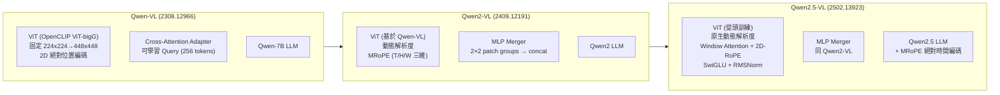
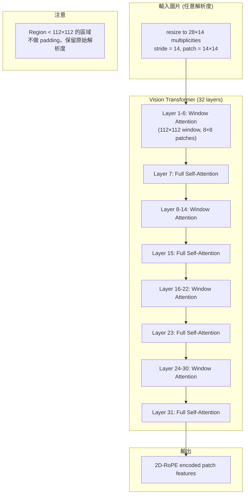
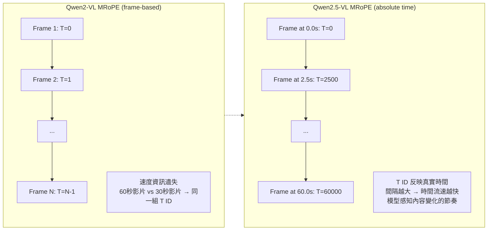
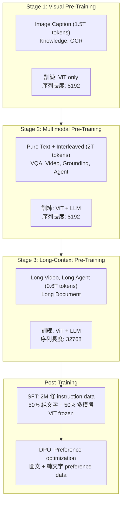

# Qwen2.5-VL: 視覺語言模型的動態解析度革命

> **種子論文**: [Qwen2.5-VL Technical Report](https://arxiv.org/abs/2502.13923) (2025-02)
> **作者**: Shuai Bai, Keqin Chen, Xuejing Liu et al.
> **機構**: Alibaba Group (Qwen Team)

---

## TL;DR

Qwen2.5-VL 是阿里巴巴 Qwen 團隊最新的視覺語言旗艦模型系列，旨在解決現有 VLM 在細粒度視覺感知、動態解析度適應和長影片理解上的瓶頸。它從零重新設計了 Vision Transformer（ViT），引入原生動態解析度與 Window Attention，讓模型能直接處理任意尺寸的圖片而不需縮放，同時將計算複雜度從二次降為線性。在 72B 規模上，Qwen2.5-VL 在多個文檔理解（OCRBench v2 中文領先 20 分）、影片分析（LVBench 領先 GPT-4o 16 分）與 GUI 代理基準上超越 GPT-4o 與 Claude 3.5 Sonnet，而 3B 和 7B 版本也在同級模型中保持領先。

---

## 背景與動機

### VLM 領域的早期範式

大型視覺語言模型（Large Vision-Language Model, LVLM）的發展，大致可以分為三個階段。

**第一階段：固定解析度的編碼器-投影器-LLM 範式。** Flamingo (Alayrac et al., 2022)、BLIP-2 (Li et al., 2023) 和早期的 LLaVA (Liu et al., 2023) 建立了 VLM 的基本架構：一個預訓練的視覺編碼器（通常是 CLIP ViT）、一個跨模態投影器（cross-modal projector），以及一個大型語言模型（LLM）。這個範式的核心限制是——輸入圖片必須被縮放到固定解析度（通常是 224×224 或 336×336），導致高解析度圖片中的微小文字、物體細節大量丟失。

**第二階段：多解析度 patching 與動態縮放。** 為了解決解析度問題，後續工作嘗試了各種方案。LLaVA-NeXT 將圖片分割成網格（grid），每個網格獨立編碼後再拼接。InternLM-XComposer2 採用了更動態的策略，根據圖片長寬比動態決定 patching 方式。這些方法雖然改善了細節保留，但本質上仍是「先 patch 再拼接」，並沒有真正讓模型在原生的解析度上理解圖片。

**第三階段：原生動態解析度。** Qwen2-VL (Wang et al., 2024) 首次在 Qwen 系列的 VLM 中引入了 True Dynamic Resolution 的概念，取消固定圖片輸入尺寸，讓 ViT 直接處理任意長寬比的圖片。Qwen2.5-VL 在此基礎上做了根本性的架構改造——從零訓練一個原生支援動態解析度的 ViT，並引入 Window Attention 解決計算效率問題。

### 為什麼要從零訓練 ViT？

傳統 VLM 的視覺編碼器通常繼承自 CLIP（Contrastive Language-Image Pre-training）的 ViT 權重。CLIP ViT 的設計目標是圖文對齊，其固定解析度（224×224）在 VLM 場景中成為瓶頸。

從 2023 年到 2025 年，VLM 領域的一個核心爭論是：**視覺編碼器到底應該保持固定解析度（追求效率），還是應該擁抱動態解析度（追求細節）**？前者以 LLaVA 系列為代表，後者以 Qwen-VL、InternVL 系列為代表。Qwen2.5-VL 給出了最激進的答案：不僅要動態解析度，還要從頭設計一個專為動態解析度而生的 ViT，完全不受 CLIP 固定解析度設計的約束。

這個選擇的風險很明確：CLIP 經過了數十億圖文對的預訓練，其 Visual-Semantic 對齊能力已經被充分驗證。從零訓練意味著需要投入大量計算資源來重建這個對齊能力。但回報也很明確：不受 CLIP 固定解析度的設計約束，可以自由地整合 Window Attention、2D-RoPE、SwiGLU 等最新技術。從最終的實驗結果來看，這個賭注成功了。

Qwen2.5-VL 團隊做了這個大膽的選擇——放棄沿用 CLIP ViT，而是從 DataComp 資料集和內部資料從頭訓練一個全新的 ViT。這個 ViT 在架構層面上做了三項關鍵設計：

1. **2D Rotary Position Embedding（2D-RoPE）**：取代傳統的絕對位置編碼或 1D RoPE，讓 ViT 能直接感知 2D 空間中的位置關係
2. **Window Attention**：大部分層使用局部 window attention，僅少數層保留 full self-attention，將計算複雜度從 $O(N^2)$ 降至 $O(N)$
3. **SwiGLU 激活函數與 RMSNorm**：跟隨 LLM 的設計趨勢，提升訓練穩定性與效率

### 從 Qwen-VL 到 Qwen2.5-VL 的架構演進



> **圖 1**：Qwen 系列 VLM 的架構演進。從固定解析度到動態解析度，從 cross-attention adapter 到 MLP merger，從普通 RoPE 到三維 MRoPE 再到絕對時間編碼。

---

## 核心知識點

本文圍繞以下知識點展開：

1. **ViT 架構改造：Window Attention + 2D-RoPE**——如何重新設計 ViT 以支援原生動態解析度
2. **Native Dynamic Resolution（原生動態解析度）**——讓模型直接處理任意尺寸的圖片，無需標準化縮放
3. **MRoPE 與 Absolute Time Encoding**——位置編碼如何從 1D 擴展到三維，並新增絕對時間感知能力
4. **Dynamic FPS Sampling**——動態幀率取樣，讓影片理解能處理不同速度的內容變化
5. **訓練管線與資料擴增**——從 1.2T 擴展到 4.1T tokens 的三階段預訓練策略
6. **Post-Training：SFT + Rejection Sampling + DPO**——監督微調、拒絕取樣與偏好優化的雙階段對齊
7. **Document Omni-Parsing**——文檔全功能解析與 QwenVL HTML Format 的設計
8. **Agent 能力**——GUI 元素定位與電腦/手機裝置操作

---

## 方法詳解

### 知識點 0：從 Qwen-VL 到 Qwen2.5-VL 的架構演進全景

**這個知識點要回答什麼問題？**

要理解 Qwen2.5-VL 的設計，首先得理解它從哪裡來。Qwen 系列的 VLM 走過了三代演進：Qwen-VL（2023 年 8 月）→ Qwen2-VL（2024 年 9 月）→ Qwen2.5-VL（2025 年 2 月）。每一代都在前一代的基礎上做了關鍵性的架構升級。

**Qwen-VL (2308.12966) 的原始設計：**

Qwen-VL 的架構由三個組件構成：

1. **Visual Encoder**：使用 OpenCLIP 的 ViT-bigG 預訓練權重初始化。輸入解析度固定為 224×224（stage 1），到 stage 2 提升至 448×448
2. **Position-aware Vision-Language Adapter**：這是一個單層 cross-attention 模組，使用 256 個可學習的 query vectors 從 ViT 輸出的 feature sequence 中提取資訊，輸出固定長度 256 的視覺特徵序列。在 cross-attention 的 query-key 對中加入了二維絕對位置編碼以保留空間資訊
3. **Large Language Model**：使用 Qwen-7B 作為語言基底

訓練管線分為三個階段：

- **Stage 1（Pre-training）**：凍結 LLM，僅訓練 ViT + Adapter。輸入解析度 224×224，使用 1.4B image-text pairs（從原始 5B 清洗後），訓練 50,000 steps，batch size 30,720
- **Stage 2（Multi-task Pre-training）**：解凍所有參數。解析度提升至 448×448，加入 7 個任務的多工資料（Captioning、VQA、Grounding、Ref Grounding、Grounded Captioning、OCR、Pure-text Autoregression），共約 77M samples
- **Stage 3（Supervised Fine-tuning）**：凍結 ViT，訓練 LLM + Adapter。使用 350k instruction data，包含手動標註、模型生成和策略拼接的多模態對話資料

Qwen-VL 的關鍵限制：
- 固定輸入解析度（448×448）→ 高解析度細節丟失
- Cross-attention adapter 只能輸出固定長度（256 tokens）→ 無法適應不同解析度
- 無原生影片處理能力 → 影片理解完全依賴文字描述
- 位置編碼僅使用 2D 絕對編碼（無 RoPE）→ 長序列泛化能力有限

**Qwen2-VL (2409.12191) 的過渡設計：**

Qwen2-VL 引入了三項關鍵改進：
1. **True Dynamic Resolution**：取消固定輸入尺寸，讓 ViT 處理任意解析度的圖片
2. **MLP Merger**：取代 cross-attention adapter，用 2×2 patch groups 拼接 + 兩層 MLP 投影，長度自然適應輸入
3. **MRoPE**：三維位置編碼（Temporal / Height / Width）

但 Qwen2-VL 的 ViT 仍沿用自 Qwen-VL 的架構，使用 full self-attention 和 LayerNorm/GELU。

**Qwen2.5-VL 的革新：**

在 Qwen2.5-VL 中，團隊對 ViT 做了根本性的重新設計——從零開始訓練一個全新的 ViT，完全放棄了 CLIP 的權重繼承。這是 Qwen 系列 VLM 發展中最激進的架構決策之一。

以下小節依序展開 Qwen2.5-VL 每個核心知識點的詳細設計。

---

### 知識點 1：ViT 架構改造——Window Attention + 2D-RoPE

**這個知識點要回答什麼問題？**

當 ViT 需要處理任意尺寸的圖片時，傳統的 full self-attention 計算複雜度是 $O(N^2)$，其中 $N$ 是 patch 數量。一張 1344×1344 的圖片（patch size 14）會產生 $96 \times 96 = 9,216$ 個 patch，full self-attention 在這種規模下計算成本極高。如何在「保留原生解析度」和「控制計算成本」之間取得平衡？

**Qwen2.5-VL 怎麼處理？**

Qwen2.5-VL 的解決方案是 Window Attention。在 ViT 的 32 層中，**僅有 4 層使用 full self-attention**（第 7、15、23、31 層），其餘 28 層使用 windowed attention，window size 為 112×112（即 $8 \times 8$ 個 patch，因為 patch stride 為 14）。



> **圖 2**：Qwen2.5-VL 的 ViT 層配置。32 層中僅 4 層（彩色標示）使用 full self-attention，其餘使用 window attention。這種設計使計算複雜度從 $O(N^2)$ 降至 $O(N)$。

Window Attention 的關鍵設計是：當區域小於 112×112 時，不進行 padding，直接以原始大小處理。這確保了模型對各種解析度都能原生適應，不會因 padding 引入不必要的計算或噪點。

**為什麼只有 4 層 full attention？**

這是一個經過權衡的設計決策。Full self-attention 層負責捕捉全局的 patch-to-patch 關聯，而 window attention 層則專注於局部特徵。在圖片的語意理解中，局部紋理、邊緣、文字形狀等資訊主要由局部感受野捕獲；全局語意則靠少數 full attention 層和後續 LLM 補足。

Full attention 層的索引（7、15、23、31）均勻分布在 ViT 中，間隔 8 層，形成一個「局部處理→全局整合」的循環模式。這種設計與高效架構中的「局部-全局混合注意力」思路一致。

SwiGLU 激活函數取代傳統的 GELU，RMSNorm 取代 LayerNorm。這些改進跟隨 LLM 領域的最新演化趨勢，在 ViT 中同樣展現了訓練穩定性和最終效能的提升。

**相關論文怎麼處理？**

- **Qwen-VL (2308.12966)**：使用標準的 OpenCLIP ViT-bigG，在 stage 1 以 224×224、stage 2 以 448×448 解析度訓練。注意力機制是標準的 full self-attention，沒有 window 設計。位置編碼使用 2D 絕對位置編碼（加入 cross-attention 的 query-key 對），而非 RoPE。

---

### 知識點 2：Native Dynamic Resolution（原生動態解析度）

**這個知識點要回答什麼問題？**

傳統 VLM 處理圖片的方式是「先統一縮放到固定尺寸，再餵給 ViT」。這意味著橫向構圖、直立照片、正方形圖示等不同比例的圖片都會被強迫拉伸或壓縮，造成非均勻的資訊損失。如何讓 ViT 直接處理任意長寬比的圖片？

**Qwen2.5-VL 怎麼處理？**

Qwen2.5-VL 的核心設計是：**輸入圖片的高度和寬度被縮放為 28 的倍數後，直接送入 ViT**。ViT 以 stride 14 將圖片分割為 patch，產生長度與圖片像素數成正比的 feature sequence。

舉例來說：
- 一張 448×336 的圖片產生 $32 \times 24 = 768$ 個 patch token
- 一張 1344×756 的圖片產生 $96 \times 54 = 5,184$ 個 patch token

這些不同長度的 token 序列經過 MLP merger（2×2 patch groups 拼接→兩層 MLP 投影）壓縮後，送入 LLM。

**MLP Merger 的設計細節：**

不同於 Qwen-VL 使用的 cross-attention adapter（需要可學習的 query vectors），Qwen2.5-VL 採用更簡潔的 MLP merger——將空間上相鄰的 4 個 patch feature（2×2 網格）先拼接，再通過兩層 MLP 投影到 LLM 的 embedding 維度。

這種設計有兩個優點：
1. **計算效率更高**：不需要 cross-attention 的 query-key-value 計算
2. **長度自適應**：不論輸入解析度為何，壓縮比例固定（4:1），長度自然而然地隨輸入動態變化

**與前代版本對比：**

| 特性 | Qwen-VL | Qwen2-VL | Qwen2.5-VL |
|------|---------|----------|-----------|
| 輸入解析度 | 固定 448×448 | 動態（多尺度） | 原生動態（28 倍數） |
| 位置編碼 | 2D 絕對位置編碼 | MRoPE (T/H/W) | MRoPE + 絕對時間 |
| 視覺編碼器 | OpenCLIP ViT | 基於 Qwen-VL 擴展 | 從頭訓練的新 ViT |
| 注意力 | Full Self-Attention | Full Self-Attention | Window Attention |
| 投影器 | Cross-Attention Adapter | MLP Merger | MLP Merger |
| 正規化 | LayerNorm | LayerNorm | RMSNorm |
| 激活函數 | GELU | GELU | SwiGLU |
| LLM 基底 | Qwen-7B | Qwen2 | Qwen2.5 |

---

### 知識點 3：MRoPE 與 Absolute Time Encoding

**這個知識點要回答什麼問題？**

圖片是二維的（高度、寬度），影片是三維的（時間、高度、寬度）。傳統 RoPE 只能處理一維序列（文字或一維 patch 序列）。如何讓位置編碼同時捕捉時間、空間兩種維度的資訊？更進一步，如何讓模型知道「這個 frame 在影片的哪個時間點」？

**Qwen2.5-VL 怎麼處理？**

MRoPE（Multimodal Rotary Position Embedding）首次在 Qwen2-VL 中引入，將位置編碼分解為三個獨立分量：**temporal（時間）、height（高度）、width（寬度）**。

對於文字輸入，三個分量使用相同的 position ID，等價於傳統 1D RoPE：

$$
\theta_{\text{temporal}} = \theta_{\text{height}} = \theta_{\text{width}} = \text{token position}
$$

對於圖片，temporal ID 對所有視覺 token 保持常數，height 和 width 根據 token 在圖片中的空間位置分別賦予唯一 ID：

$$
\theta_{\text{temporal}} = 0, \quad \theta_{\text{height}} = y / 14, \quad \theta_{\text{width}} = x / 14
$$

對於影片（視為 frames 序列），temporal ID 逐幀遞增，height/width 的分配模式與靜態圖片相同。

**Qwen2.5-VL 的關鍵改進：絕對時間編碼**

Qwen2-VL 中的 MRoPE 有一個根本限制：temporal position IDs 綁定於輸入的 frame 數量。這意味著，如果影片 A 是 60 秒（30 fps，共 1,800 frames），取樣 64 幀；影片 B 是 30 秒（30 fps，共 900 frames），也取樣 64 幀——兩者的 temporal ID 都是 0 到 63，模型無法區分「這段影片是 3 秒還是 60 秒的內容」。



> **圖 3**：Qwen2-VL 的 frame-based MRoPE 與 Qwen2.5-VL 的 absolute-time MRoPE 對比。絕對時間編碼讓模型能感知時間流逝的速度。

Qwen2.5-VL 的解決方案是：**將 temporal component 的 position ID 直接對齊到絕對時間（以毫秒為單位）**。如果一個 frame 在影片的 2.5 秒處，T=2500。這消除了時序編碼對幀數的依賴：

- 模型可以透過 temporal IDs 之間的間隔大小推斷時間流速
- 不同 FPS 取樣的影片獲得一致的時序表示
- 無需額外的 timestamp 文字標註或專用 temporal head

**相關論文怎麼處理？**

- **Qwen-VL (2308.12966)**：沒有 MRoPE。使用 2D 絕對位置編碼，僅處理靜態圖片空間維度，不支援影片輸入的位置編碼。

---

### 知識點 4：Dynamic FPS Sampling

**這個知識點要回答什麼問題？**

影片的內容變化速度差異很大：一個監控錄影可能數小時幾乎無變化，而一部動作片每秒都有劇烈變化。固定幀率取樣（如每秒 1 幀）對慢速影片浪費計算資源，對快速影片遺漏關鍵瞬間。

**Qwen2.5-VL 怎麼處理？**

Qwen2.5-VL 在訓練時使用**動態幀率取樣（Dynamic FPS Sampling）**。具體做法是：

1. 對每段訓練影片隨機選擇一個 FPS（每秒幀數）
2. 以選擇的 FPS 從影片中均勻取樣最多 768 幀
3. 取樣的 frames 總 token 數不超過 24,576

這個策略確保了模型在推理時能適應各種 FPS 的輸入——從低 FPS 的監控畫面到高 FPS 的手機錄影。因為 MRoPE 已經使用絕對時間編碼，無論取樣幀率為何，每個 frame 的 temporal ID 都對應到正確的真實時間點。

**Dynamic FPS + Absolute Time Encoding 的協同效應：**

這兩個設計是互補的。Dynamic FPS 保證了取樣多樣性，Absolute Time Encoding 保證了無論取樣率如何，時間語意一致。模型學習到的不是「第 N 個 frame」，而是「在時間 T 發生的事件」。

為超長影片（30 分鐘以上），團隊還建構了專門的長影片 caption 資料——通過合成 pipeline 將多幀 caption 整合為統一的長影片描述。

---

### 知識點 5：訓練管線與資料擴增

**這個知識點要回答什麼問題？**

大型 VLM 的訓練需要龐大且多樣的資料。Qwen2.5-VL 相較前代版本將預訓練 token 從 1.2T 擴增到 4.1T，這些資料如何組織成有效的訓練管線？

**Qwen2.5-VL 怎麼處理？**

預訓練分為三個階段，每個階段凍結/解凍的參數組件不同：

| 階段 | 資料 | Token 量 | 序列長度 | 訓練對象 |
|------|------|---------|---------|---------|
| Stage 1: Visual Pre-Training | Image Caption, Knowledge, OCR | 1.5T | 8,192 | ViT only |
| Stage 2: Multimodal Pre-Training | Pure Text, Interleaved, VQA, Video, Grounding, Agent | 2T | 8,192 | ViT + LLM |
| Stage 3: Long-Context Pre-Training | Long Video, Long Agent, Long Document | 0.6T | 32,768 | ViT + LLM |

**Stage 1——視覺預訓練：** 僅訓練 ViT。使用 DataComp 和內部資料庫從零開始訓練 ViT，主要目標是讓視覺編碼器具備語言對齊能力。資料包括圖片 caption、視覺知識（名人、地標、動植物辨識）和 OCR 資料。

**Stage 2——多模態預訓練：** 解凍所有參數。引入交錯式圖文資料（interleaved image-text data）、VQA、數學題、Agent 任務、影片理解等更複雜和推理密集的資料。

**Stage 3——長上下文預訓練：** 將序列長度從 8,192 擴展到 32,768。主要針對長影片、長文檔和長 Agent 軌跡，強化模型處理長時間依賴的能力。

**負載平衡策略：** 由於圖片大小和文字長度變化大，不同 GPU 的計算負載可能嚴重不均。團隊採用**動態打包（dynamic packing）**策略：根據每個 sample 對應的 LLM input sequence length 來決定如何分配到 GPU，確保每張 GPU 的計算量大致相等。



> **圖 4**：Qwen2.5-VL 的完整訓練管線。從三階段預訓練到雙階段後訓練。

**資料品質控制的深度探討：交錯式圖文資料的評分系統**

Qwen2.5-VL 在處理交錯式圖文資料（interleaved image-text data）時，開發了一套精密的四階段評分系統，使用內部評估模型對每條資料進行打分：

1. **文字品質（Text-only Quality）**：評估純文字方面的流暢度、資訊密度、語法正確性。這一步確保即使忽略圖片，文字本身也具備學習價值
2. **圖文相關性（Image-text Relevance）**：圖片是否真的補充、解釋或擴展了文字內容，而非僅僅作為裝飾。低相關性的資料（如廣告 banner + 不相關文章）會被過濾
3. **圖文互補性（Information Complementarity）**：圖片和文字各自提供了哪些獨特的資訊？理想的樣本是兩者共同構成完整的敘事，而非其中一者重複另一者的內容
4. **資訊密度平衡（Balance of Information Density）**：文字和圖片的資訊量是否均衡？避免過度偏向文字（圖片形同虛設）或過度偏向圖片（文字過於簡略）

這個四階段評分系統的設計哲學是：交錯式資料中，最高價值的樣本不是「圖文都完美」的（這種樣本稀少），而是「圖文互補性高」的。模型從這類樣本中學習到的跨模態推理能力最有遷移價值。

**純文字資料保留策略：**

值得注意的是，即使在預訓練階段，Qwen2.5-VL 也保留了大量的純文字資料（在 stage 2 的 interleaved data 中包含純文字部分）。在 SFT 階段，純文字資料更是佔了 50%。這個策略的設計意圖很清晰：不讓多模態訓練稀釋 LLM 的語言能力。從純文字基準測試（MMLU-Pro 71.2、LiveBench 57.0）的表現來看，這個策略是成功的。

**視覺預訓練的初始化策略：**

Qwen2.5-VL 的 ViT 使用 DataComp (Gadre et al., 2023) 和內部資料集的 CLIP-style 預訓練作為初始化權重。DataComp 是一個大規模的 CLIP 訓練資料集競賽平台，提供了多種規模的 filtering 策略。團隊選擇 DataComp 作為 ViT 初始化，而非直接使用現成的 OpenCLIP 權重，目的就是在 ViT 的早期訓練階段就注入動態解析度感知能力——DataComp 的資料無需固定解析度，這與 Qwen2.5-VL 的設計目標一致。

**3B / 7B / 72B 三種規模的架構差異：**

Qwen2.5-VL 提供了三種規模的模型：

| 配置 | Qwen2.5-VL-3B | Qwen2.5-VL-7B | Qwen2.5-VL-72B |
|------|:------------:|:------------:|:-------------:|
| ViT Hidden Size | 1,280 | 1,280 | 1,280 |
| ViT Layers | 32 | 32 | 32 |
| ViT Window Size | 112 | 112 | 112 |
| LLM Hidden Size | 2,048 | 3,584 | 8,192 |
| LLM Layers | 36 | 28 | 80 |
| LLM KV Heads | 2 | 4 | 8 |
| LLM Head Size | 128 | 128 | 128 |
| MLP Merger In/Out | 1,280→2,048 | 1,280→3,584 | 1,280→8,192 |
| 訓練 Token 量 | 4.1T | 4.1T | 4.1T |

三者的 ViT **完全共享相同配置**（隱藏維度 1,280、32 層、window size 112）。差異僅在 LLM 部分和 MLP merger 的投影維度。這意味著視覺編碼能力在三種規模上是一致的，差異來自於語言模型的理解和推理能力。這種設計使得下游使用場景可以根據計算預算靈活選擇——即使使用 3B 版本，視覺感知的基本品質不會打折扣。

**訓練效率的動態平衡策略：**

由於不同 sample 間的計算量差異很大，傳統的靜態 batch allocation 會導致 GPU 利用率不均。Qwen2.5-VL 團隊為了解決這個問題，採用了「以 LLM 計算量為基準的動態 packing」策略。具體來說，由於 ViT 的參數相對較少且 Window Attention 已大幅降低其計算量，訓練的主要計算瓶頸在 LLM 部分。因此，packing 策略以每個 sample 的 LLM input sequence length 為依據進行負載平衡，確保每張 GPU 上的 LLM 計算量大致相等。這個策略讓三階段預訓練可以在保持高 GPU 利用率的同時處理變化幅度巨大的輸入規模。

**與 Qwen-VL 的資料對比：**

- **Qwen-VL**：Stage 1 使用 1.4B image-text pairs（從 5B 清洗），stage 2 使用 7 個任務的多工資料（約 77M samples）
- **Qwen2.5-VL**：Stage 1 使用 1.5T tokens，stage 2 使用 2T tokens。資料規模增加了三個數量級

---

### 知識點 6：Post-Training——SFT + Rejection Sampling + DPO

**這個知識點要回答什麼問題？**

預訓練後的基座模型雖然知識豐富，但缺乏跟隨指令、安全輸出、偏好對齊的能力。如何將基座模型微調為可用的人工智慧助手？

**Qwen2.5-VL 怎麼處理？**

後訓練採用雙階段策略：

**階段 1：Supervised Fine-Tuning (SFT)**

- 使用約 200 萬條 instruction 資料
- 50% 純文字 + 50% 多模態（圖文 + 影片）
- ViT 參數凍結（凍結視覺編碼器以保留視覺特徵學習成果）
- 採用 ChatML format 作為對話格式

SFT 資料經過兩階段過濾：
1. **領域分類**：使用 Qwen2-VL-Instag 模型將 QA 對分類為 8 大領域、30 個子類別
2. **領域適配過濾**：規則式（去除重複、不完整、格式錯誤）和模型式（用 reward model 評分）

**Rejection Sampling（拒絕取樣）：**

對需要多步推理的資料（數學、程式碼、領域特定 VQA），使用中間版本的 Qwen2.5-VL 生成回答，僅保留與 ground truth 一致的樣本。通過 CoT（Chain-of-Thought）的推理過程增強模型推理能力。

**階段 2：Direct Preference Optimization (DPO)**

使用偏好資料對模型進行人類偏好對齊。每個樣本僅處理一次以確保優化效率。

---

### 知識點 7：Document Omni-Parsing（文檔全功能解析）

**這個知識點要回答什麼問題？**

傳統的文檔解析需要多個獨立模型：版面分析、文字辨識、圖表理解、插圖處理。如何讓一個通用模型同時完成所有文檔解析任務？

**Qwen2.5-VL 怎麼處理？**

Qwen2.5-VL 引入了 **QwenVL HTML Format**——一種將文檔內容標準化為 HTML 結構的表示方法。這個格式將文檔中的各種元素（段落、表格、圖表、公式、樂譜、化學式）統一用 HTML tag 表示，並嵌入版面框（bounding box）座標。

範例結構：

```
<html><body>
  <p data-bbox="x1 y1 x2 y2">段落內容</p>
  <table data-bbox="x1 y1 x2 y2" class="table{id}">表格內容</table>
  <div class="chart" data-bbox="x1 y1 x2 y2">
    <table>圖表資料</table>
  </div>
  <div class="formula" data-bbox="x1 y1 x2 y2">
    <div>公式內容</div>
  </div>
</body></html>
```

訓練資料通過合成 pipeline 生成，涵蓋了多語言（中、英、法、德、日、韓等）、多場景（手寫、表格、圖表、化學式、樂譜）的文檔。

**為何選擇 HTML 格式？**

HTML 是天然結構化的標記語言，具有以下優勢：
- 層次關係清晰（父子元素 nested）
- 版面與內容分離（bbox 屬性 + 元素內容）
- 與 LLM 的 tokenizer 相容（HTML tag 被視為普通文字 token）
- 易於擴展（新增元素類型只需定義新的 class）

---

### 知識點 8：Agent 能力

**這個知識點要回答什麼問題？**

VLM 不僅要理解靜態圖片，更要作為「視覺代理」在真實環境中操作——點擊手機螢幕、操作電腦介面、執行多步驟任務。

**Qwen2.5-VL 怎麼處理？**

Qwen2.5-VL 的 Agent 能力建立在兩個層面上：

**感知層（Perception）：**
- 收集手機、網頁、桌面三種平台的截圖
- 使用合成資料引擎生成截圖 caption 和 UI 元素定位（grounding）標註
- caption 任務幫助模型理解圖形介面；grounding 任務幫助模型對齊元素外觀與功能

**決策層（Decision-Making）：**
- 將手機、網頁、桌面的操作統一為 function call 格式（共享 action space）
- 從開源資料和虛擬環境合成的多步驟軌跡中學習
- 每個步驟都配有推理過程說明（reasoning），防止過度擬合到 ground-truth 操作

在基準測試上的表現令人矚目：Qwen2.5-VL-72B 在 ScreenSpot（GUI 元素定位）上達 87.1%，在 ScreenSpot Pro 上達 43.6%（遠超 Aguvis-72B 的 23.6%）。在 AndroidWorld 線上評估中以 35% 的成功率超越 GPT-4o（34.5%）。

**GUI Agent 基準詳細分析：**

ScreenSpot 和 ScreenSpot Pro 的差距特別值得注意。ScreenSpot 主要測試常見的應用程式 UI 元素（按鈕、輸入框、連結），解析度較低且佈局相對簡單。ScreenSpot Pro 則針對高解析度、更複雜的專業軟體介面（如設計軟體、資料分析工具）。Qwen2.5-VL-72B 從 Qwen2-VL-72B 的 1.6% 躍升到 43.6%，近乎 27 倍的進步——這個跳躍不可能是參數微調的結果，而是源自訓練資料中大量新增的高解析度螢幕截圖 grounding 標註。

在 OSWorld（桌面作業系統操作）上 Qwen2.5-VL-72B 達到 8.83，低於 Claude 的 14.90，顯示桌面級 Agent 場景仍有進步空間。OSWorld 是評估中最難的基準——它要求模型完成跨應用程式的多步驟任務，如「從 PDF 中提取表格資料，轉換為 Excel 圖表」。這個差距說明 VLM 在複雜桌面交互上的能力仍遠低於人類水準。

**開源生態的影響：**
Qwen2.5-VL 的開源策略（三種規模的模型權重全公開）對 VLM 領域的影響值得關注。OpenAI 的 GPT-4o 和 Anthropic 的 Claude 3.5 Sonnet 雖然在部分基準上互有勝負，但它們是閉源模型。Qwen2.5-VL 讓學術界和中小企業也能獲得頂尖的 VLM 能力，尤其 3B 版本可以在邊際裝置上運行。這延續了 Qwen 系列一貫的開放傳統，也是 VLM 領域民主化的重要一步。

---

### 消融實驗與設計選擇分析

雖然 Qwen2.5-VL Technical Report 沒有傳統的消融實驗章節（作為一篇技術報告，它更側重於呈現最終效能而非逐一驗證設計選擇），但我們可以從論文中的間接證據推斷各項設計的影響。

**Window Attention 的有效性：**

論文中提到 ViT 僅 4 層使用 full self-attention（索引 7、15、23、31），其餘 28 層使用 window attention，window size 為 112×112（8×8 patches）。這個設計帶來了兩個關鍵效果：

1. **計算複雜度從 $O(N^2)$ 降到 $O(N)$**：對一張 1344×1344 的圖片，full attention 需要 $9,216^2 \approx 85M$ 對 pairwise 計算；window attention 只需要 $28 \times 64^2 + 4 \times 9,216^2 \approx 0.35M$，效率提升約 240 倍
2. **訓練穩定性**：window attention 自帶局部正則化效果，避免了全域注意力中常見的過度平滑（oversmoothing）問題

**MRoPE 架構的演進：**

從 Qwen-VL（無 MRoPE）→ Qwen2-VL（三維 MRoPE）→ Qwen2.5-VL（MRoPE + 絕對時間）的路徑，每個階段的改進目標：

| 階段 | MRoPE 版本 | 支援維度 | 新增能力 |
|------|-----------|---------|---------|
| Qwen-VL | 無 | 2D（H/W 絕對位置） | 基本空間感知 |
| Qwen2-VL | Frame-based MRoPE | 3D（T/H/W） | 影片時序編碼 |
| Qwen2.5-VL | Absolute-time MRoPE | 3D + 時間尺度 | 時間速度感知 + 精準事件定位 |

絕對時間編碼的優勢在 Charades-STA 上最明顯：Qwen2.5-VL-72B 達 50.9 mIoU，而 GPT-4o 僅 35.7、Qwen2-VL-72B 無此功能。這 15 個點的差距主要來自絕對時間編碼。

**Dynamic Resolution 的影響：**

在文檔理解（CC-OCR: 79.8 vs InternVL2.5: 62.5）和 OCR（OCRBench v2 中文: 63.7 vs Gemini 1.5 Pro: 43.1）上的巨幅領先，說明了原生動態解析度對細粒度文字理解的重要性。固定解析度的方法在處理高解析度文檔時會損失大量細節，而動態解析度方法則保留了所有原本的像素資訊。

### 數學推導補遺

**2D-RoPE 的形式化定義：**

傳統 1D RoPE (Su et al., 2024) 對位置 $m$ 的 token，其 query vector $q$ 的第 $i$ 組分量施加旋轉變換：

$$
f_{\{q,k\}}(x_m, i) = (x_m^{(2i)} \cdot \cos m\theta_i - x_m^{(2i+1)} \cdot \sin m\theta_i, \\
\quad x_m^{(2i)} \cdot \sin m\theta_i + x_m^{(2i+1)} \cdot \cos m\theta_i)
$$

其中 $\theta_i = 10000^{-2i/d}$。

2D-RoPE 將這個旋轉擴展到二維空間。對位置 $(h, w)$ 的 patch，query 的每個維度被旋轉兩次（temporal、height、width 各一組旋轉矩陣）：

$$
f_{\{q,k\}}(x_{h,w}, i) = \text{Rotate}(x, h\theta_i^H, w\theta_i^W)
$$

在 Qwen2.5-VL 中，height 和 width 使用相同的 $\theta$ 基底（因為兩者都是空間維度），而 temporal 維度使用獨立基底。

**3D MRoPE 的分解形式：**

對第 $t$ 幀、位置 $(h, w)$ 的 patch，MRoPE 的 query 向量分解為三個旋轉：

1. Temporal 旋轉：$\Theta_t(x) = R(t \cdot \theta_{base}) \cdot x$
2. Height 旋轉：$\Theta_h(x) = R(h \cdot \theta_{base}) \cdot x$
3. Width 旋轉：$\Theta_w(x) = R(w \cdot \theta_{base}) \cdot x$

最終輸出為 $\Theta_t(\Theta_h(\Theta_w(x))) \, || \, \Theta_t(\Theta_w(\Theta_h(x)))$ 的拼接。

**絕對時間編碼的差異：**

在 Qwen2-VL 中，temporal ID 等於 frame index：

$$
T_{\text{Qwen2-VL}}(f) = f \quad (\text{第 } f \text{ 幀})
$$

在 Qwen2.5-VL 中，temporal ID 對應 frame 的真實時間（毫秒）：

$$
T_{\text{Qwen2.5-VL}}(f) = \text{timestamp}(f) \times 1000 \quad (\text{以 ms 為單位})
$$

這個差異的後果是：假設兩個影片場景 A（2 秒內完成）、B（10 秒內完成）都被取樣為 32 幀。Qwen2-VL 的 T ID 都是 0→31，無法區分 A 和 B；Qwen2.5-VL 的 T ID 則分別對應 0→2000ms 和 0→10000ms，模型可以從 ID 間隔直接感知時間流速差異。

**動態打包（Dynamic Packing）的數學形式：**

訓練中一個重要的工程挑戰是：不同 sample 的序列長度差異極大（一張小圖可能只有幾百 tokens，一段長影片有數萬 tokens）。傳統的做法是 padding 到相同長度，浪費大量計算。

Qwen2.5-VL 採用動態打包策略。對 batch 中的每個 sample $i$，設其 LLM 輸入長度為 $L_i$（包括視覺 token 和文字 token）。packing 問題可以表述為：將 $N$ 個 samples 分配到 $G$ 張 GPU 上，使得每張 GPU 的總長度 $\sum_{i \in g} L_i$ 盡可能接近平均值 $\frac{\sum_i L_i}{G}$。

這個策略的困難在於：圖片 token 數取決於解析度（動態變化），文字 token 數取決於 prompt 長度（也是動態的）。兩者疊加使各 sample 的計算量差異可達一個數量級。動態打包策略在 stage 1 和 stage 2 使用序列長度 8,192，stage 3 提升到 32,768。

---

## 實驗結果

| 類別 | 基準 | Qwen2.5-VL-72B | GPT-4o | Claude 3.5 Sonnet | InternVL2.5-78B |
|------|------|:--------------:|:------:|:-----------------:|:---------------:|
| 大學級問題 | MMMU | **70.2** | 69.1 | 68.3 | 70.1 |
| 數學 | MathVista | **74.8** | 63.8 | 67.7 | 72.3 |
| VQA | MMBench-EN | **88.6** | 83.4 | 82.6 | 88.3 |
| 文檔理解 | DocVQA | **96.4** | 91.1 | 95.2 | 95.1 |
| 圖表問答 | ChartQA | **89.5** | 86.7 | 90.8 | 88.3 |
| 影片理解 | MLVU | **74.6** | 64.6 | - | - |
| 影片定位 | Charades-STA mIoU | **50.9** | 35.7 | - | - |
| 物件計數 | CountBench | **93.6** | 87.9 | 89.7 | 72.1 |

### 文檔/OCR 理解

Qwen2.5-VL-72B 在文檔理解上表現尤為突出：
- **OCRBench**：885 分（InternVL2.5 為 854）
- **OCRBench v2（英文）**：61.5（最佳模型 Gemini 1.5 Pro 為 51.9）
- **OCRBench v2（中文）**：63.7（最佳模型 Gemini 1.5 Pro 為 43.1）
- **CC-OCR**：79.8（InternVL2.5 為 62.5）

這些數據顯示 Qwen2.5-VL 在 OCR 與文檔理解上達到了領先水平，甚至超越專用模型。

### 小模型效能

Qwen2.5-VL 的 7B 和 3B 版本也有競爭力：
- **MMStar**：7B 達 63.9%，3B 達 55.9%
- **OCRBench v2（中文）**：7B 達 57.2%，3B 達 52.1%

證明了新架構在參數減少時仍能保持強勁表現。

### 純文字任務

在純文字基準上，Qwen2.5-VL-72B 也維持了 Qwen2.5-72B LLM 的水準，甚至在某些任務上超越：
- **MMLU-Pro**：71.2（Qwen2.5-72B 為 71.1）
- **LiveBench**：57.0（Qwen2.5-72B 為 52.3）
- **IFEval**：86.3（Qwen2.5-72B 為 84.1）

這驗證了多模態訓練沒有顯著損害語言能力。

### 影片理解能力詳解

Qwen2.5-VL 在影片理解上的優勢同樣顯著。論文報告了一個重要的實驗細節：所有影片基準測試中，**最多分析 768 幀，總影片 token 不超過 24,576**。這個上限設計反映了對計算效率和理解品質之間的平衡。

在長影片基準上，Qwen2.5-VL-72B 的表現尤其突出：

- **LVBench**（極長影片理解，數小時級）：47.3（GPT-4o 僅 30.8），領先幅度達 16.5 分
- **MLVU**（多工長影片理解）：74.6（GPT-4o 僅 64.6），領先 10 分
- **EgoSchema**（第一人稱視角長影片）：76.2（GPT-4o 為 72.2）
- **Charades-STA**（影片時序定位 mIoU）：50.9（GPT-4o 僅 35.7），領先 15.2 分

Charades-STA 的成績特別值得注意。這是一個時序定位基準——給定一段影片和一個查詢（如「這個人在何時拿起杯子」），模型需要輸出事件的開始和結束時間。50.9 mIoU 的成績接近該領域專用模型的水準，但 Qwen2.5-VL 沒有任何專為時序定位設計的結構，純粹靠絕對時間編碼做到了這一點。

### 與專用模型的差距認知

雖然 Qwen2.5-VL 在多數綜合基準上超越了專用模型，但在某些特定領域仍存在差距。在 ODinW-13（開放詞彙物件偵測）上，Qwen2.5-VL-72B 達到 43.1 mAP，超越了大部分 LVLM，但與專用偵測模型（如 Grounding DINO）相比仍有差距。論文誠實地將其定位為「縮小通用模型與專用模型之間的差距」，而非宣稱已經超越。

---

## 限制與批評

### 計算成本：CLIP 預訓練

一個未明確討論的問題是：**從頭訓練 ViT 的計算成本**。Qwen2-VL 沿用了 Qwen-VL 的 ViT，而 Qwen2.5-VL 選擇從頭訓練一個全新的 ViT（包含 DataComp 預訓練）。這種方案雖然帶來了更好的視覺表示，但計算開銷遠高於直接使用現成 CLIP 權重。論文未提供 ViT 訓練的 token 級計算量對比。

### Window Attention 的全局覆蓋能力

Window attention 雖然大幅降低了計算複雜度，但也限制了每個 token 的直接感受野。雖然 4 層 full attention 層試圖補救，但在需要長距離視覺依賴的任務（如全景分割、大規模場景理解）中是否足夠，有待進一步驗證。

### Agent 泛化邊界

Agent 能力的評估（GUI 定位、Android Control、OSWorld）雖然展現了優異成績，但這些基準主要覆蓋「已知環境的特定任務」。在真實開放環境中（未見過的應用程式、動態變化的 UI 佈局）的泛化能力仍是一個未解決的問題。

### 資料清洗的通用性

Qwen2.5-VL 的資料清洗 pipeline（領域分類→領域適配過濾）高度依賴一個 intermediate Qwen2-VL-Instag 模型。這種模型-in-the-loop 的資料過濾方式雖然效果好，但對於沒有強大基座模型的團隊複現門檻較高。

---

## 延伸閱讀

### Dependency Papers（本文涵蓋）

1. **Qwen-VL: A Versatile Vision-Language Model for Understanding, Localization, Text Reading, and Beyond** ([2308.12966](https://arxiv.org/abs/2308.12966))
   - 與本文關係：Qwen2.5-VL 的基礎前身，使用 OpenCLIP ViT + Cross-Attention Adapter + Qwen-7B 的經典 VLM 架構

### 後續發展（未涵蓋，僅列出）

- [Qwen2-VL: Enhancing Vision-Language Model's Perception of the World at Any Resolution](https://arxiv.org/abs/2409.12191) (2024-09) — Qwen2.5-VL 的直接前代，首次引入 Dynamic Resolution 與 MRoPE
- [InternVL2.5: Expanding Performance Boundaries of Open-Source Multimodal Models](https://arxiv.org/abs/2412.05271) (2024-12) — 同期開源 VLM 的競爭者

---

## 引用

完整 BibTeX 見 [`papers.bib`](./papers.bib)。

---

## 寫作後記

這篇報告讀起來像是一份工程進展報告，而非一篇傳統的學術論文。它沒有提出全新的理論框架，而是展示了將多項既有技術（Window Attention、Dynamic Resolution、RoPE、SFT/DPO）系統性地整合並大規模實作的工程成果。我認為這正是當前 VLM 領域的真實寫照——架構創新趨於成熟，勝負關鍵逐漸轉向資料品質、訓練規模和系統工程。Qwen2.5-VL 的「從頭訓練 ViT」這一決策最有意思——它打破了 CLIP ViT 幾乎是 VLM 視覺編碼器唯一選擇的慣例，證明只要有足夠的資料和計算資源，重新設計的 ViT 可以做得更好。
