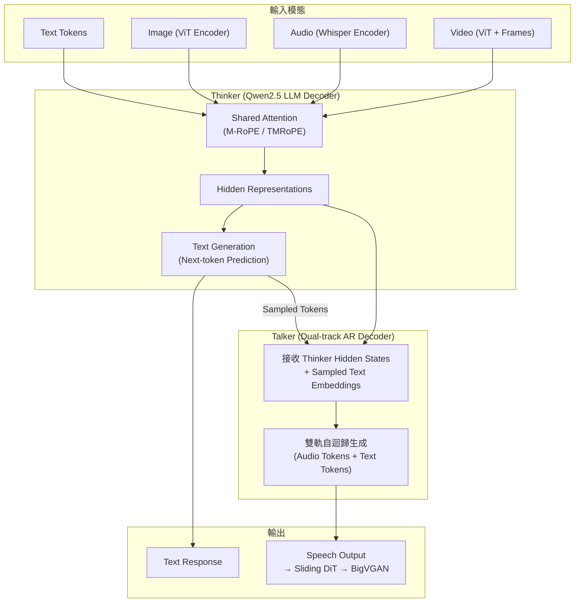
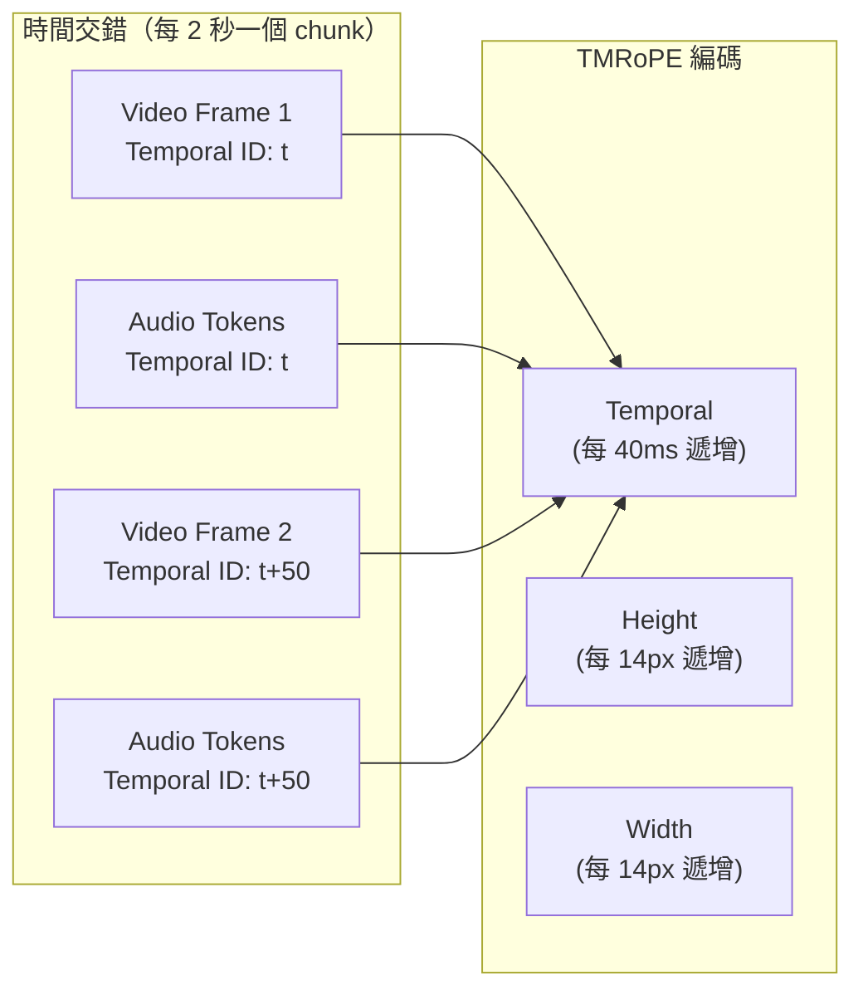
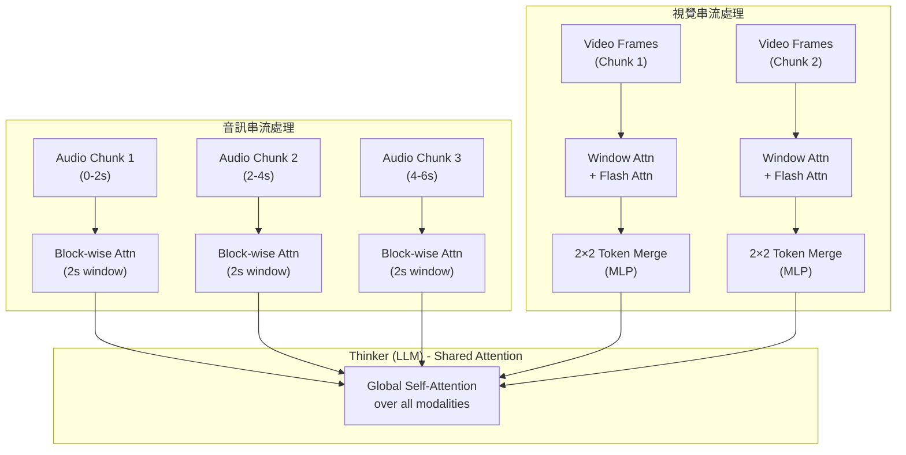
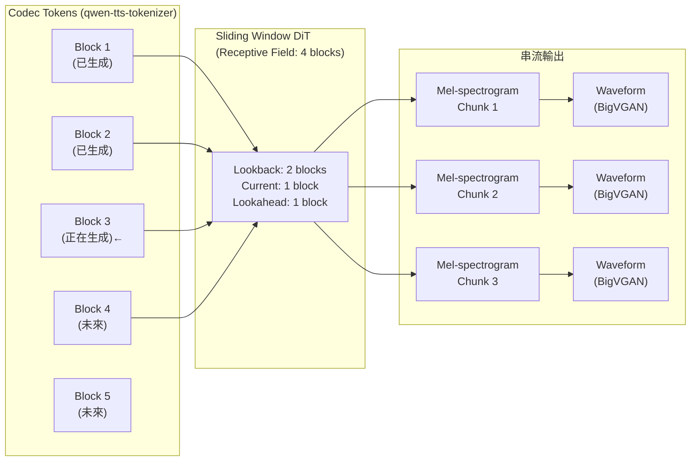

# Qwen2.5-Omni: Thinker-Talker 全模態架構解讀

> **種子論文**: [Qwen2.5-Omni Technical Report](https://arxiv.org/abs/2503.20215) (2025-03)
> **作者**: Jin Xu, Zhifang Guo, Jinzheng He, et al. (Qwen Team, Alibaba Group)
> **Dependency Paper**: [Qwen2.5-VL Technical Report](https://arxiv.org/abs/2502.13923) (2025-02)

---

## TL;DR

Qwen2.5-Omni 想要解決一個本質上矛盾的目標：讓一個模型同時理解 text、image、audio、video 四種輸入，又以串流方式同時生成文字與自然語音。為此它提出 Thinker-Talker 架構——Thinker（LLM）負責理解與生成文字，Talker（雙軌自迴歸模型）直接取用 Thinker 的隱藏表示來生成語音 token，兩者端到端聯合訓練互不干擾。最終模型在 OmniBench 上以 56.13% 達到 SOTA，語音指令跟隨能力逼近純文字輸入的 Qwen2-7B，且串流語音生成在 WER 與自然度上超越大多數既有系統。

---

## 背景與動機

### 從單模態到多模態再到全模態

大型語言模型（LLM）從純文字開始，在最近幾年快速擴展到多模態領域。一方面是視覺語言模型（LVLM）的蓬勃發展——從 BLIP-2、LLaVA 到 Qwen2.5-VL，模型學會理解圖片與影片。另一方面是音訊語言模型（LALM）的進展——Qwen2-Audio、SALMONN 讓 LLM 聽得懂語音和聲音。這兩個方向各自取得了顯著成果。

然而一個根本問題隨之浮現：**為什麼不能把它們全部放進同一個模型？**

### 全模態模型的三大挑戰

要將視覺、聽覺、語言整合到一個統一的模型中，至少需要解決三個問題：

**挑戰一：多模態輸入的同步與對齊。** 當模型同時接收影片和音訊時，這兩個模態之間有嚴格的時間對應關係——人說話的嘴型、聲音的節奏、畫面的變化速度都需要精確對齊。傳統的 1D RoPE 或甚至 Qwen2-VL 的 M-RoPE 都沒有設計來處理這種跨模態的時間同步。

**挑戰二：輸出模態間的干擾。** 文字生成與語音生成是兩個本質不同的任務。文字是離散的符號序列，語音是連續的聲學訊號。如果用同一個 decoder head 同時產生兩者，梯度更新可能互相干擾，導致文字能力下降或語音品質受損。

**挑戰三：即時串流的延遲。** 真實使用場景要求模型在接收到輸入後快速回應（無論是文字還是語音）。如果模型要等到完整輸入都處理完才開始輸出，首個 token 的延遲（initial packet delay）會讓使用者體驗很差。這需要從編碼器到解碼器的每個環節都支援 streaming。

### Qwen 系列的兩條技術脈絡

在 Qwen2.5-Omni 之前，Qwen 團隊有兩條並行的產品線：

- **Qwen2.5-VL**（2025 年 2 月）：專注於視覺語言理解，引入了 native dynamic resolution、window attention、以絕對時間對齊的 M-RoPE。在文件解析、物體定位、長影片理解上達到 SOTA。
- **Qwen2-Audio**（2024 年 7 月）：專注於音訊理解，基於 Whisper-large-v3 編碼器與 Qwen LLM，在語音辨識、聲音分類、語音問答上有出色表現。

Qwen2.5-Omni 的目標是將這兩條脈絡合而為一，同時加上語音生成能力，形成一個真正的全模態（omni-modal）模型。

---

## 核心知識點

本文圍繞以下六個知識點展開：

1. **Thinker-Talker 架構**——如何讓同一個模型同時產生文字與語音而不互相干擾
2. **TMRoPE（Time-aligned Multimodal RoPE）**——用時間同步的位置編碼對齊跨模態輸入
3. **Block-wise 串流處理**——用分塊注意力讓編碼器支援即時串流
4. **滑動視窗 DiT 語音生成**——用受限感受野的擴散模型降低語音輸出延遲
5. **三階段訓練策略**——從鎖定 LLM 到全參數微調的漸進式訓練
6. **從 Qwen2.5-VL 到 Qwen2.5-Omni 的架構演進**——關鍵的繼承與延伸

---

## 方法詳解

### 知識點 1：Thinker-Talker 架構

**這個知識點要回答什麼問題？**

傳統多模態模型在輸出時通常只生成文字，即使處理的是語音輸入。而 Qwen2.5-Omni 需要同時輸出文字和語音——這就好比一個人同時在說話和打字。這兩個輸出通道在計算上如何共存而不互相干擾？

**Qwen2.5-Omni 怎麼處理？**

Thinker-Talker 架構的核心靈感來自人腦的運作方式：大腦（Thinker）統一處理所有感官輸入並形成高層次的理解，而嘴巴（Talker）則負責將這些理解轉化為語音。兩者共享相同的「思考結果」，但使用不同的「器官」來輸出。

具體來說：



**Thinker** 是一個標準的 Transformer Decoder（Qwen2.5-7B），負責三件事：
1. 接收來自 vision encoder 和 audio encoder 的多模態特徵
2. 透過共享注意力機制融合不同模態的資訊
3. 以自迴歸方式生成文字

**Talker** 是一個雙軌（dual-track）自迴歸 Transformer Decoder，設計靈感來自 Mini-Omni。它接收兩種輸入：
- **高維隱藏表示（High-level Hidden Representations）**：來自 Thinker 的最後一層輸出，承載了語意資訊和語氣、情感等副語言特徵
- **取樣文字 token 的嵌入（Sampled Text Token Embeddings）**：來自 Thinker 實際取樣出的離散文字 token

為什麼需要同時接收這兩種輸入？因為單靠隱藏表示不夠：隱藏表示的語意相似度很高，但兩個語音相近但拼寫不同的詞（例如 "there" 和 "their"）在語意空間中位置接近，僅靠隱藏表示無法消除這種不確定性。離散文字 token 的嵌入則提供了明確的 identity 資訊。

值得注意的是，Talker **不需要** word-level 或 timestamp-level 的對齊資訊。它直接在序列層級上從 Thinker 的表示中學習語音生成的映射，這極大簡化了訓練資料的需求。

**端到端訓練**：Thinker 和 Talker 雖然角色分離，但在同一個最佳化過程中聯合訓練。整個架構表現為一個統一的單一模型，Thinker 的梯度可以流經 Talker，反之亦然。

**相關論文 Qwen2.5-VL 怎麼處理？**

Qwen2.5-VL 只有獨立的文字輸出路徑（單一的 LLM Decoder head），沒有任何語音生成能力。它採用 ViT → MLP → LLM 的經典 LVLM 架構，其中 MLP merger 將 4 個相鄰 patch 壓縮為 1 個 token，減少序列長度。Qwen2.5-Omni 繼承了這個視覺處理路徑，但在文字輸出之外增加了 Talker 這條語音輸出通道。

---

### 知識點 2：TMRoPE（Time-aligned Multimodal RoPE）

**這個知識點要回答什麼問題？**

當模型同時處理影片（一系列圖像）和音訊（聲音波形）時，這兩個模態需要精確的時間對齊——例如第 3 秒的畫面要對應第 3 秒的聲音。普通的位置編碼（如 1D RoPE）只能表示序列中的相對位置，無法編碼絕對時間。而多模態場景更複雜：文字沒有時間概念，圖片只有空間位置，影片有時間軸，音訊也有時間軸——如何在同一個位置編碼系統中容納所有這些差異？

**從 M-RoPE 到 TMRoPE 的演進**

Qwen2.5-VL 繼承了 Qwen2-VL 的 M-RoPE（Multi-modal RoPE），並做了關鍵改進：將時間分量對齊到絕對時間。M-RoPE 的核心理念是將 RoPE 的旋轉矩陣分解為三個獨立的維度：**temporal（時間）**、**height（高度）**、**width（寬度）**。

在 Qwen2-VL 中，temporal 分量只按 frame 數量遞增——如果影片有 10 幀，temporal ID 就是 0 到 9，完全不考慮這 10 幀實際對應多長時間。這意味著兩個節奏完全不同的影片（一個是 10 秒內拍 10 幀，另一個是 1 秒內拍 10 幀）會被模型視為等同。

Qwen2.5-VL 的改進就是將 temporal ID 與**絕對時間**綁定：每個 temporal ID 對應一個固定的時間單位。這樣模型透過 temporal ID 之間的間隔就能感知事件發生的速度——ID 間隔越密表示時間流逝越快。

**Qwen2.5-Omni 的 TMRoPE**

TMRoPE 在 M-RoPE 的基礎上，進一步加入了**時間交錯機制（Time-Interleaving）**，讓音訊和影片的精確同步成為可能。

具體的編碼規則如下：

| 輸入模態 | Temporal ID | Height ID | Width ID |
|----------|-------------|-----------|----------|
| 文字 | 單一值（等同 1D-RoPE） | 單一值 | 單一值 |
| 音訊 | 每 40ms 遞增 1 | 單一值 | 單一值 |
| 圖片 | 固定不變 | 依位置遞增 | 依位置遞增 |
| 影片（無音軌） | 每幀遞增 | 依位置遞增 | 依位置遞增 |
| 影片 + 音訊 | 按 2s chunk 交錯分配 | 依位置遞增 | 依位置遞增 |

時間交錯是 TMRoPE 最重要的創新。當輸入同時包含影片與音訊時（例如一段人說話的影片），模型將兩者按**每 2 秒為一個 chunk** 分段。在每個 2 秒的 chunk 中，視覺 token 排在前、音訊 token 排在後，這樣模型在處理同一個時間區段的資訊時可以同時參考視覺和聽覺兩個模態。



一個具體的例子：假設一段 4 秒的影片，以動態幀率取樣得到 8 幀，同時有 16kHz 的音訊。TMRoPE 會這樣處理：

1. 將 4 秒切成 2 個 2 秒的 chunk
2. 對每個 chunk，先放置視覺 token（該 chunk 中的數幀），再放置音訊 token（對應這 2 秒的音訊特徵）
3. 所有 token 根據絕對時間獲得 temporal ID，每個 ID 對應 40ms
4. 不同模態之間，temporal ID 會延續——下一個模態的起始 ID 是上一個模態的最大 ID + 1

這樣設計的效果是：模型在同一個注意力視窗內可以同時看到某個時間點的人臉表情和對應的聲音，從而實現跨模態的時序理解。

**相關論文 Qwen2.5-VL 怎麼處理？**

Qwen2.5-VL 使用 M-RoPE + 絕對時間對齊，但**沒有**時間交錯機制。這是因為 Qwen2.5-VL 不處理音訊輸入，它只需要將影片視為一系列圖像來處理即可。Qwen2.5-Omni 的 TMRoPE 在 M-RoPE 的三大分量（T/H/W）架構與絕對時間對齊的基礎上，新增了跨模態的時間交錯能力——這是最本質的差異。

---

**TMRoPE 的數學形式**

為了更具體理解 TMRoPE 的運作，我們來看看它的數學形式。標準的 1D RoPE 將位置 $p$ 編碼為旋轉矩陣 $R_p$：

$$
R_p = \begin{pmatrix}
\cos(p\theta_0) & -\sin(p\theta_0) & 0 & 0 & \cdots \\
\sin(p\theta_0) & \cos(p\theta_0) & 0 & 0 & \cdots \\
0 & 0 & \cos(p\theta_1) & -\sin(p\theta_1) & \cdots \\
0 & 0 & \sin(p\theta_1) & \cos(p\theta_1) & \cdots \\
\vdots & \vdots & \vdots & \vdots & \ddots
\end{pmatrix}
$$

M-RoPE 將其推廣為三個分量的獨立旋轉：

$$
R_{(t,h,w)} = R_t^{\text{temp}} \otimes R_h^{\text{height}} \otimes R_w^{\text{width}}
$$

其中 $\otimes$ 表示分量拼接，$R_t^{\text{temp}}$、$R_h^{\text{height}}$、$R_w^{\text{width}}$ 各自是不同維度上的標準 RoPE 旋轉。

TMRoPE 的關鍵改進在於 temporal ID 的賦值方式。對影片輸入，假設第 $k$ 幀的時間戳為 $\tau_k$ 秒，則：

$$
t_k = \left\lfloor \frac{\tau_k}{\Delta} \right\rfloor, \quad \Delta = 0.04 \text{秒}
$$

也就是 temporal ID 直接由絕對時間決定，而非幀序號。當多個模態混合時（音訊 + 影片），同一時間區段的 token 共享同一 temporal ID，確保模型能感知「這一段內容發生在同一時間點」。

**時間交錯的 token 排列**

對於一段 $T$ 秒的影片含音軌，TMRoPE 產生的 token 序列為：

```
Chunk 1 (0-2s): [V_t, V_{t+1}, ..., V_{t+N}, A_t, A_{t+1}, ..., A_{t+M}]
Chunk 2 (2-4s): [V_{t+N+1}, ..., V_{t+N+P}, A_{t+M+1}, ..., A_{t+M+Q}]
...
```

其中 $V_i$ 是視覺 token，$A_j$ 是音訊 token，temporal ID 跨 chunk 連續遞增。每個 chunk 內部，視覺 token 在前、音訊 token 在後，都使用相同的 temporal ID 範圍。這樣設計的好處是：在同一個 chunk 內，模型可以在同一個 attention 操作中同時看見視覺和聽覺資訊，促進跨模態特徵融合。

### 知識點 3：Block-wise 串流處理

**這個知識點要回答什麼問題？**

即時對話要求模型在接收輸入的同時就能開始處理，而不是等到所有輸入都收完才開始。傳統的 full attention 機制需要看到完整的序列才能計算注意力權重——這對 streaming 來說是致命的。如何改造編碼器讓它支援逐塊（chunk-wise）處理？

**Qwen2.5-Omni 怎麼處理？**

Qwen2.5-Omni 對音訊編碼器和視覺編碼器分別做了不同的 streaming 改造：

**音訊編碼器：Block-wise Attention**

原始 Whisper-large-v3 架構在整個音訊序列上做 full self-attention。Qwen2.5-Omni 將其改為**每 2 秒為一個 block 的局部注意力**：每個 block 只能看到 block 內部的 token，看不到前後 block。

這個設計的直覺是：語音資訊在短時間尺度（2 秒以內）是高度自洽的——一個音節、一個詞彙的發音特徵不會依賴很遠的上下文。將注意力限制在 2 秒的視窗內，模型仍然可以有效提取語音特徵，同時使得串流成為可能——每收到 2 秒的音訊就可以立即處理，不需要等待整段語音結束。

**視覺編碼器：Flash Attention + Token Merging**

Qwen2.5-VL 的 ViT 已經使用了 window attention（32 層中的 28 層），這本身就是一種局部注意力機制。Qwen2.5-Omni 在此基礎上進一步優化：

- 使用 Flash Attention 加速訓練和推理
- 透過一個簡單的 MLP 層將相鄰的 2×2 token 合併為一個 token，進一步壓縮序列長度

**為什麼這樣做有效？**

論文中給出的解釋是：這種設計將多模態長序列的感知責任分配給編碼器，而將長序列建模能力保留給 LLM。編碼器只負責在局部視窗內提取特徵，LLM 則負責在全局範圍內理解這些特徵之間的關係。這種分工讓 LLM 的注意力機制可以更有效地融合不同模態的資訊。

**關於 Streaming 延遲的四個來源**

論文明確認定了影響串流效能的四個延遲來源：

1. **輸入處理延遲**：多模態編碼器處理輸入所需的時間。Block-wise attention 確保編碼器可以在 2 秒的 chunk 邊界上運作，不需要等待完整輸入。
2. **語音輸出初始延遲**：從第一個文字 token 被接收到第一個語音 token 被輸出的時間。Talker 直接取用 Thinker 的隱藏表示，不需等待 Thinker 完成整句生成即可開始輸出語音。
3. **Audio-to-waveform 解碼延遲**：滑動視窗 DiT 將 codec token 轉換為 waveform 的時間。受限的感受野確保每個 chunk 的生成時間固定，不隨序列長度增長。
4. **架構固有延遲**：模型大小與計算量帶來的延遲。這部分依賴硬體加速與推理框架優化。

**與 Qwen2.5-VL 的對比**

Qwen2.5-VL 雖然在視覺編碼器中使用了 window attention（32 層中的第 7、15、23、31 層使用 full attention，其餘 28 層使用 window 大小 112×112 的局部注意力），但目的完全是為了計算效率而非串流支援。Qwen2.5-VL 的輸入仍然是整張圖片或整段影片一次性處理，沒有做分塊設計。



---

### 知識點 4：滑動視窗 DiT 語音生成

**這個知識點要回答什麼問題？**

語音生成的最後一步是將 codec token 轉換為可播放的音訊波形。傳統方法需要將整段語音的 codec token 全部解碼後才能播放，這對串流應用來說是不可接受的。如何在保證語音品質的同時實現逐段串流輸出？

**Qwen2.5-Omni 怎麼處理？**

Qwen2.5-Omni 的語音生成管線由三個元件組成：

1. **qwen-tts-tokenizer**：一個高效的語音編解碼器，將語音壓縮為離散 token 序列。與傳統的 RVQ codec（如 EnCodec、SoundStream）不同，qwen-tts-tokenizer 特別設計為支援因果（causal）解碼——這是串流播放的必要條件。它還力求在盡可能少的 token 數下達到高重建品質。
2. **滑動視窗 Flow-Matching DiT**：將 codec token 轉換為 mel-spectrogram
3. **BigVGAN**：將 mel-spectrogram 重建為音訊波形

**多說話人微調的實務考量**

論文在 Talker 的最後階段進行了多說話人微調（multi-speaker fine-tuning）。這個階段的挑戰在於：如何讓模型學會模仿特定說話人的聲音風格，同時不犧牲基礎語音生成的穩定性？

為了解決這個問題，論文採用了音色解糾纏（timbre disentanglement）技術，防止模型將特定聲音與罕見的文字模式關聯起來。例如，如果說話人甲只在對話資料中說過「你好」，而說話人乙說過大量各式各樣的句子，模型不應該學到「說『你好』就要用說話人甲的聲音」這樣的偽相關。

其中滑動視窗 DiT 是最關鍵的創新。

**DiT（Diffusion Transformer）** 負責條件式生成——以 codec token 為條件，透過 Flow-Matching 將雜訊逐步去噪為 mel-spectrogram。標準的 DiT 使用 full attention，每個位置的生成需要參考整段序列的資訊。

Qwen2.5-Omni 將 DiT 的 attention 範圍限制為 4 個 block：
- **lookback**: 2 個 block（看到過去）
- **lookahead**: 1 個 block（看到未來一點）
- **current**: 1 個 block（當前生成位置）



這個設計的效果是：DiT 在生成第 N 個 chunk 的 mel-spectrogram 時，只需要參考前 2 個 chunk 和後 1 個 chunk 的 codec token，而不是整段序列。因此解碼過程可以按 chunk 逐段進行——生成完第 1 個 chunk 的 waveform 就可以開始播放，同時繼續生成第 2 個 chunk。

BigVGAN 視覺轉換器也有固定的感受野，因此也支援分段處理。這整套設計讓語音輸出的 initial packet delay 大幅降低。

**與 Qwen2.5-VL 的對比**

Qwen2.5-VL 完全不涉及語音生成，因此沒有這方面的設計。這是 Qwen2.5-Omni 全新加入的模組。

---

### 知識點 5：三階段訓練策略

**這個知識點要回答什麼問題？**

全模態模型涉及視覺編碼器、音訊編碼器、LLM、語音解碼器四個主要元件的聯合訓練。如果一口氣全部一起訓練，梯度不穩定、各模態進度不一致等問題會讓訓練難以收斂。如何設計漸進式的訓練流程？

**Qwen2.5-Omni 的預訓練**

模型採用三階段預訓練：

**Stage 1 — 鎖定 LLM，訓練編碼器配接層**

| 參數 | 值 |
|------|-----|
| 凍結部分 | LLM（Qwen2.5-7B） |
| 訓練部分 | Vision encoder adapter + Audio encoder adapter |
| 訓練資料 | 大量 image-text pairs + audio-text pairs |
| 目標 | 建立視覺與聽覺的語意理解基礎 |

視覺編碼器初始化為 Qwen2.5-VL 的 ViT，音訊編碼器初始化為 Whisper-large-v3。兩者各自先訓練 adapter（將 encoder 輸出映射到 LLM 的 embedding space），然後再訓練 encoder 本體。

**Stage 2 — 全參數解凍**

| 參數 | 值 |
|------|-----|
| 訓練部分 | 所有參數 |
| Image/Video tokens | 800B |
| Audio tokens | 300B |
| Video + Audio tokens | 100B |
| 最大序列長度 | 8,192 tokens |

這個階段引入了更大規模的混合多模態資料和多樣化的任務。關鍵是加入了**影片+音訊同步資料**（100B tokens），讓模型學會處理視覺與聽覺資訊協同的場景。

**Stage 3 — 長序列訓練**

將序列長度擴展到 32,768 tokens，加入長音訊和長影片資料。實驗結果顯示這個階段對長序列處理能力有顯著提升。

**Talker 的三階段訓練**

Talker 的三階段訓練與 Thinker 的預訓練交錯進行，包含三個專門階段。值得一提的是，DPO 階段的獎勵信號不僅考慮 WER，還考慮了標點停頓錯誤率（punctuation pause error rate）——這是一個實務上很重要的設計。因為如果模型在逗號處不停、句號處不停頓，語音聽起來會非常不自然，即使每個詞的發音都是對的。

| 階段 | 方法 | 目標 |
|------|------|------|
| ICL（In-Context Learning） | Next-token prediction + 語音接續任務 | 學習從語意表示到語音的單調映射 |
| DPO（Direct Preference Optimization） | 基於 WER + 標點停頓錯誤率的偏好學習 | 降低語音幻覺、提高生成穩定性 |
| Multi-speaker FT | 特定 speaker 微調 | 提升自然度與可控性 |

DPO 階段的損失函數為：

$$
\mathcal{L}_{\text{DPO}}(P, P_{\text{ref}}) = -\mathbb{E}_{(x, y_w, y_l) \sim \mathcal{D}} \left[ \log \frac{P(y_w | x)}{P_{\text{ref}}(y_w | x)} - \log \frac{P(y_l | x)}{P_{\text{ref}}(y_l | x)} \right]
$$

其中 $y_w$ 和 $y_l$ 分別是好的和差的語音生成樣本，基於 WER 和停頓錯誤率進行排序。不同於文字領域的 DPO（如 Rafailov et al. 的原始 DPO），這裡的偏好不是來自人類標註，而是來自**自動化評估指標**——WER 低且停頓合理的樣本被視為偏好樣本。這種自動化偏好標註的好處是可以規模化，不需要大量人工標註。

**單說話人微調的 Speaker A/B/C/D 結果**

論文的最終評估中包含了對 4 個特定說話人（Speaker A/B/C/D）的微調結果。有趣的是，不同說話人的微調效果在不同指標上各有優劣：Speaker C 在 test-zh 上 WER 最低（1.30%），Speaker B 在 test-en 上最低（1.86%），而 Speaker D 在 test-hard 上最低（6.43%）。這暗示說話人微調的品質可能與目標說話人的訓練資料量和資料多樣性有關。

**相關論文 Qwen2.5-VL 怎麼處理？**

Qwen2.5-VL 也採用三階段預訓練，但規模更大：
- Stage 1: 1.5T tokens（鎖定 LLM，訓練 ViT）
- Stage 2: 2T tokens（全參數）
- Stage 3: 0.6T tokens（32k 序列）

總共 4.1T tokens，遠多於 Qwen2.5-Omni 的約 1.2T tokens。這反映了兩個模型的不同定位：Qwen2.5-VL 追求極致的視覺理解，Qwen2.5-Omni 則需要在多個模態間取得平衡。

---

### 知識點 6：從 Qwen2.5-VL 到 Qwen2.5-Omni 的架構演進

**這個知識點要回答什麼問題？**

Qwen2.5-Omni 並不是從零設計的。它站在 Qwen2.5-VL 的肩膀上，繼承了大部分視覺處理能力，然後疊加了音訊理解與語音生成能力。理解這種「繼承與新增」的關係是掌握全模態架構設計的關鍵。

**架構層級對比**

| 元件 | Qwen2.5-VL-7B | Qwen2.5-Omni-7B | 關係 |
|------|---------------|-----------------|------|
| LLM 主體 | Qwen2.5-7B | Qwen2.5-7B（Thinker） | 繼承 |
| Vision Encoder | 675M ViT, window attn | 675M ViT, window attn | 繼承 |
| Audio Encoder | 無 | Whisper-large-v3 修改版 | 新增 |
| Position Embedding | M-RoPE + 絕對時間 | TMRoPE = M-RoPE + 時間交錯 | 延伸 |
| MLP Merger | 2×2 token merge | 2×2 token merge | 繼承 |
| Text Decoder | 標準 LM head | Thinker LM head | 繼承 |
| Speech Decoder | 無 | Talker dual-track AR + DiT | 新增 |
| Streaming 支援 | 無 | Block-wise + sliding window | 新增 |

**位置編碼的關鍵延伸**

Qwen2.5-VL 已經解決了「影片的 temporal ID 如何對齊絕對時間」的問題。Qwen2.5-Omni 在此基礎上需要解決「當音訊和影片同時存在時如何交錯排列」的新問題。時間交錯（time-interleaving）是從 M-RoPE 到 TMRoPE 最本質的增量。

**視覺能力的保留**

論文中多個 benchmark 顯示，Qwen2.5-Omni 的影像理解能力與 Qwen2.5-VL-7B 非常接近，例如 MMMU（59.2 vs 58.6）、MMBench（81.8 vs 82.6）、DocVQA（95.2 vs 95.7）。這證明全模態訓練沒有顯著損害視覺能力——視覺編碼器成功地遺傳了 Qwen2.5-VL 的訓練成果。

**視覺定位能力的對比**

| Benchmark | Qwen2.5-VL-7B | Qwen2.5-Omni-7B |
|-----------|---------------|-----------------|
| RefCOCO val | 90.0 | 90.5 |
| RefCOCO+ testA | 89.1 | 91.0 |
| RefCOCOg val | 87.2 | 87.4 |
| ODinW | 37.3 | 42.2 |

有趣的是，Qwen2.5-Omni 在視覺定位上甚至略微超過了 Qwen2.5-VL——這可能歸因於全模態訓練中更豐富的資料混合帶來的正則化效果。

---

## 實驗結果

### 文字理解能力（Text → Text）

Qwen2.5-Omni 的文字能力介於 Qwen2-7B 與 Qwen2.5-7B 之間，考慮到 LLM 部分初始化自 Qwen2.5，這個結果是合理的：

| Benchmark | Qwen2-7B | Qwen2.5-7B | Qwen2.5-Omni-7B |
|-----------|----------|------------|-----------------|
| MMLU-Pro | 52.1 | 56.3 | **56.3** |
| MMLU-redux | 48.3 | 75.4 | **71.0** |
| GSM8K | 76.7 | 91.6 | **88.7** |
| MATH | 44.3 | 75.5 | **71.5** |
| HumanEval | 79.9 | 84.8 | **78.7** |
| MBPP | 67.2 | 79.2 | **73.2** |

**關鍵觀察**：Qwen2.5-Omni 在多數數學與科學任務上維持了 Qwen2.5-7B 約 90–95% 的水準，在程式碼生成上略低（HumanEval 78.7 vs 84.8），這可能是因為訓練 token 總量較少（1.2T vs 4.1T）所致。

### 音訊理解能力（Audio → Text）

Qwen2.5-Omni 在語音辨識（ASR）上超越了專用的 Whisper-large-v3，甚至超越了同期的 MinMo：

| 任務 | Benchmark | Qwen2.5-Omni | 最佳對比 |
|------|-----------|-------------|----------|
| ASR (English) | LibriSpeech test-clean | **1.6% WER** | Whisper-large-v3: 1.8% |
| ASR (Chinese) | Fleurs zh | **7.5% CER** | Seed-ASR: 7.7% |
| ASR (Cantonese) | Common Voice yue | **5.2% CER** | Qwen2-Audio: 5.9% |
| S2TT (En→De) | CoVoST2 en-de | **25.1** | MinMo: 29.9 |
| S2TT (Zh→En) | CoVoST2 zh-en | **29.4** | MinMo: 24.4 |
| Audio Reasoning | MMAU Avg | **0.225** | Qwen2-Audio: 0.127 |
| Voice Chatting | VoiceBench Avg | **74.12** | MiniCPM-o: 71.69 |

**關鍵觀察**：Qwen2.5-Omni 在音訊推理（MMAU）上的大幅領先（0.225 vs 0.127）尤其值得注意。這不是單純的語音轉寫能力，而是對聲音內容的高層次理解——例如「這段音樂的風格是什麼」「這個聲響的來源可能是什麼」。

### 語音指令跟隨（Voice Chatting）

這是最令人印象深刻的結果之一。論文中將純文字 benchmark 的題目轉換為語音指令，比較 Qwen2.5-Omni（語音輸入）與 Qwen2-7B（文字輸入）的表現：

| Benchmark | Qwen2-7B (文字) | Qwen2-Audio (語音) | Qwen2.5-Omni (語音) |
|-----------|----------------|-------------------|-------------------|
| MMLU | 69.3 | 33.2 | **65.6** |
| GSM8K | 82.3 | 18.4 | **85.4** |
| IFEval | 53.3 | 15.6 | **41.7** |
| Math23K | 92.3 | 23.0 | **87.1** |

Qwen2-Audio 在語音輸入時效能大幅衰減（GSM8K 從 82.3 掉到 18.4），但 Qwen2.5-Omni 幾乎恢復了純文字水準（GSM8K 甚至從 82.3 提高到 85.4）。這意味著語音輸入的資訊損失被壓低到了幾乎可以忽略的程度。

### 消融分析

論文雖然沒有獨立的消融實驗章節，但從三階段訓練的設計中可以推斷幾個關鍵設計選擇的重要性：

**1. Block-wise attention vs Full attention**

音訊編碼器從 full attention 改為 2 秒 block-wise attention 是 streaming 的關鍵。雖然論文沒有直接比較兩者的 WER 差異，但從訓練效率的角度來看，block-wise attention 的使用使得串流推論成為可能，且保留了足夠的上下文（2 秒足以涵蓋大多數詞彙和短語的發音特徵）。

**2. Thinker-Talker 分離 vs 單一 unified decoder**

如果使用單一的 decoder 同時預測文字和語音 token（類似 AnyGPT 的做法），可能出現以下問題：
- 文字 loss 和語音 loss 的尺度差異導致訓練不穩定
- 語音 token 的預測權重可能壓過文字 token，導致語言能力下降
- 無法獨立控制兩者的生成策略（top-p sampling for text vs temperature for speech）

Thinker-Talker 的分離設計避免了這些問題，代價是增加了約 5–10% 的參數總量（Talker decoder 的額外開銷）。

**3. DPO 階段的效益**

從 seed-tts-eval 的結果可以明確看出 DPO 的效果：ICL 階段的 WER（test-hard）為 7.97%，DPO 後降至 6.54%，降幅達 18%。這印證了偏好最佳化在語音生成穩定性上的價值。

**4. Video+Audio 同步資料的必要性**

100B tokens 的 video+audio 同步資料雖然在總量中佔比不大（約 8%），但對 OmniBench 的 SOTA 表現至關重要——因為 OmniBench 正是評估多模態混合理解的基準。沒有這部分資料，模型可能無法學會跨模態的時間對應。

在零樣本 TTS 評估（seed-tts-eval）上：

| 指標 | 資料集 | Qwen2.5-Omni (ICL) | Qwen2.5-Omni (RL) | 最佳對比 |
|------|--------|--------------------|-------------------|---------|
| WER ↓ | test-zh | 1.70% | **1.42%** | Seed-TTS RL: 1.00% |
| WER ↓ | test-en | 2.72% | **2.33%** | Seed-TTS RL: 1.94% |
| WER ↓ | test-hard | 7.97% | **6.54%** | Seed-TTS RL: 6.42% |
| SIM ↑ | test-zh | 0.752 | **0.754** | Seed-TTS RL: 0.801 |
| SIM ↑ | test-en | 0.632 | **0.641** | Seed-TTS RL: 0.766 |

RL 優化（DPO 階段）確實改善了生成穩定性。雖然在純 TTS 指標上不及專用模型 Seed-TTS（這很合理——Qwen2.5-Omni 是一個通用的全模態模型，不是專門的 TTS 系統），但差距並不大。

### 全模態理解（OmniBench）

OmniBench 是目前最全面的全模態評估基準，涵蓋語音、聲響事件、音樂三類模態的混合理解。測試方式是給模型一段同時包含語音對話、背景聲響和音樂的片段，然後問關於這段內容的問題。這比單一模態的任務（單純 ASR 或單純 VQA）困難得多：

| 模型 | 語音 | 聲響事件 | 音樂 | 平均 |
|------|------|---------|------|------|
| Gemini-1.5-Pro | 42.67% | 42.26% | 46.23% | **42.91%** |
| MIO-Instruct (7B) | 36.96% | 33.58% | 11.32% | **33.80%** |
| video-SALMONN (13B) | 34.11% | 31.70% | 56.60% | **35.64%** |
| MiniCPM-o | - | - | - | **40.5%** |
| Baichuan-Omni-1.5 | - | - | - | **42.9%** |
| **Qwen2.5-Omni-7B** | **55.25%** | **60.00%** | **52.83%** | **56.13%** |

Qwen2.5-Omni 以 56.13% 的平均成績大幅領先所有對比模型，在語音和聲響事件這兩類上更是超過 55%。值得注意的對比是：
- 對比 Gemini-1.5-Pro（42.91%），Qwen2.5-Omni 領先 13.22%，考慮到 Qwen2.5-Omni 只有 7B 參數而 Gemini-1.5-Pro 是千億級模型，這個差距非常顯著
- 對比單純的語意模型 MIO-Instruct（音樂 11.32%），Qwen2.5-Omni 的音樂理解（52.83%）高了 4 倍以上，顯示了 TMRoPE 在非語音音訊上的優勢
- video-SALMONN 在音樂類表現突出（56.60%），這可能歸因於其更大的參數量（13B）和專門的音訊訓練

這些結果證明了 TMRoPE + Thinker-Talker 的設計在全模態理解上的有效性。以 7B 級模型對比千億級模型拿下這樣的成績，說明全模態架構設計的價值可能大於單純的參數規模。

### 單說話人語音生成

在單說話人設定下，Qwen2.5-Omni 經過 speaker fine-tuning 後的 NMOS（自然度主觀評分）在中文和英文上都達到了 4.48–4.62 的水準，非常接近人類錄音的 4.51。這說明 Qwen2.5-Omni 的語音生成品質已經達到了實用等級。

---

## 與相關工作的對比

### 全模態模型格局

目前的全模態模型領域主要參與者包括：

| 維度 | Qwen2.5-Omni | MiniCPM-o | Baichuan-Omni-1.5 | MinMo |
|------|-------------|-----------|-------------------|-------|
| 參數量 | 7B | ~8B | ~7B | ~7B |
| 輸入模態 | T+I+A+V | T+I+A+V | T+I+A+V | T+A |
| 輸出模態 | T+S（串流） | T+S | T+S | T+S |
| 架構 | Thinker-Talker | 未公開 | Modal-8 | MoE |
| 視覺編碼器 | 675M ViT | SigLIP | CLIP | 無 |
| 位置編碼 | TMRoPE | RoPE | RoPE | RoPE |
| 串流語音 | ✓（滑動 DiT） | ✓ | ✓ | ✓ |
| OmniBench | **56.13%** | 40.5% | 42.9% | - |

（T=text, I=image, A=audio, V=video, S=speech）

Qwen2.5-Omni 的核心優勢在於：
1. **最強的視覺能力**：繼承 Qwen2.5-VL 的 675M ViT，視覺理解遠超純音訊模型（MinMo）和非 ViT 模型
2. **時間對齊的位置編碼**：TMRoPE 是唯一明確處理 audio-video 時間同步的設計
3. **Thinker-Talker 架構的端到端訓練**：不需要分階段訓練不同輸出模組

### 與 Qwen2.5-VL 的定位差異

Qwen2.5-VL 追求的是極致的視覺理解——文件解析（Omni-document）、精確物體定位（bounding box + point grounding）、長影片理解（數小時級）。它是一個「看」的模型。

Qwen2.5-Omni 追求的是全面的感知與互動——看、聽、說。它的視覺能力與 Qwen2.5-VL 相當，但犧牲了一部分純文字能力來換取多模態的統一。定位差異可以用一句話概括：Qwen2.5-VL 是專業的視覺分析師，Qwen2.5-Omni 是全能的生活助手。

---

## 我的觀察

### Thinker-Talker 的類比意義

Thinker-Talker 架構的命名並非噱頭。人腦的布羅卡氏區（Broca's area，語言產生）和韋尼克區（Wernicke's area，語言理解）是兩個不同但高度相關的區域——這與 Thinker 和 Talker 的角色分工有深層的對應關係。Talker 接收 Thinker 的隱藏表示而非文字 token，相當於「理解內容後才說出來」，而不是「照稿朗讀」。

從設計哲學來看，Qwen2.5-Omni 選擇將「理解」和「語音生成」分離，而不是合併在一個 unified decoder 中。這個決策的合理性在實驗中得到驗證：如果同一個 decoder 同時預測文字和語音 token，兩個任務的 loss landscape 可能互相干擾。分離後，Thinker 可以專注於語意理解，Talker 專注於聲學特徵映射。

### TMRoPE 的啟發

TMRoPE 最精妙的地方在於它「不新增任何額外參數，只改變位置 ID 的分配方式」就解決了跨模態時間同步的問題。這種做法延續了 RoPE 系列一貫的風格——透過數學變換而非增加模型容量來提升表示能力。

相較之下，其他全模態模型（如 MiniCPM-o、Baichuan-Omni）使用的是標準 1D RoPE，完全依賴 attention 機制自己去學習跨模態的時序對應。TMRoPE 預先將時間結構編碼進位置表示中，大幅降低了 attention 的學習負擔。

### 詭異的 GSM8K 結果

在語音指令跟隨測試中，Qwen2.5-Omni 的 GSM8K 分數（85.4）甚至超過了 Qwen2-7B 的文字輸入（82.3）。這個結果值得推敲：可能是因為語音輸入的測試題目與文字版不完全一致（論文提到「約 90% 的文字題目被轉換為語音」），或者取樣的不同 subset 難度較低。無論如何，65.6（MMLU）逼近 69.3 的結果已經很具說服力。

### 被忽略的關鍵問題

論文的結論部分坦率地指出了一個常被學術界忽略的問題：**video OCR 與 audio-video 協同理解**。這在學術基準中鮮少被評估，但對實際應用至關重要——例如從教學影片中提取文字資訊、同時理解畫面上的字幕與旁白。Qwen2.5-Omni 雖然在 OmniBench 上拿到 SOTA，但離真正的全模態理解還有距離。

### 全模態模型的效能權衡

全模態模型不可避免地要面對一個根本矛盾：**單一模態的深度 vs 多模態的廣度**。專用模型（如 Qwen2.5-VL 之於視覺、Whisper-large-v3 之於 ASR、Seed-TTS 之於語音生成）在各自的領域往往表現更好——這是因為它們的參數和訓練資料都集中在一個任務上。

Qwen2.5-Omni 的取捨策略是：**視覺能力幾乎不打折**（繼承 Qwen2.5-VL 的完整 ViT），**音訊理解做到頂尖**（超越專用 ASR 模型），**語音生成足夠好用**（接近專用 TTS 但不完全超越）。這種權衡在實際部署中很有吸引力——一個模型取代三個專用模型，節省了部署成本和管理開銷。

### 對未來全模態設計的啟示

從 Qwen2.5-Omni 的設計中，可以提煉出幾條對未來全模態模型的設計原則：

1. **漸進式繼承勝過從零設計**：全模態模型的訓練成本極高，從既有成功的單模態模型出發（ViT from Qwen2.5-VL, audio encoder from Whisper）可以大幅降低訓練難度。Qwen2.5-Omni 的三階段訓練策略正是這種哲學的具體實踐。

2. **位置編碼是跨模態對齊的關鍵**：TMRoPE 的設計說明了好的位置編碼可以解決看似需要複雜架構修改的問題。RoPE 系列的演化（1D → M-RoPE → TMRoPE）是一條清晰的技術脈絡，每一次改進都不增加參數量，只改變位置 ID 的賦值語義。

3. **輸出模態的分離是必要的**：不同輸出模態（文字 vs 語音）的 loss landscape 差異過大，同一 decoder 難以兼顧。Thinker-Talker 的設計在參數效率上可能不是最優，但在訓練穩定性和生成品質上是務實的選擇。

4. **串流需要在編碼階段就做設計**：如果等到解碼階段才考慮串流，設計空間會小很多。Qwen2.5-Omni 從編碼器就開始做 block-wise attention，這是正確的順序。串流不是解碼器的專利，而是需要整個管線的協作。

---

## 延伸閱讀

### Dependency Papers（本文涵蓋）

1. **Qwen2.5-VL Technical Report** ([2502.13923](https://arxiv.org/abs/2502.13923))
   - 與本文關係：Qwen2.5-Omni 繼承了 Qwen2.5-VL 的視覺編碼器（675M ViT with window attention）、M-RoPE 位置編碼的絕對時間對齊、以及 MLP-based vision-language merger。TMRoPE 是在 M-RoPE 基礎上的延伸。

### 後續發展（未涵蓋，僅列出）

- **Mini-Omni** (Xie & Wu, 2024)：雙軌自迴歸架構的靈感來源，提出「邊想邊說」的串流語音生成模式
- **MiniCPM-o** (Yao et al., 2024)：與 Qwen2.5-Omni 同時期的全模態模型，在 OmniBench 上被超越
- **Baichuan-Omni-1.5** (Li et al., 2025)：另一個 7B 級全模態模型，架構上採用 Modal-8 設計

---

## 引用

完整 BibTeX 見 [`papers.bib`](./papers.bib)。
