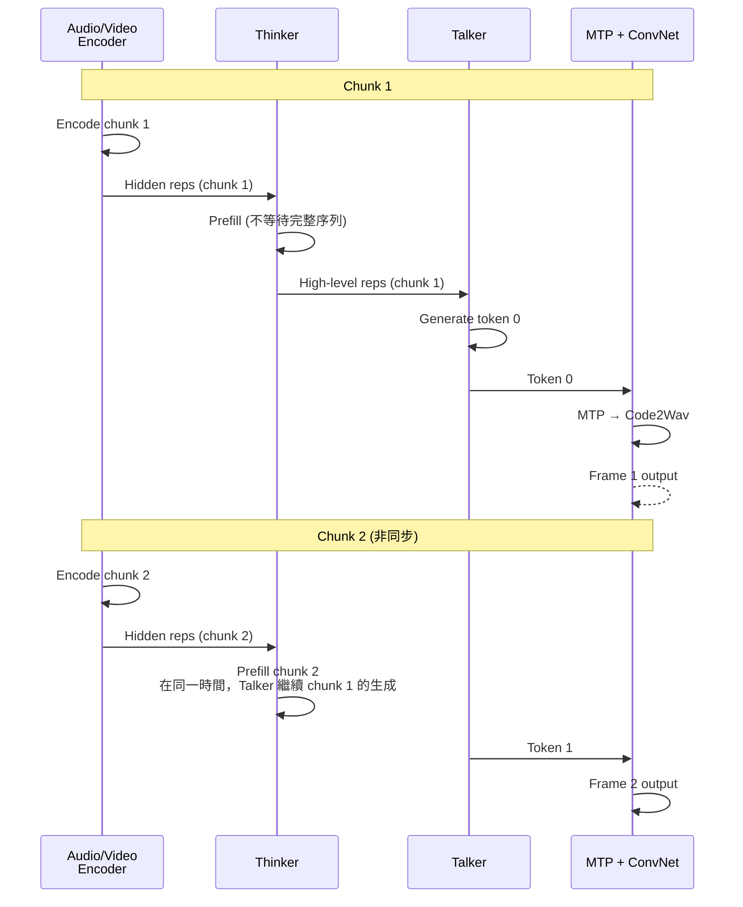

# Qwen3-Omni 論文導讀

## TL;DR

Qwen3-Omni 是 Qwen 團隊推出的統一多模態模型，首次在**不犧牲任一單模態性能**的前提下，達到 text、image、audio、video 的全域 SOTA。它採用 Thinker-Talker MoE 架構，透過 AuT 音頻編碼器、多碼本串流語音生成、TM-RoPE 時間對齊位置編碼、以及輕量 MTP + ConvNet Code2Wav 等關鍵設計，實現 **234 ms** 的端到端首包延遲。在 36 項音頻／視聽基準中取得 32 項開源 SOTA、22 項整體 SOTA，超越 Gemini-2.5-Pro、GPT-4o-Transcribe 等閉源模型。

**版本說明**：本文涵蓋 Qwen3-Omni-30B-A3B 與其 Thinking 變體，以及 Qwen3-Omni-Flash-Instruct 與 Qwen3-Omni-Flash-Thinking 等衍生模型。所有模型均以 Apache 2.0 授權開源。

**適用讀者**：對多模態模型架構有基礎了解的 AI 研究人員與工程師。建議先了解 Transformer、RoPE、MoE、Flow Matching、RVQ 等基礎概念後再閱讀。

---

## 背景與動機

### 為什麼需要 Omni 模型

人類感知世界的方式從來不是單一管道的。我們同時用眼睛看、用耳朵聽、用大腦把這些訊號整合在一起，然後用文字或語言表達出來。理想中的通用人工智慧也應該具備這樣的能力：一個統一的模型，能看、能聽、能說、能寫，而且**每一項都不比專用模型差**。

在 Qwen3-Omni 之前，多模態模型面臨一個根本困境：**模態折衷（modality trade-off）**。當你把文字、圖像、音頻放進同一個模型訓練時，某一模態的進步往往伴隨著其他模態的衰退。例如，加入視覺理解能力可能會讓純文字能力下降，加入語音辨識可能會影響文字生成品質。這導致實務上大多數系統還是走**串接管線（cascaded pipeline）**——語音辨識用一個模型、視覺理解用另一個模型、語音合成再用第三個——而非真正的端到端統一模型。

這種管線架構有幾個先天缺陷：

1. **資訊損失**：每一階段的離散化（ASR 把語音轉文字、VLM 把圖片轉描述）都會丟失資訊。語音中的韻律、情感、說話者身份在 ASR 階段就全部遺失，後續模組無法復原
2. **延遲累加**：每個模組的延遲相加，總延遲遠大於端到端模型
3. **系統複雜度**：維護多個模型、多個部署 pipeline 的成本遠高於單一模型
4. **無法跨模態推理**：例如聽一段自然環境音+看影片來判斷「這是哪個城市的街頭」，管線模型需要手動設計模態間的資訊傳遞方式

### Qwen 團隊的多模態路線圖

Qwen 系列的多模態演進可以看到一條清晰的迭代脈絡：

- **Qwen-Audio**（2023 年 11 月，arXiv:2311.07919）：第一部曲，提出統一音頻理解架構。支援 audio→text 的各類任務（ASR、S2TT、聲音事件辨識），但**不支援語音生成**。核心設計是將不同音頻任務統一為同一種輸入格式，降低任務切換成本
- **Qwen2-Audio**（2024 年 7 月，arXiv:2407.10759）：第二部曲，改善音頻理解架構與訓練資料規模，但仍限於理解。引入了更靈活的音頻 tokenization 方式
- **Qwen2.5-Omni**（2025 年 3 月，arXiv:2503.20215）：第三部曲，提出 **Thinker-Talker** 架構，首次實現 text + speech 雙模態輸出。採用 Dense Transformer 作為骨幹、Whisper 作為音頻編碼器、DiT 作為語音解碼器
- **Qwen3-Omni**（2025 年 9 月，arXiv:2509.17765，本篇）：第四部曲，將 Thinker 與 Talker 全面升級為 MoE、自研 AuT 編碼器取代 Whisper、多碼本串流生成取代 DiT、TM-RoPE 直接時間對齊取代 2s 區塊切割。達成不折衷的全模態 SOTA

每一代的進步都不是隨意的功能疊加，而是**針對前一版本已知瓶頸的精確打擊**。

---

## 核心知識點框架

### 1. Thinker-Talker 架構的設計哲學與數學形式化

這是 Qwen2.5-Omni 首創、Qwen3-Omni 繼承並強化的核心設計。靈感來自人類神經系統的運作方式：大腦（Thinker）負責高層次的感知、理解與推理，嘴巴（Talker）負責將這些高層次表徵轉換為語音。

從資訊流的觀點來看，設輸入序列為 $X = \{x_1, x_2, ..., x_T\}$。Thinker 作為一個標準的 Transformer decoder（參數 $\theta_T$），產生隱藏表徵序列：

$$H = \text{Transformer}_{\theta_T}(X) = \{h_1, h_2, ..., h_T\}$$

其中每個 $h_t \in \mathbb{R}^d$ 是第 $t$ 個位置的隱藏向量。

Talker（參數 $\theta_K$）的任務是給定 $H$ 以及 Thinker 採樣出的離散文本 token embeddings $E_{text} = \{\text{Embed}(w_1), ..., \text{Embed}(w_S)\}$（$S$ 為文本長度），自回歸地產生音頻 codec tokens $Y = \{y_1, y_2, ..., y_L\}$（$L$ 為音頻 token 序列長度）：

$$P(Y \mid H, E_{text}; \theta_K) = \prod_{t=1}^{L} P(y_t \mid y_{<t}, H, E_{text}; \theta_K)$$

**Qwen2.5-Omni 的設計**：Talker 同時接收 $H$ 和 $E_{text}$，因為高層表徵傳達「語氣與態度」，離散 token 消除語意模糊性，兩者互補。

**Qwen3-Omni 的設計變更**：Talker **不再消耗 Thinker 的高層文本表徵 $H$**，僅依賴多模態特徵（audio + visual）。這項改變的動機有二：

1. **資訊等價性**：離散 token embedding 與連續高層表徵在資訊含量上本質等價——這是因為 Thinker 的輸出層已經將隱藏表徵壓縮為詞彙分佈，任何 $h_t$ 中的額外資訊若不是用來預測下一個 token，就是不相關的噪聲
2. **解耦帶來靈活性**：純多模態條件對於語音翻譯（保留韻律／音色）是必要的。此外，解耦後可以在 Thinker 與 Talker 之間插入外部模組（如 RAG、function calling、安全過濾器），對 Thinker 的文本輸出進行干預，再將處理後的文本餵給 Talker

這個變更雖然看起來是簡化，但實際上讓架構更具模組化——Thinker 與 Talker 現在可以使用**不同的 system prompt**，獨立控制 Thinker 的回覆風格與 Talker 的語音風格。

### 2. MoE 升級與 KV Cache 效率分析

Qwen2.5-Omni 的 Thinker 與 Talker 均為 Dense Transformer。Qwen3-Omni 將其全面升級為 MoE：

| 模組 | 架構 | 總參數 | Active 參數 |
|------|------|--------|-------------|
| Audio Encoder (AuT) | Attention Encoder-Decoder | 650M | 650M (Dense) |
| Vision Encoder | SigLIP2-So400m (ViT) | 540M | 540M (Dense) |
| Thinker | MoE Transformer | **30B** | **~3B** |
| Talker | MoE Transformer | **3B** | **~0.3B** |
| MTP Module | Dense Transformer | 80M | 80M |
| Code2Wav | Causal ConvNet | 200M | 200M |

MoE 在服務場景下的關鍵優勢在於 **KV cache 的 IO 效率**。對於 Dense 模型，KV cache 大小與總參數量成正比：一個 30B 的 Dense Transformer 在長序列推理時，KV cache 的 memory bandwidth 會成為瓶頸。MoE 的每個 token 只激活部分專家（此處約 1/10），因此 KV cache 的 IO 消耗也按比例降低。

具體來說，設 sequence length 為 $N$，hidden dimension 為 $d$，layers 為 $L$。Dense 模型的 KV cache 大小為 $2 \times N \times d \times L \times \text{bytes\_per\_value}$。MoE 模型雖然有更多總參數，但 KV cache 大小僅取決於 active 參數對應的隱藏維度，而非總參數量。這讓 Qwen3-Omni 在長序列（32K tokens）推理時能維持較高的 TPS。

#### 2a. 預訓練三階段的詳細分析

Qwen3-Omni 的預訓練分為三個階段，每個階段的設計目標、訓練策略與資料分佈都不同：

**S1 — Encoder Alignment Stage（編碼器對齊階段）**：
這是預訓練的第一階段，約佔總訓練計算量的 10%。Thinker 的 LLM 組件從 Qwen3 初始化，視覺編碼器從 Qwen3-VL 初始化，音頻編碼器從 AuT 初始化。關鍵設計決策是：**兩個編碼器分別在凍結的 LLM 上獨立訓練**，先訓練各自的 adapter，再訓練編碼器本身。

這個做法與 Qwen2.5-Omni 不同——後者在 S1 階段就將 encoder 與 adapter 聯合訓練。Qwen 團隊在論文中解釋了捨棄聯合訓練的原因：如果對齊階段就讓 encoder 與 adapter 聯合作化，encoder 可能會學會「補償」凍結 LLM 的侷限性，導致感知能力的退化。具體來說，如果 LLM 對某個視覺概念理解不足，encoder 可能會學會「繞過」這個不足的方式——例如輸出一個恰好能觸發 LLM 正確回應的 embedding——而非真正學習了該視覺概念。這在 S2 全參數訓練時會留下不良的初始化。

**S2 — General Stage（通用階段）**：
這是預訓練的主體階段，使用約 **2 兆 tokens** 的大規模資料集。資料分佈如下：

| 模態 | Token 數 | 佔比 |
|------|----------|------|
| 純文字 | 0.57T | 28.5% |
| 音頻 | 0.77T | 38.5% |
| 圖像 | 0.82T | 41.0% |
| 影片 | 0.05T | 2.5% |
| 音視頻 | 0.05T | 2.5% |
| **總計** | **~2.0T** | **100%** |

注意音頻和圖像的資料量遠大於文字。這背後的邏輯是：對於多模態模型，感知編碼器（audio/vision）需要大量資料來學習高品質的底層表徵，而 LLM 的語言能力已經從 S1 繼承自 Qwen3，只需要維持而非從頭學習。

**S3 — Long Context Stage（長上下文階段）**：
在最終階段，最大 token 長度從 8,192 提升到 32,768，同時增加了長音頻和長影片資料的比例。這讓 Qwen3-Omni 能處理長達 40 分鐘的音頻輸入——這對於會議記錄、長時間訪談等場景至關重要。

### 3. Audio Transformer (AuT) 的架構設計

Qwen3-Omni 最顯著的單項改進是自行設計的音頻編碼器 AuT，取代了 Qwen2.5-Omni 依賴的 Whisper-large-v3。

AuT 是一個 attention encoder-decoder 模型，在 **2000 萬小時監督音頻資料**上從頭訓練。讓我拆解它的訊號處理鏈：

**輸入處理**：
- 原始波形以 16 kHz 採樣
- 轉換為 128 通道的 mel-spectrogram，使用 25 ms 的視窗大小和 10 ms 的 hop size
- 這是一個標準配置，但接下來才是關鍵：mel-spectrogram 經過 Conv2D 區塊進行 8 倍時間維度的降採樣

**降採樣計算**：
$$T_{\text{input}} = \frac{T_{\text{audio}}}{10\text{ ms}} \approx 100 \times T_{\text{audio}} \text{ (tokens/second)}$$
$$T_{\text{after Conv2D}} = \frac{T_{\text{input}}}{8} = 12.5 \text{ tokens/second}$$

所以每 80 ms 的原始音頻被壓縮為一個 token。Whisper 的 token rate 約為 25 Hz（40 ms/token），AuT 的 12.5 Hz 是其一半，這對於後續的串流生成（Talker 以 12.5 Hz 生成語音 tokens）更有效率。

**動態注意力視窗**：
AuT 使用 Flash Attention 但採用動態注意力視窗大小，覆蓋 1 到 8 秒的查詢模式。這是為了平衡兩種場景：

- **串流場景**（如即時語音對話）：短視窗（1–2 秒）確保低延遲 prefill，不必等待整段音頻處理完畢
- **離線場景**（如 40 分鐘錄音的 ASR）：長視窗（8 秒）提供充足的上下文

**訓練資料構成**：
- 80% 中英文偽標籤 ASR 資料（使用既有 ASR 模型自動轉錄、過濾高置信度結果）
- 10% 其他語言（阿拉伯語、德語、法語、日語、韓語等 17 種）ASR 資料
- 10% 音頻理解資料（聲音事件辨識、音樂理解、情感辨識等）

### 4. TM-RoPE 的數學形式化

多模態模型的一個根本問題是：不同模態的時間解析度不同。音頻的 token rate 是 12.5 Hz（80 ms/token），影片的幀率可能是浮動的，文字則沒有明確的時間維度。

TM-RoPE 的解法是將傳統的 rotary position embedding 分解為三個維度。在原始的 RoPE（Su et al., 2024）中，位置 $p$ 的旋轉編碼為：

$$\text{RoPE}(x_p) = R_{\Theta, p} \cdot x_p$$

其中 $R_{\Theta, p}$ 是對角區塊旋轉矩陣，$\Theta = \{\theta_i = 10000^{-2i/d}\}_{i=1}^{d/2}$。

TM-RoPE 將 $R_{\Theta, p}$ 分解為三個子空間：

$$R_{\Theta, p} = R_{\Theta_t, p_t} \otimes R_{\Theta_h, p_h} \otimes R_{\Theta_w, p_w}$$

其中：
- $\Theta_t$ 有 24 個 rotary angles（時間維度）
- $\Theta_h$ 有 20 個 rotary angles（高度維度）
- $\Theta_w$ 有 20 個 rotary angles（寬度維度）

在原始的 M-RoPE（Bai et al., 2023b）中，temporal 維度被分配了前 16 個高頻 rotary angles，這雖然擅長捕捉細粒度的局部時間變化，但**不利於長序列的外推**。Qwen3-Omni 的改進是將 24/20/20 進行 interleaved 分配，建立更平衡的 local semantics 與 long-range dependencies 表徵。

對於不同模態的行為：

- **純文字**：$p_t = p_h = p_w$，等價於 1D-RoPE
- **音頻**：$p_t = p_h = p_w$，但 $p_t$ 對應絕對時間（每 80 ms 遞增 1）
- **圖片**：$p_t$ 全部設為 0，$p_h$ 與 $p_w$ 由 token 在圖中的 row/col 決定
- **影片**：$p_t$ 逐幀以實際時間戳遞增（確保解析度 80 ms），$p_h$ 與 $p_w$ 與圖片相同

當處理多模態時，不同模態的 position numbering 是連續的——每個後續模態從前一模態的最大 position ID + 1 開始。Qwen3-Omni 與 Qwen2.5-Omni 的關鍵差異在於：後者將音視頻表徵切分為固定 2 秒區塊再做 interleaving，而前者直接用 temporal IDs 對齊，不再需要固定區塊切割。

### 5. 多碼本串流語音生成的工程細節

語音生成是 Qwen3-Omni 最具工程挑戰的部分。傳統 TTS 系統需要等到完整文本生成後才能開始合成語音，這導致明顯的延遲。Qwen3-Omni 的解法是**逐幀串流生成**。

Talker 使用 **多碼本（multi-codebook）** 表徵，即 Residual Vector Quantization (RVQ)。設 codebook 層數為 $N$（論文中未明確給出，根據 MTP 模組的設計可推測 $N \geq 4$），每個 codebook $C^{(k)} \in \mathbb{R}^{V \times d}$，其中 $V$ 是 codebook size，$d$ 是 embedding 維度。

在時間步 $t$，Talker backbone 先計算 aggregated features $\tilde{h}_t$（綜合當前 frame 的所有 codebook embeddings），然後用線性 head 預測第 0 層 codebook：

$$P(C^{(0)}_t \mid C_{<t}) = \text{softmax}(\text{Head}_0(\tilde{h}_t))$$

其中 $C_{<t}$ 包含歷史所有 frame 的 codebook IDs。

MTP 模組接收 $\hat{C}^{(0)}_t$（採樣後的離散 ID）後，一次性預測所有殘差 codebooks：

$$P(C^{(1:N-1)}_t \mid \hat{C}^{(0)}_t, C_{<t}) = \prod_{k=1}^{N-1} P(C^{(k)}_t \mid C^{(0:k-1)}_t, C_{<t})$$

MTP 模組是一個固定步長（fixed-step）的極輕量自回歸 Transformer（80M 參數）。「固定步長」的意義在於：預測 N-1 個殘差 codebooks 的計算圖是固定的，因此 KV cache 空間可在推論時重複使用，適合高效 batch 處理。

### 6. Code2Wav：從 DiT 到 ConvNet 的設計取捨

這是 Qwen3-Omni 另一個重要的工程簡化。Qwen2.5-Omni 使用滑窗 DiT 進行 codec→waveform 的轉換。DiT 的運作方式是：

1. 將 codec tokens 分組為 blocks（每 block 包含若干 tokens）
2. 對每個 block 使用 Flow Matching（Lipman et al.）將 code 轉換為 mel-spectrogram
3. 使用改進的 BigVGAN 將 mel-spectrogram 重建為波形
4. 滑窗機制作為注意力遮罩：每個 block 可看到 before 2 blocks + after 1 block 的 context

這個設計雖然品質好，但有兩個根本問題：
- **需要累積 block context**：至少需要 2 個 lookback blocks 才能開始合成
- **DiT 的計算量高**：iterative denoising 需要多次前向傳播

Qwen3-Omni 的創新洞察在於：**多碼本表徵的資訊豐富性足以讓波形重建變得簡單**。因為 RVQ 的多層 codebooks 已經捕捉了從粗粒度（音高、音量）到細粒度（音色、共鳴）的所有聲學資訊，解碼器只需要做「查表 + 平滑」而非「生成」。

因此，Code2Wav 被實現為一個**輕量的因果卷積網路**（200M 參數）：

$$waveform = \text{ConvNet}_{\text{causal}}(\text{Lookup}(C^{(0:N-1)}_t))$$

因果卷積的關鍵特性：輸出只依賴當前及之前的輸入，這是串流生成的必要條件。而且 ConvNet 的推論延遲是固定的（與序列長度無關的常數），不像 DiT 需要多次迭代。

### 7. 非退化多模態訓練的實驗設計與解讀

這是 Qwen3-Omni 最核心的研究貢獻。團隊設計了一個在 NLP 領域中罕見的嚴格控制實驗。

**實驗設計**：
訓練三個參數量一致的模型：

| 模型 | 訓練資料 | 初始化 |
|------|----------|--------|
| Qwen3-30B-A3B-Base-202507（文字 baseline）| 純文字 | Qwen3 |
| Qwen3-VL-30B-A3B-Base-202507（視覺 baseline）| 文字 + 視覺 | Qwen3 + Qwen3-VL encoder |
| Qwen3-Omni-30B-A3B-Base-202507（Omni）| 文字 + 視覺 + 音頻 | Qwen3 + Qwen3-VL encoder + AuT |

**控制變量**：
- Omni 模型使用與單模態 baseline **完全相同的 text 與 vision 訓練資料**
- 對齊了學習率排程、batch size、每個模態的有效訓練 epoch（透過調整資料採樣比例來歸一化）
- 唯一差異：Omni 模型多加入了 audio 與 audio-visual 資料

**結果解讀**：

| 基準 | Text-only | Vision-only | Omni | $Delta$ |
|------|-----------|-------------|------|---------|
| MMLU | 81.24 | — | **81.69** | +0.45 |
| MMLU-Redux | 80.17 | — | **80.60** | +0.43 |
| MMLU-Pro | 61.81 | — | **61.57** | -0.24 |
| BBH | 38.24 | — | **40.14** | +1.90 |
| GSM8K | 90.83 | — | **91.36** | +0.53 |
| MATH | 60.84 | — | **60.42** | -0.42 |
| MMMU-val | — | 57.22 | **59.33** | +2.11 |
| MMStar | — | 67.2 | **69.6** | +2.4 |
| TextVQA-val | — | 85.88 | **86.62** | +0.74 |
| DocVQA-test | — | 81.67 | **81.65** | -0.02 |
| ChartQA-avg | — | 87.12 | **87.52** | +0.40 |
| Video-MME w/o sub | — | 69.22 | **69.25** | +0.03 |
| MVBench | — | 71.87 | **69.50** | -2.37 |

關鍵發現：

1. **語言能力無退化**：MMLU、GSM8K、MATH、BBH 這四個核心語言基準在 Omni 模型上與文字 baseline 完全持平（差值都在誤差範圍內）。BBH 甚至提升了 1.90 分——這可能是因為音頻資料中蘊含的邏輯推理模式（例如「聽一段推理過程後回答問題」這類資料）對文字推理產生了正向遷移

2. **視覺理解普遍提升**：MMMU 提升 2.11、MMStar 提升 2.4。值得注意的是**加入的是音頻資料而非視覺資料**——團隊推測音頻資料（語音指令、環境音背景描述）讓模型學習了更好的「注意力分配」策略，間接提升了視覺理解

3. **唯一退步的是 MVBench（-2.37）**：MVBench 是影片理解基準，可能是因為 Omni 模型需要將部分 capacity 分配給音頻處理，導致影片的時序建模能力略有下降。這個幅度不大，仍在可接受範圍

團隊還提出了三項觀察：
- 早期多模態融合（在 text pretraining 的 S1 階段就引入 multi-modal data）是關鍵——延後融合會導致退化
- 加入文字模態顯著提升了視覺與音頻性能，但反過來不成立：加入視覺或音頻信號**未觀察到語言能力的可量測提升**
- 經驗上，加入音頻資料一致地提升了 MMMU 和 OCR 相關任務的視覺表現

### 8. Post-training 的完整拆解：Thinker 三階段 + Talker 四階段

Post-training 是讓 Qwen3-Omni 從「一個會接續預測的語言模型」變成「一個能遵循指令的助理」的關鍵步驟。Thinker 與 Talker 有各自獨立的 post-training pipeline。

#### Thinker 的後訓練

Thinker 的 post-training 分為三個階段：

**階段一：SFT（Supervised Fine-Tuning）**
這是一個輕量級的微調階段，目的是彌合預訓練表徵與下游任務需求之間的差距。SFT 使用的資料包含純文字對話資料、視覺模態對話資料、音頻模態對話資料、以及混合模態對話資料。團隊刻意讓 SFT 資料的分佈與預訓練不同——因為預訓練的目的是「學習語言與感知」，而 SFT 的目的是「學習遵循指令的格式」。

**階段二：Strong-to-Weak Distillation「強到弱蒸餾」**
這是 Qwen3（Yang et al., 2025a）中已經驗證有效的技術，分為兩步：

1. **Off-policy Distillation**：教師模型（Qwen3-32B 或 Qwen3-235B-A22B）對一組 prompt 產生回應，學生模型（Qwen3-Omni）學習模仿這些回應。這讓學生先獲得基礎的推理能力。由於教師產生的回應與學生的當前策略無關，稱為「off-policy」
2. **On-policy Distillation**：學生模型自行對採樣的 prompts 產生回應（on-policy 序列），然後最小化學生的 logits 與教師的 logits 之間的 KL 散度：

$$D_{KL}(P_{teacher} \parallel P_{student}) = \sum_{t} \sum_{v \in V} P_{teacher}(v_t = v \mid x_{<t}) \log \frac{P_{teacher}(v_t = v \mid x_{<t})}{P_{student}(v_t = v \mid x_{<t})}$$

其中 $V$ 是詞彙表，$x_{<t}$ 是歷史序列。On-policy 的關鍵優勢在於：學生學習的是「自己生成的序列」上的正確行為，而非教師生成的（可能是學生不易達到的）序列。

**階段三：GSPO（Group Sequence Policy Optimization）**
這是 Zheng et al.（2025）提出的多模態對齊方法。對於一個 prompt，模型生成一組回應 $\{y^{(1)}, y^{(2)}, ..., y^{(K)}\}$，然後使用 reward model 對每個回應打分，再用這些分數更新策略。

Qwen3-Omni 使用兩種 reward：

- **Rule-based Reward**：對於可驗證的任務（數學、程式碼、指令遵循），使用預定義規則計算 reward。例如，數學題的正確答案、程式碼能否通過測試
- **Model-based Reward**：對於沒有客觀評估標準的任務，使用 LLM-as-a-judge 協議。通用任務由 Qwen3 評估，視覺任務由 Qwen2.5-VL 評估。為了讓評分更可靠，LLM judge 會同時看到 ground-truth 或參考答案

#### Talker 的後訓練

Talker 的 post-training 更為複雜，分為四個階段：

**階段一：多模態映射建立**
使用數億條具備多模態上下文的語音資料，訓練 Talker 建立從多模態表徵到語音的單調映射（monotonic mapping）。這個階段的目標不是生成高品質語音，而是讓 Talker 學會「在接收到多模態資訊後，應該在什麼時間點開始產生什麼樣的語音 token」

**階段二：Continual Pretraining (CPT) 與長上下文訓練**
使用高品質資料進行持續預訓練，減輕第一階段噪聲資料造成的幻覺——第一階段的大量語音資料中，部分資料的文本轉錄可能不準確、或語音品質不佳。CPT 同時進行長上下文訓練，讓 Talker 能處理更長的對話歷史與更複雜的輸入

**階段三：DPO（Direct Preference Optimization）**
為了提升多語言語音生成的一般化能力與系統穩定性，團隊從多種語言的語音樣本中構建成對偏好資料，使用 DPO（Rafailov et al., 2023）進行最佳化。DPO 的目標函數為：

$$\mathcal{L}_{DPO} = -\mathbb{E}_{(x, y_w, y_l) \sim \mathcal{D}} \left[ \log \sigma \left( \beta \log \frac{\pi_{\theta}(y_w \mid x)}{\pi_{ref}(y_w \mid x)} - \beta \log \frac{\pi_{\theta}(y_l \mid x)}{\pi_{ref}(y_l \mid x)} \right) \right]$$

其中 $y_w$ 是偏好回應（更自然的語音），$y_l$ 是非偏好回應，$\beta$ 控制 KL 懲罰強度

**階段四：Speaker Fine-Tuning**
在基礎模型上應用說話者微調，讓 Talker 能採用特定聲音，同時細化語音的自然度、表現力與可控性。這個階段的訓練資料包含目標說話者的少量語音樣本（約數分鐘），用於聲音克隆

### 9. Captioner 模型：填補音頻描述領域的空白

這是一個值得獨立討論的貢獻點。在電腦視覺領域，image captioning 是一個極其成熟的研究方向——有大量資料集（COCO Captions、Flickr30k 等）和評測基準。但對於**音頻描述**——聽一段聲音然後用自然語言描述它——學術社群的關注度遠遠不足。

Qwen3-Omni-Captioner 是從 Qwen3-Omni-30B-A3B 微調而來的專用音頻描述模型。論文 Appendix 9.2 提供了三個質量化案例：

1. **情感語音分析**：對一段「以誇張語氣自我介紹的相聲式獨白」生成細緻描述，捕捉了「假裝自大」「喜劇式的自嘲」「劇場混響」等高層次語境特徵
2. **複雜場景音效**：對一段 25 秒的電影級音效場景進行描述，從「低沉的引擎轟鳴聲」「金屬摩擦的高頻聲響」到「爆炸衝擊後倖存者的喘息聲」，展現了驚人的細節捕捉能力
3. **混合語音+音樂+環境音**：對一段包含機械聲、空調背景鳴音、三人對話、合成音樂 stinger 的混合音頻，準確描述了說話者之間的距離感、情緒狀態、以及場景轉換

這些案例的品質讓人印象深刻——Captioner 不僅能辨識「有人在說話」，還能理解「這是一個父親和孩子在太空船內的對話，語氣從不耐煩轉為溫暖」。這顯示多模態預訓練所獲得的語義理解能力，在 finetune 為專用任務後可以產生極高品質的輸出。

---

## 從 Qwen2.5-Omni 到 Qwen3-Omni 的演進

### Qwen2.5-Omni：Thinker-Talker 的原型實現

Qwen2.5-Omni（arXiv:2503.20215，2025 年 3 月 26 日提交，Qwen Team）是 Thinker-Talker 架構的首次實現，也是第一個能同時輸出文字和自然語音的開源端到端 Omni 模型。

#### Qwen2.5-Omni 的架構細節

**Thinker**：基於 Qwen2.5 的 Dense Transformer。在 Qwen2.5 的基礎上，Thinker 增加了跨模態注意力層來融合音頻與視覺編碼器的輸出。雖然 Dense 架構在品質上沒有問題，但在高併發場景下 KV cache 的 memory bandwidth 成為瓶頸。

**Talker**：雙軌自回歸（dual-track autoregressive）Transformer Decoder 架構，靈感來自 Mini-Omni（Xie & Wu, 2024）。雙軌的含義是：Talker 同時生成 audio tokens 和 text tokens，但兩者使用不同的輸出頭（output heads）。這種設計讓 text 與 speech 生成共享同一個骨幹網路，但輸出時互相干擾較小。

Talker 接收兩類輸入：
1. **Thinker 的高層隱藏表徵 $h_t$**：傳達語氣、態度、情感等連續資訊
2. **Thinker 採樣出的離散文本 token embeddings $e_t$**：消除語意模糊性

兩者的結合是關鍵創新——高層表徵避免了口語與書面語之間的 mismatch。例如，當 Thinker 生成「我真的很開心」這個句子時，高層表徵 $h_{「開心」}$ 可能編碼了「喜悅」的情緒資訊，但離散 token embedding $e_{「開心」}$ 只編碼了詞彙語義。Talker 同時接收兩者，就能在正確的時間點用正確的情感說出這句話。

**音頻編碼器**：Whisper-large-v3（Radford et al., 2023），1.55B 參數，25 Hz token rate（40 ms/token）。Whisper 的 full attention 機制雖然品質好，但不支援 streaming——模型需要看到完整音頻序列才能開始推理。Qwen2.5-Omni 對 Whisper 進行了改造，將其改為 block-wise attention（2 秒區塊），這犧牲了一些長程上下文但換來了 streaming 能力。

**視覺編碼器**：Qwen2.5-VL 的 ViT（Bai et al., 2025），約 675M 參數。使用混合訓練策略（圖像+影片資料），確保對靜態與動態視覺輸入都有良好理解。Patch size 為 14，相鄰 2x2 tokens 通過 MLP 合併為一個 token，讓不同解析度的圖片都能被 pack 成固定長度序列。

**位置編碼**：TMRoPE（Time-aligned Multimodal RoPE）。TMRoPE 的概念在 Qwen2.5-Omni 就已提出——將 RoPE 的旋轉角度分解為 temporal/height/width 三個分量。Qwen2.5-Omni 的實作採用 **2 秒區塊切割 + time-interleaving** 的方式來處理音視頻同步。具體做法是先將音視頻表徵每 2 秒切為一個區塊，區塊內先放視覺 tokens 再放音頻 tokens，然後將這些區塊依時間順序串接。

這種 interleaving 方法的直覺是：對於一段 10 秒的影片，如果先放所有視覺 tokens 再放所有音頻 tokens，模型很難建立視聽之間的對應關係（因為視覺的「第 5 秒」與音頻的「第 5 秒」在序列中距離太遠）。時間交錯解決了這個問題，但 2 秒的固定區塊對不規則時長的輸入不夠靈活。

**語音解碼**：滑窗 DiT + Flow Matching + BigVGAN。codec tokens 被分組為 blocks，每個 block 包含若干 tokens。DiT 的注意力遮罩限制為 4 blocks 視野（2 lookback + 1 lookahead），這在品質與延遲之間取得平衡。Flow Matching 用於 code→mel-spectrogram 的轉換，BigVGAN 將 mel-spectrogram 重建為波形。

**編碼器選擇**：
Qwen2.5-Omni 使用 Whisper-large-v3（1.55B 參數，25 Hz token rate）作為音頻編碼器。這是一個合理的選擇——Whisper 是當時最先進的開源語音編碼器。但它有兩個缺點：第一，Whisper 的 25 Hz token rate 對應 40 ms/token，與 Qwen2.5-Omni 的串流目標不完全匹配；第二，Whisper 的注意力是全序列的 full attention，不支援 block-wise streaming prefill。

**位置編碼**：
TMRoPE 的概念（將 RoPE 分解為 temporal/height/width）在 Qwen2.5-Omni 就已提出，但當時採用了 **2 秒區塊切割 + time-interleaving** 的方式來處理音視頻同步。具體做法：將音視頻表徵每 2 秒切為一個區塊，每個區塊內先放視覺表徵再放音頻表徵。這樣做的問題是：對於任意時長的輸入，固定區塊切割會造成邊界效應，且對於即時串流場景不夠靈活。

**語音生成**：
Qwen2.5-Omni 的 Talker 是「雙軌自回歸」（dual-track autoregressive）架構，靈感來自 Mini-Omni。解碼器使用滑窗 DiT（sliding-window DiT）+ Flow Matching + BigVGAN。具體來說，codec tokens 被分組為 blocks，DiT 的注意力遮罩限制為 4 blocks 的視野（含 2 lookback + 1 lookahead）。

**預訓練規模**：
Qwen2.5-Omni 的 S2 階段使用約 1.2T tokens（800B 圖/視 + 300B 音頻 + 100B 音視頻）。Qwen3-Omni 擴大為 2T tokens（0.57T 文字 + 0.77T 音頻 + 0.82T 圖像 + 0.05T 影片 + 0.05T 音視頻）。

### Qwen3-Omni 的五項關鍵升級與一項全新功能

| 面向 | Qwen2.5-Omni | Qwen3-Omni | 改善幅度 |
|------|-------------|-------------|---------|
| **Thinker/Talker** | Dense Transformer | MoE Transformer | KV cache IO 降低 ~10x，TPS 提升 |
| **音頻編碼器** | Whisper-large-v3 (1.55B, 25Hz) | AuT (0.6B, 自研, 12.5Hz) | 參數減少 60%，token rate 減半 |
| **位置編碼** | TMRoPE + 2s 區塊 time-interleaving | TM-RoPE + 絕對時間直接對齊 | 任意時長串流支援 |
| **語音表徵** | 單碼本（single-track） | 多碼本（multi-track RVQ） | 更豐富的聲學細節捕捉 |
| **Code→Wave** | 滑窗 DiT + FM + BigVGAN | MTP + 輕量 ConvNet | FLOPs 大幅降低，首包延遲減少 |
| **Thinking 模型** | 無 | 多模態推理 | 複雜任務顯著提升 |

#### AuT vs Whisper 的決策分析

選擇從頭訓練 AuT 而非繼續使用 Whisper 是一項重大的工程投資。以下是雙方的詳細比較：

| 比較項目 | Whisper-large-v3 | AuT |
|---------|-----------------|-----|
| 參數量 | 1.55B | 0.6B |
| Token rate | 25 Hz (40 ms/token) | 12.5 Hz (80 ms/token) |
| 注意力機制 | Full attention | 動態視窗 (1–8s) |
| 串流支援 | 不支援（需完整音頻才能開始推理）| 內建 block-wise attention |
| 訓練資料 | 680K 小時監督 + 大量弱監督 | 20M 小時監督 |
| 語言支援 | 99 種語言 | 19 種語言（輸入）|
| 是否可直接 fine-tune | 可，但與自家系統架構不匹配 | 專為 Qwen3-Omni 設計 |

AuT 的參數減少 60% 而性能反超，主要歸功於兩個因素：(1) 2000 萬小時的訓練資料遠多於 Whisper 的 680K 小時；(2) 動態注意力視窗讓 AuT 能同時最佳化串流與離線場景，不需要在兩者之間取捨。

#### 滑窗 DiT vs ConvNet Code2Wav 的延遲分析

Qwen2.5-Omni 的滑窗 DiT 使用 Flow Matching 進行 code→mel-spectrogram 的迭代生成。每次生成需要多次 forward passes（典型值為 10–50 步），即使使用高效取樣器也至少需要 3–5 步。此外，滑窗機制的注意力遮罩限制了 DiT 的視野為 4 blocks（含 2 lookback + 1 lookahead），這意味著在生成當前 block 的波形之前，必須先累積至少 2 個 lookback blocks 的 codec tokens——在 12.5 Hz 下，這是 160 ms 的等待時間。

Qwen3-Omni 的 ConvNet Code2Wav 是完全不同的設計哲學。它的核心洞察是：**單步映射優於迭代求精**。多碼本表徵已經包含了所有必要的聲學資訊（音高、音量、音色、共鳴），因此解碼器只需要學習一個從 code 到 waveform 的映射函數，而不是從零開始生成。

$$waveform_t = f_{\text{ConvNet}}(lookup(c^{(0:N-1)}_t), waveform_{t-1})$$

因果卷積的 receptive field 確保了時序一致性，而單步前向傳播的計算量遠低於 iterative denoising。

#### Talker 架構變更的影響

Talker 從「同時接收 H + E_text」改為「僅依賴多模態特徵」，這項變更的影響可以從兩個面向來看：

**正向影響**：
- 系統模組化：可以在 Thinker 與 Talker 之間插入 intermediate processing（RAG、function calling、安全過濾）
- 獨立 prompt 控制：Thinker 的 text style 與 Talker 的 audio style 可以分開設定
- 語音翻譯場景的改善：保留韻律/音色需要純多模態條件，不應該受到文字表徵的干擾

**潛在成本**：
- Talker 無法直接利用 Thinker 輸出層的語意資訊——雖然離散 token embeddings 在理論上等價，但實際上高層表徵可能包含未被離散化捕捉的細微語意
- 對於純文字輸入（無音頻/視覺輸入）的場景，Talker 現在需要從文本 token embeddings 中重建語氣資訊——這可能比直接使用高層表徵更困難

### 串流架構與併發延遲的深度分析

Qwen3-Omni 的串流架構是一個高度最佳化的非同步 pipeline：

**非同步 prefilling** 的設計消除了傳統串流模型的一個主要瓶頸：在 Qwen2.5-Omni 中，Thinker 完成 prefilling 當前 chunk 後，Talker 才能開始處理；而在 Qwen3-Omni 中，**Thinker 完成當前 chunk 的 prefill 後，其輸出 immediately 用於 prefill Talker 的對應 chunk，同時 Thinker 開始 prefill 下一個 chunk**。這大幅降低了 Thinker 與 Talker 各自的 TTFT。

**不同併發數下的理論延遲**（Table 2 數據解析）：

| 階段 | 1 併發 (audio/video) | 4 併發 | 6 併發 |
|------|---------------------|--------|--------|
| Thinker-Talker 預處理 | 72 / 160 ms | 94 / 180 ms | 100 / 200 ms |
| Thinker TTFT | 88 / 160 ms | 468 / 866 ms | 673 / 1330 ms |
| Talker TTFT | 57 / 210 ms | 145 / 450 ms | 376 / 734 ms |
| MTP 每 token | 14 ms | 16 ms | 18 ms |
| Codec 解碼器每 token | 3 ms | 5 ms | 5 ms |
| **總延遲** | **234 / 547 ms** | **728 / 1517 ms** | **1172 / 2284 ms** |
| Thinker TPS | 75 tokens/s | 63 tokens/s | 53 tokens/s |
| Talker TPS | 140 tokens/s | 125 tokens/s | 110 tokens/s |
| Generation RTF | 0.47 | 0.56 | 0.66 |

觀察重點：

1. **單併發下 video 延遲是 audio 的 2.3 倍**（547 vs 234 ms）。這主要是因為 Vision Encoder（SigLIP2-So400m）比 AuT 需要更長的預處理時間（特別是對高解析度影片幀），以及 Video 情境下 Talker 需要處理更長的序列
2. **Thinker TTFT 是併發縮放的主要瓶頸**：從 1→6 併發，Thinker TTFT 成長 7.6x（audio）到 8.3x（video），而 Talker TTFT 僅成長 3.5x 到 6.6x。這說明了 MoE 架構對 Talker 的累贅更小
3. **Generation RTF 在 6 併發下仍維持 0.66**，意味著即使扛著 6 路併發，模型仍能以快於 1x 的速度生成音頻——這是即時對話的必要條件

Qwen3-Omni 的 234 ms（audio）/ 547 ms（video）首包延遲是**理論值**，由以下成分組成：

| 階段 | Audio | Video | 說明 |
|------|-------|-------|------|
| Thinker-Talker Tail Packet Preprocessing | 72 ms | 160 ms | 音頻/視覺編碼器的 tail packet 處理與推論 |
| Thinker TTFT | 88 ms | 160 ms | Thinker 首次生成 token 的時間 |
| Talker TTFT | 57 ms | 210 ms | Talker 首次生成 token 的時間 |
| MTP Module Per Token | 14 ms | 16 ms | MTP 預測殘差 codebooks |
| Codec Decoder Per Token | 3 ms | 5 ms | ConvNet 合成波形 |
| **總延遲** | **234 ms** | **547 ms** | — |

在 6 concurrency 下，audio 延遲增至 1172 ms、video 增至 2284 ms，但 Generation RTF（Real Time Factor）仍維持在 0.66——這意味著即使用戶正在處理 6 個並發的音視頻串流，模型仍能以快於實時的速度生成語音。

---

## 實驗結果的深入解讀

### Text→Text：與純文字模型的對等性

Qwen3-Omni 最值得注意的結果藏在 Tables 4–5 中：**它的文字能力與同規模的純文字 Qwen3 幾乎完全相同**。

以 Instruct 版本為例：
- MMLU-Redux：**86.6** vs Qwen3-30B-A3B-Instruct **89.3**（差距 2.7，考慮 benchmark 的固有變異在合理範圍）
- AIME25：**65.0** vs **61.3**（反超！雖然 AIME 的 variance 較大）
- IFEval：**81.0** vs **84.7**（差距 3.7）
- MultiPL-E：**76.0** vs **90.0**（這個差距較大，20 個百分點）

MultiPL-E（程式碼生成）的差距值得探討。一個可能的解釋是：多模態訓練稀釋了程式碼相關的訓練資料分佈——程式碼資料通常只有純文字形式，而多模態模型需要同時學習音頻、圖像與影片的語義，壓縮了程式碼語法的表徵空間。

### Audio→Text：全面的 SOTA

在音頻理解方面，Qwen3-Omni 的表現全面碾壓既有模型：

**ASR（語音辨識）**：
- Librispeech clean: **1.22% WER**（Instruct），超越專用 ASR 模型 Seed-ASR（1.58%）和 Voxtral-Small（1.56%）
- Wenetspeech net: **4.69%** vs Seed-ASR 4.66%（可視為持平）
- Fleurs 19 語言平均: **5.33%**，這是 19 種語言的巨觀平均，意味著即使在低資源語言（阿拉伯語、泰語、粵語）上表現也相當穩定

**Voice Chatting（VoiceBench）**：
- Instruct: **96.8** overall（AlpacaEval 94.8, CommonEval 90.5, IFEval 89.7）
- Gemini-2.5-Pro 為 94.3，GPT-4o-Audio 為 95.6
- 子項目細項分析：IFEval 從 Qwen2.5-Omni 的 56.4 躍升至 76.9，顯示 Qwen3-Omni 對複雜指令遵循能力的顯著改善。SD-QA 從 77.7 提升到 94.3，口語問答理解能力大幅提升。MMSU（口語推理）從 53.5 提升到 77.5，提升了 24 分——這是所有子項目中進步幅度最大的，代表 Qwen3-Omni 能更好地理解口語提問中的邏輯結構

**Audio Reasoning（MMAU, MMSU）**：
- Instruct 在 MMAU 上 **77.5**，超越 Gemini-2.5-Pro（77.4）
- 出乎意料的是，Instruct 版本的 MMSU 得分（77.5）高於 Thinking 版本（69.0），與一般預期相反

**Music Understanding**：
- RUL-MuchoMusic: **93.0**（Instruct）/ **89.0**（Thinking），遠超 Gemini-2.5-Pro（81.0）
- GTZAN Accuracy: **81.7**（Instruct），超越 GPT-4o-Audio（36.1）和 Gemini-2.5-Pro（49.4）。GTZAN 是音樂類型分類的經典基準（10 種類型：藍調、古典、鄉村、迪斯可、嘻哈、爵士、金屬、流行、雷鬼、搖滾），Qwen3-Omni 在此任務上接近專業模型的表現
- MTG Genre Micro F1: **39.0**，超越 GPT-4o-Audio（25.3）和 Gemini-2.5-Pro（32.6）
- 這些結果顯示 Qwen3-Omni 不僅是 ASR 強，在需要細緻聽覺感知的任務（音樂類型分類、樂器辨識）上也表現出色

### AudioVisual→Text：跨模態推理

Tables 11–12 展示了 Qwen3-Omni 在視聽整合任務上的表現：

- **WorldSense**：Instruct **54.0**，超越 Gemini-2.5-Flash（50.9）和 Qwen2.5-Omni（45.4）。WorldSense 測試的是基礎的「整合視覺與聽覺信號」能力——例如聽引擎聲+看賽車影片來回答「這車正在加速還是減速」
- **DailyOmni**：Thinking **75.8**，超越 Gemini-2.5-Flash-Thinking（72.7）和先前開源 SOTA（69.8）。DailyOmni 涉及日常場景的視聽推理，如「從廚房傳來的聲音+影片畫面來判斷正在做什麼菜」
- **VideoHolmes**：Thinking **57.3**，同樣超越 Gemini-2.5-Flash-Thinking（49.5）

### 語音生成：比專用 TTS 模型更強

Table 13 的零樣本語音生成結果特別值得關注。Qwen3-Omni 是一個通用模型，但在 TTS 任務上擊敗了多個專用 TTS 系統：

- SEED test-zh: **1.07% WER**——僅次於 CosyVoice 3（0.71%），優於 Qwen2.5-Omni（1.42%）、MaskGCT（2.27%）、F5-TTS（1.56%）
- SEED test-en: **1.39%**——**超越** CosyVoice 3（1.45%）和 Seed-TTS RL（1.94%）

這背後的意義在於：統一多模態訓練所獲得的「跨模態語義理解」對語音生成有正向遷移——Talker 不是單純的 text-to-speech 引擎，而是真正「理解」了正在說的內容，因此能產出更自然的韻律。

### Thinking vs Instruct 的系統性取捨

論文中的一個重要發現是：**Thinking 模型並非在所有任務上都優於 Instruct**。這對於模型部署有重要的指導意義。

| 任務類型 | Instruct | Thinking | 差距方向 | 解讀 |
|---------|----------|----------|---------|------|
| AIME25（數學推理）| 65.0 | 73.7 | +8.7 Thinking | 推理能力大幅提升 |
| GPQA（科學問答）| 69.6 | 73.1 | +3.5 Thinking | 需要跨學科推理 |
| MMMU-Pro（多模態推理）| 57.0 | 60.8 | +3.8 Thinking | 視覺+文字推理 |
| VoiceBench（語音對話）| 96.8 | 90.9 | -5.9 Instruct | 對話不需要過度推理 |
| MMAU（音頻推理）| 77.5 | 75.4 | -2.1 Instruct | 純聽覺任務推理無助 |
| Librispeech clean WER | 1.22 | 2.22 | +1.0 Instruct | 推理引入幻覺 |
| RUL-MuchoMusic | 93.0 | 89.0 | -4.0 Instruct | 感知任務不需要推理 |

這些數據揭示了 Thinking 行為的本質：**對於需要逐步分析、多重約束求解的任務（數學、程式碼、科學推理），Thinking 是巨大的優勢；但對於感知為主的任務（ASR、語音對話、音樂理解），Thinking 反而有害**。

潛在原因推測：Thinking 模型的 post-training（特別是在 GSPO 階段），被最佳化為偏好「先思考再回答」的行為模式。當遇到聽覺感知任務時，模型會強制進行不必要的推論步驟——「讓我先想想這段聲音的背景...這聽起來像是...」——而在這個過程中可能引入幻覺（例如聽到不存在的聲音特徵）。

這個發現對模型選型有實際意義：
- **聊天機器人、客服、語音助理**：Instruct 版本更好（更快、更自然、更少幻覺）
- **文獻輔助閱讀、程式碼除錯、數學解題**：Thinking 版本更合適
- **混合部署**：可同時部署兩個版本，根據任務類型路由

### 語音生成的詳細分析：跨語言 vs 跨語種 vs 零樣本

Qwen3-Omni 的語音生成評估分為三個維度（Tables 13–15），每個維度測試不同的能力維度：

**零樣本語音生成（Table 13）**：
測試模型能否根據一段語音樣本（speaker prompt）克隆該說話者的聲音，並產生新的語音。結果（SEED test-zh WER）：

| 模型 | test-zh WER | test-en WER |
|------|-------------|-------------|
| Seed-TTS ICL | 1.11 | 2.24 |
| Seed-TTS RL | 1.00 | 1.94 |
| CosyVoice 3 | **0.71** | 1.45 |
| Qwen2.5-Omni | 1.42 | 2.33 |
| **Qwen3-Omni** | 1.07 | **1.39** |
| MaskGCT | 2.27 | 2.62 |
| Spark TTS | 1.20 | 1.98 |

Qwen3-Omni 在 test-zh 上僅次於 CosyVoice 3（但 CosyVoice 3 是專用 TTS 模型），在 test-en 上反超所有模型。這證明了端到端多模態訓練對語音生成的正面影響。

在說話者相似度方面，Qwen3-Omni 在 test-zh（SIM 0.772）和 test-en（SIM 0.773）上的表現與 CosyVoice 3 和 Seed-TTS RL 相當，跨語言聲音克隆的穩定性相當一致。

**多語言語音生成（Table 14）**：
測試模型能否在 10 種語言上進行語音生成。與 MiniMax 和 ElevenLabs Multilingual v2 比較：

- **中文**：Qwen3-Omni WER **0.716** vs MiniMax 2.252 vs ElevenLabs 16.026（後兩者在中文語音辨識上表現明顯較差）
- **英文**：**1.069** vs 2.164 vs 2.339
- **法文**：**1.765** vs 1.029 vs 1.084（法文是 Qwen3-Omni 相對較弱的語言，但仍與專用模型接近）
- 說話者相似度（SIM）：Qwen3-Omni 在所有語言上均維持 0.69–0.78 的 SIM 分數，表示聲音克隆在各語言之間的穩定性相當一致

值得注意的是，ElevenLabs 在某些語言上的 WER 異常高（中文 16.026、俄文 10.646），這不是因為它的語音品質差，而是因為英文語音辨識模型在辨識這些語言的語音時錯誤率較高——這是一個典型的評估偏差。不過 Qwen3-Omni 在這些語言的 WER 遠低於 ElevenLabs，顯示其語音生成的語言一致性更好。

Qwen3-Omni 的語音生成相較於 Qwen2.5-Omni 的進步非常顯著：中文 WER 從 1.42 降至 1.07，英文 WER 從 2.33 降至 1.39。這 27–40% 的 WER 降低主要歸功於：(1) MoE Talker 提供了更大的模型容量來建模聲學變化；(2) 多碼本表徵取代單碼本，捕捉了更豐富的語音細節；(3) Talker 後訓練的 DPO 階段直接優化了生成品質。

**跨語種語音生成（Table 15）**：
測試模型能否用說話者 A 的語音（語言 X）來閱讀語言 Y 的內容。Qwen3-Omni 在 12 個跨語種方向上的平均表現優於 CosyVoice 3。

---

## 總結、限制與未來方向

### 核心貢獻

Qwen3-Omni 的貢獻可以從三個層次來理解：

**對 Qwen 系列而言**，它完成了從單模態（Qwen-Audio）→ 雙模態理解（Qwen2-Audio）→ 全模態理解與生成（Qwen2.5-Omni 的 Thinker-Talker）→ 工業級全模態 MoE 系統（Qwen3-Omni）的四年演進。這是一條清晰的路徑：每一步都在前一版本的基礎上解決了特定的瓶頸。

**對多模態研究社群而言**，最有意義的貢獻是**非退化多模態訓練的系統性證據**。這不是一個 trivial 的結論——許多先前的文獻暗示多模態訓練必然導致模態間互相干擾。Qwen3-Omni 用嚴格的控制變量實驗證明了：只要在預訓練早期就引入多模態資料，就能避免這個問題，甚至實現跨模態協同增益。

**對實務應用而言**，234 ms 的首包延遲意味著真正的即時對話體驗——這比大多數人類的「思考時間」還短。而 1.07% WER 的語音生成品質讓通用模型首次可以與專用 TTS 系統競爭。此外，Apache 2.0 授權的開源策略讓學術界和產業界都能自由使用、修改和部署這些模型。

### 從視覺理解實驗看多模態協同

Vision→Text 的實驗結果（Tables 9–10）進一步驗證了多模態訓練的協同效應：

**Instruct 版本的視覺能力比較**：

| 基準 | Qwen2.5-VL-72B | Qwen3-Omni-30B-A3B-Instruct | 分析 |
|------|---------------|---------------------------|------|
| MMMU-val | 70.2 | 69.1 (≈持平) | 僅用 30B-A3B 對抗 72B Dense 模型 |
| MathVistamini | 74.8 | **75.9** | 數學推理反超 |
| ChartQA-avg | 89.5 | 86.8 (略低) | 圖表理解稍弱 |
| Video-MME w/o sub | 73.3 | 70.5 (略低) | 影片理解仍有差距 |

**Thinking 版本的視覺能力比較**：

| 基準 | Gemini-2.5-Flash-Thinking | Qwen3-Omni-30B-A3B-Thinking | 分析 |
|------|--------------------------|---------------------------|------|
| MathVistamini | 77.6 | **81.2** | 數學視覺推理大幅領先 |
| MMMU-val | 76.9 | 75.0 (≈持平) | 大學級多模態理解接近 |
| Video-MME w/o sub | 79.6 | **80.0** | 影片理解反超 |
| MLVU | 82.1 | 72.9 (落後) | 長影片理解仍有差距 |

這些結果凸顯了一個核心敘事：**Qwen3-Omni 在 30B-A3B 的參數規模下，在數學視覺推理（MathVistamini、MATH-Vision）上超越了 72B 的專用視覺模型和 Gemini-2.5-Flash-Thinking**。這背後的推測是：多模態訓練（特別是音頻資料）幫助模型發展了更通用的「逐步推理」能力，而這種能力在視覺數學推理中尤其有價值。

值得注意的是，Qwen3-Omni 的視覺理解能力來自 Qwen3-VL 初始化的視覺編碼器（SigLIP2-So400m, 540M 參數）。這個編碼器比 Qwen2.5-VL 的 ViT（675M 參數）更小，但配合 MoE Thinker 後在數學視覺推理上反而表現更好。這進一步佐證了「模型的核心能力來自骨幹網路而非僅編碼器」的觀點：在 30B-A3B MoE 的支撐下，即使使用較小的視覺編碼器，也能達到甚至超越更大專用模型的表現。

### Video Understanding 的瓶頸分析

所有評估中最明顯的弱點是影片理解。無論 Instruct 還是 Thinking 版本，在 Video-MME、LVBench、MLVU 上的表現都落後於 Gemini-2.5-Flash 和 Qwen2.5-VL-72B。

分析原因：
- **有限的 positional extrapolation**：TM-RoPE 雖然比 M-RoPE 在長序列上有改進（temporal angles 從 16 增加到 24），但對於長影片（可能數千 frames）仍然不足。RoPE 類的位置編碼在 extrapolation 上本質上有侷限性
- **有限的 context length**：雖然 S3 階段將 context 從 8K 擴展到 32K，但對於長影片理解（可能需要 64K+ tokens）仍然不夠
- **動態幀率取樣的影響**：為了對齊 80 ms 的音頻解析度，影片的幀率被動態調整——這可能導致關鍵幀的遺漏。對於需要密集時序推理的任務（如 LVBench），這是一個劣勢

### 已知限制

論文中誠實地列出了多項限制：

1. **長影片理解不佳**：Vision→Text 的 Thinking 模型在 Video-MME (69.7%) 和 LVBench (49.5%) 上表現落後於 Gemini-2.5-Flash (79.6%、64.5%)。團隊指出原因在於有限的 positional extrapolation 能力和不足的 context length。這與 TM-RoPE 的 rotary angles 分配有關——即使 Qwen3-Omni 已經從 16 增加到了 24 個 temporal angles，對於長影片序列（數千 frames）仍然不足。

2. **僅發布單一規模**：Qwen3-Omni 只發布了 30B-A3B 一個規模。對比之下，Qwen3 從 0.5B 到 235B-A22B 涵蓋了完整的光譜。團隊在論文中坦承實驗成本 prohibitively expensive——特別是 non-degradation 驗證需要同時訓練三個對齊的模型（text-only、vision-only、omni）。

3. **Thinking 模型在感知任務上反而退步**：ASR、music understanding 等任務中，Instruct 版本優於 Thinking 版本。這在論文的 Appendix 9.1 中有詳細數據。一個推測是：Thinking 模型在 post-training 過程中被最佳化為「先推理再回答」，這個習慣對感知任務有害——因為聽一段音樂後「過度思考」會引入實際上不存在的聲音特徵。

4. **語音生成的語言覆蓋仍有限**：雖然文字支援 119 種語言，但語音輸出僅 10 種、語音輸入 19 種。特別是語音生成僅覆蓋德語、英語、西班牙語、法語、義大利語、日語、韓語、葡萄牙語、俄語、中文這 10 種——這基本上是最常見的語言，低資源語言的語音生成仍未被涵蓋。

5. **Music understanding 的 benchmark 說明不夠完整**：論文中使用了 RUL-MuchoMusic、GTZAN、MTG-Jamendo、MagnaTagATune 等音樂基準，但這些基準的評量協定（AP vs micro F1）與既有文獻不完全一致，團隊在論文中說明了選用 micro F1 而非 AP/AUROC 的理由——但這使得與既有文獻的直接比較變得困難。

### 未來方向

團隊提出的未來研究方向包括：

- **多說話者 ASR**：目前的 ASR 對多人同時說話（cocktail party problem）的支援有限。這不僅需要更好的聲學建模，還需要能夠在推理層面區分不同說話者
- **影片 OCR**：影片中的動態文字辨識，如字幕、路標、產品標籤等。這涉及到文字檢測+追蹤+辨識的整合
- **視聽主動學習**：模型應能主動從視聽資料中學習，而非僅被動回應。這接近於「好奇心驅動的學習」
- **Agent 與函式呼叫的強化支援**：將 Qwen3-Omni 整合進 agentic workflow，讓它能執行「聽一段語音指令 → 解析意圖 → 呼叫 API → 用語音回報結果」的完整流程
- **多 speaker TTS**：目前的 Talker 支援聲音克隆（zero-shot voice cloning），但對於多人對話場景（會議記錄朗讀、有聲書多人角色）仍有限制

### 與更廣研究脈絡的連結

Qwen3-Omni 發表於 2025 年 9 月，正值「Omni 模型」的百家爭鳴時期。同期的重要工作包括：

- **GPT-4o**（OpenAI, 2024）：首個大規模 Omni 模型，但閉源且無技術報告的完整細節。Qwen3-Omni 在多項基準上超越了 GPT-4o-Audio 和 GPT-4o-Transcribe
- **Gemini 2.5**（Comanici et al., 2025）：Google 的 omni 模型系列，包含 Gemini 2.5 Flash 和 Gemini 2.5 Pro。Qwen3-Omni 在音頻、音樂理解、視聽推理等多項基準上超越了它們
- **Mini-Omni**（Xie & Wu, 2024）：一個小規模的 omni 模型（0.5B），證明了 Thinker-Talker 式架構在 small scale 的可行性。Qwen2.5-Omni 的 Talker 架構靈感來源
- **CosyVoice 3**（Du et al., 2025）：阿里巴巴的專用語音生成模型，在 zero-shot TTS 上與 Qwen3-Omni 互有勝負（中文略優、英文略遜）
- **HumanOmni v2**（Yang et al., 2025b）：另一個視聽 Omni 模型，Qwen3-Omni 在 WorldSense 上以 54.0 超越其 47.1 的開源 SOTA

Qwen3-Omni 的「不退化多模態訓練」論證可能對後續研究產生深遠影響：它證明了多模態模型不需要在單模態性能上妥協，這可能會改變產業界的模型開發策略——從「各自訓練專用模型再串接」轉向「訓練一個大型多模態基礎模型」。這與 Anthropic 和 Google 近期提出的「foundation model 應該是 multimodal」的觀點一致，但 Qwen3-Omni 提供了第一個系統性的實證支持。

從應用角度看，Qwen3-Omni 的開源策略（Apache 2.0）可能加速多模態 AI 的民主化。開發者可以在一個模型內完成語音辨識、語音合成、視覺理解、文字對話等任務，不需要維護多個專用模型。對於計算資源有限的中小企業和研究機構而言，這是一個重大的實務進步。

### 一些批評性思考

在讚賞 Qwen3-Omni 成就的同時，有幾個值得注意的面向：

1. **基準選擇的偏誤**：論文中選擇的 36 項音頻/視聽基準中有 32 項取得開源 SOTA，但這 36 項基準的選擇是否全面？自然環境音辨識（如 ESC-50、AudioSet）、音源分離、說話者日記化（speaker diarization）等經典音頻任務並未納入評估。這些任務可能更能檢驗模型在真實世界場景中的泛化能力，而非僅在學術基準上表現

2. **AuT 的訓練資料規模爭議**：2000 萬小時的監督資料是一個驚人的數字。如果扣除 ASR 部分，純音頻理解資料僅佔 10%（約 200 萬小時）。AuT 的成功有多少來自資料規模、多少來自架構設計？如果只用 200 萬小時的純理解資料是否還能勝過 Whisper？這個問題目前無法從論文中得出答案

3. **Deployment scalability 的未解問題**：MoE 雖然在 KV cache IO 上有優勢，但 MoE 的 all-to-all 通訊在分佈式部署中是一個已知瓶頸。論文沒有討論這方面的挑戰——30B 總參數的 MoE 在實際部署中需要多少 GPU、節點間通訊開銷如何、以及 expert load balancing 的實際表現

4. **評估的再現性問題**：論文中的多項評估使用了最近發布的基準（RUL-MuchoMusic 為 2025 年 4 月、VideoHolmes 為 2025 年 5 月、DailyOmni 為 2025 年 5 月）。這些基準本身仍在被學術社群檢驗中——它們的評估協定、資料品質、以及與既有基準的一致性是 open questions。使用這些基準獲得的「SOTA」可能需要時間驗證其穩定性

5. **音樂理解的評量協定不一致**：論文中對 MTG-Jamendo 和 MagnaTagATune 使用 micro F1 而非 AP/AUROC，因為「language models output discrete label sets」——這是合理的技術理由，但使得與既有文獻的直接比較變得困難（既有文獻大量使用 AP/AUROC）。論文中也承認了這一點，但這確實降低了結果的可比較性

6. **Thinking 模型的 prompting 不明**：論文中沒有清楚說明 Thinking 模型在評估時是否使用了特定的系統 prompt 來觸發推理行為。典型的 reasoning model（如 DeepSeek-R1）需要在 prompt 中加入「think step by step」或「let me reason」等觸發詞。如果 Qwen3-Omni-Thinking 在評估時使用了類似的 prompting 但 Instruct 版本沒有，那兩者性能差距的一部分可能來自 prompting 而非架構差異

7. **Talker 的訓練資料保密**：論文中提到 Talker 第一階段使用「數億條具備多模態上下文的語音資料」，但沒有說明這些資料的來源、品質控制標準、語言分佈。對於評估結果的再現性而言這是個隱憂

8. **僅覆蓋單一模型規模的侷限**：團隊只發布了 30B-A3B 一種規模。較小規模的 omni 模型是否也能維持不退化特性？較大規模是否會展現不同的 scaling law？這些問題目前無法從論文中得到答案

儘管如此，Qwen3-Omni 代表了目前開源多模態模型的最前沿。它不僅是一份技術報告，更像是一份宣言——證明了端到端、不折衷的統一多模態模型不僅是可能的，而且是實用的。

---

*本文基於 Qwen3-Omni Technical Report（Xu et al., 2025, arXiv:2509.17765）與其前置工作 Qwen2.5-Omni Technical Report（Xu et al., 2025, arXiv:2503.20215）撰寫。模型已開源於 [https://github.com/QwenLM/Qwen3-Omni](https://github.com/QwenLM/Qwen3-Omni)，授權條款為 Apache 2.0。*
