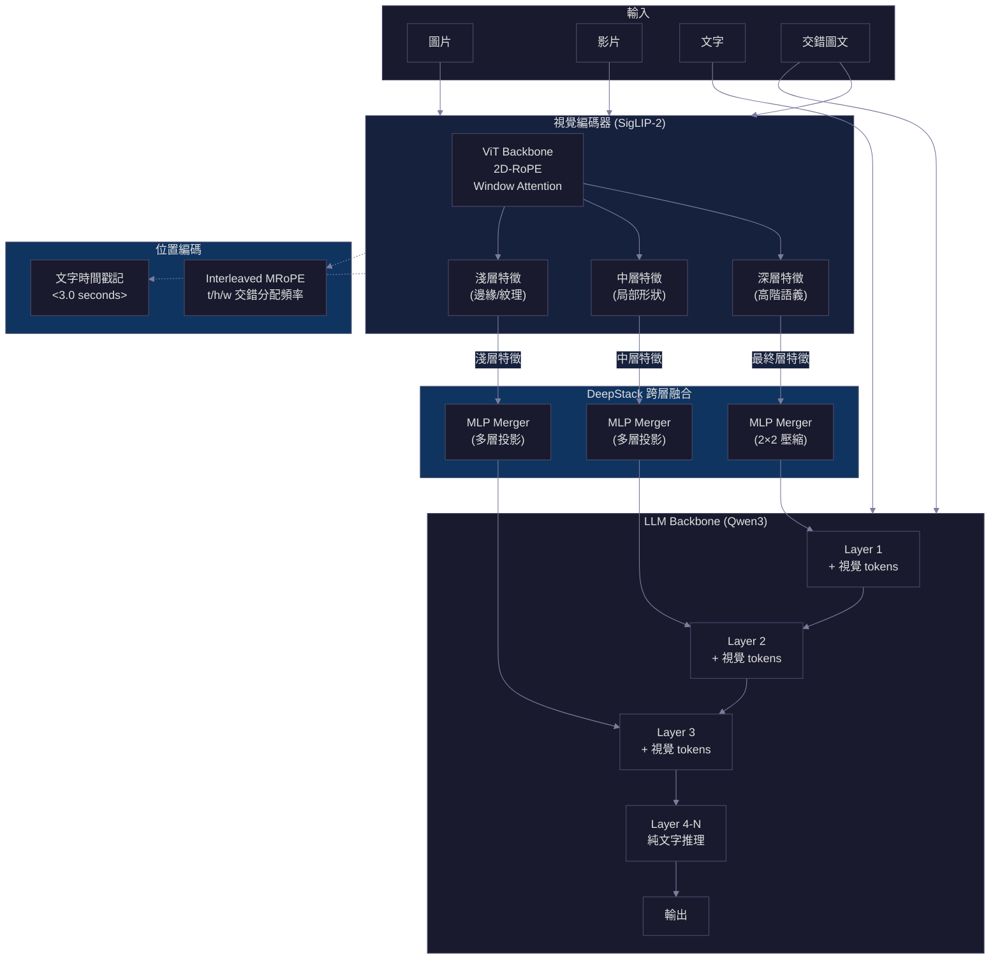
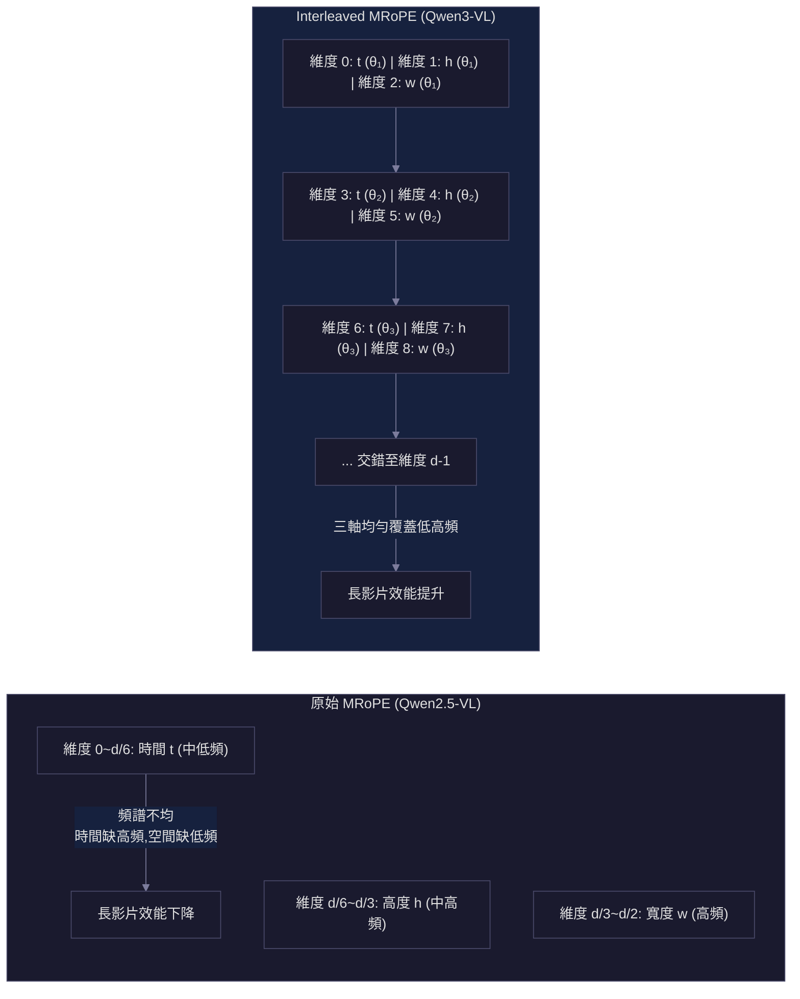
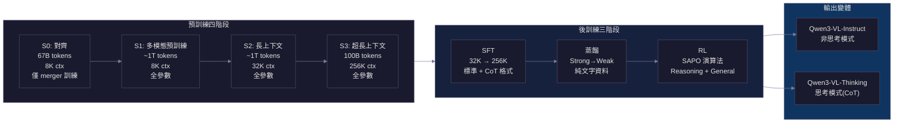

# Qwen3-VL 技術報告導讀

> **種子論文**: [Qwen3-VL Technical Report](https://arxiv.org/abs/2511.21631) (2025-11)
> **作者**: Shuai Bai, Yuxuan Cai, Ruizhe Chen et al. (Qwen Team, Alibaba Group)
> **機構**: Alibaba Group

---

## TL;DR

Qwen3-VL 是 Qwen 系列的第三代視覺語言模型，在架構上做出三個關鍵升級——Interleaved MRoPE、DeepStack 跨層視覺融合、文字時間戳記取代 T-RoPE——顯著提升了長上下文與多模態推理能力。模型家族涵蓋 2B 到 235B 的稠密與 MoE 變體，在 MMMU、MathVista、Video-MME 等數十個評測基準上超越 GPT-5、Gemini 2.5 Pro 與 Claude Opus 4.1。

---

## 背景與動機

### Vision-Language Model 的發展脈絡

Vision-Language Model (VLM) 的目標是讓模型同時理解視覺與語言資訊。從早期的 CLIP (2021) 對齊圖文表徵，到 Flamingo (2022) 引入交錯圖文訓練，再到 LLaVA (2023) 簡化架構為 `視覺編碼器 → 投影層 → LLM` 的三段式設計，這個領域的核心挑戰始終圍繞在幾個面向:

- **視覺解析度與計算效率的取捨**: 高解析度有助於細粒度感知（OCR、文件分析），但 token 數量會爆炸
- **長上下文處理**: 影片理解需要處理大量畫面，但 self-attention 的計算複雜度隨序列長度平方成長
- **多模態位置編碼**: 文字是 1D 序列，圖片是 2D 空間，影片是 3D（空間+時間），如何用同一套位置編碼統一三者是關鍵設計問題
- **資料質量**: 預訓練資料的規模與品質直接決定模型能力上限

### 從 Qwen2-VL 到 Qwen2.5-VL 再到 Qwen3-VL

Qwen 系列的 VLM 歷經三代的迭代:

**Qwen-VL (2023-08)** 首次提出 MRoPE（Multimodal Rotary Position Embedding），將位置編碼拆為時間(t)、高(h)、寬(w)三個維度來統一處理文字、圖片與影片。同時引入了動態解析度機制，讓模型可以處理任意長寬比的圖片。

**Qwen2.5-VL (2025-02)** 在此基礎上做了四項關鍵升級:

1. **Window Attention**: 在 ViT 中只在 4 層使用 full self-attention，其餘層使用 window attention，將計算複雜度從 $O(N^2)$ 降為 $O(N \cdot W)$，其中 $W$ 為 window size（112×112 pixels，約 8×8 patches）
2. **動態解析度 + 動態 FPS**: 支援任意解析度的圖片與任意幀率的影片，並將位置座標直接用實際像素值而非歸一化值表示
3. **T-RoPE**: 將 MRoPE 的時間維度對齊到絕對時間，讓模型能透過時間 ID 的間隔感知事件發生的速度
4. **從頭訓練 ViT**: 使用 DataComp 等資料集從零訓練自訂的 ViT，而非使用現成的 SigLIP 或 CLIP checkpoint

Qwen2.5-VL 在文件理解、物件定位、影片理解上表現出色，但仍有三個關鍵限制推動了 Qwen3-VL 的誕生:

1. **MRoPE 的頻譜不均**: 將 t/h/w 分別分配到不同頻率區段，導致長影片的遠程位置建模能力下降
2. **僅用 ViT 最後一層特徵**: 高階語義特徵足夠但低階空間細節不足，限制了細粒度定位能力
3. **T-RoPE 的稀疏性問題**: 時間 ID 直接對應絕對時間秒數，長影片會產生極大且稀疏的位置 ID，且訓練需要均勻採樣多種 FPS，資料建構成本高

**圖 1: Qwen3-VL 的整體架構。視覺編碼器從 SigLIP-2 提取三層特徵，透過 DeepStack 的專屬 MLP merger 注入 LLM 前三層。Interleaved MRoPE 與文字時間戳記分別處理空間與時間的位置編碼。**

Qwen3-VL 正是為了解決上述三個限制而生。

---

## 核心知識點

本文圍繞以下知識點展開，涵蓋位置編碼、視覺融合、訓練策略與資料工程等面向。這是理解 Qwen3-VL 架構與方法的關鍵，後續章節會依序展開:

1. **Interleaved MRoPE**——位置編碼的頻譜平衡設計
2. **DeepStack 跨層視覺融合**——多層 ViT 特徵注入 LLM
3. **文字時間戳記取代 T-RoPE**——更直接的影片時間表徵
4. **平方根損失重新加權**——平衡文字與多模態訓練目標
5. **四階段預訓練**——從對齊到超長上下文的漸進式擴展
6. **三階段後訓練與思考分支**——SFT、蒸餾、強化學習
7. **資料策略全面升級**——品質、多元性、結構化的三方並進
8. **稠密與 MoE 統一架構**——從 2B 到 235B 的跨量級設計

---

## 方法詳解

### 知識點 1: Interleaved MRoPE——位置編碼的頻譜平衡設計

**這個知識點要回答什麼問題?**

VLM 需要處理三種不同維度的輸入：文字是 1D（token 序列）、圖片是 2D（高度 x 寬度）、影片是 3D（時間 x 高度 x 寬度）。Rotary Position Embedding (RoPE) 原本是為 1D 語言模型設計的，如何將其推廣到多模態場景是一個核心架構問題。

### 從 RoPE 到 MRoPE

先回顧標準 RoPE 的工作原理。對於位置 $p$ 的 token，RoPE 在其 query 和 key 向量上施加一個旋轉變換:

$$
f(\mathbf{x}, p) = \mathbf{R}_{\Theta, p} \cdot \mathbf{x}
$$

其中 $\mathbf{R}_{\Theta, p}$ 是一個區塊對角矩陣，每個 $2 \times 2$ 區塊為:

$$
\mathbf{R}(\theta_i, p) = \begin{pmatrix} \cos p\theta_i & -\sin p\theta_i \\ \sin p\theta_i & \cos p\theta_i \end{pmatrix}
$$

頻率 $\theta_i = 10000^{-2i/d}$ 隨維度索引 $i$ 遞減，形成從高頻到低頻的頻譜。這使得 $\mathbf{q}_p \cdot \mathbf{k}_q$ 只依賴於相對位置 $p-q$，滿足 Transformer 對相對位置編碼的需求。

MRoPE 將這個概念推廣到多模態: 假設 token 的位置是 $(t, h, w)$ 三維的。對應的三組旋轉矩陣分別作用在 embedding 的三個子空間上:

$$
f(\mathbf{x}, (t, h, w)) = [\mathbf{R}_{\Theta_t, t}(\mathbf{x}_{[0:d/3]}),\; \mathbf{R}_{\Theta_h, h}(\mathbf{x}_{[d/3:2d/3]}),\; \mathbf{R}_{\Theta_w, w}(\mathbf{x}_{[2d/3:d]})]
$$

對於文字 token，$t = h = w = p$，退化為標準 1D RoPE。對於圖片 token，所有視覺 token 的 $t$ 相同（同屬一張圖片），$h$ 和 $w$ 反映像素空間位置。對於影片 token，不同幀的 $t$ 遞增，$h, w$ 同圖片。

這套設計優雅地統一了三種模態的位置編碼，但代價是每個空間軸都只分配到 $d/3$ 的維度。

**Qwen2.5-VL 的做法**

Qwen2-VL 提出的 MRoPE 將 embedding 維度切成三塊，分別分配給 t（時間）、h（高度）、w（寬度）三個軸：

$$
\text{RoPE}(\mathbf{x}) = [\text{RoPE}_t(\mathbf{x}_{[0:d/3]}),\; \text{RoPE}_h(\mathbf{x}_{[d/3:2d/3]}),\; \text{RoPE}_w(\mathbf{x}_{[2d/3:d]})]
$$

其中 $d$ 是隱藏維度。每組使用不同的旋轉頻率基底 $\Theta_t, \Theta_h, \Theta_w$。

這種設計的直覺是讓每個軸獨立建模自己的位置關係。但問題在於，不同頻率區段的旋轉頻率是不均勻的——低頻區段的頻率解析度不足以區分遠距離的位置差異，而高頻區段又過於敏感。由於 t/h/w 各自只分配到 $d/3$ 的維度，每個軸的有效頻率範圍變窄。

具體來說，假設基底頻率 $\Theta = \{\theta_i = 10000^{-2i/d} \mid i = 0, 1, ..., d/2-1\}$。當 t 只拿到索引 $[0:d/6]$ 的 $\theta_i$，這些對應的是中低頻率；h 拿到 $[d/6:d/3]$ 的中高頻；w 拿到 $[d/3:d/2]$ 的高頻。結果是時間軸缺少高頻解析（難以區分短時間內的細微位置變化），空間軸缺少低頻範圍（難以處理畫面內的長距離位置關係）。

Qwen3-VL 的論文指出，後續研究 (Huang et al., 2025) 發現這種頻譜不均直接導致了長影片理解 benchmark 的效能下降。

**Qwen3-VL 的解決方案**

Interleaved MRoPE 的核心想法很直接：不把 t/h/w 分配到連續的維度區塊，而是將三個軸的旋轉頻率交錯分配到所有維度上：

$$
\text{Interleaved RoPE}(\mathbf{x}) = [\text{RoPE}_{t,i}(\mathbf{x}_{[0]}), \text{RoPE}_{h,i}(\mathbf{x}_{[1]}), \text{RoPE}_{w,i}(\mathbf{x}_{[2]}), \text{RoPE}_{t,i+1}(\mathbf{x}_{[3]}), ...]
$$

也就是說，維度索引 $0, 3, 6, 9, ...$ 用 t 的旋轉頻率，$1, 4, 7, 10, ...$ 用 h 的，$2, 5, 8, 11, ...$ 用 w 的（依此類推）。這樣每個軸的頻率都能均勻地分布在從低到高的整個頻譜上。

數學上，這等同於給每個維度一個三元素 $(t, h, w)$ 的旋轉矩陣，其中每個元素各自有自己的頻率索引 $\theta_{t,i}, \theta_{h,i}, \theta_{w,i}$，並且 $i$ 的範圍擴展到 $d/6$（因為每個軸只分配到 $1/3$ 的維度數，但這些維度均勻分布在整個 $d$ 維空間中）。

**效果**: 這種平衡的頻譜顯著改善了長影片的位置建模能力，特別是在 Video-MME、MLVU 等需要跨大量畫面建立位置關聯的任務上。

**圖 2: 左側為原始 MRoPE 的連續維度分區分配，導致頻譜不均；右側為 Interleaved MRoPE 的交錯分配，確保 t/h/w 各軸均勻覆蓋低頻到高頻的整個頻譜。**

---

### 知識點 2: DeepStack 跨層視覺融合

**這個知識點要回答什麼問題?**

傳統的 VLM 設計中，ViT 會輸出最終層的隱藏狀態作為「視覺特徵」，經過 MLP 投影後餵入 LLM。但最終層的特徵偏向高階語義（這是什麼物體），丟失了中間層的低階空間細節（物體在哪裡、邊界在哪）。對於需要精確定位的任務（如物件偵測、文件版面分析），低階資訊同樣重要。

**先前做法**

最直覺的方案是「多尺度特徵圖」（如 Feature Pyramid Network），但這通常需要額外的卷積層或 Transformer 層來融合不同尺度的特徵，增加計算量。另一種方式是直接增加輸入圖片的解析度（Qwen2.5-VL 的做法），但這會讓 token 數量增加，最終還是增加 LLM 的計算負擔。

**Qwen3-VL 的做法**

Qwen3-VL 引入 DeepStack 機制（借鑑自 Meng et al. 2024），從 ViT 的中間層提取特徵，透過輕量級殘差連接直接注入 LLM 的對應層：

1. **特選三個 ViT 層**: 從 ViT 編碼器的三個不同深度選取特徵（低、中、高三個層級），分別捕捉邊緣/紋理（低層）、局部形狀（中層）、整體語義（高層）資訊

2. **專用投影層**: 每個層級有自己專屬的 2 層 MLP merger，將對應層級的視覺 tokens 投影到 LLM 的隱藏維度

3. **注入 LLM 前三層**: 投影後的視覺 tokens 透過加法直接與 LLM 前三層的隱藏狀態融合

關鍵設計是，這些跨層視覺 tokens 不增加輸入序列長度——它們只在 LLM 的前三層殘差連接中出現，後續層次的 LLM 計算仍然只處理輸出的文字 tokens。這與「把更多視覺 tokens 塞進 LLM 輸入」的做法有本質不同。

**與 Qwen2.5-VL 的差異**

Qwen2.5-VL 只使用 ViT 最終層的輸出，經 MLP 壓縮 $2 \times 2$ 區塊為一個 token 後餵入 LLM 輸入層。Qwen3-VL 的 DeepStack 在此基礎上增加了跨層特徵融合，且注入點不是只在第一層，而是分布在前三層。

**效果**: DeepStack 讓模型在保持計算效率的同時保留了更豐富的視覺資訊，對 2D/3D grounding、文件 OCR、細粒度分類等任務有顯著提升。

---

### 知識點 3: 文字時間戳記取代 T-RoPE

**這個知識點要回答什麼問題?**

影片理解需要模型感知時間——事件發生的先後順序、持續時間、跨畫面的對應關係。如何有效地將時間資訊編碼進模型，是 VLM 的關鍵設計取捨。

**Qwen2.5-VL 的 T-RoPE 方法**

Qwen2.5-VL 提出了 T-RoPE（Time-synchronized MRoPE），將 MRoPE 的 t 維度位置 ID 直接對齊到影片的絕對時間。假設影片第 $i$ 幀的時間戳是 $t_i$ 秒，則該幀所有視覺 tokens 的 t 維度位置 ID 都設為 $t_i$。

這種設計的直覺是讓模型透過時間 ID 的間隔來感知時間流逝的速度——兩幀間隔 2 秒（ID 間隔 2）和間隔 0.5 秒（ID 間隔 0.5）會產生不同的旋轉角度差異，模型可以從中學習時間動態。

**兩個關鍵限制**

論文明確指出 T-RoPE 的兩個問題:

1. **極大且稀疏的時間 ID**: 對於一小時的影片，時間 ID 範圍從 0 到 3600。RoPE 的旋轉頻率 $10000^{-2i/d}$ 對應的編碼週期可以覆蓋這個範圍，但由於 t 維度只分配到 $d/3$ 的維度，低頻區段的有效長度不足以編碼超過數百秒的距離，導致長影片的遠程時間關聯退化。

2. **訓練資料建構成本高**: T-RoPE 的有效學習需要在多種 FPS 下均勻採樣——如果訓練時只用了固定 FPS（如 2 fps），模型就無法泛化到其他採樣率。這意味著每筆影片資料都需要做 FPS 變換，大幅增加預處理成本。

**Qwen3-VL 的解決方案**

Qwen3-VL 徹底拋棄了 T-RoPE（以及 MRoPE 的 t 維度），改成文字形式的時間戳記。做法很簡單：每組影片畫面（temporal patch）前加上一個格式化的文字 token，例如 `<3.0 seconds>` 或 `<00:00:03>`。

在訓練時同時使用秒數格式（seconds）與時分秒格式（HMS），讓模型學會解釋多種時間表示法。

這個做法的代價是增加了少量的輸入長度（每個 frame group 多 ~5 個 tokens），但其優點顯著：

- 時間資訊由 LLM 的語言理解能力直接處理，不依賴位置編碼的頻率限制
- 沒有 ID 稀疏性問題，模型可以自然處理任意長度的影片
- 訓練資料不需要特殊的 FPS 採樣策略

**潛在缺點**: 文字時間戳記是離散的，不如 T-RoPE 的連續值精細。論文沒有深入討論這種離散化是否在某些需要 sub-second 精度的任務上會造成瓶頸，這可能是未來可以探究的方向。

---

### 知識點 4: 平方根損失重新加權

**這個知識點要回答什麼問題?**

VLM 的訓練資料由純文字資料與多模態資料混合組成。兩者的 token 數量差異很大——一段圖片描述可能只有數十個 tokens，但一份文字文件可能長達數千 tokens。如果直接使用標準的 cross-entropy loss，長序列的貢獻會遠大於短序列，導致模型偏向文字能力而忽略多模態理解。

**方根正規化**

Qwen3-VL 引入 square-root-normalized per-token loss。設一個訓練樣本 $i$ 有 $L_i$ 個 tokens，其 loss 為:

$$
\mathcal{L}_i = -\frac{1}{\sqrt{L_i}} \sum_{j=1}^{L_i} \log p(y_{i,j} | x_i, y_{i,<j})
$$

對比傳統的 per-sample loss:

$$
\mathcal{L}_i^{\text{per-sample}} = -\frac{1}{L_i} \sum_{j=1}^{L_i} \log p(y_{i,j} | x_i, y_{i,<j})
$$

在 per-sample loss 中，長序列的梯度貢獻 $\sim 1$（因為除以 $L_i$ 後 token 數量被正規化），短序列也是 $\sim 1$，兩者相當。但在跨樣本的 batch 中，長序列樣本數通常遠少於短序列樣本數，導致平均 loss 被短序列主導。

平方根正規化給長序列 $\propto 1/\sqrt{L_i}$ 的權重，短序列 $\propto 1/\sqrt{L_i}$。因此長序列（如文字文件）的單樣本貢獻 $\propto \sqrt{L_i}$，短序列（如圖片描述）的貢獻 $\propto 1$。這意謂著多模態資料在整個訓練過程中的影響力被提升，因為它們的長度較短但被賦予了相對更高的權重。

Qwen3-VL 的實驗顯示，square-root reweighting 在維持甚至提升純文字基準效能的同時，顯著推進了多模態 benchmark 的分數。

---

### 知識點 5: 四階段預訓練——從對齊到超長上下文

**這個知識點要回答什麼問題?**

訓練一個 VLM 不是一個步驟就能完成的。從零開始同時訓練 ViT 和 LLM 既昂貴又不穩定。Qwen3-VL 設計了四個漸進階段，從最簡單的對齊開始，逐步解凍參數並擴展上下文長度。

**Stage 0: Vision-Language Alignment (67B tokens, 8K context)**

目標是高效地橋接視覺編碼器與 LLM 之間的表徵差距。**只有 MLP merger 的參數被訓練**，視覺編碼器與 LLM 皆凍結。訓練資料為高品質的圖文配對資料（圖說、視覺知識、OCR 資料）。序列長度為 8,192。

這個對齊優先策略與 Qwen2.5-VL 的第一步驟類似，但 Qwen2.5-VL 在第一階段只訓練 ViT 來「對齊語言模型」，而 Qwen3-VL 第一階段是訓練 merger（即投影層）來對齊視覺與語言。兩種策略的出發點不同：Qwen2.5-VL 認為 ViT 需要先適應 LLM，Qwen3-VL 認為投影層才是跨模態對齊的瓶頸。論文沒有直接比較兩種策略，但從後續的完整訓練結果來看，Qwen3-VL 的策略同樣有效。

**Stage 1: Multimodal Pre-Training (~1T tokens, 8K context)**

解凍所有參數進行完整的端到端訓練。資料由視覺語言資料與純文字資料混合組成。視覺部分包含交錯圖文文件、視覺定位任務、VQA、STEM 資料、少量的影片資料。總訓練量約 1 兆 tokens。

**Stage 2: Long-Context Pre-Training (~1T tokens, 32K context)**

序列長度四倍增至 32,768。增加純文字資料的比例以強化長文本理解，同時引入大量影片與 Agent 導向的指令跟隨資料。這是 Qwen3-VL 獲得影片理解能力的主要階段。

**Stage 3: Ultra-Long-Context Adaptation (100B tokens, 262K context)**

將序列長度推到極限——262,144（256K tokens）。使用專門挑選的 100B token 資料集，重點放在長影片與長文件理解。這階段確保模型能處理一個小時以上的影片或數百頁的技術文件。值得注意的是，這個階段的訓練量（100B tokens）遠少於前三個階段——因為目標不是學習新知識，而是讓模型適應超長序列的位置編碼與注意力計算模式。

比較 Qwen2.5-VL 的三階段流程（ViT 預訓練 → 多模態預訓練 8K → 長上下文 32K），Qwen 系列在預訓練策略上的演進軌跡清晰可見：Qwen2-VL 只有 2 階段（對齊 + 多模態），Qwen2.5-VL 擴展到 3 階段（增加長上下文），Qwen3-VL 再到 4 階段（細分對齊 + 增加超長上下文）。這反映了一個清晰的趨勢：隨著模型能力提升，預訓練需要更細緻的階段劃分，以平衡計算資源與學習效率。

---

**圖 3: Qwen3-VL 的訓練管線。預訓練分四個階段循序漸進（對齊 → 多模態 → 長上下文 → 超長上下文），後訓練再經 SFT → 蒸餾 → RL 三階段，最終分支為 Instruct 與 Thinking 兩種變體。**

---

### 知識點 6: 三階段後訓練——SFT、蒸餾、強化學習

**這個知識點要回答什麼問題?**

預訓練讓模型具備基礎能力，但要讓模型「聽話」（遵循指令）、「會推理」（多步邏輯）、「對齊偏好」（符合人類期待），需要後訓練的精細調整。

**Stage 1: Supervised Fine-Tuning (SFT)**

使用約 120 萬筆高品質資料進行指令微調，資料構成: 1/3 純文字 + 2/3 多模態（圖片+影片）。包含單輪與多輪對話，並支援交錯圖文輸入以實現 Agent 行為。

訓練分兩階段: 先在 32K 上下文做一輪 epoch，再在 256K 上下文做第二輪，期間穿插長上下文資料（數百頁技術文件、完整教科書、長達兩小時的影片）。

最關鍵的設計是**分支策略**：非思考模型使用標準格式的 SFT 資料（直接回答），思考模型使用 Chain-of-Thought 格式（先推理再回答），為後續的 thinking vs non-thinking 變體奠定基礎。

**Stage 2: Strong-to-Weak 蒸餾**

第二階段使用知識蒸餾，由強大的教師模型（可能是完整的 235B 模型）將能力轉移至輕量級學生模型。關鍵在於蒸餾是**純文字資料**——這是一個巧妙的設計選擇。

為什麼純文字蒸餾對多模態任務也有幫助？論文的解釋是: 多模態推理能力很大程度上源自語言推理能力。透過純文字蒸餾強化 LLM backbone 的推理能力，這些能力自然遷移到多模態場景。實驗結果支援這個觀點——蒸餾後不僅文字任務提升，多模態推理同樣改善。

蒸餾分兩階段:
- Off-policy：教師模型產生輸出，學生模仿
- On-policy：學生自己生成序列，然後與教師的 logits 比對並最小化 KL 散度

**Stage 3: Reinforcement Learning (RL)**

第三階段分成兩個部分:

**Reasoning RL**: 針對數學、程式碼、邏輯推理、視覺定位、視覺謎題等可驗證的任務，使用 SAPO (Smooth and Adaptive Policy Optimization) 演算法進行強化學習。SAPO 是 Qwen3 引入的 policy gradient 方法，相較 PPO 更穩定。

每項任務都有可程式化驗證的答案（規則或程式碼執行器），能給出明確的 reward signal。共使用約 30K 筆 RL queries，每個 query 採樣 16 個 responses，排除 pass rate 超過 90% 的簡單問題。

**General RL**: 針對開放式任務提升模型的一般化能力與操作穩健性。reward 由兩部分組成:
- Rule-based rewards: 針對格式、長度、結構化輸出等可驗證維度
- Model-based rewards: 使用 Qwen2.5-VL-72B 或 Qwen3 作為評判模型，評估回答的正確性、完整性與適切性

General RL 還負責「糾正」SFT 階段學到的不良先驗，例如對違反常識的計數問題（故意誤導的圖片）的錯誤反應。透過引入專門設計的、會觸發這些錯誤的任務，模型可以學會與錯誤先驗對抗。論文中給出具體的例子: 在計數任務中，模型可能因為訓練資料中「一群鳥通常是 5-10 隻」的先驗而給出錯誤的計數，即使圖片中實際只有 3 隻；General RL 透過設計會暴露這個偏差的情境，並在模型輸出正確答案時給予獎勵，逐步抑制先驗偏差。

---

### 知識點 7: 資料策略全面升級

**這個知識點要回答什麼問題?**

LLM 時代的共識是「資料質量決定模型能力上限」。Qwen3-VL 在資料層面做了全面升級，以下列出幾個最關鍵的面向:

**圖說重標註 (Recaptioning)**

使用專門 fine-tune 過的 Qwen2.5-VL-32B 模型，對每張圖片的原始文字進行重標註。原始網路資料的圖說通常簡短、嘈雜或不相關，重標註模型能生成更全面、流暢、細粒度的描述。去重則基於重標註後的文字進行語義相似度比對，而非基於圖片——這保留了視覺多樣性。

**交錯圖文資料**

收集真實世界的多模態文件（網頁、書籍）。對書籍級資料，使用 fine-tune 過的 Qwen2.5-VL-7B 進行精確多模態解析，精準提取並對齊嵌入的圖表與照片。為支援超長上下文，將連續頁面合併為最高 256K tokens 的序列。

**3D 定位資料**

一個特別有趣的新增資料類型。從公開的室內外場景資料集中，將資料重構為 VQA 格式: 單視角相機圖片 + 自然語言指代表達 + 9-DoF 3D 邊界框註釋。模型必須從單張 2D 圖片推斷物體在 3D 空間中的位置、姿態與語義類別。

資料經過 Omni3D 統一標註系統、篩選遮擋與雜訊標註、並合成豐富的描述性文字查詢，使模型學習超越類別名稱的細粒度 3D 空間推理。

**STEM 推理資料**

- 程式化產生 100 萬點定位樣本與 200 萬視覺感知 VQA 樣本（幾何圖形）
- 兩階段的標註框架: 初始生成 → 模型驗證，確保標註準確度
- 60M+ K12 與大學層級練習題，經嚴格的清洗與重構
- 12M+ 長 CoT 多模態推理樣本，每個樣本的推理軌跡經規則檢查與模型驗證

**Agent 資料**

- GUI 感知: 跨桌面、手機、網頁平台的截圖標註（元素描述、密集標註、密集定位）
- Agent 行動: 多步任務軌跡，透過 self-evolving 框架產生，搭配人工審計
- Function Calling: 多模態函數呼叫軌跡合成管線，不需實作可執行的函數。流程: 給定圖片 → 生成使用者查詢與函數定義 → 採樣模型呼叫 → 合成函數回應 → 重複直到查詢被解決
- Search 整合: 收集多模態事實查詢軌跡，結合圖片搜索與文字搜索工具，鼓勵模型對不熟悉的實體進行搜索再回答

---

### 知識點 8: 稠密與 MoE 統一架構

**這個知識點要回答什麼問題?**

不同應用場景對模型的要求不同——邊緣裝置需要輕量級模型，雲端服務需要最強的效能。Qwen3-VL 因此設計了從 2B 到 235B 的完整模型家族。

| 變體 | 總參數 | 啟用參數 (per token) |
|------|--------|---------------------|
| Qwen3-VL-2B | 2B | 2B |
| Qwen3-VL-4B | 4B | 4B |
| Qwen3-VL-8B | 8B | 8B |
| Qwen3-VL-32B | 32B | 32B |
| Qwen3-VL-30B-A3B (MoE) | 30B | 3B |
| Qwen3-VL-235B-A22B (MoE) | 235B | 22B |

旗艦模型 Qwen3-VL-235B-A22B 有 235B 總參數，但每次推理只啟用 22B 參數。這得益於 Mixture-of-Experts (MoE) 架構——每個 FFN 層由多個 expert 子網路組成，router 網路根據輸入選擇最相關的 top-K experts 來啟動。

所有變體共用同一套架構核心（SigLIP-2 視覺編碼器、Interleaved MRoPE、DeepStack、文字時間戳記），LLM backbone 則根據參數量選擇對應的 Qwen3 模型。

### 視覺編碼器的連續訓練

Qwen3-VL 的視覺編碼器基於 SigLIP-2 架構，不同於 Qwen2.5-VL 從頭訓練 ViT 的做法。具體流程是: 從 SigLIP-2 的官方預訓練 checkpoint 出發，以動態解析度繼續訓練視覺編碼器。多數模型使用 SigLIP2-SO-400M 變體（400M 參數），而輕量級模型（2B 和 4B）則使用 SigLIP2-Large（300M 參數）以控制計算成本。

這種「基於預訓練 checkpoint 繼續訓練」的策略比從頭訓練更有效率，因為 SigLIP-2 已經具備了通用的視覺表徵能力，Qwen3-VL 只需要適應動態解析度與特定的多模態資料分布即可。

---

## 架構演進對比: Qwen2.5-VL → Qwen3-VL

Qwen3-VL 的進步建立在 Qwen2.5-VL 的基礎上，但並非直接複製。以下是兩個版本在關鍵設計上的詳細對比:

| 設計維度 | Qwen2.5-VL | Qwen3-VL | 差異分析 |
|----------|------------|----------|---------|
| LLM Backbone | Qwen2.5 (3B/7B/72B) | Qwen3 (2B/4B/8B/32B/30B MoE/235B MoE) | LLM 世代更新，引入 MoE 架構 |
| 視覺編碼器 | 自訓練 ViT (從頭訓練) | SigLIP-2 (預訓練 checkpoint 繼續訓練) | 從自訓轉向基於 SigLIP-2 |
| ViT Attention | Window Attention (4 層 full attn) | 沿用 Window Attention | 保留被驗證的有效設計 |
| 位置編碼 | MRoPE 分區分配 + T-RoPE | Interleaved MRoPE + 文字時間戳記 | 頻譜平衡 + 拋棄 T-RoPE |
| 視覺融合 | 僅最後一層 ViT 特徵入 LLM 第一層 | DeepStack: 三層 ViT 特徵入三層 LLM | 多層級保留低階空間資訊 |
| 特徵壓縮 | 2×2 MLP merger (單一) | 2×2 MLP merger + 多層專用 merger | 融合層級增加，計算量不變 |
| 預訓練階段 | 3 階段 (ViT → 8K → 32K) | 4 階段 (S0 對齊 → 8K → 32K → 256K) | 增加對齊 + 256K 超長上下文 |
| 預訓練 tokens | ~4.1T | ~2.2T | 總量減少但品質與多樣性提升 |
| Loss 設計 | Per-sample loss | Square-root per-token loss | 多模態貢獻重新平衡 |
| 後訓練 | SFT + RL | SFT + 蒸餾 + RL (Reasoning + General) | 增加蒸餾階段與雙軌 RL |
| RL 演算法 | 未公開 | SAPO | 更穩定的 policy gradient |
| Thinking 分支 | 無 | Non-thinking + Thinking (CoT) | 新增思考模式 |
| 視覺 Agent | 有限 | 兩階段訓練 (SFT + 工具整合 RL) | 顯著強化 |
| 模型變體 | 3 種稠密 | 6 種 (稠密 + MoE) | 擴展參數範圍 |
| 最大上下文 | 32K | 256K | 8 倍擴展 |

這個對比表清楚顯示 Qwen3-VL 在**架構設計上偏重演化而非革命**——保留 Window Attention、MLP merger 等有效設計，在瓶頸位置（位置編碼、視覺融合、loss 設計）做針對性改進。最顯著的跳躍在參數規模（235B MoE）、上下文長度（256K）與思考推理能力。

---

## 實驗結果

### 主要 Benchmark 表現

以下摘錄旗艦模型 Qwen3-VL-235B-A22B 的關鍵評測結果:

| Benchmark | Qwen3-VL Thinking | Qwen3-VL Instruct | Gemini 2.5 Pro | GPT-5 |
|-----------|-------------------|-------------------|----------------|-------|
| MMMU | 80.6 | 78.7 | 81.7 | - |
| MathVista (mini) | **85.8** | 84.9 | 68.8 | - |
| MathVision | **74.6** | 66.5 | 71.2 | - |
| MMBench-EN | 88.8 | **89.3** | - | - |
| RealWorldQA | 81.3 | **79.2** | - | - |
| HallusionBench | **66.7** | 63.2 | 50.6 (GPT-5: 65.7) | - |
| MIA-Bench | **92.7** | 91.3 | - | - |
| OCRBench | 96.5 | **97.1** | - | - |
| DocVQA | 89.5 | **89.2** | - | - |
| Charades-STA (mIoU) | **0.155** | 0.143 | - | - |
| Video-MME (w/o sub.) | 81.5 | **82.2** | - | - |

關鍵觀察:

- **數學推理全面領先**: 在 MathVista、MathVision、MathVerse 等數學推理 benchmark 上，Qwen3-VL-Thinking 大幅超越 Gemini 2.5 Pro（差值可達 17 分），這是 Qwen3-VL 最突出的優勢領域
- **幻覺控制出色**: HallusionBench 分數 66.7，超越 GPT-5 的 65.7 和 Claude Opus 4.1 的 60.4
- **指令跟隨能力強**: MIA-Bench 分數 92.7，展現了優秀的複雜指令遵循能力
- **文件理解穩健**: OCRBench 97.1、DocVQA 89.2，在文件理解基準上達到 SOTA
- **尺寸擴展性良好**: 從 2B 到 8B 的效能增長平穩，8B Thinking 在 MMBench-EN 上達到 85.3、MMStar 達到 75.3

### 中型模型的比較

Qwen3-VL-32B 是值得注意的型號。論文的實驗顯示，Qwen3-VL-32B 在推理任務上**已經超越前一代的 Qwen2.5-VL-72B**，這意味著架構改進帶來的效益大於 2 倍以上的參數縮減。同時 30B-A3B 的 MoE 變體也在多數任務上展現了與 32B Dense 競爭的表現，驗證了 MoE 在計算效率上的優勢。

| 中型模型 | MathVista | MathVision | MMBench-EN | RealWorldQA | MMStar |
|----------|-----------|------------|------------|-------------|--------|
| Qwen3-VL-32B Thinking | **85.8** | **74.6** | 89.5 | **79.4** | **78.7** |
| Qwen3-VL-30B-A3B Thinking | 84.1 | 71.2 | **89.6** | 77.2 | 77.1 |
| Gemini 2.5 Flash | 68.8 | 71.2 | - | - | - |
| GPT-5-mini | 70.5 | 55.4 | - | - | - |

Qwen3-VL-32B Thinking 超越 Gemini 2.5 Flash 近 17 分（MathVista）和 GPT-5-mini 近 20 分，差距懸殊。Qwen3-VL-30B-A3B（MoE）雖然總參數相近，但啟用參數僅 3B，在效率上更優，分數差距也在可接受範圍內。

### 小型模型的可擴展性

| 小型模型 | MMBench-EN (Thinking) | MMStar (Thinking) | MIA-Bench |
|----------|----------------------|-------------------|-----------|
| Qwen3-VL-2B | 79.9 | 68.1 | 87.7 |
| Qwen3-VL-4B | 82.9 | 71.3 | 90.5 |
| Qwen3-VL-8B | 85.3 | 75.3 | 92.1 |
| GPT-5-Nano | - | - | 90.0 |

從 2B 到 8B 的效能增長平穩，每翻倍參數量約提升 2-4 分。值得注意的是，最小型的 2B 模型在 MIA-Bench 上已達到 87.7，展現了不錯的指令跟隨能力。

### 消融與分析

論文雖然沒有獨立的消融實驗章節，但從架構設計與資料策略中可以推斷以下關鍵設計選擇的影響。以下的分析主要基於 Qwen3-VL 在各項 benchmark 上的表現模式，以及與 Qwen2.5-VL 的間接對比。

**Interleaved MRoPE vs MRoPE**

原始 MRoPE 將 t/h/w 分配到連續的維度區塊，導致時間軸缺少高頻解析、空間軸缺少低頻範圍。這個效應在長影片任務中尤其明顯，因為模型需要跨數百幀建立時間關聯。Qwen3-VL 在 Video-MME 上取得 81.5、MLVU 上取得 53.7，對比 Qwen2.5-VL-72B 的公開結果（約 75 與 43 左右）有顯著提升。雖然 LLM backbone 從 Qwen2.5 升級到 Qwen3 也有貢獻，但 Interleaved MRoPE 的頻譜平衡是位置編碼層面的關鍵改進。

**DeepStack vs 單層注入**

DeepStack 選擇 ViT 的三個不同層級（低、中、高）並注入 LLM 前三層。這個設計直接影響 2D/3D grounding 任務的表現。Qwen3-VL-235B 在 RefCOCO (avg) 上達到 92.1、ARKitScenes 達到 87.5、SUNRGBD 達到 89.4。這些 3D 場景理解任務需要從單張圖中推斷物體的空間關係——高層語義（這是什麼物體）和低層細節（邊界在哪）兼需，正是 DeepStack 的設計目標。

**文字時間戳記 vs T-RoPE**

文字時間戳記是 Qwen3-VL 最「不優雅」但也最實用的設計。它捨棄了位置編碼層面的時間建模，把問題交給 LLM 的語言理解能力。代價是增加了少量 tokens（每段影片多 ~5 tokens/frame group），但好處是:
1. 不需要在訓練時調整 FPS 採樣（節省資料建構成本）
2. 沒有位置 ID 稀疏性問題（可處理任意長度影片）
3. 時間精確度不受頻率限制（秒或 HMS 格式皆可）

Charades-STA mIoU 0.155 的表現（領先 GPT-5 的 0.126）間接驗證了這個設計的有效性。

### 影片理解

影片理解是 Qwen3-VL 的重點強化方向，得益於文字時間戳記與 DeepStack 的結合以及 256K 超長上下文支援:

| Benchmark | Qwen3-VL-235B Thinking | Gemini 2.5 Pro | GPT-5 | Claude Opus 4.1 |
|-----------|----------------------|----------------|-------|-----------------|
| MVBench | **92.1** | 91.5 | 90.3 | 76.8 |
| Video-MME (w/o sub.) | **81.5** | 79.6 | 78.9 | 75.4 |
| MLVU (Avg) | **53.7** | 44.5 | 52.9 | 42.1 |
| LVBench | 34.9 | **37.1** | 35.8 | 18.2 |
| Charades-STA (mIoU) | **0.155** | 0.147 | 0.126 | 0.108 |
| VideoMMMU | **43.2** | 40.8 | 39.2 | 35.6 |
| MMVU | **56.9** | 55.1 | 54.0 | 42.5 |

關鍵觀察:

- **Video-MME (無字幕)**: Qwen3-VL-235B Thinking 以 81.5 領先，在需要純視覺理解的影片任務上展現優勢
- **MLVU**: Qwen3-VL 以 53.7 大幅超越 Gemini 2.5 Pro (44.5)，在長影片理解上取得顯著領先——這正對應了 Interleaved MRoPE 與文字時間戳記的設計目標
- **Charades-STA**: 時間定位 mIoU 0.155，驗證文字時間戳記在精確時間定位上的有效性
- **LVBench**: 低於 Gemini 2.5 Pro（37.1 vs 34.9），這是少數 Qwen3-VL 未取得領先的 benchmark

需要注意的是，論文中提到評測時對輸入幀數設定了上限: Qwen3-VL 最高 2,048 幀，而 Gemini 2.5 Pro 為 512 幀、GPT-5 為 256 幀、Claude Opus 4.1 為 100 幀——比較並非完全公平。

### Agent 與 GUI 能力

Qwen3-VL 在 Agent 任務上特別強化了 GUI 感知與決策能力:

| Benchmark | Qwen3-VL-32B | Qwen3-VL-235B |
|-----------|-------------|--------------|
| ScreenSpot Pro | **82.2** | **92.1** |
| OSWorld | **41.0** | **56.2** |
| AndroidWorld | **63.7** | **66.1** |

在 OSWorld（桌面作業系統操作）與 AndroidWorld（Android 手機操作）這兩個需要多步決策的任務上，Qwen3-VL-32B 已經達到現有專用 Agent 模型的水平。ScreenSpot Pro 的 UI 元素定位分數 92.1 則顯示 DeepStack 對細粒度感知任務的增益。

### 多模態程式碼能力

| Benchmark | Qwen3-VL-235B | GPT-5 |
|-----------|--------------|-------|
| Design2Code | **43.2** | 31.0 |
| ChartMimic | **53.7** | 42.5 |

在 Design2Code（截圖→HTML/CSS）與 ChartMimic（圖表→程式碼）上，Qwen3-VL 大幅領先 GPT-5，展現了視覺理解與程式碼生成的結合能力。

---

## 延伸閱讀

### Dependency Papers (本文涵蓋)

1. **Qwen2.5-VL Technical Report** ([2502.13923](https://arxiv.org/abs/2502.13923))
   - 與本文關係: Qwen3-VL 的直接前身，引入 Window Attention、動態解析度/FPS、T-RoPE、四階段預訓練雛形。Qwen3-VL 的三大架構升級（Interleaved MRoPE、DeepStack、文字時間戳記）都是為了解決 Qwen2.5-VL 的限制。

### 關鍵參考論文

- **DeepStack** (Meng et al., 2024) — Qwen3-VL 的跨層視覺融合機制靈感來源
- **Qwen2-VL** (Wang et al., 2024) — 首次提出 MRoPE，Qwen 系列 VLM 的起點
- **Qwen3** (Yang et al., 2025a) — Qwen3-VL 的 LLM backbone
- **SigLIP-2** (Tschannen et al., 2025) — 視覺編碼器基礎架構
- **SAPO** (Gao et al., 2025) — RL 階段使用的 policy gradient 演算法

---

## 我的觀察

**Qwen3-VL 是「工程驅動」而非「方法驅動」的創新。**

讀完這篇技術報告，我最大的感受是 Qwen3-VL 的進步主要來自**工程細節的累積**，而不是單一的方法突破。三個架構升級（Interleaved MRoPE、DeepStack、文字時間戳記）都不是全新的發明，而是將已知技術（頻譜交錯、跨層融合、文字編碼時間）巧妙地整合到 VLM 框架中。

這與前一代 Qwen2.5-VL 形成有趣的對比。Qwen2.5-VL 最大的創新是 Window Attention 和 T-RoPE——前者是計算效率的突破，後者是時間編碼的創新。但 Qwen3-VL 的經驗是: T-RoPE 雖然巧妙，但在實務上不如簡單的文字時間戳記可靠；單層 ViT 特徵雖然簡單，但多層融合（DeepStack）就能無痛提升定位能力。這暗示了一個趨勢：在 VLM 領域，「簡單但工程到位」的解決方案正在勝過「複雜但難以工程化」的方案。

**資料策略是真正的護城河。**

論文中花了最大的篇幅（Section 3 的八個子節：Image Caption、Interleaved Data、Knowledge、OCR/Grounding、Code、Video、STEM、Agent）描述資料處理流程，這不是偶然的。從重標註管線、交錯資料清洗、3D 資料合成、到 60M+ STEM 練習題，Qwen3-VL 的資料工程規模令人印象深刻。在模型架構趨於收斂的時代（大家的 VLM 都是 ViT + MLP + LLM），資料的品質與多樣性才是決定模型能力上限的關鍵因素。

值得注意的一個細節是預訓練 token 總量從 Qwen2.5-VL 的 4.1T 減少到 Qwen3-VL 的約 2.2T，但效能卻顯著提升。這更加印證了「資料品質 > 資料數量」的觀點。Qwen3-VL 透過精細的資料清洗、多階段過濾（Query Filtering + Response Filtering）、與目標性合成，用更少的 tokens 取得了更好的結果。

**MoE 的潛力。**

235B 總參數但只啟用 22B 的 MoE 設計，讓 Qwen3-VL 在推理成本可控的情況下達到接近（甚至超越）更大稠密模型的效果。這驗證了 MoE 在 VLM 領域的適用性，未來 1000B+ 參數的 MoE VLM 可能會成為主流。另一個有趣的資料點是 30B-A3B 的 MoE 變體雖然在部分 benchmark 上略低於 32B Dense，但差距不大——考慮到啟用參數只有後者的 1/10，這個權衡非常值得。

**從 VLM 到 AI Agent 的橋樑。**

Qwen3-VL 不只是「看圖回答問題」的模型。它的 Agent 能力——GUI 操作、函數呼叫、搜索整合、視覺思考 Agent——顯示了 VLM 從感知到行動的演進方向。論文提出的「Thinking with Images」兩階段訓練（冷啟動 SFT → 工具整合 RL）是一個可以獨立出來的方法論貢獻，不只適用於 Qwen3-VL，也適用於任何需要視覺 Agent 能力的系統。

**一些未解答的問題:**

1. **LLM backbone 的依賴**: Qwen3-VL 依賴 Qwen3 的 LLM backbone，而 Qwen3 本身也在快速迭代——這意味著 Qwen3-VL 的能力上限仍然受限於底層 LLM。如果 Qwen3 在純文字推理上有侷限，這些侷限會直接反映在 VLM 的多模態推理上。一個值得追蹤的問題是 VLM 架構本身在多大程度上可以補償 LLM 的不足。

2. **文字時間戳記的離散化**: 文字時間戳記 `<3.0 seconds>` 是離散的文字表示，不像 T-RoPE 的連續位置 ID 那樣平滑。在需要 sub-second 精度的任務上，離散化是否會成為瓶頸？Charades-STA 的 mIoU 分數（0.155）雖然領先，但這個分數本身仍然偏低——最好的方法也離精確定位還有很大差距。

3. **缺少消融實驗**: DeepStack 為什麼選擇三層 ViT 特徵？為什麼注入 LLM 前三層？Square-root reweighting 的指數為什麼是 1/2 而不是 1/4 或 3/4？這些設計選擇缺少消融實驗的定量支撐。這在技術報告中可以理解（篇幅壓縮），但對研究社群來說，這些細節的定量分析會非常有價值。

4. **延遲/吞吐量資料**: 論文報告了性能數據（accuracy），但沒有報告任何推理效率數據（如 tokens/sec、延遲、記憶體用量）。對於 235B 的 MoE 模型，實際部署時的推理效率是一個關鍵的工程問題。

### 限制

Qwen3-VL 有以下未被論文明確討論的限制:

- **幻覺未完全解決**: 雖然 HallusionBench 分數領先，但 66.7 的分數意味著約 1/3 的場景仍存在幻覺問題——VLM 的幻覺遠未解決
- **長影片高階推理**: MLVU 平均 53.7 分，說明了即使是目前最好的模型，對長影片的深層理解（因果推理、意圖推斷）仍然很有限
- **多語言支援**: 論文在 OCR 中提到了多語言支援，但主要評測集中在中英文。其他語言的表現不確定
- **評測公平性**: 如前面提到的，Qwen3-VL 使用了更多的輸入幀數，與其他模型的比較不完全公平

---

## 引用

完整 BibTeX 見 [`papers.bib`](./papers.bib)。

> 本文由 Hermes Agent 自動產生，基於種子論文 Qwen3-VL Technical Report (2511.21631) 與 dependency paper Qwen2.5-VL Technical Report (2502.13923)。
> 
> 撰寫日期: 2026-05-22
